# Mod 4 Project - Gina Durante

## Overview

The Module 4 Project in the Flatiron School Data Science Version 2 Curriculum is meant to provide students with experience in working with time series data--in this case, monthly housing values from 04/01/1996 to 03/01/2018 for over 14,000 ZIP Codes in the U.S.  Skill sets required to complete this project include dataframe manipulation, data cleaning, data visualization, and time series analysis, and other areas (e.g., using github, Jupyter notebooks for data science projects, and writing and posting a blog).  

## Project topic

The project asks the student to identify the 5 "best" ZIP codes for investment, as defined by the student, and develop support for these recommendations to a hypothetical client (e.g., a real estate investment trust).  The student must develop a methodology for evaluating ZIP codes as potential investment targets and support these findings through a technical Jupyter notebook, a non-technical PowerPoint presentation, and a blog post.  

## My focus:  Sacramento metro area

Because the investment group is located in Sacramento, and because the Sacramento area has experience steady group over the last few decades (fueled in part by skyrocketing costs in the SF Bay Area, prompting some businesses to launch or relocate to the Sacramento region), I focused most of my efforts on the Sacramento metro area.  Because I have lived here for a number of years, I have some knowledge of the region, which has provided some helpful insights informing the analysis.

### Sacramento metro area (counties)

<center>

### Sacramento metro area (cities)

<center>

## Methodology, in brief

### Visualization of values by city and/or ZIP code, as well as of predictions of model

I developed iterative functions to visualize values by city within a metro area and across zip codes within cities in a metro area, using lists and dictionaries to iterate through the geographic areas of interest.  Using this approach, I identified 19 ZIP codes in the Sacramento region of possible interest.  Time series analysis of these 20 ZIP codes revealed 5 with predicted returns around 10% or above, with relatively limited downside, and potentially strong upside.    

### Consideration of predicted values, worst- and best-case scenarios, and other factors in the selection process

While the predicted returns over the forecast time horizon were of primary concern, I also took into account the worst-case scenario returns, the best-case scenario returns, the population in the ZIP code, the geographic location of the ZIP code, and personal knowledge of the area to inform my decision-making process.  More information is provided in the "Decision-making process" section of the "Recommended ZIP codes" section at the end of this notebook.


### County representation in finalist and top 5 selected ZIP codes

Three of those ZIP codes was in El Dorado County, and the other two were in Placer County.  While there may be promising ZIP codes in both Sacramento and Yolo Counties, Sacramento City ZIP codes that I analyzed were not as competitive as those of Placer County.  I only analyzed one ZIP code in Yolo County (95616 in Davis), though others looked similar in terms of their pattern and trends.  It would probably be worthwhile to analyze one of the two ZIP codes in West Sacramento, as West Sac is an area that has been on the upswing for several years.  


## Possible future directions

Beyond analysis of at least one more ZIP code in the Sacramento area, I've identified several other possible future directions for this work:
- While time limitations prevented a broader evaluation of investment opportunities across the country, the functions I developed allow visualizations of broader swaths of the data (e.g., values by metro area, values by city within a metro area, values by zip codes and cities within a metro area).  
  - Creating visualizations at various geographic levels was very useful for identifying patterns that could signify promising investment opportunities.  
  - From this effort, I identified some geographic areas, such as the Dallas-Fort Worth and the Pittsburg metro areas, that could be worthwhile to explore in future efforts.  
- It could be interesting and potentially valuable to do some backtesting on the model to see how well it predicts the last 24 months for which we have data (May 2016 through April 2018).
- Analyzing shorter time frames (e.g., 2013-2018)
- Scaling investment by population size 
- Construct a basket of investments (e.g., $10M, weighted by ZIP population?)

## A few words on the notebook that follows...

The notebook below is what I used for performing my analyses and arriving at results.  Thus, it is technical and includes all code.  It will most likely be revised over time, so individuals interested in this work should check back periodically.  At the very end of this notebook is a table (small dataframe) that summarizes my analyses.  

# Step 1: Load the Data/Filtering for Chosen Zipcodes


```python
import numpy as np
import pandas as pd
import matplotlib 
import matplotlib.pyplot as plt
import matplotlib as mpl
%matplotlib inline
import seaborn as sn

from statsmodels.tsa.seasonal import seasonal_decompose
from statsmodels.graphics.tsaplots import plot_acf, plot_pacf
from pandas.plotting import autocorrelation_plot, lag_plot

import warnings
from statsmodels.tsa.arima_model import ARIMA
import statsmodels.api as sm
from sklearn.metrics import mean_squared_error

from collections import defaultdict
from collections import OrderedDict
```


```python
pd.set_option("display.max_rows", 300)
```


```python
pd.get_option("display.max_rows")
```


    300


```python
df = pd.read_csv('zillow_data.csv')
```


```python
df.head()
```


<div>
<style scoped>
    .dataframe tbody tr th:only-of-type {
        vertical-align: middle;
    }

    .dataframe tbody tr th {
        vertical-align: top;
    }

    .dataframe thead th {
        text-align: right;
    }
</style>
<table border="1" class="dataframe">
  <thead>
    <tr style="text-align: right;">
      <th></th>
      <th>RegionID</th>
      <th>RegionName</th>
      <th>City</th>
      <th>State</th>
      <th>Metro</th>
      <th>CountyName</th>
      <th>SizeRank</th>
      <th>1996-04</th>
      <th>1996-05</th>
      <th>1996-06</th>
      <th>...</th>
      <th>2017-07</th>
      <th>2017-08</th>
      <th>2017-09</th>
      <th>2017-10</th>
      <th>2017-11</th>
      <th>2017-12</th>
      <th>2018-01</th>
      <th>2018-02</th>
      <th>2018-03</th>
      <th>2018-04</th>
    </tr>
  </thead>
  <tbody>
    <tr>
      <td>0</td>
      <td>84654</td>
      <td>60657</td>
      <td>Chicago</td>
      <td>IL</td>
      <td>Chicago</td>
      <td>Cook</td>
      <td>1</td>
      <td>334200.0</td>
      <td>335400.0</td>
      <td>336500.0</td>
      <td>...</td>
      <td>1005500</td>
      <td>1007500</td>
      <td>1007800</td>
      <td>1009600</td>
      <td>1013300</td>
      <td>1018700</td>
      <td>1024400</td>
      <td>1030700</td>
      <td>1033800</td>
      <td>1030600</td>
    </tr>
    <tr>
      <td>1</td>
      <td>90668</td>
      <td>75070</td>
      <td>McKinney</td>
      <td>TX</td>
      <td>Dallas-Fort Worth</td>
      <td>Collin</td>
      <td>2</td>
      <td>235700.0</td>
      <td>236900.0</td>
      <td>236700.0</td>
      <td>...</td>
      <td>308000</td>
      <td>310000</td>
      <td>312500</td>
      <td>314100</td>
      <td>315000</td>
      <td>316600</td>
      <td>318100</td>
      <td>319600</td>
      <td>321100</td>
      <td>321800</td>
    </tr>
    <tr>
      <td>2</td>
      <td>91982</td>
      <td>77494</td>
      <td>Katy</td>
      <td>TX</td>
      <td>Houston</td>
      <td>Harris</td>
      <td>3</td>
      <td>210400.0</td>
      <td>212200.0</td>
      <td>212200.0</td>
      <td>...</td>
      <td>321000</td>
      <td>320600</td>
      <td>320200</td>
      <td>320400</td>
      <td>320800</td>
      <td>321200</td>
      <td>321200</td>
      <td>323000</td>
      <td>326900</td>
      <td>329900</td>
    </tr>
    <tr>
      <td>3</td>
      <td>84616</td>
      <td>60614</td>
      <td>Chicago</td>
      <td>IL</td>
      <td>Chicago</td>
      <td>Cook</td>
      <td>4</td>
      <td>498100.0</td>
      <td>500900.0</td>
      <td>503100.0</td>
      <td>...</td>
      <td>1289800</td>
      <td>1287700</td>
      <td>1287400</td>
      <td>1291500</td>
      <td>1296600</td>
      <td>1299000</td>
      <td>1302700</td>
      <td>1306400</td>
      <td>1308500</td>
      <td>1307000</td>
    </tr>
    <tr>
      <td>4</td>
      <td>93144</td>
      <td>79936</td>
      <td>El Paso</td>
      <td>TX</td>
      <td>El Paso</td>
      <td>El Paso</td>
      <td>5</td>
      <td>77300.0</td>
      <td>77300.0</td>
      <td>77300.0</td>
      <td>...</td>
      <td>119100</td>
      <td>119400</td>
      <td>120000</td>
      <td>120300</td>
      <td>120300</td>
      <td>120300</td>
      <td>120300</td>
      <td>120500</td>
      <td>121000</td>
      <td>121500</td>
    </tr>
  </tbody>
</table>
<p>5 rows × 272 columns</p>
</div>


# Step 2: Data Preprocessing

## Convert time data type to datetime format


```python
def get_datetimes(df):
    return pd.to_datetime(df.columns.values[7:], format='%Y-%m', errors = 'raise')
```


```python
get_datetimes(df)
```


    DatetimeIndex(['1996-04-01', '1996-05-01', '1996-06-01', '1996-07-01',
                   '1996-08-01', '1996-09-01', '1996-10-01', '1996-11-01',
                   '1996-12-01', '1997-01-01',
                   ...
                   '2017-07-01', '2017-08-01', '2017-09-01', '2017-10-01',
                   '2017-11-01', '2017-12-01', '2018-01-01', '2018-02-01',
                   '2018-03-01', '2018-04-01'],
                  dtype='datetime64[ns]', length=265, freq=None)


## Fix problem with ZIP codes beginning with '0'

I have surmised that RegionName is the ZIP code for each entry.  RegionName values with only 4 digits represent ZIP codes that actually begin with '0'.  So that I can work with ZIP codes in the data set, I will need to add that zero onto every 4-digit RegionName value.  Once that's completed, I'll rename this column "ZipCode".  


```python
df.head()
```


<div>
<style scoped>
    .dataframe tbody tr th:only-of-type {
        vertical-align: middle;
    }

    .dataframe tbody tr th {
        vertical-align: top;
    }

    .dataframe thead th {
        text-align: right;
    }
</style>
<table border="1" class="dataframe">
  <thead>
    <tr style="text-align: right;">
      <th></th>
      <th>RegionID</th>
      <th>RegionName</th>
      <th>City</th>
      <th>State</th>
      <th>Metro</th>
      <th>CountyName</th>
      <th>SizeRank</th>
      <th>1996-04</th>
      <th>1996-05</th>
      <th>1996-06</th>
      <th>...</th>
      <th>2017-07</th>
      <th>2017-08</th>
      <th>2017-09</th>
      <th>2017-10</th>
      <th>2017-11</th>
      <th>2017-12</th>
      <th>2018-01</th>
      <th>2018-02</th>
      <th>2018-03</th>
      <th>2018-04</th>
    </tr>
  </thead>
  <tbody>
    <tr>
      <td>0</td>
      <td>84654</td>
      <td>60657</td>
      <td>Chicago</td>
      <td>IL</td>
      <td>Chicago</td>
      <td>Cook</td>
      <td>1</td>
      <td>334200.0</td>
      <td>335400.0</td>
      <td>336500.0</td>
      <td>...</td>
      <td>1005500</td>
      <td>1007500</td>
      <td>1007800</td>
      <td>1009600</td>
      <td>1013300</td>
      <td>1018700</td>
      <td>1024400</td>
      <td>1030700</td>
      <td>1033800</td>
      <td>1030600</td>
    </tr>
    <tr>
      <td>1</td>
      <td>90668</td>
      <td>75070</td>
      <td>McKinney</td>
      <td>TX</td>
      <td>Dallas-Fort Worth</td>
      <td>Collin</td>
      <td>2</td>
      <td>235700.0</td>
      <td>236900.0</td>
      <td>236700.0</td>
      <td>...</td>
      <td>308000</td>
      <td>310000</td>
      <td>312500</td>
      <td>314100</td>
      <td>315000</td>
      <td>316600</td>
      <td>318100</td>
      <td>319600</td>
      <td>321100</td>
      <td>321800</td>
    </tr>
    <tr>
      <td>2</td>
      <td>91982</td>
      <td>77494</td>
      <td>Katy</td>
      <td>TX</td>
      <td>Houston</td>
      <td>Harris</td>
      <td>3</td>
      <td>210400.0</td>
      <td>212200.0</td>
      <td>212200.0</td>
      <td>...</td>
      <td>321000</td>
      <td>320600</td>
      <td>320200</td>
      <td>320400</td>
      <td>320800</td>
      <td>321200</td>
      <td>321200</td>
      <td>323000</td>
      <td>326900</td>
      <td>329900</td>
    </tr>
    <tr>
      <td>3</td>
      <td>84616</td>
      <td>60614</td>
      <td>Chicago</td>
      <td>IL</td>
      <td>Chicago</td>
      <td>Cook</td>
      <td>4</td>
      <td>498100.0</td>
      <td>500900.0</td>
      <td>503100.0</td>
      <td>...</td>
      <td>1289800</td>
      <td>1287700</td>
      <td>1287400</td>
      <td>1291500</td>
      <td>1296600</td>
      <td>1299000</td>
      <td>1302700</td>
      <td>1306400</td>
      <td>1308500</td>
      <td>1307000</td>
    </tr>
    <tr>
      <td>4</td>
      <td>93144</td>
      <td>79936</td>
      <td>El Paso</td>
      <td>TX</td>
      <td>El Paso</td>
      <td>El Paso</td>
      <td>5</td>
      <td>77300.0</td>
      <td>77300.0</td>
      <td>77300.0</td>
      <td>...</td>
      <td>119100</td>
      <td>119400</td>
      <td>120000</td>
      <td>120300</td>
      <td>120300</td>
      <td>120300</td>
      <td>120300</td>
      <td>120500</td>
      <td>121000</td>
      <td>121500</td>
    </tr>
  </tbody>
</table>
<p>5 rows × 272 columns</p>
</div>


```python
df.sort_values(by="RegionName").head()
```


<div>
<style scoped>
    .dataframe tbody tr th:only-of-type {
        vertical-align: middle;
    }

    .dataframe tbody tr th {
        vertical-align: top;
    }

    .dataframe thead th {
        text-align: right;
    }
</style>
<table border="1" class="dataframe">
  <thead>
    <tr style="text-align: right;">
      <th></th>
      <th>RegionID</th>
      <th>RegionName</th>
      <th>City</th>
      <th>State</th>
      <th>Metro</th>
      <th>CountyName</th>
      <th>SizeRank</th>
      <th>1996-04</th>
      <th>1996-05</th>
      <th>1996-06</th>
      <th>...</th>
      <th>2017-07</th>
      <th>2017-08</th>
      <th>2017-09</th>
      <th>2017-10</th>
      <th>2017-11</th>
      <th>2017-12</th>
      <th>2018-01</th>
      <th>2018-02</th>
      <th>2018-03</th>
      <th>2018-04</th>
    </tr>
  </thead>
  <tbody>
    <tr>
      <td>5850</td>
      <td>58196</td>
      <td>1001</td>
      <td>Agawam</td>
      <td>MA</td>
      <td>Springfield</td>
      <td>Hampden</td>
      <td>5851</td>
      <td>113100.0</td>
      <td>112800.0</td>
      <td>112600.0</td>
      <td>...</td>
      <td>213900</td>
      <td>215700</td>
      <td>218200</td>
      <td>220100</td>
      <td>221100</td>
      <td>221700</td>
      <td>221700</td>
      <td>221700</td>
      <td>222700</td>
      <td>223600</td>
    </tr>
    <tr>
      <td>4199</td>
      <td>58197</td>
      <td>1002</td>
      <td>Amherst</td>
      <td>MA</td>
      <td>Springfield</td>
      <td>Hampshire</td>
      <td>4200</td>
      <td>161000.0</td>
      <td>160100.0</td>
      <td>159300.0</td>
      <td>...</td>
      <td>333700</td>
      <td>334800</td>
      <td>336700</td>
      <td>338900</td>
      <td>340400</td>
      <td>342000</td>
      <td>344500</td>
      <td>347400</td>
      <td>350600</td>
      <td>353300</td>
    </tr>
    <tr>
      <td>11213</td>
      <td>58200</td>
      <td>1005</td>
      <td>Barre</td>
      <td>MA</td>
      <td>Worcester</td>
      <td>Worcester</td>
      <td>11214</td>
      <td>103100.0</td>
      <td>103400.0</td>
      <td>103600.0</td>
      <td>...</td>
      <td>205600</td>
      <td>206800</td>
      <td>208800</td>
      <td>210400</td>
      <td>211300</td>
      <td>213300</td>
      <td>215600</td>
      <td>217900</td>
      <td>219500</td>
      <td>220700</td>
    </tr>
    <tr>
      <td>6850</td>
      <td>58201</td>
      <td>1007</td>
      <td>Belchertown</td>
      <td>MA</td>
      <td>Springfield</td>
      <td>Hampshire</td>
      <td>6851</td>
      <td>133400.0</td>
      <td>132700.0</td>
      <td>132000.0</td>
      <td>...</td>
      <td>266100</td>
      <td>266300</td>
      <td>267000</td>
      <td>267500</td>
      <td>268000</td>
      <td>268100</td>
      <td>268100</td>
      <td>268800</td>
      <td>270000</td>
      <td>270600</td>
    </tr>
    <tr>
      <td>14547</td>
      <td>58202</td>
      <td>1008</td>
      <td>Blandford</td>
      <td>MA</td>
      <td>Springfield</td>
      <td>Hampden</td>
      <td>14548</td>
      <td>117500.0</td>
      <td>117300.0</td>
      <td>117100.0</td>
      <td>...</td>
      <td>202400</td>
      <td>202900</td>
      <td>205900</td>
      <td>208500</td>
      <td>207500</td>
      <td>205400</td>
      <td>204500</td>
      <td>206800</td>
      <td>210900</td>
      <td>214200</td>
    </tr>
  </tbody>
</table>
<p>5 rows × 272 columns</p>
</div>


```python
df['RegionName'] = df.RegionName.astype(str)
df['RegionName'].dtype

```


    dtype('O')


```python
df.rename(columns={'RegionName': 'Zip'}, inplace=True)
df.columns
df.head()
```


<div>
<style scoped>
    .dataframe tbody tr th:only-of-type {
        vertical-align: middle;
    }

    .dataframe tbody tr th {
        vertical-align: top;
    }

    .dataframe thead th {
        text-align: right;
    }
</style>
<table border="1" class="dataframe">
  <thead>
    <tr style="text-align: right;">
      <th></th>
      <th>RegionID</th>
      <th>Zip</th>
      <th>City</th>
      <th>State</th>
      <th>Metro</th>
      <th>CountyName</th>
      <th>SizeRank</th>
      <th>1996-04</th>
      <th>1996-05</th>
      <th>1996-06</th>
      <th>...</th>
      <th>2017-07</th>
      <th>2017-08</th>
      <th>2017-09</th>
      <th>2017-10</th>
      <th>2017-11</th>
      <th>2017-12</th>
      <th>2018-01</th>
      <th>2018-02</th>
      <th>2018-03</th>
      <th>2018-04</th>
    </tr>
  </thead>
  <tbody>
    <tr>
      <td>0</td>
      <td>84654</td>
      <td>60657</td>
      <td>Chicago</td>
      <td>IL</td>
      <td>Chicago</td>
      <td>Cook</td>
      <td>1</td>
      <td>334200.0</td>
      <td>335400.0</td>
      <td>336500.0</td>
      <td>...</td>
      <td>1005500</td>
      <td>1007500</td>
      <td>1007800</td>
      <td>1009600</td>
      <td>1013300</td>
      <td>1018700</td>
      <td>1024400</td>
      <td>1030700</td>
      <td>1033800</td>
      <td>1030600</td>
    </tr>
    <tr>
      <td>1</td>
      <td>90668</td>
      <td>75070</td>
      <td>McKinney</td>
      <td>TX</td>
      <td>Dallas-Fort Worth</td>
      <td>Collin</td>
      <td>2</td>
      <td>235700.0</td>
      <td>236900.0</td>
      <td>236700.0</td>
      <td>...</td>
      <td>308000</td>
      <td>310000</td>
      <td>312500</td>
      <td>314100</td>
      <td>315000</td>
      <td>316600</td>
      <td>318100</td>
      <td>319600</td>
      <td>321100</td>
      <td>321800</td>
    </tr>
    <tr>
      <td>2</td>
      <td>91982</td>
      <td>77494</td>
      <td>Katy</td>
      <td>TX</td>
      <td>Houston</td>
      <td>Harris</td>
      <td>3</td>
      <td>210400.0</td>
      <td>212200.0</td>
      <td>212200.0</td>
      <td>...</td>
      <td>321000</td>
      <td>320600</td>
      <td>320200</td>
      <td>320400</td>
      <td>320800</td>
      <td>321200</td>
      <td>321200</td>
      <td>323000</td>
      <td>326900</td>
      <td>329900</td>
    </tr>
    <tr>
      <td>3</td>
      <td>84616</td>
      <td>60614</td>
      <td>Chicago</td>
      <td>IL</td>
      <td>Chicago</td>
      <td>Cook</td>
      <td>4</td>
      <td>498100.0</td>
      <td>500900.0</td>
      <td>503100.0</td>
      <td>...</td>
      <td>1289800</td>
      <td>1287700</td>
      <td>1287400</td>
      <td>1291500</td>
      <td>1296600</td>
      <td>1299000</td>
      <td>1302700</td>
      <td>1306400</td>
      <td>1308500</td>
      <td>1307000</td>
    </tr>
    <tr>
      <td>4</td>
      <td>93144</td>
      <td>79936</td>
      <td>El Paso</td>
      <td>TX</td>
      <td>El Paso</td>
      <td>El Paso</td>
      <td>5</td>
      <td>77300.0</td>
      <td>77300.0</td>
      <td>77300.0</td>
      <td>...</td>
      <td>119100</td>
      <td>119400</td>
      <td>120000</td>
      <td>120300</td>
      <td>120300</td>
      <td>120300</td>
      <td>120300</td>
      <td>120500</td>
      <td>121000</td>
      <td>121500</td>
    </tr>
  </tbody>
</table>
<p>5 rows × 272 columns</p>
</div>


```python
zips = []

for i in df['Zip']:
    if len(i) < 5:
        i = '0' + i
        zips.append(i)
    else:
        zips.append(i)

zips
df['Zip'] = pd.Series(zips)
df.sort_values(by='Zip').head()
# df.head()
```


<div>
<style scoped>
    .dataframe tbody tr th:only-of-type {
        vertical-align: middle;
    }

    .dataframe tbody tr th {
        vertical-align: top;
    }

    .dataframe thead th {
        text-align: right;
    }
</style>
<table border="1" class="dataframe">
  <thead>
    <tr style="text-align: right;">
      <th></th>
      <th>RegionID</th>
      <th>Zip</th>
      <th>City</th>
      <th>State</th>
      <th>Metro</th>
      <th>CountyName</th>
      <th>SizeRank</th>
      <th>1996-04</th>
      <th>1996-05</th>
      <th>1996-06</th>
      <th>...</th>
      <th>2017-07</th>
      <th>2017-08</th>
      <th>2017-09</th>
      <th>2017-10</th>
      <th>2017-11</th>
      <th>2017-12</th>
      <th>2018-01</th>
      <th>2018-02</th>
      <th>2018-03</th>
      <th>2018-04</th>
    </tr>
  </thead>
  <tbody>
    <tr>
      <td>5850</td>
      <td>58196</td>
      <td>01001</td>
      <td>Agawam</td>
      <td>MA</td>
      <td>Springfield</td>
      <td>Hampden</td>
      <td>5851</td>
      <td>113100.0</td>
      <td>112800.0</td>
      <td>112600.0</td>
      <td>...</td>
      <td>213900</td>
      <td>215700</td>
      <td>218200</td>
      <td>220100</td>
      <td>221100</td>
      <td>221700</td>
      <td>221700</td>
      <td>221700</td>
      <td>222700</td>
      <td>223600</td>
    </tr>
    <tr>
      <td>4199</td>
      <td>58197</td>
      <td>01002</td>
      <td>Amherst</td>
      <td>MA</td>
      <td>Springfield</td>
      <td>Hampshire</td>
      <td>4200</td>
      <td>161000.0</td>
      <td>160100.0</td>
      <td>159300.0</td>
      <td>...</td>
      <td>333700</td>
      <td>334800</td>
      <td>336700</td>
      <td>338900</td>
      <td>340400</td>
      <td>342000</td>
      <td>344500</td>
      <td>347400</td>
      <td>350600</td>
      <td>353300</td>
    </tr>
    <tr>
      <td>11213</td>
      <td>58200</td>
      <td>01005</td>
      <td>Barre</td>
      <td>MA</td>
      <td>Worcester</td>
      <td>Worcester</td>
      <td>11214</td>
      <td>103100.0</td>
      <td>103400.0</td>
      <td>103600.0</td>
      <td>...</td>
      <td>205600</td>
      <td>206800</td>
      <td>208800</td>
      <td>210400</td>
      <td>211300</td>
      <td>213300</td>
      <td>215600</td>
      <td>217900</td>
      <td>219500</td>
      <td>220700</td>
    </tr>
    <tr>
      <td>6850</td>
      <td>58201</td>
      <td>01007</td>
      <td>Belchertown</td>
      <td>MA</td>
      <td>Springfield</td>
      <td>Hampshire</td>
      <td>6851</td>
      <td>133400.0</td>
      <td>132700.0</td>
      <td>132000.0</td>
      <td>...</td>
      <td>266100</td>
      <td>266300</td>
      <td>267000</td>
      <td>267500</td>
      <td>268000</td>
      <td>268100</td>
      <td>268100</td>
      <td>268800</td>
      <td>270000</td>
      <td>270600</td>
    </tr>
    <tr>
      <td>14547</td>
      <td>58202</td>
      <td>01008</td>
      <td>Blandford</td>
      <td>MA</td>
      <td>Springfield</td>
      <td>Hampden</td>
      <td>14548</td>
      <td>117500.0</td>
      <td>117300.0</td>
      <td>117100.0</td>
      <td>...</td>
      <td>202400</td>
      <td>202900</td>
      <td>205900</td>
      <td>208500</td>
      <td>207500</td>
      <td>205400</td>
      <td>204500</td>
      <td>206800</td>
      <td>210900</td>
      <td>214200</td>
    </tr>
  </tbody>
</table>
<p>5 rows × 272 columns</p>
</div>


## Creating dataframes by various groupings and geographies

### Creating US dataframe (df_melt) using melt function


```python
def melt_data(df):
    melted = pd.melt(df, id_vars=['RegionID', 'Zip', 'City', 'State', 'Metro', 'CountyName', 'SizeRank'], var_name='time')
    melted['time'] = pd.to_datetime(melted['time'], infer_datetime_format=False)
    melted = melted.dropna(subset=['value'])
    return melted   
```


```python
df_melt = melt_data(df)

```


```python
df_melt.head()
```


<div>
<style scoped>
    .dataframe tbody tr th:only-of-type {
        vertical-align: middle;
    }

    .dataframe tbody tr th {
        vertical-align: top;
    }

    .dataframe thead th {
        text-align: right;
    }
</style>
<table border="1" class="dataframe">
  <thead>
    <tr style="text-align: right;">
      <th></th>
      <th>RegionID</th>
      <th>Zip</th>
      <th>City</th>
      <th>State</th>
      <th>Metro</th>
      <th>CountyName</th>
      <th>SizeRank</th>
      <th>time</th>
      <th>value</th>
    </tr>
  </thead>
  <tbody>
    <tr>
      <td>0</td>
      <td>84654</td>
      <td>60657</td>
      <td>Chicago</td>
      <td>IL</td>
      <td>Chicago</td>
      <td>Cook</td>
      <td>1</td>
      <td>1996-04-01</td>
      <td>334200.0</td>
    </tr>
    <tr>
      <td>1</td>
      <td>90668</td>
      <td>75070</td>
      <td>McKinney</td>
      <td>TX</td>
      <td>Dallas-Fort Worth</td>
      <td>Collin</td>
      <td>2</td>
      <td>1996-04-01</td>
      <td>235700.0</td>
    </tr>
    <tr>
      <td>2</td>
      <td>91982</td>
      <td>77494</td>
      <td>Katy</td>
      <td>TX</td>
      <td>Houston</td>
      <td>Harris</td>
      <td>3</td>
      <td>1996-04-01</td>
      <td>210400.0</td>
    </tr>
    <tr>
      <td>3</td>
      <td>84616</td>
      <td>60614</td>
      <td>Chicago</td>
      <td>IL</td>
      <td>Chicago</td>
      <td>Cook</td>
      <td>4</td>
      <td>1996-04-01</td>
      <td>498100.0</td>
    </tr>
    <tr>
      <td>4</td>
      <td>93144</td>
      <td>79936</td>
      <td>El Paso</td>
      <td>TX</td>
      <td>El Paso</td>
      <td>El Paso</td>
      <td>5</td>
      <td>1996-04-01</td>
      <td>77300.0</td>
    </tr>
  </tbody>
</table>
</div>


```python
df_melt.info()
```

    <class 'pandas.core.frame.DataFrame'>
    Int64Index: 3744704 entries, 0 to 3901594
    Data columns (total 9 columns):
    RegionID      int64
    Zip           object
    City          object
    State         object
    Metro         object
    CountyName    object
    SizeRank      int64
    time          datetime64[ns]
    value         float64
    dtypes: datetime64[ns](1), float64(1), int64(2), object(5)
    memory usage: 285.7+ MB


```python
df_melt.set_index('time')
```


<div>
<style scoped>
    .dataframe tbody tr th:only-of-type {
        vertical-align: middle;
    }

    .dataframe tbody tr th {
        vertical-align: top;
    }

    .dataframe thead th {
        text-align: right;
    }
</style>
<table border="1" class="dataframe">
  <thead>
    <tr style="text-align: right;">
      <th></th>
      <th>RegionID</th>
      <th>Zip</th>
      <th>City</th>
      <th>State</th>
      <th>Metro</th>
      <th>CountyName</th>
      <th>SizeRank</th>
      <th>value</th>
    </tr>
    <tr>
      <th>time</th>
      <th></th>
      <th></th>
      <th></th>
      <th></th>
      <th></th>
      <th></th>
      <th></th>
      <th></th>
    </tr>
  </thead>
  <tbody>
    <tr>
      <td>1996-04-01</td>
      <td>84654</td>
      <td>60657</td>
      <td>Chicago</td>
      <td>IL</td>
      <td>Chicago</td>
      <td>Cook</td>
      <td>1</td>
      <td>334200.0</td>
    </tr>
    <tr>
      <td>1996-04-01</td>
      <td>90668</td>
      <td>75070</td>
      <td>McKinney</td>
      <td>TX</td>
      <td>Dallas-Fort Worth</td>
      <td>Collin</td>
      <td>2</td>
      <td>235700.0</td>
    </tr>
    <tr>
      <td>1996-04-01</td>
      <td>91982</td>
      <td>77494</td>
      <td>Katy</td>
      <td>TX</td>
      <td>Houston</td>
      <td>Harris</td>
      <td>3</td>
      <td>210400.0</td>
    </tr>
    <tr>
      <td>1996-04-01</td>
      <td>84616</td>
      <td>60614</td>
      <td>Chicago</td>
      <td>IL</td>
      <td>Chicago</td>
      <td>Cook</td>
      <td>4</td>
      <td>498100.0</td>
    </tr>
    <tr>
      <td>1996-04-01</td>
      <td>93144</td>
      <td>79936</td>
      <td>El Paso</td>
      <td>TX</td>
      <td>El Paso</td>
      <td>El Paso</td>
      <td>5</td>
      <td>77300.0</td>
    </tr>
    <tr>
      <td>...</td>
      <td>...</td>
      <td>...</td>
      <td>...</td>
      <td>...</td>
      <td>...</td>
      <td>...</td>
      <td>...</td>
      <td>...</td>
    </tr>
    <tr>
      <td>2018-04-01</td>
      <td>58333</td>
      <td>01338</td>
      <td>Ashfield</td>
      <td>MA</td>
      <td>Greenfield Town</td>
      <td>Franklin</td>
      <td>14719</td>
      <td>209300.0</td>
    </tr>
    <tr>
      <td>2018-04-01</td>
      <td>59107</td>
      <td>03293</td>
      <td>Woodstock</td>
      <td>NH</td>
      <td>Claremont</td>
      <td>Grafton</td>
      <td>14720</td>
      <td>225800.0</td>
    </tr>
    <tr>
      <td>2018-04-01</td>
      <td>75672</td>
      <td>40404</td>
      <td>Berea</td>
      <td>KY</td>
      <td>Richmond</td>
      <td>Madison</td>
      <td>14721</td>
      <td>133400.0</td>
    </tr>
    <tr>
      <td>2018-04-01</td>
      <td>93733</td>
      <td>81225</td>
      <td>Mount Crested Butte</td>
      <td>CO</td>
      <td>NaN</td>
      <td>Gunnison</td>
      <td>14722</td>
      <td>664400.0</td>
    </tr>
    <tr>
      <td>2018-04-01</td>
      <td>95851</td>
      <td>89155</td>
      <td>Mesquite</td>
      <td>NV</td>
      <td>Las Vegas</td>
      <td>Clark</td>
      <td>14723</td>
      <td>357200.0</td>
    </tr>
  </tbody>
</table>
<p>3744704 rows × 8 columns</p>
</div>


```python
## Dropping RegionID:
df_melt.drop('RegionID', axis=1, inplace=True)
```


```python
df_melt.head()
```


<div>
<style scoped>
    .dataframe tbody tr th:only-of-type {
        vertical-align: middle;
    }

    .dataframe tbody tr th {
        vertical-align: top;
    }

    .dataframe thead th {
        text-align: right;
    }
</style>
<table border="1" class="dataframe">
  <thead>
    <tr style="text-align: right;">
      <th></th>
      <th>Zip</th>
      <th>City</th>
      <th>State</th>
      <th>Metro</th>
      <th>CountyName</th>
      <th>SizeRank</th>
      <th>time</th>
      <th>value</th>
    </tr>
  </thead>
  <tbody>
    <tr>
      <td>0</td>
      <td>60657</td>
      <td>Chicago</td>
      <td>IL</td>
      <td>Chicago</td>
      <td>Cook</td>
      <td>1</td>
      <td>1996-04-01</td>
      <td>334200.0</td>
    </tr>
    <tr>
      <td>1</td>
      <td>75070</td>
      <td>McKinney</td>
      <td>TX</td>
      <td>Dallas-Fort Worth</td>
      <td>Collin</td>
      <td>2</td>
      <td>1996-04-01</td>
      <td>235700.0</td>
    </tr>
    <tr>
      <td>2</td>
      <td>77494</td>
      <td>Katy</td>
      <td>TX</td>
      <td>Houston</td>
      <td>Harris</td>
      <td>3</td>
      <td>1996-04-01</td>
      <td>210400.0</td>
    </tr>
    <tr>
      <td>3</td>
      <td>60614</td>
      <td>Chicago</td>
      <td>IL</td>
      <td>Chicago</td>
      <td>Cook</td>
      <td>4</td>
      <td>1996-04-01</td>
      <td>498100.0</td>
    </tr>
    <tr>
      <td>4</td>
      <td>79936</td>
      <td>El Paso</td>
      <td>TX</td>
      <td>El Paso</td>
      <td>El Paso</td>
      <td>5</td>
      <td>1996-04-01</td>
      <td>77300.0</td>
    </tr>
  </tbody>
</table>
</div>


Dataframe is sorted by SizeRank by default.


```python
df_melt.isna().sum()
```


    Zip                0
    City               0
    State              0
    Metro         236023
    CountyName         0
    SizeRank           0
    time               0
    value              0
    dtype: int64


```python
df_melt['Metro'].fillna('Missing', inplace=True)
df_melt.isna().sum()
```


    Zip           0
    City          0
    State         0
    Metro         0
    CountyName    0
    SizeRank      0
    time          0
    value         0
    dtype: int64


```python
# Sorting by zip code, then time

df_melt.sort_values(by=['Zip', 'time'])
```


<div>
<style scoped>
    .dataframe tbody tr th:only-of-type {
        vertical-align: middle;
    }

    .dataframe tbody tr th {
        vertical-align: top;
    }

    .dataframe thead th {
        text-align: right;
    }
</style>
<table border="1" class="dataframe">
  <thead>
    <tr style="text-align: right;">
      <th></th>
      <th>Zip</th>
      <th>City</th>
      <th>State</th>
      <th>Metro</th>
      <th>CountyName</th>
      <th>SizeRank</th>
      <th>time</th>
      <th>value</th>
    </tr>
  </thead>
  <tbody>
    <tr>
      <td>5850</td>
      <td>01001</td>
      <td>Agawam</td>
      <td>MA</td>
      <td>Springfield</td>
      <td>Hampden</td>
      <td>5851</td>
      <td>1996-04-01</td>
      <td>113100.0</td>
    </tr>
    <tr>
      <td>20573</td>
      <td>01001</td>
      <td>Agawam</td>
      <td>MA</td>
      <td>Springfield</td>
      <td>Hampden</td>
      <td>5851</td>
      <td>1996-05-01</td>
      <td>112800.0</td>
    </tr>
    <tr>
      <td>35296</td>
      <td>01001</td>
      <td>Agawam</td>
      <td>MA</td>
      <td>Springfield</td>
      <td>Hampden</td>
      <td>5851</td>
      <td>1996-06-01</td>
      <td>112600.0</td>
    </tr>
    <tr>
      <td>50019</td>
      <td>01001</td>
      <td>Agawam</td>
      <td>MA</td>
      <td>Springfield</td>
      <td>Hampden</td>
      <td>5851</td>
      <td>1996-07-01</td>
      <td>112300.0</td>
    </tr>
    <tr>
      <td>64742</td>
      <td>01001</td>
      <td>Agawam</td>
      <td>MA</td>
      <td>Springfield</td>
      <td>Hampden</td>
      <td>5851</td>
      <td>1996-08-01</td>
      <td>112100.0</td>
    </tr>
    <tr>
      <td>...</td>
      <td>...</td>
      <td>...</td>
      <td>...</td>
      <td>...</td>
      <td>...</td>
      <td>...</td>
      <td>...</td>
      <td>...</td>
    </tr>
    <tr>
      <td>3835273</td>
      <td>99901</td>
      <td>Ketchikan</td>
      <td>AK</td>
      <td>Ketchikan</td>
      <td>Ketchikan Gateway</td>
      <td>7294</td>
      <td>2017-12-01</td>
      <td>291900.0</td>
    </tr>
    <tr>
      <td>3849996</td>
      <td>99901</td>
      <td>Ketchikan</td>
      <td>AK</td>
      <td>Ketchikan</td>
      <td>Ketchikan Gateway</td>
      <td>7294</td>
      <td>2018-01-01</td>
      <td>294200.0</td>
    </tr>
    <tr>
      <td>3864719</td>
      <td>99901</td>
      <td>Ketchikan</td>
      <td>AK</td>
      <td>Ketchikan</td>
      <td>Ketchikan Gateway</td>
      <td>7294</td>
      <td>2018-02-01</td>
      <td>297500.0</td>
    </tr>
    <tr>
      <td>3879442</td>
      <td>99901</td>
      <td>Ketchikan</td>
      <td>AK</td>
      <td>Ketchikan</td>
      <td>Ketchikan Gateway</td>
      <td>7294</td>
      <td>2018-03-01</td>
      <td>302100.0</td>
    </tr>
    <tr>
      <td>3894165</td>
      <td>99901</td>
      <td>Ketchikan</td>
      <td>AK</td>
      <td>Ketchikan</td>
      <td>Ketchikan Gateway</td>
      <td>7294</td>
      <td>2018-04-01</td>
      <td>305100.0</td>
    </tr>
  </tbody>
</table>
<p>3744704 rows × 8 columns</p>
</div>


Note that a few zip codes are missing; these rows were eliminated when Zip codes with NaN values in the 'value' column were dropped.


```python
df_melt.nunique()
```


    Zip           14723
    City           7554
    State            51
    Metro           702
    CountyName     1212
    SizeRank      14723
    time            265
    value         24372
    dtype: int64


### Creating new column, MetroState, to address duplicate metro names in different states (e.g., Aberdeen in multiple states)

Wanted to make sure that the values from totally unrelated metro areas in different states weren't inadvertently merged together.


```python
df_melt['MetroState'] = df_melt['Metro'] + ' ' + df_melt['State']
```


```python
df_melt.head()
```


<div>
<style scoped>
    .dataframe tbody tr th:only-of-type {
        vertical-align: middle;
    }

    .dataframe tbody tr th {
        vertical-align: top;
    }

    .dataframe thead th {
        text-align: right;
    }
</style>
<table border="1" class="dataframe">
  <thead>
    <tr style="text-align: right;">
      <th></th>
      <th>Zip</th>
      <th>City</th>
      <th>State</th>
      <th>Metro</th>
      <th>CountyName</th>
      <th>SizeRank</th>
      <th>time</th>
      <th>value</th>
      <th>MetroState</th>
    </tr>
  </thead>
  <tbody>
    <tr>
      <td>0</td>
      <td>60657</td>
      <td>Chicago</td>
      <td>IL</td>
      <td>Chicago</td>
      <td>Cook</td>
      <td>1</td>
      <td>1996-04-01</td>
      <td>334200.0</td>
      <td>Chicago IL</td>
    </tr>
    <tr>
      <td>1</td>
      <td>75070</td>
      <td>McKinney</td>
      <td>TX</td>
      <td>Dallas-Fort Worth</td>
      <td>Collin</td>
      <td>2</td>
      <td>1996-04-01</td>
      <td>235700.0</td>
      <td>Dallas-Fort Worth TX</td>
    </tr>
    <tr>
      <td>2</td>
      <td>77494</td>
      <td>Katy</td>
      <td>TX</td>
      <td>Houston</td>
      <td>Harris</td>
      <td>3</td>
      <td>1996-04-01</td>
      <td>210400.0</td>
      <td>Houston TX</td>
    </tr>
    <tr>
      <td>3</td>
      <td>60614</td>
      <td>Chicago</td>
      <td>IL</td>
      <td>Chicago</td>
      <td>Cook</td>
      <td>4</td>
      <td>1996-04-01</td>
      <td>498100.0</td>
      <td>Chicago IL</td>
    </tr>
    <tr>
      <td>4</td>
      <td>79936</td>
      <td>El Paso</td>
      <td>TX</td>
      <td>El Paso</td>
      <td>El Paso</td>
      <td>5</td>
      <td>1996-04-01</td>
      <td>77300.0</td>
      <td>El Paso TX</td>
    </tr>
  </tbody>
</table>
</div>


### Creating df_metro (US metro df) with monthly values by Zip


```python
df_melt.set_index('time', inplace=True)
```


```python
df_melt.head()
```


<div>
<style scoped>
    .dataframe tbody tr th:only-of-type {
        vertical-align: middle;
    }

    .dataframe tbody tr th {
        vertical-align: top;
    }

    .dataframe thead th {
        text-align: right;
    }
</style>
<table border="1" class="dataframe">
  <thead>
    <tr style="text-align: right;">
      <th></th>
      <th>Zip</th>
      <th>City</th>
      <th>State</th>
      <th>Metro</th>
      <th>CountyName</th>
      <th>SizeRank</th>
      <th>value</th>
      <th>MetroState</th>
    </tr>
    <tr>
      <th>time</th>
      <th></th>
      <th></th>
      <th></th>
      <th></th>
      <th></th>
      <th></th>
      <th></th>
      <th></th>
    </tr>
  </thead>
  <tbody>
    <tr>
      <td>1996-04-01</td>
      <td>60657</td>
      <td>Chicago</td>
      <td>IL</td>
      <td>Chicago</td>
      <td>Cook</td>
      <td>1</td>
      <td>334200.0</td>
      <td>Chicago IL</td>
    </tr>
    <tr>
      <td>1996-04-01</td>
      <td>75070</td>
      <td>McKinney</td>
      <td>TX</td>
      <td>Dallas-Fort Worth</td>
      <td>Collin</td>
      <td>2</td>
      <td>235700.0</td>
      <td>Dallas-Fort Worth TX</td>
    </tr>
    <tr>
      <td>1996-04-01</td>
      <td>77494</td>
      <td>Katy</td>
      <td>TX</td>
      <td>Houston</td>
      <td>Harris</td>
      <td>3</td>
      <td>210400.0</td>
      <td>Houston TX</td>
    </tr>
    <tr>
      <td>1996-04-01</td>
      <td>60614</td>
      <td>Chicago</td>
      <td>IL</td>
      <td>Chicago</td>
      <td>Cook</td>
      <td>4</td>
      <td>498100.0</td>
      <td>Chicago IL</td>
    </tr>
    <tr>
      <td>1996-04-01</td>
      <td>79936</td>
      <td>El Paso</td>
      <td>TX</td>
      <td>El Paso</td>
      <td>El Paso</td>
      <td>5</td>
      <td>77300.0</td>
      <td>El Paso TX</td>
    </tr>
  </tbody>
</table>
</div>


Note:  the dataframe is sorted by zipcode SizeRank by default.  


```python
df_metro = df_melt.groupby(['Metro', 'MetroState', 'CountyName', 'City', 'Zip', 'time']).mean().reset_index()

```


```python
df_metro.head(10)
```


<div>
<style scoped>
    .dataframe tbody tr th:only-of-type {
        vertical-align: middle;
    }

    .dataframe tbody tr th {
        vertical-align: top;
    }

    .dataframe thead th {
        text-align: right;
    }
</style>
<table border="1" class="dataframe">
  <thead>
    <tr style="text-align: right;">
      <th></th>
      <th>Metro</th>
      <th>MetroState</th>
      <th>CountyName</th>
      <th>City</th>
      <th>Zip</th>
      <th>time</th>
      <th>SizeRank</th>
      <th>value</th>
    </tr>
  </thead>
  <tbody>
    <tr>
      <td>0</td>
      <td>Aberdeen</td>
      <td>Aberdeen WA</td>
      <td>Grays Harbor</td>
      <td>Aberdeen</td>
      <td>98520</td>
      <td>1996-04-01</td>
      <td>5029</td>
      <td>86600.0</td>
    </tr>
    <tr>
      <td>1</td>
      <td>Aberdeen</td>
      <td>Aberdeen WA</td>
      <td>Grays Harbor</td>
      <td>Aberdeen</td>
      <td>98520</td>
      <td>1996-05-01</td>
      <td>5029</td>
      <td>86300.0</td>
    </tr>
    <tr>
      <td>2</td>
      <td>Aberdeen</td>
      <td>Aberdeen WA</td>
      <td>Grays Harbor</td>
      <td>Aberdeen</td>
      <td>98520</td>
      <td>1996-06-01</td>
      <td>5029</td>
      <td>86100.0</td>
    </tr>
    <tr>
      <td>3</td>
      <td>Aberdeen</td>
      <td>Aberdeen WA</td>
      <td>Grays Harbor</td>
      <td>Aberdeen</td>
      <td>98520</td>
      <td>1996-07-01</td>
      <td>5029</td>
      <td>85900.0</td>
    </tr>
    <tr>
      <td>4</td>
      <td>Aberdeen</td>
      <td>Aberdeen WA</td>
      <td>Grays Harbor</td>
      <td>Aberdeen</td>
      <td>98520</td>
      <td>1996-08-01</td>
      <td>5029</td>
      <td>85700.0</td>
    </tr>
    <tr>
      <td>5</td>
      <td>Aberdeen</td>
      <td>Aberdeen WA</td>
      <td>Grays Harbor</td>
      <td>Aberdeen</td>
      <td>98520</td>
      <td>1996-09-01</td>
      <td>5029</td>
      <td>85600.0</td>
    </tr>
    <tr>
      <td>6</td>
      <td>Aberdeen</td>
      <td>Aberdeen WA</td>
      <td>Grays Harbor</td>
      <td>Aberdeen</td>
      <td>98520</td>
      <td>1996-10-01</td>
      <td>5029</td>
      <td>85600.0</td>
    </tr>
    <tr>
      <td>7</td>
      <td>Aberdeen</td>
      <td>Aberdeen WA</td>
      <td>Grays Harbor</td>
      <td>Aberdeen</td>
      <td>98520</td>
      <td>1996-11-01</td>
      <td>5029</td>
      <td>85700.0</td>
    </tr>
    <tr>
      <td>8</td>
      <td>Aberdeen</td>
      <td>Aberdeen WA</td>
      <td>Grays Harbor</td>
      <td>Aberdeen</td>
      <td>98520</td>
      <td>1996-12-01</td>
      <td>5029</td>
      <td>85800.0</td>
    </tr>
    <tr>
      <td>9</td>
      <td>Aberdeen</td>
      <td>Aberdeen WA</td>
      <td>Grays Harbor</td>
      <td>Aberdeen</td>
      <td>98520</td>
      <td>1997-01-01</td>
      <td>5029</td>
      <td>85900.0</td>
    </tr>
  </tbody>
</table>
</div>


```python
df_metro.info()
```

    <class 'pandas.core.frame.DataFrame'>
    RangeIndex: 3744704 entries, 0 to 3744703
    Data columns (total 8 columns):
    Metro         object
    MetroState    object
    CountyName    object
    City          object
    Zip           object
    time          datetime64[ns]
    SizeRank      int64
    value         float64
    dtypes: datetime64[ns](1), float64(1), int64(1), object(5)
    memory usage: 228.6+ MB


```python
df_metro.set_index('time', inplace=True)
```


```python
df_metro.head()
```


<div>
<style scoped>
    .dataframe tbody tr th:only-of-type {
        vertical-align: middle;
    }

    .dataframe tbody tr th {
        vertical-align: top;
    }

    .dataframe thead th {
        text-align: right;
    }
</style>
<table border="1" class="dataframe">
  <thead>
    <tr style="text-align: right;">
      <th></th>
      <th>Metro</th>
      <th>MetroState</th>
      <th>CountyName</th>
      <th>City</th>
      <th>Zip</th>
      <th>SizeRank</th>
      <th>value</th>
    </tr>
    <tr>
      <th>time</th>
      <th></th>
      <th></th>
      <th></th>
      <th></th>
      <th></th>
      <th></th>
      <th></th>
    </tr>
  </thead>
  <tbody>
    <tr>
      <td>1996-04-01</td>
      <td>Aberdeen</td>
      <td>Aberdeen WA</td>
      <td>Grays Harbor</td>
      <td>Aberdeen</td>
      <td>98520</td>
      <td>5029</td>
      <td>86600.0</td>
    </tr>
    <tr>
      <td>1996-05-01</td>
      <td>Aberdeen</td>
      <td>Aberdeen WA</td>
      <td>Grays Harbor</td>
      <td>Aberdeen</td>
      <td>98520</td>
      <td>5029</td>
      <td>86300.0</td>
    </tr>
    <tr>
      <td>1996-06-01</td>
      <td>Aberdeen</td>
      <td>Aberdeen WA</td>
      <td>Grays Harbor</td>
      <td>Aberdeen</td>
      <td>98520</td>
      <td>5029</td>
      <td>86100.0</td>
    </tr>
    <tr>
      <td>1996-07-01</td>
      <td>Aberdeen</td>
      <td>Aberdeen WA</td>
      <td>Grays Harbor</td>
      <td>Aberdeen</td>
      <td>98520</td>
      <td>5029</td>
      <td>85900.0</td>
    </tr>
    <tr>
      <td>1996-08-01</td>
      <td>Aberdeen</td>
      <td>Aberdeen WA</td>
      <td>Grays Harbor</td>
      <td>Aberdeen</td>
      <td>98520</td>
      <td>5029</td>
      <td>85700.0</td>
    </tr>
  </tbody>
</table>
</div>


```python
df_metro.nunique()
```


    Metro           702
    MetroState      865
    CountyName     1212
    City           7554
    Zip           14723
    SizeRank      14723
    value         24372
    dtype: int64


### Creating df_metro_cities (US metro df) with monthly values by city


```python
df_metro_cities = df_melt.groupby(['Metro', 'MetroState', 'CountyName', 'City', 'time']).mean().reset_index()

```


```python
df_metro_cities.head()
```


<div>
<style scoped>
    .dataframe tbody tr th:only-of-type {
        vertical-align: middle;
    }

    .dataframe tbody tr th {
        vertical-align: top;
    }

    .dataframe thead th {
        text-align: right;
    }
</style>
<table border="1" class="dataframe">
  <thead>
    <tr style="text-align: right;">
      <th></th>
      <th>Metro</th>
      <th>MetroState</th>
      <th>CountyName</th>
      <th>City</th>
      <th>time</th>
      <th>SizeRank</th>
      <th>value</th>
    </tr>
  </thead>
  <tbody>
    <tr>
      <td>0</td>
      <td>Aberdeen</td>
      <td>Aberdeen WA</td>
      <td>Grays Harbor</td>
      <td>Aberdeen</td>
      <td>1996-04-01</td>
      <td>5029.0</td>
      <td>86600.0</td>
    </tr>
    <tr>
      <td>1</td>
      <td>Aberdeen</td>
      <td>Aberdeen WA</td>
      <td>Grays Harbor</td>
      <td>Aberdeen</td>
      <td>1996-05-01</td>
      <td>5029.0</td>
      <td>86300.0</td>
    </tr>
    <tr>
      <td>2</td>
      <td>Aberdeen</td>
      <td>Aberdeen WA</td>
      <td>Grays Harbor</td>
      <td>Aberdeen</td>
      <td>1996-06-01</td>
      <td>5029.0</td>
      <td>86100.0</td>
    </tr>
    <tr>
      <td>3</td>
      <td>Aberdeen</td>
      <td>Aberdeen WA</td>
      <td>Grays Harbor</td>
      <td>Aberdeen</td>
      <td>1996-07-01</td>
      <td>5029.0</td>
      <td>85900.0</td>
    </tr>
    <tr>
      <td>4</td>
      <td>Aberdeen</td>
      <td>Aberdeen WA</td>
      <td>Grays Harbor</td>
      <td>Aberdeen</td>
      <td>1996-08-01</td>
      <td>5029.0</td>
      <td>85700.0</td>
    </tr>
  </tbody>
</table>
</div>


```python
df_metro_cities.set_index('time', inplace=True)
```


```python
df_metro_cities.head()
```


<div>
<style scoped>
    .dataframe tbody tr th:only-of-type {
        vertical-align: middle;
    }

    .dataframe tbody tr th {
        vertical-align: top;
    }

    .dataframe thead th {
        text-align: right;
    }
</style>
<table border="1" class="dataframe">
  <thead>
    <tr style="text-align: right;">
      <th></th>
      <th>Metro</th>
      <th>MetroState</th>
      <th>CountyName</th>
      <th>City</th>
      <th>SizeRank</th>
      <th>value</th>
    </tr>
    <tr>
      <th>time</th>
      <th></th>
      <th></th>
      <th></th>
      <th></th>
      <th></th>
      <th></th>
    </tr>
  </thead>
  <tbody>
    <tr>
      <td>1996-04-01</td>
      <td>Aberdeen</td>
      <td>Aberdeen WA</td>
      <td>Grays Harbor</td>
      <td>Aberdeen</td>
      <td>5029.0</td>
      <td>86600.0</td>
    </tr>
    <tr>
      <td>1996-05-01</td>
      <td>Aberdeen</td>
      <td>Aberdeen WA</td>
      <td>Grays Harbor</td>
      <td>Aberdeen</td>
      <td>5029.0</td>
      <td>86300.0</td>
    </tr>
    <tr>
      <td>1996-06-01</td>
      <td>Aberdeen</td>
      <td>Aberdeen WA</td>
      <td>Grays Harbor</td>
      <td>Aberdeen</td>
      <td>5029.0</td>
      <td>86100.0</td>
    </tr>
    <tr>
      <td>1996-07-01</td>
      <td>Aberdeen</td>
      <td>Aberdeen WA</td>
      <td>Grays Harbor</td>
      <td>Aberdeen</td>
      <td>5029.0</td>
      <td>85900.0</td>
    </tr>
    <tr>
      <td>1996-08-01</td>
      <td>Aberdeen</td>
      <td>Aberdeen WA</td>
      <td>Grays Harbor</td>
      <td>Aberdeen</td>
      <td>5029.0</td>
      <td>85700.0</td>
    </tr>
  </tbody>
</table>
</div>


```python
df_metro_cities.nunique()
```


    Metro           702
    MetroState      865
    CountyName     1212
    City           7554
    SizeRank      10335
    value         83532
    dtype: int64


## df_geog:  Function for creating a sub-dataframe of a particular geographic unit (e.g., MetroState area, City, CountyName)


```python
def df_geog(df, col, geog):
    
    '''Creates subset dataframe containing just the geographic unit 
    (e.g., 'MetroState' == 'Sacramento CA', 'City' == 'Davis', etc.) of interest.  
    It is necessary to set df equal to a dataframe with the appropriate geographic grouping: 
    e.g., to plot values by city in a metro aree, df = df_metro_cities, col = 'MetroState',
    geog = 'Sacramento CA' (or metro area of interest). 
    '''
    df_metro_geog = df.loc[df[col] == geog]
    return df_metro_geog

```

### df_sac:  Sac Metro dataframe, values by Zip code


```python
# df_sac = df_melt.loc[df_melt.Metro == 'Sacramento']  # use if function throws an error

df_sac = df_geog(df=df_metro, col = 'MetroState', geog = 'Sacramento CA')
```


```python
df_sac
```


<div>
<style scoped>
    .dataframe tbody tr th:only-of-type {
        vertical-align: middle;
    }

    .dataframe tbody tr th {
        vertical-align: top;
    }

    .dataframe thead th {
        text-align: right;
    }
</style>
<table border="1" class="dataframe">
  <thead>
    <tr style="text-align: right;">
      <th></th>
      <th>Metro</th>
      <th>MetroState</th>
      <th>CountyName</th>
      <th>City</th>
      <th>Zip</th>
      <th>SizeRank</th>
      <th>value</th>
    </tr>
    <tr>
      <th>time</th>
      <th></th>
      <th></th>
      <th></th>
      <th></th>
      <th></th>
      <th></th>
      <th></th>
    </tr>
  </thead>
  <tbody>
    <tr>
      <td>1996-04-01</td>
      <td>Sacramento</td>
      <td>Sacramento CA</td>
      <td>El Dorado</td>
      <td>Camino</td>
      <td>95709</td>
      <td>10422</td>
      <td>141500.0</td>
    </tr>
    <tr>
      <td>1996-05-01</td>
      <td>Sacramento</td>
      <td>Sacramento CA</td>
      <td>El Dorado</td>
      <td>Camino</td>
      <td>95709</td>
      <td>10422</td>
      <td>141500.0</td>
    </tr>
    <tr>
      <td>1996-06-01</td>
      <td>Sacramento</td>
      <td>Sacramento CA</td>
      <td>El Dorado</td>
      <td>Camino</td>
      <td>95709</td>
      <td>10422</td>
      <td>141500.0</td>
    </tr>
    <tr>
      <td>1996-07-01</td>
      <td>Sacramento</td>
      <td>Sacramento CA</td>
      <td>El Dorado</td>
      <td>Camino</td>
      <td>95709</td>
      <td>10422</td>
      <td>141500.0</td>
    </tr>
    <tr>
      <td>1996-08-01</td>
      <td>Sacramento</td>
      <td>Sacramento CA</td>
      <td>El Dorado</td>
      <td>Camino</td>
      <td>95709</td>
      <td>10422</td>
      <td>141600.0</td>
    </tr>
    <tr>
      <td>...</td>
      <td>...</td>
      <td>...</td>
      <td>...</td>
      <td>...</td>
      <td>...</td>
      <td>...</td>
      <td>...</td>
    </tr>
    <tr>
      <td>2017-12-01</td>
      <td>Sacramento</td>
      <td>Sacramento CA</td>
      <td>Yolo</td>
      <td>Woodland</td>
      <td>95776</td>
      <td>5094</td>
      <td>391100.0</td>
    </tr>
    <tr>
      <td>2018-01-01</td>
      <td>Sacramento</td>
      <td>Sacramento CA</td>
      <td>Yolo</td>
      <td>Woodland</td>
      <td>95776</td>
      <td>5094</td>
      <td>397800.0</td>
    </tr>
    <tr>
      <td>2018-02-01</td>
      <td>Sacramento</td>
      <td>Sacramento CA</td>
      <td>Yolo</td>
      <td>Woodland</td>
      <td>95776</td>
      <td>5094</td>
      <td>401000.0</td>
    </tr>
    <tr>
      <td>2018-03-01</td>
      <td>Sacramento</td>
      <td>Sacramento CA</td>
      <td>Yolo</td>
      <td>Woodland</td>
      <td>95776</td>
      <td>5094</td>
      <td>401800.0</td>
    </tr>
    <tr>
      <td>2018-04-01</td>
      <td>Sacramento</td>
      <td>Sacramento CA</td>
      <td>Yolo</td>
      <td>Woodland</td>
      <td>95776</td>
      <td>5094</td>
      <td>401700.0</td>
    </tr>
  </tbody>
</table>
<p>23960 rows × 7 columns</p>
</div>


```python
df_sac.drop('SizeRank', axis=1, inplace=True)
```


```python
df_sac.head()
```


<div>
<style scoped>
    .dataframe tbody tr th:only-of-type {
        vertical-align: middle;
    }

    .dataframe tbody tr th {
        vertical-align: top;
    }

    .dataframe thead th {
        text-align: right;
    }
</style>
<table border="1" class="dataframe">
  <thead>
    <tr style="text-align: right;">
      <th></th>
      <th>Metro</th>
      <th>MetroState</th>
      <th>CountyName</th>
      <th>City</th>
      <th>Zip</th>
      <th>value</th>
    </tr>
    <tr>
      <th>time</th>
      <th></th>
      <th></th>
      <th></th>
      <th></th>
      <th></th>
      <th></th>
    </tr>
  </thead>
  <tbody>
    <tr>
      <td>1996-04-01</td>
      <td>Sacramento</td>
      <td>Sacramento CA</td>
      <td>El Dorado</td>
      <td>Camino</td>
      <td>95709</td>
      <td>141500.0</td>
    </tr>
    <tr>
      <td>1996-05-01</td>
      <td>Sacramento</td>
      <td>Sacramento CA</td>
      <td>El Dorado</td>
      <td>Camino</td>
      <td>95709</td>
      <td>141500.0</td>
    </tr>
    <tr>
      <td>1996-06-01</td>
      <td>Sacramento</td>
      <td>Sacramento CA</td>
      <td>El Dorado</td>
      <td>Camino</td>
      <td>95709</td>
      <td>141500.0</td>
    </tr>
    <tr>
      <td>1996-07-01</td>
      <td>Sacramento</td>
      <td>Sacramento CA</td>
      <td>El Dorado</td>
      <td>Camino</td>
      <td>95709</td>
      <td>141500.0</td>
    </tr>
    <tr>
      <td>1996-08-01</td>
      <td>Sacramento</td>
      <td>Sacramento CA</td>
      <td>El Dorado</td>
      <td>Camino</td>
      <td>95709</td>
      <td>141600.0</td>
    </tr>
  </tbody>
</table>
</div>


### df_sac:  Sac Metro dataframe, values by city


```python
df_sac_cities = df_geog(df=df_metro_cities, col = 'MetroState', geog = 'Sacramento CA')
```


```python
df_sac_cities.head()
```


<div>
<style scoped>
    .dataframe tbody tr th:only-of-type {
        vertical-align: middle;
    }

    .dataframe tbody tr th {
        vertical-align: top;
    }

    .dataframe thead th {
        text-align: right;
    }
</style>
<table border="1" class="dataframe">
  <thead>
    <tr style="text-align: right;">
      <th></th>
      <th>Metro</th>
      <th>MetroState</th>
      <th>CountyName</th>
      <th>City</th>
      <th>value</th>
    </tr>
    <tr>
      <th>time</th>
      <th></th>
      <th></th>
      <th></th>
      <th></th>
      <th></th>
    </tr>
  </thead>
  <tbody>
    <tr>
      <td>1996-04-01</td>
      <td>Sacramento</td>
      <td>Sacramento CA</td>
      <td>El Dorado</td>
      <td>Camino</td>
      <td>141500.0</td>
    </tr>
    <tr>
      <td>1996-05-01</td>
      <td>Sacramento</td>
      <td>Sacramento CA</td>
      <td>El Dorado</td>
      <td>Camino</td>
      <td>141500.0</td>
    </tr>
    <tr>
      <td>1996-06-01</td>
      <td>Sacramento</td>
      <td>Sacramento CA</td>
      <td>El Dorado</td>
      <td>Camino</td>
      <td>141500.0</td>
    </tr>
    <tr>
      <td>1996-07-01</td>
      <td>Sacramento</td>
      <td>Sacramento CA</td>
      <td>El Dorado</td>
      <td>Camino</td>
      <td>141500.0</td>
    </tr>
    <tr>
      <td>1996-08-01</td>
      <td>Sacramento</td>
      <td>Sacramento CA</td>
      <td>El Dorado</td>
      <td>Camino</td>
      <td>141600.0</td>
    </tr>
  </tbody>
</table>
</div>


```python
df_sac_cities.drop('SizeRank', axis=1, inplace=True)
```


```python
df_sac_cities.head()
```


<div>
<style scoped>
    .dataframe tbody tr th:only-of-type {
        vertical-align: middle;
    }

    .dataframe tbody tr th {
        vertical-align: top;
    }

    .dataframe thead th {
        text-align: right;
    }
</style>
<table border="1" class="dataframe">
  <thead>
    <tr style="text-align: right;">
      <th></th>
      <th>Metro</th>
      <th>MetroState</th>
      <th>CountyName</th>
      <th>City</th>
      <th>value</th>
    </tr>
    <tr>
      <th>time</th>
      <th></th>
      <th></th>
      <th></th>
      <th></th>
      <th></th>
    </tr>
  </thead>
  <tbody>
    <tr>
      <td>1996-04-01</td>
      <td>Sacramento</td>
      <td>Sacramento CA</td>
      <td>El Dorado</td>
      <td>Camino</td>
      <td>141500.0</td>
    </tr>
    <tr>
      <td>1996-05-01</td>
      <td>Sacramento</td>
      <td>Sacramento CA</td>
      <td>El Dorado</td>
      <td>Camino</td>
      <td>141500.0</td>
    </tr>
    <tr>
      <td>1996-06-01</td>
      <td>Sacramento</td>
      <td>Sacramento CA</td>
      <td>El Dorado</td>
      <td>Camino</td>
      <td>141500.0</td>
    </tr>
    <tr>
      <td>1996-07-01</td>
      <td>Sacramento</td>
      <td>Sacramento CA</td>
      <td>El Dorado</td>
      <td>Camino</td>
      <td>141500.0</td>
    </tr>
    <tr>
      <td>1996-08-01</td>
      <td>Sacramento</td>
      <td>Sacramento CA</td>
      <td>El Dorado</td>
      <td>Camino</td>
      <td>141600.0</td>
    </tr>
  </tbody>
</table>
</div>


## Creating dictionaries -- Sac Metro region

### Function to print first n number of items in a dictionary


```python
# function to print first n number of items in a dictionary

def print_first_n(dictionary, n):
    return {k: dictionary[k] for k in list(dictionary)[:n]}
```

### Creating sac_metro_cities list from df_sac


```python
sac_metro_cities = list(set(df_sac.City))
sac_metro_cities[:5]
```


    ['Elk Grove', 'Rosemont', 'Auburn', 'Winters', 'Diamond Springs']


```python
sac_metro_cities.sort()
sac_metro_cities[:5]

```


    ['Applegate', 'Arden-Arcade', 'Auburn', 'Camino', 'Carmichael']


### Creating sac_metro_zips list from zips in Sac Metro area


```python
sac_metro_zips = list(set(df_sac.Zip))
sac_metro_zips[:5]
```


    ['95621', '96143', '95829', '96141', '95655']


### Creating dict_zips_cities dictionary to graph zips by city


```python
df_sac_one_val = df_sac.groupby(['CountyName', 'City', 'Zip']).mean().reset_index()
```


```python
df_sac_one_val.sort_values(by=['Zip']).head()

#### Seeking to create the dictionary showing just the unique zip code instance rather than repeating it for each row of data) 
```


<div>
<style scoped>
    .dataframe tbody tr th:only-of-type {
        vertical-align: middle;
    }

    .dataframe tbody tr th {
        vertical-align: top;
    }

    .dataframe thead th {
        text-align: right;
    }
</style>
<table border="1" class="dataframe">
  <thead>
    <tr style="text-align: right;">
      <th></th>
      <th>CountyName</th>
      <th>City</th>
      <th>Zip</th>
      <th>value</th>
    </tr>
  </thead>
  <tbody>
    <tr>
      <td>17</td>
      <td>Placer</td>
      <td>Auburn</td>
      <td>95602</td>
      <td>348386.415094</td>
    </tr>
    <tr>
      <td>18</td>
      <td>Placer</td>
      <td>Auburn</td>
      <td>95603</td>
      <td>311752.830189</td>
    </tr>
    <tr>
      <td>87</td>
      <td>Yolo</td>
      <td>West Sacramento</td>
      <td>95605</td>
      <td>160125.283019</td>
    </tr>
    <tr>
      <td>41</td>
      <td>Sacramento</td>
      <td>Carmichael</td>
      <td>95608</td>
      <td>286006.415094</td>
    </tr>
    <tr>
      <td>42</td>
      <td>Sacramento</td>
      <td>Citrus Heights</td>
      <td>95610</td>
      <td>235864.150943</td>
    </tr>
  </tbody>
</table>
</div>


```python
from collections import defaultdict

dict_sac_zips_cities = defaultdict(list)

for idx,row in df_sac_one_val.iterrows():
    dict_sac_zips_cities[row['City']].append(row['Zip'])
    
print(dict_sac_zips_cities)
```

    defaultdict(<class 'list'>, {'Camino': ['95709'], 'Cool': ['95614'], 'Diamond Springs': ['95619'], 'El Dorado': ['95623'], 'El Dorado Hills': ['95762'], 'Garden Valley': ['95633'], 'Georgetown': ['95634'], 'Pilot Hill': ['95664'], 'Placerville': ['95667'], 'Pollock Pines': ['95726'], 'Rescue': ['95672'], 'Shingle Springs': ['95682'], 'Somerset': ['95636', '95684'], 'South Lake Tahoe': ['96150'], 'Tahoma': ['96142'], 'Applegate': ['95703'], 'Auburn': ['95602', '95603'], 'Carnelian Bay': ['96140'], 'Colfax': ['95713'], 'Foresthill': ['95631'], 'Granite Bay': ['95746'], 'Homewood': ['96141'], 'Kings Beach': ['96143'], 'Lincoln': ['95648'], 'Loomis': ['95650'], 'Meadow Vista': ['95722'], 'Newcastle': ['95658'], 'Penryn': ['95663'], 'Rocklin': ['95677', '95765'], 'Roseville': ['95661', '95678', '95747'], 'Tahoe City': ['96145', '96146'], 'Tahoe Vista': ['96148'], 'Arden-Arcade': ['95821', '95825', '95864'], 'Carmichael': ['95608'], 'Citrus Heights': ['95610', '95621'], 'Elk Grove': ['95624', '95757', '95758'], 'Elverta': ['95626'], 'Fair Oaks': ['95628'], 'Florin': ['95828'], 'Folsom': ['95630'], 'Galt': ['95632'], 'Herald': ['95638'], 'Mather Air Force Base': ['95655'], 'Orangevale': ['95662'], 'Rancho Cordova': ['95670', '95742', '95827'], 'Rio Linda': ['95673'], 'Rosemont': ['95826'], 'Sacramento': ['95660', '95811', '95815', '95816', '95817', '95818', '95819', '95820', '95822', '95823', '95824', '95829', '95831', '95832', '95833', '95834', '95835', '95838', '95841', '95842', '95843'], 'Sloughhouse': ['95683'], 'Walnut Grove': ['95690'], 'Wilton': ['95693'], 'Davis': ['95616', '95618'], 'Esparto': ['95627'], 'West Sacramento': ['95605', '95691'], 'Winters': ['95694'], 'Woodland': ['95695', '95776']})


```python
from collections import OrderedDict

# Create Ordered dictionary of cities and zip codes

ordict_sac_zips_cities = OrderedDict(sorted(dict_sac_zips_cities.items()))
                                     
type(ordict_sac_zips_cities)

```


    collections.OrderedDict


```python
print_first_n(ordict_sac_zips_cities, n=10)
```


    {'Applegate': ['95703'],
     'Arden-Arcade': ['95821', '95825', '95864'],
     'Auburn': ['95602', '95603'],
     'Camino': ['95709'],
     'Carmichael': ['95608'],
     'Carnelian Bay': ['96140'],
     'Citrus Heights': ['95610', '95621'],
     'Colfax': ['95713'],
     'Cool': ['95614'],
     'Davis': ['95616', '95618']}


```python
dict_sac_zips_cities = dict(sorted(ordict_sac_zips_cities.items()))
print_first_n(dict_sac_zips_cities, n=10)
```


    {'Applegate': ['95703'],
     'Arden-Arcade': ['95821', '95825', '95864'],
     'Auburn': ['95602', '95603'],
     'Camino': ['95709'],
     'Carmichael': ['95608'],
     'Carnelian Bay': ['96140'],
     'Citrus Heights': ['95610', '95621'],
     'Colfax': ['95713'],
     'Cool': ['95614'],
     'Davis': ['95616', '95618']}


### Function to return slice of an ordered dictionary (for use in plotting)


```python
def return_slice(dictionary, m, n):
    sub_dict = {k: dictionary[k] for k in list(dictionary)[m:n]}
    return sub_dict
```


```python
dict_0_6 = return_slice(dict_sac_zips_cities, 0, 6)
dict_0_6
```


    {'Applegate': ['95703'],
     'Arden-Arcade': ['95821', '95825', '95864'],
     'Auburn': ['95602', '95603'],
     'Camino': ['95709'],
     'Carmichael': ['95608'],
     'Carnelian Bay': ['96140']}


```python
dict_6_12 = return_slice(dict_sac_zips_cities, 6, 12)
dict_6_12
```


    {'Citrus Heights': ['95610', '95621'],
     'Colfax': ['95713'],
     'Cool': ['95614'],
     'Davis': ['95616', '95618'],
     'Diamond Springs': ['95619'],
     'El Dorado': ['95623']}


```python
dict_12_18 = return_slice(dict_sac_zips_cities, 12, 18)
dict_12_18
```


    {'El Dorado Hills': ['95762'],
     'Elk Grove': ['95624', '95757', '95758'],
     'Elverta': ['95626'],
     'Esparto': ['95627'],
     'Fair Oaks': ['95628'],
     'Florin': ['95828']}


```python
dict_18_24 = return_slice(dict_sac_zips_cities, 18, 24)
dict_18_24
```


    {'Folsom': ['95630'],
     'Foresthill': ['95631'],
     'Galt': ['95632'],
     'Garden Valley': ['95633'],
     'Georgetown': ['95634'],
     'Granite Bay': ['95746']}


```python
dict_24_30 = return_slice(dict_sac_zips_cities, 24, 30)
dict_24_30
```


    {'Herald': ['95638'],
     'Homewood': ['96141'],
     'Kings Beach': ['96143'],
     'Lincoln': ['95648'],
     'Loomis': ['95650'],
     'Mather Air Force Base': ['95655']}


```python
dict_30_36 = return_slice(dict_sac_zips_cities, 30, 36)
dict_30_36
```


    {'Meadow Vista': ['95722'],
     'Newcastle': ['95658'],
     'Orangevale': ['95662'],
     'Penryn': ['95663'],
     'Pilot Hill': ['95664'],
     'Placerville': ['95667']}


```python
dict_36_42 = return_slice(dict_sac_zips_cities, 36, 42)
dict_36_42
```


    {'Pollock Pines': ['95726'],
     'Rancho Cordova': ['95670', '95742', '95827'],
     'Rescue': ['95672'],
     'Rio Linda': ['95673'],
     'Rocklin': ['95677', '95765'],
     'Rosemont': ['95826']}


```python
dict_42_48 = return_slice(dict_sac_zips_cities, 42, 48)
dict_42_48
```


    {'Roseville': ['95661', '95678', '95747'],
     'Sacramento': ['95660',
      '95811',
      '95815',
      '95816',
      '95817',
      '95818',
      '95819',
      '95820',
      '95822',
      '95823',
      '95824',
      '95829',
      '95831',
      '95832',
      '95833',
      '95834',
      '95835',
      '95838',
      '95841',
      '95842',
      '95843'],
     'Shingle Springs': ['95682'],
     'Sloughhouse': ['95683'],
     'Somerset': ['95636', '95684'],
     'South Lake Tahoe': ['96150']}


```python
dict_48_54 = return_slice(dict_sac_zips_cities, 48, 54)
dict_48_54
```


    {'Tahoe City': ['96145', '96146'],
     'Tahoe Vista': ['96148'],
     'Tahoma': ['96142'],
     'Walnut Grove': ['95690'],
     'West Sacramento': ['95605', '95691'],
     'Wilton': ['95693']}


```python
dict_54_56 = return_slice(dict_sac_zips_cities, 54, 56)
dict_54_56
```


    {'Winters': ['95694'], 'Woodland': ['95695', '95776']}


# Step 3: EDA/Visualizations

## Plotting functions

### Plotting function:  plot_single_geog function (plots a single geographic unit)


```python
# Be sure to use df with appropriate value grouping (e.g., metro, city, zip)

def plot_single_geog(df, geog_area, col1, col2, figsize=(12, 6), fontsize1=14, fontsize2=18):
    
    ''' Plots housing values for individual geographic unit, e.g., MetroState, City, County.  
    Be sure to use the appropriate dataframe for the selected grouping (df_metro_cities for 
    cities in a metro area, for example).  Specify nrows, ncols, and figsize to match size of list.
    '''
    
    ts = df[col1].loc[df[col2] == geog_area]
    ax = ts.plot(figsize=figsize, fontsize=fontsize1, label = 'Raw Price')
    plt.title(geog_area, fontsize=fontsize2)
    plt.xlabel('')

    max_ = ts.loc['2004':'2010'].idxmax()  
    crash = '01-2009'
    min_ = ts.loc[crash:].idxmin()
    val_2003 = ts.loc['2003-01-01']

    ax.axvline(max_, label='Max price during bubble', color = 'green', ls=':')
    ax.axvline(crash, label = 'Housing Index Drops', color='red', ls=':')
    ax.axvline(min_, label=f'Min price post-crash {min_}', color = 'black', ls=':')
    ax.axhline(val_2003, label='Value on 2003-01-01', color = 'blue', ls='-.', alpha=0.15)
    ax.tick_params(axis='both', labelsize=fontsize1)

    ax.legend(loc='upper left', fontsize=fontsize1)


```


```python
# Be sure to use df with appropriate value grouping (e.g., metro, city, zip)

def plot_single_geog(df, geog_area, col1, col2, figsize=(12, 6), fontsize1=12, fontsize2=16):
    
    ''' Plots housing values for individual geographic unit, e.g., MetroState, City, County.  
    Be sure to use the appropriate dataframe for the selected grouping (df_metro_cities for 
    cities in a metro area, for example).  Specify nrows, ncols, and figsize to match size of list.
    '''
    
    ts = df[col1].loc[df[col2] == geog_area]
    ax = ts.plot(figsize=figsize, fontsize=fontsize1, label = 'Raw Price')
    plt.title(geog_area, fontsize=fontsize2)
    plt.xlabel('')

    max_ = ts.loc['2004':'2010'].idxmax()  
    crash = '01-2009'
    min_ = ts.loc[crash:].idxmin()
    val_2003 = ts.loc['2003-01-01']

    ax.axvline(max_, label='Max price during bubble', color = 'green', ls=':')
    ax.axvline(crash, label = 'Housing Index Drops', color='red', ls=':')
    ax.axvline(min_, label=f'Min price post-crash {min_}', color = 'black', ls=':')
    ax.axhline(val_2003, label='Value on 2003-01-01', color = 'blue', ls='-.', alpha=0.15)

    ax.legend(loc='upper left', fontsize=fontsize1)


```

### Plotting function:   plot_ts_cities (plot values by city)


```python
# Adapted from James Irving's study group:
    
def plot_ts_cities(df, cities, col='value', figsize = (18, 100), fontsize1=14, fontsize2=20, nrows=30, ncols=2, 
                   legend=True, set_ylim = False, ylim = 1400000):
    
    '''Plots housing values by city within a metro area.  Need to use dataframe 
    with values by CITY for just that METRO (specify .loc in arguments that 
    column 'MetroState' == METRO). Need LIST of CITIES within that METRO area.  
    Specify nrows, ncols, and figsize to match size of dataset.
    '''
    
    fig = plt.figure(figsize=figsize)
    
    for i, city in enumerate(cities, start=1):
        ax = fig.add_subplot(nrows, ncols, i)
        
        ts = df[col].loc[df['City'] == city]
        ts = ts.rename('Average home values')
        ts.plot(fontsize=fontsize1, ax=ax)
        plt.title(city, fontsize=fontsize2)
        plt.xlabel('')

        try:
            max_ = ts.loc['2004':'2011'].idxmax() 
        except:
            continue
            
        crash = '01-2009'
        min_ = ts.loc[crash:].idxmin()
        try:
            val_2003 = ts.loc['2003-01-01']
        except:
            continue

        ax.axvline(max_, label=f'Max price during \nbubble', color = 'orange', ls=':')
        ax.axvline(crash, label = 'US median house \nprice bottom (crash)', color='black', ls=':')
        ax.axvline(min_, label=f'Min price post-crash', color = 'red', ls=':')
       
        try:
            ax.axhline(val_2003, label='Value on 2003-01-01', color = 'blue', ls='-.', alpha=0.15)
        except:
            continue
            
        if set_ylim:
            ax.set_ylim(ylim)
        if legend:
            ax.legend(loc="upper left", fontsize=fontsize1)
            
        fig.tight_layout()
    
    return fig, ax

```

### Plotting function:  plot_ts_zips (plots individual zip codes in a list provided to the function)


```python
# Adapted from James Irving's study group:
    
def plot_ts_zips(df, zipcodes, col='value', figsize = (12, 6), fontsize1=14, fontsize2=18, nrows=2, ncols=2, 
                 legend=True, set_ylim = False, ylim = 800000):
        
    ''' Plots multiple zip codes in a single axes/figure.  For each zip code, marks dates of:
    1) maximum value reached during the housing bubble; 2) minimum value after the crash;
    3) absolute minimum across entire time horizon (e.g., 1996 if you go back that far);
    4) absolute minimum across entire time horizon (may or may not be the height of the bubble);
    5) date when the national housing index (Case-Schiller) dropped.  
    ''' 

    fig = plt.figure(figsize=figsize)
    
    for i, zc in enumerate(zipcodes, start=1):
        ax = fig.add_subplot(nrows, ncols, i)
        
        ts = df[col].loc[df['Zip'] == zc]
        ts = ts.rename(zc)
        ts.plot(ax=ax, fontsize=fontsize1)
        plt.title(zc, fontsize=fontsize2)
        plt.xlabel('')
        
        try: 
            max_ = ts.loc['2004':'2011'].idxmax()  
        except:
            continue

        crash = '01-2009'
        min_ = ts.loc[crash:].idxmin()
        val_2003 = ts.loc['2003-01-01']

        ax.axvline(max_, label=f'Max price during bubble', color = 'orange', ls=':')
        ax.axvline(crash, label = 'US median home price, \npost-bubble low', color='black', ls=':')
        ax.axvline(min_, label=f'ZIP code min price, \npost-crash', color = 'red', ls=':')
        ax.axhline(val_2003, label='Value on \n01/01/2003', color = 'blue', ls='-.', alpha=0.15)
        if set_ylim:
            ax.set_ylim(ylim)
        if legend:
            ax.legend(loc='upper left', fontsize=fontsize1)
    
        fig.tight_layout()
    
    return fig, ax

```

### Plotting function:  plot_ts_zips_by_city (plot of each city with values by zip codes in a metro area)


```python
# Function below adapted from James Irving's study group:
    
def plot_ts_zips_by_city(df, dict_zips_cities, col='value', figsize = (18, 120), fontsize1=14, fontsize2=18, 
                         nrows=30, ncols=2, legend=True, set_ylim = False, ylim = 1400000):
        
    '''Plots values for zip codes by city within a metro area.  Need to use dataframe 
    with values by ZIP code and CITY for just that METRO (or specify .loc in arguments that 
    column 'MetroState' == METRO). Need DICTIONARY of ZIPS by CITY within that METRO area.  
    Specify nrows, ncols, and figsize to match size of dataset.
    '''

    fig = plt.figure(figsize=figsize)
    
    for i, key in enumerate(sorted(dict_zips_cities.keys()), start=1):
        ax = fig.add_subplot(nrows, ncols, i)

        for val in dict_zips_cities[key]:
            ts = df[col].loc[df['Zip'] == val]
            ts = ts.rename(val)
            ts.plot(ax=ax, fontsize=fontsize1)   
            plt.title(key, fontsize=fontsize2)
            plt.xlabel('')
            
            try: 
                max_ = ts.loc['2004':'2011'].idxmax()  
            except:
                continue

            crash = '01-2009'
            min_ = ts.loc[crash:].idxmin()
            
#             val_2003 = ts.loc['2003-01-01']

#             ax.axvline(max_, label=f'Max price during bubble for {val}', color = 'orange', ls=':')               
#             ax.axvline(min_, label=f'Min Price Post Crash for {val}', color = 'red', ls=':')
#             ax.axvline(crash, color='black')            # if label is desired, insert the following:  label = 'Case-Schiller index declines'
#             ax.axvline('2003-01-01', color = 'blue', ls='-.', alpha=0.15)   # for label, insert the following:  label='2003-01-01'
#             ax.axhline(ts.loc['2003-01-01'], label='2003-01-01 value for {val}', ls='-.', alpha = 0.15)  # can't get this to work on multiple zip plots 
    
            if set_ylim:
                ax.set_ylim(ylim)
            if legend:
                ax.legend(loc="upper left", fontsize=fontsize1)
        
        peak = '01-2007'
        crash = '01-2009'
        ax.axvline(crash, label = 'US median home price, \npost-bubble low', color='red', ls=':')   
        ax.axvline(peak, label = 'US median home price \npeak during bubble', color='black', ls=':')
        ax.axvline('2003-01-01', label = 'Beginning of bubble', color = 'blue', ls='-.', alpha=0.25)
        
        if legend:
            ax.legend(loc='upper left', fontsize=fontsize1)

        fig.tight_layout()
    
    return fig, ax

```

### Plotting function:  single_zip_boxplot (boxplots of a single ZIP code)


```python
def single_zip_boxplot(df, geog_area, col1 = 'value', col2 = 'Zip', figsize=(8, 4)):
    
    '''Plots boxplots of each zipcode within a city.  Need to use dataframe with values by ZIP 
    for just that CITY (or specify .loc in arguments that column 'City' == CITY in question).
    Need LIST of ZIP codes for that particular CITY.  Need to specify nrows, ncols, and figsize.
    '''
    
    fig = plt.figure(figsize=figsize)
    ts = df.loc[df[col2] == geog_area]
    ts.boxplot(column = col1)
    plt.title(f'{geog_area}')
    
```

### Plotting function:  city_zips_boxplot (boxplots of zip codes in a city)


```python
def city_zips_boxplot(df, city_zips, nrows, ncols, figsize=(18, 30)):
    
    '''Plots boxplots of each zipcode within a city.  Need to use dataframe with values by ZIP 
    for just that CITY (or specify .loc in arguments that column 'City' == CITY in question).
    Need LIST of ZIP codes for that particular CITY.  Need to specify nrows, ncols, and figsize.
    '''
    
    fig = plt.figure(figsize=figsize)
    
    for i, zc in enumerate(city_zips, start=1):
        ax = fig.add_subplot(nrows, ncols, i)
        ts = df.loc[df['Zip'] == zc]
        ts.boxplot(column = 'value', ax = ax)
        ax.set_title(f'{zc}')
        fig.tight_layout()

```

### Plotting function:  metro_zips_boxplot (boxplots by zip in metro area)


```python
def metro_zips_boxplot(df, metro_zips, nrows, ncols, figsize=(18, 100)):
    
    '''Plots boxplots of each zipcode within a city.  Need to use dataframe with values by ZIP 
    for just that METRO area (or specify .loc in arguments that column 'MetroState' == METRO).
    Need a LIST of ZIP codes within that METRO area.  Need to specify nrows, ncols, and figsize.
    '''
    
    fig = plt.figure(figsize=figsize)
    
    for i, zc in enumerate(metro_zips, start=1):
        ax = fig.add_subplot(nrows, ncols, i)
        ts = df.loc[df['Zip'] == zc]
        ts.boxplot(column = 'value', ax = ax)
        ax.set_title(f'{zc}')
        fig.tight_layout()

```

### Plotting function:  metro_cities_boxplot (boxplots by city in metro area)


```python
def metro_cities_boxplot(df, metro_cities, nrows, ncols, figsize=(18, 30)):
    
    '''Plots boxplots of each city within a metro area.  Need to use dataframe with values 
    by CITY for just that METRO (or specify .loc in arguments that column 'MetroState' == METRO.
    Need LIST of CITIES within a particular metro area.  Need to specify nrows, ncols, and figsize.
    '''
    
    fig = plt.figure(figsize=figsize)
    
    for i, city in enumerate(metro_cities, start=1):
        ax = fig.add_subplot(nrows, ncols, i)
        ts = df.loc[df['City'] == city]
        ts.boxplot(column = 'value', ax = ax)
        ax.set_title(f'{city}')
        fig.tight_layout()

```

### Plotting function:  metro_cities_zips_boxplot (boxplots by city and zip code in metro area)


```python
def metro_cities_zips_boxplot(df, dict_metro_cities_zips, nrows, ncols, figsize=(18, 40)):
    
    '''Plots boxplots of all zip codes in each city within a metro area.  Need to use dataframe 
    with values by ZIP code and CITY for just that METRO (or specify .loc in arguments that 
    column 'MetroState' == METRO). Need DICTIONARY of ZIPS by CITY within that METRO area.  
    Need to specify nrows, ncols, and figsize.
    '''
    
    fig = plt.figure(figsize=figsize)
    
    for i, (city, zc) in enumerate(dict_metro_cities_zips.copy().items(), start=1):
        ax = fig.add_subplot(nrows, ncols, i)
        ax.set_title(f'{city}')
        for i, zc in enumerate(dict_metro_cities_zips.copy()[city], start=1):
            ts = df.loc[df['Zip'] == zc]
            ts.boxplot(column = 'value', ax = ax)
            ax.set_title(f'{city}')
            fig.tight_layout()

```


```python
data = df_sac.loc[df_sac['City'] == 'Sacramento']
data.head()
```


<div>
<style scoped>
    .dataframe tbody tr th:only-of-type {
        vertical-align: middle;
    }

    .dataframe tbody tr th {
        vertical-align: top;
    }

    .dataframe thead th {
        text-align: right;
    }
</style>
<table border="1" class="dataframe">
  <thead>
    <tr style="text-align: right;">
      <th></th>
      <th>Metro</th>
      <th>MetroState</th>
      <th>CountyName</th>
      <th>City</th>
      <th>Zip</th>
      <th>value</th>
    </tr>
    <tr>
      <th>time</th>
      <th></th>
      <th></th>
      <th></th>
      <th></th>
      <th></th>
      <th></th>
    </tr>
  </thead>
  <tbody>
    <tr>
      <td>1996-04-01</td>
      <td>Sacramento</td>
      <td>Sacramento CA</td>
      <td>Sacramento</td>
      <td>Sacramento</td>
      <td>95660</td>
      <td>73200.0</td>
    </tr>
    <tr>
      <td>1996-05-01</td>
      <td>Sacramento</td>
      <td>Sacramento CA</td>
      <td>Sacramento</td>
      <td>Sacramento</td>
      <td>95660</td>
      <td>72500.0</td>
    </tr>
    <tr>
      <td>1996-06-01</td>
      <td>Sacramento</td>
      <td>Sacramento CA</td>
      <td>Sacramento</td>
      <td>Sacramento</td>
      <td>95660</td>
      <td>71900.0</td>
    </tr>
    <tr>
      <td>1996-07-01</td>
      <td>Sacramento</td>
      <td>Sacramento CA</td>
      <td>Sacramento</td>
      <td>Sacramento</td>
      <td>95660</td>
      <td>71300.0</td>
    </tr>
    <tr>
      <td>1996-08-01</td>
      <td>Sacramento</td>
      <td>Sacramento CA</td>
      <td>Sacramento</td>
      <td>Sacramento</td>
      <td>95660</td>
      <td>70700.0</td>
    </tr>
  </tbody>
</table>
</div>


### Violin plot function


```python
# got figure size  modification example from 
# https://exceptionshub.com/how-do-i-change-the-figure-size-for-a-seaborn-plot.html
# fig, ax = plt.subplots()
# fig.set_size_inches(16, 6)
# sns.violinplot(x="Zip", y="value", data=df_44, scale="count", inner="stick", ax=ax)

# import seaborn as sns

def violin_plt(x, y, data, scale="width", inner="quartile", set_size_inches=(16, 6)):
    
    '''Plots zip codes within a city on one violin plot.  Set defaults to x='Zip', y='value', 
    scale="width", inner="quartile", set_size_inches=(16, 6), ax=ax)
    '''
    import seaborn as sns
    
    fig, ax = plt.subplots()
    fig.set_size_inches(set_size_inches)
    sns.violinplot(x, y, data, scale, inner, ax)

```

### Creating ACF and PACF plots


```python
from statsmodels.tsa.seasonal import seasonal_decompose
from statsmodels.graphics.tsaplots import plot_acf, plot_pacf
from pandas.plotting import autocorrelation_plot, lag_plot
```


```python
# Adapted from James Irving's study group discussion

def plot_acf_pacf(ts, figsize=(10,6), lags=15):
    
    ''' Plots both ACF and PACF for given times series (ts).  Time series needs to be a Series 
    (not DataFrame) of values.  Can modify figsize and number of lags if desired.'''

    fig, ax = plt.subplots(nrows=2, figsize=figsize)
    plot_acf(ts, ax=ax[0], lags=lags)
    plot_pacf(ts, ax=ax[1], lags=lags)
    plt.tight_layout()
    
    for a in ax:
        a.xaxis.set_major_locator(mpl.ticker.MaxNLocator(min_n_ticks=lags, integer=True))
        a.xaxis.grid()
#         a.xaxis_date()
    
```

### Seasonal Decomposition


```python
# from James Irving's study group
# plot seasonal decomposition

def plot_seasonal_decomp(ts):
    decomp = seasonal_decompose(ts)
    ts_seasonal = decomp.seasonal

    ax = ts_seasonal.plot()
    fig = ax.get_figure()
    fig.set_size_inches(18,6)

    min_ = ts_seasonal.idxmin()
    max_ = ts_seasonal.idxmax()
    max_2 = ts_seasonal.loc[min_:].idxmax()
    min_2 = ts_seasonal.loc[max_2:].idxmin()


    ax.axvline(min_, label=min_, c='orange')
    ax.axvline(max_, c='orange', ls=':')
    ax.axvline(min_2, c='orange')
    ax.axvline(max_2, c='orange', ls=':')

    period = min_2 - min_ 
    ax.set_title(f'Season Length = {period}')
    
    return fig, ax

```

## Plotting Sacramento values by zip code, grouped by city or within a city

### Plotting values by city


```python
plot_ts_cities(df_sac_cities, sac_metro_cities, col='value', figsize=(18, 150));

```


```python
plot_ts_cities(df_sac_cities, sac_metro_cities[:6], nrows = 3, ncols = 2, figsize=(18,14), col='value', legend=True);
```


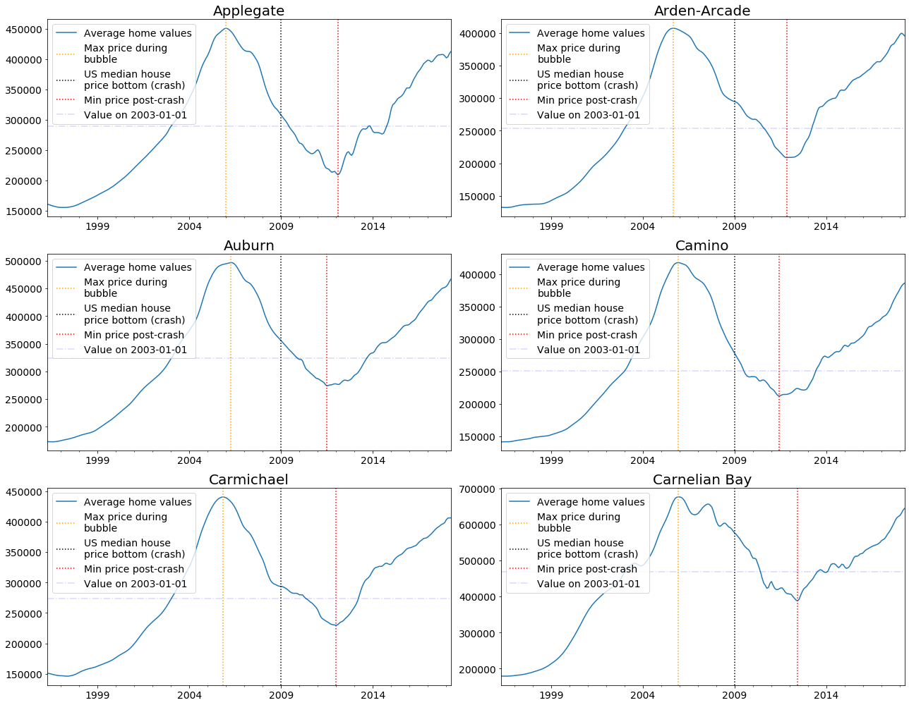


```python
plot_ts_cities(df_sac_cities, sac_metro_cities[6:12], nrows = 3, ncols = 2, figsize=(18,14), col='value', legend=True);
```


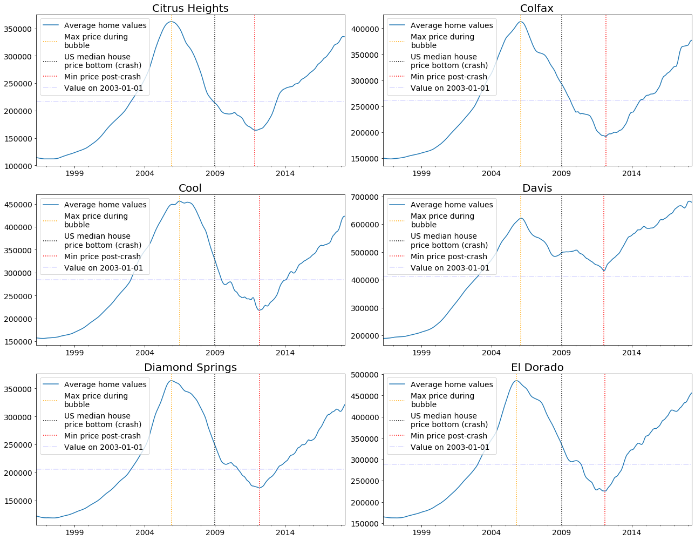


```python
plot_ts_cities(df_sac_cities, sac_metro_cities[12:18], nrows = 3, ncols = 2, figsize=(18,14), col='value', legend=True);

```


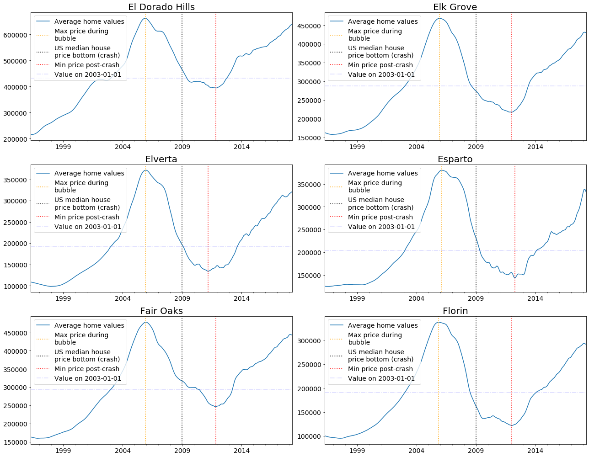


```python
plot_ts_cities(df_sac_cities, sac_metro_cities[18:24], nrows = 3, ncols = 2, figsize=(16,14), col='value', legend=True)
```


    (<Figure size 1152x1008 with 6 Axes>,
     <matplotlib.axes._subplots.AxesSubplot at 0x1c8c6924a8>)


```python
plot_ts_cities(df_sac_cities, sac_metro_cities[24:30], nrows = 3, ncols = 2, figsize=(16,14), col='value', legend=True)
```


    (<Figure size 1152x1008 with 6 Axes>,
     <matplotlib.axes._subplots.AxesSubplot at 0x1c8be346a0>)


```python
plot_ts_cities(df_sac_cities, sac_metro_cities[30:36], nrows = 3, ncols = 2, figsize=(16,14), col='value', legend=True)
```


    (<Figure size 1152x1008 with 6 Axes>,
     <matplotlib.axes._subplots.AxesSubplot at 0x1c8de3bc18>)


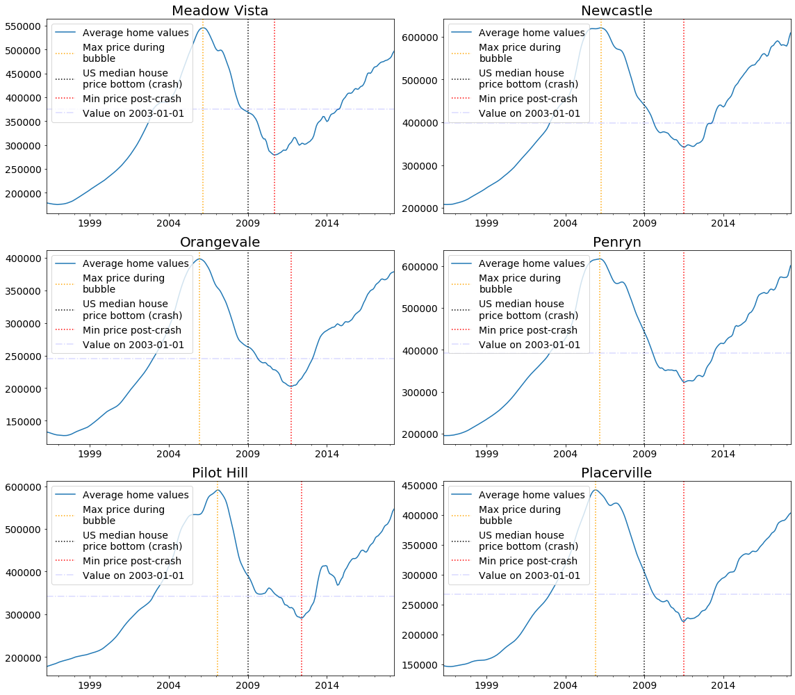


```python
plot_ts_cities(df_sac_cities, sac_metro_cities[36:42], nrows = 3, ncols = 2, figsize=(16,14), col='value', legend=True)
```


    (<Figure size 1152x1008 with 6 Axes>,
     <matplotlib.axes._subplots.AxesSubplot at 0x1c6bcec748>)


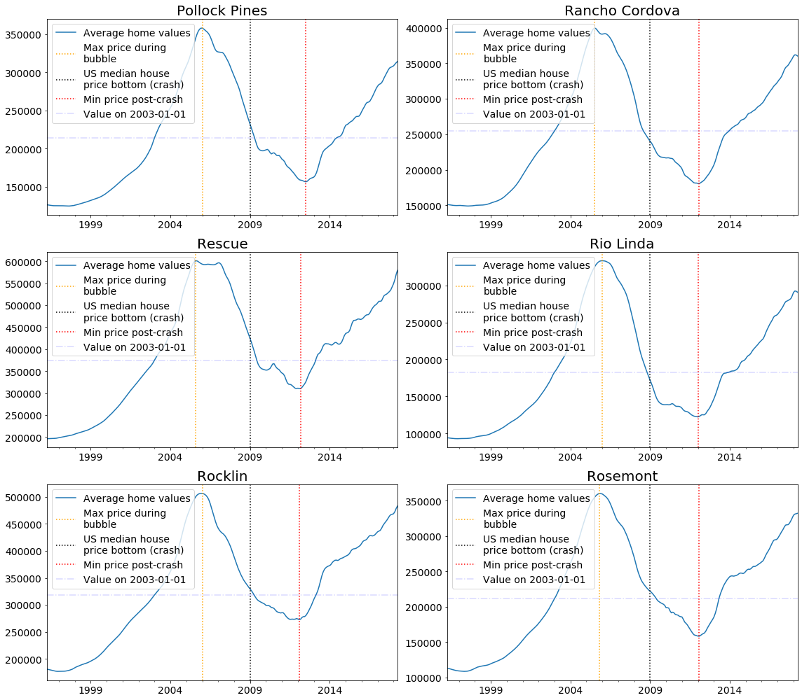


```python
plot_ts_cities(df_sac_cities, sac_metro_cities[42:48], nrows = 3, ncols = 2, figsize=(16,14), col='value', legend=True)
```


    (<Figure size 1152x1008 with 6 Axes>,
     <matplotlib.axes._subplots.AxesSubplot at 0x1c6beea400>)


```python
plot_ts_cities(df_sac_cities, sac_metro_cities[48:54], nrows = 3, ncols = 2, figsize=(16,14), col='value', legend=True)
```


    (<Figure size 1152x1008 with 6 Axes>,
     <matplotlib.axes._subplots.AxesSubplot at 0x1c56bb5d68>)


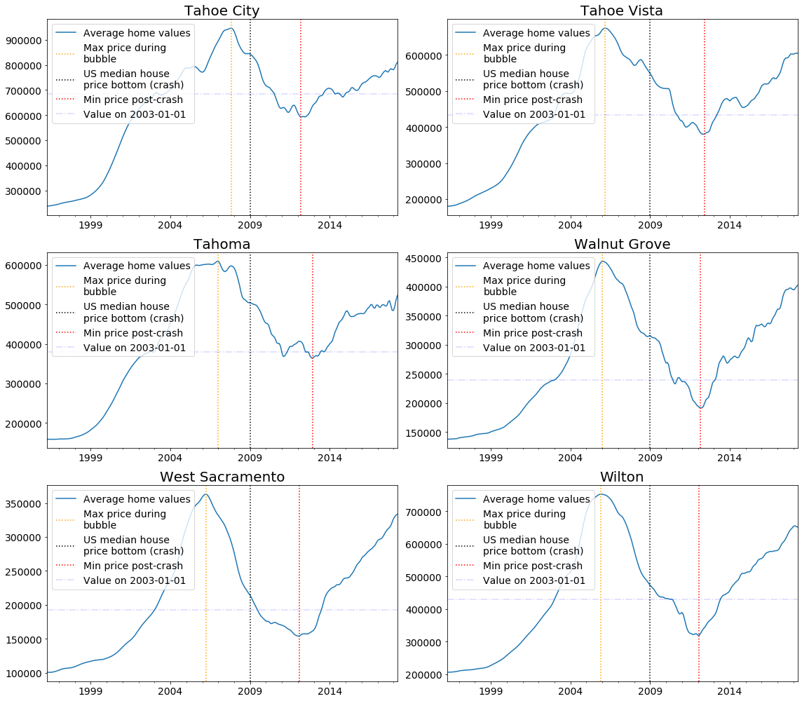


```python
plot_ts_cities(df_sac_cities, sac_metro_cities[54:56], nrows = 3, ncols = 2, figsize=(16,14), col='value', legend=True)
```


    (<Figure size 1152x1008 with 2 Axes>,
     <matplotlib.axes._subplots.AxesSubplot at 0x1c52b7d198>)


### Plots of zip codes within City of Sacramento


```python
df_sacto_city_zips = df_sac.loc[df_sac['City'] == 'Sacramento']
df_sacto_city_zips.head()
```


<div>
<style scoped>
    .dataframe tbody tr th:only-of-type {
        vertical-align: middle;
    }

    .dataframe tbody tr th {
        vertical-align: top;
    }

    .dataframe thead th {
        text-align: right;
    }
</style>
<table border="1" class="dataframe">
  <thead>
    <tr style="text-align: right;">
      <th></th>
      <th>Metro</th>
      <th>MetroState</th>
      <th>CountyName</th>
      <th>City</th>
      <th>Zip</th>
      <th>value</th>
    </tr>
    <tr>
      <th>time</th>
      <th></th>
      <th></th>
      <th></th>
      <th></th>
      <th></th>
      <th></th>
    </tr>
  </thead>
  <tbody>
    <tr>
      <td>1996-04-01</td>
      <td>Sacramento</td>
      <td>Sacramento CA</td>
      <td>Sacramento</td>
      <td>Sacramento</td>
      <td>95660</td>
      <td>73200.0</td>
    </tr>
    <tr>
      <td>1996-05-01</td>
      <td>Sacramento</td>
      <td>Sacramento CA</td>
      <td>Sacramento</td>
      <td>Sacramento</td>
      <td>95660</td>
      <td>72500.0</td>
    </tr>
    <tr>
      <td>1996-06-01</td>
      <td>Sacramento</td>
      <td>Sacramento CA</td>
      <td>Sacramento</td>
      <td>Sacramento</td>
      <td>95660</td>
      <td>71900.0</td>
    </tr>
    <tr>
      <td>1996-07-01</td>
      <td>Sacramento</td>
      <td>Sacramento CA</td>
      <td>Sacramento</td>
      <td>Sacramento</td>
      <td>95660</td>
      <td>71300.0</td>
    </tr>
    <tr>
      <td>1996-08-01</td>
      <td>Sacramento</td>
      <td>Sacramento CA</td>
      <td>Sacramento</td>
      <td>Sacramento</td>
      <td>95660</td>
      <td>70700.0</td>
    </tr>
  </tbody>
</table>
</div>


```python
df_sacto_city_zips['Zip'].value_counts()
```


    95842    265
    95824    265
    95832    265
    95841    265
    95819    265
    95834    265
    95811    265
    95829    265
    95660    265
    95835    265
    95823    265
    95843    265
    95816    265
    95838    265
    95818    265
    95817    265
    95822    265
    95831    265
    95820    265
    95833    265
    95815     58
    Name: Zip, dtype: int64


```python
sacto_zips = list(set(df_sacto_city_zips['Zip']))
len(sacto_zips)
```


    21


```python
ts = df_sacto_city_zips['value'].loc[df_sacto_city_zips['Zip'] == '95823']
ts.head()
```


    time
    1996-04-01    91500.0
    1996-05-01    90800.0
    1996-06-01    90000.0
    1996-07-01    89200.0
    1996-08-01    88400.0
    Name: value, dtype: float64


```python
fig, ax = plot_ts_zips(df_sac, sacto_zips, nrows=11, ncols=2, figsize=(18, 50), legend=True);

```


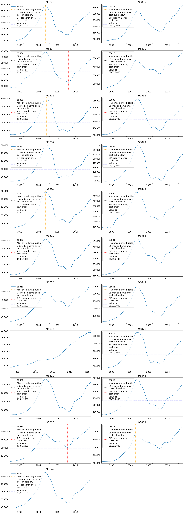


### Plotting cities and zip codes within Sacramento Metro area 


```python
fig, ax = plot_ts_zips_by_city(df_sac, dict_sac_zips_cities, figsize=(18, 120), nrows=30, ncols=2, legend=False);

```


### Plotting cities 6 at a time (for use in presentation)


```python
fig, ax = plot_ts_zips_by_city(df_sac, dict_0_6, figsize=(18, 16), nrows=3, ncols=2, legend=True);
```


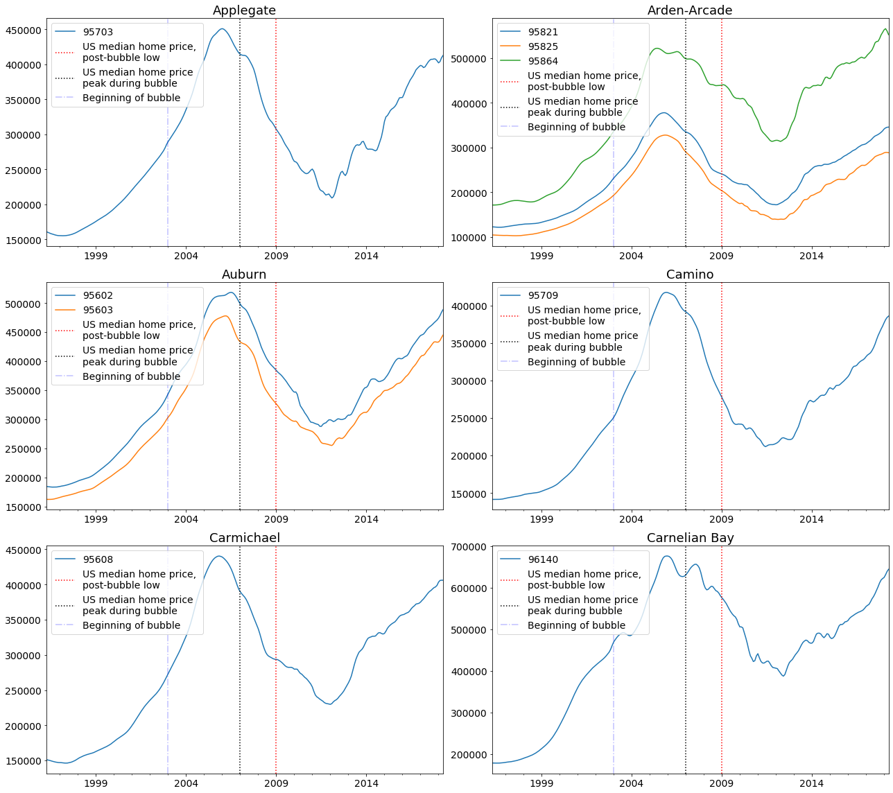


```python
fig, ax = plot_ts_zips_by_city(df_sac, dict_6_12, figsize=(18, 16), nrows=3, ncols=2, legend=True);
```


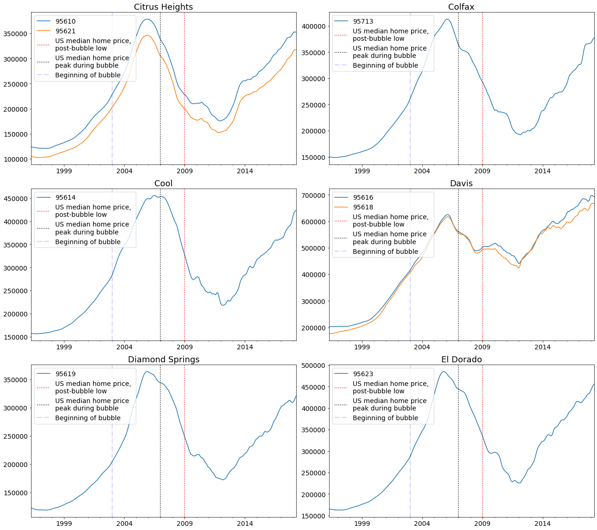


```python
fig, ax = plot_ts_zips_by_city(df_sac, dict_12_18, figsize=(18, 16), nrows=3, ncols=2, legend=True);
```


```python
fig, ax = plot_ts_zips_by_city(df_sac, dict_18_24, figsize=(18, 16), nrows=3, ncols=2, legend=True);
```


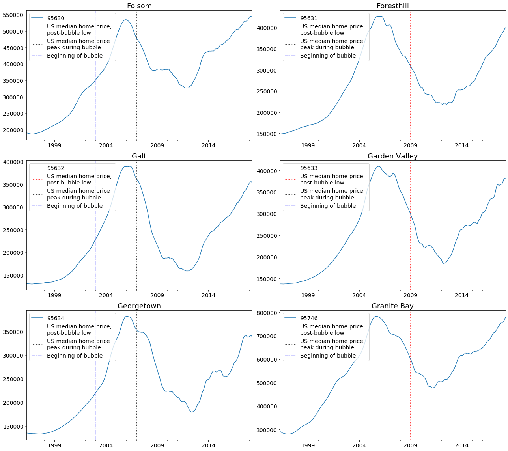


```python
fig, ax = plot_ts_zips_by_city(df_sac, dict_24_30, figsize=(18, 16), nrows=3, ncols=2, legend=True);
```


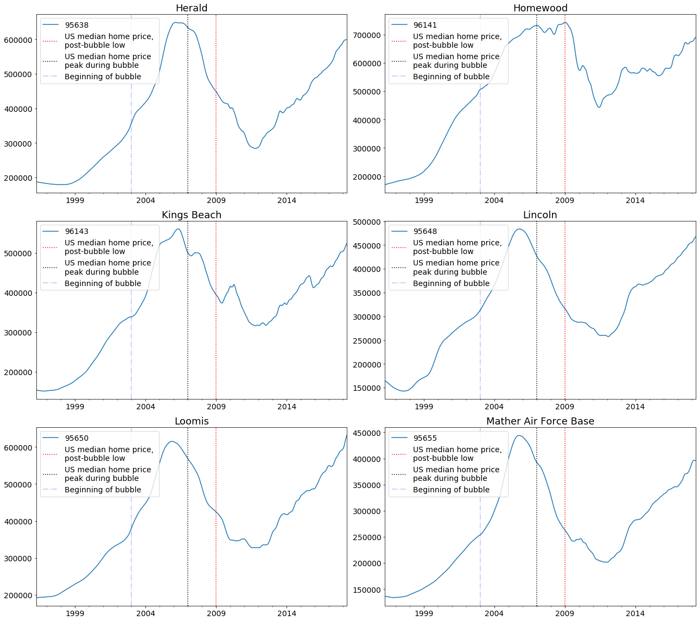


```python
fig, ax = plot_ts_zips_by_city(df_sac, dict_30_36, figsize=(18, 16), nrows=3, ncols=2, legend=True);
```


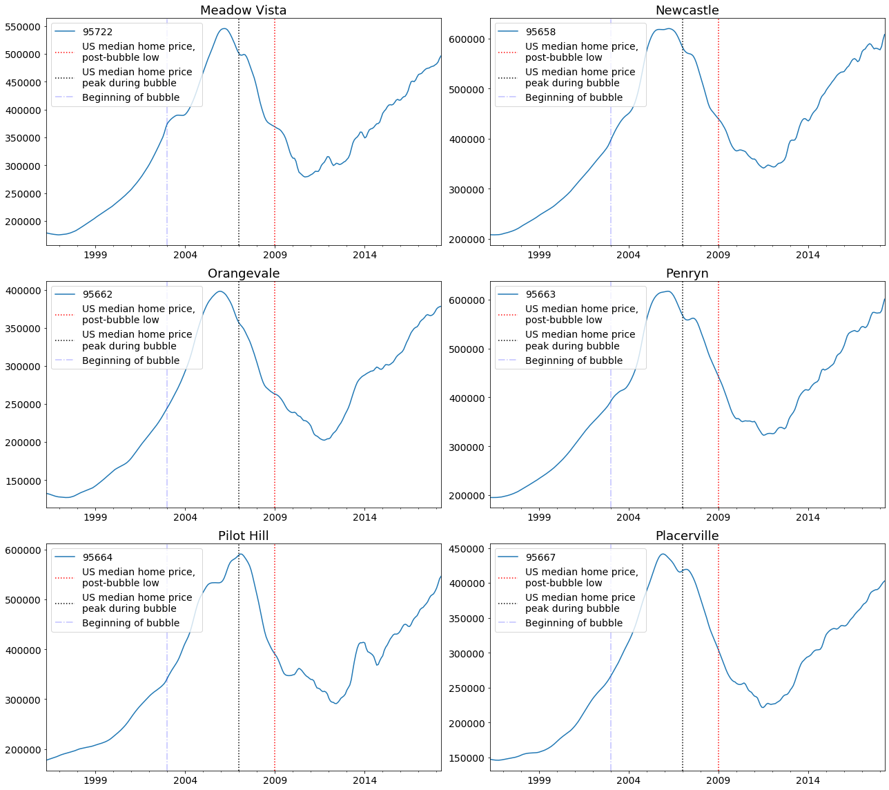


```python
fig, ax = plot_ts_zips_by_city(df_sac, dict_36_42, figsize=(18, 16), nrows=3, ncols=2, legend=True);
```


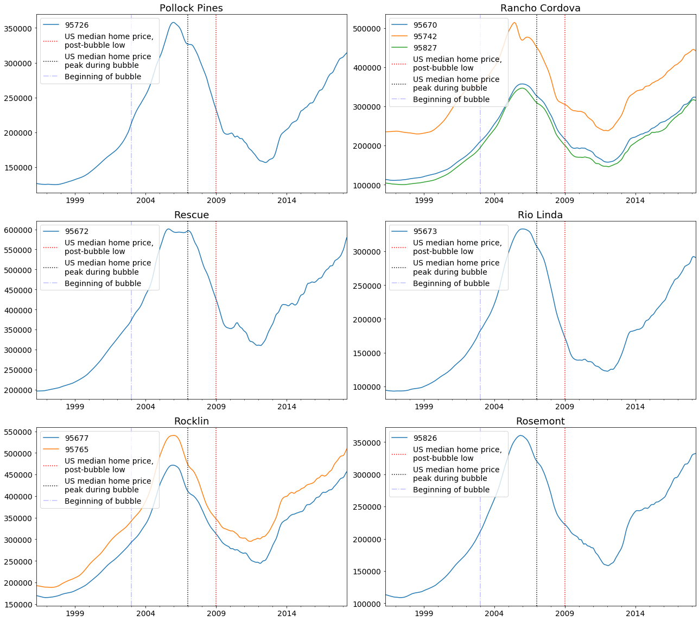


```python
fig, ax = plot_ts_zips_by_city(df_sac, dict_42_48, figsize=(18, 16), nrows=3, ncols=2, legend=False);
```


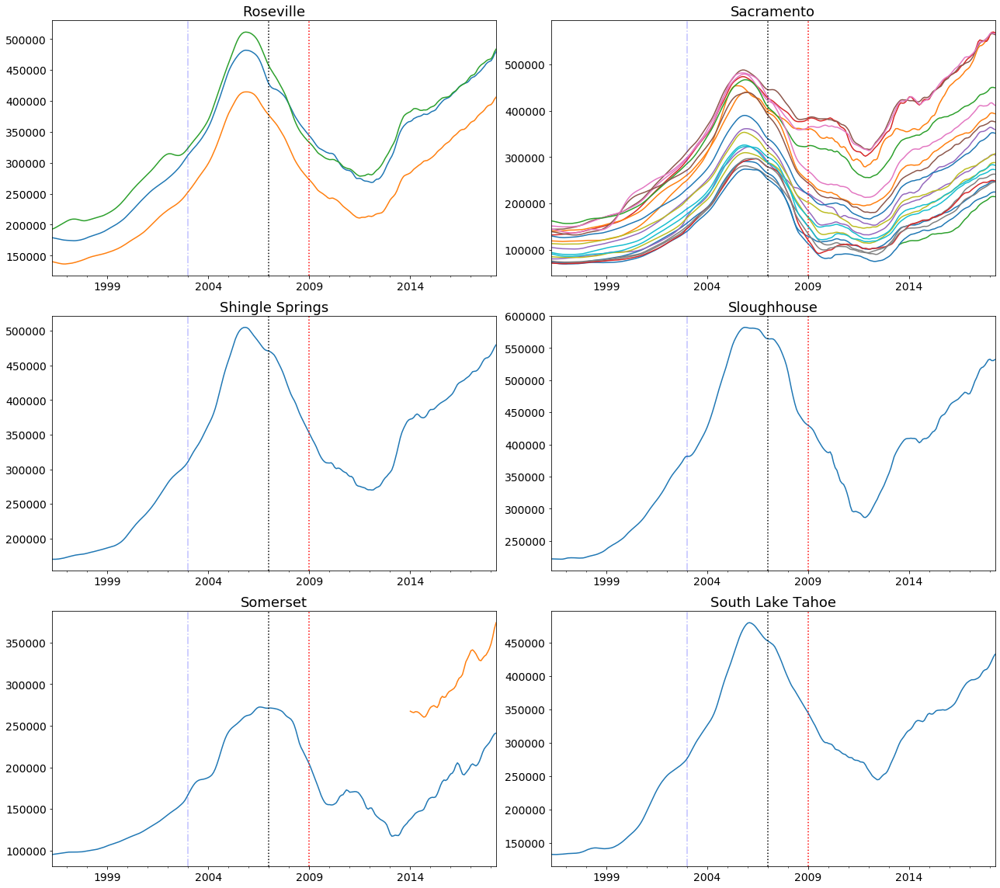


```python
fig, ax = plot_ts_zips_by_city(df_sac, dict_48_54, figsize=(18, 16), nrows=3, ncols=2, legend=True);
```


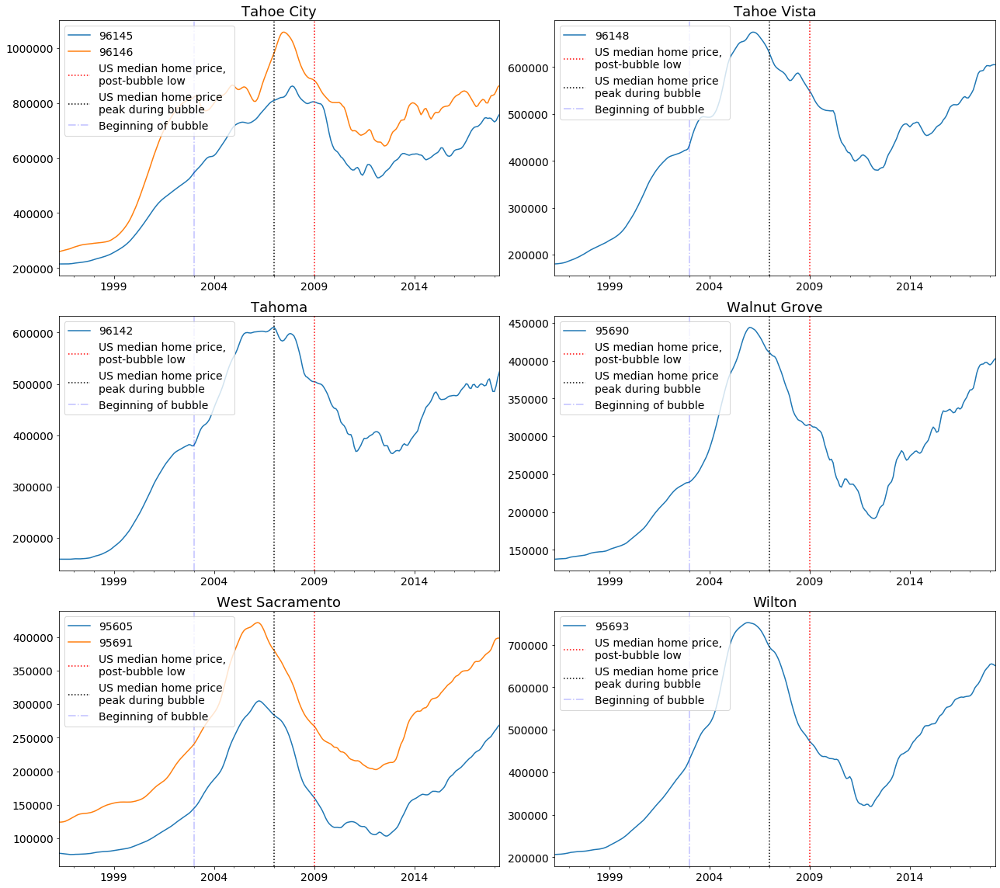


```python
fig, ax = plot_ts_zips_by_city(df_sac, dict_54_56, figsize=(18, 16), nrows=3, ncols=2, legend=True);
```


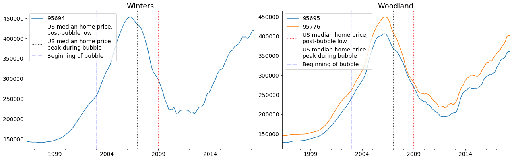


### Plotting boxplots for each city in Sacto Metro region


```python
metro_cities_boxplot(df_sac, sac_metro_cities, nrows=10, ncols=6, figsize=(18, 40))

```


### Plotting boxplots for each zip in Sacramento metro region


```python
metro_zips_boxplot(df_sac, sac_metro_zips, nrows = 12, ncols=8, figsize=(18, 60))

```


```python
metro_cities_zips_boxplot(df_sac, dict_sac_zips_cities, nrows=14, ncols=6, figsize=(18, 50))

```


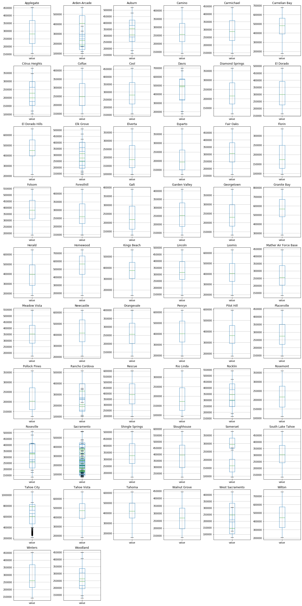


```python
df_sac_city = df_sac.loc[df_sac['City'] == 'Sacramento']

df_sac_city.head()
```


<div>
<style scoped>
    .dataframe tbody tr th:only-of-type {
        vertical-align: middle;
    }

    .dataframe tbody tr th {
        vertical-align: top;
    }

    .dataframe thead th {
        text-align: right;
    }
</style>
<table border="1" class="dataframe">
  <thead>
    <tr style="text-align: right;">
      <th></th>
      <th>Metro</th>
      <th>MetroState</th>
      <th>CountyName</th>
      <th>City</th>
      <th>Zip</th>
      <th>value</th>
    </tr>
    <tr>
      <th>time</th>
      <th></th>
      <th></th>
      <th></th>
      <th></th>
      <th></th>
      <th></th>
    </tr>
  </thead>
  <tbody>
    <tr>
      <td>1996-04-01</td>
      <td>Sacramento</td>
      <td>Sacramento CA</td>
      <td>Sacramento</td>
      <td>Sacramento</td>
      <td>95660</td>
      <td>73200.0</td>
    </tr>
    <tr>
      <td>1996-05-01</td>
      <td>Sacramento</td>
      <td>Sacramento CA</td>
      <td>Sacramento</td>
      <td>Sacramento</td>
      <td>95660</td>
      <td>72500.0</td>
    </tr>
    <tr>
      <td>1996-06-01</td>
      <td>Sacramento</td>
      <td>Sacramento CA</td>
      <td>Sacramento</td>
      <td>Sacramento</td>
      <td>95660</td>
      <td>71900.0</td>
    </tr>
    <tr>
      <td>1996-07-01</td>
      <td>Sacramento</td>
      <td>Sacramento CA</td>
      <td>Sacramento</td>
      <td>Sacramento</td>
      <td>95660</td>
      <td>71300.0</td>
    </tr>
    <tr>
      <td>1996-08-01</td>
      <td>Sacramento</td>
      <td>Sacramento CA</td>
      <td>Sacramento</td>
      <td>Sacramento</td>
      <td>95660</td>
      <td>70700.0</td>
    </tr>
  </tbody>
</table>
</div>


```python
sacto_zips = list(set(df_sac_city['Zip']))
len(sacto_zips)

```


    21


```python
df_sac_city.boxplot(by='Zip', column = 'value', figsize=(16, 6))

```


    <matplotlib.axes._subplots.AxesSubplot at 0x1c8be19208>


### Violin plot for Sacramento city zip codes


```python
import seaborn as sns

```


```python
fig = plt.figure()
fig.set_size_inches(16, 6)
sns.violinplot(x='Zip', y='value', data=data, scale="width", inner="quartile", set_size_inches=(16,6))
```


    <matplotlib.axes._subplots.AxesSubplot at 0x1c78dc3198>


```python
# got figure size  modification example from https://exceptionshub.com/how-do-i-change-the-figure-size-for-a-seaborn-plot.html

# fig, ax = plt.subplots()
# fig.set_size_inches(16, 6)
# sns.violinplot(x="Zip", y="value", data=df_44, scale="count", inner="stick", ax=ax)

import seaborn as sns

fig, ax = plt.subplots()
fig.set_size_inches(16, 6)
sns.violinplot(x="Zip", y="value", data=df_sac_city, scale="width", inner="quartile", ax=ax);
```


```python
# got figure size  modification example from https://exceptionshub.com/how-do-i-change-the-figure-size-for-a-seaborn-plot.html

# fig, ax = plt.subplots()
# fig.set_size_inches(16, 6)
# sns.violinplot(x="Zip", y="value", data=df_44, scale="count", inner="stick", ax=ax)

def violin_plt(x='Zip', y='value', data=data, scale="width", inner="quartile", set_size_inches=(16, 6), ax=ax):
    
    '''Plots zip codes within a city on one violin plot.  Set defaults to x='Zip', y='value', 
    data=df_sac_city, scale="width", inner="quartile", set_size_inches=(16, 6), ax=ax)
    '''
    
#     import seaborn as sns
    
    fig, ax = plt.subplots()
    fig.set_size_inches(set_size_inches)
    sns.violinplot(x, y, data, scale, inner, ax)
    
    
```


```python
violin_plt(x='Zip', y='value', data=data, scale="width", inner="quartile")
```


    ---------------------------------------------------------------------------

    AttributeError                            Traceback (most recent call last)

    <ipython-input-1494-3320690a8e1c> in <module>
    ----> 1 violin_plt(x='Zip', y='value', data=data, scale="width", inner="quartile")
    

    <ipython-input-1493-4b50be89040b> in violin_plt(x, y, data, scale, inner)
          8     fig = plt.figure()
          9     fig.set_size_inches(16, 6)
    ---> 10     sns.violinplot(x, y, data, scale, inner)
         11 
         12 


    /opt/anaconda3/envs/learn-env/lib/python3.6/site-packages/seaborn/categorical.py in violinplot(x, y, hue, data, order, hue_order, bw, cut, scale, scale_hue, gridsize, width, inner, split, dodge, orient, linewidth, color, palette, saturation, ax, **kwargs)
       2385                              bw, cut, scale, scale_hue, gridsize,
       2386                              width, inner, split, dodge, orient, linewidth,
    -> 2387                              color, palette, saturation)
       2388 
       2389     if ax is None:


    /opt/anaconda3/envs/learn-env/lib/python3.6/site-packages/seaborn/categorical.py in __init__(self, x, y, hue, data, order, hue_order, bw, cut, scale, scale_hue, gridsize, width, inner, split, dodge, orient, linewidth, color, palette, saturation)
        560                  color, palette, saturation):
        561 
    --> 562         self.establish_variables(x, y, hue, data, orient, order, hue_order)
        563         self.establish_colors(color, palette, saturation)
        564         self.estimate_densities(bw, cut, scale, scale_hue, gridsize)


    /opt/anaconda3/envs/learn-env/lib/python3.6/site-packages/seaborn/categorical.py in establish_variables(self, x, y, hue, data, orient, order, hue_order, units)
        144             # See if we need to get variables from `data`
        145             if data is not None:
    --> 146                 x = data.get(x, x)
        147                 y = data.get(y, y)
        148                 hue = data.get(hue, hue)


    AttributeError: 'str' object has no attribute 'get'


    <Figure size 1152x432 with 0 Axes>


```python
df_sac_city_1996_1999 = df_sac_city.loc['1996-04-01':'1999-12-01']
df_sac_city_1996_1999.tail()
```


<div>
<style scoped>
    .dataframe tbody tr th:only-of-type {
        vertical-align: middle;
    }

    .dataframe tbody tr th {
        vertical-align: top;
    }

    .dataframe thead th {
        text-align: right;
    }
</style>
<table border="1" class="dataframe">
  <thead>
    <tr style="text-align: right;">
      <th></th>
      <th>Metro</th>
      <th>MetroState</th>
      <th>CountyName</th>
      <th>City</th>
      <th>Zip</th>
      <th>value</th>
    </tr>
    <tr>
      <th>time</th>
      <th></th>
      <th></th>
      <th></th>
      <th></th>
      <th></th>
      <th></th>
    </tr>
  </thead>
  <tbody>
    <tr>
      <td>1999-08-01</td>
      <td>Sacramento</td>
      <td>Sacramento CA</td>
      <td>Sacramento</td>
      <td>Sacramento</td>
      <td>95843</td>
      <td>146400.0</td>
    </tr>
    <tr>
      <td>1999-09-01</td>
      <td>Sacramento</td>
      <td>Sacramento CA</td>
      <td>Sacramento</td>
      <td>Sacramento</td>
      <td>95843</td>
      <td>147600.0</td>
    </tr>
    <tr>
      <td>1999-10-01</td>
      <td>Sacramento</td>
      <td>Sacramento CA</td>
      <td>Sacramento</td>
      <td>Sacramento</td>
      <td>95843</td>
      <td>149000.0</td>
    </tr>
    <tr>
      <td>1999-11-01</td>
      <td>Sacramento</td>
      <td>Sacramento CA</td>
      <td>Sacramento</td>
      <td>Sacramento</td>
      <td>95843</td>
      <td>150300.0</td>
    </tr>
    <tr>
      <td>1999-12-01</td>
      <td>Sacramento</td>
      <td>Sacramento CA</td>
      <td>Sacramento</td>
      <td>Sacramento</td>
      <td>95843</td>
      <td>151800.0</td>
    </tr>
  </tbody>
</table>
</div>


```python
fig, ax = plt.subplots()
fig.set_size_inches(16, 6)
sns.violinplot(x="Zip", y="value", data=df_sac_city_1996_1999, scale="width", inner="quartile", ax=ax)
```


    <matplotlib.axes._subplots.AxesSubplot at 0x1c8f067898>


```python
df_sac_city_2000_2003 = df_sac_city.loc['2000-01-01':'2003-12-01']
df_sac_city_2000_2003.head()
```


<div>
<style scoped>
    .dataframe tbody tr th:only-of-type {
        vertical-align: middle;
    }

    .dataframe tbody tr th {
        vertical-align: top;
    }

    .dataframe thead th {
        text-align: right;
    }
</style>
<table border="1" class="dataframe">
  <thead>
    <tr style="text-align: right;">
      <th></th>
      <th>Metro</th>
      <th>MetroState</th>
      <th>CountyName</th>
      <th>City</th>
      <th>Zip</th>
      <th>value</th>
    </tr>
    <tr>
      <th>time</th>
      <th></th>
      <th></th>
      <th></th>
      <th></th>
      <th></th>
      <th></th>
    </tr>
  </thead>
  <tbody>
    <tr>
      <td>2000-01-01</td>
      <td>Sacramento</td>
      <td>Sacramento CA</td>
      <td>Sacramento</td>
      <td>Sacramento</td>
      <td>95660</td>
      <td>89100.0</td>
    </tr>
    <tr>
      <td>2000-02-01</td>
      <td>Sacramento</td>
      <td>Sacramento CA</td>
      <td>Sacramento</td>
      <td>Sacramento</td>
      <td>95660</td>
      <td>90100.0</td>
    </tr>
    <tr>
      <td>2000-03-01</td>
      <td>Sacramento</td>
      <td>Sacramento CA</td>
      <td>Sacramento</td>
      <td>Sacramento</td>
      <td>95660</td>
      <td>91200.0</td>
    </tr>
    <tr>
      <td>2000-04-01</td>
      <td>Sacramento</td>
      <td>Sacramento CA</td>
      <td>Sacramento</td>
      <td>Sacramento</td>
      <td>95660</td>
      <td>92200.0</td>
    </tr>
    <tr>
      <td>2000-05-01</td>
      <td>Sacramento</td>
      <td>Sacramento CA</td>
      <td>Sacramento</td>
      <td>Sacramento</td>
      <td>95660</td>
      <td>93300.0</td>
    </tr>
  </tbody>
</table>
</div>


```python
fig, ax = plt.subplots()
fig.set_size_inches(16, 6)
sns.violinplot(x="Zip", y="value", data=df_sac_city_2000_2003, scale="width", inner="quartile", ax=ax)
```


    <matplotlib.axes._subplots.AxesSubplot at 0x1c844bc940>


```python
df_sac_city_2004_2006 = df_sac_city.loc['2004-01-01':'2006-12-01']
df_sac_city_2004_2006.head()
```


<div>
<style scoped>
    .dataframe tbody tr th:only-of-type {
        vertical-align: middle;
    }

    .dataframe tbody tr th {
        vertical-align: top;
    }

    .dataframe thead th {
        text-align: right;
    }
</style>
<table border="1" class="dataframe">
  <thead>
    <tr style="text-align: right;">
      <th></th>
      <th>Metro</th>
      <th>MetroState</th>
      <th>CountyName</th>
      <th>City</th>
      <th>Zip</th>
      <th>value</th>
    </tr>
    <tr>
      <th>time</th>
      <th></th>
      <th></th>
      <th></th>
      <th></th>
      <th></th>
      <th></th>
    </tr>
  </thead>
  <tbody>
    <tr>
      <td>2004-01-01</td>
      <td>Sacramento</td>
      <td>Sacramento CA</td>
      <td>Sacramento</td>
      <td>Sacramento</td>
      <td>95660</td>
      <td>191900.0</td>
    </tr>
    <tr>
      <td>2004-02-01</td>
      <td>Sacramento</td>
      <td>Sacramento CA</td>
      <td>Sacramento</td>
      <td>Sacramento</td>
      <td>95660</td>
      <td>195700.0</td>
    </tr>
    <tr>
      <td>2004-03-01</td>
      <td>Sacramento</td>
      <td>Sacramento CA</td>
      <td>Sacramento</td>
      <td>Sacramento</td>
      <td>95660</td>
      <td>200200.0</td>
    </tr>
    <tr>
      <td>2004-04-01</td>
      <td>Sacramento</td>
      <td>Sacramento CA</td>
      <td>Sacramento</td>
      <td>Sacramento</td>
      <td>95660</td>
      <td>205300.0</td>
    </tr>
    <tr>
      <td>2004-05-01</td>
      <td>Sacramento</td>
      <td>Sacramento CA</td>
      <td>Sacramento</td>
      <td>Sacramento</td>
      <td>95660</td>
      <td>211100.0</td>
    </tr>
  </tbody>
</table>
</div>


```python
fig, ax = plt.subplots()
fig.set_size_inches(16, 6)
sns.violinplot(x="Zip", y="value", data=df_sac_city_2004_2006, scale="width", inner="quartile", ax=ax)
```


    <matplotlib.axes._subplots.AxesSubplot at 0x1c8e004748>


```python
df_sac_city_2007_2012 = df_sac_city.loc['2007-01-01':'2012-12-01']
df_sac_city_2007_2012.head()
```


<div>
<style scoped>
    .dataframe tbody tr th:only-of-type {
        vertical-align: middle;
    }

    .dataframe tbody tr th {
        vertical-align: top;
    }

    .dataframe thead th {
        text-align: right;
    }
</style>
<table border="1" class="dataframe">
  <thead>
    <tr style="text-align: right;">
      <th></th>
      <th>Metro</th>
      <th>MetroState</th>
      <th>CountyName</th>
      <th>City</th>
      <th>Zip</th>
      <th>value</th>
    </tr>
    <tr>
      <th>time</th>
      <th></th>
      <th></th>
      <th></th>
      <th></th>
      <th></th>
      <th></th>
    </tr>
  </thead>
  <tbody>
    <tr>
      <td>2007-01-01</td>
      <td>Sacramento</td>
      <td>Sacramento CA</td>
      <td>Sacramento</td>
      <td>Sacramento</td>
      <td>95660</td>
      <td>264800.0</td>
    </tr>
    <tr>
      <td>2007-02-01</td>
      <td>Sacramento</td>
      <td>Sacramento CA</td>
      <td>Sacramento</td>
      <td>Sacramento</td>
      <td>95660</td>
      <td>263000.0</td>
    </tr>
    <tr>
      <td>2007-03-01</td>
      <td>Sacramento</td>
      <td>Sacramento CA</td>
      <td>Sacramento</td>
      <td>Sacramento</td>
      <td>95660</td>
      <td>261000.0</td>
    </tr>
    <tr>
      <td>2007-04-01</td>
      <td>Sacramento</td>
      <td>Sacramento CA</td>
      <td>Sacramento</td>
      <td>Sacramento</td>
      <td>95660</td>
      <td>258400.0</td>
    </tr>
    <tr>
      <td>2007-05-01</td>
      <td>Sacramento</td>
      <td>Sacramento CA</td>
      <td>Sacramento</td>
      <td>Sacramento</td>
      <td>95660</td>
      <td>254800.0</td>
    </tr>
  </tbody>
</table>
</div>


```python
fig, ax = plt.subplots()
fig.set_size_inches(16, 6)
sns.violinplot(x="Zip", y="value", data=df_sac_city_2007_2012, scale="width", inner="quartile", ax=ax)
```


    <matplotlib.axes._subplots.AxesSubplot at 0x1c85e44080>


```python
df_sac_city_2013_2018 = df_sac_city.loc['2013-01-01':'2018']
df_sac_city_2013_2018.tail()
```


<div>
<style scoped>
    .dataframe tbody tr th:only-of-type {
        vertical-align: middle;
    }

    .dataframe tbody tr th {
        vertical-align: top;
    }

    .dataframe thead th {
        text-align: right;
    }
</style>
<table border="1" class="dataframe">
  <thead>
    <tr style="text-align: right;">
      <th></th>
      <th>Metro</th>
      <th>MetroState</th>
      <th>CountyName</th>
      <th>City</th>
      <th>Zip</th>
      <th>value</th>
    </tr>
    <tr>
      <th>time</th>
      <th></th>
      <th></th>
      <th></th>
      <th></th>
      <th></th>
      <th></th>
    </tr>
  </thead>
  <tbody>
    <tr>
      <td>2017-12-01</td>
      <td>Sacramento</td>
      <td>Sacramento CA</td>
      <td>Sacramento</td>
      <td>Sacramento</td>
      <td>95843</td>
      <td>345600.0</td>
    </tr>
    <tr>
      <td>2018-01-01</td>
      <td>Sacramento</td>
      <td>Sacramento CA</td>
      <td>Sacramento</td>
      <td>Sacramento</td>
      <td>95843</td>
      <td>350100.0</td>
    </tr>
    <tr>
      <td>2018-02-01</td>
      <td>Sacramento</td>
      <td>Sacramento CA</td>
      <td>Sacramento</td>
      <td>Sacramento</td>
      <td>95843</td>
      <td>352500.0</td>
    </tr>
    <tr>
      <td>2018-03-01</td>
      <td>Sacramento</td>
      <td>Sacramento CA</td>
      <td>Sacramento</td>
      <td>Sacramento</td>
      <td>95843</td>
      <td>352400.0</td>
    </tr>
    <tr>
      <td>2018-04-01</td>
      <td>Sacramento</td>
      <td>Sacramento CA</td>
      <td>Sacramento</td>
      <td>Sacramento</td>
      <td>95843</td>
      <td>351400.0</td>
    </tr>
  </tbody>
</table>
</div>


```python
fig, ax = plt.subplots()
fig.set_size_inches(16, 6)
sns.violinplot(x="Zip", y="value", data=df_sac_city_2013_2018, scale="width", inner="quartile", ax=ax)
```


    <matplotlib.axes._subplots.AxesSubplot at 0x1c84979fd0>


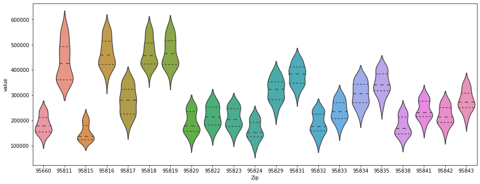


# Step 4:  Parameter tuning

## Setting up functions for running ARIMA models


```python
import warnings
from statsmodels.tsa.arima_model import ARIMA
import statsmodels.api as sm
from sklearn.metrics import mean_squared_error

```

## Creating p, d, q, and m values for running ARIMA model


```python
# evaluate parameters
p_values = [0, 1, 2, 4, 6, 8, 10]
d_values = range(0, 3)
q_values = range(0, 3)
warnings.filterwarnings("ignore")

```

## Parameter fine-tuning function


```python
# add each order tuple and mse to lists to create a table of the results

# order_tuples = []
# mse_results = []

# evaluate an ARIMA model for a given order (p,d,q)
def evaluate_arima_model(X, arima_order):
    # prepare training dataset
    train_size = int(len(X) * 0.66)
    train, test = X[0:train_size], X[train_size:]
    history = [x for x in train]
    # make predictions
    predictions = list()
    for t in range(len(test)):
        model = ARIMA(history, order=arima_order)
        model_fit = model.fit(disp=0)
        yhat = model_fit.forecast()[0]
        predictions.append(yhat)
        history.append(test[t])
    # calculate out of sample error
    error = mean_squared_error(test, predictions)
    return error

def eval_params_and_lists(dataset, p_values, d_values, q_values):
    order_tuples = []
    mse_results = []
    dataset = dataset.astype('float32')
    best_score, best_cfg = float("inf"), None
    for p in p_values:
        for d in d_values:
            for q in q_values:
                order = (p,d,q)
                try:
                    mse = evaluate_arima_model(dataset, order)
                    order_tuples.append(order)
                    mse_results.append(mse)
                    if mse < best_score:
                        best_score, best_cfg = mse, order
                    print('ARIMA%s MSE=%.3f' % (order,mse))
                except:
                    continue
    print('Best ARIMA%s MSE=%.3f' % (best_cfg, best_score))
    return order_tuples, mse_results, best_cfg, best_score   # adding to Jeff's function; output will be taken into forecast function that follows


```


```python
# Original function from Jeff's Mod4 project starter notebook 

import warnings
from statsmodels.tsa.arima_model import ARIMA
from sklearn.metrics import mean_squared_error

# evaluate an ARIMA model for a given order (p,d,q)
def evaluate_arima_model(X, arima_order):
    # prepare training dataset
    train_size = int(len(X) * 0.66)
    train, test = X[0:train_size], X[train_size:]
    history = [x for x in train]
    # make predictions
    predictions = list()
    for t in range(len(test)):
        model = ARIMA(history, order=arima_order)
        model_fit = model.fit(disp=0)
        yhat = model_fit.forecast()[0]
        predictions.append(yhat)
        history.append(test[t])
    # calculate out of sample error
    error = mean_squared_error(test, predictions)
    return error

# evaluate combinations of p, d and q values for an ARIMA model
def evaluate_models(dataset, p_values, d_values, q_values):
    dataset = dataset.astype('float32')
    best_score, best_cfg = float("inf"), None
    for p in p_values:
        for d in d_values:
            for q in q_values:
                order = (p,d,q)
                try:
                    mse = evaluate_arima_model(dataset, order)
                    if mse < best_score:
                        best_score, best_cfg = mse, order
                    print('ARIMA%s MSE=%.3f' % (order,mse))
                except:
                    continue
    print('Best ARIMA%s MSE=%.3f' % (best_cfg, best_score))
    return best_cfg, best_score   # adding to Jeff's function; output will be taken into forecast function that follows


# evaluate parameters
p_values = [0, 1, 2, 4, 6, 8, 10]
d_values = range(0, 3)
q_values = range(0, 3)
warnings.filterwarnings("ignore")
# evaluate_models(df_kc_melt.values, p_values, d_values, q_values)
```

# Step 5: ARIMA modeling -- model fit, forecasting, and interpreting results

## Elements of ARIMA model fit, forecast, and summary


### Create ARIMA model and show summary results table


```python
# Define function

def arima_zipcode(ts, order):
    ts_value = ts.value
    model = ARIMA(ts_value, order)
    model_fit = model.fit(disp=0)
    print(model_fit.summary())
    return model_fit

# model_fit = arima_zipcode(ts_values, order = order)
```

### Create forecast model


```python
# Define function

def forecast(model_fit, months=24, confint=2):
    forecast = model_fit.forecast(months)
    actual_forecast = forecast[0]
    std_error = forecast[1]
    forecast_confint = forecast[confint]
    return actual_forecast, std_error, forecast_confint   

# actual_forecast, std_error, forecast_confint = forecast(model_fit)
```

### Create dataframe to hold these values and join to existing dataframe


```python
# Define function

def forecast_df(actual_forecast, forecast_confint, std_error, col = 'time', 
                daterange = pd.date_range(start='2018-05-01', end='2020-04-01', freq='MS')):
    df_forecast = pd.DataFrame({col: daterange})
    df_forecast['forecast'] = actual_forecast
    df_forecast['forecast_lower'] = forecast_confint[:, 0]
    df_forecast['forecast_upper'] = forecast_confint[:, 1]
    df_forecast['standard error'] = std_error
    df_forecast.set_index('time', inplace=True)
    return df_forecast

```

### Create df_new with historical and forecasted values


```python
def concat_values_forecast(ts, df_forecast):
    df_new = pd.concat([ts, df_forecast])
    df_new = df_new.rename(columns = {0: 'value'})
    return df_new
```

### Plot forecast results


```python
def plot_forecast(df_new, geog_area, figsize=(12,8), fontsize1=14, fontsize2=18):
    fig = plt.figure(figsize=figsize)
    plt.plot(df_new['value'], label='Raw Data')
    plt.plot(df_new['forecast'], label='Forecast')
    plt.fill_between(df_new.index, df_new['forecast_lower'], df_new['forecast_upper'], color='k', alpha = 0.2, 
                 label='Confidence Interval')
    plt.legend(loc = 'upper left', fontsize=fontsize1)
#     plt.xlabel(xlabel='year', fontsize=fontsize1)
#     plt.ylabel(ylabel='value', fontsize=fontsize1)
    plt.tick_params(axis='both', labelsize=fontsize1)
    plt.title(f'Forecast for {geog_area}', fontsize=fontsize2)

```

### Figure out percent change in home values


```python
def forecast_values(df_new, date = '2020-04-01'):
    forecasted_price = df_new.loc[date, 'forecast']
    forecasted_lower = df_new.loc[date, 'forecast_lower']
    forecasted_upper = df_new.loc[date, 'forecast_upper']    
    return forecasted_price, forecasted_lower, forecasted_upper

```

### Compute and print predicted, best, and worst case scenarios


```python
def pred_best_worst(pred, low, high, last):
    
    '''Prints out predicted, best-case, and worst-case scencarios from forecast'''
    
    pred_pct_change = (((pred - last) / last) * 100)
    print(f'By the model prediction, I would expect to see a {round(pred_pct_change, 3)}% change in price by April 1, 2020.')
    print(type(pred_pct_change))
    lower_pct_change = (((low - last) / last) * 100)
    print(f'At the lower bound of the confidence interval, I would expect to see a {round(lower_pct_change, 3)}% change in price by April 1, 2020.')
    print(type(lower_pct_change))
    upper_pct_change = (((high - last) / last) * 100)
    print(f'At the upper bound of the confidence interval, I would expect to see a {round(upper_pct_change, 3)}% change in price by April 1, 2020.')
    print(type(upper_pct_change))
    return round(pred_pct_change, 3), round(lower_pct_change, 3), round(upper_pct_change, 3)
        
```

## Functions to perform ARIMA modeling and display forecast results


```python
# Function to run parameter tuning, ARIMA model, and forecasts.  
# Appends lists set up to capture results for summary table.

p_values = [0, 1, 2, 4, 6, 8, 10]
d_values = range(0, 3)
q_values = range(0, 3)

def arima_forecast_run(ts, geog_area, city, county, p_values, d_values, q_values, confint=2):     # months = 24 by default
    
    '''This function attempts to combine the steps of the ARIMA process, starting with parameter fine tuning and
    going all the way through the steps following (ARIMA model fit, forecast, computing percentage changes 
    for each of the forecast values, plotting of historical values and projected values, and printing out 
    the forecasted results.  
    It also appends the lists set up to capture each model's output for a summary dataframe table.'''

    # evaluate parameters
    print(f'For {geog_area} ({city}):')
    p_values = [0, 1, 2, 4, 6, 8, 10]
    d_values = range(0, 3)
    q_values = range(0, 3)
    warnings.filterwarnings("ignore")
    
    order_tuples, mse_results, best_cfg, best_score = eval_params_and_lists(ts.value, p_values, d_values, q_values)     
    order = best_cfg
    
    print(f'Best ARIMA order = {order}')
    model_fit = arima_zipcode(ts, order)                                # returns model_fit
    actual_forecast, forecast_confint, std_error = forecast(model_fit)  # returns actual_forecast, forecast_confint, std_error
    df_forecast = forecast_df(actual_forecast, std_error, forecast_confint, col = 'time',     # returns df_forecast with future predictions
                              daterange = pd.date_range(start='2018-05-01', end='2020-04-01', freq='MS'))
    df_new = concat_values_forecast(ts, df_forecast)                    # concatenates historical and forecasted values into df_new
    plot_forecast(df_new, geog_area)                            # plots forecast with the label of geog_area
    forecasted_price, forecasted_lower, forecasted_upper = forecast_values(df_new, date = '2020-04-01')   # returns forecasted_price, forecasted_lower, forecasted_upper
    pred = forecasted_price
    low = forecasted_lower
    high = forecasted_upper
    last = df_new['value'].loc['2018-04-01']
    pred_pct_change = (((pred - last) / last) * 100)
    lower_pct_change = (((low - last) / last) * 100)
    upper_pct_change = (((high - last) / last) * 100)
       
    geog_areas.append(geog_area)
    cities.append(city)
    counties.append(county)
    orders.append(order)
    predicted_prices.append(round(forecasted_price, 2))
    lower_bound_prices.append(round(forecasted_lower, 2))
    upper_bound_prices.append(round(forecasted_upper, 2))
    last_values.append(last)
    pred_pct_changes.append(round(pred_pct_change, 2))
    lower_pct_changes.append(round(lower_pct_change, 2))
    upper_pct_changes.append(round(upper_pct_change, 2))
    
    print(f'By the model prediction, I would expect to see a {round(pred_pct_change, 3)}% change in price by April 1, 2020.')
    print(f'At the lower bound of the confidence interval, I would expect to see a {round(lower_pct_change, 3)}% change in price by April 1, 2020.')
    print(f'At the upper bound of the confidence interval, I would expect to see a {round(upper_pct_change, 3)}% change in price by April 1, 2020.')

    return order_tuples, mse_results, best_cfg, best_score, geog_areas, cities, counties, orders, predicted_prices, lower_bound_prices, upper_bound_prices, last_values, pred_pct_changes, lower_pct_changes, upper_pct_changes

```

### ARIMA modeling and forecast function -- don't run parameter optimization


```python
# Function that takes in pdq values and runs ARIMA model and forecasts.
# Appends lists set up to capture results for summary table.

def arima_forecast_enter_pdq(ts, geog_area, city, county, best_cfg, confint=2):     # months = 24 by default
    
    '''This function combines the steps of the ARIMA process, starting with ARIMA model fit, forecast 
    (predicted values, upper-bound values,and lower-bound values, determined by confidence intervals), 
    percentage changes for each of the forecast values over time, final values at the end of the 
    forecast period, plotting of historical values and projected values, and a printout of the forecasted 
    results.  It also appends the lists set up to capture each model's output for a summary dataframe table.'''
    
    # evaluate parameters
    print(f'For {geog_area} ({city}):')

    warnings.filterwarnings("ignore")
    order = best_cfg
    print(f'Best ARIMA order = {order}')
    model_fit = arima_zipcode(ts, order)                                # returns model_fit
    actual_forecast, forecast_confint, std_error = forecast(model_fit)  # returns actual_forecast, forecast_confint, std_error
    df_forecast = forecast_df(actual_forecast, std_error, forecast_confint, col = 'time',     # returns df_forecast with future predictions
                              daterange = pd.date_range(start='2018-05-01', end='2020-04-01', freq='MS'))
    df_new = concat_values_forecast(ts, df_forecast)                    # concatenates historical and forecasted values into df_new
    plot_forecast(df_new, geog_area)                            # plots forecast with the label of geog_area
    forecasted_price, forecasted_lower, forecasted_upper = forecast_values(df_new, date = '2020-04-01')   # returns forecasted_price, forecasted_lower, forecasted_upper
    pred = forecasted_price
    low = forecasted_lower
    high = forecasted_upper
    last = df_new['value'].loc['2018-04-01']
    pred_pct_change = (((pred - last) / last) * 100)
    lower_pct_change = (((low - last) / last) * 100)
    upper_pct_change = (((high - last) / last) * 100)
       
    geog_areas.append(geog_area)
    cities.append(city)
    counties.append(county)
    orders.append(order)
    predicted_prices.append(round(forecasted_price, 2))
    lower_bound_prices.append(round(forecasted_lower, 2))
    upper_bound_prices.append(round(forecasted_upper, 2))
    last_values.append(last)
    pred_pct_changes.append(round(pred_pct_change, 2))
    lower_pct_changes.append(round(lower_pct_change, 2))
    upper_pct_changes.append(round(upper_pct_change, 2))
    
    print(f'By the model prediction, I would expect to see a {round(pred_pct_change, 3)}% change in price by April 1, 2020.')
    print(f'At the lower bound of the confidence interval, I would expect to see a {round(lower_pct_change, 3)}% change in price by April 1, 2020.')
    print(f'At the upper bound of the confidence interval, I would expect to see a {round(upper_pct_change, 3)}% change in price by April 1, 2020.')

    return geog_areas, cities, counties, orders, predicted_prices, lower_bound_prices, upper_bound_prices, last_values, pred_pct_changes, lower_pct_changes, upper_pct_changes

```

### ARIMA modeling and forecast function -- don't append lists, don't run parameter optimization


```python
# Function that takes in pdq values and runs ARIMA model and forecasts.
# Does NOT append lists set up to capture results for summary table.

def arima_forecast_enter_pdq_no_listappend(ts, geog_area, city, county, best_cfg, confint=2):     # months = 24 by default
    
    '''This function combines the steps of the ARIMA process, starting with ARIMA model fit, forecast 
    (predicted values, upper-bound values,and lower-bound values, determined by confidence intervals), 
    percentage changes for each of the forecast values over time, final values at the end of the 
    forecast period, plotting of historical values and projected values, and a printout of the forecasted 
    results.  
    It does NOT append the lists set up to capture each model's output for a summary dataframe table.  It 
    provides a way to produce ARIMA model output again to check on the model when troubleshooting without
    appending results to the existing lists.'''

    
    # evaluate parameters
    print(f'For {geog_area} ({city}):')

    warnings.filterwarnings("ignore")
    order = best_cfg
    print(f'Best ARIMA order = {order}')
    model_fit = arima_zipcode(ts, order)                                # returns model_fit
    actual_forecast, forecast_confint, std_error = forecast(model_fit)  # returns actual_forecast, forecast_confint, std_error
    df_forecast = forecast_df(actual_forecast, std_error, forecast_confint, col = 'time',     # returns df_forecast with future predictions
                              daterange = pd.date_range(start='2018-05-01', end='2020-04-01', freq='MS'))
    df_new = concat_values_forecast(ts, df_forecast)                    # concatenates historical and forecasted values into df_new
    plot_forecast(df_new, geog_area)                            # plots forecast with the label of geog_area
    forecasted_price, forecasted_lower, forecasted_upper = forecast_values(df_new, date = '2020-04-01')   # returns forecasted_price, forecasted_lower, forecasted_upper
    pred = forecasted_price
    low = forecasted_lower
    high = forecasted_upper
    last = df_new['value'].loc['2018-04-01']
    pred_pct_change = (((pred - last) / last) * 100)
    lower_pct_change = (((low - last) / last) * 100)
    upper_pct_change = (((high - last) / last) * 100)
       
#     geog_areas.append(geog_area)
#     cities.append(city)
#     counties.append(county)
#     orders.append(order)
#     predicted_prices.append(round(forecasted_price, 2))
#     lower_bound_prices.append(round(forecasted_lower, 2))
#     upper_bound_prices.append(round(forecasted_upper, 2))
#     last_values.append(last)
#     pred_pct_changes.append(round(pred_pct_change, 2))
#     lower_pct_changes.append(round(lower_pct_change, 2))
#     upper_pct_changes.append(round(upper_pct_change, 2))
    
    print(f'By the model prediction, I would expect to see a {round(pred_pct_change, 3)}% change in price by April 1, 2020.')
    print(f'At the lower bound of the confidence interval, I would expect to see a {round(lower_pct_change, 3)}% change in price by April 1, 2020.')
    print(f'At the upper bound of the confidence interval, I would expect to see a {round(upper_pct_change, 3)}% change in price by April 1, 2020.')

#     return geog_areas, cities, counties, orders, predicted_prices, lower_bound_prices, upper_bound_prices, last_values, pred_pct_changes, lower_pct_changes, upper_pct_changes

```

### ARIMA modeling and forecast function -- on/off switch for parameter fine-tuning


```python
# Function to run parameter tuning, ARIMA model, and forecasts.  Features on/off switch for running parameter tuning (pdq).
# Unfortunately, this one throws an error when I set run_pdq=True

p_values = [0, 1, 2, 4, 6, 8, 10]
d_values = range(0, 3)
q_values = range(0, 3)

def arima_forecast(ts, geog_area, city, county, p_values, d_values, q_values, best_pdq, confint=2, run_pdq = False):     # months = 24 by default
    
    '''This function attempts to combine the steps of the ARIMA process, starting with parameter fine tuning and
    going all the way through the steps following (ARIMA model fit, forecast, computing percentage changes 
    for each of the forecast values, plotting of historical values and projected values, and printing out 
    the forecasted results.  
    It also appends the lists set up to capture each model's output for a summary dataframe table.
    (Unforunately, this function throws an error if run_pdq is set = True.)'''

    
    # evaluate parameters
    print(f'For {geog_area} ({city}):')
    p_values = [0, 1, 2, 4, 6, 8, 10]
    d_values = range(0, 3)
    q_values = range(0, 3)
    warnings.filterwarnings("ignore")
    
    if run_pdq:
        best_cfg, best_score = eval_arima_models(ts, p_values, d_values, q_values)     # returns order (variable best_cfg)
        order = best_cfg
    else:
        order = best_pdq
        
    print(f'Best ARIMA order = {order}')
    model_fit = arima_zipcode(ts, order)                                # returns model_fit
    actual_forecast, forecast_confint, std_error = forecast(model_fit)  # returns actual_forecast, forecast_confint, std_error
    df_forecast = forecast_df(actual_forecast, std_error, forecast_confint, col = 'time',     # returns df_forecast with future predictions
                              daterange = pd.date_range(start='2018-05-01', end='2020-04-01', freq='MS'))
    df_new = concat_values_forecast(ts, df_forecast)                    # concatenates historical and forecasted values into df_new
    plot_forecast(df_new, geog_area)                            # plots forecast with the label of geog_area
    forecasted_price, forecasted_lower, forecasted_upper = forecast_values(df_new, date = '2020-04-01')   # returns forecasted_price, forecasted_lower, forecasted_upper
    pred = forecasted_price
    low = forecasted_lower
    high = forecasted_upper
    last = df_new['value'].loc['2018-04-01']
    pred_pct_change = (((pred - last) / last) * 100)
    lower_pct_change = (((low - last) / last) * 100)
    upper_pct_change = (((high - last) / last) * 100)
       
    geog_areas.append(geog_area)
    cities.append(city)
    counties.append(county)
    orders.append(order)
    predicted_prices.append(round(forecasted_price, 2))
    lower_bound_prices.append(round(forecasted_lower, 2))
    upper_bound_prices.append(round(forecasted_upper, 2))
    last_values.append(last)
    pred_pct_changes.append(round(pred_pct_change, 2))
    lower_pct_changes.append(round(lower_pct_change, 2))
    upper_pct_changes.append(round(upper_pct_change, 2))
    
    print(f'By the model prediction, I would expect to see a {round(pred_pct_change, 3)}% change in price by April 1, 2020.')
    print(f'At the lower bound of the confidence interval, I would expect to see a {round(lower_pct_change, 3)}% change in price by April 1, 2020.')
    print(f'At the upper bound of the confidence interval, I would expect to see a {round(upper_pct_change, 3)}% change in price by April 1, 2020.')

    return geog_areas, cities, counties, orders, predicted_prices, lower_bound_prices, upper_bound_prices, last_values, pred_pct_changes, lower_pct_changes, upper_pct_changes

```

## Functions to store and show results


### Function to create empty lists for storing results


```python
#  Create empty lists to hold results (called by next function)

geog_areas = []
cities = []
counties = []
orders = []
predicted_prices = []
lower_bound_prices = [] 
upper_bound_prices = []
last_values = []
pred_pct_changes = []
lower_pct_changes = []
upper_pct_changes = []

```


```python
def create_empty_lists():
    geog_areas = []
    cities = []
    counties = []
    orders = []
    predicted_prices = []
    lower_bound_prices = [] 
    upper_bound_prices = []
    last_values = []
    pred_pct_changes = []
    lower_pct_changes = []
    upper_pct_changes = []
    return geog_areas, cities, counties, orders, predicted_prices, lower_bound_prices, upper_bound_prices, last_values, pred_pct_changes, lower_pct_changes, upper_pct_changes


create_empty_lists()                # only run this command if you want to empty all lists

# geog_areas, cities, orders, predicted_prices, lower_bound_prices, upper_bound_prices, last_values, pred_pct_changes, lower_pct_changes, upper_pct_changes = create_empty_lists()
# geog_areas, cities, orders, predicted_prices, lower_bound_prices, upper_bound_prices, last_values, pred_pct_changes, lower_pct_changes, upper_pct_changes
```


    ([], [], [], [], [], [], [], [], [], [], [])


### Function to print results lists


```python
#  prints all results lists as they currently stand

def print_results_lists():
    return geog_areas, cities, counties, orders, predicted_prices, lower_bound_prices, upper_bound_prices, last_values, pred_pct_changes, lower_pct_changes, upper_pct_changes
```


```python
print_results_lists()
```


    ([], [], [], [], [], [], [], [], [], [], [])


### Function to pop last item off of each list (to remove last item if an analysis was done in error)


```python
def pop_results_lists():
    geog_areas.pop()
    cities.pop()
    counties.pop()
    orders.pop()
    predicted_prices.pop()
    lower_bound_prices.pop() 
    upper_bound_prices.pop()
    last_values.pop()
    pred_pct_changes.pop()
    lower_pct_changes.pop()
    upper_pct_changes.pop()
    return geog_areas, cities, counties, orders, predicted_prices, lower_bound_prices, upper_bound_prices, last_values, pred_pct_changes, lower_pct_changes, upper_pct_changes

```


```python
# pop_results_lists()
```

### Function to print length of each list (to make sure they're all the same length)


```python
def print_lengths():
    print('geog_areas: ', len(geog_areas))
    print('cities: ', len(cities))
    print('counties', len(counties))
    print('orders: ', len(orders))
    print('predicted_prices: ', len(predicted_prices))
    print('lower_bound_prices: ', len(lower_bound_prices))
    print('upper_bound_prices: ', len(upper_bound_prices))
    print('last_values: ', len(last_values))
    print('pred_pct_changes: ', len(pred_pct_changes))
    print('lower_pct_changes: ', len(lower_pct_changes))
    print('upper_pct_changes: ', len(upper_pct_changes))
    
```


```python
print_lengths()
```

    geog_areas:  0
    cities:  0
    counties 0
    orders:  0
    predicted_prices:  0
    lower_bound_prices:  0
    upper_bound_prices:  0
    last_values:  0
    pred_pct_changes:  0
    lower_pct_changes:  0
    upper_pct_changes:  0


# Analysis by ZIP code

## SacMetro: 95616 (Davis): mediocre investment opportunity 

### Set up dataframe


```python
geog_area = '95616'
```


```python
city = 'Davis'
```


```python
county = 'Yolo'
```


```python
ts = df_sac.loc[df_sac['Zip'] == geog_area]
```


```python
ts = ts.resample('MS').asfreq()
```


```python
ts.head()
```


<div>
<style scoped>
    .dataframe tbody tr th:only-of-type {
        vertical-align: middle;
    }

    .dataframe tbody tr th {
        vertical-align: top;
    }

    .dataframe thead th {
        text-align: right;
    }
</style>
<table border="1" class="dataframe">
  <thead>
    <tr style="text-align: right;">
      <th></th>
      <th>Metro</th>
      <th>MetroState</th>
      <th>CountyName</th>
      <th>City</th>
      <th>Zip</th>
      <th>value</th>
    </tr>
    <tr>
      <th>time</th>
      <th></th>
      <th></th>
      <th></th>
      <th></th>
      <th></th>
      <th></th>
    </tr>
  </thead>
  <tbody>
    <tr>
      <td>1996-04-01</td>
      <td>Sacramento</td>
      <td>Sacramento CA</td>
      <td>Yolo</td>
      <td>Davis</td>
      <td>95616</td>
      <td>202500.0</td>
    </tr>
    <tr>
      <td>1996-05-01</td>
      <td>Sacramento</td>
      <td>Sacramento CA</td>
      <td>Yolo</td>
      <td>Davis</td>
      <td>95616</td>
      <td>202500.0</td>
    </tr>
    <tr>
      <td>1996-06-01</td>
      <td>Sacramento</td>
      <td>Sacramento CA</td>
      <td>Yolo</td>
      <td>Davis</td>
      <td>95616</td>
      <td>202500.0</td>
    </tr>
    <tr>
      <td>1996-07-01</td>
      <td>Sacramento</td>
      <td>Sacramento CA</td>
      <td>Yolo</td>
      <td>Davis</td>
      <td>95616</td>
      <td>202500.0</td>
    </tr>
    <tr>
      <td>1996-08-01</td>
      <td>Sacramento</td>
      <td>Sacramento CA</td>
      <td>Yolo</td>
      <td>Davis</td>
      <td>95616</td>
      <td>202500.0</td>
    </tr>
  </tbody>
</table>
</div>


### Visualizations


```python
plot_single_geog(df_melt, geog_area, 'value', 'Zip', figsize=(12, 6), fontsize1=12, fontsize2=16)
```


```python
ts.boxplot(column = 'value')
plt.title(geog_area);

```


```python
plot_acf_pacf(ts.value)
```


```python
plot_seasonal_decomp(ts.value);

# Note that seasonality isn't much of a factor here; maximum difference of about $700 over the course of a year
```


### ARIMA parameters tuning


```python
p_values = [0, 1, 2, 4, 6, 8, 10]
d_values = range(0, 3)
q_values = range(0, 3)

```

### ARIMA modeling and forecasting results


```python
# This function will run parameter tuning and will append lists
# Uncomment to run (will take 20-30 minutes)

# arima_forecast_run(ts, geog_area, city, county, p_values, d_values, q_values, confint=2)

# For 95616 (Davis):
# ARIMA(0, 0, 0) MSE=24974935922.107
# ARIMA(0, 0, 1) MSE=6358128177.257
# ARIMA(0, 1, 0) MSE=15920047.966
# ARIMA(0, 1, 1) MSE=6483898.607
# ARIMA(0, 2, 0) MSE=6375114.694
# ARIMA(0, 2, 1) MSE=4649057.667
# ARIMA(1, 0, 0) MSE=20383279.193
# ARIMA(1, 1, 0) MSE=6059923.938
# ARIMA(1, 1, 2) MSE=3886452.375
# ARIMA(1, 2, 0) MSE=6014655.665
# ARIMA(1, 2, 1) MSE=4789508.653
# ARIMA(2, 0, 2) MSE=4109109.875
# ARIMA(2, 1, 0) MSE=5376366.750
# ARIMA(2, 1, 2) MSE=3480847.318
# ARIMA(2, 2, 0) MSE=4311036.711
# ARIMA(2, 2, 1) MSE=4189438.434
# ARIMA(2, 2, 2) MSE=3885585.328
# ARIMA(4, 0, 0) MSE=4191843.232
# ARIMA(4, 0, 1) MSE=4041019.626
# ARIMA(4, 0, 2) MSE=3655864.755
# ARIMA(4, 1, 1) MSE=4030826.181
# ARIMA(4, 2, 0) MSE=4194786.920
# ARIMA(6, 0, 0) MSE=4066064.655
# ARIMA(6, 0, 1) MSE=4199809.424
# ARIMA(6, 1, 1) MSE=3960086.491
# ARIMA(6, 2, 0) MSE=4232505.877
# ARIMA(8, 0, 0) MSE=4141034.620
# ARIMA(8, 2, 0) MSE=4289118.952
# ARIMA(10, 0, 0) MSE=4221151.326
# Best ARIMA(2, 1, 2) MSE=3480847.318
# Best ARIMA order = (2, 1, 2)
```

Best ARIMA for Davis is (2,1,2), with MSE=3480557.249


```python
# this function will not run parameter tuning, but will append lists
# Uncomment to run

best_cfg = (2, 1, 2)
arima_forecast_enter_pdq(ts, geog_area, city, county, best_cfg, confint=2)   
```

    For 95616 (Davis):
    Best ARIMA order = (2, 1, 2)
                                 ARIMA Model Results                              
    ==============================================================================
    Dep. Variable:                D.value   No. Observations:                  264
    Model:                 ARIMA(2, 1, 2)   Log Likelihood               -2235.766
    Method:                       css-mle   S.D. of innovations           1139.451
    Date:                Tue, 24 Mar 2020   AIC                           4483.533
    Time:                        19:18:04   BIC                           4504.989
    Sample:                    05-01-1996   HQIC                          4492.155
                             - 04-01-2018                                         
    =================================================================================
                        coef    std err          z      P>|z|      [0.025      0.975]
    ---------------------------------------------------------------------------------
    const          1754.3863    715.123      2.453      0.015     352.771    3156.002
    ar.L1.D.value     0.2768      0.068      4.059      0.000       0.143       0.411
    ar.L2.D.value     0.3793      0.066      5.783      0.000       0.251       0.508
    ma.L1.D.value     1.6283      0.042     39.157      0.000       1.547       1.710
    ma.L2.D.value     0.9295      0.041     22.913      0.000       0.850       1.009
                                        Roots                                    
    =============================================================================
                      Real          Imaginary           Modulus         Frequency
    -----------------------------------------------------------------------------
    AR.1            1.2993           +0.0000j            1.2993            0.0000
    AR.2           -2.0291           +0.0000j            2.0291            0.5000
    MA.1           -0.8759           -0.5555j            1.0372           -0.4100
    MA.2           -0.8759           +0.5555j            1.0372            0.4100
    -----------------------------------------------------------------------------
    By the model prediction, I would expect to see a 3.692% change in price by April 1, 2020.
    At the lower bound of the confidence interval, I would expect to see a -10.505% change in price by April 1, 2020.
    At the upper bound of the confidence interval, I would expect to see a 17.89% change in price by April 1, 2020.


    (['95616'],
     ['Davis'],
     ['Yolo'],
     [(2, 1, 2)],
     [717863.06],
     [619575.34],
     [816150.79],
     [692300.0],
     [3.69],
     [-10.5],
     [17.89])


```python
print_results_lists()
```


    (['95616'],
     ['Davis'],
     ['Yolo'],
     [(2, 1, 2)],
     [717863.06],
     [619575.34],
     [816150.79],
     [692300.0],
     [3.69],
     [-10.5],
     [17.89])


```python
# pop_results_lists()   # use this if the last model results were in error 
```


```python
# print_results_lists()
```

### Recommendation--Zip code 95616:   mediocre investment opportunity

By the model prediction, I would expect to see a 3.697% change in price by April 1, 2020.
At the lower bound of the confidence interval, I would expect to see a -10.5% change in price by April 1, 2020.
At the upper bound of the confidence interval, I would expect to see a 17.894% change in price by April 1, 2020.


## SacMetro: 95619 (Diamond Springs) -- solid investment candidate

### Set up dataframe


```python
geog_area = '95619'
```


```python
city = 'Diamond Springs'
```


```python
county = 'El Dorado'
```


```python
ts = df_sac.loc[df_sac['Zip'] == geog_area]
```


```python
ts = ts.resample('MS').asfreq()
```


```python
ts.head()
```


<div>
<style scoped>
    .dataframe tbody tr th:only-of-type {
        vertical-align: middle;
    }

    .dataframe tbody tr th {
        vertical-align: top;
    }

    .dataframe thead th {
        text-align: right;
    }
</style>
<table border="1" class="dataframe">
  <thead>
    <tr style="text-align: right;">
      <th></th>
      <th>Metro</th>
      <th>MetroState</th>
      <th>CountyName</th>
      <th>City</th>
      <th>Zip</th>
      <th>value</th>
    </tr>
    <tr>
      <th>time</th>
      <th></th>
      <th></th>
      <th></th>
      <th></th>
      <th></th>
      <th></th>
    </tr>
  </thead>
  <tbody>
    <tr>
      <td>1996-04-01</td>
      <td>Sacramento</td>
      <td>Sacramento CA</td>
      <td>El Dorado</td>
      <td>Diamond Springs</td>
      <td>95619</td>
      <td>122400.0</td>
    </tr>
    <tr>
      <td>1996-05-01</td>
      <td>Sacramento</td>
      <td>Sacramento CA</td>
      <td>El Dorado</td>
      <td>Diamond Springs</td>
      <td>95619</td>
      <td>121800.0</td>
    </tr>
    <tr>
      <td>1996-06-01</td>
      <td>Sacramento</td>
      <td>Sacramento CA</td>
      <td>El Dorado</td>
      <td>Diamond Springs</td>
      <td>95619</td>
      <td>121200.0</td>
    </tr>
    <tr>
      <td>1996-07-01</td>
      <td>Sacramento</td>
      <td>Sacramento CA</td>
      <td>El Dorado</td>
      <td>Diamond Springs</td>
      <td>95619</td>
      <td>120700.0</td>
    </tr>
    <tr>
      <td>1996-08-01</td>
      <td>Sacramento</td>
      <td>Sacramento CA</td>
      <td>El Dorado</td>
      <td>Diamond Springs</td>
      <td>95619</td>
      <td>120200.0</td>
    </tr>
  </tbody>
</table>
</div>


### Visualizations


```python
plot_single_geog(df_melt, geog_area, 'value', 'Zip', figsize=(12, 6), fontsize1=12, fontsize2=16)
```


```python
ts.boxplot(column = 'value')
plt.title(geog_area);

```


```python
plot_acf_pacf(ts.value)
```


```python
plot_seasonal_decomp(ts.value);

# Note that seasonality isn't much of a factor here; maximum difference of about $700 over the course of a year
```


### ARIMA parameters tuning


```python
p_values = [0, 1, 2, 4, 6, 8, 10]
d_values = range(0, 3)
q_values = range(0, 3)

```

### ARIMA modeling and forecasting results


```python
# This function will run parameter tuning and will append lists
# Uncomment to run

# arima_forecast_run(ts, geog_area, city, county, p_values, d_values, q_values, confint=2)

# For 95619 (Diamond Springs):
# ARIMA(0, 0, 0) MSE=2451339099.734
# ARIMA(0, 1, 0) MSE=4707454.395
# ARIMA(0, 1, 1) MSE=2047512.157
# ARIMA(0, 2, 0) MSE=1270172.339
# ARIMA(0, 2, 1) MSE=1042876.624
# ARIMA(0, 2, 2) MSE=1117413.669
# ARIMA(1, 1, 0) MSE=1238963.696
# ARIMA(1, 1, 1) MSE=997222.628
# ARIMA(1, 1, 2) MSE=1086835.684
# ARIMA(1, 2, 0) MSE=1251717.093
# ARIMA(1, 2, 1) MSE=1061955.573
# ARIMA(1, 2, 2) MSE=936561.593
# ARIMA(2, 0, 1) MSE=1002747.561
# ARIMA(2, 0, 2) MSE=1085518.475
# ARIMA(2, 1, 0) MSE=1196477.071
# ARIMA(2, 1, 1) MSE=1017853.390
# ARIMA(2, 1, 2) MSE=844879.104
# ARIMA(2, 2, 0) MSE=967093.287
# ARIMA(2, 2, 1) MSE=940094.652
# ARIMA(4, 0, 1) MSE=917935.450
# ARIMA(4, 1, 1) MSE=926049.010
# ARIMA(4, 2, 0) MSE=956773.299
# ARIMA(4, 2, 1) MSE=956654.141
# ARIMA(6, 0, 1) MSE=934282.283
# ARIMA(6, 2, 0) MSE=907053.294
# ARIMA(8, 2, 0) MSE=891505.947
# ARIMA(8, 2, 1) MSE=932219.738
# ARIMA(10, 1, 1) MSE=896085.220
# Best ARIMA(2, 1, 2) MSE=844879.104
# Best ARIMA order = (2, 1, 2)
```


```python
# this function will not run parameter tuning, but will append lists
# Uncomment to run

best_cfg = (2, 1, 2)
arima_forecast_enter_pdq(ts, geog_area, city, county, best_cfg, confint=2)   
```

    For 95619 (Diamond Springs):
    Best ARIMA order = (2, 1, 2)
                                 ARIMA Model Results                              
    ==============================================================================
    Dep. Variable:                D.value   No. Observations:                  264
    Model:                 ARIMA(2, 1, 2)   Log Likelihood               -2074.470
    Method:                       css-mle   S.D. of innovations            619.869
    Date:                Tue, 24 Mar 2020   AIC                           4160.940
    Time:                        19:18:21   BIC                           4182.396
    Sample:                    05-01-1996   HQIC                          4169.562
                             - 04-01-2018                                         
    =================================================================================
                        coef    std err          z      P>|z|      [0.025      0.975]
    ---------------------------------------------------------------------------------
    const           752.6516    701.632      1.073      0.284    -622.522    2127.825
    ar.L1.D.value     0.2992      0.066      4.505      0.000       0.169       0.429
    ar.L2.D.value     0.5239      0.066      7.935      0.000       0.394       0.653
    ma.L1.D.value     1.5296      0.043     35.246      0.000       1.445       1.615
    ma.L2.D.value     0.8276      0.044     18.947      0.000       0.742       0.913
                                        Roots                                    
    =============================================================================
                      Real          Imaginary           Modulus         Frequency
    -----------------------------------------------------------------------------
    AR.1            1.1252           +0.0000j            1.1252            0.0000
    AR.2           -1.6963           +0.0000j            1.6963            0.5000
    MA.1           -0.9242           -0.5952j            1.0993           -0.4089
    MA.2           -0.9242           +0.5952j            1.0993            0.4089
    -----------------------------------------------------------------------------
    By the model prediction, I would expect to see a 10.799% change in price by April 1, 2020.
    At the lower bound of the confidence interval, I would expect to see a -14.266% change in price by April 1, 2020.
    At the upper bound of the confidence interval, I would expect to see a 35.863% change in price by April 1, 2020.


    (['95616', '95619'],
     ['Davis', 'Diamond Springs'],
     ['Yolo', 'El Dorado'],
     [(2, 1, 2), (2, 1, 2)],
     [717863.06, 355774.45],
     [619575.34, 275292.09],
     [816150.79, 436256.81],
     [692300.0, 321100.0],
     [3.69, 10.8],
     [-10.5, -14.27],
     [17.89, 35.86])


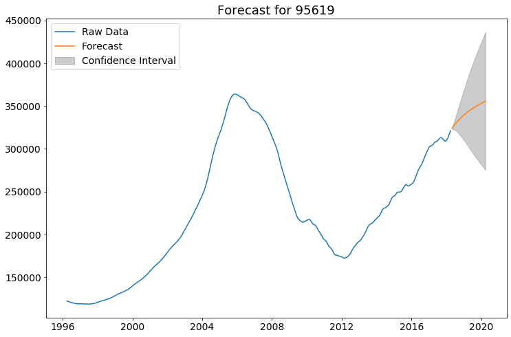


```python
print_results_lists()
```


    (['95616', '95619'],
     ['Davis', 'Diamond Springs'],
     ['Yolo', 'El Dorado'],
     [(2, 1, 2), (2, 1, 2)],
     [717863.06, 355774.45],
     [619575.34, 275292.09],
     [816150.79, 436256.81],
     [692300.0, 321100.0],
     [3.69, 10.8],
     [-10.5, -14.27],
     [17.89, 35.86])


```python
# pop_results_lists()
```


```python
# print_results_lists()
```

### Recommendation--Zip code 95619:  solid investment candidate

By the model prediction, I would expect to see a 10.799% change in price by April 1, 2020.
At the lower bound of the confidence interval, I would expect to see a -14.266% change in price by April 1, 2020.
At the upper bound of the confidence interval, I would expect to see a 35.863% change in price by April 1, 2020.


## SacMetro: 95864 (Arden-Arcade) -- Don't invest

### Set up dataframe


```python
geog_area = '95864'
```


```python
city = 'Arden-Arcade'
```


```python
county = 'Sacramento'
```


```python
ts = df_sac.loc[df_sac['Zip'] == geog_area]
```


```python
ts
```


<div>
<style scoped>
    .dataframe tbody tr th:only-of-type {
        vertical-align: middle;
    }

    .dataframe tbody tr th {
        vertical-align: top;
    }

    .dataframe thead th {
        text-align: right;
    }
</style>
<table border="1" class="dataframe">
  <thead>
    <tr style="text-align: right;">
      <th></th>
      <th>Metro</th>
      <th>MetroState</th>
      <th>CountyName</th>
      <th>City</th>
      <th>Zip</th>
      <th>value</th>
    </tr>
    <tr>
      <th>time</th>
      <th></th>
      <th></th>
      <th></th>
      <th></th>
      <th></th>
      <th></th>
    </tr>
  </thead>
  <tbody>
    <tr>
      <td>1996-04-01</td>
      <td>Sacramento</td>
      <td>Sacramento CA</td>
      <td>Sacramento</td>
      <td>Arden-Arcade</td>
      <td>95864</td>
      <td>171200.0</td>
    </tr>
    <tr>
      <td>1996-05-01</td>
      <td>Sacramento</td>
      <td>Sacramento CA</td>
      <td>Sacramento</td>
      <td>Arden-Arcade</td>
      <td>95864</td>
      <td>171200.0</td>
    </tr>
    <tr>
      <td>1996-06-01</td>
      <td>Sacramento</td>
      <td>Sacramento CA</td>
      <td>Sacramento</td>
      <td>Arden-Arcade</td>
      <td>95864</td>
      <td>171300.0</td>
    </tr>
    <tr>
      <td>1996-07-01</td>
      <td>Sacramento</td>
      <td>Sacramento CA</td>
      <td>Sacramento</td>
      <td>Arden-Arcade</td>
      <td>95864</td>
      <td>171500.0</td>
    </tr>
    <tr>
      <td>1996-08-01</td>
      <td>Sacramento</td>
      <td>Sacramento CA</td>
      <td>Sacramento</td>
      <td>Arden-Arcade</td>
      <td>95864</td>
      <td>171800.0</td>
    </tr>
    <tr>
      <td>1996-09-01</td>
      <td>Sacramento</td>
      <td>Sacramento CA</td>
      <td>Sacramento</td>
      <td>Arden-Arcade</td>
      <td>95864</td>
      <td>172200.0</td>
    </tr>
    <tr>
      <td>1996-10-01</td>
      <td>Sacramento</td>
      <td>Sacramento CA</td>
      <td>Sacramento</td>
      <td>Arden-Arcade</td>
      <td>95864</td>
      <td>172900.0</td>
    </tr>
    <tr>
      <td>1996-11-01</td>
      <td>Sacramento</td>
      <td>Sacramento CA</td>
      <td>Sacramento</td>
      <td>Arden-Arcade</td>
      <td>95864</td>
      <td>173800.0</td>
    </tr>
    <tr>
      <td>1996-12-01</td>
      <td>Sacramento</td>
      <td>Sacramento CA</td>
      <td>Sacramento</td>
      <td>Arden-Arcade</td>
      <td>95864</td>
      <td>175000.0</td>
    </tr>
    <tr>
      <td>1997-01-01</td>
      <td>Sacramento</td>
      <td>Sacramento CA</td>
      <td>Sacramento</td>
      <td>Arden-Arcade</td>
      <td>95864</td>
      <td>176200.0</td>
    </tr>
    <tr>
      <td>1997-02-01</td>
      <td>Sacramento</td>
      <td>Sacramento CA</td>
      <td>Sacramento</td>
      <td>Arden-Arcade</td>
      <td>95864</td>
      <td>177500.0</td>
    </tr>
    <tr>
      <td>1997-03-01</td>
      <td>Sacramento</td>
      <td>Sacramento CA</td>
      <td>Sacramento</td>
      <td>Arden-Arcade</td>
      <td>95864</td>
      <td>178500.0</td>
    </tr>
    <tr>
      <td>1997-04-01</td>
      <td>Sacramento</td>
      <td>Sacramento CA</td>
      <td>Sacramento</td>
      <td>Arden-Arcade</td>
      <td>95864</td>
      <td>179500.0</td>
    </tr>
    <tr>
      <td>1997-05-01</td>
      <td>Sacramento</td>
      <td>Sacramento CA</td>
      <td>Sacramento</td>
      <td>Arden-Arcade</td>
      <td>95864</td>
      <td>180300.0</td>
    </tr>
    <tr>
      <td>1997-06-01</td>
      <td>Sacramento</td>
      <td>Sacramento CA</td>
      <td>Sacramento</td>
      <td>Arden-Arcade</td>
      <td>95864</td>
      <td>180900.0</td>
    </tr>
    <tr>
      <td>1997-07-01</td>
      <td>Sacramento</td>
      <td>Sacramento CA</td>
      <td>Sacramento</td>
      <td>Arden-Arcade</td>
      <td>95864</td>
      <td>181300.0</td>
    </tr>
    <tr>
      <td>1997-08-01</td>
      <td>Sacramento</td>
      <td>Sacramento CA</td>
      <td>Sacramento</td>
      <td>Arden-Arcade</td>
      <td>95864</td>
      <td>181400.0</td>
    </tr>
    <tr>
      <td>1997-09-01</td>
      <td>Sacramento</td>
      <td>Sacramento CA</td>
      <td>Sacramento</td>
      <td>Arden-Arcade</td>
      <td>95864</td>
      <td>181400.0</td>
    </tr>
    <tr>
      <td>1997-10-01</td>
      <td>Sacramento</td>
      <td>Sacramento CA</td>
      <td>Sacramento</td>
      <td>Arden-Arcade</td>
      <td>95864</td>
      <td>181200.0</td>
    </tr>
    <tr>
      <td>1997-11-01</td>
      <td>Sacramento</td>
      <td>Sacramento CA</td>
      <td>Sacramento</td>
      <td>Arden-Arcade</td>
      <td>95864</td>
      <td>180800.0</td>
    </tr>
    <tr>
      <td>1997-12-01</td>
      <td>Sacramento</td>
      <td>Sacramento CA</td>
      <td>Sacramento</td>
      <td>Arden-Arcade</td>
      <td>95864</td>
      <td>180400.0</td>
    </tr>
    <tr>
      <td>1998-01-01</td>
      <td>Sacramento</td>
      <td>Sacramento CA</td>
      <td>Sacramento</td>
      <td>Arden-Arcade</td>
      <td>95864</td>
      <td>180000.0</td>
    </tr>
    <tr>
      <td>1998-02-01</td>
      <td>Sacramento</td>
      <td>Sacramento CA</td>
      <td>Sacramento</td>
      <td>Arden-Arcade</td>
      <td>95864</td>
      <td>179500.0</td>
    </tr>
    <tr>
      <td>1998-03-01</td>
      <td>Sacramento</td>
      <td>Sacramento CA</td>
      <td>Sacramento</td>
      <td>Arden-Arcade</td>
      <td>95864</td>
      <td>179000.0</td>
    </tr>
    <tr>
      <td>1998-04-01</td>
      <td>Sacramento</td>
      <td>Sacramento CA</td>
      <td>Sacramento</td>
      <td>Arden-Arcade</td>
      <td>95864</td>
      <td>178500.0</td>
    </tr>
    <tr>
      <td>1998-05-01</td>
      <td>Sacramento</td>
      <td>Sacramento CA</td>
      <td>Sacramento</td>
      <td>Arden-Arcade</td>
      <td>95864</td>
      <td>178200.0</td>
    </tr>
    <tr>
      <td>1998-06-01</td>
      <td>Sacramento</td>
      <td>Sacramento CA</td>
      <td>Sacramento</td>
      <td>Arden-Arcade</td>
      <td>95864</td>
      <td>178100.0</td>
    </tr>
    <tr>
      <td>1998-07-01</td>
      <td>Sacramento</td>
      <td>Sacramento CA</td>
      <td>Sacramento</td>
      <td>Arden-Arcade</td>
      <td>95864</td>
      <td>178300.0</td>
    </tr>
    <tr>
      <td>1998-08-01</td>
      <td>Sacramento</td>
      <td>Sacramento CA</td>
      <td>Sacramento</td>
      <td>Arden-Arcade</td>
      <td>95864</td>
      <td>178800.0</td>
    </tr>
    <tr>
      <td>1998-09-01</td>
      <td>Sacramento</td>
      <td>Sacramento CA</td>
      <td>Sacramento</td>
      <td>Arden-Arcade</td>
      <td>95864</td>
      <td>179700.0</td>
    </tr>
    <tr>
      <td>1998-10-01</td>
      <td>Sacramento</td>
      <td>Sacramento CA</td>
      <td>Sacramento</td>
      <td>Arden-Arcade</td>
      <td>95864</td>
      <td>180900.0</td>
    </tr>
    <tr>
      <td>1998-11-01</td>
      <td>Sacramento</td>
      <td>Sacramento CA</td>
      <td>Sacramento</td>
      <td>Arden-Arcade</td>
      <td>95864</td>
      <td>182300.0</td>
    </tr>
    <tr>
      <td>1998-12-01</td>
      <td>Sacramento</td>
      <td>Sacramento CA</td>
      <td>Sacramento</td>
      <td>Arden-Arcade</td>
      <td>95864</td>
      <td>184000.0</td>
    </tr>
    <tr>
      <td>1999-01-01</td>
      <td>Sacramento</td>
      <td>Sacramento CA</td>
      <td>Sacramento</td>
      <td>Arden-Arcade</td>
      <td>95864</td>
      <td>185900.0</td>
    </tr>
    <tr>
      <td>1999-02-01</td>
      <td>Sacramento</td>
      <td>Sacramento CA</td>
      <td>Sacramento</td>
      <td>Arden-Arcade</td>
      <td>95864</td>
      <td>187900.0</td>
    </tr>
    <tr>
      <td>1999-03-01</td>
      <td>Sacramento</td>
      <td>Sacramento CA</td>
      <td>Sacramento</td>
      <td>Arden-Arcade</td>
      <td>95864</td>
      <td>189700.0</td>
    </tr>
    <tr>
      <td>1999-04-01</td>
      <td>Sacramento</td>
      <td>Sacramento CA</td>
      <td>Sacramento</td>
      <td>Arden-Arcade</td>
      <td>95864</td>
      <td>191500.0</td>
    </tr>
    <tr>
      <td>1999-05-01</td>
      <td>Sacramento</td>
      <td>Sacramento CA</td>
      <td>Sacramento</td>
      <td>Arden-Arcade</td>
      <td>95864</td>
      <td>193200.0</td>
    </tr>
    <tr>
      <td>1999-06-01</td>
      <td>Sacramento</td>
      <td>Sacramento CA</td>
      <td>Sacramento</td>
      <td>Arden-Arcade</td>
      <td>95864</td>
      <td>194600.0</td>
    </tr>
    <tr>
      <td>1999-07-01</td>
      <td>Sacramento</td>
      <td>Sacramento CA</td>
      <td>Sacramento</td>
      <td>Arden-Arcade</td>
      <td>95864</td>
      <td>195900.0</td>
    </tr>
    <tr>
      <td>1999-08-01</td>
      <td>Sacramento</td>
      <td>Sacramento CA</td>
      <td>Sacramento</td>
      <td>Arden-Arcade</td>
      <td>95864</td>
      <td>197200.0</td>
    </tr>
    <tr>
      <td>1999-09-01</td>
      <td>Sacramento</td>
      <td>Sacramento CA</td>
      <td>Sacramento</td>
      <td>Arden-Arcade</td>
      <td>95864</td>
      <td>198500.0</td>
    </tr>
    <tr>
      <td>1999-10-01</td>
      <td>Sacramento</td>
      <td>Sacramento CA</td>
      <td>Sacramento</td>
      <td>Arden-Arcade</td>
      <td>95864</td>
      <td>200000.0</td>
    </tr>
    <tr>
      <td>1999-11-01</td>
      <td>Sacramento</td>
      <td>Sacramento CA</td>
      <td>Sacramento</td>
      <td>Arden-Arcade</td>
      <td>95864</td>
      <td>201800.0</td>
    </tr>
    <tr>
      <td>1999-12-01</td>
      <td>Sacramento</td>
      <td>Sacramento CA</td>
      <td>Sacramento</td>
      <td>Arden-Arcade</td>
      <td>95864</td>
      <td>204000.0</td>
    </tr>
    <tr>
      <td>2000-01-01</td>
      <td>Sacramento</td>
      <td>Sacramento CA</td>
      <td>Sacramento</td>
      <td>Arden-Arcade</td>
      <td>95864</td>
      <td>206600.0</td>
    </tr>
    <tr>
      <td>2000-02-01</td>
      <td>Sacramento</td>
      <td>Sacramento CA</td>
      <td>Sacramento</td>
      <td>Arden-Arcade</td>
      <td>95864</td>
      <td>209500.0</td>
    </tr>
    <tr>
      <td>2000-03-01</td>
      <td>Sacramento</td>
      <td>Sacramento CA</td>
      <td>Sacramento</td>
      <td>Arden-Arcade</td>
      <td>95864</td>
      <td>212700.0</td>
    </tr>
    <tr>
      <td>2000-04-01</td>
      <td>Sacramento</td>
      <td>Sacramento CA</td>
      <td>Sacramento</td>
      <td>Arden-Arcade</td>
      <td>95864</td>
      <td>216200.0</td>
    </tr>
    <tr>
      <td>2000-05-01</td>
      <td>Sacramento</td>
      <td>Sacramento CA</td>
      <td>Sacramento</td>
      <td>Arden-Arcade</td>
      <td>95864</td>
      <td>219800.0</td>
    </tr>
    <tr>
      <td>2000-06-01</td>
      <td>Sacramento</td>
      <td>Sacramento CA</td>
      <td>Sacramento</td>
      <td>Arden-Arcade</td>
      <td>95864</td>
      <td>223600.0</td>
    </tr>
    <tr>
      <td>2000-07-01</td>
      <td>Sacramento</td>
      <td>Sacramento CA</td>
      <td>Sacramento</td>
      <td>Arden-Arcade</td>
      <td>95864</td>
      <td>227500.0</td>
    </tr>
    <tr>
      <td>2000-08-01</td>
      <td>Sacramento</td>
      <td>Sacramento CA</td>
      <td>Sacramento</td>
      <td>Arden-Arcade</td>
      <td>95864</td>
      <td>231600.0</td>
    </tr>
    <tr>
      <td>2000-09-01</td>
      <td>Sacramento</td>
      <td>Sacramento CA</td>
      <td>Sacramento</td>
      <td>Arden-Arcade</td>
      <td>95864</td>
      <td>236000.0</td>
    </tr>
    <tr>
      <td>2000-10-01</td>
      <td>Sacramento</td>
      <td>Sacramento CA</td>
      <td>Sacramento</td>
      <td>Arden-Arcade</td>
      <td>95864</td>
      <td>240700.0</td>
    </tr>
    <tr>
      <td>2000-11-01</td>
      <td>Sacramento</td>
      <td>Sacramento CA</td>
      <td>Sacramento</td>
      <td>Arden-Arcade</td>
      <td>95864</td>
      <td>245600.0</td>
    </tr>
    <tr>
      <td>2000-12-01</td>
      <td>Sacramento</td>
      <td>Sacramento CA</td>
      <td>Sacramento</td>
      <td>Arden-Arcade</td>
      <td>95864</td>
      <td>250600.0</td>
    </tr>
    <tr>
      <td>2001-01-01</td>
      <td>Sacramento</td>
      <td>Sacramento CA</td>
      <td>Sacramento</td>
      <td>Arden-Arcade</td>
      <td>95864</td>
      <td>255500.0</td>
    </tr>
    <tr>
      <td>2001-02-01</td>
      <td>Sacramento</td>
      <td>Sacramento CA</td>
      <td>Sacramento</td>
      <td>Arden-Arcade</td>
      <td>95864</td>
      <td>259900.0</td>
    </tr>
    <tr>
      <td>2001-03-01</td>
      <td>Sacramento</td>
      <td>Sacramento CA</td>
      <td>Sacramento</td>
      <td>Arden-Arcade</td>
      <td>95864</td>
      <td>263900.0</td>
    </tr>
    <tr>
      <td>2001-04-01</td>
      <td>Sacramento</td>
      <td>Sacramento CA</td>
      <td>Sacramento</td>
      <td>Arden-Arcade</td>
      <td>95864</td>
      <td>267300.0</td>
    </tr>
    <tr>
      <td>2001-05-01</td>
      <td>Sacramento</td>
      <td>Sacramento CA</td>
      <td>Sacramento</td>
      <td>Arden-Arcade</td>
      <td>95864</td>
      <td>270000.0</td>
    </tr>
    <tr>
      <td>2001-06-01</td>
      <td>Sacramento</td>
      <td>Sacramento CA</td>
      <td>Sacramento</td>
      <td>Arden-Arcade</td>
      <td>95864</td>
      <td>272100.0</td>
    </tr>
    <tr>
      <td>2001-07-01</td>
      <td>Sacramento</td>
      <td>Sacramento CA</td>
      <td>Sacramento</td>
      <td>Arden-Arcade</td>
      <td>95864</td>
      <td>273800.0</td>
    </tr>
    <tr>
      <td>2001-08-01</td>
      <td>Sacramento</td>
      <td>Sacramento CA</td>
      <td>Sacramento</td>
      <td>Arden-Arcade</td>
      <td>95864</td>
      <td>275500.0</td>
    </tr>
    <tr>
      <td>2001-09-01</td>
      <td>Sacramento</td>
      <td>Sacramento CA</td>
      <td>Sacramento</td>
      <td>Arden-Arcade</td>
      <td>95864</td>
      <td>277300.0</td>
    </tr>
    <tr>
      <td>2001-10-01</td>
      <td>Sacramento</td>
      <td>Sacramento CA</td>
      <td>Sacramento</td>
      <td>Arden-Arcade</td>
      <td>95864</td>
      <td>279300.0</td>
    </tr>
    <tr>
      <td>2001-11-01</td>
      <td>Sacramento</td>
      <td>Sacramento CA</td>
      <td>Sacramento</td>
      <td>Arden-Arcade</td>
      <td>95864</td>
      <td>281500.0</td>
    </tr>
    <tr>
      <td>2001-12-01</td>
      <td>Sacramento</td>
      <td>Sacramento CA</td>
      <td>Sacramento</td>
      <td>Arden-Arcade</td>
      <td>95864</td>
      <td>284000.0</td>
    </tr>
    <tr>
      <td>2002-01-01</td>
      <td>Sacramento</td>
      <td>Sacramento CA</td>
      <td>Sacramento</td>
      <td>Arden-Arcade</td>
      <td>95864</td>
      <td>286800.0</td>
    </tr>
    <tr>
      <td>2002-02-01</td>
      <td>Sacramento</td>
      <td>Sacramento CA</td>
      <td>Sacramento</td>
      <td>Arden-Arcade</td>
      <td>95864</td>
      <td>290000.0</td>
    </tr>
    <tr>
      <td>2002-03-01</td>
      <td>Sacramento</td>
      <td>Sacramento CA</td>
      <td>Sacramento</td>
      <td>Arden-Arcade</td>
      <td>95864</td>
      <td>293500.0</td>
    </tr>
    <tr>
      <td>2002-04-01</td>
      <td>Sacramento</td>
      <td>Sacramento CA</td>
      <td>Sacramento</td>
      <td>Arden-Arcade</td>
      <td>95864</td>
      <td>297200.0</td>
    </tr>
    <tr>
      <td>2002-05-01</td>
      <td>Sacramento</td>
      <td>Sacramento CA</td>
      <td>Sacramento</td>
      <td>Arden-Arcade</td>
      <td>95864</td>
      <td>300900.0</td>
    </tr>
    <tr>
      <td>2002-06-01</td>
      <td>Sacramento</td>
      <td>Sacramento CA</td>
      <td>Sacramento</td>
      <td>Arden-Arcade</td>
      <td>95864</td>
      <td>304700.0</td>
    </tr>
    <tr>
      <td>2002-07-01</td>
      <td>Sacramento</td>
      <td>Sacramento CA</td>
      <td>Sacramento</td>
      <td>Arden-Arcade</td>
      <td>95864</td>
      <td>308600.0</td>
    </tr>
    <tr>
      <td>2002-08-01</td>
      <td>Sacramento</td>
      <td>Sacramento CA</td>
      <td>Sacramento</td>
      <td>Arden-Arcade</td>
      <td>95864</td>
      <td>312700.0</td>
    </tr>
    <tr>
      <td>2002-09-01</td>
      <td>Sacramento</td>
      <td>Sacramento CA</td>
      <td>Sacramento</td>
      <td>Arden-Arcade</td>
      <td>95864</td>
      <td>317000.0</td>
    </tr>
    <tr>
      <td>2002-10-01</td>
      <td>Sacramento</td>
      <td>Sacramento CA</td>
      <td>Sacramento</td>
      <td>Arden-Arcade</td>
      <td>95864</td>
      <td>321600.0</td>
    </tr>
    <tr>
      <td>2002-11-01</td>
      <td>Sacramento</td>
      <td>Sacramento CA</td>
      <td>Sacramento</td>
      <td>Arden-Arcade</td>
      <td>95864</td>
      <td>326600.0</td>
    </tr>
    <tr>
      <td>2002-12-01</td>
      <td>Sacramento</td>
      <td>Sacramento CA</td>
      <td>Sacramento</td>
      <td>Arden-Arcade</td>
      <td>95864</td>
      <td>331800.0</td>
    </tr>
    <tr>
      <td>2003-01-01</td>
      <td>Sacramento</td>
      <td>Sacramento CA</td>
      <td>Sacramento</td>
      <td>Arden-Arcade</td>
      <td>95864</td>
      <td>336400.0</td>
    </tr>
    <tr>
      <td>2003-02-01</td>
      <td>Sacramento</td>
      <td>Sacramento CA</td>
      <td>Sacramento</td>
      <td>Arden-Arcade</td>
      <td>95864</td>
      <td>340200.0</td>
    </tr>
    <tr>
      <td>2003-03-01</td>
      <td>Sacramento</td>
      <td>Sacramento CA</td>
      <td>Sacramento</td>
      <td>Arden-Arcade</td>
      <td>95864</td>
      <td>343700.0</td>
    </tr>
    <tr>
      <td>2003-04-01</td>
      <td>Sacramento</td>
      <td>Sacramento CA</td>
      <td>Sacramento</td>
      <td>Arden-Arcade</td>
      <td>95864</td>
      <td>347000.0</td>
    </tr>
    <tr>
      <td>2003-05-01</td>
      <td>Sacramento</td>
      <td>Sacramento CA</td>
      <td>Sacramento</td>
      <td>Arden-Arcade</td>
      <td>95864</td>
      <td>350500.0</td>
    </tr>
    <tr>
      <td>2003-06-01</td>
      <td>Sacramento</td>
      <td>Sacramento CA</td>
      <td>Sacramento</td>
      <td>Arden-Arcade</td>
      <td>95864</td>
      <td>354500.0</td>
    </tr>
    <tr>
      <td>2003-07-01</td>
      <td>Sacramento</td>
      <td>Sacramento CA</td>
      <td>Sacramento</td>
      <td>Arden-Arcade</td>
      <td>95864</td>
      <td>359000.0</td>
    </tr>
    <tr>
      <td>2003-08-01</td>
      <td>Sacramento</td>
      <td>Sacramento CA</td>
      <td>Sacramento</td>
      <td>Arden-Arcade</td>
      <td>95864</td>
      <td>363900.0</td>
    </tr>
    <tr>
      <td>2003-09-01</td>
      <td>Sacramento</td>
      <td>Sacramento CA</td>
      <td>Sacramento</td>
      <td>Arden-Arcade</td>
      <td>95864</td>
      <td>369000.0</td>
    </tr>
    <tr>
      <td>2003-10-01</td>
      <td>Sacramento</td>
      <td>Sacramento CA</td>
      <td>Sacramento</td>
      <td>Arden-Arcade</td>
      <td>95864</td>
      <td>374400.0</td>
    </tr>
    <tr>
      <td>2003-11-01</td>
      <td>Sacramento</td>
      <td>Sacramento CA</td>
      <td>Sacramento</td>
      <td>Arden-Arcade</td>
      <td>95864</td>
      <td>380000.0</td>
    </tr>
    <tr>
      <td>2003-12-01</td>
      <td>Sacramento</td>
      <td>Sacramento CA</td>
      <td>Sacramento</td>
      <td>Arden-Arcade</td>
      <td>95864</td>
      <td>385900.0</td>
    </tr>
    <tr>
      <td>2004-01-01</td>
      <td>Sacramento</td>
      <td>Sacramento CA</td>
      <td>Sacramento</td>
      <td>Arden-Arcade</td>
      <td>95864</td>
      <td>392100.0</td>
    </tr>
    <tr>
      <td>2004-02-01</td>
      <td>Sacramento</td>
      <td>Sacramento CA</td>
      <td>Sacramento</td>
      <td>Arden-Arcade</td>
      <td>95864</td>
      <td>398800.0</td>
    </tr>
    <tr>
      <td>2004-03-01</td>
      <td>Sacramento</td>
      <td>Sacramento CA</td>
      <td>Sacramento</td>
      <td>Arden-Arcade</td>
      <td>95864</td>
      <td>405900.0</td>
    </tr>
    <tr>
      <td>2004-04-01</td>
      <td>Sacramento</td>
      <td>Sacramento CA</td>
      <td>Sacramento</td>
      <td>Arden-Arcade</td>
      <td>95864</td>
      <td>413800.0</td>
    </tr>
    <tr>
      <td>2004-05-01</td>
      <td>Sacramento</td>
      <td>Sacramento CA</td>
      <td>Sacramento</td>
      <td>Arden-Arcade</td>
      <td>95864</td>
      <td>422700.0</td>
    </tr>
    <tr>
      <td>2004-06-01</td>
      <td>Sacramento</td>
      <td>Sacramento CA</td>
      <td>Sacramento</td>
      <td>Arden-Arcade</td>
      <td>95864</td>
      <td>432900.0</td>
    </tr>
    <tr>
      <td>2004-07-01</td>
      <td>Sacramento</td>
      <td>Sacramento CA</td>
      <td>Sacramento</td>
      <td>Arden-Arcade</td>
      <td>95864</td>
      <td>444300.0</td>
    </tr>
    <tr>
      <td>2004-08-01</td>
      <td>Sacramento</td>
      <td>Sacramento CA</td>
      <td>Sacramento</td>
      <td>Arden-Arcade</td>
      <td>95864</td>
      <td>456300.0</td>
    </tr>
    <tr>
      <td>2004-09-01</td>
      <td>Sacramento</td>
      <td>Sacramento CA</td>
      <td>Sacramento</td>
      <td>Arden-Arcade</td>
      <td>95864</td>
      <td>468600.0</td>
    </tr>
    <tr>
      <td>2004-10-01</td>
      <td>Sacramento</td>
      <td>Sacramento CA</td>
      <td>Sacramento</td>
      <td>Arden-Arcade</td>
      <td>95864</td>
      <td>480400.0</td>
    </tr>
    <tr>
      <td>2004-11-01</td>
      <td>Sacramento</td>
      <td>Sacramento CA</td>
      <td>Sacramento</td>
      <td>Arden-Arcade</td>
      <td>95864</td>
      <td>490900.0</td>
    </tr>
    <tr>
      <td>2004-12-01</td>
      <td>Sacramento</td>
      <td>Sacramento CA</td>
      <td>Sacramento</td>
      <td>Arden-Arcade</td>
      <td>95864</td>
      <td>499700.0</td>
    </tr>
    <tr>
      <td>2005-01-01</td>
      <td>Sacramento</td>
      <td>Sacramento CA</td>
      <td>Sacramento</td>
      <td>Arden-Arcade</td>
      <td>95864</td>
      <td>507100.0</td>
    </tr>
    <tr>
      <td>2005-02-01</td>
      <td>Sacramento</td>
      <td>Sacramento CA</td>
      <td>Sacramento</td>
      <td>Arden-Arcade</td>
      <td>95864</td>
      <td>512700.0</td>
    </tr>
    <tr>
      <td>2005-03-01</td>
      <td>Sacramento</td>
      <td>Sacramento CA</td>
      <td>Sacramento</td>
      <td>Arden-Arcade</td>
      <td>95864</td>
      <td>517100.0</td>
    </tr>
    <tr>
      <td>2005-04-01</td>
      <td>Sacramento</td>
      <td>Sacramento CA</td>
      <td>Sacramento</td>
      <td>Arden-Arcade</td>
      <td>95864</td>
      <td>520200.0</td>
    </tr>
    <tr>
      <td>2005-05-01</td>
      <td>Sacramento</td>
      <td>Sacramento CA</td>
      <td>Sacramento</td>
      <td>Arden-Arcade</td>
      <td>95864</td>
      <td>521800.0</td>
    </tr>
    <tr>
      <td>2005-06-01</td>
      <td>Sacramento</td>
      <td>Sacramento CA</td>
      <td>Sacramento</td>
      <td>Arden-Arcade</td>
      <td>95864</td>
      <td>522200.0</td>
    </tr>
    <tr>
      <td>2005-07-01</td>
      <td>Sacramento</td>
      <td>Sacramento CA</td>
      <td>Sacramento</td>
      <td>Arden-Arcade</td>
      <td>95864</td>
      <td>521600.0</td>
    </tr>
    <tr>
      <td>2005-08-01</td>
      <td>Sacramento</td>
      <td>Sacramento CA</td>
      <td>Sacramento</td>
      <td>Arden-Arcade</td>
      <td>95864</td>
      <td>520200.0</td>
    </tr>
    <tr>
      <td>2005-09-01</td>
      <td>Sacramento</td>
      <td>Sacramento CA</td>
      <td>Sacramento</td>
      <td>Arden-Arcade</td>
      <td>95864</td>
      <td>518100.0</td>
    </tr>
    <tr>
      <td>2005-10-01</td>
      <td>Sacramento</td>
      <td>Sacramento CA</td>
      <td>Sacramento</td>
      <td>Arden-Arcade</td>
      <td>95864</td>
      <td>515600.0</td>
    </tr>
    <tr>
      <td>2005-11-01</td>
      <td>Sacramento</td>
      <td>Sacramento CA</td>
      <td>Sacramento</td>
      <td>Arden-Arcade</td>
      <td>95864</td>
      <td>513100.0</td>
    </tr>
    <tr>
      <td>2005-12-01</td>
      <td>Sacramento</td>
      <td>Sacramento CA</td>
      <td>Sacramento</td>
      <td>Arden-Arcade</td>
      <td>95864</td>
      <td>511100.0</td>
    </tr>
    <tr>
      <td>2006-01-01</td>
      <td>Sacramento</td>
      <td>Sacramento CA</td>
      <td>Sacramento</td>
      <td>Arden-Arcade</td>
      <td>95864</td>
      <td>510300.0</td>
    </tr>
    <tr>
      <td>2006-02-01</td>
      <td>Sacramento</td>
      <td>Sacramento CA</td>
      <td>Sacramento</td>
      <td>Arden-Arcade</td>
      <td>95864</td>
      <td>510400.0</td>
    </tr>
    <tr>
      <td>2006-03-01</td>
      <td>Sacramento</td>
      <td>Sacramento CA</td>
      <td>Sacramento</td>
      <td>Arden-Arcade</td>
      <td>95864</td>
      <td>511100.0</td>
    </tr>
    <tr>
      <td>2006-04-01</td>
      <td>Sacramento</td>
      <td>Sacramento CA</td>
      <td>Sacramento</td>
      <td>Arden-Arcade</td>
      <td>95864</td>
      <td>511900.0</td>
    </tr>
    <tr>
      <td>2006-05-01</td>
      <td>Sacramento</td>
      <td>Sacramento CA</td>
      <td>Sacramento</td>
      <td>Arden-Arcade</td>
      <td>95864</td>
      <td>512900.0</td>
    </tr>
    <tr>
      <td>2006-06-01</td>
      <td>Sacramento</td>
      <td>Sacramento CA</td>
      <td>Sacramento</td>
      <td>Arden-Arcade</td>
      <td>95864</td>
      <td>514000.0</td>
    </tr>
    <tr>
      <td>2006-07-01</td>
      <td>Sacramento</td>
      <td>Sacramento CA</td>
      <td>Sacramento</td>
      <td>Arden-Arcade</td>
      <td>95864</td>
      <td>514800.0</td>
    </tr>
    <tr>
      <td>2006-08-01</td>
      <td>Sacramento</td>
      <td>Sacramento CA</td>
      <td>Sacramento</td>
      <td>Arden-Arcade</td>
      <td>95864</td>
      <td>514300.0</td>
    </tr>
    <tr>
      <td>2006-09-01</td>
      <td>Sacramento</td>
      <td>Sacramento CA</td>
      <td>Sacramento</td>
      <td>Arden-Arcade</td>
      <td>95864</td>
      <td>512200.0</td>
    </tr>
    <tr>
      <td>2006-10-01</td>
      <td>Sacramento</td>
      <td>Sacramento CA</td>
      <td>Sacramento</td>
      <td>Arden-Arcade</td>
      <td>95864</td>
      <td>508700.0</td>
    </tr>
    <tr>
      <td>2006-11-01</td>
      <td>Sacramento</td>
      <td>Sacramento CA</td>
      <td>Sacramento</td>
      <td>Arden-Arcade</td>
      <td>95864</td>
      <td>504400.0</td>
    </tr>
    <tr>
      <td>2006-12-01</td>
      <td>Sacramento</td>
      <td>Sacramento CA</td>
      <td>Sacramento</td>
      <td>Arden-Arcade</td>
      <td>95864</td>
      <td>500600.0</td>
    </tr>
    <tr>
      <td>2007-01-01</td>
      <td>Sacramento</td>
      <td>Sacramento CA</td>
      <td>Sacramento</td>
      <td>Arden-Arcade</td>
      <td>95864</td>
      <td>498600.0</td>
    </tr>
    <tr>
      <td>2007-02-01</td>
      <td>Sacramento</td>
      <td>Sacramento CA</td>
      <td>Sacramento</td>
      <td>Arden-Arcade</td>
      <td>95864</td>
      <td>498000.0</td>
    </tr>
    <tr>
      <td>2007-03-01</td>
      <td>Sacramento</td>
      <td>Sacramento CA</td>
      <td>Sacramento</td>
      <td>Arden-Arcade</td>
      <td>95864</td>
      <td>498100.0</td>
    </tr>
    <tr>
      <td>2007-04-01</td>
      <td>Sacramento</td>
      <td>Sacramento CA</td>
      <td>Sacramento</td>
      <td>Arden-Arcade</td>
      <td>95864</td>
      <td>498200.0</td>
    </tr>
    <tr>
      <td>2007-05-01</td>
      <td>Sacramento</td>
      <td>Sacramento CA</td>
      <td>Sacramento</td>
      <td>Arden-Arcade</td>
      <td>95864</td>
      <td>497500.0</td>
    </tr>
    <tr>
      <td>2007-06-01</td>
      <td>Sacramento</td>
      <td>Sacramento CA</td>
      <td>Sacramento</td>
      <td>Arden-Arcade</td>
      <td>95864</td>
      <td>496000.0</td>
    </tr>
    <tr>
      <td>2007-07-01</td>
      <td>Sacramento</td>
      <td>Sacramento CA</td>
      <td>Sacramento</td>
      <td>Arden-Arcade</td>
      <td>95864</td>
      <td>494100.0</td>
    </tr>
    <tr>
      <td>2007-08-01</td>
      <td>Sacramento</td>
      <td>Sacramento CA</td>
      <td>Sacramento</td>
      <td>Arden-Arcade</td>
      <td>95864</td>
      <td>491700.0</td>
    </tr>
    <tr>
      <td>2007-09-01</td>
      <td>Sacramento</td>
      <td>Sacramento CA</td>
      <td>Sacramento</td>
      <td>Arden-Arcade</td>
      <td>95864</td>
      <td>488700.0</td>
    </tr>
    <tr>
      <td>2007-10-01</td>
      <td>Sacramento</td>
      <td>Sacramento CA</td>
      <td>Sacramento</td>
      <td>Arden-Arcade</td>
      <td>95864</td>
      <td>485100.0</td>
    </tr>
    <tr>
      <td>2007-11-01</td>
      <td>Sacramento</td>
      <td>Sacramento CA</td>
      <td>Sacramento</td>
      <td>Arden-Arcade</td>
      <td>95864</td>
      <td>480000.0</td>
    </tr>
    <tr>
      <td>2007-12-01</td>
      <td>Sacramento</td>
      <td>Sacramento CA</td>
      <td>Sacramento</td>
      <td>Arden-Arcade</td>
      <td>95864</td>
      <td>473200.0</td>
    </tr>
    <tr>
      <td>2008-01-01</td>
      <td>Sacramento</td>
      <td>Sacramento CA</td>
      <td>Sacramento</td>
      <td>Arden-Arcade</td>
      <td>95864</td>
      <td>465800.0</td>
    </tr>
    <tr>
      <td>2008-02-01</td>
      <td>Sacramento</td>
      <td>Sacramento CA</td>
      <td>Sacramento</td>
      <td>Arden-Arcade</td>
      <td>95864</td>
      <td>458200.0</td>
    </tr>
    <tr>
      <td>2008-03-01</td>
      <td>Sacramento</td>
      <td>Sacramento CA</td>
      <td>Sacramento</td>
      <td>Arden-Arcade</td>
      <td>95864</td>
      <td>450800.0</td>
    </tr>
    <tr>
      <td>2008-04-01</td>
      <td>Sacramento</td>
      <td>Sacramento CA</td>
      <td>Sacramento</td>
      <td>Arden-Arcade</td>
      <td>95864</td>
      <td>445000.0</td>
    </tr>
    <tr>
      <td>2008-05-01</td>
      <td>Sacramento</td>
      <td>Sacramento CA</td>
      <td>Sacramento</td>
      <td>Arden-Arcade</td>
      <td>95864</td>
      <td>441800.0</td>
    </tr>
    <tr>
      <td>2008-06-01</td>
      <td>Sacramento</td>
      <td>Sacramento CA</td>
      <td>Sacramento</td>
      <td>Arden-Arcade</td>
      <td>95864</td>
      <td>441000.0</td>
    </tr>
    <tr>
      <td>2008-07-01</td>
      <td>Sacramento</td>
      <td>Sacramento CA</td>
      <td>Sacramento</td>
      <td>Arden-Arcade</td>
      <td>95864</td>
      <td>440800.0</td>
    </tr>
    <tr>
      <td>2008-08-01</td>
      <td>Sacramento</td>
      <td>Sacramento CA</td>
      <td>Sacramento</td>
      <td>Arden-Arcade</td>
      <td>95864</td>
      <td>439600.0</td>
    </tr>
    <tr>
      <td>2008-09-01</td>
      <td>Sacramento</td>
      <td>Sacramento CA</td>
      <td>Sacramento</td>
      <td>Arden-Arcade</td>
      <td>95864</td>
      <td>438500.0</td>
    </tr>
    <tr>
      <td>2008-10-01</td>
      <td>Sacramento</td>
      <td>Sacramento CA</td>
      <td>Sacramento</td>
      <td>Arden-Arcade</td>
      <td>95864</td>
      <td>438700.0</td>
    </tr>
    <tr>
      <td>2008-11-01</td>
      <td>Sacramento</td>
      <td>Sacramento CA</td>
      <td>Sacramento</td>
      <td>Arden-Arcade</td>
      <td>95864</td>
      <td>438900.0</td>
    </tr>
    <tr>
      <td>2008-12-01</td>
      <td>Sacramento</td>
      <td>Sacramento CA</td>
      <td>Sacramento</td>
      <td>Arden-Arcade</td>
      <td>95864</td>
      <td>439100.0</td>
    </tr>
    <tr>
      <td>2009-01-01</td>
      <td>Sacramento</td>
      <td>Sacramento CA</td>
      <td>Sacramento</td>
      <td>Arden-Arcade</td>
      <td>95864</td>
      <td>439900.0</td>
    </tr>
    <tr>
      <td>2009-02-01</td>
      <td>Sacramento</td>
      <td>Sacramento CA</td>
      <td>Sacramento</td>
      <td>Arden-Arcade</td>
      <td>95864</td>
      <td>440600.0</td>
    </tr>
    <tr>
      <td>2009-03-01</td>
      <td>Sacramento</td>
      <td>Sacramento CA</td>
      <td>Sacramento</td>
      <td>Arden-Arcade</td>
      <td>95864</td>
      <td>439700.0</td>
    </tr>
    <tr>
      <td>2009-04-01</td>
      <td>Sacramento</td>
      <td>Sacramento CA</td>
      <td>Sacramento</td>
      <td>Arden-Arcade</td>
      <td>95864</td>
      <td>437100.0</td>
    </tr>
    <tr>
      <td>2009-05-01</td>
      <td>Sacramento</td>
      <td>Sacramento CA</td>
      <td>Sacramento</td>
      <td>Arden-Arcade</td>
      <td>95864</td>
      <td>433800.0</td>
    </tr>
    <tr>
      <td>2009-06-01</td>
      <td>Sacramento</td>
      <td>Sacramento CA</td>
      <td>Sacramento</td>
      <td>Arden-Arcade</td>
      <td>95864</td>
      <td>429600.0</td>
    </tr>
    <tr>
      <td>2009-07-01</td>
      <td>Sacramento</td>
      <td>Sacramento CA</td>
      <td>Sacramento</td>
      <td>Arden-Arcade</td>
      <td>95864</td>
      <td>424000.0</td>
    </tr>
    <tr>
      <td>2009-08-01</td>
      <td>Sacramento</td>
      <td>Sacramento CA</td>
      <td>Sacramento</td>
      <td>Arden-Arcade</td>
      <td>95864</td>
      <td>418000.0</td>
    </tr>
    <tr>
      <td>2009-09-01</td>
      <td>Sacramento</td>
      <td>Sacramento CA</td>
      <td>Sacramento</td>
      <td>Arden-Arcade</td>
      <td>95864</td>
      <td>413500.0</td>
    </tr>
    <tr>
      <td>2009-10-01</td>
      <td>Sacramento</td>
      <td>Sacramento CA</td>
      <td>Sacramento</td>
      <td>Arden-Arcade</td>
      <td>95864</td>
      <td>411100.0</td>
    </tr>
    <tr>
      <td>2009-11-01</td>
      <td>Sacramento</td>
      <td>Sacramento CA</td>
      <td>Sacramento</td>
      <td>Arden-Arcade</td>
      <td>95864</td>
      <td>409900.0</td>
    </tr>
    <tr>
      <td>2009-12-01</td>
      <td>Sacramento</td>
      <td>Sacramento CA</td>
      <td>Sacramento</td>
      <td>Arden-Arcade</td>
      <td>95864</td>
      <td>409800.0</td>
    </tr>
    <tr>
      <td>2010-01-01</td>
      <td>Sacramento</td>
      <td>Sacramento CA</td>
      <td>Sacramento</td>
      <td>Arden-Arcade</td>
      <td>95864</td>
      <td>409000.0</td>
    </tr>
    <tr>
      <td>2010-02-01</td>
      <td>Sacramento</td>
      <td>Sacramento CA</td>
      <td>Sacramento</td>
      <td>Arden-Arcade</td>
      <td>95864</td>
      <td>409300.0</td>
    </tr>
    <tr>
      <td>2010-03-01</td>
      <td>Sacramento</td>
      <td>Sacramento CA</td>
      <td>Sacramento</td>
      <td>Arden-Arcade</td>
      <td>95864</td>
      <td>409800.0</td>
    </tr>
    <tr>
      <td>2010-04-01</td>
      <td>Sacramento</td>
      <td>Sacramento CA</td>
      <td>Sacramento</td>
      <td>Arden-Arcade</td>
      <td>95864</td>
      <td>408100.0</td>
    </tr>
    <tr>
      <td>2010-05-01</td>
      <td>Sacramento</td>
      <td>Sacramento CA</td>
      <td>Sacramento</td>
      <td>Arden-Arcade</td>
      <td>95864</td>
      <td>403800.0</td>
    </tr>
    <tr>
      <td>2010-06-01</td>
      <td>Sacramento</td>
      <td>Sacramento CA</td>
      <td>Sacramento</td>
      <td>Arden-Arcade</td>
      <td>95864</td>
      <td>397900.0</td>
    </tr>
    <tr>
      <td>2010-07-01</td>
      <td>Sacramento</td>
      <td>Sacramento CA</td>
      <td>Sacramento</td>
      <td>Arden-Arcade</td>
      <td>95864</td>
      <td>394200.0</td>
    </tr>
    <tr>
      <td>2010-08-01</td>
      <td>Sacramento</td>
      <td>Sacramento CA</td>
      <td>Sacramento</td>
      <td>Arden-Arcade</td>
      <td>95864</td>
      <td>392300.0</td>
    </tr>
    <tr>
      <td>2010-09-01</td>
      <td>Sacramento</td>
      <td>Sacramento CA</td>
      <td>Sacramento</td>
      <td>Arden-Arcade</td>
      <td>95864</td>
      <td>388600.0</td>
    </tr>
    <tr>
      <td>2010-10-01</td>
      <td>Sacramento</td>
      <td>Sacramento CA</td>
      <td>Sacramento</td>
      <td>Arden-Arcade</td>
      <td>95864</td>
      <td>380600.0</td>
    </tr>
    <tr>
      <td>2010-11-01</td>
      <td>Sacramento</td>
      <td>Sacramento CA</td>
      <td>Sacramento</td>
      <td>Arden-Arcade</td>
      <td>95864</td>
      <td>373200.0</td>
    </tr>
    <tr>
      <td>2010-12-01</td>
      <td>Sacramento</td>
      <td>Sacramento CA</td>
      <td>Sacramento</td>
      <td>Arden-Arcade</td>
      <td>95864</td>
      <td>367000.0</td>
    </tr>
    <tr>
      <td>2011-01-01</td>
      <td>Sacramento</td>
      <td>Sacramento CA</td>
      <td>Sacramento</td>
      <td>Arden-Arcade</td>
      <td>95864</td>
      <td>360700.0</td>
    </tr>
    <tr>
      <td>2011-02-01</td>
      <td>Sacramento</td>
      <td>Sacramento CA</td>
      <td>Sacramento</td>
      <td>Arden-Arcade</td>
      <td>95864</td>
      <td>350900.0</td>
    </tr>
    <tr>
      <td>2011-03-01</td>
      <td>Sacramento</td>
      <td>Sacramento CA</td>
      <td>Sacramento</td>
      <td>Arden-Arcade</td>
      <td>95864</td>
      <td>341200.0</td>
    </tr>
    <tr>
      <td>2011-04-01</td>
      <td>Sacramento</td>
      <td>Sacramento CA</td>
      <td>Sacramento</td>
      <td>Arden-Arcade</td>
      <td>95864</td>
      <td>335500.0</td>
    </tr>
    <tr>
      <td>2011-05-01</td>
      <td>Sacramento</td>
      <td>Sacramento CA</td>
      <td>Sacramento</td>
      <td>Arden-Arcade</td>
      <td>95864</td>
      <td>331700.0</td>
    </tr>
    <tr>
      <td>2011-06-01</td>
      <td>Sacramento</td>
      <td>Sacramento CA</td>
      <td>Sacramento</td>
      <td>Arden-Arcade</td>
      <td>95864</td>
      <td>328200.0</td>
    </tr>
    <tr>
      <td>2011-07-01</td>
      <td>Sacramento</td>
      <td>Sacramento CA</td>
      <td>Sacramento</td>
      <td>Arden-Arcade</td>
      <td>95864</td>
      <td>324400.0</td>
    </tr>
    <tr>
      <td>2011-08-01</td>
      <td>Sacramento</td>
      <td>Sacramento CA</td>
      <td>Sacramento</td>
      <td>Arden-Arcade</td>
      <td>95864</td>
      <td>320500.0</td>
    </tr>
    <tr>
      <td>2011-09-01</td>
      <td>Sacramento</td>
      <td>Sacramento CA</td>
      <td>Sacramento</td>
      <td>Arden-Arcade</td>
      <td>95864</td>
      <td>316200.0</td>
    </tr>
    <tr>
      <td>2011-10-01</td>
      <td>Sacramento</td>
      <td>Sacramento CA</td>
      <td>Sacramento</td>
      <td>Arden-Arcade</td>
      <td>95864</td>
      <td>314000.0</td>
    </tr>
    <tr>
      <td>2011-11-01</td>
      <td>Sacramento</td>
      <td>Sacramento CA</td>
      <td>Sacramento</td>
      <td>Arden-Arcade</td>
      <td>95864</td>
      <td>314000.0</td>
    </tr>
    <tr>
      <td>2011-12-01</td>
      <td>Sacramento</td>
      <td>Sacramento CA</td>
      <td>Sacramento</td>
      <td>Arden-Arcade</td>
      <td>95864</td>
      <td>315200.0</td>
    </tr>
    <tr>
      <td>2012-01-01</td>
      <td>Sacramento</td>
      <td>Sacramento CA</td>
      <td>Sacramento</td>
      <td>Arden-Arcade</td>
      <td>95864</td>
      <td>316100.0</td>
    </tr>
    <tr>
      <td>2012-02-01</td>
      <td>Sacramento</td>
      <td>Sacramento CA</td>
      <td>Sacramento</td>
      <td>Arden-Arcade</td>
      <td>95864</td>
      <td>316100.0</td>
    </tr>
    <tr>
      <td>2012-03-01</td>
      <td>Sacramento</td>
      <td>Sacramento CA</td>
      <td>Sacramento</td>
      <td>Arden-Arcade</td>
      <td>95864</td>
      <td>315100.0</td>
    </tr>
    <tr>
      <td>2012-04-01</td>
      <td>Sacramento</td>
      <td>Sacramento CA</td>
      <td>Sacramento</td>
      <td>Arden-Arcade</td>
      <td>95864</td>
      <td>313600.0</td>
    </tr>
    <tr>
      <td>2012-05-01</td>
      <td>Sacramento</td>
      <td>Sacramento CA</td>
      <td>Sacramento</td>
      <td>Arden-Arcade</td>
      <td>95864</td>
      <td>315100.0</td>
    </tr>
    <tr>
      <td>2012-06-01</td>
      <td>Sacramento</td>
      <td>Sacramento CA</td>
      <td>Sacramento</td>
      <td>Arden-Arcade</td>
      <td>95864</td>
      <td>317500.0</td>
    </tr>
    <tr>
      <td>2012-07-01</td>
      <td>Sacramento</td>
      <td>Sacramento CA</td>
      <td>Sacramento</td>
      <td>Arden-Arcade</td>
      <td>95864</td>
      <td>319600.0</td>
    </tr>
    <tr>
      <td>2012-08-01</td>
      <td>Sacramento</td>
      <td>Sacramento CA</td>
      <td>Sacramento</td>
      <td>Arden-Arcade</td>
      <td>95864</td>
      <td>322300.0</td>
    </tr>
    <tr>
      <td>2012-09-01</td>
      <td>Sacramento</td>
      <td>Sacramento CA</td>
      <td>Sacramento</td>
      <td>Arden-Arcade</td>
      <td>95864</td>
      <td>328500.0</td>
    </tr>
    <tr>
      <td>2012-10-01</td>
      <td>Sacramento</td>
      <td>Sacramento CA</td>
      <td>Sacramento</td>
      <td>Arden-Arcade</td>
      <td>95864</td>
      <td>337700.0</td>
    </tr>
    <tr>
      <td>2012-11-01</td>
      <td>Sacramento</td>
      <td>Sacramento CA</td>
      <td>Sacramento</td>
      <td>Arden-Arcade</td>
      <td>95864</td>
      <td>347300.0</td>
    </tr>
    <tr>
      <td>2012-12-01</td>
      <td>Sacramento</td>
      <td>Sacramento CA</td>
      <td>Sacramento</td>
      <td>Arden-Arcade</td>
      <td>95864</td>
      <td>355200.0</td>
    </tr>
    <tr>
      <td>2013-01-01</td>
      <td>Sacramento</td>
      <td>Sacramento CA</td>
      <td>Sacramento</td>
      <td>Arden-Arcade</td>
      <td>95864</td>
      <td>361200.0</td>
    </tr>
    <tr>
      <td>2013-02-01</td>
      <td>Sacramento</td>
      <td>Sacramento CA</td>
      <td>Sacramento</td>
      <td>Arden-Arcade</td>
      <td>95864</td>
      <td>370300.0</td>
    </tr>
    <tr>
      <td>2013-03-01</td>
      <td>Sacramento</td>
      <td>Sacramento CA</td>
      <td>Sacramento</td>
      <td>Arden-Arcade</td>
      <td>95864</td>
      <td>384200.0</td>
    </tr>
    <tr>
      <td>2013-04-01</td>
      <td>Sacramento</td>
      <td>Sacramento CA</td>
      <td>Sacramento</td>
      <td>Arden-Arcade</td>
      <td>95864</td>
      <td>398200.0</td>
    </tr>
    <tr>
      <td>2013-05-01</td>
      <td>Sacramento</td>
      <td>Sacramento CA</td>
      <td>Sacramento</td>
      <td>Arden-Arcade</td>
      <td>95864</td>
      <td>408300.0</td>
    </tr>
    <tr>
      <td>2013-06-01</td>
      <td>Sacramento</td>
      <td>Sacramento CA</td>
      <td>Sacramento</td>
      <td>Arden-Arcade</td>
      <td>95864</td>
      <td>418300.0</td>
    </tr>
    <tr>
      <td>2013-07-01</td>
      <td>Sacramento</td>
      <td>Sacramento CA</td>
      <td>Sacramento</td>
      <td>Arden-Arcade</td>
      <td>95864</td>
      <td>427200.0</td>
    </tr>
    <tr>
      <td>2013-08-01</td>
      <td>Sacramento</td>
      <td>Sacramento CA</td>
      <td>Sacramento</td>
      <td>Arden-Arcade</td>
      <td>95864</td>
      <td>433000.0</td>
    </tr>
    <tr>
      <td>2013-09-01</td>
      <td>Sacramento</td>
      <td>Sacramento CA</td>
      <td>Sacramento</td>
      <td>Arden-Arcade</td>
      <td>95864</td>
      <td>434700.0</td>
    </tr>
    <tr>
      <td>2013-10-01</td>
      <td>Sacramento</td>
      <td>Sacramento CA</td>
      <td>Sacramento</td>
      <td>Arden-Arcade</td>
      <td>95864</td>
      <td>433800.0</td>
    </tr>
    <tr>
      <td>2013-11-01</td>
      <td>Sacramento</td>
      <td>Sacramento CA</td>
      <td>Sacramento</td>
      <td>Arden-Arcade</td>
      <td>95864</td>
      <td>432900.0</td>
    </tr>
    <tr>
      <td>2013-12-01</td>
      <td>Sacramento</td>
      <td>Sacramento CA</td>
      <td>Sacramento</td>
      <td>Arden-Arcade</td>
      <td>95864</td>
      <td>433900.0</td>
    </tr>
    <tr>
      <td>2014-01-01</td>
      <td>Sacramento</td>
      <td>Sacramento CA</td>
      <td>Sacramento</td>
      <td>Arden-Arcade</td>
      <td>95864</td>
      <td>436600.0</td>
    </tr>
    <tr>
      <td>2014-02-01</td>
      <td>Sacramento</td>
      <td>Sacramento CA</td>
      <td>Sacramento</td>
      <td>Arden-Arcade</td>
      <td>95864</td>
      <td>438600.0</td>
    </tr>
    <tr>
      <td>2014-03-01</td>
      <td>Sacramento</td>
      <td>Sacramento CA</td>
      <td>Sacramento</td>
      <td>Arden-Arcade</td>
      <td>95864</td>
      <td>438500.0</td>
    </tr>
    <tr>
      <td>2014-04-01</td>
      <td>Sacramento</td>
      <td>Sacramento CA</td>
      <td>Sacramento</td>
      <td>Arden-Arcade</td>
      <td>95864</td>
      <td>438900.0</td>
    </tr>
    <tr>
      <td>2014-05-01</td>
      <td>Sacramento</td>
      <td>Sacramento CA</td>
      <td>Sacramento</td>
      <td>Arden-Arcade</td>
      <td>95864</td>
      <td>440100.0</td>
    </tr>
    <tr>
      <td>2014-06-01</td>
      <td>Sacramento</td>
      <td>Sacramento CA</td>
      <td>Sacramento</td>
      <td>Arden-Arcade</td>
      <td>95864</td>
      <td>439100.0</td>
    </tr>
    <tr>
      <td>2014-07-01</td>
      <td>Sacramento</td>
      <td>Sacramento CA</td>
      <td>Sacramento</td>
      <td>Arden-Arcade</td>
      <td>95864</td>
      <td>438800.0</td>
    </tr>
    <tr>
      <td>2014-08-01</td>
      <td>Sacramento</td>
      <td>Sacramento CA</td>
      <td>Sacramento</td>
      <td>Arden-Arcade</td>
      <td>95864</td>
      <td>443400.0</td>
    </tr>
    <tr>
      <td>2014-09-01</td>
      <td>Sacramento</td>
      <td>Sacramento CA</td>
      <td>Sacramento</td>
      <td>Arden-Arcade</td>
      <td>95864</td>
      <td>451200.0</td>
    </tr>
    <tr>
      <td>2014-10-01</td>
      <td>Sacramento</td>
      <td>Sacramento CA</td>
      <td>Sacramento</td>
      <td>Arden-Arcade</td>
      <td>95864</td>
      <td>457000.0</td>
    </tr>
    <tr>
      <td>2014-11-01</td>
      <td>Sacramento</td>
      <td>Sacramento CA</td>
      <td>Sacramento</td>
      <td>Arden-Arcade</td>
      <td>95864</td>
      <td>457500.0</td>
    </tr>
    <tr>
      <td>2014-12-01</td>
      <td>Sacramento</td>
      <td>Sacramento CA</td>
      <td>Sacramento</td>
      <td>Arden-Arcade</td>
      <td>95864</td>
      <td>455000.0</td>
    </tr>
    <tr>
      <td>2015-01-01</td>
      <td>Sacramento</td>
      <td>Sacramento CA</td>
      <td>Sacramento</td>
      <td>Arden-Arcade</td>
      <td>95864</td>
      <td>454100.0</td>
    </tr>
    <tr>
      <td>2015-02-01</td>
      <td>Sacramento</td>
      <td>Sacramento CA</td>
      <td>Sacramento</td>
      <td>Arden-Arcade</td>
      <td>95864</td>
      <td>457900.0</td>
    </tr>
    <tr>
      <td>2015-03-01</td>
      <td>Sacramento</td>
      <td>Sacramento CA</td>
      <td>Sacramento</td>
      <td>Arden-Arcade</td>
      <td>95864</td>
      <td>464800.0</td>
    </tr>
    <tr>
      <td>2015-04-01</td>
      <td>Sacramento</td>
      <td>Sacramento CA</td>
      <td>Sacramento</td>
      <td>Arden-Arcade</td>
      <td>95864</td>
      <td>471500.0</td>
    </tr>
    <tr>
      <td>2015-05-01</td>
      <td>Sacramento</td>
      <td>Sacramento CA</td>
      <td>Sacramento</td>
      <td>Arden-Arcade</td>
      <td>95864</td>
      <td>477000.0</td>
    </tr>
    <tr>
      <td>2015-06-01</td>
      <td>Sacramento</td>
      <td>Sacramento CA</td>
      <td>Sacramento</td>
      <td>Arden-Arcade</td>
      <td>95864</td>
      <td>480900.0</td>
    </tr>
    <tr>
      <td>2015-07-01</td>
      <td>Sacramento</td>
      <td>Sacramento CA</td>
      <td>Sacramento</td>
      <td>Arden-Arcade</td>
      <td>95864</td>
      <td>483400.0</td>
    </tr>
    <tr>
      <td>2015-08-01</td>
      <td>Sacramento</td>
      <td>Sacramento CA</td>
      <td>Sacramento</td>
      <td>Arden-Arcade</td>
      <td>95864</td>
      <td>485200.0</td>
    </tr>
    <tr>
      <td>2015-09-01</td>
      <td>Sacramento</td>
      <td>Sacramento CA</td>
      <td>Sacramento</td>
      <td>Arden-Arcade</td>
      <td>95864</td>
      <td>487000.0</td>
    </tr>
    <tr>
      <td>2015-10-01</td>
      <td>Sacramento</td>
      <td>Sacramento CA</td>
      <td>Sacramento</td>
      <td>Arden-Arcade</td>
      <td>95864</td>
      <td>487000.0</td>
    </tr>
    <tr>
      <td>2015-11-01</td>
      <td>Sacramento</td>
      <td>Sacramento CA</td>
      <td>Sacramento</td>
      <td>Arden-Arcade</td>
      <td>95864</td>
      <td>488500.0</td>
    </tr>
    <tr>
      <td>2015-12-01</td>
      <td>Sacramento</td>
      <td>Sacramento CA</td>
      <td>Sacramento</td>
      <td>Arden-Arcade</td>
      <td>95864</td>
      <td>489800.0</td>
    </tr>
    <tr>
      <td>2016-01-01</td>
      <td>Sacramento</td>
      <td>Sacramento CA</td>
      <td>Sacramento</td>
      <td>Arden-Arcade</td>
      <td>95864</td>
      <td>488800.0</td>
    </tr>
    <tr>
      <td>2016-02-01</td>
      <td>Sacramento</td>
      <td>Sacramento CA</td>
      <td>Sacramento</td>
      <td>Arden-Arcade</td>
      <td>95864</td>
      <td>488000.0</td>
    </tr>
    <tr>
      <td>2016-03-01</td>
      <td>Sacramento</td>
      <td>Sacramento CA</td>
      <td>Sacramento</td>
      <td>Arden-Arcade</td>
      <td>95864</td>
      <td>489700.0</td>
    </tr>
    <tr>
      <td>2016-04-01</td>
      <td>Sacramento</td>
      <td>Sacramento CA</td>
      <td>Sacramento</td>
      <td>Arden-Arcade</td>
      <td>95864</td>
      <td>491400.0</td>
    </tr>
    <tr>
      <td>2016-05-01</td>
      <td>Sacramento</td>
      <td>Sacramento CA</td>
      <td>Sacramento</td>
      <td>Arden-Arcade</td>
      <td>95864</td>
      <td>491500.0</td>
    </tr>
    <tr>
      <td>2016-06-01</td>
      <td>Sacramento</td>
      <td>Sacramento CA</td>
      <td>Sacramento</td>
      <td>Arden-Arcade</td>
      <td>95864</td>
      <td>493000.0</td>
    </tr>
    <tr>
      <td>2016-07-01</td>
      <td>Sacramento</td>
      <td>Sacramento CA</td>
      <td>Sacramento</td>
      <td>Arden-Arcade</td>
      <td>95864</td>
      <td>495800.0</td>
    </tr>
    <tr>
      <td>2016-08-01</td>
      <td>Sacramento</td>
      <td>Sacramento CA</td>
      <td>Sacramento</td>
      <td>Arden-Arcade</td>
      <td>95864</td>
      <td>498700.0</td>
    </tr>
    <tr>
      <td>2016-09-01</td>
      <td>Sacramento</td>
      <td>Sacramento CA</td>
      <td>Sacramento</td>
      <td>Arden-Arcade</td>
      <td>95864</td>
      <td>500600.0</td>
    </tr>
    <tr>
      <td>2016-10-01</td>
      <td>Sacramento</td>
      <td>Sacramento CA</td>
      <td>Sacramento</td>
      <td>Arden-Arcade</td>
      <td>95864</td>
      <td>502300.0</td>
    </tr>
    <tr>
      <td>2016-11-01</td>
      <td>Sacramento</td>
      <td>Sacramento CA</td>
      <td>Sacramento</td>
      <td>Arden-Arcade</td>
      <td>95864</td>
      <td>500800.0</td>
    </tr>
    <tr>
      <td>2016-12-01</td>
      <td>Sacramento</td>
      <td>Sacramento CA</td>
      <td>Sacramento</td>
      <td>Arden-Arcade</td>
      <td>95864</td>
      <td>500000.0</td>
    </tr>
    <tr>
      <td>2017-01-01</td>
      <td>Sacramento</td>
      <td>Sacramento CA</td>
      <td>Sacramento</td>
      <td>Arden-Arcade</td>
      <td>95864</td>
      <td>503100.0</td>
    </tr>
    <tr>
      <td>2017-02-01</td>
      <td>Sacramento</td>
      <td>Sacramento CA</td>
      <td>Sacramento</td>
      <td>Arden-Arcade</td>
      <td>95864</td>
      <td>507500.0</td>
    </tr>
    <tr>
      <td>2017-03-01</td>
      <td>Sacramento</td>
      <td>Sacramento CA</td>
      <td>Sacramento</td>
      <td>Arden-Arcade</td>
      <td>95864</td>
      <td>510800.0</td>
    </tr>
    <tr>
      <td>2017-04-01</td>
      <td>Sacramento</td>
      <td>Sacramento CA</td>
      <td>Sacramento</td>
      <td>Arden-Arcade</td>
      <td>95864</td>
      <td>514400.0</td>
    </tr>
    <tr>
      <td>2017-05-01</td>
      <td>Sacramento</td>
      <td>Sacramento CA</td>
      <td>Sacramento</td>
      <td>Arden-Arcade</td>
      <td>95864</td>
      <td>518500.0</td>
    </tr>
    <tr>
      <td>2017-06-01</td>
      <td>Sacramento</td>
      <td>Sacramento CA</td>
      <td>Sacramento</td>
      <td>Arden-Arcade</td>
      <td>95864</td>
      <td>525700.0</td>
    </tr>
    <tr>
      <td>2017-07-01</td>
      <td>Sacramento</td>
      <td>Sacramento CA</td>
      <td>Sacramento</td>
      <td>Arden-Arcade</td>
      <td>95864</td>
      <td>534300.0</td>
    </tr>
    <tr>
      <td>2017-08-01</td>
      <td>Sacramento</td>
      <td>Sacramento CA</td>
      <td>Sacramento</td>
      <td>Arden-Arcade</td>
      <td>95864</td>
      <td>537300.0</td>
    </tr>
    <tr>
      <td>2017-09-01</td>
      <td>Sacramento</td>
      <td>Sacramento CA</td>
      <td>Sacramento</td>
      <td>Arden-Arcade</td>
      <td>95864</td>
      <td>537800.0</td>
    </tr>
    <tr>
      <td>2017-10-01</td>
      <td>Sacramento</td>
      <td>Sacramento CA</td>
      <td>Sacramento</td>
      <td>Arden-Arcade</td>
      <td>95864</td>
      <td>543600.0</td>
    </tr>
    <tr>
      <td>2017-11-01</td>
      <td>Sacramento</td>
      <td>Sacramento CA</td>
      <td>Sacramento</td>
      <td>Arden-Arcade</td>
      <td>95864</td>
      <td>551800.0</td>
    </tr>
    <tr>
      <td>2017-12-01</td>
      <td>Sacramento</td>
      <td>Sacramento CA</td>
      <td>Sacramento</td>
      <td>Arden-Arcade</td>
      <td>95864</td>
      <td>557500.0</td>
    </tr>
    <tr>
      <td>2018-01-01</td>
      <td>Sacramento</td>
      <td>Sacramento CA</td>
      <td>Sacramento</td>
      <td>Arden-Arcade</td>
      <td>95864</td>
      <td>563300.0</td>
    </tr>
    <tr>
      <td>2018-02-01</td>
      <td>Sacramento</td>
      <td>Sacramento CA</td>
      <td>Sacramento</td>
      <td>Arden-Arcade</td>
      <td>95864</td>
      <td>566100.0</td>
    </tr>
    <tr>
      <td>2018-03-01</td>
      <td>Sacramento</td>
      <td>Sacramento CA</td>
      <td>Sacramento</td>
      <td>Arden-Arcade</td>
      <td>95864</td>
      <td>560800.0</td>
    </tr>
    <tr>
      <td>2018-04-01</td>
      <td>Sacramento</td>
      <td>Sacramento CA</td>
      <td>Sacramento</td>
      <td>Arden-Arcade</td>
      <td>95864</td>
      <td>552700.0</td>
    </tr>
  </tbody>
</table>
</div>


### Visualizations


```python
plot_single_geog(df_sac, geog_area, 'value', 'Zip', figsize=(12, 6), fontsize1=12, fontsize2=16)
```


```python
ts.boxplot(column = 'value')
plt.title(geog_area);

```


```python
# ts = ts.value

ts_values = ts.value
```


```python
ts_values.head()
```


    time
    1996-04-01    171200.0
    1996-05-01    171200.0
    1996-06-01    171300.0
    1996-07-01    171500.0
    1996-08-01    171800.0
    Name: value, dtype: float64


```python
plot_acf_pacf(ts_values, figsize=(10,6), lags=15)
```


```python
plot_seasonal_decomp(ts_values);
```


### ARIMA parameters tuning


```python
p_values = [0, 1, 2, 4, 6, 8, 10]
d_values = range(0, 3)
q_values = range(0, 3)

```

### ARIMA modeling and forecasting results


```python
# This function will run parameter tuning and will append lists
# Uncomment to run (will take about 20-30 minutes)

# arima_forecast_run(ts, geog_area, city, county, p_values, d_values, q_values, confint=2)

# For 95864 (Arden-Arcade):
# ARIMA(0, 0, 0) MSE=11465800862.983
# ARIMA(0, 0, 1) MSE=2934591813.460
# ARIMA(0, 1, 0) MSE=23929461.769
# ARIMA(0, 1, 1) MSE=7436550.488
# ARIMA(0, 2, 0) MSE=6012004.342
# ARIMA(0, 2, 1) MSE=4074923.813
# ARIMA(1, 0, 0) MSE=26872727.311
# ARIMA(1, 1, 0) MSE=5831037.129
# ARIMA(1, 1, 2) MSE=3804400.774
# ARIMA(1, 2, 0) MSE=5453493.274
# ARIMA(1, 2, 1) MSE=4203720.406
# ARIMA(2, 0, 2) MSE=3907357.655
# ARIMA(2, 1, 0) MSE=5031187.153
# ARIMA(2, 1, 1) MSE=3912614.690
# ARIMA(2, 2, 0) MSE=4083235.361
# ARIMA(2, 2, 1) MSE=3819895.118
# ARIMA(4, 0, 1) MSE=3687337.270
# ARIMA(4, 1, 1) MSE=3728162.247
# ARIMA(4, 1, 2) MSE=3872462.356
# ARIMA(4, 2, 0) MSE=3886941.394
# ARIMA(6, 1, 1) MSE=3888790.791
# ARIMA(6, 2, 0) MSE=4030564.248
# ARIMA(8, 0, 1) MSE=3875716.402
# ARIMA(8, 0, 2) MSE=3678342.917
# ARIMA(8, 1, 1) MSE=3861795.714
# ARIMA(8, 2, 0) MSE=3963288.930
# ARIMA(8, 2, 1) MSE=3928006.853
# Best ARIMA(8, 0, 2) MSE=3678342.917
# Best ARIMA order = (8, 0, 2)
```


```python
# this function will not run parameter tuning, but will append lists
# Uncomment to run

best_cfg = (8, 0, 2)
arima_forecast_enter_pdq(ts, geog_area, city, county, best_cfg, confint=2)   
```

    For 95864 (Arden-Arcade):
    Best ARIMA order = (8, 0, 2)
                                  ARMA Model Results                              
    ==============================================================================
    Dep. Variable:                  value   No. Observations:                  265
    Model:                     ARMA(8, 2)   Log Likelihood               -2246.409
    Method:                       css-mle   S.D. of innovations           1094.652
    Date:                Tue, 24 Mar 2020   AIC                           4516.817
    Time:                        19:18:39   BIC                           4559.774
    Sample:                    04-01-1996   HQIC                          4534.076
                             - 04-01-2018                                         
    ===============================================================================
                      coef    std err          z      P>|z|      [0.025      0.975]
    -------------------------------------------------------------------------------
    const        3.746e+05   5.71e+04      6.560      0.000    2.63e+05    4.87e+05
    ar.L1.value     1.9615      0.000   1.62e+04      0.000       1.961       1.962
    ar.L2.value    -1.9469      0.000  -1.46e+04      0.000      -1.947      -1.947
    ar.L3.value     2.3012   9.16e-05   2.51e+04      0.000       2.301       2.301
    ar.L4.value    -2.1101   5.64e-06  -3.74e+05      0.000      -2.110      -2.110
    ar.L5.value     1.2780      0.000   5620.043      0.000       1.278       1.278
    ar.L6.value    -0.5131      0.000  -1191.350      0.000      -0.514      -0.512
    ar.L7.value    -0.0870      0.000   -226.552      0.000      -0.088      -0.086
    ar.L8.value     0.1136      0.002     64.189      0.000       0.110       0.117
    ma.L1.value     0.8272      0.037     22.637      0.000       0.756       0.899
    ma.L2.value     0.8843      0.029     30.736      0.000       0.828       0.941
                                        Roots                                    
    =============================================================================
                      Real          Imaginary           Modulus         Frequency
    -----------------------------------------------------------------------------
    AR.1           -0.3748           -0.9271j            1.0000           -0.3111
    AR.2           -0.3748           +0.9271j            1.0000            0.3111
    AR.3            0.4265           -1.2267j            1.2988           -0.1967
    AR.4            0.4265           +1.2267j            1.2988            0.1967
    AR.5            1.0252           -0.0000j            1.0252           -0.0000
    AR.6            1.0857           -0.0000j            1.0857           -0.0000
    AR.7            1.5590           -0.0000j            1.5590           -0.0000
    AR.8           -3.0072           -0.0000j            3.0072           -0.5000
    MA.1           -0.4677           -0.9550j            1.0634           -0.3225
    MA.2           -0.4677           +0.9550j            1.0634            0.3225
    -----------------------------------------------------------------------------
    By the model prediction, I would expect to see a -18.754% change in price by April 1, 2020.
    At the lower bound of the confidence interval, I would expect to see a -40.733% change in price by April 1, 2020.
    At the upper bound of the confidence interval, I would expect to see a 3.225% change in price by April 1, 2020.


    (['95616', '95619', '95864'],
     ['Davis', 'Diamond Springs', 'Arden-Arcade'],
     ['Yolo', 'El Dorado', 'Sacramento'],
     [(2, 1, 2), (2, 1, 2), (8, 0, 2)],
     [717863.06, 355774.45, 449047.92],
     [619575.34, 275292.09, 327568.68],
     [816150.79, 436256.81, 570527.16],
     [692300.0, 321100.0, 552700.0],
     [3.69, 10.8, -18.75],
     [-10.5, -14.27, -40.73],
     [17.89, 35.86, 3.23])


```python
print_results_lists()
```


    (['95616', '95619', '95864'],
     ['Davis', 'Diamond Springs', 'Arden-Arcade'],
     ['Yolo', 'El Dorado', 'Sacramento'],
     [(2, 1, 2), (2, 1, 2), (8, 0, 2)],
     [717863.06, 355774.45, 449047.92],
     [619575.34, 275292.09, 327568.68],
     [816150.79, 436256.81, 570527.16],
     [692300.0, 321100.0, 552700.0],
     [3.69, 10.8, -18.75],
     [-10.5, -14.27, -40.73],
     [17.89, 35.86, 3.23])


```python
# pop_results_lists()
```


```python
# print_results_lists()
```

### Recommendation for ZIP code 95864:  Don't invest

By the model prediction, I would expect to see a -18.754% change in price by April 1, 2020.
At the lower bound of the confidence interval, I would expect to see a -40.733% change in price by April 1, 2020.
At the upper bound of the confidence interval, I would expect to see a 3.225% change in price by April 1, 2020.

## SacMetro:  95831 (Sacramento_Pocket) -- Don't invest; lots of downside risk

### Set up dataframe


```python
geog_area = '95831'
```


```python
city = 'Sacramento_Pocket'
```


```python
county = 'Sacramento'
```


```python
ts = df_sac.loc[df_sac['Zip'] == geog_area]
```


```python
ts.head()
```


<div>
<style scoped>
    .dataframe tbody tr th:only-of-type {
        vertical-align: middle;
    }

    .dataframe tbody tr th {
        vertical-align: top;
    }

    .dataframe thead th {
        text-align: right;
    }
</style>
<table border="1" class="dataframe">
  <thead>
    <tr style="text-align: right;">
      <th></th>
      <th>Metro</th>
      <th>MetroState</th>
      <th>CountyName</th>
      <th>City</th>
      <th>Zip</th>
      <th>value</th>
    </tr>
    <tr>
      <th>time</th>
      <th></th>
      <th></th>
      <th></th>
      <th></th>
      <th></th>
      <th></th>
    </tr>
  </thead>
  <tbody>
    <tr>
      <td>1996-04-01</td>
      <td>Sacramento</td>
      <td>Sacramento CA</td>
      <td>Sacramento</td>
      <td>Sacramento</td>
      <td>95831</td>
      <td>162600.0</td>
    </tr>
    <tr>
      <td>1996-05-01</td>
      <td>Sacramento</td>
      <td>Sacramento CA</td>
      <td>Sacramento</td>
      <td>Sacramento</td>
      <td>95831</td>
      <td>162000.0</td>
    </tr>
    <tr>
      <td>1996-06-01</td>
      <td>Sacramento</td>
      <td>Sacramento CA</td>
      <td>Sacramento</td>
      <td>Sacramento</td>
      <td>95831</td>
      <td>161200.0</td>
    </tr>
    <tr>
      <td>1996-07-01</td>
      <td>Sacramento</td>
      <td>Sacramento CA</td>
      <td>Sacramento</td>
      <td>Sacramento</td>
      <td>95831</td>
      <td>160400.0</td>
    </tr>
    <tr>
      <td>1996-08-01</td>
      <td>Sacramento</td>
      <td>Sacramento CA</td>
      <td>Sacramento</td>
      <td>Sacramento</td>
      <td>95831</td>
      <td>159500.0</td>
    </tr>
  </tbody>
</table>
</div>


```python
ts = ts.resample('MS').asfreq()
```


```python
ts.head()
```


<div>
<style scoped>
    .dataframe tbody tr th:only-of-type {
        vertical-align: middle;
    }

    .dataframe tbody tr th {
        vertical-align: top;
    }

    .dataframe thead th {
        text-align: right;
    }
</style>
<table border="1" class="dataframe">
  <thead>
    <tr style="text-align: right;">
      <th></th>
      <th>Metro</th>
      <th>MetroState</th>
      <th>CountyName</th>
      <th>City</th>
      <th>Zip</th>
      <th>value</th>
    </tr>
    <tr>
      <th>time</th>
      <th></th>
      <th></th>
      <th></th>
      <th></th>
      <th></th>
      <th></th>
    </tr>
  </thead>
  <tbody>
    <tr>
      <td>1996-04-01</td>
      <td>Sacramento</td>
      <td>Sacramento CA</td>
      <td>Sacramento</td>
      <td>Sacramento</td>
      <td>95831</td>
      <td>162600.0</td>
    </tr>
    <tr>
      <td>1996-05-01</td>
      <td>Sacramento</td>
      <td>Sacramento CA</td>
      <td>Sacramento</td>
      <td>Sacramento</td>
      <td>95831</td>
      <td>162000.0</td>
    </tr>
    <tr>
      <td>1996-06-01</td>
      <td>Sacramento</td>
      <td>Sacramento CA</td>
      <td>Sacramento</td>
      <td>Sacramento</td>
      <td>95831</td>
      <td>161200.0</td>
    </tr>
    <tr>
      <td>1996-07-01</td>
      <td>Sacramento</td>
      <td>Sacramento CA</td>
      <td>Sacramento</td>
      <td>Sacramento</td>
      <td>95831</td>
      <td>160400.0</td>
    </tr>
    <tr>
      <td>1996-08-01</td>
      <td>Sacramento</td>
      <td>Sacramento CA</td>
      <td>Sacramento</td>
      <td>Sacramento</td>
      <td>95831</td>
      <td>159500.0</td>
    </tr>
  </tbody>
</table>
</div>


### Visualizations


```python
plot_single_geog(df_melt, geog_area, 'value', 'Zip', figsize=(12, 6), fontsize1=12, fontsize2=16)
```


```python
ts.boxplot(column = 'value')
plt.title(geog_area);

```


```python
plot_acf_pacf(ts.value)
```


```python
plot_seasonal_decomp(ts.value);

# Note that seasonality isn't much of a factor here; maximum difference of about $700 over the course of a year
```


### ARIMA parameters tuning


```python
p_values = [0, 1, 2, 4, 6, 8, 10]
d_values = range(0, 3)
q_values = range(0, 3)

```

### ARIMA modeling and forecasting results


```python
# This function will run parameter tuning and will append lists
# Uncomment to run (will take about 20-30 minutes)

# arima_forecast_run(ts, geog_area, city, county, p_values, d_values, q_values, confint=2)

# For 95831 (Sacramento_Pocket):
# ARIMA(0, 0, 0) MSE=6237336634.628
# ARIMA(0, 1, 0) MSE=8199888.411
# ARIMA(0, 1, 1) MSE=2806201.867
# ARIMA(0, 2, 0) MSE=1259854.053
# ARIMA(0, 2, 1) MSE=1039138.690
# ARIMA(0, 2, 2) MSE=1025012.347
# ARIMA(1, 1, 0) MSE=1228939.590
# ARIMA(1, 1, 1) MSE=993203.816
# ARIMA(1, 1, 2) MSE=993776.336
# ARIMA(1, 2, 0) MSE=1179480.375
# ARIMA(1, 2, 1) MSE=1040275.696
# ARIMA(1, 2, 2) MSE=1013140.983
# ARIMA(2, 0, 1) MSE=997994.893
# ARIMA(2, 0, 2) MSE=997261.843
# ARIMA(2, 1, 0) MSE=1132188.559
# ARIMA(2, 1, 1) MSE=1000728.542
# ARIMA(2, 1, 2) MSE=984631.634
# ARIMA(2, 2, 0) MSE=977438.093
# ARIMA(2, 2, 1) MSE=965484.844
# ARIMA(2, 2, 2) MSE=929500.562
# ARIMA(4, 0, 1) MSE=940918.867
# ARIMA(4, 0, 2) MSE=897798.921
# ARIMA(4, 1, 0) MSE=1003127.984
# ARIMA(4, 1, 1) MSE=1018978.741
# ARIMA(4, 1, 2) MSE=1014067.817
# ARIMA(4, 2, 0) MSE=1063775.724
# ARIMA(4, 2, 1) MSE=1099030.175
# ARIMA(6, 0, 1) MSE=1018764.549
# ARIMA(6, 0, 2) MSE=962846.532
# ARIMA(6, 1, 1) MSE=1046905.716
# ARIMA(6, 2, 0) MSE=1072513.045
# ARIMA(6, 2, 1) MSE=1051610.760
# ARIMA(8, 0, 2) MSE=1002869.598
# ARIMA(8, 2, 0) MSE=1112408.641
# ARIMA(8, 2, 1) MSE=1104552.204
# Best ARIMA(4, 0, 2) MSE=897798.921
# Best ARIMA order = (4, 0, 2)
```


```python
# this function will not run parameter tuning, but will append lists
# Uncomment to run

best_cfg = (4,0,2)
arima_forecast_enter_pdq(ts, geog_area, city, county, best_cfg, confint=2)   
```

    For 95831 (Sacramento_Pocket):
    Best ARIMA order = (4, 0, 2)
                                  ARMA Model Results                              
    ==============================================================================
    Dep. Variable:                  value   No. Observations:                  265
    Model:                     ARMA(4, 2)   Log Likelihood               -2117.342
    Method:                       css-mle   S.D. of innovations            694.322
    Date:                Tue, 24 Mar 2020   AIC                           4250.683
    Time:                        19:18:52   BIC                           4279.321
    Sample:                    04-01-1996   HQIC                          4262.190
                             - 04-01-2018                                         
    ===============================================================================
                      coef    std err          z      P>|z|      [0.025      0.975]
    -------------------------------------------------------------------------------
    const        3.083e+05   3.93e+04      7.847      0.000    2.31e+05    3.85e+05
    ar.L1.value     1.1399      0.098     11.687      0.000       0.949       1.331
    ar.L2.value     0.1767      0.212      0.834      0.405      -0.239       0.592
    ar.L3.value     0.1422      0.183      0.776      0.438      -0.217       0.501
    ar.L4.value    -0.4621      0.075     -6.154      0.000      -0.609      -0.315
    ma.L1.value     1.4544      0.099     14.734      0.000       1.261       1.648
    ma.L2.value     0.8219      0.064     12.878      0.000       0.697       0.947
                                        Roots                                    
    =============================================================================
                      Real          Imaginary           Modulus         Frequency
    -----------------------------------------------------------------------------
    AR.1            1.0166           -0.0346j            1.0172           -0.0054
    AR.2            1.0166           +0.0346j            1.0172            0.0054
    AR.3           -0.8628           -1.1606j            1.4462           -0.3517
    AR.4           -0.8628           +1.1606j            1.4462            0.3517
    MA.1           -0.8848           -0.6587j            1.1030           -0.3982
    MA.2           -0.8848           +0.6587j            1.1030            0.3982
    -----------------------------------------------------------------------------
    By the model prediction, I would expect to see a -13.867% change in price by April 1, 2020.
    At the lower bound of the confidence interval, I would expect to see a -34.872% change in price by April 1, 2020.
    At the upper bound of the confidence interval, I would expect to see a 7.137% change in price by April 1, 2020.


    (['95616', '95619', '95864', '95831'],
     ['Davis', 'Diamond Springs', 'Arden-Arcade', 'Sacramento_Pocket'],
     ['Yolo', 'El Dorado', 'Sacramento', 'Sacramento'],
     [(2, 1, 2), (2, 1, 2), (8, 0, 2), (4, 0, 2)],
     [717863.06, 355774.45, 449047.92, 386994.52],
     [619575.34, 275292.09, 327568.68, 292621.1],
     [816150.79, 436256.81, 570527.16, 481367.94],
     [692300.0, 321100.0, 552700.0, 449300.0],
     [3.69, 10.8, -18.75, -13.87],
     [-10.5, -14.27, -40.73, -34.87],
     [17.89, 35.86, 3.23, 7.14])


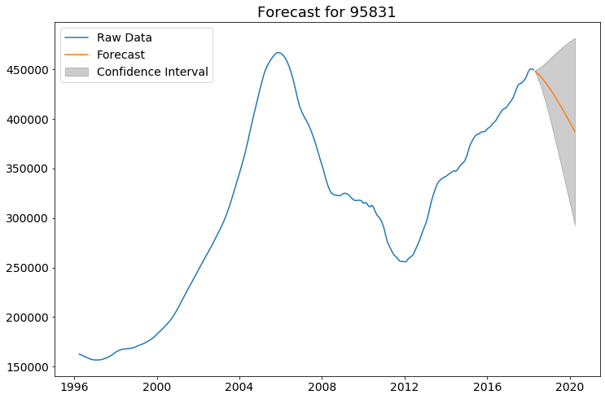


```python
print_results_lists()
```


    (['95616', '95619', '95864', '95831'],
     ['Davis', 'Diamond Springs', 'Arden-Arcade', 'Sacramento_Pocket'],
     ['Yolo', 'El Dorado', 'Sacramento', 'Sacramento'],
     [(2, 1, 2), (2, 1, 2), (8, 0, 2), (4, 0, 2)],
     [717863.06, 355774.45, 449047.92, 386994.52],
     [619575.34, 275292.09, 327568.68, 292621.1],
     [816150.79, 436256.81, 570527.16, 481367.94],
     [692300.0, 321100.0, 552700.0, 449300.0],
     [3.69, 10.8, -18.75, -13.87],
     [-10.5, -14.27, -40.73, -34.87],
     [17.89, 35.86, 3.23, 7.14])


```python
# pop_results_lists()
```


```python
# print_results_lists()
```

### Zip code 95831:  don't invest; lots of downside risk

By the model prediction, I would expect to see a -13.413% change in price by April 1, 2020.
At the lower bound of the confidence interval, I would expect to see a -32.77% change in price by April 1, 2020.
At the upper bound of the confidence interval, I would expect to see a 5.945% change in price by April 1, 2020.

## SacMetro:  95811 (Sacramento_DosRios) -- Mediocre predicted returns

### Set up dataframe


```python
geog_area = '95811'
```


```python
city = 'Sacramento_DosRios'
```


```python
county = 'Sacramento'
```


```python
ts = df_sac.loc[df_sac['Zip'] == geog_area]
```


```python
ts.head()
```


<div>
<style scoped>
    .dataframe tbody tr th:only-of-type {
        vertical-align: middle;
    }

    .dataframe tbody tr th {
        vertical-align: top;
    }

    .dataframe thead th {
        text-align: right;
    }
</style>
<table border="1" class="dataframe">
  <thead>
    <tr style="text-align: right;">
      <th></th>
      <th>Metro</th>
      <th>MetroState</th>
      <th>CountyName</th>
      <th>City</th>
      <th>Zip</th>
      <th>value</th>
    </tr>
    <tr>
      <th>time</th>
      <th></th>
      <th></th>
      <th></th>
      <th></th>
      <th></th>
      <th></th>
    </tr>
  </thead>
  <tbody>
    <tr>
      <td>1996-04-01</td>
      <td>Sacramento</td>
      <td>Sacramento CA</td>
      <td>Sacramento</td>
      <td>Sacramento</td>
      <td>95811</td>
      <td>119400.0</td>
    </tr>
    <tr>
      <td>1996-05-01</td>
      <td>Sacramento</td>
      <td>Sacramento CA</td>
      <td>Sacramento</td>
      <td>Sacramento</td>
      <td>95811</td>
      <td>119200.0</td>
    </tr>
    <tr>
      <td>1996-06-01</td>
      <td>Sacramento</td>
      <td>Sacramento CA</td>
      <td>Sacramento</td>
      <td>Sacramento</td>
      <td>95811</td>
      <td>119000.0</td>
    </tr>
    <tr>
      <td>1996-07-01</td>
      <td>Sacramento</td>
      <td>Sacramento CA</td>
      <td>Sacramento</td>
      <td>Sacramento</td>
      <td>95811</td>
      <td>118700.0</td>
    </tr>
    <tr>
      <td>1996-08-01</td>
      <td>Sacramento</td>
      <td>Sacramento CA</td>
      <td>Sacramento</td>
      <td>Sacramento</td>
      <td>95811</td>
      <td>118500.0</td>
    </tr>
  </tbody>
</table>
</div>


```python
ts = ts.resample('MS').asfreq()
```


```python
ts.head()
```


<div>
<style scoped>
    .dataframe tbody tr th:only-of-type {
        vertical-align: middle;
    }

    .dataframe tbody tr th {
        vertical-align: top;
    }

    .dataframe thead th {
        text-align: right;
    }
</style>
<table border="1" class="dataframe">
  <thead>
    <tr style="text-align: right;">
      <th></th>
      <th>Metro</th>
      <th>MetroState</th>
      <th>CountyName</th>
      <th>City</th>
      <th>Zip</th>
      <th>value</th>
    </tr>
    <tr>
      <th>time</th>
      <th></th>
      <th></th>
      <th></th>
      <th></th>
      <th></th>
      <th></th>
    </tr>
  </thead>
  <tbody>
    <tr>
      <td>1996-04-01</td>
      <td>Sacramento</td>
      <td>Sacramento CA</td>
      <td>Sacramento</td>
      <td>Sacramento</td>
      <td>95811</td>
      <td>119400.0</td>
    </tr>
    <tr>
      <td>1996-05-01</td>
      <td>Sacramento</td>
      <td>Sacramento CA</td>
      <td>Sacramento</td>
      <td>Sacramento</td>
      <td>95811</td>
      <td>119200.0</td>
    </tr>
    <tr>
      <td>1996-06-01</td>
      <td>Sacramento</td>
      <td>Sacramento CA</td>
      <td>Sacramento</td>
      <td>Sacramento</td>
      <td>95811</td>
      <td>119000.0</td>
    </tr>
    <tr>
      <td>1996-07-01</td>
      <td>Sacramento</td>
      <td>Sacramento CA</td>
      <td>Sacramento</td>
      <td>Sacramento</td>
      <td>95811</td>
      <td>118700.0</td>
    </tr>
    <tr>
      <td>1996-08-01</td>
      <td>Sacramento</td>
      <td>Sacramento CA</td>
      <td>Sacramento</td>
      <td>Sacramento</td>
      <td>95811</td>
      <td>118500.0</td>
    </tr>
  </tbody>
</table>
</div>


### Visualizations


```python
plot_single_geog(df_melt, geog_area, 'value', 'Zip', figsize=(12, 6), fontsize1=12, fontsize2=16)
```


```python
ts.boxplot(column = 'value')
plt.title(geog_area);

```


```python
plot_acf_pacf(ts.value)
```


```python
plot_seasonal_decomp(ts.value);

# Note that seasonality isn't much of a factor here; maximum difference of about $700 over the course of a year
```


### ARIMA parameters tuning


```python
p_values = [0, 1, 2, 4, 6, 8, 10]
d_values = range(0, 3)
q_values = range(0, 3)

```

### ARIMA modeling and forecasting results


```python
# This function will run parameter tuning and will append lists
# Uncomment to run (will take about 20-30 minutes)

# arima_forecast_run(ts, geog_area, city, county, p_values, d_values, q_values, confint=2)

# For 95811 (Sacramento_DosRios):
# ARIMA(0, 0, 0) MSE=18520983415.502
# ARIMA(0, 1, 0) MSE=17442930.600
# ARIMA(0, 1, 1) MSE=6663913.088
# ARIMA(0, 2, 0) MSE=6259233.402
# ARIMA(0, 2, 1) MSE=4809950.544
# ARIMA(0, 2, 2) MSE=4652346.488
# ARIMA(1, 1, 0) MSE=5929428.514
# ARIMA(1, 1, 1) MSE=4308533.425
# ARIMA(1, 1, 2) MSE=4415472.378
# ARIMA(1, 2, 0) MSE=5976013.490
# ARIMA(1, 2, 1) MSE=4869473.590
# ARIMA(1, 2, 2) MSE=4361666.655
# ARIMA(2, 0, 1) MSE=4394796.652
# ARIMA(2, 0, 2) MSE=4483510.578
# ARIMA(2, 1, 0) MSE=5423012.783
# ARIMA(2, 1, 1) MSE=4418327.311
# ARIMA(2, 1, 2) MSE=4240181.627
# ARIMA(2, 2, 0) MSE=4324646.641
# ARIMA(2, 2, 1) MSE=4186248.281
# ARIMA(4, 0, 1) MSE=4065706.695
# ARIMA(4, 0, 2) MSE=4140724.899
# ARIMA(4, 1, 0) MSE=4234643.204
# ARIMA(4, 1, 1) MSE=4218865.415
# ARIMA(4, 2, 0) MSE=4228783.375
# ARIMA(4, 2, 1) MSE=4121935.763
# ARIMA(6, 0, 1) MSE=4073047.098
# ARIMA(6, 1, 0) MSE=3905200.379
# ARIMA(6, 1, 1) MSE=3814571.556
# ARIMA(8, 2, 0) MSE=4101973.234
# ARIMA(10, 1, 0) MSE=3794247.844
# Best ARIMA(10, 1, 0) MSE=3794247.844
# Best ARIMA order = (10, 1, 0)
```


```python
# this function will not run parameter tuning, but will append lists
# Uncomment to run

best_cfg = (10,1,0)
arima_forecast_enter_pdq(ts, geog_area, city, county, best_cfg, confint=2)   
```

    For 95811 (Sacramento_DosRios):
    Best ARIMA order = (10, 1, 0)
                                 ARIMA Model Results                              
    ==============================================================================
    Dep. Variable:                D.value   No. Observations:                  264
    Model:                ARIMA(10, 1, 0)   Log Likelihood               -2251.853
    Method:                       css-mle   S.D. of innovations           1214.967
    Date:                Tue, 24 Mar 2020   AIC                           4527.706
    Time:                        19:19:06   BIC                           4570.618
    Sample:                    05-01-1996   HQIC                          4544.949
                             - 04-01-2018                                         
    ==================================================================================
                         coef    std err          z      P>|z|      [0.025      0.975]
    ----------------------------------------------------------------------------------
    const           1537.8361    878.462      1.751      0.081    -183.919    3259.591
    ar.L1.D.value      1.4319      0.061     23.473      0.000       1.312       1.552
    ar.L2.D.value     -1.0526      0.108     -9.778      0.000      -1.264      -0.842
    ar.L3.D.value      0.6721      0.126      5.325      0.000       0.425       0.919
    ar.L4.D.value     -0.0169      0.134     -0.127      0.899      -0.279       0.246
    ar.L5.D.value     -0.4846      0.129     -3.746      0.000      -0.738      -0.231
    ar.L6.D.value      0.6851      0.130      5.263      0.000       0.430       0.940
    ar.L7.D.value     -0.2980      0.137     -2.178      0.030      -0.566      -0.030
    ar.L8.D.value      0.0532      0.130      0.409      0.683      -0.202       0.308
    ar.L9.D.value      0.1197      0.111      1.081      0.281      -0.097       0.337
    ar.L10.D.value    -0.1935      0.062     -3.117      0.002      -0.315      -0.072
                                        Roots                                     
    ==============================================================================
                       Real          Imaginary           Modulus         Frequency
    ------------------------------------------------------------------------------
    AR.1             1.0768           -0.1098j            1.0824           -0.0162
    AR.2             1.0768           +0.1098j            1.0824            0.0162
    AR.3             0.7566           -0.7808j            1.0873           -0.1275
    AR.4             0.7566           +0.7808j            1.0873            0.1275
    AR.5             0.1741           -1.2313j            1.2435           -0.2276
    AR.6             0.1741           +1.2313j            1.2435            0.2276
    AR.7            -0.3115           -1.0586j            1.1035           -0.2955
    AR.8            -0.3115           +1.0586j            1.1035            0.2955
    AR.9            -1.3868           -0.2410j            1.4076           -0.4726
    AR.10           -1.3868           +0.2410j            1.4076            0.4726
    ------------------------------------------------------------------------------
    By the model prediction, I would expect to see a 0.546% change in price by April 1, 2020.
    At the lower bound of the confidence interval, I would expect to see a -19.012% change in price by April 1, 2020.
    At the upper bound of the confidence interval, I would expect to see a 20.104% change in price by April 1, 2020.


    (['95616', '95619', '95864', '95831', '95811'],
     ['Davis',
      'Diamond Springs',
      'Arden-Arcade',
      'Sacramento_Pocket',
      'Sacramento_DosRios'],
     ['Yolo', 'El Dorado', 'Sacramento', 'Sacramento', 'Sacramento'],
     [(2, 1, 2), (2, 1, 2), (8, 0, 2), (4, 0, 2), (10, 1, 0)],
     [717863.06, 355774.45, 449047.92, 386994.52, 570598.7],
     [619575.34, 275292.09, 327568.68, 292621.1, 459606.77],
     [816150.79, 436256.81, 570527.16, 481367.94, 681590.63],
     [692300.0, 321100.0, 552700.0, 449300.0, 567500.0],
     [3.69, 10.8, -18.75, -13.87, 0.55],
     [-10.5, -14.27, -40.73, -34.87, -19.01],
     [17.89, 35.86, 3.23, 7.14, 20.1])


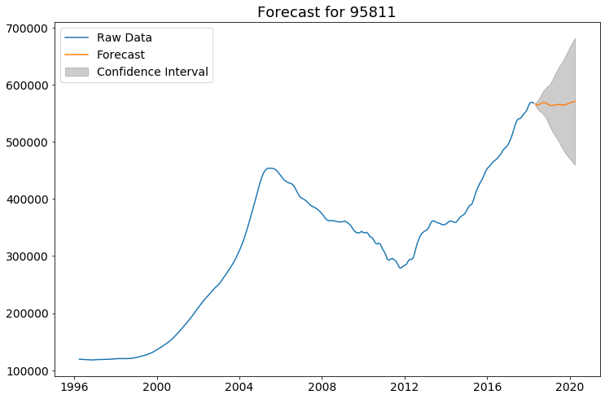


```python
print_results_lists()
```


    (['95616', '95619', '95864', '95831', '95811'],
     ['Davis',
      'Diamond Springs',
      'Arden-Arcade',
      'Sacramento_Pocket',
      'Sacramento_DosRios'],
     ['Yolo', 'El Dorado', 'Sacramento', 'Sacramento', 'Sacramento'],
     [(2, 1, 2), (2, 1, 2), (8, 0, 2), (4, 0, 2), (10, 1, 0)],
     [717863.06, 355774.45, 449047.92, 386994.52, 570598.7],
     [619575.34, 275292.09, 327568.68, 292621.1, 459606.77],
     [816150.79, 436256.81, 570527.16, 481367.94, 681590.63],
     [692300.0, 321100.0, 552700.0, 449300.0, 567500.0],
     [3.69, 10.8, -18.75, -13.87, 0.55],
     [-10.5, -14.27, -40.73, -34.87, -19.01],
     [17.89, 35.86, 3.23, 7.14, 20.1])


```python
# pop_results_lists()
```


```python
# print_results_lists()
```

### Zip code 95811:  Don't invest--mediocre predicted returns with significant potential downside (but also significant potential upside)

By the model prediction, I would expect to see a 0.546% change in price by April 1, 2020.
At the lower bound of the confidence interval, I would expect to see a -19.012% change in price by April 1, 2020.
At the upper bound of the confidence interval, I would expect to see a 20.104% change in price by April 1, 2020.

## SacMetro:  95818 (Sacramento_LandPark) -- Do not invest

### Set up dataframe


```python
geog_area = '95818'
```


```python
city = 'Sacramento_LandPark'
```


```python
county = 'Sacramento'
```


```python
ts = df_sac.loc[df_sac['Zip'] == geog_area]
```


```python
ts.head()
```


<div>
<style scoped>
    .dataframe tbody tr th:only-of-type {
        vertical-align: middle;
    }

    .dataframe tbody tr th {
        vertical-align: top;
    }

    .dataframe thead th {
        text-align: right;
    }
</style>
<table border="1" class="dataframe">
  <thead>
    <tr style="text-align: right;">
      <th></th>
      <th>Metro</th>
      <th>MetroState</th>
      <th>CountyName</th>
      <th>City</th>
      <th>Zip</th>
      <th>value</th>
    </tr>
    <tr>
      <th>time</th>
      <th></th>
      <th></th>
      <th></th>
      <th></th>
      <th></th>
      <th></th>
    </tr>
  </thead>
  <tbody>
    <tr>
      <td>1996-04-01</td>
      <td>Sacramento</td>
      <td>Sacramento CA</td>
      <td>Sacramento</td>
      <td>Sacramento</td>
      <td>95818</td>
      <td>144000.0</td>
    </tr>
    <tr>
      <td>1996-05-01</td>
      <td>Sacramento</td>
      <td>Sacramento CA</td>
      <td>Sacramento</td>
      <td>Sacramento</td>
      <td>95818</td>
      <td>144300.0</td>
    </tr>
    <tr>
      <td>1996-06-01</td>
      <td>Sacramento</td>
      <td>Sacramento CA</td>
      <td>Sacramento</td>
      <td>Sacramento</td>
      <td>95818</td>
      <td>144500.0</td>
    </tr>
    <tr>
      <td>1996-07-01</td>
      <td>Sacramento</td>
      <td>Sacramento CA</td>
      <td>Sacramento</td>
      <td>Sacramento</td>
      <td>95818</td>
      <td>144500.0</td>
    </tr>
    <tr>
      <td>1996-08-01</td>
      <td>Sacramento</td>
      <td>Sacramento CA</td>
      <td>Sacramento</td>
      <td>Sacramento</td>
      <td>95818</td>
      <td>144600.0</td>
    </tr>
  </tbody>
</table>
</div>


```python
ts = ts.resample('MS').asfreq()
```


```python
ts.head()
```


<div>
<style scoped>
    .dataframe tbody tr th:only-of-type {
        vertical-align: middle;
    }

    .dataframe tbody tr th {
        vertical-align: top;
    }

    .dataframe thead th {
        text-align: right;
    }
</style>
<table border="1" class="dataframe">
  <thead>
    <tr style="text-align: right;">
      <th></th>
      <th>Metro</th>
      <th>MetroState</th>
      <th>CountyName</th>
      <th>City</th>
      <th>Zip</th>
      <th>value</th>
    </tr>
    <tr>
      <th>time</th>
      <th></th>
      <th></th>
      <th></th>
      <th></th>
      <th></th>
      <th></th>
    </tr>
  </thead>
  <tbody>
    <tr>
      <td>1996-04-01</td>
      <td>Sacramento</td>
      <td>Sacramento CA</td>
      <td>Sacramento</td>
      <td>Sacramento</td>
      <td>95818</td>
      <td>144000.0</td>
    </tr>
    <tr>
      <td>1996-05-01</td>
      <td>Sacramento</td>
      <td>Sacramento CA</td>
      <td>Sacramento</td>
      <td>Sacramento</td>
      <td>95818</td>
      <td>144300.0</td>
    </tr>
    <tr>
      <td>1996-06-01</td>
      <td>Sacramento</td>
      <td>Sacramento CA</td>
      <td>Sacramento</td>
      <td>Sacramento</td>
      <td>95818</td>
      <td>144500.0</td>
    </tr>
    <tr>
      <td>1996-07-01</td>
      <td>Sacramento</td>
      <td>Sacramento CA</td>
      <td>Sacramento</td>
      <td>Sacramento</td>
      <td>95818</td>
      <td>144500.0</td>
    </tr>
    <tr>
      <td>1996-08-01</td>
      <td>Sacramento</td>
      <td>Sacramento CA</td>
      <td>Sacramento</td>
      <td>Sacramento</td>
      <td>95818</td>
      <td>144600.0</td>
    </tr>
  </tbody>
</table>
</div>


### Visualizations


```python
plot_single_geog(df_melt, geog_area, 'value', 'Zip', figsize=(12, 6), fontsize1=12, fontsize2=16)
```


```python
ts.boxplot(column = 'value')
plt.title(geog_area);

```


```python
plot_acf_pacf(ts.value)
```


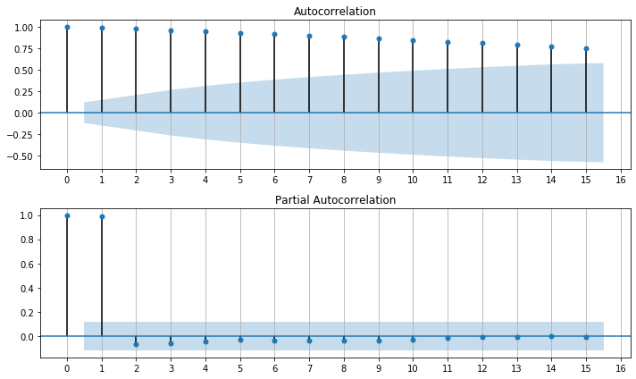


```python
plot_seasonal_decomp(ts.value);

# Note that seasonality isn't much of a factor here; maximum difference of about $700 over the course of a year
```


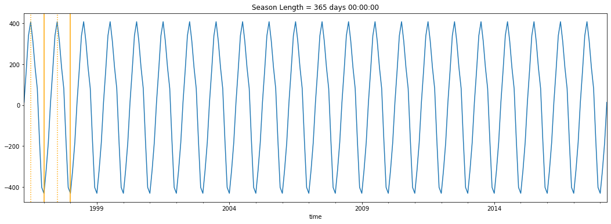


### ARIMA parameters tuning


```python
p_values = [0, 1, 2, 4, 6, 8, 10]
d_values = range(0, 3)
q_values = range(0, 3)

```

### ARIMA modeling and forecasting results


```python
# This function will run parameter tuning and will append lists
# Uncomment to run (will take about 20-30 minutes)

# arima_forecast_run(ts, geog_area, city, county, p_values, d_values, q_values, confint=2)

# For 95818 (Sacramento_LandPark):
# ARIMA(0, 0, 0) MSE=15030221845.905
# ARIMA(0, 0, 1) MSE=3839853199.085
# ARIMA(0, 1, 0) MSE=13853226.433
# ARIMA(0, 1, 1) MSE=4751401.353
# ARIMA(0, 2, 0) MSE=2389199.594
# ARIMA(0, 2, 1) MSE=1959226.911
# ARIMA(0, 2, 2) MSE=2011112.927
# ARIMA(1, 0, 0) MSE=17883620.287
# ARIMA(1, 1, 0) MSE=2327429.087
# ARIMA(1, 1, 1) MSE=1871827.369
# ARIMA(1, 1, 2) MSE=1924694.938
# ARIMA(1, 2, 0) MSE=2163044.788
# ARIMA(1, 2, 1) MSE=1991706.825
# ARIMA(2, 0, 0) MSE=2336085.096
# ARIMA(2, 0, 1) MSE=1887773.535
# ARIMA(2, 0, 2) MSE=1940292.855
# ARIMA(2, 1, 0) MSE=2049005.717
# ARIMA(2, 1, 1) MSE=1903363.993
# ARIMA(2, 2, 0) MSE=1973087.506
# ARIMA(2, 2, 1) MSE=1967258.535
# ARIMA(4, 0, 0) MSE=1931586.710
# ARIMA(4, 0, 1) MSE=1921479.017
# ARIMA(4, 1, 1) MSE=1939752.255
# ARIMA(4, 2, 0) MSE=2034430.135
# ARIMA(4, 2, 1) MSE=2078002.071
# ARIMA(6, 0, 0) MSE=1988625.655
# ARIMA(6, 0, 1) MSE=2024467.046
# ARIMA(6, 1, 1) MSE=2006733.869
# ARIMA(6, 2, 0) MSE=2084413.974
# ARIMA(6, 2, 1) MSE=2101965.381
# ARIMA(8, 0, 0) MSE=2053763.431
# ARIMA(8, 1, 1) MSE=1997711.981
# ARIMA(10, 0, 0) MSE=2126639.939
# ARIMA(10, 2, 1) MSE=2037544.338
# Best ARIMA(1, 1, 1) MSE=1871827.369
# Best ARIMA order = (1, 1, 1)
```


```python
# this function will not run parameter tuning, but will append lists
# Uncomment to run

best_cfg = (1,1,1)
arima_forecast_enter_pdq(ts, geog_area, city, county, best_cfg, confint=2)   
```

    For 95818 (Sacramento_LandPark):
    Best ARIMA order = (1, 1, 1)
                                 ARIMA Model Results                              
    ==============================================================================
    Dep. Variable:                D.value   No. Observations:                  264
    Model:                 ARIMA(1, 1, 1)   Log Likelihood               -2170.032
    Method:                       css-mle   S.D. of innovations            893.671
    Date:                Tue, 24 Mar 2020   AIC                           4348.063
    Time:                        19:19:20   BIC                           4362.367
    Sample:                    05-01-1996   HQIC                          4353.811
                             - 04-01-2018                                         
    =================================================================================
                        coef    std err          z      P>|z|      [0.025      0.975]
    ---------------------------------------------------------------------------------
    const          1391.9330    968.111      1.438      0.152    -505.530    3289.396
    ar.L1.D.value     0.9172      0.024     37.636      0.000       0.869       0.965
    ma.L1.D.value     0.5161      0.048     10.706      0.000       0.422       0.611
                                        Roots                                    
    =============================================================================
                      Real          Imaginary           Modulus         Frequency
    -----------------------------------------------------------------------------
    AR.1            1.0903           +0.0000j            1.0903            0.0000
    MA.1           -1.9374           +0.0000j            1.9374            0.5000
    -----------------------------------------------------------------------------
    By the model prediction, I would expect to see a -0.008% change in price by April 1, 2020.
    At the lower bound of the confidence interval, I would expect to see a -17.609% change in price by April 1, 2020.
    At the upper bound of the confidence interval, I would expect to see a 17.594% change in price by April 1, 2020.


    (['95616', '95619', '95864', '95831', '95811', '95818'],
     ['Davis',
      'Diamond Springs',
      'Arden-Arcade',
      'Sacramento_Pocket',
      'Sacramento_DosRios',
      'Sacramento_LandPark'],
     ['Yolo', 'El Dorado', 'Sacramento', 'Sacramento', 'Sacramento', 'Sacramento'],
     [(2, 1, 2), (2, 1, 2), (8, 0, 2), (4, 0, 2), (10, 1, 0), (1, 1, 1)],
     [717863.06, 355774.45, 449047.92, 386994.52, 570598.7, 563857.1],
     [619575.34, 275292.09, 327568.68, 292621.1, 459606.77, 464602.96],
     [816150.79, 436256.81, 570527.16, 481367.94, 681590.63, 663111.23],
     [692300.0, 321100.0, 552700.0, 449300.0, 567500.0, 563900.0],
     [3.69, 10.8, -18.75, -13.87, 0.55, -0.01],
     [-10.5, -14.27, -40.73, -34.87, -19.01, -17.61],
     [17.89, 35.86, 3.23, 7.14, 20.1, 17.59])


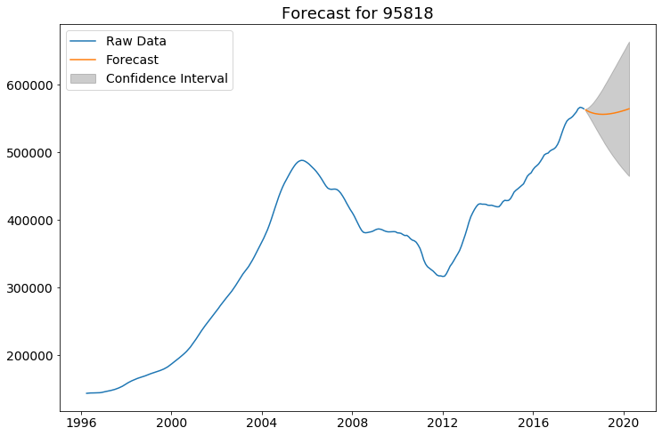


```python
print_results_lists()
```


    (['95616', '95619', '95864', '95831', '95811', '95818'],
     ['Davis',
      'Diamond Springs',
      'Arden-Arcade',
      'Sacramento_Pocket',
      'Sacramento_DosRios',
      'Sacramento_LandPark'],
     ['Yolo', 'El Dorado', 'Sacramento', 'Sacramento', 'Sacramento', 'Sacramento'],
     [(2, 1, 2), (2, 1, 2), (8, 0, 2), (4, 0, 2), (10, 1, 0), (1, 1, 1)],
     [717863.06, 355774.45, 449047.92, 386994.52, 570598.7, 563857.1],
     [619575.34, 275292.09, 327568.68, 292621.1, 459606.77, 464602.96],
     [816150.79, 436256.81, 570527.16, 481367.94, 681590.63, 663111.23],
     [692300.0, 321100.0, 552700.0, 449300.0, 567500.0, 563900.0],
     [3.69, 10.8, -18.75, -13.87, 0.55, -0.01],
     [-10.5, -14.27, -40.73, -34.87, -19.01, -17.61],
     [17.89, 35.86, 3.23, 7.14, 20.1, 17.59])


```python
# pop_results_lists()
```


```python
# print_results_lists()
```

### Zip code 95818:  Do not invest

By the model prediction, I would expect to see a -0.008% change in price by April 1, 2020.
At the lower bound of the confidence interval, I would expect to see a -17.609% change in price by April 1, 2020.
At the upper bound of the confidence interval, I would expect to see a 17.594% change in price by April 1, 2020.

## SacMetro:  95630 (Folsom)--Poor investment opportunity

### Set up dataframe


```python
geog_area = '95630'
```


```python
city = 'Folsom'
```


```python
county = 'Sacramento'
```


```python
ts = df_sac.loc[df_sac['Zip'] == geog_area]
```


```python
ts.head()
```


<div>
<style scoped>
    .dataframe tbody tr th:only-of-type {
        vertical-align: middle;
    }

    .dataframe tbody tr th {
        vertical-align: top;
    }

    .dataframe thead th {
        text-align: right;
    }
</style>
<table border="1" class="dataframe">
  <thead>
    <tr style="text-align: right;">
      <th></th>
      <th>Metro</th>
      <th>MetroState</th>
      <th>CountyName</th>
      <th>City</th>
      <th>Zip</th>
      <th>value</th>
    </tr>
    <tr>
      <th>time</th>
      <th></th>
      <th></th>
      <th></th>
      <th></th>
      <th></th>
      <th></th>
    </tr>
  </thead>
  <tbody>
    <tr>
      <td>1996-04-01</td>
      <td>Sacramento</td>
      <td>Sacramento CA</td>
      <td>Sacramento</td>
      <td>Folsom</td>
      <td>95630</td>
      <td>190000.0</td>
    </tr>
    <tr>
      <td>1996-05-01</td>
      <td>Sacramento</td>
      <td>Sacramento CA</td>
      <td>Sacramento</td>
      <td>Folsom</td>
      <td>95630</td>
      <td>189300.0</td>
    </tr>
    <tr>
      <td>1996-06-01</td>
      <td>Sacramento</td>
      <td>Sacramento CA</td>
      <td>Sacramento</td>
      <td>Folsom</td>
      <td>95630</td>
      <td>188500.0</td>
    </tr>
    <tr>
      <td>1996-07-01</td>
      <td>Sacramento</td>
      <td>Sacramento CA</td>
      <td>Sacramento</td>
      <td>Folsom</td>
      <td>95630</td>
      <td>187800.0</td>
    </tr>
    <tr>
      <td>1996-08-01</td>
      <td>Sacramento</td>
      <td>Sacramento CA</td>
      <td>Sacramento</td>
      <td>Folsom</td>
      <td>95630</td>
      <td>187300.0</td>
    </tr>
  </tbody>
</table>
</div>


```python
ts = ts.resample('MS').asfreq()
```


```python
ts.head()
```


<div>
<style scoped>
    .dataframe tbody tr th:only-of-type {
        vertical-align: middle;
    }

    .dataframe tbody tr th {
        vertical-align: top;
    }

    .dataframe thead th {
        text-align: right;
    }
</style>
<table border="1" class="dataframe">
  <thead>
    <tr style="text-align: right;">
      <th></th>
      <th>Metro</th>
      <th>MetroState</th>
      <th>CountyName</th>
      <th>City</th>
      <th>Zip</th>
      <th>value</th>
    </tr>
    <tr>
      <th>time</th>
      <th></th>
      <th></th>
      <th></th>
      <th></th>
      <th></th>
      <th></th>
    </tr>
  </thead>
  <tbody>
    <tr>
      <td>1996-04-01</td>
      <td>Sacramento</td>
      <td>Sacramento CA</td>
      <td>Sacramento</td>
      <td>Folsom</td>
      <td>95630</td>
      <td>190000.0</td>
    </tr>
    <tr>
      <td>1996-05-01</td>
      <td>Sacramento</td>
      <td>Sacramento CA</td>
      <td>Sacramento</td>
      <td>Folsom</td>
      <td>95630</td>
      <td>189300.0</td>
    </tr>
    <tr>
      <td>1996-06-01</td>
      <td>Sacramento</td>
      <td>Sacramento CA</td>
      <td>Sacramento</td>
      <td>Folsom</td>
      <td>95630</td>
      <td>188500.0</td>
    </tr>
    <tr>
      <td>1996-07-01</td>
      <td>Sacramento</td>
      <td>Sacramento CA</td>
      <td>Sacramento</td>
      <td>Folsom</td>
      <td>95630</td>
      <td>187800.0</td>
    </tr>
    <tr>
      <td>1996-08-01</td>
      <td>Sacramento</td>
      <td>Sacramento CA</td>
      <td>Sacramento</td>
      <td>Folsom</td>
      <td>95630</td>
      <td>187300.0</td>
    </tr>
  </tbody>
</table>
</div>


### Visualizations


```python
plot_single_geog(df_melt, geog_area, 'value', 'Zip', figsize=(12, 6), fontsize1=12, fontsize2=16)
```


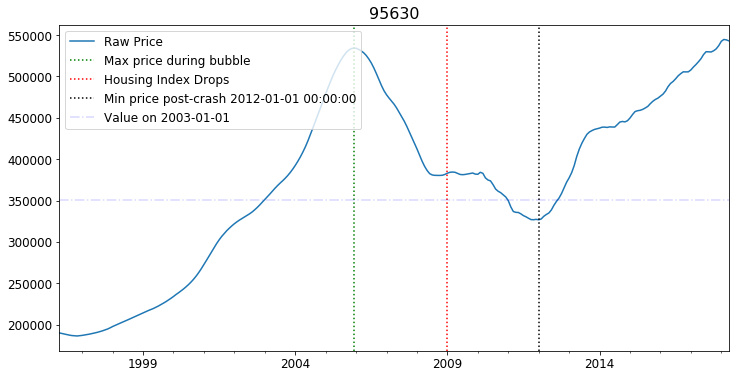


```python
ts.boxplot(column = 'value')
plt.title(geog_area);

```


```python
plot_acf_pacf(ts.value)
```


```python
plot_seasonal_decomp(ts.value);

# Note that seasonality isn't much of a factor here; maximum difference of about $700 over the course of a year
```


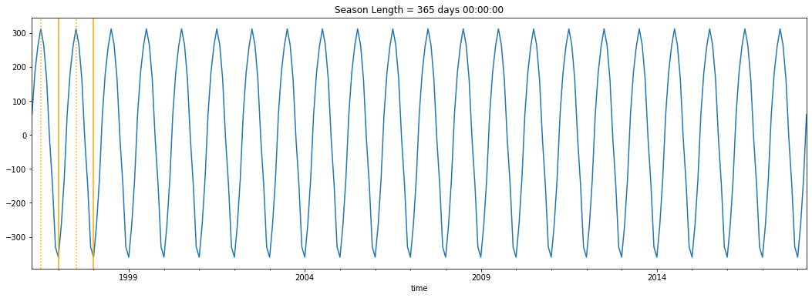


### ARIMA parameters tuning


```python
p_values = [0, 1, 2, 4, 6, 8, 10]
d_values = range(0, 3)
q_values = range(0, 3)

```

### ARIMA modeling and forecasting results


```python
# This function will run parameter tuning and will append lists
# Uncomment to run (will take about 20-30 minutes)

# arima_forecast_run(ts, geog_area, city, county, p_values, d_values, q_values, confint=2)

# For 95630 (Folsom):
# ARIMA(0, 0, 0) MSE=10362329307.124
# ARIMA(0, 0, 1) MSE=2645868476.081
# ARIMA(0, 1, 0) MSE=9743925.543
# ARIMA(0, 1, 1) MSE=3384759.352
# ARIMA(0, 2, 0) MSE=2231534.221
# ARIMA(0, 2, 1) MSE=1765398.821
# ARIMA(0, 2, 2) MSE=1725287.347
# ARIMA(1, 0, 0) MSE=13000642.724
# ARIMA(1, 1, 0) MSE=2165672.110
# ARIMA(1, 1, 1) MSE=1669822.683
# ARIMA(1, 2, 0) MSE=2097363.729
# ARIMA(2, 0, 1) MSE=1683047.579
# ARIMA(2, 1, 0) MSE=1990273.120
# ARIMA(2, 2, 0) MSE=1521322.663
# ARIMA(2, 2, 1) MSE=1573322.566
# ARIMA(2, 2, 2) MSE=1472694.651
# ARIMA(4, 0, 1) MSE=1550263.486
# ARIMA(4, 0, 2) MSE=1444795.113
# ARIMA(4, 1, 1) MSE=1652538.375
# ARIMA(4, 1, 2) MSE=1569702.218
# ARIMA(4, 2, 0) MSE=1668251.905
# ARIMA(4, 2, 1) MSE=1688284.002
# ARIMA(6, 0, 1) MSE=1690896.912
# ARIMA(6, 2, 0) MSE=1632207.031
# ARIMA(6, 2, 1) MSE=1625695.243
# ARIMA(8, 2, 0) MSE=1644832.823
# ARIMA(8, 2, 1) MSE=1662534.232
# ARIMA(10, 2, 0) MSE=1735218.338
# ARIMA(10, 2, 1) MSE=1702121.283
# Best ARIMA(4, 0, 2) MSE=1444795.113
# Best ARIMA order = (4, 0, 2)
```


```python
# this function will not run parameter tuning, but will append lists
# Uncomment to run

best_cfg = (4,0,2)
arima_forecast_enter_pdq(ts, geog_area, city, county, best_cfg, confint=2)   
```

    For 95630 (Folsom):
    Best ARIMA order = (4, 0, 2)
                                  ARMA Model Results                              
    ==============================================================================
    Dep. Variable:                  value   No. Observations:                  265
    Model:                     ARMA(4, 2)   Log Likelihood               -2158.700
    Method:                       css-mle   S.D. of innovations            812.114
    Date:                Tue, 24 Mar 2020   AIC                           4333.400
    Time:                        19:20:09   BIC                           4362.037
    Sample:                    04-01-1996   HQIC                          4344.906
                             - 04-01-2018                                         
    ===============================================================================
                      coef    std err          z      P>|z|      [0.025      0.975]
    -------------------------------------------------------------------------------
    const        3.737e+05    5.5e+04      6.796      0.000    2.66e+05    4.81e+05
    ar.L1.value     1.4051      0.128     10.988      0.000       1.154       1.656
    ar.L2.value    -0.4234      0.285     -1.487      0.138      -0.981       0.135
    ar.L3.value     0.5303      0.227      2.332      0.020       0.085       0.976
    ar.L4.value    -0.5144      0.077     -6.639      0.000      -0.666      -0.363
    ma.L1.value     1.2652      0.156      8.136      0.000       0.960       1.570
    ma.L2.value     0.6796      0.104      6.550      0.000       0.476       0.883
                                        Roots                                    
    =============================================================================
                      Real          Imaginary           Modulus         Frequency
    -----------------------------------------------------------------------------
    AR.1            1.0235           -0.0250j            1.0238           -0.0039
    AR.2            1.0235           +0.0250j            1.0238            0.0039
    AR.3           -0.5080           -1.2636j            1.3619           -0.3108
    AR.4           -0.5080           +1.2636j            1.3619            0.3108
    MA.1           -0.9308           -0.7779j            1.2130           -0.3892
    MA.2           -0.9308           +0.7779j            1.2130            0.3892
    -----------------------------------------------------------------------------
    By the model prediction, I would expect to see a -10.824% change in price by April 1, 2020.
    At the lower bound of the confidence interval, I would expect to see a -29.626% change in price by April 1, 2020.
    At the upper bound of the confidence interval, I would expect to see a 7.978% change in price by April 1, 2020.


    (['95616', '95619', '95864', '95831', '95811', '95818', '95630'],
     ['Davis',
      'Diamond Springs',
      'Arden-Arcade',
      'Sacramento_Pocket',
      'Sacramento_DosRios',
      'Sacramento_LandPark',
      'Folsom'],
     ['Yolo',
      'El Dorado',
      'Sacramento',
      'Sacramento',
      'Sacramento',
      'Sacramento',
      'Sacramento'],
     [(2, 1, 2),
      (2, 1, 2),
      (8, 0, 2),
      (4, 0, 2),
      (10, 1, 0),
      (1, 1, 1),
      (4, 0, 2)],
     [717863.06, 355774.45, 449047.92, 386994.52, 570598.7, 563857.1, 484136.82],
     [619575.34, 275292.09, 327568.68, 292621.1, 459606.77, 464602.96, 382062.81],
     [816150.79, 436256.81, 570527.16, 481367.94, 681590.63, 663111.23, 586210.84],
     [692300.0, 321100.0, 552700.0, 449300.0, 567500.0, 563900.0, 542900.0],
     [3.69, 10.8, -18.75, -13.87, 0.55, -0.01, -10.82],
     [-10.5, -14.27, -40.73, -34.87, -19.01, -17.61, -29.63],
     [17.89, 35.86, 3.23, 7.14, 20.1, 17.59, 7.98])


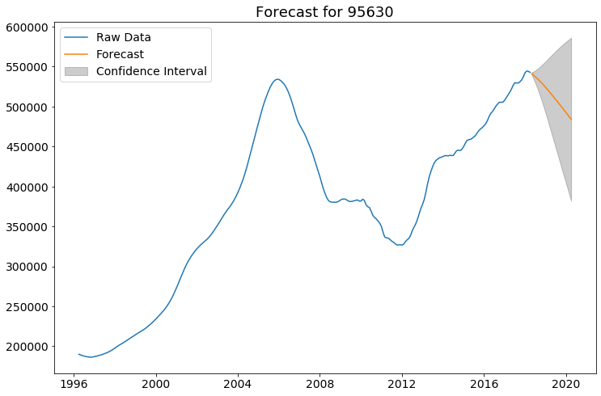


```python
print_results_lists()
```


    (['95616', '95619', '95864', '95831', '95811', '95818', '95630'],
     ['Davis',
      'Diamond Springs',
      'Arden-Arcade',
      'Sacramento_Pocket',
      'Sacramento_DosRios',
      'Sacramento_LandPark',
      'Folsom'],
     ['Yolo',
      'El Dorado',
      'Sacramento',
      'Sacramento',
      'Sacramento',
      'Sacramento',
      'Sacramento'],
     [(2, 1, 2),
      (2, 1, 2),
      (8, 0, 2),
      (4, 0, 2),
      (10, 1, 0),
      (1, 1, 1),
      (4, 0, 2)],
     [717863.06, 355774.45, 449047.92, 386994.52, 570598.7, 563857.1, 484136.82],
     [619575.34, 275292.09, 327568.68, 292621.1, 459606.77, 464602.96, 382062.81],
     [816150.79, 436256.81, 570527.16, 481367.94, 681590.63, 663111.23, 586210.84],
     [692300.0, 321100.0, 552700.0, 449300.0, 567500.0, 563900.0, 542900.0],
     [3.69, 10.8, -18.75, -13.87, 0.55, -0.01, -10.82],
     [-10.5, -14.27, -40.73, -34.87, -19.01, -17.61, -29.63],
     [17.89, 35.86, 3.23, 7.14, 20.1, 17.59, 7.98])


```python
# pop_results_lists()
```


```python
# print_results_lists()
```

### Zip code 95630:  Poor investment rating; negative expected return 

By the model prediction, I would expect to see a -10.824% change in price by April 1, 2020.
At the lower bound of the confidence interval, I would expect to see a -29.626% change in price by April 1, 2020.
At the upper bound of the confidence interval, I would expect to see a 7.978% change in price by April 1, 2020.


## SacMetro:  96140 (Carnelian Bay) -- Decent investment opportunity with potentially substantial upside returns and tolerable downside returns¶

### Set up dataframe


```python
geog_area = '96140'
```


```python
city = 'Carnelian Bay'
```


```python
county = 'Placer'
```


```python
ts = df_sac.loc[df_sac['Zip'] == geog_area]
```


```python
ts.head()
```


<div>
<style scoped>
    .dataframe tbody tr th:only-of-type {
        vertical-align: middle;
    }

    .dataframe tbody tr th {
        vertical-align: top;
    }

    .dataframe thead th {
        text-align: right;
    }
</style>
<table border="1" class="dataframe">
  <thead>
    <tr style="text-align: right;">
      <th></th>
      <th>Metro</th>
      <th>MetroState</th>
      <th>CountyName</th>
      <th>City</th>
      <th>Zip</th>
      <th>value</th>
    </tr>
    <tr>
      <th>time</th>
      <th></th>
      <th></th>
      <th></th>
      <th></th>
      <th></th>
      <th></th>
    </tr>
  </thead>
  <tbody>
    <tr>
      <td>1996-04-01</td>
      <td>Sacramento</td>
      <td>Sacramento CA</td>
      <td>Placer</td>
      <td>Carnelian Bay</td>
      <td>96140</td>
      <td>179100.0</td>
    </tr>
    <tr>
      <td>1996-05-01</td>
      <td>Sacramento</td>
      <td>Sacramento CA</td>
      <td>Placer</td>
      <td>Carnelian Bay</td>
      <td>96140</td>
      <td>179000.0</td>
    </tr>
    <tr>
      <td>1996-06-01</td>
      <td>Sacramento</td>
      <td>Sacramento CA</td>
      <td>Placer</td>
      <td>Carnelian Bay</td>
      <td>96140</td>
      <td>179000.0</td>
    </tr>
    <tr>
      <td>1996-07-01</td>
      <td>Sacramento</td>
      <td>Sacramento CA</td>
      <td>Placer</td>
      <td>Carnelian Bay</td>
      <td>96140</td>
      <td>178900.0</td>
    </tr>
    <tr>
      <td>1996-08-01</td>
      <td>Sacramento</td>
      <td>Sacramento CA</td>
      <td>Placer</td>
      <td>Carnelian Bay</td>
      <td>96140</td>
      <td>178900.0</td>
    </tr>
  </tbody>
</table>
</div>


```python
ts = ts.resample('MS').asfreq()
```


```python
ts.head()
```


<div>
<style scoped>
    .dataframe tbody tr th:only-of-type {
        vertical-align: middle;
    }

    .dataframe tbody tr th {
        vertical-align: top;
    }

    .dataframe thead th {
        text-align: right;
    }
</style>
<table border="1" class="dataframe">
  <thead>
    <tr style="text-align: right;">
      <th></th>
      <th>Metro</th>
      <th>MetroState</th>
      <th>CountyName</th>
      <th>City</th>
      <th>Zip</th>
      <th>value</th>
    </tr>
    <tr>
      <th>time</th>
      <th></th>
      <th></th>
      <th></th>
      <th></th>
      <th></th>
      <th></th>
    </tr>
  </thead>
  <tbody>
    <tr>
      <td>1996-04-01</td>
      <td>Sacramento</td>
      <td>Sacramento CA</td>
      <td>Placer</td>
      <td>Carnelian Bay</td>
      <td>96140</td>
      <td>179100.0</td>
    </tr>
    <tr>
      <td>1996-05-01</td>
      <td>Sacramento</td>
      <td>Sacramento CA</td>
      <td>Placer</td>
      <td>Carnelian Bay</td>
      <td>96140</td>
      <td>179000.0</td>
    </tr>
    <tr>
      <td>1996-06-01</td>
      <td>Sacramento</td>
      <td>Sacramento CA</td>
      <td>Placer</td>
      <td>Carnelian Bay</td>
      <td>96140</td>
      <td>179000.0</td>
    </tr>
    <tr>
      <td>1996-07-01</td>
      <td>Sacramento</td>
      <td>Sacramento CA</td>
      <td>Placer</td>
      <td>Carnelian Bay</td>
      <td>96140</td>
      <td>178900.0</td>
    </tr>
    <tr>
      <td>1996-08-01</td>
      <td>Sacramento</td>
      <td>Sacramento CA</td>
      <td>Placer</td>
      <td>Carnelian Bay</td>
      <td>96140</td>
      <td>178900.0</td>
    </tr>
  </tbody>
</table>
</div>


### Visualizations


```python
plot_single_geog(df_melt, geog_area, 'value', 'Zip', figsize=(12, 6), fontsize1=12, fontsize2=16)
```


```python
ts.boxplot(column = 'value')
plt.title(geog_area);

```


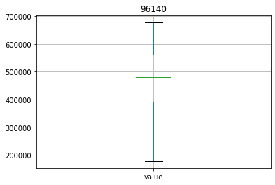


```python
plot_acf_pacf(ts.value)
```


```python
plot_seasonal_decomp(ts.value);

# Note that seasonality isn't much of a factor here; maximum difference of about $700 over the course of a year
```


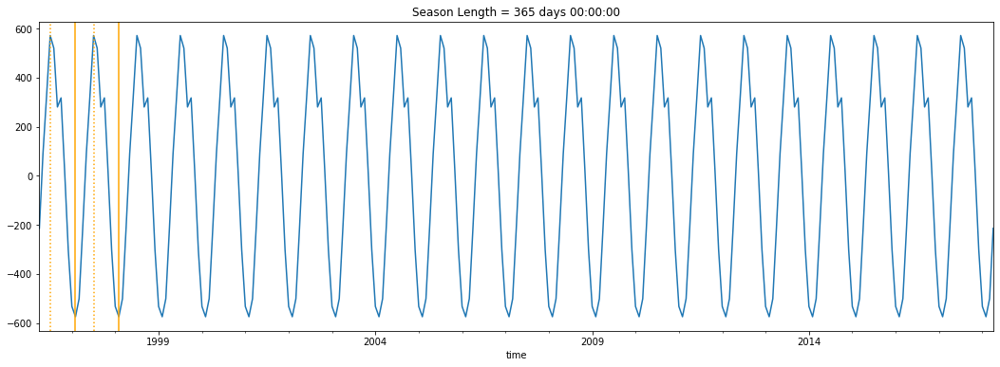


### ARIMA parameters tuning


```python
p_values = [0, 1, 2, 4, 6, 8, 10]
d_values = range(0, 3)
q_values = range(0, 3)

```

### ARIMA modeling and forecasting results


```python
# This function will run parameter tuning and will append lists
# Uncomment to run (will take about 20-30 minutes)

# arima_forecast_run(ts, geog_area, city, county, p_values, d_values, q_values, confint=2)

# For 96140 (Carnelian Bay):
# ARIMA(0, 0, 0) MSE=6340073169.802
# ARIMA(0, 0, 1) MSE=1653470877.352
# ARIMA(0, 1, 0) MSE=22637370.726
# ARIMA(0, 1, 1) MSE=10760383.623
# ARIMA(0, 2, 0) MSE=12994079.688
# ARIMA(0, 2, 1) MSE=10562560.427
# ARIMA(1, 0, 0) MSE=27514928.547
# ARIMA(1, 1, 0) MSE=12028414.298
# ARIMA(1, 2, 0) MSE=12548849.515
# ARIMA(2, 0, 0) MSE=12135396.057
# ARIMA(2, 1, 0) MSE=10767593.483
# ARIMA(2, 1, 2) MSE=7013523.951
# ARIMA(2, 2, 0) MSE=10270049.843
# ARIMA(2, 2, 1) MSE=10534293.196
# ARIMA(4, 0, 0) MSE=10799618.150
# ARIMA(4, 0, 1) MSE=9876824.779
# ARIMA(4, 0, 2) MSE=7925502.537
# ARIMA(4, 1, 0) MSE=9926713.152
# ARIMA(4, 1, 1) MSE=10174103.377
# ARIMA(4, 2, 0) MSE=10270399.321
# ARIMA(6, 0, 0) MSE=9903809.352
# ARIMA(6, 0, 1) MSE=10764584.137
# ARIMA(6, 0, 2) MSE=7829783.463
# ARIMA(6, 2, 0) MSE=9674385.494
# ARIMA(8, 0, 0) MSE=9354923.086
# ARIMA(10, 0, 0) MSE=9723833.074
# Best ARIMA(2, 1, 2) MSE=7013523.951
# Best ARIMA order = (2, 1, 2)
```


```python
# this function will not run parameter tuning, but will append lists
# Uncomment to run

best_cfg = (2,1,2)
arima_forecast_enter_pdq(ts, geog_area, city, county, best_cfg, confint=2)   
```

    For 96140 (Carnelian Bay):
    Best ARIMA order = (2, 1, 2)
                                 ARIMA Model Results                              
    ==============================================================================
    Dep. Variable:                D.value   No. Observations:                  264
    Model:                 ARIMA(2, 1, 2)   Log Likelihood               -2353.884
    Method:                       css-mle   S.D. of innovations           1780.582
    Date:                Tue, 24 Mar 2020   AIC                           4719.768
    Time:                        19:20:26   BIC                           4741.223
    Sample:                    05-01-1996   HQIC                          4728.389
                             - 04-01-2018                                         
    =================================================================================
                        coef    std err          z      P>|z|      [0.025      0.975]
    ---------------------------------------------------------------------------------
    const          1757.2551    893.945      1.966      0.050       5.155    3509.355
    ar.L1.D.value     0.1234      0.067      1.830      0.068      -0.009       0.256
    ar.L2.D.value     0.4337      0.067      6.477      0.000       0.302       0.565
    ma.L1.D.value     1.6981      0.037     46.502      0.000       1.627       1.770
    ma.L2.D.value     0.9585      0.027     35.492      0.000       0.906       1.011
                                        Roots                                    
    =============================================================================
                      Real          Imaginary           Modulus         Frequency
    -----------------------------------------------------------------------------
    AR.1            1.3828           +0.0000j            1.3828            0.0000
    AR.2           -1.6673           +0.0000j            1.6673            0.5000
    MA.1           -0.8858           -0.5086j            1.0214           -0.4170
    MA.2           -0.8858           +0.5086j            1.0214            0.4170
    -----------------------------------------------------------------------------
    By the model prediction, I would expect to see a 6.549% change in price by April 1, 2020.
    At the lower bound of the confidence interval, I would expect to see a -13.044% change in price by April 1, 2020.
    At the upper bound of the confidence interval, I would expect to see a 26.143% change in price by April 1, 2020.


    (['95616', '95619', '95864', '95831', '95811', '95818', '95630', '96140'],
     ['Davis',
      'Diamond Springs',
      'Arden-Arcade',
      'Sacramento_Pocket',
      'Sacramento_DosRios',
      'Sacramento_LandPark',
      'Folsom',
      'Carnelian Bay'],
     ['Yolo',
      'El Dorado',
      'Sacramento',
      'Sacramento',
      'Sacramento',
      'Sacramento',
      'Sacramento',
      'Placer'],
     [(2, 1, 2),
      (2, 1, 2),
      (8, 0, 2),
      (4, 0, 2),
      (10, 1, 0),
      (1, 1, 1),
      (4, 0, 2),
      (2, 1, 2)],
     [717863.06,
      355774.45,
      449047.92,
      386994.52,
      570598.7,
      563857.1,
      484136.82,
      686817.86],
     [619575.34,
      275292.09,
      327568.68,
      292621.1,
      459606.77,
      464602.96,
      382062.81,
      560520.55],
     [816150.79,
      436256.81,
      570527.16,
      481367.94,
      681590.63,
      663111.23,
      586210.84,
      813115.17],
     [692300.0,
      321100.0,
      552700.0,
      449300.0,
      567500.0,
      563900.0,
      542900.0,
      644600.0],
     [3.69, 10.8, -18.75, -13.87, 0.55, -0.01, -10.82, 6.55],
     [-10.5, -14.27, -40.73, -34.87, -19.01, -17.61, -29.63, -13.04],
     [17.89, 35.86, 3.23, 7.14, 20.1, 17.59, 7.98, 26.14])


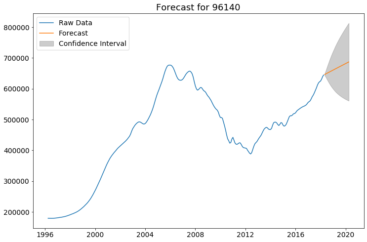


```python
print_results_lists()
```


    (['95616', '95619', '95864', '95831', '95811', '95818', '95630', '96140'],
     ['Davis',
      'Diamond Springs',
      'Arden-Arcade',
      'Sacramento_Pocket',
      'Sacramento_DosRios',
      'Sacramento_LandPark',
      'Folsom',
      'Carnelian Bay'],
     ['Yolo',
      'El Dorado',
      'Sacramento',
      'Sacramento',
      'Sacramento',
      'Sacramento',
      'Sacramento',
      'Placer'],
     [(2, 1, 2),
      (2, 1, 2),
      (8, 0, 2),
      (4, 0, 2),
      (10, 1, 0),
      (1, 1, 1),
      (4, 0, 2),
      (2, 1, 2)],
     [717863.06,
      355774.45,
      449047.92,
      386994.52,
      570598.7,
      563857.1,
      484136.82,
      686817.86],
     [619575.34,
      275292.09,
      327568.68,
      292621.1,
      459606.77,
      464602.96,
      382062.81,
      560520.55],
     [816150.79,
      436256.81,
      570527.16,
      481367.94,
      681590.63,
      663111.23,
      586210.84,
      813115.17],
     [692300.0,
      321100.0,
      552700.0,
      449300.0,
      567500.0,
      563900.0,
      542900.0,
      644600.0],
     [3.69, 10.8, -18.75, -13.87, 0.55, -0.01, -10.82, 6.55],
     [-10.5, -14.27, -40.73, -34.87, -19.01, -17.61, -29.63, -13.04],
     [17.89, 35.86, 3.23, 7.14, 20.1, 17.59, 7.98, 26.14])


```python
# pop_results_lists()
```


```python
# print_results_lists()
```

### Zip code 96140 (Carnelian Bay):  Decent investment opportunity with potentially substantial upside returns and tolerable downside returns

By the model prediction, I would expect to see a 6.549% change in price by April 1, 2020.
At the lower bound of the confidence interval, I would expect to see a -13.044% change in price by April 1, 2020.
At the upper bound of the confidence interval, I would expect to see a 26.143% change in price by April 1, 2020.

## SacMetro:  95672 (Rescue) -- Excellent investment opportunity 

### Set up dataframe


```python
geog_area = '95672'
```


```python
city = 'Rescue'
```


```python
county = 'El Dorado'
```


```python
ts = df_sac.loc[df_sac['Zip'] == geog_area]
```


```python
ts.head()
```


<div>
<style scoped>
    .dataframe tbody tr th:only-of-type {
        vertical-align: middle;
    }

    .dataframe tbody tr th {
        vertical-align: top;
    }

    .dataframe thead th {
        text-align: right;
    }
</style>
<table border="1" class="dataframe">
  <thead>
    <tr style="text-align: right;">
      <th></th>
      <th>Metro</th>
      <th>MetroState</th>
      <th>CountyName</th>
      <th>City</th>
      <th>Zip</th>
      <th>value</th>
    </tr>
    <tr>
      <th>time</th>
      <th></th>
      <th></th>
      <th></th>
      <th></th>
      <th></th>
      <th></th>
    </tr>
  </thead>
  <tbody>
    <tr>
      <td>1996-04-01</td>
      <td>Sacramento</td>
      <td>Sacramento CA</td>
      <td>El Dorado</td>
      <td>Rescue</td>
      <td>95672</td>
      <td>196500.0</td>
    </tr>
    <tr>
      <td>1996-05-01</td>
      <td>Sacramento</td>
      <td>Sacramento CA</td>
      <td>El Dorado</td>
      <td>Rescue</td>
      <td>95672</td>
      <td>196600.0</td>
    </tr>
    <tr>
      <td>1996-06-01</td>
      <td>Sacramento</td>
      <td>Sacramento CA</td>
      <td>El Dorado</td>
      <td>Rescue</td>
      <td>95672</td>
      <td>196700.0</td>
    </tr>
    <tr>
      <td>1996-07-01</td>
      <td>Sacramento</td>
      <td>Sacramento CA</td>
      <td>El Dorado</td>
      <td>Rescue</td>
      <td>95672</td>
      <td>196900.0</td>
    </tr>
    <tr>
      <td>1996-08-01</td>
      <td>Sacramento</td>
      <td>Sacramento CA</td>
      <td>El Dorado</td>
      <td>Rescue</td>
      <td>95672</td>
      <td>197000.0</td>
    </tr>
  </tbody>
</table>
</div>


```python
ts = ts.resample('MS').asfreq()
```


```python
ts.head()
```


<div>
<style scoped>
    .dataframe tbody tr th:only-of-type {
        vertical-align: middle;
    }

    .dataframe tbody tr th {
        vertical-align: top;
    }

    .dataframe thead th {
        text-align: right;
    }
</style>
<table border="1" class="dataframe">
  <thead>
    <tr style="text-align: right;">
      <th></th>
      <th>Metro</th>
      <th>MetroState</th>
      <th>CountyName</th>
      <th>City</th>
      <th>Zip</th>
      <th>value</th>
    </tr>
    <tr>
      <th>time</th>
      <th></th>
      <th></th>
      <th></th>
      <th></th>
      <th></th>
      <th></th>
    </tr>
  </thead>
  <tbody>
    <tr>
      <td>1996-04-01</td>
      <td>Sacramento</td>
      <td>Sacramento CA</td>
      <td>El Dorado</td>
      <td>Rescue</td>
      <td>95672</td>
      <td>196500.0</td>
    </tr>
    <tr>
      <td>1996-05-01</td>
      <td>Sacramento</td>
      <td>Sacramento CA</td>
      <td>El Dorado</td>
      <td>Rescue</td>
      <td>95672</td>
      <td>196600.0</td>
    </tr>
    <tr>
      <td>1996-06-01</td>
      <td>Sacramento</td>
      <td>Sacramento CA</td>
      <td>El Dorado</td>
      <td>Rescue</td>
      <td>95672</td>
      <td>196700.0</td>
    </tr>
    <tr>
      <td>1996-07-01</td>
      <td>Sacramento</td>
      <td>Sacramento CA</td>
      <td>El Dorado</td>
      <td>Rescue</td>
      <td>95672</td>
      <td>196900.0</td>
    </tr>
    <tr>
      <td>1996-08-01</td>
      <td>Sacramento</td>
      <td>Sacramento CA</td>
      <td>El Dorado</td>
      <td>Rescue</td>
      <td>95672</td>
      <td>197000.0</td>
    </tr>
  </tbody>
</table>
</div>


### Visualizations


```python
plot_single_geog(df_melt, geog_area, 'value', 'Zip', figsize=(12, 6), fontsize1=12, fontsize2=16)
```


```python
ts.boxplot(column = 'value')
plt.title(geog_area);

```


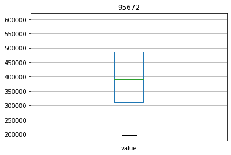


```python
plot_acf_pacf(ts.value)
```


```python
plot_seasonal_decomp(ts.value);

# Note that seasonality isn't much of a factor here; maximum difference of about $700 over the course of a year
```


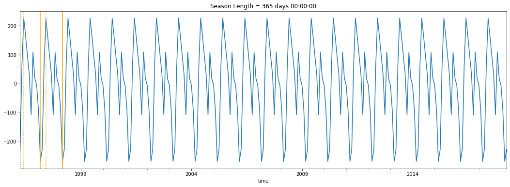


### ARIMA parameters tuning


```python
p_values = [0, 1, 2, 4, 6, 8, 10]
d_values = range(0, 3)
q_values = range(0, 3)

```

### ARIMA modeling and forecasting results


```python
# This function will run parameter tuning and will append lists
# Uncomment to run (will take about 20-30 minutes)

# arima_forecast_run(ts, geog_area, city, county, p_values, d_values, q_values, confint=2)

# For 95672 (Rescue):
# ARIMA(0, 0, 0) MSE=7052827541.559
# ARIMA(0, 1, 0) MSE=16595398.822
# ARIMA(0, 1, 1) MSE=6483913.155
# ARIMA(0, 2, 0) MSE=4714062.310
# ARIMA(0, 2, 1) MSE=3377346.501
# ARIMA(1, 1, 0) MSE=4582501.583
# ARIMA(1, 1, 2) MSE=3000091.096
# ARIMA(1, 2, 0) MSE=4543870.784
# ARIMA(1, 2, 1) MSE=3536089.687
# ARIMA(2, 1, 0) MSE=4255045.550
# ARIMA(2, 1, 1) MSE=3323429.665
# ARIMA(2, 1, 2) MSE=2788618.838
# ARIMA(2, 2, 0) MSE=3175132.426
# ARIMA(2, 2, 1) MSE=3050159.054
# ARIMA(2, 2, 2) MSE=2894234.877
# ARIMA(4, 0, 1) MSE=2989526.471
# ARIMA(4, 0, 2) MSE=2734700.139
# ARIMA(4, 1, 1) MSE=3028031.963
# ARIMA(4, 1, 2) MSE=2594330.334
# ARIMA(4, 2, 0) MSE=3069350.005
# ARIMA(4, 2, 2) MSE=2735749.611
# ARIMA(6, 0, 1) MSE=3068143.019
# ARIMA(6, 0, 2) MSE=2652917.081
# ARIMA(6, 2, 0) MSE=3048995.671
# Best ARIMA(4, 1, 2) MSE=2594330.334
# Best ARIMA order = (4, 1, 2)
```


```python
# this function will not run parameter tuning, but will append lists
# Uncomment to run

best_cfg = (4,1,2)
arima_forecast_enter_pdq(ts, geog_area, city, county, best_cfg, confint=2)   
```

    For 95672 (Rescue):
    Best ARIMA order = (4, 1, 2)
                                 ARIMA Model Results                              
    ==============================================================================
    Dep. Variable:                D.value   No. Observations:                  264
    Model:                 ARIMA(4, 1, 2)   Log Likelihood               -2210.851
    Method:                       css-mle   S.D. of innovations           1037.020
    Date:                Tue, 24 Mar 2020   AIC                           4437.702
    Time:                        19:20:42   BIC                           4466.310
    Sample:                    05-01-1996   HQIC                          4449.198
                             - 04-01-2018                                         
    =================================================================================
                        coef    std err          z      P>|z|      [0.025      0.975]
    ---------------------------------------------------------------------------------
    const          1450.0001   1467.525      0.988      0.324   -1426.297    4326.297
    ar.L1.D.value     0.3614      0.074      4.890      0.000       0.217       0.506
    ar.L2.D.value     0.2127      0.086      2.462      0.014       0.043       0.382
    ar.L3.D.value     0.0386      0.088      0.437      0.662      -0.135       0.212
    ar.L4.D.value     0.2474      0.073      3.378      0.001       0.104       0.391
    ma.L1.D.value     1.5375      0.050     30.997      0.000       1.440       1.635
    ma.L2.D.value     0.8484      0.046     18.484      0.000       0.758       0.938
                                        Roots                                    
    =============================================================================
                      Real          Imaginary           Modulus         Frequency
    -----------------------------------------------------------------------------
    AR.1            1.0691           -0.0000j            1.0691           -0.0000
    AR.2           -1.4821           -0.0000j            1.4821           -0.5000
    AR.3            0.1284           -1.5918j            1.5970           -0.2372
    AR.4            0.1284           +1.5918j            1.5970            0.2372
    MA.1           -0.9061           -0.5980j            1.0857           -0.4072
    MA.2           -0.9061           +0.5980j            1.0857            0.4072
    -----------------------------------------------------------------------------
    By the model prediction, I would expect to see a 12.304% change in price by April 1, 2020.
    At the lower bound of the confidence interval, I would expect to see a -11.101% change in price by April 1, 2020.
    At the upper bound of the confidence interval, I would expect to see a 35.708% change in price by April 1, 2020.


    (['95616',
      '95619',
      '95864',
      '95831',
      '95811',
      '95818',
      '95630',
      '96140',
      '95672'],
     ['Davis',
      'Diamond Springs',
      'Arden-Arcade',
      'Sacramento_Pocket',
      'Sacramento_DosRios',
      'Sacramento_LandPark',
      'Folsom',
      'Carnelian Bay',
      'Rescue'],
     ['Yolo',
      'El Dorado',
      'Sacramento',
      'Sacramento',
      'Sacramento',
      'Sacramento',
      'Sacramento',
      'Placer',
      'El Dorado'],
     [(2, 1, 2),
      (2, 1, 2),
      (8, 0, 2),
      (4, 0, 2),
      (10, 1, 0),
      (1, 1, 1),
      (4, 0, 2),
      (2, 1, 2),
      (4, 1, 2)],
     [717863.06,
      355774.45,
      449047.92,
      386994.52,
      570598.7,
      563857.1,
      484136.82,
      686817.86,
      650576.11],
     [619575.34,
      275292.09,
      327568.68,
      292621.1,
      459606.77,
      464602.96,
      382062.81,
      560520.55,
      514993.56],
     [816150.79,
      436256.81,
      570527.16,
      481367.94,
      681590.63,
      663111.23,
      586210.84,
      813115.17,
      786158.66],
     [692300.0,
      321100.0,
      552700.0,
      449300.0,
      567500.0,
      563900.0,
      542900.0,
      644600.0,
      579300.0],
     [3.69, 10.8, -18.75, -13.87, 0.55, -0.01, -10.82, 6.55, 12.3],
     [-10.5, -14.27, -40.73, -34.87, -19.01, -17.61, -29.63, -13.04, -11.1],
     [17.89, 35.86, 3.23, 7.14, 20.1, 17.59, 7.98, 26.14, 35.71])


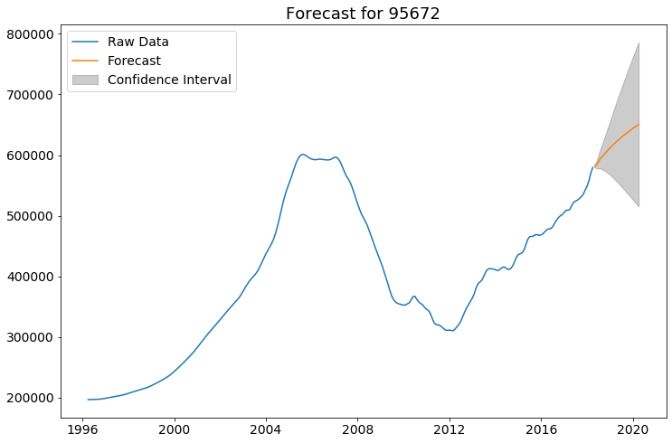


```python
print_results_lists()
```


    (['95616',
      '95619',
      '95864',
      '95831',
      '95811',
      '95818',
      '95630',
      '96140',
      '95672'],
     ['Davis',
      'Diamond Springs',
      'Arden-Arcade',
      'Sacramento_Pocket',
      'Sacramento_DosRios',
      'Sacramento_LandPark',
      'Folsom',
      'Carnelian Bay',
      'Rescue'],
     ['Yolo',
      'El Dorado',
      'Sacramento',
      'Sacramento',
      'Sacramento',
      'Sacramento',
      'Sacramento',
      'Placer',
      'El Dorado'],
     [(2, 1, 2),
      (2, 1, 2),
      (8, 0, 2),
      (4, 0, 2),
      (10, 1, 0),
      (1, 1, 1),
      (4, 0, 2),
      (2, 1, 2),
      (4, 1, 2)],
     [717863.06,
      355774.45,
      449047.92,
      386994.52,
      570598.7,
      563857.1,
      484136.82,
      686817.86,
      650576.11],
     [619575.34,
      275292.09,
      327568.68,
      292621.1,
      459606.77,
      464602.96,
      382062.81,
      560520.55,
      514993.56],
     [816150.79,
      436256.81,
      570527.16,
      481367.94,
      681590.63,
      663111.23,
      586210.84,
      813115.17,
      786158.66],
     [692300.0,
      321100.0,
      552700.0,
      449300.0,
      567500.0,
      563900.0,
      542900.0,
      644600.0,
      579300.0],
     [3.69, 10.8, -18.75, -13.87, 0.55, -0.01, -10.82, 6.55, 12.3],
     [-10.5, -14.27, -40.73, -34.87, -19.01, -17.61, -29.63, -13.04, -11.1],
     [17.89, 35.86, 3.23, 7.14, 20.1, 17.59, 7.98, 26.14, 35.71])


```python
# pop_results_lists()
```


```python
# print_results_lists()
```

### Zip code 95672 (Rescue):  Excellent investment opportunity with limited downside and large potential upside

By the model prediction, I would expect to see a 12.304% change in price by April 1, 2020.
At the lower bound of the confidence interval, I would expect to see a -11.101% change in price by April 1, 2020.
At the upper bound of the confidence interval, I would expect to see a 35.708% change in price by April 1, 2020.


## SacMetro:  95636 (Somerset) -- Poor investment rating -- do not invest

### Set up dataframe


```python
geog_area = '95636'
```


```python
city = 'Somerset'
```


```python
county = 'El Dorado'
```


```python
ts = df_sac.loc[df_sac['Zip'] == geog_area]
```


```python
ts.head()
```


<div>
<style scoped>
    .dataframe tbody tr th:only-of-type {
        vertical-align: middle;
    }

    .dataframe tbody tr th {
        vertical-align: top;
    }

    .dataframe thead th {
        text-align: right;
    }
</style>
<table border="1" class="dataframe">
  <thead>
    <tr style="text-align: right;">
      <th></th>
      <th>Metro</th>
      <th>MetroState</th>
      <th>CountyName</th>
      <th>City</th>
      <th>Zip</th>
      <th>value</th>
    </tr>
    <tr>
      <th>time</th>
      <th></th>
      <th></th>
      <th></th>
      <th></th>
      <th></th>
      <th></th>
    </tr>
  </thead>
  <tbody>
    <tr>
      <td>1996-04-01</td>
      <td>Sacramento</td>
      <td>Sacramento CA</td>
      <td>El Dorado</td>
      <td>Somerset</td>
      <td>95636</td>
      <td>95100.0</td>
    </tr>
    <tr>
      <td>1996-05-01</td>
      <td>Sacramento</td>
      <td>Sacramento CA</td>
      <td>El Dorado</td>
      <td>Somerset</td>
      <td>95636</td>
      <td>95400.0</td>
    </tr>
    <tr>
      <td>1996-06-01</td>
      <td>Sacramento</td>
      <td>Sacramento CA</td>
      <td>El Dorado</td>
      <td>Somerset</td>
      <td>95636</td>
      <td>95600.0</td>
    </tr>
    <tr>
      <td>1996-07-01</td>
      <td>Sacramento</td>
      <td>Sacramento CA</td>
      <td>El Dorado</td>
      <td>Somerset</td>
      <td>95636</td>
      <td>95900.0</td>
    </tr>
    <tr>
      <td>1996-08-01</td>
      <td>Sacramento</td>
      <td>Sacramento CA</td>
      <td>El Dorado</td>
      <td>Somerset</td>
      <td>95636</td>
      <td>96200.0</td>
    </tr>
  </tbody>
</table>
</div>


```python
ts = ts.resample('MS').asfreq()
```


```python
ts.head()
```


<div>
<style scoped>
    .dataframe tbody tr th:only-of-type {
        vertical-align: middle;
    }

    .dataframe tbody tr th {
        vertical-align: top;
    }

    .dataframe thead th {
        text-align: right;
    }
</style>
<table border="1" class="dataframe">
  <thead>
    <tr style="text-align: right;">
      <th></th>
      <th>Metro</th>
      <th>MetroState</th>
      <th>CountyName</th>
      <th>City</th>
      <th>Zip</th>
      <th>value</th>
    </tr>
    <tr>
      <th>time</th>
      <th></th>
      <th></th>
      <th></th>
      <th></th>
      <th></th>
      <th></th>
    </tr>
  </thead>
  <tbody>
    <tr>
      <td>1996-04-01</td>
      <td>Sacramento</td>
      <td>Sacramento CA</td>
      <td>El Dorado</td>
      <td>Somerset</td>
      <td>95636</td>
      <td>95100.0</td>
    </tr>
    <tr>
      <td>1996-05-01</td>
      <td>Sacramento</td>
      <td>Sacramento CA</td>
      <td>El Dorado</td>
      <td>Somerset</td>
      <td>95636</td>
      <td>95400.0</td>
    </tr>
    <tr>
      <td>1996-06-01</td>
      <td>Sacramento</td>
      <td>Sacramento CA</td>
      <td>El Dorado</td>
      <td>Somerset</td>
      <td>95636</td>
      <td>95600.0</td>
    </tr>
    <tr>
      <td>1996-07-01</td>
      <td>Sacramento</td>
      <td>Sacramento CA</td>
      <td>El Dorado</td>
      <td>Somerset</td>
      <td>95636</td>
      <td>95900.0</td>
    </tr>
    <tr>
      <td>1996-08-01</td>
      <td>Sacramento</td>
      <td>Sacramento CA</td>
      <td>El Dorado</td>
      <td>Somerset</td>
      <td>95636</td>
      <td>96200.0</td>
    </tr>
  </tbody>
</table>
</div>


### Visualizations


```python
plot_single_geog(df_melt, geog_area, 'value', 'Zip', figsize=(12, 6), fontsize1=12, fontsize2=16)
```


```python
ts.boxplot(column = 'value')
plt.title(geog_area);

```


```python
plot_acf_pacf(ts.value)
```


```python
plot_seasonal_decomp(ts.value);

# Note that seasonality isn't much of a factor here; maximum difference of about $700 over the course of a year
```


### ARIMA parameters tuning


```python
p_values = [0, 1, 2, 4, 6, 8, 10]
d_values = range(0, 3)
q_values = range(0, 3)

```

### ARIMA modeling and forecasting results


```python
# This function will run parameter tuning and will append lists
# Uncomment to run (will take about 20-30 minutes)

# arima_forecast_run(ts, geog_area, city, county, p_values, d_values, q_values, confint=2)

# For 95636 (Somerset):
# ARIMA(0, 0, 0) MSE=1088723922.625
# ARIMA(0, 1, 0) MSE=8228891.143
# ARIMA(0, 1, 1) MSE=3057297.804
# ARIMA(0, 2, 0) MSE=3351463.257
# ARIMA(0, 2, 1) MSE=2056640.674
# ARIMA(1, 1, 0) MSE=3170861.807
# ARIMA(1, 2, 0) MSE=2925409.679
# ARIMA(2, 1, 0) MSE=2522237.144
# ARIMA(2, 2, 0) MSE=1782338.420
# ARIMA(2, 2, 1) MSE=1660856.151
# ARIMA(4, 0, 1) MSE=1571916.062
# ARIMA(4, 1, 1) MSE=1594600.303
# ARIMA(4, 2, 0) MSE=1623269.957
# ARIMA(4, 2, 1) MSE=1619885.582
# ARIMA(6, 0, 1) MSE=1535639.868
# ARIMA(6, 2, 0) MSE=1562171.584
# Best ARIMA(6, 0, 1) MSE=1535639.868
# Best ARIMA order = (6, 0, 1)
```


```python
# this function will not run parameter tuning, but will append lists
# Uncomment to run

best_cfg = (6,0,1)
arima_forecast_enter_pdq(ts, geog_area, city, county, best_cfg, confint=2)   
```

    For 95636 (Somerset):
    Best ARIMA order = (6, 0, 1)
                                  ARMA Model Results                              
    ==============================================================================
    Dep. Variable:                  value   No. Observations:                  265
    Model:                     ARMA(6, 1)   Log Likelihood               -2136.708
    Method:                       css-mle   S.D. of innovations            750.047
    Date:                Tue, 24 Mar 2020   AIC                           4291.416
    Time:                        19:20:58   BIC                           4323.634
    Sample:                    04-01-1996   HQIC                          4304.361
                             - 04-01-2018                                         
    ===============================================================================
                      coef    std err          z      P>|z|      [0.025      0.975]
    -------------------------------------------------------------------------------
    const        1.712e+05   2.17e+04      7.886      0.000    1.29e+05    2.14e+05
    ar.L1.value     3.1670        nan        nan        nan         nan         nan
    ar.L2.value    -4.5844        nan        nan        nan         nan         nan
    ar.L3.value     4.3151        nan        nan        nan         nan         nan
    ar.L4.value    -2.9188      0.047    -62.360      0.000      -3.011      -2.827
    ar.L5.value     1.3579      0.022     60.806      0.000       1.314       1.402
    ar.L6.value    -0.3380        nan        nan        nan         nan         nan
    ma.L1.value    -0.3449      0.057     -6.038      0.000      -0.457      -0.233
                                        Roots                                    
    =============================================================================
                      Real          Imaginary           Modulus         Frequency
    -----------------------------------------------------------------------------
    AR.1            0.0511           -1.3204j            1.3214           -0.2438
    AR.2            0.0511           +1.3204j            1.3214            0.2438
    AR.3            1.0230           -0.0374j            1.0237           -0.0058
    AR.4            1.0230           +0.0374j            1.0237            0.0058
    AR.5            0.9346           -0.8622j            1.2716           -0.1186
    AR.6            0.9346           +0.8622j            1.2716            0.1186
    MA.1            2.8992           +0.0000j            2.8992            0.0000
    -----------------------------------------------------------------------------
    By the model prediction, I would expect to see a -4.604% change in price by April 1, 2020.
    At the lower bound of the confidence interval, I would expect to see a -31.266% change in price by April 1, 2020.
    At the upper bound of the confidence interval, I would expect to see a 22.058% change in price by April 1, 2020.


    (['95616',
      '95619',
      '95864',
      '95831',
      '95811',
      '95818',
      '95630',
      '96140',
      '95672',
      '95636'],
     ['Davis',
      'Diamond Springs',
      'Arden-Arcade',
      'Sacramento_Pocket',
      'Sacramento_DosRios',
      'Sacramento_LandPark',
      'Folsom',
      'Carnelian Bay',
      'Rescue',
      'Somerset'],
     ['Yolo',
      'El Dorado',
      'Sacramento',
      'Sacramento',
      'Sacramento',
      'Sacramento',
      'Sacramento',
      'Placer',
      'El Dorado',
      'El Dorado'],
     [(2, 1, 2),
      (2, 1, 2),
      (8, 0, 2),
      (4, 0, 2),
      (10, 1, 0),
      (1, 1, 1),
      (4, 0, 2),
      (2, 1, 2),
      (4, 1, 2),
      (6, 0, 1)],
     [717863.06,
      355774.45,
      449047.92,
      386994.52,
      570598.7,
      563857.1,
      484136.82,
      686817.86,
      650576.11,
      230095.49],
     [619575.34,
      275292.09,
      327568.68,
      292621.1,
      459606.77,
      464602.96,
      382062.81,
      560520.55,
      514993.56,
      165787.22],
     [816150.79,
      436256.81,
      570527.16,
      481367.94,
      681590.63,
      663111.23,
      586210.84,
      813115.17,
      786158.66,
      294403.76],
     [692300.0,
      321100.0,
      552700.0,
      449300.0,
      567500.0,
      563900.0,
      542900.0,
      644600.0,
      579300.0,
      241200.0],
     [3.69, 10.8, -18.75, -13.87, 0.55, -0.01, -10.82, 6.55, 12.3, -4.6],
     [-10.5,
      -14.27,
      -40.73,
      -34.87,
      -19.01,
      -17.61,
      -29.63,
      -13.04,
      -11.1,
      -31.27],
     [17.89, 35.86, 3.23, 7.14, 20.1, 17.59, 7.98, 26.14, 35.71, 22.06])


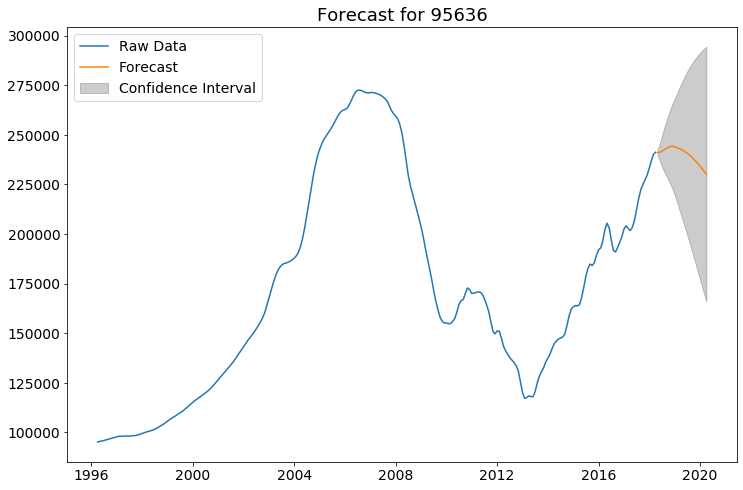


```python
print_results_lists()
```


    (['95616',
      '95619',
      '95864',
      '95831',
      '95811',
      '95818',
      '95630',
      '96140',
      '95672',
      '95636'],
     ['Davis',
      'Diamond Springs',
      'Arden-Arcade',
      'Sacramento_Pocket',
      'Sacramento_DosRios',
      'Sacramento_LandPark',
      'Folsom',
      'Carnelian Bay',
      'Rescue',
      'Somerset'],
     ['Yolo',
      'El Dorado',
      'Sacramento',
      'Sacramento',
      'Sacramento',
      'Sacramento',
      'Sacramento',
      'Placer',
      'El Dorado',
      'El Dorado'],
     [(2, 1, 2),
      (2, 1, 2),
      (8, 0, 2),
      (4, 0, 2),
      (10, 1, 0),
      (1, 1, 1),
      (4, 0, 2),
      (2, 1, 2),
      (4, 1, 2),
      (6, 0, 1)],
     [717863.06,
      355774.45,
      449047.92,
      386994.52,
      570598.7,
      563857.1,
      484136.82,
      686817.86,
      650576.11,
      230095.49],
     [619575.34,
      275292.09,
      327568.68,
      292621.1,
      459606.77,
      464602.96,
      382062.81,
      560520.55,
      514993.56,
      165787.22],
     [816150.79,
      436256.81,
      570527.16,
      481367.94,
      681590.63,
      663111.23,
      586210.84,
      813115.17,
      786158.66,
      294403.76],
     [692300.0,
      321100.0,
      552700.0,
      449300.0,
      567500.0,
      563900.0,
      542900.0,
      644600.0,
      579300.0,
      241200.0],
     [3.69, 10.8, -18.75, -13.87, 0.55, -0.01, -10.82, 6.55, 12.3, -4.6],
     [-10.5,
      -14.27,
      -40.73,
      -34.87,
      -19.01,
      -17.61,
      -29.63,
      -13.04,
      -11.1,
      -31.27],
     [17.89, 35.86, 3.23, 7.14, 20.1, 17.59, 7.98, 26.14, 35.71, 22.06])


```python
# pop_results_lists()
```


```python
# print_results_lists()
```

### Zip code 95636:  Poor investment rating--negative investment returns--do not invest

By the model prediction, I would expect to see a -4.604% change in price by April 1, 2020.
At the lower bound of the confidence interval, I would expect to see a -31.266% change in price by April 1, 2020.
At the upper bound of the confidence interval, I would expect to see a 22.058% change in price by April 1, 2020.

## SacMetro:  95709 (Camino) -- Okay investment opportunity with significant downside risk (but also significant upside returns)

### Set up dataframe


```python
geog_area = '95709'
```


```python
city = 'Camino'
```


```python
county = 'El Dorado'
```


```python
ts = df_sac.loc[df_sac['Zip'] == geog_area]
```


```python
ts.head()
```


<div>
<style scoped>
    .dataframe tbody tr th:only-of-type {
        vertical-align: middle;
    }

    .dataframe tbody tr th {
        vertical-align: top;
    }

    .dataframe thead th {
        text-align: right;
    }
</style>
<table border="1" class="dataframe">
  <thead>
    <tr style="text-align: right;">
      <th></th>
      <th>Metro</th>
      <th>MetroState</th>
      <th>CountyName</th>
      <th>City</th>
      <th>Zip</th>
      <th>value</th>
    </tr>
    <tr>
      <th>time</th>
      <th></th>
      <th></th>
      <th></th>
      <th></th>
      <th></th>
      <th></th>
    </tr>
  </thead>
  <tbody>
    <tr>
      <td>1996-04-01</td>
      <td>Sacramento</td>
      <td>Sacramento CA</td>
      <td>El Dorado</td>
      <td>Camino</td>
      <td>95709</td>
      <td>141500.0</td>
    </tr>
    <tr>
      <td>1996-05-01</td>
      <td>Sacramento</td>
      <td>Sacramento CA</td>
      <td>El Dorado</td>
      <td>Camino</td>
      <td>95709</td>
      <td>141500.0</td>
    </tr>
    <tr>
      <td>1996-06-01</td>
      <td>Sacramento</td>
      <td>Sacramento CA</td>
      <td>El Dorado</td>
      <td>Camino</td>
      <td>95709</td>
      <td>141500.0</td>
    </tr>
    <tr>
      <td>1996-07-01</td>
      <td>Sacramento</td>
      <td>Sacramento CA</td>
      <td>El Dorado</td>
      <td>Camino</td>
      <td>95709</td>
      <td>141500.0</td>
    </tr>
    <tr>
      <td>1996-08-01</td>
      <td>Sacramento</td>
      <td>Sacramento CA</td>
      <td>El Dorado</td>
      <td>Camino</td>
      <td>95709</td>
      <td>141600.0</td>
    </tr>
  </tbody>
</table>
</div>


```python
ts = ts.resample('MS').asfreq()
```


```python
ts.head()
```


<div>
<style scoped>
    .dataframe tbody tr th:only-of-type {
        vertical-align: middle;
    }

    .dataframe tbody tr th {
        vertical-align: top;
    }

    .dataframe thead th {
        text-align: right;
    }
</style>
<table border="1" class="dataframe">
  <thead>
    <tr style="text-align: right;">
      <th></th>
      <th>Metro</th>
      <th>MetroState</th>
      <th>CountyName</th>
      <th>City</th>
      <th>Zip</th>
      <th>value</th>
    </tr>
    <tr>
      <th>time</th>
      <th></th>
      <th></th>
      <th></th>
      <th></th>
      <th></th>
      <th></th>
    </tr>
  </thead>
  <tbody>
    <tr>
      <td>1996-04-01</td>
      <td>Sacramento</td>
      <td>Sacramento CA</td>
      <td>El Dorado</td>
      <td>Camino</td>
      <td>95709</td>
      <td>141500.0</td>
    </tr>
    <tr>
      <td>1996-05-01</td>
      <td>Sacramento</td>
      <td>Sacramento CA</td>
      <td>El Dorado</td>
      <td>Camino</td>
      <td>95709</td>
      <td>141500.0</td>
    </tr>
    <tr>
      <td>1996-06-01</td>
      <td>Sacramento</td>
      <td>Sacramento CA</td>
      <td>El Dorado</td>
      <td>Camino</td>
      <td>95709</td>
      <td>141500.0</td>
    </tr>
    <tr>
      <td>1996-07-01</td>
      <td>Sacramento</td>
      <td>Sacramento CA</td>
      <td>El Dorado</td>
      <td>Camino</td>
      <td>95709</td>
      <td>141500.0</td>
    </tr>
    <tr>
      <td>1996-08-01</td>
      <td>Sacramento</td>
      <td>Sacramento CA</td>
      <td>El Dorado</td>
      <td>Camino</td>
      <td>95709</td>
      <td>141600.0</td>
    </tr>
  </tbody>
</table>
</div>


### Visualizations


```python
plot_single_geog(df_melt, geog_area, 'value', 'Zip', figsize=(12, 6), fontsize1=12, fontsize2=16)
```


```python
ts.boxplot(column = 'value')
plt.title(geog_area);

```


```python
plot_acf_pacf(ts.value)
```


```python
plot_seasonal_decomp(ts.value);

# Note that seasonality isn't much of a factor here; maximum difference of about $700 over the course of a year
```


### ARIMA parameters tuning


```python
p_values = [0, 1, 2, 4, 6, 8, 10]
d_values = range(0, 3)
q_values = range(0, 3)

```

### ARIMA modeling and forecasting results


```python
# This function will run parameter tuning and will append lists
# Uncomment to run (will take about 20-30 minutes)

# arima_forecast_run(ts, geog_area, city, county, p_values, d_values, q_values, confint=2)

# For 95709 (Camino):
# ARIMA(0, 0, 0) MSE=2967456006.271
# ARIMA(0, 1, 0) MSE=5872617.433
# ARIMA(0, 1, 1) MSE=2115837.697
# ARIMA(0, 2, 0) MSE=1332894.689
# ARIMA(0, 2, 1) MSE=872950.276
# ARIMA(1, 1, 0) MSE=1299745.292
# ARIMA(1, 1, 1) MSE=837961.158
# ARIMA(1, 1, 2) MSE=766049.672
# ARIMA(1, 2, 0) MSE=1180859.093
# ARIMA(1, 2, 1) MSE=885507.481
# ARIMA(1, 2, 2) MSE=735744.867
# ARIMA(2, 0, 1) MSE=839244.625
# ARIMA(2, 0, 2) MSE=773820.757
# ARIMA(2, 1, 0) MSE=1115504.104
# ARIMA(2, 1, 1) MSE=841442.546
# ARIMA(2, 1, 2) MSE=697595.599
# ARIMA(2, 2, 0) MSE=768038.570
# ARIMA(2, 2, 1) MSE=735439.979
# ARIMA(2, 2, 2) MSE=736407.804
# ARIMA(4, 0, 1) MSE=714993.737
# ARIMA(4, 0, 2) MSE=732581.121
# ARIMA(4, 1, 1) MSE=719904.376
# ARIMA(4, 2, 0) MSE=744712.414
# ARIMA(4, 2, 1) MSE=740008.295
# ARIMA(6, 1, 1) MSE=717353.488
# ARIMA(6, 2, 0) MSE=758597.116
# ARIMA(6, 2, 1) MSE=745464.522
# ARIMA(8, 2, 0) MSE=762536.105
# ARIMA(8, 2, 1) MSE=764989.450
# ARIMA(10, 2, 0) MSE=771994.004
# ARIMA(10, 2, 1) MSE=775353.130
# Best ARIMA(2, 1, 2) MSE=697595.599
# Best ARIMA order = (2, 1, 2)
```


```python
# this function will not run parameter tuning, but will append lists
# Uncomment to run

best_cfg = (2,1,2)
arima_forecast_enter_pdq(ts, geog_area, city, county, best_cfg, confint=2)   
```

    For 95709 (Camino):
    Best ARIMA order = (2, 1, 2)
                                 ARIMA Model Results                              
    ==============================================================================
    Dep. Variable:                D.value   No. Observations:                  264
    Model:                 ARIMA(2, 1, 2)   Log Likelihood               -2056.594
    Method:                       css-mle   S.D. of innovations            579.070
    Date:                Tue, 24 Mar 2020   AIC                           4125.188
    Time:                        19:21:15   BIC                           4146.644
    Sample:                    05-01-1996   HQIC                          4133.810
                             - 04-01-2018                                         
    =================================================================================
                        coef    std err          z      P>|z|      [0.025      0.975]
    ---------------------------------------------------------------------------------
    const           899.0402    855.399      1.051      0.294    -777.510    2575.591
    ar.L1.D.value     0.3400      0.082      4.153      0.000       0.180       0.500
    ar.L2.D.value     0.5244      0.080      6.516      0.000       0.367       0.682
    ma.L1.D.value     1.5797      0.058     27.015      0.000       1.465       1.694
    ma.L2.D.value     0.8094      0.048     16.921      0.000       0.716       0.903
                                        Roots                                    
    =============================================================================
                      Real          Imaginary           Modulus         Frequency
    -----------------------------------------------------------------------------
    AR.1            1.0943           +0.0000j            1.0943            0.0000
    AR.2           -1.7427           +0.0000j            1.7427            0.5000
    MA.1           -0.9759           -0.5321j            1.1115           -0.4205
    MA.2           -0.9759           +0.5321j            1.1115            0.4205
    -----------------------------------------------------------------------------
    By the model prediction, I would expect to see a 6.367% change in price by April 1, 2020.
    At the lower bound of the confidence interval, I would expect to see a -16.592% change in price by April 1, 2020.
    At the upper bound of the confidence interval, I would expect to see a 29.326% change in price by April 1, 2020.


    (['95616',
      '95619',
      '95864',
      '95831',
      '95811',
      '95818',
      '95630',
      '96140',
      '95672',
      '95636',
      '95709'],
     ['Davis',
      'Diamond Springs',
      'Arden-Arcade',
      'Sacramento_Pocket',
      'Sacramento_DosRios',
      'Sacramento_LandPark',
      'Folsom',
      'Carnelian Bay',
      'Rescue',
      'Somerset',
      'Camino'],
     ['Yolo',
      'El Dorado',
      'Sacramento',
      'Sacramento',
      'Sacramento',
      'Sacramento',
      'Sacramento',
      'Placer',
      'El Dorado',
      'El Dorado',
      'El Dorado'],
     [(2, 1, 2),
      (2, 1, 2),
      (8, 0, 2),
      (4, 0, 2),
      (10, 1, 0),
      (1, 1, 1),
      (4, 0, 2),
      (2, 1, 2),
      (4, 1, 2),
      (6, 0, 1),
      (2, 1, 2)],
     [717863.06,
      355774.45,
      449047.92,
      386994.52,
      570598.7,
      563857.1,
      484136.82,
      686817.86,
      650576.11,
      230095.49,
      410576.95],
     [619575.34,
      275292.09,
      327568.68,
      292621.1,
      459606.77,
      464602.96,
      382062.81,
      560520.55,
      514993.56,
      165787.22,
      321956.34],
     [816150.79,
      436256.81,
      570527.16,
      481367.94,
      681590.63,
      663111.23,
      586210.84,
      813115.17,
      786158.66,
      294403.76,
      499197.56],
     [692300.0,
      321100.0,
      552700.0,
      449300.0,
      567500.0,
      563900.0,
      542900.0,
      644600.0,
      579300.0,
      241200.0,
      386000.0],
     [3.69, 10.8, -18.75, -13.87, 0.55, -0.01, -10.82, 6.55, 12.3, -4.6, 6.37],
     [-10.5,
      -14.27,
      -40.73,
      -34.87,
      -19.01,
      -17.61,
      -29.63,
      -13.04,
      -11.1,
      -31.27,
      -16.59],
     [17.89, 35.86, 3.23, 7.14, 20.1, 17.59, 7.98, 26.14, 35.71, 22.06, 29.33])


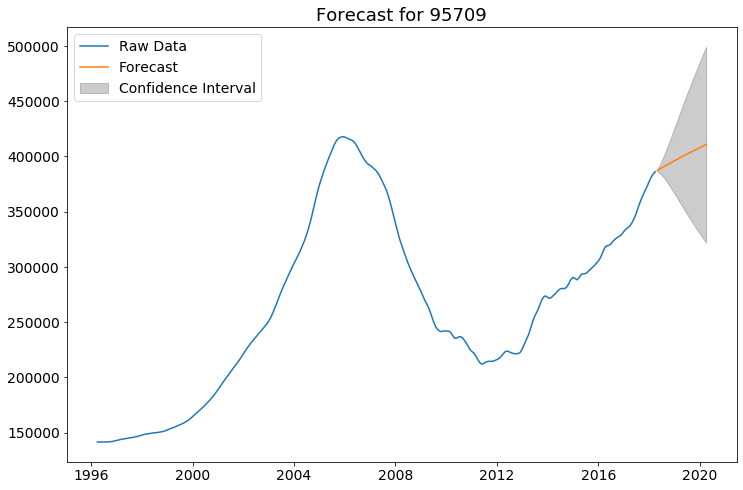


```python
print_results_lists()
```


    (['95616',
      '95619',
      '95864',
      '95831',
      '95811',
      '95818',
      '95630',
      '96140',
      '95672',
      '95636',
      '95709'],
     ['Davis',
      'Diamond Springs',
      'Arden-Arcade',
      'Sacramento_Pocket',
      'Sacramento_DosRios',
      'Sacramento_LandPark',
      'Folsom',
      'Carnelian Bay',
      'Rescue',
      'Somerset',
      'Camino'],
     ['Yolo',
      'El Dorado',
      'Sacramento',
      'Sacramento',
      'Sacramento',
      'Sacramento',
      'Sacramento',
      'Placer',
      'El Dorado',
      'El Dorado',
      'El Dorado'],
     [(2, 1, 2),
      (2, 1, 2),
      (8, 0, 2),
      (4, 0, 2),
      (10, 1, 0),
      (1, 1, 1),
      (4, 0, 2),
      (2, 1, 2),
      (4, 1, 2),
      (6, 0, 1),
      (2, 1, 2)],
     [717863.06,
      355774.45,
      449047.92,
      386994.52,
      570598.7,
      563857.1,
      484136.82,
      686817.86,
      650576.11,
      230095.49,
      410576.95],
     [619575.34,
      275292.09,
      327568.68,
      292621.1,
      459606.77,
      464602.96,
      382062.81,
      560520.55,
      514993.56,
      165787.22,
      321956.34],
     [816150.79,
      436256.81,
      570527.16,
      481367.94,
      681590.63,
      663111.23,
      586210.84,
      813115.17,
      786158.66,
      294403.76,
      499197.56],
     [692300.0,
      321100.0,
      552700.0,
      449300.0,
      567500.0,
      563900.0,
      542900.0,
      644600.0,
      579300.0,
      241200.0,
      386000.0],
     [3.69, 10.8, -18.75, -13.87, 0.55, -0.01, -10.82, 6.55, 12.3, -4.6, 6.37],
     [-10.5,
      -14.27,
      -40.73,
      -34.87,
      -19.01,
      -17.61,
      -29.63,
      -13.04,
      -11.1,
      -31.27,
      -16.59],
     [17.89, 35.86, 3.23, 7.14, 20.1, 17.59, 7.98, 26.14, 35.71, 22.06, 29.33])


```python
# pop_results_lists()
```


```python
# print_results_lists()
```

### Zip code 95709 (Camino):  Okay investment opportunity with significant downside risk (but also significant upside returns)

By the model prediction, I would expect to see a 6.367% change in price by April 1, 2020.
At the lower bound of the confidence interval, I would expect to see a -16.592% change in price by April 1, 2020.
At the upper bound of the confidence interval, I would expect to see a 29.326% change in price by April 1, 2020.

## SacMetro:  95746 (Granite Bay) -- Solid investment opportunity

### Set up dataframe


```python
geog_area = '95746'
```


```python
city = 'Granite Bay'
```


```python
county = 'Placer'
```


```python
ts.head()
```


<div>
<style scoped>
    .dataframe tbody tr th:only-of-type {
        vertical-align: middle;
    }

    .dataframe tbody tr th {
        vertical-align: top;
    }

    .dataframe thead th {
        text-align: right;
    }
</style>
<table border="1" class="dataframe">
  <thead>
    <tr style="text-align: right;">
      <th></th>
      <th>Metro</th>
      <th>MetroState</th>
      <th>CountyName</th>
      <th>City</th>
      <th>Zip</th>
      <th>value</th>
    </tr>
    <tr>
      <th>time</th>
      <th></th>
      <th></th>
      <th></th>
      <th></th>
      <th></th>
      <th></th>
    </tr>
  </thead>
  <tbody>
    <tr>
      <td>1996-04-01</td>
      <td>Sacramento</td>
      <td>Sacramento CA</td>
      <td>El Dorado</td>
      <td>Camino</td>
      <td>95709</td>
      <td>141500.0</td>
    </tr>
    <tr>
      <td>1996-05-01</td>
      <td>Sacramento</td>
      <td>Sacramento CA</td>
      <td>El Dorado</td>
      <td>Camino</td>
      <td>95709</td>
      <td>141500.0</td>
    </tr>
    <tr>
      <td>1996-06-01</td>
      <td>Sacramento</td>
      <td>Sacramento CA</td>
      <td>El Dorado</td>
      <td>Camino</td>
      <td>95709</td>
      <td>141500.0</td>
    </tr>
    <tr>
      <td>1996-07-01</td>
      <td>Sacramento</td>
      <td>Sacramento CA</td>
      <td>El Dorado</td>
      <td>Camino</td>
      <td>95709</td>
      <td>141500.0</td>
    </tr>
    <tr>
      <td>1996-08-01</td>
      <td>Sacramento</td>
      <td>Sacramento CA</td>
      <td>El Dorado</td>
      <td>Camino</td>
      <td>95709</td>
      <td>141600.0</td>
    </tr>
  </tbody>
</table>
</div>


```python
ts = ts.resample('MS').asfreq()
```


```python
ts.head()
```


<div>
<style scoped>
    .dataframe tbody tr th:only-of-type {
        vertical-align: middle;
    }

    .dataframe tbody tr th {
        vertical-align: top;
    }

    .dataframe thead th {
        text-align: right;
    }
</style>
<table border="1" class="dataframe">
  <thead>
    <tr style="text-align: right;">
      <th></th>
      <th>Metro</th>
      <th>MetroState</th>
      <th>CountyName</th>
      <th>City</th>
      <th>Zip</th>
      <th>value</th>
    </tr>
    <tr>
      <th>time</th>
      <th></th>
      <th></th>
      <th></th>
      <th></th>
      <th></th>
      <th></th>
    </tr>
  </thead>
  <tbody>
    <tr>
      <td>1996-04-01</td>
      <td>Sacramento</td>
      <td>Sacramento CA</td>
      <td>El Dorado</td>
      <td>Camino</td>
      <td>95709</td>
      <td>141500.0</td>
    </tr>
    <tr>
      <td>1996-05-01</td>
      <td>Sacramento</td>
      <td>Sacramento CA</td>
      <td>El Dorado</td>
      <td>Camino</td>
      <td>95709</td>
      <td>141500.0</td>
    </tr>
    <tr>
      <td>1996-06-01</td>
      <td>Sacramento</td>
      <td>Sacramento CA</td>
      <td>El Dorado</td>
      <td>Camino</td>
      <td>95709</td>
      <td>141500.0</td>
    </tr>
    <tr>
      <td>1996-07-01</td>
      <td>Sacramento</td>
      <td>Sacramento CA</td>
      <td>El Dorado</td>
      <td>Camino</td>
      <td>95709</td>
      <td>141500.0</td>
    </tr>
    <tr>
      <td>1996-08-01</td>
      <td>Sacramento</td>
      <td>Sacramento CA</td>
      <td>El Dorado</td>
      <td>Camino</td>
      <td>95709</td>
      <td>141600.0</td>
    </tr>
  </tbody>
</table>
</div>


### Visualizations


```python
plot_single_geog(df_melt, geog_area, 'value', 'Zip', figsize=(12, 6), fontsize1=12, fontsize2=16)
```


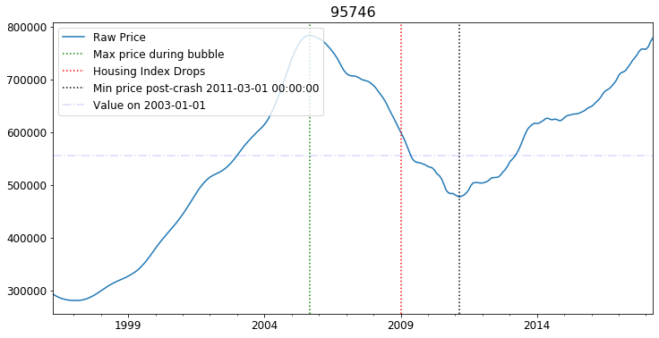


```python
ts.boxplot(column = 'value')
plt.title(geog_area);

```


```python
plot_acf_pacf(ts.value)
```


```python
plot_seasonal_decomp(ts.value);

# Note that seasonality isn't much of a factor here; maximum difference of about $700 over the course of a year
```


### ARIMA parameters tuning


```python
p_values = [0, 1, 2, 4, 6, 8, 10]
d_values = range(0, 3)
q_values = range(0, 3)

```

### ARIMA modeling and forecasting results


```python
# This function will run parameter tuning and will append lists
# Uncomment to run (will take about 20-30 minutes)

# arima_forecast_run(ts, geog_area, city, county, p_values, d_values, q_values, confint=2)

# For 95746 (Granite Bay):
# ARIMA(0, 0, 0) MSE=12134424077.244
# ARIMA(0, 0, 1) MSE=3123788984.556
# ARIMA(0, 1, 0) MSE=13089546.571
# ARIMA(0, 1, 1) MSE=6536140.551
# ARIMA(0, 2, 0) MSE=4784362.295
# ARIMA(0, 2, 1) MSE=4223158.179
# ARIMA(0, 2, 2) MSE=4453409.133
# ARIMA(1, 0, 0) MSE=20356040.575
# ARIMA(1, 1, 0) MSE=4638930.152
# ARIMA(1, 1, 1) MSE=4006169.147
# ARIMA(1, 1, 2) MSE=4245452.231
# ARIMA(1, 2, 0) MSE=4688281.403
# ARIMA(1, 2, 1) MSE=4297882.791
# ARIMA(2, 0, 0) MSE=4681541.210
# ARIMA(2, 0, 1) MSE=21107346390.555
# ARIMA(2, 0, 2) MSE=4281419.314
# ARIMA(2, 1, 0) MSE=4438028.164
# ARIMA(2, 1, 1) MSE=4085772.049
# ARIMA(2, 2, 0) MSE=3967456.687
# ARIMA(2, 2, 1) MSE=4015211.253
# ARIMA(2, 2, 2) MSE=3850493.705
# ARIMA(4, 0, 0) MSE=3848082.691
# ARIMA(4, 0, 1) MSE=3797564.066
# ARIMA(4, 0, 2) MSE=3569277.635
# ARIMA(4, 1, 0) MSE=3956932.695
# ARIMA(4, 1, 1) MSE=3765133.557
# ARIMA(4, 1, 2) MSE=3192123.140
# ARIMA(4, 2, 0) MSE=4133353.785
# ARIMA(6, 0, 0) MSE=4022418.465
# ARIMA(8, 0, 0) MSE=4228144.504
# ARIMA(10, 0, 0) MSE=3893362.210
# Best ARIMA(4, 1, 2) MSE=3192123.140
# Best ARIMA order = (4, 1, 2)
```


```python
# this function will not run parameter tuning, but will append lists
# Uncomment to run

best_cfg = (4,1,2)
arima_forecast_enter_pdq(ts, geog_area, city, county, best_cfg, confint=2)   
```

    For 95746 (Granite Bay):
    Best ARIMA order = (4, 1, 2)
                                 ARIMA Model Results                              
    ==============================================================================
    Dep. Variable:                D.value   No. Observations:                  264
    Model:                 ARIMA(4, 1, 2)   Log Likelihood               -2050.768
    Method:                       css-mle   S.D. of innovations            566.552
    Date:                Tue, 24 Mar 2020   AIC                           4117.537
    Time:                        19:21:32   BIC                           4146.144
    Sample:                    05-01-1996   HQIC                          4129.032
                             - 04-01-2018                                         
    =================================================================================
                        coef    std err          z      P>|z|      [0.025      0.975]
    ---------------------------------------------------------------------------------
    const           926.1367   1083.879      0.854      0.394   -1198.227    3050.500
    ar.L1.D.value     0.4035      0.098      4.108      0.000       0.211       0.596
    ar.L2.D.value     0.3435      0.105      3.275      0.001       0.138       0.549
    ar.L3.D.value    -0.0963      0.094     -1.027      0.305      -0.280       0.087
    ar.L4.D.value     0.2552      0.077      3.326      0.001       0.105       0.406
    ma.L1.D.value     1.4617      0.094     15.598      0.000       1.278       1.645
    ma.L2.D.value     0.6785      0.089      7.659      0.000       0.505       0.852
                                        Roots                                    
    =============================================================================
                      Real          Imaginary           Modulus         Frequency
    -----------------------------------------------------------------------------
    AR.1            1.0494           -0.0000j            1.0494           -0.0000
    AR.2           -1.3011           -0.0000j            1.3011           -0.5000
    AR.3            0.3145           -1.6646j            1.6940           -0.2203
    AR.4            0.3145           +1.6646j            1.6940            0.2203
    MA.1           -1.0771           -0.5599j            1.2140           -0.4237
    MA.2           -1.0771           +0.5599j            1.2140            0.4237
    -----------------------------------------------------------------------------
    By the model prediction, I would expect to see a 9.795% change in price by April 1, 2020.
    At the lower bound of the confidence interval, I would expect to see a -11.963% change in price by April 1, 2020.
    At the upper bound of the confidence interval, I would expect to see a 31.553% change in price by April 1, 2020.


    (['95616',
      '95619',
      '95864',
      '95831',
      '95811',
      '95818',
      '95630',
      '96140',
      '95672',
      '95636',
      '95709',
      '95746'],
     ['Davis',
      'Diamond Springs',
      'Arden-Arcade',
      'Sacramento_Pocket',
      'Sacramento_DosRios',
      'Sacramento_LandPark',
      'Folsom',
      'Carnelian Bay',
      'Rescue',
      'Somerset',
      'Camino',
      'Granite Bay'],
     ['Yolo',
      'El Dorado',
      'Sacramento',
      'Sacramento',
      'Sacramento',
      'Sacramento',
      'Sacramento',
      'Placer',
      'El Dorado',
      'El Dorado',
      'El Dorado',
      'Placer'],
     [(2, 1, 2),
      (2, 1, 2),
      (8, 0, 2),
      (4, 0, 2),
      (10, 1, 0),
      (1, 1, 1),
      (4, 0, 2),
      (2, 1, 2),
      (4, 1, 2),
      (6, 0, 1),
      (2, 1, 2),
      (4, 1, 2)],
     [717863.06,
      355774.45,
      449047.92,
      386994.52,
      570598.7,
      563857.1,
      484136.82,
      686817.86,
      650576.11,
      230095.49,
      410576.95,
      423809.57],
     [619575.34,
      275292.09,
      327568.68,
      292621.1,
      459606.77,
      464602.96,
      382062.81,
      560520.55,
      514993.56,
      165787.22,
      321956.34,
      339823.66],
     [816150.79,
      436256.81,
      570527.16,
      481367.94,
      681590.63,
      663111.23,
      586210.84,
      813115.17,
      786158.66,
      294403.76,
      499197.56,
      507795.49],
     [692300.0,
      321100.0,
      552700.0,
      449300.0,
      567500.0,
      563900.0,
      542900.0,
      644600.0,
      579300.0,
      241200.0,
      386000.0,
      386000.0],
     [3.69,
      10.8,
      -18.75,
      -13.87,
      0.55,
      -0.01,
      -10.82,
      6.55,
      12.3,
      -4.6,
      6.37,
      9.8],
     [-10.5,
      -14.27,
      -40.73,
      -34.87,
      -19.01,
      -17.61,
      -29.63,
      -13.04,
      -11.1,
      -31.27,
      -16.59,
      -11.96],
     [17.89,
      35.86,
      3.23,
      7.14,
      20.1,
      17.59,
      7.98,
      26.14,
      35.71,
      22.06,
      29.33,
      31.55])


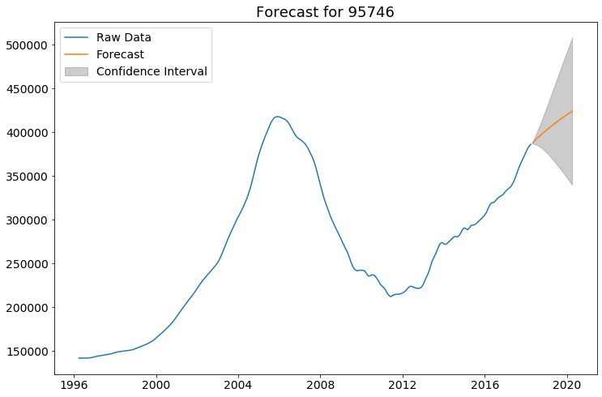


```python
print_results_lists()
```


    (['95616',
      '95619',
      '95864',
      '95831',
      '95811',
      '95818',
      '95630',
      '96140',
      '95672',
      '95636',
      '95709',
      '95746'],
     ['Davis',
      'Diamond Springs',
      'Arden-Arcade',
      'Sacramento_Pocket',
      'Sacramento_DosRios',
      'Sacramento_LandPark',
      'Folsom',
      'Carnelian Bay',
      'Rescue',
      'Somerset',
      'Camino',
      'Granite Bay'],
     ['Yolo',
      'El Dorado',
      'Sacramento',
      'Sacramento',
      'Sacramento',
      'Sacramento',
      'Sacramento',
      'Placer',
      'El Dorado',
      'El Dorado',
      'El Dorado',
      'Placer'],
     [(2, 1, 2),
      (2, 1, 2),
      (8, 0, 2),
      (4, 0, 2),
      (10, 1, 0),
      (1, 1, 1),
      (4, 0, 2),
      (2, 1, 2),
      (4, 1, 2),
      (6, 0, 1),
      (2, 1, 2),
      (4, 1, 2)],
     [717863.06,
      355774.45,
      449047.92,
      386994.52,
      570598.7,
      563857.1,
      484136.82,
      686817.86,
      650576.11,
      230095.49,
      410576.95,
      423809.57],
     [619575.34,
      275292.09,
      327568.68,
      292621.1,
      459606.77,
      464602.96,
      382062.81,
      560520.55,
      514993.56,
      165787.22,
      321956.34,
      339823.66],
     [816150.79,
      436256.81,
      570527.16,
      481367.94,
      681590.63,
      663111.23,
      586210.84,
      813115.17,
      786158.66,
      294403.76,
      499197.56,
      507795.49],
     [692300.0,
      321100.0,
      552700.0,
      449300.0,
      567500.0,
      563900.0,
      542900.0,
      644600.0,
      579300.0,
      241200.0,
      386000.0,
      386000.0],
     [3.69,
      10.8,
      -18.75,
      -13.87,
      0.55,
      -0.01,
      -10.82,
      6.55,
      12.3,
      -4.6,
      6.37,
      9.8],
     [-10.5,
      -14.27,
      -40.73,
      -34.87,
      -19.01,
      -17.61,
      -29.63,
      -13.04,
      -11.1,
      -31.27,
      -16.59,
      -11.96],
     [17.89,
      35.86,
      3.23,
      7.14,
      20.1,
      17.59,
      7.98,
      26.14,
      35.71,
      22.06,
      29.33,
      31.55])


```python
# pop_results_lists()
```


```python
# print_results_lists()
```

### Zip code 95746 (Granite Bay):  Solid investment opportunity

By the model prediction, I would expect to see a 9.795% change in price by April 1, 2020.
At the lower bound of the confidence interval, I would expect to see a -11.963% change in price by April 1, 2020.
At the upper bound of the confidence interval, I would expect to see a 31.553% change in price by April 1, 2020.

## SacMetro:  95614 (Cool) -- Not a great investment opportunity

### Set up dataframe


```python
geog_area = '95614'
```


```python
city = 'Cool'
```


```python
county = 'El Dorado'
```


```python
ts = df_sac.loc[df_sac['Zip'] == geog_area]
```


```python
ts.head()
```


<div>
<style scoped>
    .dataframe tbody tr th:only-of-type {
        vertical-align: middle;
    }

    .dataframe tbody tr th {
        vertical-align: top;
    }

    .dataframe thead th {
        text-align: right;
    }
</style>
<table border="1" class="dataframe">
  <thead>
    <tr style="text-align: right;">
      <th></th>
      <th>Metro</th>
      <th>MetroState</th>
      <th>CountyName</th>
      <th>City</th>
      <th>Zip</th>
      <th>value</th>
    </tr>
    <tr>
      <th>time</th>
      <th></th>
      <th></th>
      <th></th>
      <th></th>
      <th></th>
      <th></th>
    </tr>
  </thead>
  <tbody>
    <tr>
      <td>1996-04-01</td>
      <td>Sacramento</td>
      <td>Sacramento CA</td>
      <td>El Dorado</td>
      <td>Cool</td>
      <td>95614</td>
      <td>157500.0</td>
    </tr>
    <tr>
      <td>1996-05-01</td>
      <td>Sacramento</td>
      <td>Sacramento CA</td>
      <td>El Dorado</td>
      <td>Cool</td>
      <td>95614</td>
      <td>157200.0</td>
    </tr>
    <tr>
      <td>1996-06-01</td>
      <td>Sacramento</td>
      <td>Sacramento CA</td>
      <td>El Dorado</td>
      <td>Cool</td>
      <td>95614</td>
      <td>156900.0</td>
    </tr>
    <tr>
      <td>1996-07-01</td>
      <td>Sacramento</td>
      <td>Sacramento CA</td>
      <td>El Dorado</td>
      <td>Cool</td>
      <td>95614</td>
      <td>156700.0</td>
    </tr>
    <tr>
      <td>1996-08-01</td>
      <td>Sacramento</td>
      <td>Sacramento CA</td>
      <td>El Dorado</td>
      <td>Cool</td>
      <td>95614</td>
      <td>156400.0</td>
    </tr>
  </tbody>
</table>
</div>


```python
ts = ts.resample('MS').asfreq()
```


```python
ts.head()
```


<div>
<style scoped>
    .dataframe tbody tr th:only-of-type {
        vertical-align: middle;
    }

    .dataframe tbody tr th {
        vertical-align: top;
    }

    .dataframe thead th {
        text-align: right;
    }
</style>
<table border="1" class="dataframe">
  <thead>
    <tr style="text-align: right;">
      <th></th>
      <th>Metro</th>
      <th>MetroState</th>
      <th>CountyName</th>
      <th>City</th>
      <th>Zip</th>
      <th>value</th>
    </tr>
    <tr>
      <th>time</th>
      <th></th>
      <th></th>
      <th></th>
      <th></th>
      <th></th>
      <th></th>
    </tr>
  </thead>
  <tbody>
    <tr>
      <td>1996-04-01</td>
      <td>Sacramento</td>
      <td>Sacramento CA</td>
      <td>El Dorado</td>
      <td>Cool</td>
      <td>95614</td>
      <td>157500.0</td>
    </tr>
    <tr>
      <td>1996-05-01</td>
      <td>Sacramento</td>
      <td>Sacramento CA</td>
      <td>El Dorado</td>
      <td>Cool</td>
      <td>95614</td>
      <td>157200.0</td>
    </tr>
    <tr>
      <td>1996-06-01</td>
      <td>Sacramento</td>
      <td>Sacramento CA</td>
      <td>El Dorado</td>
      <td>Cool</td>
      <td>95614</td>
      <td>156900.0</td>
    </tr>
    <tr>
      <td>1996-07-01</td>
      <td>Sacramento</td>
      <td>Sacramento CA</td>
      <td>El Dorado</td>
      <td>Cool</td>
      <td>95614</td>
      <td>156700.0</td>
    </tr>
    <tr>
      <td>1996-08-01</td>
      <td>Sacramento</td>
      <td>Sacramento CA</td>
      <td>El Dorado</td>
      <td>Cool</td>
      <td>95614</td>
      <td>156400.0</td>
    </tr>
  </tbody>
</table>
</div>


### Visualizations


```python
plot_single_geog(df_melt, geog_area, 'value', 'Zip', figsize=(12, 6), fontsize1=12, fontsize2=16)
```


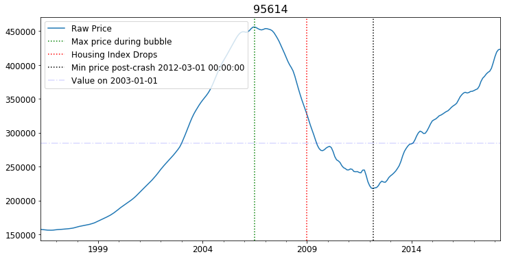


```python
ts.boxplot(column = 'value')
plt.title(geog_area);

```


```python
plot_acf_pacf(ts.value)
```


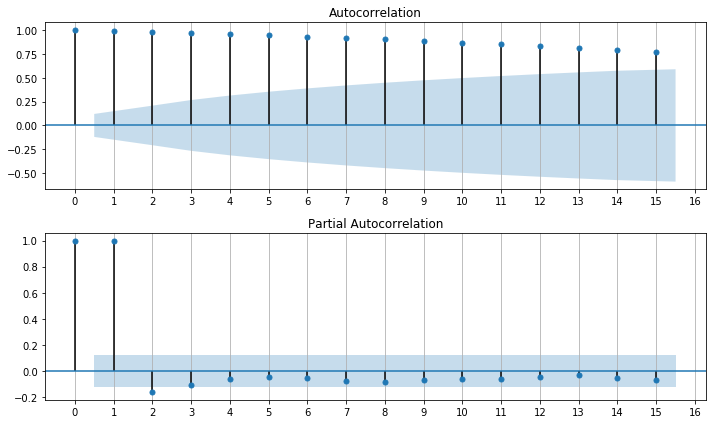


```python
plot_seasonal_decomp(ts.value);

# Note that seasonality isn't much of a factor here; maximum difference of about $700 over the course of a year
```


### ARIMA parameters tuning


```python
p_values = [0, 1, 2, 4, 6, 8, 10]
d_values = range(0, 3)
q_values = range(0, 3)

```

### ARIMA modeling and forecasting results


```python
# This function will run parameter tuning and will append lists
# Uncomment to run (will take about 20-30 minutes)

# arima_forecast_run(ts, geog_area, city, county, p_values, d_values, q_values, confint=2)

# For 95614 (Cool):
# ARIMA(0, 0, 0) MSE=3683099817.279
# ARIMA(0, 1, 0) MSE=10675795.704
# ARIMA(0, 1, 1) MSE=3619321.883
# ARIMA(0, 2, 0) MSE=4319048.972
# ARIMA(0, 2, 1) MSE=3012010.363
# ARIMA(1, 1, 0) MSE=4117580.867
# ARIMA(1, 2, 0) MSE=4133589.687
# ARIMA(2, 1, 0) MSE=3743946.854
# ARIMA(2, 2, 0) MSE=3114778.488
# ARIMA(2, 2, 1) MSE=2801983.225
# ARIMA(2, 2, 2) MSE=2513648.766
# ARIMA(4, 0, 1) MSE=2691902.812
# ARIMA(4, 0, 2) MSE=2385169.321
# ARIMA(4, 1, 1) MSE=2703753.532
# ARIMA(4, 2, 0) MSE=2472884.029
# ARIMA(4, 2, 1) MSE=2490043.627
# ARIMA(6, 0, 1) MSE=2429247.351
# Best ARIMA(4, 0, 2) MSE=2385169.321
# Best ARIMA order = (4, 0, 2)
```


```python
# this function will not run parameter tuning, but will append lists
# Uncomment to run

best_cfg = (4, 0, 2)
arima_forecast_enter_pdq(ts, geog_area, city, county, best_cfg, confint=2)   
```

    For 95614 (Cool):
    Best ARIMA order = (4, 0, 2)
                                  ARMA Model Results                              
    ==============================================================================
    Dep. Variable:                  value   No. Observations:                  265
    Model:                     ARMA(4, 2)   Log Likelihood               -2191.961
    Method:                       css-mle   S.D. of innovations            920.005
    Date:                Tue, 24 Mar 2020   AIC                           4399.921
    Time:                        19:21:59   BIC                           4428.559
    Sample:                    04-01-1996   HQIC                          4411.428
                             - 04-01-2018                                         
    ===============================================================================
                      coef    std err          z      P>|z|      [0.025      0.975]
    -------------------------------------------------------------------------------
    const        2.931e+05   6.92e+04      4.233      0.000    1.57e+05    4.29e+05
    ar.L1.value     1.4334      0.076     18.835      0.000       1.284       1.583
    ar.L2.value    -0.3850      0.169     -2.283      0.023      -0.716      -0.054
    ar.L3.value     0.2740      0.170      1.615      0.108      -0.059       0.607
    ar.L4.value    -0.3245      0.077     -4.207      0.000      -0.476      -0.173
    ma.L1.value     1.4697      0.064     23.050      0.000       1.345       1.595
    ma.L2.value     0.8372      0.041     20.439      0.000       0.757       0.917
                                        Roots                                    
    =============================================================================
                      Real          Imaginary           Modulus         Frequency
    -----------------------------------------------------------------------------
    AR.1            1.0123           -0.0000j            1.0123           -0.0000
    AR.2            1.1033           -0.0000j            1.1033           -0.0000
    AR.3           -0.6356           -1.5346j            1.6610           -0.3125
    AR.4           -0.6356           +1.5346j            1.6610            0.3125
    MA.1           -0.8778           -0.6512j            1.0929           -0.3984
    MA.2           -0.8778           +0.6512j            1.0929            0.3984
    -----------------------------------------------------------------------------
    By the model prediction, I would expect to see a -3.954% change in price by April 1, 2020.
    At the lower bound of the confidence interval, I would expect to see a -28.057% change in price by April 1, 2020.
    At the upper bound of the confidence interval, I would expect to see a 20.149% change in price by April 1, 2020.


    (['95616',
      '95619',
      '95864',
      '95831',
      '95811',
      '95818',
      '95630',
      '96140',
      '95672',
      '95636',
      '95709',
      '95746',
      '95614'],
     ['Davis',
      'Diamond Springs',
      'Arden-Arcade',
      'Sacramento_Pocket',
      'Sacramento_DosRios',
      'Sacramento_LandPark',
      'Folsom',
      'Carnelian Bay',
      'Rescue',
      'Somerset',
      'Camino',
      'Granite Bay',
      'Cool'],
     ['Yolo',
      'El Dorado',
      'Sacramento',
      'Sacramento',
      'Sacramento',
      'Sacramento',
      'Sacramento',
      'Placer',
      'El Dorado',
      'El Dorado',
      'El Dorado',
      'Placer',
      'El Dorado'],
     [(2, 1, 2),
      (2, 1, 2),
      (8, 0, 2),
      (4, 0, 2),
      (10, 1, 0),
      (1, 1, 1),
      (4, 0, 2),
      (2, 1, 2),
      (4, 1, 2),
      (6, 0, 1),
      (2, 1, 2),
      (4, 1, 2),
      (4, 0, 2)],
     [717863.06,
      355774.45,
      449047.92,
      386994.52,
      570598.7,
      563857.1,
      484136.82,
      686817.86,
      650576.11,
      230095.49,
      410576.95,
      423809.57,
      406562.1],
     [619575.34,
      275292.09,
      327568.68,
      292621.1,
      459606.77,
      464602.96,
      382062.81,
      560520.55,
      514993.56,
      165787.22,
      321956.34,
      339823.66,
      304533.23],
     [816150.79,
      436256.81,
      570527.16,
      481367.94,
      681590.63,
      663111.23,
      586210.84,
      813115.17,
      786158.66,
      294403.76,
      499197.56,
      507795.49,
      508590.96],
     [692300.0,
      321100.0,
      552700.0,
      449300.0,
      567500.0,
      563900.0,
      542900.0,
      644600.0,
      579300.0,
      241200.0,
      386000.0,
      386000.0,
      423300.0],
     [3.69,
      10.8,
      -18.75,
      -13.87,
      0.55,
      -0.01,
      -10.82,
      6.55,
      12.3,
      -4.6,
      6.37,
      9.8,
      -3.95],
     [-10.5,
      -14.27,
      -40.73,
      -34.87,
      -19.01,
      -17.61,
      -29.63,
      -13.04,
      -11.1,
      -31.27,
      -16.59,
      -11.96,
      -28.06],
     [17.89,
      35.86,
      3.23,
      7.14,
      20.1,
      17.59,
      7.98,
      26.14,
      35.71,
      22.06,
      29.33,
      31.55,
      20.15])


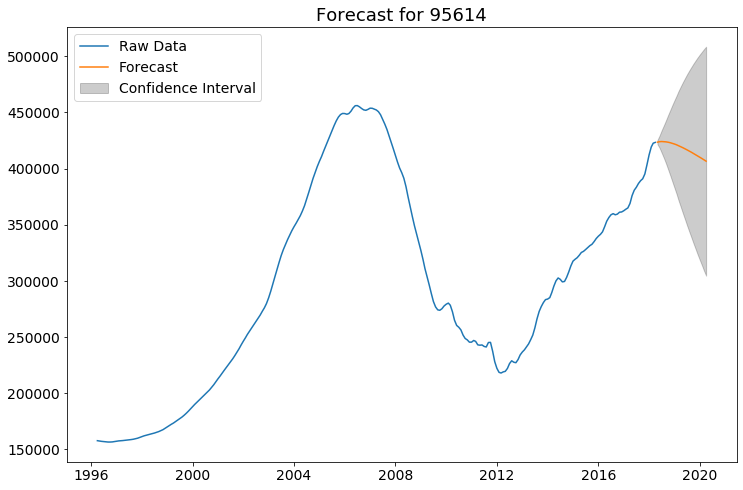


```python
print_results_lists()
```


    (['95616',
      '95619',
      '95864',
      '95831',
      '95811',
      '95818',
      '95630',
      '96140',
      '95672',
      '95636',
      '95709',
      '95746',
      '95614'],
     ['Davis',
      'Diamond Springs',
      'Arden-Arcade',
      'Sacramento_Pocket',
      'Sacramento_DosRios',
      'Sacramento_LandPark',
      'Folsom',
      'Carnelian Bay',
      'Rescue',
      'Somerset',
      'Camino',
      'Granite Bay',
      'Cool'],
     ['Yolo',
      'El Dorado',
      'Sacramento',
      'Sacramento',
      'Sacramento',
      'Sacramento',
      'Sacramento',
      'Placer',
      'El Dorado',
      'El Dorado',
      'El Dorado',
      'Placer',
      'El Dorado'],
     [(2, 1, 2),
      (2, 1, 2),
      (8, 0, 2),
      (4, 0, 2),
      (10, 1, 0),
      (1, 1, 1),
      (4, 0, 2),
      (2, 1, 2),
      (4, 1, 2),
      (6, 0, 1),
      (2, 1, 2),
      (4, 1, 2),
      (4, 0, 2)],
     [717863.06,
      355774.45,
      449047.92,
      386994.52,
      570598.7,
      563857.1,
      484136.82,
      686817.86,
      650576.11,
      230095.49,
      410576.95,
      423809.57,
      406562.1],
     [619575.34,
      275292.09,
      327568.68,
      292621.1,
      459606.77,
      464602.96,
      382062.81,
      560520.55,
      514993.56,
      165787.22,
      321956.34,
      339823.66,
      304533.23],
     [816150.79,
      436256.81,
      570527.16,
      481367.94,
      681590.63,
      663111.23,
      586210.84,
      813115.17,
      786158.66,
      294403.76,
      499197.56,
      507795.49,
      508590.96],
     [692300.0,
      321100.0,
      552700.0,
      449300.0,
      567500.0,
      563900.0,
      542900.0,
      644600.0,
      579300.0,
      241200.0,
      386000.0,
      386000.0,
      423300.0],
     [3.69,
      10.8,
      -18.75,
      -13.87,
      0.55,
      -0.01,
      -10.82,
      6.55,
      12.3,
      -4.6,
      6.37,
      9.8,
      -3.95],
     [-10.5,
      -14.27,
      -40.73,
      -34.87,
      -19.01,
      -17.61,
      -29.63,
      -13.04,
      -11.1,
      -31.27,
      -16.59,
      -11.96,
      -28.06],
     [17.89,
      35.86,
      3.23,
      7.14,
      20.1,
      17.59,
      7.98,
      26.14,
      35.71,
      22.06,
      29.33,
      31.55,
      20.15])


```python
# pop_results_lists()
```


```python
# print_results_lists()
```

### Zip code 95614 (Cool):  Poor investment opportunity

By the model prediction, I would expect to see a -3.954% change in price by April 1, 2020.
At the lower bound of the confidence interval, I would expect to see a -28.057% change in price by April 1, 2020.
At the upper bound of the confidence interval, I would expect to see a 20.149% change in price by April 1, 2020.

## SacMetro:  95663 (Penryn) -- Mediocre investment opportunity

### Set up dataframe


```python
geog_area = '95663'
```


```python
city = 'Penryn'
```


```python
county = 'Placer'
```


```python
ts = df_sac.loc[df_sac['Zip'] == geog_area]
```


```python
ts.head()
```


<div>
<style scoped>
    .dataframe tbody tr th:only-of-type {
        vertical-align: middle;
    }

    .dataframe tbody tr th {
        vertical-align: top;
    }

    .dataframe thead th {
        text-align: right;
    }
</style>
<table border="1" class="dataframe">
  <thead>
    <tr style="text-align: right;">
      <th></th>
      <th>Metro</th>
      <th>MetroState</th>
      <th>CountyName</th>
      <th>City</th>
      <th>Zip</th>
      <th>value</th>
    </tr>
    <tr>
      <th>time</th>
      <th></th>
      <th></th>
      <th></th>
      <th></th>
      <th></th>
      <th></th>
    </tr>
  </thead>
  <tbody>
    <tr>
      <td>1996-04-01</td>
      <td>Sacramento</td>
      <td>Sacramento CA</td>
      <td>Placer</td>
      <td>Penryn</td>
      <td>95663</td>
      <td>195400.0</td>
    </tr>
    <tr>
      <td>1996-05-01</td>
      <td>Sacramento</td>
      <td>Sacramento CA</td>
      <td>Placer</td>
      <td>Penryn</td>
      <td>95663</td>
      <td>195300.0</td>
    </tr>
    <tr>
      <td>1996-06-01</td>
      <td>Sacramento</td>
      <td>Sacramento CA</td>
      <td>Placer</td>
      <td>Penryn</td>
      <td>95663</td>
      <td>195300.0</td>
    </tr>
    <tr>
      <td>1996-07-01</td>
      <td>Sacramento</td>
      <td>Sacramento CA</td>
      <td>Placer</td>
      <td>Penryn</td>
      <td>95663</td>
      <td>195300.0</td>
    </tr>
    <tr>
      <td>1996-08-01</td>
      <td>Sacramento</td>
      <td>Sacramento CA</td>
      <td>Placer</td>
      <td>Penryn</td>
      <td>95663</td>
      <td>195400.0</td>
    </tr>
  </tbody>
</table>
</div>


```python
ts = ts.resample('MS').asfreq()
```


```python
ts.head()
```


<div>
<style scoped>
    .dataframe tbody tr th:only-of-type {
        vertical-align: middle;
    }

    .dataframe tbody tr th {
        vertical-align: top;
    }

    .dataframe thead th {
        text-align: right;
    }
</style>
<table border="1" class="dataframe">
  <thead>
    <tr style="text-align: right;">
      <th></th>
      <th>Metro</th>
      <th>MetroState</th>
      <th>CountyName</th>
      <th>City</th>
      <th>Zip</th>
      <th>value</th>
    </tr>
    <tr>
      <th>time</th>
      <th></th>
      <th></th>
      <th></th>
      <th></th>
      <th></th>
      <th></th>
    </tr>
  </thead>
  <tbody>
    <tr>
      <td>1996-04-01</td>
      <td>Sacramento</td>
      <td>Sacramento CA</td>
      <td>Placer</td>
      <td>Penryn</td>
      <td>95663</td>
      <td>195400.0</td>
    </tr>
    <tr>
      <td>1996-05-01</td>
      <td>Sacramento</td>
      <td>Sacramento CA</td>
      <td>Placer</td>
      <td>Penryn</td>
      <td>95663</td>
      <td>195300.0</td>
    </tr>
    <tr>
      <td>1996-06-01</td>
      <td>Sacramento</td>
      <td>Sacramento CA</td>
      <td>Placer</td>
      <td>Penryn</td>
      <td>95663</td>
      <td>195300.0</td>
    </tr>
    <tr>
      <td>1996-07-01</td>
      <td>Sacramento</td>
      <td>Sacramento CA</td>
      <td>Placer</td>
      <td>Penryn</td>
      <td>95663</td>
      <td>195300.0</td>
    </tr>
    <tr>
      <td>1996-08-01</td>
      <td>Sacramento</td>
      <td>Sacramento CA</td>
      <td>Placer</td>
      <td>Penryn</td>
      <td>95663</td>
      <td>195400.0</td>
    </tr>
  </tbody>
</table>
</div>


### Visualizations


```python
plot_single_geog(df_melt, geog_area, 'value', 'Zip', figsize=(12, 6), fontsize1=12, fontsize2=16)
```


```python
ts.boxplot(column = 'value')
plt.title(geog_area);

```


```python
plot_acf_pacf(ts.value)
```


```python
plot_seasonal_decomp(ts.value);

# Note that seasonality isn't much of a factor here; maximum difference of about $700 over the course of a year
```


### ARIMA parameters tuning


```python
p_values = [0, 1, 2, 4, 6, 8, 10]
d_values = range(0, 3)
q_values = range(0, 3)

```

### ARIMA modeling and forecasting results


```python
# This function will run parameter tuning and will append lists
# Uncomment to run (will take about 20-30 minutes)

# arima_forecast_run(ts, geog_area, city, county, p_values, d_values, q_values, confint=2)

# For 95663 (Penryn):
# ARIMA(0, 0, 0) MSE=9818607466.817
# ARIMA(0, 0, 1) MSE=2518058335.648
# ARIMA(0, 1, 0) MSE=17562047.108
# ARIMA(0, 1, 1) MSE=8062655.542
# ARIMA(0, 2, 0) MSE=6806179.084
# ARIMA(0, 2, 1) MSE=5156267.166
# ARIMA(1, 0, 0) MSE=22864902.794
# ARIMA(1, 1, 0) MSE=6621129.281
# ARIMA(1, 1, 1) MSE=4884407.610
# ARIMA(1, 1, 2) MSE=4575029.905
# ARIMA(1, 2, 0) MSE=6164059.231
# ARIMA(1, 2, 1) MSE=5304938.358
# ARIMA(1, 2, 2) MSE=4602724.825
# ARIMA(2, 0, 0) MSE=6668049.476
# ARIMA(2, 0, 1) MSE=4931646.056
# ARIMA(2, 0, 2) MSE=4652341.914
# ARIMA(2, 1, 1) MSE=4940987.100
# ARIMA(2, 2, 0) MSE=4717586.624
# ARIMA(2, 2, 1) MSE=4793113.044
# ARIMA(2, 2, 2) MSE=4468610.933
# ARIMA(4, 0, 0) MSE=4585105.508
# ARIMA(4, 0, 1) MSE=4653791.216
# ARIMA(4, 0, 2) MSE=4248724.392
# ARIMA(4, 1, 1) MSE=4700771.528
# ARIMA(4, 2, 0) MSE=4879382.738
# ARIMA(4, 2, 1) MSE=4944818.865
# ARIMA(6, 0, 0) MSE=4763417.829
# ARIMA(6, 0, 1) MSE=4856929.426
# ARIMA(6, 1, 1) MSE=4367913.754
# ARIMA(6, 2, 0) MSE=4530648.031
# ARIMA(6, 2, 1) MSE=4411107.586
# ARIMA(8, 0, 1) MSE=4342155.192
# ARIMA(8, 2, 0) MSE=4456621.365
# ARIMA(8, 2, 1) MSE=4496173.009
# ARIMA(10, 0, 1) MSE=4400921.884
# ARIMA(10, 1, 1) MSE=4416056.878
# Best ARIMA(4, 0, 2) MSE=4248724.392
# Best ARIMA order = (4, 0, 2)
```


```python
# this function will not run parameter tuning, but will append lists
# Uncomment to run

best_cfg = (4, 0, 2)
arima_forecast_enter_pdq(ts, geog_area, city, county, best_cfg, confint=2)   
```

    For 95663 (Penryn):
    Best ARIMA order = (4, 0, 2)
                                  ARMA Model Results                              
    ==============================================================================
    Dep. Variable:                  value   No. Observations:                  265
    Model:                     ARMA(4, 2)   Log Likelihood               -2273.008
    Method:                       css-mle   S.D. of innovations           1249.597
    Date:                Tue, 24 Mar 2020   AIC                           4562.015
    Time:                        19:22:16   BIC                           4590.653
    Sample:                    04-01-1996   HQIC                          4573.522
                             - 04-01-2018                                         
    ===============================================================================
                      coef    std err          z      P>|z|      [0.025      0.975]
    -------------------------------------------------------------------------------
    const        4.046e+05   1.08e+05      3.732      0.000    1.92e+05    6.17e+05
    ar.L1.value     1.2467      0.081     15.373      0.000       1.088       1.406
    ar.L2.value     0.1421      0.143      0.992      0.322      -0.139       0.423
    ar.L3.value    -0.2249      0.133     -1.685      0.093      -0.486       0.037
    ar.L4.value    -0.1658      0.076     -2.183      0.030      -0.315      -0.017
    ma.L1.value     1.5466      0.054     28.579      0.000       1.441       1.653
    ma.L2.value     0.8702      0.052     16.586      0.000       0.767       0.973
                                        Roots                                    
    =============================================================================
                      Real          Imaginary           Modulus         Frequency
    -----------------------------------------------------------------------------
    AR.1            1.0101           -0.0000j            1.0101           -0.0000
    AR.2            1.1087           -0.0000j            1.1087           -0.0000
    AR.3           -1.7377           -1.5385j            2.3209           -0.3847
    AR.4           -1.7377           +1.5385j            2.3209            0.3847
    MA.1           -0.8887           -0.5995j            1.0720           -0.4055
    MA.2           -0.8887           +0.5995j            1.0720            0.4055
    -----------------------------------------------------------------------------
    By the model prediction, I would expect to see a 2.031% change in price by April 1, 2020.
    At the lower bound of the confidence interval, I would expect to see a -21.468% change in price by April 1, 2020.
    At the upper bound of the confidence interval, I would expect to see a 25.531% change in price by April 1, 2020.


    (['95616',
      '95619',
      '95864',
      '95831',
      '95811',
      '95818',
      '95630',
      '96140',
      '95672',
      '95636',
      '95709',
      '95746',
      '95614',
      '95663'],
     ['Davis',
      'Diamond Springs',
      'Arden-Arcade',
      'Sacramento_Pocket',
      'Sacramento_DosRios',
      'Sacramento_LandPark',
      'Folsom',
      'Carnelian Bay',
      'Rescue',
      'Somerset',
      'Camino',
      'Granite Bay',
      'Cool',
      'Penryn'],
     ['Yolo',
      'El Dorado',
      'Sacramento',
      'Sacramento',
      'Sacramento',
      'Sacramento',
      'Sacramento',
      'Placer',
      'El Dorado',
      'El Dorado',
      'El Dorado',
      'Placer',
      'El Dorado',
      'Placer'],
     [(2, 1, 2),
      (2, 1, 2),
      (8, 0, 2),
      (4, 0, 2),
      (10, 1, 0),
      (1, 1, 1),
      (4, 0, 2),
      (2, 1, 2),
      (4, 1, 2),
      (6, 0, 1),
      (2, 1, 2),
      (4, 1, 2),
      (4, 0, 2),
      (4, 0, 2)],
     [717863.06,
      355774.45,
      449047.92,
      386994.52,
      570598.7,
      563857.1,
      484136.82,
      686817.86,
      650576.11,
      230095.49,
      410576.95,
      423809.57,
      406562.1,
      612903.01],
     [619575.34,
      275292.09,
      327568.68,
      292621.1,
      459606.77,
      464602.96,
      382062.81,
      560520.55,
      514993.56,
      165787.22,
      321956.34,
      339823.66,
      304533.23,
      471743.88],
     [816150.79,
      436256.81,
      570527.16,
      481367.94,
      681590.63,
      663111.23,
      586210.84,
      813115.17,
      786158.66,
      294403.76,
      499197.56,
      507795.49,
      508590.96,
      754062.15],
     [692300.0,
      321100.0,
      552700.0,
      449300.0,
      567500.0,
      563900.0,
      542900.0,
      644600.0,
      579300.0,
      241200.0,
      386000.0,
      386000.0,
      423300.0,
      600700.0],
     [3.69,
      10.8,
      -18.75,
      -13.87,
      0.55,
      -0.01,
      -10.82,
      6.55,
      12.3,
      -4.6,
      6.37,
      9.8,
      -3.95,
      2.03],
     [-10.5,
      -14.27,
      -40.73,
      -34.87,
      -19.01,
      -17.61,
      -29.63,
      -13.04,
      -11.1,
      -31.27,
      -16.59,
      -11.96,
      -28.06,
      -21.47],
     [17.89,
      35.86,
      3.23,
      7.14,
      20.1,
      17.59,
      7.98,
      26.14,
      35.71,
      22.06,
      29.33,
      31.55,
      20.15,
      25.53])


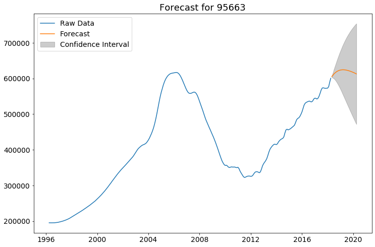


```python
print_results_lists()
```


    (['95616',
      '95619',
      '95864',
      '95831',
      '95811',
      '95818',
      '95630',
      '96140',
      '95672',
      '95636',
      '95709',
      '95746',
      '95614',
      '95663'],
     ['Davis',
      'Diamond Springs',
      'Arden-Arcade',
      'Sacramento_Pocket',
      'Sacramento_DosRios',
      'Sacramento_LandPark',
      'Folsom',
      'Carnelian Bay',
      'Rescue',
      'Somerset',
      'Camino',
      'Granite Bay',
      'Cool',
      'Penryn'],
     ['Yolo',
      'El Dorado',
      'Sacramento',
      'Sacramento',
      'Sacramento',
      'Sacramento',
      'Sacramento',
      'Placer',
      'El Dorado',
      'El Dorado',
      'El Dorado',
      'Placer',
      'El Dorado',
      'Placer'],
     [(2, 1, 2),
      (2, 1, 2),
      (8, 0, 2),
      (4, 0, 2),
      (10, 1, 0),
      (1, 1, 1),
      (4, 0, 2),
      (2, 1, 2),
      (4, 1, 2),
      (6, 0, 1),
      (2, 1, 2),
      (4, 1, 2),
      (4, 0, 2),
      (4, 0, 2)],
     [717863.06,
      355774.45,
      449047.92,
      386994.52,
      570598.7,
      563857.1,
      484136.82,
      686817.86,
      650576.11,
      230095.49,
      410576.95,
      423809.57,
      406562.1,
      612903.01],
     [619575.34,
      275292.09,
      327568.68,
      292621.1,
      459606.77,
      464602.96,
      382062.81,
      560520.55,
      514993.56,
      165787.22,
      321956.34,
      339823.66,
      304533.23,
      471743.88],
     [816150.79,
      436256.81,
      570527.16,
      481367.94,
      681590.63,
      663111.23,
      586210.84,
      813115.17,
      786158.66,
      294403.76,
      499197.56,
      507795.49,
      508590.96,
      754062.15],
     [692300.0,
      321100.0,
      552700.0,
      449300.0,
      567500.0,
      563900.0,
      542900.0,
      644600.0,
      579300.0,
      241200.0,
      386000.0,
      386000.0,
      423300.0,
      600700.0],
     [3.69,
      10.8,
      -18.75,
      -13.87,
      0.55,
      -0.01,
      -10.82,
      6.55,
      12.3,
      -4.6,
      6.37,
      9.8,
      -3.95,
      2.03],
     [-10.5,
      -14.27,
      -40.73,
      -34.87,
      -19.01,
      -17.61,
      -29.63,
      -13.04,
      -11.1,
      -31.27,
      -16.59,
      -11.96,
      -28.06,
      -21.47],
     [17.89,
      35.86,
      3.23,
      7.14,
      20.1,
      17.59,
      7.98,
      26.14,
      35.71,
      22.06,
      29.33,
      31.55,
      20.15,
      25.53])


```python
# pop_results_lists()
```


```python
# print_results_lists()
```

### Zip code 95663 (Penryn):  Mediocre investment opportunity

By the model prediction, I would expect to see a 2.031% change in price by April 1, 2020.
At the lower bound of the confidence interval, I would expect to see a -21.468% change in price by April 1, 2020.
At the upper bound of the confidence interval, I would expect to see a 25.531% change in price by April 1, 2020.


## SacMetro:  95623 (El Dorado) -- Good investment opportunity

### Set up dataframe


```python
geog_area = '95623'
```


```python
city = 'El Dorado'
```


```python
county = 'El Dorado'
```


```python
ts = df_sac.loc[df_sac['Zip'] == geog_area]
```


```python
ts.head()
```


<div>
<style scoped>
    .dataframe tbody tr th:only-of-type {
        vertical-align: middle;
    }

    .dataframe tbody tr th {
        vertical-align: top;
    }

    .dataframe thead th {
        text-align: right;
    }
</style>
<table border="1" class="dataframe">
  <thead>
    <tr style="text-align: right;">
      <th></th>
      <th>Metro</th>
      <th>MetroState</th>
      <th>CountyName</th>
      <th>City</th>
      <th>Zip</th>
      <th>value</th>
    </tr>
    <tr>
      <th>time</th>
      <th></th>
      <th></th>
      <th></th>
      <th></th>
      <th></th>
      <th></th>
    </tr>
  </thead>
  <tbody>
    <tr>
      <td>1996-04-01</td>
      <td>Sacramento</td>
      <td>Sacramento CA</td>
      <td>El Dorado</td>
      <td>El Dorado</td>
      <td>95623</td>
      <td>165300.0</td>
    </tr>
    <tr>
      <td>1996-05-01</td>
      <td>Sacramento</td>
      <td>Sacramento CA</td>
      <td>El Dorado</td>
      <td>El Dorado</td>
      <td>95623</td>
      <td>164900.0</td>
    </tr>
    <tr>
      <td>1996-06-01</td>
      <td>Sacramento</td>
      <td>Sacramento CA</td>
      <td>El Dorado</td>
      <td>El Dorado</td>
      <td>95623</td>
      <td>164400.0</td>
    </tr>
    <tr>
      <td>1996-07-01</td>
      <td>Sacramento</td>
      <td>Sacramento CA</td>
      <td>El Dorado</td>
      <td>El Dorado</td>
      <td>95623</td>
      <td>164000.0</td>
    </tr>
    <tr>
      <td>1996-08-01</td>
      <td>Sacramento</td>
      <td>Sacramento CA</td>
      <td>El Dorado</td>
      <td>El Dorado</td>
      <td>95623</td>
      <td>163700.0</td>
    </tr>
  </tbody>
</table>
</div>


```python
ts = ts.resample('MS').asfreq()
```


```python
ts.head()
```


<div>
<style scoped>
    .dataframe tbody tr th:only-of-type {
        vertical-align: middle;
    }

    .dataframe tbody tr th {
        vertical-align: top;
    }

    .dataframe thead th {
        text-align: right;
    }
</style>
<table border="1" class="dataframe">
  <thead>
    <tr style="text-align: right;">
      <th></th>
      <th>Metro</th>
      <th>MetroState</th>
      <th>CountyName</th>
      <th>City</th>
      <th>Zip</th>
      <th>value</th>
    </tr>
    <tr>
      <th>time</th>
      <th></th>
      <th></th>
      <th></th>
      <th></th>
      <th></th>
      <th></th>
    </tr>
  </thead>
  <tbody>
    <tr>
      <td>1996-04-01</td>
      <td>Sacramento</td>
      <td>Sacramento CA</td>
      <td>El Dorado</td>
      <td>El Dorado</td>
      <td>95623</td>
      <td>165300.0</td>
    </tr>
    <tr>
      <td>1996-05-01</td>
      <td>Sacramento</td>
      <td>Sacramento CA</td>
      <td>El Dorado</td>
      <td>El Dorado</td>
      <td>95623</td>
      <td>164900.0</td>
    </tr>
    <tr>
      <td>1996-06-01</td>
      <td>Sacramento</td>
      <td>Sacramento CA</td>
      <td>El Dorado</td>
      <td>El Dorado</td>
      <td>95623</td>
      <td>164400.0</td>
    </tr>
    <tr>
      <td>1996-07-01</td>
      <td>Sacramento</td>
      <td>Sacramento CA</td>
      <td>El Dorado</td>
      <td>El Dorado</td>
      <td>95623</td>
      <td>164000.0</td>
    </tr>
    <tr>
      <td>1996-08-01</td>
      <td>Sacramento</td>
      <td>Sacramento CA</td>
      <td>El Dorado</td>
      <td>El Dorado</td>
      <td>95623</td>
      <td>163700.0</td>
    </tr>
  </tbody>
</table>
</div>


### Visualizations


```python
plot_single_geog(df_melt, geog_area, 'value', 'Zip', figsize=(12, 6), fontsize1=12, fontsize2=16)
```


```python
ts.boxplot(column = 'value')
plt.title(geog_area);

```


```python
plot_acf_pacf(ts.value)
```


```python
plot_seasonal_decomp(ts.value);

# Note that seasonality isn't much of a factor here; maximum difference of about $700 over the course of a year
```


### ARIMA parameters tuning


```python
p_values = [0, 1, 2, 4, 6, 8, 10]
d_values = range(0, 3)
q_values = range(0, 3)

```

### ARIMA modeling and forecasting results


```python
# This function will run parameter tuning and will append lists
# Uncomment to run (will take about 20-30 minutes)

# arima_forecast_run(ts, geog_area, city, county, p_values, d_values, q_values, confint=2)

# For 95623 (El Dorado):
# ARIMA(0, 0, 0) MSE=6129867602.506
# ARIMA(0, 1, 0) MSE=10705214.389
# ARIMA(0, 1, 1) MSE=4075297.295
# ARIMA(0, 2, 0) MSE=3137970.629
# ARIMA(0, 2, 1) MSE=2302802.863
# ARIMA(1, 1, 0) MSE=3039626.202
# ARIMA(1, 2, 0) MSE=2824383.412
# ARIMA(2, 2, 0) MSE=2174119.719
# ARIMA(2, 2, 1) MSE=2171819.229
# ARIMA(2, 2, 2) MSE=1904356.693
# ARIMA(4, 0, 1) MSE=2107890.562
# ARIMA(4, 1, 1) MSE=2127827.996
# ARIMA(4, 2, 0) MSE=2149243.837
# ARIMA(4, 2, 1) MSE=2159396.102
# ARIMA(6, 1, 1) MSE=1962248.318
# ARIMA(6, 2, 0) MSE=2043600.790
# ARIMA(6, 2, 1) MSE=1966868.335
# ARIMA(8, 2, 0) MSE=1956960.347
# ARIMA(10, 2, 0) MSE=1989689.643
# ARIMA(10, 2, 1) MSE=1938540.860
# Best ARIMA(2, 2, 2) MSE=1904356.693
# Best ARIMA order = (2, 2, 2)
```


```python
# this function will not run parameter tuning, but will append lists
# Uncomment to run

best_cfg = (2,2,2)
arima_forecast_enter_pdq(ts, geog_area, city, county, best_cfg, confint=2)   
```

    For 95623 (El Dorado):
    Best ARIMA order = (2, 2, 2)
                                 ARIMA Model Results                              
    ==============================================================================
    Dep. Variable:               D2.value   No. Observations:                  263
    Model:                 ARIMA(2, 2, 2)   Log Likelihood               -2138.636
    Method:                       css-mle   S.D. of innovations            817.527
    Date:                Tue, 24 Mar 2020   AIC                           4289.272
    Time:                        19:22:30   BIC                           4310.705
    Sample:                    06-01-1996   HQIC                          4297.885
                             - 04-01-2018                                         
    ==================================================================================
                         coef    std err          z      P>|z|      [0.025      0.975]
    ----------------------------------------------------------------------------------
    const              6.6879     96.631      0.069      0.945    -182.705     196.081
    ar.L1.D2.value    -0.6158      0.065     -9.421      0.000      -0.744      -0.488
    ar.L2.D2.value    -0.2092      0.075     -2.805      0.005      -0.355      -0.063
    ma.L1.D2.value     1.5758      0.022     71.715      0.000       1.533       1.619
    ma.L2.D2.value     0.9278      0.034     27.320      0.000       0.861       0.994
                                        Roots                                    
    =============================================================================
                      Real          Imaginary           Modulus         Frequency
    -----------------------------------------------------------------------------
    AR.1           -1.4718           -1.6167j            2.1863           -0.3675
    AR.2           -1.4718           +1.6167j            2.1863            0.3675
    MA.1           -0.8492           -0.5972j            1.0382           -0.4025
    MA.2           -0.8492           +0.5972j            1.0382            0.4025
    -----------------------------------------------------------------------------
    By the model prediction, I would expect to see a 9.529% change in price by April 1, 2020.
    At the lower bound of the confidence interval, I would expect to see a -36.532% change in price by April 1, 2020.
    At the upper bound of the confidence interval, I would expect to see a 55.591% change in price by April 1, 2020.


    (['95616',
      '95619',
      '95864',
      '95831',
      '95811',
      '95818',
      '95630',
      '96140',
      '95672',
      '95636',
      '95709',
      '95746',
      '95614',
      '95663',
      '95623'],
     ['Davis',
      'Diamond Springs',
      'Arden-Arcade',
      'Sacramento_Pocket',
      'Sacramento_DosRios',
      'Sacramento_LandPark',
      'Folsom',
      'Carnelian Bay',
      'Rescue',
      'Somerset',
      'Camino',
      'Granite Bay',
      'Cool',
      'Penryn',
      'El Dorado'],
     ['Yolo',
      'El Dorado',
      'Sacramento',
      'Sacramento',
      'Sacramento',
      'Sacramento',
      'Sacramento',
      'Placer',
      'El Dorado',
      'El Dorado',
      'El Dorado',
      'Placer',
      'El Dorado',
      'Placer',
      'El Dorado'],
     [(2, 1, 2),
      (2, 1, 2),
      (8, 0, 2),
      (4, 0, 2),
      (10, 1, 0),
      (1, 1, 1),
      (4, 0, 2),
      (2, 1, 2),
      (4, 1, 2),
      (6, 0, 1),
      (2, 1, 2),
      (4, 1, 2),
      (4, 0, 2),
      (4, 0, 2),
      (2, 2, 2)],
     [717863.06,
      355774.45,
      449047.92,
      386994.52,
      570598.7,
      563857.1,
      484136.82,
      686817.86,
      650576.11,
      230095.49,
      410576.95,
      423809.57,
      406562.1,
      612903.01,
      499124.6],
     [619575.34,
      275292.09,
      327568.68,
      292621.1,
      459606.77,
      464602.96,
      382062.81,
      560520.55,
      514993.56,
      165787.22,
      321956.34,
      339823.66,
      304533.23,
      471743.88,
      289222.26],
     [816150.79,
      436256.81,
      570527.16,
      481367.94,
      681590.63,
      663111.23,
      586210.84,
      813115.17,
      786158.66,
      294403.76,
      499197.56,
      507795.49,
      508590.96,
      754062.15,
      709026.93],
     [692300.0,
      321100.0,
      552700.0,
      449300.0,
      567500.0,
      563900.0,
      542900.0,
      644600.0,
      579300.0,
      241200.0,
      386000.0,
      386000.0,
      423300.0,
      600700.0,
      455700.0],
     [3.69,
      10.8,
      -18.75,
      -13.87,
      0.55,
      -0.01,
      -10.82,
      6.55,
      12.3,
      -4.6,
      6.37,
      9.8,
      -3.95,
      2.03,
      9.53],
     [-10.5,
      -14.27,
      -40.73,
      -34.87,
      -19.01,
      -17.61,
      -29.63,
      -13.04,
      -11.1,
      -31.27,
      -16.59,
      -11.96,
      -28.06,
      -21.47,
      -36.53],
     [17.89,
      35.86,
      3.23,
      7.14,
      20.1,
      17.59,
      7.98,
      26.14,
      35.71,
      22.06,
      29.33,
      31.55,
      20.15,
      25.53,
      55.59])


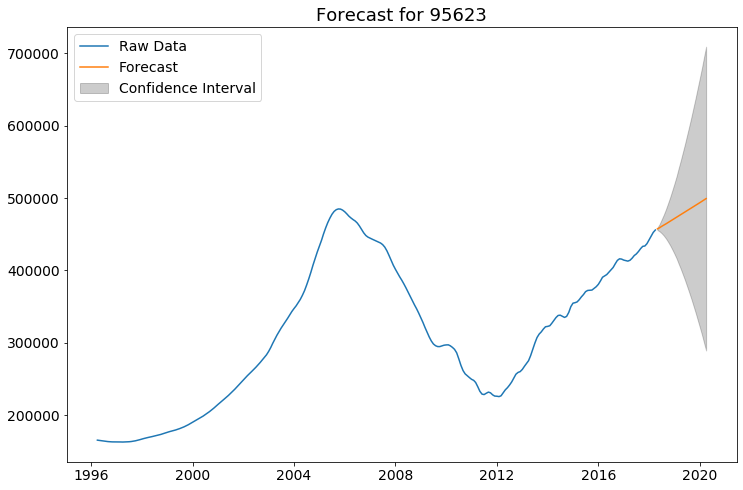


```python
print_results_lists()
```


    (['95616',
      '95619',
      '95864',
      '95831',
      '95811',
      '95818',
      '95630',
      '96140',
      '95672',
      '95636',
      '95709',
      '95746',
      '95614',
      '95663',
      '95623'],
     ['Davis',
      'Diamond Springs',
      'Arden-Arcade',
      'Sacramento_Pocket',
      'Sacramento_DosRios',
      'Sacramento_LandPark',
      'Folsom',
      'Carnelian Bay',
      'Rescue',
      'Somerset',
      'Camino',
      'Granite Bay',
      'Cool',
      'Penryn',
      'El Dorado'],
     ['Yolo',
      'El Dorado',
      'Sacramento',
      'Sacramento',
      'Sacramento',
      'Sacramento',
      'Sacramento',
      'Placer',
      'El Dorado',
      'El Dorado',
      'El Dorado',
      'Placer',
      'El Dorado',
      'Placer',
      'El Dorado'],
     [(2, 1, 2),
      (2, 1, 2),
      (8, 0, 2),
      (4, 0, 2),
      (10, 1, 0),
      (1, 1, 1),
      (4, 0, 2),
      (2, 1, 2),
      (4, 1, 2),
      (6, 0, 1),
      (2, 1, 2),
      (4, 1, 2),
      (4, 0, 2),
      (4, 0, 2),
      (2, 2, 2)],
     [717863.06,
      355774.45,
      449047.92,
      386994.52,
      570598.7,
      563857.1,
      484136.82,
      686817.86,
      650576.11,
      230095.49,
      410576.95,
      423809.57,
      406562.1,
      612903.01,
      499124.6],
     [619575.34,
      275292.09,
      327568.68,
      292621.1,
      459606.77,
      464602.96,
      382062.81,
      560520.55,
      514993.56,
      165787.22,
      321956.34,
      339823.66,
      304533.23,
      471743.88,
      289222.26],
     [816150.79,
      436256.81,
      570527.16,
      481367.94,
      681590.63,
      663111.23,
      586210.84,
      813115.17,
      786158.66,
      294403.76,
      499197.56,
      507795.49,
      508590.96,
      754062.15,
      709026.93],
     [692300.0,
      321100.0,
      552700.0,
      449300.0,
      567500.0,
      563900.0,
      542900.0,
      644600.0,
      579300.0,
      241200.0,
      386000.0,
      386000.0,
      423300.0,
      600700.0,
      455700.0],
     [3.69,
      10.8,
      -18.75,
      -13.87,
      0.55,
      -0.01,
      -10.82,
      6.55,
      12.3,
      -4.6,
      6.37,
      9.8,
      -3.95,
      2.03,
      9.53],
     [-10.5,
      -14.27,
      -40.73,
      -34.87,
      -19.01,
      -17.61,
      -29.63,
      -13.04,
      -11.1,
      -31.27,
      -16.59,
      -11.96,
      -28.06,
      -21.47,
      -36.53],
     [17.89,
      35.86,
      3.23,
      7.14,
      20.1,
      17.59,
      7.98,
      26.14,
      35.71,
      22.06,
      29.33,
      31.55,
      20.15,
      25.53,
      55.59])


```python
# pop_results_lists()
```


```python
# print_results_lists()
```

### Zip code 95623 (El Dorado):   Good--but risky--investment opportunity with very large potential upside, but also large potential downside

By the model prediction, I would expect to see a 9.529% change in price by April 1, 2020.
At the lower bound of the confidence interval, I would expect to see a -36.532% change in price by April 1, 2020.
At the upper bound of the confidence interval, I would expect to see a 55.591% change in price by April 1, 2020.


## SacMetro:  95747 (Roseville) -- Poor investment rating -- don't invest

### Set up dataframe


```python
geog_area = '95747'
```


```python
city = 'Roseville'
```


```python
county = 'Placer'
```


```python
ts = df_sac.loc[df_sac['Zip'] == geog_area]
```


```python
ts.head()
```


<div>
<style scoped>
    .dataframe tbody tr th:only-of-type {
        vertical-align: middle;
    }

    .dataframe tbody tr th {
        vertical-align: top;
    }

    .dataframe thead th {
        text-align: right;
    }
</style>
<table border="1" class="dataframe">
  <thead>
    <tr style="text-align: right;">
      <th></th>
      <th>Metro</th>
      <th>MetroState</th>
      <th>CountyName</th>
      <th>City</th>
      <th>Zip</th>
      <th>value</th>
    </tr>
    <tr>
      <th>time</th>
      <th></th>
      <th></th>
      <th></th>
      <th></th>
      <th></th>
      <th></th>
    </tr>
  </thead>
  <tbody>
    <tr>
      <td>1996-04-01</td>
      <td>Sacramento</td>
      <td>Sacramento CA</td>
      <td>Placer</td>
      <td>Roseville</td>
      <td>95747</td>
      <td>192700.0</td>
    </tr>
    <tr>
      <td>1996-05-01</td>
      <td>Sacramento</td>
      <td>Sacramento CA</td>
      <td>Placer</td>
      <td>Roseville</td>
      <td>95747</td>
      <td>193700.0</td>
    </tr>
    <tr>
      <td>1996-06-01</td>
      <td>Sacramento</td>
      <td>Sacramento CA</td>
      <td>Placer</td>
      <td>Roseville</td>
      <td>95747</td>
      <td>195000.0</td>
    </tr>
    <tr>
      <td>1996-07-01</td>
      <td>Sacramento</td>
      <td>Sacramento CA</td>
      <td>Placer</td>
      <td>Roseville</td>
      <td>95747</td>
      <td>196500.0</td>
    </tr>
    <tr>
      <td>1996-08-01</td>
      <td>Sacramento</td>
      <td>Sacramento CA</td>
      <td>Placer</td>
      <td>Roseville</td>
      <td>95747</td>
      <td>198100.0</td>
    </tr>
  </tbody>
</table>
</div>


```python
ts = ts.resample('MS').asfreq()
```


```python
ts.head()
```


<div>
<style scoped>
    .dataframe tbody tr th:only-of-type {
        vertical-align: middle;
    }

    .dataframe tbody tr th {
        vertical-align: top;
    }

    .dataframe thead th {
        text-align: right;
    }
</style>
<table border="1" class="dataframe">
  <thead>
    <tr style="text-align: right;">
      <th></th>
      <th>Metro</th>
      <th>MetroState</th>
      <th>CountyName</th>
      <th>City</th>
      <th>Zip</th>
      <th>value</th>
    </tr>
    <tr>
      <th>time</th>
      <th></th>
      <th></th>
      <th></th>
      <th></th>
      <th></th>
      <th></th>
    </tr>
  </thead>
  <tbody>
    <tr>
      <td>1996-04-01</td>
      <td>Sacramento</td>
      <td>Sacramento CA</td>
      <td>Placer</td>
      <td>Roseville</td>
      <td>95747</td>
      <td>192700.0</td>
    </tr>
    <tr>
      <td>1996-05-01</td>
      <td>Sacramento</td>
      <td>Sacramento CA</td>
      <td>Placer</td>
      <td>Roseville</td>
      <td>95747</td>
      <td>193700.0</td>
    </tr>
    <tr>
      <td>1996-06-01</td>
      <td>Sacramento</td>
      <td>Sacramento CA</td>
      <td>Placer</td>
      <td>Roseville</td>
      <td>95747</td>
      <td>195000.0</td>
    </tr>
    <tr>
      <td>1996-07-01</td>
      <td>Sacramento</td>
      <td>Sacramento CA</td>
      <td>Placer</td>
      <td>Roseville</td>
      <td>95747</td>
      <td>196500.0</td>
    </tr>
    <tr>
      <td>1996-08-01</td>
      <td>Sacramento</td>
      <td>Sacramento CA</td>
      <td>Placer</td>
      <td>Roseville</td>
      <td>95747</td>
      <td>198100.0</td>
    </tr>
  </tbody>
</table>
</div>


### Visualizations


```python
plot_single_geog(df_melt, geog_area, 'value', 'Zip', figsize=(12, 6), fontsize1=12, fontsize2=16)
```


```python
ts.boxplot(column = 'value')
plt.title(geog_area);

```


```python
plot_acf_pacf(ts.value)
```


```python
plot_seasonal_decomp(ts.value);

# Note that seasonality isn't much of a factor here; maximum difference of about $700 over the course of a year
```


### ARIMA parameters tuning


```python
p_values = [0, 1, 2, 4, 6, 8, 10]
d_values = range(0, 3)
q_values = range(0, 3)

```

### ARIMA modeling and forecasting results


```python
# This function will run parameter tuning and will append lists
# Uncomment to run (will take about 20-30 minutes)

# arima_forecast_run(ts, geog_area, city, county, p_values, d_values, q_values, confint=2)

# For 95747 (Roseville):
# ARIMA(0, 0, 0) MSE=5427879845.782
# ARIMA(0, 0, 1) MSE=1385889791.576
# ARIMA(0, 1, 0) MSE=7313787.472
# ARIMA(0, 1, 1) MSE=2253734.674
# ARIMA(0, 2, 0) MSE=1329713.214
# ARIMA(0, 2, 1) MSE=941066.362
# ARIMA(0, 2, 2) MSE=991125.760
# ARIMA(1, 0, 0) MSE=10116583.455
# ARIMA(1, 1, 0) MSE=1307066.694
# ARIMA(1, 1, 1) MSE=911750.121
# ARIMA(1, 1, 2) MSE=957114.344
# ARIMA(1, 2, 0) MSE=1283948.086
# ARIMA(1, 2, 1) MSE=1007661.965
# ARIMA(1, 2, 2) MSE=983499.774
# ARIMA(2, 0, 0) MSE=1322871.055
# ARIMA(2, 0, 1) MSE=922360.036
# ARIMA(2, 0, 2) MSE=962947.871
# ARIMA(2, 1, 1) MSE=981163.546
# ARIMA(2, 1, 2) MSE=987534.949
# ARIMA(2, 2, 0) MSE=1049147.739
# ARIMA(2, 2, 1) MSE=960250.591
# ARIMA(2, 2, 2) MSE=926421.069
# ARIMA(4, 0, 0) MSE=1017453.901
# ARIMA(4, 0, 1) MSE=933328.942
# ARIMA(4, 0, 2) MSE=899057.043
# ARIMA(4, 1, 1) MSE=956467.252
# ARIMA(4, 2, 0) MSE=994039.968
# ARIMA(4, 2, 1) MSE=1025258.303
# ARIMA(6, 0, 0) MSE=967037.951
# ARIMA(6, 0, 1) MSE=998404.100
# ARIMA(6, 1, 1) MSE=1006343.431
# ARIMA(6, 2, 0) MSE=1040911.553
# ARIMA(6, 2, 1) MSE=1032071.419
# ARIMA(8, 0, 0) MSE=1015099.946
# ARIMA(8, 1, 1) MSE=996476.593
# ARIMA(8, 2, 0) MSE=1038486.752
# ARIMA(8, 2, 1) MSE=1041601.098
# ARIMA(10, 0, 0) MSE=1012947.036
# ARIMA(10, 2, 0) MSE=1042071.272
# ARIMA(10, 2, 1) MSE=1038354.561
# Best ARIMA(4, 0, 2) MSE=899057.043
# Best ARIMA order = (4, 0, 2)
```


```python
# this function will not run parameter tuning, but will append lists
# Uncomment to run


best_cfg = (4, 0, 2)
arima_forecast_enter_pdq(ts, geog_area, city, county, best_cfg, confint=2)   
```

    For 95747 (Roseville):
    Best ARIMA order = (4, 0, 2)
                                  ARMA Model Results                              
    ==============================================================================
    Dep. Variable:                  value   No. Observations:                  265
    Model:                     ARMA(4, 2)   Log Likelihood               -2079.915
    Method:                       css-mle   S.D. of innovations            602.304
    Date:                Tue, 24 Mar 2020   AIC                           4175.830
    Time:                        19:22:48   BIC                           4204.468
    Sample:                    04-01-1996   HQIC                          4187.337
                             - 04-01-2018                                         
    ===============================================================================
                      coef    std err          z      P>|z|      [0.025      0.975]
    -------------------------------------------------------------------------------
    const        3.429e+05   3.68e+04      9.328      0.000    2.71e+05    4.15e+05
    ar.L1.value     1.2145      0.090     13.488      0.000       1.038       1.391
    ar.L2.value     0.2149      0.170      1.265      0.207      -0.118       0.548
    ar.L3.value    -0.1500      0.153     -0.982      0.327      -0.450       0.150
    ar.L4.value    -0.2826      0.079     -3.563      0.000      -0.438      -0.127
    ma.L1.value     1.5420      0.065     23.611      0.000       1.414       1.670
    ma.L2.value     0.7950      0.058     13.611      0.000       0.680       0.909
                                        Roots                                    
    =============================================================================
                      Real          Imaginary           Modulus         Frequency
    -----------------------------------------------------------------------------
    AR.1            1.0168           -0.0361j            1.0174           -0.0056
    AR.2            1.0168           +0.0361j            1.0174            0.0056
    AR.3           -1.2822           -1.3323j            1.8490           -0.3720
    AR.4           -1.2822           +1.3323j            1.8490            0.3720
    MA.1           -0.9699           -0.5633j            1.1216           -0.4163
    MA.2           -0.9699           +0.5633j            1.1216            0.4163
    -----------------------------------------------------------------------------
    By the model prediction, I would expect to see a -1.299% change in price by April 1, 2020.
    At the lower bound of the confidence interval, I would expect to see a -20.485% change in price by April 1, 2020.
    At the upper bound of the confidence interval, I would expect to see a 17.886% change in price by April 1, 2020.


    (['95616',
      '95619',
      '95864',
      '95831',
      '95811',
      '95818',
      '95630',
      '96140',
      '95672',
      '95636',
      '95709',
      '95746',
      '95614',
      '95663',
      '95623',
      '95747'],
     ['Davis',
      'Diamond Springs',
      'Arden-Arcade',
      'Sacramento_Pocket',
      'Sacramento_DosRios',
      'Sacramento_LandPark',
      'Folsom',
      'Carnelian Bay',
      'Rescue',
      'Somerset',
      'Camino',
      'Granite Bay',
      'Cool',
      'Penryn',
      'El Dorado',
      'Roseville'],
     ['Yolo',
      'El Dorado',
      'Sacramento',
      'Sacramento',
      'Sacramento',
      'Sacramento',
      'Sacramento',
      'Placer',
      'El Dorado',
      'El Dorado',
      'El Dorado',
      'Placer',
      'El Dorado',
      'Placer',
      'El Dorado',
      'Placer'],
     [(2, 1, 2),
      (2, 1, 2),
      (8, 0, 2),
      (4, 0, 2),
      (10, 1, 0),
      (1, 1, 1),
      (4, 0, 2),
      (2, 1, 2),
      (4, 1, 2),
      (6, 0, 1),
      (2, 1, 2),
      (4, 1, 2),
      (4, 0, 2),
      (4, 0, 2),
      (2, 2, 2),
      (4, 0, 2)],
     [717863.06,
      355774.45,
      449047.92,
      386994.52,
      570598.7,
      563857.1,
      484136.82,
      686817.86,
      650576.11,
      230095.49,
      410576.95,
      423809.57,
      406562.1,
      612903.01,
      499124.6,
      477514.15],
     [619575.34,
      275292.09,
      327568.68,
      292621.1,
      459606.77,
      464602.96,
      382062.81,
      560520.55,
      514993.56,
      165787.22,
      321956.34,
      339823.66,
      304533.23,
      471743.88,
      289222.26,
      384695.22],
     [816150.79,
      436256.81,
      570527.16,
      481367.94,
      681590.63,
      663111.23,
      586210.84,
      813115.17,
      786158.66,
      294403.76,
      499197.56,
      507795.49,
      508590.96,
      754062.15,
      709026.93,
      570333.08],
     [692300.0,
      321100.0,
      552700.0,
      449300.0,
      567500.0,
      563900.0,
      542900.0,
      644600.0,
      579300.0,
      241200.0,
      386000.0,
      386000.0,
      423300.0,
      600700.0,
      455700.0,
      483800.0],
     [3.69,
      10.8,
      -18.75,
      -13.87,
      0.55,
      -0.01,
      -10.82,
      6.55,
      12.3,
      -4.6,
      6.37,
      9.8,
      -3.95,
      2.03,
      9.53,
      -1.3],
     [-10.5,
      -14.27,
      -40.73,
      -34.87,
      -19.01,
      -17.61,
      -29.63,
      -13.04,
      -11.1,
      -31.27,
      -16.59,
      -11.96,
      -28.06,
      -21.47,
      -36.53,
      -20.48],
     [17.89,
      35.86,
      3.23,
      7.14,
      20.1,
      17.59,
      7.98,
      26.14,
      35.71,
      22.06,
      29.33,
      31.55,
      20.15,
      25.53,
      55.59,
      17.89])


```python
print_results_lists()
```


    (['95616',
      '95619',
      '95864',
      '95831',
      '95811',
      '95818',
      '95630',
      '96140',
      '95672',
      '95636',
      '95709',
      '95746',
      '95614',
      '95663',
      '95623',
      '95747'],
     ['Davis',
      'Diamond Springs',
      'Arden-Arcade',
      'Sacramento_Pocket',
      'Sacramento_DosRios',
      'Sacramento_LandPark',
      'Folsom',
      'Carnelian Bay',
      'Rescue',
      'Somerset',
      'Camino',
      'Granite Bay',
      'Cool',
      'Penryn',
      'El Dorado',
      'Roseville'],
     ['Yolo',
      'El Dorado',
      'Sacramento',
      'Sacramento',
      'Sacramento',
      'Sacramento',
      'Sacramento',
      'Placer',
      'El Dorado',
      'El Dorado',
      'El Dorado',
      'Placer',
      'El Dorado',
      'Placer',
      'El Dorado',
      'Placer'],
     [(2, 1, 2),
      (2, 1, 2),
      (8, 0, 2),
      (4, 0, 2),
      (10, 1, 0),
      (1, 1, 1),
      (4, 0, 2),
      (2, 1, 2),
      (4, 1, 2),
      (6, 0, 1),
      (2, 1, 2),
      (4, 1, 2),
      (4, 0, 2),
      (4, 0, 2),
      (2, 2, 2),
      (4, 0, 2)],
     [717863.06,
      355774.45,
      449047.92,
      386994.52,
      570598.7,
      563857.1,
      484136.82,
      686817.86,
      650576.11,
      230095.49,
      410576.95,
      423809.57,
      406562.1,
      612903.01,
      499124.6,
      477514.15],
     [619575.34,
      275292.09,
      327568.68,
      292621.1,
      459606.77,
      464602.96,
      382062.81,
      560520.55,
      514993.56,
      165787.22,
      321956.34,
      339823.66,
      304533.23,
      471743.88,
      289222.26,
      384695.22],
     [816150.79,
      436256.81,
      570527.16,
      481367.94,
      681590.63,
      663111.23,
      586210.84,
      813115.17,
      786158.66,
      294403.76,
      499197.56,
      507795.49,
      508590.96,
      754062.15,
      709026.93,
      570333.08],
     [692300.0,
      321100.0,
      552700.0,
      449300.0,
      567500.0,
      563900.0,
      542900.0,
      644600.0,
      579300.0,
      241200.0,
      386000.0,
      386000.0,
      423300.0,
      600700.0,
      455700.0,
      483800.0],
     [3.69,
      10.8,
      -18.75,
      -13.87,
      0.55,
      -0.01,
      -10.82,
      6.55,
      12.3,
      -4.6,
      6.37,
      9.8,
      -3.95,
      2.03,
      9.53,
      -1.3],
     [-10.5,
      -14.27,
      -40.73,
      -34.87,
      -19.01,
      -17.61,
      -29.63,
      -13.04,
      -11.1,
      -31.27,
      -16.59,
      -11.96,
      -28.06,
      -21.47,
      -36.53,
      -20.48],
     [17.89,
      35.86,
      3.23,
      7.14,
      20.1,
      17.59,
      7.98,
      26.14,
      35.71,
      22.06,
      29.33,
      31.55,
      20.15,
      25.53,
      55.59,
      17.89])


```python
# pop_results_lists()
```


```python
# print_results_lists()
```

### Zip code 95747 (Roseville):  Poor investment rating

By the model prediction, I would expect to see a -1.299% change in price by April 1, 2020.
At the lower bound of the confidence interval, I would expect to see a -20.485% change in price by April 1, 2020.
At the upper bound of the confidence interval, I would expect to see a 17.886% change in price by April 1, 2020.


## SacMetro:  95765 (Rocklin) -- Mediocre investment opportunity

### Set up dataframe


```python
geog_area = '95765'
```


```python
city = 'Rocklin'
```


```python
county = 'Placer'
```


```python
ts = df_sac.loc[df_sac['Zip'] == geog_area]
```


```python
ts.head()
```


<div>
<style scoped>
    .dataframe tbody tr th:only-of-type {
        vertical-align: middle;
    }

    .dataframe tbody tr th {
        vertical-align: top;
    }

    .dataframe thead th {
        text-align: right;
    }
</style>
<table border="1" class="dataframe">
  <thead>
    <tr style="text-align: right;">
      <th></th>
      <th>Metro</th>
      <th>MetroState</th>
      <th>CountyName</th>
      <th>City</th>
      <th>Zip</th>
      <th>value</th>
    </tr>
    <tr>
      <th>time</th>
      <th></th>
      <th></th>
      <th></th>
      <th></th>
      <th></th>
      <th></th>
    </tr>
  </thead>
  <tbody>
    <tr>
      <td>1996-04-01</td>
      <td>Sacramento</td>
      <td>Sacramento CA</td>
      <td>Placer</td>
      <td>Rocklin</td>
      <td>95765</td>
      <td>192600.0</td>
    </tr>
    <tr>
      <td>1996-05-01</td>
      <td>Sacramento</td>
      <td>Sacramento CA</td>
      <td>Placer</td>
      <td>Rocklin</td>
      <td>95765</td>
      <td>192300.0</td>
    </tr>
    <tr>
      <td>1996-06-01</td>
      <td>Sacramento</td>
      <td>Sacramento CA</td>
      <td>Placer</td>
      <td>Rocklin</td>
      <td>95765</td>
      <td>191900.0</td>
    </tr>
    <tr>
      <td>1996-07-01</td>
      <td>Sacramento</td>
      <td>Sacramento CA</td>
      <td>Placer</td>
      <td>Rocklin</td>
      <td>95765</td>
      <td>191400.0</td>
    </tr>
    <tr>
      <td>1996-08-01</td>
      <td>Sacramento</td>
      <td>Sacramento CA</td>
      <td>Placer</td>
      <td>Rocklin</td>
      <td>95765</td>
      <td>190900.0</td>
    </tr>
  </tbody>
</table>
</div>


```python
ts = ts.resample('MS').asfreq()
```


```python
ts.head()
```


<div>
<style scoped>
    .dataframe tbody tr th:only-of-type {
        vertical-align: middle;
    }

    .dataframe tbody tr th {
        vertical-align: top;
    }

    .dataframe thead th {
        text-align: right;
    }
</style>
<table border="1" class="dataframe">
  <thead>
    <tr style="text-align: right;">
      <th></th>
      <th>Metro</th>
      <th>MetroState</th>
      <th>CountyName</th>
      <th>City</th>
      <th>Zip</th>
      <th>value</th>
    </tr>
    <tr>
      <th>time</th>
      <th></th>
      <th></th>
      <th></th>
      <th></th>
      <th></th>
      <th></th>
    </tr>
  </thead>
  <tbody>
    <tr>
      <td>1996-04-01</td>
      <td>Sacramento</td>
      <td>Sacramento CA</td>
      <td>Placer</td>
      <td>Rocklin</td>
      <td>95765</td>
      <td>192600.0</td>
    </tr>
    <tr>
      <td>1996-05-01</td>
      <td>Sacramento</td>
      <td>Sacramento CA</td>
      <td>Placer</td>
      <td>Rocklin</td>
      <td>95765</td>
      <td>192300.0</td>
    </tr>
    <tr>
      <td>1996-06-01</td>
      <td>Sacramento</td>
      <td>Sacramento CA</td>
      <td>Placer</td>
      <td>Rocklin</td>
      <td>95765</td>
      <td>191900.0</td>
    </tr>
    <tr>
      <td>1996-07-01</td>
      <td>Sacramento</td>
      <td>Sacramento CA</td>
      <td>Placer</td>
      <td>Rocklin</td>
      <td>95765</td>
      <td>191400.0</td>
    </tr>
    <tr>
      <td>1996-08-01</td>
      <td>Sacramento</td>
      <td>Sacramento CA</td>
      <td>Placer</td>
      <td>Rocklin</td>
      <td>95765</td>
      <td>190900.0</td>
    </tr>
  </tbody>
</table>
</div>


### Visualizations


```python
plot_single_geog(df_melt, geog_area, 'value', 'Zip', figsize=(12, 6), fontsize1=12, fontsize2=16)
```


```python
ts.boxplot(column = 'value')
plt.title(geog_area);

```


```python
plot_acf_pacf(ts.value)
```


```python
plot_seasonal_decomp(ts.value);

# Note that seasonality isn't much of a factor here; maximum difference of about $700 over the course of a year
```


### ARIMA parameters tuning


```python
p_values = [0, 1, 2, 4, 6, 8, 10]
d_values = range(0, 3)
q_values = range(0, 3)

```

### ARIMA modeling and forecasting results


```python
# This function will run parameter tuning and will append lists
# Uncomment to run (will take about 20-30 minutes)

# arima_forecast_run(ts, geog_area, city, county, p_values, d_values, q_values, confint=2)

# For 95765 (Rocklin):
# ARIMA(0, 0, 0) MSE=6644433964.392
# ARIMA(0, 0, 1) MSE=1701893596.180
# ARIMA(0, 1, 0) MSE=7798388.244
# ARIMA(0, 1, 1) MSE=2917153.027
# ARIMA(0, 2, 0) MSE=1846646.736
# ARIMA(0, 2, 1) MSE=1317246.213
# ARIMA(1, 0, 0) MSE=11170163.018
# ARIMA(1, 1, 0) MSE=1812178.739
# ARIMA(1, 1, 1) MSE=1273425.854
# ARIMA(1, 1, 2) MSE=1350163.769
# ARIMA(1, 2, 0) MSE=1772617.389
# ARIMA(1, 2, 1) MSE=1410151.187
# ARIMA(2, 0, 1) MSE=1285305.673
# ARIMA(2, 0, 2) MSE=1372853.303
# ARIMA(2, 1, 1) MSE=1362608.876
# ARIMA(2, 1, 2) MSE=1177039.400
# ARIMA(2, 2, 0) MSE=1390137.431
# ARIMA(2, 2, 1) MSE=1291194.480
# ARIMA(4, 0, 1) MSE=1256667.669
# ARIMA(4, 0, 2) MSE=1165708.647
# ARIMA(4, 1, 1) MSE=1248559.297
# ARIMA(4, 2, 0) MSE=1295894.969
# ARIMA(4, 2, 1) MSE=1322146.051
# ARIMA(6, 0, 1) MSE=1260534.038
# ARIMA(6, 0, 2) MSE=1241182.367
# ARIMA(6, 1, 1) MSE=1234920.466
# ARIMA(6, 2, 0) MSE=1360947.835
# ARIMA(6, 2, 1) MSE=1291957.471
# ARIMA(8, 2, 0) MSE=1309660.726
# ARIMA(8, 2, 1) MSE=1291300.538
# Best ARIMA(4, 0, 2) MSE=1165708.647
# Best ARIMA order = (4, 0, 2)
```


```python
# this function will not run parameter tuning, but will append lists
# Uncomment to run

best_cfg = (4, 0, 2)
arima_forecast_enter_pdq(ts, geog_area, city, county, best_cfg, confint=2)   
```

    For 95765 (Rocklin):
    Best ARIMA order = (4, 0, 2)
                                  ARMA Model Results                              
    ==============================================================================
    Dep. Variable:                  value   No. Observations:                  265
    Model:                     ARMA(4, 2)   Log Likelihood               -2111.269
    Method:                       css-mle   S.D. of innovations            677.388
    Date:                Tue, 24 Mar 2020   AIC                           4238.539
    Time:                        19:23:08   BIC                           4267.176
    Sample:                    04-01-1996   HQIC                          4250.045
                             - 04-01-2018                                         
    ===============================================================================
                      coef    std err          z      P>|z|      [0.025      0.975]
    -------------------------------------------------------------------------------
    const        3.548e+05   6.11e+04      5.808      0.000    2.35e+05    4.75e+05
    ar.L1.value     1.3313      0.095     14.066      0.000       1.146       1.517
    ar.L2.value     0.0136      0.206      0.066      0.948      -0.391       0.418
    ar.L3.value    -0.1074      0.186     -0.577      0.565      -0.472       0.258
    ar.L4.value    -0.2395      0.079     -3.014      0.003      -0.395      -0.084
    ma.L1.value     1.5033      0.071     21.119      0.000       1.364       1.643
    ma.L2.value     0.8095      0.055     14.728      0.000       0.702       0.917
                                        Roots                                    
    =============================================================================
                      Real          Imaginary           Modulus         Frequency
    -----------------------------------------------------------------------------
    AR.1            1.0222           -0.0248j            1.0225           -0.0039
    AR.2            1.0222           +0.0248j            1.0225            0.0039
    AR.3           -1.2464           -1.5622j            1.9985           -0.3572
    AR.4           -1.2464           +1.5622j            1.9985            0.3572
    MA.1           -0.9285           -0.6109j            1.1115           -0.4074
    MA.2           -0.9285           +0.6109j            1.1115            0.4074
    -----------------------------------------------------------------------------
    By the model prediction, I would expect to see a 1.734% change in price by April 1, 2020.
    At the lower bound of the confidence interval, I would expect to see a -19.438% change in price by April 1, 2020.
    At the upper bound of the confidence interval, I would expect to see a 22.906% change in price by April 1, 2020.


    (['95616',
      '95619',
      '95864',
      '95831',
      '95811',
      '95818',
      '95630',
      '96140',
      '95672',
      '95636',
      '95709',
      '95746',
      '95614',
      '95663',
      '95623',
      '95747',
      '95765'],
     ['Davis',
      'Diamond Springs',
      'Arden-Arcade',
      'Sacramento_Pocket',
      'Sacramento_DosRios',
      'Sacramento_LandPark',
      'Folsom',
      'Carnelian Bay',
      'Rescue',
      'Somerset',
      'Camino',
      'Granite Bay',
      'Cool',
      'Penryn',
      'El Dorado',
      'Roseville',
      'Rocklin'],
     ['Yolo',
      'El Dorado',
      'Sacramento',
      'Sacramento',
      'Sacramento',
      'Sacramento',
      'Sacramento',
      'Placer',
      'El Dorado',
      'El Dorado',
      'El Dorado',
      'Placer',
      'El Dorado',
      'Placer',
      'El Dorado',
      'Placer',
      'Placer'],
     [(2, 1, 2),
      (2, 1, 2),
      (8, 0, 2),
      (4, 0, 2),
      (10, 1, 0),
      (1, 1, 1),
      (4, 0, 2),
      (2, 1, 2),
      (4, 1, 2),
      (6, 0, 1),
      (2, 1, 2),
      (4, 1, 2),
      (4, 0, 2),
      (4, 0, 2),
      (2, 2, 2),
      (4, 0, 2),
      (4, 0, 2)],
     [717863.06,
      355774.45,
      449047.92,
      386994.52,
      570598.7,
      563857.1,
      484136.82,
      686817.86,
      650576.11,
      230095.49,
      410576.95,
      423809.57,
      406562.1,
      612903.01,
      499124.6,
      477514.15,
      518030.61],
     [619575.34,
      275292.09,
      327568.68,
      292621.1,
      459606.77,
      464602.96,
      382062.81,
      560520.55,
      514993.56,
      165787.22,
      321956.34,
      339823.66,
      304533.23,
      471743.88,
      289222.26,
      384695.22,
      410222.8],
     [816150.79,
      436256.81,
      570527.16,
      481367.94,
      681590.63,
      663111.23,
      586210.84,
      813115.17,
      786158.66,
      294403.76,
      499197.56,
      507795.49,
      508590.96,
      754062.15,
      709026.93,
      570333.08,
      625838.43],
     [692300.0,
      321100.0,
      552700.0,
      449300.0,
      567500.0,
      563900.0,
      542900.0,
      644600.0,
      579300.0,
      241200.0,
      386000.0,
      386000.0,
      423300.0,
      600700.0,
      455700.0,
      483800.0,
      509200.0],
     [3.69,
      10.8,
      -18.75,
      -13.87,
      0.55,
      -0.01,
      -10.82,
      6.55,
      12.3,
      -4.6,
      6.37,
      9.8,
      -3.95,
      2.03,
      9.53,
      -1.3,
      1.73],
     [-10.5,
      -14.27,
      -40.73,
      -34.87,
      -19.01,
      -17.61,
      -29.63,
      -13.04,
      -11.1,
      -31.27,
      -16.59,
      -11.96,
      -28.06,
      -21.47,
      -36.53,
      -20.48,
      -19.44],
     [17.89,
      35.86,
      3.23,
      7.14,
      20.1,
      17.59,
      7.98,
      26.14,
      35.71,
      22.06,
      29.33,
      31.55,
      20.15,
      25.53,
      55.59,
      17.89,
      22.91])


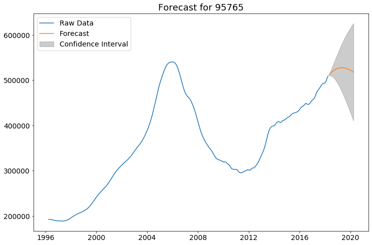


```python
print_results_lists()
```


    (['95616',
      '95619',
      '95864',
      '95831',
      '95811',
      '95818',
      '95630',
      '96140',
      '95672',
      '95636',
      '95709',
      '95746',
      '95614',
      '95663',
      '95623',
      '95747',
      '95765'],
     ['Davis',
      'Diamond Springs',
      'Arden-Arcade',
      'Sacramento_Pocket',
      'Sacramento_DosRios',
      'Sacramento_LandPark',
      'Folsom',
      'Carnelian Bay',
      'Rescue',
      'Somerset',
      'Camino',
      'Granite Bay',
      'Cool',
      'Penryn',
      'El Dorado',
      'Roseville',
      'Rocklin'],
     ['Yolo',
      'El Dorado',
      'Sacramento',
      'Sacramento',
      'Sacramento',
      'Sacramento',
      'Sacramento',
      'Placer',
      'El Dorado',
      'El Dorado',
      'El Dorado',
      'Placer',
      'El Dorado',
      'Placer',
      'El Dorado',
      'Placer',
      'Placer'],
     [(2, 1, 2),
      (2, 1, 2),
      (8, 0, 2),
      (4, 0, 2),
      (10, 1, 0),
      (1, 1, 1),
      (4, 0, 2),
      (2, 1, 2),
      (4, 1, 2),
      (6, 0, 1),
      (2, 1, 2),
      (4, 1, 2),
      (4, 0, 2),
      (4, 0, 2),
      (2, 2, 2),
      (4, 0, 2),
      (4, 0, 2)],
     [717863.06,
      355774.45,
      449047.92,
      386994.52,
      570598.7,
      563857.1,
      484136.82,
      686817.86,
      650576.11,
      230095.49,
      410576.95,
      423809.57,
      406562.1,
      612903.01,
      499124.6,
      477514.15,
      518030.61],
     [619575.34,
      275292.09,
      327568.68,
      292621.1,
      459606.77,
      464602.96,
      382062.81,
      560520.55,
      514993.56,
      165787.22,
      321956.34,
      339823.66,
      304533.23,
      471743.88,
      289222.26,
      384695.22,
      410222.8],
     [816150.79,
      436256.81,
      570527.16,
      481367.94,
      681590.63,
      663111.23,
      586210.84,
      813115.17,
      786158.66,
      294403.76,
      499197.56,
      507795.49,
      508590.96,
      754062.15,
      709026.93,
      570333.08,
      625838.43],
     [692300.0,
      321100.0,
      552700.0,
      449300.0,
      567500.0,
      563900.0,
      542900.0,
      644600.0,
      579300.0,
      241200.0,
      386000.0,
      386000.0,
      423300.0,
      600700.0,
      455700.0,
      483800.0,
      509200.0],
     [3.69,
      10.8,
      -18.75,
      -13.87,
      0.55,
      -0.01,
      -10.82,
      6.55,
      12.3,
      -4.6,
      6.37,
      9.8,
      -3.95,
      2.03,
      9.53,
      -1.3,
      1.73],
     [-10.5,
      -14.27,
      -40.73,
      -34.87,
      -19.01,
      -17.61,
      -29.63,
      -13.04,
      -11.1,
      -31.27,
      -16.59,
      -11.96,
      -28.06,
      -21.47,
      -36.53,
      -20.48,
      -19.44],
     [17.89,
      35.86,
      3.23,
      7.14,
      20.1,
      17.59,
      7.98,
      26.14,
      35.71,
      22.06,
      29.33,
      31.55,
      20.15,
      25.53,
      55.59,
      17.89,
      22.91])


```python
# pop_results_lists()
```


```python
# print_results_lists()
```

### Zip code 95765 (Rocklin):  Mediocre investment opportunity

By the model prediction, I would expect to see a 1.734% change in price by April 1, 2020.
At the lower bound of the confidence interval, I would expect to see a -19.438% change in price by April 1, 2020.
At the upper bound of the confidence interval, I would expect to see a 22.906% change in price by April 1, 2020.

## SacMetro:  95602 (Auburn) -- Strong investment opportunity with minimal downside

### Set up dataframe


```python
geog_area = '95602'
```


```python
city = 'Auburn'
```


```python
county = 'Placer'
```


```python
ts = df_sac.loc[df_sac['Zip'] == geog_area]
```


```python
ts.head()
```


<div>
<style scoped>
    .dataframe tbody tr th:only-of-type {
        vertical-align: middle;
    }

    .dataframe tbody tr th {
        vertical-align: top;
    }

    .dataframe thead th {
        text-align: right;
    }
</style>
<table border="1" class="dataframe">
  <thead>
    <tr style="text-align: right;">
      <th></th>
      <th>Metro</th>
      <th>MetroState</th>
      <th>CountyName</th>
      <th>City</th>
      <th>Zip</th>
      <th>value</th>
    </tr>
    <tr>
      <th>time</th>
      <th></th>
      <th></th>
      <th></th>
      <th></th>
      <th></th>
      <th></th>
    </tr>
  </thead>
  <tbody>
    <tr>
      <td>1996-04-01</td>
      <td>Sacramento</td>
      <td>Sacramento CA</td>
      <td>Placer</td>
      <td>Auburn</td>
      <td>95602</td>
      <td>184300.0</td>
    </tr>
    <tr>
      <td>1996-05-01</td>
      <td>Sacramento</td>
      <td>Sacramento CA</td>
      <td>Placer</td>
      <td>Auburn</td>
      <td>95602</td>
      <td>184000.0</td>
    </tr>
    <tr>
      <td>1996-06-01</td>
      <td>Sacramento</td>
      <td>Sacramento CA</td>
      <td>Placer</td>
      <td>Auburn</td>
      <td>95602</td>
      <td>183700.0</td>
    </tr>
    <tr>
      <td>1996-07-01</td>
      <td>Sacramento</td>
      <td>Sacramento CA</td>
      <td>Placer</td>
      <td>Auburn</td>
      <td>95602</td>
      <td>183500.0</td>
    </tr>
    <tr>
      <td>1996-08-01</td>
      <td>Sacramento</td>
      <td>Sacramento CA</td>
      <td>Placer</td>
      <td>Auburn</td>
      <td>95602</td>
      <td>183300.0</td>
    </tr>
  </tbody>
</table>
</div>


```python
ts = ts.resample('MS').asfreq()
```


```python
ts.head()
```


<div>
<style scoped>
    .dataframe tbody tr th:only-of-type {
        vertical-align: middle;
    }

    .dataframe tbody tr th {
        vertical-align: top;
    }

    .dataframe thead th {
        text-align: right;
    }
</style>
<table border="1" class="dataframe">
  <thead>
    <tr style="text-align: right;">
      <th></th>
      <th>Metro</th>
      <th>MetroState</th>
      <th>CountyName</th>
      <th>City</th>
      <th>Zip</th>
      <th>value</th>
    </tr>
    <tr>
      <th>time</th>
      <th></th>
      <th></th>
      <th></th>
      <th></th>
      <th></th>
      <th></th>
    </tr>
  </thead>
  <tbody>
    <tr>
      <td>1996-04-01</td>
      <td>Sacramento</td>
      <td>Sacramento CA</td>
      <td>Placer</td>
      <td>Auburn</td>
      <td>95602</td>
      <td>184300.0</td>
    </tr>
    <tr>
      <td>1996-05-01</td>
      <td>Sacramento</td>
      <td>Sacramento CA</td>
      <td>Placer</td>
      <td>Auburn</td>
      <td>95602</td>
      <td>184000.0</td>
    </tr>
    <tr>
      <td>1996-06-01</td>
      <td>Sacramento</td>
      <td>Sacramento CA</td>
      <td>Placer</td>
      <td>Auburn</td>
      <td>95602</td>
      <td>183700.0</td>
    </tr>
    <tr>
      <td>1996-07-01</td>
      <td>Sacramento</td>
      <td>Sacramento CA</td>
      <td>Placer</td>
      <td>Auburn</td>
      <td>95602</td>
      <td>183500.0</td>
    </tr>
    <tr>
      <td>1996-08-01</td>
      <td>Sacramento</td>
      <td>Sacramento CA</td>
      <td>Placer</td>
      <td>Auburn</td>
      <td>95602</td>
      <td>183300.0</td>
    </tr>
  </tbody>
</table>
</div>


### Visualizations


```python
plot_single_geog(df_melt, geog_area, 'value', 'Zip', figsize=(12, 6), fontsize1=12, fontsize2=16)
```


```python
ts.boxplot(column = 'value')
plt.title(geog_area);

```


```python
plot_acf_pacf(ts.value)
```


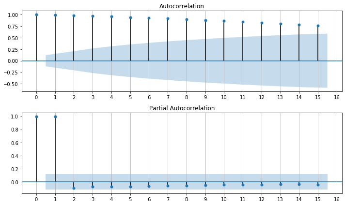


```python
plot_seasonal_decomp(ts.value);

# Note that seasonality isn't much of a factor here; maximum difference of about $700 over the course of a year
```


### ARIMA parameters tuning


```python
p_values = [0, 1, 2, 4, 6, 8, 10]
d_values = range(0, 3)
q_values = range(0, 3)

```

### ARIMA modeling and forecasting results


```python
# This function will run parameter tuning and will append lists
# Uncomment to run (will take about 20-30 minutes)

# arima_forecast_run(ts, geog_area, city, county, p_values, d_values, q_values, confint=2)

# For 95602 (Auburn):
# ARIMA(0, 0, 0) MSE=4465367737.995
# ARIMA(0, 0, 1) MSE=1143055340.011
# ARIMA(0, 1, 0) MSE=6925435.932
# ARIMA(0, 1, 1) MSE=2504183.773
# ARIMA(0, 2, 0) MSE=1976453.867
# ARIMA(0, 2, 1) MSE=1607705.064
# ARIMA(1, 0, 0) MSE=9745768.285
# ARIMA(1, 1, 0) MSE=1906487.813
# ARIMA(1, 1, 1) MSE=1501762.179
# ARIMA(1, 2, 0) MSE=1928992.151
# ARIMA(2, 0, 0) MSE=1922901.568
# ARIMA(2, 0, 1) MSE=1515190.794
# ARIMA(2, 1, 0) MSE=1814408.748
# ARIMA(2, 2, 0) MSE=1446843.168
# ARIMA(2, 2, 1) MSE=1389510.447
# ARIMA(2, 2, 2) MSE=1414915.678
# ARIMA(4, 0, 0) MSE=1421909.332
# ARIMA(4, 0, 1) MSE=1360086.188
# ARIMA(4, 0, 2) MSE=1342136.349
# ARIMA(4, 1, 1) MSE=1361822.572
# ARIMA(4, 1, 2) MSE=1312028.990
# ARIMA(4, 2, 0) MSE=1380830.600
# ARIMA(4, 2, 1) MSE=1384521.163
# ARIMA(6, 0, 0) MSE=1350224.552
# ARIMA(6, 0, 1) MSE=1354760.948
# ARIMA(6, 0, 2) MSE=1421939.213
# ARIMA(6, 1, 1) MSE=1372121.788
# ARIMA(6, 2, 0) MSE=1381716.828
# ARIMA(6, 2, 1) MSE=1377932.852
# ARIMA(8, 0, 1) MSE=1350828.397
# ARIMA(8, 2, 0) MSE=1455539.266
# Best ARIMA(4, 1, 2) MSE=1312028.990
# Best ARIMA order = (4, 1, 2)
```


```python
# this function will not run parameter tuning, but will append lists
# Uncomment to run

best_cfg = (4, 1, 2)
arima_forecast_enter_pdq(ts, geog_area, city, county, best_cfg, confint=2)   
```

    For 95602 (Auburn):
    Best ARIMA order = (4, 1, 2)
                                 ARIMA Model Results                              
    ==============================================================================
    Dep. Variable:                D.value   No. Observations:                  264
    Model:                 ARIMA(4, 1, 2)   Log Likelihood               -2141.289
    Method:                       css-mle   S.D. of innovations            797.993
    Date:                Tue, 24 Mar 2020   AIC                           4298.578
    Time:                        19:23:23   BIC                           4327.186
    Sample:                    05-01-1996   HQIC                          4310.073
                             - 04-01-2018                                         
    =================================================================================
                        coef    std err          z      P>|z|      [0.025      0.975]
    ---------------------------------------------------------------------------------
    const          1241.6825   1155.963      1.074      0.284   -1023.964    3507.329
    ar.L1.D.value     0.1397      0.076      1.836      0.068      -0.009       0.289
    ar.L2.D.value     0.2665      0.076      3.487      0.001       0.117       0.416
    ar.L3.D.value     0.2535      0.071      3.574      0.000       0.114       0.393
    ar.L4.D.value     0.2051      0.067      3.044      0.003       0.073       0.337
    ma.L1.D.value     1.5482      0.053     28.987      0.000       1.443       1.653
    ma.L2.D.value     0.8380      0.050     16.707      0.000       0.740       0.936
                                        Roots                                    
    =============================================================================
                      Real          Imaginary           Modulus         Frequency
    -----------------------------------------------------------------------------
    AR.1            1.0567           -0.0000j            1.0567           -0.0000
    AR.2           -1.6999           -0.0000j            1.6999           -0.5000
    AR.3           -0.2964           -1.6206j            1.6475           -0.2788
    AR.4           -0.2964           +1.6206j            1.6475            0.2788
    MA.1           -0.9238           -0.5831j            1.0924           -0.4104
    MA.2           -0.9238           +0.5831j            1.0924            0.4104
    -----------------------------------------------------------------------------
    By the model prediction, I would expect to see a 11.936% change in price by April 1, 2020.
    At the lower bound of the confidence interval, I would expect to see a -7.856% change in price by April 1, 2020.
    At the upper bound of the confidence interval, I would expect to see a 31.729% change in price by April 1, 2020.


    (['95616',
      '95619',
      '95864',
      '95831',
      '95811',
      '95818',
      '95630',
      '96140',
      '95672',
      '95636',
      '95709',
      '95746',
      '95614',
      '95663',
      '95623',
      '95747',
      '95765',
      '95602'],
     ['Davis',
      'Diamond Springs',
      'Arden-Arcade',
      'Sacramento_Pocket',
      'Sacramento_DosRios',
      'Sacramento_LandPark',
      'Folsom',
      'Carnelian Bay',
      'Rescue',
      'Somerset',
      'Camino',
      'Granite Bay',
      'Cool',
      'Penryn',
      'El Dorado',
      'Roseville',
      'Rocklin',
      'Auburn'],
     ['Yolo',
      'El Dorado',
      'Sacramento',
      'Sacramento',
      'Sacramento',
      'Sacramento',
      'Sacramento',
      'Placer',
      'El Dorado',
      'El Dorado',
      'El Dorado',
      'Placer',
      'El Dorado',
      'Placer',
      'El Dorado',
      'Placer',
      'Placer',
      'Placer'],
     [(2, 1, 2),
      (2, 1, 2),
      (8, 0, 2),
      (4, 0, 2),
      (10, 1, 0),
      (1, 1, 1),
      (4, 0, 2),
      (2, 1, 2),
      (4, 1, 2),
      (6, 0, 1),
      (2, 1, 2),
      (4, 1, 2),
      (4, 0, 2),
      (4, 0, 2),
      (2, 2, 2),
      (4, 0, 2),
      (4, 0, 2),
      (4, 1, 2)],
     [717863.06,
      355774.45,
      449047.92,
      386994.52,
      570598.7,
      563857.1,
      484136.82,
      686817.86,
      650576.11,
      230095.49,
      410576.95,
      423809.57,
      406562.1,
      612903.01,
      499124.6,
      477514.15,
      518030.61,
      547032.68],
     [619575.34,
      275292.09,
      327568.68,
      292621.1,
      459606.77,
      464602.96,
      382062.81,
      560520.55,
      514993.56,
      165787.22,
      321956.34,
      339823.66,
      304533.23,
      471743.88,
      289222.26,
      384695.22,
      410222.8,
      450306.7],
     [816150.79,
      436256.81,
      570527.16,
      481367.94,
      681590.63,
      663111.23,
      586210.84,
      813115.17,
      786158.66,
      294403.76,
      499197.56,
      507795.49,
      508590.96,
      754062.15,
      709026.93,
      570333.08,
      625838.43,
      643758.66],
     [692300.0,
      321100.0,
      552700.0,
      449300.0,
      567500.0,
      563900.0,
      542900.0,
      644600.0,
      579300.0,
      241200.0,
      386000.0,
      386000.0,
      423300.0,
      600700.0,
      455700.0,
      483800.0,
      509200.0,
      488700.0],
     [3.69,
      10.8,
      -18.75,
      -13.87,
      0.55,
      -0.01,
      -10.82,
      6.55,
      12.3,
      -4.6,
      6.37,
      9.8,
      -3.95,
      2.03,
      9.53,
      -1.3,
      1.73,
      11.94],
     [-10.5,
      -14.27,
      -40.73,
      -34.87,
      -19.01,
      -17.61,
      -29.63,
      -13.04,
      -11.1,
      -31.27,
      -16.59,
      -11.96,
      -28.06,
      -21.47,
      -36.53,
      -20.48,
      -19.44,
      -7.86],
     [17.89,
      35.86,
      3.23,
      7.14,
      20.1,
      17.59,
      7.98,
      26.14,
      35.71,
      22.06,
      29.33,
      31.55,
      20.15,
      25.53,
      55.59,
      17.89,
      22.91,
      31.73])


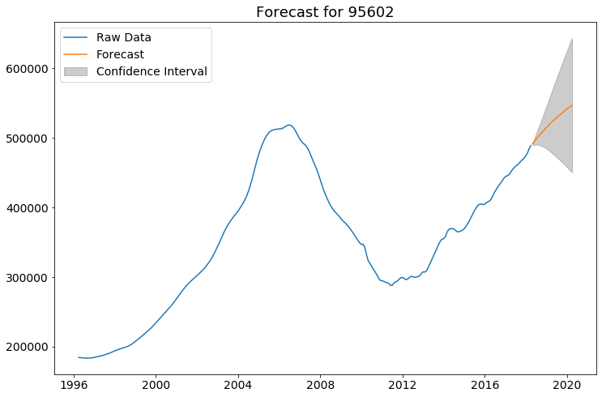


```python
print_results_lists()
```


    (['95616',
      '95619',
      '95864',
      '95831',
      '95811',
      '95818',
      '95630',
      '96140',
      '95672',
      '95636',
      '95709',
      '95746',
      '95614',
      '95663',
      '95623',
      '95747',
      '95765',
      '95602'],
     ['Davis',
      'Diamond Springs',
      'Arden-Arcade',
      'Sacramento_Pocket',
      'Sacramento_DosRios',
      'Sacramento_LandPark',
      'Folsom',
      'Carnelian Bay',
      'Rescue',
      'Somerset',
      'Camino',
      'Granite Bay',
      'Cool',
      'Penryn',
      'El Dorado',
      'Roseville',
      'Rocklin',
      'Auburn'],
     ['Yolo',
      'El Dorado',
      'Sacramento',
      'Sacramento',
      'Sacramento',
      'Sacramento',
      'Sacramento',
      'Placer',
      'El Dorado',
      'El Dorado',
      'El Dorado',
      'Placer',
      'El Dorado',
      'Placer',
      'El Dorado',
      'Placer',
      'Placer',
      'Placer'],
     [(2, 1, 2),
      (2, 1, 2),
      (8, 0, 2),
      (4, 0, 2),
      (10, 1, 0),
      (1, 1, 1),
      (4, 0, 2),
      (2, 1, 2),
      (4, 1, 2),
      (6, 0, 1),
      (2, 1, 2),
      (4, 1, 2),
      (4, 0, 2),
      (4, 0, 2),
      (2, 2, 2),
      (4, 0, 2),
      (4, 0, 2),
      (4, 1, 2)],
     [717863.06,
      355774.45,
      449047.92,
      386994.52,
      570598.7,
      563857.1,
      484136.82,
      686817.86,
      650576.11,
      230095.49,
      410576.95,
      423809.57,
      406562.1,
      612903.01,
      499124.6,
      477514.15,
      518030.61,
      547032.68],
     [619575.34,
      275292.09,
      327568.68,
      292621.1,
      459606.77,
      464602.96,
      382062.81,
      560520.55,
      514993.56,
      165787.22,
      321956.34,
      339823.66,
      304533.23,
      471743.88,
      289222.26,
      384695.22,
      410222.8,
      450306.7],
     [816150.79,
      436256.81,
      570527.16,
      481367.94,
      681590.63,
      663111.23,
      586210.84,
      813115.17,
      786158.66,
      294403.76,
      499197.56,
      507795.49,
      508590.96,
      754062.15,
      709026.93,
      570333.08,
      625838.43,
      643758.66],
     [692300.0,
      321100.0,
      552700.0,
      449300.0,
      567500.0,
      563900.0,
      542900.0,
      644600.0,
      579300.0,
      241200.0,
      386000.0,
      386000.0,
      423300.0,
      600700.0,
      455700.0,
      483800.0,
      509200.0,
      488700.0],
     [3.69,
      10.8,
      -18.75,
      -13.87,
      0.55,
      -0.01,
      -10.82,
      6.55,
      12.3,
      -4.6,
      6.37,
      9.8,
      -3.95,
      2.03,
      9.53,
      -1.3,
      1.73,
      11.94],
     [-10.5,
      -14.27,
      -40.73,
      -34.87,
      -19.01,
      -17.61,
      -29.63,
      -13.04,
      -11.1,
      -31.27,
      -16.59,
      -11.96,
      -28.06,
      -21.47,
      -36.53,
      -20.48,
      -19.44,
      -7.86],
     [17.89,
      35.86,
      3.23,
      7.14,
      20.1,
      17.59,
      7.98,
      26.14,
      35.71,
      22.06,
      29.33,
      31.55,
      20.15,
      25.53,
      55.59,
      17.89,
      22.91,
      31.73])


```python
# pop_results_lists()
```


```python
# print_results_lists()
```

### Zip code 95602 (Auburn):  Strong investment opportunity with minimal downside

By the model prediction, I would expect to see a 11.936% change in price by April 1, 2020.
At the lower bound of the confidence interval, I would expect to see a -7.856% change in price by April 1, 2020.
At the upper bound of the confidence interval, I would expect to see a 31.729% change in price by April 1, 2020.

## SacMetro:  96150 (South Lake Tahoe) -- Excellent investment opportunity, with some downside but significant potential upside

### Set up dataframe


```python
geog_area = '96150'
```


```python
city = 'South Lake Tahoe'
```


```python
county = 'El Dorado'
```


```python
ts = df_sac.loc[df_sac['Zip'] == geog_area]
```


```python
ts.head()
```


<div>
<style scoped>
    .dataframe tbody tr th:only-of-type {
        vertical-align: middle;
    }

    .dataframe tbody tr th {
        vertical-align: top;
    }

    .dataframe thead th {
        text-align: right;
    }
</style>
<table border="1" class="dataframe">
  <thead>
    <tr style="text-align: right;">
      <th></th>
      <th>Metro</th>
      <th>MetroState</th>
      <th>CountyName</th>
      <th>City</th>
      <th>Zip</th>
      <th>value</th>
    </tr>
    <tr>
      <th>time</th>
      <th></th>
      <th></th>
      <th></th>
      <th></th>
      <th></th>
      <th></th>
    </tr>
  </thead>
  <tbody>
    <tr>
      <td>1996-04-01</td>
      <td>Sacramento</td>
      <td>Sacramento CA</td>
      <td>El Dorado</td>
      <td>South Lake Tahoe</td>
      <td>96150</td>
      <td>132800.0</td>
    </tr>
    <tr>
      <td>1996-05-01</td>
      <td>Sacramento</td>
      <td>Sacramento CA</td>
      <td>El Dorado</td>
      <td>South Lake Tahoe</td>
      <td>96150</td>
      <td>132500.0</td>
    </tr>
    <tr>
      <td>1996-06-01</td>
      <td>Sacramento</td>
      <td>Sacramento CA</td>
      <td>El Dorado</td>
      <td>South Lake Tahoe</td>
      <td>96150</td>
      <td>132400.0</td>
    </tr>
    <tr>
      <td>1996-07-01</td>
      <td>Sacramento</td>
      <td>Sacramento CA</td>
      <td>El Dorado</td>
      <td>South Lake Tahoe</td>
      <td>96150</td>
      <td>132400.0</td>
    </tr>
    <tr>
      <td>1996-08-01</td>
      <td>Sacramento</td>
      <td>Sacramento CA</td>
      <td>El Dorado</td>
      <td>South Lake Tahoe</td>
      <td>96150</td>
      <td>132600.0</td>
    </tr>
  </tbody>
</table>
</div>


```python
ts = ts.resample('MS').asfreq()
```


```python
ts.head()
```


<div>
<style scoped>
    .dataframe tbody tr th:only-of-type {
        vertical-align: middle;
    }

    .dataframe tbody tr th {
        vertical-align: top;
    }

    .dataframe thead th {
        text-align: right;
    }
</style>
<table border="1" class="dataframe">
  <thead>
    <tr style="text-align: right;">
      <th></th>
      <th>Metro</th>
      <th>MetroState</th>
      <th>CountyName</th>
      <th>City</th>
      <th>Zip</th>
      <th>value</th>
    </tr>
    <tr>
      <th>time</th>
      <th></th>
      <th></th>
      <th></th>
      <th></th>
      <th></th>
      <th></th>
    </tr>
  </thead>
  <tbody>
    <tr>
      <td>1996-04-01</td>
      <td>Sacramento</td>
      <td>Sacramento CA</td>
      <td>El Dorado</td>
      <td>South Lake Tahoe</td>
      <td>96150</td>
      <td>132800.0</td>
    </tr>
    <tr>
      <td>1996-05-01</td>
      <td>Sacramento</td>
      <td>Sacramento CA</td>
      <td>El Dorado</td>
      <td>South Lake Tahoe</td>
      <td>96150</td>
      <td>132500.0</td>
    </tr>
    <tr>
      <td>1996-06-01</td>
      <td>Sacramento</td>
      <td>Sacramento CA</td>
      <td>El Dorado</td>
      <td>South Lake Tahoe</td>
      <td>96150</td>
      <td>132400.0</td>
    </tr>
    <tr>
      <td>1996-07-01</td>
      <td>Sacramento</td>
      <td>Sacramento CA</td>
      <td>El Dorado</td>
      <td>South Lake Tahoe</td>
      <td>96150</td>
      <td>132400.0</td>
    </tr>
    <tr>
      <td>1996-08-01</td>
      <td>Sacramento</td>
      <td>Sacramento CA</td>
      <td>El Dorado</td>
      <td>South Lake Tahoe</td>
      <td>96150</td>
      <td>132600.0</td>
    </tr>
  </tbody>
</table>
</div>


### Visualizations


```python
plot_single_geog(df_melt, geog_area, 'value', 'Zip', figsize=(12, 6), fontsize1=12, fontsize2=16)
```


```python
ts.boxplot(column = 'value')
plt.title(geog_area);

```


```python
plot_acf_pacf(ts.value)
```


```python
plot_seasonal_decomp(ts.value);

# Note that seasonality isn't much of a factor here; maximum difference of about $700 over the course of a year
```


### ARIMA parameters tuning


```python
p_values = [0, 1, 2, 4, 6, 8, 10]
d_values = range(0, 3)
q_values = range(0, 3)

```

### ARIMA modeling and forecasting results


```python
# This function will run parameter tuning and will append lists
# Uncomment to run (will take about 20-30 minutes)

# arima_forecast_run(ts, geog_area, city, county, p_values, d_values, q_values, confint=2)

# For 96150 (South Lake Tahoe):
# ARIMA(0, 0, 0) MSE=4232090069.873
# ARIMA(0, 1, 0) MSE=7528647.223
# ARIMA(0, 1, 1) MSE=2620355.979
# ARIMA(0, 2, 0) MSE=1557469.255
# ARIMA(0, 2, 1) MSE=1201652.670
# ARIMA(0, 2, 2) MSE=1228294.362
# ARIMA(1, 1, 0) MSE=1525673.493
# ARIMA(1, 1, 1) MSE=1158012.702
# ARIMA(1, 1, 2) MSE=1174973.360
# ARIMA(1, 2, 0) MSE=1449091.397
# ARIMA(1, 2, 1) MSE=1218320.964
# ARIMA(1, 2, 2) MSE=1028205.690
# ARIMA(2, 0, 1) MSE=1164606.286
# ARIMA(2, 0, 2) MSE=1183965.594
# ARIMA(2, 1, 0) MSE=1389025.076
# ARIMA(2, 1, 1) MSE=1172506.714
# ARIMA(2, 2, 0) MSE=1136240.312
# ARIMA(2, 2, 1) MSE=1107346.828
# ARIMA(2, 2, 2) MSE=896773.673
# ARIMA(4, 0, 1) MSE=1083161.365
# ARIMA(4, 0, 2) MSE=903230.970
# ARIMA(4, 1, 1) MSE=1113086.779
# ARIMA(4, 2, 0) MSE=1155246.760
# ARIMA(4, 2, 1) MSE=1116463.457
# ARIMA(6, 0, 1) MSE=1091985.660
# ARIMA(6, 0, 2) MSE=957774.847
# ARIMA(6, 1, 1) MSE=1133579.273
# ARIMA(6, 2, 0) MSE=1136782.717
# ARIMA(6, 2, 1) MSE=1130147.355
# ARIMA(8, 0, 1) MSE=1108963.365
# ARIMA(8, 2, 0) MSE=1182574.627
# ARIMA(8, 2, 1) MSE=1181674.771
# ARIMA(10, 2, 0) MSE=1173910.404
# ARIMA(10, 2, 1) MSE=1133818.580
# Best ARIMA(2, 2, 2) MSE=896773.673
# Best ARIMA order = (2, 2, 2)
```


```python
# this function will not run parameter tuning, but will append lists
# Uncomment to run

best_cfg = (2, 2, 2)
arima_forecast_enter_pdq(ts, geog_area, city, county, best_cfg, confint=2)   
```

    For 96150 (South Lake Tahoe):
    Best ARIMA order = (2, 2, 2)
                                 ARIMA Model Results                              
    ==============================================================================
    Dep. Variable:               D2.value   No. Observations:                  263
    Model:                 ARIMA(2, 2, 2)   Log Likelihood               -2077.640
    Method:                       css-mle   S.D. of innovations            647.619
    Date:                Tue, 24 Mar 2020   AIC                           4167.279
    Time:                        19:23:43   BIC                           4188.712
    Sample:                    06-01-1996   HQIC                          4175.893
                             - 04-01-2018                                         
    ==================================================================================
                         coef    std err          z      P>|z|      [0.025      0.975]
    ----------------------------------------------------------------------------------
    const             13.5037     70.258      0.192      0.848    -124.199     151.207
    ar.L1.D2.value    -0.8189      0.066    -12.446      0.000      -0.948      -0.690
    ar.L2.D2.value    -0.2395      0.064     -3.744      0.000      -0.365      -0.114
    ma.L1.D2.value     1.6688      0.026     64.103      0.000       1.618       1.720
    ma.L2.D2.value     0.9575      0.024     39.202      0.000       0.910       1.005
                                        Roots                                    
    =============================================================================
                      Real          Imaginary           Modulus         Frequency
    -----------------------------------------------------------------------------
    AR.1           -1.7093           -1.1194j            2.0432           -0.4077
    AR.2           -1.7093           +1.1194j            2.0432            0.4077
    MA.1           -0.8715           -0.5338j            1.0220           -0.4125
    MA.2           -0.8715           +0.5338j            1.0220            0.4125
    -----------------------------------------------------------------------------
    By the model prediction, I would expect to see a 16.928% change in price by April 1, 2020.
    At the lower bound of the confidence interval, I would expect to see a -18.474% change in price by April 1, 2020.
    At the upper bound of the confidence interval, I would expect to see a 52.329% change in price by April 1, 2020.


    (['95616',
      '95619',
      '95864',
      '95831',
      '95811',
      '95818',
      '95630',
      '96140',
      '95672',
      '95636',
      '95709',
      '95746',
      '95614',
      '95663',
      '95623',
      '95747',
      '95765',
      '95602',
      '96150'],
     ['Davis',
      'Diamond Springs',
      'Arden-Arcade',
      'Sacramento_Pocket',
      'Sacramento_DosRios',
      'Sacramento_LandPark',
      'Folsom',
      'Carnelian Bay',
      'Rescue',
      'Somerset',
      'Camino',
      'Granite Bay',
      'Cool',
      'Penryn',
      'El Dorado',
      'Roseville',
      'Rocklin',
      'Auburn',
      'South Lake Tahoe'],
     ['Yolo',
      'El Dorado',
      'Sacramento',
      'Sacramento',
      'Sacramento',
      'Sacramento',
      'Sacramento',
      'Placer',
      'El Dorado',
      'El Dorado',
      'El Dorado',
      'Placer',
      'El Dorado',
      'Placer',
      'El Dorado',
      'Placer',
      'Placer',
      'Placer',
      'El Dorado'],
     [(2, 1, 2),
      (2, 1, 2),
      (8, 0, 2),
      (4, 0, 2),
      (10, 1, 0),
      (1, 1, 1),
      (4, 0, 2),
      (2, 1, 2),
      (4, 1, 2),
      (6, 0, 1),
      (2, 1, 2),
      (4, 1, 2),
      (4, 0, 2),
      (4, 0, 2),
      (2, 2, 2),
      (4, 0, 2),
      (4, 0, 2),
      (4, 1, 2),
      (2, 2, 2)],
     [717863.06,
      355774.45,
      449047.92,
      386994.52,
      570598.7,
      563857.1,
      484136.82,
      686817.86,
      650576.11,
      230095.49,
      410576.95,
      423809.57,
      406562.1,
      612903.01,
      499124.6,
      477514.15,
      518030.61,
      547032.68,
      505712.86],
     [619575.34,
      275292.09,
      327568.68,
      292621.1,
      459606.77,
      464602.96,
      382062.81,
      560520.55,
      514993.56,
      165787.22,
      321956.34,
      339823.66,
      304533.23,
      471743.88,
      289222.26,
      384695.22,
      410222.8,
      450306.7,
      352601.89],
     [816150.79,
      436256.81,
      570527.16,
      481367.94,
      681590.63,
      663111.23,
      586210.84,
      813115.17,
      786158.66,
      294403.76,
      499197.56,
      507795.49,
      508590.96,
      754062.15,
      709026.93,
      570333.08,
      625838.43,
      643758.66,
      658823.83],
     [692300.0,
      321100.0,
      552700.0,
      449300.0,
      567500.0,
      563900.0,
      542900.0,
      644600.0,
      579300.0,
      241200.0,
      386000.0,
      386000.0,
      423300.0,
      600700.0,
      455700.0,
      483800.0,
      509200.0,
      488700.0,
      432500.0],
     [3.69,
      10.8,
      -18.75,
      -13.87,
      0.55,
      -0.01,
      -10.82,
      6.55,
      12.3,
      -4.6,
      6.37,
      9.8,
      -3.95,
      2.03,
      9.53,
      -1.3,
      1.73,
      11.94,
      16.93],
     [-10.5,
      -14.27,
      -40.73,
      -34.87,
      -19.01,
      -17.61,
      -29.63,
      -13.04,
      -11.1,
      -31.27,
      -16.59,
      -11.96,
      -28.06,
      -21.47,
      -36.53,
      -20.48,
      -19.44,
      -7.86,
      -18.47],
     [17.89,
      35.86,
      3.23,
      7.14,
      20.1,
      17.59,
      7.98,
      26.14,
      35.71,
      22.06,
      29.33,
      31.55,
      20.15,
      25.53,
      55.59,
      17.89,
      22.91,
      31.73,
      52.33])


```python
print_results_lists()
```


    (['95616',
      '95619',
      '95864',
      '95831',
      '95811',
      '95818',
      '95630',
      '96140',
      '95672',
      '95636',
      '95709',
      '95746',
      '95614',
      '95663',
      '95623',
      '95747',
      '95765',
      '95602',
      '96150'],
     ['Davis',
      'Diamond Springs',
      'Arden-Arcade',
      'Sacramento_Pocket',
      'Sacramento_DosRios',
      'Sacramento_LandPark',
      'Folsom',
      'Carnelian Bay',
      'Rescue',
      'Somerset',
      'Camino',
      'Granite Bay',
      'Cool',
      'Penryn',
      'El Dorado',
      'Roseville',
      'Rocklin',
      'Auburn',
      'South Lake Tahoe'],
     ['Yolo',
      'El Dorado',
      'Sacramento',
      'Sacramento',
      'Sacramento',
      'Sacramento',
      'Sacramento',
      'Placer',
      'El Dorado',
      'El Dorado',
      'El Dorado',
      'Placer',
      'El Dorado',
      'Placer',
      'El Dorado',
      'Placer',
      'Placer',
      'Placer',
      'El Dorado'],
     [(2, 1, 2),
      (2, 1, 2),
      (8, 0, 2),
      (4, 0, 2),
      (10, 1, 0),
      (1, 1, 1),
      (4, 0, 2),
      (2, 1, 2),
      (4, 1, 2),
      (6, 0, 1),
      (2, 1, 2),
      (4, 1, 2),
      (4, 0, 2),
      (4, 0, 2),
      (2, 2, 2),
      (4, 0, 2),
      (4, 0, 2),
      (4, 1, 2),
      (2, 2, 2)],
     [717863.06,
      355774.45,
      449047.92,
      386994.52,
      570598.7,
      563857.1,
      484136.82,
      686817.86,
      650576.11,
      230095.49,
      410576.95,
      423809.57,
      406562.1,
      612903.01,
      499124.6,
      477514.15,
      518030.61,
      547032.68,
      505712.86],
     [619575.34,
      275292.09,
      327568.68,
      292621.1,
      459606.77,
      464602.96,
      382062.81,
      560520.55,
      514993.56,
      165787.22,
      321956.34,
      339823.66,
      304533.23,
      471743.88,
      289222.26,
      384695.22,
      410222.8,
      450306.7,
      352601.89],
     [816150.79,
      436256.81,
      570527.16,
      481367.94,
      681590.63,
      663111.23,
      586210.84,
      813115.17,
      786158.66,
      294403.76,
      499197.56,
      507795.49,
      508590.96,
      754062.15,
      709026.93,
      570333.08,
      625838.43,
      643758.66,
      658823.83],
     [692300.0,
      321100.0,
      552700.0,
      449300.0,
      567500.0,
      563900.0,
      542900.0,
      644600.0,
      579300.0,
      241200.0,
      386000.0,
      386000.0,
      423300.0,
      600700.0,
      455700.0,
      483800.0,
      509200.0,
      488700.0,
      432500.0],
     [3.69,
      10.8,
      -18.75,
      -13.87,
      0.55,
      -0.01,
      -10.82,
      6.55,
      12.3,
      -4.6,
      6.37,
      9.8,
      -3.95,
      2.03,
      9.53,
      -1.3,
      1.73,
      11.94,
      16.93],
     [-10.5,
      -14.27,
      -40.73,
      -34.87,
      -19.01,
      -17.61,
      -29.63,
      -13.04,
      -11.1,
      -31.27,
      -16.59,
      -11.96,
      -28.06,
      -21.47,
      -36.53,
      -20.48,
      -19.44,
      -7.86,
      -18.47],
     [17.89,
      35.86,
      3.23,
      7.14,
      20.1,
      17.59,
      7.98,
      26.14,
      35.71,
      22.06,
      29.33,
      31.55,
      20.15,
      25.53,
      55.59,
      17.89,
      22.91,
      31.73,
      52.33])


```python
# pop_results_lists()
```


```python
# print_results_lists()
```

From previous analyses:  Best ARIMA(2, 1, 2) MSE=700451.029

### Zip code  (South Lake Tahoe):  Excellent investment opportunity, with some downside but significant potential upside

By the model prediction, I would expect to see a 16.928% change in price by April 1, 2020.
At the lower bound of the confidence interval, I would expect to see a -18.474% change in price by April 1, 2020.
At the upper bound of the confidence interval, I would expect to see a 52.329% change in price by April 1, 2020.


## SacMetro:  95650 (Loomis) -- Good--but somewhat risky--investment opportunity 

### Set up dataframe


```python
geog_area = '95650'
```


```python
city = 'Loomis'
```


```python
county = 'Placer'
```


```python
ts = df_sac.loc[df_sac['Zip'] == geog_area]
```


```python
ts.head()
```


<div>
<style scoped>
    .dataframe tbody tr th:only-of-type {
        vertical-align: middle;
    }

    .dataframe tbody tr th {
        vertical-align: top;
    }

    .dataframe thead th {
        text-align: right;
    }
</style>
<table border="1" class="dataframe">
  <thead>
    <tr style="text-align: right;">
      <th></th>
      <th>Metro</th>
      <th>MetroState</th>
      <th>CountyName</th>
      <th>City</th>
      <th>Zip</th>
      <th>value</th>
    </tr>
    <tr>
      <th>time</th>
      <th></th>
      <th></th>
      <th></th>
      <th></th>
      <th></th>
      <th></th>
    </tr>
  </thead>
  <tbody>
    <tr>
      <td>1996-04-01</td>
      <td>Sacramento</td>
      <td>Sacramento CA</td>
      <td>Placer</td>
      <td>Loomis</td>
      <td>95650</td>
      <td>192900.0</td>
    </tr>
    <tr>
      <td>1996-05-01</td>
      <td>Sacramento</td>
      <td>Sacramento CA</td>
      <td>Placer</td>
      <td>Loomis</td>
      <td>95650</td>
      <td>193200.0</td>
    </tr>
    <tr>
      <td>1996-06-01</td>
      <td>Sacramento</td>
      <td>Sacramento CA</td>
      <td>Placer</td>
      <td>Loomis</td>
      <td>95650</td>
      <td>193400.0</td>
    </tr>
    <tr>
      <td>1996-07-01</td>
      <td>Sacramento</td>
      <td>Sacramento CA</td>
      <td>Placer</td>
      <td>Loomis</td>
      <td>95650</td>
      <td>193500.0</td>
    </tr>
    <tr>
      <td>1996-08-01</td>
      <td>Sacramento</td>
      <td>Sacramento CA</td>
      <td>Placer</td>
      <td>Loomis</td>
      <td>95650</td>
      <td>193700.0</td>
    </tr>
  </tbody>
</table>
</div>


```python
ts = ts.resample('MS').asfreq()
```


```python
ts.head()
```


<div>
<style scoped>
    .dataframe tbody tr th:only-of-type {
        vertical-align: middle;
    }

    .dataframe tbody tr th {
        vertical-align: top;
    }

    .dataframe thead th {
        text-align: right;
    }
</style>
<table border="1" class="dataframe">
  <thead>
    <tr style="text-align: right;">
      <th></th>
      <th>Metro</th>
      <th>MetroState</th>
      <th>CountyName</th>
      <th>City</th>
      <th>Zip</th>
      <th>value</th>
    </tr>
    <tr>
      <th>time</th>
      <th></th>
      <th></th>
      <th></th>
      <th></th>
      <th></th>
      <th></th>
    </tr>
  </thead>
  <tbody>
    <tr>
      <td>1996-04-01</td>
      <td>Sacramento</td>
      <td>Sacramento CA</td>
      <td>Placer</td>
      <td>Loomis</td>
      <td>95650</td>
      <td>192900.0</td>
    </tr>
    <tr>
      <td>1996-05-01</td>
      <td>Sacramento</td>
      <td>Sacramento CA</td>
      <td>Placer</td>
      <td>Loomis</td>
      <td>95650</td>
      <td>193200.0</td>
    </tr>
    <tr>
      <td>1996-06-01</td>
      <td>Sacramento</td>
      <td>Sacramento CA</td>
      <td>Placer</td>
      <td>Loomis</td>
      <td>95650</td>
      <td>193400.0</td>
    </tr>
    <tr>
      <td>1996-07-01</td>
      <td>Sacramento</td>
      <td>Sacramento CA</td>
      <td>Placer</td>
      <td>Loomis</td>
      <td>95650</td>
      <td>193500.0</td>
    </tr>
    <tr>
      <td>1996-08-01</td>
      <td>Sacramento</td>
      <td>Sacramento CA</td>
      <td>Placer</td>
      <td>Loomis</td>
      <td>95650</td>
      <td>193700.0</td>
    </tr>
  </tbody>
</table>
</div>


### Visualizations


```python
plot_single_geog(df_melt, geog_area, 'value', 'Zip', figsize=(12, 6), fontsize1=12, fontsize2=16)
```


```python
ts.boxplot(column = 'value')
plt.title(geog_area);

```


```python
plot_acf_pacf(ts.value)
```


```python
plot_seasonal_decomp(ts.value);

# Note that seasonality isn't much of a factor here; maximum difference of about $700 over the course of a year
```


### ARIMA parameters tuning


```python
p_values = [0, 1, 2, 4, 6, 8, 10]
d_values = range(0, 3)
q_values = range(0, 3)

```

### ARIMA modeling and forecasting results


```python
# This function will run parameter tuning and will append lists
# Uncomment to run (will take about 20-30 minutes)

# arima_forecast_run(ts, geog_area, city, county, p_values, d_values, q_values, confint=2)

# For 95650 (Loomis):
# ARIMA(0, 0, 0) MSE=10828992054.689
# ARIMA(0, 0, 1) MSE=2779943595.368
# ARIMA(0, 1, 0) MSE=17446652.535
# ARIMA(0, 1, 1) MSE=6075154.262
# ARIMA(0, 2, 0) MSE=5105671.223
# ARIMA(0, 2, 1) MSE=3685977.678
# ARIMA(1, 0, 0) MSE=23979392.115
# ARIMA(1, 1, 0) MSE=5006416.363
# ARIMA(1, 1, 2) MSE=3239755.850
# ARIMA(1, 2, 0) MSE=4683407.204
# ARIMA(1, 2, 1) MSE=3830826.988
# ARIMA(1, 2, 2) MSE=3084467.390
# ARIMA(2, 0, 2) MSE=3291310.628
# ARIMA(2, 1, 1) MSE=3606981.499
# ARIMA(2, 1, 2) MSE=2887910.808
# ARIMA(2, 2, 0) MSE=3290030.236
# ARIMA(2, 2, 1) MSE=3284224.060
# ARIMA(2, 2, 2) MSE=3211400.300
# ARIMA(4, 0, 1) MSE=3221409.624
# ARIMA(4, 0, 2) MSE=3053172.966
# ARIMA(4, 1, 1) MSE=3238767.558
# ARIMA(4, 1, 2) MSE=2976526.318
# ARIMA(4, 2, 0) MSE=3360031.963
# ARIMA(4, 2, 1) MSE=3344082.704
# ARIMA(6, 1, 1) MSE=3242371.200
# ARIMA(6, 2, 0) MSE=3445852.026
# ARIMA(6, 2, 1) MSE=3381538.361
# ARIMA(8, 0, 1) MSE=3310594.957
# ARIMA(8, 0, 2) MSE=3091067.626
# ARIMA(8, 1, 2) MSE=3089490.165
# ARIMA(8, 2, 0) MSE=3174116.305
# ARIMA(8, 2, 1) MSE=3232427.355
# ARIMA(10, 2, 0) MSE=3218817.077
# Best ARIMA(2, 1, 2) MSE=2887910.808
# Best ARIMA order = (2, 1, 2)
```


```python
# this function will not run parameter tuning, but will append lists
# Uncomment to run

best_cfg = (2,1,2)
arima_forecast_enter_pdq(ts, geog_area, city, county, best_cfg, confint=2)   
```

    For 95650 (Loomis):
    Best ARIMA order = (2, 1, 2)
                                 ARIMA Model Results                              
    ==============================================================================
    Dep. Variable:                D.value   No. Observations:                  264
    Model:                 ARIMA(2, 1, 2)   Log Likelihood               -2211.878
    Method:                       css-mle   S.D. of innovations           1041.677
    Date:                Tue, 24 Mar 2020   AIC                           4435.757
    Time:                        19:23:54   BIC                           4457.212
    Sample:                    05-01-1996   HQIC                          4444.378
                             - 04-01-2018                                         
    =================================================================================
                        coef    std err          z      P>|z|      [0.025      0.975]
    ---------------------------------------------------------------------------------
    const          1630.0130   1078.757      1.511      0.132    -484.312    3744.338
    ar.L1.D.value     0.3554      0.073      4.901      0.000       0.213       0.497
    ar.L2.D.value     0.4431      0.073      6.043      0.000       0.299       0.587
    ma.L1.D.value     1.5990      0.040     40.434      0.000       1.521       1.676
    ma.L2.D.value     0.8815      0.036     24.220      0.000       0.810       0.953
                                        Roots                                    
    =============================================================================
                      Real          Imaginary           Modulus         Frequency
    -----------------------------------------------------------------------------
    AR.1            1.1538           +0.0000j            1.1538            0.0000
    AR.2           -1.9558           +0.0000j            1.9558            0.5000
    MA.1           -0.9069           -0.5585j            1.0651           -0.4122
    MA.2           -0.9069           +0.5585j            1.0651            0.4122
    -----------------------------------------------------------------------------
    By the model prediction, I would expect to see a 6.591% change in price by April 1, 2020.
    At the lower bound of the confidence interval, I would expect to see a -14.188% change in price by April 1, 2020.
    At the upper bound of the confidence interval, I would expect to see a 27.369% change in price by April 1, 2020.


    (['95616',
      '95619',
      '95864',
      '95831',
      '95811',
      '95818',
      '95630',
      '96140',
      '95672',
      '95636',
      '95709',
      '95746',
      '95614',
      '95663',
      '95623',
      '95747',
      '95765',
      '95602',
      '96150',
      '95650'],
     ['Davis',
      'Diamond Springs',
      'Arden-Arcade',
      'Sacramento_Pocket',
      'Sacramento_DosRios',
      'Sacramento_LandPark',
      'Folsom',
      'Carnelian Bay',
      'Rescue',
      'Somerset',
      'Camino',
      'Granite Bay',
      'Cool',
      'Penryn',
      'El Dorado',
      'Roseville',
      'Rocklin',
      'Auburn',
      'South Lake Tahoe',
      'Loomis'],
     ['Yolo',
      'El Dorado',
      'Sacramento',
      'Sacramento',
      'Sacramento',
      'Sacramento',
      'Sacramento',
      'Placer',
      'El Dorado',
      'El Dorado',
      'El Dorado',
      'Placer',
      'El Dorado',
      'Placer',
      'El Dorado',
      'Placer',
      'Placer',
      'Placer',
      'El Dorado',
      'Placer'],
     [(2, 1, 2),
      (2, 1, 2),
      (8, 0, 2),
      (4, 0, 2),
      (10, 1, 0),
      (1, 1, 1),
      (4, 0, 2),
      (2, 1, 2),
      (4, 1, 2),
      (6, 0, 1),
      (2, 1, 2),
      (4, 1, 2),
      (4, 0, 2),
      (4, 0, 2),
      (2, 2, 2),
      (4, 0, 2),
      (4, 0, 2),
      (4, 1, 2),
      (2, 2, 2),
      (2, 1, 2)],
     [717863.06,
      355774.45,
      449047.92,
      386994.52,
      570598.7,
      563857.1,
      484136.82,
      686817.86,
      650576.11,
      230095.49,
      410576.95,
      423809.57,
      406562.1,
      612903.01,
      499124.6,
      477514.15,
      518030.61,
      547032.68,
      505712.86,
      672586.13],
     [619575.34,
      275292.09,
      327568.68,
      292621.1,
      459606.77,
      464602.96,
      382062.81,
      560520.55,
      514993.56,
      165787.22,
      321956.34,
      339823.66,
      304533.23,
      471743.88,
      289222.26,
      384695.22,
      410222.8,
      450306.7,
      352601.89,
      541471.1],
     [816150.79,
      436256.81,
      570527.16,
      481367.94,
      681590.63,
      663111.23,
      586210.84,
      813115.17,
      786158.66,
      294403.76,
      499197.56,
      507795.49,
      508590.96,
      754062.15,
      709026.93,
      570333.08,
      625838.43,
      643758.66,
      658823.83,
      803701.17],
     [692300.0,
      321100.0,
      552700.0,
      449300.0,
      567500.0,
      563900.0,
      542900.0,
      644600.0,
      579300.0,
      241200.0,
      386000.0,
      386000.0,
      423300.0,
      600700.0,
      455700.0,
      483800.0,
      509200.0,
      488700.0,
      432500.0,
      631000.0],
     [3.69,
      10.8,
      -18.75,
      -13.87,
      0.55,
      -0.01,
      -10.82,
      6.55,
      12.3,
      -4.6,
      6.37,
      9.8,
      -3.95,
      2.03,
      9.53,
      -1.3,
      1.73,
      11.94,
      16.93,
      6.59],
     [-10.5,
      -14.27,
      -40.73,
      -34.87,
      -19.01,
      -17.61,
      -29.63,
      -13.04,
      -11.1,
      -31.27,
      -16.59,
      -11.96,
      -28.06,
      -21.47,
      -36.53,
      -20.48,
      -19.44,
      -7.86,
      -18.47,
      -14.19],
     [17.89,
      35.86,
      3.23,
      7.14,
      20.1,
      17.59,
      7.98,
      26.14,
      35.71,
      22.06,
      29.33,
      31.55,
      20.15,
      25.53,
      55.59,
      17.89,
      22.91,
      31.73,
      52.33,
      27.37])


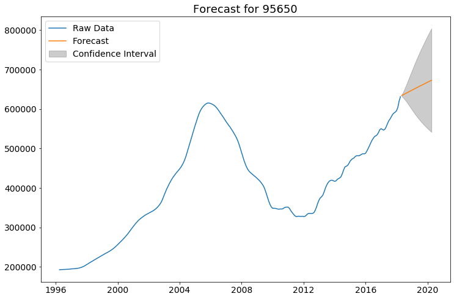


```python
print_results_lists()
```


    (['95616',
      '95619',
      '95864',
      '95831',
      '95811',
      '95818',
      '95630',
      '96140',
      '95672',
      '95636',
      '95709',
      '95746',
      '95614',
      '95663',
      '95623',
      '95747',
      '95765',
      '95602',
      '96150',
      '95650'],
     ['Davis',
      'Diamond Springs',
      'Arden-Arcade',
      'Sacramento_Pocket',
      'Sacramento_DosRios',
      'Sacramento_LandPark',
      'Folsom',
      'Carnelian Bay',
      'Rescue',
      'Somerset',
      'Camino',
      'Granite Bay',
      'Cool',
      'Penryn',
      'El Dorado',
      'Roseville',
      'Rocklin',
      'Auburn',
      'South Lake Tahoe',
      'Loomis'],
     ['Yolo',
      'El Dorado',
      'Sacramento',
      'Sacramento',
      'Sacramento',
      'Sacramento',
      'Sacramento',
      'Placer',
      'El Dorado',
      'El Dorado',
      'El Dorado',
      'Placer',
      'El Dorado',
      'Placer',
      'El Dorado',
      'Placer',
      'Placer',
      'Placer',
      'El Dorado',
      'Placer'],
     [(2, 1, 2),
      (2, 1, 2),
      (8, 0, 2),
      (4, 0, 2),
      (10, 1, 0),
      (1, 1, 1),
      (4, 0, 2),
      (2, 1, 2),
      (4, 1, 2),
      (6, 0, 1),
      (2, 1, 2),
      (4, 1, 2),
      (4, 0, 2),
      (4, 0, 2),
      (2, 2, 2),
      (4, 0, 2),
      (4, 0, 2),
      (4, 1, 2),
      (2, 2, 2),
      (2, 1, 2)],
     [717863.06,
      355774.45,
      449047.92,
      386994.52,
      570598.7,
      563857.1,
      484136.82,
      686817.86,
      650576.11,
      230095.49,
      410576.95,
      423809.57,
      406562.1,
      612903.01,
      499124.6,
      477514.15,
      518030.61,
      547032.68,
      505712.86,
      672586.13],
     [619575.34,
      275292.09,
      327568.68,
      292621.1,
      459606.77,
      464602.96,
      382062.81,
      560520.55,
      514993.56,
      165787.22,
      321956.34,
      339823.66,
      304533.23,
      471743.88,
      289222.26,
      384695.22,
      410222.8,
      450306.7,
      352601.89,
      541471.1],
     [816150.79,
      436256.81,
      570527.16,
      481367.94,
      681590.63,
      663111.23,
      586210.84,
      813115.17,
      786158.66,
      294403.76,
      499197.56,
      507795.49,
      508590.96,
      754062.15,
      709026.93,
      570333.08,
      625838.43,
      643758.66,
      658823.83,
      803701.17],
     [692300.0,
      321100.0,
      552700.0,
      449300.0,
      567500.0,
      563900.0,
      542900.0,
      644600.0,
      579300.0,
      241200.0,
      386000.0,
      386000.0,
      423300.0,
      600700.0,
      455700.0,
      483800.0,
      509200.0,
      488700.0,
      432500.0,
      631000.0],
     [3.69,
      10.8,
      -18.75,
      -13.87,
      0.55,
      -0.01,
      -10.82,
      6.55,
      12.3,
      -4.6,
      6.37,
      9.8,
      -3.95,
      2.03,
      9.53,
      -1.3,
      1.73,
      11.94,
      16.93,
      6.59],
     [-10.5,
      -14.27,
      -40.73,
      -34.87,
      -19.01,
      -17.61,
      -29.63,
      -13.04,
      -11.1,
      -31.27,
      -16.59,
      -11.96,
      -28.06,
      -21.47,
      -36.53,
      -20.48,
      -19.44,
      -7.86,
      -18.47,
      -14.19],
     [17.89,
      35.86,
      3.23,
      7.14,
      20.1,
      17.59,
      7.98,
      26.14,
      35.71,
      22.06,
      29.33,
      31.55,
      20.15,
      25.53,
      55.59,
      17.89,
      22.91,
      31.73,
      52.33,
      27.37])


```python
# pop_results_lists()
```


```python
# print_results_lists()
```

### Zip code 95650 (Loomis):  Good--but somewhat risky--investment opportunity 

By the model prediction, I would expect to see a 6.591% change in price by April 1, 2020.
At the lower bound of the confidence interval, I would expect to see a -14.188% change in price by April 1, 2020.
At the upper bound of the confidence interval, I would expect to see a 27.369% change in price by April 1, 2020.


# Summary of findings

## Create summary dataframe


```python
print_lengths()
```

    geog_areas:  20
    cities:  20
    counties 20
    orders:  20
    predicted_prices:  20
    lower_bound_prices:  20
    upper_bound_prices:  20
    last_values:  20
    pred_pct_changes:  20
    lower_pct_changes:  20
    upper_pct_changes:  20


```python
print_results_lists()
```


    (['95616',
      '95619',
      '95864',
      '95831',
      '95811',
      '95818',
      '95630',
      '96140',
      '95672',
      '95636',
      '95709',
      '95746',
      '95614',
      '95663',
      '95623',
      '95747',
      '95765',
      '95602',
      '96150',
      '95650'],
     ['Davis',
      'Diamond Springs',
      'Arden-Arcade',
      'Sacramento_Pocket',
      'Sacramento_DosRios',
      'Sacramento_LandPark',
      'Folsom',
      'Carnelian Bay',
      'Rescue',
      'Somerset',
      'Camino',
      'Granite Bay',
      'Cool',
      'Penryn',
      'El Dorado',
      'Roseville',
      'Rocklin',
      'Auburn',
      'South Lake Tahoe',
      'Loomis'],
     ['Yolo',
      'El Dorado',
      'Sacramento',
      'Sacramento',
      'Sacramento',
      'Sacramento',
      'Sacramento',
      'Placer',
      'El Dorado',
      'El Dorado',
      'El Dorado',
      'Placer',
      'El Dorado',
      'Placer',
      'El Dorado',
      'Placer',
      'Placer',
      'Placer',
      'El Dorado',
      'Placer'],
     [(2, 1, 2),
      (2, 1, 2),
      (8, 0, 2),
      (4, 0, 2),
      (10, 1, 0),
      (1, 1, 1),
      (4, 0, 2),
      (2, 1, 2),
      (4, 1, 2),
      (6, 0, 1),
      (2, 1, 2),
      (4, 1, 2),
      (4, 0, 2),
      (4, 0, 2),
      (2, 2, 2),
      (4, 0, 2),
      (4, 0, 2),
      (4, 1, 2),
      (2, 2, 2),
      (2, 1, 2)],
     [717863.06,
      355774.45,
      449047.92,
      386994.52,
      570598.7,
      563857.1,
      484136.82,
      686817.86,
      650576.11,
      230095.49,
      410576.95,
      423809.57,
      406562.1,
      612903.01,
      499124.6,
      477514.15,
      518030.61,
      547032.68,
      505712.86,
      672586.13],
     [619575.34,
      275292.09,
      327568.68,
      292621.1,
      459606.77,
      464602.96,
      382062.81,
      560520.55,
      514993.56,
      165787.22,
      321956.34,
      339823.66,
      304533.23,
      471743.88,
      289222.26,
      384695.22,
      410222.8,
      450306.7,
      352601.89,
      541471.1],
     [816150.79,
      436256.81,
      570527.16,
      481367.94,
      681590.63,
      663111.23,
      586210.84,
      813115.17,
      786158.66,
      294403.76,
      499197.56,
      507795.49,
      508590.96,
      754062.15,
      709026.93,
      570333.08,
      625838.43,
      643758.66,
      658823.83,
      803701.17],
     [692300.0,
      321100.0,
      552700.0,
      449300.0,
      567500.0,
      563900.0,
      542900.0,
      644600.0,
      579300.0,
      241200.0,
      386000.0,
      386000.0,
      423300.0,
      600700.0,
      455700.0,
      483800.0,
      509200.0,
      488700.0,
      432500.0,
      631000.0],
     [3.69,
      10.8,
      -18.75,
      -13.87,
      0.55,
      -0.01,
      -10.82,
      6.55,
      12.3,
      -4.6,
      6.37,
      9.8,
      -3.95,
      2.03,
      9.53,
      -1.3,
      1.73,
      11.94,
      16.93,
      6.59],
     [-10.5,
      -14.27,
      -40.73,
      -34.87,
      -19.01,
      -17.61,
      -29.63,
      -13.04,
      -11.1,
      -31.27,
      -16.59,
      -11.96,
      -28.06,
      -21.47,
      -36.53,
      -20.48,
      -19.44,
      -7.86,
      -18.47,
      -14.19],
     [17.89,
      35.86,
      3.23,
      7.14,
      20.1,
      17.59,
      7.98,
      26.14,
      35.71,
      22.06,
      29.33,
      31.55,
      20.15,
      25.53,
      55.59,
      17.89,
      22.91,
      31.73,
      52.33,
      27.37])


```python
# print_results_lists()

# geog_areas = ['95616','95619','95864','95831','95811','95818','95630','96140','95672','95636','95709','95746','95614','95663','95623','95747','95765','95602','96150','95650']
# cities = ['Davis','Diamond Springs','Arden-Arcade','Sacramento_Pocket','Sacramento_DosRios','Sacramento_LandPark','Folsom','Carnelian Bay','Rescue','Somerset','Camino','Granite Bay','Cool','Penryn','El Dorado','Roseville','Rocklin','Auburn','South Lake Tahoe','Loomis']
# counties = ['Yolo','El Dorado','Sacramento','Sacramento','Sacramento','Sacramento','Sacramento','Placer','El Dorado','El Dorado','El Dorado','Placer','El Dorado','Placer','El Dorado','Placer','Placer','Placer','El Dorado','Placer']
# orders = [(2, 1, 2),(2, 1, 2),(8, 0, 2),(4, 0, 2),(10, 1, 0),(1, 1, 1),(4, 0, 2),(2, 1, 2),(4, 1, 2),(6, 0, 1),(2, 1, 2),(4, 1, 2),(4, 0, 2),(4, 0, 2),(2, 2, 2),(4, 0, 2),(4, 0, 2),(4, 1, 2),(2, 2, 2),(2, 1, 2)]
# predicted_prices = [717863.06,355774.45,449047.92,386994.52,570598.7,563857.1,484136.82,686817.86,650576.11,230095.49,410576.95,839306.25,406562.1,612903.01,499124.6,477514.15,518030.61,547032.68,505712.86,672586.13]
# lower_bound_prices = [619575.34,275292.09,327568.68,292621.1,459606.77,464602.96,382062.81,560520.55,514993.56,165787.22,321956.34,698769.41,304533.23,471743.88,289222.26,384695.22,410222.8,450306.7,352601.89,541471.1]
# upper_bound_prices = [816150.79,436256.81,570527.16,481367.94,681590.63,663111.23,586210.84,813115.17,786158.66,294403.76,499197.56,979843.08,508590.96,754062.15,709026.93,570333.08,625838.43,643758.66,658823.83,803701.17]
#  last_values = [692300.0,321100.0,552700.0,449300.0,567500.0,563900.0,542900.0,644600.0,579300.0,241200.0,386000.0,778500.0,423300.0,600700.0,455700.0,483800.0,509200.0,488700.0,432500.0,631000.0]
#  pred_pct_changes = [3.69,10.8,-18.75,-13.87,0.55,-0.01,-10.82,6.55,12.3,-4.6,6.37,7.81,-3.95,2.03,9.53,-1.3,1.73,11.94,16.93,6.59]
#  lower_pct_changes = [-10.5,-14.27,-40.73,-34.87,-19.01,-17.61,-29.63,-13.04,-11.1,-31.27,-16.59,-10.24,-28.06,-21.47,-36.53,-20.48,-19.44,-7.86,-18.47,-14.19]
#  upper_pct_changes = [17.89,35.86,3.23,7.14,20.1,17.59,7.98,26.14,35.71,22.06,29.33,25.86,20.15,25.53,55.59,17.89,22.91,31.73,52.33,27.37])
```


```python
population = [45500, 4359, 92186, 42952, 7630, 21825, 74111, 1170, 4592, 1000, 4354, 22482, 3882, 2468, 3986,
             72437, 41810, 18290, 30000, 12600]
len(population)
```


    20


```python
# pred_pct_changes = [3.69,10.8,-18.75,-13.87,0.55,-0.01,-10.82,6.55,12.3,-4.6,6.37,7.81,-3.95,2.03,9.53,-1.3,1.73,11.94,16.93,6.59]

invest_recs = []

for i in pred_pct_changes:
    if i <= 0.9:
        invest_recs.append("poor")
    elif i <= 4.9:
        invest_recs.append("mediocre")
    elif i <= 9.9:
        invest_recs.append("good")
    else:
        invest_recs.append("excellent")

invest_recs
```


    ['mediocre',
     'excellent',
     'poor',
     'poor',
     'poor',
     'poor',
     'poor',
     'good',
     'excellent',
     'poor',
     'good',
     'good',
     'poor',
     'mediocre',
     'good',
     'poor',
     'mediocre',
     'excellent',
     'excellent',
     'good']


```python
len(invest_recs)
```


    20


```python
df_findings = pd.DataFrame({'ZIP code': geog_areas, '2018 value': last_values, 'City': cities, 
                            'Pop': population, 'County': counties, 'Investment rating, based on predicted return': invest_recs, 
                            'Predicted % Change': pred_pct_changes, 'Worst Case % Change': lower_pct_changes,
                            'Best Case % Change': upper_pct_changes, 'Predicted':predicted_prices, 
                            'Worst Case':lower_bound_prices, 'Best Case':upper_bound_prices})

```


```python
df_findings
```


<div>
<style scoped>
    .dataframe tbody tr th:only-of-type {
        vertical-align: middle;
    }

    .dataframe tbody tr th {
        vertical-align: top;
    }

    .dataframe thead th {
        text-align: right;
    }
</style>
<table border="1" class="dataframe">
  <thead>
    <tr style="text-align: right;">
      <th></th>
      <th>ZIP code</th>
      <th>2018 value</th>
      <th>City</th>
      <th>Pop</th>
      <th>County</th>
      <th>Investment rating, based on predicted return</th>
      <th>Predicted % Change</th>
      <th>Worst Case % Change</th>
      <th>Best Case % Change</th>
      <th>Predicted</th>
      <th>Worst Case</th>
      <th>Best Case</th>
    </tr>
  </thead>
  <tbody>
    <tr>
      <td>0</td>
      <td>95616</td>
      <td>692300.0</td>
      <td>Davis</td>
      <td>45500</td>
      <td>Yolo</td>
      <td>mediocre</td>
      <td>3.69</td>
      <td>-10.50</td>
      <td>17.89</td>
      <td>717863.06</td>
      <td>619575.34</td>
      <td>816150.79</td>
    </tr>
    <tr>
      <td>1</td>
      <td>95619</td>
      <td>321100.0</td>
      <td>Diamond Springs</td>
      <td>4359</td>
      <td>El Dorado</td>
      <td>excellent</td>
      <td>10.80</td>
      <td>-14.27</td>
      <td>35.86</td>
      <td>355774.45</td>
      <td>275292.09</td>
      <td>436256.81</td>
    </tr>
    <tr>
      <td>2</td>
      <td>95864</td>
      <td>552700.0</td>
      <td>Arden-Arcade</td>
      <td>92186</td>
      <td>Sacramento</td>
      <td>poor</td>
      <td>-18.75</td>
      <td>-40.73</td>
      <td>3.23</td>
      <td>449047.92</td>
      <td>327568.68</td>
      <td>570527.16</td>
    </tr>
    <tr>
      <td>3</td>
      <td>95831</td>
      <td>449300.0</td>
      <td>Sacramento_Pocket</td>
      <td>42952</td>
      <td>Sacramento</td>
      <td>poor</td>
      <td>-13.87</td>
      <td>-34.87</td>
      <td>7.14</td>
      <td>386994.52</td>
      <td>292621.10</td>
      <td>481367.94</td>
    </tr>
    <tr>
      <td>4</td>
      <td>95811</td>
      <td>567500.0</td>
      <td>Sacramento_DosRios</td>
      <td>7630</td>
      <td>Sacramento</td>
      <td>poor</td>
      <td>0.55</td>
      <td>-19.01</td>
      <td>20.10</td>
      <td>570598.70</td>
      <td>459606.77</td>
      <td>681590.63</td>
    </tr>
    <tr>
      <td>5</td>
      <td>95818</td>
      <td>563900.0</td>
      <td>Sacramento_LandPark</td>
      <td>21825</td>
      <td>Sacramento</td>
      <td>poor</td>
      <td>-0.01</td>
      <td>-17.61</td>
      <td>17.59</td>
      <td>563857.10</td>
      <td>464602.96</td>
      <td>663111.23</td>
    </tr>
    <tr>
      <td>6</td>
      <td>95630</td>
      <td>542900.0</td>
      <td>Folsom</td>
      <td>74111</td>
      <td>Sacramento</td>
      <td>poor</td>
      <td>-10.82</td>
      <td>-29.63</td>
      <td>7.98</td>
      <td>484136.82</td>
      <td>382062.81</td>
      <td>586210.84</td>
    </tr>
    <tr>
      <td>7</td>
      <td>96140</td>
      <td>644600.0</td>
      <td>Carnelian Bay</td>
      <td>1170</td>
      <td>Placer</td>
      <td>good</td>
      <td>6.55</td>
      <td>-13.04</td>
      <td>26.14</td>
      <td>686817.86</td>
      <td>560520.55</td>
      <td>813115.17</td>
    </tr>
    <tr>
      <td>8</td>
      <td>95672</td>
      <td>579300.0</td>
      <td>Rescue</td>
      <td>4592</td>
      <td>El Dorado</td>
      <td>excellent</td>
      <td>12.30</td>
      <td>-11.10</td>
      <td>35.71</td>
      <td>650576.11</td>
      <td>514993.56</td>
      <td>786158.66</td>
    </tr>
    <tr>
      <td>9</td>
      <td>95636</td>
      <td>241200.0</td>
      <td>Somerset</td>
      <td>1000</td>
      <td>El Dorado</td>
      <td>poor</td>
      <td>-4.60</td>
      <td>-31.27</td>
      <td>22.06</td>
      <td>230095.49</td>
      <td>165787.22</td>
      <td>294403.76</td>
    </tr>
    <tr>
      <td>10</td>
      <td>95709</td>
      <td>386000.0</td>
      <td>Camino</td>
      <td>4354</td>
      <td>El Dorado</td>
      <td>good</td>
      <td>6.37</td>
      <td>-16.59</td>
      <td>29.33</td>
      <td>410576.95</td>
      <td>321956.34</td>
      <td>499197.56</td>
    </tr>
    <tr>
      <td>11</td>
      <td>95746</td>
      <td>386000.0</td>
      <td>Granite Bay</td>
      <td>22482</td>
      <td>Placer</td>
      <td>good</td>
      <td>9.80</td>
      <td>-11.96</td>
      <td>31.55</td>
      <td>423809.57</td>
      <td>339823.66</td>
      <td>507795.49</td>
    </tr>
    <tr>
      <td>12</td>
      <td>95614</td>
      <td>423300.0</td>
      <td>Cool</td>
      <td>3882</td>
      <td>El Dorado</td>
      <td>poor</td>
      <td>-3.95</td>
      <td>-28.06</td>
      <td>20.15</td>
      <td>406562.10</td>
      <td>304533.23</td>
      <td>508590.96</td>
    </tr>
    <tr>
      <td>13</td>
      <td>95663</td>
      <td>600700.0</td>
      <td>Penryn</td>
      <td>2468</td>
      <td>Placer</td>
      <td>mediocre</td>
      <td>2.03</td>
      <td>-21.47</td>
      <td>25.53</td>
      <td>612903.01</td>
      <td>471743.88</td>
      <td>754062.15</td>
    </tr>
    <tr>
      <td>14</td>
      <td>95623</td>
      <td>455700.0</td>
      <td>El Dorado</td>
      <td>3986</td>
      <td>El Dorado</td>
      <td>good</td>
      <td>9.53</td>
      <td>-36.53</td>
      <td>55.59</td>
      <td>499124.60</td>
      <td>289222.26</td>
      <td>709026.93</td>
    </tr>
    <tr>
      <td>15</td>
      <td>95747</td>
      <td>483800.0</td>
      <td>Roseville</td>
      <td>72437</td>
      <td>Placer</td>
      <td>poor</td>
      <td>-1.30</td>
      <td>-20.48</td>
      <td>17.89</td>
      <td>477514.15</td>
      <td>384695.22</td>
      <td>570333.08</td>
    </tr>
    <tr>
      <td>16</td>
      <td>95765</td>
      <td>509200.0</td>
      <td>Rocklin</td>
      <td>41810</td>
      <td>Placer</td>
      <td>mediocre</td>
      <td>1.73</td>
      <td>-19.44</td>
      <td>22.91</td>
      <td>518030.61</td>
      <td>410222.80</td>
      <td>625838.43</td>
    </tr>
    <tr>
      <td>17</td>
      <td>95602</td>
      <td>488700.0</td>
      <td>Auburn</td>
      <td>18290</td>
      <td>Placer</td>
      <td>excellent</td>
      <td>11.94</td>
      <td>-7.86</td>
      <td>31.73</td>
      <td>547032.68</td>
      <td>450306.70</td>
      <td>643758.66</td>
    </tr>
    <tr>
      <td>18</td>
      <td>96150</td>
      <td>432500.0</td>
      <td>South Lake Tahoe</td>
      <td>30000</td>
      <td>El Dorado</td>
      <td>excellent</td>
      <td>16.93</td>
      <td>-18.47</td>
      <td>52.33</td>
      <td>505712.86</td>
      <td>352601.89</td>
      <td>658823.83</td>
    </tr>
    <tr>
      <td>19</td>
      <td>95650</td>
      <td>631000.0</td>
      <td>Loomis</td>
      <td>12600</td>
      <td>Placer</td>
      <td>good</td>
      <td>6.59</td>
      <td>-14.19</td>
      <td>27.37</td>
      <td>672586.13</td>
      <td>541471.10</td>
      <td>803701.17</td>
    </tr>
  </tbody>
</table>
</div>


```python
df_findings = df_findings.set_index('ZIP code')
```


```python
df_findings
```


<div>
<style scoped>
    .dataframe tbody tr th:only-of-type {
        vertical-align: middle;
    }

    .dataframe tbody tr th {
        vertical-align: top;
    }

    .dataframe thead th {
        text-align: right;
    }
</style>
<table border="1" class="dataframe">
  <thead>
    <tr style="text-align: right;">
      <th></th>
      <th>2018 value</th>
      <th>City</th>
      <th>Pop</th>
      <th>County</th>
      <th>Investment rating, based on predicted return</th>
      <th>Predicted % Change</th>
      <th>Worst Case % Change</th>
      <th>Best Case % Change</th>
      <th>Predicted</th>
      <th>Worst Case</th>
      <th>Best Case</th>
    </tr>
    <tr>
      <th>ZIP code</th>
      <th></th>
      <th></th>
      <th></th>
      <th></th>
      <th></th>
      <th></th>
      <th></th>
      <th></th>
      <th></th>
      <th></th>
      <th></th>
    </tr>
  </thead>
  <tbody>
    <tr>
      <td>95616</td>
      <td>692300.0</td>
      <td>Davis</td>
      <td>45500</td>
      <td>Yolo</td>
      <td>mediocre</td>
      <td>3.69</td>
      <td>-10.50</td>
      <td>17.89</td>
      <td>717863.06</td>
      <td>619575.34</td>
      <td>816150.79</td>
    </tr>
    <tr>
      <td>95619</td>
      <td>321100.0</td>
      <td>Diamond Springs</td>
      <td>4359</td>
      <td>El Dorado</td>
      <td>excellent</td>
      <td>10.80</td>
      <td>-14.27</td>
      <td>35.86</td>
      <td>355774.45</td>
      <td>275292.09</td>
      <td>436256.81</td>
    </tr>
    <tr>
      <td>95864</td>
      <td>552700.0</td>
      <td>Arden-Arcade</td>
      <td>92186</td>
      <td>Sacramento</td>
      <td>poor</td>
      <td>-18.75</td>
      <td>-40.73</td>
      <td>3.23</td>
      <td>449047.92</td>
      <td>327568.68</td>
      <td>570527.16</td>
    </tr>
    <tr>
      <td>95831</td>
      <td>449300.0</td>
      <td>Sacramento_Pocket</td>
      <td>42952</td>
      <td>Sacramento</td>
      <td>poor</td>
      <td>-13.87</td>
      <td>-34.87</td>
      <td>7.14</td>
      <td>386994.52</td>
      <td>292621.10</td>
      <td>481367.94</td>
    </tr>
    <tr>
      <td>95811</td>
      <td>567500.0</td>
      <td>Sacramento_DosRios</td>
      <td>7630</td>
      <td>Sacramento</td>
      <td>poor</td>
      <td>0.55</td>
      <td>-19.01</td>
      <td>20.10</td>
      <td>570598.70</td>
      <td>459606.77</td>
      <td>681590.63</td>
    </tr>
    <tr>
      <td>95818</td>
      <td>563900.0</td>
      <td>Sacramento_LandPark</td>
      <td>21825</td>
      <td>Sacramento</td>
      <td>poor</td>
      <td>-0.01</td>
      <td>-17.61</td>
      <td>17.59</td>
      <td>563857.10</td>
      <td>464602.96</td>
      <td>663111.23</td>
    </tr>
    <tr>
      <td>95630</td>
      <td>542900.0</td>
      <td>Folsom</td>
      <td>74111</td>
      <td>Sacramento</td>
      <td>poor</td>
      <td>-10.82</td>
      <td>-29.63</td>
      <td>7.98</td>
      <td>484136.82</td>
      <td>382062.81</td>
      <td>586210.84</td>
    </tr>
    <tr>
      <td>96140</td>
      <td>644600.0</td>
      <td>Carnelian Bay</td>
      <td>1170</td>
      <td>Placer</td>
      <td>good</td>
      <td>6.55</td>
      <td>-13.04</td>
      <td>26.14</td>
      <td>686817.86</td>
      <td>560520.55</td>
      <td>813115.17</td>
    </tr>
    <tr>
      <td>95672</td>
      <td>579300.0</td>
      <td>Rescue</td>
      <td>4592</td>
      <td>El Dorado</td>
      <td>excellent</td>
      <td>12.30</td>
      <td>-11.10</td>
      <td>35.71</td>
      <td>650576.11</td>
      <td>514993.56</td>
      <td>786158.66</td>
    </tr>
    <tr>
      <td>95636</td>
      <td>241200.0</td>
      <td>Somerset</td>
      <td>1000</td>
      <td>El Dorado</td>
      <td>poor</td>
      <td>-4.60</td>
      <td>-31.27</td>
      <td>22.06</td>
      <td>230095.49</td>
      <td>165787.22</td>
      <td>294403.76</td>
    </tr>
    <tr>
      <td>95709</td>
      <td>386000.0</td>
      <td>Camino</td>
      <td>4354</td>
      <td>El Dorado</td>
      <td>good</td>
      <td>6.37</td>
      <td>-16.59</td>
      <td>29.33</td>
      <td>410576.95</td>
      <td>321956.34</td>
      <td>499197.56</td>
    </tr>
    <tr>
      <td>95746</td>
      <td>386000.0</td>
      <td>Granite Bay</td>
      <td>22482</td>
      <td>Placer</td>
      <td>good</td>
      <td>9.80</td>
      <td>-11.96</td>
      <td>31.55</td>
      <td>423809.57</td>
      <td>339823.66</td>
      <td>507795.49</td>
    </tr>
    <tr>
      <td>95614</td>
      <td>423300.0</td>
      <td>Cool</td>
      <td>3882</td>
      <td>El Dorado</td>
      <td>poor</td>
      <td>-3.95</td>
      <td>-28.06</td>
      <td>20.15</td>
      <td>406562.10</td>
      <td>304533.23</td>
      <td>508590.96</td>
    </tr>
    <tr>
      <td>95663</td>
      <td>600700.0</td>
      <td>Penryn</td>
      <td>2468</td>
      <td>Placer</td>
      <td>mediocre</td>
      <td>2.03</td>
      <td>-21.47</td>
      <td>25.53</td>
      <td>612903.01</td>
      <td>471743.88</td>
      <td>754062.15</td>
    </tr>
    <tr>
      <td>95623</td>
      <td>455700.0</td>
      <td>El Dorado</td>
      <td>3986</td>
      <td>El Dorado</td>
      <td>good</td>
      <td>9.53</td>
      <td>-36.53</td>
      <td>55.59</td>
      <td>499124.60</td>
      <td>289222.26</td>
      <td>709026.93</td>
    </tr>
    <tr>
      <td>95747</td>
      <td>483800.0</td>
      <td>Roseville</td>
      <td>72437</td>
      <td>Placer</td>
      <td>poor</td>
      <td>-1.30</td>
      <td>-20.48</td>
      <td>17.89</td>
      <td>477514.15</td>
      <td>384695.22</td>
      <td>570333.08</td>
    </tr>
    <tr>
      <td>95765</td>
      <td>509200.0</td>
      <td>Rocklin</td>
      <td>41810</td>
      <td>Placer</td>
      <td>mediocre</td>
      <td>1.73</td>
      <td>-19.44</td>
      <td>22.91</td>
      <td>518030.61</td>
      <td>410222.80</td>
      <td>625838.43</td>
    </tr>
    <tr>
      <td>95602</td>
      <td>488700.0</td>
      <td>Auburn</td>
      <td>18290</td>
      <td>Placer</td>
      <td>excellent</td>
      <td>11.94</td>
      <td>-7.86</td>
      <td>31.73</td>
      <td>547032.68</td>
      <td>450306.70</td>
      <td>643758.66</td>
    </tr>
    <tr>
      <td>96150</td>
      <td>432500.0</td>
      <td>South Lake Tahoe</td>
      <td>30000</td>
      <td>El Dorado</td>
      <td>excellent</td>
      <td>16.93</td>
      <td>-18.47</td>
      <td>52.33</td>
      <td>505712.86</td>
      <td>352601.89</td>
      <td>658823.83</td>
    </tr>
    <tr>
      <td>95650</td>
      <td>631000.0</td>
      <td>Loomis</td>
      <td>12600</td>
      <td>Placer</td>
      <td>good</td>
      <td>6.59</td>
      <td>-14.19</td>
      <td>27.37</td>
      <td>672586.13</td>
      <td>541471.10</td>
      <td>803701.17</td>
    </tr>
  </tbody>
</table>
</div>


```python
df_findings.sort_values('Predicted % Change', ascending = False, inplace=True)
```


```python
df_findings
```


<div>
<style scoped>
    .dataframe tbody tr th:only-of-type {
        vertical-align: middle;
    }

    .dataframe tbody tr th {
        vertical-align: top;
    }

    .dataframe thead th {
        text-align: right;
    }
</style>
<table border="1" class="dataframe">
  <thead>
    <tr style="text-align: right;">
      <th></th>
      <th>2018 value</th>
      <th>City</th>
      <th>Pop</th>
      <th>County</th>
      <th>Investment rating, based on predicted return</th>
      <th>Predicted % Change</th>
      <th>Worst Case % Change</th>
      <th>Best Case % Change</th>
      <th>Predicted</th>
      <th>Worst Case</th>
      <th>Best Case</th>
    </tr>
    <tr>
      <th>ZIP code</th>
      <th></th>
      <th></th>
      <th></th>
      <th></th>
      <th></th>
      <th></th>
      <th></th>
      <th></th>
      <th></th>
      <th></th>
      <th></th>
    </tr>
  </thead>
  <tbody>
    <tr>
      <td>96150</td>
      <td>432500.0</td>
      <td>South Lake Tahoe</td>
      <td>30000</td>
      <td>El Dorado</td>
      <td>excellent</td>
      <td>16.93</td>
      <td>-18.47</td>
      <td>52.33</td>
      <td>505712.86</td>
      <td>352601.89</td>
      <td>658823.83</td>
    </tr>
    <tr>
      <td>95672</td>
      <td>579300.0</td>
      <td>Rescue</td>
      <td>4592</td>
      <td>El Dorado</td>
      <td>excellent</td>
      <td>12.30</td>
      <td>-11.10</td>
      <td>35.71</td>
      <td>650576.11</td>
      <td>514993.56</td>
      <td>786158.66</td>
    </tr>
    <tr>
      <td>95602</td>
      <td>488700.0</td>
      <td>Auburn</td>
      <td>18290</td>
      <td>Placer</td>
      <td>excellent</td>
      <td>11.94</td>
      <td>-7.86</td>
      <td>31.73</td>
      <td>547032.68</td>
      <td>450306.70</td>
      <td>643758.66</td>
    </tr>
    <tr>
      <td>95619</td>
      <td>321100.0</td>
      <td>Diamond Springs</td>
      <td>4359</td>
      <td>El Dorado</td>
      <td>excellent</td>
      <td>10.80</td>
      <td>-14.27</td>
      <td>35.86</td>
      <td>355774.45</td>
      <td>275292.09</td>
      <td>436256.81</td>
    </tr>
    <tr>
      <td>95746</td>
      <td>386000.0</td>
      <td>Granite Bay</td>
      <td>22482</td>
      <td>Placer</td>
      <td>good</td>
      <td>9.80</td>
      <td>-11.96</td>
      <td>31.55</td>
      <td>423809.57</td>
      <td>339823.66</td>
      <td>507795.49</td>
    </tr>
    <tr>
      <td>95623</td>
      <td>455700.0</td>
      <td>El Dorado</td>
      <td>3986</td>
      <td>El Dorado</td>
      <td>good</td>
      <td>9.53</td>
      <td>-36.53</td>
      <td>55.59</td>
      <td>499124.60</td>
      <td>289222.26</td>
      <td>709026.93</td>
    </tr>
    <tr>
      <td>95650</td>
      <td>631000.0</td>
      <td>Loomis</td>
      <td>12600</td>
      <td>Placer</td>
      <td>good</td>
      <td>6.59</td>
      <td>-14.19</td>
      <td>27.37</td>
      <td>672586.13</td>
      <td>541471.10</td>
      <td>803701.17</td>
    </tr>
    <tr>
      <td>96140</td>
      <td>644600.0</td>
      <td>Carnelian Bay</td>
      <td>1170</td>
      <td>Placer</td>
      <td>good</td>
      <td>6.55</td>
      <td>-13.04</td>
      <td>26.14</td>
      <td>686817.86</td>
      <td>560520.55</td>
      <td>813115.17</td>
    </tr>
    <tr>
      <td>95709</td>
      <td>386000.0</td>
      <td>Camino</td>
      <td>4354</td>
      <td>El Dorado</td>
      <td>good</td>
      <td>6.37</td>
      <td>-16.59</td>
      <td>29.33</td>
      <td>410576.95</td>
      <td>321956.34</td>
      <td>499197.56</td>
    </tr>
    <tr>
      <td>95616</td>
      <td>692300.0</td>
      <td>Davis</td>
      <td>45500</td>
      <td>Yolo</td>
      <td>mediocre</td>
      <td>3.69</td>
      <td>-10.50</td>
      <td>17.89</td>
      <td>717863.06</td>
      <td>619575.34</td>
      <td>816150.79</td>
    </tr>
    <tr>
      <td>95663</td>
      <td>600700.0</td>
      <td>Penryn</td>
      <td>2468</td>
      <td>Placer</td>
      <td>mediocre</td>
      <td>2.03</td>
      <td>-21.47</td>
      <td>25.53</td>
      <td>612903.01</td>
      <td>471743.88</td>
      <td>754062.15</td>
    </tr>
    <tr>
      <td>95765</td>
      <td>509200.0</td>
      <td>Rocklin</td>
      <td>41810</td>
      <td>Placer</td>
      <td>mediocre</td>
      <td>1.73</td>
      <td>-19.44</td>
      <td>22.91</td>
      <td>518030.61</td>
      <td>410222.80</td>
      <td>625838.43</td>
    </tr>
    <tr>
      <td>95811</td>
      <td>567500.0</td>
      <td>Sacramento_DosRios</td>
      <td>7630</td>
      <td>Sacramento</td>
      <td>poor</td>
      <td>0.55</td>
      <td>-19.01</td>
      <td>20.10</td>
      <td>570598.70</td>
      <td>459606.77</td>
      <td>681590.63</td>
    </tr>
    <tr>
      <td>95818</td>
      <td>563900.0</td>
      <td>Sacramento_LandPark</td>
      <td>21825</td>
      <td>Sacramento</td>
      <td>poor</td>
      <td>-0.01</td>
      <td>-17.61</td>
      <td>17.59</td>
      <td>563857.10</td>
      <td>464602.96</td>
      <td>663111.23</td>
    </tr>
    <tr>
      <td>95747</td>
      <td>483800.0</td>
      <td>Roseville</td>
      <td>72437</td>
      <td>Placer</td>
      <td>poor</td>
      <td>-1.30</td>
      <td>-20.48</td>
      <td>17.89</td>
      <td>477514.15</td>
      <td>384695.22</td>
      <td>570333.08</td>
    </tr>
    <tr>
      <td>95614</td>
      <td>423300.0</td>
      <td>Cool</td>
      <td>3882</td>
      <td>El Dorado</td>
      <td>poor</td>
      <td>-3.95</td>
      <td>-28.06</td>
      <td>20.15</td>
      <td>406562.10</td>
      <td>304533.23</td>
      <td>508590.96</td>
    </tr>
    <tr>
      <td>95636</td>
      <td>241200.0</td>
      <td>Somerset</td>
      <td>1000</td>
      <td>El Dorado</td>
      <td>poor</td>
      <td>-4.60</td>
      <td>-31.27</td>
      <td>22.06</td>
      <td>230095.49</td>
      <td>165787.22</td>
      <td>294403.76</td>
    </tr>
    <tr>
      <td>95630</td>
      <td>542900.0</td>
      <td>Folsom</td>
      <td>74111</td>
      <td>Sacramento</td>
      <td>poor</td>
      <td>-10.82</td>
      <td>-29.63</td>
      <td>7.98</td>
      <td>484136.82</td>
      <td>382062.81</td>
      <td>586210.84</td>
    </tr>
    <tr>
      <td>95831</td>
      <td>449300.0</td>
      <td>Sacramento_Pocket</td>
      <td>42952</td>
      <td>Sacramento</td>
      <td>poor</td>
      <td>-13.87</td>
      <td>-34.87</td>
      <td>7.14</td>
      <td>386994.52</td>
      <td>292621.10</td>
      <td>481367.94</td>
    </tr>
    <tr>
      <td>95864</td>
      <td>552700.0</td>
      <td>Arden-Arcade</td>
      <td>92186</td>
      <td>Sacramento</td>
      <td>poor</td>
      <td>-18.75</td>
      <td>-40.73</td>
      <td>3.23</td>
      <td>449047.92</td>
      <td>327568.68</td>
      <td>570527.16</td>
    </tr>
  </tbody>
</table>
</div>


## Visualizations

### Visualization of semi-finalist ZIP codes


```python
fig, ax = plot_ts_zips(df_sac, geog_areas, nrows=11, ncols=2, figsize=(18, 50), legend=True)

```


### Visualization of semi-finalist ZIP codes, labeled with ZIP *AND* city


#### Create function to automate plotting of semifinalist ZIP codes with city and ZIP labels


```python
def zip_semifinalists(df, dict_zip_city, col = 'value', nrows=11, ncols=2, figsize=(18, 40), legend=True):

    fig = plt.figure(figsize=figsize)

    for i, key in enumerate(dict_zip_city.keys(), start=1):
        ax = fig.add_subplot(nrows, ncols, i)   
        ts = df[col].loc[df['Zip'] == dict_zip_city[key]]
        ts = ts.rename(dict_zip_city[key])
        try: 
            max_ = ts.loc['2004':'2011'].idxmax()  
        except:
            continue

        crash = '01-2009'
        min_ = ts.loc[crash:].idxmin()
        val_2003 = ts.loc['2003-01-01']
        ts.plot(ax=ax, fontsize=12)   
        plt.title(f'{key} ({dict_zip_city[key]})', fontsize=16)
        plt.xlabel('')

        ax.axvline(max_, label = 'Maximum value during bubble', color = 'orange', ls=':')               
        ax.axvline(crash, label = 'Housing market declines', color='black')                         
        ax.axvline(min_, label = 'Minimum value after crash', color = 'red', ls=':')
        ax.axhline(val_2003, label='Value on 2003-01-01', color = 'blue', ls='-.', alpha=0.15)

        if legend:
            ax.legend(loc='upper left', prop={'size': 10})

        fig.tight_layout()
        
    return fig, ax

```

#### Create dictionary of each ZIP code and the city to which it belongs


```python
dict_semifinal_city_zip = dict(zip(cities, geog_areas))
```


```python
dict_semifinal_city_zip
```


    {'Davis': '95616',
     'Diamond Springs': '95619',
     'Arden-Arcade': '95864',
     'Sacramento_Pocket': '95831',
     'Sacramento_DosRios': '95811',
     'Sacramento_LandPark': '95818',
     'Folsom': '95630',
     'Carnelian Bay': '96140',
     'Rescue': '95672',
     'Somerset': '95636',
     'Camino': '95709',
     'Granite Bay': '95746',
     'Cool': '95614',
     'Penryn': '95663',
     'El Dorado': '95623',
     'Roseville': '95747',
     'Rocklin': '95765',
     'Auburn': '95602',
     'South Lake Tahoe': '96150',
     'Loomis': '95650'}


```python
dict_semifinal_city_zip = dict(sorted(dict_semifinal_city_zip.items()))
```


```python
dict_semifinal_city_zip
```


    {'Arden-Arcade': '95864',
     'Auburn': '95602',
     'Camino': '95709',
     'Carnelian Bay': '96140',
     'Cool': '95614',
     'Davis': '95616',
     'Diamond Springs': '95619',
     'El Dorado': '95623',
     'Folsom': '95630',
     'Granite Bay': '95746',
     'Loomis': '95650',
     'Penryn': '95663',
     'Rescue': '95672',
     'Rocklin': '95765',
     'Roseville': '95747',
     'Sacramento_DosRios': '95811',
     'Sacramento_LandPark': '95818',
     'Sacramento_Pocket': '95831',
     'Somerset': '95636',
     'South Lake Tahoe': '96150'}


```python
len(dict_semifinal_city_zip)
```


    20


#### Run function to generate plots for all ZIP codes


```python
zip_semifinalists(df_sac, dict_semifinal_city_zip, col = 'value', nrows=11, ncols=2, figsize=(18, 40), legend=True);
```


### Create 6 ZIP plots at one time (PowerPoint-friendlier format)

#### Need to first create subset dictionaries to plot over


```python
def return_slice(dictionary, m, n):
    sub_dict = {k: dictionary[k] for k in list(dictionary)[m:n]}
    return sub_dict

```


```python
dict_semi_0_6 = return_slice(dict_semifinal_city_zip, 0, 6)
dict_semi_0_6
```


    {'Arden-Arcade': '95864',
     'Auburn': '95602',
     'Camino': '95709',
     'Carnelian Bay': '96140',
     'Cool': '95614',
     'Davis': '95616'}


```python
dict_semi_6_12 = return_slice(dict_semifinal_city_zip, 6, 12)
dict_semi_6_12
```


    {'Diamond Springs': '95619',
     'El Dorado': '95623',
     'Folsom': '95630',
     'Granite Bay': '95746',
     'Loomis': '95650',
     'Penryn': '95663'}


```python
dict_semi_12_18 = return_slice(dict_semifinal_city_zip, 12, 18)
dict_semi_12_18
```


    {'Rescue': '95672',
     'Rocklin': '95765',
     'Roseville': '95747',
     'Sacramento_DosRios': '95811',
     'Sacramento_LandPark': '95818',
     'Sacramento_Pocket': '95831'}


```python
dict_semi_18_20 = return_slice(dict_semifinal_city_zip, 18, 20)
dict_semi_18_20
```


    {'Somerset': '95636', 'South Lake Tahoe': '96150'}


#### Run function on subset dictionaries


```python
zip_semifinalists(df_sac, dict_semi_0_6, col = 'value', nrows=3, ncols=2, figsize=(16, 12), legend=True);
```


```python
zip_semifinalists(df_sac, dict_semi_6_12, col = 'value', nrows=3, ncols=2, figsize=(16, 12), legend=True);
```


```python
zip_semifinalists(df_sac, dict_semi_12_18, col = 'value', nrows=3, ncols=2, figsize=(16, 12), legend=True);
```


```python
zip_semifinalists(df_sac, dict_semi_18_20, col = 'value', nrows=3, ncols=2, figsize=(16, 12), legend=True);
```


## Recommended ZIP Codes

### Decision-making process

*First,* I sorted ZIP codes based on __predicted return__.  This is how the summary table is sorted.   

*Second,* I considered the potential __worst-case valuation scenario__.  
- There are a few ZIP codes that have relatively good predicted valuations over the two-year time horizon, but also have substantial potential downside.  Examples include El Dorado and Camino.  

*Third,* I reviewed the potential __best-case valuation scenario,__ just to see how much potential upside the ZIP code could yield.  
- Since time series predictions are so uncertain--as illustrated by the large differences between the upper bound and lower bound values--I don't put much weight on the upper end of potential yields.  
- Predicted values as well as downside risk are more important, but looking at the best-case scenario can suggest whether a higher return is more likely.  

*Finally,* I looked at the __population__ in each ZIP code, as well as the __geographic location__ of the ZIP code.   
- Two of the five recommended ZIP codes have relatively small populations (just under 5000).  
- However, the other 3 ZIP codes have greater populations.  
- Having a mix of smaller and larger populations represented by the 5 ZIP codes should offer plenty of diversity of investment opportunity and return.   


### Top 5 ZIP codes the Sacramento Metro region:

1.  *South Lake Tahoe, CA (96150).*  Population size is large (30,000), especially given the limited space around Lake Tahoe.  Thus, there are likely to be a variety of both economy and luxury investment opportunity, and a greater availability of commercial real estate investment opportunities, should the investing group wish to pursue these.  Average home values are predicted to ___increase by 16.9%___ by 4/1/2020; worst-case, property values decline as much as -18%, but the best-case scenario has property values increasing by over 52%.   


2.  *Rescue, CA (95672).*  While the population is fairly small (~4600), average home values are high.  Home values for the ZIP code in 4/1/2020 are forecasted to be ___12.3% higher___ than they are now.  Furthermore, the downside is relatively limited (~11%) in comparison to other ZIP codes in the region, and the upside is potentially large (35.7%).


3.  *Auburn, CA (95602).* Auburn's population is significantly larger than the first two, offering additional investment opportunities and stablity within one ZIP code.  Its location in the foothills of the Sierra Nevada is desireable for many homebuyers, as evidenced by the average home value.  Home values are predicted to ___increase 11.9%___ over 24 months, with minimal downside (-8% at the lower bound) and substantial potential upside (31.6%).


4.  *Diamond Springs, CA (95619).*  This ZIP code's population (~4400) is the smallest of the group, but home prices are affordable, offering some alternative, more economical investment opportunities that increase portfolio diversity and offer an additional hedge against risk.  The model predicts an ___10.8% increase___ in home values, with a potential lower-bound downside of -14.2% and a large potential upside at 35.8%.  


5.  *Granite Bay, CA (95746).*  This ZIP code represents an affluent community on the west-northwest side of Folsom Lake.  Home values in this very desireable location are expected to ___increase 9.8%___, with a potential downside of -12% and significant possible upside of 31.6%


### Maps

#### Sacramento metro area county map

<center>

#### El Dorado County

<center>

#### Placer County

<center>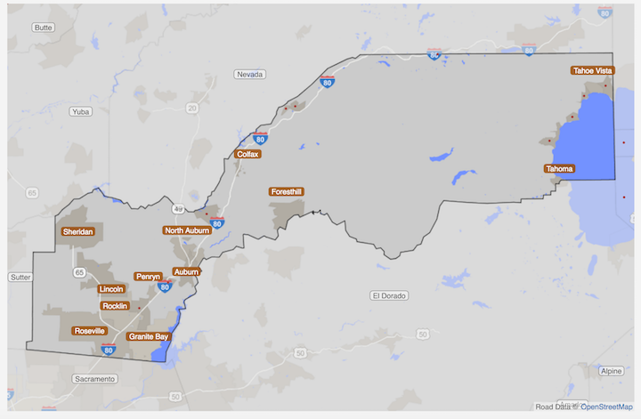

#### South Lake Tahoe, CA (96150) ZIP code map (El Dorado County)  (https://california.hometownlocator.com/)

<center>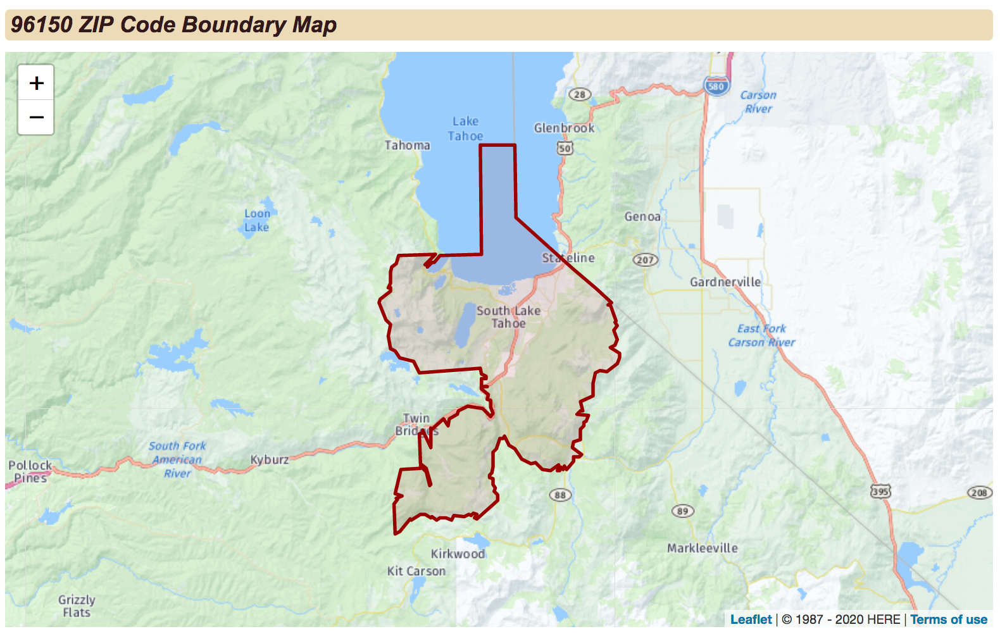

#### Rescue, CA (95672) ZIP code map (El Dorado County)  (https://california.hometownlocator.com/)

<center>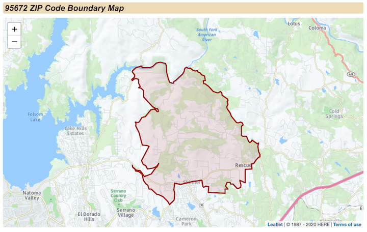

#### Auburn, CA (95602) ZIP code map (Placer County) (https://california.hometownlocator.com/)

<center>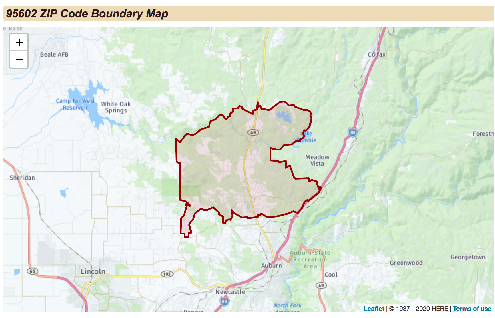

#### Diamond Springs, CA (95619) ZIP code map (El Dorado County) (https://california.hometownlocator.com/)

<center>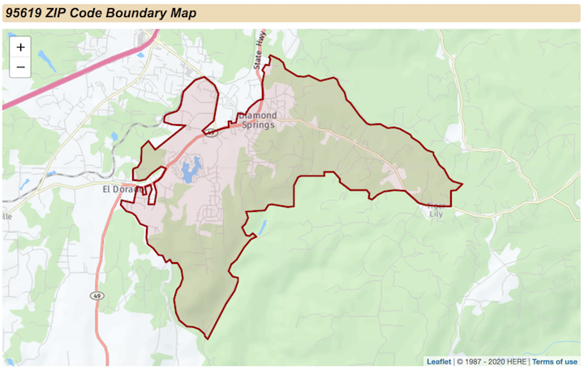

#### Granite Bay, CA (95746) ZIP code map (Placer County) (https://california.hometownlocator.com/)

<center>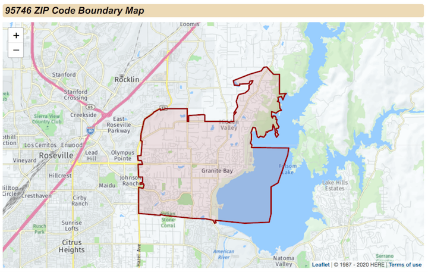


```python

```


```python

```

# Notebook spacer


# Notebook spacer


# Notebook spacer

