# Housing price prediction by ZIP Code:  Analyzing time series data using ARIMA

## Overview

This project analyzed Zillow monthly housing values for over 14,000 ZIP Codes in the U.S. from 04/01/1996 to 03/01/2018 to predict housing values going out 18 months from March 2018.  The project was one of five I completed to graduate from the Flatiron School's Data Science intensive boot camp and required identifying the 5 "best" (as defined by the student) ZIP codes for investment and developing support for these recommendations to a hypothetical client (e.g., a real estate investment trust).  

_**Note:**  This project was completed in early 2020, prior to the Covid-19 pandemic.  Obviously, the Covid-19 pandemic created uncharacteristic housing market fluctuations that could not have been predicted in this analysis.  Time permitting, I will revisit this analysis and see how market prices changed over the prediction period, and what predictions might be made for the next 18 months._   --Sept. 29, 2022

## My focus:  Sacramento Metropolitan Area

Because the Sacramento area has experience steady growth over the last few decades, and because I lived in the region when I performed the analysis, my hypothetical investment group focused on the Sacramento Metropolitan Area.  

The complete Jupyter notebook containing all analyses is available
[here.](https://github.com/gdurante2019/Sac_ZIPS_home_prices_ARIMA/blob/master/ARIMA_home_prices_sactoregion_040520.ipynb)

### Sacramento metro area (counties)

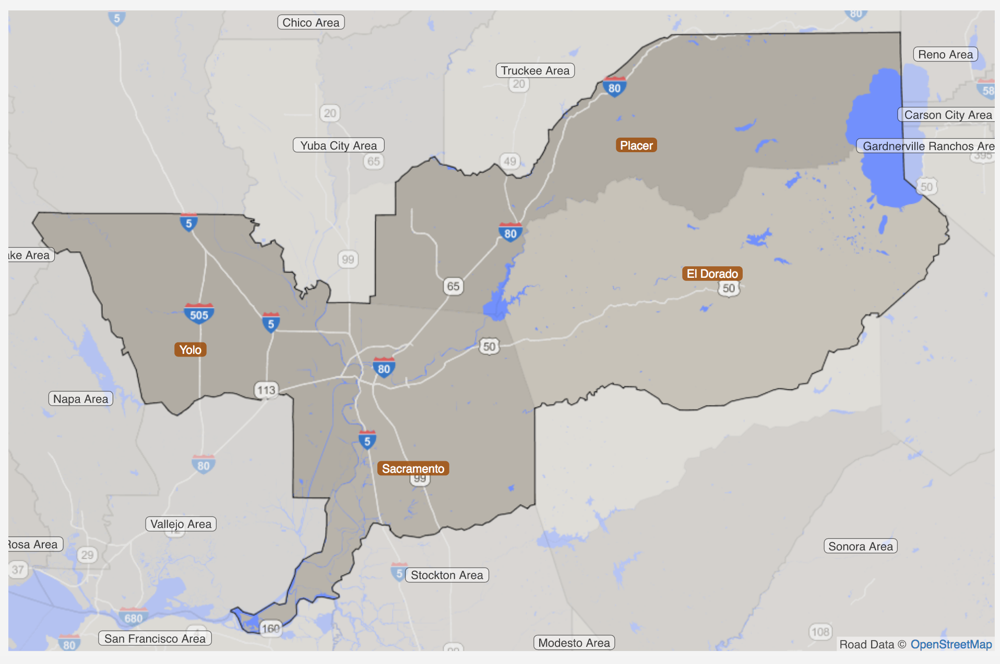

### Sacramento metro area (cities)

## Methodology

### Visualization of values by city and/or ZIP code, as well as of predictions of model

I developed iterative functions to visualize values by city within a metro area and across zip codes within cities in a metro area, using lists and dictionaries to iterate through the geographic areas of interest.  Since the Sacramento metro area was the focus of my analysis, I looked at plots by city in the region, and also by ZIP code, by city.  (Examples of these plots for the Sacramento area are below; for all plots, see the Jupyter notebook in this repo.  Given the file size of the notebook, it may be necessary to download it to your machine first.)  However, this approach can be used to look at average housing values across counties or entire metro areas.   

#### Examples of iterative plotting of cities containing multiple ZIP codes (compare to the plots by ZIP code, by city, that follow)

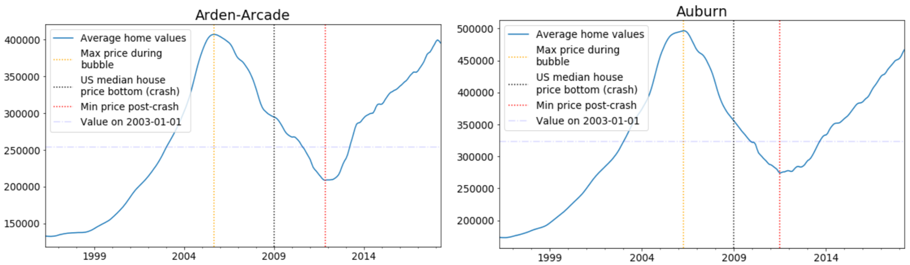

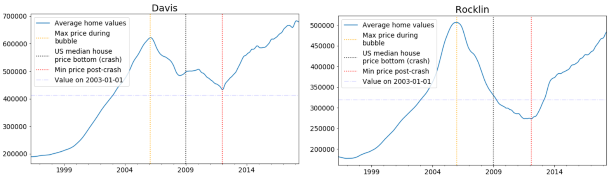

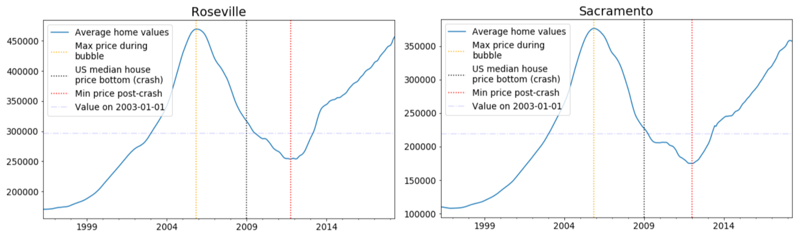

Compare the city-wide average plots above to the plots by city, by ZIP code, below:

#### Examples of iterative plotting of ZIP codes by city in the Sacramento area

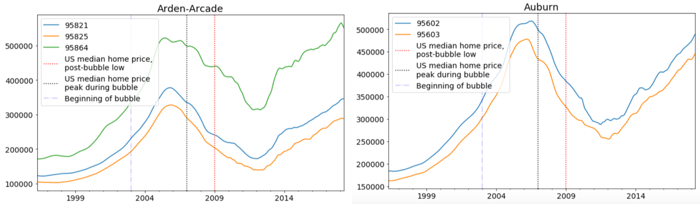

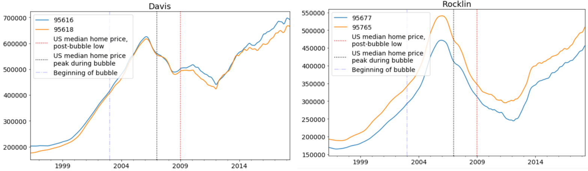

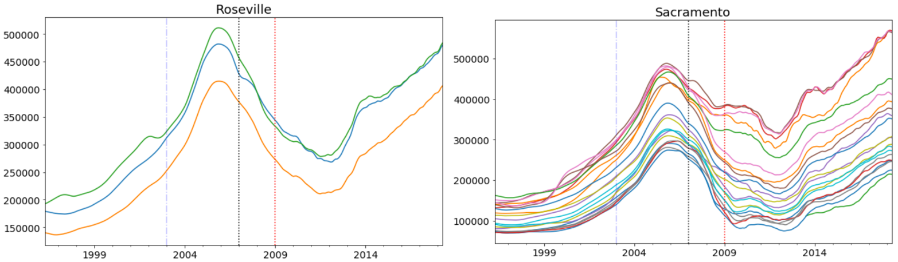

As the plot of ZIP codes in the City of Sacramento demonstrates, the value of plotting all ZIP codes in one figure may not be very useful if there are a large number of ZIP codes in that area.  In the case of Sacramento, I used the same iterative function to plot all of the ZIP codes within the City of Sacramento on different plots.  In this way, I could visually compare the different ZIP codes side-by-side as another tool for deciding which ZIP codes to focus on further.  

##### Comparing ZIP codes within cities to city-wide average plots:

* Some cities, such as Arden-Arcade and Sacramento, show a wide range of home values by ZIP code within the city.  While not too surprising for a larger city such as Sacramento, it does stand out a bit more for Arden-Arcade, which only encompasses 3 ZIP codes.  (For a contrasting example, see the plot for the ZIP codes in the City of Davis; both the shape of the curve and the home values represented are nearly identical.)

* Typically, ZIP code plots within cities generally have very similar shapes; in turn, these plots look pretty similar to the city-wide plot.  Thus, a plot of the average values at the city level does a pretty good job of reflecting the *shape* of the ZIP code plots for that city.  

* At the same time, however, it's worth noting that there are exceptions to the general observation that value plots by ZIP code within a city have very similar shapes.  
  * In the Arden-Arcade plot, the top curve has a certain lumpiness that is not seen in the lower two curves.  
  * I observed this dissimilarity in a few different cities, including Tahoe City (which, similar to Arden-Arcade, had one relatively affordable ZIP code plot that was fairly smooth, while the other more expensive ZIP code plot was considerably lumpier).  
  * One possible explanation for this lumpiness could be speculative investment in more desireable ZIP codes that could increase price volatility.

Using these and other visualization approaches, I identified 20 ZIP codes in the Sacramento region of possible interest.  Time series analysis of these 20 ZIP codes revealed 5 with predicted returns around 10% or above, with relatively limited downside, and potentially strong upside.    

#### Plots of semi-finalist ZIP codes

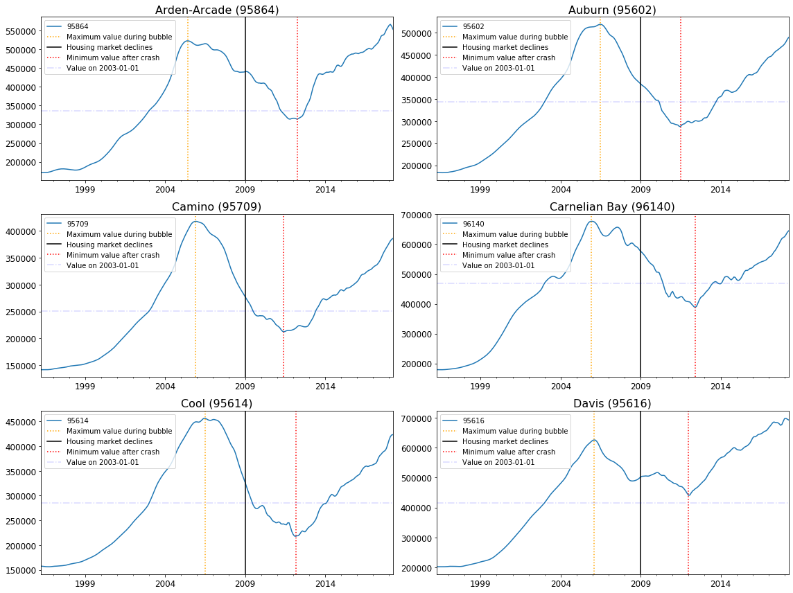

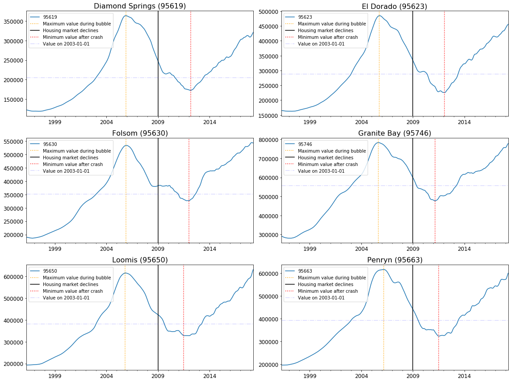

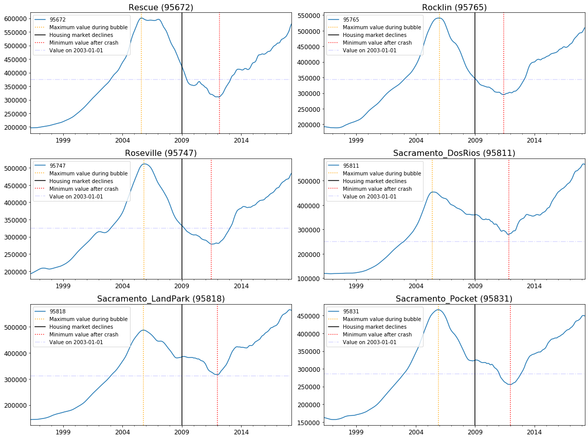

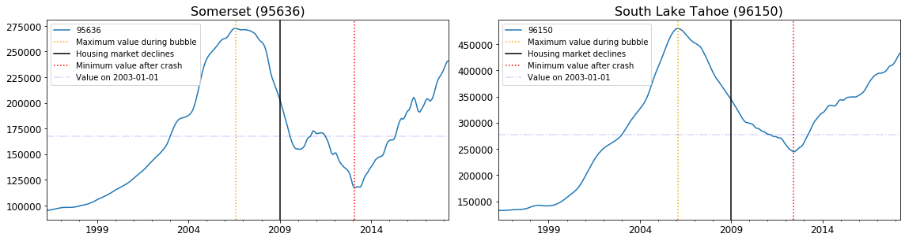

### ARIMA modeling:  parameter-tuning, modeling, and forecasting prices 24 months into the future

#### Selecting ARIMA modeling approach for housing time series data

Analyzing time series data requires a number of decisions around data manipulation and modeling tool selection.  In the case of this housing data, the effects of seasonality on home values turned out to be negligible, so I did not include a seasonality parameter in the modeling.  However, the optimization of other parameters--autoregression ('AR'), differencing/integrating ('I'), and analyzing moving averages ('MA')--was important for creating a more accurate model with better predictive ability (the ARIMA model).  

#### Parameter tuning

Combining the three elements of ARIMA modeling requires selecting values for each of three parameters: 1) the number of lag periods (p); 2) the steps between periods for differencing (d); and 3) the number of periods to include for moving average calculations (q).  
* While certain visualization methods, such as ACF and PACF, can provide some clues for selecting good values for the parameters, there is still some guesswork and additional analyses involved in an effort to fine-tune parameters (Reference:  https://online.stat.psu.edu/stat510/lesson/3/3.1).  
* Another way to identify the best parameters is to take a brute-force computational approach:  for each parameter, select the number of lags or periods, then run the model for each combination and select the model with the lowest MSE.  
  * As the number of ZIP codes I analyzed ended up being rather large (~20), this is the approach I utilized.  This ensures consistency of analysis across ZIP codes--as opposed to selecting multiple parameter candidates based on a combination of plots and trial-and-error analyses.
  * While it takes quite some time to run the optimization function, once the optimal p,d,q parameters have been provided, the rest of the modeling and forecasting process is very fast.  

#### Example output from parameter tuning function

The output below is from a function that runs all possible combinations of p, d, and q through the ARIMA modeling function in statsmodels and prints the MSE for each combination.  The function identifies the p,d,q combination that results in the lowest MSE; this combination represents the optimized parameters for the best model fit. 

In the example of the City of Davis, the best p,d,q combination is (2,1,2).

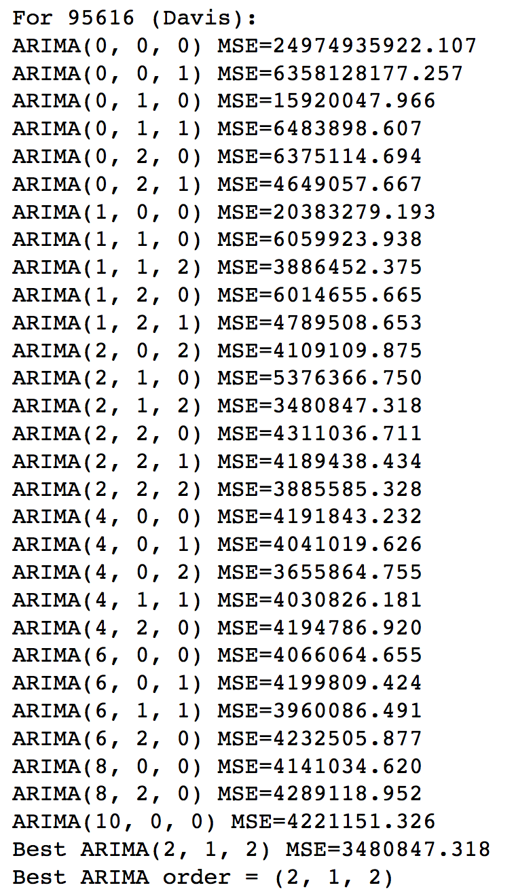

#### ARIMA modeling and forecasting

Once I obtained the optimal p,d,q parameters, it was a relatively straightforward process to:
* Fit the ARIMA model
* Generate forecast results for each period (month) in the forecast time frame (24 months), along with values 2 confidence intervals above and below the predicted values
* Create a new dataframe containing historical values and predicted values (and the best-case and worst-case values provided by the confidence intervals)
* Plot the historical and predicted values, along with confidence intervals
* Compute and print out the percentage changes from the most recent historical value to the value predicted at the end of the forecast period, along with the best- and worst-case scenario values
* Append all values to lists set up to capture these key values from each ZIP code, so that a dataframe with all results by ZIP code can be created after performing the analyses.

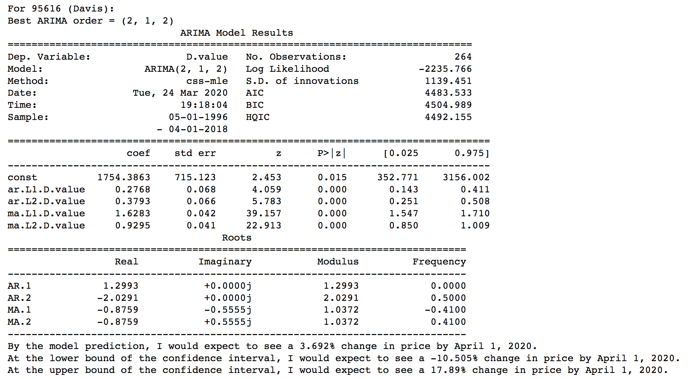

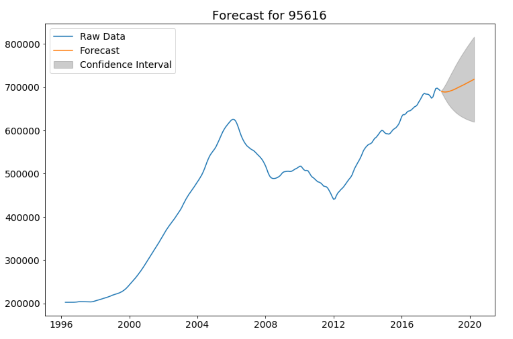

### Making the final decision regarding which 5 ZIP codes to recommend

While the predicted returns were of obvious importance to identifying the best investment opportunities, I also took into account the worst-case scenario returns, the best-case scenario returns, the population in the ZIP code, the geographic location of the ZIP code, and personal knowledge of the area to inform my decision-making process.  More information is provided in the "Decision-making process" section of the "Recommended ZIP codes" section at the end of Jupyter notebook containing the analysis.

Interestingly, I found that the top ZIP codes in terms of predicted returns (~10% or greater over the 24-month period) generally provided generous upside potential return with an acceptable downside (worst-case scenario) risk.  

In earlier analyses, I had come across some ZIP codes with good predicted returns, but also with wide spreads between best-case and worst-case scenarios.  
* If the spread is large generally, a large potential upside (best-case scenario) may bring with it a large potential downside (worst-case scenario).  
* For many investors, the possibility of an unexpectedly high return does not outweigh the risk of a severe drop in value if the worst-case scenario materializes instead.  
* Large gains or losses suggested by best-case and worst-case scenarios imply high volatility--something to be avoided unless the investor is risk-tolerant.

The complete Jupyter notebook containing all analyses is available
[here.](https://github.com/gdurante2019/dsc-mod-4-project-online-ds-sp-000/blob/master/Mod4_proj_Durante_040520.ipynb)

## Summary of results

### Summary table:  all semi-finalist ZIP codes

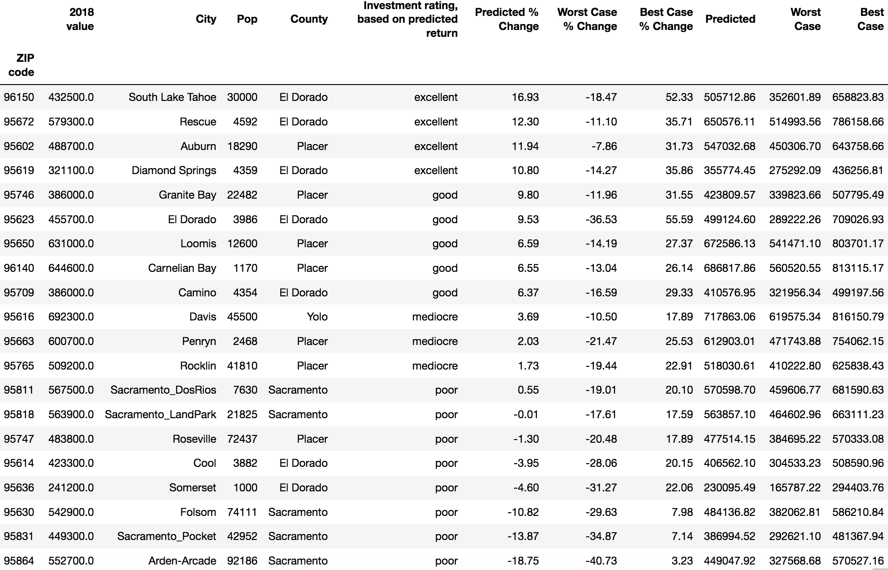

The summary table is sorted by the investment rating, which was based primarily on the percentage increase (or decrease) in value at the end of the 24-month forecast period.  The top 5 ZIP codes all have returns of ~10% or greater, with strong upside potential that is greater on a percentage basis than the downside risk of the worst-case scenario.  

Regarding the range of return between the best- and worst-case scenarios:  
* Note that the 6th ZIP code in the chart (El Dorado) has predicted returns that are similar to the 5th place ZIP in table (Granite Bay), but with a much wider range between the best-case and worst-case scenarios.  
* El Dorado's potential best-case scenario is much higher than Granite Bay's (55.6% vs. 31.5%), but the downside risk of the worst-case scenario is much worse than Granite Bay (-36.5% vs. -12%).  
* Even if El Dorado's predicted returns were slightly higher than Granite Bay, I would still have selected Granite Bay for the 5th ZIP code on the list because Granite Bay's worst-case scenario drop in value is much less than that for El Dorado.  

##### A few interesting observations about home market value curves from Mod4 Project:

* Initially, I had thought that an earlier peak might be correlated with worse predicted values, but in looking at the semi-finalists in the Sac metro region, there isn’t enough evidence to support this.  While two of the worst performers (Sacramento-DelRios and Arden-Arcade) peaked particularly early, other ZIPs with early peaks did better (e.g., Rescue, Granite Bay—two of the top 5 ZIPs), whereas some of the later-peaking ZIPs received some of the lowest ratings. 

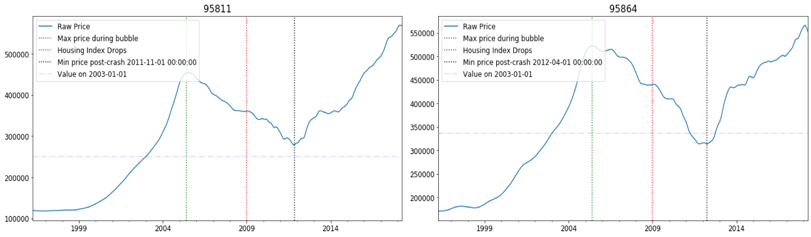

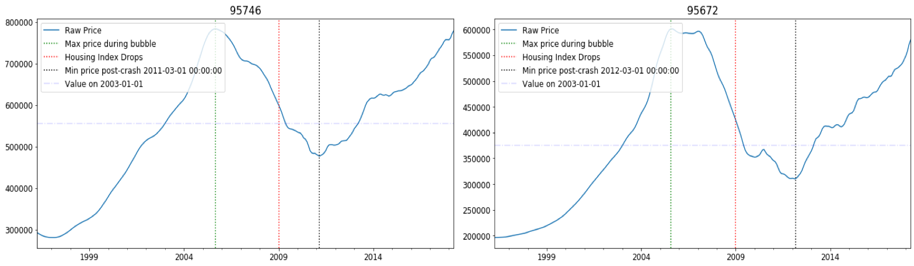

* Of the semi-finalists in the Sac metro region, ZIPs with 2018 values that were higher than the 2006-2007 peak values (e.g., Sacramento-Del Rios, Arden-Arcade), tended to have greater representation in the mediocre and lower ratings groups, whereas the top 5 ZIP codes all had 2018 valuations at or slightly lower than the 2006-2007 peak.
  * It is worth noting that there were also a number of cases where ZIPs with higher 2018 values still had good investment ratings, and also ZIPs where the 2018 values had not reached values at the height of the bubble, and yet they had mediocre or poor ratings.  
  * On the other hand, a quick review of a few other metro areas that did not experience a large drop in values during the recession, but which experienced significant market value gains during the recovery, suggests that these areas have the potential for significant continued market value gains.  It may be worth exploring the predicted values (as well as best- and worst-case scenarios) for areas with similar value plot profiles.

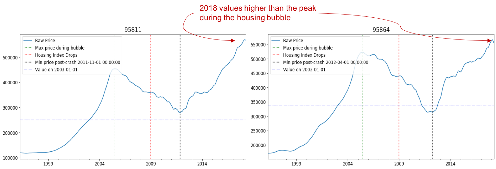

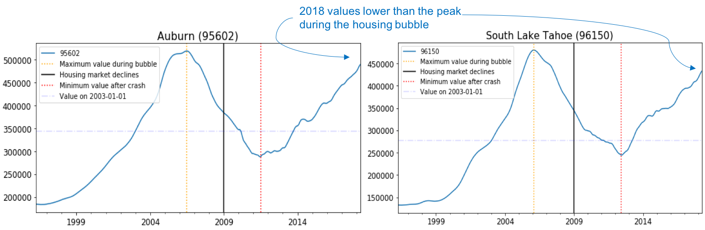

##### Two additional areas to explore regarding correlation of shape of curves and investment rating:

* Correlation, if any, between the shape of curve in the most recent 6-12 months (2017-2018) of actual housing market values
* Correlation, if any, between post-crash dip relative to 2003 values and predicted values

### Forecast plots:  Top 5 ZIP codes

#### South Lake Tahoe (96150)

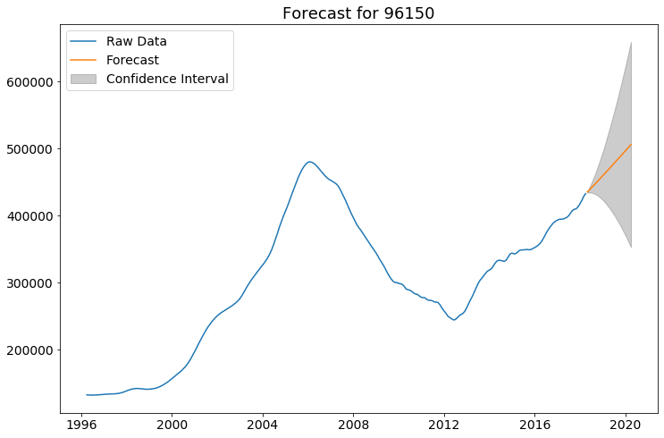

#### Rescue (95672)

#### Auburn (95602)

#### Diamond Springs (95619)

#### Granite Bay (95746)

## Possible future directions

Beyond analysis of additional ZIP codes in the Sacramento area, I've identified several other possible future directions for this work:
- While time limitations prevented a broader evaluation of investment opportunities across the country, the functions I developed allow visualizations of broader swaths of the data (e.g., values by metro area, values by city within a metro area, values by zip codes and cities within a metro area).  
  - Creating visualizations at various geographic levels was very useful for identifying patterns that could signify promising investment opportunities.  
  - From this effort, I identified some geographic areas, such as the Dallas-Fort Worth and the Pittsburg metro areas, that could be worthwhile to explore in future efforts.  
- It could be interesting and potentially valuable to do some backtesting on the model to see how well it predicts the last 24 months for which we have data (May 2016 through April 2018).
- Analyzing shorter time frames (e.g., 2013-2018)
- Scaling investment by population size 
- Construct a basket of investments (e.g., $10M, weighted by ZIP population?)

The notebook containing the US-metro level visualizations can be found [here.](https://github.com/gdurante2019/Sac_ZIPS_home_prices_ARIMA/blob/master/ARIMA_Home_Prices_Metros_011021.ipynb)

