# Mod 4 Project - Gina Durante

## Overview

The Module 4 Project in the Flatiron School Data Science Version 2 Curriculum is meant to provide students with experience in working with time series data--in this case, monthly housing values from 04/01/1996 to 03/01/2018 for over 14,000 ZIP Codes in the U.S.  Skill sets required to complete this project include dataframe manipulation, data cleaning, data visualization, and time series analysis, and other areas (e.g., using github, Jupyter notebooks for data science projects, and writing and posting a blog).  

## Project topic

The project asks the student to identify the 5 "best" ZIP codes for investment, as defined by the student, and develop support for these recommendations to a hypothetical client (e.g., a real estate investment trust).  The student must develop a methodology for evaluating ZIP codes as potential investment targets and support these findings through a technical Jupyter notebook, a non-technical PowerPoint presentation, and a blog post.  

## My focus:  Sacramento metro area

Because of the size of the dataset (over 14000 zip codes, each with over 260 monthly values), and because of time constraints, I primarily focused on the Sacramento metro area, where I have lived for a number of years.  I developed functions to visualize values averaged by city within a metro area, and across zip codes within cities in a metro area, using lists and dictionaries to iterate over the areas of interest.  Using this approach, I identified a subset of ZIP codes in the Sacramento region of possible interest.  I was able to run analyses of 19 ZIP codes, and identified 11 finalists.  From those, I selected 5 that I thought provided good (potentially great) returns, while limiting downside risk.  One of those ZIP codes was in El Dorado County, and the other four were in Placer County.  While there may be promising ZIP codes in both Sacramento and Yolo Counties, Sacramento City ZIP codes that I analyzed were not as competitive as those of Placer County.  I only analyzed one ZIP code in Yolo County (95616 in Davis), though others looked similar in terms of their pattern and trends.  It would probably be worthwhile to analyze one of the two ZIP codes in West Sacramento, as West Sac is an area that has been on the upswing for several years.  


#### Sacramento metro area (counties)

<center>

#### Sacramento metro area (cities)

<center>

## Possible future directions

While time limitations prevented a broader evaluation of investment opportunities across the country, the functions I developed allow visualizations of broader swaths of the data (e.g., values by metro area, values by city within a metro area, values by zip codes and cities within a metro area).  Creating visualizations at various geographic levels was very useful for identifying patterns that could signify promising investment opportunities.  From this effort, I identified some geographic areas that could be worthwhile to explore in future efforts.  

## The notebook

The notebook below is what I used for performing my analyses and arriving at results.  Thus, it is technical and includes all code.  It will most likely be revised over time, so individuals interested in this work should check back periodically.  At the very end of this notebook is a table (small dataframe) that summarizes my analyses.  

# Step 1: Load the Data/Filtering for Chosen Zipcodes


```python
import numpy as np
import pandas as pd
import matplotlib 
import matplotlib.pyplot as plt
import matplotlib as mpl
%matplotlib inline
import seaborn as sn
```


```python
pd.set_option("display.max_rows", 1000)
```


```python
pd.get_option("display.max_rows")
```


    1000


```python
df = pd.read_csv('zillow_data.csv')
```


```python
df.head()
```


<div>
<style scoped>
    .dataframe tbody tr th:only-of-type {
        vertical-align: middle;
    }

    .dataframe tbody tr th {
        vertical-align: top;
    }

    .dataframe thead th {
        text-align: right;
    }
</style>
<table border="1" class="dataframe">
  <thead>
    <tr style="text-align: right;">
      <th></th>
      <th>RegionID</th>
      <th>RegionName</th>
      <th>City</th>
      <th>State</th>
      <th>Metro</th>
      <th>CountyName</th>
      <th>SizeRank</th>
      <th>1996-04</th>
      <th>1996-05</th>
      <th>1996-06</th>
      <th>...</th>
      <th>2017-07</th>
      <th>2017-08</th>
      <th>2017-09</th>
      <th>2017-10</th>
      <th>2017-11</th>
      <th>2017-12</th>
      <th>2018-01</th>
      <th>2018-02</th>
      <th>2018-03</th>
      <th>2018-04</th>
    </tr>
  </thead>
  <tbody>
    <tr>
      <td>0</td>
      <td>84654</td>
      <td>60657</td>
      <td>Chicago</td>
      <td>IL</td>
      <td>Chicago</td>
      <td>Cook</td>
      <td>1</td>
      <td>334200.0</td>
      <td>335400.0</td>
      <td>336500.0</td>
      <td>...</td>
      <td>1005500</td>
      <td>1007500</td>
      <td>1007800</td>
      <td>1009600</td>
      <td>1013300</td>
      <td>1018700</td>
      <td>1024400</td>
      <td>1030700</td>
      <td>1033800</td>
      <td>1030600</td>
    </tr>
    <tr>
      <td>1</td>
      <td>90668</td>
      <td>75070</td>
      <td>McKinney</td>
      <td>TX</td>
      <td>Dallas-Fort Worth</td>
      <td>Collin</td>
      <td>2</td>
      <td>235700.0</td>
      <td>236900.0</td>
      <td>236700.0</td>
      <td>...</td>
      <td>308000</td>
      <td>310000</td>
      <td>312500</td>
      <td>314100</td>
      <td>315000</td>
      <td>316600</td>
      <td>318100</td>
      <td>319600</td>
      <td>321100</td>
      <td>321800</td>
    </tr>
    <tr>
      <td>2</td>
      <td>91982</td>
      <td>77494</td>
      <td>Katy</td>
      <td>TX</td>
      <td>Houston</td>
      <td>Harris</td>
      <td>3</td>
      <td>210400.0</td>
      <td>212200.0</td>
      <td>212200.0</td>
      <td>...</td>
      <td>321000</td>
      <td>320600</td>
      <td>320200</td>
      <td>320400</td>
      <td>320800</td>
      <td>321200</td>
      <td>321200</td>
      <td>323000</td>
      <td>326900</td>
      <td>329900</td>
    </tr>
    <tr>
      <td>3</td>
      <td>84616</td>
      <td>60614</td>
      <td>Chicago</td>
      <td>IL</td>
      <td>Chicago</td>
      <td>Cook</td>
      <td>4</td>
      <td>498100.0</td>
      <td>500900.0</td>
      <td>503100.0</td>
      <td>...</td>
      <td>1289800</td>
      <td>1287700</td>
      <td>1287400</td>
      <td>1291500</td>
      <td>1296600</td>
      <td>1299000</td>
      <td>1302700</td>
      <td>1306400</td>
      <td>1308500</td>
      <td>1307000</td>
    </tr>
    <tr>
      <td>4</td>
      <td>93144</td>
      <td>79936</td>
      <td>El Paso</td>
      <td>TX</td>
      <td>El Paso</td>
      <td>El Paso</td>
      <td>5</td>
      <td>77300.0</td>
      <td>77300.0</td>
      <td>77300.0</td>
      <td>...</td>
      <td>119100</td>
      <td>119400</td>
      <td>120000</td>
      <td>120300</td>
      <td>120300</td>
      <td>120300</td>
      <td>120300</td>
      <td>120500</td>
      <td>121000</td>
      <td>121500</td>
    </tr>
  </tbody>
</table>
<p>5 rows × 272 columns</p>
</div>


```python
df.loc[df.RegionName == 95616]     # also acceptable:  df.loc[df['RegionName'] == 95616]

```


<div>
<style scoped>
    .dataframe tbody tr th:only-of-type {
        vertical-align: middle;
    }

    .dataframe tbody tr th {
        vertical-align: top;
    }

    .dataframe thead th {
        text-align: right;
    }
</style>
<table border="1" class="dataframe">
  <thead>
    <tr style="text-align: right;">
      <th></th>
      <th>RegionID</th>
      <th>RegionName</th>
      <th>City</th>
      <th>State</th>
      <th>Metro</th>
      <th>CountyName</th>
      <th>SizeRank</th>
      <th>1996-04</th>
      <th>1996-05</th>
      <th>1996-06</th>
      <th>...</th>
      <th>2017-07</th>
      <th>2017-08</th>
      <th>2017-09</th>
      <th>2017-10</th>
      <th>2017-11</th>
      <th>2017-12</th>
      <th>2018-01</th>
      <th>2018-02</th>
      <th>2018-03</th>
      <th>2018-04</th>
    </tr>
  </thead>
  <tbody>
    <tr>
      <td>954</td>
      <td>98312</td>
      <td>95616</td>
      <td>Davis</td>
      <td>CA</td>
      <td>Sacramento</td>
      <td>Yolo</td>
      <td>955</td>
      <td>202500.0</td>
      <td>202500.0</td>
      <td>202500.0</td>
      <td>...</td>
      <td>683600</td>
      <td>682800</td>
      <td>679400</td>
      <td>674400</td>
      <td>677200</td>
      <td>687700</td>
      <td>696700</td>
      <td>697500</td>
      <td>695000</td>
      <td>692300</td>
    </tr>
  </tbody>
</table>
<p>1 rows × 272 columns</p>
</div>


# Step 2: Data Preprocessing

## Convert time data type to datetime format


```python
def get_datetimes(df):
    return pd.to_datetime(df.columns.values[7:], format='%Y-%m', errors = 'raise')
```


```python
get_datetimes(df)
```


    DatetimeIndex(['1996-04-01', '1996-05-01', '1996-06-01', '1996-07-01',
                   '1996-08-01', '1996-09-01', '1996-10-01', '1996-11-01',
                   '1996-12-01', '1997-01-01',
                   ...
                   '2017-07-01', '2017-08-01', '2017-09-01', '2017-10-01',
                   '2017-11-01', '2017-12-01', '2018-01-01', '2018-02-01',
                   '2018-03-01', '2018-04-01'],
                  dtype='datetime64[ns]', length=265, freq=None)


## Fix problem with ZIP codes beginning with '0'

I have surmised that RegionName is the ZIP code for each entry.  RegionName values with only 4 digits represent ZIP codes that actually begin with '0'.  So that I can work with ZIP codes in the data set, I will need to add that zero onto every 4-digit RegionName value.  Once that's completed, I'll rename this column "ZipCode".  


```python
df.head(7)
```


<div>
<style scoped>
    .dataframe tbody tr th:only-of-type {
        vertical-align: middle;
    }

    .dataframe tbody tr th {
        vertical-align: top;
    }

    .dataframe thead th {
        text-align: right;
    }
</style>
<table border="1" class="dataframe">
  <thead>
    <tr style="text-align: right;">
      <th></th>
      <th>RegionID</th>
      <th>RegionName</th>
      <th>City</th>
      <th>State</th>
      <th>Metro</th>
      <th>CountyName</th>
      <th>SizeRank</th>
      <th>1996-04</th>
      <th>1996-05</th>
      <th>1996-06</th>
      <th>...</th>
      <th>2017-07</th>
      <th>2017-08</th>
      <th>2017-09</th>
      <th>2017-10</th>
      <th>2017-11</th>
      <th>2017-12</th>
      <th>2018-01</th>
      <th>2018-02</th>
      <th>2018-03</th>
      <th>2018-04</th>
    </tr>
  </thead>
  <tbody>
    <tr>
      <td>0</td>
      <td>84654</td>
      <td>60657</td>
      <td>Chicago</td>
      <td>IL</td>
      <td>Chicago</td>
      <td>Cook</td>
      <td>1</td>
      <td>334200.0</td>
      <td>335400.0</td>
      <td>336500.0</td>
      <td>...</td>
      <td>1005500</td>
      <td>1007500</td>
      <td>1007800</td>
      <td>1009600</td>
      <td>1013300</td>
      <td>1018700</td>
      <td>1024400</td>
      <td>1030700</td>
      <td>1033800</td>
      <td>1030600</td>
    </tr>
    <tr>
      <td>1</td>
      <td>90668</td>
      <td>75070</td>
      <td>McKinney</td>
      <td>TX</td>
      <td>Dallas-Fort Worth</td>
      <td>Collin</td>
      <td>2</td>
      <td>235700.0</td>
      <td>236900.0</td>
      <td>236700.0</td>
      <td>...</td>
      <td>308000</td>
      <td>310000</td>
      <td>312500</td>
      <td>314100</td>
      <td>315000</td>
      <td>316600</td>
      <td>318100</td>
      <td>319600</td>
      <td>321100</td>
      <td>321800</td>
    </tr>
    <tr>
      <td>2</td>
      <td>91982</td>
      <td>77494</td>
      <td>Katy</td>
      <td>TX</td>
      <td>Houston</td>
      <td>Harris</td>
      <td>3</td>
      <td>210400.0</td>
      <td>212200.0</td>
      <td>212200.0</td>
      <td>...</td>
      <td>321000</td>
      <td>320600</td>
      <td>320200</td>
      <td>320400</td>
      <td>320800</td>
      <td>321200</td>
      <td>321200</td>
      <td>323000</td>
      <td>326900</td>
      <td>329900</td>
    </tr>
    <tr>
      <td>3</td>
      <td>84616</td>
      <td>60614</td>
      <td>Chicago</td>
      <td>IL</td>
      <td>Chicago</td>
      <td>Cook</td>
      <td>4</td>
      <td>498100.0</td>
      <td>500900.0</td>
      <td>503100.0</td>
      <td>...</td>
      <td>1289800</td>
      <td>1287700</td>
      <td>1287400</td>
      <td>1291500</td>
      <td>1296600</td>
      <td>1299000</td>
      <td>1302700</td>
      <td>1306400</td>
      <td>1308500</td>
      <td>1307000</td>
    </tr>
    <tr>
      <td>4</td>
      <td>93144</td>
      <td>79936</td>
      <td>El Paso</td>
      <td>TX</td>
      <td>El Paso</td>
      <td>El Paso</td>
      <td>5</td>
      <td>77300.0</td>
      <td>77300.0</td>
      <td>77300.0</td>
      <td>...</td>
      <td>119100</td>
      <td>119400</td>
      <td>120000</td>
      <td>120300</td>
      <td>120300</td>
      <td>120300</td>
      <td>120300</td>
      <td>120500</td>
      <td>121000</td>
      <td>121500</td>
    </tr>
    <tr>
      <td>5</td>
      <td>91733</td>
      <td>77084</td>
      <td>Houston</td>
      <td>TX</td>
      <td>Houston</td>
      <td>Harris</td>
      <td>6</td>
      <td>95000.0</td>
      <td>95200.0</td>
      <td>95400.0</td>
      <td>...</td>
      <td>157900</td>
      <td>158700</td>
      <td>160200</td>
      <td>161900</td>
      <td>162800</td>
      <td>162800</td>
      <td>162800</td>
      <td>162900</td>
      <td>163500</td>
      <td>164300</td>
    </tr>
    <tr>
      <td>6</td>
      <td>61807</td>
      <td>10467</td>
      <td>New York</td>
      <td>NY</td>
      <td>New York</td>
      <td>Bronx</td>
      <td>7</td>
      <td>152900.0</td>
      <td>152700.0</td>
      <td>152600.0</td>
      <td>...</td>
      <td>394400</td>
      <td>400000</td>
      <td>407300</td>
      <td>411600</td>
      <td>413200</td>
      <td>414300</td>
      <td>413900</td>
      <td>411400</td>
      <td>413200</td>
      <td>417900</td>
    </tr>
  </tbody>
</table>
<p>7 rows × 272 columns</p>
</div>


```python
# df.RegionName.sort_values().head(10)

df.sort_values(by="RegionName").head(7)
```


<div>
<style scoped>
    .dataframe tbody tr th:only-of-type {
        vertical-align: middle;
    }

    .dataframe tbody tr th {
        vertical-align: top;
    }

    .dataframe thead th {
        text-align: right;
    }
</style>
<table border="1" class="dataframe">
  <thead>
    <tr style="text-align: right;">
      <th></th>
      <th>RegionID</th>
      <th>RegionName</th>
      <th>City</th>
      <th>State</th>
      <th>Metro</th>
      <th>CountyName</th>
      <th>SizeRank</th>
      <th>1996-04</th>
      <th>1996-05</th>
      <th>1996-06</th>
      <th>...</th>
      <th>2017-07</th>
      <th>2017-08</th>
      <th>2017-09</th>
      <th>2017-10</th>
      <th>2017-11</th>
      <th>2017-12</th>
      <th>2018-01</th>
      <th>2018-02</th>
      <th>2018-03</th>
      <th>2018-04</th>
    </tr>
  </thead>
  <tbody>
    <tr>
      <td>5850</td>
      <td>58196</td>
      <td>1001</td>
      <td>Agawam</td>
      <td>MA</td>
      <td>Springfield</td>
      <td>Hampden</td>
      <td>5851</td>
      <td>113100.0</td>
      <td>112800.0</td>
      <td>112600.0</td>
      <td>...</td>
      <td>213900</td>
      <td>215700</td>
      <td>218200</td>
      <td>220100</td>
      <td>221100</td>
      <td>221700</td>
      <td>221700</td>
      <td>221700</td>
      <td>222700</td>
      <td>223600</td>
    </tr>
    <tr>
      <td>4199</td>
      <td>58197</td>
      <td>1002</td>
      <td>Amherst</td>
      <td>MA</td>
      <td>Springfield</td>
      <td>Hampshire</td>
      <td>4200</td>
      <td>161000.0</td>
      <td>160100.0</td>
      <td>159300.0</td>
      <td>...</td>
      <td>333700</td>
      <td>334800</td>
      <td>336700</td>
      <td>338900</td>
      <td>340400</td>
      <td>342000</td>
      <td>344500</td>
      <td>347400</td>
      <td>350600</td>
      <td>353300</td>
    </tr>
    <tr>
      <td>11213</td>
      <td>58200</td>
      <td>1005</td>
      <td>Barre</td>
      <td>MA</td>
      <td>Worcester</td>
      <td>Worcester</td>
      <td>11214</td>
      <td>103100.0</td>
      <td>103400.0</td>
      <td>103600.0</td>
      <td>...</td>
      <td>205600</td>
      <td>206800</td>
      <td>208800</td>
      <td>210400</td>
      <td>211300</td>
      <td>213300</td>
      <td>215600</td>
      <td>217900</td>
      <td>219500</td>
      <td>220700</td>
    </tr>
    <tr>
      <td>6850</td>
      <td>58201</td>
      <td>1007</td>
      <td>Belchertown</td>
      <td>MA</td>
      <td>Springfield</td>
      <td>Hampshire</td>
      <td>6851</td>
      <td>133400.0</td>
      <td>132700.0</td>
      <td>132000.0</td>
      <td>...</td>
      <td>266100</td>
      <td>266300</td>
      <td>267000</td>
      <td>267500</td>
      <td>268000</td>
      <td>268100</td>
      <td>268100</td>
      <td>268800</td>
      <td>270000</td>
      <td>270600</td>
    </tr>
    <tr>
      <td>14547</td>
      <td>58202</td>
      <td>1008</td>
      <td>Blandford</td>
      <td>MA</td>
      <td>Springfield</td>
      <td>Hampden</td>
      <td>14548</td>
      <td>117500.0</td>
      <td>117300.0</td>
      <td>117100.0</td>
      <td>...</td>
      <td>202400</td>
      <td>202900</td>
      <td>205900</td>
      <td>208500</td>
      <td>207500</td>
      <td>205400</td>
      <td>204500</td>
      <td>206800</td>
      <td>210900</td>
      <td>214200</td>
    </tr>
    <tr>
      <td>11702</td>
      <td>58204</td>
      <td>1010</td>
      <td>Brimfield</td>
      <td>MA</td>
      <td>Springfield</td>
      <td>Hampden</td>
      <td>11703</td>
      <td>115800.0</td>
      <td>115700.0</td>
      <td>115500.0</td>
      <td>...</td>
      <td>246400</td>
      <td>247500</td>
      <td>249100</td>
      <td>248800</td>
      <td>245400</td>
      <td>243800</td>
      <td>244600</td>
      <td>246700</td>
      <td>248800</td>
      <td>250900</td>
    </tr>
    <tr>
      <td>14475</td>
      <td>58205</td>
      <td>1011</td>
      <td>Chester</td>
      <td>MA</td>
      <td>Springfield</td>
      <td>Hampden</td>
      <td>14476</td>
      <td>87000.0</td>
      <td>87000.0</td>
      <td>87100.0</td>
      <td>...</td>
      <td>160200</td>
      <td>156700</td>
      <td>156600</td>
      <td>157700</td>
      <td>155400</td>
      <td>151400</td>
      <td>150100</td>
      <td>150100</td>
      <td>149500</td>
      <td>149100</td>
    </tr>
  </tbody>
</table>
<p>7 rows × 272 columns</p>
</div>


```python
df['RegionName'] = df.RegionName.astype(str)
df['RegionName'].dtype

```


    dtype('O')


```python
df.rename(columns={'RegionName': 'Zip'}, inplace=True)
df.columns
df.head()
```


<div>
<style scoped>
    .dataframe tbody tr th:only-of-type {
        vertical-align: middle;
    }

    .dataframe tbody tr th {
        vertical-align: top;
    }

    .dataframe thead th {
        text-align: right;
    }
</style>
<table border="1" class="dataframe">
  <thead>
    <tr style="text-align: right;">
      <th></th>
      <th>RegionID</th>
      <th>Zip</th>
      <th>City</th>
      <th>State</th>
      <th>Metro</th>
      <th>CountyName</th>
      <th>SizeRank</th>
      <th>1996-04</th>
      <th>1996-05</th>
      <th>1996-06</th>
      <th>...</th>
      <th>2017-07</th>
      <th>2017-08</th>
      <th>2017-09</th>
      <th>2017-10</th>
      <th>2017-11</th>
      <th>2017-12</th>
      <th>2018-01</th>
      <th>2018-02</th>
      <th>2018-03</th>
      <th>2018-04</th>
    </tr>
  </thead>
  <tbody>
    <tr>
      <td>0</td>
      <td>84654</td>
      <td>60657</td>
      <td>Chicago</td>
      <td>IL</td>
      <td>Chicago</td>
      <td>Cook</td>
      <td>1</td>
      <td>334200.0</td>
      <td>335400.0</td>
      <td>336500.0</td>
      <td>...</td>
      <td>1005500</td>
      <td>1007500</td>
      <td>1007800</td>
      <td>1009600</td>
      <td>1013300</td>
      <td>1018700</td>
      <td>1024400</td>
      <td>1030700</td>
      <td>1033800</td>
      <td>1030600</td>
    </tr>
    <tr>
      <td>1</td>
      <td>90668</td>
      <td>75070</td>
      <td>McKinney</td>
      <td>TX</td>
      <td>Dallas-Fort Worth</td>
      <td>Collin</td>
      <td>2</td>
      <td>235700.0</td>
      <td>236900.0</td>
      <td>236700.0</td>
      <td>...</td>
      <td>308000</td>
      <td>310000</td>
      <td>312500</td>
      <td>314100</td>
      <td>315000</td>
      <td>316600</td>
      <td>318100</td>
      <td>319600</td>
      <td>321100</td>
      <td>321800</td>
    </tr>
    <tr>
      <td>2</td>
      <td>91982</td>
      <td>77494</td>
      <td>Katy</td>
      <td>TX</td>
      <td>Houston</td>
      <td>Harris</td>
      <td>3</td>
      <td>210400.0</td>
      <td>212200.0</td>
      <td>212200.0</td>
      <td>...</td>
      <td>321000</td>
      <td>320600</td>
      <td>320200</td>
      <td>320400</td>
      <td>320800</td>
      <td>321200</td>
      <td>321200</td>
      <td>323000</td>
      <td>326900</td>
      <td>329900</td>
    </tr>
    <tr>
      <td>3</td>
      <td>84616</td>
      <td>60614</td>
      <td>Chicago</td>
      <td>IL</td>
      <td>Chicago</td>
      <td>Cook</td>
      <td>4</td>
      <td>498100.0</td>
      <td>500900.0</td>
      <td>503100.0</td>
      <td>...</td>
      <td>1289800</td>
      <td>1287700</td>
      <td>1287400</td>
      <td>1291500</td>
      <td>1296600</td>
      <td>1299000</td>
      <td>1302700</td>
      <td>1306400</td>
      <td>1308500</td>
      <td>1307000</td>
    </tr>
    <tr>
      <td>4</td>
      <td>93144</td>
      <td>79936</td>
      <td>El Paso</td>
      <td>TX</td>
      <td>El Paso</td>
      <td>El Paso</td>
      <td>5</td>
      <td>77300.0</td>
      <td>77300.0</td>
      <td>77300.0</td>
      <td>...</td>
      <td>119100</td>
      <td>119400</td>
      <td>120000</td>
      <td>120300</td>
      <td>120300</td>
      <td>120300</td>
      <td>120300</td>
      <td>120500</td>
      <td>121000</td>
      <td>121500</td>
    </tr>
  </tbody>
</table>
<p>5 rows × 272 columns</p>
</div>


```python
zips = []

for i in df['Zip']:
    if len(i) < 5:
        i = '0' + i
        zips.append(i)
    else:
        zips.append(i)

zips
df['Zip'] = pd.Series(zips)
df.sort_values(by='Zip').head()
# df.head()
```


<div>
<style scoped>
    .dataframe tbody tr th:only-of-type {
        vertical-align: middle;
    }

    .dataframe tbody tr th {
        vertical-align: top;
    }

    .dataframe thead th {
        text-align: right;
    }
</style>
<table border="1" class="dataframe">
  <thead>
    <tr style="text-align: right;">
      <th></th>
      <th>RegionID</th>
      <th>Zip</th>
      <th>City</th>
      <th>State</th>
      <th>Metro</th>
      <th>CountyName</th>
      <th>SizeRank</th>
      <th>1996-04</th>
      <th>1996-05</th>
      <th>1996-06</th>
      <th>...</th>
      <th>2017-07</th>
      <th>2017-08</th>
      <th>2017-09</th>
      <th>2017-10</th>
      <th>2017-11</th>
      <th>2017-12</th>
      <th>2018-01</th>
      <th>2018-02</th>
      <th>2018-03</th>
      <th>2018-04</th>
    </tr>
  </thead>
  <tbody>
    <tr>
      <td>5850</td>
      <td>58196</td>
      <td>01001</td>
      <td>Agawam</td>
      <td>MA</td>
      <td>Springfield</td>
      <td>Hampden</td>
      <td>5851</td>
      <td>113100.0</td>
      <td>112800.0</td>
      <td>112600.0</td>
      <td>...</td>
      <td>213900</td>
      <td>215700</td>
      <td>218200</td>
      <td>220100</td>
      <td>221100</td>
      <td>221700</td>
      <td>221700</td>
      <td>221700</td>
      <td>222700</td>
      <td>223600</td>
    </tr>
    <tr>
      <td>4199</td>
      <td>58197</td>
      <td>01002</td>
      <td>Amherst</td>
      <td>MA</td>
      <td>Springfield</td>
      <td>Hampshire</td>
      <td>4200</td>
      <td>161000.0</td>
      <td>160100.0</td>
      <td>159300.0</td>
      <td>...</td>
      <td>333700</td>
      <td>334800</td>
      <td>336700</td>
      <td>338900</td>
      <td>340400</td>
      <td>342000</td>
      <td>344500</td>
      <td>347400</td>
      <td>350600</td>
      <td>353300</td>
    </tr>
    <tr>
      <td>11213</td>
      <td>58200</td>
      <td>01005</td>
      <td>Barre</td>
      <td>MA</td>
      <td>Worcester</td>
      <td>Worcester</td>
      <td>11214</td>
      <td>103100.0</td>
      <td>103400.0</td>
      <td>103600.0</td>
      <td>...</td>
      <td>205600</td>
      <td>206800</td>
      <td>208800</td>
      <td>210400</td>
      <td>211300</td>
      <td>213300</td>
      <td>215600</td>
      <td>217900</td>
      <td>219500</td>
      <td>220700</td>
    </tr>
    <tr>
      <td>6850</td>
      <td>58201</td>
      <td>01007</td>
      <td>Belchertown</td>
      <td>MA</td>
      <td>Springfield</td>
      <td>Hampshire</td>
      <td>6851</td>
      <td>133400.0</td>
      <td>132700.0</td>
      <td>132000.0</td>
      <td>...</td>
      <td>266100</td>
      <td>266300</td>
      <td>267000</td>
      <td>267500</td>
      <td>268000</td>
      <td>268100</td>
      <td>268100</td>
      <td>268800</td>
      <td>270000</td>
      <td>270600</td>
    </tr>
    <tr>
      <td>14547</td>
      <td>58202</td>
      <td>01008</td>
      <td>Blandford</td>
      <td>MA</td>
      <td>Springfield</td>
      <td>Hampden</td>
      <td>14548</td>
      <td>117500.0</td>
      <td>117300.0</td>
      <td>117100.0</td>
      <td>...</td>
      <td>202400</td>
      <td>202900</td>
      <td>205900</td>
      <td>208500</td>
      <td>207500</td>
      <td>205400</td>
      <td>204500</td>
      <td>206800</td>
      <td>210900</td>
      <td>214200</td>
    </tr>
  </tbody>
</table>
<p>5 rows × 272 columns</p>
</div>


## Creating US dataframe (df_melt) using melt function


```python
def melt_data(df):
    melted = pd.melt(df, id_vars=['RegionID', 'Zip', 'City', 'State', 'Metro', 'CountyName', 'SizeRank'], var_name='time')
    melted['time'] = pd.to_datetime(melted['time'], infer_datetime_format=False)
    melted = melted.dropna(subset=['value'])
    return melted   
```


```python
df_melt = melt_data(df)

```


```python
df_melt.head()
```


<div>
<style scoped>
    .dataframe tbody tr th:only-of-type {
        vertical-align: middle;
    }

    .dataframe tbody tr th {
        vertical-align: top;
    }

    .dataframe thead th {
        text-align: right;
    }
</style>
<table border="1" class="dataframe">
  <thead>
    <tr style="text-align: right;">
      <th></th>
      <th>RegionID</th>
      <th>Zip</th>
      <th>City</th>
      <th>State</th>
      <th>Metro</th>
      <th>CountyName</th>
      <th>SizeRank</th>
      <th>time</th>
      <th>value</th>
    </tr>
  </thead>
  <tbody>
    <tr>
      <td>0</td>
      <td>84654</td>
      <td>60657</td>
      <td>Chicago</td>
      <td>IL</td>
      <td>Chicago</td>
      <td>Cook</td>
      <td>1</td>
      <td>1996-04-01</td>
      <td>334200.0</td>
    </tr>
    <tr>
      <td>1</td>
      <td>90668</td>
      <td>75070</td>
      <td>McKinney</td>
      <td>TX</td>
      <td>Dallas-Fort Worth</td>
      <td>Collin</td>
      <td>2</td>
      <td>1996-04-01</td>
      <td>235700.0</td>
    </tr>
    <tr>
      <td>2</td>
      <td>91982</td>
      <td>77494</td>
      <td>Katy</td>
      <td>TX</td>
      <td>Houston</td>
      <td>Harris</td>
      <td>3</td>
      <td>1996-04-01</td>
      <td>210400.0</td>
    </tr>
    <tr>
      <td>3</td>
      <td>84616</td>
      <td>60614</td>
      <td>Chicago</td>
      <td>IL</td>
      <td>Chicago</td>
      <td>Cook</td>
      <td>4</td>
      <td>1996-04-01</td>
      <td>498100.0</td>
    </tr>
    <tr>
      <td>4</td>
      <td>93144</td>
      <td>79936</td>
      <td>El Paso</td>
      <td>TX</td>
      <td>El Paso</td>
      <td>El Paso</td>
      <td>5</td>
      <td>1996-04-01</td>
      <td>77300.0</td>
    </tr>
  </tbody>
</table>
</div>


```python
df_melt.info()
```

    <class 'pandas.core.frame.DataFrame'>
    Int64Index: 3744704 entries, 0 to 3901594
    Data columns (total 9 columns):
    RegionID      int64
    Zip           object
    City          object
    State         object
    Metro         object
    CountyName    object
    SizeRank      int64
    time          datetime64[ns]
    value         float64
    dtypes: datetime64[ns](1), float64(1), int64(2), object(5)
    memory usage: 285.7+ MB


```python
df_melt.set_index('time')
```


<div>
<style scoped>
    .dataframe tbody tr th:only-of-type {
        vertical-align: middle;
    }

    .dataframe tbody tr th {
        vertical-align: top;
    }

    .dataframe thead th {
        text-align: right;
    }
</style>
<table border="1" class="dataframe">
  <thead>
    <tr style="text-align: right;">
      <th></th>
      <th>RegionID</th>
      <th>Zip</th>
      <th>City</th>
      <th>State</th>
      <th>Metro</th>
      <th>CountyName</th>
      <th>SizeRank</th>
      <th>value</th>
    </tr>
    <tr>
      <th>time</th>
      <th></th>
      <th></th>
      <th></th>
      <th></th>
      <th></th>
      <th></th>
      <th></th>
      <th></th>
    </tr>
  </thead>
  <tbody>
    <tr>
      <td>1996-04-01</td>
      <td>84654</td>
      <td>60657</td>
      <td>Chicago</td>
      <td>IL</td>
      <td>Chicago</td>
      <td>Cook</td>
      <td>1</td>
      <td>334200.0</td>
    </tr>
    <tr>
      <td>1996-04-01</td>
      <td>90668</td>
      <td>75070</td>
      <td>McKinney</td>
      <td>TX</td>
      <td>Dallas-Fort Worth</td>
      <td>Collin</td>
      <td>2</td>
      <td>235700.0</td>
    </tr>
    <tr>
      <td>1996-04-01</td>
      <td>91982</td>
      <td>77494</td>
      <td>Katy</td>
      <td>TX</td>
      <td>Houston</td>
      <td>Harris</td>
      <td>3</td>
      <td>210400.0</td>
    </tr>
    <tr>
      <td>1996-04-01</td>
      <td>84616</td>
      <td>60614</td>
      <td>Chicago</td>
      <td>IL</td>
      <td>Chicago</td>
      <td>Cook</td>
      <td>4</td>
      <td>498100.0</td>
    </tr>
    <tr>
      <td>1996-04-01</td>
      <td>93144</td>
      <td>79936</td>
      <td>El Paso</td>
      <td>TX</td>
      <td>El Paso</td>
      <td>El Paso</td>
      <td>5</td>
      <td>77300.0</td>
    </tr>
    <tr>
      <td>...</td>
      <td>...</td>
      <td>...</td>
      <td>...</td>
      <td>...</td>
      <td>...</td>
      <td>...</td>
      <td>...</td>
      <td>...</td>
    </tr>
    <tr>
      <td>2018-04-01</td>
      <td>58333</td>
      <td>01338</td>
      <td>Ashfield</td>
      <td>MA</td>
      <td>Greenfield Town</td>
      <td>Franklin</td>
      <td>14719</td>
      <td>209300.0</td>
    </tr>
    <tr>
      <td>2018-04-01</td>
      <td>59107</td>
      <td>03293</td>
      <td>Woodstock</td>
      <td>NH</td>
      <td>Claremont</td>
      <td>Grafton</td>
      <td>14720</td>
      <td>225800.0</td>
    </tr>
    <tr>
      <td>2018-04-01</td>
      <td>75672</td>
      <td>40404</td>
      <td>Berea</td>
      <td>KY</td>
      <td>Richmond</td>
      <td>Madison</td>
      <td>14721</td>
      <td>133400.0</td>
    </tr>
    <tr>
      <td>2018-04-01</td>
      <td>93733</td>
      <td>81225</td>
      <td>Mount Crested Butte</td>
      <td>CO</td>
      <td>NaN</td>
      <td>Gunnison</td>
      <td>14722</td>
      <td>664400.0</td>
    </tr>
    <tr>
      <td>2018-04-01</td>
      <td>95851</td>
      <td>89155</td>
      <td>Mesquite</td>
      <td>NV</td>
      <td>Las Vegas</td>
      <td>Clark</td>
      <td>14723</td>
      <td>357200.0</td>
    </tr>
  </tbody>
</table>
<p>3744704 rows × 8 columns</p>
</div>


```python
## Dropping RegionID:

df_melt.drop('RegionID', axis=1, inplace=True)
```


```python
df_melt.head()
```


<div>
<style scoped>
    .dataframe tbody tr th:only-of-type {
        vertical-align: middle;
    }

    .dataframe tbody tr th {
        vertical-align: top;
    }

    .dataframe thead th {
        text-align: right;
    }
</style>
<table border="1" class="dataframe">
  <thead>
    <tr style="text-align: right;">
      <th></th>
      <th>Zip</th>
      <th>City</th>
      <th>State</th>
      <th>Metro</th>
      <th>CountyName</th>
      <th>SizeRank</th>
      <th>time</th>
      <th>value</th>
    </tr>
  </thead>
  <tbody>
    <tr>
      <td>0</td>
      <td>60657</td>
      <td>Chicago</td>
      <td>IL</td>
      <td>Chicago</td>
      <td>Cook</td>
      <td>1</td>
      <td>1996-04-01</td>
      <td>334200.0</td>
    </tr>
    <tr>
      <td>1</td>
      <td>75070</td>
      <td>McKinney</td>
      <td>TX</td>
      <td>Dallas-Fort Worth</td>
      <td>Collin</td>
      <td>2</td>
      <td>1996-04-01</td>
      <td>235700.0</td>
    </tr>
    <tr>
      <td>2</td>
      <td>77494</td>
      <td>Katy</td>
      <td>TX</td>
      <td>Houston</td>
      <td>Harris</td>
      <td>3</td>
      <td>1996-04-01</td>
      <td>210400.0</td>
    </tr>
    <tr>
      <td>3</td>
      <td>60614</td>
      <td>Chicago</td>
      <td>IL</td>
      <td>Chicago</td>
      <td>Cook</td>
      <td>4</td>
      <td>1996-04-01</td>
      <td>498100.0</td>
    </tr>
    <tr>
      <td>4</td>
      <td>79936</td>
      <td>El Paso</td>
      <td>TX</td>
      <td>El Paso</td>
      <td>El Paso</td>
      <td>5</td>
      <td>1996-04-01</td>
      <td>77300.0</td>
    </tr>
  </tbody>
</table>
</div>


Dataframe is sorted by SizeRank by default.


```python
df_melt.isna().sum()
```


    Zip                0
    City               0
    State              0
    Metro         236023
    CountyName         0
    SizeRank           0
    time               0
    value              0
    dtype: int64


```python
df_melt['Metro'].fillna('Missing', inplace=True)
df_melt.isna().sum()
```


    Zip           0
    City          0
    State         0
    Metro         0
    CountyName    0
    SizeRank      0
    time          0
    value         0
    dtype: int64


```python
# Sorting by zip code, then time

df_melt.sort_values(by=['Zip', 'time'])
```


<div>
<style scoped>
    .dataframe tbody tr th:only-of-type {
        vertical-align: middle;
    }

    .dataframe tbody tr th {
        vertical-align: top;
    }

    .dataframe thead th {
        text-align: right;
    }
</style>
<table border="1" class="dataframe">
  <thead>
    <tr style="text-align: right;">
      <th></th>
      <th>Zip</th>
      <th>City</th>
      <th>State</th>
      <th>Metro</th>
      <th>CountyName</th>
      <th>SizeRank</th>
      <th>time</th>
      <th>value</th>
    </tr>
  </thead>
  <tbody>
    <tr>
      <td>5850</td>
      <td>01001</td>
      <td>Agawam</td>
      <td>MA</td>
      <td>Springfield</td>
      <td>Hampden</td>
      <td>5851</td>
      <td>1996-04-01</td>
      <td>113100.0</td>
    </tr>
    <tr>
      <td>20573</td>
      <td>01001</td>
      <td>Agawam</td>
      <td>MA</td>
      <td>Springfield</td>
      <td>Hampden</td>
      <td>5851</td>
      <td>1996-05-01</td>
      <td>112800.0</td>
    </tr>
    <tr>
      <td>35296</td>
      <td>01001</td>
      <td>Agawam</td>
      <td>MA</td>
      <td>Springfield</td>
      <td>Hampden</td>
      <td>5851</td>
      <td>1996-06-01</td>
      <td>112600.0</td>
    </tr>
    <tr>
      <td>50019</td>
      <td>01001</td>
      <td>Agawam</td>
      <td>MA</td>
      <td>Springfield</td>
      <td>Hampden</td>
      <td>5851</td>
      <td>1996-07-01</td>
      <td>112300.0</td>
    </tr>
    <tr>
      <td>64742</td>
      <td>01001</td>
      <td>Agawam</td>
      <td>MA</td>
      <td>Springfield</td>
      <td>Hampden</td>
      <td>5851</td>
      <td>1996-08-01</td>
      <td>112100.0</td>
    </tr>
    <tr>
      <td>...</td>
      <td>...</td>
      <td>...</td>
      <td>...</td>
      <td>...</td>
      <td>...</td>
      <td>...</td>
      <td>...</td>
      <td>...</td>
    </tr>
    <tr>
      <td>3835273</td>
      <td>99901</td>
      <td>Ketchikan</td>
      <td>AK</td>
      <td>Ketchikan</td>
      <td>Ketchikan Gateway</td>
      <td>7294</td>
      <td>2017-12-01</td>
      <td>291900.0</td>
    </tr>
    <tr>
      <td>3849996</td>
      <td>99901</td>
      <td>Ketchikan</td>
      <td>AK</td>
      <td>Ketchikan</td>
      <td>Ketchikan Gateway</td>
      <td>7294</td>
      <td>2018-01-01</td>
      <td>294200.0</td>
    </tr>
    <tr>
      <td>3864719</td>
      <td>99901</td>
      <td>Ketchikan</td>
      <td>AK</td>
      <td>Ketchikan</td>
      <td>Ketchikan Gateway</td>
      <td>7294</td>
      <td>2018-02-01</td>
      <td>297500.0</td>
    </tr>
    <tr>
      <td>3879442</td>
      <td>99901</td>
      <td>Ketchikan</td>
      <td>AK</td>
      <td>Ketchikan</td>
      <td>Ketchikan Gateway</td>
      <td>7294</td>
      <td>2018-03-01</td>
      <td>302100.0</td>
    </tr>
    <tr>
      <td>3894165</td>
      <td>99901</td>
      <td>Ketchikan</td>
      <td>AK</td>
      <td>Ketchikan</td>
      <td>Ketchikan Gateway</td>
      <td>7294</td>
      <td>2018-04-01</td>
      <td>305100.0</td>
    </tr>
  </tbody>
</table>
<p>3744704 rows × 8 columns</p>
</div>


Note that a few zip codes are missing; these rows were eliminated when Zip codes with NaN values in the 'value' column were dropped.


```python
df_melt.nunique()
```


    Zip           14723
    City           7554
    State            51
    Metro           702
    CountyName     1212
    SizeRank      14723
    time            265
    value         24372
    dtype: int64


### Creating new column, MetroState, to address duplicate metro names in different states (e.g., Aberdeen in multiple states)


```python
df_melt['MetroState'] = df_melt['Metro'] + ' ' + df_melt['State']
```


```python
df_melt.head()
```


<div>
<style scoped>
    .dataframe tbody tr th:only-of-type {
        vertical-align: middle;
    }

    .dataframe tbody tr th {
        vertical-align: top;
    }

    .dataframe thead th {
        text-align: right;
    }
</style>
<table border="1" class="dataframe">
  <thead>
    <tr style="text-align: right;">
      <th></th>
      <th>Zip</th>
      <th>City</th>
      <th>State</th>
      <th>Metro</th>
      <th>CountyName</th>
      <th>SizeRank</th>
      <th>time</th>
      <th>value</th>
      <th>MetroState</th>
    </tr>
  </thead>
  <tbody>
    <tr>
      <td>0</td>
      <td>60657</td>
      <td>Chicago</td>
      <td>IL</td>
      <td>Chicago</td>
      <td>Cook</td>
      <td>1</td>
      <td>1996-04-01</td>
      <td>334200.0</td>
      <td>Chicago IL</td>
    </tr>
    <tr>
      <td>1</td>
      <td>75070</td>
      <td>McKinney</td>
      <td>TX</td>
      <td>Dallas-Fort Worth</td>
      <td>Collin</td>
      <td>2</td>
      <td>1996-04-01</td>
      <td>235700.0</td>
      <td>Dallas-Fort Worth TX</td>
    </tr>
    <tr>
      <td>2</td>
      <td>77494</td>
      <td>Katy</td>
      <td>TX</td>
      <td>Houston</td>
      <td>Harris</td>
      <td>3</td>
      <td>1996-04-01</td>
      <td>210400.0</td>
      <td>Houston TX</td>
    </tr>
    <tr>
      <td>3</td>
      <td>60614</td>
      <td>Chicago</td>
      <td>IL</td>
      <td>Chicago</td>
      <td>Cook</td>
      <td>4</td>
      <td>1996-04-01</td>
      <td>498100.0</td>
      <td>Chicago IL</td>
    </tr>
    <tr>
      <td>4</td>
      <td>79936</td>
      <td>El Paso</td>
      <td>TX</td>
      <td>El Paso</td>
      <td>El Paso</td>
      <td>5</td>
      <td>1996-04-01</td>
      <td>77300.0</td>
      <td>El Paso TX</td>
    </tr>
  </tbody>
</table>
</div>


# Step 3A:  Exploratory Data Analysis--Creating dataframes of values by different geographic units

## Creating US dataframes 

### Creating df_metro (US metro df) with monthly values by Zip


```python
df_melt.set_index('time', inplace=True)
```


```python
df_melt.head()
```


<div>
<style scoped>
    .dataframe tbody tr th:only-of-type {
        vertical-align: middle;
    }

    .dataframe tbody tr th {
        vertical-align: top;
    }

    .dataframe thead th {
        text-align: right;
    }
</style>
<table border="1" class="dataframe">
  <thead>
    <tr style="text-align: right;">
      <th></th>
      <th>Zip</th>
      <th>City</th>
      <th>State</th>
      <th>Metro</th>
      <th>CountyName</th>
      <th>SizeRank</th>
      <th>value</th>
      <th>MetroState</th>
    </tr>
    <tr>
      <th>time</th>
      <th></th>
      <th></th>
      <th></th>
      <th></th>
      <th></th>
      <th></th>
      <th></th>
      <th></th>
    </tr>
  </thead>
  <tbody>
    <tr>
      <td>1996-04-01</td>
      <td>60657</td>
      <td>Chicago</td>
      <td>IL</td>
      <td>Chicago</td>
      <td>Cook</td>
      <td>1</td>
      <td>334200.0</td>
      <td>Chicago IL</td>
    </tr>
    <tr>
      <td>1996-04-01</td>
      <td>75070</td>
      <td>McKinney</td>
      <td>TX</td>
      <td>Dallas-Fort Worth</td>
      <td>Collin</td>
      <td>2</td>
      <td>235700.0</td>
      <td>Dallas-Fort Worth TX</td>
    </tr>
    <tr>
      <td>1996-04-01</td>
      <td>77494</td>
      <td>Katy</td>
      <td>TX</td>
      <td>Houston</td>
      <td>Harris</td>
      <td>3</td>
      <td>210400.0</td>
      <td>Houston TX</td>
    </tr>
    <tr>
      <td>1996-04-01</td>
      <td>60614</td>
      <td>Chicago</td>
      <td>IL</td>
      <td>Chicago</td>
      <td>Cook</td>
      <td>4</td>
      <td>498100.0</td>
      <td>Chicago IL</td>
    </tr>
    <tr>
      <td>1996-04-01</td>
      <td>79936</td>
      <td>El Paso</td>
      <td>TX</td>
      <td>El Paso</td>
      <td>El Paso</td>
      <td>5</td>
      <td>77300.0</td>
      <td>El Paso TX</td>
    </tr>
  </tbody>
</table>
</div>


Note:  the dataframe is sorted by zipcode SizeRank by default.  


```python
df_metro = df_melt.groupby(['Metro', 'MetroState', 'CountyName', 'City', 'Zip', 'time']).mean().reset_index()

```


```python
df_metro.head(10)
```


<div>
<style scoped>
    .dataframe tbody tr th:only-of-type {
        vertical-align: middle;
    }

    .dataframe tbody tr th {
        vertical-align: top;
    }

    .dataframe thead th {
        text-align: right;
    }
</style>
<table border="1" class="dataframe">
  <thead>
    <tr style="text-align: right;">
      <th></th>
      <th>Metro</th>
      <th>MetroState</th>
      <th>CountyName</th>
      <th>City</th>
      <th>Zip</th>
      <th>time</th>
      <th>SizeRank</th>
      <th>value</th>
    </tr>
  </thead>
  <tbody>
    <tr>
      <td>0</td>
      <td>Aberdeen</td>
      <td>Aberdeen WA</td>
      <td>Grays Harbor</td>
      <td>Aberdeen</td>
      <td>98520</td>
      <td>1996-04-01</td>
      <td>5029</td>
      <td>86600.0</td>
    </tr>
    <tr>
      <td>1</td>
      <td>Aberdeen</td>
      <td>Aberdeen WA</td>
      <td>Grays Harbor</td>
      <td>Aberdeen</td>
      <td>98520</td>
      <td>1996-05-01</td>
      <td>5029</td>
      <td>86300.0</td>
    </tr>
    <tr>
      <td>2</td>
      <td>Aberdeen</td>
      <td>Aberdeen WA</td>
      <td>Grays Harbor</td>
      <td>Aberdeen</td>
      <td>98520</td>
      <td>1996-06-01</td>
      <td>5029</td>
      <td>86100.0</td>
    </tr>
    <tr>
      <td>3</td>
      <td>Aberdeen</td>
      <td>Aberdeen WA</td>
      <td>Grays Harbor</td>
      <td>Aberdeen</td>
      <td>98520</td>
      <td>1996-07-01</td>
      <td>5029</td>
      <td>85900.0</td>
    </tr>
    <tr>
      <td>4</td>
      <td>Aberdeen</td>
      <td>Aberdeen WA</td>
      <td>Grays Harbor</td>
      <td>Aberdeen</td>
      <td>98520</td>
      <td>1996-08-01</td>
      <td>5029</td>
      <td>85700.0</td>
    </tr>
    <tr>
      <td>5</td>
      <td>Aberdeen</td>
      <td>Aberdeen WA</td>
      <td>Grays Harbor</td>
      <td>Aberdeen</td>
      <td>98520</td>
      <td>1996-09-01</td>
      <td>5029</td>
      <td>85600.0</td>
    </tr>
    <tr>
      <td>6</td>
      <td>Aberdeen</td>
      <td>Aberdeen WA</td>
      <td>Grays Harbor</td>
      <td>Aberdeen</td>
      <td>98520</td>
      <td>1996-10-01</td>
      <td>5029</td>
      <td>85600.0</td>
    </tr>
    <tr>
      <td>7</td>
      <td>Aberdeen</td>
      <td>Aberdeen WA</td>
      <td>Grays Harbor</td>
      <td>Aberdeen</td>
      <td>98520</td>
      <td>1996-11-01</td>
      <td>5029</td>
      <td>85700.0</td>
    </tr>
    <tr>
      <td>8</td>
      <td>Aberdeen</td>
      <td>Aberdeen WA</td>
      <td>Grays Harbor</td>
      <td>Aberdeen</td>
      <td>98520</td>
      <td>1996-12-01</td>
      <td>5029</td>
      <td>85800.0</td>
    </tr>
    <tr>
      <td>9</td>
      <td>Aberdeen</td>
      <td>Aberdeen WA</td>
      <td>Grays Harbor</td>
      <td>Aberdeen</td>
      <td>98520</td>
      <td>1997-01-01</td>
      <td>5029</td>
      <td>85900.0</td>
    </tr>
  </tbody>
</table>
</div>


```python
df_metro.info()
```

    <class 'pandas.core.frame.DataFrame'>
    RangeIndex: 3744704 entries, 0 to 3744703
    Data columns (total 8 columns):
    Metro         object
    MetroState    object
    CountyName    object
    City          object
    Zip           object
    time          datetime64[ns]
    SizeRank      int64
    value         float64
    dtypes: datetime64[ns](1), float64(1), int64(1), object(5)
    memory usage: 228.6+ MB


```python
df_metro.set_index('time', inplace=True)
```


```python
df_metro.head()
```


<div>
<style scoped>
    .dataframe tbody tr th:only-of-type {
        vertical-align: middle;
    }

    .dataframe tbody tr th {
        vertical-align: top;
    }

    .dataframe thead th {
        text-align: right;
    }
</style>
<table border="1" class="dataframe">
  <thead>
    <tr style="text-align: right;">
      <th></th>
      <th>Metro</th>
      <th>MetroState</th>
      <th>CountyName</th>
      <th>City</th>
      <th>Zip</th>
      <th>SizeRank</th>
      <th>value</th>
    </tr>
    <tr>
      <th>time</th>
      <th></th>
      <th></th>
      <th></th>
      <th></th>
      <th></th>
      <th></th>
      <th></th>
    </tr>
  </thead>
  <tbody>
    <tr>
      <td>1996-04-01</td>
      <td>Aberdeen</td>
      <td>Aberdeen WA</td>
      <td>Grays Harbor</td>
      <td>Aberdeen</td>
      <td>98520</td>
      <td>5029</td>
      <td>86600.0</td>
    </tr>
    <tr>
      <td>1996-05-01</td>
      <td>Aberdeen</td>
      <td>Aberdeen WA</td>
      <td>Grays Harbor</td>
      <td>Aberdeen</td>
      <td>98520</td>
      <td>5029</td>
      <td>86300.0</td>
    </tr>
    <tr>
      <td>1996-06-01</td>
      <td>Aberdeen</td>
      <td>Aberdeen WA</td>
      <td>Grays Harbor</td>
      <td>Aberdeen</td>
      <td>98520</td>
      <td>5029</td>
      <td>86100.0</td>
    </tr>
    <tr>
      <td>1996-07-01</td>
      <td>Aberdeen</td>
      <td>Aberdeen WA</td>
      <td>Grays Harbor</td>
      <td>Aberdeen</td>
      <td>98520</td>
      <td>5029</td>
      <td>85900.0</td>
    </tr>
    <tr>
      <td>1996-08-01</td>
      <td>Aberdeen</td>
      <td>Aberdeen WA</td>
      <td>Grays Harbor</td>
      <td>Aberdeen</td>
      <td>98520</td>
      <td>5029</td>
      <td>85700.0</td>
    </tr>
  </tbody>
</table>
</div>


```python
df_metro.nunique()
```


    Metro           702
    MetroState      865
    CountyName     1212
    City           7554
    Zip           14723
    SizeRank      14723
    value         24372
    dtype: int64


### Creating df_metro_cities (US Metros df with *City* mean values)


```python
df_metro_cities = df_metro.groupby(['MetroState', 'CountyName', 'City', 'time']).mean().reset_index()
```


```python
df_metro_cities.head(10)
```


<div>
<style scoped>
    .dataframe tbody tr th:only-of-type {
        vertical-align: middle;
    }

    .dataframe tbody tr th {
        vertical-align: top;
    }

    .dataframe thead th {
        text-align: right;
    }
</style>
<table border="1" class="dataframe">
  <thead>
    <tr style="text-align: right;">
      <th></th>
      <th>MetroState</th>
      <th>CountyName</th>
      <th>City</th>
      <th>time</th>
      <th>SizeRank</th>
      <th>value</th>
    </tr>
  </thead>
  <tbody>
    <tr>
      <td>0</td>
      <td>Aberdeen WA</td>
      <td>Grays Harbor</td>
      <td>Aberdeen</td>
      <td>1996-04-01</td>
      <td>5029.0</td>
      <td>86600.0</td>
    </tr>
    <tr>
      <td>1</td>
      <td>Aberdeen WA</td>
      <td>Grays Harbor</td>
      <td>Aberdeen</td>
      <td>1996-05-01</td>
      <td>5029.0</td>
      <td>86300.0</td>
    </tr>
    <tr>
      <td>2</td>
      <td>Aberdeen WA</td>
      <td>Grays Harbor</td>
      <td>Aberdeen</td>
      <td>1996-06-01</td>
      <td>5029.0</td>
      <td>86100.0</td>
    </tr>
    <tr>
      <td>3</td>
      <td>Aberdeen WA</td>
      <td>Grays Harbor</td>
      <td>Aberdeen</td>
      <td>1996-07-01</td>
      <td>5029.0</td>
      <td>85900.0</td>
    </tr>
    <tr>
      <td>4</td>
      <td>Aberdeen WA</td>
      <td>Grays Harbor</td>
      <td>Aberdeen</td>
      <td>1996-08-01</td>
      <td>5029.0</td>
      <td>85700.0</td>
    </tr>
    <tr>
      <td>5</td>
      <td>Aberdeen WA</td>
      <td>Grays Harbor</td>
      <td>Aberdeen</td>
      <td>1996-09-01</td>
      <td>5029.0</td>
      <td>85600.0</td>
    </tr>
    <tr>
      <td>6</td>
      <td>Aberdeen WA</td>
      <td>Grays Harbor</td>
      <td>Aberdeen</td>
      <td>1996-10-01</td>
      <td>5029.0</td>
      <td>85600.0</td>
    </tr>
    <tr>
      <td>7</td>
      <td>Aberdeen WA</td>
      <td>Grays Harbor</td>
      <td>Aberdeen</td>
      <td>1996-11-01</td>
      <td>5029.0</td>
      <td>85700.0</td>
    </tr>
    <tr>
      <td>8</td>
      <td>Aberdeen WA</td>
      <td>Grays Harbor</td>
      <td>Aberdeen</td>
      <td>1996-12-01</td>
      <td>5029.0</td>
      <td>85800.0</td>
    </tr>
    <tr>
      <td>9</td>
      <td>Aberdeen WA</td>
      <td>Grays Harbor</td>
      <td>Aberdeen</td>
      <td>1997-01-01</td>
      <td>5029.0</td>
      <td>85900.0</td>
    </tr>
  </tbody>
</table>
</div>


```python
df_metro_cities.set_index('time', inplace=True)
```


```python
df_metro_cities.drop('SizeRank', axis=1, inplace=True)
```


```python
df_metro_cities.head()
```


<div>
<style scoped>
    .dataframe tbody tr th:only-of-type {
        vertical-align: middle;
    }

    .dataframe tbody tr th {
        vertical-align: top;
    }

    .dataframe thead th {
        text-align: right;
    }
</style>
<table border="1" class="dataframe">
  <thead>
    <tr style="text-align: right;">
      <th></th>
      <th>MetroState</th>
      <th>CountyName</th>
      <th>City</th>
      <th>value</th>
    </tr>
    <tr>
      <th>time</th>
      <th></th>
      <th></th>
      <th></th>
      <th></th>
    </tr>
  </thead>
  <tbody>
    <tr>
      <td>1996-04-01</td>
      <td>Aberdeen WA</td>
      <td>Grays Harbor</td>
      <td>Aberdeen</td>
      <td>86600.0</td>
    </tr>
    <tr>
      <td>1996-05-01</td>
      <td>Aberdeen WA</td>
      <td>Grays Harbor</td>
      <td>Aberdeen</td>
      <td>86300.0</td>
    </tr>
    <tr>
      <td>1996-06-01</td>
      <td>Aberdeen WA</td>
      <td>Grays Harbor</td>
      <td>Aberdeen</td>
      <td>86100.0</td>
    </tr>
    <tr>
      <td>1996-07-01</td>
      <td>Aberdeen WA</td>
      <td>Grays Harbor</td>
      <td>Aberdeen</td>
      <td>85900.0</td>
    </tr>
    <tr>
      <td>1996-08-01</td>
      <td>Aberdeen WA</td>
      <td>Grays Harbor</td>
      <td>Aberdeen</td>
      <td>85700.0</td>
    </tr>
  </tbody>
</table>
</div>


```python
df_metro_cities.nunique()
```


    MetroState      865
    CountyName     1212
    City           7554
    value         83532
    dtype: int64


### Creating df_metro_values (US Metros df with *Metro* mean values)


```python
df_metro_values = df_melt.groupby(['MetroState', 'State', 'time']).mean().reset_index()
```


```python
df_metro_values.head()
```


<div>
<style scoped>
    .dataframe tbody tr th:only-of-type {
        vertical-align: middle;
    }

    .dataframe tbody tr th {
        vertical-align: top;
    }

    .dataframe thead th {
        text-align: right;
    }
</style>
<table border="1" class="dataframe">
  <thead>
    <tr style="text-align: right;">
      <th></th>
      <th>MetroState</th>
      <th>State</th>
      <th>time</th>
      <th>SizeRank</th>
      <th>value</th>
    </tr>
  </thead>
  <tbody>
    <tr>
      <td>0</td>
      <td>Aberdeen WA</td>
      <td>WA</td>
      <td>1996-04-01</td>
      <td>10259.5</td>
      <td>95910.0</td>
    </tr>
    <tr>
      <td>1</td>
      <td>Aberdeen WA</td>
      <td>WA</td>
      <td>1996-05-01</td>
      <td>10259.5</td>
      <td>95840.0</td>
    </tr>
    <tr>
      <td>2</td>
      <td>Aberdeen WA</td>
      <td>WA</td>
      <td>1996-06-01</td>
      <td>10259.5</td>
      <td>95800.0</td>
    </tr>
    <tr>
      <td>3</td>
      <td>Aberdeen WA</td>
      <td>WA</td>
      <td>1996-07-01</td>
      <td>10259.5</td>
      <td>95760.0</td>
    </tr>
    <tr>
      <td>4</td>
      <td>Aberdeen WA</td>
      <td>WA</td>
      <td>1996-08-01</td>
      <td>10259.5</td>
      <td>95710.0</td>
    </tr>
  </tbody>
</table>
</div>


```python
df_metro_values = df_metro_values.set_index('time')
```


```python
df_metro_values.drop('SizeRank', axis=1, inplace=True)
```


```python
df_metro_values.head()
```


<div>
<style scoped>
    .dataframe tbody tr th:only-of-type {
        vertical-align: middle;
    }

    .dataframe tbody tr th {
        vertical-align: top;
    }

    .dataframe thead th {
        text-align: right;
    }
</style>
<table border="1" class="dataframe">
  <thead>
    <tr style="text-align: right;">
      <th></th>
      <th>MetroState</th>
      <th>State</th>
      <th>value</th>
    </tr>
    <tr>
      <th>time</th>
      <th></th>
      <th></th>
      <th></th>
    </tr>
  </thead>
  <tbody>
    <tr>
      <td>1996-04-01</td>
      <td>Aberdeen WA</td>
      <td>WA</td>
      <td>95910.0</td>
    </tr>
    <tr>
      <td>1996-05-01</td>
      <td>Aberdeen WA</td>
      <td>WA</td>
      <td>95840.0</td>
    </tr>
    <tr>
      <td>1996-06-01</td>
      <td>Aberdeen WA</td>
      <td>WA</td>
      <td>95800.0</td>
    </tr>
    <tr>
      <td>1996-07-01</td>
      <td>Aberdeen WA</td>
      <td>WA</td>
      <td>95760.0</td>
    </tr>
    <tr>
      <td>1996-08-01</td>
      <td>Aberdeen WA</td>
      <td>WA</td>
      <td>95710.0</td>
    </tr>
  </tbody>
</table>
</div>


```python
df_metro_values.MetroState.value_counts().head()
```


    Louisville/Jefferson County KY    265
    Ann Arbor MI                      265
    Asheville NC                      265
    Beaumont TX                       265
    Marquette MI                      265
    Name: MetroState, dtype: int64


```python
df_metro_values.nunique()
```


    MetroState       865
    State             51
    value         101543
    dtype: int64


```python
df_metro_values.info()
```

    <class 'pandas.core.frame.DataFrame'>
    DatetimeIndex: 218935 entries, 1996-04-01 to 2018-04-01
    Data columns (total 3 columns):
    MetroState    218935 non-null object
    State         218935 non-null object
    value         218935 non-null float64
    dtypes: float64(1), object(2)
    memory usage: 6.7+ MB


## df_geog:  Function for creating a dataframe based on particular geographic unit (e.g., MetroState area, City, CountyName)


```python
def df_geog(df, col, geog):
    
    '''Creates subset dataframe containing just the geographic unit 
    (e.g., 'MetroState' == 'Sacramento CA', 'City' == 'Davis', etc.) of interest.  
    It is necessary to set df equal to a dataframe with the appropriate geographic grouping: 
    e.g., to plot values by city in a metro aree, df = df_metro_cities, col = 'MetroState',
    geog = 'Sacramento CA' (or metro area of interest). 
    '''
    df_metro_cities_geog = df.loc[df[col] == geog]
    return df_metro_cities_geog

```

## Creating Sacramento Metro dataframes

### df_sac:  Sac Metro dataframe, values by Zip code


```python
# df_sac = df_melt.loc[df_melt.Metro == 'Sacramento']  # use if function below throws an error

df_sac = df_geog(df=df_metro, col = 'MetroState', geog = 'Sacramento CA')
```


```python
df_sac
```


<div>
<style scoped>
    .dataframe tbody tr th:only-of-type {
        vertical-align: middle;
    }

    .dataframe tbody tr th {
        vertical-align: top;
    }

    .dataframe thead th {
        text-align: right;
    }
</style>
<table border="1" class="dataframe">
  <thead>
    <tr style="text-align: right;">
      <th></th>
      <th>Metro</th>
      <th>MetroState</th>
      <th>CountyName</th>
      <th>City</th>
      <th>Zip</th>
      <th>SizeRank</th>
      <th>value</th>
    </tr>
    <tr>
      <th>time</th>
      <th></th>
      <th></th>
      <th></th>
      <th></th>
      <th></th>
      <th></th>
      <th></th>
    </tr>
  </thead>
  <tbody>
    <tr>
      <td>1996-04-01</td>
      <td>Sacramento</td>
      <td>Sacramento CA</td>
      <td>El Dorado</td>
      <td>Camino</td>
      <td>95709</td>
      <td>10422</td>
      <td>141500.0</td>
    </tr>
    <tr>
      <td>1996-05-01</td>
      <td>Sacramento</td>
      <td>Sacramento CA</td>
      <td>El Dorado</td>
      <td>Camino</td>
      <td>95709</td>
      <td>10422</td>
      <td>141500.0</td>
    </tr>
    <tr>
      <td>1996-06-01</td>
      <td>Sacramento</td>
      <td>Sacramento CA</td>
      <td>El Dorado</td>
      <td>Camino</td>
      <td>95709</td>
      <td>10422</td>
      <td>141500.0</td>
    </tr>
    <tr>
      <td>1996-07-01</td>
      <td>Sacramento</td>
      <td>Sacramento CA</td>
      <td>El Dorado</td>
      <td>Camino</td>
      <td>95709</td>
      <td>10422</td>
      <td>141500.0</td>
    </tr>
    <tr>
      <td>1996-08-01</td>
      <td>Sacramento</td>
      <td>Sacramento CA</td>
      <td>El Dorado</td>
      <td>Camino</td>
      <td>95709</td>
      <td>10422</td>
      <td>141600.0</td>
    </tr>
    <tr>
      <td>...</td>
      <td>...</td>
      <td>...</td>
      <td>...</td>
      <td>...</td>
      <td>...</td>
      <td>...</td>
      <td>...</td>
    </tr>
    <tr>
      <td>2017-12-01</td>
      <td>Sacramento</td>
      <td>Sacramento CA</td>
      <td>Yolo</td>
      <td>Woodland</td>
      <td>95776</td>
      <td>5094</td>
      <td>391100.0</td>
    </tr>
    <tr>
      <td>2018-01-01</td>
      <td>Sacramento</td>
      <td>Sacramento CA</td>
      <td>Yolo</td>
      <td>Woodland</td>
      <td>95776</td>
      <td>5094</td>
      <td>397800.0</td>
    </tr>
    <tr>
      <td>2018-02-01</td>
      <td>Sacramento</td>
      <td>Sacramento CA</td>
      <td>Yolo</td>
      <td>Woodland</td>
      <td>95776</td>
      <td>5094</td>
      <td>401000.0</td>
    </tr>
    <tr>
      <td>2018-03-01</td>
      <td>Sacramento</td>
      <td>Sacramento CA</td>
      <td>Yolo</td>
      <td>Woodland</td>
      <td>95776</td>
      <td>5094</td>
      <td>401800.0</td>
    </tr>
    <tr>
      <td>2018-04-01</td>
      <td>Sacramento</td>
      <td>Sacramento CA</td>
      <td>Yolo</td>
      <td>Woodland</td>
      <td>95776</td>
      <td>5094</td>
      <td>401700.0</td>
    </tr>
  </tbody>
</table>
<p>23960 rows × 7 columns</p>
</div>


### df_sac_cities:  Sacramento, CA metro area values by city


```python
# Example:  Sacramento CA 

df_sac_cities = df_geog(df=df_metro_cities, col = 'MetroState', geog = 'Sacramento CA')
```


```python
df_sac_cities.head()
```


<div>
<style scoped>
    .dataframe tbody tr th:only-of-type {
        vertical-align: middle;
    }

    .dataframe tbody tr th {
        vertical-align: top;
    }

    .dataframe thead th {
        text-align: right;
    }
</style>
<table border="1" class="dataframe">
  <thead>
    <tr style="text-align: right;">
      <th></th>
      <th>MetroState</th>
      <th>CountyName</th>
      <th>City</th>
      <th>value</th>
    </tr>
    <tr>
      <th>time</th>
      <th></th>
      <th></th>
      <th></th>
      <th></th>
    </tr>
  </thead>
  <tbody>
    <tr>
      <td>1996-04-01</td>
      <td>Sacramento CA</td>
      <td>El Dorado</td>
      <td>Camino</td>
      <td>141500.0</td>
    </tr>
    <tr>
      <td>1996-05-01</td>
      <td>Sacramento CA</td>
      <td>El Dorado</td>
      <td>Camino</td>
      <td>141500.0</td>
    </tr>
    <tr>
      <td>1996-06-01</td>
      <td>Sacramento CA</td>
      <td>El Dorado</td>
      <td>Camino</td>
      <td>141500.0</td>
    </tr>
    <tr>
      <td>1996-07-01</td>
      <td>Sacramento CA</td>
      <td>El Dorado</td>
      <td>Camino</td>
      <td>141500.0</td>
    </tr>
    <tr>
      <td>1996-08-01</td>
      <td>Sacramento CA</td>
      <td>El Dorado</td>
      <td>Camino</td>
      <td>141600.0</td>
    </tr>
  </tbody>
</table>
</div>


# Step 3B:  Creating lists and dictionaries for iterating through dataframes

## Function to print first n number of items in a dictionary


```python
# function to print first n number of items in a dictionary

def print_first_n(dictionary, n):
    return {k: dictionary[k] for k in list(dictionary)[:n]}
```

## Search metro area by str.contains


```python
# df_metro_values[df_metro_values['MetroState'].str.contains('New York', regex=False)]

```

## Creating Sacramento Metro dataframes, lists, and dictionaries

### df_sac:  Sac Metro dataframe, values by Zip code


```python
# df_sac = df_melt.loc[df_melt.Metro == 'Sacramento']  # use if function below throws an error

df_sac = df_geog(df=df_metro, col = 'MetroState', geog = 'Sacramento CA')
```


```python
df_sac
```


<div>
<style scoped>
    .dataframe tbody tr th:only-of-type {
        vertical-align: middle;
    }

    .dataframe tbody tr th {
        vertical-align: top;
    }

    .dataframe thead th {
        text-align: right;
    }
</style>
<table border="1" class="dataframe">
  <thead>
    <tr style="text-align: right;">
      <th></th>
      <th>Metro</th>
      <th>MetroState</th>
      <th>CountyName</th>
      <th>City</th>
      <th>Zip</th>
      <th>SizeRank</th>
      <th>value</th>
    </tr>
    <tr>
      <th>time</th>
      <th></th>
      <th></th>
      <th></th>
      <th></th>
      <th></th>
      <th></th>
      <th></th>
    </tr>
  </thead>
  <tbody>
    <tr>
      <td>1996-04-01</td>
      <td>Sacramento</td>
      <td>Sacramento CA</td>
      <td>El Dorado</td>
      <td>Camino</td>
      <td>95709</td>
      <td>10422</td>
      <td>141500.0</td>
    </tr>
    <tr>
      <td>1996-05-01</td>
      <td>Sacramento</td>
      <td>Sacramento CA</td>
      <td>El Dorado</td>
      <td>Camino</td>
      <td>95709</td>
      <td>10422</td>
      <td>141500.0</td>
    </tr>
    <tr>
      <td>1996-06-01</td>
      <td>Sacramento</td>
      <td>Sacramento CA</td>
      <td>El Dorado</td>
      <td>Camino</td>
      <td>95709</td>
      <td>10422</td>
      <td>141500.0</td>
    </tr>
    <tr>
      <td>1996-07-01</td>
      <td>Sacramento</td>
      <td>Sacramento CA</td>
      <td>El Dorado</td>
      <td>Camino</td>
      <td>95709</td>
      <td>10422</td>
      <td>141500.0</td>
    </tr>
    <tr>
      <td>1996-08-01</td>
      <td>Sacramento</td>
      <td>Sacramento CA</td>
      <td>El Dorado</td>
      <td>Camino</td>
      <td>95709</td>
      <td>10422</td>
      <td>141600.0</td>
    </tr>
    <tr>
      <td>...</td>
      <td>...</td>
      <td>...</td>
      <td>...</td>
      <td>...</td>
      <td>...</td>
      <td>...</td>
      <td>...</td>
    </tr>
    <tr>
      <td>2017-12-01</td>
      <td>Sacramento</td>
      <td>Sacramento CA</td>
      <td>Yolo</td>
      <td>Woodland</td>
      <td>95776</td>
      <td>5094</td>
      <td>391100.0</td>
    </tr>
    <tr>
      <td>2018-01-01</td>
      <td>Sacramento</td>
      <td>Sacramento CA</td>
      <td>Yolo</td>
      <td>Woodland</td>
      <td>95776</td>
      <td>5094</td>
      <td>397800.0</td>
    </tr>
    <tr>
      <td>2018-02-01</td>
      <td>Sacramento</td>
      <td>Sacramento CA</td>
      <td>Yolo</td>
      <td>Woodland</td>
      <td>95776</td>
      <td>5094</td>
      <td>401000.0</td>
    </tr>
    <tr>
      <td>2018-03-01</td>
      <td>Sacramento</td>
      <td>Sacramento CA</td>
      <td>Yolo</td>
      <td>Woodland</td>
      <td>95776</td>
      <td>5094</td>
      <td>401800.0</td>
    </tr>
    <tr>
      <td>2018-04-01</td>
      <td>Sacramento</td>
      <td>Sacramento CA</td>
      <td>Yolo</td>
      <td>Woodland</td>
      <td>95776</td>
      <td>5094</td>
      <td>401700.0</td>
    </tr>
  </tbody>
</table>
<p>23960 rows × 7 columns</p>
</div>


### df_sac_cities:  Sacramento, CA metro area values by city


```python
# Example:  Sacramento CA 

df_sac_cities = df_geog(df=df_metro_cities, col = 'MetroState', geog = 'Sacramento CA')
```


```python
df_sac_cities.head()
```


<div>
<style scoped>
    .dataframe tbody tr th:only-of-type {
        vertical-align: middle;
    }

    .dataframe tbody tr th {
        vertical-align: top;
    }

    .dataframe thead th {
        text-align: right;
    }
</style>
<table border="1" class="dataframe">
  <thead>
    <tr style="text-align: right;">
      <th></th>
      <th>MetroState</th>
      <th>CountyName</th>
      <th>City</th>
      <th>value</th>
    </tr>
    <tr>
      <th>time</th>
      <th></th>
      <th></th>
      <th></th>
      <th></th>
    </tr>
  </thead>
  <tbody>
    <tr>
      <td>1996-04-01</td>
      <td>Sacramento CA</td>
      <td>El Dorado</td>
      <td>Camino</td>
      <td>141500.0</td>
    </tr>
    <tr>
      <td>1996-05-01</td>
      <td>Sacramento CA</td>
      <td>El Dorado</td>
      <td>Camino</td>
      <td>141500.0</td>
    </tr>
    <tr>
      <td>1996-06-01</td>
      <td>Sacramento CA</td>
      <td>El Dorado</td>
      <td>Camino</td>
      <td>141500.0</td>
    </tr>
    <tr>
      <td>1996-07-01</td>
      <td>Sacramento CA</td>
      <td>El Dorado</td>
      <td>Camino</td>
      <td>141500.0</td>
    </tr>
    <tr>
      <td>1996-08-01</td>
      <td>Sacramento CA</td>
      <td>El Dorado</td>
      <td>Camino</td>
      <td>141600.0</td>
    </tr>
  </tbody>
</table>
</div>


### Creating sac_metro_cities list from df_sac


```python
sac_metro_cities = list(set(df_sac.City))
sac_metro_cities[:5]
```


    ['South Lake Tahoe', 'El Dorado Hills', 'El Dorado', 'Colfax', 'Pollock Pines']


```python
sac_metro_cities.sort()
sac_metro_cities[:5]

```


    ['Applegate', 'Arden-Arcade', 'Auburn', 'Camino', 'Carmichael']


### Creating sac_metro_zips list from zips in Sac Metro area


```python
sac_metro_zips = list(set(df_sac.Zip))
sac_metro_zips[:5]
```


    ['95608', '95621', '95835', '95816', '95826']


### Creating dict_zips_cities dictionary to graph zips by city


```python
df_sac_one_val = df_sac.groupby(['CountyName', 'City', 'Zip']).mean().reset_index()
```


```python
df_sac_one_val.sort_values(by=['Zip']).head()

#### Seeking to create the dictionary showing just the unique zip code instance rather than repeating it for each row of data) 
```


<div>
<style scoped>
    .dataframe tbody tr th:only-of-type {
        vertical-align: middle;
    }

    .dataframe tbody tr th {
        vertical-align: top;
    }

    .dataframe thead th {
        text-align: right;
    }
</style>
<table border="1" class="dataframe">
  <thead>
    <tr style="text-align: right;">
      <th></th>
      <th>CountyName</th>
      <th>City</th>
      <th>Zip</th>
      <th>SizeRank</th>
      <th>value</th>
    </tr>
  </thead>
  <tbody>
    <tr>
      <td>17</td>
      <td>Placer</td>
      <td>Auburn</td>
      <td>95602</td>
      <td>6185</td>
      <td>348386.415094</td>
    </tr>
    <tr>
      <td>18</td>
      <td>Placer</td>
      <td>Auburn</td>
      <td>95603</td>
      <td>3614</td>
      <td>311752.830189</td>
    </tr>
    <tr>
      <td>87</td>
      <td>Yolo</td>
      <td>West Sacramento</td>
      <td>95605</td>
      <td>7483</td>
      <td>160125.283019</td>
    </tr>
    <tr>
      <td>41</td>
      <td>Sacramento</td>
      <td>Carmichael</td>
      <td>95608</td>
      <td>127</td>
      <td>286006.415094</td>
    </tr>
    <tr>
      <td>42</td>
      <td>Sacramento</td>
      <td>Citrus Heights</td>
      <td>95610</td>
      <td>1058</td>
      <td>235864.150943</td>
    </tr>
  </tbody>
</table>
</div>


```python
from collections import defaultdict

dict_sac_zips_cities = defaultdict(list)

for idx,row in df_sac_one_val.iterrows():
    dict_sac_zips_cities[row['City']].append(row['Zip'])
    
print(dict_sac_zips_cities)
```

    defaultdict(<class 'list'>, {'Camino': ['95709'], 'Cool': ['95614'], 'Diamond Springs': ['95619'], 'El Dorado': ['95623'], 'El Dorado Hills': ['95762'], 'Garden Valley': ['95633'], 'Georgetown': ['95634'], 'Pilot Hill': ['95664'], 'Placerville': ['95667'], 'Pollock Pines': ['95726'], 'Rescue': ['95672'], 'Shingle Springs': ['95682'], 'Somerset': ['95636', '95684'], 'South Lake Tahoe': ['96150'], 'Tahoma': ['96142'], 'Applegate': ['95703'], 'Auburn': ['95602', '95603'], 'Carnelian Bay': ['96140'], 'Colfax': ['95713'], 'Foresthill': ['95631'], 'Granite Bay': ['95746'], 'Homewood': ['96141'], 'Kings Beach': ['96143'], 'Lincoln': ['95648'], 'Loomis': ['95650'], 'Meadow Vista': ['95722'], 'Newcastle': ['95658'], 'Penryn': ['95663'], 'Rocklin': ['95677', '95765'], 'Roseville': ['95661', '95678', '95747'], 'Tahoe City': ['96145', '96146'], 'Tahoe Vista': ['96148'], 'Arden-Arcade': ['95821', '95825', '95864'], 'Carmichael': ['95608'], 'Citrus Heights': ['95610', '95621'], 'Elk Grove': ['95624', '95757', '95758'], 'Elverta': ['95626'], 'Fair Oaks': ['95628'], 'Florin': ['95828'], 'Folsom': ['95630'], 'Galt': ['95632'], 'Herald': ['95638'], 'Mather Air Force Base': ['95655'], 'Orangevale': ['95662'], 'Rancho Cordova': ['95670', '95742', '95827'], 'Rio Linda': ['95673'], 'Rosemont': ['95826'], 'Sacramento': ['95660', '95811', '95815', '95816', '95817', '95818', '95819', '95820', '95822', '95823', '95824', '95829', '95831', '95832', '95833', '95834', '95835', '95838', '95841', '95842', '95843'], 'Sloughhouse': ['95683'], 'Walnut Grove': ['95690'], 'Wilton': ['95693'], 'Davis': ['95616', '95618'], 'Esparto': ['95627'], 'West Sacramento': ['95605', '95691'], 'Winters': ['95694'], 'Woodland': ['95695', '95776']})


```python
# for key in sorted(dict_sac_zips_cities):
#     print(f"{key}: {dict_sac_zips_cities[key]}")
```

# Step 3C: Visualizations

## Plotting function:  plot_single_geog function (plots a single geographic unit)


```python
# Be sure to use df with appropriate value grouping (e.g., metro, city, zip)

def plot_single_geog(df, col = 'value', col2 = 'MetroState', metunit = 'Sacramento CA', figsize=(12, 6)):
    
    ''' Plots housing values for individual geographic unit, e.g., MetroState, City, County.  
    Be sure to use the appropriate dataframe for the selected grouping (df_metro_cities for 
    cities in a metro area, for example).  Specify nrows, ncols, and figsize to match size of list.
    '''
    
    ts = df[col].loc[df[col2] == metunit]
    ax = ts.plot(figsize=figsize, title = metunit, label = 'Raw Price')

    max_ = ts.loc['2004':'2010'].idxmax()  
    crash = '01-2009'
    min_ = ts.loc[crash:].idxmin()
    val_2003 = ts.loc['2003-01-01']

    ax.axvline(max_, label='Max Price', color = 'green', ls=':')
    ax.axvline(crash, label = 'Housing Index Drops', color='red', ls=':')
    ax.axvline(min_, label=f'Min Price Post Crash {min_}', color = 'black')
    ax.axhline(val_2003, label='2003-01-01 value', color = 'blue', ls='-.', alpha=0.15)

    ax.legend()

# plot_ts_metros(df_metro_values, metros, col='value', x = (12, 8), nrows = 1, ncols = 1, legend=True, set_ylim = False, ylim = 1500000)
    
# plot_ts(df_melt, col='value', zipcodes=['95616'])
```

## Plotting function:   plot_ts_cities (plot values by city)


```python
# Adapted from James Irving's study group:
    
def plot_ts_cities(df, cities, col='value', figsize = (18, 100), nrows=30, ncols=2, 
                   legend=True, set_ylim = False, ylim = 1400000):
    
    '''Plots housing values by city within a metro area.  Need to use dataframe 
    with values by CITY for just that METRO (specify .loc in arguments that 
    column 'MetroState' == METRO). Need LIST of CITIES within that METRO area.  
    Specify nrows, ncols, and figsize to match size of dataset.
    '''
    
    fig = plt.figure(figsize=figsize)
    
    for i, city in enumerate(cities, start=1):
        ax = fig.add_subplot(nrows, ncols, i)
        
        ts = df[col].loc[df['City'] == city]
        ts.plot(title = str(city), ax=ax)

        try:
            max_ = ts.loc['2004':'2011'].idxmax() 
        except:
            continue
        crash = '01-2009'
        min_ = ts.loc[crash:].idxmin()
        try:
            val_2003 = ts.loc['2003-01-01']
        except:
            continue

        max_all = ts.idxmax()
        min_all = ts.idxmin()

        ax.axvline(max_, label=f'Max Price: {max_}', color = 'orange', ls=':')
        ax.axvline(crash, label = 'Housing Index Drops', color='black')
        ax.axvline(min_, label=f'Min Price Post Crash: {min_}', color = 'red', ls=':')
        ax.axvline(max_all, label=f'All time series max {max_all}', color = 'green', ls=':')
        ax.axvline(min_all, label=f'All time series min: {min_all}', color = 'red', ls=':')
        try:
            ax.axhline(val_2003, label='2003-01-01 value', color = 'blue', ls='-.', alpha=0.15)
        except:
            continue
        if set_ylim:
            ax.set_ylim(ylim)
        if legend:
            ax.legend(loc="best")

        fig.tight_layout()
    
    return fig, ax

```


```python
plot_ts_cities(df_sac_cities, sac_metro_cities, col='value')

```


    (<Figure size 1296x7200 with 56 Axes>,
     <matplotlib.axes._subplots.AxesSubplot at 0x1a83d09630>)


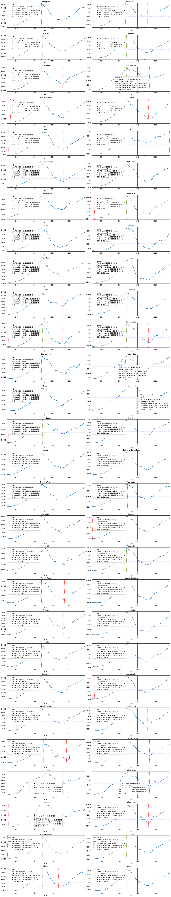


## Plot function:  plot_ts_zips (plots individual zip codes in a list provided to the function)


```python
# Adapted from James Irving's study group:
    
def plot_ts_zips(df, zipcodes, col='value', figsize = (12, 6), nrows=1, ncols=1, 
                 legend=True, set_ylim = False, ylim = 800000):
        
    ''' Plots multiple zip codes in a single axes/figure.  For each zip code, marks dates of:
    1) maximum value reached during the housing bubble; 2) minimum value after the crash;
    3) absolute minimum across entire time horizon (e.g., 1996 if you go back that far);
    4) absolute minimum across entire time horizon (may or may not be the height of the bubble);
    5) date when the national housing index (Case-Schiller) dropped.  
    ''' 

    fig = plt.figure(figsize=figsize)
    
    for i, zc in enumerate(zipcodes, start=1):
        ax = fig.add_subplot(nrows, ncols, i)
        
        ts = df[col].loc[df['Zip'] == zc]
        ts.plot(title = zc, ax=ax)
        
        try: 
            max_ = ts.loc['2004':'2011'].idxmax()  
        except:
            continue

        crash = '01-2009'
        min_ = ts.loc[crash:].idxmin()
        val_2003 = ts.loc['2003-01-01']

        max_all = ts.idxmax()
        min_all = ts.idxmin()

        ax.axvline(max_, label=f'Max Price: {max_}', color = 'orange', ls=':')
        ax.axvline(crash, label = 'Housing Index Drops', color='black')
        ax.axvline(min_, label=f'Min Price Post Crash: {min_}', color = 'red', ls=':')
        ax.axvline(max_all, label=f'All time series max {max_all}', color = 'green', ls=':')
        ax.axvline(min_all, label=f'All time series min: {min_all}', color = 'red', ls=':')
        ax.axhline(val_2003, label='2003-01-01 value', color = 'blue', ls='-.', alpha=0.15)
        if set_ylim:
            ax.set_ylim(ylim)
        if legend:
            ax.legend(loc='best')
    
        fig.tight_layout()
    
    return fig, ax

```

## Plotting function:  plot_ts_zips_by_city (plot of each city with values by zip codes in a metro area)


```python
# Function below adapted from James Irving's study group:
    
def plot_ts_zips_by_city(df, dict_zips_cities, col='value', figsize = (18, 100), 
                         nrows=30, ncols=2, legend=True, set_ylim = False, ylim = 1400000):
        
    '''Plots values for zip codes by city within a metro area.  Need to use dataframe 
    with values by ZIP code and CITY for just that METRO (or specify .loc in arguments that 
    column 'MetroState' == METRO). Need DICTIONARY of ZIPS by CITY within that METRO area.  
    Specify nrows, ncols, and figsize to match size of dataset.
    '''

    fig = plt.figure(figsize=figsize)
    
    for i, key in enumerate(sorted(dict_zips_cities.keys()), start=1):
        ax = fig.add_subplot(nrows, ncols, i)
        for val in dict_zips_cities[key]:
            ts = df[col].loc[df['Zip'] == val]
            try: 
                max_ = ts.loc['2004':'2011'].idxmax()  
            except:
                continue
            
            crash = '01-2009'
#             min_val = ts.loc[crash:].min()   # purpose of var is to use to graph horizontal line at price at 2003-01-01
            min_ = ts.loc[crash:].idxmin()
            ts.plot(title = key, ax=ax)
#             val_2003 = ts.loc['2003-01-01']  # This is for graphic horizontal line at 2003 value, but can't 
                                               # get it to work on multiple zip plots 
            max_all = ts.idxmax()
            min_all = ts.idxmin()

            ax.axvline(max_, label = val, color = 'orange', ls=':')               
            ax.axvline(crash, color='black')                         # no labels
            ax.axvline(min_, color = 'red', ls=':')
            ax.axvline(max_all, color = 'green', ls=':')  
            ax.axvline(min_all, color = 'red', ls=':')  
            ax.axvline('2003-01-01', color = 'blue', ls='-.', alpha=0.15)   # for label, insert the following:  label='2003-01-01'
            
            if set_ylim:
                ax.set_ylim(ylim)
            if legend:
                ax.legend(loc="best")
    
        fig.tight_layout()
    
    return fig, ax

#  Ignore code below unless labels for each vertical line are desired

#  ax.axvline(max_, label=f'Max Price: {max_}', color = 'orange', ls=':')              # contains labels
#  ax.axvline(crash, label = 'Housing Index Drops', color='black')                     # contains labels
#  ax.axvline(min_, label=f'Min Price Post Crash: {min_}', color = 'red', ls=':')      # contains labels
#  ax.axhline(min_val, label=f'Min Price Post Crash: {min_}', color = 'red', ls='-.', alpha=0.15)  # can't get this to work on multiple zip plots 
#  ax.axvline(max_all, label=f'All time series max {max_all}', color = 'green', ls=':')  # contains labels
#  ax.axvline(min_all, label=f'All time series min: {min_all}', color = 'red', ls=':')   # contains labels
#  ax.axhline(ts.loc['2003-01-01'], label='2003-01-01 value', color = 'blue', ls='-.', alpha=0.15)  # can't get this to work on multiple zip plots 


```

## Plotting Sacramento values by zip code, grouped by city or within a city

### Plots of zip codes in City of Sacramento


```python
df_sacto_city_zips = df_sac.loc[df_sac['City'] == 'Sacramento']
df_sacto_city_zips.head()
```


<div>
<style scoped>
    .dataframe tbody tr th:only-of-type {
        vertical-align: middle;
    }

    .dataframe tbody tr th {
        vertical-align: top;
    }

    .dataframe thead th {
        text-align: right;
    }
</style>
<table border="1" class="dataframe">
  <thead>
    <tr style="text-align: right;">
      <th></th>
      <th>Metro</th>
      <th>MetroState</th>
      <th>CountyName</th>
      <th>City</th>
      <th>Zip</th>
      <th>SizeRank</th>
      <th>value</th>
    </tr>
    <tr>
      <th>time</th>
      <th></th>
      <th></th>
      <th></th>
      <th></th>
      <th></th>
      <th></th>
      <th></th>
    </tr>
  </thead>
  <tbody>
    <tr>
      <td>1996-04-01</td>
      <td>Sacramento</td>
      <td>Sacramento CA</td>
      <td>Sacramento</td>
      <td>Sacramento</td>
      <td>95660</td>
      <td>3515</td>
      <td>73200.0</td>
    </tr>
    <tr>
      <td>1996-05-01</td>
      <td>Sacramento</td>
      <td>Sacramento CA</td>
      <td>Sacramento</td>
      <td>Sacramento</td>
      <td>95660</td>
      <td>3515</td>
      <td>72500.0</td>
    </tr>
    <tr>
      <td>1996-06-01</td>
      <td>Sacramento</td>
      <td>Sacramento CA</td>
      <td>Sacramento</td>
      <td>Sacramento</td>
      <td>95660</td>
      <td>3515</td>
      <td>71900.0</td>
    </tr>
    <tr>
      <td>1996-07-01</td>
      <td>Sacramento</td>
      <td>Sacramento CA</td>
      <td>Sacramento</td>
      <td>Sacramento</td>
      <td>95660</td>
      <td>3515</td>
      <td>71300.0</td>
    </tr>
    <tr>
      <td>1996-08-01</td>
      <td>Sacramento</td>
      <td>Sacramento CA</td>
      <td>Sacramento</td>
      <td>Sacramento</td>
      <td>95660</td>
      <td>3515</td>
      <td>70700.0</td>
    </tr>
  </tbody>
</table>
</div>


```python
df_sacto_city_zips['Zip'].value_counts()
```


    95841    265
    95838    265
    95816    265
    95833    265
    95820    265
    95819    265
    95832    265
    95829    265
    95660    265
    95823    265
    95824    265
    95843    265
    95817    265
    95842    265
    95822    265
    95818    265
    95831    265
    95811    265
    95834    265
    95835    265
    95815     58
    Name: Zip, dtype: int64


```python
sacto_zips = list(set(df_sacto_city_zips['Zip']))
len(sacto_zips)
```


    21


```python
ts = df_sacto_city_zips['value'].loc[df_sacto_city_zips['Zip'] == '95823']
ts.head()
```


    time
    1996-04-01    91500.0
    1996-05-01    90800.0
    1996-06-01    90000.0
    1996-07-01    89200.0
    1996-08-01    88400.0
    Name: value, dtype: float64


```python
fig, ax = plot_ts_zips(df_sac, sacto_zips, nrows=35, ncols=3, figsize=(18, 100), legend=False)

```


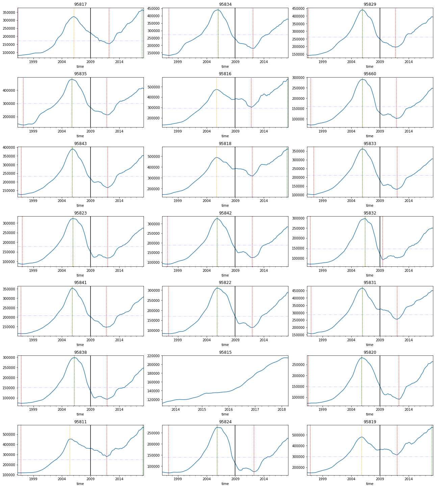


### Plotting cities and zip codes within Sacramento Metro area 


```python
sorted(dict_sac_zips_cities)[:10]
```


    ['Applegate',
     'Arden-Arcade',
     'Auburn',
     'Camino',
     'Carmichael',
     'Carnelian Bay',
     'Citrus Heights',
     'Colfax',
     'Cool',
     'Davis']


```python
fig, ax = plot_ts_zips_by_city(df_sac, dict_sac_zips_cities, figsize=(18, 100), nrows=30, ncols=2, legend=False)

```


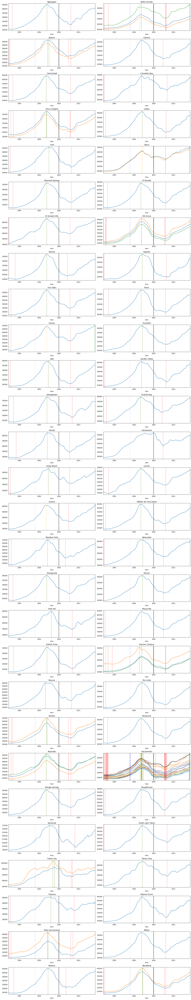


```python
df_davis = df_sac.loc[df_sac['City'] == 'Davis']
```


```python
df_davis.sort_values(by=['Zip', 'time'], inplace=True)
df_davis.head()
```


<div>
<style scoped>
    .dataframe tbody tr th:only-of-type {
        vertical-align: middle;
    }

    .dataframe tbody tr th {
        vertical-align: top;
    }

    .dataframe thead th {
        text-align: right;
    }
</style>
<table border="1" class="dataframe">
  <thead>
    <tr style="text-align: right;">
      <th></th>
      <th>Metro</th>
      <th>MetroState</th>
      <th>CountyName</th>
      <th>City</th>
      <th>Zip</th>
      <th>SizeRank</th>
      <th>value</th>
    </tr>
    <tr>
      <th>time</th>
      <th></th>
      <th></th>
      <th></th>
      <th></th>
      <th></th>
      <th></th>
      <th></th>
    </tr>
  </thead>
  <tbody>
    <tr>
      <td>1996-04-01</td>
      <td>Sacramento</td>
      <td>Sacramento CA</td>
      <td>Yolo</td>
      <td>Davis</td>
      <td>95616</td>
      <td>955</td>
      <td>202500.0</td>
    </tr>
    <tr>
      <td>1996-05-01</td>
      <td>Sacramento</td>
      <td>Sacramento CA</td>
      <td>Yolo</td>
      <td>Davis</td>
      <td>95616</td>
      <td>955</td>
      <td>202500.0</td>
    </tr>
    <tr>
      <td>1996-06-01</td>
      <td>Sacramento</td>
      <td>Sacramento CA</td>
      <td>Yolo</td>
      <td>Davis</td>
      <td>95616</td>
      <td>955</td>
      <td>202500.0</td>
    </tr>
    <tr>
      <td>1996-07-01</td>
      <td>Sacramento</td>
      <td>Sacramento CA</td>
      <td>Yolo</td>
      <td>Davis</td>
      <td>95616</td>
      <td>955</td>
      <td>202500.0</td>
    </tr>
    <tr>
      <td>1996-08-01</td>
      <td>Sacramento</td>
      <td>Sacramento CA</td>
      <td>Yolo</td>
      <td>Davis</td>
      <td>95616</td>
      <td>955</td>
      <td>202500.0</td>
    </tr>
  </tbody>
</table>
</div>


```python
# for zipcode in df_davis['Zip']:     # zipcodes for Davis
#     print(zipcode, df_davis['value'])

for zipcode in df_davis['Zip']:
    df_davis['value'].loc[df_davis['Zip'] == zipcode].plot(figsize=(12, 7))

# Seasonality appears not to be a big factor in this city in the Sacramento Valley of California
```


```python
df_davis_201415 = df_davis.loc['2004':'2015']
df_davis_201415.head()
```


<div>
<style scoped>
    .dataframe tbody tr th:only-of-type {
        vertical-align: middle;
    }

    .dataframe tbody tr th {
        vertical-align: top;
    }

    .dataframe thead th {
        text-align: right;
    }
</style>
<table border="1" class="dataframe">
  <thead>
    <tr style="text-align: right;">
      <th></th>
      <th>Metro</th>
      <th>MetroState</th>
      <th>CountyName</th>
      <th>City</th>
      <th>Zip</th>
      <th>SizeRank</th>
      <th>value</th>
    </tr>
    <tr>
      <th>time</th>
      <th></th>
      <th></th>
      <th></th>
      <th></th>
      <th></th>
      <th></th>
      <th></th>
    </tr>
  </thead>
  <tbody>
    <tr>
      <td>2004-01-01</td>
      <td>Sacramento</td>
      <td>Sacramento CA</td>
      <td>Yolo</td>
      <td>Davis</td>
      <td>95616</td>
      <td>955</td>
      <td>480700.0</td>
    </tr>
    <tr>
      <td>2004-02-01</td>
      <td>Sacramento</td>
      <td>Sacramento CA</td>
      <td>Yolo</td>
      <td>Davis</td>
      <td>95616</td>
      <td>955</td>
      <td>485600.0</td>
    </tr>
    <tr>
      <td>2004-03-01</td>
      <td>Sacramento</td>
      <td>Sacramento CA</td>
      <td>Yolo</td>
      <td>Davis</td>
      <td>95616</td>
      <td>955</td>
      <td>490700.0</td>
    </tr>
    <tr>
      <td>2004-04-01</td>
      <td>Sacramento</td>
      <td>Sacramento CA</td>
      <td>Yolo</td>
      <td>Davis</td>
      <td>95616</td>
      <td>955</td>
      <td>496400.0</td>
    </tr>
    <tr>
      <td>2004-05-01</td>
      <td>Sacramento</td>
      <td>Sacramento CA</td>
      <td>Yolo</td>
      <td>Davis</td>
      <td>95616</td>
      <td>955</td>
      <td>503000.0</td>
    </tr>
  </tbody>
</table>
</div>


```python
for zipcode in df_davis_201415['Zip']:     # zipcodes for Woodland
    df_davis_201415['value'].loc[df_davis_201415['Zip'] == zipcode].plot(figsize=(12, 7))

    
# very little seasonality is evident
```


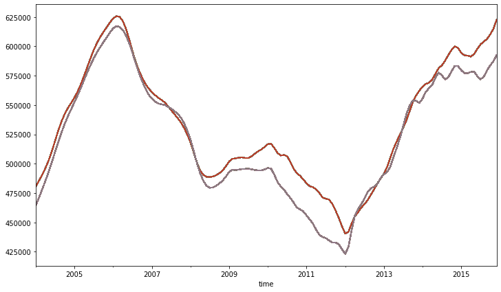


## Boxplots

### Plotting function:  city_zips_boxplot (boxplots of zip codes in a city)


```python
def city_zips_boxplot(df, city_zips, nrows, ncols, figsize=(18, 30)):
    
    '''Plots boxplots of each zipcode within a city.  Need to use dataframe with values by ZIP 
    for just that CITY (or specify .loc in arguments that column 'City' == CITY in question).
    Need LIST of ZIP codes for that particular CITY.  Need to specify nrows, ncols, and figsize.
    '''
    
    fig = plt.figure(figsize=figsize)
    
    for i, zc in enumerate(city_zips, start=1):
        ax = fig.add_subplot(nrows, ncols, i)
        ts = df.loc[df['Zip'] == zc]
        ts.boxplot(column = 'value', ax = ax)
        ax.set_title(f'{zc}')
        fig.tight_layout()

```

### Plotting function:  metro_zips_boxplot (boxplots by zip in metro area)


```python
def metro_zips_boxplot(df, metro_zips, nrows, ncols, figsize=(18, 100)):
    
    '''Plots boxplots of each zipcode within a city.  Need to use dataframe with values by ZIP 
    for just that METRO area (or specify .loc in arguments that column 'MetroState' == METRO).
    Need a LIST of ZIP codes within that METRO area.  Need to specify nrows, ncols, and figsize.
    '''
    
    fig = plt.figure(figsize=figsize)
    
    for i, zc in enumerate(metro_zips, start=1):
        ax = fig.add_subplot(nrows, ncols, i)
        ts = df.loc[df['Zip'] == zc]
        ts.boxplot(column = 'value', ax = ax)
        ax.set_title(f'{zc}')
        fig.tight_layout()

```

### Plotting function:  metro_cities_boxplot (boxplots by city in metro area)


```python
def metro_cities_boxplot(df, metro_cities, nrows, ncols, figsize=(18, 30)):
    
    '''Plots boxplots of each city within a metro area.  Need to use dataframe with values 
    by CITY for just that METRO (or specify .loc in arguments that column 'MetroState' == METRO.
    Need LIST of CITIES within a particular metro area.  Need to specify nrows, ncols, and figsize.
    '''
    
    fig = plt.figure(figsize=figsize)
    
    for i, city in enumerate(metro_cities, start=1):
        ax = fig.add_subplot(nrows, ncols, i)
        ts = df.loc[df['City'] == city]
        ts.boxplot(column = 'value', ax = ax)
        ax.set_title(f'{city}')
        fig.tight_layout()

```

### Plotting function:  metro_cities_zips_boxplot (boxplots by city and zip code in metro area)


```python
def metro_cities_zips_boxplot(df, dict_metro_cities_zips, nrows, ncols, figsize=(18, 40)):
    
    '''Plots boxplots of all zip codes in each city within a metro area.  Need to use dataframe 
    with values by ZIP code and CITY for just that METRO (or specify .loc in arguments that 
    column 'MetroState' == METRO). Need DICTIONARY of ZIPS by CITY within that METRO area.  
    Need to specify nrows, ncols, and figsize.
    '''
    
    fig = plt.figure(figsize=figsize)
    
    for i, (city, zc) in enumerate(dict_metro_cities_zips.copy().items(), start=1):
        ax = fig.add_subplot(nrows, ncols, i)
        ax.set_title(f'{city}')
        for i, zc in enumerate(dict_metro_cities_zips.copy()[city], start=1):
            ts = df.loc[df['Zip'] == zc]
            ts.boxplot(column = 'value', ax = ax)
            ax.set_title(f'{city}')
            fig.tight_layout()

```

### Plotting boxplots for each city in Sacto Metro region


```python
metro_cities_boxplot(df_sac, sac_metro_cities, nrows=10, ncols=6, figsize=(18, 40))

```


### Plotting boxplots for each zip in Sacramento metro region


```python
metro_zips_boxplot(df_sac, sac_metro_zips, nrows = 12, ncols=8, figsize=(18, 60))

```


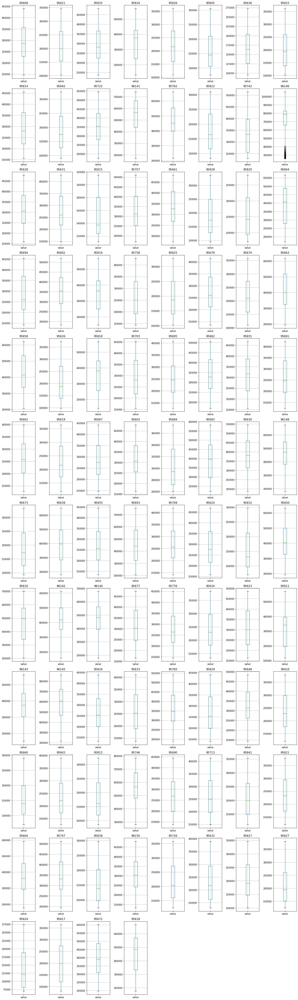


### Plotting function:  Boxplots (by city and zip code in metro area)


```python
metro_cities_zips_boxplot(df_sac, dict_sac_zips_cities, nrows=14, ncols=6, figsize=(18, 50))

```


```python
df_sac_city = df_sac.loc[df_sac['City'] == 'Sacramento']

df_sac_city.head()
```


<div>
<style scoped>
    .dataframe tbody tr th:only-of-type {
        vertical-align: middle;
    }

    .dataframe tbody tr th {
        vertical-align: top;
    }

    .dataframe thead th {
        text-align: right;
    }
</style>
<table border="1" class="dataframe">
  <thead>
    <tr style="text-align: right;">
      <th></th>
      <th>Metro</th>
      <th>MetroState</th>
      <th>CountyName</th>
      <th>City</th>
      <th>Zip</th>
      <th>SizeRank</th>
      <th>value</th>
    </tr>
    <tr>
      <th>time</th>
      <th></th>
      <th></th>
      <th></th>
      <th></th>
      <th></th>
      <th></th>
      <th></th>
    </tr>
  </thead>
  <tbody>
    <tr>
      <td>1996-04-01</td>
      <td>Sacramento</td>
      <td>Sacramento CA</td>
      <td>Sacramento</td>
      <td>Sacramento</td>
      <td>95660</td>
      <td>3515</td>
      <td>73200.0</td>
    </tr>
    <tr>
      <td>1996-05-01</td>
      <td>Sacramento</td>
      <td>Sacramento CA</td>
      <td>Sacramento</td>
      <td>Sacramento</td>
      <td>95660</td>
      <td>3515</td>
      <td>72500.0</td>
    </tr>
    <tr>
      <td>1996-06-01</td>
      <td>Sacramento</td>
      <td>Sacramento CA</td>
      <td>Sacramento</td>
      <td>Sacramento</td>
      <td>95660</td>
      <td>3515</td>
      <td>71900.0</td>
    </tr>
    <tr>
      <td>1996-07-01</td>
      <td>Sacramento</td>
      <td>Sacramento CA</td>
      <td>Sacramento</td>
      <td>Sacramento</td>
      <td>95660</td>
      <td>3515</td>
      <td>71300.0</td>
    </tr>
    <tr>
      <td>1996-08-01</td>
      <td>Sacramento</td>
      <td>Sacramento CA</td>
      <td>Sacramento</td>
      <td>Sacramento</td>
      <td>95660</td>
      <td>3515</td>
      <td>70700.0</td>
    </tr>
  </tbody>
</table>
</div>


```python
sacto_zips = list(set(df_sac_city['Zip']))
len(sacto_zips)

```


    21


```python
df_sac_city.boxplot(by='Zip', column = 'value', figsize=(16, 6))

```


    <matplotlib.axes._subplots.AxesSubplot at 0x1a8830dc18>


### Violin plot for Sacramento city zip codes


```python
import seaborn as sns

```


```python
# got figure size  modification example from https://exceptionshub.com/how-do-i-change-the-figure-size-for-a-seaborn-plot.html

# fig, ax = plt.subplots()
# fig.set_size_inches(16, 6)
# sns.violinplot(x="Zip", y="value", data=df_44, scale="count", inner="stick", ax=ax)

fig, ax = plt.subplots()
fig.set_size_inches(16, 6)
sns.violinplot(x="Zip", y="value", data=df_sac_city, scale="width", inner="quartile", ax=ax)
```


    <matplotlib.axes._subplots.AxesSubplot at 0x1a88251cf8>


```python
df_sac_city_1996_1999 = df_sac_city.loc['1996-04-01':'1999-12-01']
df_sac_city_1996_1999.tail()
```


<div>
<style scoped>
    .dataframe tbody tr th:only-of-type {
        vertical-align: middle;
    }

    .dataframe tbody tr th {
        vertical-align: top;
    }

    .dataframe thead th {
        text-align: right;
    }
</style>
<table border="1" class="dataframe">
  <thead>
    <tr style="text-align: right;">
      <th></th>
      <th>Metro</th>
      <th>MetroState</th>
      <th>CountyName</th>
      <th>City</th>
      <th>Zip</th>
      <th>SizeRank</th>
      <th>value</th>
    </tr>
    <tr>
      <th>time</th>
      <th></th>
      <th></th>
      <th></th>
      <th></th>
      <th></th>
      <th></th>
      <th></th>
    </tr>
  </thead>
  <tbody>
    <tr>
      <td>1999-08-01</td>
      <td>Sacramento</td>
      <td>Sacramento CA</td>
      <td>Sacramento</td>
      <td>Sacramento</td>
      <td>95843</td>
      <td>2123</td>
      <td>146400.0</td>
    </tr>
    <tr>
      <td>1999-09-01</td>
      <td>Sacramento</td>
      <td>Sacramento CA</td>
      <td>Sacramento</td>
      <td>Sacramento</td>
      <td>95843</td>
      <td>2123</td>
      <td>147600.0</td>
    </tr>
    <tr>
      <td>1999-10-01</td>
      <td>Sacramento</td>
      <td>Sacramento CA</td>
      <td>Sacramento</td>
      <td>Sacramento</td>
      <td>95843</td>
      <td>2123</td>
      <td>149000.0</td>
    </tr>
    <tr>
      <td>1999-11-01</td>
      <td>Sacramento</td>
      <td>Sacramento CA</td>
      <td>Sacramento</td>
      <td>Sacramento</td>
      <td>95843</td>
      <td>2123</td>
      <td>150300.0</td>
    </tr>
    <tr>
      <td>1999-12-01</td>
      <td>Sacramento</td>
      <td>Sacramento CA</td>
      <td>Sacramento</td>
      <td>Sacramento</td>
      <td>95843</td>
      <td>2123</td>
      <td>151800.0</td>
    </tr>
  </tbody>
</table>
</div>


```python
fig, ax = plt.subplots()
fig.set_size_inches(16, 6)
sns.violinplot(x="Zip", y="value", data=df_sac_city_1996_1999, scale="width", inner="quartile", ax=ax)
```


    <matplotlib.axes._subplots.AxesSubplot at 0x1a881b24e0>


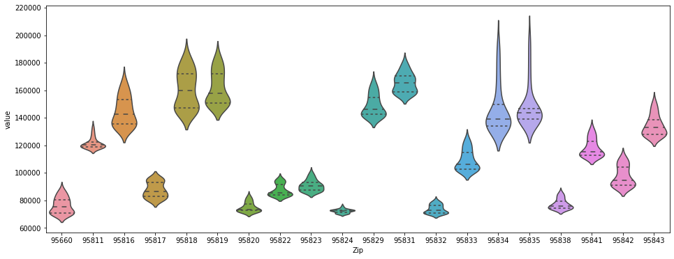


```python
df_sac_city_2000_2003 = df_sac_city.loc['2000-01-01':'2003-12-01']
df_sac_city_2000_2003.head()
```


<div>
<style scoped>
    .dataframe tbody tr th:only-of-type {
        vertical-align: middle;
    }

    .dataframe tbody tr th {
        vertical-align: top;
    }

    .dataframe thead th {
        text-align: right;
    }
</style>
<table border="1" class="dataframe">
  <thead>
    <tr style="text-align: right;">
      <th></th>
      <th>Metro</th>
      <th>MetroState</th>
      <th>CountyName</th>
      <th>City</th>
      <th>Zip</th>
      <th>SizeRank</th>
      <th>value</th>
    </tr>
    <tr>
      <th>time</th>
      <th></th>
      <th></th>
      <th></th>
      <th></th>
      <th></th>
      <th></th>
      <th></th>
    </tr>
  </thead>
  <tbody>
    <tr>
      <td>2000-01-01</td>
      <td>Sacramento</td>
      <td>Sacramento CA</td>
      <td>Sacramento</td>
      <td>Sacramento</td>
      <td>95660</td>
      <td>3515</td>
      <td>89100.0</td>
    </tr>
    <tr>
      <td>2000-02-01</td>
      <td>Sacramento</td>
      <td>Sacramento CA</td>
      <td>Sacramento</td>
      <td>Sacramento</td>
      <td>95660</td>
      <td>3515</td>
      <td>90100.0</td>
    </tr>
    <tr>
      <td>2000-03-01</td>
      <td>Sacramento</td>
      <td>Sacramento CA</td>
      <td>Sacramento</td>
      <td>Sacramento</td>
      <td>95660</td>
      <td>3515</td>
      <td>91200.0</td>
    </tr>
    <tr>
      <td>2000-04-01</td>
      <td>Sacramento</td>
      <td>Sacramento CA</td>
      <td>Sacramento</td>
      <td>Sacramento</td>
      <td>95660</td>
      <td>3515</td>
      <td>92200.0</td>
    </tr>
    <tr>
      <td>2000-05-01</td>
      <td>Sacramento</td>
      <td>Sacramento CA</td>
      <td>Sacramento</td>
      <td>Sacramento</td>
      <td>95660</td>
      <td>3515</td>
      <td>93300.0</td>
    </tr>
  </tbody>
</table>
</div>


```python
fig, ax = plt.subplots()
fig.set_size_inches(16, 6)
sns.violinplot(x="Zip", y="value", data=df_sac_city_2000_2003, scale="width", inner="quartile", ax=ax)
```


    <matplotlib.axes._subplots.AxesSubplot at 0x1a87dd87b8>


```python
df_sac_city_2004_2006 = df_sac_city.loc['2004-01-01':'2006-12-01']
df_sac_city_2004_2006.head()
```


<div>
<style scoped>
    .dataframe tbody tr th:only-of-type {
        vertical-align: middle;
    }

    .dataframe tbody tr th {
        vertical-align: top;
    }

    .dataframe thead th {
        text-align: right;
    }
</style>
<table border="1" class="dataframe">
  <thead>
    <tr style="text-align: right;">
      <th></th>
      <th>Metro</th>
      <th>MetroState</th>
      <th>CountyName</th>
      <th>City</th>
      <th>Zip</th>
      <th>SizeRank</th>
      <th>value</th>
    </tr>
    <tr>
      <th>time</th>
      <th></th>
      <th></th>
      <th></th>
      <th></th>
      <th></th>
      <th></th>
      <th></th>
    </tr>
  </thead>
  <tbody>
    <tr>
      <td>2004-01-01</td>
      <td>Sacramento</td>
      <td>Sacramento CA</td>
      <td>Sacramento</td>
      <td>Sacramento</td>
      <td>95660</td>
      <td>3515</td>
      <td>191900.0</td>
    </tr>
    <tr>
      <td>2004-02-01</td>
      <td>Sacramento</td>
      <td>Sacramento CA</td>
      <td>Sacramento</td>
      <td>Sacramento</td>
      <td>95660</td>
      <td>3515</td>
      <td>195700.0</td>
    </tr>
    <tr>
      <td>2004-03-01</td>
      <td>Sacramento</td>
      <td>Sacramento CA</td>
      <td>Sacramento</td>
      <td>Sacramento</td>
      <td>95660</td>
      <td>3515</td>
      <td>200200.0</td>
    </tr>
    <tr>
      <td>2004-04-01</td>
      <td>Sacramento</td>
      <td>Sacramento CA</td>
      <td>Sacramento</td>
      <td>Sacramento</td>
      <td>95660</td>
      <td>3515</td>
      <td>205300.0</td>
    </tr>
    <tr>
      <td>2004-05-01</td>
      <td>Sacramento</td>
      <td>Sacramento CA</td>
      <td>Sacramento</td>
      <td>Sacramento</td>
      <td>95660</td>
      <td>3515</td>
      <td>211100.0</td>
    </tr>
  </tbody>
</table>
</div>


```python
fig, ax = plt.subplots()
fig.set_size_inches(16, 6)
sns.violinplot(x="Zip", y="value", data=df_sac_city_2004_2006, scale="width", inner="quartile", ax=ax)
```


    <matplotlib.axes._subplots.AxesSubplot at 0x1a60ebbfd0>


```python
df_sac_city_2007_2012 = df_sac_city.loc['2007-01-01':'2012-12-01']
df_sac_city_2007_2012.head()
```


<div>
<style scoped>
    .dataframe tbody tr th:only-of-type {
        vertical-align: middle;
    }

    .dataframe tbody tr th {
        vertical-align: top;
    }

    .dataframe thead th {
        text-align: right;
    }
</style>
<table border="1" class="dataframe">
  <thead>
    <tr style="text-align: right;">
      <th></th>
      <th>Metro</th>
      <th>MetroState</th>
      <th>CountyName</th>
      <th>City</th>
      <th>Zip</th>
      <th>SizeRank</th>
      <th>value</th>
    </tr>
    <tr>
      <th>time</th>
      <th></th>
      <th></th>
      <th></th>
      <th></th>
      <th></th>
      <th></th>
      <th></th>
    </tr>
  </thead>
  <tbody>
    <tr>
      <td>2007-01-01</td>
      <td>Sacramento</td>
      <td>Sacramento CA</td>
      <td>Sacramento</td>
      <td>Sacramento</td>
      <td>95660</td>
      <td>3515</td>
      <td>264800.0</td>
    </tr>
    <tr>
      <td>2007-02-01</td>
      <td>Sacramento</td>
      <td>Sacramento CA</td>
      <td>Sacramento</td>
      <td>Sacramento</td>
      <td>95660</td>
      <td>3515</td>
      <td>263000.0</td>
    </tr>
    <tr>
      <td>2007-03-01</td>
      <td>Sacramento</td>
      <td>Sacramento CA</td>
      <td>Sacramento</td>
      <td>Sacramento</td>
      <td>95660</td>
      <td>3515</td>
      <td>261000.0</td>
    </tr>
    <tr>
      <td>2007-04-01</td>
      <td>Sacramento</td>
      <td>Sacramento CA</td>
      <td>Sacramento</td>
      <td>Sacramento</td>
      <td>95660</td>
      <td>3515</td>
      <td>258400.0</td>
    </tr>
    <tr>
      <td>2007-05-01</td>
      <td>Sacramento</td>
      <td>Sacramento CA</td>
      <td>Sacramento</td>
      <td>Sacramento</td>
      <td>95660</td>
      <td>3515</td>
      <td>254800.0</td>
    </tr>
  </tbody>
</table>
</div>


```python
fig, ax = plt.subplots()
fig.set_size_inches(16, 6)
sns.violinplot(x="Zip", y="value", data=df_sac_city_2007_2012, scale="width", inner="quartile", ax=ax)
```


    <matplotlib.axes._subplots.AxesSubplot at 0x1a90055cf8>


```python
df_sac_city_2013_2018 = df_sac_city.loc['2013-01-01':'2018']
df_sac_city_2013_2018.tail()
```


<div>
<style scoped>
    .dataframe tbody tr th:only-of-type {
        vertical-align: middle;
    }

    .dataframe tbody tr th {
        vertical-align: top;
    }

    .dataframe thead th {
        text-align: right;
    }
</style>
<table border="1" class="dataframe">
  <thead>
    <tr style="text-align: right;">
      <th></th>
      <th>Metro</th>
      <th>MetroState</th>
      <th>CountyName</th>
      <th>City</th>
      <th>Zip</th>
      <th>SizeRank</th>
      <th>value</th>
    </tr>
    <tr>
      <th>time</th>
      <th></th>
      <th></th>
      <th></th>
      <th></th>
      <th></th>
      <th></th>
      <th></th>
    </tr>
  </thead>
  <tbody>
    <tr>
      <td>2017-12-01</td>
      <td>Sacramento</td>
      <td>Sacramento CA</td>
      <td>Sacramento</td>
      <td>Sacramento</td>
      <td>95843</td>
      <td>2123</td>
      <td>345600.0</td>
    </tr>
    <tr>
      <td>2018-01-01</td>
      <td>Sacramento</td>
      <td>Sacramento CA</td>
      <td>Sacramento</td>
      <td>Sacramento</td>
      <td>95843</td>
      <td>2123</td>
      <td>350100.0</td>
    </tr>
    <tr>
      <td>2018-02-01</td>
      <td>Sacramento</td>
      <td>Sacramento CA</td>
      <td>Sacramento</td>
      <td>Sacramento</td>
      <td>95843</td>
      <td>2123</td>
      <td>352500.0</td>
    </tr>
    <tr>
      <td>2018-03-01</td>
      <td>Sacramento</td>
      <td>Sacramento CA</td>
      <td>Sacramento</td>
      <td>Sacramento</td>
      <td>95843</td>
      <td>2123</td>
      <td>352400.0</td>
    </tr>
    <tr>
      <td>2018-04-01</td>
      <td>Sacramento</td>
      <td>Sacramento CA</td>
      <td>Sacramento</td>
      <td>Sacramento</td>
      <td>95843</td>
      <td>2123</td>
      <td>351400.0</td>
    </tr>
  </tbody>
</table>
</div>


```python
fig, ax = plt.subplots()
fig.set_size_inches(16, 6)
sns.violinplot(x="Zip", y="value", data=df_sac_city_2013_2018, scale="width", inner="quartile", ax=ax)
```


    <matplotlib.axes._subplots.AxesSubplot at 0x1a83cd4d68>


## Visualizations for Davis, CA (ZIP 95616)


```python
ts_95616 = df_melt.loc[df_melt['Zip'] == '95616']
```


```python
ts_95616.head()
```


<div>
<style scoped>
    .dataframe tbody tr th:only-of-type {
        vertical-align: middle;
    }

    .dataframe tbody tr th {
        vertical-align: top;
    }

    .dataframe thead th {
        text-align: right;
    }
</style>
<table border="1" class="dataframe">
  <thead>
    <tr style="text-align: right;">
      <th></th>
      <th>Zip</th>
      <th>City</th>
      <th>State</th>
      <th>Metro</th>
      <th>CountyName</th>
      <th>SizeRank</th>
      <th>value</th>
      <th>MetroState</th>
    </tr>
    <tr>
      <th>time</th>
      <th></th>
      <th></th>
      <th></th>
      <th></th>
      <th></th>
      <th></th>
      <th></th>
      <th></th>
    </tr>
  </thead>
  <tbody>
    <tr>
      <td>1996-04-01</td>
      <td>95616</td>
      <td>Davis</td>
      <td>CA</td>
      <td>Sacramento</td>
      <td>Yolo</td>
      <td>955</td>
      <td>202500.0</td>
      <td>Sacramento CA</td>
    </tr>
    <tr>
      <td>1996-05-01</td>
      <td>95616</td>
      <td>Davis</td>
      <td>CA</td>
      <td>Sacramento</td>
      <td>Yolo</td>
      <td>955</td>
      <td>202500.0</td>
      <td>Sacramento CA</td>
    </tr>
    <tr>
      <td>1996-06-01</td>
      <td>95616</td>
      <td>Davis</td>
      <td>CA</td>
      <td>Sacramento</td>
      <td>Yolo</td>
      <td>955</td>
      <td>202500.0</td>
      <td>Sacramento CA</td>
    </tr>
    <tr>
      <td>1996-07-01</td>
      <td>95616</td>
      <td>Davis</td>
      <td>CA</td>
      <td>Sacramento</td>
      <td>Yolo</td>
      <td>955</td>
      <td>202500.0</td>
      <td>Sacramento CA</td>
    </tr>
    <tr>
      <td>1996-08-01</td>
      <td>95616</td>
      <td>Davis</td>
      <td>CA</td>
      <td>Sacramento</td>
      <td>Yolo</td>
      <td>955</td>
      <td>202500.0</td>
      <td>Sacramento CA</td>
    </tr>
  </tbody>
</table>
</div>


```python
ts_95616 = ts_95616.resample('MS').asfreq()
```


```python
ts_95616.head()
```


<div>
<style scoped>
    .dataframe tbody tr th:only-of-type {
        vertical-align: middle;
    }

    .dataframe tbody tr th {
        vertical-align: top;
    }

    .dataframe thead th {
        text-align: right;
    }
</style>
<table border="1" class="dataframe">
  <thead>
    <tr style="text-align: right;">
      <th></th>
      <th>Zip</th>
      <th>City</th>
      <th>State</th>
      <th>Metro</th>
      <th>CountyName</th>
      <th>SizeRank</th>
      <th>value</th>
      <th>MetroState</th>
    </tr>
    <tr>
      <th>time</th>
      <th></th>
      <th></th>
      <th></th>
      <th></th>
      <th></th>
      <th></th>
      <th></th>
      <th></th>
    </tr>
  </thead>
  <tbody>
    <tr>
      <td>1996-04-01</td>
      <td>95616</td>
      <td>Davis</td>
      <td>CA</td>
      <td>Sacramento</td>
      <td>Yolo</td>
      <td>955</td>
      <td>202500.0</td>
      <td>Sacramento CA</td>
    </tr>
    <tr>
      <td>1996-05-01</td>
      <td>95616</td>
      <td>Davis</td>
      <td>CA</td>
      <td>Sacramento</td>
      <td>Yolo</td>
      <td>955</td>
      <td>202500.0</td>
      <td>Sacramento CA</td>
    </tr>
    <tr>
      <td>1996-06-01</td>
      <td>95616</td>
      <td>Davis</td>
      <td>CA</td>
      <td>Sacramento</td>
      <td>Yolo</td>
      <td>955</td>
      <td>202500.0</td>
      <td>Sacramento CA</td>
    </tr>
    <tr>
      <td>1996-07-01</td>
      <td>95616</td>
      <td>Davis</td>
      <td>CA</td>
      <td>Sacramento</td>
      <td>Yolo</td>
      <td>955</td>
      <td>202500.0</td>
      <td>Sacramento CA</td>
    </tr>
    <tr>
      <td>1996-08-01</td>
      <td>95616</td>
      <td>Davis</td>
      <td>CA</td>
      <td>Sacramento</td>
      <td>Yolo</td>
      <td>955</td>
      <td>202500.0</td>
      <td>Sacramento CA</td>
    </tr>
  </tbody>
</table>
</div>


### Line plot for Davis, CA, marking height of market bubble, drop of housing index on national level, and min for Davis post crash


```python
plot_ts_zips(df_melt, col='value', zipcodes=['95616'])
```


    (<Figure size 864x432 with 1 Axes>,
     <matplotlib.axes._subplots.AxesSubplot at 0x1a839d0ba8>)


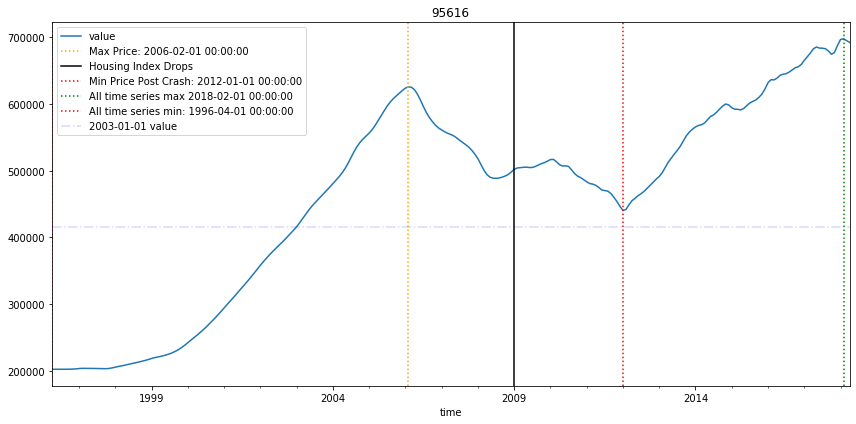


### Creating ACF and PACF plots


```python
from statsmodels.tsa.seasonal import seasonal_decompose
from statsmodels.graphics.tsaplots import plot_acf, plot_pacf
from pandas.plotting import autocorrelation_plot, lag_plot
```


```python
ts_95616.head(3)
```


<div>
<style scoped>
    .dataframe tbody tr th:only-of-type {
        vertical-align: middle;
    }

    .dataframe tbody tr th {
        vertical-align: top;
    }

    .dataframe thead th {
        text-align: right;
    }
</style>
<table border="1" class="dataframe">
  <thead>
    <tr style="text-align: right;">
      <th></th>
      <th>Zip</th>
      <th>City</th>
      <th>State</th>
      <th>Metro</th>
      <th>CountyName</th>
      <th>SizeRank</th>
      <th>value</th>
      <th>MetroState</th>
    </tr>
    <tr>
      <th>time</th>
      <th></th>
      <th></th>
      <th></th>
      <th></th>
      <th></th>
      <th></th>
      <th></th>
      <th></th>
    </tr>
  </thead>
  <tbody>
    <tr>
      <td>1996-04-01</td>
      <td>95616</td>
      <td>Davis</td>
      <td>CA</td>
      <td>Sacramento</td>
      <td>Yolo</td>
      <td>955</td>
      <td>202500.0</td>
      <td>Sacramento CA</td>
    </tr>
    <tr>
      <td>1996-05-01</td>
      <td>95616</td>
      <td>Davis</td>
      <td>CA</td>
      <td>Sacramento</td>
      <td>Yolo</td>
      <td>955</td>
      <td>202500.0</td>
      <td>Sacramento CA</td>
    </tr>
    <tr>
      <td>1996-06-01</td>
      <td>95616</td>
      <td>Davis</td>
      <td>CA</td>
      <td>Sacramento</td>
      <td>Yolo</td>
      <td>955</td>
      <td>202500.0</td>
      <td>Sacramento CA</td>
    </tr>
  </tbody>
</table>
</div>


```python
ts_95616.tail(3)
```


<div>
<style scoped>
    .dataframe tbody tr th:only-of-type {
        vertical-align: middle;
    }

    .dataframe tbody tr th {
        vertical-align: top;
    }

    .dataframe thead th {
        text-align: right;
    }
</style>
<table border="1" class="dataframe">
  <thead>
    <tr style="text-align: right;">
      <th></th>
      <th>Zip</th>
      <th>City</th>
      <th>State</th>
      <th>Metro</th>
      <th>CountyName</th>
      <th>SizeRank</th>
      <th>value</th>
      <th>MetroState</th>
    </tr>
    <tr>
      <th>time</th>
      <th></th>
      <th></th>
      <th></th>
      <th></th>
      <th></th>
      <th></th>
      <th></th>
      <th></th>
    </tr>
  </thead>
  <tbody>
    <tr>
      <td>2018-02-01</td>
      <td>95616</td>
      <td>Davis</td>
      <td>CA</td>
      <td>Sacramento</td>
      <td>Yolo</td>
      <td>955</td>
      <td>697500.0</td>
      <td>Sacramento CA</td>
    </tr>
    <tr>
      <td>2018-03-01</td>
      <td>95616</td>
      <td>Davis</td>
      <td>CA</td>
      <td>Sacramento</td>
      <td>Yolo</td>
      <td>955</td>
      <td>695000.0</td>
      <td>Sacramento CA</td>
    </tr>
    <tr>
      <td>2018-04-01</td>
      <td>95616</td>
      <td>Davis</td>
      <td>CA</td>
      <td>Sacramento</td>
      <td>Yolo</td>
      <td>955</td>
      <td>692300.0</td>
      <td>Sacramento CA</td>
    </tr>
  </tbody>
</table>
</div>


```python
ts_95616_values = ts_95616.value
```


```python
def plot_acf_pacf(ts, figsize=(10,6), lags=15):
    
    ''' Plots both ACF and PACF for given times series (ts).  Time series needs to be a Series 
    (not DataFrame) of values.  Can modify figsize and number of lags if desired.'''

    fig, ax = plt.subplots(nrows=2, figsize=figsize)
    plot_acf(ts, ax=ax[0], lags=lags)
    plot_pacf(ts, ax=ax[1], lags=lags)
    plt.tight_layout()
    
    for a in ax:
        a.xaxis.set_major_locator(mpl.ticker.MaxNLocator(min_n_ticks=lags, integer=True))
        a.xaxis.grid()
    
```


```python
plot_acf_pacf(ts_95616_values)
```


### Seasonal Decomposition


```python
# from James Irving's study group
# plot seasonal decomposition

def plot_seasonal_decomp(ts):
    decomp = seasonal_decompose(ts)
    ts_seasonal = decomp.seasonal

    ax = ts_seasonal.plot()
    fig = ax.get_figure()
    fig.set_size_inches(18,6)

    min_ = ts_seasonal.idxmin()
    max_ = ts_seasonal.idxmax()
    max_2 = ts_seasonal.loc[min_:].idxmax()
    min_2 = ts_seasonal.loc[max_2:].idxmin()


    ax.axvline(min_, label=min_, c='orange')
    ax.axvline(max_, c='orange', ls=':')
    ax.axvline(min_2, c='orange')
    ax.axvline(max_2, c='orange', ls=':')

    period = min_2 - min_ 
    ax.set_title(f'Season Length = {period}')
    
    return fig, ax

# Seasonality isn't much of a factor... maybe 0.1% in recent years from the lowest point in the year to the highest 
```


```python
plot_seasonal_decomp(ts_95616_values)
```


    (<Figure size 1296x432 with 1 Axes>,
     <matplotlib.axes._subplots.AxesSubplot at 0x1a60a69400>)


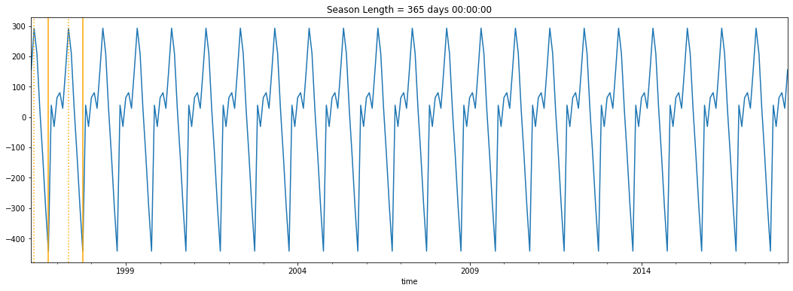


# Step 4:  ARIMA Modeling


```python
print(type(ts_95616))
ts_95616.head()  # check ts; should be a series with time as index and values
```

    <class 'pandas.core.frame.DataFrame'>


<div>
<style scoped>
    .dataframe tbody tr th:only-of-type {
        vertical-align: middle;
    }

    .dataframe tbody tr th {
        vertical-align: top;
    }

    .dataframe thead th {
        text-align: right;
    }
</style>
<table border="1" class="dataframe">
  <thead>
    <tr style="text-align: right;">
      <th></th>
      <th>Zip</th>
      <th>City</th>
      <th>State</th>
      <th>Metro</th>
      <th>CountyName</th>
      <th>SizeRank</th>
      <th>value</th>
      <th>MetroState</th>
    </tr>
    <tr>
      <th>time</th>
      <th></th>
      <th></th>
      <th></th>
      <th></th>
      <th></th>
      <th></th>
      <th></th>
      <th></th>
    </tr>
  </thead>
  <tbody>
    <tr>
      <td>1996-04-01</td>
      <td>95616</td>
      <td>Davis</td>
      <td>CA</td>
      <td>Sacramento</td>
      <td>Yolo</td>
      <td>955</td>
      <td>202500.0</td>
      <td>Sacramento CA</td>
    </tr>
    <tr>
      <td>1996-05-01</td>
      <td>95616</td>
      <td>Davis</td>
      <td>CA</td>
      <td>Sacramento</td>
      <td>Yolo</td>
      <td>955</td>
      <td>202500.0</td>
      <td>Sacramento CA</td>
    </tr>
    <tr>
      <td>1996-06-01</td>
      <td>95616</td>
      <td>Davis</td>
      <td>CA</td>
      <td>Sacramento</td>
      <td>Yolo</td>
      <td>955</td>
      <td>202500.0</td>
      <td>Sacramento CA</td>
    </tr>
    <tr>
      <td>1996-07-01</td>
      <td>95616</td>
      <td>Davis</td>
      <td>CA</td>
      <td>Sacramento</td>
      <td>Yolo</td>
      <td>955</td>
      <td>202500.0</td>
      <td>Sacramento CA</td>
    </tr>
    <tr>
      <td>1996-08-01</td>
      <td>95616</td>
      <td>Davis</td>
      <td>CA</td>
      <td>Sacramento</td>
      <td>Yolo</td>
      <td>955</td>
      <td>202500.0</td>
      <td>Sacramento CA</td>
    </tr>
  </tbody>
</table>
</div>


## Creating p, d, q, and m values for running ARIMA model


```python
import itertools

p_range = [0, 1, 2, 4, 8, 10]
q_range = range(0, 3)
d_range = range(1, 3)
m_range = (0, 6, 12)

pdq = list(itertools.product(p_range, d_range, q_range))
print(pdq)
print()
PDQM = list(itertools.product(p_range, d_range, q_range, m_range))
print(PDQM[:20])
```

    [(0, 1, 0), (0, 1, 1), (0, 1, 2), (0, 2, 0), (0, 2, 1), (0, 2, 2), (1, 1, 0), (1, 1, 1), (1, 1, 2), (1, 2, 0), (1, 2, 1), (1, 2, 2), (2, 1, 0), (2, 1, 1), (2, 1, 2), (2, 2, 0), (2, 2, 1), (2, 2, 2), (4, 1, 0), (4, 1, 1), (4, 1, 2), (4, 2, 0), (4, 2, 1), (4, 2, 2), (8, 1, 0), (8, 1, 1), (8, 1, 2), (8, 2, 0), (8, 2, 1), (8, 2, 2), (10, 1, 0), (10, 1, 1), (10, 1, 2), (10, 2, 0), (10, 2, 1), (10, 2, 2)]
    
    [(0, 1, 0, 0), (0, 1, 0, 6), (0, 1, 0, 12), (0, 1, 1, 0), (0, 1, 1, 6), (0, 1, 1, 12), (0, 1, 2, 0), (0, 1, 2, 6), (0, 1, 2, 12), (0, 2, 0, 0), (0, 2, 0, 6), (0, 2, 0, 12), (0, 2, 1, 0), (0, 2, 1, 6), (0, 2, 1, 12), (0, 2, 2, 0), (0, 2, 2, 6), (0, 2, 2, 12), (1, 1, 0, 0), (1, 1, 0, 6)]


## Setting up functions for running ARIMA models


```python
ts_95616 = df_melt['value'].loc[df_melt['Zip'] == '95616']
```


```python
ts_95616.head()
```


    time
    1996-04-01    202500.0
    1996-05-01    202500.0
    1996-06-01    202500.0
    1996-07-01    202500.0
    1996-08-01    202500.0
    Name: value, dtype: float64


```python
import warnings
from statsmodels.tsa.arima_model import ARIMA
import statsmodels.api as sm
from sklearn.metrics import mean_squared_error

```


```python
def arima_predict_error(X, arima_order):
    train_size = int(len(X) * .85)
    train, test = X[0:train_size], X[train_size:]
    predictions = list()
    history = [x for x in train]
    for t in range(len(test)):
        model = ARIMA(history, order = arima_order)
        model_fit = model.fit(disp=0)
        y_hat = model_fit.forecast()[0]
        predictions.append(y_hat)
        history.append(test[t])
    error = mean_squared_error(test, predictions)
    return error

def eval_arima_models(data, p_values, d_values, q_values):
    data = data.astype('float32')
    best_score, best_cfg = float("inf"), None
    for p in p_values:
        for d in d_values:
            for q in q_values:
                order = (p,d,q)
                try:
                    mse = arima_predict_error(data, order)
                    if mse < best_score:
                        best_score, best_cfg = mse, order
                    print('ARIMA%s MSE=%.3f' % (order,mse))
                except:
                    continue
    print('Best ARIMA%s MSE=%.3f' % (best_cfg, best_score))

```

## Function to find best p,d,q parameters for ARIMA model


```python
# evaluate parameters
p_values = [0, 1, 2, 4, 8, 10]
d_values = range(0, 3)
q_values = range(0, 3)
warnings.filterwarnings("ignore")

```


```python
# eval_arima_models(ts_95616.values, p_values, d_values, q_values)    
```

# Step 5: Interpreting Results

## Create ARIMA model for ZIP 95616 and show summary results table


```python
# Define function

def arima_zipcode(ts, order):
    model = ARIMA(ts.values, order = order)
    model_fit = model.fit(disp=0)
    print(model_fit.summary())
    return model_fit
```


```python
model_fit_davis = arima_zipcode(ts_95616_values, order = (1,1,1))
```

                                 ARIMA Model Results                              
    ==============================================================================
    Dep. Variable:                    D.y   No. Observations:                  264
    Model:                 ARIMA(1, 1, 1)   Log Likelihood               -2269.949
    Method:                       css-mle   S.D. of innovations           1305.102
    Date:                Tue, 10 Mar 2020   AIC                           4547.898
    Time:                        21:53:31   BIC                           4562.202
    Sample:                             1   HQIC                          4553.646
                                                                                  
    ==============================================================================
                     coef    std err          z      P>|z|      [0.025      0.975]
    ------------------------------------------------------------------------------
    const       1713.0323    855.569      2.002      0.046      36.148    3389.917
    ar.L1.D.y      0.8449      0.033     25.440      0.000       0.780       0.910
    ma.L1.D.y      0.6877      0.037     18.769      0.000       0.616       0.760
                                        Roots                                    
    =============================================================================
                      Real          Imaginary           Modulus         Frequency
    -----------------------------------------------------------------------------
    AR.1            1.1836           +0.0000j            1.1836            0.0000
    MA.1           -1.4541           +0.0000j            1.4541            0.5000
    -----------------------------------------------------------------------------


## Create forecast model


```python
# Define function

def forecast(model_fit, months=24, confint=2):
    forecast = model_fit.forecast(months)
    actual_forecast = forecast[0]
    std_error = forecast[1]
    forecast_confint = forecast[confint]
    return actual_forecast, std_error, forecast_confint   
```


```python
actual_forecast_95616, std_error_95616, forecast_confint_95616 = forecast(model_fit_davis)
```


```python
actual_forecast_95616, std_error_95616, forecast_confint_95616  # note standard error balloons the further 
                                              # into the future we go
```


    (array([689440.26912232, 687289.96735245, 685739.03221065, 684694.47656599,
            684077.739527  , 683822.44832141, 683872.52740303, 684180.60091615,
            684706.64300537, 685416.83751948, 686282.6146235 , 687279.83687305,
            688388.11156289, 689590.20975949, 690871.57546606, 692219.91093698,
            693624.82632743, 695077.54369728, 696570.64693639, 698097.8704872 ,
            699653.9208453 , 701234.32575283, 702835.30678844, 704453.6717238 ]),
     array([ 1305.10193226,  3553.5690106 ,  6130.12709299,  8878.61440768,
            11705.97201953, 14553.91891713, 17384.91806098, 20174.6464616 ,
            22907.55269741, 25574.05704629, 28168.70475162, 30688.90867599,
            33134.07394938, 35504.9790438 , 37803.33360297, 40031.46058193,
            42192.06715445, 44288.07973834, 46322.5257245 , 48298.44942573,
            50218.85318959, 52086.65704579, 53904.67199895, 55675.58334159]),
     array([[686882.31633894, 691998.22190571],
            [680325.10007509, 694254.8346298 ],
            [673724.20388775, 697753.86053356],
            [667292.71209432, 702096.24103765],
            [661134.45596469, 707021.0230893 ],
            [655297.29140992, 712347.6052329 ],
            [649798.71412933, 717946.34067672],
            [644639.02045057, 723722.18138172],
            [639808.6647445 , 729604.62126624],
            [635292.60677017, 735541.06826878],
            [631072.96781918, 741492.26142783],
            [627130.68114326, 747428.99260283],
            [623446.51996102, 753329.70316476],
            [620001.7295618 , 759178.68995719],
            [616778.40310869, 764964.74782344],
            [613759.68994787, 770680.13192609],
            [610929.89427141, 776319.75838346],
            [608274.50246569, 781880.58492887],
            [605780.16484343, 787361.12902935],
            [603434.64910365, 792761.09187076],
            [601226.7772488 , 798081.0644418 ],
            [599146.35386799, 803322.29763768],
            [597184.09107205, 808486.52250482],
            [595331.53355603, 813575.80989157]]))


## Create dataframe to hold these values and join to existing dataframe


```python
# Define function

def forecast_df(actual_forecast=actual_forecast, forecast_confint=forecast_confint, col = 'time', 
                daterange = pd.date_range(start='2018-05-01', end='2020-04-01', freq='MS')):
    df_forecast = pd.DataFrame({col: daterange})
    df_forecast['forecast'] = actual_forecast
    df_forecast['forecast_lower'] = forecast_confint[:, 0]
    df_forecast['forecast_upper'] = forecast_confint[:, 1]
    df_forecast.set_index('time', inplace=True)
    return df_forecast
```


```python
df_forecast_95616 = forecast_df(actual_forecast_95616, forecast_confint_95616)
```

## Create df_new with historical and forecasted values


```python
def concat_values_forecast(ts, df_forecast):
    df_new = pd.concat([ts, df_forecast])
    df_new = df_new.rename(columns = {0: 'value'})
    return df_new
```


```python
df_new_95616 = concat_values_forecast(ts_95616, df_forecast_95616)
```


```python
df_new_95616
```


<div>
<style scoped>
    .dataframe tbody tr th:only-of-type {
        vertical-align: middle;
    }

    .dataframe tbody tr th {
        vertical-align: top;
    }

    .dataframe thead th {
        text-align: right;
    }
</style>
<table border="1" class="dataframe">
  <thead>
    <tr style="text-align: right;">
      <th></th>
      <th>value</th>
      <th>forecast</th>
      <th>forecast_lower</th>
      <th>forecast_upper</th>
    </tr>
    <tr>
      <th>time</th>
      <th></th>
      <th></th>
      <th></th>
      <th></th>
    </tr>
  </thead>
  <tbody>
    <tr>
      <td>1996-04-01</td>
      <td>202500.0</td>
      <td>NaN</td>
      <td>NaN</td>
      <td>NaN</td>
    </tr>
    <tr>
      <td>1996-05-01</td>
      <td>202500.0</td>
      <td>NaN</td>
      <td>NaN</td>
      <td>NaN</td>
    </tr>
    <tr>
      <td>1996-06-01</td>
      <td>202500.0</td>
      <td>NaN</td>
      <td>NaN</td>
      <td>NaN</td>
    </tr>
    <tr>
      <td>1996-07-01</td>
      <td>202500.0</td>
      <td>NaN</td>
      <td>NaN</td>
      <td>NaN</td>
    </tr>
    <tr>
      <td>1996-08-01</td>
      <td>202500.0</td>
      <td>NaN</td>
      <td>NaN</td>
      <td>NaN</td>
    </tr>
    <tr>
      <td>1996-09-01</td>
      <td>202500.0</td>
      <td>NaN</td>
      <td>NaN</td>
      <td>NaN</td>
    </tr>
    <tr>
      <td>1996-10-01</td>
      <td>202600.0</td>
      <td>NaN</td>
      <td>NaN</td>
      <td>NaN</td>
    </tr>
    <tr>
      <td>1996-11-01</td>
      <td>202800.0</td>
      <td>NaN</td>
      <td>NaN</td>
      <td>NaN</td>
    </tr>
    <tr>
      <td>1996-12-01</td>
      <td>203100.0</td>
      <td>NaN</td>
      <td>NaN</td>
      <td>NaN</td>
    </tr>
    <tr>
      <td>1997-01-01</td>
      <td>203600.0</td>
      <td>NaN</td>
      <td>NaN</td>
      <td>NaN</td>
    </tr>
    <tr>
      <td>1997-02-01</td>
      <td>203900.0</td>
      <td>NaN</td>
      <td>NaN</td>
      <td>NaN</td>
    </tr>
    <tr>
      <td>1997-03-01</td>
      <td>203900.0</td>
      <td>NaN</td>
      <td>NaN</td>
      <td>NaN</td>
    </tr>
    <tr>
      <td>1997-04-01</td>
      <td>203900.0</td>
      <td>NaN</td>
      <td>NaN</td>
      <td>NaN</td>
    </tr>
    <tr>
      <td>1997-05-01</td>
      <td>203800.0</td>
      <td>NaN</td>
      <td>NaN</td>
      <td>NaN</td>
    </tr>
    <tr>
      <td>1997-06-01</td>
      <td>203700.0</td>
      <td>NaN</td>
      <td>NaN</td>
      <td>NaN</td>
    </tr>
    <tr>
      <td>1997-07-01</td>
      <td>203500.0</td>
      <td>NaN</td>
      <td>NaN</td>
      <td>NaN</td>
    </tr>
    <tr>
      <td>1997-08-01</td>
      <td>203400.0</td>
      <td>NaN</td>
      <td>NaN</td>
      <td>NaN</td>
    </tr>
    <tr>
      <td>1997-09-01</td>
      <td>203300.0</td>
      <td>NaN</td>
      <td>NaN</td>
      <td>NaN</td>
    </tr>
    <tr>
      <td>1997-10-01</td>
      <td>203400.0</td>
      <td>NaN</td>
      <td>NaN</td>
      <td>NaN</td>
    </tr>
    <tr>
      <td>1997-11-01</td>
      <td>203800.0</td>
      <td>NaN</td>
      <td>NaN</td>
      <td>NaN</td>
    </tr>
    <tr>
      <td>1997-12-01</td>
      <td>204600.0</td>
      <td>NaN</td>
      <td>NaN</td>
      <td>NaN</td>
    </tr>
    <tr>
      <td>1998-01-01</td>
      <td>205700.0</td>
      <td>NaN</td>
      <td>NaN</td>
      <td>NaN</td>
    </tr>
    <tr>
      <td>1998-02-01</td>
      <td>206700.0</td>
      <td>NaN</td>
      <td>NaN</td>
      <td>NaN</td>
    </tr>
    <tr>
      <td>1998-03-01</td>
      <td>207500.0</td>
      <td>NaN</td>
      <td>NaN</td>
      <td>NaN</td>
    </tr>
    <tr>
      <td>1998-04-01</td>
      <td>208500.0</td>
      <td>NaN</td>
      <td>NaN</td>
      <td>NaN</td>
    </tr>
    <tr>
      <td>1998-05-01</td>
      <td>209500.0</td>
      <td>NaN</td>
      <td>NaN</td>
      <td>NaN</td>
    </tr>
    <tr>
      <td>1998-06-01</td>
      <td>210500.0</td>
      <td>NaN</td>
      <td>NaN</td>
      <td>NaN</td>
    </tr>
    <tr>
      <td>1998-07-01</td>
      <td>211600.0</td>
      <td>NaN</td>
      <td>NaN</td>
      <td>NaN</td>
    </tr>
    <tr>
      <td>1998-08-01</td>
      <td>212600.0</td>
      <td>NaN</td>
      <td>NaN</td>
      <td>NaN</td>
    </tr>
    <tr>
      <td>1998-09-01</td>
      <td>213600.0</td>
      <td>NaN</td>
      <td>NaN</td>
      <td>NaN</td>
    </tr>
    <tr>
      <td>1998-10-01</td>
      <td>214700.0</td>
      <td>NaN</td>
      <td>NaN</td>
      <td>NaN</td>
    </tr>
    <tr>
      <td>1998-11-01</td>
      <td>215900.0</td>
      <td>NaN</td>
      <td>NaN</td>
      <td>NaN</td>
    </tr>
    <tr>
      <td>1998-12-01</td>
      <td>217200.0</td>
      <td>NaN</td>
      <td>NaN</td>
      <td>NaN</td>
    </tr>
    <tr>
      <td>1999-01-01</td>
      <td>218700.0</td>
      <td>NaN</td>
      <td>NaN</td>
      <td>NaN</td>
    </tr>
    <tr>
      <td>1999-02-01</td>
      <td>219900.0</td>
      <td>NaN</td>
      <td>NaN</td>
      <td>NaN</td>
    </tr>
    <tr>
      <td>1999-03-01</td>
      <td>220800.0</td>
      <td>NaN</td>
      <td>NaN</td>
      <td>NaN</td>
    </tr>
    <tr>
      <td>1999-04-01</td>
      <td>221800.0</td>
      <td>NaN</td>
      <td>NaN</td>
      <td>NaN</td>
    </tr>
    <tr>
      <td>1999-05-01</td>
      <td>222900.0</td>
      <td>NaN</td>
      <td>NaN</td>
      <td>NaN</td>
    </tr>
    <tr>
      <td>1999-06-01</td>
      <td>224200.0</td>
      <td>NaN</td>
      <td>NaN</td>
      <td>NaN</td>
    </tr>
    <tr>
      <td>1999-07-01</td>
      <td>225700.0</td>
      <td>NaN</td>
      <td>NaN</td>
      <td>NaN</td>
    </tr>
    <tr>
      <td>1999-08-01</td>
      <td>227500.0</td>
      <td>NaN</td>
      <td>NaN</td>
      <td>NaN</td>
    </tr>
    <tr>
      <td>1999-09-01</td>
      <td>229700.0</td>
      <td>NaN</td>
      <td>NaN</td>
      <td>NaN</td>
    </tr>
    <tr>
      <td>1999-10-01</td>
      <td>232200.0</td>
      <td>NaN</td>
      <td>NaN</td>
      <td>NaN</td>
    </tr>
    <tr>
      <td>1999-11-01</td>
      <td>235200.0</td>
      <td>NaN</td>
      <td>NaN</td>
      <td>NaN</td>
    </tr>
    <tr>
      <td>1999-12-01</td>
      <td>238600.0</td>
      <td>NaN</td>
      <td>NaN</td>
      <td>NaN</td>
    </tr>
    <tr>
      <td>2000-01-01</td>
      <td>242400.0</td>
      <td>NaN</td>
      <td>NaN</td>
      <td>NaN</td>
    </tr>
    <tr>
      <td>2000-02-01</td>
      <td>246100.0</td>
      <td>NaN</td>
      <td>NaN</td>
      <td>NaN</td>
    </tr>
    <tr>
      <td>2000-03-01</td>
      <td>249700.0</td>
      <td>NaN</td>
      <td>NaN</td>
      <td>NaN</td>
    </tr>
    <tr>
      <td>2000-04-01</td>
      <td>253400.0</td>
      <td>NaN</td>
      <td>NaN</td>
      <td>NaN</td>
    </tr>
    <tr>
      <td>2000-05-01</td>
      <td>257300.0</td>
      <td>NaN</td>
      <td>NaN</td>
      <td>NaN</td>
    </tr>
    <tr>
      <td>2000-06-01</td>
      <td>261300.0</td>
      <td>NaN</td>
      <td>NaN</td>
      <td>NaN</td>
    </tr>
    <tr>
      <td>2000-07-01</td>
      <td>265500.0</td>
      <td>NaN</td>
      <td>NaN</td>
      <td>NaN</td>
    </tr>
    <tr>
      <td>2000-08-01</td>
      <td>270000.0</td>
      <td>NaN</td>
      <td>NaN</td>
      <td>NaN</td>
    </tr>
    <tr>
      <td>2000-09-01</td>
      <td>274500.0</td>
      <td>NaN</td>
      <td>NaN</td>
      <td>NaN</td>
    </tr>
    <tr>
      <td>2000-10-01</td>
      <td>279200.0</td>
      <td>NaN</td>
      <td>NaN</td>
      <td>NaN</td>
    </tr>
    <tr>
      <td>2000-11-01</td>
      <td>284100.0</td>
      <td>NaN</td>
      <td>NaN</td>
      <td>NaN</td>
    </tr>
    <tr>
      <td>2000-12-01</td>
      <td>289200.0</td>
      <td>NaN</td>
      <td>NaN</td>
      <td>NaN</td>
    </tr>
    <tr>
      <td>2001-01-01</td>
      <td>294400.0</td>
      <td>NaN</td>
      <td>NaN</td>
      <td>NaN</td>
    </tr>
    <tr>
      <td>2001-02-01</td>
      <td>299500.0</td>
      <td>NaN</td>
      <td>NaN</td>
      <td>NaN</td>
    </tr>
    <tr>
      <td>2001-03-01</td>
      <td>304500.0</td>
      <td>NaN</td>
      <td>NaN</td>
      <td>NaN</td>
    </tr>
    <tr>
      <td>2001-04-01</td>
      <td>309600.0</td>
      <td>NaN</td>
      <td>NaN</td>
      <td>NaN</td>
    </tr>
    <tr>
      <td>2001-05-01</td>
      <td>314800.0</td>
      <td>NaN</td>
      <td>NaN</td>
      <td>NaN</td>
    </tr>
    <tr>
      <td>2001-06-01</td>
      <td>320000.0</td>
      <td>NaN</td>
      <td>NaN</td>
      <td>NaN</td>
    </tr>
    <tr>
      <td>2001-07-01</td>
      <td>325100.0</td>
      <td>NaN</td>
      <td>NaN</td>
      <td>NaN</td>
    </tr>
    <tr>
      <td>2001-08-01</td>
      <td>330400.0</td>
      <td>NaN</td>
      <td>NaN</td>
      <td>NaN</td>
    </tr>
    <tr>
      <td>2001-09-01</td>
      <td>335700.0</td>
      <td>NaN</td>
      <td>NaN</td>
      <td>NaN</td>
    </tr>
    <tr>
      <td>2001-10-01</td>
      <td>341200.0</td>
      <td>NaN</td>
      <td>NaN</td>
      <td>NaN</td>
    </tr>
    <tr>
      <td>2001-11-01</td>
      <td>346900.0</td>
      <td>NaN</td>
      <td>NaN</td>
      <td>NaN</td>
    </tr>
    <tr>
      <td>2001-12-01</td>
      <td>352600.0</td>
      <td>NaN</td>
      <td>NaN</td>
      <td>NaN</td>
    </tr>
    <tr>
      <td>2002-01-01</td>
      <td>358300.0</td>
      <td>NaN</td>
      <td>NaN</td>
      <td>NaN</td>
    </tr>
    <tr>
      <td>2002-02-01</td>
      <td>363700.0</td>
      <td>NaN</td>
      <td>NaN</td>
      <td>NaN</td>
    </tr>
    <tr>
      <td>2002-03-01</td>
      <td>368800.0</td>
      <td>NaN</td>
      <td>NaN</td>
      <td>NaN</td>
    </tr>
    <tr>
      <td>2002-04-01</td>
      <td>373900.0</td>
      <td>NaN</td>
      <td>NaN</td>
      <td>NaN</td>
    </tr>
    <tr>
      <td>2002-05-01</td>
      <td>378600.0</td>
      <td>NaN</td>
      <td>NaN</td>
      <td>NaN</td>
    </tr>
    <tr>
      <td>2002-06-01</td>
      <td>383100.0</td>
      <td>NaN</td>
      <td>NaN</td>
      <td>NaN</td>
    </tr>
    <tr>
      <td>2002-07-01</td>
      <td>387500.0</td>
      <td>NaN</td>
      <td>NaN</td>
      <td>NaN</td>
    </tr>
    <tr>
      <td>2002-08-01</td>
      <td>391900.0</td>
      <td>NaN</td>
      <td>NaN</td>
      <td>NaN</td>
    </tr>
    <tr>
      <td>2002-09-01</td>
      <td>396400.0</td>
      <td>NaN</td>
      <td>NaN</td>
      <td>NaN</td>
    </tr>
    <tr>
      <td>2002-10-01</td>
      <td>401200.0</td>
      <td>NaN</td>
      <td>NaN</td>
      <td>NaN</td>
    </tr>
    <tr>
      <td>2002-11-01</td>
      <td>406100.0</td>
      <td>NaN</td>
      <td>NaN</td>
      <td>NaN</td>
    </tr>
    <tr>
      <td>2002-12-01</td>
      <td>410900.0</td>
      <td>NaN</td>
      <td>NaN</td>
      <td>NaN</td>
    </tr>
    <tr>
      <td>2003-01-01</td>
      <td>416100.0</td>
      <td>NaN</td>
      <td>NaN</td>
      <td>NaN</td>
    </tr>
    <tr>
      <td>2003-02-01</td>
      <td>422000.0</td>
      <td>NaN</td>
      <td>NaN</td>
      <td>NaN</td>
    </tr>
    <tr>
      <td>2003-03-01</td>
      <td>428300.0</td>
      <td>NaN</td>
      <td>NaN</td>
      <td>NaN</td>
    </tr>
    <tr>
      <td>2003-04-01</td>
      <td>434800.0</td>
      <td>NaN</td>
      <td>NaN</td>
      <td>NaN</td>
    </tr>
    <tr>
      <td>2003-05-01</td>
      <td>440900.0</td>
      <td>NaN</td>
      <td>NaN</td>
      <td>NaN</td>
    </tr>
    <tr>
      <td>2003-06-01</td>
      <td>446500.0</td>
      <td>NaN</td>
      <td>NaN</td>
      <td>NaN</td>
    </tr>
    <tr>
      <td>2003-07-01</td>
      <td>451600.0</td>
      <td>NaN</td>
      <td>NaN</td>
      <td>NaN</td>
    </tr>
    <tr>
      <td>2003-08-01</td>
      <td>456400.0</td>
      <td>NaN</td>
      <td>NaN</td>
      <td>NaN</td>
    </tr>
    <tr>
      <td>2003-09-01</td>
      <td>461000.0</td>
      <td>NaN</td>
      <td>NaN</td>
      <td>NaN</td>
    </tr>
    <tr>
      <td>2003-10-01</td>
      <td>465800.0</td>
      <td>NaN</td>
      <td>NaN</td>
      <td>NaN</td>
    </tr>
    <tr>
      <td>2003-11-01</td>
      <td>470600.0</td>
      <td>NaN</td>
      <td>NaN</td>
      <td>NaN</td>
    </tr>
    <tr>
      <td>2003-12-01</td>
      <td>475600.0</td>
      <td>NaN</td>
      <td>NaN</td>
      <td>NaN</td>
    </tr>
    <tr>
      <td>2004-01-01</td>
      <td>480700.0</td>
      <td>NaN</td>
      <td>NaN</td>
      <td>NaN</td>
    </tr>
    <tr>
      <td>2004-02-01</td>
      <td>485600.0</td>
      <td>NaN</td>
      <td>NaN</td>
      <td>NaN</td>
    </tr>
    <tr>
      <td>2004-03-01</td>
      <td>490700.0</td>
      <td>NaN</td>
      <td>NaN</td>
      <td>NaN</td>
    </tr>
    <tr>
      <td>2004-04-01</td>
      <td>496400.0</td>
      <td>NaN</td>
      <td>NaN</td>
      <td>NaN</td>
    </tr>
    <tr>
      <td>2004-05-01</td>
      <td>503000.0</td>
      <td>NaN</td>
      <td>NaN</td>
      <td>NaN</td>
    </tr>
    <tr>
      <td>2004-06-01</td>
      <td>510900.0</td>
      <td>NaN</td>
      <td>NaN</td>
      <td>NaN</td>
    </tr>
    <tr>
      <td>2004-07-01</td>
      <td>519700.0</td>
      <td>NaN</td>
      <td>NaN</td>
      <td>NaN</td>
    </tr>
    <tr>
      <td>2004-08-01</td>
      <td>528500.0</td>
      <td>NaN</td>
      <td>NaN</td>
      <td>NaN</td>
    </tr>
    <tr>
      <td>2004-09-01</td>
      <td>536200.0</td>
      <td>NaN</td>
      <td>NaN</td>
      <td>NaN</td>
    </tr>
    <tr>
      <td>2004-10-01</td>
      <td>542600.0</td>
      <td>NaN</td>
      <td>NaN</td>
      <td>NaN</td>
    </tr>
    <tr>
      <td>2004-11-01</td>
      <td>547600.0</td>
      <td>NaN</td>
      <td>NaN</td>
      <td>NaN</td>
    </tr>
    <tr>
      <td>2004-12-01</td>
      <td>551900.0</td>
      <td>NaN</td>
      <td>NaN</td>
      <td>NaN</td>
    </tr>
    <tr>
      <td>2005-01-01</td>
      <td>556400.0</td>
      <td>NaN</td>
      <td>NaN</td>
      <td>NaN</td>
    </tr>
    <tr>
      <td>2005-02-01</td>
      <td>561600.0</td>
      <td>NaN</td>
      <td>NaN</td>
      <td>NaN</td>
    </tr>
    <tr>
      <td>2005-03-01</td>
      <td>567900.0</td>
      <td>NaN</td>
      <td>NaN</td>
      <td>NaN</td>
    </tr>
    <tr>
      <td>2005-04-01</td>
      <td>575100.0</td>
      <td>NaN</td>
      <td>NaN</td>
      <td>NaN</td>
    </tr>
    <tr>
      <td>2005-05-01</td>
      <td>582600.0</td>
      <td>NaN</td>
      <td>NaN</td>
      <td>NaN</td>
    </tr>
    <tr>
      <td>2005-06-01</td>
      <td>590000.0</td>
      <td>NaN</td>
      <td>NaN</td>
      <td>NaN</td>
    </tr>
    <tr>
      <td>2005-07-01</td>
      <td>597000.0</td>
      <td>NaN</td>
      <td>NaN</td>
      <td>NaN</td>
    </tr>
    <tr>
      <td>2005-08-01</td>
      <td>603000.0</td>
      <td>NaN</td>
      <td>NaN</td>
      <td>NaN</td>
    </tr>
    <tr>
      <td>2005-09-01</td>
      <td>608000.0</td>
      <td>NaN</td>
      <td>NaN</td>
      <td>NaN</td>
    </tr>
    <tr>
      <td>2005-10-01</td>
      <td>612200.0</td>
      <td>NaN</td>
      <td>NaN</td>
      <td>NaN</td>
    </tr>
    <tr>
      <td>2005-11-01</td>
      <td>616200.0</td>
      <td>NaN</td>
      <td>NaN</td>
      <td>NaN</td>
    </tr>
    <tr>
      <td>2005-12-01</td>
      <td>620300.0</td>
      <td>NaN</td>
      <td>NaN</td>
      <td>NaN</td>
    </tr>
    <tr>
      <td>2006-01-01</td>
      <td>623800.0</td>
      <td>NaN</td>
      <td>NaN</td>
      <td>NaN</td>
    </tr>
    <tr>
      <td>2006-02-01</td>
      <td>625600.0</td>
      <td>NaN</td>
      <td>NaN</td>
      <td>NaN</td>
    </tr>
    <tr>
      <td>2006-03-01</td>
      <td>625100.0</td>
      <td>NaN</td>
      <td>NaN</td>
      <td>NaN</td>
    </tr>
    <tr>
      <td>2006-04-01</td>
      <td>621400.0</td>
      <td>NaN</td>
      <td>NaN</td>
      <td>NaN</td>
    </tr>
    <tr>
      <td>2006-05-01</td>
      <td>614700.0</td>
      <td>NaN</td>
      <td>NaN</td>
      <td>NaN</td>
    </tr>
    <tr>
      <td>2006-06-01</td>
      <td>605700.0</td>
      <td>NaN</td>
      <td>NaN</td>
      <td>NaN</td>
    </tr>
    <tr>
      <td>2006-07-01</td>
      <td>595800.0</td>
      <td>NaN</td>
      <td>NaN</td>
      <td>NaN</td>
    </tr>
    <tr>
      <td>2006-08-01</td>
      <td>586700.0</td>
      <td>NaN</td>
      <td>NaN</td>
      <td>NaN</td>
    </tr>
    <tr>
      <td>2006-09-01</td>
      <td>579300.0</td>
      <td>NaN</td>
      <td>NaN</td>
      <td>NaN</td>
    </tr>
    <tr>
      <td>2006-10-01</td>
      <td>573200.0</td>
      <td>NaN</td>
      <td>NaN</td>
      <td>NaN</td>
    </tr>
    <tr>
      <td>2006-11-01</td>
      <td>568000.0</td>
      <td>NaN</td>
      <td>NaN</td>
      <td>NaN</td>
    </tr>
    <tr>
      <td>2006-12-01</td>
      <td>564000.0</td>
      <td>NaN</td>
      <td>NaN</td>
      <td>NaN</td>
    </tr>
    <tr>
      <td>2007-01-01</td>
      <td>561100.0</td>
      <td>NaN</td>
      <td>NaN</td>
      <td>NaN</td>
    </tr>
    <tr>
      <td>2007-02-01</td>
      <td>558400.0</td>
      <td>NaN</td>
      <td>NaN</td>
      <td>NaN</td>
    </tr>
    <tr>
      <td>2007-03-01</td>
      <td>556100.0</td>
      <td>NaN</td>
      <td>NaN</td>
      <td>NaN</td>
    </tr>
    <tr>
      <td>2007-04-01</td>
      <td>554300.0</td>
      <td>NaN</td>
      <td>NaN</td>
      <td>NaN</td>
    </tr>
    <tr>
      <td>2007-05-01</td>
      <td>552200.0</td>
      <td>NaN</td>
      <td>NaN</td>
      <td>NaN</td>
    </tr>
    <tr>
      <td>2007-06-01</td>
      <td>549100.0</td>
      <td>NaN</td>
      <td>NaN</td>
      <td>NaN</td>
    </tr>
    <tr>
      <td>2007-07-01</td>
      <td>545500.0</td>
      <td>NaN</td>
      <td>NaN</td>
      <td>NaN</td>
    </tr>
    <tr>
      <td>2007-08-01</td>
      <td>542200.0</td>
      <td>NaN</td>
      <td>NaN</td>
      <td>NaN</td>
    </tr>
    <tr>
      <td>2007-09-01</td>
      <td>538900.0</td>
      <td>NaN</td>
      <td>NaN</td>
      <td>NaN</td>
    </tr>
    <tr>
      <td>2007-10-01</td>
      <td>535200.0</td>
      <td>NaN</td>
      <td>NaN</td>
      <td>NaN</td>
    </tr>
    <tr>
      <td>2007-11-01</td>
      <td>530500.0</td>
      <td>NaN</td>
      <td>NaN</td>
      <td>NaN</td>
    </tr>
    <tr>
      <td>2007-12-01</td>
      <td>524800.0</td>
      <td>NaN</td>
      <td>NaN</td>
      <td>NaN</td>
    </tr>
    <tr>
      <td>2008-01-01</td>
      <td>518000.0</td>
      <td>NaN</td>
      <td>NaN</td>
      <td>NaN</td>
    </tr>
    <tr>
      <td>2008-02-01</td>
      <td>509500.0</td>
      <td>NaN</td>
      <td>NaN</td>
      <td>NaN</td>
    </tr>
    <tr>
      <td>2008-03-01</td>
      <td>500800.0</td>
      <td>NaN</td>
      <td>NaN</td>
      <td>NaN</td>
    </tr>
    <tr>
      <td>2008-04-01</td>
      <td>494100.0</td>
      <td>NaN</td>
      <td>NaN</td>
      <td>NaN</td>
    </tr>
    <tr>
      <td>2008-05-01</td>
      <td>490400.0</td>
      <td>NaN</td>
      <td>NaN</td>
      <td>NaN</td>
    </tr>
    <tr>
      <td>2008-06-01</td>
      <td>488800.0</td>
      <td>NaN</td>
      <td>NaN</td>
      <td>NaN</td>
    </tr>
    <tr>
      <td>2008-07-01</td>
      <td>488600.0</td>
      <td>NaN</td>
      <td>NaN</td>
      <td>NaN</td>
    </tr>
    <tr>
      <td>2008-08-01</td>
      <td>489100.0</td>
      <td>NaN</td>
      <td>NaN</td>
      <td>NaN</td>
    </tr>
    <tr>
      <td>2008-09-01</td>
      <td>490300.0</td>
      <td>NaN</td>
      <td>NaN</td>
      <td>NaN</td>
    </tr>
    <tr>
      <td>2008-10-01</td>
      <td>492000.0</td>
      <td>NaN</td>
      <td>NaN</td>
      <td>NaN</td>
    </tr>
    <tr>
      <td>2008-11-01</td>
      <td>494300.0</td>
      <td>NaN</td>
      <td>NaN</td>
      <td>NaN</td>
    </tr>
    <tr>
      <td>2008-12-01</td>
      <td>497900.0</td>
      <td>NaN</td>
      <td>NaN</td>
      <td>NaN</td>
    </tr>
    <tr>
      <td>2009-01-01</td>
      <td>502000.0</td>
      <td>NaN</td>
      <td>NaN</td>
      <td>NaN</td>
    </tr>
    <tr>
      <td>2009-02-01</td>
      <td>504100.0</td>
      <td>NaN</td>
      <td>NaN</td>
      <td>NaN</td>
    </tr>
    <tr>
      <td>2009-03-01</td>
      <td>504600.0</td>
      <td>NaN</td>
      <td>NaN</td>
      <td>NaN</td>
    </tr>
    <tr>
      <td>2009-04-01</td>
      <td>505100.0</td>
      <td>NaN</td>
      <td>NaN</td>
      <td>NaN</td>
    </tr>
    <tr>
      <td>2009-05-01</td>
      <td>505400.0</td>
      <td>NaN</td>
      <td>NaN</td>
      <td>NaN</td>
    </tr>
    <tr>
      <td>2009-06-01</td>
      <td>504800.0</td>
      <td>NaN</td>
      <td>NaN</td>
      <td>NaN</td>
    </tr>
    <tr>
      <td>2009-07-01</td>
      <td>504900.0</td>
      <td>NaN</td>
      <td>NaN</td>
      <td>NaN</td>
    </tr>
    <tr>
      <td>2009-08-01</td>
      <td>506400.0</td>
      <td>NaN</td>
      <td>NaN</td>
      <td>NaN</td>
    </tr>
    <tr>
      <td>2009-09-01</td>
      <td>508600.0</td>
      <td>NaN</td>
      <td>NaN</td>
      <td>NaN</td>
    </tr>
    <tr>
      <td>2009-10-01</td>
      <td>510600.0</td>
      <td>NaN</td>
      <td>NaN</td>
      <td>NaN</td>
    </tr>
    <tr>
      <td>2009-11-01</td>
      <td>512100.0</td>
      <td>NaN</td>
      <td>NaN</td>
      <td>NaN</td>
    </tr>
    <tr>
      <td>2009-12-01</td>
      <td>514300.0</td>
      <td>NaN</td>
      <td>NaN</td>
      <td>NaN</td>
    </tr>
    <tr>
      <td>2010-01-01</td>
      <td>516700.0</td>
      <td>NaN</td>
      <td>NaN</td>
      <td>NaN</td>
    </tr>
    <tr>
      <td>2010-02-01</td>
      <td>517000.0</td>
      <td>NaN</td>
      <td>NaN</td>
      <td>NaN</td>
    </tr>
    <tr>
      <td>2010-03-01</td>
      <td>513400.0</td>
      <td>NaN</td>
      <td>NaN</td>
      <td>NaN</td>
    </tr>
    <tr>
      <td>2010-04-01</td>
      <td>509100.0</td>
      <td>NaN</td>
      <td>NaN</td>
      <td>NaN</td>
    </tr>
    <tr>
      <td>2010-05-01</td>
      <td>507000.0</td>
      <td>NaN</td>
      <td>NaN</td>
      <td>NaN</td>
    </tr>
    <tr>
      <td>2010-06-01</td>
      <td>507400.0</td>
      <td>NaN</td>
      <td>NaN</td>
      <td>NaN</td>
    </tr>
    <tr>
      <td>2010-07-01</td>
      <td>506400.0</td>
      <td>NaN</td>
      <td>NaN</td>
      <td>NaN</td>
    </tr>
    <tr>
      <td>2010-08-01</td>
      <td>501300.0</td>
      <td>NaN</td>
      <td>NaN</td>
      <td>NaN</td>
    </tr>
    <tr>
      <td>2010-09-01</td>
      <td>495700.0</td>
      <td>NaN</td>
      <td>NaN</td>
      <td>NaN</td>
    </tr>
    <tr>
      <td>2010-10-01</td>
      <td>491900.0</td>
      <td>NaN</td>
      <td>NaN</td>
      <td>NaN</td>
    </tr>
    <tr>
      <td>2010-11-01</td>
      <td>489700.0</td>
      <td>NaN</td>
      <td>NaN</td>
      <td>NaN</td>
    </tr>
    <tr>
      <td>2010-12-01</td>
      <td>486500.0</td>
      <td>NaN</td>
      <td>NaN</td>
      <td>NaN</td>
    </tr>
    <tr>
      <td>2011-01-01</td>
      <td>483400.0</td>
      <td>NaN</td>
      <td>NaN</td>
      <td>NaN</td>
    </tr>
    <tr>
      <td>2011-02-01</td>
      <td>480800.0</td>
      <td>NaN</td>
      <td>NaN</td>
      <td>NaN</td>
    </tr>
    <tr>
      <td>2011-03-01</td>
      <td>480000.0</td>
      <td>NaN</td>
      <td>NaN</td>
      <td>NaN</td>
    </tr>
    <tr>
      <td>2011-04-01</td>
      <td>478100.0</td>
      <td>NaN</td>
      <td>NaN</td>
      <td>NaN</td>
    </tr>
    <tr>
      <td>2011-05-01</td>
      <td>475000.0</td>
      <td>NaN</td>
      <td>NaN</td>
      <td>NaN</td>
    </tr>
    <tr>
      <td>2011-06-01</td>
      <td>471100.0</td>
      <td>NaN</td>
      <td>NaN</td>
      <td>NaN</td>
    </tr>
    <tr>
      <td>2011-07-01</td>
      <td>470200.0</td>
      <td>NaN</td>
      <td>NaN</td>
      <td>NaN</td>
    </tr>
    <tr>
      <td>2011-08-01</td>
      <td>469400.0</td>
      <td>NaN</td>
      <td>NaN</td>
      <td>NaN</td>
    </tr>
    <tr>
      <td>2011-09-01</td>
      <td>465800.0</td>
      <td>NaN</td>
      <td>NaN</td>
      <td>NaN</td>
    </tr>
    <tr>
      <td>2011-10-01</td>
      <td>460200.0</td>
      <td>NaN</td>
      <td>NaN</td>
      <td>NaN</td>
    </tr>
    <tr>
      <td>2011-11-01</td>
      <td>453900.0</td>
      <td>NaN</td>
      <td>NaN</td>
      <td>NaN</td>
    </tr>
    <tr>
      <td>2011-12-01</td>
      <td>446700.0</td>
      <td>NaN</td>
      <td>NaN</td>
      <td>NaN</td>
    </tr>
    <tr>
      <td>2012-01-01</td>
      <td>440500.0</td>
      <td>NaN</td>
      <td>NaN</td>
      <td>NaN</td>
    </tr>
    <tr>
      <td>2012-02-01</td>
      <td>441900.0</td>
      <td>NaN</td>
      <td>NaN</td>
      <td>NaN</td>
    </tr>
    <tr>
      <td>2012-03-01</td>
      <td>449100.0</td>
      <td>NaN</td>
      <td>NaN</td>
      <td>NaN</td>
    </tr>
    <tr>
      <td>2012-04-01</td>
      <td>455200.0</td>
      <td>NaN</td>
      <td>NaN</td>
      <td>NaN</td>
    </tr>
    <tr>
      <td>2012-05-01</td>
      <td>458600.0</td>
      <td>NaN</td>
      <td>NaN</td>
      <td>NaN</td>
    </tr>
    <tr>
      <td>2012-06-01</td>
      <td>462600.0</td>
      <td>NaN</td>
      <td>NaN</td>
      <td>NaN</td>
    </tr>
    <tr>
      <td>2012-07-01</td>
      <td>465600.0</td>
      <td>NaN</td>
      <td>NaN</td>
      <td>NaN</td>
    </tr>
    <tr>
      <td>2012-08-01</td>
      <td>469100.0</td>
      <td>NaN</td>
      <td>NaN</td>
      <td>NaN</td>
    </tr>
    <tr>
      <td>2012-09-01</td>
      <td>473700.0</td>
      <td>NaN</td>
      <td>NaN</td>
      <td>NaN</td>
    </tr>
    <tr>
      <td>2012-10-01</td>
      <td>478300.0</td>
      <td>NaN</td>
      <td>NaN</td>
      <td>NaN</td>
    </tr>
    <tr>
      <td>2012-11-01</td>
      <td>483100.0</td>
      <td>NaN</td>
      <td>NaN</td>
      <td>NaN</td>
    </tr>
    <tr>
      <td>2012-12-01</td>
      <td>487400.0</td>
      <td>NaN</td>
      <td>NaN</td>
      <td>NaN</td>
    </tr>
    <tr>
      <td>2013-01-01</td>
      <td>491300.0</td>
      <td>NaN</td>
      <td>NaN</td>
      <td>NaN</td>
    </tr>
    <tr>
      <td>2013-02-01</td>
      <td>497100.0</td>
      <td>NaN</td>
      <td>NaN</td>
      <td>NaN</td>
    </tr>
    <tr>
      <td>2013-03-01</td>
      <td>505000.0</td>
      <td>NaN</td>
      <td>NaN</td>
      <td>NaN</td>
    </tr>
    <tr>
      <td>2013-04-01</td>
      <td>512900.0</td>
      <td>NaN</td>
      <td>NaN</td>
      <td>NaN</td>
    </tr>
    <tr>
      <td>2013-05-01</td>
      <td>519000.0</td>
      <td>NaN</td>
      <td>NaN</td>
      <td>NaN</td>
    </tr>
    <tr>
      <td>2013-06-01</td>
      <td>525000.0</td>
      <td>NaN</td>
      <td>NaN</td>
      <td>NaN</td>
    </tr>
    <tr>
      <td>2013-07-01</td>
      <td>530600.0</td>
      <td>NaN</td>
      <td>NaN</td>
      <td>NaN</td>
    </tr>
    <tr>
      <td>2013-08-01</td>
      <td>536900.0</td>
      <td>NaN</td>
      <td>NaN</td>
      <td>NaN</td>
    </tr>
    <tr>
      <td>2013-09-01</td>
      <td>544600.0</td>
      <td>NaN</td>
      <td>NaN</td>
      <td>NaN</td>
    </tr>
    <tr>
      <td>2013-10-01</td>
      <td>552600.0</td>
      <td>NaN</td>
      <td>NaN</td>
      <td>NaN</td>
    </tr>
    <tr>
      <td>2013-11-01</td>
      <td>558000.0</td>
      <td>NaN</td>
      <td>NaN</td>
      <td>NaN</td>
    </tr>
    <tr>
      <td>2013-12-01</td>
      <td>562200.0</td>
      <td>NaN</td>
      <td>NaN</td>
      <td>NaN</td>
    </tr>
    <tr>
      <td>2014-01-01</td>
      <td>565600.0</td>
      <td>NaN</td>
      <td>NaN</td>
      <td>NaN</td>
    </tr>
    <tr>
      <td>2014-02-01</td>
      <td>567900.0</td>
      <td>NaN</td>
      <td>NaN</td>
      <td>NaN</td>
    </tr>
    <tr>
      <td>2014-03-01</td>
      <td>568900.0</td>
      <td>NaN</td>
      <td>NaN</td>
      <td>NaN</td>
    </tr>
    <tr>
      <td>2014-04-01</td>
      <td>571500.0</td>
      <td>NaN</td>
      <td>NaN</td>
      <td>NaN</td>
    </tr>
    <tr>
      <td>2014-05-01</td>
      <td>576600.0</td>
      <td>NaN</td>
      <td>NaN</td>
      <td>NaN</td>
    </tr>
    <tr>
      <td>2014-06-01</td>
      <td>581400.0</td>
      <td>NaN</td>
      <td>NaN</td>
      <td>NaN</td>
    </tr>
    <tr>
      <td>2014-07-01</td>
      <td>583700.0</td>
      <td>NaN</td>
      <td>NaN</td>
      <td>NaN</td>
    </tr>
    <tr>
      <td>2014-08-01</td>
      <td>587700.0</td>
      <td>NaN</td>
      <td>NaN</td>
      <td>NaN</td>
    </tr>
    <tr>
      <td>2014-09-01</td>
      <td>592500.0</td>
      <td>NaN</td>
      <td>NaN</td>
      <td>NaN</td>
    </tr>
    <tr>
      <td>2014-10-01</td>
      <td>596900.0</td>
      <td>NaN</td>
      <td>NaN</td>
      <td>NaN</td>
    </tr>
    <tr>
      <td>2014-11-01</td>
      <td>600000.0</td>
      <td>NaN</td>
      <td>NaN</td>
      <td>NaN</td>
    </tr>
    <tr>
      <td>2014-12-01</td>
      <td>598600.0</td>
      <td>NaN</td>
      <td>NaN</td>
      <td>NaN</td>
    </tr>
    <tr>
      <td>2015-01-01</td>
      <td>594400.0</td>
      <td>NaN</td>
      <td>NaN</td>
      <td>NaN</td>
    </tr>
    <tr>
      <td>2015-02-01</td>
      <td>592300.0</td>
      <td>NaN</td>
      <td>NaN</td>
      <td>NaN</td>
    </tr>
    <tr>
      <td>2015-03-01</td>
      <td>592000.0</td>
      <td>NaN</td>
      <td>NaN</td>
      <td>NaN</td>
    </tr>
    <tr>
      <td>2015-04-01</td>
      <td>591200.0</td>
      <td>NaN</td>
      <td>NaN</td>
      <td>NaN</td>
    </tr>
    <tr>
      <td>2015-05-01</td>
      <td>593400.0</td>
      <td>NaN</td>
      <td>NaN</td>
      <td>NaN</td>
    </tr>
    <tr>
      <td>2015-06-01</td>
      <td>597700.0</td>
      <td>NaN</td>
      <td>NaN</td>
      <td>NaN</td>
    </tr>
    <tr>
      <td>2015-07-01</td>
      <td>601600.0</td>
      <td>NaN</td>
      <td>NaN</td>
      <td>NaN</td>
    </tr>
    <tr>
      <td>2015-08-01</td>
      <td>603900.0</td>
      <td>NaN</td>
      <td>NaN</td>
      <td>NaN</td>
    </tr>
    <tr>
      <td>2015-09-01</td>
      <td>606200.0</td>
      <td>NaN</td>
      <td>NaN</td>
      <td>NaN</td>
    </tr>
    <tr>
      <td>2015-10-01</td>
      <td>610000.0</td>
      <td>NaN</td>
      <td>NaN</td>
      <td>NaN</td>
    </tr>
    <tr>
      <td>2015-11-01</td>
      <td>614900.0</td>
      <td>NaN</td>
      <td>NaN</td>
      <td>NaN</td>
    </tr>
    <tr>
      <td>2015-12-01</td>
      <td>622600.0</td>
      <td>NaN</td>
      <td>NaN</td>
      <td>NaN</td>
    </tr>
    <tr>
      <td>2016-01-01</td>
      <td>631800.0</td>
      <td>NaN</td>
      <td>NaN</td>
      <td>NaN</td>
    </tr>
    <tr>
      <td>2016-02-01</td>
      <td>636400.0</td>
      <td>NaN</td>
      <td>NaN</td>
      <td>NaN</td>
    </tr>
    <tr>
      <td>2016-03-01</td>
      <td>636100.0</td>
      <td>NaN</td>
      <td>NaN</td>
      <td>NaN</td>
    </tr>
    <tr>
      <td>2016-04-01</td>
      <td>638800.0</td>
      <td>NaN</td>
      <td>NaN</td>
      <td>NaN</td>
    </tr>
    <tr>
      <td>2016-05-01</td>
      <td>642900.0</td>
      <td>NaN</td>
      <td>NaN</td>
      <td>NaN</td>
    </tr>
    <tr>
      <td>2016-06-01</td>
      <td>644600.0</td>
      <td>NaN</td>
      <td>NaN</td>
      <td>NaN</td>
    </tr>
    <tr>
      <td>2016-07-01</td>
      <td>645400.0</td>
      <td>NaN</td>
      <td>NaN</td>
      <td>NaN</td>
    </tr>
    <tr>
      <td>2016-08-01</td>
      <td>647800.0</td>
      <td>NaN</td>
      <td>NaN</td>
      <td>NaN</td>
    </tr>
    <tr>
      <td>2016-09-01</td>
      <td>651100.0</td>
      <td>NaN</td>
      <td>NaN</td>
      <td>NaN</td>
    </tr>
    <tr>
      <td>2016-10-01</td>
      <td>654300.0</td>
      <td>NaN</td>
      <td>NaN</td>
      <td>NaN</td>
    </tr>
    <tr>
      <td>2016-11-01</td>
      <td>655800.0</td>
      <td>NaN</td>
      <td>NaN</td>
      <td>NaN</td>
    </tr>
    <tr>
      <td>2016-12-01</td>
      <td>659200.0</td>
      <td>NaN</td>
      <td>NaN</td>
      <td>NaN</td>
    </tr>
    <tr>
      <td>2017-01-01</td>
      <td>665400.0</td>
      <td>NaN</td>
      <td>NaN</td>
      <td>NaN</td>
    </tr>
    <tr>
      <td>2017-02-01</td>
      <td>670700.0</td>
      <td>NaN</td>
      <td>NaN</td>
      <td>NaN</td>
    </tr>
    <tr>
      <td>2017-03-01</td>
      <td>676300.0</td>
      <td>NaN</td>
      <td>NaN</td>
      <td>NaN</td>
    </tr>
    <tr>
      <td>2017-04-01</td>
      <td>682600.0</td>
      <td>NaN</td>
      <td>NaN</td>
      <td>NaN</td>
    </tr>
    <tr>
      <td>2017-05-01</td>
      <td>685400.0</td>
      <td>NaN</td>
      <td>NaN</td>
      <td>NaN</td>
    </tr>
    <tr>
      <td>2017-06-01</td>
      <td>683800.0</td>
      <td>NaN</td>
      <td>NaN</td>
      <td>NaN</td>
    </tr>
    <tr>
      <td>2017-07-01</td>
      <td>683600.0</td>
      <td>NaN</td>
      <td>NaN</td>
      <td>NaN</td>
    </tr>
    <tr>
      <td>2017-08-01</td>
      <td>682800.0</td>
      <td>NaN</td>
      <td>NaN</td>
      <td>NaN</td>
    </tr>
    <tr>
      <td>2017-09-01</td>
      <td>679400.0</td>
      <td>NaN</td>
      <td>NaN</td>
      <td>NaN</td>
    </tr>
    <tr>
      <td>2017-10-01</td>
      <td>674400.0</td>
      <td>NaN</td>
      <td>NaN</td>
      <td>NaN</td>
    </tr>
    <tr>
      <td>2017-11-01</td>
      <td>677200.0</td>
      <td>NaN</td>
      <td>NaN</td>
      <td>NaN</td>
    </tr>
    <tr>
      <td>2017-12-01</td>
      <td>687700.0</td>
      <td>NaN</td>
      <td>NaN</td>
      <td>NaN</td>
    </tr>
    <tr>
      <td>2018-01-01</td>
      <td>696700.0</td>
      <td>NaN</td>
      <td>NaN</td>
      <td>NaN</td>
    </tr>
    <tr>
      <td>2018-02-01</td>
      <td>697500.0</td>
      <td>NaN</td>
      <td>NaN</td>
      <td>NaN</td>
    </tr>
    <tr>
      <td>2018-03-01</td>
      <td>695000.0</td>
      <td>NaN</td>
      <td>NaN</td>
      <td>NaN</td>
    </tr>
    <tr>
      <td>2018-04-01</td>
      <td>692300.0</td>
      <td>NaN</td>
      <td>NaN</td>
      <td>NaN</td>
    </tr>
    <tr>
      <td>2018-05-01</td>
      <td>NaN</td>
      <td>689440.269122</td>
      <td>686882.316339</td>
      <td>691998.221906</td>
    </tr>
    <tr>
      <td>2018-06-01</td>
      <td>NaN</td>
      <td>687289.967352</td>
      <td>680325.100075</td>
      <td>694254.834630</td>
    </tr>
    <tr>
      <td>2018-07-01</td>
      <td>NaN</td>
      <td>685739.032211</td>
      <td>673724.203888</td>
      <td>697753.860534</td>
    </tr>
    <tr>
      <td>2018-08-01</td>
      <td>NaN</td>
      <td>684694.476566</td>
      <td>667292.712094</td>
      <td>702096.241038</td>
    </tr>
    <tr>
      <td>2018-09-01</td>
      <td>NaN</td>
      <td>684077.739527</td>
      <td>661134.455965</td>
      <td>707021.023089</td>
    </tr>
    <tr>
      <td>2018-10-01</td>
      <td>NaN</td>
      <td>683822.448321</td>
      <td>655297.291410</td>
      <td>712347.605233</td>
    </tr>
    <tr>
      <td>2018-11-01</td>
      <td>NaN</td>
      <td>683872.527403</td>
      <td>649798.714129</td>
      <td>717946.340677</td>
    </tr>
    <tr>
      <td>2018-12-01</td>
      <td>NaN</td>
      <td>684180.600916</td>
      <td>644639.020451</td>
      <td>723722.181382</td>
    </tr>
    <tr>
      <td>2019-01-01</td>
      <td>NaN</td>
      <td>684706.643005</td>
      <td>639808.664744</td>
      <td>729604.621266</td>
    </tr>
    <tr>
      <td>2019-02-01</td>
      <td>NaN</td>
      <td>685416.837519</td>
      <td>635292.606770</td>
      <td>735541.068269</td>
    </tr>
    <tr>
      <td>2019-03-01</td>
      <td>NaN</td>
      <td>686282.614624</td>
      <td>631072.967819</td>
      <td>741492.261428</td>
    </tr>
    <tr>
      <td>2019-04-01</td>
      <td>NaN</td>
      <td>687279.836873</td>
      <td>627130.681143</td>
      <td>747428.992603</td>
    </tr>
    <tr>
      <td>2019-05-01</td>
      <td>NaN</td>
      <td>688388.111563</td>
      <td>623446.519961</td>
      <td>753329.703165</td>
    </tr>
    <tr>
      <td>2019-06-01</td>
      <td>NaN</td>
      <td>689590.209759</td>
      <td>620001.729562</td>
      <td>759178.689957</td>
    </tr>
    <tr>
      <td>2019-07-01</td>
      <td>NaN</td>
      <td>690871.575466</td>
      <td>616778.403109</td>
      <td>764964.747823</td>
    </tr>
    <tr>
      <td>2019-08-01</td>
      <td>NaN</td>
      <td>692219.910937</td>
      <td>613759.689948</td>
      <td>770680.131926</td>
    </tr>
    <tr>
      <td>2019-09-01</td>
      <td>NaN</td>
      <td>693624.826327</td>
      <td>610929.894271</td>
      <td>776319.758383</td>
    </tr>
    <tr>
      <td>2019-10-01</td>
      <td>NaN</td>
      <td>695077.543697</td>
      <td>608274.502466</td>
      <td>781880.584929</td>
    </tr>
    <tr>
      <td>2019-11-01</td>
      <td>NaN</td>
      <td>696570.646936</td>
      <td>605780.164843</td>
      <td>787361.129029</td>
    </tr>
    <tr>
      <td>2019-12-01</td>
      <td>NaN</td>
      <td>698097.870487</td>
      <td>603434.649104</td>
      <td>792761.091871</td>
    </tr>
    <tr>
      <td>2020-01-01</td>
      <td>NaN</td>
      <td>699653.920845</td>
      <td>601226.777249</td>
      <td>798081.064442</td>
    </tr>
    <tr>
      <td>2020-02-01</td>
      <td>NaN</td>
      <td>701234.325753</td>
      <td>599146.353868</td>
      <td>803322.297638</td>
    </tr>
    <tr>
      <td>2020-03-01</td>
      <td>NaN</td>
      <td>702835.306788</td>
      <td>597184.091072</td>
      <td>808486.522505</td>
    </tr>
    <tr>
      <td>2020-04-01</td>
      <td>NaN</td>
      <td>704453.671724</td>
      <td>595331.533556</td>
      <td>813575.809892</td>
    </tr>
  </tbody>
</table>
</div>


## Plot forecast results


```python
# Define function

def plot_forecast(df, figsize=(12,8), geog='95616'):
    fig = plt.figure(figsize=figsize)
    plt.plot(df['value'], label='Raw Data')
    plt.plot(df['forecast'], label='Forecast')
    plt.fill_between(df.index, df['forecast_lower'], df['forecast_upper'], color='k', alpha = 0.2, 
                 label='Confidence Interval')
    plt.legend(loc = 'upper left')
    plt.title(f'Forecast for {geog}')

```


```python
plot_forecast(df_new_95616)
```


## Figure out percent change in home values


```python
# Define functions

def forecast_values(df=df, date = '2020-04-01'):
    forecasted_price = df.loc[date, 'forecast']
    forecasted_lower = df.loc[date, 'forecast_lower']
    forecasted_upper = df.loc[date, 'forecast_upper']    
    return forecasted_price, forecasted_lower, forecasted_upper
```


```python
forecasted_price_95616, forecasted_lower_95616, forecasted_upper_95616 = forecast_values(df_new_95616)
```


```python
forecasted_price_95616, forecasted_lower_95616, forecasted_upper_95616
```


    (704453.6717237971, 595331.5335560273, 813575.8098915669)


```python
def last_value(df, date = '2018-04-01'):
    last_value = df.loc[date, 'value']
    return last_value

```


```python
last_value_95616 = last_value(df_new_95616)
```


```python
last_value_95616
```


    692300.0


## Compute and print predicted, best, and worst case scenarios


```python
def pred_best_worst(pred, low, high, last, date='April 1, 2020'):
    pred_pct_change = (((pred - last) / last) * 100)
    print(f'By the model prediction, I would expect to see a {round(pred_pct_change, 3)}% change in price by April 1, 2020.')
    lower_pct_change = ((low - last) / last) * 100
    print(f'At the lower bound of the confidence interval, I would expect to see a {round(lower_pct_change, 3)}% change in price by April 1, 2020.')
    upper_pct_change = ((high - last) / last) * 100
    print(f'At the upper bound of the confidence interval, I would expect to see a {round(upper_pct_change, 3)}% change in price by April 1, 2020.')
    return round(pred_pct_change, 3), round(lower_pct_change, 3), round(upper_pct_change, 3)
        
```


```python
davis_95616_pred, davis_95616_lower, davis_95616_upper = pred_best_worst(pred=forecasted_price_95616, low=forecasted_lower_95616, high=forecasted_upper_95616, last=last_value_95616, date='April 1, 2020')

```

    By the model prediction, I would expect to see a 1.756% change in price by April 1, 2020.
    At the lower bound of the confidence interval, I would expect to see a -14.007% change in price by April 1, 2020.
    At the upper bound of the confidence interval, I would expect to see a 17.518% change in price by April 1, 2020.


```python
davis_95616_pred, davis_95616_lower, davis_95616_upper
```


    (1.756, -14.007, 17.518)


## Recommendation--Zip code 95616:   would not recommend

By the model prediction, I would expect to see a 1.756% change in price by April 1, 2020
At the lower bound of the confidence interval, I would expect to see a -14.007% change in price by April 1, 2020
At the upper bound of the confidence interval, I would expect to see a 17.518% change in price by April 1, 2020


# SacMetro: 95619 (Diamond Springs) -- Good potential investment candidate


```python
geog_area = '95619'
```


```python
ts_95619 = df_sac.loc[df_sac['Zip'] == geog_area]  # ts for all of the following functions should have only one zipcode
ts_95619.head()

```


<div>
<style scoped>
    .dataframe tbody tr th:only-of-type {
        vertical-align: middle;
    }

    .dataframe tbody tr th {
        vertical-align: top;
    }

    .dataframe thead th {
        text-align: right;
    }
</style>
<table border="1" class="dataframe">
  <thead>
    <tr style="text-align: right;">
      <th></th>
      <th>Metro</th>
      <th>MetroState</th>
      <th>CountyName</th>
      <th>City</th>
      <th>Zip</th>
      <th>SizeRank</th>
      <th>value</th>
    </tr>
    <tr>
      <th>time</th>
      <th></th>
      <th></th>
      <th></th>
      <th></th>
      <th></th>
      <th></th>
      <th></th>
    </tr>
  </thead>
  <tbody>
    <tr>
      <td>1996-04-01</td>
      <td>Sacramento</td>
      <td>Sacramento CA</td>
      <td>El Dorado</td>
      <td>Diamond Springs</td>
      <td>95619</td>
      <td>9888</td>
      <td>122400.0</td>
    </tr>
    <tr>
      <td>1996-05-01</td>
      <td>Sacramento</td>
      <td>Sacramento CA</td>
      <td>El Dorado</td>
      <td>Diamond Springs</td>
      <td>95619</td>
      <td>9888</td>
      <td>121800.0</td>
    </tr>
    <tr>
      <td>1996-06-01</td>
      <td>Sacramento</td>
      <td>Sacramento CA</td>
      <td>El Dorado</td>
      <td>Diamond Springs</td>
      <td>95619</td>
      <td>9888</td>
      <td>121200.0</td>
    </tr>
    <tr>
      <td>1996-07-01</td>
      <td>Sacramento</td>
      <td>Sacramento CA</td>
      <td>El Dorado</td>
      <td>Diamond Springs</td>
      <td>95619</td>
      <td>9888</td>
      <td>120700.0</td>
    </tr>
    <tr>
      <td>1996-08-01</td>
      <td>Sacramento</td>
      <td>Sacramento CA</td>
      <td>El Dorado</td>
      <td>Diamond Springs</td>
      <td>95619</td>
      <td>9888</td>
      <td>120200.0</td>
    </tr>
  </tbody>
</table>
</div>


```python
# ts.head()

ts_95619.head()
```


<div>
<style scoped>
    .dataframe tbody tr th:only-of-type {
        vertical-align: middle;
    }

    .dataframe tbody tr th {
        vertical-align: top;
    }

    .dataframe thead th {
        text-align: right;
    }
</style>
<table border="1" class="dataframe">
  <thead>
    <tr style="text-align: right;">
      <th></th>
      <th>Metro</th>
      <th>MetroState</th>
      <th>CountyName</th>
      <th>City</th>
      <th>Zip</th>
      <th>SizeRank</th>
      <th>value</th>
    </tr>
    <tr>
      <th>time</th>
      <th></th>
      <th></th>
      <th></th>
      <th></th>
      <th></th>
      <th></th>
      <th></th>
    </tr>
  </thead>
  <tbody>
    <tr>
      <td>1996-04-01</td>
      <td>Sacramento</td>
      <td>Sacramento CA</td>
      <td>El Dorado</td>
      <td>Diamond Springs</td>
      <td>95619</td>
      <td>9888</td>
      <td>122400.0</td>
    </tr>
    <tr>
      <td>1996-05-01</td>
      <td>Sacramento</td>
      <td>Sacramento CA</td>
      <td>El Dorado</td>
      <td>Diamond Springs</td>
      <td>95619</td>
      <td>9888</td>
      <td>121800.0</td>
    </tr>
    <tr>
      <td>1996-06-01</td>
      <td>Sacramento</td>
      <td>Sacramento CA</td>
      <td>El Dorado</td>
      <td>Diamond Springs</td>
      <td>95619</td>
      <td>9888</td>
      <td>121200.0</td>
    </tr>
    <tr>
      <td>1996-07-01</td>
      <td>Sacramento</td>
      <td>Sacramento CA</td>
      <td>El Dorado</td>
      <td>Diamond Springs</td>
      <td>95619</td>
      <td>9888</td>
      <td>120700.0</td>
    </tr>
    <tr>
      <td>1996-08-01</td>
      <td>Sacramento</td>
      <td>Sacramento CA</td>
      <td>El Dorado</td>
      <td>Diamond Springs</td>
      <td>95619</td>
      <td>9888</td>
      <td>120200.0</td>
    </tr>
  </tbody>
</table>
</div>


```python
# ts = ts.value

ts_95619_values = ts_95619.value
```


```python
# ts.head()

ts_95619_values.head()
```


    time
    1996-04-01    122400.0
    1996-05-01    121800.0
    1996-06-01    121200.0
    1996-07-01    120700.0
    1996-08-01    120200.0
    Name: value, dtype: float64


### Visualizations

#### plot_ts:  Plot zip code(s) of interest over time, with market highs and lows


```python
# fig, ax = plot_ts(df_melt, zipcodes=['95616', '92008', '90035', '90025', '60625', '57701'])  # enter desired zip code(s)

fig, ax = plot_ts_zips(df_melt, zipcodes=['95619'])  # enter desired zip code(s)
```


#### Boxplot of zip code


```python
ts_95619.boxplot(column = 'value')
plt.title('95619');

```


### Plot ACF and PACF for ts dataframe


```python
# plot_acf_pacf(ts, figsize=(10,6), lags=15)  # note that ts must only contain values and time as index

plot_acf_pacf(ts_95619_values, figsize=(10,6), lags=15)
```


### Plot seasonal decomposition for ts dataframe


```python
# plot_seasonal_decomp(ts)

plot_seasonal_decomp(ts_95619_values)

# Seasonality does not appear to be a significant factor in this zip code.
```


    (<Figure size 1296x432 with 1 Axes>,
     <matplotlib.axes._subplots.AxesSubplot at 0x1a9cef68d0>)


## ARIMA model parameters and optimization

### Generate list of (p,d,q) and (p,d,q,m) values


```python
p_values = [0, 1, 2, 4, 6, 8]
d_values = range(0, 3)
q_values = range(0, 3)
warnings.filterwarnings("ignore")
```

### Run ARIMA model on ts dataframe with list of p,d,q values 


```python
# eval_arima_models(ts, p_values, d_values, q_values)  # don't run this until you have some time, since it take time
# note that ts must only contain values and time as index

# eval_arima_models(ts_95619_values, p_values, d_values, q_values)  # don't run this until you have some time, since it takes time

```

### Generate model fit summary


```python
# model_fit = arima_zipcode(ts, order = None)   # change order = tuple to correspond to the best MSE produced by previous function

# Best ARIMA(2, 1, 2) MSE=1084744.932

model_fit_95619 = arima_zipcode(ts_95619_values, order = (2,1,2))

```

                                 ARIMA Model Results                              
    ==============================================================================
    Dep. Variable:                    D.y   No. Observations:                  264
    Model:                 ARIMA(2, 1, 2)   Log Likelihood               -2074.470
    Method:                       css-mle   S.D. of innovations            619.869
    Date:                Tue, 10 Mar 2020   AIC                           4160.940
    Time:                        21:58:37   BIC                           4182.396
    Sample:                             1   HQIC                          4169.562
                                                                                  
    ==============================================================================
                     coef    std err          z      P>|z|      [0.025      0.975]
    ------------------------------------------------------------------------------
    const        752.6516    701.630      1.073      0.284    -622.518    2127.821
    ar.L1.D.y      0.2992      0.066      4.505      0.000       0.169       0.429
    ar.L2.D.y      0.5239      0.066      7.935      0.000       0.394       0.653
    ma.L1.D.y      1.5296      0.043     35.246      0.000       1.445       1.615
    ma.L2.D.y      0.8276      0.044     18.947      0.000       0.742       0.913
                                        Roots                                    
    =============================================================================
                      Real          Imaginary           Modulus         Frequency
    -----------------------------------------------------------------------------
    AR.1            1.1252           +0.0000j            1.1252            0.0000
    AR.2           -1.6963           +0.0000j            1.6963            0.5000
    MA.1           -0.9242           -0.5952j            1.0993           -0.4089
    MA.2           -0.9242           +0.5952j            1.0993            0.4089
    -----------------------------------------------------------------------------


## ARIMA modeling results:  predictions and visualization

### Produce forecasts from ARIMA model fit


```python
def forecast(model_fit, months=24, confint=2):
    '''From Helper_functions python file'''
    forecast = model_fit.forecast(months)
    actual_forecast = forecast[0]
    std_error = forecast[1]
    forecast_confint = forecast[confint]
    return actual_forecast, std_error, forecast_confint   

actual_forecast_95619, std_error_95619, forecast_confint_95619 = forecast(model_fit_95619)

# actual_forecast, forecast_confint = forecast(model_fit_dallas, months=24, confint=2)
```


```python
actual_forecast_95619, std_error_95619, forecast_confint_95619
```


    (array([323941.32620535, 326351.73163503, 328694.63587584, 330791.58258218,
            332779.57686675, 334606.11508162, 336327.26638031, 337932.29916728,
            339447.37759531, 340874.70738836, 342228.65602492, 343514.67770993,
            344741.9314927 , 345916.01516284, 347043.40200352, 348128.9614733 ,
            349177.54185762, 350193.14485435, 351179.50777767, 352139.84530868,
            353077.07724948, 353993.76136674, 354892.19262083, 355774.39767053]),
     array([  619.86884619,  1859.8092769 ,  3470.71847751,  5203.08945879,
             7062.73332149,  8976.76432596, 10933.02684515, 12902.24077475,
            14873.9231942 , 16834.41378929, 18776.86014438, 20694.47468014,
            22583.31862073, 24440.08329009, 26262.81684727, 28050.13209546,
            29801.35319487, 31516.20165156, 33194.79198111, 34837.49107208,
            36444.88458762, 38017.70607071, 39556.80570851, 41063.1111798 ]),
     array([[322726.40559167, 325156.24681903],
            [322706.57243419, 329996.89083587],
            [321892.15265945, 335497.11909223],
            [320593.71463462, 340989.45052975],
            [318936.87392422, 346622.27980928],
            [317011.98030503, 352200.24985821],
            [314898.92752181, 357755.60523881],
            [312644.3719289 , 363220.22640566],
            [310295.02382585, 368599.73136476],
            [307879.86266051, 373869.55211621],
            [305426.68639919, 379030.62565065],
            [302954.25265787, 384075.10276199],
            [300479.44034467, 389004.42264073],
            [298014.3321351 , 393817.69819059],
            [295569.22685031, 398517.57715673],
            [293151.7128046 , 403106.210142  ],
            [290767.96290511, 407587.12081013],
            [288422.52468778, 411963.76502092],
            [286118.91102041, 416240.10453494],
            [283859.61749567, 420420.0731217 ],
            [281646.41603703, 424507.73846193],
            [279480.42669332, 428507.09604017],
            [277362.2780887 , 432422.10715296],
            [275292.17866496, 436256.6166761 ]]))


### Create dataframe to hold forecast results


```python
# df_forecast = forecast_df(col = 'time', daterange = pd.date_range(start='2018-05-01', end='2020-04-01', freq='MS'), 
#                 actual_forecast=actual_forecast, forecast_confint = forecast_confint)

df_forecast_95619 = forecast_df(actual_forecast_95619, forecast_confint_95619, col = 'time', daterange = pd.date_range(start='2018-05-01', end='2020-04-01', freq='MS'))

```

### Create new dataframe concatenating historic values and forecast results


```python
# df_new = concat_values_forecast(ts, df_forecast)

df_new_95619 = concat_values_forecast(ts_95619_values, df_forecast_95619)
```


```python
df_new_95619.head()
```


<div>
<style scoped>
    .dataframe tbody tr th:only-of-type {
        vertical-align: middle;
    }

    .dataframe tbody tr th {
        vertical-align: top;
    }

    .dataframe thead th {
        text-align: right;
    }
</style>
<table border="1" class="dataframe">
  <thead>
    <tr style="text-align: right;">
      <th></th>
      <th>value</th>
      <th>forecast</th>
      <th>forecast_lower</th>
      <th>forecast_upper</th>
    </tr>
    <tr>
      <th>time</th>
      <th></th>
      <th></th>
      <th></th>
      <th></th>
    </tr>
  </thead>
  <tbody>
    <tr>
      <td>1996-04-01</td>
      <td>122400.0</td>
      <td>NaN</td>
      <td>NaN</td>
      <td>NaN</td>
    </tr>
    <tr>
      <td>1996-05-01</td>
      <td>121800.0</td>
      <td>NaN</td>
      <td>NaN</td>
      <td>NaN</td>
    </tr>
    <tr>
      <td>1996-06-01</td>
      <td>121200.0</td>
      <td>NaN</td>
      <td>NaN</td>
      <td>NaN</td>
    </tr>
    <tr>
      <td>1996-07-01</td>
      <td>120700.0</td>
      <td>NaN</td>
      <td>NaN</td>
      <td>NaN</td>
    </tr>
    <tr>
      <td>1996-08-01</td>
      <td>120200.0</td>
      <td>NaN</td>
      <td>NaN</td>
      <td>NaN</td>
    </tr>
  </tbody>
</table>
</div>


```python
df_new_95619.tail()
```


<div>
<style scoped>
    .dataframe tbody tr th:only-of-type {
        vertical-align: middle;
    }

    .dataframe tbody tr th {
        vertical-align: top;
    }

    .dataframe thead th {
        text-align: right;
    }
</style>
<table border="1" class="dataframe">
  <thead>
    <tr style="text-align: right;">
      <th></th>
      <th>value</th>
      <th>forecast</th>
      <th>forecast_lower</th>
      <th>forecast_upper</th>
    </tr>
    <tr>
      <th>time</th>
      <th></th>
      <th></th>
      <th></th>
      <th></th>
    </tr>
  </thead>
  <tbody>
    <tr>
      <td>2019-12-01</td>
      <td>NaN</td>
      <td>352139.845309</td>
      <td>283859.617496</td>
      <td>420420.073122</td>
    </tr>
    <tr>
      <td>2020-01-01</td>
      <td>NaN</td>
      <td>353077.077249</td>
      <td>281646.416037</td>
      <td>424507.738462</td>
    </tr>
    <tr>
      <td>2020-02-01</td>
      <td>NaN</td>
      <td>353993.761367</td>
      <td>279480.426693</td>
      <td>428507.096040</td>
    </tr>
    <tr>
      <td>2020-03-01</td>
      <td>NaN</td>
      <td>354892.192621</td>
      <td>277362.278089</td>
      <td>432422.107153</td>
    </tr>
    <tr>
      <td>2020-04-01</td>
      <td>NaN</td>
      <td>355774.397671</td>
      <td>275292.178665</td>
      <td>436256.616676</td>
    </tr>
  </tbody>
</table>
</div>


### Calculate predicted, lower bound, and upper bound forecasted prices


```python
forecasted_price_95619, forecasted_lower_95619, forecasted_upper_95619 = forecast_values(df_new_95619)
```


```python
forecasted_price_95619, forecasted_lower_95619, forecasted_upper_95619  # predicted, best-case, and worst-case prices in 2020
```


    (355774.39767052844, 275292.17866495845, 436256.61667609843)


```python
last_value_95619 = df_new_95619['value'].loc['2018-04-01']
```


```python
last_value_95619
```


    321100.0


### Plot forecast with confidence intervals


```python
# plot_forecast(df = df_new, figsize=(12,8), geog=None)

plot_forecast(df_new_95619, figsize=(12,8), geog='95619 (Diamond Springs)')
```


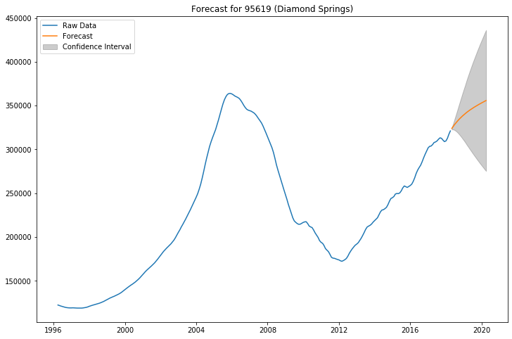


### Print summary of predicted, worst-case, and best-case scenarios


```python
diamond_springs_95619_pred, diamond_springs_95619_low, diamond_springs_95619_high = pred_best_worst(pred=forecasted_price_95619, low=forecasted_lower_95619, high=forecasted_upper_95619, last=last_value_95619, date='April 1, 2020')
diamond_springs_95619_pred, diamond_springs_95619_low, diamond_springs_95619_high
```

    By the model prediction, I would expect to see a 10.799% change in price by April 1, 2020.
    At the lower bound of the confidence interval, I would expect to see a -14.266% change in price by April 1, 2020.
    At the upper bound of the confidence interval, I would expect to see a 35.863% change in price by April 1, 2020.


    (10.799, -14.266, 35.863)


## Recommendation--Zip code 95619:  potential investment candidate

By the model prediction, I would expect to see a 10.799% change in price by April 1, 2020.
At the lower bound of the confidence interval, I would expect to see a -14.266% change in price by April 1, 2020.
At the upper bound of the confidence interval, I would expect to see a 35.863% change in price by April 1, 2020.


# SacMetro: 95864 (Arden-Arcade) -- Don't invest


```python
geog_area = '95864'
```

### Create dataframe containing values for just this geographic unit


```python
# df_geog = df_geog(df=df_metro_cities, col = 'MetroState', geog = 'New York NY')

ts_95864 = df_sac.loc[df_sac['Zip'] == geog_area]  # ts for all of the following functions should have only one zipcode
ts_95864.head()

```


<div>
<style scoped>
    .dataframe tbody tr th:only-of-type {
        vertical-align: middle;
    }

    .dataframe tbody tr th {
        vertical-align: top;
    }

    .dataframe thead th {
        text-align: right;
    }
</style>
<table border="1" class="dataframe">
  <thead>
    <tr style="text-align: right;">
      <th></th>
      <th>Metro</th>
      <th>MetroState</th>
      <th>CountyName</th>
      <th>City</th>
      <th>Zip</th>
      <th>SizeRank</th>
      <th>value</th>
    </tr>
    <tr>
      <th>time</th>
      <th></th>
      <th></th>
      <th></th>
      <th></th>
      <th></th>
      <th></th>
      <th></th>
    </tr>
  </thead>
  <tbody>
    <tr>
      <td>1996-04-01</td>
      <td>Sacramento</td>
      <td>Sacramento CA</td>
      <td>Sacramento</td>
      <td>Arden-Arcade</td>
      <td>95864</td>
      <td>4500</td>
      <td>171200.0</td>
    </tr>
    <tr>
      <td>1996-05-01</td>
      <td>Sacramento</td>
      <td>Sacramento CA</td>
      <td>Sacramento</td>
      <td>Arden-Arcade</td>
      <td>95864</td>
      <td>4500</td>
      <td>171200.0</td>
    </tr>
    <tr>
      <td>1996-06-01</td>
      <td>Sacramento</td>
      <td>Sacramento CA</td>
      <td>Sacramento</td>
      <td>Arden-Arcade</td>
      <td>95864</td>
      <td>4500</td>
      <td>171300.0</td>
    </tr>
    <tr>
      <td>1996-07-01</td>
      <td>Sacramento</td>
      <td>Sacramento CA</td>
      <td>Sacramento</td>
      <td>Arden-Arcade</td>
      <td>95864</td>
      <td>4500</td>
      <td>171500.0</td>
    </tr>
    <tr>
      <td>1996-08-01</td>
      <td>Sacramento</td>
      <td>Sacramento CA</td>
      <td>Sacramento</td>
      <td>Arden-Arcade</td>
      <td>95864</td>
      <td>4500</td>
      <td>171800.0</td>
    </tr>
  </tbody>
</table>
</div>


```python
# ts.head()

ts_95864.tail()
```


<div>
<style scoped>
    .dataframe tbody tr th:only-of-type {
        vertical-align: middle;
    }

    .dataframe tbody tr th {
        vertical-align: top;
    }

    .dataframe thead th {
        text-align: right;
    }
</style>
<table border="1" class="dataframe">
  <thead>
    <tr style="text-align: right;">
      <th></th>
      <th>Metro</th>
      <th>MetroState</th>
      <th>CountyName</th>
      <th>City</th>
      <th>Zip</th>
      <th>SizeRank</th>
      <th>value</th>
    </tr>
    <tr>
      <th>time</th>
      <th></th>
      <th></th>
      <th></th>
      <th></th>
      <th></th>
      <th></th>
      <th></th>
    </tr>
  </thead>
  <tbody>
    <tr>
      <td>2017-12-01</td>
      <td>Sacramento</td>
      <td>Sacramento CA</td>
      <td>Sacramento</td>
      <td>Arden-Arcade</td>
      <td>95864</td>
      <td>4500</td>
      <td>557500.0</td>
    </tr>
    <tr>
      <td>2018-01-01</td>
      <td>Sacramento</td>
      <td>Sacramento CA</td>
      <td>Sacramento</td>
      <td>Arden-Arcade</td>
      <td>95864</td>
      <td>4500</td>
      <td>563300.0</td>
    </tr>
    <tr>
      <td>2018-02-01</td>
      <td>Sacramento</td>
      <td>Sacramento CA</td>
      <td>Sacramento</td>
      <td>Arden-Arcade</td>
      <td>95864</td>
      <td>4500</td>
      <td>566100.0</td>
    </tr>
    <tr>
      <td>2018-03-01</td>
      <td>Sacramento</td>
      <td>Sacramento CA</td>
      <td>Sacramento</td>
      <td>Arden-Arcade</td>
      <td>95864</td>
      <td>4500</td>
      <td>560800.0</td>
    </tr>
    <tr>
      <td>2018-04-01</td>
      <td>Sacramento</td>
      <td>Sacramento CA</td>
      <td>Sacramento</td>
      <td>Arden-Arcade</td>
      <td>95864</td>
      <td>4500</td>
      <td>552700.0</td>
    </tr>
  </tbody>
</table>
</div>


```python
# ts = ts.value

ts_95864_values = ts_95864.value
```


```python
# ts.head()

ts_95864_values.head()
```


    time
    1996-04-01    171200.0
    1996-05-01    171200.0
    1996-06-01    171300.0
    1996-07-01    171500.0
    1996-08-01    171800.0
    Name: value, dtype: float64


### Visualizations

#### plot_ts:  Plot zip code(s) of interest over time, with market highs and lows


```python
# fig, ax = plot_ts(df_melt, zipcodes=['95616', '92008', '90035', '90025', '60625', '57701'])  # enter desired zip code(s)

fig, ax = plot_ts_zips(df_melt, zipcodes=['95864'])  # enter desired zip code(s)
```


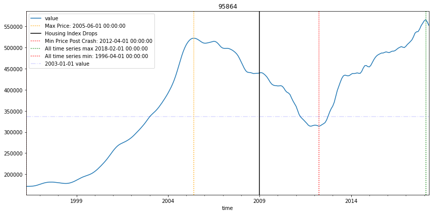


#### Boxplot of zip codes by city in a metro area


```python
ts_95864.boxplot(column = 'value')
plt.title('95864');

```


### Plot ACF and PACF for ts dataframe


```python
# note that ts must only contain values and time as index

# plot_acf_pacf(ts, figsize=(10,6), lags=15)  # note that ts must only contain values and time as index

plot_acf_pacf(ts_95864_values, figsize=(10,6), lags=15)
```


### Plot seasonal decomposition for ts dataframe


```python
# plot_seasonal_decomp(ts)

plot_seasonal_decomp(ts_95864_values)

```


    (<Figure size 1296x432 with 1 Axes>,
     <matplotlib.axes._subplots.AxesSubplot at 0x1cbe436278>)


## ARIMA model parameters and optimization

### Run ARIMA model on ts dataframe with list of p,d,q values 


```python
p_values = [0, 1, 2, 4, 6, 8]
d_values = range(0, 3)
q_values = range(0, 3)
warnings.filterwarnings("ignore")
```


```python
# eval_arima_models(ts, p_values, d_values, q_values)  # don't run this until you have some time, since it take time
# note that ts must only contain values and time as index

# eval_arima_models(ts_95864_values, p_values, d_values, q_values)  # don't run this until you have some time, since it take time
```

### Generate model fit summary


```python
# model_fit = arima_zipcode(ts, order = None)   # change order = tuple to correspond to the best MSE produced by previous function

# Best ARIMA(4, 1, 1) MSE=1137443.820

model_fit_95864 = arima_zipcode(ts_95864_values, order = (4,1,1))
```

                                 ARIMA Model Results                              
    ==============================================================================
    Dep. Variable:                    D.y   No. Observations:                  264
    Model:                 ARIMA(4, 1, 1)   Log Likelihood               -2242.232
    Method:                       css-mle   S.D. of innovations           1173.238
    Date:                Tue, 10 Mar 2020   AIC                           4498.464
    Time:                        22:16:25   BIC                           4523.496
    Sample:                             1   HQIC                          4508.522
                                                                                  
    ==============================================================================
                     coef    std err          z      P>|z|      [0.025      0.975]
    ------------------------------------------------------------------------------
    const       1180.4908   1063.273      1.110      0.268    -903.485    3264.467
    ar.L1.D.y      1.4022      0.137     10.261      0.000       1.134       1.670
    ar.L2.D.y     -0.9589      0.220     -4.362      0.000      -1.390      -0.528
    ar.L3.D.y      0.6291      0.180      3.491      0.001       0.276       0.982
    ar.L4.D.y     -0.1598      0.094     -1.696      0.091      -0.345       0.025
    ma.L1.D.y      0.3238      0.129      2.514      0.013       0.071       0.576
                                        Roots                                    
    =============================================================================
                      Real          Imaginary           Modulus         Frequency
    -----------------------------------------------------------------------------
    AR.1            0.1292           -1.4722j            1.4779           -0.2361
    AR.2            0.1292           +1.4722j            1.4779            0.2361
    AR.3            1.1200           -0.0000j            1.1200           -0.0000
    AR.4            2.5575           -0.0000j            2.5575           -0.0000
    MA.1           -3.0882           +0.0000j            3.0882            0.5000
    -----------------------------------------------------------------------------


## ARIMA modeling results:  predictions and visualization

### Produce forecasts from ARIMA model fit


```python
actual_forecast_95864, std_error_95864, forecast_confint_95864 = forecast(model_fit_95864)

# actual_forecast, forecast_confint = forecast(model_fit_dallas, months=24, confint=2)
```


```python
actual_forecast_95864, std_error_95864, forecast_confint_95864
```


    (array([547564.43427103, 544451.44278531, 540865.14774281, 536988.3419876 ,
            533956.63933575, 531767.45312849, 529842.18395616, 528057.22318399,
            526610.90741252, 525536.27227744, 524704.17823615, 524046.4043252 ,
            523580.20101898, 523308.64704516, 523197.24044099, 523216.40740941,
            523356.94211458, 523612.09551429, 523968.14047727, 524411.23568958,
            524932.36086998, 525524.58251239, 526180.31396717, 526892.10307147]),
     array([ 1173.23844655,  3406.68581889,  5978.41104793,  8550.6792402 ,
            11203.51463305, 14015.74199013, 16921.4538382 , 19835.67899011,
            22737.80642414, 25633.00227572, 28511.56061768, 31356.26904523,
            34158.56557334, 36916.86733898, 39629.10935372, 42291.9789304 ,
            44903.53430771, 47463.56169155, 49972.29386903, 52429.92178872,
            54836.93329256, 57194.24733327, 59502.99434541, 61764.3589506 ]),
     array([[545264.9291705 , 549863.93937155],
            [537774.46127364, 551128.42429698],
            [529147.67740408, 552582.61808153],
            [520229.31863345, 553747.36534175],
            [511998.15415469, 555915.1245168 ],
            [504297.10361122, 559237.80264576],
            [496676.74386724, 563007.62404509],
            [489180.00675447, 566934.4396135 ],
            [482045.62573377, 571176.18909128],
            [475296.51100139, 575776.03355349],
            [468822.54628246, 580585.81018984],
            [462589.246307  , 585503.56234339],
            [456630.64273168, 590529.75930627],
            [450952.91663872, 595664.3774516 ],
            [445525.6133683 , 600868.86751368],
            [440325.65187089, 606107.16294793],
            [435347.63209291, 611366.25213625],
            [430585.22402085, 616638.96700772],
            [426024.24426912, 621912.03668542],
            [421650.47727143, 627171.99410773],
            [417453.94659393, 632410.77514603],
            [413425.9176163 , 637623.24740847],
            [409556.58807788, 642804.03985647],
            [405836.1840001 , 647948.02214284]]))


### Create dataframe to hold forecast results


```python
# df_forecast = forecast_df(col = 'time', daterange = pd.date_range(start='2018-05-01', end='2020-04-01', freq='MS'), 
#                 actual_forecast=actual_forecast, forecast_confint = forecast_confint)

df_forecast_95864 = forecast_df(actual_forecast_95864, forecast_confint_95864, col = 'time', daterange = pd.date_range(start='2018-05-01', end='2020-04-01', freq='MS'))

```

### Create new dataframe concatenating historic values and forecast results


```python
# df_new = concat_values_forecast(ts, df_forecast)

df_new_95864 = concat_values_forecast(ts_95864_values, df_forecast_95864)
```


```python
df_new_95864
```


<div>
<style scoped>
    .dataframe tbody tr th:only-of-type {
        vertical-align: middle;
    }

    .dataframe tbody tr th {
        vertical-align: top;
    }

    .dataframe thead th {
        text-align: right;
    }
</style>
<table border="1" class="dataframe">
  <thead>
    <tr style="text-align: right;">
      <th></th>
      <th>value</th>
      <th>forecast</th>
      <th>forecast_lower</th>
      <th>forecast_upper</th>
    </tr>
    <tr>
      <th>time</th>
      <th></th>
      <th></th>
      <th></th>
      <th></th>
    </tr>
  </thead>
  <tbody>
    <tr>
      <td>1996-04-01</td>
      <td>171200.0</td>
      <td>NaN</td>
      <td>NaN</td>
      <td>NaN</td>
    </tr>
    <tr>
      <td>1996-05-01</td>
      <td>171200.0</td>
      <td>NaN</td>
      <td>NaN</td>
      <td>NaN</td>
    </tr>
    <tr>
      <td>1996-06-01</td>
      <td>171300.0</td>
      <td>NaN</td>
      <td>NaN</td>
      <td>NaN</td>
    </tr>
    <tr>
      <td>1996-07-01</td>
      <td>171500.0</td>
      <td>NaN</td>
      <td>NaN</td>
      <td>NaN</td>
    </tr>
    <tr>
      <td>1996-08-01</td>
      <td>171800.0</td>
      <td>NaN</td>
      <td>NaN</td>
      <td>NaN</td>
    </tr>
    <tr>
      <td>1996-09-01</td>
      <td>172200.0</td>
      <td>NaN</td>
      <td>NaN</td>
      <td>NaN</td>
    </tr>
    <tr>
      <td>1996-10-01</td>
      <td>172900.0</td>
      <td>NaN</td>
      <td>NaN</td>
      <td>NaN</td>
    </tr>
    <tr>
      <td>1996-11-01</td>
      <td>173800.0</td>
      <td>NaN</td>
      <td>NaN</td>
      <td>NaN</td>
    </tr>
    <tr>
      <td>1996-12-01</td>
      <td>175000.0</td>
      <td>NaN</td>
      <td>NaN</td>
      <td>NaN</td>
    </tr>
    <tr>
      <td>1997-01-01</td>
      <td>176200.0</td>
      <td>NaN</td>
      <td>NaN</td>
      <td>NaN</td>
    </tr>
    <tr>
      <td>1997-02-01</td>
      <td>177500.0</td>
      <td>NaN</td>
      <td>NaN</td>
      <td>NaN</td>
    </tr>
    <tr>
      <td>1997-03-01</td>
      <td>178500.0</td>
      <td>NaN</td>
      <td>NaN</td>
      <td>NaN</td>
    </tr>
    <tr>
      <td>1997-04-01</td>
      <td>179500.0</td>
      <td>NaN</td>
      <td>NaN</td>
      <td>NaN</td>
    </tr>
    <tr>
      <td>1997-05-01</td>
      <td>180300.0</td>
      <td>NaN</td>
      <td>NaN</td>
      <td>NaN</td>
    </tr>
    <tr>
      <td>1997-06-01</td>
      <td>180900.0</td>
      <td>NaN</td>
      <td>NaN</td>
      <td>NaN</td>
    </tr>
    <tr>
      <td>1997-07-01</td>
      <td>181300.0</td>
      <td>NaN</td>
      <td>NaN</td>
      <td>NaN</td>
    </tr>
    <tr>
      <td>1997-08-01</td>
      <td>181400.0</td>
      <td>NaN</td>
      <td>NaN</td>
      <td>NaN</td>
    </tr>
    <tr>
      <td>1997-09-01</td>
      <td>181400.0</td>
      <td>NaN</td>
      <td>NaN</td>
      <td>NaN</td>
    </tr>
    <tr>
      <td>1997-10-01</td>
      <td>181200.0</td>
      <td>NaN</td>
      <td>NaN</td>
      <td>NaN</td>
    </tr>
    <tr>
      <td>1997-11-01</td>
      <td>180800.0</td>
      <td>NaN</td>
      <td>NaN</td>
      <td>NaN</td>
    </tr>
    <tr>
      <td>1997-12-01</td>
      <td>180400.0</td>
      <td>NaN</td>
      <td>NaN</td>
      <td>NaN</td>
    </tr>
    <tr>
      <td>1998-01-01</td>
      <td>180000.0</td>
      <td>NaN</td>
      <td>NaN</td>
      <td>NaN</td>
    </tr>
    <tr>
      <td>1998-02-01</td>
      <td>179500.0</td>
      <td>NaN</td>
      <td>NaN</td>
      <td>NaN</td>
    </tr>
    <tr>
      <td>1998-03-01</td>
      <td>179000.0</td>
      <td>NaN</td>
      <td>NaN</td>
      <td>NaN</td>
    </tr>
    <tr>
      <td>1998-04-01</td>
      <td>178500.0</td>
      <td>NaN</td>
      <td>NaN</td>
      <td>NaN</td>
    </tr>
    <tr>
      <td>1998-05-01</td>
      <td>178200.0</td>
      <td>NaN</td>
      <td>NaN</td>
      <td>NaN</td>
    </tr>
    <tr>
      <td>1998-06-01</td>
      <td>178100.0</td>
      <td>NaN</td>
      <td>NaN</td>
      <td>NaN</td>
    </tr>
    <tr>
      <td>1998-07-01</td>
      <td>178300.0</td>
      <td>NaN</td>
      <td>NaN</td>
      <td>NaN</td>
    </tr>
    <tr>
      <td>1998-08-01</td>
      <td>178800.0</td>
      <td>NaN</td>
      <td>NaN</td>
      <td>NaN</td>
    </tr>
    <tr>
      <td>1998-09-01</td>
      <td>179700.0</td>
      <td>NaN</td>
      <td>NaN</td>
      <td>NaN</td>
    </tr>
    <tr>
      <td>1998-10-01</td>
      <td>180900.0</td>
      <td>NaN</td>
      <td>NaN</td>
      <td>NaN</td>
    </tr>
    <tr>
      <td>1998-11-01</td>
      <td>182300.0</td>
      <td>NaN</td>
      <td>NaN</td>
      <td>NaN</td>
    </tr>
    <tr>
      <td>1998-12-01</td>
      <td>184000.0</td>
      <td>NaN</td>
      <td>NaN</td>
      <td>NaN</td>
    </tr>
    <tr>
      <td>1999-01-01</td>
      <td>185900.0</td>
      <td>NaN</td>
      <td>NaN</td>
      <td>NaN</td>
    </tr>
    <tr>
      <td>1999-02-01</td>
      <td>187900.0</td>
      <td>NaN</td>
      <td>NaN</td>
      <td>NaN</td>
    </tr>
    <tr>
      <td>1999-03-01</td>
      <td>189700.0</td>
      <td>NaN</td>
      <td>NaN</td>
      <td>NaN</td>
    </tr>
    <tr>
      <td>1999-04-01</td>
      <td>191500.0</td>
      <td>NaN</td>
      <td>NaN</td>
      <td>NaN</td>
    </tr>
    <tr>
      <td>1999-05-01</td>
      <td>193200.0</td>
      <td>NaN</td>
      <td>NaN</td>
      <td>NaN</td>
    </tr>
    <tr>
      <td>1999-06-01</td>
      <td>194600.0</td>
      <td>NaN</td>
      <td>NaN</td>
      <td>NaN</td>
    </tr>
    <tr>
      <td>1999-07-01</td>
      <td>195900.0</td>
      <td>NaN</td>
      <td>NaN</td>
      <td>NaN</td>
    </tr>
    <tr>
      <td>1999-08-01</td>
      <td>197200.0</td>
      <td>NaN</td>
      <td>NaN</td>
      <td>NaN</td>
    </tr>
    <tr>
      <td>1999-09-01</td>
      <td>198500.0</td>
      <td>NaN</td>
      <td>NaN</td>
      <td>NaN</td>
    </tr>
    <tr>
      <td>1999-10-01</td>
      <td>200000.0</td>
      <td>NaN</td>
      <td>NaN</td>
      <td>NaN</td>
    </tr>
    <tr>
      <td>1999-11-01</td>
      <td>201800.0</td>
      <td>NaN</td>
      <td>NaN</td>
      <td>NaN</td>
    </tr>
    <tr>
      <td>1999-12-01</td>
      <td>204000.0</td>
      <td>NaN</td>
      <td>NaN</td>
      <td>NaN</td>
    </tr>
    <tr>
      <td>2000-01-01</td>
      <td>206600.0</td>
      <td>NaN</td>
      <td>NaN</td>
      <td>NaN</td>
    </tr>
    <tr>
      <td>2000-02-01</td>
      <td>209500.0</td>
      <td>NaN</td>
      <td>NaN</td>
      <td>NaN</td>
    </tr>
    <tr>
      <td>2000-03-01</td>
      <td>212700.0</td>
      <td>NaN</td>
      <td>NaN</td>
      <td>NaN</td>
    </tr>
    <tr>
      <td>2000-04-01</td>
      <td>216200.0</td>
      <td>NaN</td>
      <td>NaN</td>
      <td>NaN</td>
    </tr>
    <tr>
      <td>2000-05-01</td>
      <td>219800.0</td>
      <td>NaN</td>
      <td>NaN</td>
      <td>NaN</td>
    </tr>
    <tr>
      <td>2000-06-01</td>
      <td>223600.0</td>
      <td>NaN</td>
      <td>NaN</td>
      <td>NaN</td>
    </tr>
    <tr>
      <td>2000-07-01</td>
      <td>227500.0</td>
      <td>NaN</td>
      <td>NaN</td>
      <td>NaN</td>
    </tr>
    <tr>
      <td>2000-08-01</td>
      <td>231600.0</td>
      <td>NaN</td>
      <td>NaN</td>
      <td>NaN</td>
    </tr>
    <tr>
      <td>2000-09-01</td>
      <td>236000.0</td>
      <td>NaN</td>
      <td>NaN</td>
      <td>NaN</td>
    </tr>
    <tr>
      <td>2000-10-01</td>
      <td>240700.0</td>
      <td>NaN</td>
      <td>NaN</td>
      <td>NaN</td>
    </tr>
    <tr>
      <td>2000-11-01</td>
      <td>245600.0</td>
      <td>NaN</td>
      <td>NaN</td>
      <td>NaN</td>
    </tr>
    <tr>
      <td>2000-12-01</td>
      <td>250600.0</td>
      <td>NaN</td>
      <td>NaN</td>
      <td>NaN</td>
    </tr>
    <tr>
      <td>2001-01-01</td>
      <td>255500.0</td>
      <td>NaN</td>
      <td>NaN</td>
      <td>NaN</td>
    </tr>
    <tr>
      <td>2001-02-01</td>
      <td>259900.0</td>
      <td>NaN</td>
      <td>NaN</td>
      <td>NaN</td>
    </tr>
    <tr>
      <td>2001-03-01</td>
      <td>263900.0</td>
      <td>NaN</td>
      <td>NaN</td>
      <td>NaN</td>
    </tr>
    <tr>
      <td>2001-04-01</td>
      <td>267300.0</td>
      <td>NaN</td>
      <td>NaN</td>
      <td>NaN</td>
    </tr>
    <tr>
      <td>2001-05-01</td>
      <td>270000.0</td>
      <td>NaN</td>
      <td>NaN</td>
      <td>NaN</td>
    </tr>
    <tr>
      <td>2001-06-01</td>
      <td>272100.0</td>
      <td>NaN</td>
      <td>NaN</td>
      <td>NaN</td>
    </tr>
    <tr>
      <td>2001-07-01</td>
      <td>273800.0</td>
      <td>NaN</td>
      <td>NaN</td>
      <td>NaN</td>
    </tr>
    <tr>
      <td>2001-08-01</td>
      <td>275500.0</td>
      <td>NaN</td>
      <td>NaN</td>
      <td>NaN</td>
    </tr>
    <tr>
      <td>2001-09-01</td>
      <td>277300.0</td>
      <td>NaN</td>
      <td>NaN</td>
      <td>NaN</td>
    </tr>
    <tr>
      <td>2001-10-01</td>
      <td>279300.0</td>
      <td>NaN</td>
      <td>NaN</td>
      <td>NaN</td>
    </tr>
    <tr>
      <td>2001-11-01</td>
      <td>281500.0</td>
      <td>NaN</td>
      <td>NaN</td>
      <td>NaN</td>
    </tr>
    <tr>
      <td>2001-12-01</td>
      <td>284000.0</td>
      <td>NaN</td>
      <td>NaN</td>
      <td>NaN</td>
    </tr>
    <tr>
      <td>2002-01-01</td>
      <td>286800.0</td>
      <td>NaN</td>
      <td>NaN</td>
      <td>NaN</td>
    </tr>
    <tr>
      <td>2002-02-01</td>
      <td>290000.0</td>
      <td>NaN</td>
      <td>NaN</td>
      <td>NaN</td>
    </tr>
    <tr>
      <td>2002-03-01</td>
      <td>293500.0</td>
      <td>NaN</td>
      <td>NaN</td>
      <td>NaN</td>
    </tr>
    <tr>
      <td>2002-04-01</td>
      <td>297200.0</td>
      <td>NaN</td>
      <td>NaN</td>
      <td>NaN</td>
    </tr>
    <tr>
      <td>2002-05-01</td>
      <td>300900.0</td>
      <td>NaN</td>
      <td>NaN</td>
      <td>NaN</td>
    </tr>
    <tr>
      <td>2002-06-01</td>
      <td>304700.0</td>
      <td>NaN</td>
      <td>NaN</td>
      <td>NaN</td>
    </tr>
    <tr>
      <td>2002-07-01</td>
      <td>308600.0</td>
      <td>NaN</td>
      <td>NaN</td>
      <td>NaN</td>
    </tr>
    <tr>
      <td>2002-08-01</td>
      <td>312700.0</td>
      <td>NaN</td>
      <td>NaN</td>
      <td>NaN</td>
    </tr>
    <tr>
      <td>2002-09-01</td>
      <td>317000.0</td>
      <td>NaN</td>
      <td>NaN</td>
      <td>NaN</td>
    </tr>
    <tr>
      <td>2002-10-01</td>
      <td>321600.0</td>
      <td>NaN</td>
      <td>NaN</td>
      <td>NaN</td>
    </tr>
    <tr>
      <td>2002-11-01</td>
      <td>326600.0</td>
      <td>NaN</td>
      <td>NaN</td>
      <td>NaN</td>
    </tr>
    <tr>
      <td>2002-12-01</td>
      <td>331800.0</td>
      <td>NaN</td>
      <td>NaN</td>
      <td>NaN</td>
    </tr>
    <tr>
      <td>2003-01-01</td>
      <td>336400.0</td>
      <td>NaN</td>
      <td>NaN</td>
      <td>NaN</td>
    </tr>
    <tr>
      <td>2003-02-01</td>
      <td>340200.0</td>
      <td>NaN</td>
      <td>NaN</td>
      <td>NaN</td>
    </tr>
    <tr>
      <td>2003-03-01</td>
      <td>343700.0</td>
      <td>NaN</td>
      <td>NaN</td>
      <td>NaN</td>
    </tr>
    <tr>
      <td>2003-04-01</td>
      <td>347000.0</td>
      <td>NaN</td>
      <td>NaN</td>
      <td>NaN</td>
    </tr>
    <tr>
      <td>2003-05-01</td>
      <td>350500.0</td>
      <td>NaN</td>
      <td>NaN</td>
      <td>NaN</td>
    </tr>
    <tr>
      <td>2003-06-01</td>
      <td>354500.0</td>
      <td>NaN</td>
      <td>NaN</td>
      <td>NaN</td>
    </tr>
    <tr>
      <td>2003-07-01</td>
      <td>359000.0</td>
      <td>NaN</td>
      <td>NaN</td>
      <td>NaN</td>
    </tr>
    <tr>
      <td>2003-08-01</td>
      <td>363900.0</td>
      <td>NaN</td>
      <td>NaN</td>
      <td>NaN</td>
    </tr>
    <tr>
      <td>2003-09-01</td>
      <td>369000.0</td>
      <td>NaN</td>
      <td>NaN</td>
      <td>NaN</td>
    </tr>
    <tr>
      <td>2003-10-01</td>
      <td>374400.0</td>
      <td>NaN</td>
      <td>NaN</td>
      <td>NaN</td>
    </tr>
    <tr>
      <td>2003-11-01</td>
      <td>380000.0</td>
      <td>NaN</td>
      <td>NaN</td>
      <td>NaN</td>
    </tr>
    <tr>
      <td>2003-12-01</td>
      <td>385900.0</td>
      <td>NaN</td>
      <td>NaN</td>
      <td>NaN</td>
    </tr>
    <tr>
      <td>2004-01-01</td>
      <td>392100.0</td>
      <td>NaN</td>
      <td>NaN</td>
      <td>NaN</td>
    </tr>
    <tr>
      <td>2004-02-01</td>
      <td>398800.0</td>
      <td>NaN</td>
      <td>NaN</td>
      <td>NaN</td>
    </tr>
    <tr>
      <td>2004-03-01</td>
      <td>405900.0</td>
      <td>NaN</td>
      <td>NaN</td>
      <td>NaN</td>
    </tr>
    <tr>
      <td>2004-04-01</td>
      <td>413800.0</td>
      <td>NaN</td>
      <td>NaN</td>
      <td>NaN</td>
    </tr>
    <tr>
      <td>2004-05-01</td>
      <td>422700.0</td>
      <td>NaN</td>
      <td>NaN</td>
      <td>NaN</td>
    </tr>
    <tr>
      <td>2004-06-01</td>
      <td>432900.0</td>
      <td>NaN</td>
      <td>NaN</td>
      <td>NaN</td>
    </tr>
    <tr>
      <td>2004-07-01</td>
      <td>444300.0</td>
      <td>NaN</td>
      <td>NaN</td>
      <td>NaN</td>
    </tr>
    <tr>
      <td>2004-08-01</td>
      <td>456300.0</td>
      <td>NaN</td>
      <td>NaN</td>
      <td>NaN</td>
    </tr>
    <tr>
      <td>2004-09-01</td>
      <td>468600.0</td>
      <td>NaN</td>
      <td>NaN</td>
      <td>NaN</td>
    </tr>
    <tr>
      <td>2004-10-01</td>
      <td>480400.0</td>
      <td>NaN</td>
      <td>NaN</td>
      <td>NaN</td>
    </tr>
    <tr>
      <td>2004-11-01</td>
      <td>490900.0</td>
      <td>NaN</td>
      <td>NaN</td>
      <td>NaN</td>
    </tr>
    <tr>
      <td>2004-12-01</td>
      <td>499700.0</td>
      <td>NaN</td>
      <td>NaN</td>
      <td>NaN</td>
    </tr>
    <tr>
      <td>2005-01-01</td>
      <td>507100.0</td>
      <td>NaN</td>
      <td>NaN</td>
      <td>NaN</td>
    </tr>
    <tr>
      <td>2005-02-01</td>
      <td>512700.0</td>
      <td>NaN</td>
      <td>NaN</td>
      <td>NaN</td>
    </tr>
    <tr>
      <td>2005-03-01</td>
      <td>517100.0</td>
      <td>NaN</td>
      <td>NaN</td>
      <td>NaN</td>
    </tr>
    <tr>
      <td>2005-04-01</td>
      <td>520200.0</td>
      <td>NaN</td>
      <td>NaN</td>
      <td>NaN</td>
    </tr>
    <tr>
      <td>2005-05-01</td>
      <td>521800.0</td>
      <td>NaN</td>
      <td>NaN</td>
      <td>NaN</td>
    </tr>
    <tr>
      <td>2005-06-01</td>
      <td>522200.0</td>
      <td>NaN</td>
      <td>NaN</td>
      <td>NaN</td>
    </tr>
    <tr>
      <td>2005-07-01</td>
      <td>521600.0</td>
      <td>NaN</td>
      <td>NaN</td>
      <td>NaN</td>
    </tr>
    <tr>
      <td>2005-08-01</td>
      <td>520200.0</td>
      <td>NaN</td>
      <td>NaN</td>
      <td>NaN</td>
    </tr>
    <tr>
      <td>2005-09-01</td>
      <td>518100.0</td>
      <td>NaN</td>
      <td>NaN</td>
      <td>NaN</td>
    </tr>
    <tr>
      <td>2005-10-01</td>
      <td>515600.0</td>
      <td>NaN</td>
      <td>NaN</td>
      <td>NaN</td>
    </tr>
    <tr>
      <td>2005-11-01</td>
      <td>513100.0</td>
      <td>NaN</td>
      <td>NaN</td>
      <td>NaN</td>
    </tr>
    <tr>
      <td>2005-12-01</td>
      <td>511100.0</td>
      <td>NaN</td>
      <td>NaN</td>
      <td>NaN</td>
    </tr>
    <tr>
      <td>2006-01-01</td>
      <td>510300.0</td>
      <td>NaN</td>
      <td>NaN</td>
      <td>NaN</td>
    </tr>
    <tr>
      <td>2006-02-01</td>
      <td>510400.0</td>
      <td>NaN</td>
      <td>NaN</td>
      <td>NaN</td>
    </tr>
    <tr>
      <td>2006-03-01</td>
      <td>511100.0</td>
      <td>NaN</td>
      <td>NaN</td>
      <td>NaN</td>
    </tr>
    <tr>
      <td>2006-04-01</td>
      <td>511900.0</td>
      <td>NaN</td>
      <td>NaN</td>
      <td>NaN</td>
    </tr>
    <tr>
      <td>2006-05-01</td>
      <td>512900.0</td>
      <td>NaN</td>
      <td>NaN</td>
      <td>NaN</td>
    </tr>
    <tr>
      <td>2006-06-01</td>
      <td>514000.0</td>
      <td>NaN</td>
      <td>NaN</td>
      <td>NaN</td>
    </tr>
    <tr>
      <td>2006-07-01</td>
      <td>514800.0</td>
      <td>NaN</td>
      <td>NaN</td>
      <td>NaN</td>
    </tr>
    <tr>
      <td>2006-08-01</td>
      <td>514300.0</td>
      <td>NaN</td>
      <td>NaN</td>
      <td>NaN</td>
    </tr>
    <tr>
      <td>2006-09-01</td>
      <td>512200.0</td>
      <td>NaN</td>
      <td>NaN</td>
      <td>NaN</td>
    </tr>
    <tr>
      <td>2006-10-01</td>
      <td>508700.0</td>
      <td>NaN</td>
      <td>NaN</td>
      <td>NaN</td>
    </tr>
    <tr>
      <td>2006-11-01</td>
      <td>504400.0</td>
      <td>NaN</td>
      <td>NaN</td>
      <td>NaN</td>
    </tr>
    <tr>
      <td>2006-12-01</td>
      <td>500600.0</td>
      <td>NaN</td>
      <td>NaN</td>
      <td>NaN</td>
    </tr>
    <tr>
      <td>2007-01-01</td>
      <td>498600.0</td>
      <td>NaN</td>
      <td>NaN</td>
      <td>NaN</td>
    </tr>
    <tr>
      <td>2007-02-01</td>
      <td>498000.0</td>
      <td>NaN</td>
      <td>NaN</td>
      <td>NaN</td>
    </tr>
    <tr>
      <td>2007-03-01</td>
      <td>498100.0</td>
      <td>NaN</td>
      <td>NaN</td>
      <td>NaN</td>
    </tr>
    <tr>
      <td>2007-04-01</td>
      <td>498200.0</td>
      <td>NaN</td>
      <td>NaN</td>
      <td>NaN</td>
    </tr>
    <tr>
      <td>2007-05-01</td>
      <td>497500.0</td>
      <td>NaN</td>
      <td>NaN</td>
      <td>NaN</td>
    </tr>
    <tr>
      <td>2007-06-01</td>
      <td>496000.0</td>
      <td>NaN</td>
      <td>NaN</td>
      <td>NaN</td>
    </tr>
    <tr>
      <td>2007-07-01</td>
      <td>494100.0</td>
      <td>NaN</td>
      <td>NaN</td>
      <td>NaN</td>
    </tr>
    <tr>
      <td>2007-08-01</td>
      <td>491700.0</td>
      <td>NaN</td>
      <td>NaN</td>
      <td>NaN</td>
    </tr>
    <tr>
      <td>2007-09-01</td>
      <td>488700.0</td>
      <td>NaN</td>
      <td>NaN</td>
      <td>NaN</td>
    </tr>
    <tr>
      <td>2007-10-01</td>
      <td>485100.0</td>
      <td>NaN</td>
      <td>NaN</td>
      <td>NaN</td>
    </tr>
    <tr>
      <td>2007-11-01</td>
      <td>480000.0</td>
      <td>NaN</td>
      <td>NaN</td>
      <td>NaN</td>
    </tr>
    <tr>
      <td>2007-12-01</td>
      <td>473200.0</td>
      <td>NaN</td>
      <td>NaN</td>
      <td>NaN</td>
    </tr>
    <tr>
      <td>2008-01-01</td>
      <td>465800.0</td>
      <td>NaN</td>
      <td>NaN</td>
      <td>NaN</td>
    </tr>
    <tr>
      <td>2008-02-01</td>
      <td>458200.0</td>
      <td>NaN</td>
      <td>NaN</td>
      <td>NaN</td>
    </tr>
    <tr>
      <td>2008-03-01</td>
      <td>450800.0</td>
      <td>NaN</td>
      <td>NaN</td>
      <td>NaN</td>
    </tr>
    <tr>
      <td>2008-04-01</td>
      <td>445000.0</td>
      <td>NaN</td>
      <td>NaN</td>
      <td>NaN</td>
    </tr>
    <tr>
      <td>2008-05-01</td>
      <td>441800.0</td>
      <td>NaN</td>
      <td>NaN</td>
      <td>NaN</td>
    </tr>
    <tr>
      <td>2008-06-01</td>
      <td>441000.0</td>
      <td>NaN</td>
      <td>NaN</td>
      <td>NaN</td>
    </tr>
    <tr>
      <td>2008-07-01</td>
      <td>440800.0</td>
      <td>NaN</td>
      <td>NaN</td>
      <td>NaN</td>
    </tr>
    <tr>
      <td>2008-08-01</td>
      <td>439600.0</td>
      <td>NaN</td>
      <td>NaN</td>
      <td>NaN</td>
    </tr>
    <tr>
      <td>2008-09-01</td>
      <td>438500.0</td>
      <td>NaN</td>
      <td>NaN</td>
      <td>NaN</td>
    </tr>
    <tr>
      <td>2008-10-01</td>
      <td>438700.0</td>
      <td>NaN</td>
      <td>NaN</td>
      <td>NaN</td>
    </tr>
    <tr>
      <td>2008-11-01</td>
      <td>438900.0</td>
      <td>NaN</td>
      <td>NaN</td>
      <td>NaN</td>
    </tr>
    <tr>
      <td>2008-12-01</td>
      <td>439100.0</td>
      <td>NaN</td>
      <td>NaN</td>
      <td>NaN</td>
    </tr>
    <tr>
      <td>2009-01-01</td>
      <td>439900.0</td>
      <td>NaN</td>
      <td>NaN</td>
      <td>NaN</td>
    </tr>
    <tr>
      <td>2009-02-01</td>
      <td>440600.0</td>
      <td>NaN</td>
      <td>NaN</td>
      <td>NaN</td>
    </tr>
    <tr>
      <td>2009-03-01</td>
      <td>439700.0</td>
      <td>NaN</td>
      <td>NaN</td>
      <td>NaN</td>
    </tr>
    <tr>
      <td>2009-04-01</td>
      <td>437100.0</td>
      <td>NaN</td>
      <td>NaN</td>
      <td>NaN</td>
    </tr>
    <tr>
      <td>2009-05-01</td>
      <td>433800.0</td>
      <td>NaN</td>
      <td>NaN</td>
      <td>NaN</td>
    </tr>
    <tr>
      <td>2009-06-01</td>
      <td>429600.0</td>
      <td>NaN</td>
      <td>NaN</td>
      <td>NaN</td>
    </tr>
    <tr>
      <td>2009-07-01</td>
      <td>424000.0</td>
      <td>NaN</td>
      <td>NaN</td>
      <td>NaN</td>
    </tr>
    <tr>
      <td>2009-08-01</td>
      <td>418000.0</td>
      <td>NaN</td>
      <td>NaN</td>
      <td>NaN</td>
    </tr>
    <tr>
      <td>2009-09-01</td>
      <td>413500.0</td>
      <td>NaN</td>
      <td>NaN</td>
      <td>NaN</td>
    </tr>
    <tr>
      <td>2009-10-01</td>
      <td>411100.0</td>
      <td>NaN</td>
      <td>NaN</td>
      <td>NaN</td>
    </tr>
    <tr>
      <td>2009-11-01</td>
      <td>409900.0</td>
      <td>NaN</td>
      <td>NaN</td>
      <td>NaN</td>
    </tr>
    <tr>
      <td>2009-12-01</td>
      <td>409800.0</td>
      <td>NaN</td>
      <td>NaN</td>
      <td>NaN</td>
    </tr>
    <tr>
      <td>2010-01-01</td>
      <td>409000.0</td>
      <td>NaN</td>
      <td>NaN</td>
      <td>NaN</td>
    </tr>
    <tr>
      <td>2010-02-01</td>
      <td>409300.0</td>
      <td>NaN</td>
      <td>NaN</td>
      <td>NaN</td>
    </tr>
    <tr>
      <td>2010-03-01</td>
      <td>409800.0</td>
      <td>NaN</td>
      <td>NaN</td>
      <td>NaN</td>
    </tr>
    <tr>
      <td>2010-04-01</td>
      <td>408100.0</td>
      <td>NaN</td>
      <td>NaN</td>
      <td>NaN</td>
    </tr>
    <tr>
      <td>2010-05-01</td>
      <td>403800.0</td>
      <td>NaN</td>
      <td>NaN</td>
      <td>NaN</td>
    </tr>
    <tr>
      <td>2010-06-01</td>
      <td>397900.0</td>
      <td>NaN</td>
      <td>NaN</td>
      <td>NaN</td>
    </tr>
    <tr>
      <td>2010-07-01</td>
      <td>394200.0</td>
      <td>NaN</td>
      <td>NaN</td>
      <td>NaN</td>
    </tr>
    <tr>
      <td>2010-08-01</td>
      <td>392300.0</td>
      <td>NaN</td>
      <td>NaN</td>
      <td>NaN</td>
    </tr>
    <tr>
      <td>2010-09-01</td>
      <td>388600.0</td>
      <td>NaN</td>
      <td>NaN</td>
      <td>NaN</td>
    </tr>
    <tr>
      <td>2010-10-01</td>
      <td>380600.0</td>
      <td>NaN</td>
      <td>NaN</td>
      <td>NaN</td>
    </tr>
    <tr>
      <td>2010-11-01</td>
      <td>373200.0</td>
      <td>NaN</td>
      <td>NaN</td>
      <td>NaN</td>
    </tr>
    <tr>
      <td>2010-12-01</td>
      <td>367000.0</td>
      <td>NaN</td>
      <td>NaN</td>
      <td>NaN</td>
    </tr>
    <tr>
      <td>2011-01-01</td>
      <td>360700.0</td>
      <td>NaN</td>
      <td>NaN</td>
      <td>NaN</td>
    </tr>
    <tr>
      <td>2011-02-01</td>
      <td>350900.0</td>
      <td>NaN</td>
      <td>NaN</td>
      <td>NaN</td>
    </tr>
    <tr>
      <td>2011-03-01</td>
      <td>341200.0</td>
      <td>NaN</td>
      <td>NaN</td>
      <td>NaN</td>
    </tr>
    <tr>
      <td>2011-04-01</td>
      <td>335500.0</td>
      <td>NaN</td>
      <td>NaN</td>
      <td>NaN</td>
    </tr>
    <tr>
      <td>2011-05-01</td>
      <td>331700.0</td>
      <td>NaN</td>
      <td>NaN</td>
      <td>NaN</td>
    </tr>
    <tr>
      <td>2011-06-01</td>
      <td>328200.0</td>
      <td>NaN</td>
      <td>NaN</td>
      <td>NaN</td>
    </tr>
    <tr>
      <td>2011-07-01</td>
      <td>324400.0</td>
      <td>NaN</td>
      <td>NaN</td>
      <td>NaN</td>
    </tr>
    <tr>
      <td>2011-08-01</td>
      <td>320500.0</td>
      <td>NaN</td>
      <td>NaN</td>
      <td>NaN</td>
    </tr>
    <tr>
      <td>2011-09-01</td>
      <td>316200.0</td>
      <td>NaN</td>
      <td>NaN</td>
      <td>NaN</td>
    </tr>
    <tr>
      <td>2011-10-01</td>
      <td>314000.0</td>
      <td>NaN</td>
      <td>NaN</td>
      <td>NaN</td>
    </tr>
    <tr>
      <td>2011-11-01</td>
      <td>314000.0</td>
      <td>NaN</td>
      <td>NaN</td>
      <td>NaN</td>
    </tr>
    <tr>
      <td>2011-12-01</td>
      <td>315200.0</td>
      <td>NaN</td>
      <td>NaN</td>
      <td>NaN</td>
    </tr>
    <tr>
      <td>2012-01-01</td>
      <td>316100.0</td>
      <td>NaN</td>
      <td>NaN</td>
      <td>NaN</td>
    </tr>
    <tr>
      <td>2012-02-01</td>
      <td>316100.0</td>
      <td>NaN</td>
      <td>NaN</td>
      <td>NaN</td>
    </tr>
    <tr>
      <td>2012-03-01</td>
      <td>315100.0</td>
      <td>NaN</td>
      <td>NaN</td>
      <td>NaN</td>
    </tr>
    <tr>
      <td>2012-04-01</td>
      <td>313600.0</td>
      <td>NaN</td>
      <td>NaN</td>
      <td>NaN</td>
    </tr>
    <tr>
      <td>2012-05-01</td>
      <td>315100.0</td>
      <td>NaN</td>
      <td>NaN</td>
      <td>NaN</td>
    </tr>
    <tr>
      <td>2012-06-01</td>
      <td>317500.0</td>
      <td>NaN</td>
      <td>NaN</td>
      <td>NaN</td>
    </tr>
    <tr>
      <td>2012-07-01</td>
      <td>319600.0</td>
      <td>NaN</td>
      <td>NaN</td>
      <td>NaN</td>
    </tr>
    <tr>
      <td>2012-08-01</td>
      <td>322300.0</td>
      <td>NaN</td>
      <td>NaN</td>
      <td>NaN</td>
    </tr>
    <tr>
      <td>2012-09-01</td>
      <td>328500.0</td>
      <td>NaN</td>
      <td>NaN</td>
      <td>NaN</td>
    </tr>
    <tr>
      <td>2012-10-01</td>
      <td>337700.0</td>
      <td>NaN</td>
      <td>NaN</td>
      <td>NaN</td>
    </tr>
    <tr>
      <td>2012-11-01</td>
      <td>347300.0</td>
      <td>NaN</td>
      <td>NaN</td>
      <td>NaN</td>
    </tr>
    <tr>
      <td>2012-12-01</td>
      <td>355200.0</td>
      <td>NaN</td>
      <td>NaN</td>
      <td>NaN</td>
    </tr>
    <tr>
      <td>2013-01-01</td>
      <td>361200.0</td>
      <td>NaN</td>
      <td>NaN</td>
      <td>NaN</td>
    </tr>
    <tr>
      <td>2013-02-01</td>
      <td>370300.0</td>
      <td>NaN</td>
      <td>NaN</td>
      <td>NaN</td>
    </tr>
    <tr>
      <td>2013-03-01</td>
      <td>384200.0</td>
      <td>NaN</td>
      <td>NaN</td>
      <td>NaN</td>
    </tr>
    <tr>
      <td>2013-04-01</td>
      <td>398200.0</td>
      <td>NaN</td>
      <td>NaN</td>
      <td>NaN</td>
    </tr>
    <tr>
      <td>2013-05-01</td>
      <td>408300.0</td>
      <td>NaN</td>
      <td>NaN</td>
      <td>NaN</td>
    </tr>
    <tr>
      <td>2013-06-01</td>
      <td>418300.0</td>
      <td>NaN</td>
      <td>NaN</td>
      <td>NaN</td>
    </tr>
    <tr>
      <td>2013-07-01</td>
      <td>427200.0</td>
      <td>NaN</td>
      <td>NaN</td>
      <td>NaN</td>
    </tr>
    <tr>
      <td>2013-08-01</td>
      <td>433000.0</td>
      <td>NaN</td>
      <td>NaN</td>
      <td>NaN</td>
    </tr>
    <tr>
      <td>2013-09-01</td>
      <td>434700.0</td>
      <td>NaN</td>
      <td>NaN</td>
      <td>NaN</td>
    </tr>
    <tr>
      <td>2013-10-01</td>
      <td>433800.0</td>
      <td>NaN</td>
      <td>NaN</td>
      <td>NaN</td>
    </tr>
    <tr>
      <td>2013-11-01</td>
      <td>432900.0</td>
      <td>NaN</td>
      <td>NaN</td>
      <td>NaN</td>
    </tr>
    <tr>
      <td>2013-12-01</td>
      <td>433900.0</td>
      <td>NaN</td>
      <td>NaN</td>
      <td>NaN</td>
    </tr>
    <tr>
      <td>2014-01-01</td>
      <td>436600.0</td>
      <td>NaN</td>
      <td>NaN</td>
      <td>NaN</td>
    </tr>
    <tr>
      <td>2014-02-01</td>
      <td>438600.0</td>
      <td>NaN</td>
      <td>NaN</td>
      <td>NaN</td>
    </tr>
    <tr>
      <td>2014-03-01</td>
      <td>438500.0</td>
      <td>NaN</td>
      <td>NaN</td>
      <td>NaN</td>
    </tr>
    <tr>
      <td>2014-04-01</td>
      <td>438900.0</td>
      <td>NaN</td>
      <td>NaN</td>
      <td>NaN</td>
    </tr>
    <tr>
      <td>2014-05-01</td>
      <td>440100.0</td>
      <td>NaN</td>
      <td>NaN</td>
      <td>NaN</td>
    </tr>
    <tr>
      <td>2014-06-01</td>
      <td>439100.0</td>
      <td>NaN</td>
      <td>NaN</td>
      <td>NaN</td>
    </tr>
    <tr>
      <td>2014-07-01</td>
      <td>438800.0</td>
      <td>NaN</td>
      <td>NaN</td>
      <td>NaN</td>
    </tr>
    <tr>
      <td>2014-08-01</td>
      <td>443400.0</td>
      <td>NaN</td>
      <td>NaN</td>
      <td>NaN</td>
    </tr>
    <tr>
      <td>2014-09-01</td>
      <td>451200.0</td>
      <td>NaN</td>
      <td>NaN</td>
      <td>NaN</td>
    </tr>
    <tr>
      <td>2014-10-01</td>
      <td>457000.0</td>
      <td>NaN</td>
      <td>NaN</td>
      <td>NaN</td>
    </tr>
    <tr>
      <td>2014-11-01</td>
      <td>457500.0</td>
      <td>NaN</td>
      <td>NaN</td>
      <td>NaN</td>
    </tr>
    <tr>
      <td>2014-12-01</td>
      <td>455000.0</td>
      <td>NaN</td>
      <td>NaN</td>
      <td>NaN</td>
    </tr>
    <tr>
      <td>2015-01-01</td>
      <td>454100.0</td>
      <td>NaN</td>
      <td>NaN</td>
      <td>NaN</td>
    </tr>
    <tr>
      <td>2015-02-01</td>
      <td>457900.0</td>
      <td>NaN</td>
      <td>NaN</td>
      <td>NaN</td>
    </tr>
    <tr>
      <td>2015-03-01</td>
      <td>464800.0</td>
      <td>NaN</td>
      <td>NaN</td>
      <td>NaN</td>
    </tr>
    <tr>
      <td>2015-04-01</td>
      <td>471500.0</td>
      <td>NaN</td>
      <td>NaN</td>
      <td>NaN</td>
    </tr>
    <tr>
      <td>2015-05-01</td>
      <td>477000.0</td>
      <td>NaN</td>
      <td>NaN</td>
      <td>NaN</td>
    </tr>
    <tr>
      <td>2015-06-01</td>
      <td>480900.0</td>
      <td>NaN</td>
      <td>NaN</td>
      <td>NaN</td>
    </tr>
    <tr>
      <td>2015-07-01</td>
      <td>483400.0</td>
      <td>NaN</td>
      <td>NaN</td>
      <td>NaN</td>
    </tr>
    <tr>
      <td>2015-08-01</td>
      <td>485200.0</td>
      <td>NaN</td>
      <td>NaN</td>
      <td>NaN</td>
    </tr>
    <tr>
      <td>2015-09-01</td>
      <td>487000.0</td>
      <td>NaN</td>
      <td>NaN</td>
      <td>NaN</td>
    </tr>
    <tr>
      <td>2015-10-01</td>
      <td>487000.0</td>
      <td>NaN</td>
      <td>NaN</td>
      <td>NaN</td>
    </tr>
    <tr>
      <td>2015-11-01</td>
      <td>488500.0</td>
      <td>NaN</td>
      <td>NaN</td>
      <td>NaN</td>
    </tr>
    <tr>
      <td>2015-12-01</td>
      <td>489800.0</td>
      <td>NaN</td>
      <td>NaN</td>
      <td>NaN</td>
    </tr>
    <tr>
      <td>2016-01-01</td>
      <td>488800.0</td>
      <td>NaN</td>
      <td>NaN</td>
      <td>NaN</td>
    </tr>
    <tr>
      <td>2016-02-01</td>
      <td>488000.0</td>
      <td>NaN</td>
      <td>NaN</td>
      <td>NaN</td>
    </tr>
    <tr>
      <td>2016-03-01</td>
      <td>489700.0</td>
      <td>NaN</td>
      <td>NaN</td>
      <td>NaN</td>
    </tr>
    <tr>
      <td>2016-04-01</td>
      <td>491400.0</td>
      <td>NaN</td>
      <td>NaN</td>
      <td>NaN</td>
    </tr>
    <tr>
      <td>2016-05-01</td>
      <td>491500.0</td>
      <td>NaN</td>
      <td>NaN</td>
      <td>NaN</td>
    </tr>
    <tr>
      <td>2016-06-01</td>
      <td>493000.0</td>
      <td>NaN</td>
      <td>NaN</td>
      <td>NaN</td>
    </tr>
    <tr>
      <td>2016-07-01</td>
      <td>495800.0</td>
      <td>NaN</td>
      <td>NaN</td>
      <td>NaN</td>
    </tr>
    <tr>
      <td>2016-08-01</td>
      <td>498700.0</td>
      <td>NaN</td>
      <td>NaN</td>
      <td>NaN</td>
    </tr>
    <tr>
      <td>2016-09-01</td>
      <td>500600.0</td>
      <td>NaN</td>
      <td>NaN</td>
      <td>NaN</td>
    </tr>
    <tr>
      <td>2016-10-01</td>
      <td>502300.0</td>
      <td>NaN</td>
      <td>NaN</td>
      <td>NaN</td>
    </tr>
    <tr>
      <td>2016-11-01</td>
      <td>500800.0</td>
      <td>NaN</td>
      <td>NaN</td>
      <td>NaN</td>
    </tr>
    <tr>
      <td>2016-12-01</td>
      <td>500000.0</td>
      <td>NaN</td>
      <td>NaN</td>
      <td>NaN</td>
    </tr>
    <tr>
      <td>2017-01-01</td>
      <td>503100.0</td>
      <td>NaN</td>
      <td>NaN</td>
      <td>NaN</td>
    </tr>
    <tr>
      <td>2017-02-01</td>
      <td>507500.0</td>
      <td>NaN</td>
      <td>NaN</td>
      <td>NaN</td>
    </tr>
    <tr>
      <td>2017-03-01</td>
      <td>510800.0</td>
      <td>NaN</td>
      <td>NaN</td>
      <td>NaN</td>
    </tr>
    <tr>
      <td>2017-04-01</td>
      <td>514400.0</td>
      <td>NaN</td>
      <td>NaN</td>
      <td>NaN</td>
    </tr>
    <tr>
      <td>2017-05-01</td>
      <td>518500.0</td>
      <td>NaN</td>
      <td>NaN</td>
      <td>NaN</td>
    </tr>
    <tr>
      <td>2017-06-01</td>
      <td>525700.0</td>
      <td>NaN</td>
      <td>NaN</td>
      <td>NaN</td>
    </tr>
    <tr>
      <td>2017-07-01</td>
      <td>534300.0</td>
      <td>NaN</td>
      <td>NaN</td>
      <td>NaN</td>
    </tr>
    <tr>
      <td>2017-08-01</td>
      <td>537300.0</td>
      <td>NaN</td>
      <td>NaN</td>
      <td>NaN</td>
    </tr>
    <tr>
      <td>2017-09-01</td>
      <td>537800.0</td>
      <td>NaN</td>
      <td>NaN</td>
      <td>NaN</td>
    </tr>
    <tr>
      <td>2017-10-01</td>
      <td>543600.0</td>
      <td>NaN</td>
      <td>NaN</td>
      <td>NaN</td>
    </tr>
    <tr>
      <td>2017-11-01</td>
      <td>551800.0</td>
      <td>NaN</td>
      <td>NaN</td>
      <td>NaN</td>
    </tr>
    <tr>
      <td>2017-12-01</td>
      <td>557500.0</td>
      <td>NaN</td>
      <td>NaN</td>
      <td>NaN</td>
    </tr>
    <tr>
      <td>2018-01-01</td>
      <td>563300.0</td>
      <td>NaN</td>
      <td>NaN</td>
      <td>NaN</td>
    </tr>
    <tr>
      <td>2018-02-01</td>
      <td>566100.0</td>
      <td>NaN</td>
      <td>NaN</td>
      <td>NaN</td>
    </tr>
    <tr>
      <td>2018-03-01</td>
      <td>560800.0</td>
      <td>NaN</td>
      <td>NaN</td>
      <td>NaN</td>
    </tr>
    <tr>
      <td>2018-04-01</td>
      <td>552700.0</td>
      <td>NaN</td>
      <td>NaN</td>
      <td>NaN</td>
    </tr>
    <tr>
      <td>2018-05-01</td>
      <td>NaN</td>
      <td>547564.434271</td>
      <td>545264.929171</td>
      <td>549863.939372</td>
    </tr>
    <tr>
      <td>2018-06-01</td>
      <td>NaN</td>
      <td>544451.442785</td>
      <td>537774.461274</td>
      <td>551128.424297</td>
    </tr>
    <tr>
      <td>2018-07-01</td>
      <td>NaN</td>
      <td>540865.147743</td>
      <td>529147.677404</td>
      <td>552582.618082</td>
    </tr>
    <tr>
      <td>2018-08-01</td>
      <td>NaN</td>
      <td>536988.341988</td>
      <td>520229.318633</td>
      <td>553747.365342</td>
    </tr>
    <tr>
      <td>2018-09-01</td>
      <td>NaN</td>
      <td>533956.639336</td>
      <td>511998.154155</td>
      <td>555915.124517</td>
    </tr>
    <tr>
      <td>2018-10-01</td>
      <td>NaN</td>
      <td>531767.453128</td>
      <td>504297.103611</td>
      <td>559237.802646</td>
    </tr>
    <tr>
      <td>2018-11-01</td>
      <td>NaN</td>
      <td>529842.183956</td>
      <td>496676.743867</td>
      <td>563007.624045</td>
    </tr>
    <tr>
      <td>2018-12-01</td>
      <td>NaN</td>
      <td>528057.223184</td>
      <td>489180.006754</td>
      <td>566934.439614</td>
    </tr>
    <tr>
      <td>2019-01-01</td>
      <td>NaN</td>
      <td>526610.907413</td>
      <td>482045.625734</td>
      <td>571176.189091</td>
    </tr>
    <tr>
      <td>2019-02-01</td>
      <td>NaN</td>
      <td>525536.272277</td>
      <td>475296.511001</td>
      <td>575776.033553</td>
    </tr>
    <tr>
      <td>2019-03-01</td>
      <td>NaN</td>
      <td>524704.178236</td>
      <td>468822.546282</td>
      <td>580585.810190</td>
    </tr>
    <tr>
      <td>2019-04-01</td>
      <td>NaN</td>
      <td>524046.404325</td>
      <td>462589.246307</td>
      <td>585503.562343</td>
    </tr>
    <tr>
      <td>2019-05-01</td>
      <td>NaN</td>
      <td>523580.201019</td>
      <td>456630.642732</td>
      <td>590529.759306</td>
    </tr>
    <tr>
      <td>2019-06-01</td>
      <td>NaN</td>
      <td>523308.647045</td>
      <td>450952.916639</td>
      <td>595664.377452</td>
    </tr>
    <tr>
      <td>2019-07-01</td>
      <td>NaN</td>
      <td>523197.240441</td>
      <td>445525.613368</td>
      <td>600868.867514</td>
    </tr>
    <tr>
      <td>2019-08-01</td>
      <td>NaN</td>
      <td>523216.407409</td>
      <td>440325.651871</td>
      <td>606107.162948</td>
    </tr>
    <tr>
      <td>2019-09-01</td>
      <td>NaN</td>
      <td>523356.942115</td>
      <td>435347.632093</td>
      <td>611366.252136</td>
    </tr>
    <tr>
      <td>2019-10-01</td>
      <td>NaN</td>
      <td>523612.095514</td>
      <td>430585.224021</td>
      <td>616638.967008</td>
    </tr>
    <tr>
      <td>2019-11-01</td>
      <td>NaN</td>
      <td>523968.140477</td>
      <td>426024.244269</td>
      <td>621912.036685</td>
    </tr>
    <tr>
      <td>2019-12-01</td>
      <td>NaN</td>
      <td>524411.235690</td>
      <td>421650.477271</td>
      <td>627171.994108</td>
    </tr>
    <tr>
      <td>2020-01-01</td>
      <td>NaN</td>
      <td>524932.360870</td>
      <td>417453.946594</td>
      <td>632410.775146</td>
    </tr>
    <tr>
      <td>2020-02-01</td>
      <td>NaN</td>
      <td>525524.582512</td>
      <td>413425.917616</td>
      <td>637623.247408</td>
    </tr>
    <tr>
      <td>2020-03-01</td>
      <td>NaN</td>
      <td>526180.313967</td>
      <td>409556.588078</td>
      <td>642804.039856</td>
    </tr>
    <tr>
      <td>2020-04-01</td>
      <td>NaN</td>
      <td>526892.103071</td>
      <td>405836.184000</td>
      <td>647948.022143</td>
    </tr>
  </tbody>
</table>
</div>


### Calculate predicted, lower bound, and upper bound forecasted prices


```python
forecasted_price_95864, forecasted_lower_95864, forecasted_upper_95864 = forecast_values(df_new_95864)
```


```python
forecasted_price_95864, forecasted_lower_95864, forecasted_upper_95864  # predicted, best-case, and worst-case prices in 2020
```


    (526892.1030714705, 405836.1840000962, 647948.0221428449)


```python
last_value_95864 = df_new_95864['value'].loc['2018-04-01']
```


```python
last_value_95864
```


    552700.0


### Plot forecast with confidence intervals


```python
# plot_forecast(df = df_new, figsize=(12,8), geog=None)

plot_forecast(df_new_95864, figsize=(12,8), geog='95864 (Arden-Arcade)')
```


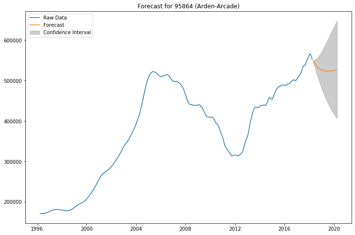


### Print summary of predicted, worst-case, and best-case scenarios


```python
arden_95864_pred, arden_95864_low, arden_95864_high  = pred_best_worst(pred=forecasted_price_95864, low=forecasted_lower_95864, high=forecasted_upper_95864, last=last_value_95864, date='April 1, 2020')
arden_95864_pred, arden_95864_low, arden_95864_high
```

    By the model prediction, I would expect to see a -4.669% change in price by April 1, 2020.
    At the lower bound of the confidence interval, I would expect to see a -26.572% change in price by April 1, 2020.
    At the upper bound of the confidence interval, I would expect to see a 17.233% change in price by April 1, 2020.


    (-4.669, -26.572, 17.233)


## Recommendation for ZIP code 95864:  Don't invest

By the model prediction, I would expect to see a -4.669% change in price by April 1, 2020. 
At the lower bound of the confidence interval, I would expect to see a -26.572% change in price by April 1, 2020.
At the upper bound of the confidence interval, I would expect to see a 17.233% change in price by April 1, 2020.

# SacMetro:  95831 (Sacramento) -- Don't invest; lots of downside risk


```python
geog_area = '95831'
```

### Create dataframe containing values for just this geographic unit


```python
ts_95831 = df_sac.loc[df_sac['Zip'] == geog_area]  # ts for all of the following functions should have only one zipcode
ts_95831.head()

```


<div>
<style scoped>
    .dataframe tbody tr th:only-of-type {
        vertical-align: middle;
    }

    .dataframe tbody tr th {
        vertical-align: top;
    }

    .dataframe thead th {
        text-align: right;
    }
</style>
<table border="1" class="dataframe">
  <thead>
    <tr style="text-align: right;">
      <th></th>
      <th>Metro</th>
      <th>MetroState</th>
      <th>CountyName</th>
      <th>City</th>
      <th>Zip</th>
      <th>SizeRank</th>
      <th>value</th>
    </tr>
    <tr>
      <th>time</th>
      <th></th>
      <th></th>
      <th></th>
      <th></th>
      <th></th>
      <th></th>
      <th></th>
    </tr>
  </thead>
  <tbody>
    <tr>
      <td>1996-04-01</td>
      <td>Sacramento</td>
      <td>Sacramento CA</td>
      <td>Sacramento</td>
      <td>Sacramento</td>
      <td>95831</td>
      <td>922</td>
      <td>162600.0</td>
    </tr>
    <tr>
      <td>1996-05-01</td>
      <td>Sacramento</td>
      <td>Sacramento CA</td>
      <td>Sacramento</td>
      <td>Sacramento</td>
      <td>95831</td>
      <td>922</td>
      <td>162000.0</td>
    </tr>
    <tr>
      <td>1996-06-01</td>
      <td>Sacramento</td>
      <td>Sacramento CA</td>
      <td>Sacramento</td>
      <td>Sacramento</td>
      <td>95831</td>
      <td>922</td>
      <td>161200.0</td>
    </tr>
    <tr>
      <td>1996-07-01</td>
      <td>Sacramento</td>
      <td>Sacramento CA</td>
      <td>Sacramento</td>
      <td>Sacramento</td>
      <td>95831</td>
      <td>922</td>
      <td>160400.0</td>
    </tr>
    <tr>
      <td>1996-08-01</td>
      <td>Sacramento</td>
      <td>Sacramento CA</td>
      <td>Sacramento</td>
      <td>Sacramento</td>
      <td>95831</td>
      <td>922</td>
      <td>159500.0</td>
    </tr>
  </tbody>
</table>
</div>


```python
# ts.head()

ts_95831.head()
```


<div>
<style scoped>
    .dataframe tbody tr th:only-of-type {
        vertical-align: middle;
    }

    .dataframe tbody tr th {
        vertical-align: top;
    }

    .dataframe thead th {
        text-align: right;
    }
</style>
<table border="1" class="dataframe">
  <thead>
    <tr style="text-align: right;">
      <th></th>
      <th>Metro</th>
      <th>MetroState</th>
      <th>CountyName</th>
      <th>City</th>
      <th>Zip</th>
      <th>SizeRank</th>
      <th>value</th>
    </tr>
    <tr>
      <th>time</th>
      <th></th>
      <th></th>
      <th></th>
      <th></th>
      <th></th>
      <th></th>
      <th></th>
    </tr>
  </thead>
  <tbody>
    <tr>
      <td>1996-04-01</td>
      <td>Sacramento</td>
      <td>Sacramento CA</td>
      <td>Sacramento</td>
      <td>Sacramento</td>
      <td>95831</td>
      <td>922</td>
      <td>162600.0</td>
    </tr>
    <tr>
      <td>1996-05-01</td>
      <td>Sacramento</td>
      <td>Sacramento CA</td>
      <td>Sacramento</td>
      <td>Sacramento</td>
      <td>95831</td>
      <td>922</td>
      <td>162000.0</td>
    </tr>
    <tr>
      <td>1996-06-01</td>
      <td>Sacramento</td>
      <td>Sacramento CA</td>
      <td>Sacramento</td>
      <td>Sacramento</td>
      <td>95831</td>
      <td>922</td>
      <td>161200.0</td>
    </tr>
    <tr>
      <td>1996-07-01</td>
      <td>Sacramento</td>
      <td>Sacramento CA</td>
      <td>Sacramento</td>
      <td>Sacramento</td>
      <td>95831</td>
      <td>922</td>
      <td>160400.0</td>
    </tr>
    <tr>
      <td>1996-08-01</td>
      <td>Sacramento</td>
      <td>Sacramento CA</td>
      <td>Sacramento</td>
      <td>Sacramento</td>
      <td>95831</td>
      <td>922</td>
      <td>159500.0</td>
    </tr>
  </tbody>
</table>
</div>


```python
# ts = ts.value

ts_95831_values = ts_95831.value
```


```python
# ts.head()

ts_95831_values.head()
```


    time
    1996-04-01    162600.0
    1996-05-01    162000.0
    1996-06-01    161200.0
    1996-07-01    160400.0
    1996-08-01    159500.0
    Name: value, dtype: float64


### Visualizations

#### plot_ts:  Plot zip code(s) of interest over time, with market highs and lows


```python
# fig, ax = plot_ts(df_melt, zipcodes=['95616', '92008', '90035', '90025', '60625', '57701'])  # enter desired zip code(s)

fig, ax = plot_ts_zips(df_melt, zipcodes=['95831'])  # enter desired zip code(s)
```


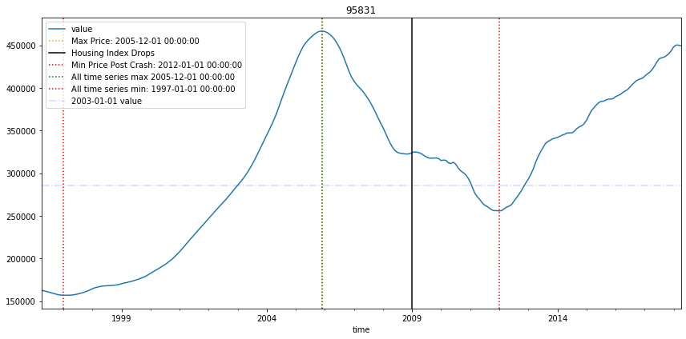


#### Boxplot of zip code


```python
# # note--check for SizeRank column and drop if needed
ts_95831.boxplot(column = 'value')
plt.title('95831');
```


### Plot ACF and PACF for ts dataframe


```python
# plot_acf_pacf(ts, figsize=(10,6), lags=15)  # note that ts must only contain values and time as index

plot_acf_pacf(ts_95831_values, figsize=(10,6), lags=15)
```


### Plot seasonal decomposition for ts dataframe


```python
# plot_seasonal_decomp(ts)

plot_seasonal_decomp(ts_95831_values)

# Seasonality does not appear to be a significant factor in this zip code.
```


    (<Figure size 1296x432 with 1 Axes>,
     <matplotlib.axes._subplots.AxesSubplot at 0x1cbf70f2e8>)


## ARIMA model parameters and optimization

### Generate list of (p,d,q) and (p,d,q,m) values


```python
p_values = [0, 1, 2, 4, 6, 8]
d_values = range(0, 3)
q_values = range(0, 3)
warnings.filterwarnings("ignore")
```

### Run ARIMA model on ts dataframe with list of p,d,q values 


```python
# eval_arima_models(ts, p_values, d_values, q_values)  # don't run this until you have some time, since it take time
# note that ts must only contain values and time as index

# eval_arima_models(ts_95831_values, p_values, d_values, q_values)  # don't run this until you have some time, since it takes time

```

### Generate model fit summary


```python
# model_fit = arima_zipcode(ts, order = None)   # change order = tuple to correspond to the best MSE produced by previous function

# Best ARIMA(6, 0, 2) MSE=955633.913

model_fit_95831 = arima_zipcode(ts_95831_values, order = (6,0,2))

```

                                  ARMA Model Results                              
    ==============================================================================
    Dep. Variable:                      y   No. Observations:                  265
    Model:                     ARMA(6, 2)   Log Likelihood               -2114.435
    Method:                       css-mle   S.D. of innovations            686.860
    Date:                Tue, 10 Mar 2020   AIC                           4248.869
    Time:                        22:20:40   BIC                           4284.667
    Sample:                             0   HQIC                          4263.252
                                                                                  
    ==============================================================================
                     coef    std err          z      P>|z|      [0.025      0.975]
    ------------------------------------------------------------------------------
    const       3.083e+05   3.71e+04      8.301      0.000    2.35e+05    3.81e+05
    ar.L1.y        1.0718      0.099     10.815      0.000       0.878       1.266
    ar.L2.y        0.2689      0.161      1.673      0.096      -0.046       0.584
    ar.L3.y        0.0460      0.131      0.351      0.726      -0.211       0.302
    ar.L4.y       -0.2144      0.117     -1.827      0.069      -0.444       0.016
    ar.L5.y       -0.2430      0.116     -2.095      0.037      -0.470      -0.016
    ar.L6.y        0.0673      0.078      0.858      0.392      -0.086       0.221
    ma.L1.y        1.4691      0.081     18.215      0.000       1.311       1.627
    ma.L2.y        0.7900      0.069     11.469      0.000       0.655       0.925
                                        Roots                                    
    =============================================================================
                      Real          Imaginary           Modulus         Frequency
    -----------------------------------------------------------------------------
    AR.1            1.0172           -0.0338j            1.0178           -0.0053
    AR.2            1.0172           +0.0338j            1.0178            0.0053
    AR.3           -0.5323           -1.3578j            1.4584           -0.3095
    AR.4           -0.5323           +1.3578j            1.4584            0.3095
    AR.5           -1.5929           -0.0000j            1.5929           -0.5000
    AR.6            4.2343           -0.0000j            4.2343           -0.0000
    MA.1           -0.9298           -0.6335j            1.1251           -0.4048
    MA.2           -0.9298           +0.6335j            1.1251            0.4048
    -----------------------------------------------------------------------------


## ARIMA modeling results:  predictions and visualization

### Produce forecasts from ARIMA model fit


```python
actual_forecast_95831, std_error_95831, forecast_confint_95831 = forecast(model_fit_95831)

# actual_forecast, forecast_confint = forecast(model_fit_dallas, months=24, confint=2)
```


```python
actual_forecast_95831, std_error_95831, forecast_confint_95831
```


    (array([448055.34904689, 446258.99142394, 444732.62966351, 442890.63817301,
            440908.86992911, 438846.29448965, 436698.00177897, 434394.61635692,
            432023.067973  , 429562.86789984, 427010.79839512, 424381.93182731,
            421688.50688566, 418926.14678419, 416105.66229123, 413234.19815818,
            410315.6151534 , 407355.44807063, 404360.56518167, 401335.54054039,
            398285.54159044, 395216.0085917 , 392131.8146654 , 389037.60616711]),
     array([  686.85952291,  1875.56400598,  3204.22890452,  4589.2614006 ,
             6189.42312157,  7902.40759175,  9684.86935222, 11550.90646994,
            13488.12564267, 15468.93716926, 17491.51695423, 19548.38628106,
            21627.70353003, 23722.80706226, 25828.54833246, 27937.77680785,
            30044.97454656, 32145.57941499, 34234.83275574, 36308.41148665,
            38362.63161821, 40393.96734777, 42399.16808204, 44375.3514589 ]),
     array([[446709.12911954, 449401.56897424],
            [442582.95352153, 449935.02932635],
            [438452.45641243, 451012.8029146 ],
            [433895.8511122 , 451885.42523382],
            [428777.82352576, 453039.91633247],
            [423357.86021867, 454334.72876063],
            [417716.00665365, 455679.99690429],
            [411755.25568705, 457033.97702679],
            [405586.82749442, 458459.30845158],
            [399244.30816897, 459881.4276307 ],
            [392728.05512986, 461293.54166038],
            [386067.79876056, 462696.06489405],
            [379298.98689849, 464078.02687283],
            [372430.29932997, 465421.99423841],
            [365482.63778666, 466728.68679581],
            [358477.16180668, 467991.23450969],
            [351428.54712572, 469202.68318109],
            [344351.27015506, 470359.62598619],
            [337261.52596367, 471459.60439968],
            [330172.36169069, 472498.7193901 ],
            [323096.16526656, 473474.91791432],
            [316045.28739739, 474386.72978601],
            [309030.97225015, 475232.65708066],
            [302063.51550637, 476011.69682785]]))


### Create dataframe to hold forecast results


```python
# df_forecast = forecast_df(col = 'time', daterange = pd.date_range(start='2018-05-01', end='2020-04-01', freq='MS'), 
#                 actual_forecast=actual_forecast, forecast_confint = forecast_confint)

df_forecast_95831 = forecast_df(actual_forecast_95831, forecast_confint_95831, col = 'time', daterange = pd.date_range(start='2018-05-01', end='2020-04-01', freq='MS'))

```

### Create new dataframe concatenating historic values and forecast results


```python
# df_new = concat_values_forecast(ts, df_forecast)

df_new_95831 = concat_values_forecast(ts_95831_values, df_forecast_95831)
```


```python
df_new_95831
```


<div>
<style scoped>
    .dataframe tbody tr th:only-of-type {
        vertical-align: middle;
    }

    .dataframe tbody tr th {
        vertical-align: top;
    }

    .dataframe thead th {
        text-align: right;
    }
</style>
<table border="1" class="dataframe">
  <thead>
    <tr style="text-align: right;">
      <th></th>
      <th>value</th>
      <th>forecast</th>
      <th>forecast_lower</th>
      <th>forecast_upper</th>
    </tr>
    <tr>
      <th>time</th>
      <th></th>
      <th></th>
      <th></th>
      <th></th>
    </tr>
  </thead>
  <tbody>
    <tr>
      <td>1996-04-01</td>
      <td>162600.0</td>
      <td>NaN</td>
      <td>NaN</td>
      <td>NaN</td>
    </tr>
    <tr>
      <td>1996-05-01</td>
      <td>162000.0</td>
      <td>NaN</td>
      <td>NaN</td>
      <td>NaN</td>
    </tr>
    <tr>
      <td>1996-06-01</td>
      <td>161200.0</td>
      <td>NaN</td>
      <td>NaN</td>
      <td>NaN</td>
    </tr>
    <tr>
      <td>1996-07-01</td>
      <td>160400.0</td>
      <td>NaN</td>
      <td>NaN</td>
      <td>NaN</td>
    </tr>
    <tr>
      <td>1996-08-01</td>
      <td>159500.0</td>
      <td>NaN</td>
      <td>NaN</td>
      <td>NaN</td>
    </tr>
    <tr>
      <td>1996-09-01</td>
      <td>158700.0</td>
      <td>NaN</td>
      <td>NaN</td>
      <td>NaN</td>
    </tr>
    <tr>
      <td>1996-10-01</td>
      <td>158000.0</td>
      <td>NaN</td>
      <td>NaN</td>
      <td>NaN</td>
    </tr>
    <tr>
      <td>1996-11-01</td>
      <td>157300.0</td>
      <td>NaN</td>
      <td>NaN</td>
      <td>NaN</td>
    </tr>
    <tr>
      <td>1996-12-01</td>
      <td>157000.0</td>
      <td>NaN</td>
      <td>NaN</td>
      <td>NaN</td>
    </tr>
    <tr>
      <td>1997-01-01</td>
      <td>156800.0</td>
      <td>NaN</td>
      <td>NaN</td>
      <td>NaN</td>
    </tr>
    <tr>
      <td>1997-02-01</td>
      <td>156800.0</td>
      <td>NaN</td>
      <td>NaN</td>
      <td>NaN</td>
    </tr>
    <tr>
      <td>1997-03-01</td>
      <td>156800.0</td>
      <td>NaN</td>
      <td>NaN</td>
      <td>NaN</td>
    </tr>
    <tr>
      <td>1997-04-01</td>
      <td>156900.0</td>
      <td>NaN</td>
      <td>NaN</td>
      <td>NaN</td>
    </tr>
    <tr>
      <td>1997-05-01</td>
      <td>157200.0</td>
      <td>NaN</td>
      <td>NaN</td>
      <td>NaN</td>
    </tr>
    <tr>
      <td>1997-06-01</td>
      <td>157700.0</td>
      <td>NaN</td>
      <td>NaN</td>
      <td>NaN</td>
    </tr>
    <tr>
      <td>1997-07-01</td>
      <td>158300.0</td>
      <td>NaN</td>
      <td>NaN</td>
      <td>NaN</td>
    </tr>
    <tr>
      <td>1997-08-01</td>
      <td>159000.0</td>
      <td>NaN</td>
      <td>NaN</td>
      <td>NaN</td>
    </tr>
    <tr>
      <td>1997-09-01</td>
      <td>159800.0</td>
      <td>NaN</td>
      <td>NaN</td>
      <td>NaN</td>
    </tr>
    <tr>
      <td>1997-10-01</td>
      <td>160800.0</td>
      <td>NaN</td>
      <td>NaN</td>
      <td>NaN</td>
    </tr>
    <tr>
      <td>1997-11-01</td>
      <td>161900.0</td>
      <td>NaN</td>
      <td>NaN</td>
      <td>NaN</td>
    </tr>
    <tr>
      <td>1997-12-01</td>
      <td>163100.0</td>
      <td>NaN</td>
      <td>NaN</td>
      <td>NaN</td>
    </tr>
    <tr>
      <td>1998-01-01</td>
      <td>164500.0</td>
      <td>NaN</td>
      <td>NaN</td>
      <td>NaN</td>
    </tr>
    <tr>
      <td>1998-02-01</td>
      <td>165600.0</td>
      <td>NaN</td>
      <td>NaN</td>
      <td>NaN</td>
    </tr>
    <tr>
      <td>1998-03-01</td>
      <td>166300.0</td>
      <td>NaN</td>
      <td>NaN</td>
      <td>NaN</td>
    </tr>
    <tr>
      <td>1998-04-01</td>
      <td>167000.0</td>
      <td>NaN</td>
      <td>NaN</td>
      <td>NaN</td>
    </tr>
    <tr>
      <td>1998-05-01</td>
      <td>167500.0</td>
      <td>NaN</td>
      <td>NaN</td>
      <td>NaN</td>
    </tr>
    <tr>
      <td>1998-06-01</td>
      <td>167800.0</td>
      <td>NaN</td>
      <td>NaN</td>
      <td>NaN</td>
    </tr>
    <tr>
      <td>1998-07-01</td>
      <td>167900.0</td>
      <td>NaN</td>
      <td>NaN</td>
      <td>NaN</td>
    </tr>
    <tr>
      <td>1998-08-01</td>
      <td>168100.0</td>
      <td>NaN</td>
      <td>NaN</td>
      <td>NaN</td>
    </tr>
    <tr>
      <td>1998-09-01</td>
      <td>168300.0</td>
      <td>NaN</td>
      <td>NaN</td>
      <td>NaN</td>
    </tr>
    <tr>
      <td>1998-10-01</td>
      <td>168600.0</td>
      <td>NaN</td>
      <td>NaN</td>
      <td>NaN</td>
    </tr>
    <tr>
      <td>1998-11-01</td>
      <td>168900.0</td>
      <td>NaN</td>
      <td>NaN</td>
      <td>NaN</td>
    </tr>
    <tr>
      <td>1998-12-01</td>
      <td>169500.0</td>
      <td>NaN</td>
      <td>NaN</td>
      <td>NaN</td>
    </tr>
    <tr>
      <td>1999-01-01</td>
      <td>170300.0</td>
      <td>NaN</td>
      <td>NaN</td>
      <td>NaN</td>
    </tr>
    <tr>
      <td>1999-02-01</td>
      <td>171100.0</td>
      <td>NaN</td>
      <td>NaN</td>
      <td>NaN</td>
    </tr>
    <tr>
      <td>1999-03-01</td>
      <td>171600.0</td>
      <td>NaN</td>
      <td>NaN</td>
      <td>NaN</td>
    </tr>
    <tr>
      <td>1999-04-01</td>
      <td>172300.0</td>
      <td>NaN</td>
      <td>NaN</td>
      <td>NaN</td>
    </tr>
    <tr>
      <td>1999-05-01</td>
      <td>173000.0</td>
      <td>NaN</td>
      <td>NaN</td>
      <td>NaN</td>
    </tr>
    <tr>
      <td>1999-06-01</td>
      <td>173800.0</td>
      <td>NaN</td>
      <td>NaN</td>
      <td>NaN</td>
    </tr>
    <tr>
      <td>1999-07-01</td>
      <td>174700.0</td>
      <td>NaN</td>
      <td>NaN</td>
      <td>NaN</td>
    </tr>
    <tr>
      <td>1999-08-01</td>
      <td>175700.0</td>
      <td>NaN</td>
      <td>NaN</td>
      <td>NaN</td>
    </tr>
    <tr>
      <td>1999-09-01</td>
      <td>176800.0</td>
      <td>NaN</td>
      <td>NaN</td>
      <td>NaN</td>
    </tr>
    <tr>
      <td>1999-10-01</td>
      <td>177900.0</td>
      <td>NaN</td>
      <td>NaN</td>
      <td>NaN</td>
    </tr>
    <tr>
      <td>1999-11-01</td>
      <td>179200.0</td>
      <td>NaN</td>
      <td>NaN</td>
      <td>NaN</td>
    </tr>
    <tr>
      <td>1999-12-01</td>
      <td>180800.0</td>
      <td>NaN</td>
      <td>NaN</td>
      <td>NaN</td>
    </tr>
    <tr>
      <td>2000-01-01</td>
      <td>182500.0</td>
      <td>NaN</td>
      <td>NaN</td>
      <td>NaN</td>
    </tr>
    <tr>
      <td>2000-02-01</td>
      <td>184300.0</td>
      <td>NaN</td>
      <td>NaN</td>
      <td>NaN</td>
    </tr>
    <tr>
      <td>2000-03-01</td>
      <td>185900.0</td>
      <td>NaN</td>
      <td>NaN</td>
      <td>NaN</td>
    </tr>
    <tr>
      <td>2000-04-01</td>
      <td>187600.0</td>
      <td>NaN</td>
      <td>NaN</td>
      <td>NaN</td>
    </tr>
    <tr>
      <td>2000-05-01</td>
      <td>189300.0</td>
      <td>NaN</td>
      <td>NaN</td>
      <td>NaN</td>
    </tr>
    <tr>
      <td>2000-06-01</td>
      <td>191100.0</td>
      <td>NaN</td>
      <td>NaN</td>
      <td>NaN</td>
    </tr>
    <tr>
      <td>2000-07-01</td>
      <td>192900.0</td>
      <td>NaN</td>
      <td>NaN</td>
      <td>NaN</td>
    </tr>
    <tr>
      <td>2000-08-01</td>
      <td>194900.0</td>
      <td>NaN</td>
      <td>NaN</td>
      <td>NaN</td>
    </tr>
    <tr>
      <td>2000-09-01</td>
      <td>197100.0</td>
      <td>NaN</td>
      <td>NaN</td>
      <td>NaN</td>
    </tr>
    <tr>
      <td>2000-10-01</td>
      <td>199400.0</td>
      <td>NaN</td>
      <td>NaN</td>
      <td>NaN</td>
    </tr>
    <tr>
      <td>2000-11-01</td>
      <td>202100.0</td>
      <td>NaN</td>
      <td>NaN</td>
      <td>NaN</td>
    </tr>
    <tr>
      <td>2000-12-01</td>
      <td>205000.0</td>
      <td>NaN</td>
      <td>NaN</td>
      <td>NaN</td>
    </tr>
    <tr>
      <td>2001-01-01</td>
      <td>208000.0</td>
      <td>NaN</td>
      <td>NaN</td>
      <td>NaN</td>
    </tr>
    <tr>
      <td>2001-02-01</td>
      <td>211200.0</td>
      <td>NaN</td>
      <td>NaN</td>
      <td>NaN</td>
    </tr>
    <tr>
      <td>2001-03-01</td>
      <td>214500.0</td>
      <td>NaN</td>
      <td>NaN</td>
      <td>NaN</td>
    </tr>
    <tr>
      <td>2001-04-01</td>
      <td>217900.0</td>
      <td>NaN</td>
      <td>NaN</td>
      <td>NaN</td>
    </tr>
    <tr>
      <td>2001-05-01</td>
      <td>221200.0</td>
      <td>NaN</td>
      <td>NaN</td>
      <td>NaN</td>
    </tr>
    <tr>
      <td>2001-06-01</td>
      <td>224500.0</td>
      <td>NaN</td>
      <td>NaN</td>
      <td>NaN</td>
    </tr>
    <tr>
      <td>2001-07-01</td>
      <td>227700.0</td>
      <td>NaN</td>
      <td>NaN</td>
      <td>NaN</td>
    </tr>
    <tr>
      <td>2001-08-01</td>
      <td>230900.0</td>
      <td>NaN</td>
      <td>NaN</td>
      <td>NaN</td>
    </tr>
    <tr>
      <td>2001-09-01</td>
      <td>234100.0</td>
      <td>NaN</td>
      <td>NaN</td>
      <td>NaN</td>
    </tr>
    <tr>
      <td>2001-10-01</td>
      <td>237300.0</td>
      <td>NaN</td>
      <td>NaN</td>
      <td>NaN</td>
    </tr>
    <tr>
      <td>2001-11-01</td>
      <td>240500.0</td>
      <td>NaN</td>
      <td>NaN</td>
      <td>NaN</td>
    </tr>
    <tr>
      <td>2001-12-01</td>
      <td>243700.0</td>
      <td>NaN</td>
      <td>NaN</td>
      <td>NaN</td>
    </tr>
    <tr>
      <td>2002-01-01</td>
      <td>246900.0</td>
      <td>NaN</td>
      <td>NaN</td>
      <td>NaN</td>
    </tr>
    <tr>
      <td>2002-02-01</td>
      <td>250200.0</td>
      <td>NaN</td>
      <td>NaN</td>
      <td>NaN</td>
    </tr>
    <tr>
      <td>2002-03-01</td>
      <td>253400.0</td>
      <td>NaN</td>
      <td>NaN</td>
      <td>NaN</td>
    </tr>
    <tr>
      <td>2002-04-01</td>
      <td>256600.0</td>
      <td>NaN</td>
      <td>NaN</td>
      <td>NaN</td>
    </tr>
    <tr>
      <td>2002-05-01</td>
      <td>259700.0</td>
      <td>NaN</td>
      <td>NaN</td>
      <td>NaN</td>
    </tr>
    <tr>
      <td>2002-06-01</td>
      <td>262700.0</td>
      <td>NaN</td>
      <td>NaN</td>
      <td>NaN</td>
    </tr>
    <tr>
      <td>2002-07-01</td>
      <td>265800.0</td>
      <td>NaN</td>
      <td>NaN</td>
      <td>NaN</td>
    </tr>
    <tr>
      <td>2002-08-01</td>
      <td>268900.0</td>
      <td>NaN</td>
      <td>NaN</td>
      <td>NaN</td>
    </tr>
    <tr>
      <td>2002-09-01</td>
      <td>272200.0</td>
      <td>NaN</td>
      <td>NaN</td>
      <td>NaN</td>
    </tr>
    <tr>
      <td>2002-10-01</td>
      <td>275600.0</td>
      <td>NaN</td>
      <td>NaN</td>
      <td>NaN</td>
    </tr>
    <tr>
      <td>2002-11-01</td>
      <td>279100.0</td>
      <td>NaN</td>
      <td>NaN</td>
      <td>NaN</td>
    </tr>
    <tr>
      <td>2002-12-01</td>
      <td>282700.0</td>
      <td>NaN</td>
      <td>NaN</td>
      <td>NaN</td>
    </tr>
    <tr>
      <td>2003-01-01</td>
      <td>286000.0</td>
      <td>NaN</td>
      <td>NaN</td>
      <td>NaN</td>
    </tr>
    <tr>
      <td>2003-02-01</td>
      <td>289300.0</td>
      <td>NaN</td>
      <td>NaN</td>
      <td>NaN</td>
    </tr>
    <tr>
      <td>2003-03-01</td>
      <td>292800.0</td>
      <td>NaN</td>
      <td>NaN</td>
      <td>NaN</td>
    </tr>
    <tr>
      <td>2003-04-01</td>
      <td>296700.0</td>
      <td>NaN</td>
      <td>NaN</td>
      <td>NaN</td>
    </tr>
    <tr>
      <td>2003-05-01</td>
      <td>300900.0</td>
      <td>NaN</td>
      <td>NaN</td>
      <td>NaN</td>
    </tr>
    <tr>
      <td>2003-06-01</td>
      <td>305500.0</td>
      <td>NaN</td>
      <td>NaN</td>
      <td>NaN</td>
    </tr>
    <tr>
      <td>2003-07-01</td>
      <td>310500.0</td>
      <td>NaN</td>
      <td>NaN</td>
      <td>NaN</td>
    </tr>
    <tr>
      <td>2003-08-01</td>
      <td>315800.0</td>
      <td>NaN</td>
      <td>NaN</td>
      <td>NaN</td>
    </tr>
    <tr>
      <td>2003-09-01</td>
      <td>321500.0</td>
      <td>NaN</td>
      <td>NaN</td>
      <td>NaN</td>
    </tr>
    <tr>
      <td>2003-10-01</td>
      <td>327300.0</td>
      <td>NaN</td>
      <td>NaN</td>
      <td>NaN</td>
    </tr>
    <tr>
      <td>2003-11-01</td>
      <td>333200.0</td>
      <td>NaN</td>
      <td>NaN</td>
      <td>NaN</td>
    </tr>
    <tr>
      <td>2003-12-01</td>
      <td>339200.0</td>
      <td>NaN</td>
      <td>NaN</td>
      <td>NaN</td>
    </tr>
    <tr>
      <td>2004-01-01</td>
      <td>345100.0</td>
      <td>NaN</td>
      <td>NaN</td>
      <td>NaN</td>
    </tr>
    <tr>
      <td>2004-02-01</td>
      <td>350800.0</td>
      <td>NaN</td>
      <td>NaN</td>
      <td>NaN</td>
    </tr>
    <tr>
      <td>2004-03-01</td>
      <td>356700.0</td>
      <td>NaN</td>
      <td>NaN</td>
      <td>NaN</td>
    </tr>
    <tr>
      <td>2004-04-01</td>
      <td>363100.0</td>
      <td>NaN</td>
      <td>NaN</td>
      <td>NaN</td>
    </tr>
    <tr>
      <td>2004-05-01</td>
      <td>370100.0</td>
      <td>NaN</td>
      <td>NaN</td>
      <td>NaN</td>
    </tr>
    <tr>
      <td>2004-06-01</td>
      <td>377800.0</td>
      <td>NaN</td>
      <td>NaN</td>
      <td>NaN</td>
    </tr>
    <tr>
      <td>2004-07-01</td>
      <td>385800.0</td>
      <td>NaN</td>
      <td>NaN</td>
      <td>NaN</td>
    </tr>
    <tr>
      <td>2004-08-01</td>
      <td>393600.0</td>
      <td>NaN</td>
      <td>NaN</td>
      <td>NaN</td>
    </tr>
    <tr>
      <td>2004-09-01</td>
      <td>401200.0</td>
      <td>NaN</td>
      <td>NaN</td>
      <td>NaN</td>
    </tr>
    <tr>
      <td>2004-10-01</td>
      <td>408500.0</td>
      <td>NaN</td>
      <td>NaN</td>
      <td>NaN</td>
    </tr>
    <tr>
      <td>2004-11-01</td>
      <td>415600.0</td>
      <td>NaN</td>
      <td>NaN</td>
      <td>NaN</td>
    </tr>
    <tr>
      <td>2004-12-01</td>
      <td>422800.0</td>
      <td>NaN</td>
      <td>NaN</td>
      <td>NaN</td>
    </tr>
    <tr>
      <td>2005-01-01</td>
      <td>430100.0</td>
      <td>NaN</td>
      <td>NaN</td>
      <td>NaN</td>
    </tr>
    <tr>
      <td>2005-02-01</td>
      <td>436900.0</td>
      <td>NaN</td>
      <td>NaN</td>
      <td>NaN</td>
    </tr>
    <tr>
      <td>2005-03-01</td>
      <td>443000.0</td>
      <td>NaN</td>
      <td>NaN</td>
      <td>NaN</td>
    </tr>
    <tr>
      <td>2005-04-01</td>
      <td>448500.0</td>
      <td>NaN</td>
      <td>NaN</td>
      <td>NaN</td>
    </tr>
    <tr>
      <td>2005-05-01</td>
      <td>452600.0</td>
      <td>NaN</td>
      <td>NaN</td>
      <td>NaN</td>
    </tr>
    <tr>
      <td>2005-06-01</td>
      <td>455900.0</td>
      <td>NaN</td>
      <td>NaN</td>
      <td>NaN</td>
    </tr>
    <tr>
      <td>2005-07-01</td>
      <td>458800.0</td>
      <td>NaN</td>
      <td>NaN</td>
      <td>NaN</td>
    </tr>
    <tr>
      <td>2005-08-01</td>
      <td>461400.0</td>
      <td>NaN</td>
      <td>NaN</td>
      <td>NaN</td>
    </tr>
    <tr>
      <td>2005-09-01</td>
      <td>463700.0</td>
      <td>NaN</td>
      <td>NaN</td>
      <td>NaN</td>
    </tr>
    <tr>
      <td>2005-10-01</td>
      <td>465500.0</td>
      <td>NaN</td>
      <td>NaN</td>
      <td>NaN</td>
    </tr>
    <tr>
      <td>2005-11-01</td>
      <td>466500.0</td>
      <td>NaN</td>
      <td>NaN</td>
      <td>NaN</td>
    </tr>
    <tr>
      <td>2005-12-01</td>
      <td>466600.0</td>
      <td>NaN</td>
      <td>NaN</td>
      <td>NaN</td>
    </tr>
    <tr>
      <td>2006-01-01</td>
      <td>466100.0</td>
      <td>NaN</td>
      <td>NaN</td>
      <td>NaN</td>
    </tr>
    <tr>
      <td>2006-02-01</td>
      <td>464800.0</td>
      <td>NaN</td>
      <td>NaN</td>
      <td>NaN</td>
    </tr>
    <tr>
      <td>2006-03-01</td>
      <td>462800.0</td>
      <td>NaN</td>
      <td>NaN</td>
      <td>NaN</td>
    </tr>
    <tr>
      <td>2006-04-01</td>
      <td>460200.0</td>
      <td>NaN</td>
      <td>NaN</td>
      <td>NaN</td>
    </tr>
    <tr>
      <td>2006-05-01</td>
      <td>456700.0</td>
      <td>NaN</td>
      <td>NaN</td>
      <td>NaN</td>
    </tr>
    <tr>
      <td>2006-06-01</td>
      <td>452200.0</td>
      <td>NaN</td>
      <td>NaN</td>
      <td>NaN</td>
    </tr>
    <tr>
      <td>2006-07-01</td>
      <td>447200.0</td>
      <td>NaN</td>
      <td>NaN</td>
      <td>NaN</td>
    </tr>
    <tr>
      <td>2006-08-01</td>
      <td>441100.0</td>
      <td>NaN</td>
      <td>NaN</td>
      <td>NaN</td>
    </tr>
    <tr>
      <td>2006-09-01</td>
      <td>434100.0</td>
      <td>NaN</td>
      <td>NaN</td>
      <td>NaN</td>
    </tr>
    <tr>
      <td>2006-10-01</td>
      <td>426500.0</td>
      <td>NaN</td>
      <td>NaN</td>
      <td>NaN</td>
    </tr>
    <tr>
      <td>2006-11-01</td>
      <td>419000.0</td>
      <td>NaN</td>
      <td>NaN</td>
      <td>NaN</td>
    </tr>
    <tr>
      <td>2006-12-01</td>
      <td>412600.0</td>
      <td>NaN</td>
      <td>NaN</td>
      <td>NaN</td>
    </tr>
    <tr>
      <td>2007-01-01</td>
      <td>408000.0</td>
      <td>NaN</td>
      <td>NaN</td>
      <td>NaN</td>
    </tr>
    <tr>
      <td>2007-02-01</td>
      <td>404200.0</td>
      <td>NaN</td>
      <td>NaN</td>
      <td>NaN</td>
    </tr>
    <tr>
      <td>2007-03-01</td>
      <td>401000.0</td>
      <td>NaN</td>
      <td>NaN</td>
      <td>NaN</td>
    </tr>
    <tr>
      <td>2007-04-01</td>
      <td>398100.0</td>
      <td>NaN</td>
      <td>NaN</td>
      <td>NaN</td>
    </tr>
    <tr>
      <td>2007-05-01</td>
      <td>394800.0</td>
      <td>NaN</td>
      <td>NaN</td>
      <td>NaN</td>
    </tr>
    <tr>
      <td>2007-06-01</td>
      <td>390700.0</td>
      <td>NaN</td>
      <td>NaN</td>
      <td>NaN</td>
    </tr>
    <tr>
      <td>2007-07-01</td>
      <td>386500.0</td>
      <td>NaN</td>
      <td>NaN</td>
      <td>NaN</td>
    </tr>
    <tr>
      <td>2007-08-01</td>
      <td>381700.0</td>
      <td>NaN</td>
      <td>NaN</td>
      <td>NaN</td>
    </tr>
    <tr>
      <td>2007-09-01</td>
      <td>376400.0</td>
      <td>NaN</td>
      <td>NaN</td>
      <td>NaN</td>
    </tr>
    <tr>
      <td>2007-10-01</td>
      <td>370600.0</td>
      <td>NaN</td>
      <td>NaN</td>
      <td>NaN</td>
    </tr>
    <tr>
      <td>2007-11-01</td>
      <td>364500.0</td>
      <td>NaN</td>
      <td>NaN</td>
      <td>NaN</td>
    </tr>
    <tr>
      <td>2007-12-01</td>
      <td>358800.0</td>
      <td>NaN</td>
      <td>NaN</td>
      <td>NaN</td>
    </tr>
    <tr>
      <td>2008-01-01</td>
      <td>353400.0</td>
      <td>NaN</td>
      <td>NaN</td>
      <td>NaN</td>
    </tr>
    <tr>
      <td>2008-02-01</td>
      <td>347200.0</td>
      <td>NaN</td>
      <td>NaN</td>
      <td>NaN</td>
    </tr>
    <tr>
      <td>2008-03-01</td>
      <td>340700.0</td>
      <td>NaN</td>
      <td>NaN</td>
      <td>NaN</td>
    </tr>
    <tr>
      <td>2008-04-01</td>
      <td>334900.0</td>
      <td>NaN</td>
      <td>NaN</td>
      <td>NaN</td>
    </tr>
    <tr>
      <td>2008-05-01</td>
      <td>330100.0</td>
      <td>NaN</td>
      <td>NaN</td>
      <td>NaN</td>
    </tr>
    <tr>
      <td>2008-06-01</td>
      <td>326300.0</td>
      <td>NaN</td>
      <td>NaN</td>
      <td>NaN</td>
    </tr>
    <tr>
      <td>2008-07-01</td>
      <td>324300.0</td>
      <td>NaN</td>
      <td>NaN</td>
      <td>NaN</td>
    </tr>
    <tr>
      <td>2008-08-01</td>
      <td>323400.0</td>
      <td>NaN</td>
      <td>NaN</td>
      <td>NaN</td>
    </tr>
    <tr>
      <td>2008-09-01</td>
      <td>323000.0</td>
      <td>NaN</td>
      <td>NaN</td>
      <td>NaN</td>
    </tr>
    <tr>
      <td>2008-10-01</td>
      <td>322600.0</td>
      <td>NaN</td>
      <td>NaN</td>
      <td>NaN</td>
    </tr>
    <tr>
      <td>2008-11-01</td>
      <td>322400.0</td>
      <td>NaN</td>
      <td>NaN</td>
      <td>NaN</td>
    </tr>
    <tr>
      <td>2008-12-01</td>
      <td>322900.0</td>
      <td>NaN</td>
      <td>NaN</td>
      <td>NaN</td>
    </tr>
    <tr>
      <td>2009-01-01</td>
      <td>324200.0</td>
      <td>NaN</td>
      <td>NaN</td>
      <td>NaN</td>
    </tr>
    <tr>
      <td>2009-02-01</td>
      <td>324900.0</td>
      <td>NaN</td>
      <td>NaN</td>
      <td>NaN</td>
    </tr>
    <tr>
      <td>2009-03-01</td>
      <td>324600.0</td>
      <td>NaN</td>
      <td>NaN</td>
      <td>NaN</td>
    </tr>
    <tr>
      <td>2009-04-01</td>
      <td>323800.0</td>
      <td>NaN</td>
      <td>NaN</td>
      <td>NaN</td>
    </tr>
    <tr>
      <td>2009-05-01</td>
      <td>322500.0</td>
      <td>NaN</td>
      <td>NaN</td>
      <td>NaN</td>
    </tr>
    <tr>
      <td>2009-06-01</td>
      <td>320500.0</td>
      <td>NaN</td>
      <td>NaN</td>
      <td>NaN</td>
    </tr>
    <tr>
      <td>2009-07-01</td>
      <td>318800.0</td>
      <td>NaN</td>
      <td>NaN</td>
      <td>NaN</td>
    </tr>
    <tr>
      <td>2009-08-01</td>
      <td>317700.0</td>
      <td>NaN</td>
      <td>NaN</td>
      <td>NaN</td>
    </tr>
    <tr>
      <td>2009-09-01</td>
      <td>317500.0</td>
      <td>NaN</td>
      <td>NaN</td>
      <td>NaN</td>
    </tr>
    <tr>
      <td>2009-10-01</td>
      <td>317700.0</td>
      <td>NaN</td>
      <td>NaN</td>
      <td>NaN</td>
    </tr>
    <tr>
      <td>2009-11-01</td>
      <td>317900.0</td>
      <td>NaN</td>
      <td>NaN</td>
      <td>NaN</td>
    </tr>
    <tr>
      <td>2009-12-01</td>
      <td>317000.0</td>
      <td>NaN</td>
      <td>NaN</td>
      <td>NaN</td>
    </tr>
    <tr>
      <td>2010-01-01</td>
      <td>314800.0</td>
      <td>NaN</td>
      <td>NaN</td>
      <td>NaN</td>
    </tr>
    <tr>
      <td>2010-02-01</td>
      <td>315400.0</td>
      <td>NaN</td>
      <td>NaN</td>
      <td>NaN</td>
    </tr>
    <tr>
      <td>2010-03-01</td>
      <td>315000.0</td>
      <td>NaN</td>
      <td>NaN</td>
      <td>NaN</td>
    </tr>
    <tr>
      <td>2010-04-01</td>
      <td>312100.0</td>
      <td>NaN</td>
      <td>NaN</td>
      <td>NaN</td>
    </tr>
    <tr>
      <td>2010-05-01</td>
      <td>311200.0</td>
      <td>NaN</td>
      <td>NaN</td>
      <td>NaN</td>
    </tr>
    <tr>
      <td>2010-06-01</td>
      <td>312800.0</td>
      <td>NaN</td>
      <td>NaN</td>
      <td>NaN</td>
    </tr>
    <tr>
      <td>2010-07-01</td>
      <td>310600.0</td>
      <td>NaN</td>
      <td>NaN</td>
      <td>NaN</td>
    </tr>
    <tr>
      <td>2010-08-01</td>
      <td>306200.0</td>
      <td>NaN</td>
      <td>NaN</td>
      <td>NaN</td>
    </tr>
    <tr>
      <td>2010-09-01</td>
      <td>302800.0</td>
      <td>NaN</td>
      <td>NaN</td>
      <td>NaN</td>
    </tr>
    <tr>
      <td>2010-10-01</td>
      <td>300900.0</td>
      <td>NaN</td>
      <td>NaN</td>
      <td>NaN</td>
    </tr>
    <tr>
      <td>2010-11-01</td>
      <td>298500.0</td>
      <td>NaN</td>
      <td>NaN</td>
      <td>NaN</td>
    </tr>
    <tr>
      <td>2010-12-01</td>
      <td>294800.0</td>
      <td>NaN</td>
      <td>NaN</td>
      <td>NaN</td>
    </tr>
    <tr>
      <td>2011-01-01</td>
      <td>289700.0</td>
      <td>NaN</td>
      <td>NaN</td>
      <td>NaN</td>
    </tr>
    <tr>
      <td>2011-02-01</td>
      <td>282500.0</td>
      <td>NaN</td>
      <td>NaN</td>
      <td>NaN</td>
    </tr>
    <tr>
      <td>2011-03-01</td>
      <td>276000.0</td>
      <td>NaN</td>
      <td>NaN</td>
      <td>NaN</td>
    </tr>
    <tr>
      <td>2011-04-01</td>
      <td>272100.0</td>
      <td>NaN</td>
      <td>NaN</td>
      <td>NaN</td>
    </tr>
    <tr>
      <td>2011-05-01</td>
      <td>268800.0</td>
      <td>NaN</td>
      <td>NaN</td>
      <td>NaN</td>
    </tr>
    <tr>
      <td>2011-06-01</td>
      <td>265100.0</td>
      <td>NaN</td>
      <td>NaN</td>
      <td>NaN</td>
    </tr>
    <tr>
      <td>2011-07-01</td>
      <td>262400.0</td>
      <td>NaN</td>
      <td>NaN</td>
      <td>NaN</td>
    </tr>
    <tr>
      <td>2011-08-01</td>
      <td>260900.0</td>
      <td>NaN</td>
      <td>NaN</td>
      <td>NaN</td>
    </tr>
    <tr>
      <td>2011-09-01</td>
      <td>258900.0</td>
      <td>NaN</td>
      <td>NaN</td>
      <td>NaN</td>
    </tr>
    <tr>
      <td>2011-10-01</td>
      <td>256800.0</td>
      <td>NaN</td>
      <td>NaN</td>
      <td>NaN</td>
    </tr>
    <tr>
      <td>2011-11-01</td>
      <td>256000.0</td>
      <td>NaN</td>
      <td>NaN</td>
      <td>NaN</td>
    </tr>
    <tr>
      <td>2011-12-01</td>
      <td>256100.0</td>
      <td>NaN</td>
      <td>NaN</td>
      <td>NaN</td>
    </tr>
    <tr>
      <td>2012-01-01</td>
      <td>255700.0</td>
      <td>NaN</td>
      <td>NaN</td>
      <td>NaN</td>
    </tr>
    <tr>
      <td>2012-02-01</td>
      <td>256100.0</td>
      <td>NaN</td>
      <td>NaN</td>
      <td>NaN</td>
    </tr>
    <tr>
      <td>2012-03-01</td>
      <td>258300.0</td>
      <td>NaN</td>
      <td>NaN</td>
      <td>NaN</td>
    </tr>
    <tr>
      <td>2012-04-01</td>
      <td>260100.0</td>
      <td>NaN</td>
      <td>NaN</td>
      <td>NaN</td>
    </tr>
    <tr>
      <td>2012-05-01</td>
      <td>261200.0</td>
      <td>NaN</td>
      <td>NaN</td>
      <td>NaN</td>
    </tr>
    <tr>
      <td>2012-06-01</td>
      <td>263000.0</td>
      <td>NaN</td>
      <td>NaN</td>
      <td>NaN</td>
    </tr>
    <tr>
      <td>2012-07-01</td>
      <td>266800.0</td>
      <td>NaN</td>
      <td>NaN</td>
      <td>NaN</td>
    </tr>
    <tr>
      <td>2012-08-01</td>
      <td>270800.0</td>
      <td>NaN</td>
      <td>NaN</td>
      <td>NaN</td>
    </tr>
    <tr>
      <td>2012-09-01</td>
      <td>274600.0</td>
      <td>NaN</td>
      <td>NaN</td>
      <td>NaN</td>
    </tr>
    <tr>
      <td>2012-10-01</td>
      <td>278900.0</td>
      <td>NaN</td>
      <td>NaN</td>
      <td>NaN</td>
    </tr>
    <tr>
      <td>2012-11-01</td>
      <td>283800.0</td>
      <td>NaN</td>
      <td>NaN</td>
      <td>NaN</td>
    </tr>
    <tr>
      <td>2012-12-01</td>
      <td>288700.0</td>
      <td>NaN</td>
      <td>NaN</td>
      <td>NaN</td>
    </tr>
    <tr>
      <td>2013-01-01</td>
      <td>293100.0</td>
      <td>NaN</td>
      <td>NaN</td>
      <td>NaN</td>
    </tr>
    <tr>
      <td>2013-02-01</td>
      <td>298400.0</td>
      <td>NaN</td>
      <td>NaN</td>
      <td>NaN</td>
    </tr>
    <tr>
      <td>2013-03-01</td>
      <td>304700.0</td>
      <td>NaN</td>
      <td>NaN</td>
      <td>NaN</td>
    </tr>
    <tr>
      <td>2013-04-01</td>
      <td>312600.0</td>
      <td>NaN</td>
      <td>NaN</td>
      <td>NaN</td>
    </tr>
    <tr>
      <td>2013-05-01</td>
      <td>319300.0</td>
      <td>NaN</td>
      <td>NaN</td>
      <td>NaN</td>
    </tr>
    <tr>
      <td>2013-06-01</td>
      <td>324800.0</td>
      <td>NaN</td>
      <td>NaN</td>
      <td>NaN</td>
    </tr>
    <tr>
      <td>2013-07-01</td>
      <td>329700.0</td>
      <td>NaN</td>
      <td>NaN</td>
      <td>NaN</td>
    </tr>
    <tr>
      <td>2013-08-01</td>
      <td>334400.0</td>
      <td>NaN</td>
      <td>NaN</td>
      <td>NaN</td>
    </tr>
    <tr>
      <td>2013-09-01</td>
      <td>337000.0</td>
      <td>NaN</td>
      <td>NaN</td>
      <td>NaN</td>
    </tr>
    <tr>
      <td>2013-10-01</td>
      <td>338500.0</td>
      <td>NaN</td>
      <td>NaN</td>
      <td>NaN</td>
    </tr>
    <tr>
      <td>2013-11-01</td>
      <td>340200.0</td>
      <td>NaN</td>
      <td>NaN</td>
      <td>NaN</td>
    </tr>
    <tr>
      <td>2013-12-01</td>
      <td>341100.0</td>
      <td>NaN</td>
      <td>NaN</td>
      <td>NaN</td>
    </tr>
    <tr>
      <td>2014-01-01</td>
      <td>341800.0</td>
      <td>NaN</td>
      <td>NaN</td>
      <td>NaN</td>
    </tr>
    <tr>
      <td>2014-02-01</td>
      <td>343200.0</td>
      <td>NaN</td>
      <td>NaN</td>
      <td>NaN</td>
    </tr>
    <tr>
      <td>2014-03-01</td>
      <td>344600.0</td>
      <td>NaN</td>
      <td>NaN</td>
      <td>NaN</td>
    </tr>
    <tr>
      <td>2014-04-01</td>
      <td>345600.0</td>
      <td>NaN</td>
      <td>NaN</td>
      <td>NaN</td>
    </tr>
    <tr>
      <td>2014-05-01</td>
      <td>347100.0</td>
      <td>NaN</td>
      <td>NaN</td>
      <td>NaN</td>
    </tr>
    <tr>
      <td>2014-06-01</td>
      <td>347300.0</td>
      <td>NaN</td>
      <td>NaN</td>
      <td>NaN</td>
    </tr>
    <tr>
      <td>2014-07-01</td>
      <td>347200.0</td>
      <td>NaN</td>
      <td>NaN</td>
      <td>NaN</td>
    </tr>
    <tr>
      <td>2014-08-01</td>
      <td>349200.0</td>
      <td>NaN</td>
      <td>NaN</td>
      <td>NaN</td>
    </tr>
    <tr>
      <td>2014-09-01</td>
      <td>352200.0</td>
      <td>NaN</td>
      <td>NaN</td>
      <td>NaN</td>
    </tr>
    <tr>
      <td>2014-10-01</td>
      <td>354200.0</td>
      <td>NaN</td>
      <td>NaN</td>
      <td>NaN</td>
    </tr>
    <tr>
      <td>2014-11-01</td>
      <td>355500.0</td>
      <td>NaN</td>
      <td>NaN</td>
      <td>NaN</td>
    </tr>
    <tr>
      <td>2014-12-01</td>
      <td>357800.0</td>
      <td>NaN</td>
      <td>NaN</td>
      <td>NaN</td>
    </tr>
    <tr>
      <td>2015-01-01</td>
      <td>361900.0</td>
      <td>NaN</td>
      <td>NaN</td>
      <td>NaN</td>
    </tr>
    <tr>
      <td>2015-02-01</td>
      <td>367600.0</td>
      <td>NaN</td>
      <td>NaN</td>
      <td>NaN</td>
    </tr>
    <tr>
      <td>2015-03-01</td>
      <td>373100.0</td>
      <td>NaN</td>
      <td>NaN</td>
      <td>NaN</td>
    </tr>
    <tr>
      <td>2015-04-01</td>
      <td>376500.0</td>
      <td>NaN</td>
      <td>NaN</td>
      <td>NaN</td>
    </tr>
    <tr>
      <td>2015-05-01</td>
      <td>379700.0</td>
      <td>NaN</td>
      <td>NaN</td>
      <td>NaN</td>
    </tr>
    <tr>
      <td>2015-06-01</td>
      <td>382500.0</td>
      <td>NaN</td>
      <td>NaN</td>
      <td>NaN</td>
    </tr>
    <tr>
      <td>2015-07-01</td>
      <td>384200.0</td>
      <td>NaN</td>
      <td>NaN</td>
      <td>NaN</td>
    </tr>
    <tr>
      <td>2015-08-01</td>
      <td>384400.0</td>
      <td>NaN</td>
      <td>NaN</td>
      <td>NaN</td>
    </tr>
    <tr>
      <td>2015-09-01</td>
      <td>385800.0</td>
      <td>NaN</td>
      <td>NaN</td>
      <td>NaN</td>
    </tr>
    <tr>
      <td>2015-10-01</td>
      <td>386800.0</td>
      <td>NaN</td>
      <td>NaN</td>
      <td>NaN</td>
    </tr>
    <tr>
      <td>2015-11-01</td>
      <td>386900.0</td>
      <td>NaN</td>
      <td>NaN</td>
      <td>NaN</td>
    </tr>
    <tr>
      <td>2015-12-01</td>
      <td>387400.0</td>
      <td>NaN</td>
      <td>NaN</td>
      <td>NaN</td>
    </tr>
    <tr>
      <td>2016-01-01</td>
      <td>389700.0</td>
      <td>NaN</td>
      <td>NaN</td>
      <td>NaN</td>
    </tr>
    <tr>
      <td>2016-02-01</td>
      <td>391000.0</td>
      <td>NaN</td>
      <td>NaN</td>
      <td>NaN</td>
    </tr>
    <tr>
      <td>2016-03-01</td>
      <td>392300.0</td>
      <td>NaN</td>
      <td>NaN</td>
      <td>NaN</td>
    </tr>
    <tr>
      <td>2016-04-01</td>
      <td>394600.0</td>
      <td>NaN</td>
      <td>NaN</td>
      <td>NaN</td>
    </tr>
    <tr>
      <td>2016-05-01</td>
      <td>396400.0</td>
      <td>NaN</td>
      <td>NaN</td>
      <td>NaN</td>
    </tr>
    <tr>
      <td>2016-06-01</td>
      <td>398100.0</td>
      <td>NaN</td>
      <td>NaN</td>
      <td>NaN</td>
    </tr>
    <tr>
      <td>2016-07-01</td>
      <td>401000.0</td>
      <td>NaN</td>
      <td>NaN</td>
      <td>NaN</td>
    </tr>
    <tr>
      <td>2016-08-01</td>
      <td>404200.0</td>
      <td>NaN</td>
      <td>NaN</td>
      <td>NaN</td>
    </tr>
    <tr>
      <td>2016-09-01</td>
      <td>406800.0</td>
      <td>NaN</td>
      <td>NaN</td>
      <td>NaN</td>
    </tr>
    <tr>
      <td>2016-10-01</td>
      <td>409200.0</td>
      <td>NaN</td>
      <td>NaN</td>
      <td>NaN</td>
    </tr>
    <tr>
      <td>2016-11-01</td>
      <td>410200.0</td>
      <td>NaN</td>
      <td>NaN</td>
      <td>NaN</td>
    </tr>
    <tr>
      <td>2016-12-01</td>
      <td>411200.0</td>
      <td>NaN</td>
      <td>NaN</td>
      <td>NaN</td>
    </tr>
    <tr>
      <td>2017-01-01</td>
      <td>413500.0</td>
      <td>NaN</td>
      <td>NaN</td>
      <td>NaN</td>
    </tr>
    <tr>
      <td>2017-02-01</td>
      <td>416100.0</td>
      <td>NaN</td>
      <td>NaN</td>
      <td>NaN</td>
    </tr>
    <tr>
      <td>2017-03-01</td>
      <td>418000.0</td>
      <td>NaN</td>
      <td>NaN</td>
      <td>NaN</td>
    </tr>
    <tr>
      <td>2017-04-01</td>
      <td>421000.0</td>
      <td>NaN</td>
      <td>NaN</td>
      <td>NaN</td>
    </tr>
    <tr>
      <td>2017-05-01</td>
      <td>425100.0</td>
      <td>NaN</td>
      <td>NaN</td>
      <td>NaN</td>
    </tr>
    <tr>
      <td>2017-06-01</td>
      <td>430100.0</td>
      <td>NaN</td>
      <td>NaN</td>
      <td>NaN</td>
    </tr>
    <tr>
      <td>2017-07-01</td>
      <td>434000.0</td>
      <td>NaN</td>
      <td>NaN</td>
      <td>NaN</td>
    </tr>
    <tr>
      <td>2017-08-01</td>
      <td>435300.0</td>
      <td>NaN</td>
      <td>NaN</td>
      <td>NaN</td>
    </tr>
    <tr>
      <td>2017-09-01</td>
      <td>436100.0</td>
      <td>NaN</td>
      <td>NaN</td>
      <td>NaN</td>
    </tr>
    <tr>
      <td>2017-10-01</td>
      <td>437800.0</td>
      <td>NaN</td>
      <td>NaN</td>
      <td>NaN</td>
    </tr>
    <tr>
      <td>2017-11-01</td>
      <td>440000.0</td>
      <td>NaN</td>
      <td>NaN</td>
      <td>NaN</td>
    </tr>
    <tr>
      <td>2017-12-01</td>
      <td>443400.0</td>
      <td>NaN</td>
      <td>NaN</td>
      <td>NaN</td>
    </tr>
    <tr>
      <td>2018-01-01</td>
      <td>448100.0</td>
      <td>NaN</td>
      <td>NaN</td>
      <td>NaN</td>
    </tr>
    <tr>
      <td>2018-02-01</td>
      <td>450200.0</td>
      <td>NaN</td>
      <td>NaN</td>
      <td>NaN</td>
    </tr>
    <tr>
      <td>2018-03-01</td>
      <td>450200.0</td>
      <td>NaN</td>
      <td>NaN</td>
      <td>NaN</td>
    </tr>
    <tr>
      <td>2018-04-01</td>
      <td>449300.0</td>
      <td>NaN</td>
      <td>NaN</td>
      <td>NaN</td>
    </tr>
    <tr>
      <td>2018-05-01</td>
      <td>NaN</td>
      <td>448055.349047</td>
      <td>446709.129120</td>
      <td>449401.568974</td>
    </tr>
    <tr>
      <td>2018-06-01</td>
      <td>NaN</td>
      <td>446258.991424</td>
      <td>442582.953522</td>
      <td>449935.029326</td>
    </tr>
    <tr>
      <td>2018-07-01</td>
      <td>NaN</td>
      <td>444732.629664</td>
      <td>438452.456412</td>
      <td>451012.802915</td>
    </tr>
    <tr>
      <td>2018-08-01</td>
      <td>NaN</td>
      <td>442890.638173</td>
      <td>433895.851112</td>
      <td>451885.425234</td>
    </tr>
    <tr>
      <td>2018-09-01</td>
      <td>NaN</td>
      <td>440908.869929</td>
      <td>428777.823526</td>
      <td>453039.916332</td>
    </tr>
    <tr>
      <td>2018-10-01</td>
      <td>NaN</td>
      <td>438846.294490</td>
      <td>423357.860219</td>
      <td>454334.728761</td>
    </tr>
    <tr>
      <td>2018-11-01</td>
      <td>NaN</td>
      <td>436698.001779</td>
      <td>417716.006654</td>
      <td>455679.996904</td>
    </tr>
    <tr>
      <td>2018-12-01</td>
      <td>NaN</td>
      <td>434394.616357</td>
      <td>411755.255687</td>
      <td>457033.977027</td>
    </tr>
    <tr>
      <td>2019-01-01</td>
      <td>NaN</td>
      <td>432023.067973</td>
      <td>405586.827494</td>
      <td>458459.308452</td>
    </tr>
    <tr>
      <td>2019-02-01</td>
      <td>NaN</td>
      <td>429562.867900</td>
      <td>399244.308169</td>
      <td>459881.427631</td>
    </tr>
    <tr>
      <td>2019-03-01</td>
      <td>NaN</td>
      <td>427010.798395</td>
      <td>392728.055130</td>
      <td>461293.541660</td>
    </tr>
    <tr>
      <td>2019-04-01</td>
      <td>NaN</td>
      <td>424381.931827</td>
      <td>386067.798761</td>
      <td>462696.064894</td>
    </tr>
    <tr>
      <td>2019-05-01</td>
      <td>NaN</td>
      <td>421688.506886</td>
      <td>379298.986898</td>
      <td>464078.026873</td>
    </tr>
    <tr>
      <td>2019-06-01</td>
      <td>NaN</td>
      <td>418926.146784</td>
      <td>372430.299330</td>
      <td>465421.994238</td>
    </tr>
    <tr>
      <td>2019-07-01</td>
      <td>NaN</td>
      <td>416105.662291</td>
      <td>365482.637787</td>
      <td>466728.686796</td>
    </tr>
    <tr>
      <td>2019-08-01</td>
      <td>NaN</td>
      <td>413234.198158</td>
      <td>358477.161807</td>
      <td>467991.234510</td>
    </tr>
    <tr>
      <td>2019-09-01</td>
      <td>NaN</td>
      <td>410315.615153</td>
      <td>351428.547126</td>
      <td>469202.683181</td>
    </tr>
    <tr>
      <td>2019-10-01</td>
      <td>NaN</td>
      <td>407355.448071</td>
      <td>344351.270155</td>
      <td>470359.625986</td>
    </tr>
    <tr>
      <td>2019-11-01</td>
      <td>NaN</td>
      <td>404360.565182</td>
      <td>337261.525964</td>
      <td>471459.604400</td>
    </tr>
    <tr>
      <td>2019-12-01</td>
      <td>NaN</td>
      <td>401335.540540</td>
      <td>330172.361691</td>
      <td>472498.719390</td>
    </tr>
    <tr>
      <td>2020-01-01</td>
      <td>NaN</td>
      <td>398285.541590</td>
      <td>323096.165267</td>
      <td>473474.917914</td>
    </tr>
    <tr>
      <td>2020-02-01</td>
      <td>NaN</td>
      <td>395216.008592</td>
      <td>316045.287397</td>
      <td>474386.729786</td>
    </tr>
    <tr>
      <td>2020-03-01</td>
      <td>NaN</td>
      <td>392131.814665</td>
      <td>309030.972250</td>
      <td>475232.657081</td>
    </tr>
    <tr>
      <td>2020-04-01</td>
      <td>NaN</td>
      <td>389037.606167</td>
      <td>302063.515506</td>
      <td>476011.696828</td>
    </tr>
  </tbody>
</table>
</div>


### Calculate predicted, lower bound, and upper bound forecasted prices


```python
forecasted_price_95831, forecasted_lower_95831, forecasted_upper_95831 = forecast_values(df_new_95831)
```


```python
forecasted_price_95831, forecasted_lower_95831, forecasted_upper_95831  # predicted, best-case, and worst-case prices in 2020

```


    (389037.6061671091, 302063.51550636766, 476011.69682785054)


```python
last_value_95831 = df_new_95831['value'].loc['2018-04-01']
```


```python
last_value_95831
```


    449300.0


### Plot forecast with confidence intervals


```python
# plot_forecast(df = df_new, figsize=(12,8), geog=None)

plot_forecast(df_new_95831, figsize=(12,8), geog='95831 (Sacramento)')
```


### Print summary of predicted, worst-case, and best-case scenarios


```python
sac_pocket_95831_pred, sac_pocket_95831_low, sac_pocket_95831_high = pred_best_worst(pred=forecasted_price_95831, low=forecasted_lower_95831, high=forecasted_upper_95831, last=last_value_95831, date='April 1, 2020')
sac_pocket_95831_pred, sac_pocket_95831_low, sac_pocket_95831_high
```

    By the model prediction, I would expect to see a -13.413% change in price by April 1, 2020.
    At the lower bound of the confidence interval, I would expect to see a -32.77% change in price by April 1, 2020.
    At the upper bound of the confidence interval, I would expect to see a 5.945% change in price by April 1, 2020.


    (-13.413, -32.77, 5.945)


## Zip code 95831:  don't invest; lots of downside risk

By the model prediction, I would expect to see a -13.413% change in price by April 1, 2020.
At the lower bound of the confidence interval, I would expect to see a -32.77% change in price by April 1, 2020.
At the upper bound of the confidence interval, I would expect to see a 5.945% change in price by April 1, 2020.

# SacMetro:  96142 (Tahoma) -- Potentially solid gains


```python
geog_area = '96142'
```


```python
ts_96142 = df_sac.loc[df_sac['Zip'] == geog_area]  # ts for all of the following functions should have only one zipcode
ts_96142.head()

```


<div>
<style scoped>
    .dataframe tbody tr th:only-of-type {
        vertical-align: middle;
    }

    .dataframe tbody tr th {
        vertical-align: top;
    }

    .dataframe thead th {
        text-align: right;
    }
</style>
<table border="1" class="dataframe">
  <thead>
    <tr style="text-align: right;">
      <th></th>
      <th>Metro</th>
      <th>MetroState</th>
      <th>CountyName</th>
      <th>City</th>
      <th>Zip</th>
      <th>SizeRank</th>
      <th>value</th>
    </tr>
    <tr>
      <th>time</th>
      <th></th>
      <th></th>
      <th></th>
      <th></th>
      <th></th>
      <th></th>
      <th></th>
    </tr>
  </thead>
  <tbody>
    <tr>
      <td>1996-04-01</td>
      <td>Sacramento</td>
      <td>Sacramento CA</td>
      <td>El Dorado</td>
      <td>Tahoma</td>
      <td>96142</td>
      <td>14472</td>
      <td>159000.0</td>
    </tr>
    <tr>
      <td>1996-05-01</td>
      <td>Sacramento</td>
      <td>Sacramento CA</td>
      <td>El Dorado</td>
      <td>Tahoma</td>
      <td>96142</td>
      <td>14472</td>
      <td>158900.0</td>
    </tr>
    <tr>
      <td>1996-06-01</td>
      <td>Sacramento</td>
      <td>Sacramento CA</td>
      <td>El Dorado</td>
      <td>Tahoma</td>
      <td>96142</td>
      <td>14472</td>
      <td>158900.0</td>
    </tr>
    <tr>
      <td>1996-07-01</td>
      <td>Sacramento</td>
      <td>Sacramento CA</td>
      <td>El Dorado</td>
      <td>Tahoma</td>
      <td>96142</td>
      <td>14472</td>
      <td>158900.0</td>
    </tr>
    <tr>
      <td>1996-08-01</td>
      <td>Sacramento</td>
      <td>Sacramento CA</td>
      <td>El Dorado</td>
      <td>Tahoma</td>
      <td>96142</td>
      <td>14472</td>
      <td>158900.0</td>
    </tr>
  </tbody>
</table>
</div>


```python
# ts.head()

ts_96142.head()
```


<div>
<style scoped>
    .dataframe tbody tr th:only-of-type {
        vertical-align: middle;
    }

    .dataframe tbody tr th {
        vertical-align: top;
    }

    .dataframe thead th {
        text-align: right;
    }
</style>
<table border="1" class="dataframe">
  <thead>
    <tr style="text-align: right;">
      <th></th>
      <th>Metro</th>
      <th>MetroState</th>
      <th>CountyName</th>
      <th>City</th>
      <th>Zip</th>
      <th>SizeRank</th>
      <th>value</th>
    </tr>
    <tr>
      <th>time</th>
      <th></th>
      <th></th>
      <th></th>
      <th></th>
      <th></th>
      <th></th>
      <th></th>
    </tr>
  </thead>
  <tbody>
    <tr>
      <td>1996-04-01</td>
      <td>Sacramento</td>
      <td>Sacramento CA</td>
      <td>El Dorado</td>
      <td>Tahoma</td>
      <td>96142</td>
      <td>14472</td>
      <td>159000.0</td>
    </tr>
    <tr>
      <td>1996-05-01</td>
      <td>Sacramento</td>
      <td>Sacramento CA</td>
      <td>El Dorado</td>
      <td>Tahoma</td>
      <td>96142</td>
      <td>14472</td>
      <td>158900.0</td>
    </tr>
    <tr>
      <td>1996-06-01</td>
      <td>Sacramento</td>
      <td>Sacramento CA</td>
      <td>El Dorado</td>
      <td>Tahoma</td>
      <td>96142</td>
      <td>14472</td>
      <td>158900.0</td>
    </tr>
    <tr>
      <td>1996-07-01</td>
      <td>Sacramento</td>
      <td>Sacramento CA</td>
      <td>El Dorado</td>
      <td>Tahoma</td>
      <td>96142</td>
      <td>14472</td>
      <td>158900.0</td>
    </tr>
    <tr>
      <td>1996-08-01</td>
      <td>Sacramento</td>
      <td>Sacramento CA</td>
      <td>El Dorado</td>
      <td>Tahoma</td>
      <td>96142</td>
      <td>14472</td>
      <td>158900.0</td>
    </tr>
  </tbody>
</table>
</div>


```python
# ts = ts.value

ts_96142_values = ts_96142.value
```


```python
# ts.head()

ts_96142_values.head()
```


    time
    1996-04-01    159000.0
    1996-05-01    158900.0
    1996-06-01    158900.0
    1996-07-01    158900.0
    1996-08-01    158900.0
    Name: value, dtype: float64


```python
ts_96142_values.tail()
```


    time
    2017-12-01    485300.0
    2018-01-01    485100.0
    2018-02-01    496200.0
    2018-03-01    512800.0
    2018-04-01    523600.0
    Name: value, dtype: float64


### Visualizations

#### plot_ts:  Plot zip code(s) of interest over time, with market highs and lows


```python
# fig, ax = plot_ts(df_melt, zipcodes=['95616', '92008', '90035', '90025', '60625', '57701'])  # enter desired zip code(s)

fig, ax = plot_ts_zips(df_melt, zipcodes=['96142'])  # enter desired zip code(s)
```


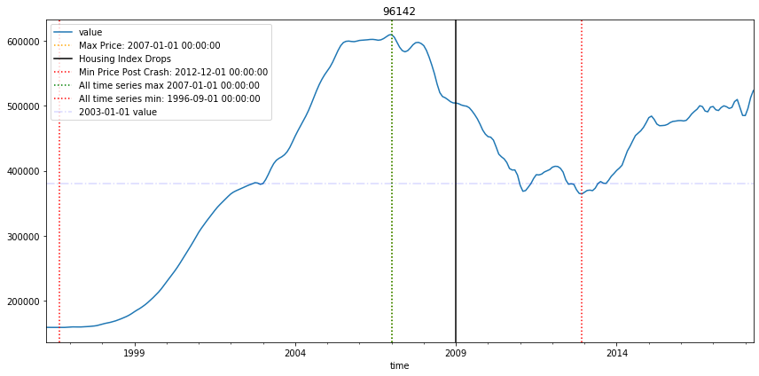


```python
ts_96142
```


<div>
<style scoped>
    .dataframe tbody tr th:only-of-type {
        vertical-align: middle;
    }

    .dataframe tbody tr th {
        vertical-align: top;
    }

    .dataframe thead th {
        text-align: right;
    }
</style>
<table border="1" class="dataframe">
  <thead>
    <tr style="text-align: right;">
      <th></th>
      <th>Metro</th>
      <th>MetroState</th>
      <th>CountyName</th>
      <th>City</th>
      <th>Zip</th>
      <th>SizeRank</th>
      <th>value</th>
    </tr>
    <tr>
      <th>time</th>
      <th></th>
      <th></th>
      <th></th>
      <th></th>
      <th></th>
      <th></th>
      <th></th>
    </tr>
  </thead>
  <tbody>
    <tr>
      <td>1996-04-01</td>
      <td>Sacramento</td>
      <td>Sacramento CA</td>
      <td>El Dorado</td>
      <td>Tahoma</td>
      <td>96142</td>
      <td>14472</td>
      <td>159000.0</td>
    </tr>
    <tr>
      <td>1996-05-01</td>
      <td>Sacramento</td>
      <td>Sacramento CA</td>
      <td>El Dorado</td>
      <td>Tahoma</td>
      <td>96142</td>
      <td>14472</td>
      <td>158900.0</td>
    </tr>
    <tr>
      <td>1996-06-01</td>
      <td>Sacramento</td>
      <td>Sacramento CA</td>
      <td>El Dorado</td>
      <td>Tahoma</td>
      <td>96142</td>
      <td>14472</td>
      <td>158900.0</td>
    </tr>
    <tr>
      <td>1996-07-01</td>
      <td>Sacramento</td>
      <td>Sacramento CA</td>
      <td>El Dorado</td>
      <td>Tahoma</td>
      <td>96142</td>
      <td>14472</td>
      <td>158900.0</td>
    </tr>
    <tr>
      <td>1996-08-01</td>
      <td>Sacramento</td>
      <td>Sacramento CA</td>
      <td>El Dorado</td>
      <td>Tahoma</td>
      <td>96142</td>
      <td>14472</td>
      <td>158900.0</td>
    </tr>
    <tr>
      <td>1996-09-01</td>
      <td>Sacramento</td>
      <td>Sacramento CA</td>
      <td>El Dorado</td>
      <td>Tahoma</td>
      <td>96142</td>
      <td>14472</td>
      <td>158800.0</td>
    </tr>
    <tr>
      <td>1996-10-01</td>
      <td>Sacramento</td>
      <td>Sacramento CA</td>
      <td>El Dorado</td>
      <td>Tahoma</td>
      <td>96142</td>
      <td>14472</td>
      <td>158800.0</td>
    </tr>
    <tr>
      <td>1996-11-01</td>
      <td>Sacramento</td>
      <td>Sacramento CA</td>
      <td>El Dorado</td>
      <td>Tahoma</td>
      <td>96142</td>
      <td>14472</td>
      <td>158900.0</td>
    </tr>
    <tr>
      <td>1996-12-01</td>
      <td>Sacramento</td>
      <td>Sacramento CA</td>
      <td>El Dorado</td>
      <td>Tahoma</td>
      <td>96142</td>
      <td>14472</td>
      <td>159200.0</td>
    </tr>
    <tr>
      <td>1997-01-01</td>
      <td>Sacramento</td>
      <td>Sacramento CA</td>
      <td>El Dorado</td>
      <td>Tahoma</td>
      <td>96142</td>
      <td>14472</td>
      <td>159600.0</td>
    </tr>
    <tr>
      <td>1997-02-01</td>
      <td>Sacramento</td>
      <td>Sacramento CA</td>
      <td>El Dorado</td>
      <td>Tahoma</td>
      <td>96142</td>
      <td>14472</td>
      <td>159700.0</td>
    </tr>
    <tr>
      <td>1997-03-01</td>
      <td>Sacramento</td>
      <td>Sacramento CA</td>
      <td>El Dorado</td>
      <td>Tahoma</td>
      <td>96142</td>
      <td>14472</td>
      <td>159600.0</td>
    </tr>
    <tr>
      <td>1997-04-01</td>
      <td>Sacramento</td>
      <td>Sacramento CA</td>
      <td>El Dorado</td>
      <td>Tahoma</td>
      <td>96142</td>
      <td>14472</td>
      <td>159600.0</td>
    </tr>
    <tr>
      <td>1997-05-01</td>
      <td>Sacramento</td>
      <td>Sacramento CA</td>
      <td>El Dorado</td>
      <td>Tahoma</td>
      <td>96142</td>
      <td>14472</td>
      <td>159600.0</td>
    </tr>
    <tr>
      <td>1997-06-01</td>
      <td>Sacramento</td>
      <td>Sacramento CA</td>
      <td>El Dorado</td>
      <td>Tahoma</td>
      <td>96142</td>
      <td>14472</td>
      <td>159800.0</td>
    </tr>
    <tr>
      <td>1997-07-01</td>
      <td>Sacramento</td>
      <td>Sacramento CA</td>
      <td>El Dorado</td>
      <td>Tahoma</td>
      <td>96142</td>
      <td>14472</td>
      <td>160000.0</td>
    </tr>
    <tr>
      <td>1997-08-01</td>
      <td>Sacramento</td>
      <td>Sacramento CA</td>
      <td>El Dorado</td>
      <td>Tahoma</td>
      <td>96142</td>
      <td>14472</td>
      <td>160300.0</td>
    </tr>
    <tr>
      <td>1997-09-01</td>
      <td>Sacramento</td>
      <td>Sacramento CA</td>
      <td>El Dorado</td>
      <td>Tahoma</td>
      <td>96142</td>
      <td>14472</td>
      <td>160700.0</td>
    </tr>
    <tr>
      <td>1997-10-01</td>
      <td>Sacramento</td>
      <td>Sacramento CA</td>
      <td>El Dorado</td>
      <td>Tahoma</td>
      <td>96142</td>
      <td>14472</td>
      <td>161100.0</td>
    </tr>
    <tr>
      <td>1997-11-01</td>
      <td>Sacramento</td>
      <td>Sacramento CA</td>
      <td>El Dorado</td>
      <td>Tahoma</td>
      <td>96142</td>
      <td>14472</td>
      <td>161700.0</td>
    </tr>
    <tr>
      <td>1997-12-01</td>
      <td>Sacramento</td>
      <td>Sacramento CA</td>
      <td>El Dorado</td>
      <td>Tahoma</td>
      <td>96142</td>
      <td>14472</td>
      <td>162800.0</td>
    </tr>
    <tr>
      <td>1998-01-01</td>
      <td>Sacramento</td>
      <td>Sacramento CA</td>
      <td>El Dorado</td>
      <td>Tahoma</td>
      <td>96142</td>
      <td>14472</td>
      <td>164000.0</td>
    </tr>
    <tr>
      <td>1998-02-01</td>
      <td>Sacramento</td>
      <td>Sacramento CA</td>
      <td>El Dorado</td>
      <td>Tahoma</td>
      <td>96142</td>
      <td>14472</td>
      <td>165000.0</td>
    </tr>
    <tr>
      <td>1998-03-01</td>
      <td>Sacramento</td>
      <td>Sacramento CA</td>
      <td>El Dorado</td>
      <td>Tahoma</td>
      <td>96142</td>
      <td>14472</td>
      <td>165800.0</td>
    </tr>
    <tr>
      <td>1998-04-01</td>
      <td>Sacramento</td>
      <td>Sacramento CA</td>
      <td>El Dorado</td>
      <td>Tahoma</td>
      <td>96142</td>
      <td>14472</td>
      <td>166700.0</td>
    </tr>
    <tr>
      <td>1998-05-01</td>
      <td>Sacramento</td>
      <td>Sacramento CA</td>
      <td>El Dorado</td>
      <td>Tahoma</td>
      <td>96142</td>
      <td>14472</td>
      <td>167800.0</td>
    </tr>
    <tr>
      <td>1998-06-01</td>
      <td>Sacramento</td>
      <td>Sacramento CA</td>
      <td>El Dorado</td>
      <td>Tahoma</td>
      <td>96142</td>
      <td>14472</td>
      <td>169000.0</td>
    </tr>
    <tr>
      <td>1998-07-01</td>
      <td>Sacramento</td>
      <td>Sacramento CA</td>
      <td>El Dorado</td>
      <td>Tahoma</td>
      <td>96142</td>
      <td>14472</td>
      <td>170500.0</td>
    </tr>
    <tr>
      <td>1998-08-01</td>
      <td>Sacramento</td>
      <td>Sacramento CA</td>
      <td>El Dorado</td>
      <td>Tahoma</td>
      <td>96142</td>
      <td>14472</td>
      <td>172100.0</td>
    </tr>
    <tr>
      <td>1998-09-01</td>
      <td>Sacramento</td>
      <td>Sacramento CA</td>
      <td>El Dorado</td>
      <td>Tahoma</td>
      <td>96142</td>
      <td>14472</td>
      <td>173800.0</td>
    </tr>
    <tr>
      <td>1998-10-01</td>
      <td>Sacramento</td>
      <td>Sacramento CA</td>
      <td>El Dorado</td>
      <td>Tahoma</td>
      <td>96142</td>
      <td>14472</td>
      <td>175600.0</td>
    </tr>
    <tr>
      <td>1998-11-01</td>
      <td>Sacramento</td>
      <td>Sacramento CA</td>
      <td>El Dorado</td>
      <td>Tahoma</td>
      <td>96142</td>
      <td>14472</td>
      <td>177700.0</td>
    </tr>
    <tr>
      <td>1998-12-01</td>
      <td>Sacramento</td>
      <td>Sacramento CA</td>
      <td>El Dorado</td>
      <td>Tahoma</td>
      <td>96142</td>
      <td>14472</td>
      <td>180200.0</td>
    </tr>
    <tr>
      <td>1999-01-01</td>
      <td>Sacramento</td>
      <td>Sacramento CA</td>
      <td>El Dorado</td>
      <td>Tahoma</td>
      <td>96142</td>
      <td>14472</td>
      <td>183000.0</td>
    </tr>
    <tr>
      <td>1999-02-01</td>
      <td>Sacramento</td>
      <td>Sacramento CA</td>
      <td>El Dorado</td>
      <td>Tahoma</td>
      <td>96142</td>
      <td>14472</td>
      <td>185600.0</td>
    </tr>
    <tr>
      <td>1999-03-01</td>
      <td>Sacramento</td>
      <td>Sacramento CA</td>
      <td>El Dorado</td>
      <td>Tahoma</td>
      <td>96142</td>
      <td>14472</td>
      <td>188000.0</td>
    </tr>
    <tr>
      <td>1999-04-01</td>
      <td>Sacramento</td>
      <td>Sacramento CA</td>
      <td>El Dorado</td>
      <td>Tahoma</td>
      <td>96142</td>
      <td>14472</td>
      <td>190800.0</td>
    </tr>
    <tr>
      <td>1999-05-01</td>
      <td>Sacramento</td>
      <td>Sacramento CA</td>
      <td>El Dorado</td>
      <td>Tahoma</td>
      <td>96142</td>
      <td>14472</td>
      <td>193800.0</td>
    </tr>
    <tr>
      <td>1999-06-01</td>
      <td>Sacramento</td>
      <td>Sacramento CA</td>
      <td>El Dorado</td>
      <td>Tahoma</td>
      <td>96142</td>
      <td>14472</td>
      <td>197200.0</td>
    </tr>
    <tr>
      <td>1999-07-01</td>
      <td>Sacramento</td>
      <td>Sacramento CA</td>
      <td>El Dorado</td>
      <td>Tahoma</td>
      <td>96142</td>
      <td>14472</td>
      <td>200900.0</td>
    </tr>
    <tr>
      <td>1999-08-01</td>
      <td>Sacramento</td>
      <td>Sacramento CA</td>
      <td>El Dorado</td>
      <td>Tahoma</td>
      <td>96142</td>
      <td>14472</td>
      <td>204800.0</td>
    </tr>
    <tr>
      <td>1999-09-01</td>
      <td>Sacramento</td>
      <td>Sacramento CA</td>
      <td>El Dorado</td>
      <td>Tahoma</td>
      <td>96142</td>
      <td>14472</td>
      <td>208900.0</td>
    </tr>
    <tr>
      <td>1999-10-01</td>
      <td>Sacramento</td>
      <td>Sacramento CA</td>
      <td>El Dorado</td>
      <td>Tahoma</td>
      <td>96142</td>
      <td>14472</td>
      <td>213200.0</td>
    </tr>
    <tr>
      <td>1999-11-01</td>
      <td>Sacramento</td>
      <td>Sacramento CA</td>
      <td>El Dorado</td>
      <td>Tahoma</td>
      <td>96142</td>
      <td>14472</td>
      <td>218000.0</td>
    </tr>
    <tr>
      <td>1999-12-01</td>
      <td>Sacramento</td>
      <td>Sacramento CA</td>
      <td>El Dorado</td>
      <td>Tahoma</td>
      <td>96142</td>
      <td>14472</td>
      <td>223400.0</td>
    </tr>
    <tr>
      <td>2000-01-01</td>
      <td>Sacramento</td>
      <td>Sacramento CA</td>
      <td>El Dorado</td>
      <td>Tahoma</td>
      <td>96142</td>
      <td>14472</td>
      <td>229000.0</td>
    </tr>
    <tr>
      <td>2000-02-01</td>
      <td>Sacramento</td>
      <td>Sacramento CA</td>
      <td>El Dorado</td>
      <td>Tahoma</td>
      <td>96142</td>
      <td>14472</td>
      <td>234500.0</td>
    </tr>
    <tr>
      <td>2000-03-01</td>
      <td>Sacramento</td>
      <td>Sacramento CA</td>
      <td>El Dorado</td>
      <td>Tahoma</td>
      <td>96142</td>
      <td>14472</td>
      <td>239800.0</td>
    </tr>
    <tr>
      <td>2000-04-01</td>
      <td>Sacramento</td>
      <td>Sacramento CA</td>
      <td>El Dorado</td>
      <td>Tahoma</td>
      <td>96142</td>
      <td>14472</td>
      <td>245400.0</td>
    </tr>
    <tr>
      <td>2000-05-01</td>
      <td>Sacramento</td>
      <td>Sacramento CA</td>
      <td>El Dorado</td>
      <td>Tahoma</td>
      <td>96142</td>
      <td>14472</td>
      <td>251300.0</td>
    </tr>
    <tr>
      <td>2000-06-01</td>
      <td>Sacramento</td>
      <td>Sacramento CA</td>
      <td>El Dorado</td>
      <td>Tahoma</td>
      <td>96142</td>
      <td>14472</td>
      <td>257600.0</td>
    </tr>
    <tr>
      <td>2000-07-01</td>
      <td>Sacramento</td>
      <td>Sacramento CA</td>
      <td>El Dorado</td>
      <td>Tahoma</td>
      <td>96142</td>
      <td>14472</td>
      <td>264200.0</td>
    </tr>
    <tr>
      <td>2000-08-01</td>
      <td>Sacramento</td>
      <td>Sacramento CA</td>
      <td>El Dorado</td>
      <td>Tahoma</td>
      <td>96142</td>
      <td>14472</td>
      <td>270900.0</td>
    </tr>
    <tr>
      <td>2000-09-01</td>
      <td>Sacramento</td>
      <td>Sacramento CA</td>
      <td>El Dorado</td>
      <td>Tahoma</td>
      <td>96142</td>
      <td>14472</td>
      <td>277500.0</td>
    </tr>
    <tr>
      <td>2000-10-01</td>
      <td>Sacramento</td>
      <td>Sacramento CA</td>
      <td>El Dorado</td>
      <td>Tahoma</td>
      <td>96142</td>
      <td>14472</td>
      <td>284100.0</td>
    </tr>
    <tr>
      <td>2000-11-01</td>
      <td>Sacramento</td>
      <td>Sacramento CA</td>
      <td>El Dorado</td>
      <td>Tahoma</td>
      <td>96142</td>
      <td>14472</td>
      <td>291000.0</td>
    </tr>
    <tr>
      <td>2000-12-01</td>
      <td>Sacramento</td>
      <td>Sacramento CA</td>
      <td>El Dorado</td>
      <td>Tahoma</td>
      <td>96142</td>
      <td>14472</td>
      <td>298300.0</td>
    </tr>
    <tr>
      <td>2001-01-01</td>
      <td>Sacramento</td>
      <td>Sacramento CA</td>
      <td>El Dorado</td>
      <td>Tahoma</td>
      <td>96142</td>
      <td>14472</td>
      <td>305300.0</td>
    </tr>
    <tr>
      <td>2001-02-01</td>
      <td>Sacramento</td>
      <td>Sacramento CA</td>
      <td>El Dorado</td>
      <td>Tahoma</td>
      <td>96142</td>
      <td>14472</td>
      <td>311500.0</td>
    </tr>
    <tr>
      <td>2001-03-01</td>
      <td>Sacramento</td>
      <td>Sacramento CA</td>
      <td>El Dorado</td>
      <td>Tahoma</td>
      <td>96142</td>
      <td>14472</td>
      <td>317300.0</td>
    </tr>
    <tr>
      <td>2001-04-01</td>
      <td>Sacramento</td>
      <td>Sacramento CA</td>
      <td>El Dorado</td>
      <td>Tahoma</td>
      <td>96142</td>
      <td>14472</td>
      <td>322900.0</td>
    </tr>
    <tr>
      <td>2001-05-01</td>
      <td>Sacramento</td>
      <td>Sacramento CA</td>
      <td>El Dorado</td>
      <td>Tahoma</td>
      <td>96142</td>
      <td>14472</td>
      <td>328300.0</td>
    </tr>
    <tr>
      <td>2001-06-01</td>
      <td>Sacramento</td>
      <td>Sacramento CA</td>
      <td>El Dorado</td>
      <td>Tahoma</td>
      <td>96142</td>
      <td>14472</td>
      <td>333800.0</td>
    </tr>
    <tr>
      <td>2001-07-01</td>
      <td>Sacramento</td>
      <td>Sacramento CA</td>
      <td>El Dorado</td>
      <td>Tahoma</td>
      <td>96142</td>
      <td>14472</td>
      <td>339000.0</td>
    </tr>
    <tr>
      <td>2001-08-01</td>
      <td>Sacramento</td>
      <td>Sacramento CA</td>
      <td>El Dorado</td>
      <td>Tahoma</td>
      <td>96142</td>
      <td>14472</td>
      <td>344000.0</td>
    </tr>
    <tr>
      <td>2001-09-01</td>
      <td>Sacramento</td>
      <td>Sacramento CA</td>
      <td>El Dorado</td>
      <td>Tahoma</td>
      <td>96142</td>
      <td>14472</td>
      <td>348400.0</td>
    </tr>
    <tr>
      <td>2001-10-01</td>
      <td>Sacramento</td>
      <td>Sacramento CA</td>
      <td>El Dorado</td>
      <td>Tahoma</td>
      <td>96142</td>
      <td>14472</td>
      <td>352500.0</td>
    </tr>
    <tr>
      <td>2001-11-01</td>
      <td>Sacramento</td>
      <td>Sacramento CA</td>
      <td>El Dorado</td>
      <td>Tahoma</td>
      <td>96142</td>
      <td>14472</td>
      <td>356500.0</td>
    </tr>
    <tr>
      <td>2001-12-01</td>
      <td>Sacramento</td>
      <td>Sacramento CA</td>
      <td>El Dorado</td>
      <td>Tahoma</td>
      <td>96142</td>
      <td>14472</td>
      <td>360700.0</td>
    </tr>
    <tr>
      <td>2002-01-01</td>
      <td>Sacramento</td>
      <td>Sacramento CA</td>
      <td>El Dorado</td>
      <td>Tahoma</td>
      <td>96142</td>
      <td>14472</td>
      <td>364500.0</td>
    </tr>
    <tr>
      <td>2002-02-01</td>
      <td>Sacramento</td>
      <td>Sacramento CA</td>
      <td>El Dorado</td>
      <td>Tahoma</td>
      <td>96142</td>
      <td>14472</td>
      <td>367300.0</td>
    </tr>
    <tr>
      <td>2002-03-01</td>
      <td>Sacramento</td>
      <td>Sacramento CA</td>
      <td>El Dorado</td>
      <td>Tahoma</td>
      <td>96142</td>
      <td>14472</td>
      <td>369400.0</td>
    </tr>
    <tr>
      <td>2002-04-01</td>
      <td>Sacramento</td>
      <td>Sacramento CA</td>
      <td>El Dorado</td>
      <td>Tahoma</td>
      <td>96142</td>
      <td>14472</td>
      <td>371200.0</td>
    </tr>
    <tr>
      <td>2002-05-01</td>
      <td>Sacramento</td>
      <td>Sacramento CA</td>
      <td>El Dorado</td>
      <td>Tahoma</td>
      <td>96142</td>
      <td>14472</td>
      <td>373000.0</td>
    </tr>
    <tr>
      <td>2002-06-01</td>
      <td>Sacramento</td>
      <td>Sacramento CA</td>
      <td>El Dorado</td>
      <td>Tahoma</td>
      <td>96142</td>
      <td>14472</td>
      <td>374900.0</td>
    </tr>
    <tr>
      <td>2002-07-01</td>
      <td>Sacramento</td>
      <td>Sacramento CA</td>
      <td>El Dorado</td>
      <td>Tahoma</td>
      <td>96142</td>
      <td>14472</td>
      <td>376800.0</td>
    </tr>
    <tr>
      <td>2002-08-01</td>
      <td>Sacramento</td>
      <td>Sacramento CA</td>
      <td>El Dorado</td>
      <td>Tahoma</td>
      <td>96142</td>
      <td>14472</td>
      <td>378500.0</td>
    </tr>
    <tr>
      <td>2002-09-01</td>
      <td>Sacramento</td>
      <td>Sacramento CA</td>
      <td>El Dorado</td>
      <td>Tahoma</td>
      <td>96142</td>
      <td>14472</td>
      <td>380000.0</td>
    </tr>
    <tr>
      <td>2002-10-01</td>
      <td>Sacramento</td>
      <td>Sacramento CA</td>
      <td>El Dorado</td>
      <td>Tahoma</td>
      <td>96142</td>
      <td>14472</td>
      <td>381800.0</td>
    </tr>
    <tr>
      <td>2002-11-01</td>
      <td>Sacramento</td>
      <td>Sacramento CA</td>
      <td>El Dorado</td>
      <td>Tahoma</td>
      <td>96142</td>
      <td>14472</td>
      <td>381200.0</td>
    </tr>
    <tr>
      <td>2002-12-01</td>
      <td>Sacramento</td>
      <td>Sacramento CA</td>
      <td>El Dorado</td>
      <td>Tahoma</td>
      <td>96142</td>
      <td>14472</td>
      <td>379200.0</td>
    </tr>
    <tr>
      <td>2003-01-01</td>
      <td>Sacramento</td>
      <td>Sacramento CA</td>
      <td>El Dorado</td>
      <td>Tahoma</td>
      <td>96142</td>
      <td>14472</td>
      <td>380400.0</td>
    </tr>
    <tr>
      <td>2003-02-01</td>
      <td>Sacramento</td>
      <td>Sacramento CA</td>
      <td>El Dorado</td>
      <td>Tahoma</td>
      <td>96142</td>
      <td>14472</td>
      <td>386500.0</td>
    </tr>
    <tr>
      <td>2003-03-01</td>
      <td>Sacramento</td>
      <td>Sacramento CA</td>
      <td>El Dorado</td>
      <td>Tahoma</td>
      <td>96142</td>
      <td>14472</td>
      <td>394600.0</td>
    </tr>
    <tr>
      <td>2003-04-01</td>
      <td>Sacramento</td>
      <td>Sacramento CA</td>
      <td>El Dorado</td>
      <td>Tahoma</td>
      <td>96142</td>
      <td>14472</td>
      <td>403500.0</td>
    </tr>
    <tr>
      <td>2003-05-01</td>
      <td>Sacramento</td>
      <td>Sacramento CA</td>
      <td>El Dorado</td>
      <td>Tahoma</td>
      <td>96142</td>
      <td>14472</td>
      <td>411100.0</td>
    </tr>
    <tr>
      <td>2003-06-01</td>
      <td>Sacramento</td>
      <td>Sacramento CA</td>
      <td>El Dorado</td>
      <td>Tahoma</td>
      <td>96142</td>
      <td>14472</td>
      <td>416300.0</td>
    </tr>
    <tr>
      <td>2003-07-01</td>
      <td>Sacramento</td>
      <td>Sacramento CA</td>
      <td>El Dorado</td>
      <td>Tahoma</td>
      <td>96142</td>
      <td>14472</td>
      <td>419300.0</td>
    </tr>
    <tr>
      <td>2003-08-01</td>
      <td>Sacramento</td>
      <td>Sacramento CA</td>
      <td>El Dorado</td>
      <td>Tahoma</td>
      <td>96142</td>
      <td>14472</td>
      <td>421600.0</td>
    </tr>
    <tr>
      <td>2003-09-01</td>
      <td>Sacramento</td>
      <td>Sacramento CA</td>
      <td>El Dorado</td>
      <td>Tahoma</td>
      <td>96142</td>
      <td>14472</td>
      <td>424700.0</td>
    </tr>
    <tr>
      <td>2003-10-01</td>
      <td>Sacramento</td>
      <td>Sacramento CA</td>
      <td>El Dorado</td>
      <td>Tahoma</td>
      <td>96142</td>
      <td>14472</td>
      <td>429300.0</td>
    </tr>
    <tr>
      <td>2003-11-01</td>
      <td>Sacramento</td>
      <td>Sacramento CA</td>
      <td>El Dorado</td>
      <td>Tahoma</td>
      <td>96142</td>
      <td>14472</td>
      <td>436000.0</td>
    </tr>
    <tr>
      <td>2003-12-01</td>
      <td>Sacramento</td>
      <td>Sacramento CA</td>
      <td>El Dorado</td>
      <td>Tahoma</td>
      <td>96142</td>
      <td>14472</td>
      <td>444500.0</td>
    </tr>
    <tr>
      <td>2004-01-01</td>
      <td>Sacramento</td>
      <td>Sacramento CA</td>
      <td>El Dorado</td>
      <td>Tahoma</td>
      <td>96142</td>
      <td>14472</td>
      <td>453400.0</td>
    </tr>
    <tr>
      <td>2004-02-01</td>
      <td>Sacramento</td>
      <td>Sacramento CA</td>
      <td>El Dorado</td>
      <td>Tahoma</td>
      <td>96142</td>
      <td>14472</td>
      <td>461500.0</td>
    </tr>
    <tr>
      <td>2004-03-01</td>
      <td>Sacramento</td>
      <td>Sacramento CA</td>
      <td>El Dorado</td>
      <td>Tahoma</td>
      <td>96142</td>
      <td>14472</td>
      <td>469200.0</td>
    </tr>
    <tr>
      <td>2004-04-01</td>
      <td>Sacramento</td>
      <td>Sacramento CA</td>
      <td>El Dorado</td>
      <td>Tahoma</td>
      <td>96142</td>
      <td>14472</td>
      <td>476700.0</td>
    </tr>
    <tr>
      <td>2004-05-01</td>
      <td>Sacramento</td>
      <td>Sacramento CA</td>
      <td>El Dorado</td>
      <td>Tahoma</td>
      <td>96142</td>
      <td>14472</td>
      <td>484400.0</td>
    </tr>
    <tr>
      <td>2004-06-01</td>
      <td>Sacramento</td>
      <td>Sacramento CA</td>
      <td>El Dorado</td>
      <td>Tahoma</td>
      <td>96142</td>
      <td>14472</td>
      <td>493000.0</td>
    </tr>
    <tr>
      <td>2004-07-01</td>
      <td>Sacramento</td>
      <td>Sacramento CA</td>
      <td>El Dorado</td>
      <td>Tahoma</td>
      <td>96142</td>
      <td>14472</td>
      <td>502800.0</td>
    </tr>
    <tr>
      <td>2004-08-01</td>
      <td>Sacramento</td>
      <td>Sacramento CA</td>
      <td>El Dorado</td>
      <td>Tahoma</td>
      <td>96142</td>
      <td>14472</td>
      <td>513200.0</td>
    </tr>
    <tr>
      <td>2004-09-01</td>
      <td>Sacramento</td>
      <td>Sacramento CA</td>
      <td>El Dorado</td>
      <td>Tahoma</td>
      <td>96142</td>
      <td>14472</td>
      <td>523500.0</td>
    </tr>
    <tr>
      <td>2004-10-01</td>
      <td>Sacramento</td>
      <td>Sacramento CA</td>
      <td>El Dorado</td>
      <td>Tahoma</td>
      <td>96142</td>
      <td>14472</td>
      <td>532900.0</td>
    </tr>
    <tr>
      <td>2004-11-01</td>
      <td>Sacramento</td>
      <td>Sacramento CA</td>
      <td>El Dorado</td>
      <td>Tahoma</td>
      <td>96142</td>
      <td>14472</td>
      <td>541000.0</td>
    </tr>
    <tr>
      <td>2004-12-01</td>
      <td>Sacramento</td>
      <td>Sacramento CA</td>
      <td>El Dorado</td>
      <td>Tahoma</td>
      <td>96142</td>
      <td>14472</td>
      <td>547900.0</td>
    </tr>
    <tr>
      <td>2005-01-01</td>
      <td>Sacramento</td>
      <td>Sacramento CA</td>
      <td>El Dorado</td>
      <td>Tahoma</td>
      <td>96142</td>
      <td>14472</td>
      <td>553900.0</td>
    </tr>
    <tr>
      <td>2005-02-01</td>
      <td>Sacramento</td>
      <td>Sacramento CA</td>
      <td>El Dorado</td>
      <td>Tahoma</td>
      <td>96142</td>
      <td>14472</td>
      <td>559800.0</td>
    </tr>
    <tr>
      <td>2005-03-01</td>
      <td>Sacramento</td>
      <td>Sacramento CA</td>
      <td>El Dorado</td>
      <td>Tahoma</td>
      <td>96142</td>
      <td>14472</td>
      <td>567300.0</td>
    </tr>
    <tr>
      <td>2005-04-01</td>
      <td>Sacramento</td>
      <td>Sacramento CA</td>
      <td>El Dorado</td>
      <td>Tahoma</td>
      <td>96142</td>
      <td>14472</td>
      <td>576300.0</td>
    </tr>
    <tr>
      <td>2005-05-01</td>
      <td>Sacramento</td>
      <td>Sacramento CA</td>
      <td>El Dorado</td>
      <td>Tahoma</td>
      <td>96142</td>
      <td>14472</td>
      <td>585200.0</td>
    </tr>
    <tr>
      <td>2005-06-01</td>
      <td>Sacramento</td>
      <td>Sacramento CA</td>
      <td>El Dorado</td>
      <td>Tahoma</td>
      <td>96142</td>
      <td>14472</td>
      <td>592700.0</td>
    </tr>
    <tr>
      <td>2005-07-01</td>
      <td>Sacramento</td>
      <td>Sacramento CA</td>
      <td>El Dorado</td>
      <td>Tahoma</td>
      <td>96142</td>
      <td>14472</td>
      <td>597500.0</td>
    </tr>
    <tr>
      <td>2005-08-01</td>
      <td>Sacramento</td>
      <td>Sacramento CA</td>
      <td>El Dorado</td>
      <td>Tahoma</td>
      <td>96142</td>
      <td>14472</td>
      <td>599400.0</td>
    </tr>
    <tr>
      <td>2005-09-01</td>
      <td>Sacramento</td>
      <td>Sacramento CA</td>
      <td>El Dorado</td>
      <td>Tahoma</td>
      <td>96142</td>
      <td>14472</td>
      <td>599800.0</td>
    </tr>
    <tr>
      <td>2005-10-01</td>
      <td>Sacramento</td>
      <td>Sacramento CA</td>
      <td>El Dorado</td>
      <td>Tahoma</td>
      <td>96142</td>
      <td>14472</td>
      <td>599200.0</td>
    </tr>
    <tr>
      <td>2005-11-01</td>
      <td>Sacramento</td>
      <td>Sacramento CA</td>
      <td>El Dorado</td>
      <td>Tahoma</td>
      <td>96142</td>
      <td>14472</td>
      <td>598900.0</td>
    </tr>
    <tr>
      <td>2005-12-01</td>
      <td>Sacramento</td>
      <td>Sacramento CA</td>
      <td>El Dorado</td>
      <td>Tahoma</td>
      <td>96142</td>
      <td>14472</td>
      <td>599700.0</td>
    </tr>
    <tr>
      <td>2006-01-01</td>
      <td>Sacramento</td>
      <td>Sacramento CA</td>
      <td>El Dorado</td>
      <td>Tahoma</td>
      <td>96142</td>
      <td>14472</td>
      <td>600800.0</td>
    </tr>
    <tr>
      <td>2006-02-01</td>
      <td>Sacramento</td>
      <td>Sacramento CA</td>
      <td>El Dorado</td>
      <td>Tahoma</td>
      <td>96142</td>
      <td>14472</td>
      <td>601100.0</td>
    </tr>
    <tr>
      <td>2006-03-01</td>
      <td>Sacramento</td>
      <td>Sacramento CA</td>
      <td>El Dorado</td>
      <td>Tahoma</td>
      <td>96142</td>
      <td>14472</td>
      <td>601300.0</td>
    </tr>
    <tr>
      <td>2006-04-01</td>
      <td>Sacramento</td>
      <td>Sacramento CA</td>
      <td>El Dorado</td>
      <td>Tahoma</td>
      <td>96142</td>
      <td>14472</td>
      <td>601800.0</td>
    </tr>
    <tr>
      <td>2006-05-01</td>
      <td>Sacramento</td>
      <td>Sacramento CA</td>
      <td>El Dorado</td>
      <td>Tahoma</td>
      <td>96142</td>
      <td>14472</td>
      <td>602300.0</td>
    </tr>
    <tr>
      <td>2006-06-01</td>
      <td>Sacramento</td>
      <td>Sacramento CA</td>
      <td>El Dorado</td>
      <td>Tahoma</td>
      <td>96142</td>
      <td>14472</td>
      <td>602400.0</td>
    </tr>
    <tr>
      <td>2006-07-01</td>
      <td>Sacramento</td>
      <td>Sacramento CA</td>
      <td>El Dorado</td>
      <td>Tahoma</td>
      <td>96142</td>
      <td>14472</td>
      <td>601900.0</td>
    </tr>
    <tr>
      <td>2006-08-01</td>
      <td>Sacramento</td>
      <td>Sacramento CA</td>
      <td>El Dorado</td>
      <td>Tahoma</td>
      <td>96142</td>
      <td>14472</td>
      <td>601100.0</td>
    </tr>
    <tr>
      <td>2006-09-01</td>
      <td>Sacramento</td>
      <td>Sacramento CA</td>
      <td>El Dorado</td>
      <td>Tahoma</td>
      <td>96142</td>
      <td>14472</td>
      <td>601700.0</td>
    </tr>
    <tr>
      <td>2006-10-01</td>
      <td>Sacramento</td>
      <td>Sacramento CA</td>
      <td>El Dorado</td>
      <td>Tahoma</td>
      <td>96142</td>
      <td>14472</td>
      <td>603600.0</td>
    </tr>
    <tr>
      <td>2006-11-01</td>
      <td>Sacramento</td>
      <td>Sacramento CA</td>
      <td>El Dorado</td>
      <td>Tahoma</td>
      <td>96142</td>
      <td>14472</td>
      <td>606300.0</td>
    </tr>
    <tr>
      <td>2006-12-01</td>
      <td>Sacramento</td>
      <td>Sacramento CA</td>
      <td>El Dorado</td>
      <td>Tahoma</td>
      <td>96142</td>
      <td>14472</td>
      <td>609100.0</td>
    </tr>
    <tr>
      <td>2007-01-01</td>
      <td>Sacramento</td>
      <td>Sacramento CA</td>
      <td>El Dorado</td>
      <td>Tahoma</td>
      <td>96142</td>
      <td>14472</td>
      <td>609900.0</td>
    </tr>
    <tr>
      <td>2007-02-01</td>
      <td>Sacramento</td>
      <td>Sacramento CA</td>
      <td>El Dorado</td>
      <td>Tahoma</td>
      <td>96142</td>
      <td>14472</td>
      <td>605800.0</td>
    </tr>
    <tr>
      <td>2007-03-01</td>
      <td>Sacramento</td>
      <td>Sacramento CA</td>
      <td>El Dorado</td>
      <td>Tahoma</td>
      <td>96142</td>
      <td>14472</td>
      <td>598100.0</td>
    </tr>
    <tr>
      <td>2007-04-01</td>
      <td>Sacramento</td>
      <td>Sacramento CA</td>
      <td>El Dorado</td>
      <td>Tahoma</td>
      <td>96142</td>
      <td>14472</td>
      <td>590300.0</td>
    </tr>
    <tr>
      <td>2007-05-01</td>
      <td>Sacramento</td>
      <td>Sacramento CA</td>
      <td>El Dorado</td>
      <td>Tahoma</td>
      <td>96142</td>
      <td>14472</td>
      <td>585100.0</td>
    </tr>
    <tr>
      <td>2007-06-01</td>
      <td>Sacramento</td>
      <td>Sacramento CA</td>
      <td>El Dorado</td>
      <td>Tahoma</td>
      <td>96142</td>
      <td>14472</td>
      <td>583300.0</td>
    </tr>
    <tr>
      <td>2007-07-01</td>
      <td>Sacramento</td>
      <td>Sacramento CA</td>
      <td>El Dorado</td>
      <td>Tahoma</td>
      <td>96142</td>
      <td>14472</td>
      <td>585000.0</td>
    </tr>
    <tr>
      <td>2007-08-01</td>
      <td>Sacramento</td>
      <td>Sacramento CA</td>
      <td>El Dorado</td>
      <td>Tahoma</td>
      <td>96142</td>
      <td>14472</td>
      <td>589200.0</td>
    </tr>
    <tr>
      <td>2007-09-01</td>
      <td>Sacramento</td>
      <td>Sacramento CA</td>
      <td>El Dorado</td>
      <td>Tahoma</td>
      <td>96142</td>
      <td>14472</td>
      <td>594200.0</td>
    </tr>
    <tr>
      <td>2007-10-01</td>
      <td>Sacramento</td>
      <td>Sacramento CA</td>
      <td>El Dorado</td>
      <td>Tahoma</td>
      <td>96142</td>
      <td>14472</td>
      <td>597300.0</td>
    </tr>
    <tr>
      <td>2007-11-01</td>
      <td>Sacramento</td>
      <td>Sacramento CA</td>
      <td>El Dorado</td>
      <td>Tahoma</td>
      <td>96142</td>
      <td>14472</td>
      <td>597800.0</td>
    </tr>
    <tr>
      <td>2007-12-01</td>
      <td>Sacramento</td>
      <td>Sacramento CA</td>
      <td>El Dorado</td>
      <td>Tahoma</td>
      <td>96142</td>
      <td>14472</td>
      <td>596100.0</td>
    </tr>
    <tr>
      <td>2008-01-01</td>
      <td>Sacramento</td>
      <td>Sacramento CA</td>
      <td>El Dorado</td>
      <td>Tahoma</td>
      <td>96142</td>
      <td>14472</td>
      <td>592800.0</td>
    </tr>
    <tr>
      <td>2008-02-01</td>
      <td>Sacramento</td>
      <td>Sacramento CA</td>
      <td>El Dorado</td>
      <td>Tahoma</td>
      <td>96142</td>
      <td>14472</td>
      <td>585500.0</td>
    </tr>
    <tr>
      <td>2008-03-01</td>
      <td>Sacramento</td>
      <td>Sacramento CA</td>
      <td>El Dorado</td>
      <td>Tahoma</td>
      <td>96142</td>
      <td>14472</td>
      <td>575100.0</td>
    </tr>
    <tr>
      <td>2008-04-01</td>
      <td>Sacramento</td>
      <td>Sacramento CA</td>
      <td>El Dorado</td>
      <td>Tahoma</td>
      <td>96142</td>
      <td>14472</td>
      <td>562900.0</td>
    </tr>
    <tr>
      <td>2008-05-01</td>
      <td>Sacramento</td>
      <td>Sacramento CA</td>
      <td>El Dorado</td>
      <td>Tahoma</td>
      <td>96142</td>
      <td>14472</td>
      <td>549400.0</td>
    </tr>
    <tr>
      <td>2008-06-01</td>
      <td>Sacramento</td>
      <td>Sacramento CA</td>
      <td>El Dorado</td>
      <td>Tahoma</td>
      <td>96142</td>
      <td>14472</td>
      <td>533400.0</td>
    </tr>
    <tr>
      <td>2008-07-01</td>
      <td>Sacramento</td>
      <td>Sacramento CA</td>
      <td>El Dorado</td>
      <td>Tahoma</td>
      <td>96142</td>
      <td>14472</td>
      <td>520400.0</td>
    </tr>
    <tr>
      <td>2008-08-01</td>
      <td>Sacramento</td>
      <td>Sacramento CA</td>
      <td>El Dorado</td>
      <td>Tahoma</td>
      <td>96142</td>
      <td>14472</td>
      <td>514400.0</td>
    </tr>
    <tr>
      <td>2008-09-01</td>
      <td>Sacramento</td>
      <td>Sacramento CA</td>
      <td>El Dorado</td>
      <td>Tahoma</td>
      <td>96142</td>
      <td>14472</td>
      <td>512500.0</td>
    </tr>
    <tr>
      <td>2008-10-01</td>
      <td>Sacramento</td>
      <td>Sacramento CA</td>
      <td>El Dorado</td>
      <td>Tahoma</td>
      <td>96142</td>
      <td>14472</td>
      <td>509600.0</td>
    </tr>
    <tr>
      <td>2008-11-01</td>
      <td>Sacramento</td>
      <td>Sacramento CA</td>
      <td>El Dorado</td>
      <td>Tahoma</td>
      <td>96142</td>
      <td>14472</td>
      <td>506400.0</td>
    </tr>
    <tr>
      <td>2008-12-01</td>
      <td>Sacramento</td>
      <td>Sacramento CA</td>
      <td>El Dorado</td>
      <td>Tahoma</td>
      <td>96142</td>
      <td>14472</td>
      <td>504600.0</td>
    </tr>
    <tr>
      <td>2009-01-01</td>
      <td>Sacramento</td>
      <td>Sacramento CA</td>
      <td>El Dorado</td>
      <td>Tahoma</td>
      <td>96142</td>
      <td>14472</td>
      <td>504400.0</td>
    </tr>
    <tr>
      <td>2009-02-01</td>
      <td>Sacramento</td>
      <td>Sacramento CA</td>
      <td>El Dorado</td>
      <td>Tahoma</td>
      <td>96142</td>
      <td>14472</td>
      <td>503400.0</td>
    </tr>
    <tr>
      <td>2009-03-01</td>
      <td>Sacramento</td>
      <td>Sacramento CA</td>
      <td>El Dorado</td>
      <td>Tahoma</td>
      <td>96142</td>
      <td>14472</td>
      <td>501400.0</td>
    </tr>
    <tr>
      <td>2009-04-01</td>
      <td>Sacramento</td>
      <td>Sacramento CA</td>
      <td>El Dorado</td>
      <td>Tahoma</td>
      <td>96142</td>
      <td>14472</td>
      <td>500200.0</td>
    </tr>
    <tr>
      <td>2009-05-01</td>
      <td>Sacramento</td>
      <td>Sacramento CA</td>
      <td>El Dorado</td>
      <td>Tahoma</td>
      <td>96142</td>
      <td>14472</td>
      <td>499500.0</td>
    </tr>
    <tr>
      <td>2009-06-01</td>
      <td>Sacramento</td>
      <td>Sacramento CA</td>
      <td>El Dorado</td>
      <td>Tahoma</td>
      <td>96142</td>
      <td>14472</td>
      <td>497100.0</td>
    </tr>
    <tr>
      <td>2009-07-01</td>
      <td>Sacramento</td>
      <td>Sacramento CA</td>
      <td>El Dorado</td>
      <td>Tahoma</td>
      <td>96142</td>
      <td>14472</td>
      <td>492300.0</td>
    </tr>
    <tr>
      <td>2009-08-01</td>
      <td>Sacramento</td>
      <td>Sacramento CA</td>
      <td>El Dorado</td>
      <td>Tahoma</td>
      <td>96142</td>
      <td>14472</td>
      <td>486600.0</td>
    </tr>
    <tr>
      <td>2009-09-01</td>
      <td>Sacramento</td>
      <td>Sacramento CA</td>
      <td>El Dorado</td>
      <td>Tahoma</td>
      <td>96142</td>
      <td>14472</td>
      <td>480100.0</td>
    </tr>
    <tr>
      <td>2009-10-01</td>
      <td>Sacramento</td>
      <td>Sacramento CA</td>
      <td>El Dorado</td>
      <td>Tahoma</td>
      <td>96142</td>
      <td>14472</td>
      <td>471900.0</td>
    </tr>
    <tr>
      <td>2009-11-01</td>
      <td>Sacramento</td>
      <td>Sacramento CA</td>
      <td>El Dorado</td>
      <td>Tahoma</td>
      <td>96142</td>
      <td>14472</td>
      <td>462800.0</td>
    </tr>
    <tr>
      <td>2009-12-01</td>
      <td>Sacramento</td>
      <td>Sacramento CA</td>
      <td>El Dorado</td>
      <td>Tahoma</td>
      <td>96142</td>
      <td>14472</td>
      <td>456500.0</td>
    </tr>
    <tr>
      <td>2010-01-01</td>
      <td>Sacramento</td>
      <td>Sacramento CA</td>
      <td>El Dorado</td>
      <td>Tahoma</td>
      <td>96142</td>
      <td>14472</td>
      <td>452600.0</td>
    </tr>
    <tr>
      <td>2010-02-01</td>
      <td>Sacramento</td>
      <td>Sacramento CA</td>
      <td>El Dorado</td>
      <td>Tahoma</td>
      <td>96142</td>
      <td>14472</td>
      <td>451800.0</td>
    </tr>
    <tr>
      <td>2010-03-01</td>
      <td>Sacramento</td>
      <td>Sacramento CA</td>
      <td>El Dorado</td>
      <td>Tahoma</td>
      <td>96142</td>
      <td>14472</td>
      <td>447300.0</td>
    </tr>
    <tr>
      <td>2010-04-01</td>
      <td>Sacramento</td>
      <td>Sacramento CA</td>
      <td>El Dorado</td>
      <td>Tahoma</td>
      <td>96142</td>
      <td>14472</td>
      <td>436900.0</td>
    </tr>
    <tr>
      <td>2010-05-01</td>
      <td>Sacramento</td>
      <td>Sacramento CA</td>
      <td>El Dorado</td>
      <td>Tahoma</td>
      <td>96142</td>
      <td>14472</td>
      <td>425700.0</td>
    </tr>
    <tr>
      <td>2010-06-01</td>
      <td>Sacramento</td>
      <td>Sacramento CA</td>
      <td>El Dorado</td>
      <td>Tahoma</td>
      <td>96142</td>
      <td>14472</td>
      <td>421600.0</td>
    </tr>
    <tr>
      <td>2010-07-01</td>
      <td>Sacramento</td>
      <td>Sacramento CA</td>
      <td>El Dorado</td>
      <td>Tahoma</td>
      <td>96142</td>
      <td>14472</td>
      <td>418400.0</td>
    </tr>
    <tr>
      <td>2010-08-01</td>
      <td>Sacramento</td>
      <td>Sacramento CA</td>
      <td>El Dorado</td>
      <td>Tahoma</td>
      <td>96142</td>
      <td>14472</td>
      <td>412800.0</td>
    </tr>
    <tr>
      <td>2010-09-01</td>
      <td>Sacramento</td>
      <td>Sacramento CA</td>
      <td>El Dorado</td>
      <td>Tahoma</td>
      <td>96142</td>
      <td>14472</td>
      <td>403600.0</td>
    </tr>
    <tr>
      <td>2010-10-01</td>
      <td>Sacramento</td>
      <td>Sacramento CA</td>
      <td>El Dorado</td>
      <td>Tahoma</td>
      <td>96142</td>
      <td>14472</td>
      <td>401300.0</td>
    </tr>
    <tr>
      <td>2010-11-01</td>
      <td>Sacramento</td>
      <td>Sacramento CA</td>
      <td>El Dorado</td>
      <td>Tahoma</td>
      <td>96142</td>
      <td>14472</td>
      <td>401400.0</td>
    </tr>
    <tr>
      <td>2010-12-01</td>
      <td>Sacramento</td>
      <td>Sacramento CA</td>
      <td>El Dorado</td>
      <td>Tahoma</td>
      <td>96142</td>
      <td>14472</td>
      <td>393400.0</td>
    </tr>
    <tr>
      <td>2011-01-01</td>
      <td>Sacramento</td>
      <td>Sacramento CA</td>
      <td>El Dorado</td>
      <td>Tahoma</td>
      <td>96142</td>
      <td>14472</td>
      <td>377600.0</td>
    </tr>
    <tr>
      <td>2011-02-01</td>
      <td>Sacramento</td>
      <td>Sacramento CA</td>
      <td>El Dorado</td>
      <td>Tahoma</td>
      <td>96142</td>
      <td>14472</td>
      <td>368500.0</td>
    </tr>
    <tr>
      <td>2011-03-01</td>
      <td>Sacramento</td>
      <td>Sacramento CA</td>
      <td>El Dorado</td>
      <td>Tahoma</td>
      <td>96142</td>
      <td>14472</td>
      <td>369600.0</td>
    </tr>
    <tr>
      <td>2011-04-01</td>
      <td>Sacramento</td>
      <td>Sacramento CA</td>
      <td>El Dorado</td>
      <td>Tahoma</td>
      <td>96142</td>
      <td>14472</td>
      <td>374800.0</td>
    </tr>
    <tr>
      <td>2011-05-01</td>
      <td>Sacramento</td>
      <td>Sacramento CA</td>
      <td>El Dorado</td>
      <td>Tahoma</td>
      <td>96142</td>
      <td>14472</td>
      <td>380400.0</td>
    </tr>
    <tr>
      <td>2011-06-01</td>
      <td>Sacramento</td>
      <td>Sacramento CA</td>
      <td>El Dorado</td>
      <td>Tahoma</td>
      <td>96142</td>
      <td>14472</td>
      <td>388200.0</td>
    </tr>
    <tr>
      <td>2011-07-01</td>
      <td>Sacramento</td>
      <td>Sacramento CA</td>
      <td>El Dorado</td>
      <td>Tahoma</td>
      <td>96142</td>
      <td>14472</td>
      <td>394100.0</td>
    </tr>
    <tr>
      <td>2011-08-01</td>
      <td>Sacramento</td>
      <td>Sacramento CA</td>
      <td>El Dorado</td>
      <td>Tahoma</td>
      <td>96142</td>
      <td>14472</td>
      <td>393700.0</td>
    </tr>
    <tr>
      <td>2011-09-01</td>
      <td>Sacramento</td>
      <td>Sacramento CA</td>
      <td>El Dorado</td>
      <td>Tahoma</td>
      <td>96142</td>
      <td>14472</td>
      <td>395000.0</td>
    </tr>
    <tr>
      <td>2011-10-01</td>
      <td>Sacramento</td>
      <td>Sacramento CA</td>
      <td>El Dorado</td>
      <td>Tahoma</td>
      <td>96142</td>
      <td>14472</td>
      <td>398200.0</td>
    </tr>
    <tr>
      <td>2011-11-01</td>
      <td>Sacramento</td>
      <td>Sacramento CA</td>
      <td>El Dorado</td>
      <td>Tahoma</td>
      <td>96142</td>
      <td>14472</td>
      <td>400000.0</td>
    </tr>
    <tr>
      <td>2011-12-01</td>
      <td>Sacramento</td>
      <td>Sacramento CA</td>
      <td>El Dorado</td>
      <td>Tahoma</td>
      <td>96142</td>
      <td>14472</td>
      <td>401900.0</td>
    </tr>
    <tr>
      <td>2012-01-01</td>
      <td>Sacramento</td>
      <td>Sacramento CA</td>
      <td>El Dorado</td>
      <td>Tahoma</td>
      <td>96142</td>
      <td>14472</td>
      <td>405600.0</td>
    </tr>
    <tr>
      <td>2012-02-01</td>
      <td>Sacramento</td>
      <td>Sacramento CA</td>
      <td>El Dorado</td>
      <td>Tahoma</td>
      <td>96142</td>
      <td>14472</td>
      <td>407000.0</td>
    </tr>
    <tr>
      <td>2012-03-01</td>
      <td>Sacramento</td>
      <td>Sacramento CA</td>
      <td>El Dorado</td>
      <td>Tahoma</td>
      <td>96142</td>
      <td>14472</td>
      <td>406700.0</td>
    </tr>
    <tr>
      <td>2012-04-01</td>
      <td>Sacramento</td>
      <td>Sacramento CA</td>
      <td>El Dorado</td>
      <td>Tahoma</td>
      <td>96142</td>
      <td>14472</td>
      <td>403900.0</td>
    </tr>
    <tr>
      <td>2012-05-01</td>
      <td>Sacramento</td>
      <td>Sacramento CA</td>
      <td>El Dorado</td>
      <td>Tahoma</td>
      <td>96142</td>
      <td>14472</td>
      <td>398100.0</td>
    </tr>
    <tr>
      <td>2012-06-01</td>
      <td>Sacramento</td>
      <td>Sacramento CA</td>
      <td>El Dorado</td>
      <td>Tahoma</td>
      <td>96142</td>
      <td>14472</td>
      <td>386100.0</td>
    </tr>
    <tr>
      <td>2012-07-01</td>
      <td>Sacramento</td>
      <td>Sacramento CA</td>
      <td>El Dorado</td>
      <td>Tahoma</td>
      <td>96142</td>
      <td>14472</td>
      <td>379400.0</td>
    </tr>
    <tr>
      <td>2012-08-01</td>
      <td>Sacramento</td>
      <td>Sacramento CA</td>
      <td>El Dorado</td>
      <td>Tahoma</td>
      <td>96142</td>
      <td>14472</td>
      <td>380000.0</td>
    </tr>
    <tr>
      <td>2012-09-01</td>
      <td>Sacramento</td>
      <td>Sacramento CA</td>
      <td>El Dorado</td>
      <td>Tahoma</td>
      <td>96142</td>
      <td>14472</td>
      <td>379300.0</td>
    </tr>
    <tr>
      <td>2012-10-01</td>
      <td>Sacramento</td>
      <td>Sacramento CA</td>
      <td>El Dorado</td>
      <td>Tahoma</td>
      <td>96142</td>
      <td>14472</td>
      <td>370900.0</td>
    </tr>
    <tr>
      <td>2012-11-01</td>
      <td>Sacramento</td>
      <td>Sacramento CA</td>
      <td>El Dorado</td>
      <td>Tahoma</td>
      <td>96142</td>
      <td>14472</td>
      <td>365300.0</td>
    </tr>
    <tr>
      <td>2012-12-01</td>
      <td>Sacramento</td>
      <td>Sacramento CA</td>
      <td>El Dorado</td>
      <td>Tahoma</td>
      <td>96142</td>
      <td>14472</td>
      <td>364300.0</td>
    </tr>
    <tr>
      <td>2013-01-01</td>
      <td>Sacramento</td>
      <td>Sacramento CA</td>
      <td>El Dorado</td>
      <td>Tahoma</td>
      <td>96142</td>
      <td>14472</td>
      <td>367000.0</td>
    </tr>
    <tr>
      <td>2013-02-01</td>
      <td>Sacramento</td>
      <td>Sacramento CA</td>
      <td>El Dorado</td>
      <td>Tahoma</td>
      <td>96142</td>
      <td>14472</td>
      <td>369800.0</td>
    </tr>
    <tr>
      <td>2013-03-01</td>
      <td>Sacramento</td>
      <td>Sacramento CA</td>
      <td>El Dorado</td>
      <td>Tahoma</td>
      <td>96142</td>
      <td>14472</td>
      <td>370300.0</td>
    </tr>
    <tr>
      <td>2013-04-01</td>
      <td>Sacramento</td>
      <td>Sacramento CA</td>
      <td>El Dorado</td>
      <td>Tahoma</td>
      <td>96142</td>
      <td>14472</td>
      <td>369500.0</td>
    </tr>
    <tr>
      <td>2013-05-01</td>
      <td>Sacramento</td>
      <td>Sacramento CA</td>
      <td>El Dorado</td>
      <td>Tahoma</td>
      <td>96142</td>
      <td>14472</td>
      <td>373300.0</td>
    </tr>
    <tr>
      <td>2013-06-01</td>
      <td>Sacramento</td>
      <td>Sacramento CA</td>
      <td>El Dorado</td>
      <td>Tahoma</td>
      <td>96142</td>
      <td>14472</td>
      <td>380400.0</td>
    </tr>
    <tr>
      <td>2013-07-01</td>
      <td>Sacramento</td>
      <td>Sacramento CA</td>
      <td>El Dorado</td>
      <td>Tahoma</td>
      <td>96142</td>
      <td>14472</td>
      <td>383500.0</td>
    </tr>
    <tr>
      <td>2013-08-01</td>
      <td>Sacramento</td>
      <td>Sacramento CA</td>
      <td>El Dorado</td>
      <td>Tahoma</td>
      <td>96142</td>
      <td>14472</td>
      <td>381100.0</td>
    </tr>
    <tr>
      <td>2013-09-01</td>
      <td>Sacramento</td>
      <td>Sacramento CA</td>
      <td>El Dorado</td>
      <td>Tahoma</td>
      <td>96142</td>
      <td>14472</td>
      <td>380500.0</td>
    </tr>
    <tr>
      <td>2013-10-01</td>
      <td>Sacramento</td>
      <td>Sacramento CA</td>
      <td>El Dorado</td>
      <td>Tahoma</td>
      <td>96142</td>
      <td>14472</td>
      <td>385500.0</td>
    </tr>
    <tr>
      <td>2013-11-01</td>
      <td>Sacramento</td>
      <td>Sacramento CA</td>
      <td>El Dorado</td>
      <td>Tahoma</td>
      <td>96142</td>
      <td>14472</td>
      <td>391700.0</td>
    </tr>
    <tr>
      <td>2013-12-01</td>
      <td>Sacramento</td>
      <td>Sacramento CA</td>
      <td>El Dorado</td>
      <td>Tahoma</td>
      <td>96142</td>
      <td>14472</td>
      <td>395900.0</td>
    </tr>
    <tr>
      <td>2014-01-01</td>
      <td>Sacramento</td>
      <td>Sacramento CA</td>
      <td>El Dorado</td>
      <td>Tahoma</td>
      <td>96142</td>
      <td>14472</td>
      <td>400600.0</td>
    </tr>
    <tr>
      <td>2014-02-01</td>
      <td>Sacramento</td>
      <td>Sacramento CA</td>
      <td>El Dorado</td>
      <td>Tahoma</td>
      <td>96142</td>
      <td>14472</td>
      <td>404200.0</td>
    </tr>
    <tr>
      <td>2014-03-01</td>
      <td>Sacramento</td>
      <td>Sacramento CA</td>
      <td>El Dorado</td>
      <td>Tahoma</td>
      <td>96142</td>
      <td>14472</td>
      <td>408600.0</td>
    </tr>
    <tr>
      <td>2014-04-01</td>
      <td>Sacramento</td>
      <td>Sacramento CA</td>
      <td>El Dorado</td>
      <td>Tahoma</td>
      <td>96142</td>
      <td>14472</td>
      <td>419700.0</td>
    </tr>
    <tr>
      <td>2014-05-01</td>
      <td>Sacramento</td>
      <td>Sacramento CA</td>
      <td>El Dorado</td>
      <td>Tahoma</td>
      <td>96142</td>
      <td>14472</td>
      <td>430600.0</td>
    </tr>
    <tr>
      <td>2014-06-01</td>
      <td>Sacramento</td>
      <td>Sacramento CA</td>
      <td>El Dorado</td>
      <td>Tahoma</td>
      <td>96142</td>
      <td>14472</td>
      <td>437900.0</td>
    </tr>
    <tr>
      <td>2014-07-01</td>
      <td>Sacramento</td>
      <td>Sacramento CA</td>
      <td>El Dorado</td>
      <td>Tahoma</td>
      <td>96142</td>
      <td>14472</td>
      <td>446300.0</td>
    </tr>
    <tr>
      <td>2014-08-01</td>
      <td>Sacramento</td>
      <td>Sacramento CA</td>
      <td>El Dorado</td>
      <td>Tahoma</td>
      <td>96142</td>
      <td>14472</td>
      <td>454300.0</td>
    </tr>
    <tr>
      <td>2014-09-01</td>
      <td>Sacramento</td>
      <td>Sacramento CA</td>
      <td>El Dorado</td>
      <td>Tahoma</td>
      <td>96142</td>
      <td>14472</td>
      <td>458100.0</td>
    </tr>
    <tr>
      <td>2014-10-01</td>
      <td>Sacramento</td>
      <td>Sacramento CA</td>
      <td>El Dorado</td>
      <td>Tahoma</td>
      <td>96142</td>
      <td>14472</td>
      <td>461700.0</td>
    </tr>
    <tr>
      <td>2014-11-01</td>
      <td>Sacramento</td>
      <td>Sacramento CA</td>
      <td>El Dorado</td>
      <td>Tahoma</td>
      <td>96142</td>
      <td>14472</td>
      <td>466900.0</td>
    </tr>
    <tr>
      <td>2014-12-01</td>
      <td>Sacramento</td>
      <td>Sacramento CA</td>
      <td>El Dorado</td>
      <td>Tahoma</td>
      <td>96142</td>
      <td>14472</td>
      <td>474000.0</td>
    </tr>
    <tr>
      <td>2015-01-01</td>
      <td>Sacramento</td>
      <td>Sacramento CA</td>
      <td>El Dorado</td>
      <td>Tahoma</td>
      <td>96142</td>
      <td>14472</td>
      <td>481900.0</td>
    </tr>
    <tr>
      <td>2015-02-01</td>
      <td>Sacramento</td>
      <td>Sacramento CA</td>
      <td>El Dorado</td>
      <td>Tahoma</td>
      <td>96142</td>
      <td>14472</td>
      <td>484300.0</td>
    </tr>
    <tr>
      <td>2015-03-01</td>
      <td>Sacramento</td>
      <td>Sacramento CA</td>
      <td>El Dorado</td>
      <td>Tahoma</td>
      <td>96142</td>
      <td>14472</td>
      <td>479200.0</td>
    </tr>
    <tr>
      <td>2015-04-01</td>
      <td>Sacramento</td>
      <td>Sacramento CA</td>
      <td>El Dorado</td>
      <td>Tahoma</td>
      <td>96142</td>
      <td>14472</td>
      <td>472000.0</td>
    </tr>
    <tr>
      <td>2015-05-01</td>
      <td>Sacramento</td>
      <td>Sacramento CA</td>
      <td>El Dorado</td>
      <td>Tahoma</td>
      <td>96142</td>
      <td>14472</td>
      <td>469500.0</td>
    </tr>
    <tr>
      <td>2015-06-01</td>
      <td>Sacramento</td>
      <td>Sacramento CA</td>
      <td>El Dorado</td>
      <td>Tahoma</td>
      <td>96142</td>
      <td>14472</td>
      <td>469700.0</td>
    </tr>
    <tr>
      <td>2015-07-01</td>
      <td>Sacramento</td>
      <td>Sacramento CA</td>
      <td>El Dorado</td>
      <td>Tahoma</td>
      <td>96142</td>
      <td>14472</td>
      <td>470100.0</td>
    </tr>
    <tr>
      <td>2015-08-01</td>
      <td>Sacramento</td>
      <td>Sacramento CA</td>
      <td>El Dorado</td>
      <td>Tahoma</td>
      <td>96142</td>
      <td>14472</td>
      <td>471600.0</td>
    </tr>
    <tr>
      <td>2015-09-01</td>
      <td>Sacramento</td>
      <td>Sacramento CA</td>
      <td>El Dorado</td>
      <td>Tahoma</td>
      <td>96142</td>
      <td>14472</td>
      <td>474400.0</td>
    </tr>
    <tr>
      <td>2015-10-01</td>
      <td>Sacramento</td>
      <td>Sacramento CA</td>
      <td>El Dorado</td>
      <td>Tahoma</td>
      <td>96142</td>
      <td>14472</td>
      <td>476100.0</td>
    </tr>
    <tr>
      <td>2015-11-01</td>
      <td>Sacramento</td>
      <td>Sacramento CA</td>
      <td>El Dorado</td>
      <td>Tahoma</td>
      <td>96142</td>
      <td>14472</td>
      <td>476600.0</td>
    </tr>
    <tr>
      <td>2015-12-01</td>
      <td>Sacramento</td>
      <td>Sacramento CA</td>
      <td>El Dorado</td>
      <td>Tahoma</td>
      <td>96142</td>
      <td>14472</td>
      <td>477300.0</td>
    </tr>
    <tr>
      <td>2016-01-01</td>
      <td>Sacramento</td>
      <td>Sacramento CA</td>
      <td>El Dorado</td>
      <td>Tahoma</td>
      <td>96142</td>
      <td>14472</td>
      <td>477400.0</td>
    </tr>
    <tr>
      <td>2016-02-01</td>
      <td>Sacramento</td>
      <td>Sacramento CA</td>
      <td>El Dorado</td>
      <td>Tahoma</td>
      <td>96142</td>
      <td>14472</td>
      <td>476800.0</td>
    </tr>
    <tr>
      <td>2016-03-01</td>
      <td>Sacramento</td>
      <td>Sacramento CA</td>
      <td>El Dorado</td>
      <td>Tahoma</td>
      <td>96142</td>
      <td>14472</td>
      <td>477800.0</td>
    </tr>
    <tr>
      <td>2016-04-01</td>
      <td>Sacramento</td>
      <td>Sacramento CA</td>
      <td>El Dorado</td>
      <td>Tahoma</td>
      <td>96142</td>
      <td>14472</td>
      <td>482200.0</td>
    </tr>
    <tr>
      <td>2016-05-01</td>
      <td>Sacramento</td>
      <td>Sacramento CA</td>
      <td>El Dorado</td>
      <td>Tahoma</td>
      <td>96142</td>
      <td>14472</td>
      <td>487600.0</td>
    </tr>
    <tr>
      <td>2016-06-01</td>
      <td>Sacramento</td>
      <td>Sacramento CA</td>
      <td>El Dorado</td>
      <td>Tahoma</td>
      <td>96142</td>
      <td>14472</td>
      <td>491500.0</td>
    </tr>
    <tr>
      <td>2016-07-01</td>
      <td>Sacramento</td>
      <td>Sacramento CA</td>
      <td>El Dorado</td>
      <td>Tahoma</td>
      <td>96142</td>
      <td>14472</td>
      <td>494900.0</td>
    </tr>
    <tr>
      <td>2016-08-01</td>
      <td>Sacramento</td>
      <td>Sacramento CA</td>
      <td>El Dorado</td>
      <td>Tahoma</td>
      <td>96142</td>
      <td>14472</td>
      <td>500200.0</td>
    </tr>
    <tr>
      <td>2016-09-01</td>
      <td>Sacramento</td>
      <td>Sacramento CA</td>
      <td>El Dorado</td>
      <td>Tahoma</td>
      <td>96142</td>
      <td>14472</td>
      <td>498900.0</td>
    </tr>
    <tr>
      <td>2016-10-01</td>
      <td>Sacramento</td>
      <td>Sacramento CA</td>
      <td>El Dorado</td>
      <td>Tahoma</td>
      <td>96142</td>
      <td>14472</td>
      <td>492100.0</td>
    </tr>
    <tr>
      <td>2016-11-01</td>
      <td>Sacramento</td>
      <td>Sacramento CA</td>
      <td>El Dorado</td>
      <td>Tahoma</td>
      <td>96142</td>
      <td>14472</td>
      <td>490900.0</td>
    </tr>
    <tr>
      <td>2016-12-01</td>
      <td>Sacramento</td>
      <td>Sacramento CA</td>
      <td>El Dorado</td>
      <td>Tahoma</td>
      <td>96142</td>
      <td>14472</td>
      <td>498100.0</td>
    </tr>
    <tr>
      <td>2017-01-01</td>
      <td>Sacramento</td>
      <td>Sacramento CA</td>
      <td>El Dorado</td>
      <td>Tahoma</td>
      <td>96142</td>
      <td>14472</td>
      <td>499000.0</td>
    </tr>
    <tr>
      <td>2017-02-01</td>
      <td>Sacramento</td>
      <td>Sacramento CA</td>
      <td>El Dorado</td>
      <td>Tahoma</td>
      <td>96142</td>
      <td>14472</td>
      <td>494000.0</td>
    </tr>
    <tr>
      <td>2017-03-01</td>
      <td>Sacramento</td>
      <td>Sacramento CA</td>
      <td>El Dorado</td>
      <td>Tahoma</td>
      <td>96142</td>
      <td>14472</td>
      <td>492900.0</td>
    </tr>
    <tr>
      <td>2017-04-01</td>
      <td>Sacramento</td>
      <td>Sacramento CA</td>
      <td>El Dorado</td>
      <td>Tahoma</td>
      <td>96142</td>
      <td>14472</td>
      <td>497500.0</td>
    </tr>
    <tr>
      <td>2017-05-01</td>
      <td>Sacramento</td>
      <td>Sacramento CA</td>
      <td>El Dorado</td>
      <td>Tahoma</td>
      <td>96142</td>
      <td>14472</td>
      <td>500100.0</td>
    </tr>
    <tr>
      <td>2017-06-01</td>
      <td>Sacramento</td>
      <td>Sacramento CA</td>
      <td>El Dorado</td>
      <td>Tahoma</td>
      <td>96142</td>
      <td>14472</td>
      <td>498700.0</td>
    </tr>
    <tr>
      <td>2017-07-01</td>
      <td>Sacramento</td>
      <td>Sacramento CA</td>
      <td>El Dorado</td>
      <td>Tahoma</td>
      <td>96142</td>
      <td>14472</td>
      <td>496100.0</td>
    </tr>
    <tr>
      <td>2017-08-01</td>
      <td>Sacramento</td>
      <td>Sacramento CA</td>
      <td>El Dorado</td>
      <td>Tahoma</td>
      <td>96142</td>
      <td>14472</td>
      <td>497600.0</td>
    </tr>
    <tr>
      <td>2017-09-01</td>
      <td>Sacramento</td>
      <td>Sacramento CA</td>
      <td>El Dorado</td>
      <td>Tahoma</td>
      <td>96142</td>
      <td>14472</td>
      <td>506600.0</td>
    </tr>
    <tr>
      <td>2017-10-01</td>
      <td>Sacramento</td>
      <td>Sacramento CA</td>
      <td>El Dorado</td>
      <td>Tahoma</td>
      <td>96142</td>
      <td>14472</td>
      <td>509900.0</td>
    </tr>
    <tr>
      <td>2017-11-01</td>
      <td>Sacramento</td>
      <td>Sacramento CA</td>
      <td>El Dorado</td>
      <td>Tahoma</td>
      <td>96142</td>
      <td>14472</td>
      <td>497400.0</td>
    </tr>
    <tr>
      <td>2017-12-01</td>
      <td>Sacramento</td>
      <td>Sacramento CA</td>
      <td>El Dorado</td>
      <td>Tahoma</td>
      <td>96142</td>
      <td>14472</td>
      <td>485300.0</td>
    </tr>
    <tr>
      <td>2018-01-01</td>
      <td>Sacramento</td>
      <td>Sacramento CA</td>
      <td>El Dorado</td>
      <td>Tahoma</td>
      <td>96142</td>
      <td>14472</td>
      <td>485100.0</td>
    </tr>
    <tr>
      <td>2018-02-01</td>
      <td>Sacramento</td>
      <td>Sacramento CA</td>
      <td>El Dorado</td>
      <td>Tahoma</td>
      <td>96142</td>
      <td>14472</td>
      <td>496200.0</td>
    </tr>
    <tr>
      <td>2018-03-01</td>
      <td>Sacramento</td>
      <td>Sacramento CA</td>
      <td>El Dorado</td>
      <td>Tahoma</td>
      <td>96142</td>
      <td>14472</td>
      <td>512800.0</td>
    </tr>
    <tr>
      <td>2018-04-01</td>
      <td>Sacramento</td>
      <td>Sacramento CA</td>
      <td>El Dorado</td>
      <td>Tahoma</td>
      <td>96142</td>
      <td>14472</td>
      <td>523600.0</td>
    </tr>
  </tbody>
</table>
</div>


#### Boxplot of zip code


```python
ts_96142.boxplot(column = 'value')
plt.title('96142');
```


### Plot ACF and PACF for ts dataframe


```python
# plot_acf_pacf(ts, figsize=(10,6), lags=15)  # note that ts must only contain values and time as index

plot_acf_pacf(ts_96142_values, figsize=(10,6), lags=15)
```


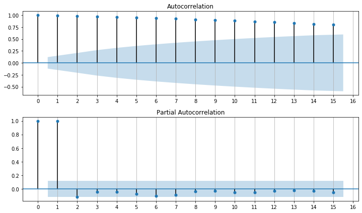


### Plot seasonal decomposition for ts dataframe


```python
# plot_seasonal_decomp(ts)

plot_seasonal_decomp(ts_96142_values)

# Seasonality does not appear to be a significant factor in this zip code.
```


    (<Figure size 1296x432 with 1 Axes>,
     <matplotlib.axes._subplots.AxesSubplot at 0x1cc2beadd8>)


## ARIMA model parameters and optimization

### Generate list of (p,d,q) and (p,d,q,m) values


```python
p_values = [0, 1, 2, 4, 6, 8]
d_values = range(0, 3)
q_values = range(0, 3)
warnings.filterwarnings("ignore")
```

### Run ARIMA model on ts dataframe with list of p,d,q values 


```python
# eval_arima_models(ts, p_values, d_values, q_values)  # don't run this until you have some time, since it take time
# note that ts must only contain values and time as index

# eval_arima_models(ts_96142_values, p_values, d_values, q_values)  # don't run this until you have some time, since it takes time

```

### Generate model fit summary


```python
# model_fit = arima_zipcode(ts, order = None)   # change order = tuple to correspond to the best MSE produced by previous function

# Best ARIMA(6, 1, 2) MSE=10423029.066

model_fit_96142 = arima_zipcode(ts_96142_values, order = (6,1,2))

```

                                 ARIMA Model Results                              
    ==============================================================================
    Dep. Variable:                    D.y   No. Observations:                  264
    Model:                 ARIMA(6, 1, 2)   Log Likelihood               -2369.849
    Method:                       css-mle   S.D. of innovations           1872.830
    Date:                Tue, 10 Mar 2020   AIC                           4759.697
    Time:                        22:22:18   BIC                           4795.457
    Sample:                             1   HQIC                          4774.066
                                                                                  
    ==============================================================================
                     coef    std err          z      P>|z|      [0.025      0.975]
    ------------------------------------------------------------------------------
    const       1381.0622   1108.155      1.246      0.214    -790.881    3553.005
    ar.L1.D.y      0.1086      0.062      1.752      0.081      -0.013       0.230
    ar.L2.D.y      0.0833      0.063      1.331      0.184      -0.039       0.206
    ar.L3.D.y      0.0376      0.064      0.591      0.555      -0.087       0.163
    ar.L4.D.y      0.1561      0.064      2.452      0.015       0.031       0.281
    ar.L5.D.y      0.1380      0.065      2.122      0.035       0.011       0.266
    ar.L6.D.y      0.1031      0.067      1.546      0.123      -0.028       0.234
    ma.L1.D.y      1.6837      0.026     65.330      0.000       1.633       1.734
    ma.L2.D.y      1.0000      0.030     33.209      0.000       0.941       1.059
                                        Roots                                    
    =============================================================================
                      Real          Imaginary           Modulus         Frequency
    -----------------------------------------------------------------------------
    AR.1            1.1281           -0.0000j            1.1281           -0.0000
    AR.2            0.5031           -1.2862j            1.3811           -0.1907
    AR.3            0.5031           +1.2862j            1.3811            0.1907
    AR.4           -1.5533           -0.0000j            1.5533           -0.5000
    AR.5           -0.9598           -1.4073j            1.7034           -0.3453
    AR.6           -0.9598           +1.4073j            1.7034            0.3453
    MA.1           -0.8418           -0.5397j            1.0000           -0.4093
    MA.2           -0.8418           +0.5397j            1.0000            0.4093
    -----------------------------------------------------------------------------


## ARIMA modeling results:  predictions and visualization

### Produce forecasts from ARIMA model fit


```python
actual_forecast_96142, std_error_96142, forecast_confint_96142 = forecast(model_fit_96142)
```


```python
actual_forecast_96142, std_error_96142, forecast_confint_96142
```


    (array([521967.79619792, 521049.13980544, 525838.43322981, 531857.97457127,
            536339.19704732, 538767.87490465, 540599.45657796, 543190.87559637,
            546256.04563214, 549007.56339827, 551257.91892579, 553270.10418003,
            555320.14756452, 557430.37892917, 559468.65103218, 561366.84396847,
            563167.45229217, 564933.14882976, 566682.6304696 , 568398.17460675,
            570065.37767339, 571690.52876941, 573288.39583597, 574866.84098686]),
     array([ 1872.83007801,  5554.63985296,  9431.84191668, 12519.47325432,
            15370.46358042, 18290.82863091, 21412.67357874, 24617.68497431,
            27761.76733089, 30805.24728348, 33796.47918644, 36759.54071413,
            39686.17692248, 42554.57737314, 45356.07300455, 48094.90031897,
            50777.47858473, 53404.71738336, 55974.88161868, 58487.38907644,
            60944.03627646, 63347.35514216, 65699.28826669, 68001.14417863]),
     array([[518297.11669586, 525638.47569998],
            [510162.24574656, 531936.03386433],
            [507352.36276525, 544324.50369437],
            [507320.25788739, 556395.69125516],
            [506213.64200401, 566464.75209063],
            [502918.50954068, 574617.24026863],
            [498631.38755092, 582567.52560501],
            [494941.09966398, 591440.65152877],
            [491843.98151643, 600668.10974786],
            [488630.3881878 , 609384.73860874],
            [485018.03691612, 617497.80093547],
            [481222.72829209, 625317.48006796],
            [477536.67011237, 633103.62501667],
            [474024.93990049, 640835.81795785],
            [470572.38146308, 648364.92060128],
            [467102.57150324, 655631.11643371],
            [463645.42304036, 662689.48154399],
            [460261.82615383, 669604.47150569],
            [456973.87845809, 676391.38248111],
            [453764.99846715, 683031.35074636],
            [450617.26149902, 689513.49384775],
            [447531.9941749 , 695849.06336391],
            [444520.15702334, 702056.63464859],
            [441587.04748924, 708146.63448449]]))


### Create dataframe to hold forecast results


```python
# df_forecast = forecast_df(col = 'time', daterange = pd.date_range(start='2018-05-01', end='2020-04-01', freq='MS'), 
#                 actual_forecast=actual_forecast, forecast_confint = forecast_confint)

df_forecast_96142 = forecast_df(actual_forecast_96142, forecast_confint_96142, col = 'time', daterange = pd.date_range(start='2018-05-01', end='2020-04-01', freq='MS'))

```

### Create new dataframe concatenating historic values and forecast results


```python
# df_new = concat_values_forecast(ts, df_forecast)

df_new_96142 = concat_values_forecast(ts_96142_values, df_forecast_96142)
```


```python
df_new_96142
```


<div>
<style scoped>
    .dataframe tbody tr th:only-of-type {
        vertical-align: middle;
    }

    .dataframe tbody tr th {
        vertical-align: top;
    }

    .dataframe thead th {
        text-align: right;
    }
</style>
<table border="1" class="dataframe">
  <thead>
    <tr style="text-align: right;">
      <th></th>
      <th>value</th>
      <th>forecast</th>
      <th>forecast_lower</th>
      <th>forecast_upper</th>
    </tr>
    <tr>
      <th>time</th>
      <th></th>
      <th></th>
      <th></th>
      <th></th>
    </tr>
  </thead>
  <tbody>
    <tr>
      <td>1996-04-01</td>
      <td>159000.0</td>
      <td>NaN</td>
      <td>NaN</td>
      <td>NaN</td>
    </tr>
    <tr>
      <td>1996-05-01</td>
      <td>158900.0</td>
      <td>NaN</td>
      <td>NaN</td>
      <td>NaN</td>
    </tr>
    <tr>
      <td>1996-06-01</td>
      <td>158900.0</td>
      <td>NaN</td>
      <td>NaN</td>
      <td>NaN</td>
    </tr>
    <tr>
      <td>1996-07-01</td>
      <td>158900.0</td>
      <td>NaN</td>
      <td>NaN</td>
      <td>NaN</td>
    </tr>
    <tr>
      <td>1996-08-01</td>
      <td>158900.0</td>
      <td>NaN</td>
      <td>NaN</td>
      <td>NaN</td>
    </tr>
    <tr>
      <td>1996-09-01</td>
      <td>158800.0</td>
      <td>NaN</td>
      <td>NaN</td>
      <td>NaN</td>
    </tr>
    <tr>
      <td>1996-10-01</td>
      <td>158800.0</td>
      <td>NaN</td>
      <td>NaN</td>
      <td>NaN</td>
    </tr>
    <tr>
      <td>1996-11-01</td>
      <td>158900.0</td>
      <td>NaN</td>
      <td>NaN</td>
      <td>NaN</td>
    </tr>
    <tr>
      <td>1996-12-01</td>
      <td>159200.0</td>
      <td>NaN</td>
      <td>NaN</td>
      <td>NaN</td>
    </tr>
    <tr>
      <td>1997-01-01</td>
      <td>159600.0</td>
      <td>NaN</td>
      <td>NaN</td>
      <td>NaN</td>
    </tr>
    <tr>
      <td>1997-02-01</td>
      <td>159700.0</td>
      <td>NaN</td>
      <td>NaN</td>
      <td>NaN</td>
    </tr>
    <tr>
      <td>1997-03-01</td>
      <td>159600.0</td>
      <td>NaN</td>
      <td>NaN</td>
      <td>NaN</td>
    </tr>
    <tr>
      <td>1997-04-01</td>
      <td>159600.0</td>
      <td>NaN</td>
      <td>NaN</td>
      <td>NaN</td>
    </tr>
    <tr>
      <td>1997-05-01</td>
      <td>159600.0</td>
      <td>NaN</td>
      <td>NaN</td>
      <td>NaN</td>
    </tr>
    <tr>
      <td>1997-06-01</td>
      <td>159800.0</td>
      <td>NaN</td>
      <td>NaN</td>
      <td>NaN</td>
    </tr>
    <tr>
      <td>1997-07-01</td>
      <td>160000.0</td>
      <td>NaN</td>
      <td>NaN</td>
      <td>NaN</td>
    </tr>
    <tr>
      <td>1997-08-01</td>
      <td>160300.0</td>
      <td>NaN</td>
      <td>NaN</td>
      <td>NaN</td>
    </tr>
    <tr>
      <td>1997-09-01</td>
      <td>160700.0</td>
      <td>NaN</td>
      <td>NaN</td>
      <td>NaN</td>
    </tr>
    <tr>
      <td>1997-10-01</td>
      <td>161100.0</td>
      <td>NaN</td>
      <td>NaN</td>
      <td>NaN</td>
    </tr>
    <tr>
      <td>1997-11-01</td>
      <td>161700.0</td>
      <td>NaN</td>
      <td>NaN</td>
      <td>NaN</td>
    </tr>
    <tr>
      <td>1997-12-01</td>
      <td>162800.0</td>
      <td>NaN</td>
      <td>NaN</td>
      <td>NaN</td>
    </tr>
    <tr>
      <td>1998-01-01</td>
      <td>164000.0</td>
      <td>NaN</td>
      <td>NaN</td>
      <td>NaN</td>
    </tr>
    <tr>
      <td>1998-02-01</td>
      <td>165000.0</td>
      <td>NaN</td>
      <td>NaN</td>
      <td>NaN</td>
    </tr>
    <tr>
      <td>1998-03-01</td>
      <td>165800.0</td>
      <td>NaN</td>
      <td>NaN</td>
      <td>NaN</td>
    </tr>
    <tr>
      <td>1998-04-01</td>
      <td>166700.0</td>
      <td>NaN</td>
      <td>NaN</td>
      <td>NaN</td>
    </tr>
    <tr>
      <td>1998-05-01</td>
      <td>167800.0</td>
      <td>NaN</td>
      <td>NaN</td>
      <td>NaN</td>
    </tr>
    <tr>
      <td>1998-06-01</td>
      <td>169000.0</td>
      <td>NaN</td>
      <td>NaN</td>
      <td>NaN</td>
    </tr>
    <tr>
      <td>1998-07-01</td>
      <td>170500.0</td>
      <td>NaN</td>
      <td>NaN</td>
      <td>NaN</td>
    </tr>
    <tr>
      <td>1998-08-01</td>
      <td>172100.0</td>
      <td>NaN</td>
      <td>NaN</td>
      <td>NaN</td>
    </tr>
    <tr>
      <td>1998-09-01</td>
      <td>173800.0</td>
      <td>NaN</td>
      <td>NaN</td>
      <td>NaN</td>
    </tr>
    <tr>
      <td>1998-10-01</td>
      <td>175600.0</td>
      <td>NaN</td>
      <td>NaN</td>
      <td>NaN</td>
    </tr>
    <tr>
      <td>1998-11-01</td>
      <td>177700.0</td>
      <td>NaN</td>
      <td>NaN</td>
      <td>NaN</td>
    </tr>
    <tr>
      <td>1998-12-01</td>
      <td>180200.0</td>
      <td>NaN</td>
      <td>NaN</td>
      <td>NaN</td>
    </tr>
    <tr>
      <td>1999-01-01</td>
      <td>183000.0</td>
      <td>NaN</td>
      <td>NaN</td>
      <td>NaN</td>
    </tr>
    <tr>
      <td>1999-02-01</td>
      <td>185600.0</td>
      <td>NaN</td>
      <td>NaN</td>
      <td>NaN</td>
    </tr>
    <tr>
      <td>1999-03-01</td>
      <td>188000.0</td>
      <td>NaN</td>
      <td>NaN</td>
      <td>NaN</td>
    </tr>
    <tr>
      <td>1999-04-01</td>
      <td>190800.0</td>
      <td>NaN</td>
      <td>NaN</td>
      <td>NaN</td>
    </tr>
    <tr>
      <td>1999-05-01</td>
      <td>193800.0</td>
      <td>NaN</td>
      <td>NaN</td>
      <td>NaN</td>
    </tr>
    <tr>
      <td>1999-06-01</td>
      <td>197200.0</td>
      <td>NaN</td>
      <td>NaN</td>
      <td>NaN</td>
    </tr>
    <tr>
      <td>1999-07-01</td>
      <td>200900.0</td>
      <td>NaN</td>
      <td>NaN</td>
      <td>NaN</td>
    </tr>
    <tr>
      <td>1999-08-01</td>
      <td>204800.0</td>
      <td>NaN</td>
      <td>NaN</td>
      <td>NaN</td>
    </tr>
    <tr>
      <td>1999-09-01</td>
      <td>208900.0</td>
      <td>NaN</td>
      <td>NaN</td>
      <td>NaN</td>
    </tr>
    <tr>
      <td>1999-10-01</td>
      <td>213200.0</td>
      <td>NaN</td>
      <td>NaN</td>
      <td>NaN</td>
    </tr>
    <tr>
      <td>1999-11-01</td>
      <td>218000.0</td>
      <td>NaN</td>
      <td>NaN</td>
      <td>NaN</td>
    </tr>
    <tr>
      <td>1999-12-01</td>
      <td>223400.0</td>
      <td>NaN</td>
      <td>NaN</td>
      <td>NaN</td>
    </tr>
    <tr>
      <td>2000-01-01</td>
      <td>229000.0</td>
      <td>NaN</td>
      <td>NaN</td>
      <td>NaN</td>
    </tr>
    <tr>
      <td>2000-02-01</td>
      <td>234500.0</td>
      <td>NaN</td>
      <td>NaN</td>
      <td>NaN</td>
    </tr>
    <tr>
      <td>2000-03-01</td>
      <td>239800.0</td>
      <td>NaN</td>
      <td>NaN</td>
      <td>NaN</td>
    </tr>
    <tr>
      <td>2000-04-01</td>
      <td>245400.0</td>
      <td>NaN</td>
      <td>NaN</td>
      <td>NaN</td>
    </tr>
    <tr>
      <td>2000-05-01</td>
      <td>251300.0</td>
      <td>NaN</td>
      <td>NaN</td>
      <td>NaN</td>
    </tr>
    <tr>
      <td>2000-06-01</td>
      <td>257600.0</td>
      <td>NaN</td>
      <td>NaN</td>
      <td>NaN</td>
    </tr>
    <tr>
      <td>2000-07-01</td>
      <td>264200.0</td>
      <td>NaN</td>
      <td>NaN</td>
      <td>NaN</td>
    </tr>
    <tr>
      <td>2000-08-01</td>
      <td>270900.0</td>
      <td>NaN</td>
      <td>NaN</td>
      <td>NaN</td>
    </tr>
    <tr>
      <td>2000-09-01</td>
      <td>277500.0</td>
      <td>NaN</td>
      <td>NaN</td>
      <td>NaN</td>
    </tr>
    <tr>
      <td>2000-10-01</td>
      <td>284100.0</td>
      <td>NaN</td>
      <td>NaN</td>
      <td>NaN</td>
    </tr>
    <tr>
      <td>2000-11-01</td>
      <td>291000.0</td>
      <td>NaN</td>
      <td>NaN</td>
      <td>NaN</td>
    </tr>
    <tr>
      <td>2000-12-01</td>
      <td>298300.0</td>
      <td>NaN</td>
      <td>NaN</td>
      <td>NaN</td>
    </tr>
    <tr>
      <td>2001-01-01</td>
      <td>305300.0</td>
      <td>NaN</td>
      <td>NaN</td>
      <td>NaN</td>
    </tr>
    <tr>
      <td>2001-02-01</td>
      <td>311500.0</td>
      <td>NaN</td>
      <td>NaN</td>
      <td>NaN</td>
    </tr>
    <tr>
      <td>2001-03-01</td>
      <td>317300.0</td>
      <td>NaN</td>
      <td>NaN</td>
      <td>NaN</td>
    </tr>
    <tr>
      <td>2001-04-01</td>
      <td>322900.0</td>
      <td>NaN</td>
      <td>NaN</td>
      <td>NaN</td>
    </tr>
    <tr>
      <td>2001-05-01</td>
      <td>328300.0</td>
      <td>NaN</td>
      <td>NaN</td>
      <td>NaN</td>
    </tr>
    <tr>
      <td>2001-06-01</td>
      <td>333800.0</td>
      <td>NaN</td>
      <td>NaN</td>
      <td>NaN</td>
    </tr>
    <tr>
      <td>2001-07-01</td>
      <td>339000.0</td>
      <td>NaN</td>
      <td>NaN</td>
      <td>NaN</td>
    </tr>
    <tr>
      <td>2001-08-01</td>
      <td>344000.0</td>
      <td>NaN</td>
      <td>NaN</td>
      <td>NaN</td>
    </tr>
    <tr>
      <td>2001-09-01</td>
      <td>348400.0</td>
      <td>NaN</td>
      <td>NaN</td>
      <td>NaN</td>
    </tr>
    <tr>
      <td>2001-10-01</td>
      <td>352500.0</td>
      <td>NaN</td>
      <td>NaN</td>
      <td>NaN</td>
    </tr>
    <tr>
      <td>2001-11-01</td>
      <td>356500.0</td>
      <td>NaN</td>
      <td>NaN</td>
      <td>NaN</td>
    </tr>
    <tr>
      <td>2001-12-01</td>
      <td>360700.0</td>
      <td>NaN</td>
      <td>NaN</td>
      <td>NaN</td>
    </tr>
    <tr>
      <td>2002-01-01</td>
      <td>364500.0</td>
      <td>NaN</td>
      <td>NaN</td>
      <td>NaN</td>
    </tr>
    <tr>
      <td>2002-02-01</td>
      <td>367300.0</td>
      <td>NaN</td>
      <td>NaN</td>
      <td>NaN</td>
    </tr>
    <tr>
      <td>2002-03-01</td>
      <td>369400.0</td>
      <td>NaN</td>
      <td>NaN</td>
      <td>NaN</td>
    </tr>
    <tr>
      <td>2002-04-01</td>
      <td>371200.0</td>
      <td>NaN</td>
      <td>NaN</td>
      <td>NaN</td>
    </tr>
    <tr>
      <td>2002-05-01</td>
      <td>373000.0</td>
      <td>NaN</td>
      <td>NaN</td>
      <td>NaN</td>
    </tr>
    <tr>
      <td>2002-06-01</td>
      <td>374900.0</td>
      <td>NaN</td>
      <td>NaN</td>
      <td>NaN</td>
    </tr>
    <tr>
      <td>2002-07-01</td>
      <td>376800.0</td>
      <td>NaN</td>
      <td>NaN</td>
      <td>NaN</td>
    </tr>
    <tr>
      <td>2002-08-01</td>
      <td>378500.0</td>
      <td>NaN</td>
      <td>NaN</td>
      <td>NaN</td>
    </tr>
    <tr>
      <td>2002-09-01</td>
      <td>380000.0</td>
      <td>NaN</td>
      <td>NaN</td>
      <td>NaN</td>
    </tr>
    <tr>
      <td>2002-10-01</td>
      <td>381800.0</td>
      <td>NaN</td>
      <td>NaN</td>
      <td>NaN</td>
    </tr>
    <tr>
      <td>2002-11-01</td>
      <td>381200.0</td>
      <td>NaN</td>
      <td>NaN</td>
      <td>NaN</td>
    </tr>
    <tr>
      <td>2002-12-01</td>
      <td>379200.0</td>
      <td>NaN</td>
      <td>NaN</td>
      <td>NaN</td>
    </tr>
    <tr>
      <td>2003-01-01</td>
      <td>380400.0</td>
      <td>NaN</td>
      <td>NaN</td>
      <td>NaN</td>
    </tr>
    <tr>
      <td>2003-02-01</td>
      <td>386500.0</td>
      <td>NaN</td>
      <td>NaN</td>
      <td>NaN</td>
    </tr>
    <tr>
      <td>2003-03-01</td>
      <td>394600.0</td>
      <td>NaN</td>
      <td>NaN</td>
      <td>NaN</td>
    </tr>
    <tr>
      <td>2003-04-01</td>
      <td>403500.0</td>
      <td>NaN</td>
      <td>NaN</td>
      <td>NaN</td>
    </tr>
    <tr>
      <td>2003-05-01</td>
      <td>411100.0</td>
      <td>NaN</td>
      <td>NaN</td>
      <td>NaN</td>
    </tr>
    <tr>
      <td>2003-06-01</td>
      <td>416300.0</td>
      <td>NaN</td>
      <td>NaN</td>
      <td>NaN</td>
    </tr>
    <tr>
      <td>2003-07-01</td>
      <td>419300.0</td>
      <td>NaN</td>
      <td>NaN</td>
      <td>NaN</td>
    </tr>
    <tr>
      <td>2003-08-01</td>
      <td>421600.0</td>
      <td>NaN</td>
      <td>NaN</td>
      <td>NaN</td>
    </tr>
    <tr>
      <td>2003-09-01</td>
      <td>424700.0</td>
      <td>NaN</td>
      <td>NaN</td>
      <td>NaN</td>
    </tr>
    <tr>
      <td>2003-10-01</td>
      <td>429300.0</td>
      <td>NaN</td>
      <td>NaN</td>
      <td>NaN</td>
    </tr>
    <tr>
      <td>2003-11-01</td>
      <td>436000.0</td>
      <td>NaN</td>
      <td>NaN</td>
      <td>NaN</td>
    </tr>
    <tr>
      <td>2003-12-01</td>
      <td>444500.0</td>
      <td>NaN</td>
      <td>NaN</td>
      <td>NaN</td>
    </tr>
    <tr>
      <td>2004-01-01</td>
      <td>453400.0</td>
      <td>NaN</td>
      <td>NaN</td>
      <td>NaN</td>
    </tr>
    <tr>
      <td>2004-02-01</td>
      <td>461500.0</td>
      <td>NaN</td>
      <td>NaN</td>
      <td>NaN</td>
    </tr>
    <tr>
      <td>2004-03-01</td>
      <td>469200.0</td>
      <td>NaN</td>
      <td>NaN</td>
      <td>NaN</td>
    </tr>
    <tr>
      <td>2004-04-01</td>
      <td>476700.0</td>
      <td>NaN</td>
      <td>NaN</td>
      <td>NaN</td>
    </tr>
    <tr>
      <td>2004-05-01</td>
      <td>484400.0</td>
      <td>NaN</td>
      <td>NaN</td>
      <td>NaN</td>
    </tr>
    <tr>
      <td>2004-06-01</td>
      <td>493000.0</td>
      <td>NaN</td>
      <td>NaN</td>
      <td>NaN</td>
    </tr>
    <tr>
      <td>2004-07-01</td>
      <td>502800.0</td>
      <td>NaN</td>
      <td>NaN</td>
      <td>NaN</td>
    </tr>
    <tr>
      <td>2004-08-01</td>
      <td>513200.0</td>
      <td>NaN</td>
      <td>NaN</td>
      <td>NaN</td>
    </tr>
    <tr>
      <td>2004-09-01</td>
      <td>523500.0</td>
      <td>NaN</td>
      <td>NaN</td>
      <td>NaN</td>
    </tr>
    <tr>
      <td>2004-10-01</td>
      <td>532900.0</td>
      <td>NaN</td>
      <td>NaN</td>
      <td>NaN</td>
    </tr>
    <tr>
      <td>2004-11-01</td>
      <td>541000.0</td>
      <td>NaN</td>
      <td>NaN</td>
      <td>NaN</td>
    </tr>
    <tr>
      <td>2004-12-01</td>
      <td>547900.0</td>
      <td>NaN</td>
      <td>NaN</td>
      <td>NaN</td>
    </tr>
    <tr>
      <td>2005-01-01</td>
      <td>553900.0</td>
      <td>NaN</td>
      <td>NaN</td>
      <td>NaN</td>
    </tr>
    <tr>
      <td>2005-02-01</td>
      <td>559800.0</td>
      <td>NaN</td>
      <td>NaN</td>
      <td>NaN</td>
    </tr>
    <tr>
      <td>2005-03-01</td>
      <td>567300.0</td>
      <td>NaN</td>
      <td>NaN</td>
      <td>NaN</td>
    </tr>
    <tr>
      <td>2005-04-01</td>
      <td>576300.0</td>
      <td>NaN</td>
      <td>NaN</td>
      <td>NaN</td>
    </tr>
    <tr>
      <td>2005-05-01</td>
      <td>585200.0</td>
      <td>NaN</td>
      <td>NaN</td>
      <td>NaN</td>
    </tr>
    <tr>
      <td>2005-06-01</td>
      <td>592700.0</td>
      <td>NaN</td>
      <td>NaN</td>
      <td>NaN</td>
    </tr>
    <tr>
      <td>2005-07-01</td>
      <td>597500.0</td>
      <td>NaN</td>
      <td>NaN</td>
      <td>NaN</td>
    </tr>
    <tr>
      <td>2005-08-01</td>
      <td>599400.0</td>
      <td>NaN</td>
      <td>NaN</td>
      <td>NaN</td>
    </tr>
    <tr>
      <td>2005-09-01</td>
      <td>599800.0</td>
      <td>NaN</td>
      <td>NaN</td>
      <td>NaN</td>
    </tr>
    <tr>
      <td>2005-10-01</td>
      <td>599200.0</td>
      <td>NaN</td>
      <td>NaN</td>
      <td>NaN</td>
    </tr>
    <tr>
      <td>2005-11-01</td>
      <td>598900.0</td>
      <td>NaN</td>
      <td>NaN</td>
      <td>NaN</td>
    </tr>
    <tr>
      <td>2005-12-01</td>
      <td>599700.0</td>
      <td>NaN</td>
      <td>NaN</td>
      <td>NaN</td>
    </tr>
    <tr>
      <td>2006-01-01</td>
      <td>600800.0</td>
      <td>NaN</td>
      <td>NaN</td>
      <td>NaN</td>
    </tr>
    <tr>
      <td>2006-02-01</td>
      <td>601100.0</td>
      <td>NaN</td>
      <td>NaN</td>
      <td>NaN</td>
    </tr>
    <tr>
      <td>2006-03-01</td>
      <td>601300.0</td>
      <td>NaN</td>
      <td>NaN</td>
      <td>NaN</td>
    </tr>
    <tr>
      <td>2006-04-01</td>
      <td>601800.0</td>
      <td>NaN</td>
      <td>NaN</td>
      <td>NaN</td>
    </tr>
    <tr>
      <td>2006-05-01</td>
      <td>602300.0</td>
      <td>NaN</td>
      <td>NaN</td>
      <td>NaN</td>
    </tr>
    <tr>
      <td>2006-06-01</td>
      <td>602400.0</td>
      <td>NaN</td>
      <td>NaN</td>
      <td>NaN</td>
    </tr>
    <tr>
      <td>2006-07-01</td>
      <td>601900.0</td>
      <td>NaN</td>
      <td>NaN</td>
      <td>NaN</td>
    </tr>
    <tr>
      <td>2006-08-01</td>
      <td>601100.0</td>
      <td>NaN</td>
      <td>NaN</td>
      <td>NaN</td>
    </tr>
    <tr>
      <td>2006-09-01</td>
      <td>601700.0</td>
      <td>NaN</td>
      <td>NaN</td>
      <td>NaN</td>
    </tr>
    <tr>
      <td>2006-10-01</td>
      <td>603600.0</td>
      <td>NaN</td>
      <td>NaN</td>
      <td>NaN</td>
    </tr>
    <tr>
      <td>2006-11-01</td>
      <td>606300.0</td>
      <td>NaN</td>
      <td>NaN</td>
      <td>NaN</td>
    </tr>
    <tr>
      <td>2006-12-01</td>
      <td>609100.0</td>
      <td>NaN</td>
      <td>NaN</td>
      <td>NaN</td>
    </tr>
    <tr>
      <td>2007-01-01</td>
      <td>609900.0</td>
      <td>NaN</td>
      <td>NaN</td>
      <td>NaN</td>
    </tr>
    <tr>
      <td>2007-02-01</td>
      <td>605800.0</td>
      <td>NaN</td>
      <td>NaN</td>
      <td>NaN</td>
    </tr>
    <tr>
      <td>2007-03-01</td>
      <td>598100.0</td>
      <td>NaN</td>
      <td>NaN</td>
      <td>NaN</td>
    </tr>
    <tr>
      <td>2007-04-01</td>
      <td>590300.0</td>
      <td>NaN</td>
      <td>NaN</td>
      <td>NaN</td>
    </tr>
    <tr>
      <td>2007-05-01</td>
      <td>585100.0</td>
      <td>NaN</td>
      <td>NaN</td>
      <td>NaN</td>
    </tr>
    <tr>
      <td>2007-06-01</td>
      <td>583300.0</td>
      <td>NaN</td>
      <td>NaN</td>
      <td>NaN</td>
    </tr>
    <tr>
      <td>2007-07-01</td>
      <td>585000.0</td>
      <td>NaN</td>
      <td>NaN</td>
      <td>NaN</td>
    </tr>
    <tr>
      <td>2007-08-01</td>
      <td>589200.0</td>
      <td>NaN</td>
      <td>NaN</td>
      <td>NaN</td>
    </tr>
    <tr>
      <td>2007-09-01</td>
      <td>594200.0</td>
      <td>NaN</td>
      <td>NaN</td>
      <td>NaN</td>
    </tr>
    <tr>
      <td>2007-10-01</td>
      <td>597300.0</td>
      <td>NaN</td>
      <td>NaN</td>
      <td>NaN</td>
    </tr>
    <tr>
      <td>2007-11-01</td>
      <td>597800.0</td>
      <td>NaN</td>
      <td>NaN</td>
      <td>NaN</td>
    </tr>
    <tr>
      <td>2007-12-01</td>
      <td>596100.0</td>
      <td>NaN</td>
      <td>NaN</td>
      <td>NaN</td>
    </tr>
    <tr>
      <td>2008-01-01</td>
      <td>592800.0</td>
      <td>NaN</td>
      <td>NaN</td>
      <td>NaN</td>
    </tr>
    <tr>
      <td>2008-02-01</td>
      <td>585500.0</td>
      <td>NaN</td>
      <td>NaN</td>
      <td>NaN</td>
    </tr>
    <tr>
      <td>2008-03-01</td>
      <td>575100.0</td>
      <td>NaN</td>
      <td>NaN</td>
      <td>NaN</td>
    </tr>
    <tr>
      <td>2008-04-01</td>
      <td>562900.0</td>
      <td>NaN</td>
      <td>NaN</td>
      <td>NaN</td>
    </tr>
    <tr>
      <td>2008-05-01</td>
      <td>549400.0</td>
      <td>NaN</td>
      <td>NaN</td>
      <td>NaN</td>
    </tr>
    <tr>
      <td>2008-06-01</td>
      <td>533400.0</td>
      <td>NaN</td>
      <td>NaN</td>
      <td>NaN</td>
    </tr>
    <tr>
      <td>2008-07-01</td>
      <td>520400.0</td>
      <td>NaN</td>
      <td>NaN</td>
      <td>NaN</td>
    </tr>
    <tr>
      <td>2008-08-01</td>
      <td>514400.0</td>
      <td>NaN</td>
      <td>NaN</td>
      <td>NaN</td>
    </tr>
    <tr>
      <td>2008-09-01</td>
      <td>512500.0</td>
      <td>NaN</td>
      <td>NaN</td>
      <td>NaN</td>
    </tr>
    <tr>
      <td>2008-10-01</td>
      <td>509600.0</td>
      <td>NaN</td>
      <td>NaN</td>
      <td>NaN</td>
    </tr>
    <tr>
      <td>2008-11-01</td>
      <td>506400.0</td>
      <td>NaN</td>
      <td>NaN</td>
      <td>NaN</td>
    </tr>
    <tr>
      <td>2008-12-01</td>
      <td>504600.0</td>
      <td>NaN</td>
      <td>NaN</td>
      <td>NaN</td>
    </tr>
    <tr>
      <td>2009-01-01</td>
      <td>504400.0</td>
      <td>NaN</td>
      <td>NaN</td>
      <td>NaN</td>
    </tr>
    <tr>
      <td>2009-02-01</td>
      <td>503400.0</td>
      <td>NaN</td>
      <td>NaN</td>
      <td>NaN</td>
    </tr>
    <tr>
      <td>2009-03-01</td>
      <td>501400.0</td>
      <td>NaN</td>
      <td>NaN</td>
      <td>NaN</td>
    </tr>
    <tr>
      <td>2009-04-01</td>
      <td>500200.0</td>
      <td>NaN</td>
      <td>NaN</td>
      <td>NaN</td>
    </tr>
    <tr>
      <td>2009-05-01</td>
      <td>499500.0</td>
      <td>NaN</td>
      <td>NaN</td>
      <td>NaN</td>
    </tr>
    <tr>
      <td>2009-06-01</td>
      <td>497100.0</td>
      <td>NaN</td>
      <td>NaN</td>
      <td>NaN</td>
    </tr>
    <tr>
      <td>2009-07-01</td>
      <td>492300.0</td>
      <td>NaN</td>
      <td>NaN</td>
      <td>NaN</td>
    </tr>
    <tr>
      <td>2009-08-01</td>
      <td>486600.0</td>
      <td>NaN</td>
      <td>NaN</td>
      <td>NaN</td>
    </tr>
    <tr>
      <td>2009-09-01</td>
      <td>480100.0</td>
      <td>NaN</td>
      <td>NaN</td>
      <td>NaN</td>
    </tr>
    <tr>
      <td>2009-10-01</td>
      <td>471900.0</td>
      <td>NaN</td>
      <td>NaN</td>
      <td>NaN</td>
    </tr>
    <tr>
      <td>2009-11-01</td>
      <td>462800.0</td>
      <td>NaN</td>
      <td>NaN</td>
      <td>NaN</td>
    </tr>
    <tr>
      <td>2009-12-01</td>
      <td>456500.0</td>
      <td>NaN</td>
      <td>NaN</td>
      <td>NaN</td>
    </tr>
    <tr>
      <td>2010-01-01</td>
      <td>452600.0</td>
      <td>NaN</td>
      <td>NaN</td>
      <td>NaN</td>
    </tr>
    <tr>
      <td>2010-02-01</td>
      <td>451800.0</td>
      <td>NaN</td>
      <td>NaN</td>
      <td>NaN</td>
    </tr>
    <tr>
      <td>2010-03-01</td>
      <td>447300.0</td>
      <td>NaN</td>
      <td>NaN</td>
      <td>NaN</td>
    </tr>
    <tr>
      <td>2010-04-01</td>
      <td>436900.0</td>
      <td>NaN</td>
      <td>NaN</td>
      <td>NaN</td>
    </tr>
    <tr>
      <td>2010-05-01</td>
      <td>425700.0</td>
      <td>NaN</td>
      <td>NaN</td>
      <td>NaN</td>
    </tr>
    <tr>
      <td>2010-06-01</td>
      <td>421600.0</td>
      <td>NaN</td>
      <td>NaN</td>
      <td>NaN</td>
    </tr>
    <tr>
      <td>2010-07-01</td>
      <td>418400.0</td>
      <td>NaN</td>
      <td>NaN</td>
      <td>NaN</td>
    </tr>
    <tr>
      <td>2010-08-01</td>
      <td>412800.0</td>
      <td>NaN</td>
      <td>NaN</td>
      <td>NaN</td>
    </tr>
    <tr>
      <td>2010-09-01</td>
      <td>403600.0</td>
      <td>NaN</td>
      <td>NaN</td>
      <td>NaN</td>
    </tr>
    <tr>
      <td>2010-10-01</td>
      <td>401300.0</td>
      <td>NaN</td>
      <td>NaN</td>
      <td>NaN</td>
    </tr>
    <tr>
      <td>2010-11-01</td>
      <td>401400.0</td>
      <td>NaN</td>
      <td>NaN</td>
      <td>NaN</td>
    </tr>
    <tr>
      <td>2010-12-01</td>
      <td>393400.0</td>
      <td>NaN</td>
      <td>NaN</td>
      <td>NaN</td>
    </tr>
    <tr>
      <td>2011-01-01</td>
      <td>377600.0</td>
      <td>NaN</td>
      <td>NaN</td>
      <td>NaN</td>
    </tr>
    <tr>
      <td>2011-02-01</td>
      <td>368500.0</td>
      <td>NaN</td>
      <td>NaN</td>
      <td>NaN</td>
    </tr>
    <tr>
      <td>2011-03-01</td>
      <td>369600.0</td>
      <td>NaN</td>
      <td>NaN</td>
      <td>NaN</td>
    </tr>
    <tr>
      <td>2011-04-01</td>
      <td>374800.0</td>
      <td>NaN</td>
      <td>NaN</td>
      <td>NaN</td>
    </tr>
    <tr>
      <td>2011-05-01</td>
      <td>380400.0</td>
      <td>NaN</td>
      <td>NaN</td>
      <td>NaN</td>
    </tr>
    <tr>
      <td>2011-06-01</td>
      <td>388200.0</td>
      <td>NaN</td>
      <td>NaN</td>
      <td>NaN</td>
    </tr>
    <tr>
      <td>2011-07-01</td>
      <td>394100.0</td>
      <td>NaN</td>
      <td>NaN</td>
      <td>NaN</td>
    </tr>
    <tr>
      <td>2011-08-01</td>
      <td>393700.0</td>
      <td>NaN</td>
      <td>NaN</td>
      <td>NaN</td>
    </tr>
    <tr>
      <td>2011-09-01</td>
      <td>395000.0</td>
      <td>NaN</td>
      <td>NaN</td>
      <td>NaN</td>
    </tr>
    <tr>
      <td>2011-10-01</td>
      <td>398200.0</td>
      <td>NaN</td>
      <td>NaN</td>
      <td>NaN</td>
    </tr>
    <tr>
      <td>2011-11-01</td>
      <td>400000.0</td>
      <td>NaN</td>
      <td>NaN</td>
      <td>NaN</td>
    </tr>
    <tr>
      <td>2011-12-01</td>
      <td>401900.0</td>
      <td>NaN</td>
      <td>NaN</td>
      <td>NaN</td>
    </tr>
    <tr>
      <td>2012-01-01</td>
      <td>405600.0</td>
      <td>NaN</td>
      <td>NaN</td>
      <td>NaN</td>
    </tr>
    <tr>
      <td>2012-02-01</td>
      <td>407000.0</td>
      <td>NaN</td>
      <td>NaN</td>
      <td>NaN</td>
    </tr>
    <tr>
      <td>2012-03-01</td>
      <td>406700.0</td>
      <td>NaN</td>
      <td>NaN</td>
      <td>NaN</td>
    </tr>
    <tr>
      <td>2012-04-01</td>
      <td>403900.0</td>
      <td>NaN</td>
      <td>NaN</td>
      <td>NaN</td>
    </tr>
    <tr>
      <td>2012-05-01</td>
      <td>398100.0</td>
      <td>NaN</td>
      <td>NaN</td>
      <td>NaN</td>
    </tr>
    <tr>
      <td>2012-06-01</td>
      <td>386100.0</td>
      <td>NaN</td>
      <td>NaN</td>
      <td>NaN</td>
    </tr>
    <tr>
      <td>2012-07-01</td>
      <td>379400.0</td>
      <td>NaN</td>
      <td>NaN</td>
      <td>NaN</td>
    </tr>
    <tr>
      <td>2012-08-01</td>
      <td>380000.0</td>
      <td>NaN</td>
      <td>NaN</td>
      <td>NaN</td>
    </tr>
    <tr>
      <td>2012-09-01</td>
      <td>379300.0</td>
      <td>NaN</td>
      <td>NaN</td>
      <td>NaN</td>
    </tr>
    <tr>
      <td>2012-10-01</td>
      <td>370900.0</td>
      <td>NaN</td>
      <td>NaN</td>
      <td>NaN</td>
    </tr>
    <tr>
      <td>2012-11-01</td>
      <td>365300.0</td>
      <td>NaN</td>
      <td>NaN</td>
      <td>NaN</td>
    </tr>
    <tr>
      <td>2012-12-01</td>
      <td>364300.0</td>
      <td>NaN</td>
      <td>NaN</td>
      <td>NaN</td>
    </tr>
    <tr>
      <td>2013-01-01</td>
      <td>367000.0</td>
      <td>NaN</td>
      <td>NaN</td>
      <td>NaN</td>
    </tr>
    <tr>
      <td>2013-02-01</td>
      <td>369800.0</td>
      <td>NaN</td>
      <td>NaN</td>
      <td>NaN</td>
    </tr>
    <tr>
      <td>2013-03-01</td>
      <td>370300.0</td>
      <td>NaN</td>
      <td>NaN</td>
      <td>NaN</td>
    </tr>
    <tr>
      <td>2013-04-01</td>
      <td>369500.0</td>
      <td>NaN</td>
      <td>NaN</td>
      <td>NaN</td>
    </tr>
    <tr>
      <td>2013-05-01</td>
      <td>373300.0</td>
      <td>NaN</td>
      <td>NaN</td>
      <td>NaN</td>
    </tr>
    <tr>
      <td>2013-06-01</td>
      <td>380400.0</td>
      <td>NaN</td>
      <td>NaN</td>
      <td>NaN</td>
    </tr>
    <tr>
      <td>2013-07-01</td>
      <td>383500.0</td>
      <td>NaN</td>
      <td>NaN</td>
      <td>NaN</td>
    </tr>
    <tr>
      <td>2013-08-01</td>
      <td>381100.0</td>
      <td>NaN</td>
      <td>NaN</td>
      <td>NaN</td>
    </tr>
    <tr>
      <td>2013-09-01</td>
      <td>380500.0</td>
      <td>NaN</td>
      <td>NaN</td>
      <td>NaN</td>
    </tr>
    <tr>
      <td>2013-10-01</td>
      <td>385500.0</td>
      <td>NaN</td>
      <td>NaN</td>
      <td>NaN</td>
    </tr>
    <tr>
      <td>2013-11-01</td>
      <td>391700.0</td>
      <td>NaN</td>
      <td>NaN</td>
      <td>NaN</td>
    </tr>
    <tr>
      <td>2013-12-01</td>
      <td>395900.0</td>
      <td>NaN</td>
      <td>NaN</td>
      <td>NaN</td>
    </tr>
    <tr>
      <td>2014-01-01</td>
      <td>400600.0</td>
      <td>NaN</td>
      <td>NaN</td>
      <td>NaN</td>
    </tr>
    <tr>
      <td>2014-02-01</td>
      <td>404200.0</td>
      <td>NaN</td>
      <td>NaN</td>
      <td>NaN</td>
    </tr>
    <tr>
      <td>2014-03-01</td>
      <td>408600.0</td>
      <td>NaN</td>
      <td>NaN</td>
      <td>NaN</td>
    </tr>
    <tr>
      <td>2014-04-01</td>
      <td>419700.0</td>
      <td>NaN</td>
      <td>NaN</td>
      <td>NaN</td>
    </tr>
    <tr>
      <td>2014-05-01</td>
      <td>430600.0</td>
      <td>NaN</td>
      <td>NaN</td>
      <td>NaN</td>
    </tr>
    <tr>
      <td>2014-06-01</td>
      <td>437900.0</td>
      <td>NaN</td>
      <td>NaN</td>
      <td>NaN</td>
    </tr>
    <tr>
      <td>2014-07-01</td>
      <td>446300.0</td>
      <td>NaN</td>
      <td>NaN</td>
      <td>NaN</td>
    </tr>
    <tr>
      <td>2014-08-01</td>
      <td>454300.0</td>
      <td>NaN</td>
      <td>NaN</td>
      <td>NaN</td>
    </tr>
    <tr>
      <td>2014-09-01</td>
      <td>458100.0</td>
      <td>NaN</td>
      <td>NaN</td>
      <td>NaN</td>
    </tr>
    <tr>
      <td>2014-10-01</td>
      <td>461700.0</td>
      <td>NaN</td>
      <td>NaN</td>
      <td>NaN</td>
    </tr>
    <tr>
      <td>2014-11-01</td>
      <td>466900.0</td>
      <td>NaN</td>
      <td>NaN</td>
      <td>NaN</td>
    </tr>
    <tr>
      <td>2014-12-01</td>
      <td>474000.0</td>
      <td>NaN</td>
      <td>NaN</td>
      <td>NaN</td>
    </tr>
    <tr>
      <td>2015-01-01</td>
      <td>481900.0</td>
      <td>NaN</td>
      <td>NaN</td>
      <td>NaN</td>
    </tr>
    <tr>
      <td>2015-02-01</td>
      <td>484300.0</td>
      <td>NaN</td>
      <td>NaN</td>
      <td>NaN</td>
    </tr>
    <tr>
      <td>2015-03-01</td>
      <td>479200.0</td>
      <td>NaN</td>
      <td>NaN</td>
      <td>NaN</td>
    </tr>
    <tr>
      <td>2015-04-01</td>
      <td>472000.0</td>
      <td>NaN</td>
      <td>NaN</td>
      <td>NaN</td>
    </tr>
    <tr>
      <td>2015-05-01</td>
      <td>469500.0</td>
      <td>NaN</td>
      <td>NaN</td>
      <td>NaN</td>
    </tr>
    <tr>
      <td>2015-06-01</td>
      <td>469700.0</td>
      <td>NaN</td>
      <td>NaN</td>
      <td>NaN</td>
    </tr>
    <tr>
      <td>2015-07-01</td>
      <td>470100.0</td>
      <td>NaN</td>
      <td>NaN</td>
      <td>NaN</td>
    </tr>
    <tr>
      <td>2015-08-01</td>
      <td>471600.0</td>
      <td>NaN</td>
      <td>NaN</td>
      <td>NaN</td>
    </tr>
    <tr>
      <td>2015-09-01</td>
      <td>474400.0</td>
      <td>NaN</td>
      <td>NaN</td>
      <td>NaN</td>
    </tr>
    <tr>
      <td>2015-10-01</td>
      <td>476100.0</td>
      <td>NaN</td>
      <td>NaN</td>
      <td>NaN</td>
    </tr>
    <tr>
      <td>2015-11-01</td>
      <td>476600.0</td>
      <td>NaN</td>
      <td>NaN</td>
      <td>NaN</td>
    </tr>
    <tr>
      <td>2015-12-01</td>
      <td>477300.0</td>
      <td>NaN</td>
      <td>NaN</td>
      <td>NaN</td>
    </tr>
    <tr>
      <td>2016-01-01</td>
      <td>477400.0</td>
      <td>NaN</td>
      <td>NaN</td>
      <td>NaN</td>
    </tr>
    <tr>
      <td>2016-02-01</td>
      <td>476800.0</td>
      <td>NaN</td>
      <td>NaN</td>
      <td>NaN</td>
    </tr>
    <tr>
      <td>2016-03-01</td>
      <td>477800.0</td>
      <td>NaN</td>
      <td>NaN</td>
      <td>NaN</td>
    </tr>
    <tr>
      <td>2016-04-01</td>
      <td>482200.0</td>
      <td>NaN</td>
      <td>NaN</td>
      <td>NaN</td>
    </tr>
    <tr>
      <td>2016-05-01</td>
      <td>487600.0</td>
      <td>NaN</td>
      <td>NaN</td>
      <td>NaN</td>
    </tr>
    <tr>
      <td>2016-06-01</td>
      <td>491500.0</td>
      <td>NaN</td>
      <td>NaN</td>
      <td>NaN</td>
    </tr>
    <tr>
      <td>2016-07-01</td>
      <td>494900.0</td>
      <td>NaN</td>
      <td>NaN</td>
      <td>NaN</td>
    </tr>
    <tr>
      <td>2016-08-01</td>
      <td>500200.0</td>
      <td>NaN</td>
      <td>NaN</td>
      <td>NaN</td>
    </tr>
    <tr>
      <td>2016-09-01</td>
      <td>498900.0</td>
      <td>NaN</td>
      <td>NaN</td>
      <td>NaN</td>
    </tr>
    <tr>
      <td>2016-10-01</td>
      <td>492100.0</td>
      <td>NaN</td>
      <td>NaN</td>
      <td>NaN</td>
    </tr>
    <tr>
      <td>2016-11-01</td>
      <td>490900.0</td>
      <td>NaN</td>
      <td>NaN</td>
      <td>NaN</td>
    </tr>
    <tr>
      <td>2016-12-01</td>
      <td>498100.0</td>
      <td>NaN</td>
      <td>NaN</td>
      <td>NaN</td>
    </tr>
    <tr>
      <td>2017-01-01</td>
      <td>499000.0</td>
      <td>NaN</td>
      <td>NaN</td>
      <td>NaN</td>
    </tr>
    <tr>
      <td>2017-02-01</td>
      <td>494000.0</td>
      <td>NaN</td>
      <td>NaN</td>
      <td>NaN</td>
    </tr>
    <tr>
      <td>2017-03-01</td>
      <td>492900.0</td>
      <td>NaN</td>
      <td>NaN</td>
      <td>NaN</td>
    </tr>
    <tr>
      <td>2017-04-01</td>
      <td>497500.0</td>
      <td>NaN</td>
      <td>NaN</td>
      <td>NaN</td>
    </tr>
    <tr>
      <td>2017-05-01</td>
      <td>500100.0</td>
      <td>NaN</td>
      <td>NaN</td>
      <td>NaN</td>
    </tr>
    <tr>
      <td>2017-06-01</td>
      <td>498700.0</td>
      <td>NaN</td>
      <td>NaN</td>
      <td>NaN</td>
    </tr>
    <tr>
      <td>2017-07-01</td>
      <td>496100.0</td>
      <td>NaN</td>
      <td>NaN</td>
      <td>NaN</td>
    </tr>
    <tr>
      <td>2017-08-01</td>
      <td>497600.0</td>
      <td>NaN</td>
      <td>NaN</td>
      <td>NaN</td>
    </tr>
    <tr>
      <td>2017-09-01</td>
      <td>506600.0</td>
      <td>NaN</td>
      <td>NaN</td>
      <td>NaN</td>
    </tr>
    <tr>
      <td>2017-10-01</td>
      <td>509900.0</td>
      <td>NaN</td>
      <td>NaN</td>
      <td>NaN</td>
    </tr>
    <tr>
      <td>2017-11-01</td>
      <td>497400.0</td>
      <td>NaN</td>
      <td>NaN</td>
      <td>NaN</td>
    </tr>
    <tr>
      <td>2017-12-01</td>
      <td>485300.0</td>
      <td>NaN</td>
      <td>NaN</td>
      <td>NaN</td>
    </tr>
    <tr>
      <td>2018-01-01</td>
      <td>485100.0</td>
      <td>NaN</td>
      <td>NaN</td>
      <td>NaN</td>
    </tr>
    <tr>
      <td>2018-02-01</td>
      <td>496200.0</td>
      <td>NaN</td>
      <td>NaN</td>
      <td>NaN</td>
    </tr>
    <tr>
      <td>2018-03-01</td>
      <td>512800.0</td>
      <td>NaN</td>
      <td>NaN</td>
      <td>NaN</td>
    </tr>
    <tr>
      <td>2018-04-01</td>
      <td>523600.0</td>
      <td>NaN</td>
      <td>NaN</td>
      <td>NaN</td>
    </tr>
    <tr>
      <td>2018-05-01</td>
      <td>NaN</td>
      <td>521967.796198</td>
      <td>518297.116696</td>
      <td>525638.475700</td>
    </tr>
    <tr>
      <td>2018-06-01</td>
      <td>NaN</td>
      <td>521049.139805</td>
      <td>510162.245747</td>
      <td>531936.033864</td>
    </tr>
    <tr>
      <td>2018-07-01</td>
      <td>NaN</td>
      <td>525838.433230</td>
      <td>507352.362765</td>
      <td>544324.503694</td>
    </tr>
    <tr>
      <td>2018-08-01</td>
      <td>NaN</td>
      <td>531857.974571</td>
      <td>507320.257887</td>
      <td>556395.691255</td>
    </tr>
    <tr>
      <td>2018-09-01</td>
      <td>NaN</td>
      <td>536339.197047</td>
      <td>506213.642004</td>
      <td>566464.752091</td>
    </tr>
    <tr>
      <td>2018-10-01</td>
      <td>NaN</td>
      <td>538767.874905</td>
      <td>502918.509541</td>
      <td>574617.240269</td>
    </tr>
    <tr>
      <td>2018-11-01</td>
      <td>NaN</td>
      <td>540599.456578</td>
      <td>498631.387551</td>
      <td>582567.525605</td>
    </tr>
    <tr>
      <td>2018-12-01</td>
      <td>NaN</td>
      <td>543190.875596</td>
      <td>494941.099664</td>
      <td>591440.651529</td>
    </tr>
    <tr>
      <td>2019-01-01</td>
      <td>NaN</td>
      <td>546256.045632</td>
      <td>491843.981516</td>
      <td>600668.109748</td>
    </tr>
    <tr>
      <td>2019-02-01</td>
      <td>NaN</td>
      <td>549007.563398</td>
      <td>488630.388188</td>
      <td>609384.738609</td>
    </tr>
    <tr>
      <td>2019-03-01</td>
      <td>NaN</td>
      <td>551257.918926</td>
      <td>485018.036916</td>
      <td>617497.800935</td>
    </tr>
    <tr>
      <td>2019-04-01</td>
      <td>NaN</td>
      <td>553270.104180</td>
      <td>481222.728292</td>
      <td>625317.480068</td>
    </tr>
    <tr>
      <td>2019-05-01</td>
      <td>NaN</td>
      <td>555320.147565</td>
      <td>477536.670112</td>
      <td>633103.625017</td>
    </tr>
    <tr>
      <td>2019-06-01</td>
      <td>NaN</td>
      <td>557430.378929</td>
      <td>474024.939900</td>
      <td>640835.817958</td>
    </tr>
    <tr>
      <td>2019-07-01</td>
      <td>NaN</td>
      <td>559468.651032</td>
      <td>470572.381463</td>
      <td>648364.920601</td>
    </tr>
    <tr>
      <td>2019-08-01</td>
      <td>NaN</td>
      <td>561366.843968</td>
      <td>467102.571503</td>
      <td>655631.116434</td>
    </tr>
    <tr>
      <td>2019-09-01</td>
      <td>NaN</td>
      <td>563167.452292</td>
      <td>463645.423040</td>
      <td>662689.481544</td>
    </tr>
    <tr>
      <td>2019-10-01</td>
      <td>NaN</td>
      <td>564933.148830</td>
      <td>460261.826154</td>
      <td>669604.471506</td>
    </tr>
    <tr>
      <td>2019-11-01</td>
      <td>NaN</td>
      <td>566682.630470</td>
      <td>456973.878458</td>
      <td>676391.382481</td>
    </tr>
    <tr>
      <td>2019-12-01</td>
      <td>NaN</td>
      <td>568398.174607</td>
      <td>453764.998467</td>
      <td>683031.350746</td>
    </tr>
    <tr>
      <td>2020-01-01</td>
      <td>NaN</td>
      <td>570065.377673</td>
      <td>450617.261499</td>
      <td>689513.493848</td>
    </tr>
    <tr>
      <td>2020-02-01</td>
      <td>NaN</td>
      <td>571690.528769</td>
      <td>447531.994175</td>
      <td>695849.063364</td>
    </tr>
    <tr>
      <td>2020-03-01</td>
      <td>NaN</td>
      <td>573288.395836</td>
      <td>444520.157023</td>
      <td>702056.634649</td>
    </tr>
    <tr>
      <td>2020-04-01</td>
      <td>NaN</td>
      <td>574866.840987</td>
      <td>441587.047489</td>
      <td>708146.634484</td>
    </tr>
  </tbody>
</table>
</div>


### Calculate predicted, lower bound, and upper bound forecasted prices


```python
forecasted_price_96142, forecasted_lower_96142, forecasted_upper_96142 = forecast_values(df_new_96142)
```


```python
forecasted_price_96142, forecasted_lower_96142, forecasted_upper_96142  # predicted, best-case, and worst-case prices in 2020

```


    (574866.840986864, 441587.0474892397, 708146.6344844882)


```python
last_value_96142 = df_new_96142['value'].loc['2018-04-01']
```


```python
last_value_96142
```


    523600.0


### Plot forecast with confidence intervals


```python
# plot_forecast(df = df_new, figsize=(12,8), geog=None)

plot_forecast(df_new_96142, figsize=(12,8), geog='96142 (Tahoma)')
```


### Print summary of predicted, worst-case, and best-case scenarios


```python
tahoma_96142_pred, tahoma_96142_low, tahoma_96142_high = pred_best_worst(pred=forecasted_price_96142, low=forecasted_lower_96142, high=forecasted_upper_96142, last=last_value_96142, date='April 1, 2020')
tahoma_96142_pred, tahoma_96142_low, tahoma_96142_high
```

    By the model prediction, I would expect to see a 9.791% change in price by April 1, 2020.
    At the lower bound of the confidence interval, I would expect to see a -15.663% change in price by April 1, 2020.
    At the upper bound of the confidence interval, I would expect to see a 35.246% change in price by April 1, 2020.


    (9.791, -15.663, 35.246)


## Zip code 96142:  Potentially solid gains, with possibly large upside or downside

By the model prediction, I would expect to see a 9.791% change in price by April 1, 2020.
At the lower bound of the confidence interval, I would expect to see a -15.663% change in price by April 1, 2020.
At the upper bound of the confidence interval, I would expect to see a 35.246% change in price by April 1, 2020.


# SacMetro:  95811 (Sacramento) -- Mediocre predicted returns


```python
geog_area = '95811'
```

### Create dataframe containing values for just this geographic unit


```python
ts_95811 = df_sac.loc[df_sac['Zip'] == geog_area]  # ts for all of the following functions should have only one zipcode
ts_95811.head()

```


<div>
<style scoped>
    .dataframe tbody tr th:only-of-type {
        vertical-align: middle;
    }

    .dataframe tbody tr th {
        vertical-align: top;
    }

    .dataframe thead th {
        text-align: right;
    }
</style>
<table border="1" class="dataframe">
  <thead>
    <tr style="text-align: right;">
      <th></th>
      <th>Metro</th>
      <th>MetroState</th>
      <th>CountyName</th>
      <th>City</th>
      <th>Zip</th>
      <th>SizeRank</th>
      <th>value</th>
    </tr>
    <tr>
      <th>time</th>
      <th></th>
      <th></th>
      <th></th>
      <th></th>
      <th></th>
      <th></th>
      <th></th>
    </tr>
  </thead>
  <tbody>
    <tr>
      <td>1996-04-01</td>
      <td>Sacramento</td>
      <td>Sacramento CA</td>
      <td>Sacramento</td>
      <td>Sacramento</td>
      <td>95811</td>
      <td>8105</td>
      <td>119400.0</td>
    </tr>
    <tr>
      <td>1996-05-01</td>
      <td>Sacramento</td>
      <td>Sacramento CA</td>
      <td>Sacramento</td>
      <td>Sacramento</td>
      <td>95811</td>
      <td>8105</td>
      <td>119200.0</td>
    </tr>
    <tr>
      <td>1996-06-01</td>
      <td>Sacramento</td>
      <td>Sacramento CA</td>
      <td>Sacramento</td>
      <td>Sacramento</td>
      <td>95811</td>
      <td>8105</td>
      <td>119000.0</td>
    </tr>
    <tr>
      <td>1996-07-01</td>
      <td>Sacramento</td>
      <td>Sacramento CA</td>
      <td>Sacramento</td>
      <td>Sacramento</td>
      <td>95811</td>
      <td>8105</td>
      <td>118700.0</td>
    </tr>
    <tr>
      <td>1996-08-01</td>
      <td>Sacramento</td>
      <td>Sacramento CA</td>
      <td>Sacramento</td>
      <td>Sacramento</td>
      <td>95811</td>
      <td>8105</td>
      <td>118500.0</td>
    </tr>
  </tbody>
</table>
</div>


```python
# ts.head()

ts_95811.head()
```


<div>
<style scoped>
    .dataframe tbody tr th:only-of-type {
        vertical-align: middle;
    }

    .dataframe tbody tr th {
        vertical-align: top;
    }

    .dataframe thead th {
        text-align: right;
    }
</style>
<table border="1" class="dataframe">
  <thead>
    <tr style="text-align: right;">
      <th></th>
      <th>Metro</th>
      <th>MetroState</th>
      <th>CountyName</th>
      <th>City</th>
      <th>Zip</th>
      <th>SizeRank</th>
      <th>value</th>
    </tr>
    <tr>
      <th>time</th>
      <th></th>
      <th></th>
      <th></th>
      <th></th>
      <th></th>
      <th></th>
      <th></th>
    </tr>
  </thead>
  <tbody>
    <tr>
      <td>1996-04-01</td>
      <td>Sacramento</td>
      <td>Sacramento CA</td>
      <td>Sacramento</td>
      <td>Sacramento</td>
      <td>95811</td>
      <td>8105</td>
      <td>119400.0</td>
    </tr>
    <tr>
      <td>1996-05-01</td>
      <td>Sacramento</td>
      <td>Sacramento CA</td>
      <td>Sacramento</td>
      <td>Sacramento</td>
      <td>95811</td>
      <td>8105</td>
      <td>119200.0</td>
    </tr>
    <tr>
      <td>1996-06-01</td>
      <td>Sacramento</td>
      <td>Sacramento CA</td>
      <td>Sacramento</td>
      <td>Sacramento</td>
      <td>95811</td>
      <td>8105</td>
      <td>119000.0</td>
    </tr>
    <tr>
      <td>1996-07-01</td>
      <td>Sacramento</td>
      <td>Sacramento CA</td>
      <td>Sacramento</td>
      <td>Sacramento</td>
      <td>95811</td>
      <td>8105</td>
      <td>118700.0</td>
    </tr>
    <tr>
      <td>1996-08-01</td>
      <td>Sacramento</td>
      <td>Sacramento CA</td>
      <td>Sacramento</td>
      <td>Sacramento</td>
      <td>95811</td>
      <td>8105</td>
      <td>118500.0</td>
    </tr>
  </tbody>
</table>
</div>


```python
# ts = ts.value

ts_95811_values = ts_95811.value
```


```python
# ts.head()

ts_95811_values.head()
```


    time
    1996-04-01    119400.0
    1996-05-01    119200.0
    1996-06-01    119000.0
    1996-07-01    118700.0
    1996-08-01    118500.0
    Name: value, dtype: float64


```python
ts_95811_values.tail()
```


    time
    2017-12-01    555000.0
    2018-01-01    563000.0
    2018-02-01    568400.0
    2018-03-01    569400.0
    2018-04-01    567500.0
    Name: value, dtype: float64


### Visualizations

#### plot_ts:  Plot zip code(s) of interest over time, with market highs and lows


```python
# fig, ax = plot_ts(df_melt, zipcodes=['95616', '92008', '90035', '90025', '60625', '57701'])  # enter desired zip code(s)

fig, ax = plot_ts_zips(df_melt, zipcodes=['95811'], figsize=(12,5))  # enter desired zip code(s)
```


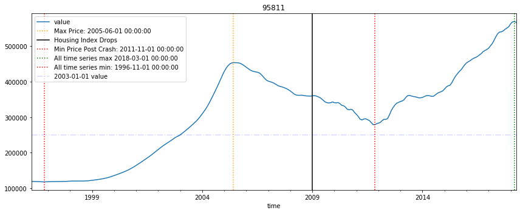


#### Boxplot of zip code


```python
# # note--check for SizeRank column and drop if needed

ts_95811.boxplot(column = 'value')
plt.title('95811');

```


### Plot ACF and PACF for ts dataframe


```python
# plot_acf_pacf(ts, figsize=(10,6), lags=15)  # note that ts must only contain values and time as index

plot_acf_pacf(ts_95811_values, figsize=(10,6), lags=15)
```


### Plot seasonal decomposition for ts dataframe


```python
# plot_seasonal_decomp(ts)

plot_seasonal_decomp(ts_95811_values)

# Seasonality does not appear to be a significant factor in this zip code.
```


    (<Figure size 1296x432 with 1 Axes>,
     <matplotlib.axes._subplots.AxesSubplot at 0x1cc35411d0>)


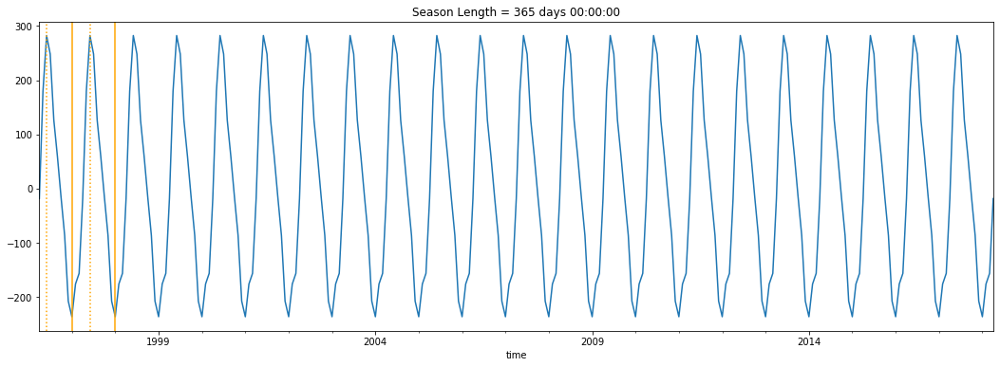


## ARIMA model parameters and optimization

### Generate list of (p,d,q) and (p,d,q,m) values


```python
p_values = [0, 1, 2, 4, 6, 8]
d_values = range(0, 3)
q_values = range(0, 3)
warnings.filterwarnings("ignore")
```

### Run ARIMA model on ts dataframe with list of p,d,q values 


```python
# eval_arima_models(ts, p_values, d_values, q_values)  # don't run this until you have some time, since it take time
# note that ts must only contain values and time as index

# eval_arima_models(ts_95811_values, p_values, d_values, q_values)  # don't run this until you have some time, since it takes time

```

### Generate model fit summary


```python
# model_fit = arima_zipcode(ts, order = None)   # change order = tuple to correspond to the best MSE produced by previous function

# Best ARIMA(4, 1, 2) MSE=3195605.437

model_fit_95811 = arima_zipcode(ts_95811_values, order = (4,1,2))

```

                                 ARIMA Model Results                              
    ==============================================================================
    Dep. Variable:                    D.y   No. Observations:                  264
    Model:                 ARIMA(4, 1, 2)   Log Likelihood               -2258.412
    Method:                       css-mle   S.D. of innovations           1243.836
    Date:                Tue, 10 Mar 2020   AIC                           4532.824
    Time:                        22:24:49   BIC                           4561.431
    Sample:                             1   HQIC                          4544.319
                                                                                  
    ==============================================================================
                     coef    std err          z      P>|z|      [0.025      0.975]
    ------------------------------------------------------------------------------
    const       1534.3385    980.138      1.565      0.119    -386.698    3455.375
    ar.L1.D.y     -0.0204      0.070     -0.291      0.771      -0.158       0.117
    ar.L2.D.y      0.2860      0.067      4.243      0.000       0.154       0.418
    ar.L3.D.y      0.2874      0.064      4.511      0.000       0.162       0.412
    ar.L4.D.y      0.1832      0.065      2.807      0.005       0.055       0.311
    ma.L1.D.y      1.5876      0.042     38.071      0.000       1.506       1.669
    ma.L2.D.y      0.9006      0.037     24.079      0.000       0.827       0.974
                                        Roots                                    
    =============================================================================
                      Real          Imaginary           Modulus         Frequency
    -----------------------------------------------------------------------------
    AR.1            1.1097           -0.0000j            1.1097           -0.0000
    AR.2           -1.7095           -0.0000j            1.7095           -0.5000
    AR.3           -0.4843           -1.6256j            1.6962           -0.2961
    AR.4           -0.4843           +1.6256j            1.6962            0.2961
    MA.1           -0.8814           -0.5775j            1.0538           -0.4077
    MA.2           -0.8814           +0.5775j            1.0538            0.4077
    -----------------------------------------------------------------------------


## ARIMA modeling results:  predictions and visualization

### Produce forecasts from ARIMA model fit


```python
# def forecast(model_fit, months=24, confint=2):
#     forecast = model_fit.forecast(months)
#     actual_forecast = forecast[0]
#     std_error = forecast[1]
#     forecast_confint = forecast[confint]
#     return actual_forecast, std_error, forecast_confint  

# actual_forecast, forecast_confint = forecast(model_fit, months=24, confint=2)

actual_forecast_95811, std_error_95811, forecast_confint_95811 = forecast(model_fit_95811)

```


```python
actual_forecast_95811, std_error_95811, forecast_confint_95811
```


    (array([566190.07791305, 565435.53318258, 565118.32278612, 564589.29237342,
            564457.38062532, 564484.18626482, 564640.59167533, 564915.05468381,
            565342.53829026, 565866.982533  , 566490.88232482, 567206.08400664,
            568003.76407709, 568872.21698885, 569807.27223374, 570801.63757685,
            571849.28894453, 572944.92066931, 574084.05855988, 575262.2094117 ,
            576475.55701301, 577720.63642621, 578994.31604528, 580293.74898307]),
     array([ 1243.83633315,  3426.83049776,  5759.59611591,  7974.12625392,
            10412.35891005, 12946.94254623, 15504.02623841, 18079.23156073,
            20673.20810413, 23257.25889014, 25823.87331779, 28367.94182533,
            30883.09791409, 33363.97458096, 35808.20577435, 38213.46868526,
            40578.09095725, 42901.15012546, 45182.23411634, 47421.19133548,
            49618.20879737, 51773.71382179, 53888.30587307, 55962.72085597]),
     array([[563752.20349741, 568627.95232869],
            [558719.06882584, 572151.99753932],
            [553829.72183344, 576406.92373879],
            [548960.29210757, 580218.29263927],
            [544049.53216753, 584865.22908312],
            [539108.6451643 , 589859.72736534],
            [534253.25863268, 595027.92471797],
            [529480.41195662, 600349.697411  ],
            [524823.79496127, 605861.28161925],
            [520283.59272919, 611450.3723368 ],
            [515877.02068062, 617104.74396901],
            [511605.93971346, 622806.22829982],
            [507474.00443445, 628533.52371972],
            [503480.02842905, 634264.40554865],
            [499624.47856503, 639990.06590246],
            [495904.61522938, 645698.65992432],
            [492317.69210694, 651380.88578213],
            [488860.21152806, 657029.62981055],
            [485528.50695079, 662639.61016898],
            [482318.38229019, 668206.03653322],
            [479225.65479276, 673725.45923325],
            [476246.02198962, 679195.25086279],
            [473375.17734619, 684613.45474438],
            [470608.83162851, 689978.66633763]]))


### Create dataframe to hold forecast results


```python
# df_forecast = forecast_df(col = 'time', daterange = pd.date_range(start='2018-05-01', end='2020-04-01', freq='MS'), 
#                 actual_forecast=actual_forecast, forecast_confint = forecast_confint)

df_forecast_95811 = forecast_df(actual_forecast_95811, forecast_confint_95811, col = 'time', daterange = pd.date_range(start='2018-05-01', end='2020-04-01', freq='MS'))
```

### Create new dataframe concatenating historic values and forecast results


```python
# df_new = concat_values_forecast(ts, df_forecast)

df_new_95811 = concat_values_forecast(ts_95811_values, df_forecast_95811)
```


```python
df_new_95811
```


<div>
<style scoped>
    .dataframe tbody tr th:only-of-type {
        vertical-align: middle;
    }

    .dataframe tbody tr th {
        vertical-align: top;
    }

    .dataframe thead th {
        text-align: right;
    }
</style>
<table border="1" class="dataframe">
  <thead>
    <tr style="text-align: right;">
      <th></th>
      <th>value</th>
      <th>forecast</th>
      <th>forecast_lower</th>
      <th>forecast_upper</th>
    </tr>
    <tr>
      <th>time</th>
      <th></th>
      <th></th>
      <th></th>
      <th></th>
    </tr>
  </thead>
  <tbody>
    <tr>
      <td>1996-04-01</td>
      <td>119400.0</td>
      <td>NaN</td>
      <td>NaN</td>
      <td>NaN</td>
    </tr>
    <tr>
      <td>1996-05-01</td>
      <td>119200.0</td>
      <td>NaN</td>
      <td>NaN</td>
      <td>NaN</td>
    </tr>
    <tr>
      <td>1996-06-01</td>
      <td>119000.0</td>
      <td>NaN</td>
      <td>NaN</td>
      <td>NaN</td>
    </tr>
    <tr>
      <td>1996-07-01</td>
      <td>118700.0</td>
      <td>NaN</td>
      <td>NaN</td>
      <td>NaN</td>
    </tr>
    <tr>
      <td>1996-08-01</td>
      <td>118500.0</td>
      <td>NaN</td>
      <td>NaN</td>
      <td>NaN</td>
    </tr>
    <tr>
      <td>1996-09-01</td>
      <td>118300.0</td>
      <td>NaN</td>
      <td>NaN</td>
      <td>NaN</td>
    </tr>
    <tr>
      <td>1996-10-01</td>
      <td>118200.0</td>
      <td>NaN</td>
      <td>NaN</td>
      <td>NaN</td>
    </tr>
    <tr>
      <td>1996-11-01</td>
      <td>118100.0</td>
      <td>NaN</td>
      <td>NaN</td>
      <td>NaN</td>
    </tr>
    <tr>
      <td>1996-12-01</td>
      <td>118300.0</td>
      <td>NaN</td>
      <td>NaN</td>
      <td>NaN</td>
    </tr>
    <tr>
      <td>1997-01-01</td>
      <td>118500.0</td>
      <td>NaN</td>
      <td>NaN</td>
      <td>NaN</td>
    </tr>
    <tr>
      <td>1997-02-01</td>
      <td>118700.0</td>
      <td>NaN</td>
      <td>NaN</td>
      <td>NaN</td>
    </tr>
    <tr>
      <td>1997-03-01</td>
      <td>118800.0</td>
      <td>NaN</td>
      <td>NaN</td>
      <td>NaN</td>
    </tr>
    <tr>
      <td>1997-04-01</td>
      <td>118800.0</td>
      <td>NaN</td>
      <td>NaN</td>
      <td>NaN</td>
    </tr>
    <tr>
      <td>1997-05-01</td>
      <td>118900.0</td>
      <td>NaN</td>
      <td>NaN</td>
      <td>NaN</td>
    </tr>
    <tr>
      <td>1997-06-01</td>
      <td>119000.0</td>
      <td>NaN</td>
      <td>NaN</td>
      <td>NaN</td>
    </tr>
    <tr>
      <td>1997-07-01</td>
      <td>119000.0</td>
      <td>NaN</td>
      <td>NaN</td>
      <td>NaN</td>
    </tr>
    <tr>
      <td>1997-08-01</td>
      <td>119100.0</td>
      <td>NaN</td>
      <td>NaN</td>
      <td>NaN</td>
    </tr>
    <tr>
      <td>1997-09-01</td>
      <td>119200.0</td>
      <td>NaN</td>
      <td>NaN</td>
      <td>NaN</td>
    </tr>
    <tr>
      <td>1997-10-01</td>
      <td>119300.0</td>
      <td>NaN</td>
      <td>NaN</td>
      <td>NaN</td>
    </tr>
    <tr>
      <td>1997-11-01</td>
      <td>119500.0</td>
      <td>NaN</td>
      <td>NaN</td>
      <td>NaN</td>
    </tr>
    <tr>
      <td>1997-12-01</td>
      <td>119900.0</td>
      <td>NaN</td>
      <td>NaN</td>
      <td>NaN</td>
    </tr>
    <tr>
      <td>1998-01-01</td>
      <td>120200.0</td>
      <td>NaN</td>
      <td>NaN</td>
      <td>NaN</td>
    </tr>
    <tr>
      <td>1998-02-01</td>
      <td>120400.0</td>
      <td>NaN</td>
      <td>NaN</td>
      <td>NaN</td>
    </tr>
    <tr>
      <td>1998-03-01</td>
      <td>120400.0</td>
      <td>NaN</td>
      <td>NaN</td>
      <td>NaN</td>
    </tr>
    <tr>
      <td>1998-04-01</td>
      <td>120500.0</td>
      <td>NaN</td>
      <td>NaN</td>
      <td>NaN</td>
    </tr>
    <tr>
      <td>1998-05-01</td>
      <td>120500.0</td>
      <td>NaN</td>
      <td>NaN</td>
      <td>NaN</td>
    </tr>
    <tr>
      <td>1998-06-01</td>
      <td>120500.0</td>
      <td>NaN</td>
      <td>NaN</td>
      <td>NaN</td>
    </tr>
    <tr>
      <td>1998-07-01</td>
      <td>120500.0</td>
      <td>NaN</td>
      <td>NaN</td>
      <td>NaN</td>
    </tr>
    <tr>
      <td>1998-08-01</td>
      <td>120500.0</td>
      <td>NaN</td>
      <td>NaN</td>
      <td>NaN</td>
    </tr>
    <tr>
      <td>1998-09-01</td>
      <td>120600.0</td>
      <td>NaN</td>
      <td>NaN</td>
      <td>NaN</td>
    </tr>
    <tr>
      <td>1998-10-01</td>
      <td>120900.0</td>
      <td>NaN</td>
      <td>NaN</td>
      <td>NaN</td>
    </tr>
    <tr>
      <td>1998-11-01</td>
      <td>121200.0</td>
      <td>NaN</td>
      <td>NaN</td>
      <td>NaN</td>
    </tr>
    <tr>
      <td>1998-12-01</td>
      <td>121800.0</td>
      <td>NaN</td>
      <td>NaN</td>
      <td>NaN</td>
    </tr>
    <tr>
      <td>1999-01-01</td>
      <td>122400.0</td>
      <td>NaN</td>
      <td>NaN</td>
      <td>NaN</td>
    </tr>
    <tr>
      <td>1999-02-01</td>
      <td>123100.0</td>
      <td>NaN</td>
      <td>NaN</td>
      <td>NaN</td>
    </tr>
    <tr>
      <td>1999-03-01</td>
      <td>123800.0</td>
      <td>NaN</td>
      <td>NaN</td>
      <td>NaN</td>
    </tr>
    <tr>
      <td>1999-04-01</td>
      <td>124500.0</td>
      <td>NaN</td>
      <td>NaN</td>
      <td>NaN</td>
    </tr>
    <tr>
      <td>1999-05-01</td>
      <td>125300.0</td>
      <td>NaN</td>
      <td>NaN</td>
      <td>NaN</td>
    </tr>
    <tr>
      <td>1999-06-01</td>
      <td>126100.0</td>
      <td>NaN</td>
      <td>NaN</td>
      <td>NaN</td>
    </tr>
    <tr>
      <td>1999-07-01</td>
      <td>127000.0</td>
      <td>NaN</td>
      <td>NaN</td>
      <td>NaN</td>
    </tr>
    <tr>
      <td>1999-08-01</td>
      <td>128200.0</td>
      <td>NaN</td>
      <td>NaN</td>
      <td>NaN</td>
    </tr>
    <tr>
      <td>1999-09-01</td>
      <td>129400.0</td>
      <td>NaN</td>
      <td>NaN</td>
      <td>NaN</td>
    </tr>
    <tr>
      <td>1999-10-01</td>
      <td>130700.0</td>
      <td>NaN</td>
      <td>NaN</td>
      <td>NaN</td>
    </tr>
    <tr>
      <td>1999-11-01</td>
      <td>132200.0</td>
      <td>NaN</td>
      <td>NaN</td>
      <td>NaN</td>
    </tr>
    <tr>
      <td>1999-12-01</td>
      <td>134000.0</td>
      <td>NaN</td>
      <td>NaN</td>
      <td>NaN</td>
    </tr>
    <tr>
      <td>2000-01-01</td>
      <td>135900.0</td>
      <td>NaN</td>
      <td>NaN</td>
      <td>NaN</td>
    </tr>
    <tr>
      <td>2000-02-01</td>
      <td>137800.0</td>
      <td>NaN</td>
      <td>NaN</td>
      <td>NaN</td>
    </tr>
    <tr>
      <td>2000-03-01</td>
      <td>139600.0</td>
      <td>NaN</td>
      <td>NaN</td>
      <td>NaN</td>
    </tr>
    <tr>
      <td>2000-04-01</td>
      <td>141400.0</td>
      <td>NaN</td>
      <td>NaN</td>
      <td>NaN</td>
    </tr>
    <tr>
      <td>2000-05-01</td>
      <td>143400.0</td>
      <td>NaN</td>
      <td>NaN</td>
      <td>NaN</td>
    </tr>
    <tr>
      <td>2000-06-01</td>
      <td>145400.0</td>
      <td>NaN</td>
      <td>NaN</td>
      <td>NaN</td>
    </tr>
    <tr>
      <td>2000-07-01</td>
      <td>147600.0</td>
      <td>NaN</td>
      <td>NaN</td>
      <td>NaN</td>
    </tr>
    <tr>
      <td>2000-08-01</td>
      <td>149900.0</td>
      <td>NaN</td>
      <td>NaN</td>
      <td>NaN</td>
    </tr>
    <tr>
      <td>2000-09-01</td>
      <td>152400.0</td>
      <td>NaN</td>
      <td>NaN</td>
      <td>NaN</td>
    </tr>
    <tr>
      <td>2000-10-01</td>
      <td>155100.0</td>
      <td>NaN</td>
      <td>NaN</td>
      <td>NaN</td>
    </tr>
    <tr>
      <td>2000-11-01</td>
      <td>158000.0</td>
      <td>NaN</td>
      <td>NaN</td>
      <td>NaN</td>
    </tr>
    <tr>
      <td>2000-12-01</td>
      <td>161100.0</td>
      <td>NaN</td>
      <td>NaN</td>
      <td>NaN</td>
    </tr>
    <tr>
      <td>2001-01-01</td>
      <td>164400.0</td>
      <td>NaN</td>
      <td>NaN</td>
      <td>NaN</td>
    </tr>
    <tr>
      <td>2001-02-01</td>
      <td>167700.0</td>
      <td>NaN</td>
      <td>NaN</td>
      <td>NaN</td>
    </tr>
    <tr>
      <td>2001-03-01</td>
      <td>171100.0</td>
      <td>NaN</td>
      <td>NaN</td>
      <td>NaN</td>
    </tr>
    <tr>
      <td>2001-04-01</td>
      <td>174600.0</td>
      <td>NaN</td>
      <td>NaN</td>
      <td>NaN</td>
    </tr>
    <tr>
      <td>2001-05-01</td>
      <td>178000.0</td>
      <td>NaN</td>
      <td>NaN</td>
      <td>NaN</td>
    </tr>
    <tr>
      <td>2001-06-01</td>
      <td>181500.0</td>
      <td>NaN</td>
      <td>NaN</td>
      <td>NaN</td>
    </tr>
    <tr>
      <td>2001-07-01</td>
      <td>185100.0</td>
      <td>NaN</td>
      <td>NaN</td>
      <td>NaN</td>
    </tr>
    <tr>
      <td>2001-08-01</td>
      <td>188800.0</td>
      <td>NaN</td>
      <td>NaN</td>
      <td>NaN</td>
    </tr>
    <tr>
      <td>2001-09-01</td>
      <td>192700.0</td>
      <td>NaN</td>
      <td>NaN</td>
      <td>NaN</td>
    </tr>
    <tr>
      <td>2001-10-01</td>
      <td>196600.0</td>
      <td>NaN</td>
      <td>NaN</td>
      <td>NaN</td>
    </tr>
    <tr>
      <td>2001-11-01</td>
      <td>200800.0</td>
      <td>NaN</td>
      <td>NaN</td>
      <td>NaN</td>
    </tr>
    <tr>
      <td>2001-12-01</td>
      <td>205100.0</td>
      <td>NaN</td>
      <td>NaN</td>
      <td>NaN</td>
    </tr>
    <tr>
      <td>2002-01-01</td>
      <td>209200.0</td>
      <td>NaN</td>
      <td>NaN</td>
      <td>NaN</td>
    </tr>
    <tr>
      <td>2002-02-01</td>
      <td>213200.0</td>
      <td>NaN</td>
      <td>NaN</td>
      <td>NaN</td>
    </tr>
    <tr>
      <td>2002-03-01</td>
      <td>217100.0</td>
      <td>NaN</td>
      <td>NaN</td>
      <td>NaN</td>
    </tr>
    <tr>
      <td>2002-04-01</td>
      <td>220800.0</td>
      <td>NaN</td>
      <td>NaN</td>
      <td>NaN</td>
    </tr>
    <tr>
      <td>2002-05-01</td>
      <td>224300.0</td>
      <td>NaN</td>
      <td>NaN</td>
      <td>NaN</td>
    </tr>
    <tr>
      <td>2002-06-01</td>
      <td>227800.0</td>
      <td>NaN</td>
      <td>NaN</td>
      <td>NaN</td>
    </tr>
    <tr>
      <td>2002-07-01</td>
      <td>231100.0</td>
      <td>NaN</td>
      <td>NaN</td>
      <td>NaN</td>
    </tr>
    <tr>
      <td>2002-08-01</td>
      <td>234500.0</td>
      <td>NaN</td>
      <td>NaN</td>
      <td>NaN</td>
    </tr>
    <tr>
      <td>2002-09-01</td>
      <td>238000.0</td>
      <td>NaN</td>
      <td>NaN</td>
      <td>NaN</td>
    </tr>
    <tr>
      <td>2002-10-01</td>
      <td>241800.0</td>
      <td>NaN</td>
      <td>NaN</td>
      <td>NaN</td>
    </tr>
    <tr>
      <td>2002-11-01</td>
      <td>244900.0</td>
      <td>NaN</td>
      <td>NaN</td>
      <td>NaN</td>
    </tr>
    <tr>
      <td>2002-12-01</td>
      <td>247300.0</td>
      <td>NaN</td>
      <td>NaN</td>
      <td>NaN</td>
    </tr>
    <tr>
      <td>2003-01-01</td>
      <td>250300.0</td>
      <td>NaN</td>
      <td>NaN</td>
      <td>NaN</td>
    </tr>
    <tr>
      <td>2003-02-01</td>
      <td>254300.0</td>
      <td>NaN</td>
      <td>NaN</td>
      <td>NaN</td>
    </tr>
    <tr>
      <td>2003-03-01</td>
      <td>258400.0</td>
      <td>NaN</td>
      <td>NaN</td>
      <td>NaN</td>
    </tr>
    <tr>
      <td>2003-04-01</td>
      <td>262700.0</td>
      <td>NaN</td>
      <td>NaN</td>
      <td>NaN</td>
    </tr>
    <tr>
      <td>2003-05-01</td>
      <td>266900.0</td>
      <td>NaN</td>
      <td>NaN</td>
      <td>NaN</td>
    </tr>
    <tr>
      <td>2003-06-01</td>
      <td>271400.0</td>
      <td>NaN</td>
      <td>NaN</td>
      <td>NaN</td>
    </tr>
    <tr>
      <td>2003-07-01</td>
      <td>276000.0</td>
      <td>NaN</td>
      <td>NaN</td>
      <td>NaN</td>
    </tr>
    <tr>
      <td>2003-08-01</td>
      <td>280600.0</td>
      <td>NaN</td>
      <td>NaN</td>
      <td>NaN</td>
    </tr>
    <tr>
      <td>2003-09-01</td>
      <td>285400.0</td>
      <td>NaN</td>
      <td>NaN</td>
      <td>NaN</td>
    </tr>
    <tr>
      <td>2003-10-01</td>
      <td>290400.0</td>
      <td>NaN</td>
      <td>NaN</td>
      <td>NaN</td>
    </tr>
    <tr>
      <td>2003-11-01</td>
      <td>296200.0</td>
      <td>NaN</td>
      <td>NaN</td>
      <td>NaN</td>
    </tr>
    <tr>
      <td>2003-12-01</td>
      <td>302700.0</td>
      <td>NaN</td>
      <td>NaN</td>
      <td>NaN</td>
    </tr>
    <tr>
      <td>2004-01-01</td>
      <td>309600.0</td>
      <td>NaN</td>
      <td>NaN</td>
      <td>NaN</td>
    </tr>
    <tr>
      <td>2004-02-01</td>
      <td>316600.0</td>
      <td>NaN</td>
      <td>NaN</td>
      <td>NaN</td>
    </tr>
    <tr>
      <td>2004-03-01</td>
      <td>324100.0</td>
      <td>NaN</td>
      <td>NaN</td>
      <td>NaN</td>
    </tr>
    <tr>
      <td>2004-04-01</td>
      <td>332600.0</td>
      <td>NaN</td>
      <td>NaN</td>
      <td>NaN</td>
    </tr>
    <tr>
      <td>2004-05-01</td>
      <td>341900.0</td>
      <td>NaN</td>
      <td>NaN</td>
      <td>NaN</td>
    </tr>
    <tr>
      <td>2004-06-01</td>
      <td>352000.0</td>
      <td>NaN</td>
      <td>NaN</td>
      <td>NaN</td>
    </tr>
    <tr>
      <td>2004-07-01</td>
      <td>362500.0</td>
      <td>NaN</td>
      <td>NaN</td>
      <td>NaN</td>
    </tr>
    <tr>
      <td>2004-08-01</td>
      <td>373000.0</td>
      <td>NaN</td>
      <td>NaN</td>
      <td>NaN</td>
    </tr>
    <tr>
      <td>2004-09-01</td>
      <td>383800.0</td>
      <td>NaN</td>
      <td>NaN</td>
      <td>NaN</td>
    </tr>
    <tr>
      <td>2004-10-01</td>
      <td>394900.0</td>
      <td>NaN</td>
      <td>NaN</td>
      <td>NaN</td>
    </tr>
    <tr>
      <td>2004-11-01</td>
      <td>406500.0</td>
      <td>NaN</td>
      <td>NaN</td>
      <td>NaN</td>
    </tr>
    <tr>
      <td>2004-12-01</td>
      <td>418100.0</td>
      <td>NaN</td>
      <td>NaN</td>
      <td>NaN</td>
    </tr>
    <tr>
      <td>2005-01-01</td>
      <td>428900.0</td>
      <td>NaN</td>
      <td>NaN</td>
      <td>NaN</td>
    </tr>
    <tr>
      <td>2005-02-01</td>
      <td>437700.0</td>
      <td>NaN</td>
      <td>NaN</td>
      <td>NaN</td>
    </tr>
    <tr>
      <td>2005-03-01</td>
      <td>444800.0</td>
      <td>NaN</td>
      <td>NaN</td>
      <td>NaN</td>
    </tr>
    <tr>
      <td>2005-04-01</td>
      <td>449900.0</td>
      <td>NaN</td>
      <td>NaN</td>
      <td>NaN</td>
    </tr>
    <tr>
      <td>2005-05-01</td>
      <td>452800.0</td>
      <td>NaN</td>
      <td>NaN</td>
      <td>NaN</td>
    </tr>
    <tr>
      <td>2005-06-01</td>
      <td>453700.0</td>
      <td>NaN</td>
      <td>NaN</td>
      <td>NaN</td>
    </tr>
    <tr>
      <td>2005-07-01</td>
      <td>453700.0</td>
      <td>NaN</td>
      <td>NaN</td>
      <td>NaN</td>
    </tr>
    <tr>
      <td>2005-08-01</td>
      <td>453500.0</td>
      <td>NaN</td>
      <td>NaN</td>
      <td>NaN</td>
    </tr>
    <tr>
      <td>2005-09-01</td>
      <td>452900.0</td>
      <td>NaN</td>
      <td>NaN</td>
      <td>NaN</td>
    </tr>
    <tr>
      <td>2005-10-01</td>
      <td>451200.0</td>
      <td>NaN</td>
      <td>NaN</td>
      <td>NaN</td>
    </tr>
    <tr>
      <td>2005-11-01</td>
      <td>448400.0</td>
      <td>NaN</td>
      <td>NaN</td>
      <td>NaN</td>
    </tr>
    <tr>
      <td>2005-12-01</td>
      <td>444600.0</td>
      <td>NaN</td>
      <td>NaN</td>
      <td>NaN</td>
    </tr>
    <tr>
      <td>2006-01-01</td>
      <td>440700.0</td>
      <td>NaN</td>
      <td>NaN</td>
      <td>NaN</td>
    </tr>
    <tr>
      <td>2006-02-01</td>
      <td>436900.0</td>
      <td>NaN</td>
      <td>NaN</td>
      <td>NaN</td>
    </tr>
    <tr>
      <td>2006-03-01</td>
      <td>433400.0</td>
      <td>NaN</td>
      <td>NaN</td>
      <td>NaN</td>
    </tr>
    <tr>
      <td>2006-04-01</td>
      <td>430800.0</td>
      <td>NaN</td>
      <td>NaN</td>
      <td>NaN</td>
    </tr>
    <tr>
      <td>2006-05-01</td>
      <td>429000.0</td>
      <td>NaN</td>
      <td>NaN</td>
      <td>NaN</td>
    </tr>
    <tr>
      <td>2006-06-01</td>
      <td>427800.0</td>
      <td>NaN</td>
      <td>NaN</td>
      <td>NaN</td>
    </tr>
    <tr>
      <td>2006-07-01</td>
      <td>426900.0</td>
      <td>NaN</td>
      <td>NaN</td>
      <td>NaN</td>
    </tr>
    <tr>
      <td>2006-08-01</td>
      <td>425100.0</td>
      <td>NaN</td>
      <td>NaN</td>
      <td>NaN</td>
    </tr>
    <tr>
      <td>2006-09-01</td>
      <td>421200.0</td>
      <td>NaN</td>
      <td>NaN</td>
      <td>NaN</td>
    </tr>
    <tr>
      <td>2006-10-01</td>
      <td>415500.0</td>
      <td>NaN</td>
      <td>NaN</td>
      <td>NaN</td>
    </tr>
    <tr>
      <td>2006-11-01</td>
      <td>409500.0</td>
      <td>NaN</td>
      <td>NaN</td>
      <td>NaN</td>
    </tr>
    <tr>
      <td>2006-12-01</td>
      <td>404400.0</td>
      <td>NaN</td>
      <td>NaN</td>
      <td>NaN</td>
    </tr>
    <tr>
      <td>2007-01-01</td>
      <td>401700.0</td>
      <td>NaN</td>
      <td>NaN</td>
      <td>NaN</td>
    </tr>
    <tr>
      <td>2007-02-01</td>
      <td>400100.0</td>
      <td>NaN</td>
      <td>NaN</td>
      <td>NaN</td>
    </tr>
    <tr>
      <td>2007-03-01</td>
      <td>398500.0</td>
      <td>NaN</td>
      <td>NaN</td>
      <td>NaN</td>
    </tr>
    <tr>
      <td>2007-04-01</td>
      <td>396100.0</td>
      <td>NaN</td>
      <td>NaN</td>
      <td>NaN</td>
    </tr>
    <tr>
      <td>2007-05-01</td>
      <td>393200.0</td>
      <td>NaN</td>
      <td>NaN</td>
      <td>NaN</td>
    </tr>
    <tr>
      <td>2007-06-01</td>
      <td>389900.0</td>
      <td>NaN</td>
      <td>NaN</td>
      <td>NaN</td>
    </tr>
    <tr>
      <td>2007-07-01</td>
      <td>387500.0</td>
      <td>NaN</td>
      <td>NaN</td>
      <td>NaN</td>
    </tr>
    <tr>
      <td>2007-08-01</td>
      <td>386100.0</td>
      <td>NaN</td>
      <td>NaN</td>
      <td>NaN</td>
    </tr>
    <tr>
      <td>2007-09-01</td>
      <td>384600.0</td>
      <td>NaN</td>
      <td>NaN</td>
      <td>NaN</td>
    </tr>
    <tr>
      <td>2007-10-01</td>
      <td>382600.0</td>
      <td>NaN</td>
      <td>NaN</td>
      <td>NaN</td>
    </tr>
    <tr>
      <td>2007-11-01</td>
      <td>380300.0</td>
      <td>NaN</td>
      <td>NaN</td>
      <td>NaN</td>
    </tr>
    <tr>
      <td>2007-12-01</td>
      <td>377300.0</td>
      <td>NaN</td>
      <td>NaN</td>
      <td>NaN</td>
    </tr>
    <tr>
      <td>2008-01-01</td>
      <td>374000.0</td>
      <td>NaN</td>
      <td>NaN</td>
      <td>NaN</td>
    </tr>
    <tr>
      <td>2008-02-01</td>
      <td>370000.0</td>
      <td>NaN</td>
      <td>NaN</td>
      <td>NaN</td>
    </tr>
    <tr>
      <td>2008-03-01</td>
      <td>365800.0</td>
      <td>NaN</td>
      <td>NaN</td>
      <td>NaN</td>
    </tr>
    <tr>
      <td>2008-04-01</td>
      <td>362900.0</td>
      <td>NaN</td>
      <td>NaN</td>
      <td>NaN</td>
    </tr>
    <tr>
      <td>2008-05-01</td>
      <td>361900.0</td>
      <td>NaN</td>
      <td>NaN</td>
      <td>NaN</td>
    </tr>
    <tr>
      <td>2008-06-01</td>
      <td>361800.0</td>
      <td>NaN</td>
      <td>NaN</td>
      <td>NaN</td>
    </tr>
    <tr>
      <td>2008-07-01</td>
      <td>362000.0</td>
      <td>NaN</td>
      <td>NaN</td>
      <td>NaN</td>
    </tr>
    <tr>
      <td>2008-08-01</td>
      <td>361600.0</td>
      <td>NaN</td>
      <td>NaN</td>
      <td>NaN</td>
    </tr>
    <tr>
      <td>2008-09-01</td>
      <td>360600.0</td>
      <td>NaN</td>
      <td>NaN</td>
      <td>NaN</td>
    </tr>
    <tr>
      <td>2008-10-01</td>
      <td>360000.0</td>
      <td>NaN</td>
      <td>NaN</td>
      <td>NaN</td>
    </tr>
    <tr>
      <td>2008-11-01</td>
      <td>359700.0</td>
      <td>NaN</td>
      <td>NaN</td>
      <td>NaN</td>
    </tr>
    <tr>
      <td>2008-12-01</td>
      <td>359500.0</td>
      <td>NaN</td>
      <td>NaN</td>
      <td>NaN</td>
    </tr>
    <tr>
      <td>2009-01-01</td>
      <td>360300.0</td>
      <td>NaN</td>
      <td>NaN</td>
      <td>NaN</td>
    </tr>
    <tr>
      <td>2009-02-01</td>
      <td>360900.0</td>
      <td>NaN</td>
      <td>NaN</td>
      <td>NaN</td>
    </tr>
    <tr>
      <td>2009-03-01</td>
      <td>360100.0</td>
      <td>NaN</td>
      <td>NaN</td>
      <td>NaN</td>
    </tr>
    <tr>
      <td>2009-04-01</td>
      <td>358000.0</td>
      <td>NaN</td>
      <td>NaN</td>
      <td>NaN</td>
    </tr>
    <tr>
      <td>2009-05-01</td>
      <td>355800.0</td>
      <td>NaN</td>
      <td>NaN</td>
      <td>NaN</td>
    </tr>
    <tr>
      <td>2009-06-01</td>
      <td>352100.0</td>
      <td>NaN</td>
      <td>NaN</td>
      <td>NaN</td>
    </tr>
    <tr>
      <td>2009-07-01</td>
      <td>347300.0</td>
      <td>NaN</td>
      <td>NaN</td>
      <td>NaN</td>
    </tr>
    <tr>
      <td>2009-08-01</td>
      <td>343200.0</td>
      <td>NaN</td>
      <td>NaN</td>
      <td>NaN</td>
    </tr>
    <tr>
      <td>2009-09-01</td>
      <td>341000.0</td>
      <td>NaN</td>
      <td>NaN</td>
      <td>NaN</td>
    </tr>
    <tr>
      <td>2009-10-01</td>
      <td>340300.0</td>
      <td>NaN</td>
      <td>NaN</td>
      <td>NaN</td>
    </tr>
    <tr>
      <td>2009-11-01</td>
      <td>341000.0</td>
      <td>NaN</td>
      <td>NaN</td>
      <td>NaN</td>
    </tr>
    <tr>
      <td>2009-12-01</td>
      <td>343200.0</td>
      <td>NaN</td>
      <td>NaN</td>
      <td>NaN</td>
    </tr>
    <tr>
      <td>2010-01-01</td>
      <td>341000.0</td>
      <td>NaN</td>
      <td>NaN</td>
      <td>NaN</td>
    </tr>
    <tr>
      <td>2010-02-01</td>
      <td>340700.0</td>
      <td>NaN</td>
      <td>NaN</td>
      <td>NaN</td>
    </tr>
    <tr>
      <td>2010-03-01</td>
      <td>341500.0</td>
      <td>NaN</td>
      <td>NaN</td>
      <td>NaN</td>
    </tr>
    <tr>
      <td>2010-04-01</td>
      <td>338500.0</td>
      <td>NaN</td>
      <td>NaN</td>
      <td>NaN</td>
    </tr>
    <tr>
      <td>2010-05-01</td>
      <td>333600.0</td>
      <td>NaN</td>
      <td>NaN</td>
      <td>NaN</td>
    </tr>
    <tr>
      <td>2010-06-01</td>
      <td>332500.0</td>
      <td>NaN</td>
      <td>NaN</td>
      <td>NaN</td>
    </tr>
    <tr>
      <td>2010-07-01</td>
      <td>328800.0</td>
      <td>NaN</td>
      <td>NaN</td>
      <td>NaN</td>
    </tr>
    <tr>
      <td>2010-08-01</td>
      <td>322600.0</td>
      <td>NaN</td>
      <td>NaN</td>
      <td>NaN</td>
    </tr>
    <tr>
      <td>2010-09-01</td>
      <td>321000.0</td>
      <td>NaN</td>
      <td>NaN</td>
      <td>NaN</td>
    </tr>
    <tr>
      <td>2010-10-01</td>
      <td>322600.0</td>
      <td>NaN</td>
      <td>NaN</td>
      <td>NaN</td>
    </tr>
    <tr>
      <td>2010-11-01</td>
      <td>320300.0</td>
      <td>NaN</td>
      <td>NaN</td>
      <td>NaN</td>
    </tr>
    <tr>
      <td>2010-12-01</td>
      <td>313500.0</td>
      <td>NaN</td>
      <td>NaN</td>
      <td>NaN</td>
    </tr>
    <tr>
      <td>2011-01-01</td>
      <td>308300.0</td>
      <td>NaN</td>
      <td>NaN</td>
      <td>NaN</td>
    </tr>
    <tr>
      <td>2011-02-01</td>
      <td>302300.0</td>
      <td>NaN</td>
      <td>NaN</td>
      <td>NaN</td>
    </tr>
    <tr>
      <td>2011-03-01</td>
      <td>294600.0</td>
      <td>NaN</td>
      <td>NaN</td>
      <td>NaN</td>
    </tr>
    <tr>
      <td>2011-04-01</td>
      <td>292400.0</td>
      <td>NaN</td>
      <td>NaN</td>
      <td>NaN</td>
    </tr>
    <tr>
      <td>2011-05-01</td>
      <td>295000.0</td>
      <td>NaN</td>
      <td>NaN</td>
      <td>NaN</td>
    </tr>
    <tr>
      <td>2011-06-01</td>
      <td>295800.0</td>
      <td>NaN</td>
      <td>NaN</td>
      <td>NaN</td>
    </tr>
    <tr>
      <td>2011-07-01</td>
      <td>293400.0</td>
      <td>NaN</td>
      <td>NaN</td>
      <td>NaN</td>
    </tr>
    <tr>
      <td>2011-08-01</td>
      <td>290900.0</td>
      <td>NaN</td>
      <td>NaN</td>
      <td>NaN</td>
    </tr>
    <tr>
      <td>2011-09-01</td>
      <td>285600.0</td>
      <td>NaN</td>
      <td>NaN</td>
      <td>NaN</td>
    </tr>
    <tr>
      <td>2011-10-01</td>
      <td>279700.0</td>
      <td>NaN</td>
      <td>NaN</td>
      <td>NaN</td>
    </tr>
    <tr>
      <td>2011-11-01</td>
      <td>278900.0</td>
      <td>NaN</td>
      <td>NaN</td>
      <td>NaN</td>
    </tr>
    <tr>
      <td>2011-12-01</td>
      <td>281700.0</td>
      <td>NaN</td>
      <td>NaN</td>
      <td>NaN</td>
    </tr>
    <tr>
      <td>2012-01-01</td>
      <td>283600.0</td>
      <td>NaN</td>
      <td>NaN</td>
      <td>NaN</td>
    </tr>
    <tr>
      <td>2012-02-01</td>
      <td>285400.0</td>
      <td>NaN</td>
      <td>NaN</td>
      <td>NaN</td>
    </tr>
    <tr>
      <td>2012-03-01</td>
      <td>290500.0</td>
      <td>NaN</td>
      <td>NaN</td>
      <td>NaN</td>
    </tr>
    <tr>
      <td>2012-04-01</td>
      <td>294100.0</td>
      <td>NaN</td>
      <td>NaN</td>
      <td>NaN</td>
    </tr>
    <tr>
      <td>2012-05-01</td>
      <td>294000.0</td>
      <td>NaN</td>
      <td>NaN</td>
      <td>NaN</td>
    </tr>
    <tr>
      <td>2012-06-01</td>
      <td>296300.0</td>
      <td>NaN</td>
      <td>NaN</td>
      <td>NaN</td>
    </tr>
    <tr>
      <td>2012-07-01</td>
      <td>306800.0</td>
      <td>NaN</td>
      <td>NaN</td>
      <td>NaN</td>
    </tr>
    <tr>
      <td>2012-08-01</td>
      <td>318700.0</td>
      <td>NaN</td>
      <td>NaN</td>
      <td>NaN</td>
    </tr>
    <tr>
      <td>2012-09-01</td>
      <td>327700.0</td>
      <td>NaN</td>
      <td>NaN</td>
      <td>NaN</td>
    </tr>
    <tr>
      <td>2012-10-01</td>
      <td>334700.0</td>
      <td>NaN</td>
      <td>NaN</td>
      <td>NaN</td>
    </tr>
    <tr>
      <td>2012-11-01</td>
      <td>339600.0</td>
      <td>NaN</td>
      <td>NaN</td>
      <td>NaN</td>
    </tr>
    <tr>
      <td>2012-12-01</td>
      <td>342100.0</td>
      <td>NaN</td>
      <td>NaN</td>
      <td>NaN</td>
    </tr>
    <tr>
      <td>2013-01-01</td>
      <td>344400.0</td>
      <td>NaN</td>
      <td>NaN</td>
      <td>NaN</td>
    </tr>
    <tr>
      <td>2013-02-01</td>
      <td>345900.0</td>
      <td>NaN</td>
      <td>NaN</td>
      <td>NaN</td>
    </tr>
    <tr>
      <td>2013-03-01</td>
      <td>349600.0</td>
      <td>NaN</td>
      <td>NaN</td>
      <td>NaN</td>
    </tr>
    <tr>
      <td>2013-04-01</td>
      <td>356500.0</td>
      <td>NaN</td>
      <td>NaN</td>
      <td>NaN</td>
    </tr>
    <tr>
      <td>2013-05-01</td>
      <td>361200.0</td>
      <td>NaN</td>
      <td>NaN</td>
      <td>NaN</td>
    </tr>
    <tr>
      <td>2013-06-01</td>
      <td>361500.0</td>
      <td>NaN</td>
      <td>NaN</td>
      <td>NaN</td>
    </tr>
    <tr>
      <td>2013-07-01</td>
      <td>359800.0</td>
      <td>NaN</td>
      <td>NaN</td>
      <td>NaN</td>
    </tr>
    <tr>
      <td>2013-08-01</td>
      <td>358400.0</td>
      <td>NaN</td>
      <td>NaN</td>
      <td>NaN</td>
    </tr>
    <tr>
      <td>2013-09-01</td>
      <td>357700.0</td>
      <td>NaN</td>
      <td>NaN</td>
      <td>NaN</td>
    </tr>
    <tr>
      <td>2013-10-01</td>
      <td>356300.0</td>
      <td>NaN</td>
      <td>NaN</td>
      <td>NaN</td>
    </tr>
    <tr>
      <td>2013-11-01</td>
      <td>354700.0</td>
      <td>NaN</td>
      <td>NaN</td>
      <td>NaN</td>
    </tr>
    <tr>
      <td>2013-12-01</td>
      <td>354800.0</td>
      <td>NaN</td>
      <td>NaN</td>
      <td>NaN</td>
    </tr>
    <tr>
      <td>2014-01-01</td>
      <td>356000.0</td>
      <td>NaN</td>
      <td>NaN</td>
      <td>NaN</td>
    </tr>
    <tr>
      <td>2014-02-01</td>
      <td>358300.0</td>
      <td>NaN</td>
      <td>NaN</td>
      <td>NaN</td>
    </tr>
    <tr>
      <td>2014-03-01</td>
      <td>360600.0</td>
      <td>NaN</td>
      <td>NaN</td>
      <td>NaN</td>
    </tr>
    <tr>
      <td>2014-04-01</td>
      <td>361300.0</td>
      <td>NaN</td>
      <td>NaN</td>
      <td>NaN</td>
    </tr>
    <tr>
      <td>2014-05-01</td>
      <td>360300.0</td>
      <td>NaN</td>
      <td>NaN</td>
      <td>NaN</td>
    </tr>
    <tr>
      <td>2014-06-01</td>
      <td>358800.0</td>
      <td>NaN</td>
      <td>NaN</td>
      <td>NaN</td>
    </tr>
    <tr>
      <td>2014-07-01</td>
      <td>359200.0</td>
      <td>NaN</td>
      <td>NaN</td>
      <td>NaN</td>
    </tr>
    <tr>
      <td>2014-08-01</td>
      <td>363000.0</td>
      <td>NaN</td>
      <td>NaN</td>
      <td>NaN</td>
    </tr>
    <tr>
      <td>2014-09-01</td>
      <td>367100.0</td>
      <td>NaN</td>
      <td>NaN</td>
      <td>NaN</td>
    </tr>
    <tr>
      <td>2014-10-01</td>
      <td>369800.0</td>
      <td>NaN</td>
      <td>NaN</td>
      <td>NaN</td>
    </tr>
    <tr>
      <td>2014-11-01</td>
      <td>371700.0</td>
      <td>NaN</td>
      <td>NaN</td>
      <td>NaN</td>
    </tr>
    <tr>
      <td>2014-12-01</td>
      <td>374200.0</td>
      <td>NaN</td>
      <td>NaN</td>
      <td>NaN</td>
    </tr>
    <tr>
      <td>2015-01-01</td>
      <td>379300.0</td>
      <td>NaN</td>
      <td>NaN</td>
      <td>NaN</td>
    </tr>
    <tr>
      <td>2015-02-01</td>
      <td>385300.0</td>
      <td>NaN</td>
      <td>NaN</td>
      <td>NaN</td>
    </tr>
    <tr>
      <td>2015-03-01</td>
      <td>388700.0</td>
      <td>NaN</td>
      <td>NaN</td>
      <td>NaN</td>
    </tr>
    <tr>
      <td>2015-04-01</td>
      <td>390200.0</td>
      <td>NaN</td>
      <td>NaN</td>
      <td>NaN</td>
    </tr>
    <tr>
      <td>2015-05-01</td>
      <td>397400.0</td>
      <td>NaN</td>
      <td>NaN</td>
      <td>NaN</td>
    </tr>
    <tr>
      <td>2015-06-01</td>
      <td>407300.0</td>
      <td>NaN</td>
      <td>NaN</td>
      <td>NaN</td>
    </tr>
    <tr>
      <td>2015-07-01</td>
      <td>415800.0</td>
      <td>NaN</td>
      <td>NaN</td>
      <td>NaN</td>
    </tr>
    <tr>
      <td>2015-08-01</td>
      <td>422300.0</td>
      <td>NaN</td>
      <td>NaN</td>
      <td>NaN</td>
    </tr>
    <tr>
      <td>2015-09-01</td>
      <td>428700.0</td>
      <td>NaN</td>
      <td>NaN</td>
      <td>NaN</td>
    </tr>
    <tr>
      <td>2015-10-01</td>
      <td>433600.0</td>
      <td>NaN</td>
      <td>NaN</td>
      <td>NaN</td>
    </tr>
    <tr>
      <td>2015-11-01</td>
      <td>440500.0</td>
      <td>NaN</td>
      <td>NaN</td>
      <td>NaN</td>
    </tr>
    <tr>
      <td>2015-12-01</td>
      <td>447600.0</td>
      <td>NaN</td>
      <td>NaN</td>
      <td>NaN</td>
    </tr>
    <tr>
      <td>2016-01-01</td>
      <td>453100.0</td>
      <td>NaN</td>
      <td>NaN</td>
      <td>NaN</td>
    </tr>
    <tr>
      <td>2016-02-01</td>
      <td>456400.0</td>
      <td>NaN</td>
      <td>NaN</td>
      <td>NaN</td>
    </tr>
    <tr>
      <td>2016-03-01</td>
      <td>459400.0</td>
      <td>NaN</td>
      <td>NaN</td>
      <td>NaN</td>
    </tr>
    <tr>
      <td>2016-04-01</td>
      <td>463400.0</td>
      <td>NaN</td>
      <td>NaN</td>
      <td>NaN</td>
    </tr>
    <tr>
      <td>2016-05-01</td>
      <td>466400.0</td>
      <td>NaN</td>
      <td>NaN</td>
      <td>NaN</td>
    </tr>
    <tr>
      <td>2016-06-01</td>
      <td>468500.0</td>
      <td>NaN</td>
      <td>NaN</td>
      <td>NaN</td>
    </tr>
    <tr>
      <td>2016-07-01</td>
      <td>471300.0</td>
      <td>NaN</td>
      <td>NaN</td>
      <td>NaN</td>
    </tr>
    <tr>
      <td>2016-08-01</td>
      <td>475400.0</td>
      <td>NaN</td>
      <td>NaN</td>
      <td>NaN</td>
    </tr>
    <tr>
      <td>2016-09-01</td>
      <td>479200.0</td>
      <td>NaN</td>
      <td>NaN</td>
      <td>NaN</td>
    </tr>
    <tr>
      <td>2016-10-01</td>
      <td>484500.0</td>
      <td>NaN</td>
      <td>NaN</td>
      <td>NaN</td>
    </tr>
    <tr>
      <td>2016-11-01</td>
      <td>488000.0</td>
      <td>NaN</td>
      <td>NaN</td>
      <td>NaN</td>
    </tr>
    <tr>
      <td>2016-12-01</td>
      <td>490600.0</td>
      <td>NaN</td>
      <td>NaN</td>
      <td>NaN</td>
    </tr>
    <tr>
      <td>2017-01-01</td>
      <td>494300.0</td>
      <td>NaN</td>
      <td>NaN</td>
      <td>NaN</td>
    </tr>
    <tr>
      <td>2017-02-01</td>
      <td>500800.0</td>
      <td>NaN</td>
      <td>NaN</td>
      <td>NaN</td>
    </tr>
    <tr>
      <td>2017-03-01</td>
      <td>507400.0</td>
      <td>NaN</td>
      <td>NaN</td>
      <td>NaN</td>
    </tr>
    <tr>
      <td>2017-04-01</td>
      <td>516700.0</td>
      <td>NaN</td>
      <td>NaN</td>
      <td>NaN</td>
    </tr>
    <tr>
      <td>2017-05-01</td>
      <td>527000.0</td>
      <td>NaN</td>
      <td>NaN</td>
      <td>NaN</td>
    </tr>
    <tr>
      <td>2017-06-01</td>
      <td>535500.0</td>
      <td>NaN</td>
      <td>NaN</td>
      <td>NaN</td>
    </tr>
    <tr>
      <td>2017-07-01</td>
      <td>539900.0</td>
      <td>NaN</td>
      <td>NaN</td>
      <td>NaN</td>
    </tr>
    <tr>
      <td>2017-08-01</td>
      <td>540500.0</td>
      <td>NaN</td>
      <td>NaN</td>
      <td>NaN</td>
    </tr>
    <tr>
      <td>2017-09-01</td>
      <td>543200.0</td>
      <td>NaN</td>
      <td>NaN</td>
      <td>NaN</td>
    </tr>
    <tr>
      <td>2017-10-01</td>
      <td>547700.0</td>
      <td>NaN</td>
      <td>NaN</td>
      <td>NaN</td>
    </tr>
    <tr>
      <td>2017-11-01</td>
      <td>551200.0</td>
      <td>NaN</td>
      <td>NaN</td>
      <td>NaN</td>
    </tr>
    <tr>
      <td>2017-12-01</td>
      <td>555000.0</td>
      <td>NaN</td>
      <td>NaN</td>
      <td>NaN</td>
    </tr>
    <tr>
      <td>2018-01-01</td>
      <td>563000.0</td>
      <td>NaN</td>
      <td>NaN</td>
      <td>NaN</td>
    </tr>
    <tr>
      <td>2018-02-01</td>
      <td>568400.0</td>
      <td>NaN</td>
      <td>NaN</td>
      <td>NaN</td>
    </tr>
    <tr>
      <td>2018-03-01</td>
      <td>569400.0</td>
      <td>NaN</td>
      <td>NaN</td>
      <td>NaN</td>
    </tr>
    <tr>
      <td>2018-04-01</td>
      <td>567500.0</td>
      <td>NaN</td>
      <td>NaN</td>
      <td>NaN</td>
    </tr>
    <tr>
      <td>2018-05-01</td>
      <td>NaN</td>
      <td>566190.077913</td>
      <td>563752.203497</td>
      <td>568627.952329</td>
    </tr>
    <tr>
      <td>2018-06-01</td>
      <td>NaN</td>
      <td>565435.533183</td>
      <td>558719.068826</td>
      <td>572151.997539</td>
    </tr>
    <tr>
      <td>2018-07-01</td>
      <td>NaN</td>
      <td>565118.322786</td>
      <td>553829.721833</td>
      <td>576406.923739</td>
    </tr>
    <tr>
      <td>2018-08-01</td>
      <td>NaN</td>
      <td>564589.292373</td>
      <td>548960.292108</td>
      <td>580218.292639</td>
    </tr>
    <tr>
      <td>2018-09-01</td>
      <td>NaN</td>
      <td>564457.380625</td>
      <td>544049.532168</td>
      <td>584865.229083</td>
    </tr>
    <tr>
      <td>2018-10-01</td>
      <td>NaN</td>
      <td>564484.186265</td>
      <td>539108.645164</td>
      <td>589859.727365</td>
    </tr>
    <tr>
      <td>2018-11-01</td>
      <td>NaN</td>
      <td>564640.591675</td>
      <td>534253.258633</td>
      <td>595027.924718</td>
    </tr>
    <tr>
      <td>2018-12-01</td>
      <td>NaN</td>
      <td>564915.054684</td>
      <td>529480.411957</td>
      <td>600349.697411</td>
    </tr>
    <tr>
      <td>2019-01-01</td>
      <td>NaN</td>
      <td>565342.538290</td>
      <td>524823.794961</td>
      <td>605861.281619</td>
    </tr>
    <tr>
      <td>2019-02-01</td>
      <td>NaN</td>
      <td>565866.982533</td>
      <td>520283.592729</td>
      <td>611450.372337</td>
    </tr>
    <tr>
      <td>2019-03-01</td>
      <td>NaN</td>
      <td>566490.882325</td>
      <td>515877.020681</td>
      <td>617104.743969</td>
    </tr>
    <tr>
      <td>2019-04-01</td>
      <td>NaN</td>
      <td>567206.084007</td>
      <td>511605.939713</td>
      <td>622806.228300</td>
    </tr>
    <tr>
      <td>2019-05-01</td>
      <td>NaN</td>
      <td>568003.764077</td>
      <td>507474.004434</td>
      <td>628533.523720</td>
    </tr>
    <tr>
      <td>2019-06-01</td>
      <td>NaN</td>
      <td>568872.216989</td>
      <td>503480.028429</td>
      <td>634264.405549</td>
    </tr>
    <tr>
      <td>2019-07-01</td>
      <td>NaN</td>
      <td>569807.272234</td>
      <td>499624.478565</td>
      <td>639990.065902</td>
    </tr>
    <tr>
      <td>2019-08-01</td>
      <td>NaN</td>
      <td>570801.637577</td>
      <td>495904.615229</td>
      <td>645698.659924</td>
    </tr>
    <tr>
      <td>2019-09-01</td>
      <td>NaN</td>
      <td>571849.288945</td>
      <td>492317.692107</td>
      <td>651380.885782</td>
    </tr>
    <tr>
      <td>2019-10-01</td>
      <td>NaN</td>
      <td>572944.920669</td>
      <td>488860.211528</td>
      <td>657029.629811</td>
    </tr>
    <tr>
      <td>2019-11-01</td>
      <td>NaN</td>
      <td>574084.058560</td>
      <td>485528.506951</td>
      <td>662639.610169</td>
    </tr>
    <tr>
      <td>2019-12-01</td>
      <td>NaN</td>
      <td>575262.209412</td>
      <td>482318.382290</td>
      <td>668206.036533</td>
    </tr>
    <tr>
      <td>2020-01-01</td>
      <td>NaN</td>
      <td>576475.557013</td>
      <td>479225.654793</td>
      <td>673725.459233</td>
    </tr>
    <tr>
      <td>2020-02-01</td>
      <td>NaN</td>
      <td>577720.636426</td>
      <td>476246.021990</td>
      <td>679195.250863</td>
    </tr>
    <tr>
      <td>2020-03-01</td>
      <td>NaN</td>
      <td>578994.316045</td>
      <td>473375.177346</td>
      <td>684613.454744</td>
    </tr>
    <tr>
      <td>2020-04-01</td>
      <td>NaN</td>
      <td>580293.748983</td>
      <td>470608.831629</td>
      <td>689978.666338</td>
    </tr>
  </tbody>
</table>
</div>


### Calculate predicted, lower bound, and upper bound forecasted prices


```python
forecasted_price_95811, forecasted_lower_95811, forecasted_upper_95811 = forecast_values(df_new_95811)
```


```python
forecasted_price_95811, forecasted_lower_95811, forecasted_upper_95811  # predicted, best-case, and worst-case prices in 2020

```


    (580293.7489830746, 470608.8316285142, 689978.6663376349)


```python
last_value_95811 = df_new_95811['value'].loc['2018-04-01']
```


```python
last_value_95811
```


    567500.0


### Plot forecast with confidence intervals


```python
# plot_forecast(df = df_new, figsize=(12,8), geog=None)

plot_forecast(df_new_95811, figsize=(12,8), geog='95811 (Sacramento)')
```


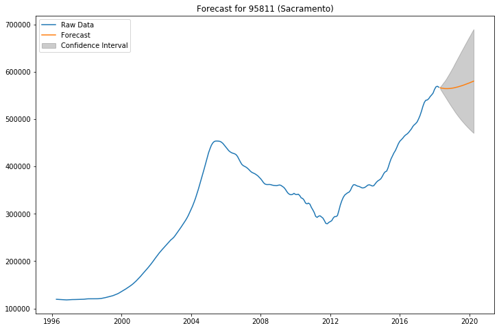


### Print summary of predicted, worst-case, and best-case scenarios


```python
sac_95811_pred, sac_95811_low, sac_95811_high = pred_best_worst(pred=forecasted_price_95811, low=forecasted_lower_95811, high=forecasted_upper_95811, last=last_value_95811, date='April 1, 2020')
sac_95811_pred, sac_95811_low, sac_95811_high
```

    By the model prediction, I would expect to see a 2.254% change in price by April 1, 2020.
    At the lower bound of the confidence interval, I would expect to see a -17.073% change in price by April 1, 2020.
    At the upper bound of the confidence interval, I would expect to see a 21.582% change in price by April 1, 2020.


    (2.254, -17.073, 21.582)


## Zip code 95811:  Don't invest--mediocre predicted returns with significant potential downside (but also significant potential upside)

By the model prediction, I would expect to see a 2.254% change in price by April 1, 2020.
At the lower bound of the confidence interval, I would expect to see a -17.073% change in price by April 1, 2020.
At the upper bound of the confidence interval, I would expect to see a 21.582% change in price by April 1, 2020.

# SacMetro:  95818 (Sacramento) -- Do not invest


```python
geog_area = '95818'
```


```python
ts_95818 = df_sac.loc[df_sac['Zip'] == geog_area]  # ts for all of the following functions should have only one zipcode
ts_95818.head()

```


<div>
<style scoped>
    .dataframe tbody tr th:only-of-type {
        vertical-align: middle;
    }

    .dataframe tbody tr th {
        vertical-align: top;
    }

    .dataframe thead th {
        text-align: right;
    }
</style>
<table border="1" class="dataframe">
  <thead>
    <tr style="text-align: right;">
      <th></th>
      <th>Metro</th>
      <th>MetroState</th>
      <th>CountyName</th>
      <th>City</th>
      <th>Zip</th>
      <th>SizeRank</th>
      <th>value</th>
    </tr>
    <tr>
      <th>time</th>
      <th></th>
      <th></th>
      <th></th>
      <th></th>
      <th></th>
      <th></th>
      <th></th>
    </tr>
  </thead>
  <tbody>
    <tr>
      <td>1996-04-01</td>
      <td>Sacramento</td>
      <td>Sacramento CA</td>
      <td>Sacramento</td>
      <td>Sacramento</td>
      <td>95818</td>
      <td>3941</td>
      <td>144000.0</td>
    </tr>
    <tr>
      <td>1996-05-01</td>
      <td>Sacramento</td>
      <td>Sacramento CA</td>
      <td>Sacramento</td>
      <td>Sacramento</td>
      <td>95818</td>
      <td>3941</td>
      <td>144300.0</td>
    </tr>
    <tr>
      <td>1996-06-01</td>
      <td>Sacramento</td>
      <td>Sacramento CA</td>
      <td>Sacramento</td>
      <td>Sacramento</td>
      <td>95818</td>
      <td>3941</td>
      <td>144500.0</td>
    </tr>
    <tr>
      <td>1996-07-01</td>
      <td>Sacramento</td>
      <td>Sacramento CA</td>
      <td>Sacramento</td>
      <td>Sacramento</td>
      <td>95818</td>
      <td>3941</td>
      <td>144500.0</td>
    </tr>
    <tr>
      <td>1996-08-01</td>
      <td>Sacramento</td>
      <td>Sacramento CA</td>
      <td>Sacramento</td>
      <td>Sacramento</td>
      <td>95818</td>
      <td>3941</td>
      <td>144600.0</td>
    </tr>
  </tbody>
</table>
</div>


```python
# ts.head()

ts_95818.head()
```


<div>
<style scoped>
    .dataframe tbody tr th:only-of-type {
        vertical-align: middle;
    }

    .dataframe tbody tr th {
        vertical-align: top;
    }

    .dataframe thead th {
        text-align: right;
    }
</style>
<table border="1" class="dataframe">
  <thead>
    <tr style="text-align: right;">
      <th></th>
      <th>Metro</th>
      <th>MetroState</th>
      <th>CountyName</th>
      <th>City</th>
      <th>Zip</th>
      <th>SizeRank</th>
      <th>value</th>
    </tr>
    <tr>
      <th>time</th>
      <th></th>
      <th></th>
      <th></th>
      <th></th>
      <th></th>
      <th></th>
      <th></th>
    </tr>
  </thead>
  <tbody>
    <tr>
      <td>1996-04-01</td>
      <td>Sacramento</td>
      <td>Sacramento CA</td>
      <td>Sacramento</td>
      <td>Sacramento</td>
      <td>95818</td>
      <td>3941</td>
      <td>144000.0</td>
    </tr>
    <tr>
      <td>1996-05-01</td>
      <td>Sacramento</td>
      <td>Sacramento CA</td>
      <td>Sacramento</td>
      <td>Sacramento</td>
      <td>95818</td>
      <td>3941</td>
      <td>144300.0</td>
    </tr>
    <tr>
      <td>1996-06-01</td>
      <td>Sacramento</td>
      <td>Sacramento CA</td>
      <td>Sacramento</td>
      <td>Sacramento</td>
      <td>95818</td>
      <td>3941</td>
      <td>144500.0</td>
    </tr>
    <tr>
      <td>1996-07-01</td>
      <td>Sacramento</td>
      <td>Sacramento CA</td>
      <td>Sacramento</td>
      <td>Sacramento</td>
      <td>95818</td>
      <td>3941</td>
      <td>144500.0</td>
    </tr>
    <tr>
      <td>1996-08-01</td>
      <td>Sacramento</td>
      <td>Sacramento CA</td>
      <td>Sacramento</td>
      <td>Sacramento</td>
      <td>95818</td>
      <td>3941</td>
      <td>144600.0</td>
    </tr>
  </tbody>
</table>
</div>


```python
# ts = ts.value

ts_95818_values = ts_95818.value
```


```python
# ts.head()

ts_95818_values.head()
```


    time
    1996-04-01    144000.0
    1996-05-01    144300.0
    1996-06-01    144500.0
    1996-07-01    144500.0
    1996-08-01    144600.0
    Name: value, dtype: float64


```python
ts_95818_values.tail()
```


    time
    2017-12-01    559100.0
    2018-01-01    564100.0
    2018-02-01    566100.0
    2018-03-01    565500.0
    2018-04-01    563900.0
    Name: value, dtype: float64


### Visualizations

#### plot_ts:  Plot zip code(s) of interest over time, with market highs and lows


```python
# fig, ax = plot_ts(df_melt, zipcodes=['95616', '92008', '90035', '90025', '60625', '57701'])  # enter desired zip code(s)

fig, ax = plot_ts_zips(df_melt, zipcodes=['95818'], figsize=(12,6))  # enter desired zip code(s)
```


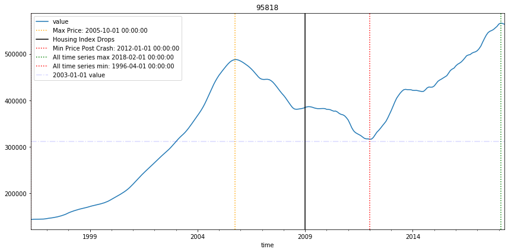


#### Boxplot of zip code


```python
# # note--check for SizeRank column and drop if needed

# fig = plt.figure(figsize=(18, 30))

# for i, zc in enumerate(sac_metro_zips[:48], start=1):
#     ax = fig.add_subplot(8,6,i)
#     ts = df_sac.loc[df_sac['Zip'] == zc]
#     ts.boxplot(column = 'value', ax = ax)
#     ax.set_title(f'{zc}')
#     fig.tight_layout()

ts_95818.boxplot(column = 'value')
plt.title('95818');
```


### Plot ACF and PACF for ts dataframe


```python
# plot_acf_pacf(ts, figsize=(10,6), lags=15)  # note that ts must only contain values and time as index

plot_acf_pacf(ts_95818_values, figsize=(10,6), lags=15)
```


### Plot seasonal decomposition for ts dataframe


```python
# plot_seasonal_decomp(ts)

plot_seasonal_decomp(ts_95818_values)

# Seasonality does not appear to be a significant factor in this zip code.
```


    (<Figure size 1296x432 with 1 Axes>,
     <matplotlib.axes._subplots.AxesSubplot at 0x1cc40c2048>)


## ARIMA model parameters and optimization

### Generate list of (p,d,q) and (p,d,q,m) values


```python
p_values = [0, 1, 2, 4, 6, 8]
d_values = range(0, 3)
q_values = range(0, 3)
warnings.filterwarnings("ignore")
```

### Run ARIMA model on ts dataframe with list of p,d,q values 


```python
# eval_arima_models(ts, p_values, d_values, q_values)  # don't run this until you have some time, since it take time
# note that ts must only contain values and time as index

# eval_arima_models(ts_95818_values, p_values, d_values, q_values)  # don't run this until you have some time, since it takes time

```

### Generate model fit summary


```python
# model_fit = arima_zipcode(ts, order = None)   # change order = tuple to correspond to the best MSE produced by previous function

# Best ARIMA(6, 2, 2) MSE=2089095.204

model_fit_95818 = arima_zipcode(ts_95818_values, order = (6,2,2))

```

                                 ARIMA Model Results                              
    ==============================================================================
    Dep. Variable:                   D2.y   No. Observations:                  263
    Model:                 ARIMA(6, 2, 2)   Log Likelihood               -2135.127
    Method:                       css-mle   S.D. of innovations            798.928
    Date:                Tue, 10 Mar 2020   AIC                           4290.255
    Time:                        22:27:30   BIC                           4325.976
    Sample:                             2   HQIC                          4304.611
                                                                                  
    ==============================================================================
                     coef    std err          z      P>|z|      [0.025      0.975]
    ------------------------------------------------------------------------------
    const         -1.7133     60.933     -0.028      0.978    -121.140     117.713
    ar.L1.D2.y    -1.0734      0.060    -17.791      0.000      -1.192      -0.955
    ar.L2.D2.y    -0.3557      0.089     -4.008      0.000      -0.530      -0.182
    ar.L3.D2.y    -0.1159      0.093     -1.242      0.215      -0.299       0.067
    ar.L4.D2.y    -0.1125      0.094     -1.201      0.231      -0.296       0.071
    ar.L5.D2.y    -0.1450      0.091     -1.591      0.113      -0.324       0.034
    ar.L6.D2.y    -0.2338      0.063     -3.687      0.000      -0.358      -0.110
    ma.L1.D2.y     1.7464        nan        nan        nan         nan         nan
    ma.L2.D2.y     1.0000        nan        nan        nan         nan         nan
                                        Roots                                    
    =============================================================================
                      Real          Imaginary           Modulus         Frequency
    -----------------------------------------------------------------------------
    AR.1           -1.0215           -0.3865j            1.0922           -0.4424
    AR.2           -1.0215           +0.3865j            1.0922            0.4424
    AR.3           -0.3703           -1.2730j            1.3258           -0.2950
    AR.4           -0.3703           +1.2730j            1.3258            0.2950
    AR.5            1.0817           -0.9326j            1.4282           -0.1132
    AR.6            1.0817           +0.9326j            1.4282            0.1132
    MA.1           -0.8732           -0.4873j            1.0000           -0.4190
    MA.2           -0.8732           +0.4873j            1.0000            0.4190
    -----------------------------------------------------------------------------


## ARIMA modeling results:  predictions and visualization

### Produce forecasts from ARIMA model fit


```python
actual_forecast_95818, std_error_95818, forecast_confint_95818 = forecast(model_fit_95818)

```


```python
actual_forecast_95818, std_error_95818, forecast_confint_95818
```


    (array([563382.30595232, 562301.60251996, 561904.3217046 , 562034.03664193,
            562046.20258916, 562052.88825408, 561792.65041341, 561802.56922834,
            561389.89581157, 561254.90778257, 560993.97039577, 560822.82330882,
            560633.49190598, 560407.9995849 , 560284.90064736, 560004.89080128,
            559874.35234603, 559607.82550606, 559445.06081214, 559208.02463597,
            559006.35529787, 558806.22941695, 558568.36659644, 558386.26823418]),
     array([  798.92751863,  2280.09997897,  4101.84191417,  6064.6172193 ,
             8273.10615941, 10573.83501693, 12958.2819509 , 15453.66698814,
            18088.32613556, 20856.25142323, 23746.07325217, 26780.19146086,
            29925.376759  , 33190.23225084, 36558.79511573, 40036.8786606 ,
            43614.94788498, 47291.90088301, 51069.53127467, 54939.01662139,
            58904.9927732 , 62958.62709326, 67103.95428575, 71334.08864087]),
     array([[561816.43678956, 564948.17511509],
            [557832.68868002, 566770.5163599 ],
            [553864.85928255, 569943.78412664],
            [550147.60531208, 573920.46797179],
            [545831.21247644, 578261.19270188],
            [541328.55244244, 582777.22406573],
            [536394.88448812, 587190.41633869],
            [531513.9385025 , 592091.19995417],
            [525937.42804525, 596842.36357789],
            [520377.40614054, 602132.4094246 ],
            [514452.52204727, 607535.41874427],
            [508334.61254645, 613311.0340712 ],
            [501980.83123456, 619286.15257741],
            [495356.33973474, 625459.65943507],
            [488630.97890236, 631938.82239236],
            [481534.0505731 , 638475.73102945],
            [474390.62530388, 645358.07938818],
            [466917.40301492, 652298.24799719],
            [459350.61880645, 659539.50281783],
            [451529.53071199, 666886.51855994],
            [443554.69095281, 674458.01964293],
            [435409.58779808, 682202.87103583],
            [427047.03297615, 690089.70021672],
            [418574.02362808, 698198.51284028]]))


### Create dataframe to hold forecast results


```python
# df_forecast = forecast_df(col = 'time', daterange = pd.date_range(start='2018-05-01', end='2020-04-01', freq='MS'), 
#                 actual_forecast=actual_forecast, forecast_confint = forecast_confint)

df_forecast_95818 = forecast_df(actual_forecast_95818, forecast_confint_95818, col = 'time', daterange = pd.date_range(start='2018-05-01', end='2020-04-01', freq='MS'))

```

### Create new dataframe concatenating historic values and forecast results


```python
# df_new = concat_values_forecast(ts, df_forecast)

df_new_95818 = concat_values_forecast(ts_95818_values, df_forecast_95818)
```


```python
df_new_95818
```


<div>
<style scoped>
    .dataframe tbody tr th:only-of-type {
        vertical-align: middle;
    }

    .dataframe tbody tr th {
        vertical-align: top;
    }

    .dataframe thead th {
        text-align: right;
    }
</style>
<table border="1" class="dataframe">
  <thead>
    <tr style="text-align: right;">
      <th></th>
      <th>value</th>
      <th>forecast</th>
      <th>forecast_lower</th>
      <th>forecast_upper</th>
    </tr>
    <tr>
      <th>time</th>
      <th></th>
      <th></th>
      <th></th>
      <th></th>
    </tr>
  </thead>
  <tbody>
    <tr>
      <td>1996-04-01</td>
      <td>144000.0</td>
      <td>NaN</td>
      <td>NaN</td>
      <td>NaN</td>
    </tr>
    <tr>
      <td>1996-05-01</td>
      <td>144300.0</td>
      <td>NaN</td>
      <td>NaN</td>
      <td>NaN</td>
    </tr>
    <tr>
      <td>1996-06-01</td>
      <td>144500.0</td>
      <td>NaN</td>
      <td>NaN</td>
      <td>NaN</td>
    </tr>
    <tr>
      <td>1996-07-01</td>
      <td>144500.0</td>
      <td>NaN</td>
      <td>NaN</td>
      <td>NaN</td>
    </tr>
    <tr>
      <td>1996-08-01</td>
      <td>144600.0</td>
      <td>NaN</td>
      <td>NaN</td>
      <td>NaN</td>
    </tr>
    <tr>
      <td>1996-09-01</td>
      <td>144700.0</td>
      <td>NaN</td>
      <td>NaN</td>
      <td>NaN</td>
    </tr>
    <tr>
      <td>1996-10-01</td>
      <td>144800.0</td>
      <td>NaN</td>
      <td>NaN</td>
      <td>NaN</td>
    </tr>
    <tr>
      <td>1996-11-01</td>
      <td>144900.0</td>
      <td>NaN</td>
      <td>NaN</td>
      <td>NaN</td>
    </tr>
    <tr>
      <td>1996-12-01</td>
      <td>145300.0</td>
      <td>NaN</td>
      <td>NaN</td>
      <td>NaN</td>
    </tr>
    <tr>
      <td>1997-01-01</td>
      <td>146000.0</td>
      <td>NaN</td>
      <td>NaN</td>
      <td>NaN</td>
    </tr>
    <tr>
      <td>1997-02-01</td>
      <td>146600.0</td>
      <td>NaN</td>
      <td>NaN</td>
      <td>NaN</td>
    </tr>
    <tr>
      <td>1997-03-01</td>
      <td>147100.0</td>
      <td>NaN</td>
      <td>NaN</td>
      <td>NaN</td>
    </tr>
    <tr>
      <td>1997-04-01</td>
      <td>147600.0</td>
      <td>NaN</td>
      <td>NaN</td>
      <td>NaN</td>
    </tr>
    <tr>
      <td>1997-05-01</td>
      <td>148300.0</td>
      <td>NaN</td>
      <td>NaN</td>
      <td>NaN</td>
    </tr>
    <tr>
      <td>1997-06-01</td>
      <td>149000.0</td>
      <td>NaN</td>
      <td>NaN</td>
      <td>NaN</td>
    </tr>
    <tr>
      <td>1997-07-01</td>
      <td>149800.0</td>
      <td>NaN</td>
      <td>NaN</td>
      <td>NaN</td>
    </tr>
    <tr>
      <td>1997-08-01</td>
      <td>150800.0</td>
      <td>NaN</td>
      <td>NaN</td>
      <td>NaN</td>
    </tr>
    <tr>
      <td>1997-09-01</td>
      <td>151900.0</td>
      <td>NaN</td>
      <td>NaN</td>
      <td>NaN</td>
    </tr>
    <tr>
      <td>1997-10-01</td>
      <td>153200.0</td>
      <td>NaN</td>
      <td>NaN</td>
      <td>NaN</td>
    </tr>
    <tr>
      <td>1997-11-01</td>
      <td>154500.0</td>
      <td>NaN</td>
      <td>NaN</td>
      <td>NaN</td>
    </tr>
    <tr>
      <td>1997-12-01</td>
      <td>156200.0</td>
      <td>NaN</td>
      <td>NaN</td>
      <td>NaN</td>
    </tr>
    <tr>
      <td>1998-01-01</td>
      <td>158100.0</td>
      <td>NaN</td>
      <td>NaN</td>
      <td>NaN</td>
    </tr>
    <tr>
      <td>1998-02-01</td>
      <td>159700.0</td>
      <td>NaN</td>
      <td>NaN</td>
      <td>NaN</td>
    </tr>
    <tr>
      <td>1998-03-01</td>
      <td>161100.0</td>
      <td>NaN</td>
      <td>NaN</td>
      <td>NaN</td>
    </tr>
    <tr>
      <td>1998-04-01</td>
      <td>162500.0</td>
      <td>NaN</td>
      <td>NaN</td>
      <td>NaN</td>
    </tr>
    <tr>
      <td>1998-05-01</td>
      <td>163700.0</td>
      <td>NaN</td>
      <td>NaN</td>
      <td>NaN</td>
    </tr>
    <tr>
      <td>1998-06-01</td>
      <td>164900.0</td>
      <td>NaN</td>
      <td>NaN</td>
      <td>NaN</td>
    </tr>
    <tr>
      <td>1998-07-01</td>
      <td>166000.0</td>
      <td>NaN</td>
      <td>NaN</td>
      <td>NaN</td>
    </tr>
    <tr>
      <td>1998-08-01</td>
      <td>167000.0</td>
      <td>NaN</td>
      <td>NaN</td>
      <td>NaN</td>
    </tr>
    <tr>
      <td>1998-09-01</td>
      <td>167900.0</td>
      <td>NaN</td>
      <td>NaN</td>
      <td>NaN</td>
    </tr>
    <tr>
      <td>1998-10-01</td>
      <td>168800.0</td>
      <td>NaN</td>
      <td>NaN</td>
      <td>NaN</td>
    </tr>
    <tr>
      <td>1998-11-01</td>
      <td>169700.0</td>
      <td>NaN</td>
      <td>NaN</td>
      <td>NaN</td>
    </tr>
    <tr>
      <td>1998-12-01</td>
      <td>170800.0</td>
      <td>NaN</td>
      <td>NaN</td>
      <td>NaN</td>
    </tr>
    <tr>
      <td>1999-01-01</td>
      <td>172000.0</td>
      <td>NaN</td>
      <td>NaN</td>
      <td>NaN</td>
    </tr>
    <tr>
      <td>1999-02-01</td>
      <td>173000.0</td>
      <td>NaN</td>
      <td>NaN</td>
      <td>NaN</td>
    </tr>
    <tr>
      <td>1999-03-01</td>
      <td>173900.0</td>
      <td>NaN</td>
      <td>NaN</td>
      <td>NaN</td>
    </tr>
    <tr>
      <td>1999-04-01</td>
      <td>174800.0</td>
      <td>NaN</td>
      <td>NaN</td>
      <td>NaN</td>
    </tr>
    <tr>
      <td>1999-05-01</td>
      <td>175700.0</td>
      <td>NaN</td>
      <td>NaN</td>
      <td>NaN</td>
    </tr>
    <tr>
      <td>1999-06-01</td>
      <td>176700.0</td>
      <td>NaN</td>
      <td>NaN</td>
      <td>NaN</td>
    </tr>
    <tr>
      <td>1999-07-01</td>
      <td>177600.0</td>
      <td>NaN</td>
      <td>NaN</td>
      <td>NaN</td>
    </tr>
    <tr>
      <td>1999-08-01</td>
      <td>178700.0</td>
      <td>NaN</td>
      <td>NaN</td>
      <td>NaN</td>
    </tr>
    <tr>
      <td>1999-09-01</td>
      <td>179900.0</td>
      <td>NaN</td>
      <td>NaN</td>
      <td>NaN</td>
    </tr>
    <tr>
      <td>1999-10-01</td>
      <td>181400.0</td>
      <td>NaN</td>
      <td>NaN</td>
      <td>NaN</td>
    </tr>
    <tr>
      <td>1999-11-01</td>
      <td>183000.0</td>
      <td>NaN</td>
      <td>NaN</td>
      <td>NaN</td>
    </tr>
    <tr>
      <td>1999-12-01</td>
      <td>185000.0</td>
      <td>NaN</td>
      <td>NaN</td>
      <td>NaN</td>
    </tr>
    <tr>
      <td>2000-01-01</td>
      <td>187200.0</td>
      <td>NaN</td>
      <td>NaN</td>
      <td>NaN</td>
    </tr>
    <tr>
      <td>2000-02-01</td>
      <td>189400.0</td>
      <td>NaN</td>
      <td>NaN</td>
      <td>NaN</td>
    </tr>
    <tr>
      <td>2000-03-01</td>
      <td>191500.0</td>
      <td>NaN</td>
      <td>NaN</td>
      <td>NaN</td>
    </tr>
    <tr>
      <td>2000-04-01</td>
      <td>193700.0</td>
      <td>NaN</td>
      <td>NaN</td>
      <td>NaN</td>
    </tr>
    <tr>
      <td>2000-05-01</td>
      <td>195900.0</td>
      <td>NaN</td>
      <td>NaN</td>
      <td>NaN</td>
    </tr>
    <tr>
      <td>2000-06-01</td>
      <td>198200.0</td>
      <td>NaN</td>
      <td>NaN</td>
      <td>NaN</td>
    </tr>
    <tr>
      <td>2000-07-01</td>
      <td>200600.0</td>
      <td>NaN</td>
      <td>NaN</td>
      <td>NaN</td>
    </tr>
    <tr>
      <td>2000-08-01</td>
      <td>203100.0</td>
      <td>NaN</td>
      <td>NaN</td>
      <td>NaN</td>
    </tr>
    <tr>
      <td>2000-09-01</td>
      <td>205800.0</td>
      <td>NaN</td>
      <td>NaN</td>
      <td>NaN</td>
    </tr>
    <tr>
      <td>2000-10-01</td>
      <td>208800.0</td>
      <td>NaN</td>
      <td>NaN</td>
      <td>NaN</td>
    </tr>
    <tr>
      <td>2000-11-01</td>
      <td>212100.0</td>
      <td>NaN</td>
      <td>NaN</td>
      <td>NaN</td>
    </tr>
    <tr>
      <td>2000-12-01</td>
      <td>215900.0</td>
      <td>NaN</td>
      <td>NaN</td>
      <td>NaN</td>
    </tr>
    <tr>
      <td>2001-01-01</td>
      <td>219800.0</td>
      <td>NaN</td>
      <td>NaN</td>
      <td>NaN</td>
    </tr>
    <tr>
      <td>2001-02-01</td>
      <td>223900.0</td>
      <td>NaN</td>
      <td>NaN</td>
      <td>NaN</td>
    </tr>
    <tr>
      <td>2001-03-01</td>
      <td>227900.0</td>
      <td>NaN</td>
      <td>NaN</td>
      <td>NaN</td>
    </tr>
    <tr>
      <td>2001-04-01</td>
      <td>232100.0</td>
      <td>NaN</td>
      <td>NaN</td>
      <td>NaN</td>
    </tr>
    <tr>
      <td>2001-05-01</td>
      <td>236300.0</td>
      <td>NaN</td>
      <td>NaN</td>
      <td>NaN</td>
    </tr>
    <tr>
      <td>2001-06-01</td>
      <td>240300.0</td>
      <td>NaN</td>
      <td>NaN</td>
      <td>NaN</td>
    </tr>
    <tr>
      <td>2001-07-01</td>
      <td>244100.0</td>
      <td>NaN</td>
      <td>NaN</td>
      <td>NaN</td>
    </tr>
    <tr>
      <td>2001-08-01</td>
      <td>247800.0</td>
      <td>NaN</td>
      <td>NaN</td>
      <td>NaN</td>
    </tr>
    <tr>
      <td>2001-09-01</td>
      <td>251400.0</td>
      <td>NaN</td>
      <td>NaN</td>
      <td>NaN</td>
    </tr>
    <tr>
      <td>2001-10-01</td>
      <td>255000.0</td>
      <td>NaN</td>
      <td>NaN</td>
      <td>NaN</td>
    </tr>
    <tr>
      <td>2001-11-01</td>
      <td>258600.0</td>
      <td>NaN</td>
      <td>NaN</td>
      <td>NaN</td>
    </tr>
    <tr>
      <td>2001-12-01</td>
      <td>262300.0</td>
      <td>NaN</td>
      <td>NaN</td>
      <td>NaN</td>
    </tr>
    <tr>
      <td>2002-01-01</td>
      <td>266000.0</td>
      <td>NaN</td>
      <td>NaN</td>
      <td>NaN</td>
    </tr>
    <tr>
      <td>2002-02-01</td>
      <td>269700.0</td>
      <td>NaN</td>
      <td>NaN</td>
      <td>NaN</td>
    </tr>
    <tr>
      <td>2002-03-01</td>
      <td>273400.0</td>
      <td>NaN</td>
      <td>NaN</td>
      <td>NaN</td>
    </tr>
    <tr>
      <td>2002-04-01</td>
      <td>277100.0</td>
      <td>NaN</td>
      <td>NaN</td>
      <td>NaN</td>
    </tr>
    <tr>
      <td>2002-05-01</td>
      <td>280700.0</td>
      <td>NaN</td>
      <td>NaN</td>
      <td>NaN</td>
    </tr>
    <tr>
      <td>2002-06-01</td>
      <td>284200.0</td>
      <td>NaN</td>
      <td>NaN</td>
      <td>NaN</td>
    </tr>
    <tr>
      <td>2002-07-01</td>
      <td>287600.0</td>
      <td>NaN</td>
      <td>NaN</td>
      <td>NaN</td>
    </tr>
    <tr>
      <td>2002-08-01</td>
      <td>291100.0</td>
      <td>NaN</td>
      <td>NaN</td>
      <td>NaN</td>
    </tr>
    <tr>
      <td>2002-09-01</td>
      <td>294600.0</td>
      <td>NaN</td>
      <td>NaN</td>
      <td>NaN</td>
    </tr>
    <tr>
      <td>2002-10-01</td>
      <td>298500.0</td>
      <td>NaN</td>
      <td>NaN</td>
      <td>NaN</td>
    </tr>
    <tr>
      <td>2002-11-01</td>
      <td>302700.0</td>
      <td>NaN</td>
      <td>NaN</td>
      <td>NaN</td>
    </tr>
    <tr>
      <td>2002-12-01</td>
      <td>307100.0</td>
      <td>NaN</td>
      <td>NaN</td>
      <td>NaN</td>
    </tr>
    <tr>
      <td>2003-01-01</td>
      <td>311500.0</td>
      <td>NaN</td>
      <td>NaN</td>
      <td>NaN</td>
    </tr>
    <tr>
      <td>2003-02-01</td>
      <td>315900.0</td>
      <td>NaN</td>
      <td>NaN</td>
      <td>NaN</td>
    </tr>
    <tr>
      <td>2003-03-01</td>
      <td>320000.0</td>
      <td>NaN</td>
      <td>NaN</td>
      <td>NaN</td>
    </tr>
    <tr>
      <td>2003-04-01</td>
      <td>323700.0</td>
      <td>NaN</td>
      <td>NaN</td>
      <td>NaN</td>
    </tr>
    <tr>
      <td>2003-05-01</td>
      <td>327200.0</td>
      <td>NaN</td>
      <td>NaN</td>
      <td>NaN</td>
    </tr>
    <tr>
      <td>2003-06-01</td>
      <td>331000.0</td>
      <td>NaN</td>
      <td>NaN</td>
      <td>NaN</td>
    </tr>
    <tr>
      <td>2003-07-01</td>
      <td>335500.0</td>
      <td>NaN</td>
      <td>NaN</td>
      <td>NaN</td>
    </tr>
    <tr>
      <td>2003-08-01</td>
      <td>340300.0</td>
      <td>NaN</td>
      <td>NaN</td>
      <td>NaN</td>
    </tr>
    <tr>
      <td>2003-09-01</td>
      <td>345500.0</td>
      <td>NaN</td>
      <td>NaN</td>
      <td>NaN</td>
    </tr>
    <tr>
      <td>2003-10-01</td>
      <td>350900.0</td>
      <td>NaN</td>
      <td>NaN</td>
      <td>NaN</td>
    </tr>
    <tr>
      <td>2003-11-01</td>
      <td>356400.0</td>
      <td>NaN</td>
      <td>NaN</td>
      <td>NaN</td>
    </tr>
    <tr>
      <td>2003-12-01</td>
      <td>361800.0</td>
      <td>NaN</td>
      <td>NaN</td>
      <td>NaN</td>
    </tr>
    <tr>
      <td>2004-01-01</td>
      <td>367300.0</td>
      <td>NaN</td>
      <td>NaN</td>
      <td>NaN</td>
    </tr>
    <tr>
      <td>2004-02-01</td>
      <td>372900.0</td>
      <td>NaN</td>
      <td>NaN</td>
      <td>NaN</td>
    </tr>
    <tr>
      <td>2004-03-01</td>
      <td>378700.0</td>
      <td>NaN</td>
      <td>NaN</td>
      <td>NaN</td>
    </tr>
    <tr>
      <td>2004-04-01</td>
      <td>385200.0</td>
      <td>NaN</td>
      <td>NaN</td>
      <td>NaN</td>
    </tr>
    <tr>
      <td>2004-05-01</td>
      <td>392400.0</td>
      <td>NaN</td>
      <td>NaN</td>
      <td>NaN</td>
    </tr>
    <tr>
      <td>2004-06-01</td>
      <td>400500.0</td>
      <td>NaN</td>
      <td>NaN</td>
      <td>NaN</td>
    </tr>
    <tr>
      <td>2004-07-01</td>
      <td>409000.0</td>
      <td>NaN</td>
      <td>NaN</td>
      <td>NaN</td>
    </tr>
    <tr>
      <td>2004-08-01</td>
      <td>417600.0</td>
      <td>NaN</td>
      <td>NaN</td>
      <td>NaN</td>
    </tr>
    <tr>
      <td>2004-09-01</td>
      <td>426000.0</td>
      <td>NaN</td>
      <td>NaN</td>
      <td>NaN</td>
    </tr>
    <tr>
      <td>2004-10-01</td>
      <td>434200.0</td>
      <td>NaN</td>
      <td>NaN</td>
      <td>NaN</td>
    </tr>
    <tr>
      <td>2004-11-01</td>
      <td>441600.0</td>
      <td>NaN</td>
      <td>NaN</td>
      <td>NaN</td>
    </tr>
    <tr>
      <td>2004-12-01</td>
      <td>448200.0</td>
      <td>NaN</td>
      <td>NaN</td>
      <td>NaN</td>
    </tr>
    <tr>
      <td>2005-01-01</td>
      <td>454200.0</td>
      <td>NaN</td>
      <td>NaN</td>
      <td>NaN</td>
    </tr>
    <tr>
      <td>2005-02-01</td>
      <td>459400.0</td>
      <td>NaN</td>
      <td>NaN</td>
      <td>NaN</td>
    </tr>
    <tr>
      <td>2005-03-01</td>
      <td>464400.0</td>
      <td>NaN</td>
      <td>NaN</td>
      <td>NaN</td>
    </tr>
    <tr>
      <td>2005-04-01</td>
      <td>469300.0</td>
      <td>NaN</td>
      <td>NaN</td>
      <td>NaN</td>
    </tr>
    <tr>
      <td>2005-05-01</td>
      <td>474000.0</td>
      <td>NaN</td>
      <td>NaN</td>
      <td>NaN</td>
    </tr>
    <tr>
      <td>2005-06-01</td>
      <td>478400.0</td>
      <td>NaN</td>
      <td>NaN</td>
      <td>NaN</td>
    </tr>
    <tr>
      <td>2005-07-01</td>
      <td>482200.0</td>
      <td>NaN</td>
      <td>NaN</td>
      <td>NaN</td>
    </tr>
    <tr>
      <td>2005-08-01</td>
      <td>485100.0</td>
      <td>NaN</td>
      <td>NaN</td>
      <td>NaN</td>
    </tr>
    <tr>
      <td>2005-09-01</td>
      <td>486900.0</td>
      <td>NaN</td>
      <td>NaN</td>
      <td>NaN</td>
    </tr>
    <tr>
      <td>2005-10-01</td>
      <td>487800.0</td>
      <td>NaN</td>
      <td>NaN</td>
      <td>NaN</td>
    </tr>
    <tr>
      <td>2005-11-01</td>
      <td>487600.0</td>
      <td>NaN</td>
      <td>NaN</td>
      <td>NaN</td>
    </tr>
    <tr>
      <td>2005-12-01</td>
      <td>486400.0</td>
      <td>NaN</td>
      <td>NaN</td>
      <td>NaN</td>
    </tr>
    <tr>
      <td>2006-01-01</td>
      <td>484600.0</td>
      <td>NaN</td>
      <td>NaN</td>
      <td>NaN</td>
    </tr>
    <tr>
      <td>2006-02-01</td>
      <td>482400.0</td>
      <td>NaN</td>
      <td>NaN</td>
      <td>NaN</td>
    </tr>
    <tr>
      <td>2006-03-01</td>
      <td>479900.0</td>
      <td>NaN</td>
      <td>NaN</td>
      <td>NaN</td>
    </tr>
    <tr>
      <td>2006-04-01</td>
      <td>477200.0</td>
      <td>NaN</td>
      <td>NaN</td>
      <td>NaN</td>
    </tr>
    <tr>
      <td>2006-05-01</td>
      <td>474400.0</td>
      <td>NaN</td>
      <td>NaN</td>
      <td>NaN</td>
    </tr>
    <tr>
      <td>2006-06-01</td>
      <td>471200.0</td>
      <td>NaN</td>
      <td>NaN</td>
      <td>NaN</td>
    </tr>
    <tr>
      <td>2006-07-01</td>
      <td>467600.0</td>
      <td>NaN</td>
      <td>NaN</td>
      <td>NaN</td>
    </tr>
    <tr>
      <td>2006-08-01</td>
      <td>463600.0</td>
      <td>NaN</td>
      <td>NaN</td>
      <td>NaN</td>
    </tr>
    <tr>
      <td>2006-09-01</td>
      <td>459200.0</td>
      <td>NaN</td>
      <td>NaN</td>
      <td>NaN</td>
    </tr>
    <tr>
      <td>2006-10-01</td>
      <td>454600.0</td>
      <td>NaN</td>
      <td>NaN</td>
      <td>NaN</td>
    </tr>
    <tr>
      <td>2006-11-01</td>
      <td>450200.0</td>
      <td>NaN</td>
      <td>NaN</td>
      <td>NaN</td>
    </tr>
    <tr>
      <td>2006-12-01</td>
      <td>446900.0</td>
      <td>NaN</td>
      <td>NaN</td>
      <td>NaN</td>
    </tr>
    <tr>
      <td>2007-01-01</td>
      <td>445400.0</td>
      <td>NaN</td>
      <td>NaN</td>
      <td>NaN</td>
    </tr>
    <tr>
      <td>2007-02-01</td>
      <td>445000.0</td>
      <td>NaN</td>
      <td>NaN</td>
      <td>NaN</td>
    </tr>
    <tr>
      <td>2007-03-01</td>
      <td>445300.0</td>
      <td>NaN</td>
      <td>NaN</td>
      <td>NaN</td>
    </tr>
    <tr>
      <td>2007-04-01</td>
      <td>445400.0</td>
      <td>NaN</td>
      <td>NaN</td>
      <td>NaN</td>
    </tr>
    <tr>
      <td>2007-05-01</td>
      <td>444600.0</td>
      <td>NaN</td>
      <td>NaN</td>
      <td>NaN</td>
    </tr>
    <tr>
      <td>2007-06-01</td>
      <td>442400.0</td>
      <td>NaN</td>
      <td>NaN</td>
      <td>NaN</td>
    </tr>
    <tr>
      <td>2007-07-01</td>
      <td>439200.0</td>
      <td>NaN</td>
      <td>NaN</td>
      <td>NaN</td>
    </tr>
    <tr>
      <td>2007-08-01</td>
      <td>434900.0</td>
      <td>NaN</td>
      <td>NaN</td>
      <td>NaN</td>
    </tr>
    <tr>
      <td>2007-09-01</td>
      <td>430100.0</td>
      <td>NaN</td>
      <td>NaN</td>
      <td>NaN</td>
    </tr>
    <tr>
      <td>2007-10-01</td>
      <td>424900.0</td>
      <td>NaN</td>
      <td>NaN</td>
      <td>NaN</td>
    </tr>
    <tr>
      <td>2007-11-01</td>
      <td>419900.0</td>
      <td>NaN</td>
      <td>NaN</td>
      <td>NaN</td>
    </tr>
    <tr>
      <td>2007-12-01</td>
      <td>415100.0</td>
      <td>NaN</td>
      <td>NaN</td>
      <td>NaN</td>
    </tr>
    <tr>
      <td>2008-01-01</td>
      <td>410800.0</td>
      <td>NaN</td>
      <td>NaN</td>
      <td>NaN</td>
    </tr>
    <tr>
      <td>2008-02-01</td>
      <td>405900.0</td>
      <td>NaN</td>
      <td>NaN</td>
      <td>NaN</td>
    </tr>
    <tr>
      <td>2008-03-01</td>
      <td>400400.0</td>
      <td>NaN</td>
      <td>NaN</td>
      <td>NaN</td>
    </tr>
    <tr>
      <td>2008-04-01</td>
      <td>394800.0</td>
      <td>NaN</td>
      <td>NaN</td>
      <td>NaN</td>
    </tr>
    <tr>
      <td>2008-05-01</td>
      <td>389300.0</td>
      <td>NaN</td>
      <td>NaN</td>
      <td>NaN</td>
    </tr>
    <tr>
      <td>2008-06-01</td>
      <td>384400.0</td>
      <td>NaN</td>
      <td>NaN</td>
      <td>NaN</td>
    </tr>
    <tr>
      <td>2008-07-01</td>
      <td>381600.0</td>
      <td>NaN</td>
      <td>NaN</td>
      <td>NaN</td>
    </tr>
    <tr>
      <td>2008-08-01</td>
      <td>380900.0</td>
      <td>NaN</td>
      <td>NaN</td>
      <td>NaN</td>
    </tr>
    <tr>
      <td>2008-09-01</td>
      <td>381200.0</td>
      <td>NaN</td>
      <td>NaN</td>
      <td>NaN</td>
    </tr>
    <tr>
      <td>2008-10-01</td>
      <td>381800.0</td>
      <td>NaN</td>
      <td>NaN</td>
      <td>NaN</td>
    </tr>
    <tr>
      <td>2008-11-01</td>
      <td>382400.0</td>
      <td>NaN</td>
      <td>NaN</td>
      <td>NaN</td>
    </tr>
    <tr>
      <td>2008-12-01</td>
      <td>383300.0</td>
      <td>NaN</td>
      <td>NaN</td>
      <td>NaN</td>
    </tr>
    <tr>
      <td>2009-01-01</td>
      <td>384900.0</td>
      <td>NaN</td>
      <td>NaN</td>
      <td>NaN</td>
    </tr>
    <tr>
      <td>2009-02-01</td>
      <td>386100.0</td>
      <td>NaN</td>
      <td>NaN</td>
      <td>NaN</td>
    </tr>
    <tr>
      <td>2009-03-01</td>
      <td>386600.0</td>
      <td>NaN</td>
      <td>NaN</td>
      <td>NaN</td>
    </tr>
    <tr>
      <td>2009-04-01</td>
      <td>386200.0</td>
      <td>NaN</td>
      <td>NaN</td>
      <td>NaN</td>
    </tr>
    <tr>
      <td>2009-05-01</td>
      <td>385300.0</td>
      <td>NaN</td>
      <td>NaN</td>
      <td>NaN</td>
    </tr>
    <tr>
      <td>2009-06-01</td>
      <td>383900.0</td>
      <td>NaN</td>
      <td>NaN</td>
      <td>NaN</td>
    </tr>
    <tr>
      <td>2009-07-01</td>
      <td>382900.0</td>
      <td>NaN</td>
      <td>NaN</td>
      <td>NaN</td>
    </tr>
    <tr>
      <td>2009-08-01</td>
      <td>382300.0</td>
      <td>NaN</td>
      <td>NaN</td>
      <td>NaN</td>
    </tr>
    <tr>
      <td>2009-09-01</td>
      <td>382300.0</td>
      <td>NaN</td>
      <td>NaN</td>
      <td>NaN</td>
    </tr>
    <tr>
      <td>2009-10-01</td>
      <td>382500.0</td>
      <td>NaN</td>
      <td>NaN</td>
      <td>NaN</td>
    </tr>
    <tr>
      <td>2009-11-01</td>
      <td>382600.0</td>
      <td>NaN</td>
      <td>NaN</td>
      <td>NaN</td>
    </tr>
    <tr>
      <td>2009-12-01</td>
      <td>382400.0</td>
      <td>NaN</td>
      <td>NaN</td>
      <td>NaN</td>
    </tr>
    <tr>
      <td>2010-01-01</td>
      <td>380800.0</td>
      <td>NaN</td>
      <td>NaN</td>
      <td>NaN</td>
    </tr>
    <tr>
      <td>2010-02-01</td>
      <td>380600.0</td>
      <td>NaN</td>
      <td>NaN</td>
      <td>NaN</td>
    </tr>
    <tr>
      <td>2010-03-01</td>
      <td>380000.0</td>
      <td>NaN</td>
      <td>NaN</td>
      <td>NaN</td>
    </tr>
    <tr>
      <td>2010-04-01</td>
      <td>378200.0</td>
      <td>NaN</td>
      <td>NaN</td>
      <td>NaN</td>
    </tr>
    <tr>
      <td>2010-05-01</td>
      <td>376800.0</td>
      <td>NaN</td>
      <td>NaN</td>
      <td>NaN</td>
    </tr>
    <tr>
      <td>2010-06-01</td>
      <td>377100.0</td>
      <td>NaN</td>
      <td>NaN</td>
      <td>NaN</td>
    </tr>
    <tr>
      <td>2010-07-01</td>
      <td>375100.0</td>
      <td>NaN</td>
      <td>NaN</td>
      <td>NaN</td>
    </tr>
    <tr>
      <td>2010-08-01</td>
      <td>372000.0</td>
      <td>NaN</td>
      <td>NaN</td>
      <td>NaN</td>
    </tr>
    <tr>
      <td>2010-09-01</td>
      <td>370000.0</td>
      <td>NaN</td>
      <td>NaN</td>
      <td>NaN</td>
    </tr>
    <tr>
      <td>2010-10-01</td>
      <td>369100.0</td>
      <td>NaN</td>
      <td>NaN</td>
      <td>NaN</td>
    </tr>
    <tr>
      <td>2010-11-01</td>
      <td>366900.0</td>
      <td>NaN</td>
      <td>NaN</td>
      <td>NaN</td>
    </tr>
    <tr>
      <td>2010-12-01</td>
      <td>362900.0</td>
      <td>NaN</td>
      <td>NaN</td>
      <td>NaN</td>
    </tr>
    <tr>
      <td>2011-01-01</td>
      <td>357800.0</td>
      <td>NaN</td>
      <td>NaN</td>
      <td>NaN</td>
    </tr>
    <tr>
      <td>2011-02-01</td>
      <td>349800.0</td>
      <td>NaN</td>
      <td>NaN</td>
      <td>NaN</td>
    </tr>
    <tr>
      <td>2011-03-01</td>
      <td>341200.0</td>
      <td>NaN</td>
      <td>NaN</td>
      <td>NaN</td>
    </tr>
    <tr>
      <td>2011-04-01</td>
      <td>334800.0</td>
      <td>NaN</td>
      <td>NaN</td>
      <td>NaN</td>
    </tr>
    <tr>
      <td>2011-05-01</td>
      <td>330900.0</td>
      <td>NaN</td>
      <td>NaN</td>
      <td>NaN</td>
    </tr>
    <tr>
      <td>2011-06-01</td>
      <td>328600.0</td>
      <td>NaN</td>
      <td>NaN</td>
      <td>NaN</td>
    </tr>
    <tr>
      <td>2011-07-01</td>
      <td>326500.0</td>
      <td>NaN</td>
      <td>NaN</td>
      <td>NaN</td>
    </tr>
    <tr>
      <td>2011-08-01</td>
      <td>324400.0</td>
      <td>NaN</td>
      <td>NaN</td>
      <td>NaN</td>
    </tr>
    <tr>
      <td>2011-09-01</td>
      <td>321400.0</td>
      <td>NaN</td>
      <td>NaN</td>
      <td>NaN</td>
    </tr>
    <tr>
      <td>2011-10-01</td>
      <td>318600.0</td>
      <td>NaN</td>
      <td>NaN</td>
      <td>NaN</td>
    </tr>
    <tr>
      <td>2011-11-01</td>
      <td>317300.0</td>
      <td>NaN</td>
      <td>NaN</td>
      <td>NaN</td>
    </tr>
    <tr>
      <td>2011-12-01</td>
      <td>317300.0</td>
      <td>NaN</td>
      <td>NaN</td>
      <td>NaN</td>
    </tr>
    <tr>
      <td>2012-01-01</td>
      <td>316500.0</td>
      <td>NaN</td>
      <td>NaN</td>
      <td>NaN</td>
    </tr>
    <tr>
      <td>2012-02-01</td>
      <td>316800.0</td>
      <td>NaN</td>
      <td>NaN</td>
      <td>NaN</td>
    </tr>
    <tr>
      <td>2012-03-01</td>
      <td>320200.0</td>
      <td>NaN</td>
      <td>NaN</td>
      <td>NaN</td>
    </tr>
    <tr>
      <td>2012-04-01</td>
      <td>325800.0</td>
      <td>NaN</td>
      <td>NaN</td>
      <td>NaN</td>
    </tr>
    <tr>
      <td>2012-05-01</td>
      <td>331600.0</td>
      <td>NaN</td>
      <td>NaN</td>
      <td>NaN</td>
    </tr>
    <tr>
      <td>2012-06-01</td>
      <td>335500.0</td>
      <td>NaN</td>
      <td>NaN</td>
      <td>NaN</td>
    </tr>
    <tr>
      <td>2012-07-01</td>
      <td>340000.0</td>
      <td>NaN</td>
      <td>NaN</td>
      <td>NaN</td>
    </tr>
    <tr>
      <td>2012-08-01</td>
      <td>345000.0</td>
      <td>NaN</td>
      <td>NaN</td>
      <td>NaN</td>
    </tr>
    <tr>
      <td>2012-09-01</td>
      <td>349700.0</td>
      <td>NaN</td>
      <td>NaN</td>
      <td>NaN</td>
    </tr>
    <tr>
      <td>2012-10-01</td>
      <td>354600.0</td>
      <td>NaN</td>
      <td>NaN</td>
      <td>NaN</td>
    </tr>
    <tr>
      <td>2012-11-01</td>
      <td>361700.0</td>
      <td>NaN</td>
      <td>NaN</td>
      <td>NaN</td>
    </tr>
    <tr>
      <td>2012-12-01</td>
      <td>369900.0</td>
      <td>NaN</td>
      <td>NaN</td>
      <td>NaN</td>
    </tr>
    <tr>
      <td>2013-01-01</td>
      <td>378100.0</td>
      <td>NaN</td>
      <td>NaN</td>
      <td>NaN</td>
    </tr>
    <tr>
      <td>2013-02-01</td>
      <td>387400.0</td>
      <td>NaN</td>
      <td>NaN</td>
      <td>NaN</td>
    </tr>
    <tr>
      <td>2013-03-01</td>
      <td>396400.0</td>
      <td>NaN</td>
      <td>NaN</td>
      <td>NaN</td>
    </tr>
    <tr>
      <td>2013-04-01</td>
      <td>404600.0</td>
      <td>NaN</td>
      <td>NaN</td>
      <td>NaN</td>
    </tr>
    <tr>
      <td>2013-05-01</td>
      <td>410300.0</td>
      <td>NaN</td>
      <td>NaN</td>
      <td>NaN</td>
    </tr>
    <tr>
      <td>2013-06-01</td>
      <td>415600.0</td>
      <td>NaN</td>
      <td>NaN</td>
      <td>NaN</td>
    </tr>
    <tr>
      <td>2013-07-01</td>
      <td>419800.0</td>
      <td>NaN</td>
      <td>NaN</td>
      <td>NaN</td>
    </tr>
    <tr>
      <td>2013-08-01</td>
      <td>423000.0</td>
      <td>NaN</td>
      <td>NaN</td>
      <td>NaN</td>
    </tr>
    <tr>
      <td>2013-09-01</td>
      <td>423700.0</td>
      <td>NaN</td>
      <td>NaN</td>
      <td>NaN</td>
    </tr>
    <tr>
      <td>2013-10-01</td>
      <td>423100.0</td>
      <td>NaN</td>
      <td>NaN</td>
      <td>NaN</td>
    </tr>
    <tr>
      <td>2013-11-01</td>
      <td>423100.0</td>
      <td>NaN</td>
      <td>NaN</td>
      <td>NaN</td>
    </tr>
    <tr>
      <td>2013-12-01</td>
      <td>422900.0</td>
      <td>NaN</td>
      <td>NaN</td>
      <td>NaN</td>
    </tr>
    <tr>
      <td>2014-01-01</td>
      <td>421600.0</td>
      <td>NaN</td>
      <td>NaN</td>
      <td>NaN</td>
    </tr>
    <tr>
      <td>2014-02-01</td>
      <td>421400.0</td>
      <td>NaN</td>
      <td>NaN</td>
      <td>NaN</td>
    </tr>
    <tr>
      <td>2014-03-01</td>
      <td>421600.0</td>
      <td>NaN</td>
      <td>NaN</td>
      <td>NaN</td>
    </tr>
    <tr>
      <td>2014-04-01</td>
      <td>420700.0</td>
      <td>NaN</td>
      <td>NaN</td>
      <td>NaN</td>
    </tr>
    <tr>
      <td>2014-05-01</td>
      <td>419900.0</td>
      <td>NaN</td>
      <td>NaN</td>
      <td>NaN</td>
    </tr>
    <tr>
      <td>2014-06-01</td>
      <td>419200.0</td>
      <td>NaN</td>
      <td>NaN</td>
      <td>NaN</td>
    </tr>
    <tr>
      <td>2014-07-01</td>
      <td>419400.0</td>
      <td>NaN</td>
      <td>NaN</td>
      <td>NaN</td>
    </tr>
    <tr>
      <td>2014-08-01</td>
      <td>422600.0</td>
      <td>NaN</td>
      <td>NaN</td>
      <td>NaN</td>
    </tr>
    <tr>
      <td>2014-09-01</td>
      <td>426800.0</td>
      <td>NaN</td>
      <td>NaN</td>
      <td>NaN</td>
    </tr>
    <tr>
      <td>2014-10-01</td>
      <td>428800.0</td>
      <td>NaN</td>
      <td>NaN</td>
      <td>NaN</td>
    </tr>
    <tr>
      <td>2014-11-01</td>
      <td>428400.0</td>
      <td>NaN</td>
      <td>NaN</td>
      <td>NaN</td>
    </tr>
    <tr>
      <td>2014-12-01</td>
      <td>428600.0</td>
      <td>NaN</td>
      <td>NaN</td>
      <td>NaN</td>
    </tr>
    <tr>
      <td>2015-01-01</td>
      <td>431100.0</td>
      <td>NaN</td>
      <td>NaN</td>
      <td>NaN</td>
    </tr>
    <tr>
      <td>2015-02-01</td>
      <td>435900.0</td>
      <td>NaN</td>
      <td>NaN</td>
      <td>NaN</td>
    </tr>
    <tr>
      <td>2015-03-01</td>
      <td>440900.0</td>
      <td>NaN</td>
      <td>NaN</td>
      <td>NaN</td>
    </tr>
    <tr>
      <td>2015-04-01</td>
      <td>443700.0</td>
      <td>NaN</td>
      <td>NaN</td>
      <td>NaN</td>
    </tr>
    <tr>
      <td>2015-05-01</td>
      <td>445800.0</td>
      <td>NaN</td>
      <td>NaN</td>
      <td>NaN</td>
    </tr>
    <tr>
      <td>2015-06-01</td>
      <td>448200.0</td>
      <td>NaN</td>
      <td>NaN</td>
      <td>NaN</td>
    </tr>
    <tr>
      <td>2015-07-01</td>
      <td>450600.0</td>
      <td>NaN</td>
      <td>NaN</td>
      <td>NaN</td>
    </tr>
    <tr>
      <td>2015-08-01</td>
      <td>453100.0</td>
      <td>NaN</td>
      <td>NaN</td>
      <td>NaN</td>
    </tr>
    <tr>
      <td>2015-09-01</td>
      <td>458700.0</td>
      <td>NaN</td>
      <td>NaN</td>
      <td>NaN</td>
    </tr>
    <tr>
      <td>2015-10-01</td>
      <td>464300.0</td>
      <td>NaN</td>
      <td>NaN</td>
      <td>NaN</td>
    </tr>
    <tr>
      <td>2015-11-01</td>
      <td>467300.0</td>
      <td>NaN</td>
      <td>NaN</td>
      <td>NaN</td>
    </tr>
    <tr>
      <td>2015-12-01</td>
      <td>469300.0</td>
      <td>NaN</td>
      <td>NaN</td>
      <td>NaN</td>
    </tr>
    <tr>
      <td>2016-01-01</td>
      <td>474100.0</td>
      <td>NaN</td>
      <td>NaN</td>
      <td>NaN</td>
    </tr>
    <tr>
      <td>2016-02-01</td>
      <td>477600.0</td>
      <td>NaN</td>
      <td>NaN</td>
      <td>NaN</td>
    </tr>
    <tr>
      <td>2016-03-01</td>
      <td>479800.0</td>
      <td>NaN</td>
      <td>NaN</td>
      <td>NaN</td>
    </tr>
    <tr>
      <td>2016-04-01</td>
      <td>482500.0</td>
      <td>NaN</td>
      <td>NaN</td>
      <td>NaN</td>
    </tr>
    <tr>
      <td>2016-05-01</td>
      <td>486400.0</td>
      <td>NaN</td>
      <td>NaN</td>
      <td>NaN</td>
    </tr>
    <tr>
      <td>2016-06-01</td>
      <td>490900.0</td>
      <td>NaN</td>
      <td>NaN</td>
      <td>NaN</td>
    </tr>
    <tr>
      <td>2016-07-01</td>
      <td>495800.0</td>
      <td>NaN</td>
      <td>NaN</td>
      <td>NaN</td>
    </tr>
    <tr>
      <td>2016-08-01</td>
      <td>497600.0</td>
      <td>NaN</td>
      <td>NaN</td>
      <td>NaN</td>
    </tr>
    <tr>
      <td>2016-09-01</td>
      <td>498500.0</td>
      <td>NaN</td>
      <td>NaN</td>
      <td>NaN</td>
    </tr>
    <tr>
      <td>2016-10-01</td>
      <td>501500.0</td>
      <td>NaN</td>
      <td>NaN</td>
      <td>NaN</td>
    </tr>
    <tr>
      <td>2016-11-01</td>
      <td>503300.0</td>
      <td>NaN</td>
      <td>NaN</td>
      <td>NaN</td>
    </tr>
    <tr>
      <td>2016-12-01</td>
      <td>504500.0</td>
      <td>NaN</td>
      <td>NaN</td>
      <td>NaN</td>
    </tr>
    <tr>
      <td>2017-01-01</td>
      <td>506900.0</td>
      <td>NaN</td>
      <td>NaN</td>
      <td>NaN</td>
    </tr>
    <tr>
      <td>2017-02-01</td>
      <td>511200.0</td>
      <td>NaN</td>
      <td>NaN</td>
      <td>NaN</td>
    </tr>
    <tr>
      <td>2017-03-01</td>
      <td>516900.0</td>
      <td>NaN</td>
      <td>NaN</td>
      <td>NaN</td>
    </tr>
    <tr>
      <td>2017-04-01</td>
      <td>525300.0</td>
      <td>NaN</td>
      <td>NaN</td>
      <td>NaN</td>
    </tr>
    <tr>
      <td>2017-05-01</td>
      <td>533100.0</td>
      <td>NaN</td>
      <td>NaN</td>
      <td>NaN</td>
    </tr>
    <tr>
      <td>2017-06-01</td>
      <td>540300.0</td>
      <td>NaN</td>
      <td>NaN</td>
      <td>NaN</td>
    </tr>
    <tr>
      <td>2017-07-01</td>
      <td>545700.0</td>
      <td>NaN</td>
      <td>NaN</td>
      <td>NaN</td>
    </tr>
    <tr>
      <td>2017-08-01</td>
      <td>548600.0</td>
      <td>NaN</td>
      <td>NaN</td>
      <td>NaN</td>
    </tr>
    <tr>
      <td>2017-09-01</td>
      <td>550200.0</td>
      <td>NaN</td>
      <td>NaN</td>
      <td>NaN</td>
    </tr>
    <tr>
      <td>2017-10-01</td>
      <td>552400.0</td>
      <td>NaN</td>
      <td>NaN</td>
      <td>NaN</td>
    </tr>
    <tr>
      <td>2017-11-01</td>
      <td>555700.0</td>
      <td>NaN</td>
      <td>NaN</td>
      <td>NaN</td>
    </tr>
    <tr>
      <td>2017-12-01</td>
      <td>559100.0</td>
      <td>NaN</td>
      <td>NaN</td>
      <td>NaN</td>
    </tr>
    <tr>
      <td>2018-01-01</td>
      <td>564100.0</td>
      <td>NaN</td>
      <td>NaN</td>
      <td>NaN</td>
    </tr>
    <tr>
      <td>2018-02-01</td>
      <td>566100.0</td>
      <td>NaN</td>
      <td>NaN</td>
      <td>NaN</td>
    </tr>
    <tr>
      <td>2018-03-01</td>
      <td>565500.0</td>
      <td>NaN</td>
      <td>NaN</td>
      <td>NaN</td>
    </tr>
    <tr>
      <td>2018-04-01</td>
      <td>563900.0</td>
      <td>NaN</td>
      <td>NaN</td>
      <td>NaN</td>
    </tr>
    <tr>
      <td>2018-05-01</td>
      <td>NaN</td>
      <td>563382.305952</td>
      <td>561816.436790</td>
      <td>564948.175115</td>
    </tr>
    <tr>
      <td>2018-06-01</td>
      <td>NaN</td>
      <td>562301.602520</td>
      <td>557832.688680</td>
      <td>566770.516360</td>
    </tr>
    <tr>
      <td>2018-07-01</td>
      <td>NaN</td>
      <td>561904.321705</td>
      <td>553864.859283</td>
      <td>569943.784127</td>
    </tr>
    <tr>
      <td>2018-08-01</td>
      <td>NaN</td>
      <td>562034.036642</td>
      <td>550147.605312</td>
      <td>573920.467972</td>
    </tr>
    <tr>
      <td>2018-09-01</td>
      <td>NaN</td>
      <td>562046.202589</td>
      <td>545831.212476</td>
      <td>578261.192702</td>
    </tr>
    <tr>
      <td>2018-10-01</td>
      <td>NaN</td>
      <td>562052.888254</td>
      <td>541328.552442</td>
      <td>582777.224066</td>
    </tr>
    <tr>
      <td>2018-11-01</td>
      <td>NaN</td>
      <td>561792.650413</td>
      <td>536394.884488</td>
      <td>587190.416339</td>
    </tr>
    <tr>
      <td>2018-12-01</td>
      <td>NaN</td>
      <td>561802.569228</td>
      <td>531513.938503</td>
      <td>592091.199954</td>
    </tr>
    <tr>
      <td>2019-01-01</td>
      <td>NaN</td>
      <td>561389.895812</td>
      <td>525937.428045</td>
      <td>596842.363578</td>
    </tr>
    <tr>
      <td>2019-02-01</td>
      <td>NaN</td>
      <td>561254.907783</td>
      <td>520377.406141</td>
      <td>602132.409425</td>
    </tr>
    <tr>
      <td>2019-03-01</td>
      <td>NaN</td>
      <td>560993.970396</td>
      <td>514452.522047</td>
      <td>607535.418744</td>
    </tr>
    <tr>
      <td>2019-04-01</td>
      <td>NaN</td>
      <td>560822.823309</td>
      <td>508334.612546</td>
      <td>613311.034071</td>
    </tr>
    <tr>
      <td>2019-05-01</td>
      <td>NaN</td>
      <td>560633.491906</td>
      <td>501980.831235</td>
      <td>619286.152577</td>
    </tr>
    <tr>
      <td>2019-06-01</td>
      <td>NaN</td>
      <td>560407.999585</td>
      <td>495356.339735</td>
      <td>625459.659435</td>
    </tr>
    <tr>
      <td>2019-07-01</td>
      <td>NaN</td>
      <td>560284.900647</td>
      <td>488630.978902</td>
      <td>631938.822392</td>
    </tr>
    <tr>
      <td>2019-08-01</td>
      <td>NaN</td>
      <td>560004.890801</td>
      <td>481534.050573</td>
      <td>638475.731029</td>
    </tr>
    <tr>
      <td>2019-09-01</td>
      <td>NaN</td>
      <td>559874.352346</td>
      <td>474390.625304</td>
      <td>645358.079388</td>
    </tr>
    <tr>
      <td>2019-10-01</td>
      <td>NaN</td>
      <td>559607.825506</td>
      <td>466917.403015</td>
      <td>652298.247997</td>
    </tr>
    <tr>
      <td>2019-11-01</td>
      <td>NaN</td>
      <td>559445.060812</td>
      <td>459350.618806</td>
      <td>659539.502818</td>
    </tr>
    <tr>
      <td>2019-12-01</td>
      <td>NaN</td>
      <td>559208.024636</td>
      <td>451529.530712</td>
      <td>666886.518560</td>
    </tr>
    <tr>
      <td>2020-01-01</td>
      <td>NaN</td>
      <td>559006.355298</td>
      <td>443554.690953</td>
      <td>674458.019643</td>
    </tr>
    <tr>
      <td>2020-02-01</td>
      <td>NaN</td>
      <td>558806.229417</td>
      <td>435409.587798</td>
      <td>682202.871036</td>
    </tr>
    <tr>
      <td>2020-03-01</td>
      <td>NaN</td>
      <td>558568.366596</td>
      <td>427047.032976</td>
      <td>690089.700217</td>
    </tr>
    <tr>
      <td>2020-04-01</td>
      <td>NaN</td>
      <td>558386.268234</td>
      <td>418574.023628</td>
      <td>698198.512840</td>
    </tr>
  </tbody>
</table>
</div>


### Calculate predicted, lower bound, and upper bound forecasted prices


```python
forecasted_price_95818, forecasted_lower_95818, forecasted_upper_95818 = forecast_values(df_new_95818)
```


```python
forecasted_price_95818, forecasted_lower_95818, forecasted_upper_95818  # predicted, best-case, and worst-case prices in 2020

```


    (558386.2682341816, 418574.0236280792, 698198.5128402839)


```python
last_value_95818 = df_new_95818['value'].loc['2018-04-01']
```


```python
last_value_95818
```


    563900.0


### Plot forecast with confidence intervals


```python
# plot_forecast(df = df_new, figsize=(12,8), geog=None)

plot_forecast(df_new_95818, figsize=(12,8), geog='95818')
```


### Print summary of predicted, worst-case, and best-case scenarios


```python
sac_95818_pred, sac_95818_low, sac_95818_high = pred_best_worst(pred=forecasted_price_95818, low=forecasted_lower_95818, 
                                                                high=forecasted_upper_95818, last=last_value_95818, 
                                                                date='April 1, 2020')
sac_95818_pred, sac_95818_low, sac_95818_high
```

    By the model prediction, I would expect to see a -0.978% change in price by April 1, 2020.
    At the lower bound of the confidence interval, I would expect to see a -25.772% change in price by April 1, 2020.
    At the upper bound of the confidence interval, I would expect to see a 23.816% change in price by April 1, 2020.


    (-0.978, -25.772, 23.816)


## Zip code 95818:  Do not invest--negative predicted return

By the model prediction, I would expect to see a -0.978% change in price by April 1, 2020
At the lower bound of the confidence interval, I would expect to see a -25.772% change in price by April 1, 2020
At the upper bound of the confidence interval, I would expect to see a 23.816% change in price by April 1, 2020


# SacMetro:  95630 (Folsom)--Mediocre predicted returns 


```python
geog_area = '95630'
```


```python
ts_95630 = df_sac.loc[df_sac['Zip'] == geog_area]  # ts for all of the following functions should have only one zipcode
ts_95630.head()

```


<div>
<style scoped>
    .dataframe tbody tr th:only-of-type {
        vertical-align: middle;
    }

    .dataframe tbody tr th {
        vertical-align: top;
    }

    .dataframe thead th {
        text-align: right;
    }
</style>
<table border="1" class="dataframe">
  <thead>
    <tr style="text-align: right;">
      <th></th>
      <th>Metro</th>
      <th>MetroState</th>
      <th>CountyName</th>
      <th>City</th>
      <th>Zip</th>
      <th>SizeRank</th>
      <th>value</th>
    </tr>
    <tr>
      <th>time</th>
      <th></th>
      <th></th>
      <th></th>
      <th></th>
      <th></th>
      <th></th>
      <th></th>
    </tr>
  </thead>
  <tbody>
    <tr>
      <td>1996-04-01</td>
      <td>Sacramento</td>
      <td>Sacramento CA</td>
      <td>Sacramento</td>
      <td>Folsom</td>
      <td>95630</td>
      <td>94</td>
      <td>190000.0</td>
    </tr>
    <tr>
      <td>1996-05-01</td>
      <td>Sacramento</td>
      <td>Sacramento CA</td>
      <td>Sacramento</td>
      <td>Folsom</td>
      <td>95630</td>
      <td>94</td>
      <td>189300.0</td>
    </tr>
    <tr>
      <td>1996-06-01</td>
      <td>Sacramento</td>
      <td>Sacramento CA</td>
      <td>Sacramento</td>
      <td>Folsom</td>
      <td>95630</td>
      <td>94</td>
      <td>188500.0</td>
    </tr>
    <tr>
      <td>1996-07-01</td>
      <td>Sacramento</td>
      <td>Sacramento CA</td>
      <td>Sacramento</td>
      <td>Folsom</td>
      <td>95630</td>
      <td>94</td>
      <td>187800.0</td>
    </tr>
    <tr>
      <td>1996-08-01</td>
      <td>Sacramento</td>
      <td>Sacramento CA</td>
      <td>Sacramento</td>
      <td>Folsom</td>
      <td>95630</td>
      <td>94</td>
      <td>187300.0</td>
    </tr>
  </tbody>
</table>
</div>


```python
# ts.head()

ts_95630.head()
```


<div>
<style scoped>
    .dataframe tbody tr th:only-of-type {
        vertical-align: middle;
    }

    .dataframe tbody tr th {
        vertical-align: top;
    }

    .dataframe thead th {
        text-align: right;
    }
</style>
<table border="1" class="dataframe">
  <thead>
    <tr style="text-align: right;">
      <th></th>
      <th>Metro</th>
      <th>MetroState</th>
      <th>CountyName</th>
      <th>City</th>
      <th>Zip</th>
      <th>SizeRank</th>
      <th>value</th>
    </tr>
    <tr>
      <th>time</th>
      <th></th>
      <th></th>
      <th></th>
      <th></th>
      <th></th>
      <th></th>
      <th></th>
    </tr>
  </thead>
  <tbody>
    <tr>
      <td>1996-04-01</td>
      <td>Sacramento</td>
      <td>Sacramento CA</td>
      <td>Sacramento</td>
      <td>Folsom</td>
      <td>95630</td>
      <td>94</td>
      <td>190000.0</td>
    </tr>
    <tr>
      <td>1996-05-01</td>
      <td>Sacramento</td>
      <td>Sacramento CA</td>
      <td>Sacramento</td>
      <td>Folsom</td>
      <td>95630</td>
      <td>94</td>
      <td>189300.0</td>
    </tr>
    <tr>
      <td>1996-06-01</td>
      <td>Sacramento</td>
      <td>Sacramento CA</td>
      <td>Sacramento</td>
      <td>Folsom</td>
      <td>95630</td>
      <td>94</td>
      <td>188500.0</td>
    </tr>
    <tr>
      <td>1996-07-01</td>
      <td>Sacramento</td>
      <td>Sacramento CA</td>
      <td>Sacramento</td>
      <td>Folsom</td>
      <td>95630</td>
      <td>94</td>
      <td>187800.0</td>
    </tr>
    <tr>
      <td>1996-08-01</td>
      <td>Sacramento</td>
      <td>Sacramento CA</td>
      <td>Sacramento</td>
      <td>Folsom</td>
      <td>95630</td>
      <td>94</td>
      <td>187300.0</td>
    </tr>
  </tbody>
</table>
</div>


```python
# ts = ts.value

ts_95630_values = ts_95630.value
```


```python
# ts.head()

ts_95630_values.head()
```


    time
    1996-04-01    190000.0
    1996-05-01    189300.0
    1996-06-01    188500.0
    1996-07-01    187800.0
    1996-08-01    187300.0
    Name: value, dtype: float64


```python
ts_95630_values.tail()
```


    time
    2017-12-01    537200.0
    2018-01-01    542400.0
    2018-02-01    544600.0
    2018-03-01    544100.0
    2018-04-01    542900.0
    Name: value, dtype: float64


### Visualizations

#### plot_ts:  Plot zip code(s) of interest over time, with market highs and lows


```python
# fig, ax = plot_ts(df_melt, zipcodes=['95616', '92008', '90035', '90025', '60625', '57701'])  # enter desired zip code(s)

fig, ax = plot_ts_zips(df_melt, zipcodes=['95630'], figsize=(12,6))  # enter desired zip code(s)
```


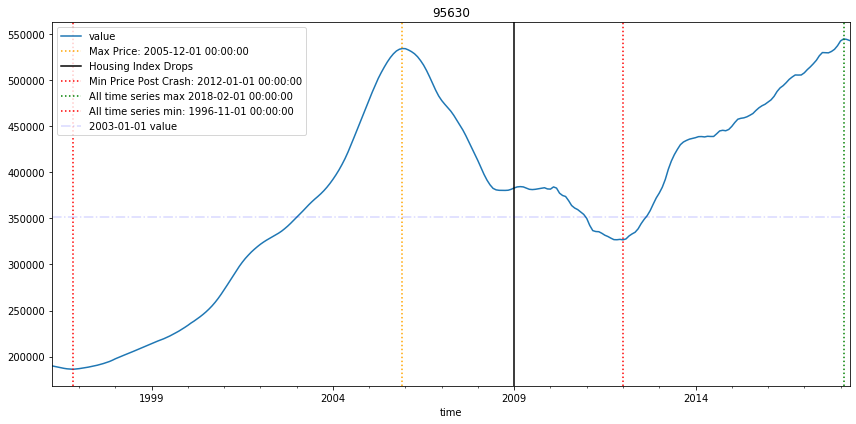


```python
ts_95630.head(3)
```


<div>
<style scoped>
    .dataframe tbody tr th:only-of-type {
        vertical-align: middle;
    }

    .dataframe tbody tr th {
        vertical-align: top;
    }

    .dataframe thead th {
        text-align: right;
    }
</style>
<table border="1" class="dataframe">
  <thead>
    <tr style="text-align: right;">
      <th></th>
      <th>Metro</th>
      <th>MetroState</th>
      <th>CountyName</th>
      <th>City</th>
      <th>Zip</th>
      <th>SizeRank</th>
      <th>value</th>
    </tr>
    <tr>
      <th>time</th>
      <th></th>
      <th></th>
      <th></th>
      <th></th>
      <th></th>
      <th></th>
      <th></th>
    </tr>
  </thead>
  <tbody>
    <tr>
      <td>1996-04-01</td>
      <td>Sacramento</td>
      <td>Sacramento CA</td>
      <td>Sacramento</td>
      <td>Folsom</td>
      <td>95630</td>
      <td>94</td>
      <td>190000.0</td>
    </tr>
    <tr>
      <td>1996-05-01</td>
      <td>Sacramento</td>
      <td>Sacramento CA</td>
      <td>Sacramento</td>
      <td>Folsom</td>
      <td>95630</td>
      <td>94</td>
      <td>189300.0</td>
    </tr>
    <tr>
      <td>1996-06-01</td>
      <td>Sacramento</td>
      <td>Sacramento CA</td>
      <td>Sacramento</td>
      <td>Folsom</td>
      <td>95630</td>
      <td>94</td>
      <td>188500.0</td>
    </tr>
  </tbody>
</table>
</div>


#### Boxplot of zip code


```python
ts_95630.boxplot(column = 'value')
plt.title('95630');

```


### Plot ACF and PACF for ts dataframe


```python
# plot_acf_pacf(ts, figsize=(10,6), lags=15)  # note that ts must only contain values and time as index

plot_acf_pacf(ts_95630_values, figsize=(10,6), lags=15)
```


### Plot seasonal decomposition for ts dataframe


```python
# plot_seasonal_decomp(ts)

plot_seasonal_decomp(ts_95630_values)

# Seasonality does not appear to be a significant factor in this zip code.
```


    (<Figure size 1296x432 with 1 Axes>,
     <matplotlib.axes._subplots.AxesSubplot at 0x1cc4a7d940>)


## ARIMA model parameters and optimization

### Generate list of (p,d,q) and (p,d,q,m) values


```python
p_values = [0, 1, 2, 4, 6, 8]
d_values = range(0, 3)
q_values = range(0, 3)
warnings.filterwarnings("ignore")
```

### Run ARIMA model on ts dataframe with list of p,d,q values 


```python
# eval_arima_models(ts, p_values, d_values, q_values)  # don't run this until you have some time, since it take time
# note that ts must only contain values and time as index

# eval_arima_models(ts_95630_values, p_values, d_values, q_values)  # don't run this until you have some time, since it takes time

```

### Generate model fit summary


```python
# model_fit = arima_zipcode(ts, order = None)   # change order = tuple to correspond to the best MSE produced by previous function

# Best ARIMA(2, 2, 0) MSE=1373937.757

model_fit_95630 = arima_zipcode(ts_95630_values, order = (2,2,0))

```

                                 ARIMA Model Results                              
    ==============================================================================
    Dep. Variable:                   D2.y   No. Observations:                  263
    Model:                 ARIMA(2, 2, 0)   Log Likelihood               -2168.670
    Method:                       css-mle   S.D. of innovations            921.281
    Date:                Tue, 10 Mar 2020   AIC                           4345.340
    Time:                        22:29:58   BIC                           4359.628
    Sample:                             2   HQIC                          4351.082
                                                                                  
    ==============================================================================
                     coef    std err          z      P>|z|      [0.025      0.975]
    ------------------------------------------------------------------------------
    const          2.8349     51.365      0.055      0.956     -97.839     103.508
    ar.L1.D2.y     0.3846      0.054      7.165      0.000       0.279       0.490
    ar.L2.D2.y    -0.4929      0.054     -9.124      0.000      -0.599      -0.387
                                        Roots                                    
    =============================================================================
                      Real          Imaginary           Modulus         Frequency
    -----------------------------------------------------------------------------
    AR.1            0.3901           -1.3700j            1.4244           -0.2058
    AR.2            0.3901           +1.3700j            1.4244            0.2058
    -----------------------------------------------------------------------------


## ARIMA modeling results:  predictions and visualization

### Produce forecasts from ARIMA model fit


```python
# actual_forecast, forecast_confint = forecast(model_fit, months=24, confint=2)

actual_forecast_95630, std_error_95630, forecast_confint_95630 = forecast(model_fit_95630)

```


```python
actual_forecast_95630, std_error_95630, forecast_confint_95630
```


    (array([542764.67898457, 543386.92768855, 543778.90543505, 543712.09745596,
            543585.49563585, 543665.15936051, 543856.7550734 , 543992.87632339,
            544055.63980188, 544120.67649767, 544225.88449693, 544348.56206964,
            544461.30072461, 544564.74924187, 544672.66568037, 544790.0209815 ,
            544911.94592764, 545034.11806591, 545157.27503125, 545283.83085044,
            545414.35029289, 545547.86076322, 545683.70989455, 545822.12617146]),
     array([  921.28144523,  2382.20150553,  3953.00904559,  5494.01988909,
             7113.69551196,  8922.00666071, 10917.81674448, 13043.08295262,
            15266.82898892, 17595.01485682, 20037.44418278, 22590.00201141,
            25242.01863065, 27987.11998569, 30824.01018466, 33751.75415954,
            36767.53818404, 39867.93008531, 43050.3634855 , 46313.09176956,
            49654.4541814 , 53072.59529956, 56565.6836542 , 60132.11198161]),
     array([[540959.0005323 , 544570.35743684],
            [538717.8985338 , 548055.95684331],
            [536031.15007513, 551526.66079497],
            [532944.01634299, 554480.17856892],
            [529642.90863543, 557528.08263626],
            [526178.34763569, 561151.97108533],
            [522458.22746441, 565255.28268239],
            [518428.90348889, 569556.84915788],
            [514133.20482547, 573978.07477828],
            [509635.08107085, 578606.27192449],
            [504953.21555645, 583498.55343742],
            [500072.97171658, 588624.1524227 ],
            [494987.85331144, 593934.74813777],
            [489711.00203892, 599418.49644483],
            [484258.71585935, 605086.6155014 ],
            [478637.79841376, 610942.24354925],
            [472848.89528671, 616974.99656856],
            [466894.41096054, 623173.82517129],
            [460780.11307832, 629534.43698418],
            [454511.8389694 , 636055.82273149],
            [448093.40842535, 642735.29216042],
            [441527.48541001, 649568.23611643],
            [434817.00717143, 656550.41261768],
            [427965.35237318, 663678.89996974]]))


### Create dataframe to hold forecast results


```python
# df_forecast = forecast_df(col = 'time', daterange = pd.date_range(start='2018-05-01', end='2020-04-01', freq='MS'), 
#                 actual_forecast=actual_forecast, forecast_confint = forecast_confint)

df_forecast_95630 = forecast_df(actual_forecast_95630, forecast_confint_95630, col = 'time', daterange = pd.date_range(start='2018-05-01', end='2020-04-01', freq='MS'))

```

### Create new dataframe concatenating historic values and forecast results


```python
# df_new = concat_values_forecast(ts, df_forecast)

df_new_95630 = concat_values_forecast(ts_95630_values, df_forecast_95630)
```


```python
df_new_95630
```


<div>
<style scoped>
    .dataframe tbody tr th:only-of-type {
        vertical-align: middle;
    }

    .dataframe tbody tr th {
        vertical-align: top;
    }

    .dataframe thead th {
        text-align: right;
    }
</style>
<table border="1" class="dataframe">
  <thead>
    <tr style="text-align: right;">
      <th></th>
      <th>value</th>
      <th>forecast</th>
      <th>forecast_lower</th>
      <th>forecast_upper</th>
    </tr>
    <tr>
      <th>time</th>
      <th></th>
      <th></th>
      <th></th>
      <th></th>
    </tr>
  </thead>
  <tbody>
    <tr>
      <td>1996-04-01</td>
      <td>190000.0</td>
      <td>NaN</td>
      <td>NaN</td>
      <td>NaN</td>
    </tr>
    <tr>
      <td>1996-05-01</td>
      <td>189300.0</td>
      <td>NaN</td>
      <td>NaN</td>
      <td>NaN</td>
    </tr>
    <tr>
      <td>1996-06-01</td>
      <td>188500.0</td>
      <td>NaN</td>
      <td>NaN</td>
      <td>NaN</td>
    </tr>
    <tr>
      <td>1996-07-01</td>
      <td>187800.0</td>
      <td>NaN</td>
      <td>NaN</td>
      <td>NaN</td>
    </tr>
    <tr>
      <td>1996-08-01</td>
      <td>187300.0</td>
      <td>NaN</td>
      <td>NaN</td>
      <td>NaN</td>
    </tr>
    <tr>
      <td>1996-09-01</td>
      <td>186800.0</td>
      <td>NaN</td>
      <td>NaN</td>
      <td>NaN</td>
    </tr>
    <tr>
      <td>1996-10-01</td>
      <td>186500.0</td>
      <td>NaN</td>
      <td>NaN</td>
      <td>NaN</td>
    </tr>
    <tr>
      <td>1996-11-01</td>
      <td>186300.0</td>
      <td>NaN</td>
      <td>NaN</td>
      <td>NaN</td>
    </tr>
    <tr>
      <td>1996-12-01</td>
      <td>186600.0</td>
      <td>NaN</td>
      <td>NaN</td>
      <td>NaN</td>
    </tr>
    <tr>
      <td>1997-01-01</td>
      <td>187000.0</td>
      <td>NaN</td>
      <td>NaN</td>
      <td>NaN</td>
    </tr>
    <tr>
      <td>1997-02-01</td>
      <td>187500.0</td>
      <td>NaN</td>
      <td>NaN</td>
      <td>NaN</td>
    </tr>
    <tr>
      <td>1997-03-01</td>
      <td>188000.0</td>
      <td>NaN</td>
      <td>NaN</td>
      <td>NaN</td>
    </tr>
    <tr>
      <td>1997-04-01</td>
      <td>188600.0</td>
      <td>NaN</td>
      <td>NaN</td>
      <td>NaN</td>
    </tr>
    <tr>
      <td>1997-05-01</td>
      <td>189300.0</td>
      <td>NaN</td>
      <td>NaN</td>
      <td>NaN</td>
    </tr>
    <tr>
      <td>1997-06-01</td>
      <td>189900.0</td>
      <td>NaN</td>
      <td>NaN</td>
      <td>NaN</td>
    </tr>
    <tr>
      <td>1997-07-01</td>
      <td>190700.0</td>
      <td>NaN</td>
      <td>NaN</td>
      <td>NaN</td>
    </tr>
    <tr>
      <td>1997-08-01</td>
      <td>191600.0</td>
      <td>NaN</td>
      <td>NaN</td>
      <td>NaN</td>
    </tr>
    <tr>
      <td>1997-09-01</td>
      <td>192500.0</td>
      <td>NaN</td>
      <td>NaN</td>
      <td>NaN</td>
    </tr>
    <tr>
      <td>1997-10-01</td>
      <td>193600.0</td>
      <td>NaN</td>
      <td>NaN</td>
      <td>NaN</td>
    </tr>
    <tr>
      <td>1997-11-01</td>
      <td>194700.0</td>
      <td>NaN</td>
      <td>NaN</td>
      <td>NaN</td>
    </tr>
    <tr>
      <td>1997-12-01</td>
      <td>196100.0</td>
      <td>NaN</td>
      <td>NaN</td>
      <td>NaN</td>
    </tr>
    <tr>
      <td>1998-01-01</td>
      <td>197700.0</td>
      <td>NaN</td>
      <td>NaN</td>
      <td>NaN</td>
    </tr>
    <tr>
      <td>1998-02-01</td>
      <td>199100.0</td>
      <td>NaN</td>
      <td>NaN</td>
      <td>NaN</td>
    </tr>
    <tr>
      <td>1998-03-01</td>
      <td>200500.0</td>
      <td>NaN</td>
      <td>NaN</td>
      <td>NaN</td>
    </tr>
    <tr>
      <td>1998-04-01</td>
      <td>201800.0</td>
      <td>NaN</td>
      <td>NaN</td>
      <td>NaN</td>
    </tr>
    <tr>
      <td>1998-05-01</td>
      <td>203100.0</td>
      <td>NaN</td>
      <td>NaN</td>
      <td>NaN</td>
    </tr>
    <tr>
      <td>1998-06-01</td>
      <td>204400.0</td>
      <td>NaN</td>
      <td>NaN</td>
      <td>NaN</td>
    </tr>
    <tr>
      <td>1998-07-01</td>
      <td>205800.0</td>
      <td>NaN</td>
      <td>NaN</td>
      <td>NaN</td>
    </tr>
    <tr>
      <td>1998-08-01</td>
      <td>207200.0</td>
      <td>NaN</td>
      <td>NaN</td>
      <td>NaN</td>
    </tr>
    <tr>
      <td>1998-09-01</td>
      <td>208600.0</td>
      <td>NaN</td>
      <td>NaN</td>
      <td>NaN</td>
    </tr>
    <tr>
      <td>1998-10-01</td>
      <td>210000.0</td>
      <td>NaN</td>
      <td>NaN</td>
      <td>NaN</td>
    </tr>
    <tr>
      <td>1998-11-01</td>
      <td>211400.0</td>
      <td>NaN</td>
      <td>NaN</td>
      <td>NaN</td>
    </tr>
    <tr>
      <td>1998-12-01</td>
      <td>212800.0</td>
      <td>NaN</td>
      <td>NaN</td>
      <td>NaN</td>
    </tr>
    <tr>
      <td>1999-01-01</td>
      <td>214300.0</td>
      <td>NaN</td>
      <td>NaN</td>
      <td>NaN</td>
    </tr>
    <tr>
      <td>1999-02-01</td>
      <td>215700.0</td>
      <td>NaN</td>
      <td>NaN</td>
      <td>NaN</td>
    </tr>
    <tr>
      <td>1999-03-01</td>
      <td>216900.0</td>
      <td>NaN</td>
      <td>NaN</td>
      <td>NaN</td>
    </tr>
    <tr>
      <td>1999-04-01</td>
      <td>218100.0</td>
      <td>NaN</td>
      <td>NaN</td>
      <td>NaN</td>
    </tr>
    <tr>
      <td>1999-05-01</td>
      <td>219400.0</td>
      <td>NaN</td>
      <td>NaN</td>
      <td>NaN</td>
    </tr>
    <tr>
      <td>1999-06-01</td>
      <td>220900.0</td>
      <td>NaN</td>
      <td>NaN</td>
      <td>NaN</td>
    </tr>
    <tr>
      <td>1999-07-01</td>
      <td>222400.0</td>
      <td>NaN</td>
      <td>NaN</td>
      <td>NaN</td>
    </tr>
    <tr>
      <td>1999-08-01</td>
      <td>224100.0</td>
      <td>NaN</td>
      <td>NaN</td>
      <td>NaN</td>
    </tr>
    <tr>
      <td>1999-09-01</td>
      <td>225900.0</td>
      <td>NaN</td>
      <td>NaN</td>
      <td>NaN</td>
    </tr>
    <tr>
      <td>1999-10-01</td>
      <td>227700.0</td>
      <td>NaN</td>
      <td>NaN</td>
      <td>NaN</td>
    </tr>
    <tr>
      <td>1999-11-01</td>
      <td>229700.0</td>
      <td>NaN</td>
      <td>NaN</td>
      <td>NaN</td>
    </tr>
    <tr>
      <td>1999-12-01</td>
      <td>231800.0</td>
      <td>NaN</td>
      <td>NaN</td>
      <td>NaN</td>
    </tr>
    <tr>
      <td>2000-01-01</td>
      <td>234000.0</td>
      <td>NaN</td>
      <td>NaN</td>
      <td>NaN</td>
    </tr>
    <tr>
      <td>2000-02-01</td>
      <td>236400.0</td>
      <td>NaN</td>
      <td>NaN</td>
      <td>NaN</td>
    </tr>
    <tr>
      <td>2000-03-01</td>
      <td>238500.0</td>
      <td>NaN</td>
      <td>NaN</td>
      <td>NaN</td>
    </tr>
    <tr>
      <td>2000-04-01</td>
      <td>240800.0</td>
      <td>NaN</td>
      <td>NaN</td>
      <td>NaN</td>
    </tr>
    <tr>
      <td>2000-05-01</td>
      <td>243200.0</td>
      <td>NaN</td>
      <td>NaN</td>
      <td>NaN</td>
    </tr>
    <tr>
      <td>2000-06-01</td>
      <td>245800.0</td>
      <td>NaN</td>
      <td>NaN</td>
      <td>NaN</td>
    </tr>
    <tr>
      <td>2000-07-01</td>
      <td>248600.0</td>
      <td>NaN</td>
      <td>NaN</td>
      <td>NaN</td>
    </tr>
    <tr>
      <td>2000-08-01</td>
      <td>251700.0</td>
      <td>NaN</td>
      <td>NaN</td>
      <td>NaN</td>
    </tr>
    <tr>
      <td>2000-09-01</td>
      <td>255100.0</td>
      <td>NaN</td>
      <td>NaN</td>
      <td>NaN</td>
    </tr>
    <tr>
      <td>2000-10-01</td>
      <td>258900.0</td>
      <td>NaN</td>
      <td>NaN</td>
      <td>NaN</td>
    </tr>
    <tr>
      <td>2000-11-01</td>
      <td>263100.0</td>
      <td>NaN</td>
      <td>NaN</td>
      <td>NaN</td>
    </tr>
    <tr>
      <td>2000-12-01</td>
      <td>267700.0</td>
      <td>NaN</td>
      <td>NaN</td>
      <td>NaN</td>
    </tr>
    <tr>
      <td>2001-01-01</td>
      <td>272600.0</td>
      <td>NaN</td>
      <td>NaN</td>
      <td>NaN</td>
    </tr>
    <tr>
      <td>2001-02-01</td>
      <td>277600.0</td>
      <td>NaN</td>
      <td>NaN</td>
      <td>NaN</td>
    </tr>
    <tr>
      <td>2001-03-01</td>
      <td>282700.0</td>
      <td>NaN</td>
      <td>NaN</td>
      <td>NaN</td>
    </tr>
    <tr>
      <td>2001-04-01</td>
      <td>287900.0</td>
      <td>NaN</td>
      <td>NaN</td>
      <td>NaN</td>
    </tr>
    <tr>
      <td>2001-05-01</td>
      <td>293000.0</td>
      <td>NaN</td>
      <td>NaN</td>
      <td>NaN</td>
    </tr>
    <tr>
      <td>2001-06-01</td>
      <td>297900.0</td>
      <td>NaN</td>
      <td>NaN</td>
      <td>NaN</td>
    </tr>
    <tr>
      <td>2001-07-01</td>
      <td>302400.0</td>
      <td>NaN</td>
      <td>NaN</td>
      <td>NaN</td>
    </tr>
    <tr>
      <td>2001-08-01</td>
      <td>306500.0</td>
      <td>NaN</td>
      <td>NaN</td>
      <td>NaN</td>
    </tr>
    <tr>
      <td>2001-09-01</td>
      <td>310100.0</td>
      <td>NaN</td>
      <td>NaN</td>
      <td>NaN</td>
    </tr>
    <tr>
      <td>2001-10-01</td>
      <td>313500.0</td>
      <td>NaN</td>
      <td>NaN</td>
      <td>NaN</td>
    </tr>
    <tr>
      <td>2001-11-01</td>
      <td>316500.0</td>
      <td>NaN</td>
      <td>NaN</td>
      <td>NaN</td>
    </tr>
    <tr>
      <td>2001-12-01</td>
      <td>319300.0</td>
      <td>NaN</td>
      <td>NaN</td>
      <td>NaN</td>
    </tr>
    <tr>
      <td>2002-01-01</td>
      <td>321900.0</td>
      <td>NaN</td>
      <td>NaN</td>
      <td>NaN</td>
    </tr>
    <tr>
      <td>2002-02-01</td>
      <td>324200.0</td>
      <td>NaN</td>
      <td>NaN</td>
      <td>NaN</td>
    </tr>
    <tr>
      <td>2002-03-01</td>
      <td>326300.0</td>
      <td>NaN</td>
      <td>NaN</td>
      <td>NaN</td>
    </tr>
    <tr>
      <td>2002-04-01</td>
      <td>328200.0</td>
      <td>NaN</td>
      <td>NaN</td>
      <td>NaN</td>
    </tr>
    <tr>
      <td>2002-05-01</td>
      <td>330000.0</td>
      <td>NaN</td>
      <td>NaN</td>
      <td>NaN</td>
    </tr>
    <tr>
      <td>2002-06-01</td>
      <td>331900.0</td>
      <td>NaN</td>
      <td>NaN</td>
      <td>NaN</td>
    </tr>
    <tr>
      <td>2002-07-01</td>
      <td>333900.0</td>
      <td>NaN</td>
      <td>NaN</td>
      <td>NaN</td>
    </tr>
    <tr>
      <td>2002-08-01</td>
      <td>336100.0</td>
      <td>NaN</td>
      <td>NaN</td>
      <td>NaN</td>
    </tr>
    <tr>
      <td>2002-09-01</td>
      <td>338700.0</td>
      <td>NaN</td>
      <td>NaN</td>
      <td>NaN</td>
    </tr>
    <tr>
      <td>2002-10-01</td>
      <td>341500.0</td>
      <td>NaN</td>
      <td>NaN</td>
      <td>NaN</td>
    </tr>
    <tr>
      <td>2002-11-01</td>
      <td>344600.0</td>
      <td>NaN</td>
      <td>NaN</td>
      <td>NaN</td>
    </tr>
    <tr>
      <td>2002-12-01</td>
      <td>347900.0</td>
      <td>NaN</td>
      <td>NaN</td>
      <td>NaN</td>
    </tr>
    <tr>
      <td>2003-01-01</td>
      <td>351200.0</td>
      <td>NaN</td>
      <td>NaN</td>
      <td>NaN</td>
    </tr>
    <tr>
      <td>2003-02-01</td>
      <td>354500.0</td>
      <td>NaN</td>
      <td>NaN</td>
      <td>NaN</td>
    </tr>
    <tr>
      <td>2003-03-01</td>
      <td>357800.0</td>
      <td>NaN</td>
      <td>NaN</td>
      <td>NaN</td>
    </tr>
    <tr>
      <td>2003-04-01</td>
      <td>361300.0</td>
      <td>NaN</td>
      <td>NaN</td>
      <td>NaN</td>
    </tr>
    <tr>
      <td>2003-05-01</td>
      <td>364700.0</td>
      <td>NaN</td>
      <td>NaN</td>
      <td>NaN</td>
    </tr>
    <tr>
      <td>2003-06-01</td>
      <td>367900.0</td>
      <td>NaN</td>
      <td>NaN</td>
      <td>NaN</td>
    </tr>
    <tr>
      <td>2003-07-01</td>
      <td>370900.0</td>
      <td>NaN</td>
      <td>NaN</td>
      <td>NaN</td>
    </tr>
    <tr>
      <td>2003-08-01</td>
      <td>373700.0</td>
      <td>NaN</td>
      <td>NaN</td>
      <td>NaN</td>
    </tr>
    <tr>
      <td>2003-09-01</td>
      <td>376700.0</td>
      <td>NaN</td>
      <td>NaN</td>
      <td>NaN</td>
    </tr>
    <tr>
      <td>2003-10-01</td>
      <td>380000.0</td>
      <td>NaN</td>
      <td>NaN</td>
      <td>NaN</td>
    </tr>
    <tr>
      <td>2003-11-01</td>
      <td>383700.0</td>
      <td>NaN</td>
      <td>NaN</td>
      <td>NaN</td>
    </tr>
    <tr>
      <td>2003-12-01</td>
      <td>387800.0</td>
      <td>NaN</td>
      <td>NaN</td>
      <td>NaN</td>
    </tr>
    <tr>
      <td>2004-01-01</td>
      <td>392300.0</td>
      <td>NaN</td>
      <td>NaN</td>
      <td>NaN</td>
    </tr>
    <tr>
      <td>2004-02-01</td>
      <td>397200.0</td>
      <td>NaN</td>
      <td>NaN</td>
      <td>NaN</td>
    </tr>
    <tr>
      <td>2004-03-01</td>
      <td>402500.0</td>
      <td>NaN</td>
      <td>NaN</td>
      <td>NaN</td>
    </tr>
    <tr>
      <td>2004-04-01</td>
      <td>408400.0</td>
      <td>NaN</td>
      <td>NaN</td>
      <td>NaN</td>
    </tr>
    <tr>
      <td>2004-05-01</td>
      <td>414800.0</td>
      <td>NaN</td>
      <td>NaN</td>
      <td>NaN</td>
    </tr>
    <tr>
      <td>2004-06-01</td>
      <td>422000.0</td>
      <td>NaN</td>
      <td>NaN</td>
      <td>NaN</td>
    </tr>
    <tr>
      <td>2004-07-01</td>
      <td>429900.0</td>
      <td>NaN</td>
      <td>NaN</td>
      <td>NaN</td>
    </tr>
    <tr>
      <td>2004-08-01</td>
      <td>437900.0</td>
      <td>NaN</td>
      <td>NaN</td>
      <td>NaN</td>
    </tr>
    <tr>
      <td>2004-09-01</td>
      <td>446100.0</td>
      <td>NaN</td>
      <td>NaN</td>
      <td>NaN</td>
    </tr>
    <tr>
      <td>2004-10-01</td>
      <td>454400.0</td>
      <td>NaN</td>
      <td>NaN</td>
      <td>NaN</td>
    </tr>
    <tr>
      <td>2004-11-01</td>
      <td>462700.0</td>
      <td>NaN</td>
      <td>NaN</td>
      <td>NaN</td>
    </tr>
    <tr>
      <td>2004-12-01</td>
      <td>471000.0</td>
      <td>NaN</td>
      <td>NaN</td>
      <td>NaN</td>
    </tr>
    <tr>
      <td>2005-01-01</td>
      <td>479100.0</td>
      <td>NaN</td>
      <td>NaN</td>
      <td>NaN</td>
    </tr>
    <tr>
      <td>2005-02-01</td>
      <td>486800.0</td>
      <td>NaN</td>
      <td>NaN</td>
      <td>NaN</td>
    </tr>
    <tr>
      <td>2005-03-01</td>
      <td>494400.0</td>
      <td>NaN</td>
      <td>NaN</td>
      <td>NaN</td>
    </tr>
    <tr>
      <td>2005-04-01</td>
      <td>501800.0</td>
      <td>NaN</td>
      <td>NaN</td>
      <td>NaN</td>
    </tr>
    <tr>
      <td>2005-05-01</td>
      <td>508200.0</td>
      <td>NaN</td>
      <td>NaN</td>
      <td>NaN</td>
    </tr>
    <tr>
      <td>2005-06-01</td>
      <td>514100.0</td>
      <td>NaN</td>
      <td>NaN</td>
      <td>NaN</td>
    </tr>
    <tr>
      <td>2005-07-01</td>
      <td>519600.0</td>
      <td>NaN</td>
      <td>NaN</td>
      <td>NaN</td>
    </tr>
    <tr>
      <td>2005-08-01</td>
      <td>524400.0</td>
      <td>NaN</td>
      <td>NaN</td>
      <td>NaN</td>
    </tr>
    <tr>
      <td>2005-09-01</td>
      <td>528400.0</td>
      <td>NaN</td>
      <td>NaN</td>
      <td>NaN</td>
    </tr>
    <tr>
      <td>2005-10-01</td>
      <td>531500.0</td>
      <td>NaN</td>
      <td>NaN</td>
      <td>NaN</td>
    </tr>
    <tr>
      <td>2005-11-01</td>
      <td>533400.0</td>
      <td>NaN</td>
      <td>NaN</td>
      <td>NaN</td>
    </tr>
    <tr>
      <td>2005-12-01</td>
      <td>534200.0</td>
      <td>NaN</td>
      <td>NaN</td>
      <td>NaN</td>
    </tr>
    <tr>
      <td>2006-01-01</td>
      <td>534000.0</td>
      <td>NaN</td>
      <td>NaN</td>
      <td>NaN</td>
    </tr>
    <tr>
      <td>2006-02-01</td>
      <td>532600.0</td>
      <td>NaN</td>
      <td>NaN</td>
      <td>NaN</td>
    </tr>
    <tr>
      <td>2006-03-01</td>
      <td>530800.0</td>
      <td>NaN</td>
      <td>NaN</td>
      <td>NaN</td>
    </tr>
    <tr>
      <td>2006-04-01</td>
      <td>528500.0</td>
      <td>NaN</td>
      <td>NaN</td>
      <td>NaN</td>
    </tr>
    <tr>
      <td>2006-05-01</td>
      <td>525300.0</td>
      <td>NaN</td>
      <td>NaN</td>
      <td>NaN</td>
    </tr>
    <tr>
      <td>2006-06-01</td>
      <td>521100.0</td>
      <td>NaN</td>
      <td>NaN</td>
      <td>NaN</td>
    </tr>
    <tr>
      <td>2006-07-01</td>
      <td>516200.0</td>
      <td>NaN</td>
      <td>NaN</td>
      <td>NaN</td>
    </tr>
    <tr>
      <td>2006-08-01</td>
      <td>510200.0</td>
      <td>NaN</td>
      <td>NaN</td>
      <td>NaN</td>
    </tr>
    <tr>
      <td>2006-09-01</td>
      <td>503400.0</td>
      <td>NaN</td>
      <td>NaN</td>
      <td>NaN</td>
    </tr>
    <tr>
      <td>2006-10-01</td>
      <td>496200.0</td>
      <td>NaN</td>
      <td>NaN</td>
      <td>NaN</td>
    </tr>
    <tr>
      <td>2006-11-01</td>
      <td>489000.0</td>
      <td>NaN</td>
      <td>NaN</td>
      <td>NaN</td>
    </tr>
    <tr>
      <td>2006-12-01</td>
      <td>482700.0</td>
      <td>NaN</td>
      <td>NaN</td>
      <td>NaN</td>
    </tr>
    <tr>
      <td>2007-01-01</td>
      <td>477800.0</td>
      <td>NaN</td>
      <td>NaN</td>
      <td>NaN</td>
    </tr>
    <tr>
      <td>2007-02-01</td>
      <td>473800.0</td>
      <td>NaN</td>
      <td>NaN</td>
      <td>NaN</td>
    </tr>
    <tr>
      <td>2007-03-01</td>
      <td>470100.0</td>
      <td>NaN</td>
      <td>NaN</td>
      <td>NaN</td>
    </tr>
    <tr>
      <td>2007-04-01</td>
      <td>466300.0</td>
      <td>NaN</td>
      <td>NaN</td>
      <td>NaN</td>
    </tr>
    <tr>
      <td>2007-05-01</td>
      <td>461700.0</td>
      <td>NaN</td>
      <td>NaN</td>
      <td>NaN</td>
    </tr>
    <tr>
      <td>2007-06-01</td>
      <td>456400.0</td>
      <td>NaN</td>
      <td>NaN</td>
      <td>NaN</td>
    </tr>
    <tr>
      <td>2007-07-01</td>
      <td>451300.0</td>
      <td>NaN</td>
      <td>NaN</td>
      <td>NaN</td>
    </tr>
    <tr>
      <td>2007-08-01</td>
      <td>445800.0</td>
      <td>NaN</td>
      <td>NaN</td>
      <td>NaN</td>
    </tr>
    <tr>
      <td>2007-09-01</td>
      <td>439600.0</td>
      <td>NaN</td>
      <td>NaN</td>
      <td>NaN</td>
    </tr>
    <tr>
      <td>2007-10-01</td>
      <td>432900.0</td>
      <td>NaN</td>
      <td>NaN</td>
      <td>NaN</td>
    </tr>
    <tr>
      <td>2007-11-01</td>
      <td>426000.0</td>
      <td>NaN</td>
      <td>NaN</td>
      <td>NaN</td>
    </tr>
    <tr>
      <td>2007-12-01</td>
      <td>419200.0</td>
      <td>NaN</td>
      <td>NaN</td>
      <td>NaN</td>
    </tr>
    <tr>
      <td>2008-01-01</td>
      <td>412400.0</td>
      <td>NaN</td>
      <td>NaN</td>
      <td>NaN</td>
    </tr>
    <tr>
      <td>2008-02-01</td>
      <td>405000.0</td>
      <td>NaN</td>
      <td>NaN</td>
      <td>NaN</td>
    </tr>
    <tr>
      <td>2008-03-01</td>
      <td>397700.0</td>
      <td>NaN</td>
      <td>NaN</td>
      <td>NaN</td>
    </tr>
    <tr>
      <td>2008-04-01</td>
      <td>391400.0</td>
      <td>NaN</td>
      <td>NaN</td>
      <td>NaN</td>
    </tr>
    <tr>
      <td>2008-05-01</td>
      <td>386300.0</td>
      <td>NaN</td>
      <td>NaN</td>
      <td>NaN</td>
    </tr>
    <tr>
      <td>2008-06-01</td>
      <td>382500.0</td>
      <td>NaN</td>
      <td>NaN</td>
      <td>NaN</td>
    </tr>
    <tr>
      <td>2008-07-01</td>
      <td>380900.0</td>
      <td>NaN</td>
      <td>NaN</td>
      <td>NaN</td>
    </tr>
    <tr>
      <td>2008-08-01</td>
      <td>380400.0</td>
      <td>NaN</td>
      <td>NaN</td>
      <td>NaN</td>
    </tr>
    <tr>
      <td>2008-09-01</td>
      <td>380300.0</td>
      <td>NaN</td>
      <td>NaN</td>
      <td>NaN</td>
    </tr>
    <tr>
      <td>2008-10-01</td>
      <td>380300.0</td>
      <td>NaN</td>
      <td>NaN</td>
      <td>NaN</td>
    </tr>
    <tr>
      <td>2008-11-01</td>
      <td>380500.0</td>
      <td>NaN</td>
      <td>NaN</td>
      <td>NaN</td>
    </tr>
    <tr>
      <td>2008-12-01</td>
      <td>381500.0</td>
      <td>NaN</td>
      <td>NaN</td>
      <td>NaN</td>
    </tr>
    <tr>
      <td>2009-01-01</td>
      <td>383000.0</td>
      <td>NaN</td>
      <td>NaN</td>
      <td>NaN</td>
    </tr>
    <tr>
      <td>2009-02-01</td>
      <td>384100.0</td>
      <td>NaN</td>
      <td>NaN</td>
      <td>NaN</td>
    </tr>
    <tr>
      <td>2009-03-01</td>
      <td>384400.0</td>
      <td>NaN</td>
      <td>NaN</td>
      <td>NaN</td>
    </tr>
    <tr>
      <td>2009-04-01</td>
      <td>384100.0</td>
      <td>NaN</td>
      <td>NaN</td>
      <td>NaN</td>
    </tr>
    <tr>
      <td>2009-05-01</td>
      <td>382800.0</td>
      <td>NaN</td>
      <td>NaN</td>
      <td>NaN</td>
    </tr>
    <tr>
      <td>2009-06-01</td>
      <td>381500.0</td>
      <td>NaN</td>
      <td>NaN</td>
      <td>NaN</td>
    </tr>
    <tr>
      <td>2009-07-01</td>
      <td>381200.0</td>
      <td>NaN</td>
      <td>NaN</td>
      <td>NaN</td>
    </tr>
    <tr>
      <td>2009-08-01</td>
      <td>381500.0</td>
      <td>NaN</td>
      <td>NaN</td>
      <td>NaN</td>
    </tr>
    <tr>
      <td>2009-09-01</td>
      <td>382100.0</td>
      <td>NaN</td>
      <td>NaN</td>
      <td>NaN</td>
    </tr>
    <tr>
      <td>2009-10-01</td>
      <td>382700.0</td>
      <td>NaN</td>
      <td>NaN</td>
      <td>NaN</td>
    </tr>
    <tr>
      <td>2009-11-01</td>
      <td>383200.0</td>
      <td>NaN</td>
      <td>NaN</td>
      <td>NaN</td>
    </tr>
    <tr>
      <td>2009-12-01</td>
      <td>381900.0</td>
      <td>NaN</td>
      <td>NaN</td>
      <td>NaN</td>
    </tr>
    <tr>
      <td>2010-01-01</td>
      <td>381700.0</td>
      <td>NaN</td>
      <td>NaN</td>
      <td>NaN</td>
    </tr>
    <tr>
      <td>2010-02-01</td>
      <td>384100.0</td>
      <td>NaN</td>
      <td>NaN</td>
      <td>NaN</td>
    </tr>
    <tr>
      <td>2010-03-01</td>
      <td>382800.0</td>
      <td>NaN</td>
      <td>NaN</td>
      <td>NaN</td>
    </tr>
    <tr>
      <td>2010-04-01</td>
      <td>377300.0</td>
      <td>NaN</td>
      <td>NaN</td>
      <td>NaN</td>
    </tr>
    <tr>
      <td>2010-05-01</td>
      <td>374800.0</td>
      <td>NaN</td>
      <td>NaN</td>
      <td>NaN</td>
    </tr>
    <tr>
      <td>2010-06-01</td>
      <td>373700.0</td>
      <td>NaN</td>
      <td>NaN</td>
      <td>NaN</td>
    </tr>
    <tr>
      <td>2010-07-01</td>
      <td>369200.0</td>
      <td>NaN</td>
      <td>NaN</td>
      <td>NaN</td>
    </tr>
    <tr>
      <td>2010-08-01</td>
      <td>363900.0</td>
      <td>NaN</td>
      <td>NaN</td>
      <td>NaN</td>
    </tr>
    <tr>
      <td>2010-09-01</td>
      <td>361200.0</td>
      <td>NaN</td>
      <td>NaN</td>
      <td>NaN</td>
    </tr>
    <tr>
      <td>2010-10-01</td>
      <td>359500.0</td>
      <td>NaN</td>
      <td>NaN</td>
      <td>NaN</td>
    </tr>
    <tr>
      <td>2010-11-01</td>
      <td>356900.0</td>
      <td>NaN</td>
      <td>NaN</td>
      <td>NaN</td>
    </tr>
    <tr>
      <td>2010-12-01</td>
      <td>354300.0</td>
      <td>NaN</td>
      <td>NaN</td>
      <td>NaN</td>
    </tr>
    <tr>
      <td>2011-01-01</td>
      <td>349900.0</td>
      <td>NaN</td>
      <td>NaN</td>
      <td>NaN</td>
    </tr>
    <tr>
      <td>2011-02-01</td>
      <td>342300.0</td>
      <td>NaN</td>
      <td>NaN</td>
      <td>NaN</td>
    </tr>
    <tr>
      <td>2011-03-01</td>
      <td>336700.0</td>
      <td>NaN</td>
      <td>NaN</td>
      <td>NaN</td>
    </tr>
    <tr>
      <td>2011-04-01</td>
      <td>335700.0</td>
      <td>NaN</td>
      <td>NaN</td>
      <td>NaN</td>
    </tr>
    <tr>
      <td>2011-05-01</td>
      <td>335500.0</td>
      <td>NaN</td>
      <td>NaN</td>
      <td>NaN</td>
    </tr>
    <tr>
      <td>2011-06-01</td>
      <td>333800.0</td>
      <td>NaN</td>
      <td>NaN</td>
      <td>NaN</td>
    </tr>
    <tr>
      <td>2011-07-01</td>
      <td>331700.0</td>
      <td>NaN</td>
      <td>NaN</td>
      <td>NaN</td>
    </tr>
    <tr>
      <td>2011-08-01</td>
      <td>330300.0</td>
      <td>NaN</td>
      <td>NaN</td>
      <td>NaN</td>
    </tr>
    <tr>
      <td>2011-09-01</td>
      <td>328500.0</td>
      <td>NaN</td>
      <td>NaN</td>
      <td>NaN</td>
    </tr>
    <tr>
      <td>2011-10-01</td>
      <td>326900.0</td>
      <td>NaN</td>
      <td>NaN</td>
      <td>NaN</td>
    </tr>
    <tr>
      <td>2011-11-01</td>
      <td>326800.0</td>
      <td>NaN</td>
      <td>NaN</td>
      <td>NaN</td>
    </tr>
    <tr>
      <td>2011-12-01</td>
      <td>327200.0</td>
      <td>NaN</td>
      <td>NaN</td>
      <td>NaN</td>
    </tr>
    <tr>
      <td>2012-01-01</td>
      <td>326700.0</td>
      <td>NaN</td>
      <td>NaN</td>
      <td>NaN</td>
    </tr>
    <tr>
      <td>2012-02-01</td>
      <td>327700.0</td>
      <td>NaN</td>
      <td>NaN</td>
      <td>NaN</td>
    </tr>
    <tr>
      <td>2012-03-01</td>
      <td>330900.0</td>
      <td>NaN</td>
      <td>NaN</td>
      <td>NaN</td>
    </tr>
    <tr>
      <td>2012-04-01</td>
      <td>333100.0</td>
      <td>NaN</td>
      <td>NaN</td>
      <td>NaN</td>
    </tr>
    <tr>
      <td>2012-05-01</td>
      <td>334900.0</td>
      <td>NaN</td>
      <td>NaN</td>
      <td>NaN</td>
    </tr>
    <tr>
      <td>2012-06-01</td>
      <td>338600.0</td>
      <td>NaN</td>
      <td>NaN</td>
      <td>NaN</td>
    </tr>
    <tr>
      <td>2012-07-01</td>
      <td>344200.0</td>
      <td>NaN</td>
      <td>NaN</td>
      <td>NaN</td>
    </tr>
    <tr>
      <td>2012-08-01</td>
      <td>348900.0</td>
      <td>NaN</td>
      <td>NaN</td>
      <td>NaN</td>
    </tr>
    <tr>
      <td>2012-09-01</td>
      <td>352900.0</td>
      <td>NaN</td>
      <td>NaN</td>
      <td>NaN</td>
    </tr>
    <tr>
      <td>2012-10-01</td>
      <td>358400.0</td>
      <td>NaN</td>
      <td>NaN</td>
      <td>NaN</td>
    </tr>
    <tr>
      <td>2012-11-01</td>
      <td>365400.0</td>
      <td>NaN</td>
      <td>NaN</td>
      <td>NaN</td>
    </tr>
    <tr>
      <td>2012-12-01</td>
      <td>372100.0</td>
      <td>NaN</td>
      <td>NaN</td>
      <td>NaN</td>
    </tr>
    <tr>
      <td>2013-01-01</td>
      <td>377400.0</td>
      <td>NaN</td>
      <td>NaN</td>
      <td>NaN</td>
    </tr>
    <tr>
      <td>2013-02-01</td>
      <td>383700.0</td>
      <td>NaN</td>
      <td>NaN</td>
      <td>NaN</td>
    </tr>
    <tr>
      <td>2013-03-01</td>
      <td>392200.0</td>
      <td>NaN</td>
      <td>NaN</td>
      <td>NaN</td>
    </tr>
    <tr>
      <td>2013-04-01</td>
      <td>403200.0</td>
      <td>NaN</td>
      <td>NaN</td>
      <td>NaN</td>
    </tr>
    <tr>
      <td>2013-05-01</td>
      <td>412100.0</td>
      <td>NaN</td>
      <td>NaN</td>
      <td>NaN</td>
    </tr>
    <tr>
      <td>2013-06-01</td>
      <td>419100.0</td>
      <td>NaN</td>
      <td>NaN</td>
      <td>NaN</td>
    </tr>
    <tr>
      <td>2013-07-01</td>
      <td>424800.0</td>
      <td>NaN</td>
      <td>NaN</td>
      <td>NaN</td>
    </tr>
    <tr>
      <td>2013-08-01</td>
      <td>429900.0</td>
      <td>NaN</td>
      <td>NaN</td>
      <td>NaN</td>
    </tr>
    <tr>
      <td>2013-09-01</td>
      <td>432800.0</td>
      <td>NaN</td>
      <td>NaN</td>
      <td>NaN</td>
    </tr>
    <tr>
      <td>2013-10-01</td>
      <td>434500.0</td>
      <td>NaN</td>
      <td>NaN</td>
      <td>NaN</td>
    </tr>
    <tr>
      <td>2013-11-01</td>
      <td>435900.0</td>
      <td>NaN</td>
      <td>NaN</td>
      <td>NaN</td>
    </tr>
    <tr>
      <td>2013-12-01</td>
      <td>436700.0</td>
      <td>NaN</td>
      <td>NaN</td>
      <td>NaN</td>
    </tr>
    <tr>
      <td>2014-01-01</td>
      <td>437500.0</td>
      <td>NaN</td>
      <td>NaN</td>
      <td>NaN</td>
    </tr>
    <tr>
      <td>2014-02-01</td>
      <td>438600.0</td>
      <td>NaN</td>
      <td>NaN</td>
      <td>NaN</td>
    </tr>
    <tr>
      <td>2014-03-01</td>
      <td>438700.0</td>
      <td>NaN</td>
      <td>NaN</td>
      <td>NaN</td>
    </tr>
    <tr>
      <td>2014-04-01</td>
      <td>438300.0</td>
      <td>NaN</td>
      <td>NaN</td>
      <td>NaN</td>
    </tr>
    <tr>
      <td>2014-05-01</td>
      <td>439000.0</td>
      <td>NaN</td>
      <td>NaN</td>
      <td>NaN</td>
    </tr>
    <tr>
      <td>2014-06-01</td>
      <td>438800.0</td>
      <td>NaN</td>
      <td>NaN</td>
      <td>NaN</td>
    </tr>
    <tr>
      <td>2014-07-01</td>
      <td>438800.0</td>
      <td>NaN</td>
      <td>NaN</td>
      <td>NaN</td>
    </tr>
    <tr>
      <td>2014-08-01</td>
      <td>441700.0</td>
      <td>NaN</td>
      <td>NaN</td>
      <td>NaN</td>
    </tr>
    <tr>
      <td>2014-09-01</td>
      <td>444800.0</td>
      <td>NaN</td>
      <td>NaN</td>
      <td>NaN</td>
    </tr>
    <tr>
      <td>2014-10-01</td>
      <td>445500.0</td>
      <td>NaN</td>
      <td>NaN</td>
      <td>NaN</td>
    </tr>
    <tr>
      <td>2014-11-01</td>
      <td>445000.0</td>
      <td>NaN</td>
      <td>NaN</td>
      <td>NaN</td>
    </tr>
    <tr>
      <td>2014-12-01</td>
      <td>446400.0</td>
      <td>NaN</td>
      <td>NaN</td>
      <td>NaN</td>
    </tr>
    <tr>
      <td>2015-01-01</td>
      <td>449700.0</td>
      <td>NaN</td>
      <td>NaN</td>
      <td>NaN</td>
    </tr>
    <tr>
      <td>2015-02-01</td>
      <td>453900.0</td>
      <td>NaN</td>
      <td>NaN</td>
      <td>NaN</td>
    </tr>
    <tr>
      <td>2015-03-01</td>
      <td>457500.0</td>
      <td>NaN</td>
      <td>NaN</td>
      <td>NaN</td>
    </tr>
    <tr>
      <td>2015-04-01</td>
      <td>458500.0</td>
      <td>NaN</td>
      <td>NaN</td>
      <td>NaN</td>
    </tr>
    <tr>
      <td>2015-05-01</td>
      <td>459000.0</td>
      <td>NaN</td>
      <td>NaN</td>
      <td>NaN</td>
    </tr>
    <tr>
      <td>2015-06-01</td>
      <td>460100.0</td>
      <td>NaN</td>
      <td>NaN</td>
      <td>NaN</td>
    </tr>
    <tr>
      <td>2015-07-01</td>
      <td>461800.0</td>
      <td>NaN</td>
      <td>NaN</td>
      <td>NaN</td>
    </tr>
    <tr>
      <td>2015-08-01</td>
      <td>463700.0</td>
      <td>NaN</td>
      <td>NaN</td>
      <td>NaN</td>
    </tr>
    <tr>
      <td>2015-09-01</td>
      <td>467000.0</td>
      <td>NaN</td>
      <td>NaN</td>
      <td>NaN</td>
    </tr>
    <tr>
      <td>2015-10-01</td>
      <td>469900.0</td>
      <td>NaN</td>
      <td>NaN</td>
      <td>NaN</td>
    </tr>
    <tr>
      <td>2015-11-01</td>
      <td>472100.0</td>
      <td>NaN</td>
      <td>NaN</td>
      <td>NaN</td>
    </tr>
    <tr>
      <td>2015-12-01</td>
      <td>473700.0</td>
      <td>NaN</td>
      <td>NaN</td>
      <td>NaN</td>
    </tr>
    <tr>
      <td>2016-01-01</td>
      <td>476100.0</td>
      <td>NaN</td>
      <td>NaN</td>
      <td>NaN</td>
    </tr>
    <tr>
      <td>2016-02-01</td>
      <td>478500.0</td>
      <td>NaN</td>
      <td>NaN</td>
      <td>NaN</td>
    </tr>
    <tr>
      <td>2016-03-01</td>
      <td>482300.0</td>
      <td>NaN</td>
      <td>NaN</td>
      <td>NaN</td>
    </tr>
    <tr>
      <td>2016-04-01</td>
      <td>487600.0</td>
      <td>NaN</td>
      <td>NaN</td>
      <td>NaN</td>
    </tr>
    <tr>
      <td>2016-05-01</td>
      <td>491500.0</td>
      <td>NaN</td>
      <td>NaN</td>
      <td>NaN</td>
    </tr>
    <tr>
      <td>2016-06-01</td>
      <td>493900.0</td>
      <td>NaN</td>
      <td>NaN</td>
      <td>NaN</td>
    </tr>
    <tr>
      <td>2016-07-01</td>
      <td>497100.0</td>
      <td>NaN</td>
      <td>NaN</td>
      <td>NaN</td>
    </tr>
    <tr>
      <td>2016-08-01</td>
      <td>500700.0</td>
      <td>NaN</td>
      <td>NaN</td>
      <td>NaN</td>
    </tr>
    <tr>
      <td>2016-09-01</td>
      <td>503300.0</td>
      <td>NaN</td>
      <td>NaN</td>
      <td>NaN</td>
    </tr>
    <tr>
      <td>2016-10-01</td>
      <td>505500.0</td>
      <td>NaN</td>
      <td>NaN</td>
      <td>NaN</td>
    </tr>
    <tr>
      <td>2016-11-01</td>
      <td>505400.0</td>
      <td>NaN</td>
      <td>NaN</td>
      <td>NaN</td>
    </tr>
    <tr>
      <td>2016-12-01</td>
      <td>505500.0</td>
      <td>NaN</td>
      <td>NaN</td>
      <td>NaN</td>
    </tr>
    <tr>
      <td>2017-01-01</td>
      <td>507800.0</td>
      <td>NaN</td>
      <td>NaN</td>
      <td>NaN</td>
    </tr>
    <tr>
      <td>2017-02-01</td>
      <td>511300.0</td>
      <td>NaN</td>
      <td>NaN</td>
      <td>NaN</td>
    </tr>
    <tr>
      <td>2017-03-01</td>
      <td>514300.0</td>
      <td>NaN</td>
      <td>NaN</td>
      <td>NaN</td>
    </tr>
    <tr>
      <td>2017-04-01</td>
      <td>517700.0</td>
      <td>NaN</td>
      <td>NaN</td>
      <td>NaN</td>
    </tr>
    <tr>
      <td>2017-05-01</td>
      <td>521400.0</td>
      <td>NaN</td>
      <td>NaN</td>
      <td>NaN</td>
    </tr>
    <tr>
      <td>2017-06-01</td>
      <td>526400.0</td>
      <td>NaN</td>
      <td>NaN</td>
      <td>NaN</td>
    </tr>
    <tr>
      <td>2017-07-01</td>
      <td>529800.0</td>
      <td>NaN</td>
      <td>NaN</td>
      <td>NaN</td>
    </tr>
    <tr>
      <td>2017-08-01</td>
      <td>529700.0</td>
      <td>NaN</td>
      <td>NaN</td>
      <td>NaN</td>
    </tr>
    <tr>
      <td>2017-09-01</td>
      <td>529500.0</td>
      <td>NaN</td>
      <td>NaN</td>
      <td>NaN</td>
    </tr>
    <tr>
      <td>2017-10-01</td>
      <td>531000.0</td>
      <td>NaN</td>
      <td>NaN</td>
      <td>NaN</td>
    </tr>
    <tr>
      <td>2017-11-01</td>
      <td>533300.0</td>
      <td>NaN</td>
      <td>NaN</td>
      <td>NaN</td>
    </tr>
    <tr>
      <td>2017-12-01</td>
      <td>537200.0</td>
      <td>NaN</td>
      <td>NaN</td>
      <td>NaN</td>
    </tr>
    <tr>
      <td>2018-01-01</td>
      <td>542400.0</td>
      <td>NaN</td>
      <td>NaN</td>
      <td>NaN</td>
    </tr>
    <tr>
      <td>2018-02-01</td>
      <td>544600.0</td>
      <td>NaN</td>
      <td>NaN</td>
      <td>NaN</td>
    </tr>
    <tr>
      <td>2018-03-01</td>
      <td>544100.0</td>
      <td>NaN</td>
      <td>NaN</td>
      <td>NaN</td>
    </tr>
    <tr>
      <td>2018-04-01</td>
      <td>542900.0</td>
      <td>NaN</td>
      <td>NaN</td>
      <td>NaN</td>
    </tr>
    <tr>
      <td>2018-05-01</td>
      <td>NaN</td>
      <td>542764.678985</td>
      <td>540959.000532</td>
      <td>544570.357437</td>
    </tr>
    <tr>
      <td>2018-06-01</td>
      <td>NaN</td>
      <td>543386.927689</td>
      <td>538717.898534</td>
      <td>548055.956843</td>
    </tr>
    <tr>
      <td>2018-07-01</td>
      <td>NaN</td>
      <td>543778.905435</td>
      <td>536031.150075</td>
      <td>551526.660795</td>
    </tr>
    <tr>
      <td>2018-08-01</td>
      <td>NaN</td>
      <td>543712.097456</td>
      <td>532944.016343</td>
      <td>554480.178569</td>
    </tr>
    <tr>
      <td>2018-09-01</td>
      <td>NaN</td>
      <td>543585.495636</td>
      <td>529642.908635</td>
      <td>557528.082636</td>
    </tr>
    <tr>
      <td>2018-10-01</td>
      <td>NaN</td>
      <td>543665.159361</td>
      <td>526178.347636</td>
      <td>561151.971085</td>
    </tr>
    <tr>
      <td>2018-11-01</td>
      <td>NaN</td>
      <td>543856.755073</td>
      <td>522458.227464</td>
      <td>565255.282682</td>
    </tr>
    <tr>
      <td>2018-12-01</td>
      <td>NaN</td>
      <td>543992.876323</td>
      <td>518428.903489</td>
      <td>569556.849158</td>
    </tr>
    <tr>
      <td>2019-01-01</td>
      <td>NaN</td>
      <td>544055.639802</td>
      <td>514133.204825</td>
      <td>573978.074778</td>
    </tr>
    <tr>
      <td>2019-02-01</td>
      <td>NaN</td>
      <td>544120.676498</td>
      <td>509635.081071</td>
      <td>578606.271924</td>
    </tr>
    <tr>
      <td>2019-03-01</td>
      <td>NaN</td>
      <td>544225.884497</td>
      <td>504953.215556</td>
      <td>583498.553437</td>
    </tr>
    <tr>
      <td>2019-04-01</td>
      <td>NaN</td>
      <td>544348.562070</td>
      <td>500072.971717</td>
      <td>588624.152423</td>
    </tr>
    <tr>
      <td>2019-05-01</td>
      <td>NaN</td>
      <td>544461.300725</td>
      <td>494987.853311</td>
      <td>593934.748138</td>
    </tr>
    <tr>
      <td>2019-06-01</td>
      <td>NaN</td>
      <td>544564.749242</td>
      <td>489711.002039</td>
      <td>599418.496445</td>
    </tr>
    <tr>
      <td>2019-07-01</td>
      <td>NaN</td>
      <td>544672.665680</td>
      <td>484258.715859</td>
      <td>605086.615501</td>
    </tr>
    <tr>
      <td>2019-08-01</td>
      <td>NaN</td>
      <td>544790.020982</td>
      <td>478637.798414</td>
      <td>610942.243549</td>
    </tr>
    <tr>
      <td>2019-09-01</td>
      <td>NaN</td>
      <td>544911.945928</td>
      <td>472848.895287</td>
      <td>616974.996569</td>
    </tr>
    <tr>
      <td>2019-10-01</td>
      <td>NaN</td>
      <td>545034.118066</td>
      <td>466894.410961</td>
      <td>623173.825171</td>
    </tr>
    <tr>
      <td>2019-11-01</td>
      <td>NaN</td>
      <td>545157.275031</td>
      <td>460780.113078</td>
      <td>629534.436984</td>
    </tr>
    <tr>
      <td>2019-12-01</td>
      <td>NaN</td>
      <td>545283.830850</td>
      <td>454511.838969</td>
      <td>636055.822731</td>
    </tr>
    <tr>
      <td>2020-01-01</td>
      <td>NaN</td>
      <td>545414.350293</td>
      <td>448093.408425</td>
      <td>642735.292160</td>
    </tr>
    <tr>
      <td>2020-02-01</td>
      <td>NaN</td>
      <td>545547.860763</td>
      <td>441527.485410</td>
      <td>649568.236116</td>
    </tr>
    <tr>
      <td>2020-03-01</td>
      <td>NaN</td>
      <td>545683.709895</td>
      <td>434817.007171</td>
      <td>656550.412618</td>
    </tr>
    <tr>
      <td>2020-04-01</td>
      <td>NaN</td>
      <td>545822.126171</td>
      <td>427965.352373</td>
      <td>663678.899970</td>
    </tr>
  </tbody>
</table>
</div>


### Calculate predicted, lower bound, and upper bound forecasted prices


```python
forecasted_price_95630, forecasted_lower_95630, forecasted_upper_95630 = forecast_values(df_new_95630)
```


```python
forecasted_price_95630, forecasted_lower_95630, forecasted_upper_95630  # predicted, best-case, and worst-case prices in 2020

```


    (545822.1261714601, 427965.35237318143, 663678.8999697389)


```python
last_value_95630 = df_new_95630['value'].loc['2018-04-01']
```


```python
last_value_95630
```


    542900.0


### Plot forecast with confidence intervals


```python
# plot_forecast(df = df_new, figsize=(12,8), geog=None)

plot_forecast(df_new_95630, figsize=(12,8), geog='95630 (Folsom)')
```


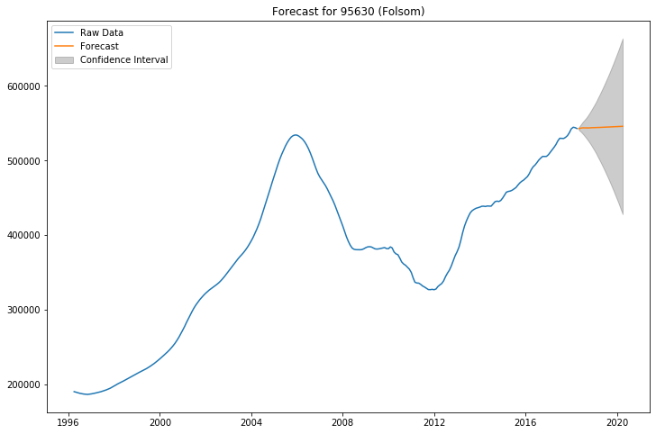


### Print summary of predicted, worst-case, and best-case scenarios


```python
folsom_95630_pred, folsom_95630_low, folsom_95630_high = pred_best_worst(pred=forecasted_price_95630, low=forecasted_lower_95630, 
                                                                         high=forecasted_upper_95630, last=last_value_95630, date='April 1, 2020')
folsom_95630_pred, folsom_95630_low, folsom_95630_high
```

    By the model prediction, I would expect to see a 0.538% change in price by April 1, 2020.
    At the lower bound of the confidence interval, I would expect to see a -21.171% change in price by April 1, 2020.
    At the upper bound of the confidence interval, I would expect to see a 22.247% change in price by April 1, 2020.


    (0.538, -21.171, 22.247)


## Zip code 95630:  Mediocre earning potential, significant downside risk (but equally possible upside risk)

By the model prediction, I would expect to see a 0.538% change in price by April 1, 2020.
At the lower bound of the confidence interval, I would expect to see a -21.171% change in price by April 1, 2020. 
At the upper bound of the confidence interval, I would expect to see a 22.247% change in price by April 1, 2020. 


# SacMetro:  96140 (Carnelian Bay) -- Definite investment opportunity¶


```python
geog_area = '96140'
```


```python
ts_96140 = df_sac.loc[df_sac['Zip'] == geog_area]  # ts for all of the following functions should have only one zipcode
ts_96140.head()

```


<div>
<style scoped>
    .dataframe tbody tr th:only-of-type {
        vertical-align: middle;
    }

    .dataframe tbody tr th {
        vertical-align: top;
    }

    .dataframe thead th {
        text-align: right;
    }
</style>
<table border="1" class="dataframe">
  <thead>
    <tr style="text-align: right;">
      <th></th>
      <th>Metro</th>
      <th>MetroState</th>
      <th>CountyName</th>
      <th>City</th>
      <th>Zip</th>
      <th>SizeRank</th>
      <th>value</th>
    </tr>
    <tr>
      <th>time</th>
      <th></th>
      <th></th>
      <th></th>
      <th></th>
      <th></th>
      <th></th>
      <th></th>
    </tr>
  </thead>
  <tbody>
    <tr>
      <td>1996-04-01</td>
      <td>Sacramento</td>
      <td>Sacramento CA</td>
      <td>Placer</td>
      <td>Carnelian Bay</td>
      <td>96140</td>
      <td>13960</td>
      <td>179100.0</td>
    </tr>
    <tr>
      <td>1996-05-01</td>
      <td>Sacramento</td>
      <td>Sacramento CA</td>
      <td>Placer</td>
      <td>Carnelian Bay</td>
      <td>96140</td>
      <td>13960</td>
      <td>179000.0</td>
    </tr>
    <tr>
      <td>1996-06-01</td>
      <td>Sacramento</td>
      <td>Sacramento CA</td>
      <td>Placer</td>
      <td>Carnelian Bay</td>
      <td>96140</td>
      <td>13960</td>
      <td>179000.0</td>
    </tr>
    <tr>
      <td>1996-07-01</td>
      <td>Sacramento</td>
      <td>Sacramento CA</td>
      <td>Placer</td>
      <td>Carnelian Bay</td>
      <td>96140</td>
      <td>13960</td>
      <td>178900.0</td>
    </tr>
    <tr>
      <td>1996-08-01</td>
      <td>Sacramento</td>
      <td>Sacramento CA</td>
      <td>Placer</td>
      <td>Carnelian Bay</td>
      <td>96140</td>
      <td>13960</td>
      <td>178900.0</td>
    </tr>
  </tbody>
</table>
</div>


```python
# ts.head()

ts_96140.head()
```


<div>
<style scoped>
    .dataframe tbody tr th:only-of-type {
        vertical-align: middle;
    }

    .dataframe tbody tr th {
        vertical-align: top;
    }

    .dataframe thead th {
        text-align: right;
    }
</style>
<table border="1" class="dataframe">
  <thead>
    <tr style="text-align: right;">
      <th></th>
      <th>Metro</th>
      <th>MetroState</th>
      <th>CountyName</th>
      <th>City</th>
      <th>Zip</th>
      <th>SizeRank</th>
      <th>value</th>
    </tr>
    <tr>
      <th>time</th>
      <th></th>
      <th></th>
      <th></th>
      <th></th>
      <th></th>
      <th></th>
      <th></th>
    </tr>
  </thead>
  <tbody>
    <tr>
      <td>1996-04-01</td>
      <td>Sacramento</td>
      <td>Sacramento CA</td>
      <td>Placer</td>
      <td>Carnelian Bay</td>
      <td>96140</td>
      <td>13960</td>
      <td>179100.0</td>
    </tr>
    <tr>
      <td>1996-05-01</td>
      <td>Sacramento</td>
      <td>Sacramento CA</td>
      <td>Placer</td>
      <td>Carnelian Bay</td>
      <td>96140</td>
      <td>13960</td>
      <td>179000.0</td>
    </tr>
    <tr>
      <td>1996-06-01</td>
      <td>Sacramento</td>
      <td>Sacramento CA</td>
      <td>Placer</td>
      <td>Carnelian Bay</td>
      <td>96140</td>
      <td>13960</td>
      <td>179000.0</td>
    </tr>
    <tr>
      <td>1996-07-01</td>
      <td>Sacramento</td>
      <td>Sacramento CA</td>
      <td>Placer</td>
      <td>Carnelian Bay</td>
      <td>96140</td>
      <td>13960</td>
      <td>178900.0</td>
    </tr>
    <tr>
      <td>1996-08-01</td>
      <td>Sacramento</td>
      <td>Sacramento CA</td>
      <td>Placer</td>
      <td>Carnelian Bay</td>
      <td>96140</td>
      <td>13960</td>
      <td>178900.0</td>
    </tr>
  </tbody>
</table>
</div>


```python
# ts = ts.value

ts_96140_values = ts_96140.value
```


```python
# ts.head()

ts_96140_values.head()
```


    time
    1996-04-01    179100.0
    1996-05-01    179000.0
    1996-06-01    179000.0
    1996-07-01    178900.0
    1996-08-01    178900.0
    Name: value, dtype: float64


```python
ts_96140_values.tail()
```


    time
    2017-12-01    622400.0
    2018-01-01    625000.0
    2018-02-01    631500.0
    2018-03-01    639400.0
    2018-04-01    644600.0
    Name: value, dtype: float64


### Visualizations

#### plot_ts:  Plot zip code(s) of interest over time, with market highs and lows


```python
# fig, ax = plot_ts(df_melt, zipcodes=['95616', '92008', '90035', '90025', '60625', '57701'])  # enter desired zip code(s)

fig, ax = plot_ts_zips(df_melt, zipcodes=['96140'], figsize=(12,6))  # enter desired zip code(s)
```


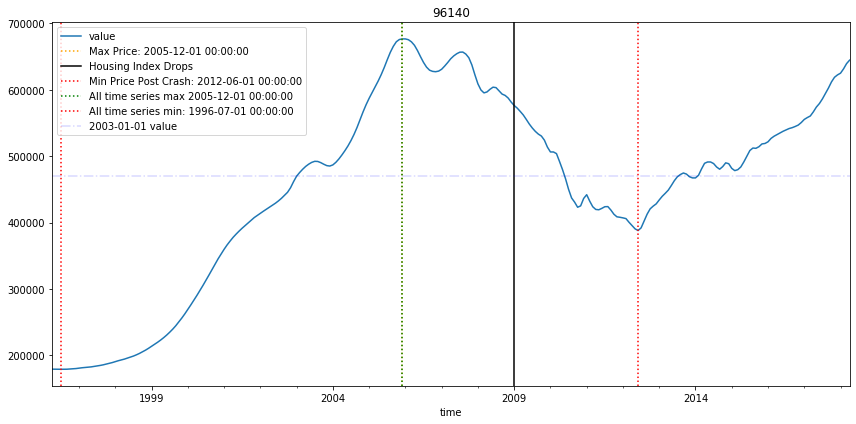


```python
ts_96140.head(3)
```


<div>
<style scoped>
    .dataframe tbody tr th:only-of-type {
        vertical-align: middle;
    }

    .dataframe tbody tr th {
        vertical-align: top;
    }

    .dataframe thead th {
        text-align: right;
    }
</style>
<table border="1" class="dataframe">
  <thead>
    <tr style="text-align: right;">
      <th></th>
      <th>Metro</th>
      <th>MetroState</th>
      <th>CountyName</th>
      <th>City</th>
      <th>Zip</th>
      <th>SizeRank</th>
      <th>value</th>
    </tr>
    <tr>
      <th>time</th>
      <th></th>
      <th></th>
      <th></th>
      <th></th>
      <th></th>
      <th></th>
      <th></th>
    </tr>
  </thead>
  <tbody>
    <tr>
      <td>1996-04-01</td>
      <td>Sacramento</td>
      <td>Sacramento CA</td>
      <td>Placer</td>
      <td>Carnelian Bay</td>
      <td>96140</td>
      <td>13960</td>
      <td>179100.0</td>
    </tr>
    <tr>
      <td>1996-05-01</td>
      <td>Sacramento</td>
      <td>Sacramento CA</td>
      <td>Placer</td>
      <td>Carnelian Bay</td>
      <td>96140</td>
      <td>13960</td>
      <td>179000.0</td>
    </tr>
    <tr>
      <td>1996-06-01</td>
      <td>Sacramento</td>
      <td>Sacramento CA</td>
      <td>Placer</td>
      <td>Carnelian Bay</td>
      <td>96140</td>
      <td>13960</td>
      <td>179000.0</td>
    </tr>
  </tbody>
</table>
</div>


#### Boxplot of zip code


```python
ts_96140.boxplot(column = 'value')
plt.title('96140:  Carnelian Bay');

```


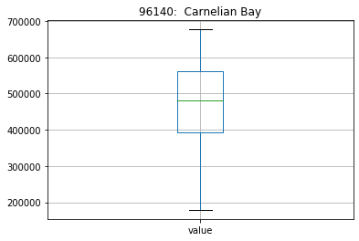


### Plot ACF and PACF for ts dataframe


```python
# plot_acf_pacf(ts, figsize=(10,6), lags=15)  # note that ts must only contain values and time as index

plot_acf_pacf(ts_96140_values, figsize=(10,6), lags=15)
```


### Plot seasonal decomposition for ts dataframe


```python
# plot_seasonal_decomp(ts)

plot_seasonal_decomp(ts_96140_values)

# Seasonality does not appear to be a significant factor in this zip code.
```


    (<Figure size 1296x432 with 1 Axes>,
     <matplotlib.axes._subplots.AxesSubplot at 0x1cc53ffeb8>)


## ARIMA model parameters and optimization

### Generate list of (p,d,q) and (p,d,q,m) values


```python
p_values = [0, 1, 2, 4, 6, 8]
d_values = range(0, 3)
q_values = range(0, 3)
warnings.filterwarnings("ignore")
```

### Run ARIMA model on ts dataframe with list of p,d,q values 


```python
# eval_arima_models(ts, p_values, d_values, q_values)  # don't run this until you have some time, since it take time
# note that ts must only contain values and time as index

# eval_arima_models(ts_96140_values, p_values, d_values, q_values)  # don't run this until you have some time, since it takes time

```

### Generate model fit summary


```python
# model_fit = arima_zipcode(ts, order = None)   # change order = tuple to correspond to the best MSE produced by previous function

# Best ARIMA(4, 2, 1) MSE=3386317.647

model_fit_96140 = arima_zipcode(ts_96140_values, order = (4,2,1))

```

                                 ARIMA Model Results                              
    ==============================================================================
    Dep. Variable:                   D2.y   No. Observations:                  263
    Model:                 ARIMA(4, 2, 1)   Log Likelihood               -2375.535
    Method:                       css-mle   S.D. of innovations           2021.246
    Date:                Tue, 10 Mar 2020   AIC                           4765.071
    Time:                        22:32:51   BIC                           4790.076
    Sample:                             2   HQIC                          4775.120
                                                                                  
    ==============================================================================
                     coef    std err          z      P>|z|      [0.025      0.975]
    ------------------------------------------------------------------------------
    const         20.1520    104.724      0.192      0.848    -185.103     225.407
    ar.L1.D2.y     0.9100      0.152      5.981      0.000       0.612       1.208
    ar.L2.D2.y    -0.8496      0.108     -7.888      0.000      -1.061      -0.638
    ar.L3.D2.y     0.4501      0.101      4.453      0.000       0.252       0.648
    ar.L4.D2.y    -0.3308      0.058     -5.685      0.000      -0.445      -0.217
    ma.L1.D2.y    -0.3144      0.158     -1.992      0.047      -0.624      -0.005
                                        Roots                                    
    =============================================================================
                      Real          Imaginary           Modulus         Frequency
    -----------------------------------------------------------------------------
    AR.1            0.9289           -0.8507j            1.2596           -0.1180
    AR.2            0.9289           +0.8507j            1.2596            0.1180
    AR.3           -0.2486           -1.3577j            1.3803           -0.2788
    AR.4           -0.2486           +1.3577j            1.3803            0.2788
    MA.1            3.1803           +0.0000j            3.1803            0.0000
    -----------------------------------------------------------------------------


## ARIMA modeling results:  predictions and visualization

### Produce forecasts from ARIMA model fit


```python
actual_forecast_96140, std_error_96140, forecast_confint_96140 = forecast(model_fit_96140)
```


```python
actual_forecast_96140, std_error_96140, forecast_confint_96140
```


    (array([648805.85825432, 653757.53047996, 658570.5323666 , 663085.9205481 ,
            668129.42124978, 673613.74237267, 678978.96063667, 684213.98234732,
            689471.96996441, 694678.55992772, 699816.1903089 , 705004.67382777,
            710283.81863351, 715604.75202823, 720948.92095822, 726319.24815545,
            731698.98739706, 737078.23269305, 742469.65046207, 747884.67828643,
            753324.0437325 , 758787.67018129, 764275.82806768, 769785.37238711]),
     array([  2021.24598845,   5622.17509084,   9655.22803129,  13738.77436637,
             17905.22528362,  22063.83320832,  26192.54172298,  30459.47931574,
             35013.71197477,  39877.62230576,  45024.70986922,  50423.95933807,
             56028.64400627,  61797.74762825,  67720.80777663,  73805.66990548,
             80059.7648204 ,  86487.01822255,  93087.70107906,  99856.33441153,
            106784.07083058, 113863.39953136, 121089.5971114 , 128459.83827426]),
     array([[ 644844.28891307,  652767.42759557],
            [ 642738.26978713,  664776.79117279],
            [ 639646.63316275,  677494.43157046],
            [ 636158.41759829,  690013.42349791],
            [ 633035.82455882,  703223.01794075],
            [ 630369.42392346,  716858.06082188],
            [ 627642.52219607,  730315.39907726],
            [ 624514.49990063,  743913.464794  ],
            [ 620846.35552879,  758097.58440002],
            [ 616519.85641934,  772837.2634361 ],
            [ 611569.38055086,  788063.00006693],
            [ 606175.52956724,  803833.81808829],
            [ 600469.69427861,  820097.94298841],
            [ 594483.39235116,  836726.1117053 ],
            [ 588218.57671207,  853679.26520438],
            [ 581662.79328585,  870975.70302505],
            [ 574784.73173833,  888613.24305578],
            [ 567566.79184659,  906589.6735395 ],
            [ 560021.10894349,  924918.19198064],
            [ 552169.85921165,  943599.49736122],
            [ 544031.11078199,  962616.97668302],
            [ 535619.50794253,  981955.83242006],
            [ 526944.57882688, 1001607.07730849],
            [ 518008.71590971, 1021562.0288645 ]]))


### Create dataframe to hold forecast results


```python
# df_forecast = forecast_df(col = 'time', daterange = pd.date_range(start='2018-05-01', end='2020-04-01', freq='MS'), 
#                 actual_forecast=actual_forecast, forecast_confint = forecast_confint)

df_forecast_96140 = forecast_df(actual_forecast_96140, forecast_confint_96140, col = 'time', daterange = pd.date_range(start='2018-05-01', end='2020-04-01', freq='MS'))

```

### Create new dataframe concatenating historic values and forecast results


```python
# df_new = concat_values_forecast(ts, df_forecast)

df_new_96140 = concat_values_forecast(ts_96140_values, df_forecast_96140)
```


```python
df_new_96140
```


<div>
<style scoped>
    .dataframe tbody tr th:only-of-type {
        vertical-align: middle;
    }

    .dataframe tbody tr th {
        vertical-align: top;
    }

    .dataframe thead th {
        text-align: right;
    }
</style>
<table border="1" class="dataframe">
  <thead>
    <tr style="text-align: right;">
      <th></th>
      <th>value</th>
      <th>forecast</th>
      <th>forecast_lower</th>
      <th>forecast_upper</th>
    </tr>
    <tr>
      <th>time</th>
      <th></th>
      <th></th>
      <th></th>
      <th></th>
    </tr>
  </thead>
  <tbody>
    <tr>
      <td>1996-04-01</td>
      <td>179100.0</td>
      <td>NaN</td>
      <td>NaN</td>
      <td>NaN</td>
    </tr>
    <tr>
      <td>1996-05-01</td>
      <td>179000.0</td>
      <td>NaN</td>
      <td>NaN</td>
      <td>NaN</td>
    </tr>
    <tr>
      <td>1996-06-01</td>
      <td>179000.0</td>
      <td>NaN</td>
      <td>NaN</td>
      <td>NaN</td>
    </tr>
    <tr>
      <td>1996-07-01</td>
      <td>178900.0</td>
      <td>NaN</td>
      <td>NaN</td>
      <td>NaN</td>
    </tr>
    <tr>
      <td>1996-08-01</td>
      <td>178900.0</td>
      <td>NaN</td>
      <td>NaN</td>
      <td>NaN</td>
    </tr>
    <tr>
      <td>1996-09-01</td>
      <td>179000.0</td>
      <td>NaN</td>
      <td>NaN</td>
      <td>NaN</td>
    </tr>
    <tr>
      <td>1996-10-01</td>
      <td>179300.0</td>
      <td>NaN</td>
      <td>NaN</td>
      <td>NaN</td>
    </tr>
    <tr>
      <td>1996-11-01</td>
      <td>179600.0</td>
      <td>NaN</td>
      <td>NaN</td>
      <td>NaN</td>
    </tr>
    <tr>
      <td>1996-12-01</td>
      <td>180000.0</td>
      <td>NaN</td>
      <td>NaN</td>
      <td>NaN</td>
    </tr>
    <tr>
      <td>1997-01-01</td>
      <td>180600.0</td>
      <td>NaN</td>
      <td>NaN</td>
      <td>NaN</td>
    </tr>
    <tr>
      <td>1997-02-01</td>
      <td>181200.0</td>
      <td>NaN</td>
      <td>NaN</td>
      <td>NaN</td>
    </tr>
    <tr>
      <td>1997-03-01</td>
      <td>181600.0</td>
      <td>NaN</td>
      <td>NaN</td>
      <td>NaN</td>
    </tr>
    <tr>
      <td>1997-04-01</td>
      <td>182000.0</td>
      <td>NaN</td>
      <td>NaN</td>
      <td>NaN</td>
    </tr>
    <tr>
      <td>1997-05-01</td>
      <td>182500.0</td>
      <td>NaN</td>
      <td>NaN</td>
      <td>NaN</td>
    </tr>
    <tr>
      <td>1997-06-01</td>
      <td>183200.0</td>
      <td>NaN</td>
      <td>NaN</td>
      <td>NaN</td>
    </tr>
    <tr>
      <td>1997-07-01</td>
      <td>183900.0</td>
      <td>NaN</td>
      <td>NaN</td>
      <td>NaN</td>
    </tr>
    <tr>
      <td>1997-08-01</td>
      <td>184700.0</td>
      <td>NaN</td>
      <td>NaN</td>
      <td>NaN</td>
    </tr>
    <tr>
      <td>1997-09-01</td>
      <td>185600.0</td>
      <td>NaN</td>
      <td>NaN</td>
      <td>NaN</td>
    </tr>
    <tr>
      <td>1997-10-01</td>
      <td>186700.0</td>
      <td>NaN</td>
      <td>NaN</td>
      <td>NaN</td>
    </tr>
    <tr>
      <td>1997-11-01</td>
      <td>187800.0</td>
      <td>NaN</td>
      <td>NaN</td>
      <td>NaN</td>
    </tr>
    <tr>
      <td>1997-12-01</td>
      <td>189000.0</td>
      <td>NaN</td>
      <td>NaN</td>
      <td>NaN</td>
    </tr>
    <tr>
      <td>1998-01-01</td>
      <td>190400.0</td>
      <td>NaN</td>
      <td>NaN</td>
      <td>NaN</td>
    </tr>
    <tr>
      <td>1998-02-01</td>
      <td>191800.0</td>
      <td>NaN</td>
      <td>NaN</td>
      <td>NaN</td>
    </tr>
    <tr>
      <td>1998-03-01</td>
      <td>193000.0</td>
      <td>NaN</td>
      <td>NaN</td>
      <td>NaN</td>
    </tr>
    <tr>
      <td>1998-04-01</td>
      <td>194200.0</td>
      <td>NaN</td>
      <td>NaN</td>
      <td>NaN</td>
    </tr>
    <tr>
      <td>1998-05-01</td>
      <td>195700.0</td>
      <td>NaN</td>
      <td>NaN</td>
      <td>NaN</td>
    </tr>
    <tr>
      <td>1998-06-01</td>
      <td>197200.0</td>
      <td>NaN</td>
      <td>NaN</td>
      <td>NaN</td>
    </tr>
    <tr>
      <td>1998-07-01</td>
      <td>198800.0</td>
      <td>NaN</td>
      <td>NaN</td>
      <td>NaN</td>
    </tr>
    <tr>
      <td>1998-08-01</td>
      <td>200700.0</td>
      <td>NaN</td>
      <td>NaN</td>
      <td>NaN</td>
    </tr>
    <tr>
      <td>1998-09-01</td>
      <td>202800.0</td>
      <td>NaN</td>
      <td>NaN</td>
      <td>NaN</td>
    </tr>
    <tr>
      <td>1998-10-01</td>
      <td>205200.0</td>
      <td>NaN</td>
      <td>NaN</td>
      <td>NaN</td>
    </tr>
    <tr>
      <td>1998-11-01</td>
      <td>207700.0</td>
      <td>NaN</td>
      <td>NaN</td>
      <td>NaN</td>
    </tr>
    <tr>
      <td>1998-12-01</td>
      <td>210500.0</td>
      <td>NaN</td>
      <td>NaN</td>
      <td>NaN</td>
    </tr>
    <tr>
      <td>1999-01-01</td>
      <td>213500.0</td>
      <td>NaN</td>
      <td>NaN</td>
      <td>NaN</td>
    </tr>
    <tr>
      <td>1999-02-01</td>
      <td>216500.0</td>
      <td>NaN</td>
      <td>NaN</td>
      <td>NaN</td>
    </tr>
    <tr>
      <td>1999-03-01</td>
      <td>219600.0</td>
      <td>NaN</td>
      <td>NaN</td>
      <td>NaN</td>
    </tr>
    <tr>
      <td>1999-04-01</td>
      <td>222900.0</td>
      <td>NaN</td>
      <td>NaN</td>
      <td>NaN</td>
    </tr>
    <tr>
      <td>1999-05-01</td>
      <td>226500.0</td>
      <td>NaN</td>
      <td>NaN</td>
      <td>NaN</td>
    </tr>
    <tr>
      <td>1999-06-01</td>
      <td>230400.0</td>
      <td>NaN</td>
      <td>NaN</td>
      <td>NaN</td>
    </tr>
    <tr>
      <td>1999-07-01</td>
      <td>234700.0</td>
      <td>NaN</td>
      <td>NaN</td>
      <td>NaN</td>
    </tr>
    <tr>
      <td>1999-08-01</td>
      <td>239300.0</td>
      <td>NaN</td>
      <td>NaN</td>
      <td>NaN</td>
    </tr>
    <tr>
      <td>1999-09-01</td>
      <td>244400.0</td>
      <td>NaN</td>
      <td>NaN</td>
      <td>NaN</td>
    </tr>
    <tr>
      <td>1999-10-01</td>
      <td>250100.0</td>
      <td>NaN</td>
      <td>NaN</td>
      <td>NaN</td>
    </tr>
    <tr>
      <td>1999-11-01</td>
      <td>256000.0</td>
      <td>NaN</td>
      <td>NaN</td>
      <td>NaN</td>
    </tr>
    <tr>
      <td>1999-12-01</td>
      <td>262300.0</td>
      <td>NaN</td>
      <td>NaN</td>
      <td>NaN</td>
    </tr>
    <tr>
      <td>2000-01-01</td>
      <td>269000.0</td>
      <td>NaN</td>
      <td>NaN</td>
      <td>NaN</td>
    </tr>
    <tr>
      <td>2000-02-01</td>
      <td>275900.0</td>
      <td>NaN</td>
      <td>NaN</td>
      <td>NaN</td>
    </tr>
    <tr>
      <td>2000-03-01</td>
      <td>282900.0</td>
      <td>NaN</td>
      <td>NaN</td>
      <td>NaN</td>
    </tr>
    <tr>
      <td>2000-04-01</td>
      <td>290100.0</td>
      <td>NaN</td>
      <td>NaN</td>
      <td>NaN</td>
    </tr>
    <tr>
      <td>2000-05-01</td>
      <td>297500.0</td>
      <td>NaN</td>
      <td>NaN</td>
      <td>NaN</td>
    </tr>
    <tr>
      <td>2000-06-01</td>
      <td>305100.0</td>
      <td>NaN</td>
      <td>NaN</td>
      <td>NaN</td>
    </tr>
    <tr>
      <td>2000-07-01</td>
      <td>312900.0</td>
      <td>NaN</td>
      <td>NaN</td>
      <td>NaN</td>
    </tr>
    <tr>
      <td>2000-08-01</td>
      <td>320900.0</td>
      <td>NaN</td>
      <td>NaN</td>
      <td>NaN</td>
    </tr>
    <tr>
      <td>2000-09-01</td>
      <td>328900.0</td>
      <td>NaN</td>
      <td>NaN</td>
      <td>NaN</td>
    </tr>
    <tr>
      <td>2000-10-01</td>
      <td>337100.0</td>
      <td>NaN</td>
      <td>NaN</td>
      <td>NaN</td>
    </tr>
    <tr>
      <td>2000-11-01</td>
      <td>345100.0</td>
      <td>NaN</td>
      <td>NaN</td>
      <td>NaN</td>
    </tr>
    <tr>
      <td>2000-12-01</td>
      <td>352500.0</td>
      <td>NaN</td>
      <td>NaN</td>
      <td>NaN</td>
    </tr>
    <tr>
      <td>2001-01-01</td>
      <td>359600.0</td>
      <td>NaN</td>
      <td>NaN</td>
      <td>NaN</td>
    </tr>
    <tr>
      <td>2001-02-01</td>
      <td>366200.0</td>
      <td>NaN</td>
      <td>NaN</td>
      <td>NaN</td>
    </tr>
    <tr>
      <td>2001-03-01</td>
      <td>372100.0</td>
      <td>NaN</td>
      <td>NaN</td>
      <td>NaN</td>
    </tr>
    <tr>
      <td>2001-04-01</td>
      <td>377700.0</td>
      <td>NaN</td>
      <td>NaN</td>
      <td>NaN</td>
    </tr>
    <tr>
      <td>2001-05-01</td>
      <td>382600.0</td>
      <td>NaN</td>
      <td>NaN</td>
      <td>NaN</td>
    </tr>
    <tr>
      <td>2001-06-01</td>
      <td>387200.0</td>
      <td>NaN</td>
      <td>NaN</td>
      <td>NaN</td>
    </tr>
    <tr>
      <td>2001-07-01</td>
      <td>391500.0</td>
      <td>NaN</td>
      <td>NaN</td>
      <td>NaN</td>
    </tr>
    <tr>
      <td>2001-08-01</td>
      <td>395500.0</td>
      <td>NaN</td>
      <td>NaN</td>
      <td>NaN</td>
    </tr>
    <tr>
      <td>2001-09-01</td>
      <td>399500.0</td>
      <td>NaN</td>
      <td>NaN</td>
      <td>NaN</td>
    </tr>
    <tr>
      <td>2001-10-01</td>
      <td>403700.0</td>
      <td>NaN</td>
      <td>NaN</td>
      <td>NaN</td>
    </tr>
    <tr>
      <td>2001-11-01</td>
      <td>407500.0</td>
      <td>NaN</td>
      <td>NaN</td>
      <td>NaN</td>
    </tr>
    <tr>
      <td>2001-12-01</td>
      <td>410700.0</td>
      <td>NaN</td>
      <td>NaN</td>
      <td>NaN</td>
    </tr>
    <tr>
      <td>2002-01-01</td>
      <td>413800.0</td>
      <td>NaN</td>
      <td>NaN</td>
      <td>NaN</td>
    </tr>
    <tr>
      <td>2002-02-01</td>
      <td>417000.0</td>
      <td>NaN</td>
      <td>NaN</td>
      <td>NaN</td>
    </tr>
    <tr>
      <td>2002-03-01</td>
      <td>420000.0</td>
      <td>NaN</td>
      <td>NaN</td>
      <td>NaN</td>
    </tr>
    <tr>
      <td>2002-04-01</td>
      <td>422900.0</td>
      <td>NaN</td>
      <td>NaN</td>
      <td>NaN</td>
    </tr>
    <tr>
      <td>2002-05-01</td>
      <td>425900.0</td>
      <td>NaN</td>
      <td>NaN</td>
      <td>NaN</td>
    </tr>
    <tr>
      <td>2002-06-01</td>
      <td>429100.0</td>
      <td>NaN</td>
      <td>NaN</td>
      <td>NaN</td>
    </tr>
    <tr>
      <td>2002-07-01</td>
      <td>432600.0</td>
      <td>NaN</td>
      <td>NaN</td>
      <td>NaN</td>
    </tr>
    <tr>
      <td>2002-08-01</td>
      <td>436500.0</td>
      <td>NaN</td>
      <td>NaN</td>
      <td>NaN</td>
    </tr>
    <tr>
      <td>2002-09-01</td>
      <td>441000.0</td>
      <td>NaN</td>
      <td>NaN</td>
      <td>NaN</td>
    </tr>
    <tr>
      <td>2002-10-01</td>
      <td>445500.0</td>
      <td>NaN</td>
      <td>NaN</td>
      <td>NaN</td>
    </tr>
    <tr>
      <td>2002-11-01</td>
      <td>452400.0</td>
      <td>NaN</td>
      <td>NaN</td>
      <td>NaN</td>
    </tr>
    <tr>
      <td>2002-12-01</td>
      <td>461600.0</td>
      <td>NaN</td>
      <td>NaN</td>
      <td>NaN</td>
    </tr>
    <tr>
      <td>2003-01-01</td>
      <td>469800.0</td>
      <td>NaN</td>
      <td>NaN</td>
      <td>NaN</td>
    </tr>
    <tr>
      <td>2003-02-01</td>
      <td>475300.0</td>
      <td>NaN</td>
      <td>NaN</td>
      <td>NaN</td>
    </tr>
    <tr>
      <td>2003-03-01</td>
      <td>480200.0</td>
      <td>NaN</td>
      <td>NaN</td>
      <td>NaN</td>
    </tr>
    <tr>
      <td>2003-04-01</td>
      <td>484500.0</td>
      <td>NaN</td>
      <td>NaN</td>
      <td>NaN</td>
    </tr>
    <tr>
      <td>2003-05-01</td>
      <td>487900.0</td>
      <td>NaN</td>
      <td>NaN</td>
      <td>NaN</td>
    </tr>
    <tr>
      <td>2003-06-01</td>
      <td>490600.0</td>
      <td>NaN</td>
      <td>NaN</td>
      <td>NaN</td>
    </tr>
    <tr>
      <td>2003-07-01</td>
      <td>492200.0</td>
      <td>NaN</td>
      <td>NaN</td>
      <td>NaN</td>
    </tr>
    <tr>
      <td>2003-08-01</td>
      <td>492000.0</td>
      <td>NaN</td>
      <td>NaN</td>
      <td>NaN</td>
    </tr>
    <tr>
      <td>2003-09-01</td>
      <td>490200.0</td>
      <td>NaN</td>
      <td>NaN</td>
      <td>NaN</td>
    </tr>
    <tr>
      <td>2003-10-01</td>
      <td>487800.0</td>
      <td>NaN</td>
      <td>NaN</td>
      <td>NaN</td>
    </tr>
    <tr>
      <td>2003-11-01</td>
      <td>485700.0</td>
      <td>NaN</td>
      <td>NaN</td>
      <td>NaN</td>
    </tr>
    <tr>
      <td>2003-12-01</td>
      <td>485100.0</td>
      <td>NaN</td>
      <td>NaN</td>
      <td>NaN</td>
    </tr>
    <tr>
      <td>2004-01-01</td>
      <td>486800.0</td>
      <td>NaN</td>
      <td>NaN</td>
      <td>NaN</td>
    </tr>
    <tr>
      <td>2004-02-01</td>
      <td>490700.0</td>
      <td>NaN</td>
      <td>NaN</td>
      <td>NaN</td>
    </tr>
    <tr>
      <td>2004-03-01</td>
      <td>495800.0</td>
      <td>NaN</td>
      <td>NaN</td>
      <td>NaN</td>
    </tr>
    <tr>
      <td>2004-04-01</td>
      <td>501800.0</td>
      <td>NaN</td>
      <td>NaN</td>
      <td>NaN</td>
    </tr>
    <tr>
      <td>2004-05-01</td>
      <td>508300.0</td>
      <td>NaN</td>
      <td>NaN</td>
      <td>NaN</td>
    </tr>
    <tr>
      <td>2004-06-01</td>
      <td>515400.0</td>
      <td>NaN</td>
      <td>NaN</td>
      <td>NaN</td>
    </tr>
    <tr>
      <td>2004-07-01</td>
      <td>523500.0</td>
      <td>NaN</td>
      <td>NaN</td>
      <td>NaN</td>
    </tr>
    <tr>
      <td>2004-08-01</td>
      <td>532700.0</td>
      <td>NaN</td>
      <td>NaN</td>
      <td>NaN</td>
    </tr>
    <tr>
      <td>2004-09-01</td>
      <td>543200.0</td>
      <td>NaN</td>
      <td>NaN</td>
      <td>NaN</td>
    </tr>
    <tr>
      <td>2004-10-01</td>
      <td>555000.0</td>
      <td>NaN</td>
      <td>NaN</td>
      <td>NaN</td>
    </tr>
    <tr>
      <td>2004-11-01</td>
      <td>566700.0</td>
      <td>NaN</td>
      <td>NaN</td>
      <td>NaN</td>
    </tr>
    <tr>
      <td>2004-12-01</td>
      <td>577500.0</td>
      <td>NaN</td>
      <td>NaN</td>
      <td>NaN</td>
    </tr>
    <tr>
      <td>2005-01-01</td>
      <td>587100.0</td>
      <td>NaN</td>
      <td>NaN</td>
      <td>NaN</td>
    </tr>
    <tr>
      <td>2005-02-01</td>
      <td>595800.0</td>
      <td>NaN</td>
      <td>NaN</td>
      <td>NaN</td>
    </tr>
    <tr>
      <td>2005-03-01</td>
      <td>604200.0</td>
      <td>NaN</td>
      <td>NaN</td>
      <td>NaN</td>
    </tr>
    <tr>
      <td>2005-04-01</td>
      <td>613200.0</td>
      <td>NaN</td>
      <td>NaN</td>
      <td>NaN</td>
    </tr>
    <tr>
      <td>2005-05-01</td>
      <td>622800.0</td>
      <td>NaN</td>
      <td>NaN</td>
      <td>NaN</td>
    </tr>
    <tr>
      <td>2005-06-01</td>
      <td>633500.0</td>
      <td>NaN</td>
      <td>NaN</td>
      <td>NaN</td>
    </tr>
    <tr>
      <td>2005-07-01</td>
      <td>645200.0</td>
      <td>NaN</td>
      <td>NaN</td>
      <td>NaN</td>
    </tr>
    <tr>
      <td>2005-08-01</td>
      <td>656300.0</td>
      <td>NaN</td>
      <td>NaN</td>
      <td>NaN</td>
    </tr>
    <tr>
      <td>2005-09-01</td>
      <td>665400.0</td>
      <td>NaN</td>
      <td>NaN</td>
      <td>NaN</td>
    </tr>
    <tr>
      <td>2005-10-01</td>
      <td>672300.0</td>
      <td>NaN</td>
      <td>NaN</td>
      <td>NaN</td>
    </tr>
    <tr>
      <td>2005-11-01</td>
      <td>675700.0</td>
      <td>NaN</td>
      <td>NaN</td>
      <td>NaN</td>
    </tr>
    <tr>
      <td>2005-12-01</td>
      <td>676600.0</td>
      <td>NaN</td>
      <td>NaN</td>
      <td>NaN</td>
    </tr>
    <tr>
      <td>2006-01-01</td>
      <td>676600.0</td>
      <td>NaN</td>
      <td>NaN</td>
      <td>NaN</td>
    </tr>
    <tr>
      <td>2006-02-01</td>
      <td>675400.0</td>
      <td>NaN</td>
      <td>NaN</td>
      <td>NaN</td>
    </tr>
    <tr>
      <td>2006-03-01</td>
      <td>672200.0</td>
      <td>NaN</td>
      <td>NaN</td>
      <td>NaN</td>
    </tr>
    <tr>
      <td>2006-04-01</td>
      <td>667000.0</td>
      <td>NaN</td>
      <td>NaN</td>
      <td>NaN</td>
    </tr>
    <tr>
      <td>2006-05-01</td>
      <td>659100.0</td>
      <td>NaN</td>
      <td>NaN</td>
      <td>NaN</td>
    </tr>
    <tr>
      <td>2006-06-01</td>
      <td>649900.0</td>
      <td>NaN</td>
      <td>NaN</td>
      <td>NaN</td>
    </tr>
    <tr>
      <td>2006-07-01</td>
      <td>641200.0</td>
      <td>NaN</td>
      <td>NaN</td>
      <td>NaN</td>
    </tr>
    <tr>
      <td>2006-08-01</td>
      <td>634100.0</td>
      <td>NaN</td>
      <td>NaN</td>
      <td>NaN</td>
    </tr>
    <tr>
      <td>2006-09-01</td>
      <td>629500.0</td>
      <td>NaN</td>
      <td>NaN</td>
      <td>NaN</td>
    </tr>
    <tr>
      <td>2006-10-01</td>
      <td>627700.0</td>
      <td>NaN</td>
      <td>NaN</td>
      <td>NaN</td>
    </tr>
    <tr>
      <td>2006-11-01</td>
      <td>627200.0</td>
      <td>NaN</td>
      <td>NaN</td>
      <td>NaN</td>
    </tr>
    <tr>
      <td>2006-12-01</td>
      <td>628100.0</td>
      <td>NaN</td>
      <td>NaN</td>
      <td>NaN</td>
    </tr>
    <tr>
      <td>2007-01-01</td>
      <td>630900.0</td>
      <td>NaN</td>
      <td>NaN</td>
      <td>NaN</td>
    </tr>
    <tr>
      <td>2007-02-01</td>
      <td>635700.0</td>
      <td>NaN</td>
      <td>NaN</td>
      <td>NaN</td>
    </tr>
    <tr>
      <td>2007-03-01</td>
      <td>641000.0</td>
      <td>NaN</td>
      <td>NaN</td>
      <td>NaN</td>
    </tr>
    <tr>
      <td>2007-04-01</td>
      <td>646700.0</td>
      <td>NaN</td>
      <td>NaN</td>
      <td>NaN</td>
    </tr>
    <tr>
      <td>2007-05-01</td>
      <td>651000.0</td>
      <td>NaN</td>
      <td>NaN</td>
      <td>NaN</td>
    </tr>
    <tr>
      <td>2007-06-01</td>
      <td>654300.0</td>
      <td>NaN</td>
      <td>NaN</td>
      <td>NaN</td>
    </tr>
    <tr>
      <td>2007-07-01</td>
      <td>656600.0</td>
      <td>NaN</td>
      <td>NaN</td>
      <td>NaN</td>
    </tr>
    <tr>
      <td>2007-08-01</td>
      <td>656800.0</td>
      <td>NaN</td>
      <td>NaN</td>
      <td>NaN</td>
    </tr>
    <tr>
      <td>2007-09-01</td>
      <td>653800.0</td>
      <td>NaN</td>
      <td>NaN</td>
      <td>NaN</td>
    </tr>
    <tr>
      <td>2007-10-01</td>
      <td>648200.0</td>
      <td>NaN</td>
      <td>NaN</td>
      <td>NaN</td>
    </tr>
    <tr>
      <td>2007-11-01</td>
      <td>637400.0</td>
      <td>NaN</td>
      <td>NaN</td>
      <td>NaN</td>
    </tr>
    <tr>
      <td>2007-12-01</td>
      <td>622600.0</td>
      <td>NaN</td>
      <td>NaN</td>
      <td>NaN</td>
    </tr>
    <tr>
      <td>2008-01-01</td>
      <td>608900.0</td>
      <td>NaN</td>
      <td>NaN</td>
      <td>NaN</td>
    </tr>
    <tr>
      <td>2008-02-01</td>
      <td>599700.0</td>
      <td>NaN</td>
      <td>NaN</td>
      <td>NaN</td>
    </tr>
    <tr>
      <td>2008-03-01</td>
      <td>595300.0</td>
      <td>NaN</td>
      <td>NaN</td>
      <td>NaN</td>
    </tr>
    <tr>
      <td>2008-04-01</td>
      <td>596700.0</td>
      <td>NaN</td>
      <td>NaN</td>
      <td>NaN</td>
    </tr>
    <tr>
      <td>2008-05-01</td>
      <td>600700.0</td>
      <td>NaN</td>
      <td>NaN</td>
      <td>NaN</td>
    </tr>
    <tr>
      <td>2008-06-01</td>
      <td>603900.0</td>
      <td>NaN</td>
      <td>NaN</td>
      <td>NaN</td>
    </tr>
    <tr>
      <td>2008-07-01</td>
      <td>603200.0</td>
      <td>NaN</td>
      <td>NaN</td>
      <td>NaN</td>
    </tr>
    <tr>
      <td>2008-08-01</td>
      <td>598400.0</td>
      <td>NaN</td>
      <td>NaN</td>
      <td>NaN</td>
    </tr>
    <tr>
      <td>2008-09-01</td>
      <td>593500.0</td>
      <td>NaN</td>
      <td>NaN</td>
      <td>NaN</td>
    </tr>
    <tr>
      <td>2008-10-01</td>
      <td>591500.0</td>
      <td>NaN</td>
      <td>NaN</td>
      <td>NaN</td>
    </tr>
    <tr>
      <td>2008-11-01</td>
      <td>587600.0</td>
      <td>NaN</td>
      <td>NaN</td>
      <td>NaN</td>
    </tr>
    <tr>
      <td>2008-12-01</td>
      <td>581500.0</td>
      <td>NaN</td>
      <td>NaN</td>
      <td>NaN</td>
    </tr>
    <tr>
      <td>2009-01-01</td>
      <td>576300.0</td>
      <td>NaN</td>
      <td>NaN</td>
      <td>NaN</td>
    </tr>
    <tr>
      <td>2009-02-01</td>
      <td>572400.0</td>
      <td>NaN</td>
      <td>NaN</td>
      <td>NaN</td>
    </tr>
    <tr>
      <td>2009-03-01</td>
      <td>567400.0</td>
      <td>NaN</td>
      <td>NaN</td>
      <td>NaN</td>
    </tr>
    <tr>
      <td>2009-04-01</td>
      <td>562100.0</td>
      <td>NaN</td>
      <td>NaN</td>
      <td>NaN</td>
    </tr>
    <tr>
      <td>2009-05-01</td>
      <td>555400.0</td>
      <td>NaN</td>
      <td>NaN</td>
      <td>NaN</td>
    </tr>
    <tr>
      <td>2009-06-01</td>
      <td>548400.0</td>
      <td>NaN</td>
      <td>NaN</td>
      <td>NaN</td>
    </tr>
    <tr>
      <td>2009-07-01</td>
      <td>542400.0</td>
      <td>NaN</td>
      <td>NaN</td>
      <td>NaN</td>
    </tr>
    <tr>
      <td>2009-08-01</td>
      <td>537300.0</td>
      <td>NaN</td>
      <td>NaN</td>
      <td>NaN</td>
    </tr>
    <tr>
      <td>2009-09-01</td>
      <td>533200.0</td>
      <td>NaN</td>
      <td>NaN</td>
      <td>NaN</td>
    </tr>
    <tr>
      <td>2009-10-01</td>
      <td>530300.0</td>
      <td>NaN</td>
      <td>NaN</td>
      <td>NaN</td>
    </tr>
    <tr>
      <td>2009-11-01</td>
      <td>524100.0</td>
      <td>NaN</td>
      <td>NaN</td>
      <td>NaN</td>
    </tr>
    <tr>
      <td>2009-12-01</td>
      <td>513600.0</td>
      <td>NaN</td>
      <td>NaN</td>
      <td>NaN</td>
    </tr>
    <tr>
      <td>2010-01-01</td>
      <td>506300.0</td>
      <td>NaN</td>
      <td>NaN</td>
      <td>NaN</td>
    </tr>
    <tr>
      <td>2010-02-01</td>
      <td>506300.0</td>
      <td>NaN</td>
      <td>NaN</td>
      <td>NaN</td>
    </tr>
    <tr>
      <td>2010-03-01</td>
      <td>503800.0</td>
      <td>NaN</td>
      <td>NaN</td>
      <td>NaN</td>
    </tr>
    <tr>
      <td>2010-04-01</td>
      <td>492000.0</td>
      <td>NaN</td>
      <td>NaN</td>
      <td>NaN</td>
    </tr>
    <tr>
      <td>2010-05-01</td>
      <td>479700.0</td>
      <td>NaN</td>
      <td>NaN</td>
      <td>NaN</td>
    </tr>
    <tr>
      <td>2010-06-01</td>
      <td>465900.0</td>
      <td>NaN</td>
      <td>NaN</td>
      <td>NaN</td>
    </tr>
    <tr>
      <td>2010-07-01</td>
      <td>450000.0</td>
      <td>NaN</td>
      <td>NaN</td>
      <td>NaN</td>
    </tr>
    <tr>
      <td>2010-08-01</td>
      <td>437000.0</td>
      <td>NaN</td>
      <td>NaN</td>
      <td>NaN</td>
    </tr>
    <tr>
      <td>2010-09-01</td>
      <td>430700.0</td>
      <td>NaN</td>
      <td>NaN</td>
      <td>NaN</td>
    </tr>
    <tr>
      <td>2010-10-01</td>
      <td>423000.0</td>
      <td>NaN</td>
      <td>NaN</td>
      <td>NaN</td>
    </tr>
    <tr>
      <td>2010-11-01</td>
      <td>425100.0</td>
      <td>NaN</td>
      <td>NaN</td>
      <td>NaN</td>
    </tr>
    <tr>
      <td>2010-12-01</td>
      <td>436300.0</td>
      <td>NaN</td>
      <td>NaN</td>
      <td>NaN</td>
    </tr>
    <tr>
      <td>2011-01-01</td>
      <td>441900.0</td>
      <td>NaN</td>
      <td>NaN</td>
      <td>NaN</td>
    </tr>
    <tr>
      <td>2011-02-01</td>
      <td>432200.0</td>
      <td>NaN</td>
      <td>NaN</td>
      <td>NaN</td>
    </tr>
    <tr>
      <td>2011-03-01</td>
      <td>423800.0</td>
      <td>NaN</td>
      <td>NaN</td>
      <td>NaN</td>
    </tr>
    <tr>
      <td>2011-04-01</td>
      <td>419700.0</td>
      <td>NaN</td>
      <td>NaN</td>
      <td>NaN</td>
    </tr>
    <tr>
      <td>2011-05-01</td>
      <td>419200.0</td>
      <td>NaN</td>
      <td>NaN</td>
      <td>NaN</td>
    </tr>
    <tr>
      <td>2011-06-01</td>
      <td>421300.0</td>
      <td>NaN</td>
      <td>NaN</td>
      <td>NaN</td>
    </tr>
    <tr>
      <td>2011-07-01</td>
      <td>423800.0</td>
      <td>NaN</td>
      <td>NaN</td>
      <td>NaN</td>
    </tr>
    <tr>
      <td>2011-08-01</td>
      <td>424000.0</td>
      <td>NaN</td>
      <td>NaN</td>
      <td>NaN</td>
    </tr>
    <tr>
      <td>2011-09-01</td>
      <td>418800.0</td>
      <td>NaN</td>
      <td>NaN</td>
      <td>NaN</td>
    </tr>
    <tr>
      <td>2011-10-01</td>
      <td>412500.0</td>
      <td>NaN</td>
      <td>NaN</td>
      <td>NaN</td>
    </tr>
    <tr>
      <td>2011-11-01</td>
      <td>408600.0</td>
      <td>NaN</td>
      <td>NaN</td>
      <td>NaN</td>
    </tr>
    <tr>
      <td>2011-12-01</td>
      <td>407900.0</td>
      <td>NaN</td>
      <td>NaN</td>
      <td>NaN</td>
    </tr>
    <tr>
      <td>2012-01-01</td>
      <td>407000.0</td>
      <td>NaN</td>
      <td>NaN</td>
      <td>NaN</td>
    </tr>
    <tr>
      <td>2012-02-01</td>
      <td>405900.0</td>
      <td>NaN</td>
      <td>NaN</td>
      <td>NaN</td>
    </tr>
    <tr>
      <td>2012-03-01</td>
      <td>400400.0</td>
      <td>NaN</td>
      <td>NaN</td>
      <td>NaN</td>
    </tr>
    <tr>
      <td>2012-04-01</td>
      <td>395400.0</td>
      <td>NaN</td>
      <td>NaN</td>
      <td>NaN</td>
    </tr>
    <tr>
      <td>2012-05-01</td>
      <td>390500.0</td>
      <td>NaN</td>
      <td>NaN</td>
      <td>NaN</td>
    </tr>
    <tr>
      <td>2012-06-01</td>
      <td>387900.0</td>
      <td>NaN</td>
      <td>NaN</td>
      <td>NaN</td>
    </tr>
    <tr>
      <td>2012-07-01</td>
      <td>391900.0</td>
      <td>NaN</td>
      <td>NaN</td>
      <td>NaN</td>
    </tr>
    <tr>
      <td>2012-08-01</td>
      <td>402300.0</td>
      <td>NaN</td>
      <td>NaN</td>
      <td>NaN</td>
    </tr>
    <tr>
      <td>2012-09-01</td>
      <td>412600.0</td>
      <td>NaN</td>
      <td>NaN</td>
      <td>NaN</td>
    </tr>
    <tr>
      <td>2012-10-01</td>
      <td>420600.0</td>
      <td>NaN</td>
      <td>NaN</td>
      <td>NaN</td>
    </tr>
    <tr>
      <td>2012-11-01</td>
      <td>424700.0</td>
      <td>NaN</td>
      <td>NaN</td>
      <td>NaN</td>
    </tr>
    <tr>
      <td>2012-12-01</td>
      <td>428100.0</td>
      <td>NaN</td>
      <td>NaN</td>
      <td>NaN</td>
    </tr>
    <tr>
      <td>2013-01-01</td>
      <td>434000.0</td>
      <td>NaN</td>
      <td>NaN</td>
      <td>NaN</td>
    </tr>
    <tr>
      <td>2013-02-01</td>
      <td>439500.0</td>
      <td>NaN</td>
      <td>NaN</td>
      <td>NaN</td>
    </tr>
    <tr>
      <td>2013-03-01</td>
      <td>444000.0</td>
      <td>NaN</td>
      <td>NaN</td>
      <td>NaN</td>
    </tr>
    <tr>
      <td>2013-04-01</td>
      <td>448800.0</td>
      <td>NaN</td>
      <td>NaN</td>
      <td>NaN</td>
    </tr>
    <tr>
      <td>2013-05-01</td>
      <td>455700.0</td>
      <td>NaN</td>
      <td>NaN</td>
      <td>NaN</td>
    </tr>
    <tr>
      <td>2013-06-01</td>
      <td>463000.0</td>
      <td>NaN</td>
      <td>NaN</td>
      <td>NaN</td>
    </tr>
    <tr>
      <td>2013-07-01</td>
      <td>468900.0</td>
      <td>NaN</td>
      <td>NaN</td>
      <td>NaN</td>
    </tr>
    <tr>
      <td>2013-08-01</td>
      <td>472300.0</td>
      <td>NaN</td>
      <td>NaN</td>
      <td>NaN</td>
    </tr>
    <tr>
      <td>2013-09-01</td>
      <td>474600.0</td>
      <td>NaN</td>
      <td>NaN</td>
      <td>NaN</td>
    </tr>
    <tr>
      <td>2013-10-01</td>
      <td>473000.0</td>
      <td>NaN</td>
      <td>NaN</td>
      <td>NaN</td>
    </tr>
    <tr>
      <td>2013-11-01</td>
      <td>469000.0</td>
      <td>NaN</td>
      <td>NaN</td>
      <td>NaN</td>
    </tr>
    <tr>
      <td>2013-12-01</td>
      <td>467200.0</td>
      <td>NaN</td>
      <td>NaN</td>
      <td>NaN</td>
    </tr>
    <tr>
      <td>2014-01-01</td>
      <td>467200.0</td>
      <td>NaN</td>
      <td>NaN</td>
      <td>NaN</td>
    </tr>
    <tr>
      <td>2014-02-01</td>
      <td>471100.0</td>
      <td>NaN</td>
      <td>NaN</td>
      <td>NaN</td>
    </tr>
    <tr>
      <td>2014-03-01</td>
      <td>480700.0</td>
      <td>NaN</td>
      <td>NaN</td>
      <td>NaN</td>
    </tr>
    <tr>
      <td>2014-04-01</td>
      <td>489200.0</td>
      <td>NaN</td>
      <td>NaN</td>
      <td>NaN</td>
    </tr>
    <tr>
      <td>2014-05-01</td>
      <td>491200.0</td>
      <td>NaN</td>
      <td>NaN</td>
      <td>NaN</td>
    </tr>
    <tr>
      <td>2014-06-01</td>
      <td>491200.0</td>
      <td>NaN</td>
      <td>NaN</td>
      <td>NaN</td>
    </tr>
    <tr>
      <td>2014-07-01</td>
      <td>488800.0</td>
      <td>NaN</td>
      <td>NaN</td>
      <td>NaN</td>
    </tr>
    <tr>
      <td>2014-08-01</td>
      <td>483600.0</td>
      <td>NaN</td>
      <td>NaN</td>
      <td>NaN</td>
    </tr>
    <tr>
      <td>2014-09-01</td>
      <td>480300.0</td>
      <td>NaN</td>
      <td>NaN</td>
      <td>NaN</td>
    </tr>
    <tr>
      <td>2014-10-01</td>
      <td>484200.0</td>
      <td>NaN</td>
      <td>NaN</td>
      <td>NaN</td>
    </tr>
    <tr>
      <td>2014-11-01</td>
      <td>489900.0</td>
      <td>NaN</td>
      <td>NaN</td>
      <td>NaN</td>
    </tr>
    <tr>
      <td>2014-12-01</td>
      <td>488600.0</td>
      <td>NaN</td>
      <td>NaN</td>
      <td>NaN</td>
    </tr>
    <tr>
      <td>2015-01-01</td>
      <td>481600.0</td>
      <td>NaN</td>
      <td>NaN</td>
      <td>NaN</td>
    </tr>
    <tr>
      <td>2015-02-01</td>
      <td>478200.0</td>
      <td>NaN</td>
      <td>NaN</td>
      <td>NaN</td>
    </tr>
    <tr>
      <td>2015-03-01</td>
      <td>479600.0</td>
      <td>NaN</td>
      <td>NaN</td>
      <td>NaN</td>
    </tr>
    <tr>
      <td>2015-04-01</td>
      <td>483700.0</td>
      <td>NaN</td>
      <td>NaN</td>
      <td>NaN</td>
    </tr>
    <tr>
      <td>2015-05-01</td>
      <td>491300.0</td>
      <td>NaN</td>
      <td>NaN</td>
      <td>NaN</td>
    </tr>
    <tr>
      <td>2015-06-01</td>
      <td>500000.0</td>
      <td>NaN</td>
      <td>NaN</td>
      <td>NaN</td>
    </tr>
    <tr>
      <td>2015-07-01</td>
      <td>508500.0</td>
      <td>NaN</td>
      <td>NaN</td>
      <td>NaN</td>
    </tr>
    <tr>
      <td>2015-08-01</td>
      <td>512200.0</td>
      <td>NaN</td>
      <td>NaN</td>
      <td>NaN</td>
    </tr>
    <tr>
      <td>2015-09-01</td>
      <td>511800.0</td>
      <td>NaN</td>
      <td>NaN</td>
      <td>NaN</td>
    </tr>
    <tr>
      <td>2015-10-01</td>
      <td>514200.0</td>
      <td>NaN</td>
      <td>NaN</td>
      <td>NaN</td>
    </tr>
    <tr>
      <td>2015-11-01</td>
      <td>518400.0</td>
      <td>NaN</td>
      <td>NaN</td>
      <td>NaN</td>
    </tr>
    <tr>
      <td>2015-12-01</td>
      <td>519100.0</td>
      <td>NaN</td>
      <td>NaN</td>
      <td>NaN</td>
    </tr>
    <tr>
      <td>2016-01-01</td>
      <td>521600.0</td>
      <td>NaN</td>
      <td>NaN</td>
      <td>NaN</td>
    </tr>
    <tr>
      <td>2016-02-01</td>
      <td>526700.0</td>
      <td>NaN</td>
      <td>NaN</td>
      <td>NaN</td>
    </tr>
    <tr>
      <td>2016-03-01</td>
      <td>530000.0</td>
      <td>NaN</td>
      <td>NaN</td>
      <td>NaN</td>
    </tr>
    <tr>
      <td>2016-04-01</td>
      <td>532500.0</td>
      <td>NaN</td>
      <td>NaN</td>
      <td>NaN</td>
    </tr>
    <tr>
      <td>2016-05-01</td>
      <td>535100.0</td>
      <td>NaN</td>
      <td>NaN</td>
      <td>NaN</td>
    </tr>
    <tr>
      <td>2016-06-01</td>
      <td>537500.0</td>
      <td>NaN</td>
      <td>NaN</td>
      <td>NaN</td>
    </tr>
    <tr>
      <td>2016-07-01</td>
      <td>539500.0</td>
      <td>NaN</td>
      <td>NaN</td>
      <td>NaN</td>
    </tr>
    <tr>
      <td>2016-08-01</td>
      <td>541600.0</td>
      <td>NaN</td>
      <td>NaN</td>
      <td>NaN</td>
    </tr>
    <tr>
      <td>2016-09-01</td>
      <td>542900.0</td>
      <td>NaN</td>
      <td>NaN</td>
      <td>NaN</td>
    </tr>
    <tr>
      <td>2016-10-01</td>
      <td>544700.0</td>
      <td>NaN</td>
      <td>NaN</td>
      <td>NaN</td>
    </tr>
    <tr>
      <td>2016-11-01</td>
      <td>546800.0</td>
      <td>NaN</td>
      <td>NaN</td>
      <td>NaN</td>
    </tr>
    <tr>
      <td>2016-12-01</td>
      <td>550600.0</td>
      <td>NaN</td>
      <td>NaN</td>
      <td>NaN</td>
    </tr>
    <tr>
      <td>2017-01-01</td>
      <td>555300.0</td>
      <td>NaN</td>
      <td>NaN</td>
      <td>NaN</td>
    </tr>
    <tr>
      <td>2017-02-01</td>
      <td>558100.0</td>
      <td>NaN</td>
      <td>NaN</td>
      <td>NaN</td>
    </tr>
    <tr>
      <td>2017-03-01</td>
      <td>560500.0</td>
      <td>NaN</td>
      <td>NaN</td>
      <td>NaN</td>
    </tr>
    <tr>
      <td>2017-04-01</td>
      <td>566700.0</td>
      <td>NaN</td>
      <td>NaN</td>
      <td>NaN</td>
    </tr>
    <tr>
      <td>2017-05-01</td>
      <td>573900.0</td>
      <td>NaN</td>
      <td>NaN</td>
      <td>NaN</td>
    </tr>
    <tr>
      <td>2017-06-01</td>
      <td>579200.0</td>
      <td>NaN</td>
      <td>NaN</td>
      <td>NaN</td>
    </tr>
    <tr>
      <td>2017-07-01</td>
      <td>586200.0</td>
      <td>NaN</td>
      <td>NaN</td>
      <td>NaN</td>
    </tr>
    <tr>
      <td>2017-08-01</td>
      <td>594300.0</td>
      <td>NaN</td>
      <td>NaN</td>
      <td>NaN</td>
    </tr>
    <tr>
      <td>2017-09-01</td>
      <td>602600.0</td>
      <td>NaN</td>
      <td>NaN</td>
      <td>NaN</td>
    </tr>
    <tr>
      <td>2017-10-01</td>
      <td>611800.0</td>
      <td>NaN</td>
      <td>NaN</td>
      <td>NaN</td>
    </tr>
    <tr>
      <td>2017-11-01</td>
      <td>618800.0</td>
      <td>NaN</td>
      <td>NaN</td>
      <td>NaN</td>
    </tr>
    <tr>
      <td>2017-12-01</td>
      <td>622400.0</td>
      <td>NaN</td>
      <td>NaN</td>
      <td>NaN</td>
    </tr>
    <tr>
      <td>2018-01-01</td>
      <td>625000.0</td>
      <td>NaN</td>
      <td>NaN</td>
      <td>NaN</td>
    </tr>
    <tr>
      <td>2018-02-01</td>
      <td>631500.0</td>
      <td>NaN</td>
      <td>NaN</td>
      <td>NaN</td>
    </tr>
    <tr>
      <td>2018-03-01</td>
      <td>639400.0</td>
      <td>NaN</td>
      <td>NaN</td>
      <td>NaN</td>
    </tr>
    <tr>
      <td>2018-04-01</td>
      <td>644600.0</td>
      <td>NaN</td>
      <td>NaN</td>
      <td>NaN</td>
    </tr>
    <tr>
      <td>2018-05-01</td>
      <td>NaN</td>
      <td>648805.858254</td>
      <td>644844.288913</td>
      <td>6.527674e+05</td>
    </tr>
    <tr>
      <td>2018-06-01</td>
      <td>NaN</td>
      <td>653757.530480</td>
      <td>642738.269787</td>
      <td>6.647768e+05</td>
    </tr>
    <tr>
      <td>2018-07-01</td>
      <td>NaN</td>
      <td>658570.532367</td>
      <td>639646.633163</td>
      <td>6.774944e+05</td>
    </tr>
    <tr>
      <td>2018-08-01</td>
      <td>NaN</td>
      <td>663085.920548</td>
      <td>636158.417598</td>
      <td>6.900134e+05</td>
    </tr>
    <tr>
      <td>2018-09-01</td>
      <td>NaN</td>
      <td>668129.421250</td>
      <td>633035.824559</td>
      <td>7.032230e+05</td>
    </tr>
    <tr>
      <td>2018-10-01</td>
      <td>NaN</td>
      <td>673613.742373</td>
      <td>630369.423923</td>
      <td>7.168581e+05</td>
    </tr>
    <tr>
      <td>2018-11-01</td>
      <td>NaN</td>
      <td>678978.960637</td>
      <td>627642.522196</td>
      <td>7.303154e+05</td>
    </tr>
    <tr>
      <td>2018-12-01</td>
      <td>NaN</td>
      <td>684213.982347</td>
      <td>624514.499901</td>
      <td>7.439135e+05</td>
    </tr>
    <tr>
      <td>2019-01-01</td>
      <td>NaN</td>
      <td>689471.969964</td>
      <td>620846.355529</td>
      <td>7.580976e+05</td>
    </tr>
    <tr>
      <td>2019-02-01</td>
      <td>NaN</td>
      <td>694678.559928</td>
      <td>616519.856419</td>
      <td>7.728373e+05</td>
    </tr>
    <tr>
      <td>2019-03-01</td>
      <td>NaN</td>
      <td>699816.190309</td>
      <td>611569.380551</td>
      <td>7.880630e+05</td>
    </tr>
    <tr>
      <td>2019-04-01</td>
      <td>NaN</td>
      <td>705004.673828</td>
      <td>606175.529567</td>
      <td>8.038338e+05</td>
    </tr>
    <tr>
      <td>2019-05-01</td>
      <td>NaN</td>
      <td>710283.818634</td>
      <td>600469.694279</td>
      <td>8.200979e+05</td>
    </tr>
    <tr>
      <td>2019-06-01</td>
      <td>NaN</td>
      <td>715604.752028</td>
      <td>594483.392351</td>
      <td>8.367261e+05</td>
    </tr>
    <tr>
      <td>2019-07-01</td>
      <td>NaN</td>
      <td>720948.920958</td>
      <td>588218.576712</td>
      <td>8.536793e+05</td>
    </tr>
    <tr>
      <td>2019-08-01</td>
      <td>NaN</td>
      <td>726319.248155</td>
      <td>581662.793286</td>
      <td>8.709757e+05</td>
    </tr>
    <tr>
      <td>2019-09-01</td>
      <td>NaN</td>
      <td>731698.987397</td>
      <td>574784.731738</td>
      <td>8.886132e+05</td>
    </tr>
    <tr>
      <td>2019-10-01</td>
      <td>NaN</td>
      <td>737078.232693</td>
      <td>567566.791847</td>
      <td>9.065897e+05</td>
    </tr>
    <tr>
      <td>2019-11-01</td>
      <td>NaN</td>
      <td>742469.650462</td>
      <td>560021.108943</td>
      <td>9.249182e+05</td>
    </tr>
    <tr>
      <td>2019-12-01</td>
      <td>NaN</td>
      <td>747884.678286</td>
      <td>552169.859212</td>
      <td>9.435995e+05</td>
    </tr>
    <tr>
      <td>2020-01-01</td>
      <td>NaN</td>
      <td>753324.043733</td>
      <td>544031.110782</td>
      <td>9.626170e+05</td>
    </tr>
    <tr>
      <td>2020-02-01</td>
      <td>NaN</td>
      <td>758787.670181</td>
      <td>535619.507943</td>
      <td>9.819558e+05</td>
    </tr>
    <tr>
      <td>2020-03-01</td>
      <td>NaN</td>
      <td>764275.828068</td>
      <td>526944.578827</td>
      <td>1.001607e+06</td>
    </tr>
    <tr>
      <td>2020-04-01</td>
      <td>NaN</td>
      <td>769785.372387</td>
      <td>518008.715910</td>
      <td>1.021562e+06</td>
    </tr>
  </tbody>
</table>
</div>


### Calculate predicted, lower bound, and upper bound forecasted prices


```python
forecasted_price_96140, forecasted_lower_96140, forecasted_upper_96140 = forecast_values(df_new_96140)
```


```python
forecasted_price_96140, forecasted_lower_96140, forecasted_upper_96140  # predicted, best-case, and worst-case prices in 2020

```


    (769785.3723871063, 518008.71590971446, 1021562.0288644981)


```python
last_value_96140 = df_new_96140['value'].loc['2018-04-01']
```


```python
last_value_96140
```


    644600.0


### Plot forecast with confidence intervals


```python
# plot_forecast(df = df_new, figsize=(12,8), geog=None)

plot_forecast(df_new_96140, figsize=(12,8), geog='96140:  Carnelian Bay')
```


### Print summary of predicted, worst-case, and best-case scenarios


```python
cb_96140_pred, cb_96140_low, cb_96140_high = pred_best_worst(pred=forecasted_price_96140, low=forecasted_lower_96140, high=forecasted_upper_96140, last=last_value_96140, date='April 1, 2020')
cb_96140_pred, cb_96140_low, cb_96140_high
```

    By the model prediction, I would expect to see a 19.421% change in price by April 1, 2020.
    At the lower bound of the confidence interval, I would expect to see a -19.639% change in price by April 1, 2020.
    At the upper bound of the confidence interval, I would expect to see a 58.48% change in price by April 1, 2020.


    (19.421, -19.639, 58.48)


## Zip code 96140:  Definite investment opportunity with potentially large upside returns

By the model prediction, I would expect to see a 19.421% change in price by April 1, 2020
At the lower bound of the confidence interval, I would expect to see a -19.639% change in price by April 1, 2020
At the upper bound of the confidence interval, I would expect to see a 58.48% change in price by April 1, 2020


# SacMetro:  95672 (Rescue) -- Solid investment opportunity 


```python
geog_area = '95672'
```


```python
ts_95672 = df_sac.loc[df_sac['Zip'] == geog_area]  # ts for all of the following functions should have only one zipcode
ts_95672.head()

```


<div>
<style scoped>
    .dataframe tbody tr th:only-of-type {
        vertical-align: middle;
    }

    .dataframe tbody tr th {
        vertical-align: top;
    }

    .dataframe thead th {
        text-align: right;
    }
</style>
<table border="1" class="dataframe">
  <thead>
    <tr style="text-align: right;">
      <th></th>
      <th>Metro</th>
      <th>MetroState</th>
      <th>CountyName</th>
      <th>City</th>
      <th>Zip</th>
      <th>SizeRank</th>
      <th>value</th>
    </tr>
    <tr>
      <th>time</th>
      <th></th>
      <th></th>
      <th></th>
      <th></th>
      <th></th>
      <th></th>
      <th></th>
    </tr>
  </thead>
  <tbody>
    <tr>
      <td>1996-04-01</td>
      <td>Sacramento</td>
      <td>Sacramento CA</td>
      <td>El Dorado</td>
      <td>Rescue</td>
      <td>95672</td>
      <td>11257</td>
      <td>196500.0</td>
    </tr>
    <tr>
      <td>1996-05-01</td>
      <td>Sacramento</td>
      <td>Sacramento CA</td>
      <td>El Dorado</td>
      <td>Rescue</td>
      <td>95672</td>
      <td>11257</td>
      <td>196600.0</td>
    </tr>
    <tr>
      <td>1996-06-01</td>
      <td>Sacramento</td>
      <td>Sacramento CA</td>
      <td>El Dorado</td>
      <td>Rescue</td>
      <td>95672</td>
      <td>11257</td>
      <td>196700.0</td>
    </tr>
    <tr>
      <td>1996-07-01</td>
      <td>Sacramento</td>
      <td>Sacramento CA</td>
      <td>El Dorado</td>
      <td>Rescue</td>
      <td>95672</td>
      <td>11257</td>
      <td>196900.0</td>
    </tr>
    <tr>
      <td>1996-08-01</td>
      <td>Sacramento</td>
      <td>Sacramento CA</td>
      <td>El Dorado</td>
      <td>Rescue</td>
      <td>95672</td>
      <td>11257</td>
      <td>197000.0</td>
    </tr>
  </tbody>
</table>
</div>


```python
# ts.head()

ts_95672.head()
```


<div>
<style scoped>
    .dataframe tbody tr th:only-of-type {
        vertical-align: middle;
    }

    .dataframe tbody tr th {
        vertical-align: top;
    }

    .dataframe thead th {
        text-align: right;
    }
</style>
<table border="1" class="dataframe">
  <thead>
    <tr style="text-align: right;">
      <th></th>
      <th>Metro</th>
      <th>MetroState</th>
      <th>CountyName</th>
      <th>City</th>
      <th>Zip</th>
      <th>SizeRank</th>
      <th>value</th>
    </tr>
    <tr>
      <th>time</th>
      <th></th>
      <th></th>
      <th></th>
      <th></th>
      <th></th>
      <th></th>
      <th></th>
    </tr>
  </thead>
  <tbody>
    <tr>
      <td>1996-04-01</td>
      <td>Sacramento</td>
      <td>Sacramento CA</td>
      <td>El Dorado</td>
      <td>Rescue</td>
      <td>95672</td>
      <td>11257</td>
      <td>196500.0</td>
    </tr>
    <tr>
      <td>1996-05-01</td>
      <td>Sacramento</td>
      <td>Sacramento CA</td>
      <td>El Dorado</td>
      <td>Rescue</td>
      <td>95672</td>
      <td>11257</td>
      <td>196600.0</td>
    </tr>
    <tr>
      <td>1996-06-01</td>
      <td>Sacramento</td>
      <td>Sacramento CA</td>
      <td>El Dorado</td>
      <td>Rescue</td>
      <td>95672</td>
      <td>11257</td>
      <td>196700.0</td>
    </tr>
    <tr>
      <td>1996-07-01</td>
      <td>Sacramento</td>
      <td>Sacramento CA</td>
      <td>El Dorado</td>
      <td>Rescue</td>
      <td>95672</td>
      <td>11257</td>
      <td>196900.0</td>
    </tr>
    <tr>
      <td>1996-08-01</td>
      <td>Sacramento</td>
      <td>Sacramento CA</td>
      <td>El Dorado</td>
      <td>Rescue</td>
      <td>95672</td>
      <td>11257</td>
      <td>197000.0</td>
    </tr>
  </tbody>
</table>
</div>


```python
# ts = ts.value

ts_95672_values = ts_95672.value
```


```python
# ts.head()

ts_95672_values.head()
```


    time
    1996-04-01    196500.0
    1996-05-01    196600.0
    1996-06-01    196700.0
    1996-07-01    196900.0
    1996-08-01    197000.0
    Name: value, dtype: float64


```python
ts_95672_values.tail()
```


    time
    2017-12-01    542100.0
    2018-01-01    548700.0
    2018-02-01    557900.0
    2018-03-01    570200.0
    2018-04-01    579300.0
    Name: value, dtype: float64


### Visualizations

#### plot_ts:  Plot zip code(s) of interest over time, with market highs and lows


```python
# fig, ax = plot_ts(df_melt, zipcodes=['95616', '92008', '90035', '90025', '60625', '57701'])  # enter desired zip code(s)

fig, ax = plot_ts_zips(df_melt, zipcodes=['95672'], figsize=(12,6))  # enter desired zip code(s)
```


```python
ts_95672
```


<div>
<style scoped>
    .dataframe tbody tr th:only-of-type {
        vertical-align: middle;
    }

    .dataframe tbody tr th {
        vertical-align: top;
    }

    .dataframe thead th {
        text-align: right;
    }
</style>
<table border="1" class="dataframe">
  <thead>
    <tr style="text-align: right;">
      <th></th>
      <th>Metro</th>
      <th>MetroState</th>
      <th>CountyName</th>
      <th>City</th>
      <th>Zip</th>
      <th>SizeRank</th>
      <th>value</th>
    </tr>
    <tr>
      <th>time</th>
      <th></th>
      <th></th>
      <th></th>
      <th></th>
      <th></th>
      <th></th>
      <th></th>
    </tr>
  </thead>
  <tbody>
    <tr>
      <td>1996-04-01</td>
      <td>Sacramento</td>
      <td>Sacramento CA</td>
      <td>El Dorado</td>
      <td>Rescue</td>
      <td>95672</td>
      <td>11257</td>
      <td>196500.0</td>
    </tr>
    <tr>
      <td>1996-05-01</td>
      <td>Sacramento</td>
      <td>Sacramento CA</td>
      <td>El Dorado</td>
      <td>Rescue</td>
      <td>95672</td>
      <td>11257</td>
      <td>196600.0</td>
    </tr>
    <tr>
      <td>1996-06-01</td>
      <td>Sacramento</td>
      <td>Sacramento CA</td>
      <td>El Dorado</td>
      <td>Rescue</td>
      <td>95672</td>
      <td>11257</td>
      <td>196700.0</td>
    </tr>
    <tr>
      <td>1996-07-01</td>
      <td>Sacramento</td>
      <td>Sacramento CA</td>
      <td>El Dorado</td>
      <td>Rescue</td>
      <td>95672</td>
      <td>11257</td>
      <td>196900.0</td>
    </tr>
    <tr>
      <td>1996-08-01</td>
      <td>Sacramento</td>
      <td>Sacramento CA</td>
      <td>El Dorado</td>
      <td>Rescue</td>
      <td>95672</td>
      <td>11257</td>
      <td>197000.0</td>
    </tr>
    <tr>
      <td>1996-09-01</td>
      <td>Sacramento</td>
      <td>Sacramento CA</td>
      <td>El Dorado</td>
      <td>Rescue</td>
      <td>95672</td>
      <td>11257</td>
      <td>197100.0</td>
    </tr>
    <tr>
      <td>1996-10-01</td>
      <td>Sacramento</td>
      <td>Sacramento CA</td>
      <td>El Dorado</td>
      <td>Rescue</td>
      <td>95672</td>
      <td>11257</td>
      <td>197300.0</td>
    </tr>
    <tr>
      <td>1996-11-01</td>
      <td>Sacramento</td>
      <td>Sacramento CA</td>
      <td>El Dorado</td>
      <td>Rescue</td>
      <td>95672</td>
      <td>11257</td>
      <td>197500.0</td>
    </tr>
    <tr>
      <td>1996-12-01</td>
      <td>Sacramento</td>
      <td>Sacramento CA</td>
      <td>El Dorado</td>
      <td>Rescue</td>
      <td>95672</td>
      <td>11257</td>
      <td>198100.0</td>
    </tr>
    <tr>
      <td>1997-01-01</td>
      <td>Sacramento</td>
      <td>Sacramento CA</td>
      <td>El Dorado</td>
      <td>Rescue</td>
      <td>95672</td>
      <td>11257</td>
      <td>198800.0</td>
    </tr>
    <tr>
      <td>1997-02-01</td>
      <td>Sacramento</td>
      <td>Sacramento CA</td>
      <td>El Dorado</td>
      <td>Rescue</td>
      <td>95672</td>
      <td>11257</td>
      <td>199400.0</td>
    </tr>
    <tr>
      <td>1997-03-01</td>
      <td>Sacramento</td>
      <td>Sacramento CA</td>
      <td>El Dorado</td>
      <td>Rescue</td>
      <td>95672</td>
      <td>11257</td>
      <td>199900.0</td>
    </tr>
    <tr>
      <td>1997-04-01</td>
      <td>Sacramento</td>
      <td>Sacramento CA</td>
      <td>El Dorado</td>
      <td>Rescue</td>
      <td>95672</td>
      <td>11257</td>
      <td>200500.0</td>
    </tr>
    <tr>
      <td>1997-05-01</td>
      <td>Sacramento</td>
      <td>Sacramento CA</td>
      <td>El Dorado</td>
      <td>Rescue</td>
      <td>95672</td>
      <td>11257</td>
      <td>201000.0</td>
    </tr>
    <tr>
      <td>1997-06-01</td>
      <td>Sacramento</td>
      <td>Sacramento CA</td>
      <td>El Dorado</td>
      <td>Rescue</td>
      <td>95672</td>
      <td>11257</td>
      <td>201700.0</td>
    </tr>
    <tr>
      <td>1997-07-01</td>
      <td>Sacramento</td>
      <td>Sacramento CA</td>
      <td>El Dorado</td>
      <td>Rescue</td>
      <td>95672</td>
      <td>11257</td>
      <td>202300.0</td>
    </tr>
    <tr>
      <td>1997-08-01</td>
      <td>Sacramento</td>
      <td>Sacramento CA</td>
      <td>El Dorado</td>
      <td>Rescue</td>
      <td>95672</td>
      <td>11257</td>
      <td>202800.0</td>
    </tr>
    <tr>
      <td>1997-09-01</td>
      <td>Sacramento</td>
      <td>Sacramento CA</td>
      <td>El Dorado</td>
      <td>Rescue</td>
      <td>95672</td>
      <td>11257</td>
      <td>203400.0</td>
    </tr>
    <tr>
      <td>1997-10-01</td>
      <td>Sacramento</td>
      <td>Sacramento CA</td>
      <td>El Dorado</td>
      <td>Rescue</td>
      <td>95672</td>
      <td>11257</td>
      <td>204000.0</td>
    </tr>
    <tr>
      <td>1997-11-01</td>
      <td>Sacramento</td>
      <td>Sacramento CA</td>
      <td>El Dorado</td>
      <td>Rescue</td>
      <td>95672</td>
      <td>11257</td>
      <td>204800.0</td>
    </tr>
    <tr>
      <td>1997-12-01</td>
      <td>Sacramento</td>
      <td>Sacramento CA</td>
      <td>El Dorado</td>
      <td>Rescue</td>
      <td>95672</td>
      <td>11257</td>
      <td>205800.0</td>
    </tr>
    <tr>
      <td>1998-01-01</td>
      <td>Sacramento</td>
      <td>Sacramento CA</td>
      <td>El Dorado</td>
      <td>Rescue</td>
      <td>95672</td>
      <td>11257</td>
      <td>206900.0</td>
    </tr>
    <tr>
      <td>1998-02-01</td>
      <td>Sacramento</td>
      <td>Sacramento CA</td>
      <td>El Dorado</td>
      <td>Rescue</td>
      <td>95672</td>
      <td>11257</td>
      <td>208000.0</td>
    </tr>
    <tr>
      <td>1998-03-01</td>
      <td>Sacramento</td>
      <td>Sacramento CA</td>
      <td>El Dorado</td>
      <td>Rescue</td>
      <td>95672</td>
      <td>11257</td>
      <td>208900.0</td>
    </tr>
    <tr>
      <td>1998-04-01</td>
      <td>Sacramento</td>
      <td>Sacramento CA</td>
      <td>El Dorado</td>
      <td>Rescue</td>
      <td>95672</td>
      <td>11257</td>
      <td>209800.0</td>
    </tr>
    <tr>
      <td>1998-05-01</td>
      <td>Sacramento</td>
      <td>Sacramento CA</td>
      <td>El Dorado</td>
      <td>Rescue</td>
      <td>95672</td>
      <td>11257</td>
      <td>210700.0</td>
    </tr>
    <tr>
      <td>1998-06-01</td>
      <td>Sacramento</td>
      <td>Sacramento CA</td>
      <td>El Dorado</td>
      <td>Rescue</td>
      <td>95672</td>
      <td>11257</td>
      <td>211700.0</td>
    </tr>
    <tr>
      <td>1998-07-01</td>
      <td>Sacramento</td>
      <td>Sacramento CA</td>
      <td>El Dorado</td>
      <td>Rescue</td>
      <td>95672</td>
      <td>11257</td>
      <td>212600.0</td>
    </tr>
    <tr>
      <td>1998-08-01</td>
      <td>Sacramento</td>
      <td>Sacramento CA</td>
      <td>El Dorado</td>
      <td>Rescue</td>
      <td>95672</td>
      <td>11257</td>
      <td>213500.0</td>
    </tr>
    <tr>
      <td>1998-09-01</td>
      <td>Sacramento</td>
      <td>Sacramento CA</td>
      <td>El Dorado</td>
      <td>Rescue</td>
      <td>95672</td>
      <td>11257</td>
      <td>214500.0</td>
    </tr>
    <tr>
      <td>1998-10-01</td>
      <td>Sacramento</td>
      <td>Sacramento CA</td>
      <td>El Dorado</td>
      <td>Rescue</td>
      <td>95672</td>
      <td>11257</td>
      <td>215500.0</td>
    </tr>
    <tr>
      <td>1998-11-01</td>
      <td>Sacramento</td>
      <td>Sacramento CA</td>
      <td>El Dorado</td>
      <td>Rescue</td>
      <td>95672</td>
      <td>11257</td>
      <td>216500.0</td>
    </tr>
    <tr>
      <td>1998-12-01</td>
      <td>Sacramento</td>
      <td>Sacramento CA</td>
      <td>El Dorado</td>
      <td>Rescue</td>
      <td>95672</td>
      <td>11257</td>
      <td>217900.0</td>
    </tr>
    <tr>
      <td>1999-01-01</td>
      <td>Sacramento</td>
      <td>Sacramento CA</td>
      <td>El Dorado</td>
      <td>Rescue</td>
      <td>95672</td>
      <td>11257</td>
      <td>219400.0</td>
    </tr>
    <tr>
      <td>1999-02-01</td>
      <td>Sacramento</td>
      <td>Sacramento CA</td>
      <td>El Dorado</td>
      <td>Rescue</td>
      <td>95672</td>
      <td>11257</td>
      <td>221000.0</td>
    </tr>
    <tr>
      <td>1999-03-01</td>
      <td>Sacramento</td>
      <td>Sacramento CA</td>
      <td>El Dorado</td>
      <td>Rescue</td>
      <td>95672</td>
      <td>11257</td>
      <td>222400.0</td>
    </tr>
    <tr>
      <td>1999-04-01</td>
      <td>Sacramento</td>
      <td>Sacramento CA</td>
      <td>El Dorado</td>
      <td>Rescue</td>
      <td>95672</td>
      <td>11257</td>
      <td>224000.0</td>
    </tr>
    <tr>
      <td>1999-05-01</td>
      <td>Sacramento</td>
      <td>Sacramento CA</td>
      <td>El Dorado</td>
      <td>Rescue</td>
      <td>95672</td>
      <td>11257</td>
      <td>225700.0</td>
    </tr>
    <tr>
      <td>1999-06-01</td>
      <td>Sacramento</td>
      <td>Sacramento CA</td>
      <td>El Dorado</td>
      <td>Rescue</td>
      <td>95672</td>
      <td>11257</td>
      <td>227400.0</td>
    </tr>
    <tr>
      <td>1999-07-01</td>
      <td>Sacramento</td>
      <td>Sacramento CA</td>
      <td>El Dorado</td>
      <td>Rescue</td>
      <td>95672</td>
      <td>11257</td>
      <td>229200.0</td>
    </tr>
    <tr>
      <td>1999-08-01</td>
      <td>Sacramento</td>
      <td>Sacramento CA</td>
      <td>El Dorado</td>
      <td>Rescue</td>
      <td>95672</td>
      <td>11257</td>
      <td>231100.0</td>
    </tr>
    <tr>
      <td>1999-09-01</td>
      <td>Sacramento</td>
      <td>Sacramento CA</td>
      <td>El Dorado</td>
      <td>Rescue</td>
      <td>95672</td>
      <td>11257</td>
      <td>233100.0</td>
    </tr>
    <tr>
      <td>1999-10-01</td>
      <td>Sacramento</td>
      <td>Sacramento CA</td>
      <td>El Dorado</td>
      <td>Rescue</td>
      <td>95672</td>
      <td>11257</td>
      <td>235100.0</td>
    </tr>
    <tr>
      <td>1999-11-01</td>
      <td>Sacramento</td>
      <td>Sacramento CA</td>
      <td>El Dorado</td>
      <td>Rescue</td>
      <td>95672</td>
      <td>11257</td>
      <td>237400.0</td>
    </tr>
    <tr>
      <td>1999-12-01</td>
      <td>Sacramento</td>
      <td>Sacramento CA</td>
      <td>El Dorado</td>
      <td>Rescue</td>
      <td>95672</td>
      <td>11257</td>
      <td>240000.0</td>
    </tr>
    <tr>
      <td>2000-01-01</td>
      <td>Sacramento</td>
      <td>Sacramento CA</td>
      <td>El Dorado</td>
      <td>Rescue</td>
      <td>95672</td>
      <td>11257</td>
      <td>242900.0</td>
    </tr>
    <tr>
      <td>2000-02-01</td>
      <td>Sacramento</td>
      <td>Sacramento CA</td>
      <td>El Dorado</td>
      <td>Rescue</td>
      <td>95672</td>
      <td>11257</td>
      <td>245800.0</td>
    </tr>
    <tr>
      <td>2000-03-01</td>
      <td>Sacramento</td>
      <td>Sacramento CA</td>
      <td>El Dorado</td>
      <td>Rescue</td>
      <td>95672</td>
      <td>11257</td>
      <td>248600.0</td>
    </tr>
    <tr>
      <td>2000-04-01</td>
      <td>Sacramento</td>
      <td>Sacramento CA</td>
      <td>El Dorado</td>
      <td>Rescue</td>
      <td>95672</td>
      <td>11257</td>
      <td>251500.0</td>
    </tr>
    <tr>
      <td>2000-05-01</td>
      <td>Sacramento</td>
      <td>Sacramento CA</td>
      <td>El Dorado</td>
      <td>Rescue</td>
      <td>95672</td>
      <td>11257</td>
      <td>254600.0</td>
    </tr>
    <tr>
      <td>2000-06-01</td>
      <td>Sacramento</td>
      <td>Sacramento CA</td>
      <td>El Dorado</td>
      <td>Rescue</td>
      <td>95672</td>
      <td>11257</td>
      <td>257800.0</td>
    </tr>
    <tr>
      <td>2000-07-01</td>
      <td>Sacramento</td>
      <td>Sacramento CA</td>
      <td>El Dorado</td>
      <td>Rescue</td>
      <td>95672</td>
      <td>11257</td>
      <td>261000.0</td>
    </tr>
    <tr>
      <td>2000-08-01</td>
      <td>Sacramento</td>
      <td>Sacramento CA</td>
      <td>El Dorado</td>
      <td>Rescue</td>
      <td>95672</td>
      <td>11257</td>
      <td>264300.0</td>
    </tr>
    <tr>
      <td>2000-09-01</td>
      <td>Sacramento</td>
      <td>Sacramento CA</td>
      <td>El Dorado</td>
      <td>Rescue</td>
      <td>95672</td>
      <td>11257</td>
      <td>267500.0</td>
    </tr>
    <tr>
      <td>2000-10-01</td>
      <td>Sacramento</td>
      <td>Sacramento CA</td>
      <td>El Dorado</td>
      <td>Rescue</td>
      <td>95672</td>
      <td>11257</td>
      <td>270900.0</td>
    </tr>
    <tr>
      <td>2000-11-01</td>
      <td>Sacramento</td>
      <td>Sacramento CA</td>
      <td>El Dorado</td>
      <td>Rescue</td>
      <td>95672</td>
      <td>11257</td>
      <td>274500.0</td>
    </tr>
    <tr>
      <td>2000-12-01</td>
      <td>Sacramento</td>
      <td>Sacramento CA</td>
      <td>El Dorado</td>
      <td>Rescue</td>
      <td>95672</td>
      <td>11257</td>
      <td>278300.0</td>
    </tr>
    <tr>
      <td>2001-01-01</td>
      <td>Sacramento</td>
      <td>Sacramento CA</td>
      <td>El Dorado</td>
      <td>Rescue</td>
      <td>95672</td>
      <td>11257</td>
      <td>282300.0</td>
    </tr>
    <tr>
      <td>2001-02-01</td>
      <td>Sacramento</td>
      <td>Sacramento CA</td>
      <td>El Dorado</td>
      <td>Rescue</td>
      <td>95672</td>
      <td>11257</td>
      <td>286300.0</td>
    </tr>
    <tr>
      <td>2001-03-01</td>
      <td>Sacramento</td>
      <td>Sacramento CA</td>
      <td>El Dorado</td>
      <td>Rescue</td>
      <td>95672</td>
      <td>11257</td>
      <td>290200.0</td>
    </tr>
    <tr>
      <td>2001-04-01</td>
      <td>Sacramento</td>
      <td>Sacramento CA</td>
      <td>El Dorado</td>
      <td>Rescue</td>
      <td>95672</td>
      <td>11257</td>
      <td>294300.0</td>
    </tr>
    <tr>
      <td>2001-05-01</td>
      <td>Sacramento</td>
      <td>Sacramento CA</td>
      <td>El Dorado</td>
      <td>Rescue</td>
      <td>95672</td>
      <td>11257</td>
      <td>298300.0</td>
    </tr>
    <tr>
      <td>2001-06-01</td>
      <td>Sacramento</td>
      <td>Sacramento CA</td>
      <td>El Dorado</td>
      <td>Rescue</td>
      <td>95672</td>
      <td>11257</td>
      <td>302200.0</td>
    </tr>
    <tr>
      <td>2001-07-01</td>
      <td>Sacramento</td>
      <td>Sacramento CA</td>
      <td>El Dorado</td>
      <td>Rescue</td>
      <td>95672</td>
      <td>11257</td>
      <td>306100.0</td>
    </tr>
    <tr>
      <td>2001-08-01</td>
      <td>Sacramento</td>
      <td>Sacramento CA</td>
      <td>El Dorado</td>
      <td>Rescue</td>
      <td>95672</td>
      <td>11257</td>
      <td>309800.0</td>
    </tr>
    <tr>
      <td>2001-09-01</td>
      <td>Sacramento</td>
      <td>Sacramento CA</td>
      <td>El Dorado</td>
      <td>Rescue</td>
      <td>95672</td>
      <td>11257</td>
      <td>313300.0</td>
    </tr>
    <tr>
      <td>2001-10-01</td>
      <td>Sacramento</td>
      <td>Sacramento CA</td>
      <td>El Dorado</td>
      <td>Rescue</td>
      <td>95672</td>
      <td>11257</td>
      <td>316900.0</td>
    </tr>
    <tr>
      <td>2001-11-01</td>
      <td>Sacramento</td>
      <td>Sacramento CA</td>
      <td>El Dorado</td>
      <td>Rescue</td>
      <td>95672</td>
      <td>11257</td>
      <td>320600.0</td>
    </tr>
    <tr>
      <td>2001-12-01</td>
      <td>Sacramento</td>
      <td>Sacramento CA</td>
      <td>El Dorado</td>
      <td>Rescue</td>
      <td>95672</td>
      <td>11257</td>
      <td>324300.0</td>
    </tr>
    <tr>
      <td>2002-01-01</td>
      <td>Sacramento</td>
      <td>Sacramento CA</td>
      <td>El Dorado</td>
      <td>Rescue</td>
      <td>95672</td>
      <td>11257</td>
      <td>328100.0</td>
    </tr>
    <tr>
      <td>2002-02-01</td>
      <td>Sacramento</td>
      <td>Sacramento CA</td>
      <td>El Dorado</td>
      <td>Rescue</td>
      <td>95672</td>
      <td>11257</td>
      <td>332000.0</td>
    </tr>
    <tr>
      <td>2002-03-01</td>
      <td>Sacramento</td>
      <td>Sacramento CA</td>
      <td>El Dorado</td>
      <td>Rescue</td>
      <td>95672</td>
      <td>11257</td>
      <td>335800.0</td>
    </tr>
    <tr>
      <td>2002-04-01</td>
      <td>Sacramento</td>
      <td>Sacramento CA</td>
      <td>El Dorado</td>
      <td>Rescue</td>
      <td>95672</td>
      <td>11257</td>
      <td>339500.0</td>
    </tr>
    <tr>
      <td>2002-05-01</td>
      <td>Sacramento</td>
      <td>Sacramento CA</td>
      <td>El Dorado</td>
      <td>Rescue</td>
      <td>95672</td>
      <td>11257</td>
      <td>343200.0</td>
    </tr>
    <tr>
      <td>2002-06-01</td>
      <td>Sacramento</td>
      <td>Sacramento CA</td>
      <td>El Dorado</td>
      <td>Rescue</td>
      <td>95672</td>
      <td>11257</td>
      <td>346900.0</td>
    </tr>
    <tr>
      <td>2002-07-01</td>
      <td>Sacramento</td>
      <td>Sacramento CA</td>
      <td>El Dorado</td>
      <td>Rescue</td>
      <td>95672</td>
      <td>11257</td>
      <td>350600.0</td>
    </tr>
    <tr>
      <td>2002-08-01</td>
      <td>Sacramento</td>
      <td>Sacramento CA</td>
      <td>El Dorado</td>
      <td>Rescue</td>
      <td>95672</td>
      <td>11257</td>
      <td>354100.0</td>
    </tr>
    <tr>
      <td>2002-09-01</td>
      <td>Sacramento</td>
      <td>Sacramento CA</td>
      <td>El Dorado</td>
      <td>Rescue</td>
      <td>95672</td>
      <td>11257</td>
      <td>357500.0</td>
    </tr>
    <tr>
      <td>2002-10-01</td>
      <td>Sacramento</td>
      <td>Sacramento CA</td>
      <td>El Dorado</td>
      <td>Rescue</td>
      <td>95672</td>
      <td>11257</td>
      <td>361000.0</td>
    </tr>
    <tr>
      <td>2002-11-01</td>
      <td>Sacramento</td>
      <td>Sacramento CA</td>
      <td>El Dorado</td>
      <td>Rescue</td>
      <td>95672</td>
      <td>11257</td>
      <td>364900.0</td>
    </tr>
    <tr>
      <td>2002-12-01</td>
      <td>Sacramento</td>
      <td>Sacramento CA</td>
      <td>El Dorado</td>
      <td>Rescue</td>
      <td>95672</td>
      <td>11257</td>
      <td>369600.0</td>
    </tr>
    <tr>
      <td>2003-01-01</td>
      <td>Sacramento</td>
      <td>Sacramento CA</td>
      <td>El Dorado</td>
      <td>Rescue</td>
      <td>95672</td>
      <td>11257</td>
      <td>375000.0</td>
    </tr>
    <tr>
      <td>2003-02-01</td>
      <td>Sacramento</td>
      <td>Sacramento CA</td>
      <td>El Dorado</td>
      <td>Rescue</td>
      <td>95672</td>
      <td>11257</td>
      <td>380300.0</td>
    </tr>
    <tr>
      <td>2003-03-01</td>
      <td>Sacramento</td>
      <td>Sacramento CA</td>
      <td>El Dorado</td>
      <td>Rescue</td>
      <td>95672</td>
      <td>11257</td>
      <td>385400.0</td>
    </tr>
    <tr>
      <td>2003-04-01</td>
      <td>Sacramento</td>
      <td>Sacramento CA</td>
      <td>El Dorado</td>
      <td>Rescue</td>
      <td>95672</td>
      <td>11257</td>
      <td>390200.0</td>
    </tr>
    <tr>
      <td>2003-05-01</td>
      <td>Sacramento</td>
      <td>Sacramento CA</td>
      <td>El Dorado</td>
      <td>Rescue</td>
      <td>95672</td>
      <td>11257</td>
      <td>394300.0</td>
    </tr>
    <tr>
      <td>2003-06-01</td>
      <td>Sacramento</td>
      <td>Sacramento CA</td>
      <td>El Dorado</td>
      <td>Rescue</td>
      <td>95672</td>
      <td>11257</td>
      <td>397900.0</td>
    </tr>
    <tr>
      <td>2003-07-01</td>
      <td>Sacramento</td>
      <td>Sacramento CA</td>
      <td>El Dorado</td>
      <td>Rescue</td>
      <td>95672</td>
      <td>11257</td>
      <td>401400.0</td>
    </tr>
    <tr>
      <td>2003-08-01</td>
      <td>Sacramento</td>
      <td>Sacramento CA</td>
      <td>El Dorado</td>
      <td>Rescue</td>
      <td>95672</td>
      <td>11257</td>
      <td>405400.0</td>
    </tr>
    <tr>
      <td>2003-09-01</td>
      <td>Sacramento</td>
      <td>Sacramento CA</td>
      <td>El Dorado</td>
      <td>Rescue</td>
      <td>95672</td>
      <td>11257</td>
      <td>410400.0</td>
    </tr>
    <tr>
      <td>2003-10-01</td>
      <td>Sacramento</td>
      <td>Sacramento CA</td>
      <td>El Dorado</td>
      <td>Rescue</td>
      <td>95672</td>
      <td>11257</td>
      <td>416500.0</td>
    </tr>
    <tr>
      <td>2003-11-01</td>
      <td>Sacramento</td>
      <td>Sacramento CA</td>
      <td>El Dorado</td>
      <td>Rescue</td>
      <td>95672</td>
      <td>11257</td>
      <td>423500.0</td>
    </tr>
    <tr>
      <td>2003-12-01</td>
      <td>Sacramento</td>
      <td>Sacramento CA</td>
      <td>El Dorado</td>
      <td>Rescue</td>
      <td>95672</td>
      <td>11257</td>
      <td>430500.0</td>
    </tr>
    <tr>
      <td>2004-01-01</td>
      <td>Sacramento</td>
      <td>Sacramento CA</td>
      <td>El Dorado</td>
      <td>Rescue</td>
      <td>95672</td>
      <td>11257</td>
      <td>437000.0</td>
    </tr>
    <tr>
      <td>2004-02-01</td>
      <td>Sacramento</td>
      <td>Sacramento CA</td>
      <td>El Dorado</td>
      <td>Rescue</td>
      <td>95672</td>
      <td>11257</td>
      <td>442700.0</td>
    </tr>
    <tr>
      <td>2004-03-01</td>
      <td>Sacramento</td>
      <td>Sacramento CA</td>
      <td>El Dorado</td>
      <td>Rescue</td>
      <td>95672</td>
      <td>11257</td>
      <td>448000.0</td>
    </tr>
    <tr>
      <td>2004-04-01</td>
      <td>Sacramento</td>
      <td>Sacramento CA</td>
      <td>El Dorado</td>
      <td>Rescue</td>
      <td>95672</td>
      <td>11257</td>
      <td>453900.0</td>
    </tr>
    <tr>
      <td>2004-05-01</td>
      <td>Sacramento</td>
      <td>Sacramento CA</td>
      <td>El Dorado</td>
      <td>Rescue</td>
      <td>95672</td>
      <td>11257</td>
      <td>461000.0</td>
    </tr>
    <tr>
      <td>2004-06-01</td>
      <td>Sacramento</td>
      <td>Sacramento CA</td>
      <td>El Dorado</td>
      <td>Rescue</td>
      <td>95672</td>
      <td>11257</td>
      <td>470200.0</td>
    </tr>
    <tr>
      <td>2004-07-01</td>
      <td>Sacramento</td>
      <td>Sacramento CA</td>
      <td>El Dorado</td>
      <td>Rescue</td>
      <td>95672</td>
      <td>11257</td>
      <td>481600.0</td>
    </tr>
    <tr>
      <td>2004-08-01</td>
      <td>Sacramento</td>
      <td>Sacramento CA</td>
      <td>El Dorado</td>
      <td>Rescue</td>
      <td>95672</td>
      <td>11257</td>
      <td>494600.0</td>
    </tr>
    <tr>
      <td>2004-09-01</td>
      <td>Sacramento</td>
      <td>Sacramento CA</td>
      <td>El Dorado</td>
      <td>Rescue</td>
      <td>95672</td>
      <td>11257</td>
      <td>508400.0</td>
    </tr>
    <tr>
      <td>2004-10-01</td>
      <td>Sacramento</td>
      <td>Sacramento CA</td>
      <td>El Dorado</td>
      <td>Rescue</td>
      <td>95672</td>
      <td>11257</td>
      <td>521900.0</td>
    </tr>
    <tr>
      <td>2004-11-01</td>
      <td>Sacramento</td>
      <td>Sacramento CA</td>
      <td>El Dorado</td>
      <td>Rescue</td>
      <td>95672</td>
      <td>11257</td>
      <td>533700.0</td>
    </tr>
    <tr>
      <td>2004-12-01</td>
      <td>Sacramento</td>
      <td>Sacramento CA</td>
      <td>El Dorado</td>
      <td>Rescue</td>
      <td>95672</td>
      <td>11257</td>
      <td>543700.0</td>
    </tr>
    <tr>
      <td>2005-01-01</td>
      <td>Sacramento</td>
      <td>Sacramento CA</td>
      <td>El Dorado</td>
      <td>Rescue</td>
      <td>95672</td>
      <td>11257</td>
      <td>552400.0</td>
    </tr>
    <tr>
      <td>2005-02-01</td>
      <td>Sacramento</td>
      <td>Sacramento CA</td>
      <td>El Dorado</td>
      <td>Rescue</td>
      <td>95672</td>
      <td>11257</td>
      <td>560900.0</td>
    </tr>
    <tr>
      <td>2005-03-01</td>
      <td>Sacramento</td>
      <td>Sacramento CA</td>
      <td>El Dorado</td>
      <td>Rescue</td>
      <td>95672</td>
      <td>11257</td>
      <td>570100.0</td>
    </tr>
    <tr>
      <td>2005-04-01</td>
      <td>Sacramento</td>
      <td>Sacramento CA</td>
      <td>El Dorado</td>
      <td>Rescue</td>
      <td>95672</td>
      <td>11257</td>
      <td>579600.0</td>
    </tr>
    <tr>
      <td>2005-05-01</td>
      <td>Sacramento</td>
      <td>Sacramento CA</td>
      <td>El Dorado</td>
      <td>Rescue</td>
      <td>95672</td>
      <td>11257</td>
      <td>588100.0</td>
    </tr>
    <tr>
      <td>2005-06-01</td>
      <td>Sacramento</td>
      <td>Sacramento CA</td>
      <td>El Dorado</td>
      <td>Rescue</td>
      <td>95672</td>
      <td>11257</td>
      <td>594800.0</td>
    </tr>
    <tr>
      <td>2005-07-01</td>
      <td>Sacramento</td>
      <td>Sacramento CA</td>
      <td>El Dorado</td>
      <td>Rescue</td>
      <td>95672</td>
      <td>11257</td>
      <td>599200.0</td>
    </tr>
    <tr>
      <td>2005-08-01</td>
      <td>Sacramento</td>
      <td>Sacramento CA</td>
      <td>El Dorado</td>
      <td>Rescue</td>
      <td>95672</td>
      <td>11257</td>
      <td>601100.0</td>
    </tr>
    <tr>
      <td>2005-09-01</td>
      <td>Sacramento</td>
      <td>Sacramento CA</td>
      <td>El Dorado</td>
      <td>Rescue</td>
      <td>95672</td>
      <td>11257</td>
      <td>600800.0</td>
    </tr>
    <tr>
      <td>2005-10-01</td>
      <td>Sacramento</td>
      <td>Sacramento CA</td>
      <td>El Dorado</td>
      <td>Rescue</td>
      <td>95672</td>
      <td>11257</td>
      <td>599100.0</td>
    </tr>
    <tr>
      <td>2005-11-01</td>
      <td>Sacramento</td>
      <td>Sacramento CA</td>
      <td>El Dorado</td>
      <td>Rescue</td>
      <td>95672</td>
      <td>11257</td>
      <td>596800.0</td>
    </tr>
    <tr>
      <td>2005-12-01</td>
      <td>Sacramento</td>
      <td>Sacramento CA</td>
      <td>El Dorado</td>
      <td>Rescue</td>
      <td>95672</td>
      <td>11257</td>
      <td>594800.0</td>
    </tr>
    <tr>
      <td>2006-01-01</td>
      <td>Sacramento</td>
      <td>Sacramento CA</td>
      <td>El Dorado</td>
      <td>Rescue</td>
      <td>95672</td>
      <td>11257</td>
      <td>593300.0</td>
    </tr>
    <tr>
      <td>2006-02-01</td>
      <td>Sacramento</td>
      <td>Sacramento CA</td>
      <td>El Dorado</td>
      <td>Rescue</td>
      <td>95672</td>
      <td>11257</td>
      <td>592500.0</td>
    </tr>
    <tr>
      <td>2006-03-01</td>
      <td>Sacramento</td>
      <td>Sacramento CA</td>
      <td>El Dorado</td>
      <td>Rescue</td>
      <td>95672</td>
      <td>11257</td>
      <td>592300.0</td>
    </tr>
    <tr>
      <td>2006-04-01</td>
      <td>Sacramento</td>
      <td>Sacramento CA</td>
      <td>El Dorado</td>
      <td>Rescue</td>
      <td>95672</td>
      <td>11257</td>
      <td>592800.0</td>
    </tr>
    <tr>
      <td>2006-05-01</td>
      <td>Sacramento</td>
      <td>Sacramento CA</td>
      <td>El Dorado</td>
      <td>Rescue</td>
      <td>95672</td>
      <td>11257</td>
      <td>593200.0</td>
    </tr>
    <tr>
      <td>2006-06-01</td>
      <td>Sacramento</td>
      <td>Sacramento CA</td>
      <td>El Dorado</td>
      <td>Rescue</td>
      <td>95672</td>
      <td>11257</td>
      <td>593100.0</td>
    </tr>
    <tr>
      <td>2006-07-01</td>
      <td>Sacramento</td>
      <td>Sacramento CA</td>
      <td>El Dorado</td>
      <td>Rescue</td>
      <td>95672</td>
      <td>11257</td>
      <td>592600.0</td>
    </tr>
    <tr>
      <td>2006-08-01</td>
      <td>Sacramento</td>
      <td>Sacramento CA</td>
      <td>El Dorado</td>
      <td>Rescue</td>
      <td>95672</td>
      <td>11257</td>
      <td>592300.0</td>
    </tr>
    <tr>
      <td>2006-09-01</td>
      <td>Sacramento</td>
      <td>Sacramento CA</td>
      <td>El Dorado</td>
      <td>Rescue</td>
      <td>95672</td>
      <td>11257</td>
      <td>591900.0</td>
    </tr>
    <tr>
      <td>2006-10-01</td>
      <td>Sacramento</td>
      <td>Sacramento CA</td>
      <td>El Dorado</td>
      <td>Rescue</td>
      <td>95672</td>
      <td>11257</td>
      <td>592000.0</td>
    </tr>
    <tr>
      <td>2006-11-01</td>
      <td>Sacramento</td>
      <td>Sacramento CA</td>
      <td>El Dorado</td>
      <td>Rescue</td>
      <td>95672</td>
      <td>11257</td>
      <td>593000.0</td>
    </tr>
    <tr>
      <td>2006-12-01</td>
      <td>Sacramento</td>
      <td>Sacramento CA</td>
      <td>El Dorado</td>
      <td>Rescue</td>
      <td>95672</td>
      <td>11257</td>
      <td>594900.0</td>
    </tr>
    <tr>
      <td>2007-01-01</td>
      <td>Sacramento</td>
      <td>Sacramento CA</td>
      <td>El Dorado</td>
      <td>Rescue</td>
      <td>95672</td>
      <td>11257</td>
      <td>596400.0</td>
    </tr>
    <tr>
      <td>2007-02-01</td>
      <td>Sacramento</td>
      <td>Sacramento CA</td>
      <td>El Dorado</td>
      <td>Rescue</td>
      <td>95672</td>
      <td>11257</td>
      <td>596200.0</td>
    </tr>
    <tr>
      <td>2007-03-01</td>
      <td>Sacramento</td>
      <td>Sacramento CA</td>
      <td>El Dorado</td>
      <td>Rescue</td>
      <td>95672</td>
      <td>11257</td>
      <td>593400.0</td>
    </tr>
    <tr>
      <td>2007-04-01</td>
      <td>Sacramento</td>
      <td>Sacramento CA</td>
      <td>El Dorado</td>
      <td>Rescue</td>
      <td>95672</td>
      <td>11257</td>
      <td>588300.0</td>
    </tr>
    <tr>
      <td>2007-05-01</td>
      <td>Sacramento</td>
      <td>Sacramento CA</td>
      <td>El Dorado</td>
      <td>Rescue</td>
      <td>95672</td>
      <td>11257</td>
      <td>580900.0</td>
    </tr>
    <tr>
      <td>2007-06-01</td>
      <td>Sacramento</td>
      <td>Sacramento CA</td>
      <td>El Dorado</td>
      <td>Rescue</td>
      <td>95672</td>
      <td>11257</td>
      <td>573000.0</td>
    </tr>
    <tr>
      <td>2007-07-01</td>
      <td>Sacramento</td>
      <td>Sacramento CA</td>
      <td>El Dorado</td>
      <td>Rescue</td>
      <td>95672</td>
      <td>11257</td>
      <td>566200.0</td>
    </tr>
    <tr>
      <td>2007-08-01</td>
      <td>Sacramento</td>
      <td>Sacramento CA</td>
      <td>El Dorado</td>
      <td>Rescue</td>
      <td>95672</td>
      <td>11257</td>
      <td>561100.0</td>
    </tr>
    <tr>
      <td>2007-09-01</td>
      <td>Sacramento</td>
      <td>Sacramento CA</td>
      <td>El Dorado</td>
      <td>Rescue</td>
      <td>95672</td>
      <td>11257</td>
      <td>555500.0</td>
    </tr>
    <tr>
      <td>2007-10-01</td>
      <td>Sacramento</td>
      <td>Sacramento CA</td>
      <td>El Dorado</td>
      <td>Rescue</td>
      <td>95672</td>
      <td>11257</td>
      <td>548000.0</td>
    </tr>
    <tr>
      <td>2007-11-01</td>
      <td>Sacramento</td>
      <td>Sacramento CA</td>
      <td>El Dorado</td>
      <td>Rescue</td>
      <td>95672</td>
      <td>11257</td>
      <td>538700.0</td>
    </tr>
    <tr>
      <td>2007-12-01</td>
      <td>Sacramento</td>
      <td>Sacramento CA</td>
      <td>El Dorado</td>
      <td>Rescue</td>
      <td>95672</td>
      <td>11257</td>
      <td>529000.0</td>
    </tr>
    <tr>
      <td>2008-01-01</td>
      <td>Sacramento</td>
      <td>Sacramento CA</td>
      <td>El Dorado</td>
      <td>Rescue</td>
      <td>95672</td>
      <td>11257</td>
      <td>519300.0</td>
    </tr>
    <tr>
      <td>2008-02-01</td>
      <td>Sacramento</td>
      <td>Sacramento CA</td>
      <td>El Dorado</td>
      <td>Rescue</td>
      <td>95672</td>
      <td>11257</td>
      <td>510500.0</td>
    </tr>
    <tr>
      <td>2008-03-01</td>
      <td>Sacramento</td>
      <td>Sacramento CA</td>
      <td>El Dorado</td>
      <td>Rescue</td>
      <td>95672</td>
      <td>11257</td>
      <td>502900.0</td>
    </tr>
    <tr>
      <td>2008-04-01</td>
      <td>Sacramento</td>
      <td>Sacramento CA</td>
      <td>El Dorado</td>
      <td>Rescue</td>
      <td>95672</td>
      <td>11257</td>
      <td>496800.0</td>
    </tr>
    <tr>
      <td>2008-05-01</td>
      <td>Sacramento</td>
      <td>Sacramento CA</td>
      <td>El Dorado</td>
      <td>Rescue</td>
      <td>95672</td>
      <td>11257</td>
      <td>491000.0</td>
    </tr>
    <tr>
      <td>2008-06-01</td>
      <td>Sacramento</td>
      <td>Sacramento CA</td>
      <td>El Dorado</td>
      <td>Rescue</td>
      <td>95672</td>
      <td>11257</td>
      <td>484200.0</td>
    </tr>
    <tr>
      <td>2008-07-01</td>
      <td>Sacramento</td>
      <td>Sacramento CA</td>
      <td>El Dorado</td>
      <td>Rescue</td>
      <td>95672</td>
      <td>11257</td>
      <td>476000.0</td>
    </tr>
    <tr>
      <td>2008-08-01</td>
      <td>Sacramento</td>
      <td>Sacramento CA</td>
      <td>El Dorado</td>
      <td>Rescue</td>
      <td>95672</td>
      <td>11257</td>
      <td>467300.0</td>
    </tr>
    <tr>
      <td>2008-09-01</td>
      <td>Sacramento</td>
      <td>Sacramento CA</td>
      <td>El Dorado</td>
      <td>Rescue</td>
      <td>95672</td>
      <td>11257</td>
      <td>458100.0</td>
    </tr>
    <tr>
      <td>2008-10-01</td>
      <td>Sacramento</td>
      <td>Sacramento CA</td>
      <td>El Dorado</td>
      <td>Rescue</td>
      <td>95672</td>
      <td>11257</td>
      <td>449200.0</td>
    </tr>
    <tr>
      <td>2008-11-01</td>
      <td>Sacramento</td>
      <td>Sacramento CA</td>
      <td>El Dorado</td>
      <td>Rescue</td>
      <td>95672</td>
      <td>11257</td>
      <td>440700.0</td>
    </tr>
    <tr>
      <td>2008-12-01</td>
      <td>Sacramento</td>
      <td>Sacramento CA</td>
      <td>El Dorado</td>
      <td>Rescue</td>
      <td>95672</td>
      <td>11257</td>
      <td>432600.0</td>
    </tr>
    <tr>
      <td>2009-01-01</td>
      <td>Sacramento</td>
      <td>Sacramento CA</td>
      <td>El Dorado</td>
      <td>Rescue</td>
      <td>95672</td>
      <td>11257</td>
      <td>424300.0</td>
    </tr>
    <tr>
      <td>2009-02-01</td>
      <td>Sacramento</td>
      <td>Sacramento CA</td>
      <td>El Dorado</td>
      <td>Rescue</td>
      <td>95672</td>
      <td>11257</td>
      <td>415500.0</td>
    </tr>
    <tr>
      <td>2009-03-01</td>
      <td>Sacramento</td>
      <td>Sacramento CA</td>
      <td>El Dorado</td>
      <td>Rescue</td>
      <td>95672</td>
      <td>11257</td>
      <td>406000.0</td>
    </tr>
    <tr>
      <td>2009-04-01</td>
      <td>Sacramento</td>
      <td>Sacramento CA</td>
      <td>El Dorado</td>
      <td>Rescue</td>
      <td>95672</td>
      <td>11257</td>
      <td>396200.0</td>
    </tr>
    <tr>
      <td>2009-05-01</td>
      <td>Sacramento</td>
      <td>Sacramento CA</td>
      <td>El Dorado</td>
      <td>Rescue</td>
      <td>95672</td>
      <td>11257</td>
      <td>385900.0</td>
    </tr>
    <tr>
      <td>2009-06-01</td>
      <td>Sacramento</td>
      <td>Sacramento CA</td>
      <td>El Dorado</td>
      <td>Rescue</td>
      <td>95672</td>
      <td>11257</td>
      <td>375300.0</td>
    </tr>
    <tr>
      <td>2009-07-01</td>
      <td>Sacramento</td>
      <td>Sacramento CA</td>
      <td>El Dorado</td>
      <td>Rescue</td>
      <td>95672</td>
      <td>11257</td>
      <td>366300.0</td>
    </tr>
    <tr>
      <td>2009-08-01</td>
      <td>Sacramento</td>
      <td>Sacramento CA</td>
      <td>El Dorado</td>
      <td>Rescue</td>
      <td>95672</td>
      <td>11257</td>
      <td>360700.0</td>
    </tr>
    <tr>
      <td>2009-09-01</td>
      <td>Sacramento</td>
      <td>Sacramento CA</td>
      <td>El Dorado</td>
      <td>Rescue</td>
      <td>95672</td>
      <td>11257</td>
      <td>357200.0</td>
    </tr>
    <tr>
      <td>2009-10-01</td>
      <td>Sacramento</td>
      <td>Sacramento CA</td>
      <td>El Dorado</td>
      <td>Rescue</td>
      <td>95672</td>
      <td>11257</td>
      <td>355100.0</td>
    </tr>
    <tr>
      <td>2009-11-01</td>
      <td>Sacramento</td>
      <td>Sacramento CA</td>
      <td>El Dorado</td>
      <td>Rescue</td>
      <td>95672</td>
      <td>11257</td>
      <td>354200.0</td>
    </tr>
    <tr>
      <td>2009-12-01</td>
      <td>Sacramento</td>
      <td>Sacramento CA</td>
      <td>El Dorado</td>
      <td>Rescue</td>
      <td>95672</td>
      <td>11257</td>
      <td>353100.0</td>
    </tr>
    <tr>
      <td>2010-01-01</td>
      <td>Sacramento</td>
      <td>Sacramento CA</td>
      <td>El Dorado</td>
      <td>Rescue</td>
      <td>95672</td>
      <td>11257</td>
      <td>352400.0</td>
    </tr>
    <tr>
      <td>2010-02-01</td>
      <td>Sacramento</td>
      <td>Sacramento CA</td>
      <td>El Dorado</td>
      <td>Rescue</td>
      <td>95672</td>
      <td>11257</td>
      <td>352700.0</td>
    </tr>
    <tr>
      <td>2010-03-01</td>
      <td>Sacramento</td>
      <td>Sacramento CA</td>
      <td>El Dorado</td>
      <td>Rescue</td>
      <td>95672</td>
      <td>11257</td>
      <td>354300.0</td>
    </tr>
    <tr>
      <td>2010-04-01</td>
      <td>Sacramento</td>
      <td>Sacramento CA</td>
      <td>El Dorado</td>
      <td>Rescue</td>
      <td>95672</td>
      <td>11257</td>
      <td>356200.0</td>
    </tr>
    <tr>
      <td>2010-05-01</td>
      <td>Sacramento</td>
      <td>Sacramento CA</td>
      <td>El Dorado</td>
      <td>Rescue</td>
      <td>95672</td>
      <td>11257</td>
      <td>361300.0</td>
    </tr>
    <tr>
      <td>2010-06-01</td>
      <td>Sacramento</td>
      <td>Sacramento CA</td>
      <td>El Dorado</td>
      <td>Rescue</td>
      <td>95672</td>
      <td>11257</td>
      <td>366300.0</td>
    </tr>
    <tr>
      <td>2010-07-01</td>
      <td>Sacramento</td>
      <td>Sacramento CA</td>
      <td>El Dorado</td>
      <td>Rescue</td>
      <td>95672</td>
      <td>11257</td>
      <td>367100.0</td>
    </tr>
    <tr>
      <td>2010-08-01</td>
      <td>Sacramento</td>
      <td>Sacramento CA</td>
      <td>El Dorado</td>
      <td>Rescue</td>
      <td>95672</td>
      <td>11257</td>
      <td>361900.0</td>
    </tr>
    <tr>
      <td>2010-09-01</td>
      <td>Sacramento</td>
      <td>Sacramento CA</td>
      <td>El Dorado</td>
      <td>Rescue</td>
      <td>95672</td>
      <td>11257</td>
      <td>357500.0</td>
    </tr>
    <tr>
      <td>2010-10-01</td>
      <td>Sacramento</td>
      <td>Sacramento CA</td>
      <td>El Dorado</td>
      <td>Rescue</td>
      <td>95672</td>
      <td>11257</td>
      <td>355000.0</td>
    </tr>
    <tr>
      <td>2010-11-01</td>
      <td>Sacramento</td>
      <td>Sacramento CA</td>
      <td>El Dorado</td>
      <td>Rescue</td>
      <td>95672</td>
      <td>11257</td>
      <td>352900.0</td>
    </tr>
    <tr>
      <td>2010-12-01</td>
      <td>Sacramento</td>
      <td>Sacramento CA</td>
      <td>El Dorado</td>
      <td>Rescue</td>
      <td>95672</td>
      <td>11257</td>
      <td>348600.0</td>
    </tr>
    <tr>
      <td>2011-01-01</td>
      <td>Sacramento</td>
      <td>Sacramento CA</td>
      <td>El Dorado</td>
      <td>Rescue</td>
      <td>95672</td>
      <td>11257</td>
      <td>345700.0</td>
    </tr>
    <tr>
      <td>2011-02-01</td>
      <td>Sacramento</td>
      <td>Sacramento CA</td>
      <td>El Dorado</td>
      <td>Rescue</td>
      <td>95672</td>
      <td>11257</td>
      <td>343700.0</td>
    </tr>
    <tr>
      <td>2011-03-01</td>
      <td>Sacramento</td>
      <td>Sacramento CA</td>
      <td>El Dorado</td>
      <td>Rescue</td>
      <td>95672</td>
      <td>11257</td>
      <td>339100.0</td>
    </tr>
    <tr>
      <td>2011-04-01</td>
      <td>Sacramento</td>
      <td>Sacramento CA</td>
      <td>El Dorado</td>
      <td>Rescue</td>
      <td>95672</td>
      <td>11257</td>
      <td>331000.0</td>
    </tr>
    <tr>
      <td>2011-05-01</td>
      <td>Sacramento</td>
      <td>Sacramento CA</td>
      <td>El Dorado</td>
      <td>Rescue</td>
      <td>95672</td>
      <td>11257</td>
      <td>323700.0</td>
    </tr>
    <tr>
      <td>2011-06-01</td>
      <td>Sacramento</td>
      <td>Sacramento CA</td>
      <td>El Dorado</td>
      <td>Rescue</td>
      <td>95672</td>
      <td>11257</td>
      <td>320400.0</td>
    </tr>
    <tr>
      <td>2011-07-01</td>
      <td>Sacramento</td>
      <td>Sacramento CA</td>
      <td>El Dorado</td>
      <td>Rescue</td>
      <td>95672</td>
      <td>11257</td>
      <td>320000.0</td>
    </tr>
    <tr>
      <td>2011-08-01</td>
      <td>Sacramento</td>
      <td>Sacramento CA</td>
      <td>El Dorado</td>
      <td>Rescue</td>
      <td>95672</td>
      <td>11257</td>
      <td>318900.0</td>
    </tr>
    <tr>
      <td>2011-09-01</td>
      <td>Sacramento</td>
      <td>Sacramento CA</td>
      <td>El Dorado</td>
      <td>Rescue</td>
      <td>95672</td>
      <td>11257</td>
      <td>316400.0</td>
    </tr>
    <tr>
      <td>2011-10-01</td>
      <td>Sacramento</td>
      <td>Sacramento CA</td>
      <td>El Dorado</td>
      <td>Rescue</td>
      <td>95672</td>
      <td>11257</td>
      <td>313600.0</td>
    </tr>
    <tr>
      <td>2011-11-01</td>
      <td>Sacramento</td>
      <td>Sacramento CA</td>
      <td>El Dorado</td>
      <td>Rescue</td>
      <td>95672</td>
      <td>11257</td>
      <td>311100.0</td>
    </tr>
    <tr>
      <td>2011-12-01</td>
      <td>Sacramento</td>
      <td>Sacramento CA</td>
      <td>El Dorado</td>
      <td>Rescue</td>
      <td>95672</td>
      <td>11257</td>
      <td>310700.0</td>
    </tr>
    <tr>
      <td>2012-01-01</td>
      <td>Sacramento</td>
      <td>Sacramento CA</td>
      <td>El Dorado</td>
      <td>Rescue</td>
      <td>95672</td>
      <td>11257</td>
      <td>311300.0</td>
    </tr>
    <tr>
      <td>2012-02-01</td>
      <td>Sacramento</td>
      <td>Sacramento CA</td>
      <td>El Dorado</td>
      <td>Rescue</td>
      <td>95672</td>
      <td>11257</td>
      <td>310600.0</td>
    </tr>
    <tr>
      <td>2012-03-01</td>
      <td>Sacramento</td>
      <td>Sacramento CA</td>
      <td>El Dorado</td>
      <td>Rescue</td>
      <td>95672</td>
      <td>11257</td>
      <td>310200.0</td>
    </tr>
    <tr>
      <td>2012-04-01</td>
      <td>Sacramento</td>
      <td>Sacramento CA</td>
      <td>El Dorado</td>
      <td>Rescue</td>
      <td>95672</td>
      <td>11257</td>
      <td>313000.0</td>
    </tr>
    <tr>
      <td>2012-05-01</td>
      <td>Sacramento</td>
      <td>Sacramento CA</td>
      <td>El Dorado</td>
      <td>Rescue</td>
      <td>95672</td>
      <td>11257</td>
      <td>316800.0</td>
    </tr>
    <tr>
      <td>2012-06-01</td>
      <td>Sacramento</td>
      <td>Sacramento CA</td>
      <td>El Dorado</td>
      <td>Rescue</td>
      <td>95672</td>
      <td>11257</td>
      <td>320800.0</td>
    </tr>
    <tr>
      <td>2012-07-01</td>
      <td>Sacramento</td>
      <td>Sacramento CA</td>
      <td>El Dorado</td>
      <td>Rescue</td>
      <td>95672</td>
      <td>11257</td>
      <td>326000.0</td>
    </tr>
    <tr>
      <td>2012-08-01</td>
      <td>Sacramento</td>
      <td>Sacramento CA</td>
      <td>El Dorado</td>
      <td>Rescue</td>
      <td>95672</td>
      <td>11257</td>
      <td>333700.0</td>
    </tr>
    <tr>
      <td>2012-09-01</td>
      <td>Sacramento</td>
      <td>Sacramento CA</td>
      <td>El Dorado</td>
      <td>Rescue</td>
      <td>95672</td>
      <td>11257</td>
      <td>341300.0</td>
    </tr>
    <tr>
      <td>2012-10-01</td>
      <td>Sacramento</td>
      <td>Sacramento CA</td>
      <td>El Dorado</td>
      <td>Rescue</td>
      <td>95672</td>
      <td>11257</td>
      <td>347700.0</td>
    </tr>
    <tr>
      <td>2012-11-01</td>
      <td>Sacramento</td>
      <td>Sacramento CA</td>
      <td>El Dorado</td>
      <td>Rescue</td>
      <td>95672</td>
      <td>11257</td>
      <td>353400.0</td>
    </tr>
    <tr>
      <td>2012-12-01</td>
      <td>Sacramento</td>
      <td>Sacramento CA</td>
      <td>El Dorado</td>
      <td>Rescue</td>
      <td>95672</td>
      <td>11257</td>
      <td>359100.0</td>
    </tr>
    <tr>
      <td>2013-01-01</td>
      <td>Sacramento</td>
      <td>Sacramento CA</td>
      <td>El Dorado</td>
      <td>Rescue</td>
      <td>95672</td>
      <td>11257</td>
      <td>364300.0</td>
    </tr>
    <tr>
      <td>2013-02-01</td>
      <td>Sacramento</td>
      <td>Sacramento CA</td>
      <td>El Dorado</td>
      <td>Rescue</td>
      <td>95672</td>
      <td>11257</td>
      <td>371500.0</td>
    </tr>
    <tr>
      <td>2013-03-01</td>
      <td>Sacramento</td>
      <td>Sacramento CA</td>
      <td>El Dorado</td>
      <td>Rescue</td>
      <td>95672</td>
      <td>11257</td>
      <td>380700.0</td>
    </tr>
    <tr>
      <td>2013-04-01</td>
      <td>Sacramento</td>
      <td>Sacramento CA</td>
      <td>El Dorado</td>
      <td>Rescue</td>
      <td>95672</td>
      <td>11257</td>
      <td>387900.0</td>
    </tr>
    <tr>
      <td>2013-05-01</td>
      <td>Sacramento</td>
      <td>Sacramento CA</td>
      <td>El Dorado</td>
      <td>Rescue</td>
      <td>95672</td>
      <td>11257</td>
      <td>390500.0</td>
    </tr>
    <tr>
      <td>2013-06-01</td>
      <td>Sacramento</td>
      <td>Sacramento CA</td>
      <td>El Dorado</td>
      <td>Rescue</td>
      <td>95672</td>
      <td>11257</td>
      <td>393700.0</td>
    </tr>
    <tr>
      <td>2013-07-01</td>
      <td>Sacramento</td>
      <td>Sacramento CA</td>
      <td>El Dorado</td>
      <td>Rescue</td>
      <td>95672</td>
      <td>11257</td>
      <td>399900.0</td>
    </tr>
    <tr>
      <td>2013-08-01</td>
      <td>Sacramento</td>
      <td>Sacramento CA</td>
      <td>El Dorado</td>
      <td>Rescue</td>
      <td>95672</td>
      <td>11257</td>
      <td>407200.0</td>
    </tr>
    <tr>
      <td>2013-09-01</td>
      <td>Sacramento</td>
      <td>Sacramento CA</td>
      <td>El Dorado</td>
      <td>Rescue</td>
      <td>95672</td>
      <td>11257</td>
      <td>411500.0</td>
    </tr>
    <tr>
      <td>2013-10-01</td>
      <td>Sacramento</td>
      <td>Sacramento CA</td>
      <td>El Dorado</td>
      <td>Rescue</td>
      <td>95672</td>
      <td>11257</td>
      <td>412700.0</td>
    </tr>
    <tr>
      <td>2013-11-01</td>
      <td>Sacramento</td>
      <td>Sacramento CA</td>
      <td>El Dorado</td>
      <td>Rescue</td>
      <td>95672</td>
      <td>11257</td>
      <td>412200.0</td>
    </tr>
    <tr>
      <td>2013-12-01</td>
      <td>Sacramento</td>
      <td>Sacramento CA</td>
      <td>El Dorado</td>
      <td>Rescue</td>
      <td>95672</td>
      <td>11257</td>
      <td>412100.0</td>
    </tr>
    <tr>
      <td>2014-01-01</td>
      <td>Sacramento</td>
      <td>Sacramento CA</td>
      <td>El Dorado</td>
      <td>Rescue</td>
      <td>95672</td>
      <td>11257</td>
      <td>410900.0</td>
    </tr>
    <tr>
      <td>2014-02-01</td>
      <td>Sacramento</td>
      <td>Sacramento CA</td>
      <td>El Dorado</td>
      <td>Rescue</td>
      <td>95672</td>
      <td>11257</td>
      <td>409500.0</td>
    </tr>
    <tr>
      <td>2014-03-01</td>
      <td>Sacramento</td>
      <td>Sacramento CA</td>
      <td>El Dorado</td>
      <td>Rescue</td>
      <td>95672</td>
      <td>11257</td>
      <td>410000.0</td>
    </tr>
    <tr>
      <td>2014-04-01</td>
      <td>Sacramento</td>
      <td>Sacramento CA</td>
      <td>El Dorado</td>
      <td>Rescue</td>
      <td>95672</td>
      <td>11257</td>
      <td>413000.0</td>
    </tr>
    <tr>
      <td>2014-05-01</td>
      <td>Sacramento</td>
      <td>Sacramento CA</td>
      <td>El Dorado</td>
      <td>Rescue</td>
      <td>95672</td>
      <td>11257</td>
      <td>415200.0</td>
    </tr>
    <tr>
      <td>2014-06-01</td>
      <td>Sacramento</td>
      <td>Sacramento CA</td>
      <td>El Dorado</td>
      <td>Rescue</td>
      <td>95672</td>
      <td>11257</td>
      <td>415000.0</td>
    </tr>
    <tr>
      <td>2014-07-01</td>
      <td>Sacramento</td>
      <td>Sacramento CA</td>
      <td>El Dorado</td>
      <td>Rescue</td>
      <td>95672</td>
      <td>11257</td>
      <td>412400.0</td>
    </tr>
    <tr>
      <td>2014-08-01</td>
      <td>Sacramento</td>
      <td>Sacramento CA</td>
      <td>El Dorado</td>
      <td>Rescue</td>
      <td>95672</td>
      <td>11257</td>
      <td>411100.0</td>
    </tr>
    <tr>
      <td>2014-09-01</td>
      <td>Sacramento</td>
      <td>Sacramento CA</td>
      <td>El Dorado</td>
      <td>Rescue</td>
      <td>95672</td>
      <td>11257</td>
      <td>412700.0</td>
    </tr>
    <tr>
      <td>2014-10-01</td>
      <td>Sacramento</td>
      <td>Sacramento CA</td>
      <td>El Dorado</td>
      <td>Rescue</td>
      <td>95672</td>
      <td>11257</td>
      <td>416400.0</td>
    </tr>
    <tr>
      <td>2014-11-01</td>
      <td>Sacramento</td>
      <td>Sacramento CA</td>
      <td>El Dorado</td>
      <td>Rescue</td>
      <td>95672</td>
      <td>11257</td>
      <td>423400.0</td>
    </tr>
    <tr>
      <td>2014-12-01</td>
      <td>Sacramento</td>
      <td>Sacramento CA</td>
      <td>El Dorado</td>
      <td>Rescue</td>
      <td>95672</td>
      <td>11257</td>
      <td>431000.0</td>
    </tr>
    <tr>
      <td>2015-01-01</td>
      <td>Sacramento</td>
      <td>Sacramento CA</td>
      <td>El Dorado</td>
      <td>Rescue</td>
      <td>95672</td>
      <td>11257</td>
      <td>435800.0</td>
    </tr>
    <tr>
      <td>2015-02-01</td>
      <td>Sacramento</td>
      <td>Sacramento CA</td>
      <td>El Dorado</td>
      <td>Rescue</td>
      <td>95672</td>
      <td>11257</td>
      <td>437100.0</td>
    </tr>
    <tr>
      <td>2015-03-01</td>
      <td>Sacramento</td>
      <td>Sacramento CA</td>
      <td>El Dorado</td>
      <td>Rescue</td>
      <td>95672</td>
      <td>11257</td>
      <td>438500.0</td>
    </tr>
    <tr>
      <td>2015-04-01</td>
      <td>Sacramento</td>
      <td>Sacramento CA</td>
      <td>El Dorado</td>
      <td>Rescue</td>
      <td>95672</td>
      <td>11257</td>
      <td>442700.0</td>
    </tr>
    <tr>
      <td>2015-05-01</td>
      <td>Sacramento</td>
      <td>Sacramento CA</td>
      <td>El Dorado</td>
      <td>Rescue</td>
      <td>95672</td>
      <td>11257</td>
      <td>451600.0</td>
    </tr>
    <tr>
      <td>2015-06-01</td>
      <td>Sacramento</td>
      <td>Sacramento CA</td>
      <td>El Dorado</td>
      <td>Rescue</td>
      <td>95672</td>
      <td>11257</td>
      <td>460700.0</td>
    </tr>
    <tr>
      <td>2015-07-01</td>
      <td>Sacramento</td>
      <td>Sacramento CA</td>
      <td>El Dorado</td>
      <td>Rescue</td>
      <td>95672</td>
      <td>11257</td>
      <td>465400.0</td>
    </tr>
    <tr>
      <td>2015-08-01</td>
      <td>Sacramento</td>
      <td>Sacramento CA</td>
      <td>El Dorado</td>
      <td>Rescue</td>
      <td>95672</td>
      <td>11257</td>
      <td>465700.0</td>
    </tr>
    <tr>
      <td>2015-09-01</td>
      <td>Sacramento</td>
      <td>Sacramento CA</td>
      <td>El Dorado</td>
      <td>Rescue</td>
      <td>95672</td>
      <td>11257</td>
      <td>466600.0</td>
    </tr>
    <tr>
      <td>2015-10-01</td>
      <td>Sacramento</td>
      <td>Sacramento CA</td>
      <td>El Dorado</td>
      <td>Rescue</td>
      <td>95672</td>
      <td>11257</td>
      <td>468500.0</td>
    </tr>
    <tr>
      <td>2015-11-01</td>
      <td>Sacramento</td>
      <td>Sacramento CA</td>
      <td>El Dorado</td>
      <td>Rescue</td>
      <td>95672</td>
      <td>11257</td>
      <td>468700.0</td>
    </tr>
    <tr>
      <td>2015-12-01</td>
      <td>Sacramento</td>
      <td>Sacramento CA</td>
      <td>El Dorado</td>
      <td>Rescue</td>
      <td>95672</td>
      <td>11257</td>
      <td>467600.0</td>
    </tr>
    <tr>
      <td>2016-01-01</td>
      <td>Sacramento</td>
      <td>Sacramento CA</td>
      <td>El Dorado</td>
      <td>Rescue</td>
      <td>95672</td>
      <td>11257</td>
      <td>468300.0</td>
    </tr>
    <tr>
      <td>2016-02-01</td>
      <td>Sacramento</td>
      <td>Sacramento CA</td>
      <td>El Dorado</td>
      <td>Rescue</td>
      <td>95672</td>
      <td>11257</td>
      <td>470400.0</td>
    </tr>
    <tr>
      <td>2016-03-01</td>
      <td>Sacramento</td>
      <td>Sacramento CA</td>
      <td>El Dorado</td>
      <td>Rescue</td>
      <td>95672</td>
      <td>11257</td>
      <td>473700.0</td>
    </tr>
    <tr>
      <td>2016-04-01</td>
      <td>Sacramento</td>
      <td>Sacramento CA</td>
      <td>El Dorado</td>
      <td>Rescue</td>
      <td>95672</td>
      <td>11257</td>
      <td>476700.0</td>
    </tr>
    <tr>
      <td>2016-05-01</td>
      <td>Sacramento</td>
      <td>Sacramento CA</td>
      <td>El Dorado</td>
      <td>Rescue</td>
      <td>95672</td>
      <td>11257</td>
      <td>478300.0</td>
    </tr>
    <tr>
      <td>2016-06-01</td>
      <td>Sacramento</td>
      <td>Sacramento CA</td>
      <td>El Dorado</td>
      <td>Rescue</td>
      <td>95672</td>
      <td>11257</td>
      <td>478500.0</td>
    </tr>
    <tr>
      <td>2016-07-01</td>
      <td>Sacramento</td>
      <td>Sacramento CA</td>
      <td>El Dorado</td>
      <td>Rescue</td>
      <td>95672</td>
      <td>11257</td>
      <td>481500.0</td>
    </tr>
    <tr>
      <td>2016-08-01</td>
      <td>Sacramento</td>
      <td>Sacramento CA</td>
      <td>El Dorado</td>
      <td>Rescue</td>
      <td>95672</td>
      <td>11257</td>
      <td>487200.0</td>
    </tr>
    <tr>
      <td>2016-09-01</td>
      <td>Sacramento</td>
      <td>Sacramento CA</td>
      <td>El Dorado</td>
      <td>Rescue</td>
      <td>95672</td>
      <td>11257</td>
      <td>492500.0</td>
    </tr>
    <tr>
      <td>2016-10-01</td>
      <td>Sacramento</td>
      <td>Sacramento CA</td>
      <td>El Dorado</td>
      <td>Rescue</td>
      <td>95672</td>
      <td>11257</td>
      <td>496700.0</td>
    </tr>
    <tr>
      <td>2016-11-01</td>
      <td>Sacramento</td>
      <td>Sacramento CA</td>
      <td>El Dorado</td>
      <td>Rescue</td>
      <td>95672</td>
      <td>11257</td>
      <td>499800.0</td>
    </tr>
    <tr>
      <td>2016-12-01</td>
      <td>Sacramento</td>
      <td>Sacramento CA</td>
      <td>El Dorado</td>
      <td>Rescue</td>
      <td>95672</td>
      <td>11257</td>
      <td>501600.0</td>
    </tr>
    <tr>
      <td>2017-01-01</td>
      <td>Sacramento</td>
      <td>Sacramento CA</td>
      <td>El Dorado</td>
      <td>Rescue</td>
      <td>95672</td>
      <td>11257</td>
      <td>505200.0</td>
    </tr>
    <tr>
      <td>2017-02-01</td>
      <td>Sacramento</td>
      <td>Sacramento CA</td>
      <td>El Dorado</td>
      <td>Rescue</td>
      <td>95672</td>
      <td>11257</td>
      <td>508900.0</td>
    </tr>
    <tr>
      <td>2017-03-01</td>
      <td>Sacramento</td>
      <td>Sacramento CA</td>
      <td>El Dorado</td>
      <td>Rescue</td>
      <td>95672</td>
      <td>11257</td>
      <td>508900.0</td>
    </tr>
    <tr>
      <td>2017-04-01</td>
      <td>Sacramento</td>
      <td>Sacramento CA</td>
      <td>El Dorado</td>
      <td>Rescue</td>
      <td>95672</td>
      <td>11257</td>
      <td>510000.0</td>
    </tr>
    <tr>
      <td>2017-05-01</td>
      <td>Sacramento</td>
      <td>Sacramento CA</td>
      <td>El Dorado</td>
      <td>Rescue</td>
      <td>95672</td>
      <td>11257</td>
      <td>516600.0</td>
    </tr>
    <tr>
      <td>2017-06-01</td>
      <td>Sacramento</td>
      <td>Sacramento CA</td>
      <td>El Dorado</td>
      <td>Rescue</td>
      <td>95672</td>
      <td>11257</td>
      <td>522200.0</td>
    </tr>
    <tr>
      <td>2017-07-01</td>
      <td>Sacramento</td>
      <td>Sacramento CA</td>
      <td>El Dorado</td>
      <td>Rescue</td>
      <td>95672</td>
      <td>11257</td>
      <td>524000.0</td>
    </tr>
    <tr>
      <td>2017-08-01</td>
      <td>Sacramento</td>
      <td>Sacramento CA</td>
      <td>El Dorado</td>
      <td>Rescue</td>
      <td>95672</td>
      <td>11257</td>
      <td>525700.0</td>
    </tr>
    <tr>
      <td>2017-09-01</td>
      <td>Sacramento</td>
      <td>Sacramento CA</td>
      <td>El Dorado</td>
      <td>Rescue</td>
      <td>95672</td>
      <td>11257</td>
      <td>528400.0</td>
    </tr>
    <tr>
      <td>2017-10-01</td>
      <td>Sacramento</td>
      <td>Sacramento CA</td>
      <td>El Dorado</td>
      <td>Rescue</td>
      <td>95672</td>
      <td>11257</td>
      <td>531300.0</td>
    </tr>
    <tr>
      <td>2017-11-01</td>
      <td>Sacramento</td>
      <td>Sacramento CA</td>
      <td>El Dorado</td>
      <td>Rescue</td>
      <td>95672</td>
      <td>11257</td>
      <td>535200.0</td>
    </tr>
    <tr>
      <td>2017-12-01</td>
      <td>Sacramento</td>
      <td>Sacramento CA</td>
      <td>El Dorado</td>
      <td>Rescue</td>
      <td>95672</td>
      <td>11257</td>
      <td>542100.0</td>
    </tr>
    <tr>
      <td>2018-01-01</td>
      <td>Sacramento</td>
      <td>Sacramento CA</td>
      <td>El Dorado</td>
      <td>Rescue</td>
      <td>95672</td>
      <td>11257</td>
      <td>548700.0</td>
    </tr>
    <tr>
      <td>2018-02-01</td>
      <td>Sacramento</td>
      <td>Sacramento CA</td>
      <td>El Dorado</td>
      <td>Rescue</td>
      <td>95672</td>
      <td>11257</td>
      <td>557900.0</td>
    </tr>
    <tr>
      <td>2018-03-01</td>
      <td>Sacramento</td>
      <td>Sacramento CA</td>
      <td>El Dorado</td>
      <td>Rescue</td>
      <td>95672</td>
      <td>11257</td>
      <td>570200.0</td>
    </tr>
    <tr>
      <td>2018-04-01</td>
      <td>Sacramento</td>
      <td>Sacramento CA</td>
      <td>El Dorado</td>
      <td>Rescue</td>
      <td>95672</td>
      <td>11257</td>
      <td>579300.0</td>
    </tr>
  </tbody>
</table>
</div>


#### Boxplot of zip code


```python
ts_95672.boxplot(column = 'value')
plt.title('95672');
```


### Plot ACF and PACF for ts dataframe


```python
# plot_acf_pacf(ts, figsize=(10,6), lags=15)  # note that ts must only contain values and time as index

plot_acf_pacf(ts_95672_values, figsize=(10,6), lags=15)
```


### Plot seasonal decomposition for ts dataframe


```python
# plot_seasonal_decomp(ts)

plot_seasonal_decomp(ts_95672_values)

# Seasonality does not appear to be a significant factor in this zip code.
```


    (<Figure size 1296x432 with 1 Axes>,
     <matplotlib.axes._subplots.AxesSubplot at 0x1cc5f25860>)


## ARIMA model parameters and optimization

### Generate list of (p,d,q) and (p,d,q,m) values


```python
p_values = [0, 1, 2, 4, 6, 8]
d_values = range(0, 3)
q_values = range(0, 3)
warnings.filterwarnings("ignore")
```

### Run ARIMA model on ts dataframe with list of p,d,q values 


```python
# eval_arima_models(ts, p_values, d_values, q_values)  # don't run this until you have some time, since it take time
# note that ts must only contain values and time as index

# eval_arima_models(ts_95672_values, p_values, d_values, q_values)  # don't run this until you have some time, since it takes time

```

### Generate model fit summary


```python
# model_fit = arima_zipcode(ts, order = None)   # change order = tuple to correspond to the best MSE produced by previous function

# Best ARIMA(8, 2, 0) MSE=3175806.269

model_fit_95672 = arima_zipcode(ts_95672_values, order = (8,2,0))

```

                                 ARIMA Model Results                              
    ==============================================================================
    Dep. Variable:                   D2.y   No. Observations:                  263
    Model:                 ARIMA(8, 2, 0)   Log Likelihood               -2196.091
    Method:                       css-mle   S.D. of innovations           1017.706
    Date:                Tue, 10 Mar 2020   AIC                           4412.182
    Time:                        22:35:13   BIC                           4447.903
    Sample:                             2   HQIC                          4426.537
                                                                                  
    ==============================================================================
                     coef    std err          z      P>|z|      [0.025      0.975]
    ------------------------------------------------------------------------------
    const         28.1576    101.416      0.278      0.782    -170.615     226.930
    ar.L1.D2.y     0.8942      0.059     15.057      0.000       0.778       1.011
    ar.L2.D2.y    -0.9619      0.076    -12.703      0.000      -1.110      -0.813
    ar.L3.D2.y     0.3622      0.085      4.255      0.000       0.195       0.529
    ar.L4.D2.y     0.0977      0.081      1.203      0.230      -0.061       0.257
    ar.L5.D2.y    -0.5539      0.085     -6.518      0.000      -0.721      -0.387
    ar.L6.D2.y     0.7211      0.090      7.982      0.000       0.544       0.898
    ar.L7.D2.y    -0.5241      0.080     -6.582      0.000      -0.680      -0.368
    ar.L8.D2.y     0.3499      0.061      5.696      0.000       0.230       0.470
                                        Roots                                    
    =============================================================================
                      Real          Imaginary           Modulus         Frequency
    -----------------------------------------------------------------------------
    AR.1           -1.0744           -0.0000j            1.0744           -0.5000
    AR.2           -0.3584           -1.0556j            1.1148           -0.3021
    AR.3           -0.3584           +1.0556j            1.1148            0.3021
    AR.4            1.2158           -0.0000j            1.2158           -0.0000
    AR.5            0.7966           -0.8164j            1.1407           -0.1270
    AR.6            0.7966           +0.8164j            1.1407            0.1270
    AR.7            0.2399           -1.1381j            1.1631           -0.2169
    AR.8            0.2399           +1.1381j            1.1631            0.2169
    -----------------------------------------------------------------------------


## ARIMA modeling results:  predictions and visualization

### Produce forecasts from ARIMA model fit


```python
# actual_forecast, forecast_confint = forecast(model_fit, months=24, confint=2)

actual_forecast_95672, std_error_95672, forecast_confint_95672 = forecast(model_fit_95672)

```


```python
actual_forecast_95672, std_error_95672, forecast_confint_95672
```


    (array([582790.7675982 , 587613.08751392, 595303.77530663, 603316.53060376,
            611350.39876019, 620364.45232101, 628628.20954901, 636525.7612203 ,
            644421.19395456, 651691.58358223, 658523.69265324, 666769.9407738 ,
            675648.54967349, 684003.24202533, 692041.91956124, 700351.44522346,
            708323.89277147, 716266.49808647, 724442.91825023, 732739.52393212,
            741010.21634883, 749605.51916884, 758120.63058994, 766391.85957796]),
     array([  1017.70610625,   3116.32260144,   5646.03016993,   8106.00090335,
             10662.69921918,  13411.74655337,  16380.30368579,  19612.37062962,
             23186.00437599,  27075.81719217,  31306.25546802,  35822.11411788,
             40512.80266628,  45325.23253883,  50334.84438684,  55564.54283237,
             61006.16147122,  66652.6409397 ,  72506.64216351,  78536.38924793,
             84733.30502555,  91087.02856189,  97592.22290684, 104250.01894921]),
     array([[580796.10028311, 584785.43491329],
            [581505.20745088, 593720.96757696],
            [584237.75951795, 606369.79109532],
            [587429.06077455, 619204.00043297],
            [590451.89231261, 632248.90520777],
            [594077.91210663, 646650.99253539],
            [596523.40426903, 660733.01482899],
            [598086.22113479, 674965.30130582],
            [598977.46043223, 689864.92747688],
            [598623.95703358, 704759.21013087],
            [597164.55944512, 719882.82586137],
            [596559.88725267, 736979.99429492],
            [596244.91553481, 755052.18381217],
            [595167.41865832, 772839.06539235],
            [593387.4373956 , 790696.40172689],
            [591446.94245458, 809255.94799234],
            [588754.01345285, 827893.7720901 ],
            [585629.72237018, 846903.27380277],
            [582332.51096982, 866553.32553063],
            [578811.02953035, 886668.01833389],
            [574935.9902077 , 907084.44248996],
            [571078.22372876, 928132.81460891],
            [566843.38852133, 949397.87265855],
            [562065.57704988, 970718.14210603]]))


### Create dataframe to hold forecast results


```python
# df_forecast = forecast_df(col = 'time', daterange = pd.date_range(start='2018-05-01', end='2020-04-01', freq='MS'), 
#                 actual_forecast=actual_forecast, forecast_confint = forecast_confint)

df_forecast_95672 = forecast_df(actual_forecast_95672, forecast_confint_95672, col = 'time', daterange = pd.date_range(start='2018-05-01', end='2020-04-01', freq='MS'))

```

### Create new dataframe concatenating historic values and forecast results


```python
# df_new = concat_values_forecast(ts, df_forecast)

df_new_95672 = concat_values_forecast(ts_95672_values, df_forecast_95672)
```


```python
df_new_95672
```


<div>
<style scoped>
    .dataframe tbody tr th:only-of-type {
        vertical-align: middle;
    }

    .dataframe tbody tr th {
        vertical-align: top;
    }

    .dataframe thead th {
        text-align: right;
    }
</style>
<table border="1" class="dataframe">
  <thead>
    <tr style="text-align: right;">
      <th></th>
      <th>value</th>
      <th>forecast</th>
      <th>forecast_lower</th>
      <th>forecast_upper</th>
    </tr>
    <tr>
      <th>time</th>
      <th></th>
      <th></th>
      <th></th>
      <th></th>
    </tr>
  </thead>
  <tbody>
    <tr>
      <td>1996-04-01</td>
      <td>196500.0</td>
      <td>NaN</td>
      <td>NaN</td>
      <td>NaN</td>
    </tr>
    <tr>
      <td>1996-05-01</td>
      <td>196600.0</td>
      <td>NaN</td>
      <td>NaN</td>
      <td>NaN</td>
    </tr>
    <tr>
      <td>1996-06-01</td>
      <td>196700.0</td>
      <td>NaN</td>
      <td>NaN</td>
      <td>NaN</td>
    </tr>
    <tr>
      <td>1996-07-01</td>
      <td>196900.0</td>
      <td>NaN</td>
      <td>NaN</td>
      <td>NaN</td>
    </tr>
    <tr>
      <td>1996-08-01</td>
      <td>197000.0</td>
      <td>NaN</td>
      <td>NaN</td>
      <td>NaN</td>
    </tr>
    <tr>
      <td>1996-09-01</td>
      <td>197100.0</td>
      <td>NaN</td>
      <td>NaN</td>
      <td>NaN</td>
    </tr>
    <tr>
      <td>1996-10-01</td>
      <td>197300.0</td>
      <td>NaN</td>
      <td>NaN</td>
      <td>NaN</td>
    </tr>
    <tr>
      <td>1996-11-01</td>
      <td>197500.0</td>
      <td>NaN</td>
      <td>NaN</td>
      <td>NaN</td>
    </tr>
    <tr>
      <td>1996-12-01</td>
      <td>198100.0</td>
      <td>NaN</td>
      <td>NaN</td>
      <td>NaN</td>
    </tr>
    <tr>
      <td>1997-01-01</td>
      <td>198800.0</td>
      <td>NaN</td>
      <td>NaN</td>
      <td>NaN</td>
    </tr>
    <tr>
      <td>1997-02-01</td>
      <td>199400.0</td>
      <td>NaN</td>
      <td>NaN</td>
      <td>NaN</td>
    </tr>
    <tr>
      <td>1997-03-01</td>
      <td>199900.0</td>
      <td>NaN</td>
      <td>NaN</td>
      <td>NaN</td>
    </tr>
    <tr>
      <td>1997-04-01</td>
      <td>200500.0</td>
      <td>NaN</td>
      <td>NaN</td>
      <td>NaN</td>
    </tr>
    <tr>
      <td>1997-05-01</td>
      <td>201000.0</td>
      <td>NaN</td>
      <td>NaN</td>
      <td>NaN</td>
    </tr>
    <tr>
      <td>1997-06-01</td>
      <td>201700.0</td>
      <td>NaN</td>
      <td>NaN</td>
      <td>NaN</td>
    </tr>
    <tr>
      <td>1997-07-01</td>
      <td>202300.0</td>
      <td>NaN</td>
      <td>NaN</td>
      <td>NaN</td>
    </tr>
    <tr>
      <td>1997-08-01</td>
      <td>202800.0</td>
      <td>NaN</td>
      <td>NaN</td>
      <td>NaN</td>
    </tr>
    <tr>
      <td>1997-09-01</td>
      <td>203400.0</td>
      <td>NaN</td>
      <td>NaN</td>
      <td>NaN</td>
    </tr>
    <tr>
      <td>1997-10-01</td>
      <td>204000.0</td>
      <td>NaN</td>
      <td>NaN</td>
      <td>NaN</td>
    </tr>
    <tr>
      <td>1997-11-01</td>
      <td>204800.0</td>
      <td>NaN</td>
      <td>NaN</td>
      <td>NaN</td>
    </tr>
    <tr>
      <td>1997-12-01</td>
      <td>205800.0</td>
      <td>NaN</td>
      <td>NaN</td>
      <td>NaN</td>
    </tr>
    <tr>
      <td>1998-01-01</td>
      <td>206900.0</td>
      <td>NaN</td>
      <td>NaN</td>
      <td>NaN</td>
    </tr>
    <tr>
      <td>1998-02-01</td>
      <td>208000.0</td>
      <td>NaN</td>
      <td>NaN</td>
      <td>NaN</td>
    </tr>
    <tr>
      <td>1998-03-01</td>
      <td>208900.0</td>
      <td>NaN</td>
      <td>NaN</td>
      <td>NaN</td>
    </tr>
    <tr>
      <td>1998-04-01</td>
      <td>209800.0</td>
      <td>NaN</td>
      <td>NaN</td>
      <td>NaN</td>
    </tr>
    <tr>
      <td>1998-05-01</td>
      <td>210700.0</td>
      <td>NaN</td>
      <td>NaN</td>
      <td>NaN</td>
    </tr>
    <tr>
      <td>1998-06-01</td>
      <td>211700.0</td>
      <td>NaN</td>
      <td>NaN</td>
      <td>NaN</td>
    </tr>
    <tr>
      <td>1998-07-01</td>
      <td>212600.0</td>
      <td>NaN</td>
      <td>NaN</td>
      <td>NaN</td>
    </tr>
    <tr>
      <td>1998-08-01</td>
      <td>213500.0</td>
      <td>NaN</td>
      <td>NaN</td>
      <td>NaN</td>
    </tr>
    <tr>
      <td>1998-09-01</td>
      <td>214500.0</td>
      <td>NaN</td>
      <td>NaN</td>
      <td>NaN</td>
    </tr>
    <tr>
      <td>1998-10-01</td>
      <td>215500.0</td>
      <td>NaN</td>
      <td>NaN</td>
      <td>NaN</td>
    </tr>
    <tr>
      <td>1998-11-01</td>
      <td>216500.0</td>
      <td>NaN</td>
      <td>NaN</td>
      <td>NaN</td>
    </tr>
    <tr>
      <td>1998-12-01</td>
      <td>217900.0</td>
      <td>NaN</td>
      <td>NaN</td>
      <td>NaN</td>
    </tr>
    <tr>
      <td>1999-01-01</td>
      <td>219400.0</td>
      <td>NaN</td>
      <td>NaN</td>
      <td>NaN</td>
    </tr>
    <tr>
      <td>1999-02-01</td>
      <td>221000.0</td>
      <td>NaN</td>
      <td>NaN</td>
      <td>NaN</td>
    </tr>
    <tr>
      <td>1999-03-01</td>
      <td>222400.0</td>
      <td>NaN</td>
      <td>NaN</td>
      <td>NaN</td>
    </tr>
    <tr>
      <td>1999-04-01</td>
      <td>224000.0</td>
      <td>NaN</td>
      <td>NaN</td>
      <td>NaN</td>
    </tr>
    <tr>
      <td>1999-05-01</td>
      <td>225700.0</td>
      <td>NaN</td>
      <td>NaN</td>
      <td>NaN</td>
    </tr>
    <tr>
      <td>1999-06-01</td>
      <td>227400.0</td>
      <td>NaN</td>
      <td>NaN</td>
      <td>NaN</td>
    </tr>
    <tr>
      <td>1999-07-01</td>
      <td>229200.0</td>
      <td>NaN</td>
      <td>NaN</td>
      <td>NaN</td>
    </tr>
    <tr>
      <td>1999-08-01</td>
      <td>231100.0</td>
      <td>NaN</td>
      <td>NaN</td>
      <td>NaN</td>
    </tr>
    <tr>
      <td>1999-09-01</td>
      <td>233100.0</td>
      <td>NaN</td>
      <td>NaN</td>
      <td>NaN</td>
    </tr>
    <tr>
      <td>1999-10-01</td>
      <td>235100.0</td>
      <td>NaN</td>
      <td>NaN</td>
      <td>NaN</td>
    </tr>
    <tr>
      <td>1999-11-01</td>
      <td>237400.0</td>
      <td>NaN</td>
      <td>NaN</td>
      <td>NaN</td>
    </tr>
    <tr>
      <td>1999-12-01</td>
      <td>240000.0</td>
      <td>NaN</td>
      <td>NaN</td>
      <td>NaN</td>
    </tr>
    <tr>
      <td>2000-01-01</td>
      <td>242900.0</td>
      <td>NaN</td>
      <td>NaN</td>
      <td>NaN</td>
    </tr>
    <tr>
      <td>2000-02-01</td>
      <td>245800.0</td>
      <td>NaN</td>
      <td>NaN</td>
      <td>NaN</td>
    </tr>
    <tr>
      <td>2000-03-01</td>
      <td>248600.0</td>
      <td>NaN</td>
      <td>NaN</td>
      <td>NaN</td>
    </tr>
    <tr>
      <td>2000-04-01</td>
      <td>251500.0</td>
      <td>NaN</td>
      <td>NaN</td>
      <td>NaN</td>
    </tr>
    <tr>
      <td>2000-05-01</td>
      <td>254600.0</td>
      <td>NaN</td>
      <td>NaN</td>
      <td>NaN</td>
    </tr>
    <tr>
      <td>2000-06-01</td>
      <td>257800.0</td>
      <td>NaN</td>
      <td>NaN</td>
      <td>NaN</td>
    </tr>
    <tr>
      <td>2000-07-01</td>
      <td>261000.0</td>
      <td>NaN</td>
      <td>NaN</td>
      <td>NaN</td>
    </tr>
    <tr>
      <td>2000-08-01</td>
      <td>264300.0</td>
      <td>NaN</td>
      <td>NaN</td>
      <td>NaN</td>
    </tr>
    <tr>
      <td>2000-09-01</td>
      <td>267500.0</td>
      <td>NaN</td>
      <td>NaN</td>
      <td>NaN</td>
    </tr>
    <tr>
      <td>2000-10-01</td>
      <td>270900.0</td>
      <td>NaN</td>
      <td>NaN</td>
      <td>NaN</td>
    </tr>
    <tr>
      <td>2000-11-01</td>
      <td>274500.0</td>
      <td>NaN</td>
      <td>NaN</td>
      <td>NaN</td>
    </tr>
    <tr>
      <td>2000-12-01</td>
      <td>278300.0</td>
      <td>NaN</td>
      <td>NaN</td>
      <td>NaN</td>
    </tr>
    <tr>
      <td>2001-01-01</td>
      <td>282300.0</td>
      <td>NaN</td>
      <td>NaN</td>
      <td>NaN</td>
    </tr>
    <tr>
      <td>2001-02-01</td>
      <td>286300.0</td>
      <td>NaN</td>
      <td>NaN</td>
      <td>NaN</td>
    </tr>
    <tr>
      <td>2001-03-01</td>
      <td>290200.0</td>
      <td>NaN</td>
      <td>NaN</td>
      <td>NaN</td>
    </tr>
    <tr>
      <td>2001-04-01</td>
      <td>294300.0</td>
      <td>NaN</td>
      <td>NaN</td>
      <td>NaN</td>
    </tr>
    <tr>
      <td>2001-05-01</td>
      <td>298300.0</td>
      <td>NaN</td>
      <td>NaN</td>
      <td>NaN</td>
    </tr>
    <tr>
      <td>2001-06-01</td>
      <td>302200.0</td>
      <td>NaN</td>
      <td>NaN</td>
      <td>NaN</td>
    </tr>
    <tr>
      <td>2001-07-01</td>
      <td>306100.0</td>
      <td>NaN</td>
      <td>NaN</td>
      <td>NaN</td>
    </tr>
    <tr>
      <td>2001-08-01</td>
      <td>309800.0</td>
      <td>NaN</td>
      <td>NaN</td>
      <td>NaN</td>
    </tr>
    <tr>
      <td>2001-09-01</td>
      <td>313300.0</td>
      <td>NaN</td>
      <td>NaN</td>
      <td>NaN</td>
    </tr>
    <tr>
      <td>2001-10-01</td>
      <td>316900.0</td>
      <td>NaN</td>
      <td>NaN</td>
      <td>NaN</td>
    </tr>
    <tr>
      <td>2001-11-01</td>
      <td>320600.0</td>
      <td>NaN</td>
      <td>NaN</td>
      <td>NaN</td>
    </tr>
    <tr>
      <td>2001-12-01</td>
      <td>324300.0</td>
      <td>NaN</td>
      <td>NaN</td>
      <td>NaN</td>
    </tr>
    <tr>
      <td>2002-01-01</td>
      <td>328100.0</td>
      <td>NaN</td>
      <td>NaN</td>
      <td>NaN</td>
    </tr>
    <tr>
      <td>2002-02-01</td>
      <td>332000.0</td>
      <td>NaN</td>
      <td>NaN</td>
      <td>NaN</td>
    </tr>
    <tr>
      <td>2002-03-01</td>
      <td>335800.0</td>
      <td>NaN</td>
      <td>NaN</td>
      <td>NaN</td>
    </tr>
    <tr>
      <td>2002-04-01</td>
      <td>339500.0</td>
      <td>NaN</td>
      <td>NaN</td>
      <td>NaN</td>
    </tr>
    <tr>
      <td>2002-05-01</td>
      <td>343200.0</td>
      <td>NaN</td>
      <td>NaN</td>
      <td>NaN</td>
    </tr>
    <tr>
      <td>2002-06-01</td>
      <td>346900.0</td>
      <td>NaN</td>
      <td>NaN</td>
      <td>NaN</td>
    </tr>
    <tr>
      <td>2002-07-01</td>
      <td>350600.0</td>
      <td>NaN</td>
      <td>NaN</td>
      <td>NaN</td>
    </tr>
    <tr>
      <td>2002-08-01</td>
      <td>354100.0</td>
      <td>NaN</td>
      <td>NaN</td>
      <td>NaN</td>
    </tr>
    <tr>
      <td>2002-09-01</td>
      <td>357500.0</td>
      <td>NaN</td>
      <td>NaN</td>
      <td>NaN</td>
    </tr>
    <tr>
      <td>2002-10-01</td>
      <td>361000.0</td>
      <td>NaN</td>
      <td>NaN</td>
      <td>NaN</td>
    </tr>
    <tr>
      <td>2002-11-01</td>
      <td>364900.0</td>
      <td>NaN</td>
      <td>NaN</td>
      <td>NaN</td>
    </tr>
    <tr>
      <td>2002-12-01</td>
      <td>369600.0</td>
      <td>NaN</td>
      <td>NaN</td>
      <td>NaN</td>
    </tr>
    <tr>
      <td>2003-01-01</td>
      <td>375000.0</td>
      <td>NaN</td>
      <td>NaN</td>
      <td>NaN</td>
    </tr>
    <tr>
      <td>2003-02-01</td>
      <td>380300.0</td>
      <td>NaN</td>
      <td>NaN</td>
      <td>NaN</td>
    </tr>
    <tr>
      <td>2003-03-01</td>
      <td>385400.0</td>
      <td>NaN</td>
      <td>NaN</td>
      <td>NaN</td>
    </tr>
    <tr>
      <td>2003-04-01</td>
      <td>390200.0</td>
      <td>NaN</td>
      <td>NaN</td>
      <td>NaN</td>
    </tr>
    <tr>
      <td>2003-05-01</td>
      <td>394300.0</td>
      <td>NaN</td>
      <td>NaN</td>
      <td>NaN</td>
    </tr>
    <tr>
      <td>2003-06-01</td>
      <td>397900.0</td>
      <td>NaN</td>
      <td>NaN</td>
      <td>NaN</td>
    </tr>
    <tr>
      <td>2003-07-01</td>
      <td>401400.0</td>
      <td>NaN</td>
      <td>NaN</td>
      <td>NaN</td>
    </tr>
    <tr>
      <td>2003-08-01</td>
      <td>405400.0</td>
      <td>NaN</td>
      <td>NaN</td>
      <td>NaN</td>
    </tr>
    <tr>
      <td>2003-09-01</td>
      <td>410400.0</td>
      <td>NaN</td>
      <td>NaN</td>
      <td>NaN</td>
    </tr>
    <tr>
      <td>2003-10-01</td>
      <td>416500.0</td>
      <td>NaN</td>
      <td>NaN</td>
      <td>NaN</td>
    </tr>
    <tr>
      <td>2003-11-01</td>
      <td>423500.0</td>
      <td>NaN</td>
      <td>NaN</td>
      <td>NaN</td>
    </tr>
    <tr>
      <td>2003-12-01</td>
      <td>430500.0</td>
      <td>NaN</td>
      <td>NaN</td>
      <td>NaN</td>
    </tr>
    <tr>
      <td>2004-01-01</td>
      <td>437000.0</td>
      <td>NaN</td>
      <td>NaN</td>
      <td>NaN</td>
    </tr>
    <tr>
      <td>2004-02-01</td>
      <td>442700.0</td>
      <td>NaN</td>
      <td>NaN</td>
      <td>NaN</td>
    </tr>
    <tr>
      <td>2004-03-01</td>
      <td>448000.0</td>
      <td>NaN</td>
      <td>NaN</td>
      <td>NaN</td>
    </tr>
    <tr>
      <td>2004-04-01</td>
      <td>453900.0</td>
      <td>NaN</td>
      <td>NaN</td>
      <td>NaN</td>
    </tr>
    <tr>
      <td>2004-05-01</td>
      <td>461000.0</td>
      <td>NaN</td>
      <td>NaN</td>
      <td>NaN</td>
    </tr>
    <tr>
      <td>2004-06-01</td>
      <td>470200.0</td>
      <td>NaN</td>
      <td>NaN</td>
      <td>NaN</td>
    </tr>
    <tr>
      <td>2004-07-01</td>
      <td>481600.0</td>
      <td>NaN</td>
      <td>NaN</td>
      <td>NaN</td>
    </tr>
    <tr>
      <td>2004-08-01</td>
      <td>494600.0</td>
      <td>NaN</td>
      <td>NaN</td>
      <td>NaN</td>
    </tr>
    <tr>
      <td>2004-09-01</td>
      <td>508400.0</td>
      <td>NaN</td>
      <td>NaN</td>
      <td>NaN</td>
    </tr>
    <tr>
      <td>2004-10-01</td>
      <td>521900.0</td>
      <td>NaN</td>
      <td>NaN</td>
      <td>NaN</td>
    </tr>
    <tr>
      <td>2004-11-01</td>
      <td>533700.0</td>
      <td>NaN</td>
      <td>NaN</td>
      <td>NaN</td>
    </tr>
    <tr>
      <td>2004-12-01</td>
      <td>543700.0</td>
      <td>NaN</td>
      <td>NaN</td>
      <td>NaN</td>
    </tr>
    <tr>
      <td>2005-01-01</td>
      <td>552400.0</td>
      <td>NaN</td>
      <td>NaN</td>
      <td>NaN</td>
    </tr>
    <tr>
      <td>2005-02-01</td>
      <td>560900.0</td>
      <td>NaN</td>
      <td>NaN</td>
      <td>NaN</td>
    </tr>
    <tr>
      <td>2005-03-01</td>
      <td>570100.0</td>
      <td>NaN</td>
      <td>NaN</td>
      <td>NaN</td>
    </tr>
    <tr>
      <td>2005-04-01</td>
      <td>579600.0</td>
      <td>NaN</td>
      <td>NaN</td>
      <td>NaN</td>
    </tr>
    <tr>
      <td>2005-05-01</td>
      <td>588100.0</td>
      <td>NaN</td>
      <td>NaN</td>
      <td>NaN</td>
    </tr>
    <tr>
      <td>2005-06-01</td>
      <td>594800.0</td>
      <td>NaN</td>
      <td>NaN</td>
      <td>NaN</td>
    </tr>
    <tr>
      <td>2005-07-01</td>
      <td>599200.0</td>
      <td>NaN</td>
      <td>NaN</td>
      <td>NaN</td>
    </tr>
    <tr>
      <td>2005-08-01</td>
      <td>601100.0</td>
      <td>NaN</td>
      <td>NaN</td>
      <td>NaN</td>
    </tr>
    <tr>
      <td>2005-09-01</td>
      <td>600800.0</td>
      <td>NaN</td>
      <td>NaN</td>
      <td>NaN</td>
    </tr>
    <tr>
      <td>2005-10-01</td>
      <td>599100.0</td>
      <td>NaN</td>
      <td>NaN</td>
      <td>NaN</td>
    </tr>
    <tr>
      <td>2005-11-01</td>
      <td>596800.0</td>
      <td>NaN</td>
      <td>NaN</td>
      <td>NaN</td>
    </tr>
    <tr>
      <td>2005-12-01</td>
      <td>594800.0</td>
      <td>NaN</td>
      <td>NaN</td>
      <td>NaN</td>
    </tr>
    <tr>
      <td>2006-01-01</td>
      <td>593300.0</td>
      <td>NaN</td>
      <td>NaN</td>
      <td>NaN</td>
    </tr>
    <tr>
      <td>2006-02-01</td>
      <td>592500.0</td>
      <td>NaN</td>
      <td>NaN</td>
      <td>NaN</td>
    </tr>
    <tr>
      <td>2006-03-01</td>
      <td>592300.0</td>
      <td>NaN</td>
      <td>NaN</td>
      <td>NaN</td>
    </tr>
    <tr>
      <td>2006-04-01</td>
      <td>592800.0</td>
      <td>NaN</td>
      <td>NaN</td>
      <td>NaN</td>
    </tr>
    <tr>
      <td>2006-05-01</td>
      <td>593200.0</td>
      <td>NaN</td>
      <td>NaN</td>
      <td>NaN</td>
    </tr>
    <tr>
      <td>2006-06-01</td>
      <td>593100.0</td>
      <td>NaN</td>
      <td>NaN</td>
      <td>NaN</td>
    </tr>
    <tr>
      <td>2006-07-01</td>
      <td>592600.0</td>
      <td>NaN</td>
      <td>NaN</td>
      <td>NaN</td>
    </tr>
    <tr>
      <td>2006-08-01</td>
      <td>592300.0</td>
      <td>NaN</td>
      <td>NaN</td>
      <td>NaN</td>
    </tr>
    <tr>
      <td>2006-09-01</td>
      <td>591900.0</td>
      <td>NaN</td>
      <td>NaN</td>
      <td>NaN</td>
    </tr>
    <tr>
      <td>2006-10-01</td>
      <td>592000.0</td>
      <td>NaN</td>
      <td>NaN</td>
      <td>NaN</td>
    </tr>
    <tr>
      <td>2006-11-01</td>
      <td>593000.0</td>
      <td>NaN</td>
      <td>NaN</td>
      <td>NaN</td>
    </tr>
    <tr>
      <td>2006-12-01</td>
      <td>594900.0</td>
      <td>NaN</td>
      <td>NaN</td>
      <td>NaN</td>
    </tr>
    <tr>
      <td>2007-01-01</td>
      <td>596400.0</td>
      <td>NaN</td>
      <td>NaN</td>
      <td>NaN</td>
    </tr>
    <tr>
      <td>2007-02-01</td>
      <td>596200.0</td>
      <td>NaN</td>
      <td>NaN</td>
      <td>NaN</td>
    </tr>
    <tr>
      <td>2007-03-01</td>
      <td>593400.0</td>
      <td>NaN</td>
      <td>NaN</td>
      <td>NaN</td>
    </tr>
    <tr>
      <td>2007-04-01</td>
      <td>588300.0</td>
      <td>NaN</td>
      <td>NaN</td>
      <td>NaN</td>
    </tr>
    <tr>
      <td>2007-05-01</td>
      <td>580900.0</td>
      <td>NaN</td>
      <td>NaN</td>
      <td>NaN</td>
    </tr>
    <tr>
      <td>2007-06-01</td>
      <td>573000.0</td>
      <td>NaN</td>
      <td>NaN</td>
      <td>NaN</td>
    </tr>
    <tr>
      <td>2007-07-01</td>
      <td>566200.0</td>
      <td>NaN</td>
      <td>NaN</td>
      <td>NaN</td>
    </tr>
    <tr>
      <td>2007-08-01</td>
      <td>561100.0</td>
      <td>NaN</td>
      <td>NaN</td>
      <td>NaN</td>
    </tr>
    <tr>
      <td>2007-09-01</td>
      <td>555500.0</td>
      <td>NaN</td>
      <td>NaN</td>
      <td>NaN</td>
    </tr>
    <tr>
      <td>2007-10-01</td>
      <td>548000.0</td>
      <td>NaN</td>
      <td>NaN</td>
      <td>NaN</td>
    </tr>
    <tr>
      <td>2007-11-01</td>
      <td>538700.0</td>
      <td>NaN</td>
      <td>NaN</td>
      <td>NaN</td>
    </tr>
    <tr>
      <td>2007-12-01</td>
      <td>529000.0</td>
      <td>NaN</td>
      <td>NaN</td>
      <td>NaN</td>
    </tr>
    <tr>
      <td>2008-01-01</td>
      <td>519300.0</td>
      <td>NaN</td>
      <td>NaN</td>
      <td>NaN</td>
    </tr>
    <tr>
      <td>2008-02-01</td>
      <td>510500.0</td>
      <td>NaN</td>
      <td>NaN</td>
      <td>NaN</td>
    </tr>
    <tr>
      <td>2008-03-01</td>
      <td>502900.0</td>
      <td>NaN</td>
      <td>NaN</td>
      <td>NaN</td>
    </tr>
    <tr>
      <td>2008-04-01</td>
      <td>496800.0</td>
      <td>NaN</td>
      <td>NaN</td>
      <td>NaN</td>
    </tr>
    <tr>
      <td>2008-05-01</td>
      <td>491000.0</td>
      <td>NaN</td>
      <td>NaN</td>
      <td>NaN</td>
    </tr>
    <tr>
      <td>2008-06-01</td>
      <td>484200.0</td>
      <td>NaN</td>
      <td>NaN</td>
      <td>NaN</td>
    </tr>
    <tr>
      <td>2008-07-01</td>
      <td>476000.0</td>
      <td>NaN</td>
      <td>NaN</td>
      <td>NaN</td>
    </tr>
    <tr>
      <td>2008-08-01</td>
      <td>467300.0</td>
      <td>NaN</td>
      <td>NaN</td>
      <td>NaN</td>
    </tr>
    <tr>
      <td>2008-09-01</td>
      <td>458100.0</td>
      <td>NaN</td>
      <td>NaN</td>
      <td>NaN</td>
    </tr>
    <tr>
      <td>2008-10-01</td>
      <td>449200.0</td>
      <td>NaN</td>
      <td>NaN</td>
      <td>NaN</td>
    </tr>
    <tr>
      <td>2008-11-01</td>
      <td>440700.0</td>
      <td>NaN</td>
      <td>NaN</td>
      <td>NaN</td>
    </tr>
    <tr>
      <td>2008-12-01</td>
      <td>432600.0</td>
      <td>NaN</td>
      <td>NaN</td>
      <td>NaN</td>
    </tr>
    <tr>
      <td>2009-01-01</td>
      <td>424300.0</td>
      <td>NaN</td>
      <td>NaN</td>
      <td>NaN</td>
    </tr>
    <tr>
      <td>2009-02-01</td>
      <td>415500.0</td>
      <td>NaN</td>
      <td>NaN</td>
      <td>NaN</td>
    </tr>
    <tr>
      <td>2009-03-01</td>
      <td>406000.0</td>
      <td>NaN</td>
      <td>NaN</td>
      <td>NaN</td>
    </tr>
    <tr>
      <td>2009-04-01</td>
      <td>396200.0</td>
      <td>NaN</td>
      <td>NaN</td>
      <td>NaN</td>
    </tr>
    <tr>
      <td>2009-05-01</td>
      <td>385900.0</td>
      <td>NaN</td>
      <td>NaN</td>
      <td>NaN</td>
    </tr>
    <tr>
      <td>2009-06-01</td>
      <td>375300.0</td>
      <td>NaN</td>
      <td>NaN</td>
      <td>NaN</td>
    </tr>
    <tr>
      <td>2009-07-01</td>
      <td>366300.0</td>
      <td>NaN</td>
      <td>NaN</td>
      <td>NaN</td>
    </tr>
    <tr>
      <td>2009-08-01</td>
      <td>360700.0</td>
      <td>NaN</td>
      <td>NaN</td>
      <td>NaN</td>
    </tr>
    <tr>
      <td>2009-09-01</td>
      <td>357200.0</td>
      <td>NaN</td>
      <td>NaN</td>
      <td>NaN</td>
    </tr>
    <tr>
      <td>2009-10-01</td>
      <td>355100.0</td>
      <td>NaN</td>
      <td>NaN</td>
      <td>NaN</td>
    </tr>
    <tr>
      <td>2009-11-01</td>
      <td>354200.0</td>
      <td>NaN</td>
      <td>NaN</td>
      <td>NaN</td>
    </tr>
    <tr>
      <td>2009-12-01</td>
      <td>353100.0</td>
      <td>NaN</td>
      <td>NaN</td>
      <td>NaN</td>
    </tr>
    <tr>
      <td>2010-01-01</td>
      <td>352400.0</td>
      <td>NaN</td>
      <td>NaN</td>
      <td>NaN</td>
    </tr>
    <tr>
      <td>2010-02-01</td>
      <td>352700.0</td>
      <td>NaN</td>
      <td>NaN</td>
      <td>NaN</td>
    </tr>
    <tr>
      <td>2010-03-01</td>
      <td>354300.0</td>
      <td>NaN</td>
      <td>NaN</td>
      <td>NaN</td>
    </tr>
    <tr>
      <td>2010-04-01</td>
      <td>356200.0</td>
      <td>NaN</td>
      <td>NaN</td>
      <td>NaN</td>
    </tr>
    <tr>
      <td>2010-05-01</td>
      <td>361300.0</td>
      <td>NaN</td>
      <td>NaN</td>
      <td>NaN</td>
    </tr>
    <tr>
      <td>2010-06-01</td>
      <td>366300.0</td>
      <td>NaN</td>
      <td>NaN</td>
      <td>NaN</td>
    </tr>
    <tr>
      <td>2010-07-01</td>
      <td>367100.0</td>
      <td>NaN</td>
      <td>NaN</td>
      <td>NaN</td>
    </tr>
    <tr>
      <td>2010-08-01</td>
      <td>361900.0</td>
      <td>NaN</td>
      <td>NaN</td>
      <td>NaN</td>
    </tr>
    <tr>
      <td>2010-09-01</td>
      <td>357500.0</td>
      <td>NaN</td>
      <td>NaN</td>
      <td>NaN</td>
    </tr>
    <tr>
      <td>2010-10-01</td>
      <td>355000.0</td>
      <td>NaN</td>
      <td>NaN</td>
      <td>NaN</td>
    </tr>
    <tr>
      <td>2010-11-01</td>
      <td>352900.0</td>
      <td>NaN</td>
      <td>NaN</td>
      <td>NaN</td>
    </tr>
    <tr>
      <td>2010-12-01</td>
      <td>348600.0</td>
      <td>NaN</td>
      <td>NaN</td>
      <td>NaN</td>
    </tr>
    <tr>
      <td>2011-01-01</td>
      <td>345700.0</td>
      <td>NaN</td>
      <td>NaN</td>
      <td>NaN</td>
    </tr>
    <tr>
      <td>2011-02-01</td>
      <td>343700.0</td>
      <td>NaN</td>
      <td>NaN</td>
      <td>NaN</td>
    </tr>
    <tr>
      <td>2011-03-01</td>
      <td>339100.0</td>
      <td>NaN</td>
      <td>NaN</td>
      <td>NaN</td>
    </tr>
    <tr>
      <td>2011-04-01</td>
      <td>331000.0</td>
      <td>NaN</td>
      <td>NaN</td>
      <td>NaN</td>
    </tr>
    <tr>
      <td>2011-05-01</td>
      <td>323700.0</td>
      <td>NaN</td>
      <td>NaN</td>
      <td>NaN</td>
    </tr>
    <tr>
      <td>2011-06-01</td>
      <td>320400.0</td>
      <td>NaN</td>
      <td>NaN</td>
      <td>NaN</td>
    </tr>
    <tr>
      <td>2011-07-01</td>
      <td>320000.0</td>
      <td>NaN</td>
      <td>NaN</td>
      <td>NaN</td>
    </tr>
    <tr>
      <td>2011-08-01</td>
      <td>318900.0</td>
      <td>NaN</td>
      <td>NaN</td>
      <td>NaN</td>
    </tr>
    <tr>
      <td>2011-09-01</td>
      <td>316400.0</td>
      <td>NaN</td>
      <td>NaN</td>
      <td>NaN</td>
    </tr>
    <tr>
      <td>2011-10-01</td>
      <td>313600.0</td>
      <td>NaN</td>
      <td>NaN</td>
      <td>NaN</td>
    </tr>
    <tr>
      <td>2011-11-01</td>
      <td>311100.0</td>
      <td>NaN</td>
      <td>NaN</td>
      <td>NaN</td>
    </tr>
    <tr>
      <td>2011-12-01</td>
      <td>310700.0</td>
      <td>NaN</td>
      <td>NaN</td>
      <td>NaN</td>
    </tr>
    <tr>
      <td>2012-01-01</td>
      <td>311300.0</td>
      <td>NaN</td>
      <td>NaN</td>
      <td>NaN</td>
    </tr>
    <tr>
      <td>2012-02-01</td>
      <td>310600.0</td>
      <td>NaN</td>
      <td>NaN</td>
      <td>NaN</td>
    </tr>
    <tr>
      <td>2012-03-01</td>
      <td>310200.0</td>
      <td>NaN</td>
      <td>NaN</td>
      <td>NaN</td>
    </tr>
    <tr>
      <td>2012-04-01</td>
      <td>313000.0</td>
      <td>NaN</td>
      <td>NaN</td>
      <td>NaN</td>
    </tr>
    <tr>
      <td>2012-05-01</td>
      <td>316800.0</td>
      <td>NaN</td>
      <td>NaN</td>
      <td>NaN</td>
    </tr>
    <tr>
      <td>2012-06-01</td>
      <td>320800.0</td>
      <td>NaN</td>
      <td>NaN</td>
      <td>NaN</td>
    </tr>
    <tr>
      <td>2012-07-01</td>
      <td>326000.0</td>
      <td>NaN</td>
      <td>NaN</td>
      <td>NaN</td>
    </tr>
    <tr>
      <td>2012-08-01</td>
      <td>333700.0</td>
      <td>NaN</td>
      <td>NaN</td>
      <td>NaN</td>
    </tr>
    <tr>
      <td>2012-09-01</td>
      <td>341300.0</td>
      <td>NaN</td>
      <td>NaN</td>
      <td>NaN</td>
    </tr>
    <tr>
      <td>2012-10-01</td>
      <td>347700.0</td>
      <td>NaN</td>
      <td>NaN</td>
      <td>NaN</td>
    </tr>
    <tr>
      <td>2012-11-01</td>
      <td>353400.0</td>
      <td>NaN</td>
      <td>NaN</td>
      <td>NaN</td>
    </tr>
    <tr>
      <td>2012-12-01</td>
      <td>359100.0</td>
      <td>NaN</td>
      <td>NaN</td>
      <td>NaN</td>
    </tr>
    <tr>
      <td>2013-01-01</td>
      <td>364300.0</td>
      <td>NaN</td>
      <td>NaN</td>
      <td>NaN</td>
    </tr>
    <tr>
      <td>2013-02-01</td>
      <td>371500.0</td>
      <td>NaN</td>
      <td>NaN</td>
      <td>NaN</td>
    </tr>
    <tr>
      <td>2013-03-01</td>
      <td>380700.0</td>
      <td>NaN</td>
      <td>NaN</td>
      <td>NaN</td>
    </tr>
    <tr>
      <td>2013-04-01</td>
      <td>387900.0</td>
      <td>NaN</td>
      <td>NaN</td>
      <td>NaN</td>
    </tr>
    <tr>
      <td>2013-05-01</td>
      <td>390500.0</td>
      <td>NaN</td>
      <td>NaN</td>
      <td>NaN</td>
    </tr>
    <tr>
      <td>2013-06-01</td>
      <td>393700.0</td>
      <td>NaN</td>
      <td>NaN</td>
      <td>NaN</td>
    </tr>
    <tr>
      <td>2013-07-01</td>
      <td>399900.0</td>
      <td>NaN</td>
      <td>NaN</td>
      <td>NaN</td>
    </tr>
    <tr>
      <td>2013-08-01</td>
      <td>407200.0</td>
      <td>NaN</td>
      <td>NaN</td>
      <td>NaN</td>
    </tr>
    <tr>
      <td>2013-09-01</td>
      <td>411500.0</td>
      <td>NaN</td>
      <td>NaN</td>
      <td>NaN</td>
    </tr>
    <tr>
      <td>2013-10-01</td>
      <td>412700.0</td>
      <td>NaN</td>
      <td>NaN</td>
      <td>NaN</td>
    </tr>
    <tr>
      <td>2013-11-01</td>
      <td>412200.0</td>
      <td>NaN</td>
      <td>NaN</td>
      <td>NaN</td>
    </tr>
    <tr>
      <td>2013-12-01</td>
      <td>412100.0</td>
      <td>NaN</td>
      <td>NaN</td>
      <td>NaN</td>
    </tr>
    <tr>
      <td>2014-01-01</td>
      <td>410900.0</td>
      <td>NaN</td>
      <td>NaN</td>
      <td>NaN</td>
    </tr>
    <tr>
      <td>2014-02-01</td>
      <td>409500.0</td>
      <td>NaN</td>
      <td>NaN</td>
      <td>NaN</td>
    </tr>
    <tr>
      <td>2014-03-01</td>
      <td>410000.0</td>
      <td>NaN</td>
      <td>NaN</td>
      <td>NaN</td>
    </tr>
    <tr>
      <td>2014-04-01</td>
      <td>413000.0</td>
      <td>NaN</td>
      <td>NaN</td>
      <td>NaN</td>
    </tr>
    <tr>
      <td>2014-05-01</td>
      <td>415200.0</td>
      <td>NaN</td>
      <td>NaN</td>
      <td>NaN</td>
    </tr>
    <tr>
      <td>2014-06-01</td>
      <td>415000.0</td>
      <td>NaN</td>
      <td>NaN</td>
      <td>NaN</td>
    </tr>
    <tr>
      <td>2014-07-01</td>
      <td>412400.0</td>
      <td>NaN</td>
      <td>NaN</td>
      <td>NaN</td>
    </tr>
    <tr>
      <td>2014-08-01</td>
      <td>411100.0</td>
      <td>NaN</td>
      <td>NaN</td>
      <td>NaN</td>
    </tr>
    <tr>
      <td>2014-09-01</td>
      <td>412700.0</td>
      <td>NaN</td>
      <td>NaN</td>
      <td>NaN</td>
    </tr>
    <tr>
      <td>2014-10-01</td>
      <td>416400.0</td>
      <td>NaN</td>
      <td>NaN</td>
      <td>NaN</td>
    </tr>
    <tr>
      <td>2014-11-01</td>
      <td>423400.0</td>
      <td>NaN</td>
      <td>NaN</td>
      <td>NaN</td>
    </tr>
    <tr>
      <td>2014-12-01</td>
      <td>431000.0</td>
      <td>NaN</td>
      <td>NaN</td>
      <td>NaN</td>
    </tr>
    <tr>
      <td>2015-01-01</td>
      <td>435800.0</td>
      <td>NaN</td>
      <td>NaN</td>
      <td>NaN</td>
    </tr>
    <tr>
      <td>2015-02-01</td>
      <td>437100.0</td>
      <td>NaN</td>
      <td>NaN</td>
      <td>NaN</td>
    </tr>
    <tr>
      <td>2015-03-01</td>
      <td>438500.0</td>
      <td>NaN</td>
      <td>NaN</td>
      <td>NaN</td>
    </tr>
    <tr>
      <td>2015-04-01</td>
      <td>442700.0</td>
      <td>NaN</td>
      <td>NaN</td>
      <td>NaN</td>
    </tr>
    <tr>
      <td>2015-05-01</td>
      <td>451600.0</td>
      <td>NaN</td>
      <td>NaN</td>
      <td>NaN</td>
    </tr>
    <tr>
      <td>2015-06-01</td>
      <td>460700.0</td>
      <td>NaN</td>
      <td>NaN</td>
      <td>NaN</td>
    </tr>
    <tr>
      <td>2015-07-01</td>
      <td>465400.0</td>
      <td>NaN</td>
      <td>NaN</td>
      <td>NaN</td>
    </tr>
    <tr>
      <td>2015-08-01</td>
      <td>465700.0</td>
      <td>NaN</td>
      <td>NaN</td>
      <td>NaN</td>
    </tr>
    <tr>
      <td>2015-09-01</td>
      <td>466600.0</td>
      <td>NaN</td>
      <td>NaN</td>
      <td>NaN</td>
    </tr>
    <tr>
      <td>2015-10-01</td>
      <td>468500.0</td>
      <td>NaN</td>
      <td>NaN</td>
      <td>NaN</td>
    </tr>
    <tr>
      <td>2015-11-01</td>
      <td>468700.0</td>
      <td>NaN</td>
      <td>NaN</td>
      <td>NaN</td>
    </tr>
    <tr>
      <td>2015-12-01</td>
      <td>467600.0</td>
      <td>NaN</td>
      <td>NaN</td>
      <td>NaN</td>
    </tr>
    <tr>
      <td>2016-01-01</td>
      <td>468300.0</td>
      <td>NaN</td>
      <td>NaN</td>
      <td>NaN</td>
    </tr>
    <tr>
      <td>2016-02-01</td>
      <td>470400.0</td>
      <td>NaN</td>
      <td>NaN</td>
      <td>NaN</td>
    </tr>
    <tr>
      <td>2016-03-01</td>
      <td>473700.0</td>
      <td>NaN</td>
      <td>NaN</td>
      <td>NaN</td>
    </tr>
    <tr>
      <td>2016-04-01</td>
      <td>476700.0</td>
      <td>NaN</td>
      <td>NaN</td>
      <td>NaN</td>
    </tr>
    <tr>
      <td>2016-05-01</td>
      <td>478300.0</td>
      <td>NaN</td>
      <td>NaN</td>
      <td>NaN</td>
    </tr>
    <tr>
      <td>2016-06-01</td>
      <td>478500.0</td>
      <td>NaN</td>
      <td>NaN</td>
      <td>NaN</td>
    </tr>
    <tr>
      <td>2016-07-01</td>
      <td>481500.0</td>
      <td>NaN</td>
      <td>NaN</td>
      <td>NaN</td>
    </tr>
    <tr>
      <td>2016-08-01</td>
      <td>487200.0</td>
      <td>NaN</td>
      <td>NaN</td>
      <td>NaN</td>
    </tr>
    <tr>
      <td>2016-09-01</td>
      <td>492500.0</td>
      <td>NaN</td>
      <td>NaN</td>
      <td>NaN</td>
    </tr>
    <tr>
      <td>2016-10-01</td>
      <td>496700.0</td>
      <td>NaN</td>
      <td>NaN</td>
      <td>NaN</td>
    </tr>
    <tr>
      <td>2016-11-01</td>
      <td>499800.0</td>
      <td>NaN</td>
      <td>NaN</td>
      <td>NaN</td>
    </tr>
    <tr>
      <td>2016-12-01</td>
      <td>501600.0</td>
      <td>NaN</td>
      <td>NaN</td>
      <td>NaN</td>
    </tr>
    <tr>
      <td>2017-01-01</td>
      <td>505200.0</td>
      <td>NaN</td>
      <td>NaN</td>
      <td>NaN</td>
    </tr>
    <tr>
      <td>2017-02-01</td>
      <td>508900.0</td>
      <td>NaN</td>
      <td>NaN</td>
      <td>NaN</td>
    </tr>
    <tr>
      <td>2017-03-01</td>
      <td>508900.0</td>
      <td>NaN</td>
      <td>NaN</td>
      <td>NaN</td>
    </tr>
    <tr>
      <td>2017-04-01</td>
      <td>510000.0</td>
      <td>NaN</td>
      <td>NaN</td>
      <td>NaN</td>
    </tr>
    <tr>
      <td>2017-05-01</td>
      <td>516600.0</td>
      <td>NaN</td>
      <td>NaN</td>
      <td>NaN</td>
    </tr>
    <tr>
      <td>2017-06-01</td>
      <td>522200.0</td>
      <td>NaN</td>
      <td>NaN</td>
      <td>NaN</td>
    </tr>
    <tr>
      <td>2017-07-01</td>
      <td>524000.0</td>
      <td>NaN</td>
      <td>NaN</td>
      <td>NaN</td>
    </tr>
    <tr>
      <td>2017-08-01</td>
      <td>525700.0</td>
      <td>NaN</td>
      <td>NaN</td>
      <td>NaN</td>
    </tr>
    <tr>
      <td>2017-09-01</td>
      <td>528400.0</td>
      <td>NaN</td>
      <td>NaN</td>
      <td>NaN</td>
    </tr>
    <tr>
      <td>2017-10-01</td>
      <td>531300.0</td>
      <td>NaN</td>
      <td>NaN</td>
      <td>NaN</td>
    </tr>
    <tr>
      <td>2017-11-01</td>
      <td>535200.0</td>
      <td>NaN</td>
      <td>NaN</td>
      <td>NaN</td>
    </tr>
    <tr>
      <td>2017-12-01</td>
      <td>542100.0</td>
      <td>NaN</td>
      <td>NaN</td>
      <td>NaN</td>
    </tr>
    <tr>
      <td>2018-01-01</td>
      <td>548700.0</td>
      <td>NaN</td>
      <td>NaN</td>
      <td>NaN</td>
    </tr>
    <tr>
      <td>2018-02-01</td>
      <td>557900.0</td>
      <td>NaN</td>
      <td>NaN</td>
      <td>NaN</td>
    </tr>
    <tr>
      <td>2018-03-01</td>
      <td>570200.0</td>
      <td>NaN</td>
      <td>NaN</td>
      <td>NaN</td>
    </tr>
    <tr>
      <td>2018-04-01</td>
      <td>579300.0</td>
      <td>NaN</td>
      <td>NaN</td>
      <td>NaN</td>
    </tr>
    <tr>
      <td>2018-05-01</td>
      <td>NaN</td>
      <td>582790.767598</td>
      <td>580796.100283</td>
      <td>584785.434913</td>
    </tr>
    <tr>
      <td>2018-06-01</td>
      <td>NaN</td>
      <td>587613.087514</td>
      <td>581505.207451</td>
      <td>593720.967577</td>
    </tr>
    <tr>
      <td>2018-07-01</td>
      <td>NaN</td>
      <td>595303.775307</td>
      <td>584237.759518</td>
      <td>606369.791095</td>
    </tr>
    <tr>
      <td>2018-08-01</td>
      <td>NaN</td>
      <td>603316.530604</td>
      <td>587429.060775</td>
      <td>619204.000433</td>
    </tr>
    <tr>
      <td>2018-09-01</td>
      <td>NaN</td>
      <td>611350.398760</td>
      <td>590451.892313</td>
      <td>632248.905208</td>
    </tr>
    <tr>
      <td>2018-10-01</td>
      <td>NaN</td>
      <td>620364.452321</td>
      <td>594077.912107</td>
      <td>646650.992535</td>
    </tr>
    <tr>
      <td>2018-11-01</td>
      <td>NaN</td>
      <td>628628.209549</td>
      <td>596523.404269</td>
      <td>660733.014829</td>
    </tr>
    <tr>
      <td>2018-12-01</td>
      <td>NaN</td>
      <td>636525.761220</td>
      <td>598086.221135</td>
      <td>674965.301306</td>
    </tr>
    <tr>
      <td>2019-01-01</td>
      <td>NaN</td>
      <td>644421.193955</td>
      <td>598977.460432</td>
      <td>689864.927477</td>
    </tr>
    <tr>
      <td>2019-02-01</td>
      <td>NaN</td>
      <td>651691.583582</td>
      <td>598623.957034</td>
      <td>704759.210131</td>
    </tr>
    <tr>
      <td>2019-03-01</td>
      <td>NaN</td>
      <td>658523.692653</td>
      <td>597164.559445</td>
      <td>719882.825861</td>
    </tr>
    <tr>
      <td>2019-04-01</td>
      <td>NaN</td>
      <td>666769.940774</td>
      <td>596559.887253</td>
      <td>736979.994295</td>
    </tr>
    <tr>
      <td>2019-05-01</td>
      <td>NaN</td>
      <td>675648.549673</td>
      <td>596244.915535</td>
      <td>755052.183812</td>
    </tr>
    <tr>
      <td>2019-06-01</td>
      <td>NaN</td>
      <td>684003.242025</td>
      <td>595167.418658</td>
      <td>772839.065392</td>
    </tr>
    <tr>
      <td>2019-07-01</td>
      <td>NaN</td>
      <td>692041.919561</td>
      <td>593387.437396</td>
      <td>790696.401727</td>
    </tr>
    <tr>
      <td>2019-08-01</td>
      <td>NaN</td>
      <td>700351.445223</td>
      <td>591446.942455</td>
      <td>809255.947992</td>
    </tr>
    <tr>
      <td>2019-09-01</td>
      <td>NaN</td>
      <td>708323.892771</td>
      <td>588754.013453</td>
      <td>827893.772090</td>
    </tr>
    <tr>
      <td>2019-10-01</td>
      <td>NaN</td>
      <td>716266.498086</td>
      <td>585629.722370</td>
      <td>846903.273803</td>
    </tr>
    <tr>
      <td>2019-11-01</td>
      <td>NaN</td>
      <td>724442.918250</td>
      <td>582332.510970</td>
      <td>866553.325531</td>
    </tr>
    <tr>
      <td>2019-12-01</td>
      <td>NaN</td>
      <td>732739.523932</td>
      <td>578811.029530</td>
      <td>886668.018334</td>
    </tr>
    <tr>
      <td>2020-01-01</td>
      <td>NaN</td>
      <td>741010.216349</td>
      <td>574935.990208</td>
      <td>907084.442490</td>
    </tr>
    <tr>
      <td>2020-02-01</td>
      <td>NaN</td>
      <td>749605.519169</td>
      <td>571078.223729</td>
      <td>928132.814609</td>
    </tr>
    <tr>
      <td>2020-03-01</td>
      <td>NaN</td>
      <td>758120.630590</td>
      <td>566843.388521</td>
      <td>949397.872659</td>
    </tr>
    <tr>
      <td>2020-04-01</td>
      <td>NaN</td>
      <td>766391.859578</td>
      <td>562065.577050</td>
      <td>970718.142106</td>
    </tr>
  </tbody>
</table>
</div>


### Calculate predicted, lower bound, and upper bound forecasted prices


```python
forecasted_price_95672, forecasted_lower_95672, forecasted_upper_95672 = forecast_values(df_new_95672)
```


```python
forecasted_price_95672, forecasted_lower_95672, forecasted_upper_95672  # predicted, best-case, and worst-case prices in 2020

```


    (766391.8595779553, 562065.5770498811, 970718.1421060296)


```python
last_value_95672 = df_new_95672['value'].loc['2018-04-01']
```


```python
last_value_95672
```


    579300.0


### Plot forecast with confidence intervals


```python
# plot_forecast(df = df_new, figsize=(12,8), geog=None)

plot_forecast(df_new_95672, figsize=(12,8), geog='95672 (Rescue)')
```


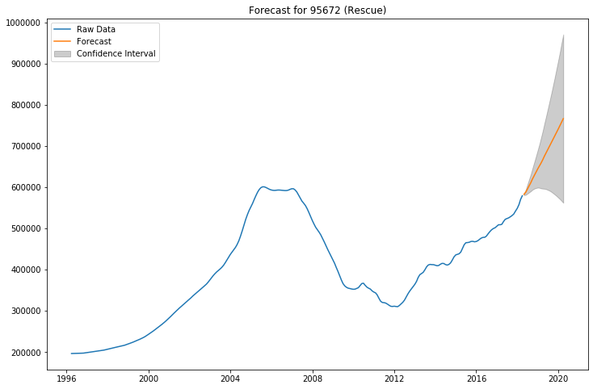


### Print summary of predicted, worst-case, and best-case scenarios


```python
rescue_95672_pred, rescue_95672_low, rescue_95672_high = pred_best_worst(pred=forecasted_price_95672, low=forecasted_lower_95672, 
                                                                         high=forecasted_upper_95672, last=last_value_95672, date='April 1, 2020')
rescue_95672_pred, rescue_95672_low, rescue_95672_high
```

    By the model prediction, I would expect to see a 32.296% change in price by April 1, 2020.
    At the lower bound of the confidence interval, I would expect to see a -2.975% change in price by April 1, 2020.
    At the upper bound of the confidence interval, I would expect to see a 67.567% change in price by April 1, 2020.


    (32.296, -2.975, 67.567)


## Zip code 95672 (Rescue):  Good investment opportunity

By the model prediction, I would expect to see a 32.296% change in price by April 1, 2020
At the lower bound of the confidence interval, I would expect to see a -2.975% change in price by April 1, 2020
At the upper bound of the confidence interval, I would expect to see a 67.567% change in price by April 1, 2020


# SacMetro:  95636 (Somerset) -- Potential investment opportunity


```python
geog_area = '95636'
```


```python
ts_95636 = df_sac.loc[df_sac['Zip'] == geog_area]  # ts for all of the following functions should have only one zipcode
ts_95636.head()

```


<div>
<style scoped>
    .dataframe tbody tr th:only-of-type {
        vertical-align: middle;
    }

    .dataframe tbody tr th {
        vertical-align: top;
    }

    .dataframe thead th {
        text-align: right;
    }
</style>
<table border="1" class="dataframe">
  <thead>
    <tr style="text-align: right;">
      <th></th>
      <th>Metro</th>
      <th>MetroState</th>
      <th>CountyName</th>
      <th>City</th>
      <th>Zip</th>
      <th>SizeRank</th>
      <th>value</th>
    </tr>
    <tr>
      <th>time</th>
      <th></th>
      <th></th>
      <th></th>
      <th></th>
      <th></th>
      <th></th>
      <th></th>
    </tr>
  </thead>
  <tbody>
    <tr>
      <td>1996-04-01</td>
      <td>Sacramento</td>
      <td>Sacramento CA</td>
      <td>El Dorado</td>
      <td>Somerset</td>
      <td>95636</td>
      <td>14632</td>
      <td>95100.0</td>
    </tr>
    <tr>
      <td>1996-05-01</td>
      <td>Sacramento</td>
      <td>Sacramento CA</td>
      <td>El Dorado</td>
      <td>Somerset</td>
      <td>95636</td>
      <td>14632</td>
      <td>95400.0</td>
    </tr>
    <tr>
      <td>1996-06-01</td>
      <td>Sacramento</td>
      <td>Sacramento CA</td>
      <td>El Dorado</td>
      <td>Somerset</td>
      <td>95636</td>
      <td>14632</td>
      <td>95600.0</td>
    </tr>
    <tr>
      <td>1996-07-01</td>
      <td>Sacramento</td>
      <td>Sacramento CA</td>
      <td>El Dorado</td>
      <td>Somerset</td>
      <td>95636</td>
      <td>14632</td>
      <td>95900.0</td>
    </tr>
    <tr>
      <td>1996-08-01</td>
      <td>Sacramento</td>
      <td>Sacramento CA</td>
      <td>El Dorado</td>
      <td>Somerset</td>
      <td>95636</td>
      <td>14632</td>
      <td>96200.0</td>
    </tr>
  </tbody>
</table>
</div>


```python
# ts.head()

ts_95636.head()
```


<div>
<style scoped>
    .dataframe tbody tr th:only-of-type {
        vertical-align: middle;
    }

    .dataframe tbody tr th {
        vertical-align: top;
    }

    .dataframe thead th {
        text-align: right;
    }
</style>
<table border="1" class="dataframe">
  <thead>
    <tr style="text-align: right;">
      <th></th>
      <th>Metro</th>
      <th>MetroState</th>
      <th>CountyName</th>
      <th>City</th>
      <th>Zip</th>
      <th>SizeRank</th>
      <th>value</th>
    </tr>
    <tr>
      <th>time</th>
      <th></th>
      <th></th>
      <th></th>
      <th></th>
      <th></th>
      <th></th>
      <th></th>
    </tr>
  </thead>
  <tbody>
    <tr>
      <td>1996-04-01</td>
      <td>Sacramento</td>
      <td>Sacramento CA</td>
      <td>El Dorado</td>
      <td>Somerset</td>
      <td>95636</td>
      <td>14632</td>
      <td>95100.0</td>
    </tr>
    <tr>
      <td>1996-05-01</td>
      <td>Sacramento</td>
      <td>Sacramento CA</td>
      <td>El Dorado</td>
      <td>Somerset</td>
      <td>95636</td>
      <td>14632</td>
      <td>95400.0</td>
    </tr>
    <tr>
      <td>1996-06-01</td>
      <td>Sacramento</td>
      <td>Sacramento CA</td>
      <td>El Dorado</td>
      <td>Somerset</td>
      <td>95636</td>
      <td>14632</td>
      <td>95600.0</td>
    </tr>
    <tr>
      <td>1996-07-01</td>
      <td>Sacramento</td>
      <td>Sacramento CA</td>
      <td>El Dorado</td>
      <td>Somerset</td>
      <td>95636</td>
      <td>14632</td>
      <td>95900.0</td>
    </tr>
    <tr>
      <td>1996-08-01</td>
      <td>Sacramento</td>
      <td>Sacramento CA</td>
      <td>El Dorado</td>
      <td>Somerset</td>
      <td>95636</td>
      <td>14632</td>
      <td>96200.0</td>
    </tr>
  </tbody>
</table>
</div>


```python
# ts = ts.value

ts_95636_values = ts_95636.value
```


```python
# ts.head()

ts_95636_values.head()
```


    time
    1996-04-01    95100.0
    1996-05-01    95400.0
    1996-06-01    95600.0
    1996-07-01    95900.0
    1996-08-01    96200.0
    Name: value, dtype: float64


```python
ts_95636_values.tail()
```


    time
    2017-12-01    229800.0
    2018-01-01    233300.0
    2018-02-01    237100.0
    2018-03-01    240100.0
    2018-04-01    241200.0
    Name: value, dtype: float64


### Visualizations

#### plot_ts:  Plot zip code(s) of interest over time, with market highs and lows


```python
# fig, ax = plot_ts(df_melt, zipcodes=['95616', '92008', '90035', '90025', '60625', '57701'])  # enter desired zip code(s)

fig, ax = plot_ts_zips(df_melt, zipcodes=['95636'], figsize=(12,6))  # enter desired zip code(s)
```


#### Boxplot of zip code


```python
ts_95636.boxplot(column = 'value')
plt.title('95636');
```


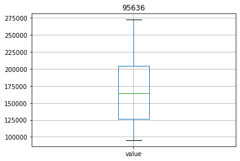


### Plot ACF and PACF for ts dataframe


```python
# plot_acf_pacf(ts, figsize=(10,6), lags=15)  # note that ts must only contain values and time as index

plot_acf_pacf(ts_95636_values, figsize=(10,6), lags=15)
```


### Plot seasonal decomposition for ts dataframe


```python
# plot_seasonal_decomp(ts)

plot_seasonal_decomp(ts_95636_values)

# Seasonality does not appear to be a significant factor in this zip code.
```


    (<Figure size 1296x432 with 1 Axes>,
     <matplotlib.axes._subplots.AxesSubplot at 0x1cc6d47518>)


## ARIMA model parameters and optimization

### Generate list of (p,d,q) and (p,d,q,m) values


```python
p_values = [0, 1, 2, 4, 6, 8]
d_values = range(0, 3)
q_values = range(0, 3)
warnings.filterwarnings("ignore")
```

### Run ARIMA model on ts dataframe with list of p,d,q values 


```python
# eval_arima_models(ts, p_values, d_values, q_values)  # don't run this until you have some time, since it take time
# note that ts must only contain values and time as index

# eval_arima_models(ts_95636_values, p_values, d_values, q_values)  # don't run this until you have some time, since it takes time

```

### Generate model fit summary


```python
# model_fit = arima_zipcode(ts, order = None)   # change order = tuple to correspond to the best MSE produced by previous function

# Best ARIMA(8, 2, 1) MSE=1389280.792

model_fit_95636 = arima_zipcode(ts_95636_values, order = (8,2,1))
```

                                 ARIMA Model Results                              
    ==============================================================================
    Dep. Variable:                   D2.y   No. Observations:                  263
    Model:                 ARIMA(8, 2, 1)   Log Likelihood               -2096.633
    Method:                       css-mle   S.D. of innovations            697.343
    Date:                Tue, 10 Mar 2020   AIC                           4215.265
    Time:                        22:37:29   BIC                           4254.559
    Sample:                             2   HQIC                          4231.057
                                                                                  
    ==============================================================================
                     coef    std err          z      P>|z|      [0.025      0.975]
    ------------------------------------------------------------------------------
    const          2.3799     54.242      0.044      0.965    -103.932     108.692
    ar.L1.D2.y     1.1070      0.131      8.455      0.000       0.850       1.364
    ar.L2.D2.y    -1.1745      0.134     -8.796      0.000      -1.436      -0.913
    ar.L3.D2.y     0.4903      0.149      3.285      0.001       0.198       0.783
    ar.L4.D2.y     0.0449      0.102      0.441      0.659      -0.155       0.244
    ar.L5.D2.y    -0.6121      0.100     -6.105      0.000      -0.809      -0.416
    ar.L6.D2.y     0.6956      0.118      5.903      0.000       0.465       0.927
    ar.L7.D2.y    -0.5329      0.091     -5.842      0.000      -0.712      -0.354
    ar.L8.D2.y     0.3138      0.062      5.036      0.000       0.192       0.436
    ma.L1.D2.y    -0.1573      0.129     -1.217      0.225      -0.411       0.096
                                        Roots                                    
    =============================================================================
                      Real          Imaginary           Modulus         Frequency
    -----------------------------------------------------------------------------
    AR.1           -1.1161           -0.0000j            1.1161           -0.5000
    AR.2            1.3071           -0.0000j            1.3071           -0.0000
    AR.3            0.8083           -0.7569j            1.1074           -0.1198
    AR.4            0.8083           +0.7569j            1.1074            0.1198
    AR.5           -0.3163           -1.1121j            1.1562           -0.2941
    AR.6           -0.3163           +1.1121j            1.1562            0.2941
    AR.7            0.2617           -1.1244j            1.1544           -0.2136
    AR.8            0.2617           +1.1244j            1.1544            0.2136
    MA.1            6.3575           +0.0000j            6.3575            0.0000
    -----------------------------------------------------------------------------


## ARIMA modeling results:  predictions and visualization

### Produce forecasts from ARIMA model fit


```python
actual_forecast_95636, std_error_95636, forecast_confint_95636 = forecast(model_fit_95636)

# actual_forecast, forecast_confint = forecast(model_fit_dallas, months=24, confint=2)
```


```python
actual_forecast_95636, std_error_95636, forecast_confint_95636
```


    (array([241691.04029314, 242484.45211006, 243673.16315282, 244790.16622748,
            246246.30181048, 247942.51107051, 249643.1874785 , 250928.24944852,
            251849.19705064, 252496.54019937, 253317.88814226, 254418.62646779,
            255711.31786725, 256969.65937555, 258247.98188548, 259463.82331079,
            260562.00520519, 261511.45907972, 262466.5786613 , 263492.98547622,
            264645.70756006, 265859.34059543, 267077.59047612, 268232.30618054]),
     array([  697.3433221 ,  2171.92356641,  3976.19184616,  5692.24024208,
             7372.3652499 ,  9101.12282576, 10901.51586393, 12789.10456177,
            14839.44878428, 17092.75900643, 19574.69704363, 22246.49807471,
            25020.80336809, 27827.21791523, 30684.91623192, 33629.68405932,
            36678.13284032, 39834.34895545, 43110.24682808, 46499.22484915,
            49982.99012626, 53539.93063761, 57159.28926563, 60841.01088159]),
     array([[240324.27249697, 243057.80808931],
            [238227.56014273, 246741.34407739],
            [235879.97033873, 251466.35596691],
            [233633.58036165, 255946.75209331],
            [231796.73143979, 260695.87218116],
            [230104.63811314, 265780.38402788],
            [228276.60900831, 271009.76594868],
            [225862.06511294, 275994.43378409],
            [222764.41188302, 280933.98221825],
            [218995.34815036, 285997.73224839],
            [214952.18692846, 291683.58935606],
            [210816.29145921, 298020.96147636],
            [206671.44440154, 304751.19133296],
            [202429.31447175, 311510.00427935],
            [198106.65120229, 318389.31256867],
            [193550.85374306, 325376.79287852],
            [188674.18581798, 332449.8245924 ],
            [183437.56977944, 339585.34838001],
            [177972.04751364, 346961.10980896],
            [172356.17946286, 354629.79148957],
            [166680.84707297, 362610.56804715],
            [160923.00481093, 370795.67637992],
            [155047.44213357, 379107.73881867],
            [148986.11606962, 387478.49629147]]))


### Create dataframe to hold forecast results


```python
# df_forecast = forecast_df(col = 'time', daterange = pd.date_range(start='2018-05-01', end='2020-04-01', freq='MS'), 
#                 actual_forecast=actual_forecast, forecast_confint = forecast_confint)

df_forecast_95636 = forecast_df(actual_forecast_95636, forecast_confint_95636, col = 'time', daterange = pd.date_range(start='2018-05-01', end='2020-04-01', freq='MS'))
```

### Create new dataframe concatenating historic values and forecast results


```python
# df_new = concat_values_forecast(ts, df_forecast)

df_new_95636 = concat_values_forecast(ts_95636_values, df_forecast_95636)
```


```python
df_new_95636
```


<div>
<style scoped>
    .dataframe tbody tr th:only-of-type {
        vertical-align: middle;
    }

    .dataframe tbody tr th {
        vertical-align: top;
    }

    .dataframe thead th {
        text-align: right;
    }
</style>
<table border="1" class="dataframe">
  <thead>
    <tr style="text-align: right;">
      <th></th>
      <th>value</th>
      <th>forecast</th>
      <th>forecast_lower</th>
      <th>forecast_upper</th>
    </tr>
    <tr>
      <th>time</th>
      <th></th>
      <th></th>
      <th></th>
      <th></th>
    </tr>
  </thead>
  <tbody>
    <tr>
      <td>1996-04-01</td>
      <td>95100.0</td>
      <td>NaN</td>
      <td>NaN</td>
      <td>NaN</td>
    </tr>
    <tr>
      <td>1996-05-01</td>
      <td>95400.0</td>
      <td>NaN</td>
      <td>NaN</td>
      <td>NaN</td>
    </tr>
    <tr>
      <td>1996-06-01</td>
      <td>95600.0</td>
      <td>NaN</td>
      <td>NaN</td>
      <td>NaN</td>
    </tr>
    <tr>
      <td>1996-07-01</td>
      <td>95900.0</td>
      <td>NaN</td>
      <td>NaN</td>
      <td>NaN</td>
    </tr>
    <tr>
      <td>1996-08-01</td>
      <td>96200.0</td>
      <td>NaN</td>
      <td>NaN</td>
      <td>NaN</td>
    </tr>
    <tr>
      <td>1996-09-01</td>
      <td>96500.0</td>
      <td>NaN</td>
      <td>NaN</td>
      <td>NaN</td>
    </tr>
    <tr>
      <td>1996-10-01</td>
      <td>96800.0</td>
      <td>NaN</td>
      <td>NaN</td>
      <td>NaN</td>
    </tr>
    <tr>
      <td>1996-11-01</td>
      <td>97100.0</td>
      <td>NaN</td>
      <td>NaN</td>
      <td>NaN</td>
    </tr>
    <tr>
      <td>1996-12-01</td>
      <td>97400.0</td>
      <td>NaN</td>
      <td>NaN</td>
      <td>NaN</td>
    </tr>
    <tr>
      <td>1997-01-01</td>
      <td>97700.0</td>
      <td>NaN</td>
      <td>NaN</td>
      <td>NaN</td>
    </tr>
    <tr>
      <td>1997-02-01</td>
      <td>98000.0</td>
      <td>NaN</td>
      <td>NaN</td>
      <td>NaN</td>
    </tr>
    <tr>
      <td>1997-03-01</td>
      <td>98000.0</td>
      <td>NaN</td>
      <td>NaN</td>
      <td>NaN</td>
    </tr>
    <tr>
      <td>1997-04-01</td>
      <td>98100.0</td>
      <td>NaN</td>
      <td>NaN</td>
      <td>NaN</td>
    </tr>
    <tr>
      <td>1997-05-01</td>
      <td>98100.0</td>
      <td>NaN</td>
      <td>NaN</td>
      <td>NaN</td>
    </tr>
    <tr>
      <td>1997-06-01</td>
      <td>98100.0</td>
      <td>NaN</td>
      <td>NaN</td>
      <td>NaN</td>
    </tr>
    <tr>
      <td>1997-07-01</td>
      <td>98100.0</td>
      <td>NaN</td>
      <td>NaN</td>
      <td>NaN</td>
    </tr>
    <tr>
      <td>1997-08-01</td>
      <td>98200.0</td>
      <td>NaN</td>
      <td>NaN</td>
      <td>NaN</td>
    </tr>
    <tr>
      <td>1997-09-01</td>
      <td>98300.0</td>
      <td>NaN</td>
      <td>NaN</td>
      <td>NaN</td>
    </tr>
    <tr>
      <td>1997-10-01</td>
      <td>98400.0</td>
      <td>NaN</td>
      <td>NaN</td>
      <td>NaN</td>
    </tr>
    <tr>
      <td>1997-11-01</td>
      <td>98700.0</td>
      <td>NaN</td>
      <td>NaN</td>
      <td>NaN</td>
    </tr>
    <tr>
      <td>1997-12-01</td>
      <td>99000.0</td>
      <td>NaN</td>
      <td>NaN</td>
      <td>NaN</td>
    </tr>
    <tr>
      <td>1998-01-01</td>
      <td>99400.0</td>
      <td>NaN</td>
      <td>NaN</td>
      <td>NaN</td>
    </tr>
    <tr>
      <td>1998-02-01</td>
      <td>99800.0</td>
      <td>NaN</td>
      <td>NaN</td>
      <td>NaN</td>
    </tr>
    <tr>
      <td>1998-03-01</td>
      <td>100100.0</td>
      <td>NaN</td>
      <td>NaN</td>
      <td>NaN</td>
    </tr>
    <tr>
      <td>1998-04-01</td>
      <td>100400.0</td>
      <td>NaN</td>
      <td>NaN</td>
      <td>NaN</td>
    </tr>
    <tr>
      <td>1998-05-01</td>
      <td>100700.0</td>
      <td>NaN</td>
      <td>NaN</td>
      <td>NaN</td>
    </tr>
    <tr>
      <td>1998-06-01</td>
      <td>101100.0</td>
      <td>NaN</td>
      <td>NaN</td>
      <td>NaN</td>
    </tr>
    <tr>
      <td>1998-07-01</td>
      <td>101500.0</td>
      <td>NaN</td>
      <td>NaN</td>
      <td>NaN</td>
    </tr>
    <tr>
      <td>1998-08-01</td>
      <td>102100.0</td>
      <td>NaN</td>
      <td>NaN</td>
      <td>NaN</td>
    </tr>
    <tr>
      <td>1998-09-01</td>
      <td>102700.0</td>
      <td>NaN</td>
      <td>NaN</td>
      <td>NaN</td>
    </tr>
    <tr>
      <td>1998-10-01</td>
      <td>103400.0</td>
      <td>NaN</td>
      <td>NaN</td>
      <td>NaN</td>
    </tr>
    <tr>
      <td>1998-11-01</td>
      <td>104000.0</td>
      <td>NaN</td>
      <td>NaN</td>
      <td>NaN</td>
    </tr>
    <tr>
      <td>1998-12-01</td>
      <td>104800.0</td>
      <td>NaN</td>
      <td>NaN</td>
      <td>NaN</td>
    </tr>
    <tr>
      <td>1999-01-01</td>
      <td>105600.0</td>
      <td>NaN</td>
      <td>NaN</td>
      <td>NaN</td>
    </tr>
    <tr>
      <td>1999-02-01</td>
      <td>106400.0</td>
      <td>NaN</td>
      <td>NaN</td>
      <td>NaN</td>
    </tr>
    <tr>
      <td>1999-03-01</td>
      <td>107000.0</td>
      <td>NaN</td>
      <td>NaN</td>
      <td>NaN</td>
    </tr>
    <tr>
      <td>1999-04-01</td>
      <td>107700.0</td>
      <td>NaN</td>
      <td>NaN</td>
      <td>NaN</td>
    </tr>
    <tr>
      <td>1999-05-01</td>
      <td>108400.0</td>
      <td>NaN</td>
      <td>NaN</td>
      <td>NaN</td>
    </tr>
    <tr>
      <td>1999-06-01</td>
      <td>109100.0</td>
      <td>NaN</td>
      <td>NaN</td>
      <td>NaN</td>
    </tr>
    <tr>
      <td>1999-07-01</td>
      <td>109800.0</td>
      <td>NaN</td>
      <td>NaN</td>
      <td>NaN</td>
    </tr>
    <tr>
      <td>1999-08-01</td>
      <td>110500.0</td>
      <td>NaN</td>
      <td>NaN</td>
      <td>NaN</td>
    </tr>
    <tr>
      <td>1999-09-01</td>
      <td>111400.0</td>
      <td>NaN</td>
      <td>NaN</td>
      <td>NaN</td>
    </tr>
    <tr>
      <td>1999-10-01</td>
      <td>112200.0</td>
      <td>NaN</td>
      <td>NaN</td>
      <td>NaN</td>
    </tr>
    <tr>
      <td>1999-11-01</td>
      <td>113200.0</td>
      <td>NaN</td>
      <td>NaN</td>
      <td>NaN</td>
    </tr>
    <tr>
      <td>1999-12-01</td>
      <td>114100.0</td>
      <td>NaN</td>
      <td>NaN</td>
      <td>NaN</td>
    </tr>
    <tr>
      <td>2000-01-01</td>
      <td>115100.0</td>
      <td>NaN</td>
      <td>NaN</td>
      <td>NaN</td>
    </tr>
    <tr>
      <td>2000-02-01</td>
      <td>116000.0</td>
      <td>NaN</td>
      <td>NaN</td>
      <td>NaN</td>
    </tr>
    <tr>
      <td>2000-03-01</td>
      <td>116700.0</td>
      <td>NaN</td>
      <td>NaN</td>
      <td>NaN</td>
    </tr>
    <tr>
      <td>2000-04-01</td>
      <td>117500.0</td>
      <td>NaN</td>
      <td>NaN</td>
      <td>NaN</td>
    </tr>
    <tr>
      <td>2000-05-01</td>
      <td>118300.0</td>
      <td>NaN</td>
      <td>NaN</td>
      <td>NaN</td>
    </tr>
    <tr>
      <td>2000-06-01</td>
      <td>119100.0</td>
      <td>NaN</td>
      <td>NaN</td>
      <td>NaN</td>
    </tr>
    <tr>
      <td>2000-07-01</td>
      <td>119900.0</td>
      <td>NaN</td>
      <td>NaN</td>
      <td>NaN</td>
    </tr>
    <tr>
      <td>2000-08-01</td>
      <td>120700.0</td>
      <td>NaN</td>
      <td>NaN</td>
      <td>NaN</td>
    </tr>
    <tr>
      <td>2000-09-01</td>
      <td>121700.0</td>
      <td>NaN</td>
      <td>NaN</td>
      <td>NaN</td>
    </tr>
    <tr>
      <td>2000-10-01</td>
      <td>122800.0</td>
      <td>NaN</td>
      <td>NaN</td>
      <td>NaN</td>
    </tr>
    <tr>
      <td>2000-11-01</td>
      <td>124000.0</td>
      <td>NaN</td>
      <td>NaN</td>
      <td>NaN</td>
    </tr>
    <tr>
      <td>2000-12-01</td>
      <td>125200.0</td>
      <td>NaN</td>
      <td>NaN</td>
      <td>NaN</td>
    </tr>
    <tr>
      <td>2001-01-01</td>
      <td>126500.0</td>
      <td>NaN</td>
      <td>NaN</td>
      <td>NaN</td>
    </tr>
    <tr>
      <td>2001-02-01</td>
      <td>127800.0</td>
      <td>NaN</td>
      <td>NaN</td>
      <td>NaN</td>
    </tr>
    <tr>
      <td>2001-03-01</td>
      <td>129000.0</td>
      <td>NaN</td>
      <td>NaN</td>
      <td>NaN</td>
    </tr>
    <tr>
      <td>2001-04-01</td>
      <td>130200.0</td>
      <td>NaN</td>
      <td>NaN</td>
      <td>NaN</td>
    </tr>
    <tr>
      <td>2001-05-01</td>
      <td>131400.0</td>
      <td>NaN</td>
      <td>NaN</td>
      <td>NaN</td>
    </tr>
    <tr>
      <td>2001-06-01</td>
      <td>132700.0</td>
      <td>NaN</td>
      <td>NaN</td>
      <td>NaN</td>
    </tr>
    <tr>
      <td>2001-07-01</td>
      <td>134000.0</td>
      <td>NaN</td>
      <td>NaN</td>
      <td>NaN</td>
    </tr>
    <tr>
      <td>2001-08-01</td>
      <td>135300.0</td>
      <td>NaN</td>
      <td>NaN</td>
      <td>NaN</td>
    </tr>
    <tr>
      <td>2001-09-01</td>
      <td>136800.0</td>
      <td>NaN</td>
      <td>NaN</td>
      <td>NaN</td>
    </tr>
    <tr>
      <td>2001-10-01</td>
      <td>138400.0</td>
      <td>NaN</td>
      <td>NaN</td>
      <td>NaN</td>
    </tr>
    <tr>
      <td>2001-11-01</td>
      <td>140000.0</td>
      <td>NaN</td>
      <td>NaN</td>
      <td>NaN</td>
    </tr>
    <tr>
      <td>2001-12-01</td>
      <td>141500.0</td>
      <td>NaN</td>
      <td>NaN</td>
      <td>NaN</td>
    </tr>
    <tr>
      <td>2002-01-01</td>
      <td>143100.0</td>
      <td>NaN</td>
      <td>NaN</td>
      <td>NaN</td>
    </tr>
    <tr>
      <td>2002-02-01</td>
      <td>144700.0</td>
      <td>NaN</td>
      <td>NaN</td>
      <td>NaN</td>
    </tr>
    <tr>
      <td>2002-03-01</td>
      <td>146200.0</td>
      <td>NaN</td>
      <td>NaN</td>
      <td>NaN</td>
    </tr>
    <tr>
      <td>2002-04-01</td>
      <td>147600.0</td>
      <td>NaN</td>
      <td>NaN</td>
      <td>NaN</td>
    </tr>
    <tr>
      <td>2002-05-01</td>
      <td>149000.0</td>
      <td>NaN</td>
      <td>NaN</td>
      <td>NaN</td>
    </tr>
    <tr>
      <td>2002-06-01</td>
      <td>150400.0</td>
      <td>NaN</td>
      <td>NaN</td>
      <td>NaN</td>
    </tr>
    <tr>
      <td>2002-07-01</td>
      <td>152000.0</td>
      <td>NaN</td>
      <td>NaN</td>
      <td>NaN</td>
    </tr>
    <tr>
      <td>2002-08-01</td>
      <td>153800.0</td>
      <td>NaN</td>
      <td>NaN</td>
      <td>NaN</td>
    </tr>
    <tr>
      <td>2002-09-01</td>
      <td>155600.0</td>
      <td>NaN</td>
      <td>NaN</td>
      <td>NaN</td>
    </tr>
    <tr>
      <td>2002-10-01</td>
      <td>157600.0</td>
      <td>NaN</td>
      <td>NaN</td>
      <td>NaN</td>
    </tr>
    <tr>
      <td>2002-11-01</td>
      <td>160200.0</td>
      <td>NaN</td>
      <td>NaN</td>
      <td>NaN</td>
    </tr>
    <tr>
      <td>2002-12-01</td>
      <td>163700.0</td>
      <td>NaN</td>
      <td>NaN</td>
      <td>NaN</td>
    </tr>
    <tr>
      <td>2003-01-01</td>
      <td>167600.0</td>
      <td>NaN</td>
      <td>NaN</td>
      <td>NaN</td>
    </tr>
    <tr>
      <td>2003-02-01</td>
      <td>171300.0</td>
      <td>NaN</td>
      <td>NaN</td>
      <td>NaN</td>
    </tr>
    <tr>
      <td>2003-03-01</td>
      <td>174900.0</td>
      <td>NaN</td>
      <td>NaN</td>
      <td>NaN</td>
    </tr>
    <tr>
      <td>2003-04-01</td>
      <td>178200.0</td>
      <td>NaN</td>
      <td>NaN</td>
      <td>NaN</td>
    </tr>
    <tr>
      <td>2003-05-01</td>
      <td>180900.0</td>
      <td>NaN</td>
      <td>NaN</td>
      <td>NaN</td>
    </tr>
    <tr>
      <td>2003-06-01</td>
      <td>182900.0</td>
      <td>NaN</td>
      <td>NaN</td>
      <td>NaN</td>
    </tr>
    <tr>
      <td>2003-07-01</td>
      <td>184200.0</td>
      <td>NaN</td>
      <td>NaN</td>
      <td>NaN</td>
    </tr>
    <tr>
      <td>2003-08-01</td>
      <td>185000.0</td>
      <td>NaN</td>
      <td>NaN</td>
      <td>NaN</td>
    </tr>
    <tr>
      <td>2003-09-01</td>
      <td>185300.0</td>
      <td>NaN</td>
      <td>NaN</td>
      <td>NaN</td>
    </tr>
    <tr>
      <td>2003-10-01</td>
      <td>185700.0</td>
      <td>NaN</td>
      <td>NaN</td>
      <td>NaN</td>
    </tr>
    <tr>
      <td>2003-11-01</td>
      <td>186200.0</td>
      <td>NaN</td>
      <td>NaN</td>
      <td>NaN</td>
    </tr>
    <tr>
      <td>2003-12-01</td>
      <td>186900.0</td>
      <td>NaN</td>
      <td>NaN</td>
      <td>NaN</td>
    </tr>
    <tr>
      <td>2004-01-01</td>
      <td>187800.0</td>
      <td>NaN</td>
      <td>NaN</td>
      <td>NaN</td>
    </tr>
    <tr>
      <td>2004-02-01</td>
      <td>189000.0</td>
      <td>NaN</td>
      <td>NaN</td>
      <td>NaN</td>
    </tr>
    <tr>
      <td>2004-03-01</td>
      <td>190800.0</td>
      <td>NaN</td>
      <td>NaN</td>
      <td>NaN</td>
    </tr>
    <tr>
      <td>2004-04-01</td>
      <td>193700.0</td>
      <td>NaN</td>
      <td>NaN</td>
      <td>NaN</td>
    </tr>
    <tr>
      <td>2004-05-01</td>
      <td>197900.0</td>
      <td>NaN</td>
      <td>NaN</td>
      <td>NaN</td>
    </tr>
    <tr>
      <td>2004-06-01</td>
      <td>203300.0</td>
      <td>NaN</td>
      <td>NaN</td>
      <td>NaN</td>
    </tr>
    <tr>
      <td>2004-07-01</td>
      <td>209500.0</td>
      <td>NaN</td>
      <td>NaN</td>
      <td>NaN</td>
    </tr>
    <tr>
      <td>2004-08-01</td>
      <td>216200.0</td>
      <td>NaN</td>
      <td>NaN</td>
      <td>NaN</td>
    </tr>
    <tr>
      <td>2004-09-01</td>
      <td>222900.0</td>
      <td>NaN</td>
      <td>NaN</td>
      <td>NaN</td>
    </tr>
    <tr>
      <td>2004-10-01</td>
      <td>229200.0</td>
      <td>NaN</td>
      <td>NaN</td>
      <td>NaN</td>
    </tr>
    <tr>
      <td>2004-11-01</td>
      <td>234700.0</td>
      <td>NaN</td>
      <td>NaN</td>
      <td>NaN</td>
    </tr>
    <tr>
      <td>2004-12-01</td>
      <td>239200.0</td>
      <td>NaN</td>
      <td>NaN</td>
      <td>NaN</td>
    </tr>
    <tr>
      <td>2005-01-01</td>
      <td>242700.0</td>
      <td>NaN</td>
      <td>NaN</td>
      <td>NaN</td>
    </tr>
    <tr>
      <td>2005-02-01</td>
      <td>245400.0</td>
      <td>NaN</td>
      <td>NaN</td>
      <td>NaN</td>
    </tr>
    <tr>
      <td>2005-03-01</td>
      <td>247500.0</td>
      <td>NaN</td>
      <td>NaN</td>
      <td>NaN</td>
    </tr>
    <tr>
      <td>2005-04-01</td>
      <td>249200.0</td>
      <td>NaN</td>
      <td>NaN</td>
      <td>NaN</td>
    </tr>
    <tr>
      <td>2005-05-01</td>
      <td>250800.0</td>
      <td>NaN</td>
      <td>NaN</td>
      <td>NaN</td>
    </tr>
    <tr>
      <td>2005-06-01</td>
      <td>252400.0</td>
      <td>NaN</td>
      <td>NaN</td>
      <td>NaN</td>
    </tr>
    <tr>
      <td>2005-07-01</td>
      <td>254200.0</td>
      <td>NaN</td>
      <td>NaN</td>
      <td>NaN</td>
    </tr>
    <tr>
      <td>2005-08-01</td>
      <td>256100.0</td>
      <td>NaN</td>
      <td>NaN</td>
      <td>NaN</td>
    </tr>
    <tr>
      <td>2005-09-01</td>
      <td>258200.0</td>
      <td>NaN</td>
      <td>NaN</td>
      <td>NaN</td>
    </tr>
    <tr>
      <td>2005-10-01</td>
      <td>260100.0</td>
      <td>NaN</td>
      <td>NaN</td>
      <td>NaN</td>
    </tr>
    <tr>
      <td>2005-11-01</td>
      <td>261500.0</td>
      <td>NaN</td>
      <td>NaN</td>
      <td>NaN</td>
    </tr>
    <tr>
      <td>2005-12-01</td>
      <td>262300.0</td>
      <td>NaN</td>
      <td>NaN</td>
      <td>NaN</td>
    </tr>
    <tr>
      <td>2006-01-01</td>
      <td>262700.0</td>
      <td>NaN</td>
      <td>NaN</td>
      <td>NaN</td>
    </tr>
    <tr>
      <td>2006-02-01</td>
      <td>263400.0</td>
      <td>NaN</td>
      <td>NaN</td>
      <td>NaN</td>
    </tr>
    <tr>
      <td>2006-03-01</td>
      <td>265000.0</td>
      <td>NaN</td>
      <td>NaN</td>
      <td>NaN</td>
    </tr>
    <tr>
      <td>2006-04-01</td>
      <td>267200.0</td>
      <td>NaN</td>
      <td>NaN</td>
      <td>NaN</td>
    </tr>
    <tr>
      <td>2006-05-01</td>
      <td>269600.0</td>
      <td>NaN</td>
      <td>NaN</td>
      <td>NaN</td>
    </tr>
    <tr>
      <td>2006-06-01</td>
      <td>271400.0</td>
      <td>NaN</td>
      <td>NaN</td>
      <td>NaN</td>
    </tr>
    <tr>
      <td>2006-07-01</td>
      <td>272400.0</td>
      <td>NaN</td>
      <td>NaN</td>
      <td>NaN</td>
    </tr>
    <tr>
      <td>2006-08-01</td>
      <td>272500.0</td>
      <td>NaN</td>
      <td>NaN</td>
      <td>NaN</td>
    </tr>
    <tr>
      <td>2006-09-01</td>
      <td>272200.0</td>
      <td>NaN</td>
      <td>NaN</td>
      <td>NaN</td>
    </tr>
    <tr>
      <td>2006-10-01</td>
      <td>271700.0</td>
      <td>NaN</td>
      <td>NaN</td>
      <td>NaN</td>
    </tr>
    <tr>
      <td>2006-11-01</td>
      <td>271200.0</td>
      <td>NaN</td>
      <td>NaN</td>
      <td>NaN</td>
    </tr>
    <tr>
      <td>2006-12-01</td>
      <td>271100.0</td>
      <td>NaN</td>
      <td>NaN</td>
      <td>NaN</td>
    </tr>
    <tr>
      <td>2007-01-01</td>
      <td>271300.0</td>
      <td>NaN</td>
      <td>NaN</td>
      <td>NaN</td>
    </tr>
    <tr>
      <td>2007-02-01</td>
      <td>271300.0</td>
      <td>NaN</td>
      <td>NaN</td>
      <td>NaN</td>
    </tr>
    <tr>
      <td>2007-03-01</td>
      <td>271100.0</td>
      <td>NaN</td>
      <td>NaN</td>
      <td>NaN</td>
    </tr>
    <tr>
      <td>2007-04-01</td>
      <td>270800.0</td>
      <td>NaN</td>
      <td>NaN</td>
      <td>NaN</td>
    </tr>
    <tr>
      <td>2007-05-01</td>
      <td>270400.0</td>
      <td>NaN</td>
      <td>NaN</td>
      <td>NaN</td>
    </tr>
    <tr>
      <td>2007-06-01</td>
      <td>269900.0</td>
      <td>NaN</td>
      <td>NaN</td>
      <td>NaN</td>
    </tr>
    <tr>
      <td>2007-07-01</td>
      <td>269100.0</td>
      <td>NaN</td>
      <td>NaN</td>
      <td>NaN</td>
    </tr>
    <tr>
      <td>2007-08-01</td>
      <td>268200.0</td>
      <td>NaN</td>
      <td>NaN</td>
      <td>NaN</td>
    </tr>
    <tr>
      <td>2007-09-01</td>
      <td>266900.0</td>
      <td>NaN</td>
      <td>NaN</td>
      <td>NaN</td>
    </tr>
    <tr>
      <td>2007-10-01</td>
      <td>264700.0</td>
      <td>NaN</td>
      <td>NaN</td>
      <td>NaN</td>
    </tr>
    <tr>
      <td>2007-11-01</td>
      <td>262300.0</td>
      <td>NaN</td>
      <td>NaN</td>
      <td>NaN</td>
    </tr>
    <tr>
      <td>2007-12-01</td>
      <td>260600.0</td>
      <td>NaN</td>
      <td>NaN</td>
      <td>NaN</td>
    </tr>
    <tr>
      <td>2008-01-01</td>
      <td>259400.0</td>
      <td>NaN</td>
      <td>NaN</td>
      <td>NaN</td>
    </tr>
    <tr>
      <td>2008-02-01</td>
      <td>257900.0</td>
      <td>NaN</td>
      <td>NaN</td>
      <td>NaN</td>
    </tr>
    <tr>
      <td>2008-03-01</td>
      <td>255200.0</td>
      <td>NaN</td>
      <td>NaN</td>
      <td>NaN</td>
    </tr>
    <tr>
      <td>2008-04-01</td>
      <td>250700.0</td>
      <td>NaN</td>
      <td>NaN</td>
      <td>NaN</td>
    </tr>
    <tr>
      <td>2008-05-01</td>
      <td>244400.0</td>
      <td>NaN</td>
      <td>NaN</td>
      <td>NaN</td>
    </tr>
    <tr>
      <td>2008-06-01</td>
      <td>236700.0</td>
      <td>NaN</td>
      <td>NaN</td>
      <td>NaN</td>
    </tr>
    <tr>
      <td>2008-07-01</td>
      <td>229400.0</td>
      <td>NaN</td>
      <td>NaN</td>
      <td>NaN</td>
    </tr>
    <tr>
      <td>2008-08-01</td>
      <td>224100.0</td>
      <td>NaN</td>
      <td>NaN</td>
      <td>NaN</td>
    </tr>
    <tr>
      <td>2008-09-01</td>
      <td>220200.0</td>
      <td>NaN</td>
      <td>NaN</td>
      <td>NaN</td>
    </tr>
    <tr>
      <td>2008-10-01</td>
      <td>216000.0</td>
      <td>NaN</td>
      <td>NaN</td>
      <td>NaN</td>
    </tr>
    <tr>
      <td>2008-11-01</td>
      <td>212000.0</td>
      <td>NaN</td>
      <td>NaN</td>
      <td>NaN</td>
    </tr>
    <tr>
      <td>2008-12-01</td>
      <td>207900.0</td>
      <td>NaN</td>
      <td>NaN</td>
      <td>NaN</td>
    </tr>
    <tr>
      <td>2009-01-01</td>
      <td>203600.0</td>
      <td>NaN</td>
      <td>NaN</td>
      <td>NaN</td>
    </tr>
    <tr>
      <td>2009-02-01</td>
      <td>198600.0</td>
      <td>NaN</td>
      <td>NaN</td>
      <td>NaN</td>
    </tr>
    <tr>
      <td>2009-03-01</td>
      <td>193300.0</td>
      <td>NaN</td>
      <td>NaN</td>
      <td>NaN</td>
    </tr>
    <tr>
      <td>2009-04-01</td>
      <td>187800.0</td>
      <td>NaN</td>
      <td>NaN</td>
      <td>NaN</td>
    </tr>
    <tr>
      <td>2009-05-01</td>
      <td>182700.0</td>
      <td>NaN</td>
      <td>NaN</td>
      <td>NaN</td>
    </tr>
    <tr>
      <td>2009-06-01</td>
      <td>177400.0</td>
      <td>NaN</td>
      <td>NaN</td>
      <td>NaN</td>
    </tr>
    <tr>
      <td>2009-07-01</td>
      <td>171600.0</td>
      <td>NaN</td>
      <td>NaN</td>
      <td>NaN</td>
    </tr>
    <tr>
      <td>2009-08-01</td>
      <td>166100.0</td>
      <td>NaN</td>
      <td>NaN</td>
      <td>NaN</td>
    </tr>
    <tr>
      <td>2009-09-01</td>
      <td>161700.0</td>
      <td>NaN</td>
      <td>NaN</td>
      <td>NaN</td>
    </tr>
    <tr>
      <td>2009-10-01</td>
      <td>158100.0</td>
      <td>NaN</td>
      <td>NaN</td>
      <td>NaN</td>
    </tr>
    <tr>
      <td>2009-11-01</td>
      <td>155900.0</td>
      <td>NaN</td>
      <td>NaN</td>
      <td>NaN</td>
    </tr>
    <tr>
      <td>2009-12-01</td>
      <td>155100.0</td>
      <td>NaN</td>
      <td>NaN</td>
      <td>NaN</td>
    </tr>
    <tr>
      <td>2010-01-01</td>
      <td>155100.0</td>
      <td>NaN</td>
      <td>NaN</td>
      <td>NaN</td>
    </tr>
    <tr>
      <td>2010-02-01</td>
      <td>154700.0</td>
      <td>NaN</td>
      <td>NaN</td>
      <td>NaN</td>
    </tr>
    <tr>
      <td>2010-03-01</td>
      <td>154900.0</td>
      <td>NaN</td>
      <td>NaN</td>
      <td>NaN</td>
    </tr>
    <tr>
      <td>2010-04-01</td>
      <td>155900.0</td>
      <td>NaN</td>
      <td>NaN</td>
      <td>NaN</td>
    </tr>
    <tr>
      <td>2010-05-01</td>
      <td>157400.0</td>
      <td>NaN</td>
      <td>NaN</td>
      <td>NaN</td>
    </tr>
    <tr>
      <td>2010-06-01</td>
      <td>160700.0</td>
      <td>NaN</td>
      <td>NaN</td>
      <td>NaN</td>
    </tr>
    <tr>
      <td>2010-07-01</td>
      <td>164600.0</td>
      <td>NaN</td>
      <td>NaN</td>
      <td>NaN</td>
    </tr>
    <tr>
      <td>2010-08-01</td>
      <td>166400.0</td>
      <td>NaN</td>
      <td>NaN</td>
      <td>NaN</td>
    </tr>
    <tr>
      <td>2010-09-01</td>
      <td>167000.0</td>
      <td>NaN</td>
      <td>NaN</td>
      <td>NaN</td>
    </tr>
    <tr>
      <td>2010-10-01</td>
      <td>170100.0</td>
      <td>NaN</td>
      <td>NaN</td>
      <td>NaN</td>
    </tr>
    <tr>
      <td>2010-11-01</td>
      <td>172800.0</td>
      <td>NaN</td>
      <td>NaN</td>
      <td>NaN</td>
    </tr>
    <tr>
      <td>2010-12-01</td>
      <td>171900.0</td>
      <td>NaN</td>
      <td>NaN</td>
      <td>NaN</td>
    </tr>
    <tr>
      <td>2011-01-01</td>
      <td>170000.0</td>
      <td>NaN</td>
      <td>NaN</td>
      <td>NaN</td>
    </tr>
    <tr>
      <td>2011-02-01</td>
      <td>170200.0</td>
      <td>NaN</td>
      <td>NaN</td>
      <td>NaN</td>
    </tr>
    <tr>
      <td>2011-03-01</td>
      <td>170500.0</td>
      <td>NaN</td>
      <td>NaN</td>
      <td>NaN</td>
    </tr>
    <tr>
      <td>2011-04-01</td>
      <td>170800.0</td>
      <td>NaN</td>
      <td>NaN</td>
      <td>NaN</td>
    </tr>
    <tr>
      <td>2011-05-01</td>
      <td>170600.0</td>
      <td>NaN</td>
      <td>NaN</td>
      <td>NaN</td>
    </tr>
    <tr>
      <td>2011-06-01</td>
      <td>169700.0</td>
      <td>NaN</td>
      <td>NaN</td>
      <td>NaN</td>
    </tr>
    <tr>
      <td>2011-07-01</td>
      <td>167400.0</td>
      <td>NaN</td>
      <td>NaN</td>
      <td>NaN</td>
    </tr>
    <tr>
      <td>2011-08-01</td>
      <td>164400.0</td>
      <td>NaN</td>
      <td>NaN</td>
      <td>NaN</td>
    </tr>
    <tr>
      <td>2011-09-01</td>
      <td>161000.0</td>
      <td>NaN</td>
      <td>NaN</td>
      <td>NaN</td>
    </tr>
    <tr>
      <td>2011-10-01</td>
      <td>156100.0</td>
      <td>NaN</td>
      <td>NaN</td>
      <td>NaN</td>
    </tr>
    <tr>
      <td>2011-11-01</td>
      <td>151000.0</td>
      <td>NaN</td>
      <td>NaN</td>
      <td>NaN</td>
    </tr>
    <tr>
      <td>2011-12-01</td>
      <td>149600.0</td>
      <td>NaN</td>
      <td>NaN</td>
      <td>NaN</td>
    </tr>
    <tr>
      <td>2012-01-01</td>
      <td>151100.0</td>
      <td>NaN</td>
      <td>NaN</td>
      <td>NaN</td>
    </tr>
    <tr>
      <td>2012-02-01</td>
      <td>151000.0</td>
      <td>NaN</td>
      <td>NaN</td>
      <td>NaN</td>
    </tr>
    <tr>
      <td>2012-03-01</td>
      <td>147600.0</td>
      <td>NaN</td>
      <td>NaN</td>
      <td>NaN</td>
    </tr>
    <tr>
      <td>2012-04-01</td>
      <td>143500.0</td>
      <td>NaN</td>
      <td>NaN</td>
      <td>NaN</td>
    </tr>
    <tr>
      <td>2012-05-01</td>
      <td>141100.0</td>
      <td>NaN</td>
      <td>NaN</td>
      <td>NaN</td>
    </tr>
    <tr>
      <td>2012-06-01</td>
      <td>139400.0</td>
      <td>NaN</td>
      <td>NaN</td>
      <td>NaN</td>
    </tr>
    <tr>
      <td>2012-07-01</td>
      <td>137600.0</td>
      <td>NaN</td>
      <td>NaN</td>
      <td>NaN</td>
    </tr>
    <tr>
      <td>2012-08-01</td>
      <td>136400.0</td>
      <td>NaN</td>
      <td>NaN</td>
      <td>NaN</td>
    </tr>
    <tr>
      <td>2012-09-01</td>
      <td>135200.0</td>
      <td>NaN</td>
      <td>NaN</td>
      <td>NaN</td>
    </tr>
    <tr>
      <td>2012-10-01</td>
      <td>133600.0</td>
      <td>NaN</td>
      <td>NaN</td>
      <td>NaN</td>
    </tr>
    <tr>
      <td>2012-11-01</td>
      <td>130800.0</td>
      <td>NaN</td>
      <td>NaN</td>
      <td>NaN</td>
    </tr>
    <tr>
      <td>2012-12-01</td>
      <td>125600.0</td>
      <td>NaN</td>
      <td>NaN</td>
      <td>NaN</td>
    </tr>
    <tr>
      <td>2013-01-01</td>
      <td>119900.0</td>
      <td>NaN</td>
      <td>NaN</td>
      <td>NaN</td>
    </tr>
    <tr>
      <td>2013-02-01</td>
      <td>117100.0</td>
      <td>NaN</td>
      <td>NaN</td>
      <td>NaN</td>
    </tr>
    <tr>
      <td>2013-03-01</td>
      <td>117500.0</td>
      <td>NaN</td>
      <td>NaN</td>
      <td>NaN</td>
    </tr>
    <tr>
      <td>2013-04-01</td>
      <td>118400.0</td>
      <td>NaN</td>
      <td>NaN</td>
      <td>NaN</td>
    </tr>
    <tr>
      <td>2013-05-01</td>
      <td>118000.0</td>
      <td>NaN</td>
      <td>NaN</td>
      <td>NaN</td>
    </tr>
    <tr>
      <td>2013-06-01</td>
      <td>117900.0</td>
      <td>NaN</td>
      <td>NaN</td>
      <td>NaN</td>
    </tr>
    <tr>
      <td>2013-07-01</td>
      <td>120500.0</td>
      <td>NaN</td>
      <td>NaN</td>
      <td>NaN</td>
    </tr>
    <tr>
      <td>2013-08-01</td>
      <td>124900.0</td>
      <td>NaN</td>
      <td>NaN</td>
      <td>NaN</td>
    </tr>
    <tr>
      <td>2013-09-01</td>
      <td>128400.0</td>
      <td>NaN</td>
      <td>NaN</td>
      <td>NaN</td>
    </tr>
    <tr>
      <td>2013-10-01</td>
      <td>130600.0</td>
      <td>NaN</td>
      <td>NaN</td>
      <td>NaN</td>
    </tr>
    <tr>
      <td>2013-11-01</td>
      <td>132600.0</td>
      <td>NaN</td>
      <td>NaN</td>
      <td>NaN</td>
    </tr>
    <tr>
      <td>2013-12-01</td>
      <td>135500.0</td>
      <td>NaN</td>
      <td>NaN</td>
      <td>NaN</td>
    </tr>
    <tr>
      <td>2014-01-01</td>
      <td>137400.0</td>
      <td>NaN</td>
      <td>NaN</td>
      <td>NaN</td>
    </tr>
    <tr>
      <td>2014-02-01</td>
      <td>139500.0</td>
      <td>NaN</td>
      <td>NaN</td>
      <td>NaN</td>
    </tr>
    <tr>
      <td>2014-03-01</td>
      <td>142100.0</td>
      <td>NaN</td>
      <td>NaN</td>
      <td>NaN</td>
    </tr>
    <tr>
      <td>2014-04-01</td>
      <td>144600.0</td>
      <td>NaN</td>
      <td>NaN</td>
      <td>NaN</td>
    </tr>
    <tr>
      <td>2014-05-01</td>
      <td>145900.0</td>
      <td>NaN</td>
      <td>NaN</td>
      <td>NaN</td>
    </tr>
    <tr>
      <td>2014-06-01</td>
      <td>147000.0</td>
      <td>NaN</td>
      <td>NaN</td>
      <td>NaN</td>
    </tr>
    <tr>
      <td>2014-07-01</td>
      <td>147500.0</td>
      <td>NaN</td>
      <td>NaN</td>
      <td>NaN</td>
    </tr>
    <tr>
      <td>2014-08-01</td>
      <td>148000.0</td>
      <td>NaN</td>
      <td>NaN</td>
      <td>NaN</td>
    </tr>
    <tr>
      <td>2014-09-01</td>
      <td>149500.0</td>
      <td>NaN</td>
      <td>NaN</td>
      <td>NaN</td>
    </tr>
    <tr>
      <td>2014-10-01</td>
      <td>153600.0</td>
      <td>NaN</td>
      <td>NaN</td>
      <td>NaN</td>
    </tr>
    <tr>
      <td>2014-11-01</td>
      <td>158500.0</td>
      <td>NaN</td>
      <td>NaN</td>
      <td>NaN</td>
    </tr>
    <tr>
      <td>2014-12-01</td>
      <td>161900.0</td>
      <td>NaN</td>
      <td>NaN</td>
      <td>NaN</td>
    </tr>
    <tr>
      <td>2015-01-01</td>
      <td>163300.0</td>
      <td>NaN</td>
      <td>NaN</td>
      <td>NaN</td>
    </tr>
    <tr>
      <td>2015-02-01</td>
      <td>163900.0</td>
      <td>NaN</td>
      <td>NaN</td>
      <td>NaN</td>
    </tr>
    <tr>
      <td>2015-03-01</td>
      <td>163700.0</td>
      <td>NaN</td>
      <td>NaN</td>
      <td>NaN</td>
    </tr>
    <tr>
      <td>2015-04-01</td>
      <td>164300.0</td>
      <td>NaN</td>
      <td>NaN</td>
      <td>NaN</td>
    </tr>
    <tr>
      <td>2015-05-01</td>
      <td>167800.0</td>
      <td>NaN</td>
      <td>NaN</td>
      <td>NaN</td>
    </tr>
    <tr>
      <td>2015-06-01</td>
      <td>173000.0</td>
      <td>NaN</td>
      <td>NaN</td>
      <td>NaN</td>
    </tr>
    <tr>
      <td>2015-07-01</td>
      <td>178500.0</td>
      <td>NaN</td>
      <td>NaN</td>
      <td>NaN</td>
    </tr>
    <tr>
      <td>2015-08-01</td>
      <td>182700.0</td>
      <td>NaN</td>
      <td>NaN</td>
      <td>NaN</td>
    </tr>
    <tr>
      <td>2015-09-01</td>
      <td>184800.0</td>
      <td>NaN</td>
      <td>NaN</td>
      <td>NaN</td>
    </tr>
    <tr>
      <td>2015-10-01</td>
      <td>184100.0</td>
      <td>NaN</td>
      <td>NaN</td>
      <td>NaN</td>
    </tr>
    <tr>
      <td>2015-11-01</td>
      <td>185500.0</td>
      <td>NaN</td>
      <td>NaN</td>
      <td>NaN</td>
    </tr>
    <tr>
      <td>2015-12-01</td>
      <td>189200.0</td>
      <td>NaN</td>
      <td>NaN</td>
      <td>NaN</td>
    </tr>
    <tr>
      <td>2016-01-01</td>
      <td>192000.0</td>
      <td>NaN</td>
      <td>NaN</td>
      <td>NaN</td>
    </tr>
    <tr>
      <td>2016-02-01</td>
      <td>193000.0</td>
      <td>NaN</td>
      <td>NaN</td>
      <td>NaN</td>
    </tr>
    <tr>
      <td>2016-03-01</td>
      <td>196400.0</td>
      <td>NaN</td>
      <td>NaN</td>
      <td>NaN</td>
    </tr>
    <tr>
      <td>2016-04-01</td>
      <td>202200.0</td>
      <td>NaN</td>
      <td>NaN</td>
      <td>NaN</td>
    </tr>
    <tr>
      <td>2016-05-01</td>
      <td>205400.0</td>
      <td>NaN</td>
      <td>NaN</td>
      <td>NaN</td>
    </tr>
    <tr>
      <td>2016-06-01</td>
      <td>203100.0</td>
      <td>NaN</td>
      <td>NaN</td>
      <td>NaN</td>
    </tr>
    <tr>
      <td>2016-07-01</td>
      <td>197200.0</td>
      <td>NaN</td>
      <td>NaN</td>
      <td>NaN</td>
    </tr>
    <tr>
      <td>2016-08-01</td>
      <td>191800.0</td>
      <td>NaN</td>
      <td>NaN</td>
      <td>NaN</td>
    </tr>
    <tr>
      <td>2016-09-01</td>
      <td>190900.0</td>
      <td>NaN</td>
      <td>NaN</td>
      <td>NaN</td>
    </tr>
    <tr>
      <td>2016-10-01</td>
      <td>193200.0</td>
      <td>NaN</td>
      <td>NaN</td>
      <td>NaN</td>
    </tr>
    <tr>
      <td>2016-11-01</td>
      <td>195800.0</td>
      <td>NaN</td>
      <td>NaN</td>
      <td>NaN</td>
    </tr>
    <tr>
      <td>2016-12-01</td>
      <td>198600.0</td>
      <td>NaN</td>
      <td>NaN</td>
      <td>NaN</td>
    </tr>
    <tr>
      <td>2017-01-01</td>
      <td>202500.0</td>
      <td>NaN</td>
      <td>NaN</td>
      <td>NaN</td>
    </tr>
    <tr>
      <td>2017-02-01</td>
      <td>204100.0</td>
      <td>NaN</td>
      <td>NaN</td>
      <td>NaN</td>
    </tr>
    <tr>
      <td>2017-03-01</td>
      <td>202800.0</td>
      <td>NaN</td>
      <td>NaN</td>
      <td>NaN</td>
    </tr>
    <tr>
      <td>2017-04-01</td>
      <td>201700.0</td>
      <td>NaN</td>
      <td>NaN</td>
      <td>NaN</td>
    </tr>
    <tr>
      <td>2017-05-01</td>
      <td>203300.0</td>
      <td>NaN</td>
      <td>NaN</td>
      <td>NaN</td>
    </tr>
    <tr>
      <td>2017-06-01</td>
      <td>206900.0</td>
      <td>NaN</td>
      <td>NaN</td>
      <td>NaN</td>
    </tr>
    <tr>
      <td>2017-07-01</td>
      <td>212200.0</td>
      <td>NaN</td>
      <td>NaN</td>
      <td>NaN</td>
    </tr>
    <tr>
      <td>2017-08-01</td>
      <td>218000.0</td>
      <td>NaN</td>
      <td>NaN</td>
      <td>NaN</td>
    </tr>
    <tr>
      <td>2017-09-01</td>
      <td>222400.0</td>
      <td>NaN</td>
      <td>NaN</td>
      <td>NaN</td>
    </tr>
    <tr>
      <td>2017-10-01</td>
      <td>225000.0</td>
      <td>NaN</td>
      <td>NaN</td>
      <td>NaN</td>
    </tr>
    <tr>
      <td>2017-11-01</td>
      <td>227300.0</td>
      <td>NaN</td>
      <td>NaN</td>
      <td>NaN</td>
    </tr>
    <tr>
      <td>2017-12-01</td>
      <td>229800.0</td>
      <td>NaN</td>
      <td>NaN</td>
      <td>NaN</td>
    </tr>
    <tr>
      <td>2018-01-01</td>
      <td>233300.0</td>
      <td>NaN</td>
      <td>NaN</td>
      <td>NaN</td>
    </tr>
    <tr>
      <td>2018-02-01</td>
      <td>237100.0</td>
      <td>NaN</td>
      <td>NaN</td>
      <td>NaN</td>
    </tr>
    <tr>
      <td>2018-03-01</td>
      <td>240100.0</td>
      <td>NaN</td>
      <td>NaN</td>
      <td>NaN</td>
    </tr>
    <tr>
      <td>2018-04-01</td>
      <td>241200.0</td>
      <td>NaN</td>
      <td>NaN</td>
      <td>NaN</td>
    </tr>
    <tr>
      <td>2018-05-01</td>
      <td>NaN</td>
      <td>241691.040293</td>
      <td>240324.272497</td>
      <td>243057.808089</td>
    </tr>
    <tr>
      <td>2018-06-01</td>
      <td>NaN</td>
      <td>242484.452110</td>
      <td>238227.560143</td>
      <td>246741.344077</td>
    </tr>
    <tr>
      <td>2018-07-01</td>
      <td>NaN</td>
      <td>243673.163153</td>
      <td>235879.970339</td>
      <td>251466.355967</td>
    </tr>
    <tr>
      <td>2018-08-01</td>
      <td>NaN</td>
      <td>244790.166227</td>
      <td>233633.580362</td>
      <td>255946.752093</td>
    </tr>
    <tr>
      <td>2018-09-01</td>
      <td>NaN</td>
      <td>246246.301810</td>
      <td>231796.731440</td>
      <td>260695.872181</td>
    </tr>
    <tr>
      <td>2018-10-01</td>
      <td>NaN</td>
      <td>247942.511071</td>
      <td>230104.638113</td>
      <td>265780.384028</td>
    </tr>
    <tr>
      <td>2018-11-01</td>
      <td>NaN</td>
      <td>249643.187478</td>
      <td>228276.609008</td>
      <td>271009.765949</td>
    </tr>
    <tr>
      <td>2018-12-01</td>
      <td>NaN</td>
      <td>250928.249449</td>
      <td>225862.065113</td>
      <td>275994.433784</td>
    </tr>
    <tr>
      <td>2019-01-01</td>
      <td>NaN</td>
      <td>251849.197051</td>
      <td>222764.411883</td>
      <td>280933.982218</td>
    </tr>
    <tr>
      <td>2019-02-01</td>
      <td>NaN</td>
      <td>252496.540199</td>
      <td>218995.348150</td>
      <td>285997.732248</td>
    </tr>
    <tr>
      <td>2019-03-01</td>
      <td>NaN</td>
      <td>253317.888142</td>
      <td>214952.186928</td>
      <td>291683.589356</td>
    </tr>
    <tr>
      <td>2019-04-01</td>
      <td>NaN</td>
      <td>254418.626468</td>
      <td>210816.291459</td>
      <td>298020.961476</td>
    </tr>
    <tr>
      <td>2019-05-01</td>
      <td>NaN</td>
      <td>255711.317867</td>
      <td>206671.444402</td>
      <td>304751.191333</td>
    </tr>
    <tr>
      <td>2019-06-01</td>
      <td>NaN</td>
      <td>256969.659376</td>
      <td>202429.314472</td>
      <td>311510.004279</td>
    </tr>
    <tr>
      <td>2019-07-01</td>
      <td>NaN</td>
      <td>258247.981885</td>
      <td>198106.651202</td>
      <td>318389.312569</td>
    </tr>
    <tr>
      <td>2019-08-01</td>
      <td>NaN</td>
      <td>259463.823311</td>
      <td>193550.853743</td>
      <td>325376.792879</td>
    </tr>
    <tr>
      <td>2019-09-01</td>
      <td>NaN</td>
      <td>260562.005205</td>
      <td>188674.185818</td>
      <td>332449.824592</td>
    </tr>
    <tr>
      <td>2019-10-01</td>
      <td>NaN</td>
      <td>261511.459080</td>
      <td>183437.569779</td>
      <td>339585.348380</td>
    </tr>
    <tr>
      <td>2019-11-01</td>
      <td>NaN</td>
      <td>262466.578661</td>
      <td>177972.047514</td>
      <td>346961.109809</td>
    </tr>
    <tr>
      <td>2019-12-01</td>
      <td>NaN</td>
      <td>263492.985476</td>
      <td>172356.179463</td>
      <td>354629.791490</td>
    </tr>
    <tr>
      <td>2020-01-01</td>
      <td>NaN</td>
      <td>264645.707560</td>
      <td>166680.847073</td>
      <td>362610.568047</td>
    </tr>
    <tr>
      <td>2020-02-01</td>
      <td>NaN</td>
      <td>265859.340595</td>
      <td>160923.004811</td>
      <td>370795.676380</td>
    </tr>
    <tr>
      <td>2020-03-01</td>
      <td>NaN</td>
      <td>267077.590476</td>
      <td>155047.442134</td>
      <td>379107.738819</td>
    </tr>
    <tr>
      <td>2020-04-01</td>
      <td>NaN</td>
      <td>268232.306181</td>
      <td>148986.116070</td>
      <td>387478.496291</td>
    </tr>
  </tbody>
</table>
</div>


### Calculate predicted, lower bound, and upper bound forecasted prices


```python
forecasted_price_95636, forecasted_lower_95636, forecasted_upper_95636 = forecast_values(df_new_95636)
```


```python
forecasted_price_95636, forecasted_lower_95636, forecasted_upper_95636  # predicted, best-case, and worst-case prices in 2020

```


    (268232.3061805436, 148986.1160696196, 387478.4962914676)


```python
last_value_95636 = df_new_95636['value'].loc['2018-04-01']
```


```python
last_value_95636
```


    241200.0


### Plot forecast with confidence intervals


```python
# plot_forecast(df = df_new, figsize=(12,8), geog=None)

plot_forecast(df_new_95636, figsize=(12,8), geog='95636 (Somerset)')
```


### Print summary of predicted, worst-case, and best-case scenarios


```python
somerset_95636_pred, somerset_95636_low, somerset_95636_high = pred_best_worst(pred=forecasted_price_95636, low=forecasted_lower_95636, 
                                                                               high=forecasted_upper_95636, last=last_value_95636, date='April 1, 2020')
somerset_95636_pred, somerset_95636_low, somerset_95636_high 
```

    By the model prediction, I would expect to see a 11.207% change in price by April 1, 2020.
    At the lower bound of the confidence interval, I would expect to see a -38.231% change in price by April 1, 2020.
    At the upper bound of the confidence interval, I would expect to see a 60.646% change in price by April 1, 2020.


    (11.207, -38.231, 60.646)


## Zip code 95636:  Good return predicted, but has very large potential downside (as well as large potential upside)

By the model prediction, I would expect to see a 11.207% change in price by April 1, 2020
At the lower bound of the confidence interval, I would expect to see a -38.231% change in price by April 1, 2020
At the upper bound of the confidence interval, I would expect to see a 60.646% change in price by April 1, 2020


# SacMetro:  95709 (Camino) -- Don't invest


```python
geog_area = '95709'
```


```python
ts_95709 = df_sac.loc[df_sac['Zip'] == geog_area]  # ts for all of the following functions should have only one zipcode
ts_95709.head()

```


<div>
<style scoped>
    .dataframe tbody tr th:only-of-type {
        vertical-align: middle;
    }

    .dataframe tbody tr th {
        vertical-align: top;
    }

    .dataframe thead th {
        text-align: right;
    }
</style>
<table border="1" class="dataframe">
  <thead>
    <tr style="text-align: right;">
      <th></th>
      <th>Metro</th>
      <th>MetroState</th>
      <th>CountyName</th>
      <th>City</th>
      <th>Zip</th>
      <th>SizeRank</th>
      <th>value</th>
    </tr>
    <tr>
      <th>time</th>
      <th></th>
      <th></th>
      <th></th>
      <th></th>
      <th></th>
      <th></th>
      <th></th>
    </tr>
  </thead>
  <tbody>
    <tr>
      <td>1996-04-01</td>
      <td>Sacramento</td>
      <td>Sacramento CA</td>
      <td>El Dorado</td>
      <td>Camino</td>
      <td>95709</td>
      <td>10422</td>
      <td>141500.0</td>
    </tr>
    <tr>
      <td>1996-05-01</td>
      <td>Sacramento</td>
      <td>Sacramento CA</td>
      <td>El Dorado</td>
      <td>Camino</td>
      <td>95709</td>
      <td>10422</td>
      <td>141500.0</td>
    </tr>
    <tr>
      <td>1996-06-01</td>
      <td>Sacramento</td>
      <td>Sacramento CA</td>
      <td>El Dorado</td>
      <td>Camino</td>
      <td>95709</td>
      <td>10422</td>
      <td>141500.0</td>
    </tr>
    <tr>
      <td>1996-07-01</td>
      <td>Sacramento</td>
      <td>Sacramento CA</td>
      <td>El Dorado</td>
      <td>Camino</td>
      <td>95709</td>
      <td>10422</td>
      <td>141500.0</td>
    </tr>
    <tr>
      <td>1996-08-01</td>
      <td>Sacramento</td>
      <td>Sacramento CA</td>
      <td>El Dorado</td>
      <td>Camino</td>
      <td>95709</td>
      <td>10422</td>
      <td>141600.0</td>
    </tr>
  </tbody>
</table>
</div>


```python
# ts.head()

ts_95709.tail()
```


<div>
<style scoped>
    .dataframe tbody tr th:only-of-type {
        vertical-align: middle;
    }

    .dataframe tbody tr th {
        vertical-align: top;
    }

    .dataframe thead th {
        text-align: right;
    }
</style>
<table border="1" class="dataframe">
  <thead>
    <tr style="text-align: right;">
      <th></th>
      <th>Metro</th>
      <th>MetroState</th>
      <th>CountyName</th>
      <th>City</th>
      <th>Zip</th>
      <th>SizeRank</th>
      <th>value</th>
    </tr>
    <tr>
      <th>time</th>
      <th></th>
      <th></th>
      <th></th>
      <th></th>
      <th></th>
      <th></th>
      <th></th>
    </tr>
  </thead>
  <tbody>
    <tr>
      <td>2017-12-01</td>
      <td>Sacramento</td>
      <td>Sacramento CA</td>
      <td>El Dorado</td>
      <td>Camino</td>
      <td>95709</td>
      <td>10422</td>
      <td>372500.0</td>
    </tr>
    <tr>
      <td>2018-01-01</td>
      <td>Sacramento</td>
      <td>Sacramento CA</td>
      <td>El Dorado</td>
      <td>Camino</td>
      <td>95709</td>
      <td>10422</td>
      <td>377000.0</td>
    </tr>
    <tr>
      <td>2018-02-01</td>
      <td>Sacramento</td>
      <td>Sacramento CA</td>
      <td>El Dorado</td>
      <td>Camino</td>
      <td>95709</td>
      <td>10422</td>
      <td>381200.0</td>
    </tr>
    <tr>
      <td>2018-03-01</td>
      <td>Sacramento</td>
      <td>Sacramento CA</td>
      <td>El Dorado</td>
      <td>Camino</td>
      <td>95709</td>
      <td>10422</td>
      <td>384200.0</td>
    </tr>
    <tr>
      <td>2018-04-01</td>
      <td>Sacramento</td>
      <td>Sacramento CA</td>
      <td>El Dorado</td>
      <td>Camino</td>
      <td>95709</td>
      <td>10422</td>
      <td>386000.0</td>
    </tr>
  </tbody>
</table>
</div>


```python
# ts = ts.value

ts_95709_values = ts_95709.value
```


```python
# ts.head()

ts_95709_values.head()
```


    time
    1996-04-01    141500.0
    1996-05-01    141500.0
    1996-06-01    141500.0
    1996-07-01    141500.0
    1996-08-01    141600.0
    Name: value, dtype: float64


```python
ts_95709_values.tail()
```


    time
    2017-12-01    372500.0
    2018-01-01    377000.0
    2018-02-01    381200.0
    2018-03-01    384200.0
    2018-04-01    386000.0
    Name: value, dtype: float64


### Visualizations

#### plot_ts:  Plot zip code(s) of interest over time, with market highs and lows


```python
# fig, ax = plot_ts(df_melt, zipcodes=['95616', '92008', '90035', '90025', '60625', '57701'])  # enter desired zip code(s)

fig, ax = plot_ts_zips(df_melt, zipcodes=['95709'], figsize=(12,6))  # enter desired zip code(s)
```


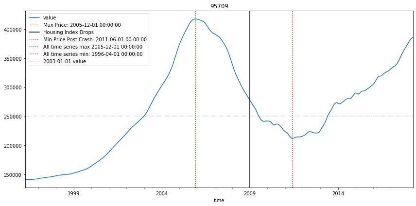


#### Boxplot of zip code


```python
ts_95709.boxplot(column = 'value')
plt.title('95709');

```


### Plot ACF and PACF for ts dataframe


```python
# plot_acf_pacf(ts, figsize=(10,6), lags=15)  # note that ts must only contain values and time as index

plot_acf_pacf(ts_95709_values, figsize=(10,6), lags=15)
```


### Plot seasonal decomposition for ts dataframe


```python
# plot_seasonal_decomp(ts)

plot_seasonal_decomp(ts_95709_values)

# Seasonality does not appear to be a significant factor in this zip code.
```


    (<Figure size 1296x432 with 1 Axes>,
     <matplotlib.axes._subplots.AxesSubplot at 0x1cc68dc2e8>)


## ARIMA model parameters and optimization

### Generate list of (p,d,q) and (p,d,q,m) values


```python
p_values = [0, 1, 2, 4, 6, 8]
d_values = range(0, 3)
q_values = range(0, 3)
warnings.filterwarnings("ignore")
```

### Run ARIMA model on ts dataframe with list of p,d,q values 


```python
# eval_arima_models(ts, p_values, d_values, q_values)  # don't run this until you have some time, since it take time
# note that ts must only contain values and time as index

# eval_arima_models(ts_95709_values, p_values, d_values, q_values)  # don't run this until you have some time, since it takes time

```

### Generate model fit summary


```python
# model_fit = arima_zipcode(ts, order = None)   # change order = tuple to correspond to the best MSE produced by previous function

# Best ARIMA(8, 0, 2) MSE=717546.010
model_fit_95709 = arima_zipcode(ts_95709_values, order = (8, 0, 2))
```

                                  ARMA Model Results                              
    ==============================================================================
    Dep. Variable:                      y   No. Observations:                  265
    Model:                     ARMA(8, 2)   Log Likelihood               -2059.947
    Method:                       css-mle   S.D. of innovations            558.079
    Date:                Tue, 10 Mar 2020   AIC                           4143.893
    Time:                        22:39:31   BIC                           4186.850
    Sample:                             0   HQIC                          4161.153
                                                                                  
    ==============================================================================
                     coef    std err          z      P>|z|      [0.025      0.975]
    ------------------------------------------------------------------------------
    const       2.634e+05   3.86e+04      6.832      0.000    1.88e+05    3.39e+05
    ar.L1.y        1.1579        nan        nan        nan         nan         nan
    ar.L2.y        0.4021        nan        nan        nan         nan         nan
    ar.L3.y       -0.6790        nan        nan        nan         nan         nan
    ar.L4.y        0.2704      0.097      2.793      0.006       0.081       0.460
    ar.L5.y        0.0801      0.133      0.602      0.548      -0.181       0.341
    ar.L6.y       -0.3519        nan        nan        nan         nan         nan
    ar.L7.y        0.1648        nan        nan        nan         nan         nan
    ar.L8.y       -0.0473        nan        nan        nan         nan         nan
    ma.L1.y        1.6978        nan        nan        nan         nan         nan
    ma.L2.y        0.8863        nan        nan        nan         nan         nan
                                        Roots                                    
    =============================================================================
                      Real          Imaginary           Modulus         Frequency
    -----------------------------------------------------------------------------
    AR.1           -1.1186           -0.4162j            1.1935           -0.4433
    AR.2           -1.1186           +0.4162j            1.1935            0.4433
    AR.3            1.0152           -0.0312j            1.0156           -0.0049
    AR.4            1.0152           +0.0312j            1.0156            0.0049
    AR.5            0.2972           -1.5087j            1.5376           -0.2190
    AR.6            0.2972           +1.5087j            1.5376            0.2190
    AR.7            1.5474           -1.9205j            2.4663           -0.1421
    AR.8            1.5474           +1.9205j            2.4663            0.1421
    MA.1           -0.9578           -0.4593j            1.0622           -0.4288
    MA.2           -0.9578           +0.4593j            1.0622            0.4288
    -----------------------------------------------------------------------------


## ARIMA modeling results:  predictions and visualization

### Produce forecasts from ARIMA model fit


```python
actual_forecast_95709, std_error_95709, forecast_confint_95709 = forecast(model_fit_95709)
```


```python
actual_forecast_95709, std_error_95709, forecast_confint_95709
```


    (array([387587.02798097, 389183.86322317, 390860.20296759, 392171.67650521,
            393276.76676792, 394166.53007683, 394927.98909434, 395520.38004576,
            395910.3061555 , 396151.21549716, 396209.76279306, 396137.74477409,
            395893.54486675, 395513.33000554, 394983.25587279, 394319.04398294,
            393523.79256005, 392597.00517871, 391552.59009293, 390385.45412106,
            389110.52766437, 387724.19560703, 386237.61037259, 384651.77218719]),
     array([  558.07932896,  1688.58344788,  3070.41143071,  4457.43047471,
             5884.42304277,  7396.96246891,  9021.89119396, 10717.32130053,
            12464.21589616, 14255.00374785, 16086.87078045, 17954.76955724,
            19847.01621576, 21759.69749061, 23685.58843878, 25621.89556074,
            27562.59234865, 29503.82649799, 31441.48870073, 33371.86657297,
            35291.9507823 , 37198.17145324, 39088.05616794, 40958.59726887]),
     array([[386493.21259569, 388680.84336624],
            [385874.30048043, 392493.42596591],
            [384842.30714568, 396878.0987895 ],
            [383435.27331118, 400908.07969925],
            [381743.5095343 , 404810.02400154],
            [379668.75004277, 408664.31011088],
            [377245.40728174, 412610.57090693],
            [374514.81628596, 416525.94380555],
            [371480.89190349, 420339.7204075 ],
            [368211.92155189, 424090.50944243],
            [364680.07543943, 427739.45014669],
            [360947.04309118, 431328.44645701],
            [356994.10788328, 434792.98185023],
            [352865.10660945, 438161.55340162],
            [348560.35558014, 441406.15616544],
            [344101.05146825, 444537.03649764],
            [339502.10423613, 447545.48088397],
            [334770.56783654, 450423.44252088],
            [329928.40461918, 453176.77556668],
            [324977.79754116, 455793.11070095],
            [319939.57518691, 458281.48014183],
            [314817.11926794, 460631.27194613],
            [309626.42805775, 462848.79268743],
            [304374.39668292, 464929.14769145]]))


### Create dataframe to hold forecast results


```python
# df_forecast = forecast_df(col = 'time', daterange = pd.date_range(start='2018-05-01', end='2020-04-01', freq='MS'), 
#                 actual_forecast=actual_forecast, forecast_confint = forecast_confint)

df_forecast_95709 = forecast_df(actual_forecast_95709, forecast_confint_95709, col = 'time', daterange = pd.date_range(start='2018-05-01', end='2020-04-01', freq='MS'))

```

### Create new dataframe concatenating historic values and forecast results


```python
# df_new = concat_values_forecast(ts, df_forecast)

df_new_95709 = concat_values_forecast(ts_95709_values, df_forecast_95709)
```


```python
df_new_95709
```


<div>
<style scoped>
    .dataframe tbody tr th:only-of-type {
        vertical-align: middle;
    }

    .dataframe tbody tr th {
        vertical-align: top;
    }

    .dataframe thead th {
        text-align: right;
    }
</style>
<table border="1" class="dataframe">
  <thead>
    <tr style="text-align: right;">
      <th></th>
      <th>value</th>
      <th>forecast</th>
      <th>forecast_lower</th>
      <th>forecast_upper</th>
    </tr>
    <tr>
      <th>time</th>
      <th></th>
      <th></th>
      <th></th>
      <th></th>
    </tr>
  </thead>
  <tbody>
    <tr>
      <td>1996-04-01</td>
      <td>141500.0</td>
      <td>NaN</td>
      <td>NaN</td>
      <td>NaN</td>
    </tr>
    <tr>
      <td>1996-05-01</td>
      <td>141500.0</td>
      <td>NaN</td>
      <td>NaN</td>
      <td>NaN</td>
    </tr>
    <tr>
      <td>1996-06-01</td>
      <td>141500.0</td>
      <td>NaN</td>
      <td>NaN</td>
      <td>NaN</td>
    </tr>
    <tr>
      <td>1996-07-01</td>
      <td>141500.0</td>
      <td>NaN</td>
      <td>NaN</td>
      <td>NaN</td>
    </tr>
    <tr>
      <td>1996-08-01</td>
      <td>141600.0</td>
      <td>NaN</td>
      <td>NaN</td>
      <td>NaN</td>
    </tr>
    <tr>
      <td>1996-09-01</td>
      <td>141600.0</td>
      <td>NaN</td>
      <td>NaN</td>
      <td>NaN</td>
    </tr>
    <tr>
      <td>1996-10-01</td>
      <td>141800.0</td>
      <td>NaN</td>
      <td>NaN</td>
      <td>NaN</td>
    </tr>
    <tr>
      <td>1996-11-01</td>
      <td>142000.0</td>
      <td>NaN</td>
      <td>NaN</td>
      <td>NaN</td>
    </tr>
    <tr>
      <td>1996-12-01</td>
      <td>142400.0</td>
      <td>NaN</td>
      <td>NaN</td>
      <td>NaN</td>
    </tr>
    <tr>
      <td>1997-01-01</td>
      <td>142900.0</td>
      <td>NaN</td>
      <td>NaN</td>
      <td>NaN</td>
    </tr>
    <tr>
      <td>1997-02-01</td>
      <td>143400.0</td>
      <td>NaN</td>
      <td>NaN</td>
      <td>NaN</td>
    </tr>
    <tr>
      <td>1997-03-01</td>
      <td>143800.0</td>
      <td>NaN</td>
      <td>NaN</td>
      <td>NaN</td>
    </tr>
    <tr>
      <td>1997-04-01</td>
      <td>144200.0</td>
      <td>NaN</td>
      <td>NaN</td>
      <td>NaN</td>
    </tr>
    <tr>
      <td>1997-05-01</td>
      <td>144500.0</td>
      <td>NaN</td>
      <td>NaN</td>
      <td>NaN</td>
    </tr>
    <tr>
      <td>1997-06-01</td>
      <td>144800.0</td>
      <td>NaN</td>
      <td>NaN</td>
      <td>NaN</td>
    </tr>
    <tr>
      <td>1997-07-01</td>
      <td>145200.0</td>
      <td>NaN</td>
      <td>NaN</td>
      <td>NaN</td>
    </tr>
    <tr>
      <td>1997-08-01</td>
      <td>145500.0</td>
      <td>NaN</td>
      <td>NaN</td>
      <td>NaN</td>
    </tr>
    <tr>
      <td>1997-09-01</td>
      <td>145800.0</td>
      <td>NaN</td>
      <td>NaN</td>
      <td>NaN</td>
    </tr>
    <tr>
      <td>1997-10-01</td>
      <td>146200.0</td>
      <td>NaN</td>
      <td>NaN</td>
      <td>NaN</td>
    </tr>
    <tr>
      <td>1997-11-01</td>
      <td>146600.0</td>
      <td>NaN</td>
      <td>NaN</td>
      <td>NaN</td>
    </tr>
    <tr>
      <td>1997-12-01</td>
      <td>147200.0</td>
      <td>NaN</td>
      <td>NaN</td>
      <td>NaN</td>
    </tr>
    <tr>
      <td>1998-01-01</td>
      <td>147800.0</td>
      <td>NaN</td>
      <td>NaN</td>
      <td>NaN</td>
    </tr>
    <tr>
      <td>1998-02-01</td>
      <td>148400.0</td>
      <td>NaN</td>
      <td>NaN</td>
      <td>NaN</td>
    </tr>
    <tr>
      <td>1998-03-01</td>
      <td>148700.0</td>
      <td>NaN</td>
      <td>NaN</td>
      <td>NaN</td>
    </tr>
    <tr>
      <td>1998-04-01</td>
      <td>149000.0</td>
      <td>NaN</td>
      <td>NaN</td>
      <td>NaN</td>
    </tr>
    <tr>
      <td>1998-05-01</td>
      <td>149300.0</td>
      <td>NaN</td>
      <td>NaN</td>
      <td>NaN</td>
    </tr>
    <tr>
      <td>1998-06-01</td>
      <td>149600.0</td>
      <td>NaN</td>
      <td>NaN</td>
      <td>NaN</td>
    </tr>
    <tr>
      <td>1998-07-01</td>
      <td>149800.0</td>
      <td>NaN</td>
      <td>NaN</td>
      <td>NaN</td>
    </tr>
    <tr>
      <td>1998-08-01</td>
      <td>150100.0</td>
      <td>NaN</td>
      <td>NaN</td>
      <td>NaN</td>
    </tr>
    <tr>
      <td>1998-09-01</td>
      <td>150300.0</td>
      <td>NaN</td>
      <td>NaN</td>
      <td>NaN</td>
    </tr>
    <tr>
      <td>1998-10-01</td>
      <td>150600.0</td>
      <td>NaN</td>
      <td>NaN</td>
      <td>NaN</td>
    </tr>
    <tr>
      <td>1998-11-01</td>
      <td>151000.0</td>
      <td>NaN</td>
      <td>NaN</td>
      <td>NaN</td>
    </tr>
    <tr>
      <td>1998-12-01</td>
      <td>151600.0</td>
      <td>NaN</td>
      <td>NaN</td>
      <td>NaN</td>
    </tr>
    <tr>
      <td>1999-01-01</td>
      <td>152400.0</td>
      <td>NaN</td>
      <td>NaN</td>
      <td>NaN</td>
    </tr>
    <tr>
      <td>1999-02-01</td>
      <td>153200.0</td>
      <td>NaN</td>
      <td>NaN</td>
      <td>NaN</td>
    </tr>
    <tr>
      <td>1999-03-01</td>
      <td>153900.0</td>
      <td>NaN</td>
      <td>NaN</td>
      <td>NaN</td>
    </tr>
    <tr>
      <td>1999-04-01</td>
      <td>154600.0</td>
      <td>NaN</td>
      <td>NaN</td>
      <td>NaN</td>
    </tr>
    <tr>
      <td>1999-05-01</td>
      <td>155400.0</td>
      <td>NaN</td>
      <td>NaN</td>
      <td>NaN</td>
    </tr>
    <tr>
      <td>1999-06-01</td>
      <td>156200.0</td>
      <td>NaN</td>
      <td>NaN</td>
      <td>NaN</td>
    </tr>
    <tr>
      <td>1999-07-01</td>
      <td>157000.0</td>
      <td>NaN</td>
      <td>NaN</td>
      <td>NaN</td>
    </tr>
    <tr>
      <td>1999-08-01</td>
      <td>157900.0</td>
      <td>NaN</td>
      <td>NaN</td>
      <td>NaN</td>
    </tr>
    <tr>
      <td>1999-09-01</td>
      <td>158900.0</td>
      <td>NaN</td>
      <td>NaN</td>
      <td>NaN</td>
    </tr>
    <tr>
      <td>1999-10-01</td>
      <td>160000.0</td>
      <td>NaN</td>
      <td>NaN</td>
      <td>NaN</td>
    </tr>
    <tr>
      <td>1999-11-01</td>
      <td>161200.0</td>
      <td>NaN</td>
      <td>NaN</td>
      <td>NaN</td>
    </tr>
    <tr>
      <td>1999-12-01</td>
      <td>162700.0</td>
      <td>NaN</td>
      <td>NaN</td>
      <td>NaN</td>
    </tr>
    <tr>
      <td>2000-01-01</td>
      <td>164500.0</td>
      <td>NaN</td>
      <td>NaN</td>
      <td>NaN</td>
    </tr>
    <tr>
      <td>2000-02-01</td>
      <td>166200.0</td>
      <td>NaN</td>
      <td>NaN</td>
      <td>NaN</td>
    </tr>
    <tr>
      <td>2000-03-01</td>
      <td>167900.0</td>
      <td>NaN</td>
      <td>NaN</td>
      <td>NaN</td>
    </tr>
    <tr>
      <td>2000-04-01</td>
      <td>169600.0</td>
      <td>NaN</td>
      <td>NaN</td>
      <td>NaN</td>
    </tr>
    <tr>
      <td>2000-05-01</td>
      <td>171300.0</td>
      <td>NaN</td>
      <td>NaN</td>
      <td>NaN</td>
    </tr>
    <tr>
      <td>2000-06-01</td>
      <td>173100.0</td>
      <td>NaN</td>
      <td>NaN</td>
      <td>NaN</td>
    </tr>
    <tr>
      <td>2000-07-01</td>
      <td>175000.0</td>
      <td>NaN</td>
      <td>NaN</td>
      <td>NaN</td>
    </tr>
    <tr>
      <td>2000-08-01</td>
      <td>176900.0</td>
      <td>NaN</td>
      <td>NaN</td>
      <td>NaN</td>
    </tr>
    <tr>
      <td>2000-09-01</td>
      <td>179000.0</td>
      <td>NaN</td>
      <td>NaN</td>
      <td>NaN</td>
    </tr>
    <tr>
      <td>2000-10-01</td>
      <td>181200.0</td>
      <td>NaN</td>
      <td>NaN</td>
      <td>NaN</td>
    </tr>
    <tr>
      <td>2000-11-01</td>
      <td>183500.0</td>
      <td>NaN</td>
      <td>NaN</td>
      <td>NaN</td>
    </tr>
    <tr>
      <td>2000-12-01</td>
      <td>186100.0</td>
      <td>NaN</td>
      <td>NaN</td>
      <td>NaN</td>
    </tr>
    <tr>
      <td>2001-01-01</td>
      <td>188900.0</td>
      <td>NaN</td>
      <td>NaN</td>
      <td>NaN</td>
    </tr>
    <tr>
      <td>2001-02-01</td>
      <td>191600.0</td>
      <td>NaN</td>
      <td>NaN</td>
      <td>NaN</td>
    </tr>
    <tr>
      <td>2001-03-01</td>
      <td>194300.0</td>
      <td>NaN</td>
      <td>NaN</td>
      <td>NaN</td>
    </tr>
    <tr>
      <td>2001-04-01</td>
      <td>197100.0</td>
      <td>NaN</td>
      <td>NaN</td>
      <td>NaN</td>
    </tr>
    <tr>
      <td>2001-05-01</td>
      <td>199700.0</td>
      <td>NaN</td>
      <td>NaN</td>
      <td>NaN</td>
    </tr>
    <tr>
      <td>2001-06-01</td>
      <td>202400.0</td>
      <td>NaN</td>
      <td>NaN</td>
      <td>NaN</td>
    </tr>
    <tr>
      <td>2001-07-01</td>
      <td>205000.0</td>
      <td>NaN</td>
      <td>NaN</td>
      <td>NaN</td>
    </tr>
    <tr>
      <td>2001-08-01</td>
      <td>207600.0</td>
      <td>NaN</td>
      <td>NaN</td>
      <td>NaN</td>
    </tr>
    <tr>
      <td>2001-09-01</td>
      <td>210200.0</td>
      <td>NaN</td>
      <td>NaN</td>
      <td>NaN</td>
    </tr>
    <tr>
      <td>2001-10-01</td>
      <td>212700.0</td>
      <td>NaN</td>
      <td>NaN</td>
      <td>NaN</td>
    </tr>
    <tr>
      <td>2001-11-01</td>
      <td>215400.0</td>
      <td>NaN</td>
      <td>NaN</td>
      <td>NaN</td>
    </tr>
    <tr>
      <td>2001-12-01</td>
      <td>218200.0</td>
      <td>NaN</td>
      <td>NaN</td>
      <td>NaN</td>
    </tr>
    <tr>
      <td>2002-01-01</td>
      <td>221100.0</td>
      <td>NaN</td>
      <td>NaN</td>
      <td>NaN</td>
    </tr>
    <tr>
      <td>2002-02-01</td>
      <td>224000.0</td>
      <td>NaN</td>
      <td>NaN</td>
      <td>NaN</td>
    </tr>
    <tr>
      <td>2002-03-01</td>
      <td>226800.0</td>
      <td>NaN</td>
      <td>NaN</td>
      <td>NaN</td>
    </tr>
    <tr>
      <td>2002-04-01</td>
      <td>229400.0</td>
      <td>NaN</td>
      <td>NaN</td>
      <td>NaN</td>
    </tr>
    <tr>
      <td>2002-05-01</td>
      <td>231900.0</td>
      <td>NaN</td>
      <td>NaN</td>
      <td>NaN</td>
    </tr>
    <tr>
      <td>2002-06-01</td>
      <td>234200.0</td>
      <td>NaN</td>
      <td>NaN</td>
      <td>NaN</td>
    </tr>
    <tr>
      <td>2002-07-01</td>
      <td>236500.0</td>
      <td>NaN</td>
      <td>NaN</td>
      <td>NaN</td>
    </tr>
    <tr>
      <td>2002-08-01</td>
      <td>238800.0</td>
      <td>NaN</td>
      <td>NaN</td>
      <td>NaN</td>
    </tr>
    <tr>
      <td>2002-09-01</td>
      <td>241000.0</td>
      <td>NaN</td>
      <td>NaN</td>
      <td>NaN</td>
    </tr>
    <tr>
      <td>2002-10-01</td>
      <td>243400.0</td>
      <td>NaN</td>
      <td>NaN</td>
      <td>NaN</td>
    </tr>
    <tr>
      <td>2002-11-01</td>
      <td>245700.0</td>
      <td>NaN</td>
      <td>NaN</td>
      <td>NaN</td>
    </tr>
    <tr>
      <td>2002-12-01</td>
      <td>248000.0</td>
      <td>NaN</td>
      <td>NaN</td>
      <td>NaN</td>
    </tr>
    <tr>
      <td>2003-01-01</td>
      <td>250800.0</td>
      <td>NaN</td>
      <td>NaN</td>
      <td>NaN</td>
    </tr>
    <tr>
      <td>2003-02-01</td>
      <td>254200.0</td>
      <td>NaN</td>
      <td>NaN</td>
      <td>NaN</td>
    </tr>
    <tr>
      <td>2003-03-01</td>
      <td>258200.0</td>
      <td>NaN</td>
      <td>NaN</td>
      <td>NaN</td>
    </tr>
    <tr>
      <td>2003-04-01</td>
      <td>262900.0</td>
      <td>NaN</td>
      <td>NaN</td>
      <td>NaN</td>
    </tr>
    <tr>
      <td>2003-05-01</td>
      <td>267800.0</td>
      <td>NaN</td>
      <td>NaN</td>
      <td>NaN</td>
    </tr>
    <tr>
      <td>2003-06-01</td>
      <td>272800.0</td>
      <td>NaN</td>
      <td>NaN</td>
      <td>NaN</td>
    </tr>
    <tr>
      <td>2003-07-01</td>
      <td>277600.0</td>
      <td>NaN</td>
      <td>NaN</td>
      <td>NaN</td>
    </tr>
    <tr>
      <td>2003-08-01</td>
      <td>282200.0</td>
      <td>NaN</td>
      <td>NaN</td>
      <td>NaN</td>
    </tr>
    <tr>
      <td>2003-09-01</td>
      <td>286500.0</td>
      <td>NaN</td>
      <td>NaN</td>
      <td>NaN</td>
    </tr>
    <tr>
      <td>2003-10-01</td>
      <td>290700.0</td>
      <td>NaN</td>
      <td>NaN</td>
      <td>NaN</td>
    </tr>
    <tr>
      <td>2003-11-01</td>
      <td>295000.0</td>
      <td>NaN</td>
      <td>NaN</td>
      <td>NaN</td>
    </tr>
    <tr>
      <td>2003-12-01</td>
      <td>299100.0</td>
      <td>NaN</td>
      <td>NaN</td>
      <td>NaN</td>
    </tr>
    <tr>
      <td>2004-01-01</td>
      <td>303100.0</td>
      <td>NaN</td>
      <td>NaN</td>
      <td>NaN</td>
    </tr>
    <tr>
      <td>2004-02-01</td>
      <td>306800.0</td>
      <td>NaN</td>
      <td>NaN</td>
      <td>NaN</td>
    </tr>
    <tr>
      <td>2004-03-01</td>
      <td>310600.0</td>
      <td>NaN</td>
      <td>NaN</td>
      <td>NaN</td>
    </tr>
    <tr>
      <td>2004-04-01</td>
      <td>314600.0</td>
      <td>NaN</td>
      <td>NaN</td>
      <td>NaN</td>
    </tr>
    <tr>
      <td>2004-05-01</td>
      <td>319000.0</td>
      <td>NaN</td>
      <td>NaN</td>
      <td>NaN</td>
    </tr>
    <tr>
      <td>2004-06-01</td>
      <td>323800.0</td>
      <td>NaN</td>
      <td>NaN</td>
      <td>NaN</td>
    </tr>
    <tr>
      <td>2004-07-01</td>
      <td>329400.0</td>
      <td>NaN</td>
      <td>NaN</td>
      <td>NaN</td>
    </tr>
    <tr>
      <td>2004-08-01</td>
      <td>335600.0</td>
      <td>NaN</td>
      <td>NaN</td>
      <td>NaN</td>
    </tr>
    <tr>
      <td>2004-09-01</td>
      <td>342800.0</td>
      <td>NaN</td>
      <td>NaN</td>
      <td>NaN</td>
    </tr>
    <tr>
      <td>2004-10-01</td>
      <td>350800.0</td>
      <td>NaN</td>
      <td>NaN</td>
      <td>NaN</td>
    </tr>
    <tr>
      <td>2004-11-01</td>
      <td>359100.0</td>
      <td>NaN</td>
      <td>NaN</td>
      <td>NaN</td>
    </tr>
    <tr>
      <td>2004-12-01</td>
      <td>367000.0</td>
      <td>NaN</td>
      <td>NaN</td>
      <td>NaN</td>
    </tr>
    <tr>
      <td>2005-01-01</td>
      <td>374100.0</td>
      <td>NaN</td>
      <td>NaN</td>
      <td>NaN</td>
    </tr>
    <tr>
      <td>2005-02-01</td>
      <td>380100.0</td>
      <td>NaN</td>
      <td>NaN</td>
      <td>NaN</td>
    </tr>
    <tr>
      <td>2005-03-01</td>
      <td>385700.0</td>
      <td>NaN</td>
      <td>NaN</td>
      <td>NaN</td>
    </tr>
    <tr>
      <td>2005-04-01</td>
      <td>391100.0</td>
      <td>NaN</td>
      <td>NaN</td>
      <td>NaN</td>
    </tr>
    <tr>
      <td>2005-05-01</td>
      <td>396100.0</td>
      <td>NaN</td>
      <td>NaN</td>
      <td>NaN</td>
    </tr>
    <tr>
      <td>2005-06-01</td>
      <td>400900.0</td>
      <td>NaN</td>
      <td>NaN</td>
      <td>NaN</td>
    </tr>
    <tr>
      <td>2005-07-01</td>
      <td>405700.0</td>
      <td>NaN</td>
      <td>NaN</td>
      <td>NaN</td>
    </tr>
    <tr>
      <td>2005-08-01</td>
      <td>410200.0</td>
      <td>NaN</td>
      <td>NaN</td>
      <td>NaN</td>
    </tr>
    <tr>
      <td>2005-09-01</td>
      <td>413800.0</td>
      <td>NaN</td>
      <td>NaN</td>
      <td>NaN</td>
    </tr>
    <tr>
      <td>2005-10-01</td>
      <td>416200.0</td>
      <td>NaN</td>
      <td>NaN</td>
      <td>NaN</td>
    </tr>
    <tr>
      <td>2005-11-01</td>
      <td>417300.0</td>
      <td>NaN</td>
      <td>NaN</td>
      <td>NaN</td>
    </tr>
    <tr>
      <td>2005-12-01</td>
      <td>417700.0</td>
      <td>NaN</td>
      <td>NaN</td>
      <td>NaN</td>
    </tr>
    <tr>
      <td>2006-01-01</td>
      <td>417400.0</td>
      <td>NaN</td>
      <td>NaN</td>
      <td>NaN</td>
    </tr>
    <tr>
      <td>2006-02-01</td>
      <td>416600.0</td>
      <td>NaN</td>
      <td>NaN</td>
      <td>NaN</td>
    </tr>
    <tr>
      <td>2006-03-01</td>
      <td>415700.0</td>
      <td>NaN</td>
      <td>NaN</td>
      <td>NaN</td>
    </tr>
    <tr>
      <td>2006-04-01</td>
      <td>414900.0</td>
      <td>NaN</td>
      <td>NaN</td>
      <td>NaN</td>
    </tr>
    <tr>
      <td>2006-05-01</td>
      <td>413800.0</td>
      <td>NaN</td>
      <td>NaN</td>
      <td>NaN</td>
    </tr>
    <tr>
      <td>2006-06-01</td>
      <td>411700.0</td>
      <td>NaN</td>
      <td>NaN</td>
      <td>NaN</td>
    </tr>
    <tr>
      <td>2006-07-01</td>
      <td>408600.0</td>
      <td>NaN</td>
      <td>NaN</td>
      <td>NaN</td>
    </tr>
    <tr>
      <td>2006-08-01</td>
      <td>404900.0</td>
      <td>NaN</td>
      <td>NaN</td>
      <td>NaN</td>
    </tr>
    <tr>
      <td>2006-09-01</td>
      <td>401100.0</td>
      <td>NaN</td>
      <td>NaN</td>
      <td>NaN</td>
    </tr>
    <tr>
      <td>2006-10-01</td>
      <td>397800.0</td>
      <td>NaN</td>
      <td>NaN</td>
      <td>NaN</td>
    </tr>
    <tr>
      <td>2006-11-01</td>
      <td>395000.0</td>
      <td>NaN</td>
      <td>NaN</td>
      <td>NaN</td>
    </tr>
    <tr>
      <td>2006-12-01</td>
      <td>393100.0</td>
      <td>NaN</td>
      <td>NaN</td>
      <td>NaN</td>
    </tr>
    <tr>
      <td>2007-01-01</td>
      <td>391800.0</td>
      <td>NaN</td>
      <td>NaN</td>
      <td>NaN</td>
    </tr>
    <tr>
      <td>2007-02-01</td>
      <td>390300.0</td>
      <td>NaN</td>
      <td>NaN</td>
      <td>NaN</td>
    </tr>
    <tr>
      <td>2007-03-01</td>
      <td>388600.0</td>
      <td>NaN</td>
      <td>NaN</td>
      <td>NaN</td>
    </tr>
    <tr>
      <td>2007-04-01</td>
      <td>386800.0</td>
      <td>NaN</td>
      <td>NaN</td>
      <td>NaN</td>
    </tr>
    <tr>
      <td>2007-05-01</td>
      <td>384200.0</td>
      <td>NaN</td>
      <td>NaN</td>
      <td>NaN</td>
    </tr>
    <tr>
      <td>2007-06-01</td>
      <td>380600.0</td>
      <td>NaN</td>
      <td>NaN</td>
      <td>NaN</td>
    </tr>
    <tr>
      <td>2007-07-01</td>
      <td>376600.0</td>
      <td>NaN</td>
      <td>NaN</td>
      <td>NaN</td>
    </tr>
    <tr>
      <td>2007-08-01</td>
      <td>372600.0</td>
      <td>NaN</td>
      <td>NaN</td>
      <td>NaN</td>
    </tr>
    <tr>
      <td>2007-09-01</td>
      <td>367900.0</td>
      <td>NaN</td>
      <td>NaN</td>
      <td>NaN</td>
    </tr>
    <tr>
      <td>2007-10-01</td>
      <td>361900.0</td>
      <td>NaN</td>
      <td>NaN</td>
      <td>NaN</td>
    </tr>
    <tr>
      <td>2007-11-01</td>
      <td>354900.0</td>
      <td>NaN</td>
      <td>NaN</td>
      <td>NaN</td>
    </tr>
    <tr>
      <td>2007-12-01</td>
      <td>347200.0</td>
      <td>NaN</td>
      <td>NaN</td>
      <td>NaN</td>
    </tr>
    <tr>
      <td>2008-01-01</td>
      <td>339500.0</td>
      <td>NaN</td>
      <td>NaN</td>
      <td>NaN</td>
    </tr>
    <tr>
      <td>2008-02-01</td>
      <td>332000.0</td>
      <td>NaN</td>
      <td>NaN</td>
      <td>NaN</td>
    </tr>
    <tr>
      <td>2008-03-01</td>
      <td>325200.0</td>
      <td>NaN</td>
      <td>NaN</td>
      <td>NaN</td>
    </tr>
    <tr>
      <td>2008-04-01</td>
      <td>319300.0</td>
      <td>NaN</td>
      <td>NaN</td>
      <td>NaN</td>
    </tr>
    <tr>
      <td>2008-05-01</td>
      <td>313900.0</td>
      <td>NaN</td>
      <td>NaN</td>
      <td>NaN</td>
    </tr>
    <tr>
      <td>2008-06-01</td>
      <td>308400.0</td>
      <td>NaN</td>
      <td>NaN</td>
      <td>NaN</td>
    </tr>
    <tr>
      <td>2008-07-01</td>
      <td>303200.0</td>
      <td>NaN</td>
      <td>NaN</td>
      <td>NaN</td>
    </tr>
    <tr>
      <td>2008-08-01</td>
      <td>298500.0</td>
      <td>NaN</td>
      <td>NaN</td>
      <td>NaN</td>
    </tr>
    <tr>
      <td>2008-09-01</td>
      <td>294100.0</td>
      <td>NaN</td>
      <td>NaN</td>
      <td>NaN</td>
    </tr>
    <tr>
      <td>2008-10-01</td>
      <td>290000.0</td>
      <td>NaN</td>
      <td>NaN</td>
      <td>NaN</td>
    </tr>
    <tr>
      <td>2008-11-01</td>
      <td>286000.0</td>
      <td>NaN</td>
      <td>NaN</td>
      <td>NaN</td>
    </tr>
    <tr>
      <td>2008-12-01</td>
      <td>281900.0</td>
      <td>NaN</td>
      <td>NaN</td>
      <td>NaN</td>
    </tr>
    <tr>
      <td>2009-01-01</td>
      <td>277900.0</td>
      <td>NaN</td>
      <td>NaN</td>
      <td>NaN</td>
    </tr>
    <tr>
      <td>2009-02-01</td>
      <td>273600.0</td>
      <td>NaN</td>
      <td>NaN</td>
      <td>NaN</td>
    </tr>
    <tr>
      <td>2009-03-01</td>
      <td>269500.0</td>
      <td>NaN</td>
      <td>NaN</td>
      <td>NaN</td>
    </tr>
    <tr>
      <td>2009-04-01</td>
      <td>265800.0</td>
      <td>NaN</td>
      <td>NaN</td>
      <td>NaN</td>
    </tr>
    <tr>
      <td>2009-05-01</td>
      <td>261700.0</td>
      <td>NaN</td>
      <td>NaN</td>
      <td>NaN</td>
    </tr>
    <tr>
      <td>2009-06-01</td>
      <td>256300.0</td>
      <td>NaN</td>
      <td>NaN</td>
      <td>NaN</td>
    </tr>
    <tr>
      <td>2009-07-01</td>
      <td>250700.0</td>
      <td>NaN</td>
      <td>NaN</td>
      <td>NaN</td>
    </tr>
    <tr>
      <td>2009-08-01</td>
      <td>246000.0</td>
      <td>NaN</td>
      <td>NaN</td>
      <td>NaN</td>
    </tr>
    <tr>
      <td>2009-09-01</td>
      <td>243100.0</td>
      <td>NaN</td>
      <td>NaN</td>
      <td>NaN</td>
    </tr>
    <tr>
      <td>2009-10-01</td>
      <td>241700.0</td>
      <td>NaN</td>
      <td>NaN</td>
      <td>NaN</td>
    </tr>
    <tr>
      <td>2009-11-01</td>
      <td>241500.0</td>
      <td>NaN</td>
      <td>NaN</td>
      <td>NaN</td>
    </tr>
    <tr>
      <td>2009-12-01</td>
      <td>242100.0</td>
      <td>NaN</td>
      <td>NaN</td>
      <td>NaN</td>
    </tr>
    <tr>
      <td>2010-01-01</td>
      <td>241900.0</td>
      <td>NaN</td>
      <td>NaN</td>
      <td>NaN</td>
    </tr>
    <tr>
      <td>2010-02-01</td>
      <td>241900.0</td>
      <td>NaN</td>
      <td>NaN</td>
      <td>NaN</td>
    </tr>
    <tr>
      <td>2010-03-01</td>
      <td>241100.0</td>
      <td>NaN</td>
      <td>NaN</td>
      <td>NaN</td>
    </tr>
    <tr>
      <td>2010-04-01</td>
      <td>238200.0</td>
      <td>NaN</td>
      <td>NaN</td>
      <td>NaN</td>
    </tr>
    <tr>
      <td>2010-05-01</td>
      <td>235400.0</td>
      <td>NaN</td>
      <td>NaN</td>
      <td>NaN</td>
    </tr>
    <tr>
      <td>2010-06-01</td>
      <td>235500.0</td>
      <td>NaN</td>
      <td>NaN</td>
      <td>NaN</td>
    </tr>
    <tr>
      <td>2010-07-01</td>
      <td>236700.0</td>
      <td>NaN</td>
      <td>NaN</td>
      <td>NaN</td>
    </tr>
    <tr>
      <td>2010-08-01</td>
      <td>236700.0</td>
      <td>NaN</td>
      <td>NaN</td>
      <td>NaN</td>
    </tr>
    <tr>
      <td>2010-09-01</td>
      <td>235200.0</td>
      <td>NaN</td>
      <td>NaN</td>
      <td>NaN</td>
    </tr>
    <tr>
      <td>2010-10-01</td>
      <td>232600.0</td>
      <td>NaN</td>
      <td>NaN</td>
      <td>NaN</td>
    </tr>
    <tr>
      <td>2010-11-01</td>
      <td>229500.0</td>
      <td>NaN</td>
      <td>NaN</td>
      <td>NaN</td>
    </tr>
    <tr>
      <td>2010-12-01</td>
      <td>225900.0</td>
      <td>NaN</td>
      <td>NaN</td>
      <td>NaN</td>
    </tr>
    <tr>
      <td>2011-01-01</td>
      <td>223700.0</td>
      <td>NaN</td>
      <td>NaN</td>
      <td>NaN</td>
    </tr>
    <tr>
      <td>2011-02-01</td>
      <td>222100.0</td>
      <td>NaN</td>
      <td>NaN</td>
      <td>NaN</td>
    </tr>
    <tr>
      <td>2011-03-01</td>
      <td>219700.0</td>
      <td>NaN</td>
      <td>NaN</td>
      <td>NaN</td>
    </tr>
    <tr>
      <td>2011-04-01</td>
      <td>216100.0</td>
      <td>NaN</td>
      <td>NaN</td>
      <td>NaN</td>
    </tr>
    <tr>
      <td>2011-05-01</td>
      <td>213300.0</td>
      <td>NaN</td>
      <td>NaN</td>
      <td>NaN</td>
    </tr>
    <tr>
      <td>2011-06-01</td>
      <td>211900.0</td>
      <td>NaN</td>
      <td>NaN</td>
      <td>NaN</td>
    </tr>
    <tr>
      <td>2011-07-01</td>
      <td>212800.0</td>
      <td>NaN</td>
      <td>NaN</td>
      <td>NaN</td>
    </tr>
    <tr>
      <td>2011-08-01</td>
      <td>214000.0</td>
      <td>NaN</td>
      <td>NaN</td>
      <td>NaN</td>
    </tr>
    <tr>
      <td>2011-09-01</td>
      <td>214500.0</td>
      <td>NaN</td>
      <td>NaN</td>
      <td>NaN</td>
    </tr>
    <tr>
      <td>2011-10-01</td>
      <td>214500.0</td>
      <td>NaN</td>
      <td>NaN</td>
      <td>NaN</td>
    </tr>
    <tr>
      <td>2011-11-01</td>
      <td>214600.0</td>
      <td>NaN</td>
      <td>NaN</td>
      <td>NaN</td>
    </tr>
    <tr>
      <td>2011-12-01</td>
      <td>215200.0</td>
      <td>NaN</td>
      <td>NaN</td>
      <td>NaN</td>
    </tr>
    <tr>
      <td>2012-01-01</td>
      <td>216100.0</td>
      <td>NaN</td>
      <td>NaN</td>
      <td>NaN</td>
    </tr>
    <tr>
      <td>2012-02-01</td>
      <td>217200.0</td>
      <td>NaN</td>
      <td>NaN</td>
      <td>NaN</td>
    </tr>
    <tr>
      <td>2012-03-01</td>
      <td>218900.0</td>
      <td>NaN</td>
      <td>NaN</td>
      <td>NaN</td>
    </tr>
    <tr>
      <td>2012-04-01</td>
      <td>221300.0</td>
      <td>NaN</td>
      <td>NaN</td>
      <td>NaN</td>
    </tr>
    <tr>
      <td>2012-05-01</td>
      <td>223300.0</td>
      <td>NaN</td>
      <td>NaN</td>
      <td>NaN</td>
    </tr>
    <tr>
      <td>2012-06-01</td>
      <td>223800.0</td>
      <td>NaN</td>
      <td>NaN</td>
      <td>NaN</td>
    </tr>
    <tr>
      <td>2012-07-01</td>
      <td>223000.0</td>
      <td>NaN</td>
      <td>NaN</td>
      <td>NaN</td>
    </tr>
    <tr>
      <td>2012-08-01</td>
      <td>222100.0</td>
      <td>NaN</td>
      <td>NaN</td>
      <td>NaN</td>
    </tr>
    <tr>
      <td>2012-09-01</td>
      <td>221500.0</td>
      <td>NaN</td>
      <td>NaN</td>
      <td>NaN</td>
    </tr>
    <tr>
      <td>2012-10-01</td>
      <td>221300.0</td>
      <td>NaN</td>
      <td>NaN</td>
      <td>NaN</td>
    </tr>
    <tr>
      <td>2012-11-01</td>
      <td>221500.0</td>
      <td>NaN</td>
      <td>NaN</td>
      <td>NaN</td>
    </tr>
    <tr>
      <td>2012-12-01</td>
      <td>222600.0</td>
      <td>NaN</td>
      <td>NaN</td>
      <td>NaN</td>
    </tr>
    <tr>
      <td>2013-01-01</td>
      <td>225800.0</td>
      <td>NaN</td>
      <td>NaN</td>
      <td>NaN</td>
    </tr>
    <tr>
      <td>2013-02-01</td>
      <td>230300.0</td>
      <td>NaN</td>
      <td>NaN</td>
      <td>NaN</td>
    </tr>
    <tr>
      <td>2013-03-01</td>
      <td>234300.0</td>
      <td>NaN</td>
      <td>NaN</td>
      <td>NaN</td>
    </tr>
    <tr>
      <td>2013-04-01</td>
      <td>238600.0</td>
      <td>NaN</td>
      <td>NaN</td>
      <td>NaN</td>
    </tr>
    <tr>
      <td>2013-05-01</td>
      <td>244400.0</td>
      <td>NaN</td>
      <td>NaN</td>
      <td>NaN</td>
    </tr>
    <tr>
      <td>2013-06-01</td>
      <td>251000.0</td>
      <td>NaN</td>
      <td>NaN</td>
      <td>NaN</td>
    </tr>
    <tr>
      <td>2013-07-01</td>
      <td>255700.0</td>
      <td>NaN</td>
      <td>NaN</td>
      <td>NaN</td>
    </tr>
    <tr>
      <td>2013-08-01</td>
      <td>259400.0</td>
      <td>NaN</td>
      <td>NaN</td>
      <td>NaN</td>
    </tr>
    <tr>
      <td>2013-09-01</td>
      <td>264000.0</td>
      <td>NaN</td>
      <td>NaN</td>
      <td>NaN</td>
    </tr>
    <tr>
      <td>2013-10-01</td>
      <td>269100.0</td>
      <td>NaN</td>
      <td>NaN</td>
      <td>NaN</td>
    </tr>
    <tr>
      <td>2013-11-01</td>
      <td>272600.0</td>
      <td>NaN</td>
      <td>NaN</td>
      <td>NaN</td>
    </tr>
    <tr>
      <td>2013-12-01</td>
      <td>273700.0</td>
      <td>NaN</td>
      <td>NaN</td>
      <td>NaN</td>
    </tr>
    <tr>
      <td>2014-01-01</td>
      <td>272400.0</td>
      <td>NaN</td>
      <td>NaN</td>
      <td>NaN</td>
    </tr>
    <tr>
      <td>2014-02-01</td>
      <td>271500.0</td>
      <td>NaN</td>
      <td>NaN</td>
      <td>NaN</td>
    </tr>
    <tr>
      <td>2014-03-01</td>
      <td>272600.0</td>
      <td>NaN</td>
      <td>NaN</td>
      <td>NaN</td>
    </tr>
    <tr>
      <td>2014-04-01</td>
      <td>274600.0</td>
      <td>NaN</td>
      <td>NaN</td>
      <td>NaN</td>
    </tr>
    <tr>
      <td>2014-05-01</td>
      <td>276300.0</td>
      <td>NaN</td>
      <td>NaN</td>
      <td>NaN</td>
    </tr>
    <tr>
      <td>2014-06-01</td>
      <td>278600.0</td>
      <td>NaN</td>
      <td>NaN</td>
      <td>NaN</td>
    </tr>
    <tr>
      <td>2014-07-01</td>
      <td>280100.0</td>
      <td>NaN</td>
      <td>NaN</td>
      <td>NaN</td>
    </tr>
    <tr>
      <td>2014-08-01</td>
      <td>280500.0</td>
      <td>NaN</td>
      <td>NaN</td>
      <td>NaN</td>
    </tr>
    <tr>
      <td>2014-09-01</td>
      <td>280300.0</td>
      <td>NaN</td>
      <td>NaN</td>
      <td>NaN</td>
    </tr>
    <tr>
      <td>2014-10-01</td>
      <td>281600.0</td>
      <td>NaN</td>
      <td>NaN</td>
      <td>NaN</td>
    </tr>
    <tr>
      <td>2014-11-01</td>
      <td>284700.0</td>
      <td>NaN</td>
      <td>NaN</td>
      <td>NaN</td>
    </tr>
    <tr>
      <td>2014-12-01</td>
      <td>288600.0</td>
      <td>NaN</td>
      <td>NaN</td>
      <td>NaN</td>
    </tr>
    <tr>
      <td>2015-01-01</td>
      <td>290500.0</td>
      <td>NaN</td>
      <td>NaN</td>
      <td>NaN</td>
    </tr>
    <tr>
      <td>2015-02-01</td>
      <td>289500.0</td>
      <td>NaN</td>
      <td>NaN</td>
      <td>NaN</td>
    </tr>
    <tr>
      <td>2015-03-01</td>
      <td>288300.0</td>
      <td>NaN</td>
      <td>NaN</td>
      <td>NaN</td>
    </tr>
    <tr>
      <td>2015-04-01</td>
      <td>290300.0</td>
      <td>NaN</td>
      <td>NaN</td>
      <td>NaN</td>
    </tr>
    <tr>
      <td>2015-05-01</td>
      <td>293200.0</td>
      <td>NaN</td>
      <td>NaN</td>
      <td>NaN</td>
    </tr>
    <tr>
      <td>2015-06-01</td>
      <td>293700.0</td>
      <td>NaN</td>
      <td>NaN</td>
      <td>NaN</td>
    </tr>
    <tr>
      <td>2015-07-01</td>
      <td>293900.0</td>
      <td>NaN</td>
      <td>NaN</td>
      <td>NaN</td>
    </tr>
    <tr>
      <td>2015-08-01</td>
      <td>295400.0</td>
      <td>NaN</td>
      <td>NaN</td>
      <td>NaN</td>
    </tr>
    <tr>
      <td>2015-09-01</td>
      <td>297300.0</td>
      <td>NaN</td>
      <td>NaN</td>
      <td>NaN</td>
    </tr>
    <tr>
      <td>2015-10-01</td>
      <td>299000.0</td>
      <td>NaN</td>
      <td>NaN</td>
      <td>NaN</td>
    </tr>
    <tr>
      <td>2015-11-01</td>
      <td>301000.0</td>
      <td>NaN</td>
      <td>NaN</td>
      <td>NaN</td>
    </tr>
    <tr>
      <td>2015-12-01</td>
      <td>303100.0</td>
      <td>NaN</td>
      <td>NaN</td>
      <td>NaN</td>
    </tr>
    <tr>
      <td>2016-01-01</td>
      <td>305300.0</td>
      <td>NaN</td>
      <td>NaN</td>
      <td>NaN</td>
    </tr>
    <tr>
      <td>2016-02-01</td>
      <td>308300.0</td>
      <td>NaN</td>
      <td>NaN</td>
      <td>NaN</td>
    </tr>
    <tr>
      <td>2016-03-01</td>
      <td>312700.0</td>
      <td>NaN</td>
      <td>NaN</td>
      <td>NaN</td>
    </tr>
    <tr>
      <td>2016-04-01</td>
      <td>317000.0</td>
      <td>NaN</td>
      <td>NaN</td>
      <td>NaN</td>
    </tr>
    <tr>
      <td>2016-05-01</td>
      <td>319100.0</td>
      <td>NaN</td>
      <td>NaN</td>
      <td>NaN</td>
    </tr>
    <tr>
      <td>2016-06-01</td>
      <td>319400.0</td>
      <td>NaN</td>
      <td>NaN</td>
      <td>NaN</td>
    </tr>
    <tr>
      <td>2016-07-01</td>
      <td>320800.0</td>
      <td>NaN</td>
      <td>NaN</td>
      <td>NaN</td>
    </tr>
    <tr>
      <td>2016-08-01</td>
      <td>323300.0</td>
      <td>NaN</td>
      <td>NaN</td>
      <td>NaN</td>
    </tr>
    <tr>
      <td>2016-09-01</td>
      <td>325200.0</td>
      <td>NaN</td>
      <td>NaN</td>
      <td>NaN</td>
    </tr>
    <tr>
      <td>2016-10-01</td>
      <td>326600.0</td>
      <td>NaN</td>
      <td>NaN</td>
      <td>NaN</td>
    </tr>
    <tr>
      <td>2016-11-01</td>
      <td>327700.0</td>
      <td>NaN</td>
      <td>NaN</td>
      <td>NaN</td>
    </tr>
    <tr>
      <td>2016-12-01</td>
      <td>329300.0</td>
      <td>NaN</td>
      <td>NaN</td>
      <td>NaN</td>
    </tr>
    <tr>
      <td>2017-01-01</td>
      <td>331900.0</td>
      <td>NaN</td>
      <td>NaN</td>
      <td>NaN</td>
    </tr>
    <tr>
      <td>2017-02-01</td>
      <td>334100.0</td>
      <td>NaN</td>
      <td>NaN</td>
      <td>NaN</td>
    </tr>
    <tr>
      <td>2017-03-01</td>
      <td>335500.0</td>
      <td>NaN</td>
      <td>NaN</td>
      <td>NaN</td>
    </tr>
    <tr>
      <td>2017-04-01</td>
      <td>337100.0</td>
      <td>NaN</td>
      <td>NaN</td>
      <td>NaN</td>
    </tr>
    <tr>
      <td>2017-05-01</td>
      <td>340100.0</td>
      <td>NaN</td>
      <td>NaN</td>
      <td>NaN</td>
    </tr>
    <tr>
      <td>2017-06-01</td>
      <td>343900.0</td>
      <td>NaN</td>
      <td>NaN</td>
      <td>NaN</td>
    </tr>
    <tr>
      <td>2017-07-01</td>
      <td>348700.0</td>
      <td>NaN</td>
      <td>NaN</td>
      <td>NaN</td>
    </tr>
    <tr>
      <td>2017-08-01</td>
      <td>354500.0</td>
      <td>NaN</td>
      <td>NaN</td>
      <td>NaN</td>
    </tr>
    <tr>
      <td>2017-09-01</td>
      <td>359800.0</td>
      <td>NaN</td>
      <td>NaN</td>
      <td>NaN</td>
    </tr>
    <tr>
      <td>2017-10-01</td>
      <td>364200.0</td>
      <td>NaN</td>
      <td>NaN</td>
      <td>NaN</td>
    </tr>
    <tr>
      <td>2017-11-01</td>
      <td>368600.0</td>
      <td>NaN</td>
      <td>NaN</td>
      <td>NaN</td>
    </tr>
    <tr>
      <td>2017-12-01</td>
      <td>372500.0</td>
      <td>NaN</td>
      <td>NaN</td>
      <td>NaN</td>
    </tr>
    <tr>
      <td>2018-01-01</td>
      <td>377000.0</td>
      <td>NaN</td>
      <td>NaN</td>
      <td>NaN</td>
    </tr>
    <tr>
      <td>2018-02-01</td>
      <td>381200.0</td>
      <td>NaN</td>
      <td>NaN</td>
      <td>NaN</td>
    </tr>
    <tr>
      <td>2018-03-01</td>
      <td>384200.0</td>
      <td>NaN</td>
      <td>NaN</td>
      <td>NaN</td>
    </tr>
    <tr>
      <td>2018-04-01</td>
      <td>386000.0</td>
      <td>NaN</td>
      <td>NaN</td>
      <td>NaN</td>
    </tr>
    <tr>
      <td>2018-05-01</td>
      <td>NaN</td>
      <td>387587.027981</td>
      <td>386493.212596</td>
      <td>388680.843366</td>
    </tr>
    <tr>
      <td>2018-06-01</td>
      <td>NaN</td>
      <td>389183.863223</td>
      <td>385874.300480</td>
      <td>392493.425966</td>
    </tr>
    <tr>
      <td>2018-07-01</td>
      <td>NaN</td>
      <td>390860.202968</td>
      <td>384842.307146</td>
      <td>396878.098789</td>
    </tr>
    <tr>
      <td>2018-08-01</td>
      <td>NaN</td>
      <td>392171.676505</td>
      <td>383435.273311</td>
      <td>400908.079699</td>
    </tr>
    <tr>
      <td>2018-09-01</td>
      <td>NaN</td>
      <td>393276.766768</td>
      <td>381743.509534</td>
      <td>404810.024002</td>
    </tr>
    <tr>
      <td>2018-10-01</td>
      <td>NaN</td>
      <td>394166.530077</td>
      <td>379668.750043</td>
      <td>408664.310111</td>
    </tr>
    <tr>
      <td>2018-11-01</td>
      <td>NaN</td>
      <td>394927.989094</td>
      <td>377245.407282</td>
      <td>412610.570907</td>
    </tr>
    <tr>
      <td>2018-12-01</td>
      <td>NaN</td>
      <td>395520.380046</td>
      <td>374514.816286</td>
      <td>416525.943806</td>
    </tr>
    <tr>
      <td>2019-01-01</td>
      <td>NaN</td>
      <td>395910.306155</td>
      <td>371480.891903</td>
      <td>420339.720408</td>
    </tr>
    <tr>
      <td>2019-02-01</td>
      <td>NaN</td>
      <td>396151.215497</td>
      <td>368211.921552</td>
      <td>424090.509442</td>
    </tr>
    <tr>
      <td>2019-03-01</td>
      <td>NaN</td>
      <td>396209.762793</td>
      <td>364680.075439</td>
      <td>427739.450147</td>
    </tr>
    <tr>
      <td>2019-04-01</td>
      <td>NaN</td>
      <td>396137.744774</td>
      <td>360947.043091</td>
      <td>431328.446457</td>
    </tr>
    <tr>
      <td>2019-05-01</td>
      <td>NaN</td>
      <td>395893.544867</td>
      <td>356994.107883</td>
      <td>434792.981850</td>
    </tr>
    <tr>
      <td>2019-06-01</td>
      <td>NaN</td>
      <td>395513.330006</td>
      <td>352865.106609</td>
      <td>438161.553402</td>
    </tr>
    <tr>
      <td>2019-07-01</td>
      <td>NaN</td>
      <td>394983.255873</td>
      <td>348560.355580</td>
      <td>441406.156165</td>
    </tr>
    <tr>
      <td>2019-08-01</td>
      <td>NaN</td>
      <td>394319.043983</td>
      <td>344101.051468</td>
      <td>444537.036498</td>
    </tr>
    <tr>
      <td>2019-09-01</td>
      <td>NaN</td>
      <td>393523.792560</td>
      <td>339502.104236</td>
      <td>447545.480884</td>
    </tr>
    <tr>
      <td>2019-10-01</td>
      <td>NaN</td>
      <td>392597.005179</td>
      <td>334770.567837</td>
      <td>450423.442521</td>
    </tr>
    <tr>
      <td>2019-11-01</td>
      <td>NaN</td>
      <td>391552.590093</td>
      <td>329928.404619</td>
      <td>453176.775567</td>
    </tr>
    <tr>
      <td>2019-12-01</td>
      <td>NaN</td>
      <td>390385.454121</td>
      <td>324977.797541</td>
      <td>455793.110701</td>
    </tr>
    <tr>
      <td>2020-01-01</td>
      <td>NaN</td>
      <td>389110.527664</td>
      <td>319939.575187</td>
      <td>458281.480142</td>
    </tr>
    <tr>
      <td>2020-02-01</td>
      <td>NaN</td>
      <td>387724.195607</td>
      <td>314817.119268</td>
      <td>460631.271946</td>
    </tr>
    <tr>
      <td>2020-03-01</td>
      <td>NaN</td>
      <td>386237.610373</td>
      <td>309626.428058</td>
      <td>462848.792687</td>
    </tr>
    <tr>
      <td>2020-04-01</td>
      <td>NaN</td>
      <td>384651.772187</td>
      <td>304374.396683</td>
      <td>464929.147691</td>
    </tr>
  </tbody>
</table>
</div>


### Calculate predicted, lower bound, and upper bound forecasted prices


```python
forecasted_price_95709, forecasted_lower_95709, forecasted_upper_95709 = forecast_values(df_new_95709)
```


```python
forecasted_price_95709, forecasted_lower_95709, forecasted_upper_95709  # predicted, best-case, and worst-case prices in 2020

```


    (384651.7721871882, 304374.39668292203, 464929.1476914544)


```python
last_value_95709 = df_new_95709['value'].loc['2018-04-01']
```


```python
last_value_95709
```


    386000.0


### Plot forecast with confidence intervals


```python
# plot_forecast(df = df_new, figsize=(12,8), geog=None)

plot_forecast(df_new_95709, figsize=(12,8), geog='95709 (Camino)')
```


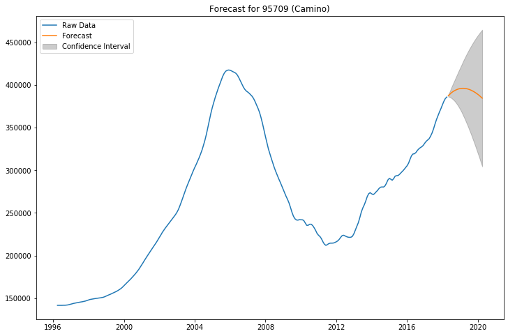


### Print summary of predicted, worst-case, and best-case scenarios


```python
camino_95709_pred, camino_95709_low, camino_95709_high  = pred_best_worst(pred=forecasted_price_95709, low=forecasted_lower_95709, 
                                                                          high=forecasted_upper_95709, last=last_value_95709, date='April 1, 2020')
camino_95709_pred, camino_95709_low, camino_95709_high
```

    By the model prediction, I would expect to see a -0.349% change in price by April 1, 2020.
    At the lower bound of the confidence interval, I would expect to see a -21.147% change in price by April 1, 2020.
    At the upper bound of the confidence interval, I would expect to see a 20.448% change in price by April 1, 2020.


    (-0.349, -21.147, 20.448)


## Zip code 95709 (Camino):  Don't invest

By the model prediction, I would expect to see a -0.349% change in price by April 1, 2020
At the lower bound of the confidence interval, I would expect to see a -21.147% change in price by April 1, 2020
At the upper bound of the confidence interval, I would expect to see a 20.448% change in price by April 1, 2020


# SacMetro:  95746 (Granite Bay) -- Solid investment opportunity


```python
geog_area = '95746'
```


```python
ts_95746 = df_sac.loc[df_sac['Zip'] == geog_area]  # ts for all of the following functions should have only one zipcode
ts_95746.head()

```


<div>
<style scoped>
    .dataframe tbody tr th:only-of-type {
        vertical-align: middle;
    }

    .dataframe tbody tr th {
        vertical-align: top;
    }

    .dataframe thead th {
        text-align: right;
    }
</style>
<table border="1" class="dataframe">
  <thead>
    <tr style="text-align: right;">
      <th></th>
      <th>Metro</th>
      <th>MetroState</th>
      <th>CountyName</th>
      <th>City</th>
      <th>Zip</th>
      <th>SizeRank</th>
      <th>value</th>
    </tr>
    <tr>
      <th>time</th>
      <th></th>
      <th></th>
      <th></th>
      <th></th>
      <th></th>
      <th></th>
      <th></th>
    </tr>
  </thead>
  <tbody>
    <tr>
      <td>1996-04-01</td>
      <td>Sacramento</td>
      <td>Sacramento CA</td>
      <td>Placer</td>
      <td>Granite Bay</td>
      <td>95746</td>
      <td>5608</td>
      <td>292000.0</td>
    </tr>
    <tr>
      <td>1996-05-01</td>
      <td>Sacramento</td>
      <td>Sacramento CA</td>
      <td>Placer</td>
      <td>Granite Bay</td>
      <td>95746</td>
      <td>5608</td>
      <td>289600.0</td>
    </tr>
    <tr>
      <td>1996-06-01</td>
      <td>Sacramento</td>
      <td>Sacramento CA</td>
      <td>Placer</td>
      <td>Granite Bay</td>
      <td>95746</td>
      <td>5608</td>
      <td>287300.0</td>
    </tr>
    <tr>
      <td>1996-07-01</td>
      <td>Sacramento</td>
      <td>Sacramento CA</td>
      <td>Placer</td>
      <td>Granite Bay</td>
      <td>95746</td>
      <td>5608</td>
      <td>285400.0</td>
    </tr>
    <tr>
      <td>1996-08-01</td>
      <td>Sacramento</td>
      <td>Sacramento CA</td>
      <td>Placer</td>
      <td>Granite Bay</td>
      <td>95746</td>
      <td>5608</td>
      <td>283900.0</td>
    </tr>
  </tbody>
</table>
</div>


```python
# ts.head()

ts_95746.tail()
```


<div>
<style scoped>
    .dataframe tbody tr th:only-of-type {
        vertical-align: middle;
    }

    .dataframe tbody tr th {
        vertical-align: top;
    }

    .dataframe thead th {
        text-align: right;
    }
</style>
<table border="1" class="dataframe">
  <thead>
    <tr style="text-align: right;">
      <th></th>
      <th>Metro</th>
      <th>MetroState</th>
      <th>CountyName</th>
      <th>City</th>
      <th>Zip</th>
      <th>SizeRank</th>
      <th>value</th>
    </tr>
    <tr>
      <th>time</th>
      <th></th>
      <th></th>
      <th></th>
      <th></th>
      <th></th>
      <th></th>
      <th></th>
    </tr>
  </thead>
  <tbody>
    <tr>
      <td>2017-12-01</td>
      <td>Sacramento</td>
      <td>Sacramento CA</td>
      <td>Placer</td>
      <td>Granite Bay</td>
      <td>95746</td>
      <td>5608</td>
      <td>757500.0</td>
    </tr>
    <tr>
      <td>2018-01-01</td>
      <td>Sacramento</td>
      <td>Sacramento CA</td>
      <td>Placer</td>
      <td>Granite Bay</td>
      <td>95746</td>
      <td>5608</td>
      <td>757000.0</td>
    </tr>
    <tr>
      <td>2018-02-01</td>
      <td>Sacramento</td>
      <td>Sacramento CA</td>
      <td>Placer</td>
      <td>Granite Bay</td>
      <td>95746</td>
      <td>5608</td>
      <td>761500.0</td>
    </tr>
    <tr>
      <td>2018-03-01</td>
      <td>Sacramento</td>
      <td>Sacramento CA</td>
      <td>Placer</td>
      <td>Granite Bay</td>
      <td>95746</td>
      <td>5608</td>
      <td>771300.0</td>
    </tr>
    <tr>
      <td>2018-04-01</td>
      <td>Sacramento</td>
      <td>Sacramento CA</td>
      <td>Placer</td>
      <td>Granite Bay</td>
      <td>95746</td>
      <td>5608</td>
      <td>778500.0</td>
    </tr>
  </tbody>
</table>
</div>


```python
# ts = ts.value

ts_95746_values = ts_95746.value
```


```python
# ts.head()

ts_95746_values.head()
```


    time
    1996-04-01    292000.0
    1996-05-01    289600.0
    1996-06-01    287300.0
    1996-07-01    285400.0
    1996-08-01    283900.0
    Name: value, dtype: float64


```python
ts_95746_values.tail()
```


    time
    2017-12-01    757500.0
    2018-01-01    757000.0
    2018-02-01    761500.0
    2018-03-01    771300.0
    2018-04-01    778500.0
    Name: value, dtype: float64


### Visualizations

#### plot_ts:  Plot zip code(s) of interest over time, with market highs and lows


```python
# fig, ax = plot_ts(df_melt, zipcodes=['95616', '92008', '90035', '90025', '60625', '57701'])  # enter desired zip code(s)

fig, ax = plot_ts_zips(df_melt, zipcodes=['95746'], figsize=(12,6))  # enter desired zip code(s)
```


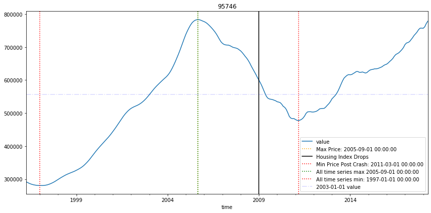


```python
ts_95746
```


<div>
<style scoped>
    .dataframe tbody tr th:only-of-type {
        vertical-align: middle;
    }

    .dataframe tbody tr th {
        vertical-align: top;
    }

    .dataframe thead th {
        text-align: right;
    }
</style>
<table border="1" class="dataframe">
  <thead>
    <tr style="text-align: right;">
      <th></th>
      <th>Metro</th>
      <th>MetroState</th>
      <th>CountyName</th>
      <th>City</th>
      <th>Zip</th>
      <th>SizeRank</th>
      <th>value</th>
    </tr>
    <tr>
      <th>time</th>
      <th></th>
      <th></th>
      <th></th>
      <th></th>
      <th></th>
      <th></th>
      <th></th>
    </tr>
  </thead>
  <tbody>
    <tr>
      <td>1996-04-01</td>
      <td>Sacramento</td>
      <td>Sacramento CA</td>
      <td>Placer</td>
      <td>Granite Bay</td>
      <td>95746</td>
      <td>5608</td>
      <td>292000.0</td>
    </tr>
    <tr>
      <td>1996-05-01</td>
      <td>Sacramento</td>
      <td>Sacramento CA</td>
      <td>Placer</td>
      <td>Granite Bay</td>
      <td>95746</td>
      <td>5608</td>
      <td>289600.0</td>
    </tr>
    <tr>
      <td>1996-06-01</td>
      <td>Sacramento</td>
      <td>Sacramento CA</td>
      <td>Placer</td>
      <td>Granite Bay</td>
      <td>95746</td>
      <td>5608</td>
      <td>287300.0</td>
    </tr>
    <tr>
      <td>1996-07-01</td>
      <td>Sacramento</td>
      <td>Sacramento CA</td>
      <td>Placer</td>
      <td>Granite Bay</td>
      <td>95746</td>
      <td>5608</td>
      <td>285400.0</td>
    </tr>
    <tr>
      <td>1996-08-01</td>
      <td>Sacramento</td>
      <td>Sacramento CA</td>
      <td>Placer</td>
      <td>Granite Bay</td>
      <td>95746</td>
      <td>5608</td>
      <td>283900.0</td>
    </tr>
    <tr>
      <td>1996-09-01</td>
      <td>Sacramento</td>
      <td>Sacramento CA</td>
      <td>Placer</td>
      <td>Granite Bay</td>
      <td>95746</td>
      <td>5608</td>
      <td>282700.0</td>
    </tr>
    <tr>
      <td>1996-10-01</td>
      <td>Sacramento</td>
      <td>Sacramento CA</td>
      <td>Placer</td>
      <td>Granite Bay</td>
      <td>95746</td>
      <td>5608</td>
      <td>281800.0</td>
    </tr>
    <tr>
      <td>1996-11-01</td>
      <td>Sacramento</td>
      <td>Sacramento CA</td>
      <td>Placer</td>
      <td>Granite Bay</td>
      <td>95746</td>
      <td>5608</td>
      <td>281100.0</td>
    </tr>
    <tr>
      <td>1996-12-01</td>
      <td>Sacramento</td>
      <td>Sacramento CA</td>
      <td>Placer</td>
      <td>Granite Bay</td>
      <td>95746</td>
      <td>5608</td>
      <td>280700.0</td>
    </tr>
    <tr>
      <td>1997-01-01</td>
      <td>Sacramento</td>
      <td>Sacramento CA</td>
      <td>Placer</td>
      <td>Granite Bay</td>
      <td>95746</td>
      <td>5608</td>
      <td>280600.0</td>
    </tr>
    <tr>
      <td>1997-02-01</td>
      <td>Sacramento</td>
      <td>Sacramento CA</td>
      <td>Placer</td>
      <td>Granite Bay</td>
      <td>95746</td>
      <td>5608</td>
      <td>280600.0</td>
    </tr>
    <tr>
      <td>1997-03-01</td>
      <td>Sacramento</td>
      <td>Sacramento CA</td>
      <td>Placer</td>
      <td>Granite Bay</td>
      <td>95746</td>
      <td>5608</td>
      <td>280600.0</td>
    </tr>
    <tr>
      <td>1997-04-01</td>
      <td>Sacramento</td>
      <td>Sacramento CA</td>
      <td>Placer</td>
      <td>Granite Bay</td>
      <td>95746</td>
      <td>5608</td>
      <td>280900.0</td>
    </tr>
    <tr>
      <td>1997-05-01</td>
      <td>Sacramento</td>
      <td>Sacramento CA</td>
      <td>Placer</td>
      <td>Granite Bay</td>
      <td>95746</td>
      <td>5608</td>
      <td>281700.0</td>
    </tr>
    <tr>
      <td>1997-06-01</td>
      <td>Sacramento</td>
      <td>Sacramento CA</td>
      <td>Placer</td>
      <td>Granite Bay</td>
      <td>95746</td>
      <td>5608</td>
      <td>282700.0</td>
    </tr>
    <tr>
      <td>1997-07-01</td>
      <td>Sacramento</td>
      <td>Sacramento CA</td>
      <td>Placer</td>
      <td>Granite Bay</td>
      <td>95746</td>
      <td>5608</td>
      <td>284200.0</td>
    </tr>
    <tr>
      <td>1997-08-01</td>
      <td>Sacramento</td>
      <td>Sacramento CA</td>
      <td>Placer</td>
      <td>Granite Bay</td>
      <td>95746</td>
      <td>5608</td>
      <td>286000.0</td>
    </tr>
    <tr>
      <td>1997-09-01</td>
      <td>Sacramento</td>
      <td>Sacramento CA</td>
      <td>Placer</td>
      <td>Granite Bay</td>
      <td>95746</td>
      <td>5608</td>
      <td>288100.0</td>
    </tr>
    <tr>
      <td>1997-10-01</td>
      <td>Sacramento</td>
      <td>Sacramento CA</td>
      <td>Placer</td>
      <td>Granite Bay</td>
      <td>95746</td>
      <td>5608</td>
      <td>290400.0</td>
    </tr>
    <tr>
      <td>1997-11-01</td>
      <td>Sacramento</td>
      <td>Sacramento CA</td>
      <td>Placer</td>
      <td>Granite Bay</td>
      <td>95746</td>
      <td>5608</td>
      <td>293000.0</td>
    </tr>
    <tr>
      <td>1997-12-01</td>
      <td>Sacramento</td>
      <td>Sacramento CA</td>
      <td>Placer</td>
      <td>Granite Bay</td>
      <td>95746</td>
      <td>5608</td>
      <td>295900.0</td>
    </tr>
    <tr>
      <td>1998-01-01</td>
      <td>Sacramento</td>
      <td>Sacramento CA</td>
      <td>Placer</td>
      <td>Granite Bay</td>
      <td>95746</td>
      <td>5608</td>
      <td>298900.0</td>
    </tr>
    <tr>
      <td>1998-02-01</td>
      <td>Sacramento</td>
      <td>Sacramento CA</td>
      <td>Placer</td>
      <td>Granite Bay</td>
      <td>95746</td>
      <td>5608</td>
      <td>301900.0</td>
    </tr>
    <tr>
      <td>1998-03-01</td>
      <td>Sacramento</td>
      <td>Sacramento CA</td>
      <td>Placer</td>
      <td>Granite Bay</td>
      <td>95746</td>
      <td>5608</td>
      <td>304700.0</td>
    </tr>
    <tr>
      <td>1998-04-01</td>
      <td>Sacramento</td>
      <td>Sacramento CA</td>
      <td>Placer</td>
      <td>Granite Bay</td>
      <td>95746</td>
      <td>5608</td>
      <td>307400.0</td>
    </tr>
    <tr>
      <td>1998-05-01</td>
      <td>Sacramento</td>
      <td>Sacramento CA</td>
      <td>Placer</td>
      <td>Granite Bay</td>
      <td>95746</td>
      <td>5608</td>
      <td>310000.0</td>
    </tr>
    <tr>
      <td>1998-06-01</td>
      <td>Sacramento</td>
      <td>Sacramento CA</td>
      <td>Placer</td>
      <td>Granite Bay</td>
      <td>95746</td>
      <td>5608</td>
      <td>312500.0</td>
    </tr>
    <tr>
      <td>1998-07-01</td>
      <td>Sacramento</td>
      <td>Sacramento CA</td>
      <td>Placer</td>
      <td>Granite Bay</td>
      <td>95746</td>
      <td>5608</td>
      <td>314700.0</td>
    </tr>
    <tr>
      <td>1998-08-01</td>
      <td>Sacramento</td>
      <td>Sacramento CA</td>
      <td>Placer</td>
      <td>Granite Bay</td>
      <td>95746</td>
      <td>5608</td>
      <td>316700.0</td>
    </tr>
    <tr>
      <td>1998-09-01</td>
      <td>Sacramento</td>
      <td>Sacramento CA</td>
      <td>Placer</td>
      <td>Granite Bay</td>
      <td>95746</td>
      <td>5608</td>
      <td>318600.0</td>
    </tr>
    <tr>
      <td>1998-10-01</td>
      <td>Sacramento</td>
      <td>Sacramento CA</td>
      <td>Placer</td>
      <td>Granite Bay</td>
      <td>95746</td>
      <td>5608</td>
      <td>320400.0</td>
    </tr>
    <tr>
      <td>1998-11-01</td>
      <td>Sacramento</td>
      <td>Sacramento CA</td>
      <td>Placer</td>
      <td>Granite Bay</td>
      <td>95746</td>
      <td>5608</td>
      <td>322300.0</td>
    </tr>
    <tr>
      <td>1998-12-01</td>
      <td>Sacramento</td>
      <td>Sacramento CA</td>
      <td>Placer</td>
      <td>Granite Bay</td>
      <td>95746</td>
      <td>5608</td>
      <td>324300.0</td>
    </tr>
    <tr>
      <td>1999-01-01</td>
      <td>Sacramento</td>
      <td>Sacramento CA</td>
      <td>Placer</td>
      <td>Granite Bay</td>
      <td>95746</td>
      <td>5608</td>
      <td>326600.0</td>
    </tr>
    <tr>
      <td>1999-02-01</td>
      <td>Sacramento</td>
      <td>Sacramento CA</td>
      <td>Placer</td>
      <td>Granite Bay</td>
      <td>95746</td>
      <td>5608</td>
      <td>329000.0</td>
    </tr>
    <tr>
      <td>1999-03-01</td>
      <td>Sacramento</td>
      <td>Sacramento CA</td>
      <td>Placer</td>
      <td>Granite Bay</td>
      <td>95746</td>
      <td>5608</td>
      <td>331600.0</td>
    </tr>
    <tr>
      <td>1999-04-01</td>
      <td>Sacramento</td>
      <td>Sacramento CA</td>
      <td>Placer</td>
      <td>Granite Bay</td>
      <td>95746</td>
      <td>5608</td>
      <td>334400.0</td>
    </tr>
    <tr>
      <td>1999-05-01</td>
      <td>Sacramento</td>
      <td>Sacramento CA</td>
      <td>Placer</td>
      <td>Granite Bay</td>
      <td>95746</td>
      <td>5608</td>
      <td>337700.0</td>
    </tr>
    <tr>
      <td>1999-06-01</td>
      <td>Sacramento</td>
      <td>Sacramento CA</td>
      <td>Placer</td>
      <td>Granite Bay</td>
      <td>95746</td>
      <td>5608</td>
      <td>341500.0</td>
    </tr>
    <tr>
      <td>1999-07-01</td>
      <td>Sacramento</td>
      <td>Sacramento CA</td>
      <td>Placer</td>
      <td>Granite Bay</td>
      <td>95746</td>
      <td>5608</td>
      <td>345900.0</td>
    </tr>
    <tr>
      <td>1999-08-01</td>
      <td>Sacramento</td>
      <td>Sacramento CA</td>
      <td>Placer</td>
      <td>Granite Bay</td>
      <td>95746</td>
      <td>5608</td>
      <td>350600.0</td>
    </tr>
    <tr>
      <td>1999-09-01</td>
      <td>Sacramento</td>
      <td>Sacramento CA</td>
      <td>Placer</td>
      <td>Granite Bay</td>
      <td>95746</td>
      <td>5608</td>
      <td>355700.0</td>
    </tr>
    <tr>
      <td>1999-10-01</td>
      <td>Sacramento</td>
      <td>Sacramento CA</td>
      <td>Placer</td>
      <td>Granite Bay</td>
      <td>95746</td>
      <td>5608</td>
      <td>361300.0</td>
    </tr>
    <tr>
      <td>1999-11-01</td>
      <td>Sacramento</td>
      <td>Sacramento CA</td>
      <td>Placer</td>
      <td>Granite Bay</td>
      <td>95746</td>
      <td>5608</td>
      <td>367200.0</td>
    </tr>
    <tr>
      <td>1999-12-01</td>
      <td>Sacramento</td>
      <td>Sacramento CA</td>
      <td>Placer</td>
      <td>Granite Bay</td>
      <td>95746</td>
      <td>5608</td>
      <td>373300.0</td>
    </tr>
    <tr>
      <td>2000-01-01</td>
      <td>Sacramento</td>
      <td>Sacramento CA</td>
      <td>Placer</td>
      <td>Granite Bay</td>
      <td>95746</td>
      <td>5608</td>
      <td>379300.0</td>
    </tr>
    <tr>
      <td>2000-02-01</td>
      <td>Sacramento</td>
      <td>Sacramento CA</td>
      <td>Placer</td>
      <td>Granite Bay</td>
      <td>95746</td>
      <td>5608</td>
      <td>385200.0</td>
    </tr>
    <tr>
      <td>2000-03-01</td>
      <td>Sacramento</td>
      <td>Sacramento CA</td>
      <td>Placer</td>
      <td>Granite Bay</td>
      <td>95746</td>
      <td>5608</td>
      <td>390700.0</td>
    </tr>
    <tr>
      <td>2000-04-01</td>
      <td>Sacramento</td>
      <td>Sacramento CA</td>
      <td>Placer</td>
      <td>Granite Bay</td>
      <td>95746</td>
      <td>5608</td>
      <td>396100.0</td>
    </tr>
    <tr>
      <td>2000-05-01</td>
      <td>Sacramento</td>
      <td>Sacramento CA</td>
      <td>Placer</td>
      <td>Granite Bay</td>
      <td>95746</td>
      <td>5608</td>
      <td>401300.0</td>
    </tr>
    <tr>
      <td>2000-06-01</td>
      <td>Sacramento</td>
      <td>Sacramento CA</td>
      <td>Placer</td>
      <td>Granite Bay</td>
      <td>95746</td>
      <td>5608</td>
      <td>406400.0</td>
    </tr>
    <tr>
      <td>2000-07-01</td>
      <td>Sacramento</td>
      <td>Sacramento CA</td>
      <td>Placer</td>
      <td>Granite Bay</td>
      <td>95746</td>
      <td>5608</td>
      <td>411400.0</td>
    </tr>
    <tr>
      <td>2000-08-01</td>
      <td>Sacramento</td>
      <td>Sacramento CA</td>
      <td>Placer</td>
      <td>Granite Bay</td>
      <td>95746</td>
      <td>5608</td>
      <td>416400.0</td>
    </tr>
    <tr>
      <td>2000-09-01</td>
      <td>Sacramento</td>
      <td>Sacramento CA</td>
      <td>Placer</td>
      <td>Granite Bay</td>
      <td>95746</td>
      <td>5608</td>
      <td>421400.0</td>
    </tr>
    <tr>
      <td>2000-10-01</td>
      <td>Sacramento</td>
      <td>Sacramento CA</td>
      <td>Placer</td>
      <td>Granite Bay</td>
      <td>95746</td>
      <td>5608</td>
      <td>426600.0</td>
    </tr>
    <tr>
      <td>2000-11-01</td>
      <td>Sacramento</td>
      <td>Sacramento CA</td>
      <td>Placer</td>
      <td>Granite Bay</td>
      <td>95746</td>
      <td>5608</td>
      <td>432100.0</td>
    </tr>
    <tr>
      <td>2000-12-01</td>
      <td>Sacramento</td>
      <td>Sacramento CA</td>
      <td>Placer</td>
      <td>Granite Bay</td>
      <td>95746</td>
      <td>5608</td>
      <td>437900.0</td>
    </tr>
    <tr>
      <td>2001-01-01</td>
      <td>Sacramento</td>
      <td>Sacramento CA</td>
      <td>Placer</td>
      <td>Granite Bay</td>
      <td>95746</td>
      <td>5608</td>
      <td>444000.0</td>
    </tr>
    <tr>
      <td>2001-02-01</td>
      <td>Sacramento</td>
      <td>Sacramento CA</td>
      <td>Placer</td>
      <td>Granite Bay</td>
      <td>95746</td>
      <td>5608</td>
      <td>450300.0</td>
    </tr>
    <tr>
      <td>2001-03-01</td>
      <td>Sacramento</td>
      <td>Sacramento CA</td>
      <td>Placer</td>
      <td>Granite Bay</td>
      <td>95746</td>
      <td>5608</td>
      <td>456800.0</td>
    </tr>
    <tr>
      <td>2001-04-01</td>
      <td>Sacramento</td>
      <td>Sacramento CA</td>
      <td>Placer</td>
      <td>Granite Bay</td>
      <td>95746</td>
      <td>5608</td>
      <td>463600.0</td>
    </tr>
    <tr>
      <td>2001-05-01</td>
      <td>Sacramento</td>
      <td>Sacramento CA</td>
      <td>Placer</td>
      <td>Granite Bay</td>
      <td>95746</td>
      <td>5608</td>
      <td>470500.0</td>
    </tr>
    <tr>
      <td>2001-06-01</td>
      <td>Sacramento</td>
      <td>Sacramento CA</td>
      <td>Placer</td>
      <td>Granite Bay</td>
      <td>95746</td>
      <td>5608</td>
      <td>477500.0</td>
    </tr>
    <tr>
      <td>2001-07-01</td>
      <td>Sacramento</td>
      <td>Sacramento CA</td>
      <td>Placer</td>
      <td>Granite Bay</td>
      <td>95746</td>
      <td>5608</td>
      <td>484300.0</td>
    </tr>
    <tr>
      <td>2001-08-01</td>
      <td>Sacramento</td>
      <td>Sacramento CA</td>
      <td>Placer</td>
      <td>Granite Bay</td>
      <td>95746</td>
      <td>5608</td>
      <td>490800.0</td>
    </tr>
    <tr>
      <td>2001-09-01</td>
      <td>Sacramento</td>
      <td>Sacramento CA</td>
      <td>Placer</td>
      <td>Granite Bay</td>
      <td>95746</td>
      <td>5608</td>
      <td>496700.0</td>
    </tr>
    <tr>
      <td>2001-10-01</td>
      <td>Sacramento</td>
      <td>Sacramento CA</td>
      <td>Placer</td>
      <td>Granite Bay</td>
      <td>95746</td>
      <td>5608</td>
      <td>502000.0</td>
    </tr>
    <tr>
      <td>2001-11-01</td>
      <td>Sacramento</td>
      <td>Sacramento CA</td>
      <td>Placer</td>
      <td>Granite Bay</td>
      <td>95746</td>
      <td>5608</td>
      <td>506800.0</td>
    </tr>
    <tr>
      <td>2001-12-01</td>
      <td>Sacramento</td>
      <td>Sacramento CA</td>
      <td>Placer</td>
      <td>Granite Bay</td>
      <td>95746</td>
      <td>5608</td>
      <td>510900.0</td>
    </tr>
    <tr>
      <td>2002-01-01</td>
      <td>Sacramento</td>
      <td>Sacramento CA</td>
      <td>Placer</td>
      <td>Granite Bay</td>
      <td>95746</td>
      <td>5608</td>
      <td>514300.0</td>
    </tr>
    <tr>
      <td>2002-02-01</td>
      <td>Sacramento</td>
      <td>Sacramento CA</td>
      <td>Placer</td>
      <td>Granite Bay</td>
      <td>95746</td>
      <td>5608</td>
      <td>517000.0</td>
    </tr>
    <tr>
      <td>2002-03-01</td>
      <td>Sacramento</td>
      <td>Sacramento CA</td>
      <td>Placer</td>
      <td>Granite Bay</td>
      <td>95746</td>
      <td>5608</td>
      <td>519300.0</td>
    </tr>
    <tr>
      <td>2002-04-01</td>
      <td>Sacramento</td>
      <td>Sacramento CA</td>
      <td>Placer</td>
      <td>Granite Bay</td>
      <td>95746</td>
      <td>5608</td>
      <td>521300.0</td>
    </tr>
    <tr>
      <td>2002-05-01</td>
      <td>Sacramento</td>
      <td>Sacramento CA</td>
      <td>Placer</td>
      <td>Granite Bay</td>
      <td>95746</td>
      <td>5608</td>
      <td>523400.0</td>
    </tr>
    <tr>
      <td>2002-06-01</td>
      <td>Sacramento</td>
      <td>Sacramento CA</td>
      <td>Placer</td>
      <td>Granite Bay</td>
      <td>95746</td>
      <td>5608</td>
      <td>525700.0</td>
    </tr>
    <tr>
      <td>2002-07-01</td>
      <td>Sacramento</td>
      <td>Sacramento CA</td>
      <td>Placer</td>
      <td>Granite Bay</td>
      <td>95746</td>
      <td>5608</td>
      <td>528600.0</td>
    </tr>
    <tr>
      <td>2002-08-01</td>
      <td>Sacramento</td>
      <td>Sacramento CA</td>
      <td>Placer</td>
      <td>Granite Bay</td>
      <td>95746</td>
      <td>5608</td>
      <td>531900.0</td>
    </tr>
    <tr>
      <td>2002-09-01</td>
      <td>Sacramento</td>
      <td>Sacramento CA</td>
      <td>Placer</td>
      <td>Granite Bay</td>
      <td>95746</td>
      <td>5608</td>
      <td>535800.0</td>
    </tr>
    <tr>
      <td>2002-10-01</td>
      <td>Sacramento</td>
      <td>Sacramento CA</td>
      <td>Placer</td>
      <td>Granite Bay</td>
      <td>95746</td>
      <td>5608</td>
      <td>540100.0</td>
    </tr>
    <tr>
      <td>2002-11-01</td>
      <td>Sacramento</td>
      <td>Sacramento CA</td>
      <td>Placer</td>
      <td>Granite Bay</td>
      <td>95746</td>
      <td>5608</td>
      <td>544900.0</td>
    </tr>
    <tr>
      <td>2002-12-01</td>
      <td>Sacramento</td>
      <td>Sacramento CA</td>
      <td>Placer</td>
      <td>Granite Bay</td>
      <td>95746</td>
      <td>5608</td>
      <td>550200.0</td>
    </tr>
    <tr>
      <td>2003-01-01</td>
      <td>Sacramento</td>
      <td>Sacramento CA</td>
      <td>Placer</td>
      <td>Granite Bay</td>
      <td>95746</td>
      <td>5608</td>
      <td>555900.0</td>
    </tr>
    <tr>
      <td>2003-02-01</td>
      <td>Sacramento</td>
      <td>Sacramento CA</td>
      <td>Placer</td>
      <td>Granite Bay</td>
      <td>95746</td>
      <td>5608</td>
      <td>561700.0</td>
    </tr>
    <tr>
      <td>2003-03-01</td>
      <td>Sacramento</td>
      <td>Sacramento CA</td>
      <td>Placer</td>
      <td>Granite Bay</td>
      <td>95746</td>
      <td>5608</td>
      <td>567500.0</td>
    </tr>
    <tr>
      <td>2003-04-01</td>
      <td>Sacramento</td>
      <td>Sacramento CA</td>
      <td>Placer</td>
      <td>Granite Bay</td>
      <td>95746</td>
      <td>5608</td>
      <td>573100.0</td>
    </tr>
    <tr>
      <td>2003-05-01</td>
      <td>Sacramento</td>
      <td>Sacramento CA</td>
      <td>Placer</td>
      <td>Granite Bay</td>
      <td>95746</td>
      <td>5608</td>
      <td>578300.0</td>
    </tr>
    <tr>
      <td>2003-06-01</td>
      <td>Sacramento</td>
      <td>Sacramento CA</td>
      <td>Placer</td>
      <td>Granite Bay</td>
      <td>95746</td>
      <td>5608</td>
      <td>583200.0</td>
    </tr>
    <tr>
      <td>2003-07-01</td>
      <td>Sacramento</td>
      <td>Sacramento CA</td>
      <td>Placer</td>
      <td>Granite Bay</td>
      <td>95746</td>
      <td>5608</td>
      <td>587800.0</td>
    </tr>
    <tr>
      <td>2003-08-01</td>
      <td>Sacramento</td>
      <td>Sacramento CA</td>
      <td>Placer</td>
      <td>Granite Bay</td>
      <td>95746</td>
      <td>5608</td>
      <td>592300.0</td>
    </tr>
    <tr>
      <td>2003-09-01</td>
      <td>Sacramento</td>
      <td>Sacramento CA</td>
      <td>Placer</td>
      <td>Granite Bay</td>
      <td>95746</td>
      <td>5608</td>
      <td>596700.0</td>
    </tr>
    <tr>
      <td>2003-10-01</td>
      <td>Sacramento</td>
      <td>Sacramento CA</td>
      <td>Placer</td>
      <td>Granite Bay</td>
      <td>95746</td>
      <td>5608</td>
      <td>601100.0</td>
    </tr>
    <tr>
      <td>2003-11-01</td>
      <td>Sacramento</td>
      <td>Sacramento CA</td>
      <td>Placer</td>
      <td>Granite Bay</td>
      <td>95746</td>
      <td>5608</td>
      <td>605200.0</td>
    </tr>
    <tr>
      <td>2003-12-01</td>
      <td>Sacramento</td>
      <td>Sacramento CA</td>
      <td>Placer</td>
      <td>Granite Bay</td>
      <td>95746</td>
      <td>5608</td>
      <td>609400.0</td>
    </tr>
    <tr>
      <td>2004-01-01</td>
      <td>Sacramento</td>
      <td>Sacramento CA</td>
      <td>Placer</td>
      <td>Granite Bay</td>
      <td>95746</td>
      <td>5608</td>
      <td>614200.0</td>
    </tr>
    <tr>
      <td>2004-02-01</td>
      <td>Sacramento</td>
      <td>Sacramento CA</td>
      <td>Placer</td>
      <td>Granite Bay</td>
      <td>95746</td>
      <td>5608</td>
      <td>620100.0</td>
    </tr>
    <tr>
      <td>2004-03-01</td>
      <td>Sacramento</td>
      <td>Sacramento CA</td>
      <td>Placer</td>
      <td>Granite Bay</td>
      <td>95746</td>
      <td>5608</td>
      <td>627300.0</td>
    </tr>
    <tr>
      <td>2004-04-01</td>
      <td>Sacramento</td>
      <td>Sacramento CA</td>
      <td>Placer</td>
      <td>Granite Bay</td>
      <td>95746</td>
      <td>5608</td>
      <td>635800.0</td>
    </tr>
    <tr>
      <td>2004-05-01</td>
      <td>Sacramento</td>
      <td>Sacramento CA</td>
      <td>Placer</td>
      <td>Granite Bay</td>
      <td>95746</td>
      <td>5608</td>
      <td>645200.0</td>
    </tr>
    <tr>
      <td>2004-06-01</td>
      <td>Sacramento</td>
      <td>Sacramento CA</td>
      <td>Placer</td>
      <td>Granite Bay</td>
      <td>95746</td>
      <td>5608</td>
      <td>655300.0</td>
    </tr>
    <tr>
      <td>2004-07-01</td>
      <td>Sacramento</td>
      <td>Sacramento CA</td>
      <td>Placer</td>
      <td>Granite Bay</td>
      <td>95746</td>
      <td>5608</td>
      <td>666100.0</td>
    </tr>
    <tr>
      <td>2004-08-01</td>
      <td>Sacramento</td>
      <td>Sacramento CA</td>
      <td>Placer</td>
      <td>Granite Bay</td>
      <td>95746</td>
      <td>5608</td>
      <td>677200.0</td>
    </tr>
    <tr>
      <td>2004-09-01</td>
      <td>Sacramento</td>
      <td>Sacramento CA</td>
      <td>Placer</td>
      <td>Granite Bay</td>
      <td>95746</td>
      <td>5608</td>
      <td>688900.0</td>
    </tr>
    <tr>
      <td>2004-10-01</td>
      <td>Sacramento</td>
      <td>Sacramento CA</td>
      <td>Placer</td>
      <td>Granite Bay</td>
      <td>95746</td>
      <td>5608</td>
      <td>701400.0</td>
    </tr>
    <tr>
      <td>2004-11-01</td>
      <td>Sacramento</td>
      <td>Sacramento CA</td>
      <td>Placer</td>
      <td>Granite Bay</td>
      <td>95746</td>
      <td>5608</td>
      <td>714100.0</td>
    </tr>
    <tr>
      <td>2004-12-01</td>
      <td>Sacramento</td>
      <td>Sacramento CA</td>
      <td>Placer</td>
      <td>Granite Bay</td>
      <td>95746</td>
      <td>5608</td>
      <td>726900.0</td>
    </tr>
    <tr>
      <td>2005-01-01</td>
      <td>Sacramento</td>
      <td>Sacramento CA</td>
      <td>Placer</td>
      <td>Granite Bay</td>
      <td>95746</td>
      <td>5608</td>
      <td>738700.0</td>
    </tr>
    <tr>
      <td>2005-02-01</td>
      <td>Sacramento</td>
      <td>Sacramento CA</td>
      <td>Placer</td>
      <td>Granite Bay</td>
      <td>95746</td>
      <td>5608</td>
      <td>748900.0</td>
    </tr>
    <tr>
      <td>2005-03-01</td>
      <td>Sacramento</td>
      <td>Sacramento CA</td>
      <td>Placer</td>
      <td>Granite Bay</td>
      <td>95746</td>
      <td>5608</td>
      <td>758100.0</td>
    </tr>
    <tr>
      <td>2005-04-01</td>
      <td>Sacramento</td>
      <td>Sacramento CA</td>
      <td>Placer</td>
      <td>Granite Bay</td>
      <td>95746</td>
      <td>5608</td>
      <td>766400.0</td>
    </tr>
    <tr>
      <td>2005-05-01</td>
      <td>Sacramento</td>
      <td>Sacramento CA</td>
      <td>Placer</td>
      <td>Granite Bay</td>
      <td>95746</td>
      <td>5608</td>
      <td>773100.0</td>
    </tr>
    <tr>
      <td>2005-06-01</td>
      <td>Sacramento</td>
      <td>Sacramento CA</td>
      <td>Placer</td>
      <td>Granite Bay</td>
      <td>95746</td>
      <td>5608</td>
      <td>777900.0</td>
    </tr>
    <tr>
      <td>2005-07-01</td>
      <td>Sacramento</td>
      <td>Sacramento CA</td>
      <td>Placer</td>
      <td>Granite Bay</td>
      <td>95746</td>
      <td>5608</td>
      <td>781100.0</td>
    </tr>
    <tr>
      <td>2005-08-01</td>
      <td>Sacramento</td>
      <td>Sacramento CA</td>
      <td>Placer</td>
      <td>Granite Bay</td>
      <td>95746</td>
      <td>5608</td>
      <td>782800.0</td>
    </tr>
    <tr>
      <td>2005-09-01</td>
      <td>Sacramento</td>
      <td>Sacramento CA</td>
      <td>Placer</td>
      <td>Granite Bay</td>
      <td>95746</td>
      <td>5608</td>
      <td>783500.0</td>
    </tr>
    <tr>
      <td>2005-10-01</td>
      <td>Sacramento</td>
      <td>Sacramento CA</td>
      <td>Placer</td>
      <td>Granite Bay</td>
      <td>95746</td>
      <td>5608</td>
      <td>782800.0</td>
    </tr>
    <tr>
      <td>2005-11-01</td>
      <td>Sacramento</td>
      <td>Sacramento CA</td>
      <td>Placer</td>
      <td>Granite Bay</td>
      <td>95746</td>
      <td>5608</td>
      <td>781200.0</td>
    </tr>
    <tr>
      <td>2005-12-01</td>
      <td>Sacramento</td>
      <td>Sacramento CA</td>
      <td>Placer</td>
      <td>Granite Bay</td>
      <td>95746</td>
      <td>5608</td>
      <td>779100.0</td>
    </tr>
    <tr>
      <td>2006-01-01</td>
      <td>Sacramento</td>
      <td>Sacramento CA</td>
      <td>Placer</td>
      <td>Granite Bay</td>
      <td>95746</td>
      <td>5608</td>
      <td>777300.0</td>
    </tr>
    <tr>
      <td>2006-02-01</td>
      <td>Sacramento</td>
      <td>Sacramento CA</td>
      <td>Placer</td>
      <td>Granite Bay</td>
      <td>95746</td>
      <td>5608</td>
      <td>774900.0</td>
    </tr>
    <tr>
      <td>2006-03-01</td>
      <td>Sacramento</td>
      <td>Sacramento CA</td>
      <td>Placer</td>
      <td>Granite Bay</td>
      <td>95746</td>
      <td>5608</td>
      <td>771600.0</td>
    </tr>
    <tr>
      <td>2006-04-01</td>
      <td>Sacramento</td>
      <td>Sacramento CA</td>
      <td>Placer</td>
      <td>Granite Bay</td>
      <td>95746</td>
      <td>5608</td>
      <td>767400.0</td>
    </tr>
    <tr>
      <td>2006-05-01</td>
      <td>Sacramento</td>
      <td>Sacramento CA</td>
      <td>Placer</td>
      <td>Granite Bay</td>
      <td>95746</td>
      <td>5608</td>
      <td>762800.0</td>
    </tr>
    <tr>
      <td>2006-06-01</td>
      <td>Sacramento</td>
      <td>Sacramento CA</td>
      <td>Placer</td>
      <td>Granite Bay</td>
      <td>95746</td>
      <td>5608</td>
      <td>757800.0</td>
    </tr>
    <tr>
      <td>2006-07-01</td>
      <td>Sacramento</td>
      <td>Sacramento CA</td>
      <td>Placer</td>
      <td>Granite Bay</td>
      <td>95746</td>
      <td>5608</td>
      <td>752500.0</td>
    </tr>
    <tr>
      <td>2006-08-01</td>
      <td>Sacramento</td>
      <td>Sacramento CA</td>
      <td>Placer</td>
      <td>Granite Bay</td>
      <td>95746</td>
      <td>5608</td>
      <td>746700.0</td>
    </tr>
    <tr>
      <td>2006-09-01</td>
      <td>Sacramento</td>
      <td>Sacramento CA</td>
      <td>Placer</td>
      <td>Granite Bay</td>
      <td>95746</td>
      <td>5608</td>
      <td>740100.0</td>
    </tr>
    <tr>
      <td>2006-10-01</td>
      <td>Sacramento</td>
      <td>Sacramento CA</td>
      <td>Placer</td>
      <td>Granite Bay</td>
      <td>95746</td>
      <td>5608</td>
      <td>732400.0</td>
    </tr>
    <tr>
      <td>2006-11-01</td>
      <td>Sacramento</td>
      <td>Sacramento CA</td>
      <td>Placer</td>
      <td>Granite Bay</td>
      <td>95746</td>
      <td>5608</td>
      <td>724200.0</td>
    </tr>
    <tr>
      <td>2006-12-01</td>
      <td>Sacramento</td>
      <td>Sacramento CA</td>
      <td>Placer</td>
      <td>Granite Bay</td>
      <td>95746</td>
      <td>5608</td>
      <td>716700.0</td>
    </tr>
    <tr>
      <td>2007-01-01</td>
      <td>Sacramento</td>
      <td>Sacramento CA</td>
      <td>Placer</td>
      <td>Granite Bay</td>
      <td>95746</td>
      <td>5608</td>
      <td>711600.0</td>
    </tr>
    <tr>
      <td>2007-02-01</td>
      <td>Sacramento</td>
      <td>Sacramento CA</td>
      <td>Placer</td>
      <td>Granite Bay</td>
      <td>95746</td>
      <td>5608</td>
      <td>708400.0</td>
    </tr>
    <tr>
      <td>2007-03-01</td>
      <td>Sacramento</td>
      <td>Sacramento CA</td>
      <td>Placer</td>
      <td>Granite Bay</td>
      <td>95746</td>
      <td>5608</td>
      <td>706800.0</td>
    </tr>
    <tr>
      <td>2007-04-01</td>
      <td>Sacramento</td>
      <td>Sacramento CA</td>
      <td>Placer</td>
      <td>Granite Bay</td>
      <td>95746</td>
      <td>5608</td>
      <td>706200.0</td>
    </tr>
    <tr>
      <td>2007-05-01</td>
      <td>Sacramento</td>
      <td>Sacramento CA</td>
      <td>Placer</td>
      <td>Granite Bay</td>
      <td>95746</td>
      <td>5608</td>
      <td>706000.0</td>
    </tr>
    <tr>
      <td>2007-06-01</td>
      <td>Sacramento</td>
      <td>Sacramento CA</td>
      <td>Placer</td>
      <td>Granite Bay</td>
      <td>95746</td>
      <td>5608</td>
      <td>704300.0</td>
    </tr>
    <tr>
      <td>2007-07-01</td>
      <td>Sacramento</td>
      <td>Sacramento CA</td>
      <td>Placer</td>
      <td>Granite Bay</td>
      <td>95746</td>
      <td>5608</td>
      <td>701800.0</td>
    </tr>
    <tr>
      <td>2007-08-01</td>
      <td>Sacramento</td>
      <td>Sacramento CA</td>
      <td>Placer</td>
      <td>Granite Bay</td>
      <td>95746</td>
      <td>5608</td>
      <td>699300.0</td>
    </tr>
    <tr>
      <td>2007-09-01</td>
      <td>Sacramento</td>
      <td>Sacramento CA</td>
      <td>Placer</td>
      <td>Granite Bay</td>
      <td>95746</td>
      <td>5608</td>
      <td>698100.0</td>
    </tr>
    <tr>
      <td>2007-10-01</td>
      <td>Sacramento</td>
      <td>Sacramento CA</td>
      <td>Placer</td>
      <td>Granite Bay</td>
      <td>95746</td>
      <td>5608</td>
      <td>697000.0</td>
    </tr>
    <tr>
      <td>2007-11-01</td>
      <td>Sacramento</td>
      <td>Sacramento CA</td>
      <td>Placer</td>
      <td>Granite Bay</td>
      <td>95746</td>
      <td>5608</td>
      <td>695300.0</td>
    </tr>
    <tr>
      <td>2007-12-01</td>
      <td>Sacramento</td>
      <td>Sacramento CA</td>
      <td>Placer</td>
      <td>Granite Bay</td>
      <td>95746</td>
      <td>5608</td>
      <td>692000.0</td>
    </tr>
    <tr>
      <td>2008-01-01</td>
      <td>Sacramento</td>
      <td>Sacramento CA</td>
      <td>Placer</td>
      <td>Granite Bay</td>
      <td>95746</td>
      <td>5608</td>
      <td>688600.0</td>
    </tr>
    <tr>
      <td>2008-02-01</td>
      <td>Sacramento</td>
      <td>Sacramento CA</td>
      <td>Placer</td>
      <td>Granite Bay</td>
      <td>95746</td>
      <td>5608</td>
      <td>683700.0</td>
    </tr>
    <tr>
      <td>2008-03-01</td>
      <td>Sacramento</td>
      <td>Sacramento CA</td>
      <td>Placer</td>
      <td>Granite Bay</td>
      <td>95746</td>
      <td>5608</td>
      <td>678000.0</td>
    </tr>
    <tr>
      <td>2008-04-01</td>
      <td>Sacramento</td>
      <td>Sacramento CA</td>
      <td>Placer</td>
      <td>Granite Bay</td>
      <td>95746</td>
      <td>5608</td>
      <td>671900.0</td>
    </tr>
    <tr>
      <td>2008-05-01</td>
      <td>Sacramento</td>
      <td>Sacramento CA</td>
      <td>Placer</td>
      <td>Granite Bay</td>
      <td>95746</td>
      <td>5608</td>
      <td>666400.0</td>
    </tr>
    <tr>
      <td>2008-06-01</td>
      <td>Sacramento</td>
      <td>Sacramento CA</td>
      <td>Placer</td>
      <td>Granite Bay</td>
      <td>95746</td>
      <td>5608</td>
      <td>659600.0</td>
    </tr>
    <tr>
      <td>2008-07-01</td>
      <td>Sacramento</td>
      <td>Sacramento CA</td>
      <td>Placer</td>
      <td>Granite Bay</td>
      <td>95746</td>
      <td>5608</td>
      <td>651600.0</td>
    </tr>
    <tr>
      <td>2008-08-01</td>
      <td>Sacramento</td>
      <td>Sacramento CA</td>
      <td>Placer</td>
      <td>Granite Bay</td>
      <td>95746</td>
      <td>5608</td>
      <td>642400.0</td>
    </tr>
    <tr>
      <td>2008-09-01</td>
      <td>Sacramento</td>
      <td>Sacramento CA</td>
      <td>Placer</td>
      <td>Granite Bay</td>
      <td>95746</td>
      <td>5608</td>
      <td>634100.0</td>
    </tr>
    <tr>
      <td>2008-10-01</td>
      <td>Sacramento</td>
      <td>Sacramento CA</td>
      <td>Placer</td>
      <td>Granite Bay</td>
      <td>95746</td>
      <td>5608</td>
      <td>625900.0</td>
    </tr>
    <tr>
      <td>2008-11-01</td>
      <td>Sacramento</td>
      <td>Sacramento CA</td>
      <td>Placer</td>
      <td>Granite Bay</td>
      <td>95746</td>
      <td>5608</td>
      <td>617400.0</td>
    </tr>
    <tr>
      <td>2008-12-01</td>
      <td>Sacramento</td>
      <td>Sacramento CA</td>
      <td>Placer</td>
      <td>Granite Bay</td>
      <td>95746</td>
      <td>5608</td>
      <td>608200.0</td>
    </tr>
    <tr>
      <td>2009-01-01</td>
      <td>Sacramento</td>
      <td>Sacramento CA</td>
      <td>Placer</td>
      <td>Granite Bay</td>
      <td>95746</td>
      <td>5608</td>
      <td>600100.0</td>
    </tr>
    <tr>
      <td>2009-02-01</td>
      <td>Sacramento</td>
      <td>Sacramento CA</td>
      <td>Placer</td>
      <td>Granite Bay</td>
      <td>95746</td>
      <td>5608</td>
      <td>591600.0</td>
    </tr>
    <tr>
      <td>2009-03-01</td>
      <td>Sacramento</td>
      <td>Sacramento CA</td>
      <td>Placer</td>
      <td>Granite Bay</td>
      <td>95746</td>
      <td>5608</td>
      <td>582000.0</td>
    </tr>
    <tr>
      <td>2009-04-01</td>
      <td>Sacramento</td>
      <td>Sacramento CA</td>
      <td>Placer</td>
      <td>Granite Bay</td>
      <td>95746</td>
      <td>5608</td>
      <td>571100.0</td>
    </tr>
    <tr>
      <td>2009-05-01</td>
      <td>Sacramento</td>
      <td>Sacramento CA</td>
      <td>Placer</td>
      <td>Granite Bay</td>
      <td>95746</td>
      <td>5608</td>
      <td>560100.0</td>
    </tr>
    <tr>
      <td>2009-06-01</td>
      <td>Sacramento</td>
      <td>Sacramento CA</td>
      <td>Placer</td>
      <td>Granite Bay</td>
      <td>95746</td>
      <td>5608</td>
      <td>550300.0</td>
    </tr>
    <tr>
      <td>2009-07-01</td>
      <td>Sacramento</td>
      <td>Sacramento CA</td>
      <td>Placer</td>
      <td>Granite Bay</td>
      <td>95746</td>
      <td>5608</td>
      <td>544900.0</td>
    </tr>
    <tr>
      <td>2009-08-01</td>
      <td>Sacramento</td>
      <td>Sacramento CA</td>
      <td>Placer</td>
      <td>Granite Bay</td>
      <td>95746</td>
      <td>5608</td>
      <td>542700.0</td>
    </tr>
    <tr>
      <td>2009-09-01</td>
      <td>Sacramento</td>
      <td>Sacramento CA</td>
      <td>Placer</td>
      <td>Granite Bay</td>
      <td>95746</td>
      <td>5608</td>
      <td>541900.0</td>
    </tr>
    <tr>
      <td>2009-10-01</td>
      <td>Sacramento</td>
      <td>Sacramento CA</td>
      <td>Placer</td>
      <td>Granite Bay</td>
      <td>95746</td>
      <td>5608</td>
      <td>540900.0</td>
    </tr>
    <tr>
      <td>2009-11-01</td>
      <td>Sacramento</td>
      <td>Sacramento CA</td>
      <td>Placer</td>
      <td>Granite Bay</td>
      <td>95746</td>
      <td>5608</td>
      <td>539100.0</td>
    </tr>
    <tr>
      <td>2009-12-01</td>
      <td>Sacramento</td>
      <td>Sacramento CA</td>
      <td>Placer</td>
      <td>Granite Bay</td>
      <td>95746</td>
      <td>5608</td>
      <td>537400.0</td>
    </tr>
    <tr>
      <td>2010-01-01</td>
      <td>Sacramento</td>
      <td>Sacramento CA</td>
      <td>Placer</td>
      <td>Granite Bay</td>
      <td>95746</td>
      <td>5608</td>
      <td>534500.0</td>
    </tr>
    <tr>
      <td>2010-02-01</td>
      <td>Sacramento</td>
      <td>Sacramento CA</td>
      <td>Placer</td>
      <td>Granite Bay</td>
      <td>95746</td>
      <td>5608</td>
      <td>533400.0</td>
    </tr>
    <tr>
      <td>2010-03-01</td>
      <td>Sacramento</td>
      <td>Sacramento CA</td>
      <td>Placer</td>
      <td>Granite Bay</td>
      <td>95746</td>
      <td>5608</td>
      <td>531800.0</td>
    </tr>
    <tr>
      <td>2010-04-01</td>
      <td>Sacramento</td>
      <td>Sacramento CA</td>
      <td>Placer</td>
      <td>Granite Bay</td>
      <td>95746</td>
      <td>5608</td>
      <td>527100.0</td>
    </tr>
    <tr>
      <td>2010-05-01</td>
      <td>Sacramento</td>
      <td>Sacramento CA</td>
      <td>Placer</td>
      <td>Granite Bay</td>
      <td>95746</td>
      <td>5608</td>
      <td>520500.0</td>
    </tr>
    <tr>
      <td>2010-06-01</td>
      <td>Sacramento</td>
      <td>Sacramento CA</td>
      <td>Placer</td>
      <td>Granite Bay</td>
      <td>95746</td>
      <td>5608</td>
      <td>517400.0</td>
    </tr>
    <tr>
      <td>2010-07-01</td>
      <td>Sacramento</td>
      <td>Sacramento CA</td>
      <td>Placer</td>
      <td>Granite Bay</td>
      <td>95746</td>
      <td>5608</td>
      <td>511100.0</td>
    </tr>
    <tr>
      <td>2010-08-01</td>
      <td>Sacramento</td>
      <td>Sacramento CA</td>
      <td>Placer</td>
      <td>Granite Bay</td>
      <td>95746</td>
      <td>5608</td>
      <td>501100.0</td>
    </tr>
    <tr>
      <td>2010-09-01</td>
      <td>Sacramento</td>
      <td>Sacramento CA</td>
      <td>Placer</td>
      <td>Granite Bay</td>
      <td>95746</td>
      <td>5608</td>
      <td>489900.0</td>
    </tr>
    <tr>
      <td>2010-10-01</td>
      <td>Sacramento</td>
      <td>Sacramento CA</td>
      <td>Placer</td>
      <td>Granite Bay</td>
      <td>95746</td>
      <td>5608</td>
      <td>484800.0</td>
    </tr>
    <tr>
      <td>2010-11-01</td>
      <td>Sacramento</td>
      <td>Sacramento CA</td>
      <td>Placer</td>
      <td>Granite Bay</td>
      <td>95746</td>
      <td>5608</td>
      <td>483200.0</td>
    </tr>
    <tr>
      <td>2010-12-01</td>
      <td>Sacramento</td>
      <td>Sacramento CA</td>
      <td>Placer</td>
      <td>Granite Bay</td>
      <td>95746</td>
      <td>5608</td>
      <td>483500.0</td>
    </tr>
    <tr>
      <td>2011-01-01</td>
      <td>Sacramento</td>
      <td>Sacramento CA</td>
      <td>Placer</td>
      <td>Granite Bay</td>
      <td>95746</td>
      <td>5608</td>
      <td>480700.0</td>
    </tr>
    <tr>
      <td>2011-02-01</td>
      <td>Sacramento</td>
      <td>Sacramento CA</td>
      <td>Placer</td>
      <td>Granite Bay</td>
      <td>95746</td>
      <td>5608</td>
      <td>478300.0</td>
    </tr>
    <tr>
      <td>2011-03-01</td>
      <td>Sacramento</td>
      <td>Sacramento CA</td>
      <td>Placer</td>
      <td>Granite Bay</td>
      <td>95746</td>
      <td>5608</td>
      <td>477000.0</td>
    </tr>
    <tr>
      <td>2011-04-01</td>
      <td>Sacramento</td>
      <td>Sacramento CA</td>
      <td>Placer</td>
      <td>Granite Bay</td>
      <td>95746</td>
      <td>5608</td>
      <td>478700.0</td>
    </tr>
    <tr>
      <td>2011-05-01</td>
      <td>Sacramento</td>
      <td>Sacramento CA</td>
      <td>Placer</td>
      <td>Granite Bay</td>
      <td>95746</td>
      <td>5608</td>
      <td>480900.0</td>
    </tr>
    <tr>
      <td>2011-06-01</td>
      <td>Sacramento</td>
      <td>Sacramento CA</td>
      <td>Placer</td>
      <td>Granite Bay</td>
      <td>95746</td>
      <td>5608</td>
      <td>484900.0</td>
    </tr>
    <tr>
      <td>2011-07-01</td>
      <td>Sacramento</td>
      <td>Sacramento CA</td>
      <td>Placer</td>
      <td>Granite Bay</td>
      <td>95746</td>
      <td>5608</td>
      <td>490900.0</td>
    </tr>
    <tr>
      <td>2011-08-01</td>
      <td>Sacramento</td>
      <td>Sacramento CA</td>
      <td>Placer</td>
      <td>Granite Bay</td>
      <td>95746</td>
      <td>5608</td>
      <td>499200.0</td>
    </tr>
    <tr>
      <td>2011-09-01</td>
      <td>Sacramento</td>
      <td>Sacramento CA</td>
      <td>Placer</td>
      <td>Granite Bay</td>
      <td>95746</td>
      <td>5608</td>
      <td>503700.0</td>
    </tr>
    <tr>
      <td>2011-10-01</td>
      <td>Sacramento</td>
      <td>Sacramento CA</td>
      <td>Placer</td>
      <td>Granite Bay</td>
      <td>95746</td>
      <td>5608</td>
      <td>504200.0</td>
    </tr>
    <tr>
      <td>2011-11-01</td>
      <td>Sacramento</td>
      <td>Sacramento CA</td>
      <td>Placer</td>
      <td>Granite Bay</td>
      <td>95746</td>
      <td>5608</td>
      <td>504200.0</td>
    </tr>
    <tr>
      <td>2011-12-01</td>
      <td>Sacramento</td>
      <td>Sacramento CA</td>
      <td>Placer</td>
      <td>Granite Bay</td>
      <td>95746</td>
      <td>5608</td>
      <td>503200.0</td>
    </tr>
    <tr>
      <td>2012-01-01</td>
      <td>Sacramento</td>
      <td>Sacramento CA</td>
      <td>Placer</td>
      <td>Granite Bay</td>
      <td>95746</td>
      <td>5608</td>
      <td>503400.0</td>
    </tr>
    <tr>
      <td>2012-02-01</td>
      <td>Sacramento</td>
      <td>Sacramento CA</td>
      <td>Placer</td>
      <td>Granite Bay</td>
      <td>95746</td>
      <td>5608</td>
      <td>504400.0</td>
    </tr>
    <tr>
      <td>2012-03-01</td>
      <td>Sacramento</td>
      <td>Sacramento CA</td>
      <td>Placer</td>
      <td>Granite Bay</td>
      <td>95746</td>
      <td>5608</td>
      <td>506000.0</td>
    </tr>
    <tr>
      <td>2012-04-01</td>
      <td>Sacramento</td>
      <td>Sacramento CA</td>
      <td>Placer</td>
      <td>Granite Bay</td>
      <td>95746</td>
      <td>5608</td>
      <td>509200.0</td>
    </tr>
    <tr>
      <td>2012-05-01</td>
      <td>Sacramento</td>
      <td>Sacramento CA</td>
      <td>Placer</td>
      <td>Granite Bay</td>
      <td>95746</td>
      <td>5608</td>
      <td>513000.0</td>
    </tr>
    <tr>
      <td>2012-06-01</td>
      <td>Sacramento</td>
      <td>Sacramento CA</td>
      <td>Placer</td>
      <td>Granite Bay</td>
      <td>95746</td>
      <td>5608</td>
      <td>513700.0</td>
    </tr>
    <tr>
      <td>2012-07-01</td>
      <td>Sacramento</td>
      <td>Sacramento CA</td>
      <td>Placer</td>
      <td>Granite Bay</td>
      <td>95746</td>
      <td>5608</td>
      <td>514000.0</td>
    </tr>
    <tr>
      <td>2012-08-01</td>
      <td>Sacramento</td>
      <td>Sacramento CA</td>
      <td>Placer</td>
      <td>Granite Bay</td>
      <td>95746</td>
      <td>5608</td>
      <td>514600.0</td>
    </tr>
    <tr>
      <td>2012-09-01</td>
      <td>Sacramento</td>
      <td>Sacramento CA</td>
      <td>Placer</td>
      <td>Granite Bay</td>
      <td>95746</td>
      <td>5608</td>
      <td>518600.0</td>
    </tr>
    <tr>
      <td>2012-10-01</td>
      <td>Sacramento</td>
      <td>Sacramento CA</td>
      <td>Placer</td>
      <td>Granite Bay</td>
      <td>95746</td>
      <td>5608</td>
      <td>523900.0</td>
    </tr>
    <tr>
      <td>2012-11-01</td>
      <td>Sacramento</td>
      <td>Sacramento CA</td>
      <td>Placer</td>
      <td>Granite Bay</td>
      <td>95746</td>
      <td>5608</td>
      <td>528600.0</td>
    </tr>
    <tr>
      <td>2012-12-01</td>
      <td>Sacramento</td>
      <td>Sacramento CA</td>
      <td>Placer</td>
      <td>Granite Bay</td>
      <td>95746</td>
      <td>5608</td>
      <td>534900.0</td>
    </tr>
    <tr>
      <td>2013-01-01</td>
      <td>Sacramento</td>
      <td>Sacramento CA</td>
      <td>Placer</td>
      <td>Granite Bay</td>
      <td>95746</td>
      <td>5608</td>
      <td>543000.0</td>
    </tr>
    <tr>
      <td>2013-02-01</td>
      <td>Sacramento</td>
      <td>Sacramento CA</td>
      <td>Placer</td>
      <td>Granite Bay</td>
      <td>95746</td>
      <td>5608</td>
      <td>547900.0</td>
    </tr>
    <tr>
      <td>2013-03-01</td>
      <td>Sacramento</td>
      <td>Sacramento CA</td>
      <td>Placer</td>
      <td>Granite Bay</td>
      <td>95746</td>
      <td>5608</td>
      <td>552700.0</td>
    </tr>
    <tr>
      <td>2013-04-01</td>
      <td>Sacramento</td>
      <td>Sacramento CA</td>
      <td>Placer</td>
      <td>Granite Bay</td>
      <td>95746</td>
      <td>5608</td>
      <td>558800.0</td>
    </tr>
    <tr>
      <td>2013-05-01</td>
      <td>Sacramento</td>
      <td>Sacramento CA</td>
      <td>Placer</td>
      <td>Granite Bay</td>
      <td>95746</td>
      <td>5608</td>
      <td>566900.0</td>
    </tr>
    <tr>
      <td>2013-06-01</td>
      <td>Sacramento</td>
      <td>Sacramento CA</td>
      <td>Placer</td>
      <td>Granite Bay</td>
      <td>95746</td>
      <td>5608</td>
      <td>576800.0</td>
    </tr>
    <tr>
      <td>2013-07-01</td>
      <td>Sacramento</td>
      <td>Sacramento CA</td>
      <td>Placer</td>
      <td>Granite Bay</td>
      <td>95746</td>
      <td>5608</td>
      <td>587600.0</td>
    </tr>
    <tr>
      <td>2013-08-01</td>
      <td>Sacramento</td>
      <td>Sacramento CA</td>
      <td>Placer</td>
      <td>Granite Bay</td>
      <td>95746</td>
      <td>5608</td>
      <td>597900.0</td>
    </tr>
    <tr>
      <td>2013-09-01</td>
      <td>Sacramento</td>
      <td>Sacramento CA</td>
      <td>Placer</td>
      <td>Granite Bay</td>
      <td>95746</td>
      <td>5608</td>
      <td>606200.0</td>
    </tr>
    <tr>
      <td>2013-10-01</td>
      <td>Sacramento</td>
      <td>Sacramento CA</td>
      <td>Placer</td>
      <td>Granite Bay</td>
      <td>95746</td>
      <td>5608</td>
      <td>610700.0</td>
    </tr>
    <tr>
      <td>2013-11-01</td>
      <td>Sacramento</td>
      <td>Sacramento CA</td>
      <td>Placer</td>
      <td>Granite Bay</td>
      <td>95746</td>
      <td>5608</td>
      <td>614700.0</td>
    </tr>
    <tr>
      <td>2013-12-01</td>
      <td>Sacramento</td>
      <td>Sacramento CA</td>
      <td>Placer</td>
      <td>Granite Bay</td>
      <td>95746</td>
      <td>5608</td>
      <td>616700.0</td>
    </tr>
    <tr>
      <td>2014-01-01</td>
      <td>Sacramento</td>
      <td>Sacramento CA</td>
      <td>Placer</td>
      <td>Granite Bay</td>
      <td>95746</td>
      <td>5608</td>
      <td>616200.0</td>
    </tr>
    <tr>
      <td>2014-02-01</td>
      <td>Sacramento</td>
      <td>Sacramento CA</td>
      <td>Placer</td>
      <td>Granite Bay</td>
      <td>95746</td>
      <td>5608</td>
      <td>617000.0</td>
    </tr>
    <tr>
      <td>2014-03-01</td>
      <td>Sacramento</td>
      <td>Sacramento CA</td>
      <td>Placer</td>
      <td>Granite Bay</td>
      <td>95746</td>
      <td>5608</td>
      <td>619800.0</td>
    </tr>
    <tr>
      <td>2014-04-01</td>
      <td>Sacramento</td>
      <td>Sacramento CA</td>
      <td>Placer</td>
      <td>Granite Bay</td>
      <td>95746</td>
      <td>5608</td>
      <td>622600.0</td>
    </tr>
    <tr>
      <td>2014-05-01</td>
      <td>Sacramento</td>
      <td>Sacramento CA</td>
      <td>Placer</td>
      <td>Granite Bay</td>
      <td>95746</td>
      <td>5608</td>
      <td>625900.0</td>
    </tr>
    <tr>
      <td>2014-06-01</td>
      <td>Sacramento</td>
      <td>Sacramento CA</td>
      <td>Placer</td>
      <td>Granite Bay</td>
      <td>95746</td>
      <td>5608</td>
      <td>626100.0</td>
    </tr>
    <tr>
      <td>2014-07-01</td>
      <td>Sacramento</td>
      <td>Sacramento CA</td>
      <td>Placer</td>
      <td>Granite Bay</td>
      <td>95746</td>
      <td>5608</td>
      <td>623700.0</td>
    </tr>
    <tr>
      <td>2014-08-01</td>
      <td>Sacramento</td>
      <td>Sacramento CA</td>
      <td>Placer</td>
      <td>Granite Bay</td>
      <td>95746</td>
      <td>5608</td>
      <td>623500.0</td>
    </tr>
    <tr>
      <td>2014-09-01</td>
      <td>Sacramento</td>
      <td>Sacramento CA</td>
      <td>Placer</td>
      <td>Granite Bay</td>
      <td>95746</td>
      <td>5608</td>
      <td>624700.0</td>
    </tr>
    <tr>
      <td>2014-10-01</td>
      <td>Sacramento</td>
      <td>Sacramento CA</td>
      <td>Placer</td>
      <td>Granite Bay</td>
      <td>95746</td>
      <td>5608</td>
      <td>623200.0</td>
    </tr>
    <tr>
      <td>2014-11-01</td>
      <td>Sacramento</td>
      <td>Sacramento CA</td>
      <td>Placer</td>
      <td>Granite Bay</td>
      <td>95746</td>
      <td>5608</td>
      <td>621400.0</td>
    </tr>
    <tr>
      <td>2014-12-01</td>
      <td>Sacramento</td>
      <td>Sacramento CA</td>
      <td>Placer</td>
      <td>Granite Bay</td>
      <td>95746</td>
      <td>5608</td>
      <td>622900.0</td>
    </tr>
    <tr>
      <td>2015-01-01</td>
      <td>Sacramento</td>
      <td>Sacramento CA</td>
      <td>Placer</td>
      <td>Granite Bay</td>
      <td>95746</td>
      <td>5608</td>
      <td>627000.0</td>
    </tr>
    <tr>
      <td>2015-02-01</td>
      <td>Sacramento</td>
      <td>Sacramento CA</td>
      <td>Placer</td>
      <td>Granite Bay</td>
      <td>95746</td>
      <td>5608</td>
      <td>630400.0</td>
    </tr>
    <tr>
      <td>2015-03-01</td>
      <td>Sacramento</td>
      <td>Sacramento CA</td>
      <td>Placer</td>
      <td>Granite Bay</td>
      <td>95746</td>
      <td>5608</td>
      <td>631900.0</td>
    </tr>
    <tr>
      <td>2015-04-01</td>
      <td>Sacramento</td>
      <td>Sacramento CA</td>
      <td>Placer</td>
      <td>Granite Bay</td>
      <td>95746</td>
      <td>5608</td>
      <td>632700.0</td>
    </tr>
    <tr>
      <td>2015-05-01</td>
      <td>Sacramento</td>
      <td>Sacramento CA</td>
      <td>Placer</td>
      <td>Granite Bay</td>
      <td>95746</td>
      <td>5608</td>
      <td>634100.0</td>
    </tr>
    <tr>
      <td>2015-06-01</td>
      <td>Sacramento</td>
      <td>Sacramento CA</td>
      <td>Placer</td>
      <td>Granite Bay</td>
      <td>95746</td>
      <td>5608</td>
      <td>634200.0</td>
    </tr>
    <tr>
      <td>2015-07-01</td>
      <td>Sacramento</td>
      <td>Sacramento CA</td>
      <td>Placer</td>
      <td>Granite Bay</td>
      <td>95746</td>
      <td>5608</td>
      <td>634900.0</td>
    </tr>
    <tr>
      <td>2015-08-01</td>
      <td>Sacramento</td>
      <td>Sacramento CA</td>
      <td>Placer</td>
      <td>Granite Bay</td>
      <td>95746</td>
      <td>5608</td>
      <td>636600.0</td>
    </tr>
    <tr>
      <td>2015-09-01</td>
      <td>Sacramento</td>
      <td>Sacramento CA</td>
      <td>Placer</td>
      <td>Granite Bay</td>
      <td>95746</td>
      <td>5608</td>
      <td>638500.0</td>
    </tr>
    <tr>
      <td>2015-10-01</td>
      <td>Sacramento</td>
      <td>Sacramento CA</td>
      <td>Placer</td>
      <td>Granite Bay</td>
      <td>95746</td>
      <td>5608</td>
      <td>640700.0</td>
    </tr>
    <tr>
      <td>2015-11-01</td>
      <td>Sacramento</td>
      <td>Sacramento CA</td>
      <td>Placer</td>
      <td>Granite Bay</td>
      <td>95746</td>
      <td>5608</td>
      <td>644300.0</td>
    </tr>
    <tr>
      <td>2015-12-01</td>
      <td>Sacramento</td>
      <td>Sacramento CA</td>
      <td>Placer</td>
      <td>Granite Bay</td>
      <td>95746</td>
      <td>5608</td>
      <td>646700.0</td>
    </tr>
    <tr>
      <td>2016-01-01</td>
      <td>Sacramento</td>
      <td>Sacramento CA</td>
      <td>Placer</td>
      <td>Granite Bay</td>
      <td>95746</td>
      <td>5608</td>
      <td>648400.0</td>
    </tr>
    <tr>
      <td>2016-02-01</td>
      <td>Sacramento</td>
      <td>Sacramento CA</td>
      <td>Placer</td>
      <td>Granite Bay</td>
      <td>95746</td>
      <td>5608</td>
      <td>652000.0</td>
    </tr>
    <tr>
      <td>2016-03-01</td>
      <td>Sacramento</td>
      <td>Sacramento CA</td>
      <td>Placer</td>
      <td>Granite Bay</td>
      <td>95746</td>
      <td>5608</td>
      <td>656600.0</td>
    </tr>
    <tr>
      <td>2016-04-01</td>
      <td>Sacramento</td>
      <td>Sacramento CA</td>
      <td>Placer</td>
      <td>Granite Bay</td>
      <td>95746</td>
      <td>5608</td>
      <td>660600.0</td>
    </tr>
    <tr>
      <td>2016-05-01</td>
      <td>Sacramento</td>
      <td>Sacramento CA</td>
      <td>Placer</td>
      <td>Granite Bay</td>
      <td>95746</td>
      <td>5608</td>
      <td>665500.0</td>
    </tr>
    <tr>
      <td>2016-06-01</td>
      <td>Sacramento</td>
      <td>Sacramento CA</td>
      <td>Placer</td>
      <td>Granite Bay</td>
      <td>95746</td>
      <td>5608</td>
      <td>672400.0</td>
    </tr>
    <tr>
      <td>2016-07-01</td>
      <td>Sacramento</td>
      <td>Sacramento CA</td>
      <td>Placer</td>
      <td>Granite Bay</td>
      <td>95746</td>
      <td>5608</td>
      <td>677600.0</td>
    </tr>
    <tr>
      <td>2016-08-01</td>
      <td>Sacramento</td>
      <td>Sacramento CA</td>
      <td>Placer</td>
      <td>Granite Bay</td>
      <td>95746</td>
      <td>5608</td>
      <td>680100.0</td>
    </tr>
    <tr>
      <td>2016-09-01</td>
      <td>Sacramento</td>
      <td>Sacramento CA</td>
      <td>Placer</td>
      <td>Granite Bay</td>
      <td>95746</td>
      <td>5608</td>
      <td>682900.0</td>
    </tr>
    <tr>
      <td>2016-10-01</td>
      <td>Sacramento</td>
      <td>Sacramento CA</td>
      <td>Placer</td>
      <td>Granite Bay</td>
      <td>95746</td>
      <td>5608</td>
      <td>687500.0</td>
    </tr>
    <tr>
      <td>2016-11-01</td>
      <td>Sacramento</td>
      <td>Sacramento CA</td>
      <td>Placer</td>
      <td>Granite Bay</td>
      <td>95746</td>
      <td>5608</td>
      <td>692400.0</td>
    </tr>
    <tr>
      <td>2016-12-01</td>
      <td>Sacramento</td>
      <td>Sacramento CA</td>
      <td>Placer</td>
      <td>Granite Bay</td>
      <td>95746</td>
      <td>5608</td>
      <td>698600.0</td>
    </tr>
    <tr>
      <td>2017-01-01</td>
      <td>Sacramento</td>
      <td>Sacramento CA</td>
      <td>Placer</td>
      <td>Granite Bay</td>
      <td>95746</td>
      <td>5608</td>
      <td>707500.0</td>
    </tr>
    <tr>
      <td>2017-02-01</td>
      <td>Sacramento</td>
      <td>Sacramento CA</td>
      <td>Placer</td>
      <td>Granite Bay</td>
      <td>95746</td>
      <td>5608</td>
      <td>712400.0</td>
    </tr>
    <tr>
      <td>2017-03-01</td>
      <td>Sacramento</td>
      <td>Sacramento CA</td>
      <td>Placer</td>
      <td>Granite Bay</td>
      <td>95746</td>
      <td>5608</td>
      <td>713900.0</td>
    </tr>
    <tr>
      <td>2017-04-01</td>
      <td>Sacramento</td>
      <td>Sacramento CA</td>
      <td>Placer</td>
      <td>Granite Bay</td>
      <td>95746</td>
      <td>5608</td>
      <td>716600.0</td>
    </tr>
    <tr>
      <td>2017-05-01</td>
      <td>Sacramento</td>
      <td>Sacramento CA</td>
      <td>Placer</td>
      <td>Granite Bay</td>
      <td>95746</td>
      <td>5608</td>
      <td>722500.0</td>
    </tr>
    <tr>
      <td>2017-06-01</td>
      <td>Sacramento</td>
      <td>Sacramento CA</td>
      <td>Placer</td>
      <td>Granite Bay</td>
      <td>95746</td>
      <td>5608</td>
      <td>728400.0</td>
    </tr>
    <tr>
      <td>2017-07-01</td>
      <td>Sacramento</td>
      <td>Sacramento CA</td>
      <td>Placer</td>
      <td>Granite Bay</td>
      <td>95746</td>
      <td>5608</td>
      <td>735400.0</td>
    </tr>
    <tr>
      <td>2017-08-01</td>
      <td>Sacramento</td>
      <td>Sacramento CA</td>
      <td>Placer</td>
      <td>Granite Bay</td>
      <td>95746</td>
      <td>5608</td>
      <td>740400.0</td>
    </tr>
    <tr>
      <td>2017-09-01</td>
      <td>Sacramento</td>
      <td>Sacramento CA</td>
      <td>Placer</td>
      <td>Granite Bay</td>
      <td>95746</td>
      <td>5608</td>
      <td>746000.0</td>
    </tr>
    <tr>
      <td>2017-10-01</td>
      <td>Sacramento</td>
      <td>Sacramento CA</td>
      <td>Placer</td>
      <td>Granite Bay</td>
      <td>95746</td>
      <td>5608</td>
      <td>753200.0</td>
    </tr>
    <tr>
      <td>2017-11-01</td>
      <td>Sacramento</td>
      <td>Sacramento CA</td>
      <td>Placer</td>
      <td>Granite Bay</td>
      <td>95746</td>
      <td>5608</td>
      <td>757400.0</td>
    </tr>
    <tr>
      <td>2017-12-01</td>
      <td>Sacramento</td>
      <td>Sacramento CA</td>
      <td>Placer</td>
      <td>Granite Bay</td>
      <td>95746</td>
      <td>5608</td>
      <td>757500.0</td>
    </tr>
    <tr>
      <td>2018-01-01</td>
      <td>Sacramento</td>
      <td>Sacramento CA</td>
      <td>Placer</td>
      <td>Granite Bay</td>
      <td>95746</td>
      <td>5608</td>
      <td>757000.0</td>
    </tr>
    <tr>
      <td>2018-02-01</td>
      <td>Sacramento</td>
      <td>Sacramento CA</td>
      <td>Placer</td>
      <td>Granite Bay</td>
      <td>95746</td>
      <td>5608</td>
      <td>761500.0</td>
    </tr>
    <tr>
      <td>2018-03-01</td>
      <td>Sacramento</td>
      <td>Sacramento CA</td>
      <td>Placer</td>
      <td>Granite Bay</td>
      <td>95746</td>
      <td>5608</td>
      <td>771300.0</td>
    </tr>
    <tr>
      <td>2018-04-01</td>
      <td>Sacramento</td>
      <td>Sacramento CA</td>
      <td>Placer</td>
      <td>Granite Bay</td>
      <td>95746</td>
      <td>5608</td>
      <td>778500.0</td>
    </tr>
  </tbody>
</table>
</div>


#### Boxplot of zip code


```python
ts_95746.boxplot(column = 'value')
plt.title('95746');
```


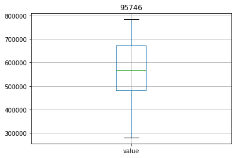


### Plot ACF and PACF for ts dataframe


```python
# plot_acf_pacf(ts, figsize=(10,6), lags=15)  # note that ts must only contain values and time as index

plot_acf_pacf(ts_95746_values, figsize=(10,6), lags=15)
```


### Plot seasonal decomposition for ts dataframe


```python
# plot_seasonal_decomp(ts)

plot_seasonal_decomp(ts_95746_values)

# Seasonality does not appear to be a significant factor in this zip code.
```


    (<Figure size 1296x432 with 1 Axes>,
     <matplotlib.axes._subplots.AxesSubplot at 0x1cc49f7b70>)


## ARIMA model parameters and optimization

### Generate list of (p,d,q) and (p,d,q,m) values


```python
p_values = [0, 1, 2, 4, 6, 8]
d_values = range(0, 3)
q_values = range(0, 3)
warnings.filterwarnings("ignore")
```

### Run ARIMA model on ts dataframe with list of p,d,q values 


```python
# eval_arima_models(ts, p_values, d_values, q_values)  # don't run this until you have some time, since it take time
# note that ts must only contain values and time as index

# eval_arima_models(ts_95746_values, p_values, d_values, q_values)  # don't run this until you have some time, since it takes time

```

### Generate model fit summary


```python
# model_fit = arima_zipcode(ts, order = None)   # change order = tuple to correspond to the best MSE produced by previous function

# Best ARIMA(6, 1, 2) MSE=3329403.484

model_fit_95746 = arima_zipcode(ts_95746_values, order = (6, 1, 2))

```

                                 ARIMA Model Results                              
    ==============================================================================
    Dep. Variable:                    D.y   No. Observations:                  264
    Model:                 ARIMA(6, 1, 2)   Log Likelihood               -2240.772
    Method:                       css-mle   S.D. of innovations           1155.648
    Date:                Tue, 10 Mar 2020   AIC                           4501.543
    Time:                        22:41:43   BIC                           4537.303
    Sample:                             1   HQIC                          4515.912
                                                                                  
    ==============================================================================
                     coef    std err          z      P>|z|      [0.025      0.975]
    ------------------------------------------------------------------------------
    const       1842.7681   1706.789      1.080      0.281   -1502.478    5188.014
    ar.L1.D.y     -0.0528      0.066     -0.805      0.422      -0.181       0.076
    ar.L2.D.y      0.4918      0.067      7.387      0.000       0.361       0.622
    ar.L3.D.y      0.1700      0.075      2.267      0.024       0.023       0.317
    ar.L4.D.y      0.1136      0.075      1.517      0.130      -0.033       0.260
    ar.L5.D.y      0.0445      0.067      0.661      0.509      -0.087       0.176
    ar.L6.D.y      0.0892      0.068      1.307      0.193      -0.045       0.223
    ma.L1.D.y      1.7134      0.029     59.405      0.000       1.657       1.770
    ma.L2.D.y      0.9787      0.025     39.736      0.000       0.930       1.027
                                        Roots                                    
    =============================================================================
                      Real          Imaginary           Modulus         Frequency
    -----------------------------------------------------------------------------
    AR.1            1.0507           -0.0000j            1.0507           -0.0000
    AR.2           -1.2564           -0.0000j            1.2564           -0.5000
    AR.3           -0.9867           -1.3041j            1.6353           -0.3531
    AR.4           -0.9867           +1.3041j            1.6353            0.3531
    AR.5            0.8403           -1.5712j            1.7818           -0.1718
    AR.6            0.8403           +1.5712j            1.7818            0.1718
    MA.1           -0.8754           -0.5055j            1.0108           -0.4167
    MA.2           -0.8754           +0.5055j            1.0108            0.4167
    -----------------------------------------------------------------------------


## ARIMA modeling results:  predictions and visualization

### Produce forecasts from ARIMA model fit


```python
actual_forecast_95746, std_error_95746, forecast_confint_95746 = forecast(model_fit_95746)
```


```python
actual_forecast_95746, std_error_95746, forecast_confint_95746
```


    (array([779689.89641013, 781645.71920252, 784885.02225555, 787798.17479647,
            791164.57049155, 794152.49240195, 796971.40581568, 799778.56307213,
            802590.38116435, 805315.51870355, 808049.93612355, 810699.40763312,
            813328.11732239, 815907.04186128, 818461.55831249, 820972.3828726 ,
            823459.73913459, 825908.54213706, 828333.57298213, 830726.42039563,
            833095.93598896, 835437.49472278, 837757.07583668, 840051.95031416]),
     array([ 1155.64836158,  3284.7791784 ,  5711.82030756,  8089.64342236,
            10643.15472006, 13262.9120552 , 16025.21943227, 18885.23444422,
            21837.68762421, 24844.87972972, 27913.03938685, 31017.91951982,
            34162.16630101, 37330.67428051, 40521.86844457, 43725.69888749,
            46940.27981378, 50158.5152634 , 53378.45329703, 56595.05332417,
            59806.38420415, 63008.83176766, 66200.69235819, 69379.32170763]),
     array([[777424.86724264, 781954.92557762],
            [775207.6703157 , 788083.76808934],
            [773690.06016657, 796079.98434454],
            [771942.76504087, 803653.58455207],
            [770304.37055835, 812024.77042475],
            [768157.66244363, 820147.32236028],
            [765562.55288409, 828380.25874728],
            [762764.18372187, 836792.94242239],
            [759789.29991526, 845391.46241343],
            [756620.44923307, 854010.58817402],
            [753341.38422628, 862758.48802083],
            [749905.40249892, 871493.41276733],
            [746371.50173855, 880284.73290623],
            [742740.26475288, 889073.81896968],
            [739040.15557486, 897882.96105011],
            [735271.58785428, 906673.17789092],
            [731458.48127535, 915460.99699382],
            [727599.65870279, 924217.42557133],
            [723713.72696951, 932953.41899476],
            [719802.15417714, 941650.68661412],
            [715877.57690325, 950314.29507466],
            [711942.45375021, 958932.53569535],
            [708006.10306302, 967508.04861034],
            [704070.97849538, 976032.92213294]]))


### Create dataframe to hold forecast results


```python
# df_forecast = forecast_df(col = 'time', daterange = pd.date_range(start='2018-05-01', end='2020-04-01', freq='MS'), 
#                 actual_forecast=actual_forecast, forecast_confint = forecast_confint)

df_forecast_95746 = forecast_df(actual_forecast_95746, forecast_confint_95746, col = 'time', daterange = pd.date_range(start='2018-05-01', end='2020-04-01', freq='MS'))

```

### Create new dataframe concatenating historic values and forecast results


```python
# df_new = concat_values_forecast(ts, df_forecast)

df_new_95746 = concat_values_forecast(ts_95746_values, df_forecast_95746)
```


```python
df_new_95746
```


<div>
<style scoped>
    .dataframe tbody tr th:only-of-type {
        vertical-align: middle;
    }

    .dataframe tbody tr th {
        vertical-align: top;
    }

    .dataframe thead th {
        text-align: right;
    }
</style>
<table border="1" class="dataframe">
  <thead>
    <tr style="text-align: right;">
      <th></th>
      <th>value</th>
      <th>forecast</th>
      <th>forecast_lower</th>
      <th>forecast_upper</th>
    </tr>
    <tr>
      <th>time</th>
      <th></th>
      <th></th>
      <th></th>
      <th></th>
    </tr>
  </thead>
  <tbody>
    <tr>
      <td>1996-04-01</td>
      <td>292000.0</td>
      <td>NaN</td>
      <td>NaN</td>
      <td>NaN</td>
    </tr>
    <tr>
      <td>1996-05-01</td>
      <td>289600.0</td>
      <td>NaN</td>
      <td>NaN</td>
      <td>NaN</td>
    </tr>
    <tr>
      <td>1996-06-01</td>
      <td>287300.0</td>
      <td>NaN</td>
      <td>NaN</td>
      <td>NaN</td>
    </tr>
    <tr>
      <td>1996-07-01</td>
      <td>285400.0</td>
      <td>NaN</td>
      <td>NaN</td>
      <td>NaN</td>
    </tr>
    <tr>
      <td>1996-08-01</td>
      <td>283900.0</td>
      <td>NaN</td>
      <td>NaN</td>
      <td>NaN</td>
    </tr>
    <tr>
      <td>1996-09-01</td>
      <td>282700.0</td>
      <td>NaN</td>
      <td>NaN</td>
      <td>NaN</td>
    </tr>
    <tr>
      <td>1996-10-01</td>
      <td>281800.0</td>
      <td>NaN</td>
      <td>NaN</td>
      <td>NaN</td>
    </tr>
    <tr>
      <td>1996-11-01</td>
      <td>281100.0</td>
      <td>NaN</td>
      <td>NaN</td>
      <td>NaN</td>
    </tr>
    <tr>
      <td>1996-12-01</td>
      <td>280700.0</td>
      <td>NaN</td>
      <td>NaN</td>
      <td>NaN</td>
    </tr>
    <tr>
      <td>1997-01-01</td>
      <td>280600.0</td>
      <td>NaN</td>
      <td>NaN</td>
      <td>NaN</td>
    </tr>
    <tr>
      <td>1997-02-01</td>
      <td>280600.0</td>
      <td>NaN</td>
      <td>NaN</td>
      <td>NaN</td>
    </tr>
    <tr>
      <td>1997-03-01</td>
      <td>280600.0</td>
      <td>NaN</td>
      <td>NaN</td>
      <td>NaN</td>
    </tr>
    <tr>
      <td>1997-04-01</td>
      <td>280900.0</td>
      <td>NaN</td>
      <td>NaN</td>
      <td>NaN</td>
    </tr>
    <tr>
      <td>1997-05-01</td>
      <td>281700.0</td>
      <td>NaN</td>
      <td>NaN</td>
      <td>NaN</td>
    </tr>
    <tr>
      <td>1997-06-01</td>
      <td>282700.0</td>
      <td>NaN</td>
      <td>NaN</td>
      <td>NaN</td>
    </tr>
    <tr>
      <td>1997-07-01</td>
      <td>284200.0</td>
      <td>NaN</td>
      <td>NaN</td>
      <td>NaN</td>
    </tr>
    <tr>
      <td>1997-08-01</td>
      <td>286000.0</td>
      <td>NaN</td>
      <td>NaN</td>
      <td>NaN</td>
    </tr>
    <tr>
      <td>1997-09-01</td>
      <td>288100.0</td>
      <td>NaN</td>
      <td>NaN</td>
      <td>NaN</td>
    </tr>
    <tr>
      <td>1997-10-01</td>
      <td>290400.0</td>
      <td>NaN</td>
      <td>NaN</td>
      <td>NaN</td>
    </tr>
    <tr>
      <td>1997-11-01</td>
      <td>293000.0</td>
      <td>NaN</td>
      <td>NaN</td>
      <td>NaN</td>
    </tr>
    <tr>
      <td>1997-12-01</td>
      <td>295900.0</td>
      <td>NaN</td>
      <td>NaN</td>
      <td>NaN</td>
    </tr>
    <tr>
      <td>1998-01-01</td>
      <td>298900.0</td>
      <td>NaN</td>
      <td>NaN</td>
      <td>NaN</td>
    </tr>
    <tr>
      <td>1998-02-01</td>
      <td>301900.0</td>
      <td>NaN</td>
      <td>NaN</td>
      <td>NaN</td>
    </tr>
    <tr>
      <td>1998-03-01</td>
      <td>304700.0</td>
      <td>NaN</td>
      <td>NaN</td>
      <td>NaN</td>
    </tr>
    <tr>
      <td>1998-04-01</td>
      <td>307400.0</td>
      <td>NaN</td>
      <td>NaN</td>
      <td>NaN</td>
    </tr>
    <tr>
      <td>1998-05-01</td>
      <td>310000.0</td>
      <td>NaN</td>
      <td>NaN</td>
      <td>NaN</td>
    </tr>
    <tr>
      <td>1998-06-01</td>
      <td>312500.0</td>
      <td>NaN</td>
      <td>NaN</td>
      <td>NaN</td>
    </tr>
    <tr>
      <td>1998-07-01</td>
      <td>314700.0</td>
      <td>NaN</td>
      <td>NaN</td>
      <td>NaN</td>
    </tr>
    <tr>
      <td>1998-08-01</td>
      <td>316700.0</td>
      <td>NaN</td>
      <td>NaN</td>
      <td>NaN</td>
    </tr>
    <tr>
      <td>1998-09-01</td>
      <td>318600.0</td>
      <td>NaN</td>
      <td>NaN</td>
      <td>NaN</td>
    </tr>
    <tr>
      <td>1998-10-01</td>
      <td>320400.0</td>
      <td>NaN</td>
      <td>NaN</td>
      <td>NaN</td>
    </tr>
    <tr>
      <td>1998-11-01</td>
      <td>322300.0</td>
      <td>NaN</td>
      <td>NaN</td>
      <td>NaN</td>
    </tr>
    <tr>
      <td>1998-12-01</td>
      <td>324300.0</td>
      <td>NaN</td>
      <td>NaN</td>
      <td>NaN</td>
    </tr>
    <tr>
      <td>1999-01-01</td>
      <td>326600.0</td>
      <td>NaN</td>
      <td>NaN</td>
      <td>NaN</td>
    </tr>
    <tr>
      <td>1999-02-01</td>
      <td>329000.0</td>
      <td>NaN</td>
      <td>NaN</td>
      <td>NaN</td>
    </tr>
    <tr>
      <td>1999-03-01</td>
      <td>331600.0</td>
      <td>NaN</td>
      <td>NaN</td>
      <td>NaN</td>
    </tr>
    <tr>
      <td>1999-04-01</td>
      <td>334400.0</td>
      <td>NaN</td>
      <td>NaN</td>
      <td>NaN</td>
    </tr>
    <tr>
      <td>1999-05-01</td>
      <td>337700.0</td>
      <td>NaN</td>
      <td>NaN</td>
      <td>NaN</td>
    </tr>
    <tr>
      <td>1999-06-01</td>
      <td>341500.0</td>
      <td>NaN</td>
      <td>NaN</td>
      <td>NaN</td>
    </tr>
    <tr>
      <td>1999-07-01</td>
      <td>345900.0</td>
      <td>NaN</td>
      <td>NaN</td>
      <td>NaN</td>
    </tr>
    <tr>
      <td>1999-08-01</td>
      <td>350600.0</td>
      <td>NaN</td>
      <td>NaN</td>
      <td>NaN</td>
    </tr>
    <tr>
      <td>1999-09-01</td>
      <td>355700.0</td>
      <td>NaN</td>
      <td>NaN</td>
      <td>NaN</td>
    </tr>
    <tr>
      <td>1999-10-01</td>
      <td>361300.0</td>
      <td>NaN</td>
      <td>NaN</td>
      <td>NaN</td>
    </tr>
    <tr>
      <td>1999-11-01</td>
      <td>367200.0</td>
      <td>NaN</td>
      <td>NaN</td>
      <td>NaN</td>
    </tr>
    <tr>
      <td>1999-12-01</td>
      <td>373300.0</td>
      <td>NaN</td>
      <td>NaN</td>
      <td>NaN</td>
    </tr>
    <tr>
      <td>2000-01-01</td>
      <td>379300.0</td>
      <td>NaN</td>
      <td>NaN</td>
      <td>NaN</td>
    </tr>
    <tr>
      <td>2000-02-01</td>
      <td>385200.0</td>
      <td>NaN</td>
      <td>NaN</td>
      <td>NaN</td>
    </tr>
    <tr>
      <td>2000-03-01</td>
      <td>390700.0</td>
      <td>NaN</td>
      <td>NaN</td>
      <td>NaN</td>
    </tr>
    <tr>
      <td>2000-04-01</td>
      <td>396100.0</td>
      <td>NaN</td>
      <td>NaN</td>
      <td>NaN</td>
    </tr>
    <tr>
      <td>2000-05-01</td>
      <td>401300.0</td>
      <td>NaN</td>
      <td>NaN</td>
      <td>NaN</td>
    </tr>
    <tr>
      <td>2000-06-01</td>
      <td>406400.0</td>
      <td>NaN</td>
      <td>NaN</td>
      <td>NaN</td>
    </tr>
    <tr>
      <td>2000-07-01</td>
      <td>411400.0</td>
      <td>NaN</td>
      <td>NaN</td>
      <td>NaN</td>
    </tr>
    <tr>
      <td>2000-08-01</td>
      <td>416400.0</td>
      <td>NaN</td>
      <td>NaN</td>
      <td>NaN</td>
    </tr>
    <tr>
      <td>2000-09-01</td>
      <td>421400.0</td>
      <td>NaN</td>
      <td>NaN</td>
      <td>NaN</td>
    </tr>
    <tr>
      <td>2000-10-01</td>
      <td>426600.0</td>
      <td>NaN</td>
      <td>NaN</td>
      <td>NaN</td>
    </tr>
    <tr>
      <td>2000-11-01</td>
      <td>432100.0</td>
      <td>NaN</td>
      <td>NaN</td>
      <td>NaN</td>
    </tr>
    <tr>
      <td>2000-12-01</td>
      <td>437900.0</td>
      <td>NaN</td>
      <td>NaN</td>
      <td>NaN</td>
    </tr>
    <tr>
      <td>2001-01-01</td>
      <td>444000.0</td>
      <td>NaN</td>
      <td>NaN</td>
      <td>NaN</td>
    </tr>
    <tr>
      <td>2001-02-01</td>
      <td>450300.0</td>
      <td>NaN</td>
      <td>NaN</td>
      <td>NaN</td>
    </tr>
    <tr>
      <td>2001-03-01</td>
      <td>456800.0</td>
      <td>NaN</td>
      <td>NaN</td>
      <td>NaN</td>
    </tr>
    <tr>
      <td>2001-04-01</td>
      <td>463600.0</td>
      <td>NaN</td>
      <td>NaN</td>
      <td>NaN</td>
    </tr>
    <tr>
      <td>2001-05-01</td>
      <td>470500.0</td>
      <td>NaN</td>
      <td>NaN</td>
      <td>NaN</td>
    </tr>
    <tr>
      <td>2001-06-01</td>
      <td>477500.0</td>
      <td>NaN</td>
      <td>NaN</td>
      <td>NaN</td>
    </tr>
    <tr>
      <td>2001-07-01</td>
      <td>484300.0</td>
      <td>NaN</td>
      <td>NaN</td>
      <td>NaN</td>
    </tr>
    <tr>
      <td>2001-08-01</td>
      <td>490800.0</td>
      <td>NaN</td>
      <td>NaN</td>
      <td>NaN</td>
    </tr>
    <tr>
      <td>2001-09-01</td>
      <td>496700.0</td>
      <td>NaN</td>
      <td>NaN</td>
      <td>NaN</td>
    </tr>
    <tr>
      <td>2001-10-01</td>
      <td>502000.0</td>
      <td>NaN</td>
      <td>NaN</td>
      <td>NaN</td>
    </tr>
    <tr>
      <td>2001-11-01</td>
      <td>506800.0</td>
      <td>NaN</td>
      <td>NaN</td>
      <td>NaN</td>
    </tr>
    <tr>
      <td>2001-12-01</td>
      <td>510900.0</td>
      <td>NaN</td>
      <td>NaN</td>
      <td>NaN</td>
    </tr>
    <tr>
      <td>2002-01-01</td>
      <td>514300.0</td>
      <td>NaN</td>
      <td>NaN</td>
      <td>NaN</td>
    </tr>
    <tr>
      <td>2002-02-01</td>
      <td>517000.0</td>
      <td>NaN</td>
      <td>NaN</td>
      <td>NaN</td>
    </tr>
    <tr>
      <td>2002-03-01</td>
      <td>519300.0</td>
      <td>NaN</td>
      <td>NaN</td>
      <td>NaN</td>
    </tr>
    <tr>
      <td>2002-04-01</td>
      <td>521300.0</td>
      <td>NaN</td>
      <td>NaN</td>
      <td>NaN</td>
    </tr>
    <tr>
      <td>2002-05-01</td>
      <td>523400.0</td>
      <td>NaN</td>
      <td>NaN</td>
      <td>NaN</td>
    </tr>
    <tr>
      <td>2002-06-01</td>
      <td>525700.0</td>
      <td>NaN</td>
      <td>NaN</td>
      <td>NaN</td>
    </tr>
    <tr>
      <td>2002-07-01</td>
      <td>528600.0</td>
      <td>NaN</td>
      <td>NaN</td>
      <td>NaN</td>
    </tr>
    <tr>
      <td>2002-08-01</td>
      <td>531900.0</td>
      <td>NaN</td>
      <td>NaN</td>
      <td>NaN</td>
    </tr>
    <tr>
      <td>2002-09-01</td>
      <td>535800.0</td>
      <td>NaN</td>
      <td>NaN</td>
      <td>NaN</td>
    </tr>
    <tr>
      <td>2002-10-01</td>
      <td>540100.0</td>
      <td>NaN</td>
      <td>NaN</td>
      <td>NaN</td>
    </tr>
    <tr>
      <td>2002-11-01</td>
      <td>544900.0</td>
      <td>NaN</td>
      <td>NaN</td>
      <td>NaN</td>
    </tr>
    <tr>
      <td>2002-12-01</td>
      <td>550200.0</td>
      <td>NaN</td>
      <td>NaN</td>
      <td>NaN</td>
    </tr>
    <tr>
      <td>2003-01-01</td>
      <td>555900.0</td>
      <td>NaN</td>
      <td>NaN</td>
      <td>NaN</td>
    </tr>
    <tr>
      <td>2003-02-01</td>
      <td>561700.0</td>
      <td>NaN</td>
      <td>NaN</td>
      <td>NaN</td>
    </tr>
    <tr>
      <td>2003-03-01</td>
      <td>567500.0</td>
      <td>NaN</td>
      <td>NaN</td>
      <td>NaN</td>
    </tr>
    <tr>
      <td>2003-04-01</td>
      <td>573100.0</td>
      <td>NaN</td>
      <td>NaN</td>
      <td>NaN</td>
    </tr>
    <tr>
      <td>2003-05-01</td>
      <td>578300.0</td>
      <td>NaN</td>
      <td>NaN</td>
      <td>NaN</td>
    </tr>
    <tr>
      <td>2003-06-01</td>
      <td>583200.0</td>
      <td>NaN</td>
      <td>NaN</td>
      <td>NaN</td>
    </tr>
    <tr>
      <td>2003-07-01</td>
      <td>587800.0</td>
      <td>NaN</td>
      <td>NaN</td>
      <td>NaN</td>
    </tr>
    <tr>
      <td>2003-08-01</td>
      <td>592300.0</td>
      <td>NaN</td>
      <td>NaN</td>
      <td>NaN</td>
    </tr>
    <tr>
      <td>2003-09-01</td>
      <td>596700.0</td>
      <td>NaN</td>
      <td>NaN</td>
      <td>NaN</td>
    </tr>
    <tr>
      <td>2003-10-01</td>
      <td>601100.0</td>
      <td>NaN</td>
      <td>NaN</td>
      <td>NaN</td>
    </tr>
    <tr>
      <td>2003-11-01</td>
      <td>605200.0</td>
      <td>NaN</td>
      <td>NaN</td>
      <td>NaN</td>
    </tr>
    <tr>
      <td>2003-12-01</td>
      <td>609400.0</td>
      <td>NaN</td>
      <td>NaN</td>
      <td>NaN</td>
    </tr>
    <tr>
      <td>2004-01-01</td>
      <td>614200.0</td>
      <td>NaN</td>
      <td>NaN</td>
      <td>NaN</td>
    </tr>
    <tr>
      <td>2004-02-01</td>
      <td>620100.0</td>
      <td>NaN</td>
      <td>NaN</td>
      <td>NaN</td>
    </tr>
    <tr>
      <td>2004-03-01</td>
      <td>627300.0</td>
      <td>NaN</td>
      <td>NaN</td>
      <td>NaN</td>
    </tr>
    <tr>
      <td>2004-04-01</td>
      <td>635800.0</td>
      <td>NaN</td>
      <td>NaN</td>
      <td>NaN</td>
    </tr>
    <tr>
      <td>2004-05-01</td>
      <td>645200.0</td>
      <td>NaN</td>
      <td>NaN</td>
      <td>NaN</td>
    </tr>
    <tr>
      <td>2004-06-01</td>
      <td>655300.0</td>
      <td>NaN</td>
      <td>NaN</td>
      <td>NaN</td>
    </tr>
    <tr>
      <td>2004-07-01</td>
      <td>666100.0</td>
      <td>NaN</td>
      <td>NaN</td>
      <td>NaN</td>
    </tr>
    <tr>
      <td>2004-08-01</td>
      <td>677200.0</td>
      <td>NaN</td>
      <td>NaN</td>
      <td>NaN</td>
    </tr>
    <tr>
      <td>2004-09-01</td>
      <td>688900.0</td>
      <td>NaN</td>
      <td>NaN</td>
      <td>NaN</td>
    </tr>
    <tr>
      <td>2004-10-01</td>
      <td>701400.0</td>
      <td>NaN</td>
      <td>NaN</td>
      <td>NaN</td>
    </tr>
    <tr>
      <td>2004-11-01</td>
      <td>714100.0</td>
      <td>NaN</td>
      <td>NaN</td>
      <td>NaN</td>
    </tr>
    <tr>
      <td>2004-12-01</td>
      <td>726900.0</td>
      <td>NaN</td>
      <td>NaN</td>
      <td>NaN</td>
    </tr>
    <tr>
      <td>2005-01-01</td>
      <td>738700.0</td>
      <td>NaN</td>
      <td>NaN</td>
      <td>NaN</td>
    </tr>
    <tr>
      <td>2005-02-01</td>
      <td>748900.0</td>
      <td>NaN</td>
      <td>NaN</td>
      <td>NaN</td>
    </tr>
    <tr>
      <td>2005-03-01</td>
      <td>758100.0</td>
      <td>NaN</td>
      <td>NaN</td>
      <td>NaN</td>
    </tr>
    <tr>
      <td>2005-04-01</td>
      <td>766400.0</td>
      <td>NaN</td>
      <td>NaN</td>
      <td>NaN</td>
    </tr>
    <tr>
      <td>2005-05-01</td>
      <td>773100.0</td>
      <td>NaN</td>
      <td>NaN</td>
      <td>NaN</td>
    </tr>
    <tr>
      <td>2005-06-01</td>
      <td>777900.0</td>
      <td>NaN</td>
      <td>NaN</td>
      <td>NaN</td>
    </tr>
    <tr>
      <td>2005-07-01</td>
      <td>781100.0</td>
      <td>NaN</td>
      <td>NaN</td>
      <td>NaN</td>
    </tr>
    <tr>
      <td>2005-08-01</td>
      <td>782800.0</td>
      <td>NaN</td>
      <td>NaN</td>
      <td>NaN</td>
    </tr>
    <tr>
      <td>2005-09-01</td>
      <td>783500.0</td>
      <td>NaN</td>
      <td>NaN</td>
      <td>NaN</td>
    </tr>
    <tr>
      <td>2005-10-01</td>
      <td>782800.0</td>
      <td>NaN</td>
      <td>NaN</td>
      <td>NaN</td>
    </tr>
    <tr>
      <td>2005-11-01</td>
      <td>781200.0</td>
      <td>NaN</td>
      <td>NaN</td>
      <td>NaN</td>
    </tr>
    <tr>
      <td>2005-12-01</td>
      <td>779100.0</td>
      <td>NaN</td>
      <td>NaN</td>
      <td>NaN</td>
    </tr>
    <tr>
      <td>2006-01-01</td>
      <td>777300.0</td>
      <td>NaN</td>
      <td>NaN</td>
      <td>NaN</td>
    </tr>
    <tr>
      <td>2006-02-01</td>
      <td>774900.0</td>
      <td>NaN</td>
      <td>NaN</td>
      <td>NaN</td>
    </tr>
    <tr>
      <td>2006-03-01</td>
      <td>771600.0</td>
      <td>NaN</td>
      <td>NaN</td>
      <td>NaN</td>
    </tr>
    <tr>
      <td>2006-04-01</td>
      <td>767400.0</td>
      <td>NaN</td>
      <td>NaN</td>
      <td>NaN</td>
    </tr>
    <tr>
      <td>2006-05-01</td>
      <td>762800.0</td>
      <td>NaN</td>
      <td>NaN</td>
      <td>NaN</td>
    </tr>
    <tr>
      <td>2006-06-01</td>
      <td>757800.0</td>
      <td>NaN</td>
      <td>NaN</td>
      <td>NaN</td>
    </tr>
    <tr>
      <td>2006-07-01</td>
      <td>752500.0</td>
      <td>NaN</td>
      <td>NaN</td>
      <td>NaN</td>
    </tr>
    <tr>
      <td>2006-08-01</td>
      <td>746700.0</td>
      <td>NaN</td>
      <td>NaN</td>
      <td>NaN</td>
    </tr>
    <tr>
      <td>2006-09-01</td>
      <td>740100.0</td>
      <td>NaN</td>
      <td>NaN</td>
      <td>NaN</td>
    </tr>
    <tr>
      <td>2006-10-01</td>
      <td>732400.0</td>
      <td>NaN</td>
      <td>NaN</td>
      <td>NaN</td>
    </tr>
    <tr>
      <td>2006-11-01</td>
      <td>724200.0</td>
      <td>NaN</td>
      <td>NaN</td>
      <td>NaN</td>
    </tr>
    <tr>
      <td>2006-12-01</td>
      <td>716700.0</td>
      <td>NaN</td>
      <td>NaN</td>
      <td>NaN</td>
    </tr>
    <tr>
      <td>2007-01-01</td>
      <td>711600.0</td>
      <td>NaN</td>
      <td>NaN</td>
      <td>NaN</td>
    </tr>
    <tr>
      <td>2007-02-01</td>
      <td>708400.0</td>
      <td>NaN</td>
      <td>NaN</td>
      <td>NaN</td>
    </tr>
    <tr>
      <td>2007-03-01</td>
      <td>706800.0</td>
      <td>NaN</td>
      <td>NaN</td>
      <td>NaN</td>
    </tr>
    <tr>
      <td>2007-04-01</td>
      <td>706200.0</td>
      <td>NaN</td>
      <td>NaN</td>
      <td>NaN</td>
    </tr>
    <tr>
      <td>2007-05-01</td>
      <td>706000.0</td>
      <td>NaN</td>
      <td>NaN</td>
      <td>NaN</td>
    </tr>
    <tr>
      <td>2007-06-01</td>
      <td>704300.0</td>
      <td>NaN</td>
      <td>NaN</td>
      <td>NaN</td>
    </tr>
    <tr>
      <td>2007-07-01</td>
      <td>701800.0</td>
      <td>NaN</td>
      <td>NaN</td>
      <td>NaN</td>
    </tr>
    <tr>
      <td>2007-08-01</td>
      <td>699300.0</td>
      <td>NaN</td>
      <td>NaN</td>
      <td>NaN</td>
    </tr>
    <tr>
      <td>2007-09-01</td>
      <td>698100.0</td>
      <td>NaN</td>
      <td>NaN</td>
      <td>NaN</td>
    </tr>
    <tr>
      <td>2007-10-01</td>
      <td>697000.0</td>
      <td>NaN</td>
      <td>NaN</td>
      <td>NaN</td>
    </tr>
    <tr>
      <td>2007-11-01</td>
      <td>695300.0</td>
      <td>NaN</td>
      <td>NaN</td>
      <td>NaN</td>
    </tr>
    <tr>
      <td>2007-12-01</td>
      <td>692000.0</td>
      <td>NaN</td>
      <td>NaN</td>
      <td>NaN</td>
    </tr>
    <tr>
      <td>2008-01-01</td>
      <td>688600.0</td>
      <td>NaN</td>
      <td>NaN</td>
      <td>NaN</td>
    </tr>
    <tr>
      <td>2008-02-01</td>
      <td>683700.0</td>
      <td>NaN</td>
      <td>NaN</td>
      <td>NaN</td>
    </tr>
    <tr>
      <td>2008-03-01</td>
      <td>678000.0</td>
      <td>NaN</td>
      <td>NaN</td>
      <td>NaN</td>
    </tr>
    <tr>
      <td>2008-04-01</td>
      <td>671900.0</td>
      <td>NaN</td>
      <td>NaN</td>
      <td>NaN</td>
    </tr>
    <tr>
      <td>2008-05-01</td>
      <td>666400.0</td>
      <td>NaN</td>
      <td>NaN</td>
      <td>NaN</td>
    </tr>
    <tr>
      <td>2008-06-01</td>
      <td>659600.0</td>
      <td>NaN</td>
      <td>NaN</td>
      <td>NaN</td>
    </tr>
    <tr>
      <td>2008-07-01</td>
      <td>651600.0</td>
      <td>NaN</td>
      <td>NaN</td>
      <td>NaN</td>
    </tr>
    <tr>
      <td>2008-08-01</td>
      <td>642400.0</td>
      <td>NaN</td>
      <td>NaN</td>
      <td>NaN</td>
    </tr>
    <tr>
      <td>2008-09-01</td>
      <td>634100.0</td>
      <td>NaN</td>
      <td>NaN</td>
      <td>NaN</td>
    </tr>
    <tr>
      <td>2008-10-01</td>
      <td>625900.0</td>
      <td>NaN</td>
      <td>NaN</td>
      <td>NaN</td>
    </tr>
    <tr>
      <td>2008-11-01</td>
      <td>617400.0</td>
      <td>NaN</td>
      <td>NaN</td>
      <td>NaN</td>
    </tr>
    <tr>
      <td>2008-12-01</td>
      <td>608200.0</td>
      <td>NaN</td>
      <td>NaN</td>
      <td>NaN</td>
    </tr>
    <tr>
      <td>2009-01-01</td>
      <td>600100.0</td>
      <td>NaN</td>
      <td>NaN</td>
      <td>NaN</td>
    </tr>
    <tr>
      <td>2009-02-01</td>
      <td>591600.0</td>
      <td>NaN</td>
      <td>NaN</td>
      <td>NaN</td>
    </tr>
    <tr>
      <td>2009-03-01</td>
      <td>582000.0</td>
      <td>NaN</td>
      <td>NaN</td>
      <td>NaN</td>
    </tr>
    <tr>
      <td>2009-04-01</td>
      <td>571100.0</td>
      <td>NaN</td>
      <td>NaN</td>
      <td>NaN</td>
    </tr>
    <tr>
      <td>2009-05-01</td>
      <td>560100.0</td>
      <td>NaN</td>
      <td>NaN</td>
      <td>NaN</td>
    </tr>
    <tr>
      <td>2009-06-01</td>
      <td>550300.0</td>
      <td>NaN</td>
      <td>NaN</td>
      <td>NaN</td>
    </tr>
    <tr>
      <td>2009-07-01</td>
      <td>544900.0</td>
      <td>NaN</td>
      <td>NaN</td>
      <td>NaN</td>
    </tr>
    <tr>
      <td>2009-08-01</td>
      <td>542700.0</td>
      <td>NaN</td>
      <td>NaN</td>
      <td>NaN</td>
    </tr>
    <tr>
      <td>2009-09-01</td>
      <td>541900.0</td>
      <td>NaN</td>
      <td>NaN</td>
      <td>NaN</td>
    </tr>
    <tr>
      <td>2009-10-01</td>
      <td>540900.0</td>
      <td>NaN</td>
      <td>NaN</td>
      <td>NaN</td>
    </tr>
    <tr>
      <td>2009-11-01</td>
      <td>539100.0</td>
      <td>NaN</td>
      <td>NaN</td>
      <td>NaN</td>
    </tr>
    <tr>
      <td>2009-12-01</td>
      <td>537400.0</td>
      <td>NaN</td>
      <td>NaN</td>
      <td>NaN</td>
    </tr>
    <tr>
      <td>2010-01-01</td>
      <td>534500.0</td>
      <td>NaN</td>
      <td>NaN</td>
      <td>NaN</td>
    </tr>
    <tr>
      <td>2010-02-01</td>
      <td>533400.0</td>
      <td>NaN</td>
      <td>NaN</td>
      <td>NaN</td>
    </tr>
    <tr>
      <td>2010-03-01</td>
      <td>531800.0</td>
      <td>NaN</td>
      <td>NaN</td>
      <td>NaN</td>
    </tr>
    <tr>
      <td>2010-04-01</td>
      <td>527100.0</td>
      <td>NaN</td>
      <td>NaN</td>
      <td>NaN</td>
    </tr>
    <tr>
      <td>2010-05-01</td>
      <td>520500.0</td>
      <td>NaN</td>
      <td>NaN</td>
      <td>NaN</td>
    </tr>
    <tr>
      <td>2010-06-01</td>
      <td>517400.0</td>
      <td>NaN</td>
      <td>NaN</td>
      <td>NaN</td>
    </tr>
    <tr>
      <td>2010-07-01</td>
      <td>511100.0</td>
      <td>NaN</td>
      <td>NaN</td>
      <td>NaN</td>
    </tr>
    <tr>
      <td>2010-08-01</td>
      <td>501100.0</td>
      <td>NaN</td>
      <td>NaN</td>
      <td>NaN</td>
    </tr>
    <tr>
      <td>2010-09-01</td>
      <td>489900.0</td>
      <td>NaN</td>
      <td>NaN</td>
      <td>NaN</td>
    </tr>
    <tr>
      <td>2010-10-01</td>
      <td>484800.0</td>
      <td>NaN</td>
      <td>NaN</td>
      <td>NaN</td>
    </tr>
    <tr>
      <td>2010-11-01</td>
      <td>483200.0</td>
      <td>NaN</td>
      <td>NaN</td>
      <td>NaN</td>
    </tr>
    <tr>
      <td>2010-12-01</td>
      <td>483500.0</td>
      <td>NaN</td>
      <td>NaN</td>
      <td>NaN</td>
    </tr>
    <tr>
      <td>2011-01-01</td>
      <td>480700.0</td>
      <td>NaN</td>
      <td>NaN</td>
      <td>NaN</td>
    </tr>
    <tr>
      <td>2011-02-01</td>
      <td>478300.0</td>
      <td>NaN</td>
      <td>NaN</td>
      <td>NaN</td>
    </tr>
    <tr>
      <td>2011-03-01</td>
      <td>477000.0</td>
      <td>NaN</td>
      <td>NaN</td>
      <td>NaN</td>
    </tr>
    <tr>
      <td>2011-04-01</td>
      <td>478700.0</td>
      <td>NaN</td>
      <td>NaN</td>
      <td>NaN</td>
    </tr>
    <tr>
      <td>2011-05-01</td>
      <td>480900.0</td>
      <td>NaN</td>
      <td>NaN</td>
      <td>NaN</td>
    </tr>
    <tr>
      <td>2011-06-01</td>
      <td>484900.0</td>
      <td>NaN</td>
      <td>NaN</td>
      <td>NaN</td>
    </tr>
    <tr>
      <td>2011-07-01</td>
      <td>490900.0</td>
      <td>NaN</td>
      <td>NaN</td>
      <td>NaN</td>
    </tr>
    <tr>
      <td>2011-08-01</td>
      <td>499200.0</td>
      <td>NaN</td>
      <td>NaN</td>
      <td>NaN</td>
    </tr>
    <tr>
      <td>2011-09-01</td>
      <td>503700.0</td>
      <td>NaN</td>
      <td>NaN</td>
      <td>NaN</td>
    </tr>
    <tr>
      <td>2011-10-01</td>
      <td>504200.0</td>
      <td>NaN</td>
      <td>NaN</td>
      <td>NaN</td>
    </tr>
    <tr>
      <td>2011-11-01</td>
      <td>504200.0</td>
      <td>NaN</td>
      <td>NaN</td>
      <td>NaN</td>
    </tr>
    <tr>
      <td>2011-12-01</td>
      <td>503200.0</td>
      <td>NaN</td>
      <td>NaN</td>
      <td>NaN</td>
    </tr>
    <tr>
      <td>2012-01-01</td>
      <td>503400.0</td>
      <td>NaN</td>
      <td>NaN</td>
      <td>NaN</td>
    </tr>
    <tr>
      <td>2012-02-01</td>
      <td>504400.0</td>
      <td>NaN</td>
      <td>NaN</td>
      <td>NaN</td>
    </tr>
    <tr>
      <td>2012-03-01</td>
      <td>506000.0</td>
      <td>NaN</td>
      <td>NaN</td>
      <td>NaN</td>
    </tr>
    <tr>
      <td>2012-04-01</td>
      <td>509200.0</td>
      <td>NaN</td>
      <td>NaN</td>
      <td>NaN</td>
    </tr>
    <tr>
      <td>2012-05-01</td>
      <td>513000.0</td>
      <td>NaN</td>
      <td>NaN</td>
      <td>NaN</td>
    </tr>
    <tr>
      <td>2012-06-01</td>
      <td>513700.0</td>
      <td>NaN</td>
      <td>NaN</td>
      <td>NaN</td>
    </tr>
    <tr>
      <td>2012-07-01</td>
      <td>514000.0</td>
      <td>NaN</td>
      <td>NaN</td>
      <td>NaN</td>
    </tr>
    <tr>
      <td>2012-08-01</td>
      <td>514600.0</td>
      <td>NaN</td>
      <td>NaN</td>
      <td>NaN</td>
    </tr>
    <tr>
      <td>2012-09-01</td>
      <td>518600.0</td>
      <td>NaN</td>
      <td>NaN</td>
      <td>NaN</td>
    </tr>
    <tr>
      <td>2012-10-01</td>
      <td>523900.0</td>
      <td>NaN</td>
      <td>NaN</td>
      <td>NaN</td>
    </tr>
    <tr>
      <td>2012-11-01</td>
      <td>528600.0</td>
      <td>NaN</td>
      <td>NaN</td>
      <td>NaN</td>
    </tr>
    <tr>
      <td>2012-12-01</td>
      <td>534900.0</td>
      <td>NaN</td>
      <td>NaN</td>
      <td>NaN</td>
    </tr>
    <tr>
      <td>2013-01-01</td>
      <td>543000.0</td>
      <td>NaN</td>
      <td>NaN</td>
      <td>NaN</td>
    </tr>
    <tr>
      <td>2013-02-01</td>
      <td>547900.0</td>
      <td>NaN</td>
      <td>NaN</td>
      <td>NaN</td>
    </tr>
    <tr>
      <td>2013-03-01</td>
      <td>552700.0</td>
      <td>NaN</td>
      <td>NaN</td>
      <td>NaN</td>
    </tr>
    <tr>
      <td>2013-04-01</td>
      <td>558800.0</td>
      <td>NaN</td>
      <td>NaN</td>
      <td>NaN</td>
    </tr>
    <tr>
      <td>2013-05-01</td>
      <td>566900.0</td>
      <td>NaN</td>
      <td>NaN</td>
      <td>NaN</td>
    </tr>
    <tr>
      <td>2013-06-01</td>
      <td>576800.0</td>
      <td>NaN</td>
      <td>NaN</td>
      <td>NaN</td>
    </tr>
    <tr>
      <td>2013-07-01</td>
      <td>587600.0</td>
      <td>NaN</td>
      <td>NaN</td>
      <td>NaN</td>
    </tr>
    <tr>
      <td>2013-08-01</td>
      <td>597900.0</td>
      <td>NaN</td>
      <td>NaN</td>
      <td>NaN</td>
    </tr>
    <tr>
      <td>2013-09-01</td>
      <td>606200.0</td>
      <td>NaN</td>
      <td>NaN</td>
      <td>NaN</td>
    </tr>
    <tr>
      <td>2013-10-01</td>
      <td>610700.0</td>
      <td>NaN</td>
      <td>NaN</td>
      <td>NaN</td>
    </tr>
    <tr>
      <td>2013-11-01</td>
      <td>614700.0</td>
      <td>NaN</td>
      <td>NaN</td>
      <td>NaN</td>
    </tr>
    <tr>
      <td>2013-12-01</td>
      <td>616700.0</td>
      <td>NaN</td>
      <td>NaN</td>
      <td>NaN</td>
    </tr>
    <tr>
      <td>2014-01-01</td>
      <td>616200.0</td>
      <td>NaN</td>
      <td>NaN</td>
      <td>NaN</td>
    </tr>
    <tr>
      <td>2014-02-01</td>
      <td>617000.0</td>
      <td>NaN</td>
      <td>NaN</td>
      <td>NaN</td>
    </tr>
    <tr>
      <td>2014-03-01</td>
      <td>619800.0</td>
      <td>NaN</td>
      <td>NaN</td>
      <td>NaN</td>
    </tr>
    <tr>
      <td>2014-04-01</td>
      <td>622600.0</td>
      <td>NaN</td>
      <td>NaN</td>
      <td>NaN</td>
    </tr>
    <tr>
      <td>2014-05-01</td>
      <td>625900.0</td>
      <td>NaN</td>
      <td>NaN</td>
      <td>NaN</td>
    </tr>
    <tr>
      <td>2014-06-01</td>
      <td>626100.0</td>
      <td>NaN</td>
      <td>NaN</td>
      <td>NaN</td>
    </tr>
    <tr>
      <td>2014-07-01</td>
      <td>623700.0</td>
      <td>NaN</td>
      <td>NaN</td>
      <td>NaN</td>
    </tr>
    <tr>
      <td>2014-08-01</td>
      <td>623500.0</td>
      <td>NaN</td>
      <td>NaN</td>
      <td>NaN</td>
    </tr>
    <tr>
      <td>2014-09-01</td>
      <td>624700.0</td>
      <td>NaN</td>
      <td>NaN</td>
      <td>NaN</td>
    </tr>
    <tr>
      <td>2014-10-01</td>
      <td>623200.0</td>
      <td>NaN</td>
      <td>NaN</td>
      <td>NaN</td>
    </tr>
    <tr>
      <td>2014-11-01</td>
      <td>621400.0</td>
      <td>NaN</td>
      <td>NaN</td>
      <td>NaN</td>
    </tr>
    <tr>
      <td>2014-12-01</td>
      <td>622900.0</td>
      <td>NaN</td>
      <td>NaN</td>
      <td>NaN</td>
    </tr>
    <tr>
      <td>2015-01-01</td>
      <td>627000.0</td>
      <td>NaN</td>
      <td>NaN</td>
      <td>NaN</td>
    </tr>
    <tr>
      <td>2015-02-01</td>
      <td>630400.0</td>
      <td>NaN</td>
      <td>NaN</td>
      <td>NaN</td>
    </tr>
    <tr>
      <td>2015-03-01</td>
      <td>631900.0</td>
      <td>NaN</td>
      <td>NaN</td>
      <td>NaN</td>
    </tr>
    <tr>
      <td>2015-04-01</td>
      <td>632700.0</td>
      <td>NaN</td>
      <td>NaN</td>
      <td>NaN</td>
    </tr>
    <tr>
      <td>2015-05-01</td>
      <td>634100.0</td>
      <td>NaN</td>
      <td>NaN</td>
      <td>NaN</td>
    </tr>
    <tr>
      <td>2015-06-01</td>
      <td>634200.0</td>
      <td>NaN</td>
      <td>NaN</td>
      <td>NaN</td>
    </tr>
    <tr>
      <td>2015-07-01</td>
      <td>634900.0</td>
      <td>NaN</td>
      <td>NaN</td>
      <td>NaN</td>
    </tr>
    <tr>
      <td>2015-08-01</td>
      <td>636600.0</td>
      <td>NaN</td>
      <td>NaN</td>
      <td>NaN</td>
    </tr>
    <tr>
      <td>2015-09-01</td>
      <td>638500.0</td>
      <td>NaN</td>
      <td>NaN</td>
      <td>NaN</td>
    </tr>
    <tr>
      <td>2015-10-01</td>
      <td>640700.0</td>
      <td>NaN</td>
      <td>NaN</td>
      <td>NaN</td>
    </tr>
    <tr>
      <td>2015-11-01</td>
      <td>644300.0</td>
      <td>NaN</td>
      <td>NaN</td>
      <td>NaN</td>
    </tr>
    <tr>
      <td>2015-12-01</td>
      <td>646700.0</td>
      <td>NaN</td>
      <td>NaN</td>
      <td>NaN</td>
    </tr>
    <tr>
      <td>2016-01-01</td>
      <td>648400.0</td>
      <td>NaN</td>
      <td>NaN</td>
      <td>NaN</td>
    </tr>
    <tr>
      <td>2016-02-01</td>
      <td>652000.0</td>
      <td>NaN</td>
      <td>NaN</td>
      <td>NaN</td>
    </tr>
    <tr>
      <td>2016-03-01</td>
      <td>656600.0</td>
      <td>NaN</td>
      <td>NaN</td>
      <td>NaN</td>
    </tr>
    <tr>
      <td>2016-04-01</td>
      <td>660600.0</td>
      <td>NaN</td>
      <td>NaN</td>
      <td>NaN</td>
    </tr>
    <tr>
      <td>2016-05-01</td>
      <td>665500.0</td>
      <td>NaN</td>
      <td>NaN</td>
      <td>NaN</td>
    </tr>
    <tr>
      <td>2016-06-01</td>
      <td>672400.0</td>
      <td>NaN</td>
      <td>NaN</td>
      <td>NaN</td>
    </tr>
    <tr>
      <td>2016-07-01</td>
      <td>677600.0</td>
      <td>NaN</td>
      <td>NaN</td>
      <td>NaN</td>
    </tr>
    <tr>
      <td>2016-08-01</td>
      <td>680100.0</td>
      <td>NaN</td>
      <td>NaN</td>
      <td>NaN</td>
    </tr>
    <tr>
      <td>2016-09-01</td>
      <td>682900.0</td>
      <td>NaN</td>
      <td>NaN</td>
      <td>NaN</td>
    </tr>
    <tr>
      <td>2016-10-01</td>
      <td>687500.0</td>
      <td>NaN</td>
      <td>NaN</td>
      <td>NaN</td>
    </tr>
    <tr>
      <td>2016-11-01</td>
      <td>692400.0</td>
      <td>NaN</td>
      <td>NaN</td>
      <td>NaN</td>
    </tr>
    <tr>
      <td>2016-12-01</td>
      <td>698600.0</td>
      <td>NaN</td>
      <td>NaN</td>
      <td>NaN</td>
    </tr>
    <tr>
      <td>2017-01-01</td>
      <td>707500.0</td>
      <td>NaN</td>
      <td>NaN</td>
      <td>NaN</td>
    </tr>
    <tr>
      <td>2017-02-01</td>
      <td>712400.0</td>
      <td>NaN</td>
      <td>NaN</td>
      <td>NaN</td>
    </tr>
    <tr>
      <td>2017-03-01</td>
      <td>713900.0</td>
      <td>NaN</td>
      <td>NaN</td>
      <td>NaN</td>
    </tr>
    <tr>
      <td>2017-04-01</td>
      <td>716600.0</td>
      <td>NaN</td>
      <td>NaN</td>
      <td>NaN</td>
    </tr>
    <tr>
      <td>2017-05-01</td>
      <td>722500.0</td>
      <td>NaN</td>
      <td>NaN</td>
      <td>NaN</td>
    </tr>
    <tr>
      <td>2017-06-01</td>
      <td>728400.0</td>
      <td>NaN</td>
      <td>NaN</td>
      <td>NaN</td>
    </tr>
    <tr>
      <td>2017-07-01</td>
      <td>735400.0</td>
      <td>NaN</td>
      <td>NaN</td>
      <td>NaN</td>
    </tr>
    <tr>
      <td>2017-08-01</td>
      <td>740400.0</td>
      <td>NaN</td>
      <td>NaN</td>
      <td>NaN</td>
    </tr>
    <tr>
      <td>2017-09-01</td>
      <td>746000.0</td>
      <td>NaN</td>
      <td>NaN</td>
      <td>NaN</td>
    </tr>
    <tr>
      <td>2017-10-01</td>
      <td>753200.0</td>
      <td>NaN</td>
      <td>NaN</td>
      <td>NaN</td>
    </tr>
    <tr>
      <td>2017-11-01</td>
      <td>757400.0</td>
      <td>NaN</td>
      <td>NaN</td>
      <td>NaN</td>
    </tr>
    <tr>
      <td>2017-12-01</td>
      <td>757500.0</td>
      <td>NaN</td>
      <td>NaN</td>
      <td>NaN</td>
    </tr>
    <tr>
      <td>2018-01-01</td>
      <td>757000.0</td>
      <td>NaN</td>
      <td>NaN</td>
      <td>NaN</td>
    </tr>
    <tr>
      <td>2018-02-01</td>
      <td>761500.0</td>
      <td>NaN</td>
      <td>NaN</td>
      <td>NaN</td>
    </tr>
    <tr>
      <td>2018-03-01</td>
      <td>771300.0</td>
      <td>NaN</td>
      <td>NaN</td>
      <td>NaN</td>
    </tr>
    <tr>
      <td>2018-04-01</td>
      <td>778500.0</td>
      <td>NaN</td>
      <td>NaN</td>
      <td>NaN</td>
    </tr>
    <tr>
      <td>2018-05-01</td>
      <td>NaN</td>
      <td>779689.896410</td>
      <td>777424.867243</td>
      <td>781954.925578</td>
    </tr>
    <tr>
      <td>2018-06-01</td>
      <td>NaN</td>
      <td>781645.719203</td>
      <td>775207.670316</td>
      <td>788083.768089</td>
    </tr>
    <tr>
      <td>2018-07-01</td>
      <td>NaN</td>
      <td>784885.022256</td>
      <td>773690.060167</td>
      <td>796079.984345</td>
    </tr>
    <tr>
      <td>2018-08-01</td>
      <td>NaN</td>
      <td>787798.174796</td>
      <td>771942.765041</td>
      <td>803653.584552</td>
    </tr>
    <tr>
      <td>2018-09-01</td>
      <td>NaN</td>
      <td>791164.570492</td>
      <td>770304.370558</td>
      <td>812024.770425</td>
    </tr>
    <tr>
      <td>2018-10-01</td>
      <td>NaN</td>
      <td>794152.492402</td>
      <td>768157.662444</td>
      <td>820147.322360</td>
    </tr>
    <tr>
      <td>2018-11-01</td>
      <td>NaN</td>
      <td>796971.405816</td>
      <td>765562.552884</td>
      <td>828380.258747</td>
    </tr>
    <tr>
      <td>2018-12-01</td>
      <td>NaN</td>
      <td>799778.563072</td>
      <td>762764.183722</td>
      <td>836792.942422</td>
    </tr>
    <tr>
      <td>2019-01-01</td>
      <td>NaN</td>
      <td>802590.381164</td>
      <td>759789.299915</td>
      <td>845391.462413</td>
    </tr>
    <tr>
      <td>2019-02-01</td>
      <td>NaN</td>
      <td>805315.518704</td>
      <td>756620.449233</td>
      <td>854010.588174</td>
    </tr>
    <tr>
      <td>2019-03-01</td>
      <td>NaN</td>
      <td>808049.936124</td>
      <td>753341.384226</td>
      <td>862758.488021</td>
    </tr>
    <tr>
      <td>2019-04-01</td>
      <td>NaN</td>
      <td>810699.407633</td>
      <td>749905.402499</td>
      <td>871493.412767</td>
    </tr>
    <tr>
      <td>2019-05-01</td>
      <td>NaN</td>
      <td>813328.117322</td>
      <td>746371.501739</td>
      <td>880284.732906</td>
    </tr>
    <tr>
      <td>2019-06-01</td>
      <td>NaN</td>
      <td>815907.041861</td>
      <td>742740.264753</td>
      <td>889073.818970</td>
    </tr>
    <tr>
      <td>2019-07-01</td>
      <td>NaN</td>
      <td>818461.558312</td>
      <td>739040.155575</td>
      <td>897882.961050</td>
    </tr>
    <tr>
      <td>2019-08-01</td>
      <td>NaN</td>
      <td>820972.382873</td>
      <td>735271.587854</td>
      <td>906673.177891</td>
    </tr>
    <tr>
      <td>2019-09-01</td>
      <td>NaN</td>
      <td>823459.739135</td>
      <td>731458.481275</td>
      <td>915460.996994</td>
    </tr>
    <tr>
      <td>2019-10-01</td>
      <td>NaN</td>
      <td>825908.542137</td>
      <td>727599.658703</td>
      <td>924217.425571</td>
    </tr>
    <tr>
      <td>2019-11-01</td>
      <td>NaN</td>
      <td>828333.572982</td>
      <td>723713.726970</td>
      <td>932953.418995</td>
    </tr>
    <tr>
      <td>2019-12-01</td>
      <td>NaN</td>
      <td>830726.420396</td>
      <td>719802.154177</td>
      <td>941650.686614</td>
    </tr>
    <tr>
      <td>2020-01-01</td>
      <td>NaN</td>
      <td>833095.935989</td>
      <td>715877.576903</td>
      <td>950314.295075</td>
    </tr>
    <tr>
      <td>2020-02-01</td>
      <td>NaN</td>
      <td>835437.494723</td>
      <td>711942.453750</td>
      <td>958932.535695</td>
    </tr>
    <tr>
      <td>2020-03-01</td>
      <td>NaN</td>
      <td>837757.075837</td>
      <td>708006.103063</td>
      <td>967508.048610</td>
    </tr>
    <tr>
      <td>2020-04-01</td>
      <td>NaN</td>
      <td>840051.950314</td>
      <td>704070.978495</td>
      <td>976032.922133</td>
    </tr>
  </tbody>
</table>
</div>


### Calculate predicted, lower bound, and upper bound forecasted prices


```python
forecasted_price_95746, forecasted_lower_95746, forecasted_upper_95746 = forecast_values(df_new_95746)
```


```python
forecasted_price_95746, forecasted_lower_95746, forecasted_upper_95746  # predicted, best-case, and worst-case prices in 2020

```


    (840051.9503141623, 704070.97849538, 976032.9221329446)


```python
last_value_95746 = df_new_95746['value'].loc['2018-04-01']
```


```python
last_value_95746
```


    778500.0


### Plot forecast with confidence intervals


```python
# plot_forecast(df = df_new, figsize=(12,8), geog=None)

plot_forecast(df_new_95746, figsize=(12,8), geog='95746 (Granite Bay)')
```


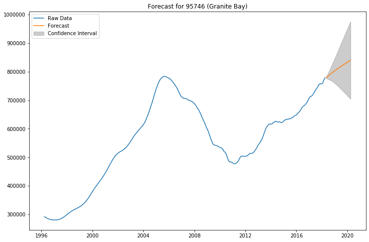


### Print summary of predicted, worst-case, and best-case scenarios


```python
gb_95746_pred, gb_95746_low, gb_95746_high = pred_best_worst(pred=forecasted_price_95746, low=forecasted_lower_95746, 
                                                             high=forecasted_upper_95746, last=last_value_95746, date='April 1, 2020')
gb_95746_pred, gb_95746_low, gb_95746_high
```

    By the model prediction, I would expect to see a 7.906% change in price by April 1, 2020.
    At the lower bound of the confidence interval, I would expect to see a -9.561% change in price by April 1, 2020.
    At the upper bound of the confidence interval, I would expect to see a 25.374% change in price by April 1, 2020.


    (7.906, -9.561, 25.374)


## Zip code 95746 (Granite Bay):  Solid investment opportunity

By the model prediction, I would expect to see a 7.906% change in price by April 1, 2020.
At the lower bound of the confidence interval, I would expect to see a -9.561% change in price by April 1, 2020.
At the upper bound of the confidence interval, I would expect to see a 25.374% change in price by April 1, 2020.

# SacMetro:  95614 (Cool) -- Not a great investment opportunity


```python
geog_area = '95614'
```


```python
ts_95614 = df_sac.loc[df_sac['Zip'] == geog_area]  # ts for all of the following functions should have only one zipcode
ts_95614.head()

```


<div>
<style scoped>
    .dataframe tbody tr th:only-of-type {
        vertical-align: middle;
    }

    .dataframe tbody tr th {
        vertical-align: top;
    }

    .dataframe thead th {
        text-align: right;
    }
</style>
<table border="1" class="dataframe">
  <thead>
    <tr style="text-align: right;">
      <th></th>
      <th>Metro</th>
      <th>MetroState</th>
      <th>CountyName</th>
      <th>City</th>
      <th>Zip</th>
      <th>SizeRank</th>
      <th>value</th>
    </tr>
    <tr>
      <th>time</th>
      <th></th>
      <th></th>
      <th></th>
      <th></th>
      <th></th>
      <th></th>
      <th></th>
    </tr>
  </thead>
  <tbody>
    <tr>
      <td>1996-04-01</td>
      <td>Sacramento</td>
      <td>Sacramento CA</td>
      <td>El Dorado</td>
      <td>Cool</td>
      <td>95614</td>
      <td>11436</td>
      <td>157500.0</td>
    </tr>
    <tr>
      <td>1996-05-01</td>
      <td>Sacramento</td>
      <td>Sacramento CA</td>
      <td>El Dorado</td>
      <td>Cool</td>
      <td>95614</td>
      <td>11436</td>
      <td>157200.0</td>
    </tr>
    <tr>
      <td>1996-06-01</td>
      <td>Sacramento</td>
      <td>Sacramento CA</td>
      <td>El Dorado</td>
      <td>Cool</td>
      <td>95614</td>
      <td>11436</td>
      <td>156900.0</td>
    </tr>
    <tr>
      <td>1996-07-01</td>
      <td>Sacramento</td>
      <td>Sacramento CA</td>
      <td>El Dorado</td>
      <td>Cool</td>
      <td>95614</td>
      <td>11436</td>
      <td>156700.0</td>
    </tr>
    <tr>
      <td>1996-08-01</td>
      <td>Sacramento</td>
      <td>Sacramento CA</td>
      <td>El Dorado</td>
      <td>Cool</td>
      <td>95614</td>
      <td>11436</td>
      <td>156400.0</td>
    </tr>
  </tbody>
</table>
</div>


```python
# ts.head()

ts_95614.tail()
```


<div>
<style scoped>
    .dataframe tbody tr th:only-of-type {
        vertical-align: middle;
    }

    .dataframe tbody tr th {
        vertical-align: top;
    }

    .dataframe thead th {
        text-align: right;
    }
</style>
<table border="1" class="dataframe">
  <thead>
    <tr style="text-align: right;">
      <th></th>
      <th>Metro</th>
      <th>MetroState</th>
      <th>CountyName</th>
      <th>City</th>
      <th>Zip</th>
      <th>SizeRank</th>
      <th>value</th>
    </tr>
    <tr>
      <th>time</th>
      <th></th>
      <th></th>
      <th></th>
      <th></th>
      <th></th>
      <th></th>
      <th></th>
    </tr>
  </thead>
  <tbody>
    <tr>
      <td>2017-12-01</td>
      <td>Sacramento</td>
      <td>Sacramento CA</td>
      <td>El Dorado</td>
      <td>Cool</td>
      <td>95614</td>
      <td>11436</td>
      <td>403300.0</td>
    </tr>
    <tr>
      <td>2018-01-01</td>
      <td>Sacramento</td>
      <td>Sacramento CA</td>
      <td>El Dorado</td>
      <td>Cool</td>
      <td>95614</td>
      <td>11436</td>
      <td>412200.0</td>
    </tr>
    <tr>
      <td>2018-02-01</td>
      <td>Sacramento</td>
      <td>Sacramento CA</td>
      <td>El Dorado</td>
      <td>Cool</td>
      <td>95614</td>
      <td>11436</td>
      <td>419200.0</td>
    </tr>
    <tr>
      <td>2018-03-01</td>
      <td>Sacramento</td>
      <td>Sacramento CA</td>
      <td>El Dorado</td>
      <td>Cool</td>
      <td>95614</td>
      <td>11436</td>
      <td>422600.0</td>
    </tr>
    <tr>
      <td>2018-04-01</td>
      <td>Sacramento</td>
      <td>Sacramento CA</td>
      <td>El Dorado</td>
      <td>Cool</td>
      <td>95614</td>
      <td>11436</td>
      <td>423300.0</td>
    </tr>
  </tbody>
</table>
</div>


```python
# ts = ts.value

ts_95614_values = ts_95614.value
```


```python
# ts.head()

ts_95614_values.head()
```


    time
    1996-04-01    157500.0
    1996-05-01    157200.0
    1996-06-01    156900.0
    1996-07-01    156700.0
    1996-08-01    156400.0
    Name: value, dtype: float64


```python
ts_95614_values.tail()
```


    time
    2017-12-01    403300.0
    2018-01-01    412200.0
    2018-02-01    419200.0
    2018-03-01    422600.0
    2018-04-01    423300.0
    Name: value, dtype: float64


### Visualizations

#### plot_ts:  Plot zip code(s) of interest over time, with market highs and lows


```python
# fig, ax = plot_ts(df_melt, zipcodes=['95616', '92008', '90035', '90025', '60625', '57701'])  # enter desired zip code(s)

fig, ax = plot_ts_zips(df_melt, zipcodes=['95614'], figsize=(12,6))  # enter desired zip code(s)
```


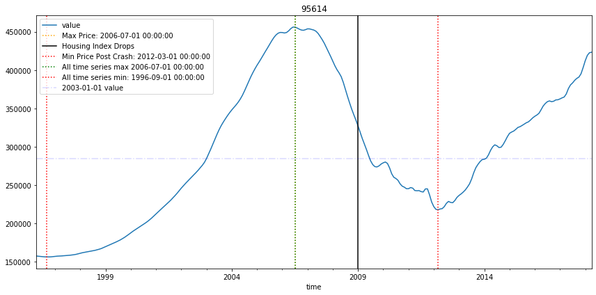


#### Boxplot of zip code


```python
ts_95614.boxplot(column = 'value')
plt.title('95614');

```


### Plot ACF and PACF for ts dataframe


```python
# plot_acf_pacf(ts, figsize=(10,6), lags=15)  # note that ts must only contain values and time as index

plot_acf_pacf(ts_95614_values, figsize=(10,6), lags=15)
```


### Plot seasonal decomposition for ts dataframe


```python
# plot_seasonal_decomp(ts)

plot_seasonal_decomp(ts_95614_values)

# Seasonality does not appear to be a significant factor in this zip code.
```


    (<Figure size 1296x432 with 1 Axes>,
     <matplotlib.axes._subplots.AxesSubplot at 0x1cc2b81390>)


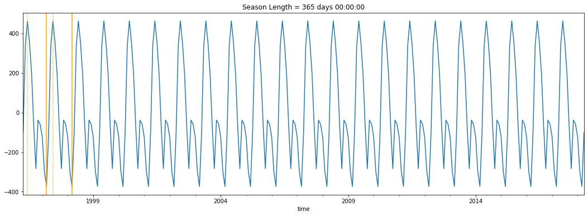


## ARIMA model parameters and optimization

### Generate list of (p,d,q) and (p,d,q,m) values


```python
p_values = [0, 1, 2, 4, 6, 8]
d_values = range(0, 3)
q_values = range(0, 3)
warnings.filterwarnings("ignore")
```

### Run ARIMA model on ts dataframe with list of p,d,q values 


```python
# eval_arima_models(ts, p_values, d_values, q_values)  # don't run this until you have some time, since it take time
# note that ts must only contain values and time as index

# eval_arima_models(ts_95614_values, p_values, d_values, q_values)  # don't run this until you have some time, since it takes time

```

### Generate model fit summary


```python
# model_fit = arima_zipcode(ts, order = None)   # change order = tuple to correspond to the best MSE produced by previous function

# Best ARIMA(8, 0, 2) MSE=1365126.920

model_fit_95614 = arima_zipcode(ts_95614_values, order = (8,0,2))

```

                                  ARMA Model Results                              
    ==============================================================================
    Dep. Variable:                      y   No. Observations:                  265
    Model:                     ARMA(8, 2)   Log Likelihood               -2177.118
    Method:                       css-mle   S.D. of innovations            868.099
    Date:                Tue, 10 Mar 2020   AIC                           4378.236
    Time:                        22:43:49   BIC                           4421.193
    Sample:                             0   HQIC                          4395.495
                                                                                  
    ==============================================================================
                     coef    std err          z      P>|z|      [0.025      0.975]
    ------------------------------------------------------------------------------
    const       2.931e+05   4.14e+04      7.072      0.000    2.12e+05    3.74e+05
    ar.L1.y        1.1742      0.093     12.596      0.000       0.991       1.357
    ar.L2.y        0.1467      0.186      0.789      0.431      -0.218       0.511
    ar.L3.y       -0.3384      0.172     -1.964      0.051      -0.676      -0.001
    ar.L4.y        0.1644      0.129      1.273      0.204      -0.089       0.418
    ar.L5.y       -0.2499      0.104     -2.396      0.017      -0.454      -0.046
    ar.L6.y        0.1048      0.124      0.846      0.398      -0.138       0.348
    ar.L7.y        0.3524      0.155      2.269      0.024       0.048       0.657
    ar.L8.y       -0.3584      0.086     -4.157      0.000      -0.527      -0.189
    ma.L1.y        1.6592      0.066     25.266      0.000       1.530       1.788
    ma.L2.y        0.8897      0.039     22.662      0.000       0.813       0.967
                                        Roots                                    
    =============================================================================
                      Real          Imaginary           Modulus         Frequency
    -----------------------------------------------------------------------------
    AR.1           -1.1067           -0.3953j            1.1752           -0.4454
    AR.2           -1.1067           +0.3953j            1.1752            0.4454
    AR.3           -0.2422           -1.1474j            1.1727           -0.2831
    AR.4           -0.2422           +1.1474j            1.1727            0.2831
    AR.5            0.8271           -0.8631j            1.1954           -0.1284
    AR.6            0.8271           +0.8631j            1.1954            0.1284
    AR.7            1.0135           -0.0314j            1.0140           -0.0049
    AR.8            1.0135           +0.0314j            1.0140            0.0049
    MA.1           -0.9325           -0.5045j            1.0602           -0.4211
    MA.2           -0.9325           +0.5045j            1.0602            0.4211
    -----------------------------------------------------------------------------


## ARIMA modeling results:  predictions and visualization

### Produce forecasts from ARIMA model fit


```python
actual_forecast_95614, std_error_95614, forecast_confint_95614 = forecast(model_fit_95614)

```


```python
actual_forecast, std_error, forecast_confint
```


    (array([423399.70281782, 424467.95084396, 426899.49376637, 430109.81314804,
            433349.40385365, 435714.91243505, 437052.70023733, 437690.51559244,
            438160.93791756, 438743.81431108, 439509.48012876, 440344.31966783,
            440970.36473228, 441237.60378459, 441135.55844216, 440787.26578493,
            440284.24343833, 439712.94201967, 439088.05668545, 438358.44471217,
            437466.90747898, 436388.11014963, 435138.73146106, 433739.13100737]),
     array([  868.09932156,  2608.33642105,  4598.87003156,  6444.25859104,
             8259.58797771,  9998.19396343, 11631.88094395, 13284.55257954,
            15097.74409944, 17046.27381783, 19055.66283677, 21115.46054924,
            23188.80295951, 25238.05820289, 27270.11148018, 29320.15253971,
            31387.79142669, 33462.76953541, 35544.29232516, 37623.17404655,
            39683.92500391, 41721.53498213, 43741.54504473, 45742.5733327 ]),
     array([[421698.25941256, 425101.14622308],
            [419355.70539914, 429580.19628878],
            [417885.87413493, 435913.1133978 ],
            [417479.29840253, 442740.32789355],
            [417160.90889019, 449537.8988171 ],
            [416118.81235628, 455311.01251383],
            [414254.63251473, 459850.76795993],
            [411653.27098581, 463727.76019907],
            [408569.90323486, 467751.97260027],
            [405333.73155753, 472153.89706464],
            [402161.06726715, 476857.89299037],
            [398958.77747434, 481729.86186133],
            [395521.14608704, 486419.58337752],
            [391771.9186672 , 490703.28890198],
            [387687.12208661, 494583.9947977 ],
            [383320.82278587, 498253.70878398],
            [378765.30268777, 501803.18418889],
            [374127.1189073 , 505298.76513204],
            [369422.52387217, 508753.58949874],
            [364618.37859685, 512098.51082749],
            [359687.84370612, 515245.97125184],
            [354615.40420493, 518160.81609433],
            [349406.87854526, 520870.58437686],
            [344085.3347151 , 523392.92729964]]))


### Create dataframe to hold forecast results


```python
# df_forecast = forecast_df(col = 'time', daterange = pd.date_range(start='2018-05-01', end='2020-04-01', freq='MS'), 
#                 actual_forecast=actual_forecast, forecast_confint = forecast_confint)

df_forecast_95614 = forecast_df(actual_forecast_95614, forecast_confint_95614, 
                                col = 'time', daterange = pd.date_range(start='2018-05-01', end='2020-04-01', freq='MS'))
```

### Create new dataframe concatenating historic values and forecast results


```python
# df_new = concat_values_forecast(ts, df_forecast)

df_new_95614 = concat_values_forecast(ts_95614_values, df_forecast_95614)
```


```python
df_new_95614
```


<div>
<style scoped>
    .dataframe tbody tr th:only-of-type {
        vertical-align: middle;
    }

    .dataframe tbody tr th {
        vertical-align: top;
    }

    .dataframe thead th {
        text-align: right;
    }
</style>
<table border="1" class="dataframe">
  <thead>
    <tr style="text-align: right;">
      <th></th>
      <th>value</th>
      <th>forecast</th>
      <th>forecast_lower</th>
      <th>forecast_upper</th>
    </tr>
    <tr>
      <th>time</th>
      <th></th>
      <th></th>
      <th></th>
      <th></th>
    </tr>
  </thead>
  <tbody>
    <tr>
      <td>1996-04-01</td>
      <td>157500.0</td>
      <td>NaN</td>
      <td>NaN</td>
      <td>NaN</td>
    </tr>
    <tr>
      <td>1996-05-01</td>
      <td>157200.0</td>
      <td>NaN</td>
      <td>NaN</td>
      <td>NaN</td>
    </tr>
    <tr>
      <td>1996-06-01</td>
      <td>156900.0</td>
      <td>NaN</td>
      <td>NaN</td>
      <td>NaN</td>
    </tr>
    <tr>
      <td>1996-07-01</td>
      <td>156700.0</td>
      <td>NaN</td>
      <td>NaN</td>
      <td>NaN</td>
    </tr>
    <tr>
      <td>1996-08-01</td>
      <td>156400.0</td>
      <td>NaN</td>
      <td>NaN</td>
      <td>NaN</td>
    </tr>
    <tr>
      <td>1996-09-01</td>
      <td>156300.0</td>
      <td>NaN</td>
      <td>NaN</td>
      <td>NaN</td>
    </tr>
    <tr>
      <td>1996-10-01</td>
      <td>156300.0</td>
      <td>NaN</td>
      <td>NaN</td>
      <td>NaN</td>
    </tr>
    <tr>
      <td>1996-11-01</td>
      <td>156400.0</td>
      <td>NaN</td>
      <td>NaN</td>
      <td>NaN</td>
    </tr>
    <tr>
      <td>1996-12-01</td>
      <td>156700.0</td>
      <td>NaN</td>
      <td>NaN</td>
      <td>NaN</td>
    </tr>
    <tr>
      <td>1997-01-01</td>
      <td>157000.0</td>
      <td>NaN</td>
      <td>NaN</td>
      <td>NaN</td>
    </tr>
    <tr>
      <td>1997-02-01</td>
      <td>157300.0</td>
      <td>NaN</td>
      <td>NaN</td>
      <td>NaN</td>
    </tr>
    <tr>
      <td>1997-03-01</td>
      <td>157400.0</td>
      <td>NaN</td>
      <td>NaN</td>
      <td>NaN</td>
    </tr>
    <tr>
      <td>1997-04-01</td>
      <td>157600.0</td>
      <td>NaN</td>
      <td>NaN</td>
      <td>NaN</td>
    </tr>
    <tr>
      <td>1997-05-01</td>
      <td>157800.0</td>
      <td>NaN</td>
      <td>NaN</td>
      <td>NaN</td>
    </tr>
    <tr>
      <td>1997-06-01</td>
      <td>158000.0</td>
      <td>NaN</td>
      <td>NaN</td>
      <td>NaN</td>
    </tr>
    <tr>
      <td>1997-07-01</td>
      <td>158200.0</td>
      <td>NaN</td>
      <td>NaN</td>
      <td>NaN</td>
    </tr>
    <tr>
      <td>1997-08-01</td>
      <td>158500.0</td>
      <td>NaN</td>
      <td>NaN</td>
      <td>NaN</td>
    </tr>
    <tr>
      <td>1997-09-01</td>
      <td>158800.0</td>
      <td>NaN</td>
      <td>NaN</td>
      <td>NaN</td>
    </tr>
    <tr>
      <td>1997-10-01</td>
      <td>159200.0</td>
      <td>NaN</td>
      <td>NaN</td>
      <td>NaN</td>
    </tr>
    <tr>
      <td>1997-11-01</td>
      <td>159700.0</td>
      <td>NaN</td>
      <td>NaN</td>
      <td>NaN</td>
    </tr>
    <tr>
      <td>1997-12-01</td>
      <td>160400.0</td>
      <td>NaN</td>
      <td>NaN</td>
      <td>NaN</td>
    </tr>
    <tr>
      <td>1998-01-01</td>
      <td>161200.0</td>
      <td>NaN</td>
      <td>NaN</td>
      <td>NaN</td>
    </tr>
    <tr>
      <td>1998-02-01</td>
      <td>161800.0</td>
      <td>NaN</td>
      <td>NaN</td>
      <td>NaN</td>
    </tr>
    <tr>
      <td>1998-03-01</td>
      <td>162300.0</td>
      <td>NaN</td>
      <td>NaN</td>
      <td>NaN</td>
    </tr>
    <tr>
      <td>1998-04-01</td>
      <td>162800.0</td>
      <td>NaN</td>
      <td>NaN</td>
      <td>NaN</td>
    </tr>
    <tr>
      <td>1998-05-01</td>
      <td>163300.0</td>
      <td>NaN</td>
      <td>NaN</td>
      <td>NaN</td>
    </tr>
    <tr>
      <td>1998-06-01</td>
      <td>163800.0</td>
      <td>NaN</td>
      <td>NaN</td>
      <td>NaN</td>
    </tr>
    <tr>
      <td>1998-07-01</td>
      <td>164300.0</td>
      <td>NaN</td>
      <td>NaN</td>
      <td>NaN</td>
    </tr>
    <tr>
      <td>1998-08-01</td>
      <td>164900.0</td>
      <td>NaN</td>
      <td>NaN</td>
      <td>NaN</td>
    </tr>
    <tr>
      <td>1998-09-01</td>
      <td>165600.0</td>
      <td>NaN</td>
      <td>NaN</td>
      <td>NaN</td>
    </tr>
    <tr>
      <td>1998-10-01</td>
      <td>166400.0</td>
      <td>NaN</td>
      <td>NaN</td>
      <td>NaN</td>
    </tr>
    <tr>
      <td>1998-11-01</td>
      <td>167300.0</td>
      <td>NaN</td>
      <td>NaN</td>
      <td>NaN</td>
    </tr>
    <tr>
      <td>1998-12-01</td>
      <td>168500.0</td>
      <td>NaN</td>
      <td>NaN</td>
      <td>NaN</td>
    </tr>
    <tr>
      <td>1999-01-01</td>
      <td>169800.0</td>
      <td>NaN</td>
      <td>NaN</td>
      <td>NaN</td>
    </tr>
    <tr>
      <td>1999-02-01</td>
      <td>171000.0</td>
      <td>NaN</td>
      <td>NaN</td>
      <td>NaN</td>
    </tr>
    <tr>
      <td>1999-03-01</td>
      <td>172100.0</td>
      <td>NaN</td>
      <td>NaN</td>
      <td>NaN</td>
    </tr>
    <tr>
      <td>1999-04-01</td>
      <td>173200.0</td>
      <td>NaN</td>
      <td>NaN</td>
      <td>NaN</td>
    </tr>
    <tr>
      <td>1999-05-01</td>
      <td>174500.0</td>
      <td>NaN</td>
      <td>NaN</td>
      <td>NaN</td>
    </tr>
    <tr>
      <td>1999-06-01</td>
      <td>175800.0</td>
      <td>NaN</td>
      <td>NaN</td>
      <td>NaN</td>
    </tr>
    <tr>
      <td>1999-07-01</td>
      <td>177100.0</td>
      <td>NaN</td>
      <td>NaN</td>
      <td>NaN</td>
    </tr>
    <tr>
      <td>1999-08-01</td>
      <td>178500.0</td>
      <td>NaN</td>
      <td>NaN</td>
      <td>NaN</td>
    </tr>
    <tr>
      <td>1999-09-01</td>
      <td>180100.0</td>
      <td>NaN</td>
      <td>NaN</td>
      <td>NaN</td>
    </tr>
    <tr>
      <td>1999-10-01</td>
      <td>181800.0</td>
      <td>NaN</td>
      <td>NaN</td>
      <td>NaN</td>
    </tr>
    <tr>
      <td>1999-11-01</td>
      <td>183700.0</td>
      <td>NaN</td>
      <td>NaN</td>
      <td>NaN</td>
    </tr>
    <tr>
      <td>1999-12-01</td>
      <td>185700.0</td>
      <td>NaN</td>
      <td>NaN</td>
      <td>NaN</td>
    </tr>
    <tr>
      <td>2000-01-01</td>
      <td>187800.0</td>
      <td>NaN</td>
      <td>NaN</td>
      <td>NaN</td>
    </tr>
    <tr>
      <td>2000-02-01</td>
      <td>189800.0</td>
      <td>NaN</td>
      <td>NaN</td>
      <td>NaN</td>
    </tr>
    <tr>
      <td>2000-03-01</td>
      <td>191600.0</td>
      <td>NaN</td>
      <td>NaN</td>
      <td>NaN</td>
    </tr>
    <tr>
      <td>2000-04-01</td>
      <td>193400.0</td>
      <td>NaN</td>
      <td>NaN</td>
      <td>NaN</td>
    </tr>
    <tr>
      <td>2000-05-01</td>
      <td>195200.0</td>
      <td>NaN</td>
      <td>NaN</td>
      <td>NaN</td>
    </tr>
    <tr>
      <td>2000-06-01</td>
      <td>197000.0</td>
      <td>NaN</td>
      <td>NaN</td>
      <td>NaN</td>
    </tr>
    <tr>
      <td>2000-07-01</td>
      <td>198800.0</td>
      <td>NaN</td>
      <td>NaN</td>
      <td>NaN</td>
    </tr>
    <tr>
      <td>2000-08-01</td>
      <td>200700.0</td>
      <td>NaN</td>
      <td>NaN</td>
      <td>NaN</td>
    </tr>
    <tr>
      <td>2000-09-01</td>
      <td>202700.0</td>
      <td>NaN</td>
      <td>NaN</td>
      <td>NaN</td>
    </tr>
    <tr>
      <td>2000-10-01</td>
      <td>204900.0</td>
      <td>NaN</td>
      <td>NaN</td>
      <td>NaN</td>
    </tr>
    <tr>
      <td>2000-11-01</td>
      <td>207300.0</td>
      <td>NaN</td>
      <td>NaN</td>
      <td>NaN</td>
    </tr>
    <tr>
      <td>2000-12-01</td>
      <td>209900.0</td>
      <td>NaN</td>
      <td>NaN</td>
      <td>NaN</td>
    </tr>
    <tr>
      <td>2001-01-01</td>
      <td>212600.0</td>
      <td>NaN</td>
      <td>NaN</td>
      <td>NaN</td>
    </tr>
    <tr>
      <td>2001-02-01</td>
      <td>215100.0</td>
      <td>NaN</td>
      <td>NaN</td>
      <td>NaN</td>
    </tr>
    <tr>
      <td>2001-03-01</td>
      <td>217600.0</td>
      <td>NaN</td>
      <td>NaN</td>
      <td>NaN</td>
    </tr>
    <tr>
      <td>2001-04-01</td>
      <td>220200.0</td>
      <td>NaN</td>
      <td>NaN</td>
      <td>NaN</td>
    </tr>
    <tr>
      <td>2001-05-01</td>
      <td>222700.0</td>
      <td>NaN</td>
      <td>NaN</td>
      <td>NaN</td>
    </tr>
    <tr>
      <td>2001-06-01</td>
      <td>225200.0</td>
      <td>NaN</td>
      <td>NaN</td>
      <td>NaN</td>
    </tr>
    <tr>
      <td>2001-07-01</td>
      <td>227800.0</td>
      <td>NaN</td>
      <td>NaN</td>
      <td>NaN</td>
    </tr>
    <tr>
      <td>2001-08-01</td>
      <td>230400.0</td>
      <td>NaN</td>
      <td>NaN</td>
      <td>NaN</td>
    </tr>
    <tr>
      <td>2001-09-01</td>
      <td>233300.0</td>
      <td>NaN</td>
      <td>NaN</td>
      <td>NaN</td>
    </tr>
    <tr>
      <td>2001-10-01</td>
      <td>236300.0</td>
      <td>NaN</td>
      <td>NaN</td>
      <td>NaN</td>
    </tr>
    <tr>
      <td>2001-11-01</td>
      <td>239400.0</td>
      <td>NaN</td>
      <td>NaN</td>
      <td>NaN</td>
    </tr>
    <tr>
      <td>2001-12-01</td>
      <td>242800.0</td>
      <td>NaN</td>
      <td>NaN</td>
      <td>NaN</td>
    </tr>
    <tr>
      <td>2002-01-01</td>
      <td>246100.0</td>
      <td>NaN</td>
      <td>NaN</td>
      <td>NaN</td>
    </tr>
    <tr>
      <td>2002-02-01</td>
      <td>249200.0</td>
      <td>NaN</td>
      <td>NaN</td>
      <td>NaN</td>
    </tr>
    <tr>
      <td>2002-03-01</td>
      <td>252200.0</td>
      <td>NaN</td>
      <td>NaN</td>
      <td>NaN</td>
    </tr>
    <tr>
      <td>2002-04-01</td>
      <td>255100.0</td>
      <td>NaN</td>
      <td>NaN</td>
      <td>NaN</td>
    </tr>
    <tr>
      <td>2002-05-01</td>
      <td>257900.0</td>
      <td>NaN</td>
      <td>NaN</td>
      <td>NaN</td>
    </tr>
    <tr>
      <td>2002-06-01</td>
      <td>260700.0</td>
      <td>NaN</td>
      <td>NaN</td>
      <td>NaN</td>
    </tr>
    <tr>
      <td>2002-07-01</td>
      <td>263500.0</td>
      <td>NaN</td>
      <td>NaN</td>
      <td>NaN</td>
    </tr>
    <tr>
      <td>2002-08-01</td>
      <td>266400.0</td>
      <td>NaN</td>
      <td>NaN</td>
      <td>NaN</td>
    </tr>
    <tr>
      <td>2002-09-01</td>
      <td>269400.0</td>
      <td>NaN</td>
      <td>NaN</td>
      <td>NaN</td>
    </tr>
    <tr>
      <td>2002-10-01</td>
      <td>272700.0</td>
      <td>NaN</td>
      <td>NaN</td>
      <td>NaN</td>
    </tr>
    <tr>
      <td>2002-11-01</td>
      <td>275900.0</td>
      <td>NaN</td>
      <td>NaN</td>
      <td>NaN</td>
    </tr>
    <tr>
      <td>2002-12-01</td>
      <td>279700.0</td>
      <td>NaN</td>
      <td>NaN</td>
      <td>NaN</td>
    </tr>
    <tr>
      <td>2003-01-01</td>
      <td>284800.0</td>
      <td>NaN</td>
      <td>NaN</td>
      <td>NaN</td>
    </tr>
    <tr>
      <td>2003-02-01</td>
      <td>290800.0</td>
      <td>NaN</td>
      <td>NaN</td>
      <td>NaN</td>
    </tr>
    <tr>
      <td>2003-03-01</td>
      <td>297000.0</td>
      <td>NaN</td>
      <td>NaN</td>
      <td>NaN</td>
    </tr>
    <tr>
      <td>2003-04-01</td>
      <td>303500.0</td>
      <td>NaN</td>
      <td>NaN</td>
      <td>NaN</td>
    </tr>
    <tr>
      <td>2003-05-01</td>
      <td>310000.0</td>
      <td>NaN</td>
      <td>NaN</td>
      <td>NaN</td>
    </tr>
    <tr>
      <td>2003-06-01</td>
      <td>316500.0</td>
      <td>NaN</td>
      <td>NaN</td>
      <td>NaN</td>
    </tr>
    <tr>
      <td>2003-07-01</td>
      <td>322500.0</td>
      <td>NaN</td>
      <td>NaN</td>
      <td>NaN</td>
    </tr>
    <tr>
      <td>2003-08-01</td>
      <td>327800.0</td>
      <td>NaN</td>
      <td>NaN</td>
      <td>NaN</td>
    </tr>
    <tr>
      <td>2003-09-01</td>
      <td>332400.0</td>
      <td>NaN</td>
      <td>NaN</td>
      <td>NaN</td>
    </tr>
    <tr>
      <td>2003-10-01</td>
      <td>336700.0</td>
      <td>NaN</td>
      <td>NaN</td>
      <td>NaN</td>
    </tr>
    <tr>
      <td>2003-11-01</td>
      <td>340800.0</td>
      <td>NaN</td>
      <td>NaN</td>
      <td>NaN</td>
    </tr>
    <tr>
      <td>2003-12-01</td>
      <td>344600.0</td>
      <td>NaN</td>
      <td>NaN</td>
      <td>NaN</td>
    </tr>
    <tr>
      <td>2004-01-01</td>
      <td>348100.0</td>
      <td>NaN</td>
      <td>NaN</td>
      <td>NaN</td>
    </tr>
    <tr>
      <td>2004-02-01</td>
      <td>351300.0</td>
      <td>NaN</td>
      <td>NaN</td>
      <td>NaN</td>
    </tr>
    <tr>
      <td>2004-03-01</td>
      <td>354500.0</td>
      <td>NaN</td>
      <td>NaN</td>
      <td>NaN</td>
    </tr>
    <tr>
      <td>2004-04-01</td>
      <td>358000.0</td>
      <td>NaN</td>
      <td>NaN</td>
      <td>NaN</td>
    </tr>
    <tr>
      <td>2004-05-01</td>
      <td>362100.0</td>
      <td>NaN</td>
      <td>NaN</td>
      <td>NaN</td>
    </tr>
    <tr>
      <td>2004-06-01</td>
      <td>366900.0</td>
      <td>NaN</td>
      <td>NaN</td>
      <td>NaN</td>
    </tr>
    <tr>
      <td>2004-07-01</td>
      <td>372600.0</td>
      <td>NaN</td>
      <td>NaN</td>
      <td>NaN</td>
    </tr>
    <tr>
      <td>2004-08-01</td>
      <td>378800.0</td>
      <td>NaN</td>
      <td>NaN</td>
      <td>NaN</td>
    </tr>
    <tr>
      <td>2004-09-01</td>
      <td>385100.0</td>
      <td>NaN</td>
      <td>NaN</td>
      <td>NaN</td>
    </tr>
    <tr>
      <td>2004-10-01</td>
      <td>391100.0</td>
      <td>NaN</td>
      <td>NaN</td>
      <td>NaN</td>
    </tr>
    <tr>
      <td>2004-11-01</td>
      <td>396600.0</td>
      <td>NaN</td>
      <td>NaN</td>
      <td>NaN</td>
    </tr>
    <tr>
      <td>2004-12-01</td>
      <td>401700.0</td>
      <td>NaN</td>
      <td>NaN</td>
      <td>NaN</td>
    </tr>
    <tr>
      <td>2005-01-01</td>
      <td>406400.0</td>
      <td>NaN</td>
      <td>NaN</td>
      <td>NaN</td>
    </tr>
    <tr>
      <td>2005-02-01</td>
      <td>410700.0</td>
      <td>NaN</td>
      <td>NaN</td>
      <td>NaN</td>
    </tr>
    <tr>
      <td>2005-03-01</td>
      <td>415200.0</td>
      <td>NaN</td>
      <td>NaN</td>
      <td>NaN</td>
    </tr>
    <tr>
      <td>2005-04-01</td>
      <td>419900.0</td>
      <td>NaN</td>
      <td>NaN</td>
      <td>NaN</td>
    </tr>
    <tr>
      <td>2005-05-01</td>
      <td>424500.0</td>
      <td>NaN</td>
      <td>NaN</td>
      <td>NaN</td>
    </tr>
    <tr>
      <td>2005-06-01</td>
      <td>429000.0</td>
      <td>NaN</td>
      <td>NaN</td>
      <td>NaN</td>
    </tr>
    <tr>
      <td>2005-07-01</td>
      <td>433700.0</td>
      <td>NaN</td>
      <td>NaN</td>
      <td>NaN</td>
    </tr>
    <tr>
      <td>2005-08-01</td>
      <td>438300.0</td>
      <td>NaN</td>
      <td>NaN</td>
      <td>NaN</td>
    </tr>
    <tr>
      <td>2005-09-01</td>
      <td>442500.0</td>
      <td>NaN</td>
      <td>NaN</td>
      <td>NaN</td>
    </tr>
    <tr>
      <td>2005-10-01</td>
      <td>445800.0</td>
      <td>NaN</td>
      <td>NaN</td>
      <td>NaN</td>
    </tr>
    <tr>
      <td>2005-11-01</td>
      <td>448100.0</td>
      <td>NaN</td>
      <td>NaN</td>
      <td>NaN</td>
    </tr>
    <tr>
      <td>2005-12-01</td>
      <td>449100.0</td>
      <td>NaN</td>
      <td>NaN</td>
      <td>NaN</td>
    </tr>
    <tr>
      <td>2006-01-01</td>
      <td>449000.0</td>
      <td>NaN</td>
      <td>NaN</td>
      <td>NaN</td>
    </tr>
    <tr>
      <td>2006-02-01</td>
      <td>448400.0</td>
      <td>NaN</td>
      <td>NaN</td>
      <td>NaN</td>
    </tr>
    <tr>
      <td>2006-03-01</td>
      <td>449000.0</td>
      <td>NaN</td>
      <td>NaN</td>
      <td>NaN</td>
    </tr>
    <tr>
      <td>2006-04-01</td>
      <td>451100.0</td>
      <td>NaN</td>
      <td>NaN</td>
      <td>NaN</td>
    </tr>
    <tr>
      <td>2006-05-01</td>
      <td>454000.0</td>
      <td>NaN</td>
      <td>NaN</td>
      <td>NaN</td>
    </tr>
    <tr>
      <td>2006-06-01</td>
      <td>456000.0</td>
      <td>NaN</td>
      <td>NaN</td>
      <td>NaN</td>
    </tr>
    <tr>
      <td>2006-07-01</td>
      <td>456100.0</td>
      <td>NaN</td>
      <td>NaN</td>
      <td>NaN</td>
    </tr>
    <tr>
      <td>2006-08-01</td>
      <td>455000.0</td>
      <td>NaN</td>
      <td>NaN</td>
      <td>NaN</td>
    </tr>
    <tr>
      <td>2006-09-01</td>
      <td>453500.0</td>
      <td>NaN</td>
      <td>NaN</td>
      <td>NaN</td>
    </tr>
    <tr>
      <td>2006-10-01</td>
      <td>452300.0</td>
      <td>NaN</td>
      <td>NaN</td>
      <td>NaN</td>
    </tr>
    <tr>
      <td>2006-11-01</td>
      <td>451900.0</td>
      <td>NaN</td>
      <td>NaN</td>
      <td>NaN</td>
    </tr>
    <tr>
      <td>2006-12-01</td>
      <td>452700.0</td>
      <td>NaN</td>
      <td>NaN</td>
      <td>NaN</td>
    </tr>
    <tr>
      <td>2007-01-01</td>
      <td>453800.0</td>
      <td>NaN</td>
      <td>NaN</td>
      <td>NaN</td>
    </tr>
    <tr>
      <td>2007-02-01</td>
      <td>453700.0</td>
      <td>NaN</td>
      <td>NaN</td>
      <td>NaN</td>
    </tr>
    <tr>
      <td>2007-03-01</td>
      <td>453000.0</td>
      <td>NaN</td>
      <td>NaN</td>
      <td>NaN</td>
    </tr>
    <tr>
      <td>2007-04-01</td>
      <td>452200.0</td>
      <td>NaN</td>
      <td>NaN</td>
      <td>NaN</td>
    </tr>
    <tr>
      <td>2007-05-01</td>
      <td>450700.0</td>
      <td>NaN</td>
      <td>NaN</td>
      <td>NaN</td>
    </tr>
    <tr>
      <td>2007-06-01</td>
      <td>447900.0</td>
      <td>NaN</td>
      <td>NaN</td>
      <td>NaN</td>
    </tr>
    <tr>
      <td>2007-07-01</td>
      <td>443900.0</td>
      <td>NaN</td>
      <td>NaN</td>
      <td>NaN</td>
    </tr>
    <tr>
      <td>2007-08-01</td>
      <td>439600.0</td>
      <td>NaN</td>
      <td>NaN</td>
      <td>NaN</td>
    </tr>
    <tr>
      <td>2007-09-01</td>
      <td>434800.0</td>
      <td>NaN</td>
      <td>NaN</td>
      <td>NaN</td>
    </tr>
    <tr>
      <td>2007-10-01</td>
      <td>429200.0</td>
      <td>NaN</td>
      <td>NaN</td>
      <td>NaN</td>
    </tr>
    <tr>
      <td>2007-11-01</td>
      <td>423400.0</td>
      <td>NaN</td>
      <td>NaN</td>
      <td>NaN</td>
    </tr>
    <tr>
      <td>2007-12-01</td>
      <td>417700.0</td>
      <td>NaN</td>
      <td>NaN</td>
      <td>NaN</td>
    </tr>
    <tr>
      <td>2008-01-01</td>
      <td>411600.0</td>
      <td>NaN</td>
      <td>NaN</td>
      <td>NaN</td>
    </tr>
    <tr>
      <td>2008-02-01</td>
      <td>405600.0</td>
      <td>NaN</td>
      <td>NaN</td>
      <td>NaN</td>
    </tr>
    <tr>
      <td>2008-03-01</td>
      <td>400500.0</td>
      <td>NaN</td>
      <td>NaN</td>
      <td>NaN</td>
    </tr>
    <tr>
      <td>2008-04-01</td>
      <td>396300.0</td>
      <td>NaN</td>
      <td>NaN</td>
      <td>NaN</td>
    </tr>
    <tr>
      <td>2008-05-01</td>
      <td>391400.0</td>
      <td>NaN</td>
      <td>NaN</td>
      <td>NaN</td>
    </tr>
    <tr>
      <td>2008-06-01</td>
      <td>383900.0</td>
      <td>NaN</td>
      <td>NaN</td>
      <td>NaN</td>
    </tr>
    <tr>
      <td>2008-07-01</td>
      <td>374700.0</td>
      <td>NaN</td>
      <td>NaN</td>
      <td>NaN</td>
    </tr>
    <tr>
      <td>2008-08-01</td>
      <td>365700.0</td>
      <td>NaN</td>
      <td>NaN</td>
      <td>NaN</td>
    </tr>
    <tr>
      <td>2008-09-01</td>
      <td>357100.0</td>
      <td>NaN</td>
      <td>NaN</td>
      <td>NaN</td>
    </tr>
    <tr>
      <td>2008-10-01</td>
      <td>349000.0</td>
      <td>NaN</td>
      <td>NaN</td>
      <td>NaN</td>
    </tr>
    <tr>
      <td>2008-11-01</td>
      <td>341700.0</td>
      <td>NaN</td>
      <td>NaN</td>
      <td>NaN</td>
    </tr>
    <tr>
      <td>2008-12-01</td>
      <td>334700.0</td>
      <td>NaN</td>
      <td>NaN</td>
      <td>NaN</td>
    </tr>
    <tr>
      <td>2009-01-01</td>
      <td>327100.0</td>
      <td>NaN</td>
      <td>NaN</td>
      <td>NaN</td>
    </tr>
    <tr>
      <td>2009-02-01</td>
      <td>319000.0</td>
      <td>NaN</td>
      <td>NaN</td>
      <td>NaN</td>
    </tr>
    <tr>
      <td>2009-03-01</td>
      <td>310900.0</td>
      <td>NaN</td>
      <td>NaN</td>
      <td>NaN</td>
    </tr>
    <tr>
      <td>2009-04-01</td>
      <td>303600.0</td>
      <td>NaN</td>
      <td>NaN</td>
      <td>NaN</td>
    </tr>
    <tr>
      <td>2009-05-01</td>
      <td>296400.0</td>
      <td>NaN</td>
      <td>NaN</td>
      <td>NaN</td>
    </tr>
    <tr>
      <td>2009-06-01</td>
      <td>288600.0</td>
      <td>NaN</td>
      <td>NaN</td>
      <td>NaN</td>
    </tr>
    <tr>
      <td>2009-07-01</td>
      <td>281500.0</td>
      <td>NaN</td>
      <td>NaN</td>
      <td>NaN</td>
    </tr>
    <tr>
      <td>2009-08-01</td>
      <td>276700.0</td>
      <td>NaN</td>
      <td>NaN</td>
      <td>NaN</td>
    </tr>
    <tr>
      <td>2009-09-01</td>
      <td>274100.0</td>
      <td>NaN</td>
      <td>NaN</td>
      <td>NaN</td>
    </tr>
    <tr>
      <td>2009-10-01</td>
      <td>273700.0</td>
      <td>NaN</td>
      <td>NaN</td>
      <td>NaN</td>
    </tr>
    <tr>
      <td>2009-11-01</td>
      <td>275100.0</td>
      <td>NaN</td>
      <td>NaN</td>
      <td>NaN</td>
    </tr>
    <tr>
      <td>2009-12-01</td>
      <td>277500.0</td>
      <td>NaN</td>
      <td>NaN</td>
      <td>NaN</td>
    </tr>
    <tr>
      <td>2010-01-01</td>
      <td>279100.0</td>
      <td>NaN</td>
      <td>NaN</td>
      <td>NaN</td>
    </tr>
    <tr>
      <td>2010-02-01</td>
      <td>280100.0</td>
      <td>NaN</td>
      <td>NaN</td>
      <td>NaN</td>
    </tr>
    <tr>
      <td>2010-03-01</td>
      <td>278200.0</td>
      <td>NaN</td>
      <td>NaN</td>
      <td>NaN</td>
    </tr>
    <tr>
      <td>2010-04-01</td>
      <td>272400.0</td>
      <td>NaN</td>
      <td>NaN</td>
      <td>NaN</td>
    </tr>
    <tr>
      <td>2010-05-01</td>
      <td>264800.0</td>
      <td>NaN</td>
      <td>NaN</td>
      <td>NaN</td>
    </tr>
    <tr>
      <td>2010-06-01</td>
      <td>260200.0</td>
      <td>NaN</td>
      <td>NaN</td>
      <td>NaN</td>
    </tr>
    <tr>
      <td>2010-07-01</td>
      <td>258600.0</td>
      <td>NaN</td>
      <td>NaN</td>
      <td>NaN</td>
    </tr>
    <tr>
      <td>2010-08-01</td>
      <td>256200.0</td>
      <td>NaN</td>
      <td>NaN</td>
      <td>NaN</td>
    </tr>
    <tr>
      <td>2010-09-01</td>
      <td>251600.0</td>
      <td>NaN</td>
      <td>NaN</td>
      <td>NaN</td>
    </tr>
    <tr>
      <td>2010-10-01</td>
      <td>248600.0</td>
      <td>NaN</td>
      <td>NaN</td>
      <td>NaN</td>
    </tr>
    <tr>
      <td>2010-11-01</td>
      <td>247300.0</td>
      <td>NaN</td>
      <td>NaN</td>
      <td>NaN</td>
    </tr>
    <tr>
      <td>2010-12-01</td>
      <td>245300.0</td>
      <td>NaN</td>
      <td>NaN</td>
      <td>NaN</td>
    </tr>
    <tr>
      <td>2011-01-01</td>
      <td>245300.0</td>
      <td>NaN</td>
      <td>NaN</td>
      <td>NaN</td>
    </tr>
    <tr>
      <td>2011-02-01</td>
      <td>246800.0</td>
      <td>NaN</td>
      <td>NaN</td>
      <td>NaN</td>
    </tr>
    <tr>
      <td>2011-03-01</td>
      <td>246000.0</td>
      <td>NaN</td>
      <td>NaN</td>
      <td>NaN</td>
    </tr>
    <tr>
      <td>2011-04-01</td>
      <td>242900.0</td>
      <td>NaN</td>
      <td>NaN</td>
      <td>NaN</td>
    </tr>
    <tr>
      <td>2011-05-01</td>
      <td>242600.0</td>
      <td>NaN</td>
      <td>NaN</td>
      <td>NaN</td>
    </tr>
    <tr>
      <td>2011-06-01</td>
      <td>242800.0</td>
      <td>NaN</td>
      <td>NaN</td>
      <td>NaN</td>
    </tr>
    <tr>
      <td>2011-07-01</td>
      <td>241500.0</td>
      <td>NaN</td>
      <td>NaN</td>
      <td>NaN</td>
    </tr>
    <tr>
      <td>2011-08-01</td>
      <td>241000.0</td>
      <td>NaN</td>
      <td>NaN</td>
      <td>NaN</td>
    </tr>
    <tr>
      <td>2011-09-01</td>
      <td>245000.0</td>
      <td>NaN</td>
      <td>NaN</td>
      <td>NaN</td>
    </tr>
    <tr>
      <td>2011-10-01</td>
      <td>245100.0</td>
      <td>NaN</td>
      <td>NaN</td>
      <td>NaN</td>
    </tr>
    <tr>
      <td>2011-11-01</td>
      <td>237200.0</td>
      <td>NaN</td>
      <td>NaN</td>
      <td>NaN</td>
    </tr>
    <tr>
      <td>2011-12-01</td>
      <td>227900.0</td>
      <td>NaN</td>
      <td>NaN</td>
      <td>NaN</td>
    </tr>
    <tr>
      <td>2012-01-01</td>
      <td>222000.0</td>
      <td>NaN</td>
      <td>NaN</td>
      <td>NaN</td>
    </tr>
    <tr>
      <td>2012-02-01</td>
      <td>218400.0</td>
      <td>NaN</td>
      <td>NaN</td>
      <td>NaN</td>
    </tr>
    <tr>
      <td>2012-03-01</td>
      <td>217800.0</td>
      <td>NaN</td>
      <td>NaN</td>
      <td>NaN</td>
    </tr>
    <tr>
      <td>2012-04-01</td>
      <td>218800.0</td>
      <td>NaN</td>
      <td>NaN</td>
      <td>NaN</td>
    </tr>
    <tr>
      <td>2012-05-01</td>
      <td>219300.0</td>
      <td>NaN</td>
      <td>NaN</td>
      <td>NaN</td>
    </tr>
    <tr>
      <td>2012-06-01</td>
      <td>221900.0</td>
      <td>NaN</td>
      <td>NaN</td>
      <td>NaN</td>
    </tr>
    <tr>
      <td>2012-07-01</td>
      <td>226200.0</td>
      <td>NaN</td>
      <td>NaN</td>
      <td>NaN</td>
    </tr>
    <tr>
      <td>2012-08-01</td>
      <td>228700.0</td>
      <td>NaN</td>
      <td>NaN</td>
      <td>NaN</td>
    </tr>
    <tr>
      <td>2012-09-01</td>
      <td>227400.0</td>
      <td>NaN</td>
      <td>NaN</td>
      <td>NaN</td>
    </tr>
    <tr>
      <td>2012-10-01</td>
      <td>227000.0</td>
      <td>NaN</td>
      <td>NaN</td>
      <td>NaN</td>
    </tr>
    <tr>
      <td>2012-11-01</td>
      <td>229800.0</td>
      <td>NaN</td>
      <td>NaN</td>
      <td>NaN</td>
    </tr>
    <tr>
      <td>2012-12-01</td>
      <td>233900.0</td>
      <td>NaN</td>
      <td>NaN</td>
      <td>NaN</td>
    </tr>
    <tr>
      <td>2013-01-01</td>
      <td>236500.0</td>
      <td>NaN</td>
      <td>NaN</td>
      <td>NaN</td>
    </tr>
    <tr>
      <td>2013-02-01</td>
      <td>238500.0</td>
      <td>NaN</td>
      <td>NaN</td>
      <td>NaN</td>
    </tr>
    <tr>
      <td>2013-03-01</td>
      <td>240900.0</td>
      <td>NaN</td>
      <td>NaN</td>
      <td>NaN</td>
    </tr>
    <tr>
      <td>2013-04-01</td>
      <td>243700.0</td>
      <td>NaN</td>
      <td>NaN</td>
      <td>NaN</td>
    </tr>
    <tr>
      <td>2013-05-01</td>
      <td>247400.0</td>
      <td>NaN</td>
      <td>NaN</td>
      <td>NaN</td>
    </tr>
    <tr>
      <td>2013-06-01</td>
      <td>251600.0</td>
      <td>NaN</td>
      <td>NaN</td>
      <td>NaN</td>
    </tr>
    <tr>
      <td>2013-07-01</td>
      <td>258000.0</td>
      <td>NaN</td>
      <td>NaN</td>
      <td>NaN</td>
    </tr>
    <tr>
      <td>2013-08-01</td>
      <td>266100.0</td>
      <td>NaN</td>
      <td>NaN</td>
      <td>NaN</td>
    </tr>
    <tr>
      <td>2013-09-01</td>
      <td>272700.0</td>
      <td>NaN</td>
      <td>NaN</td>
      <td>NaN</td>
    </tr>
    <tr>
      <td>2013-10-01</td>
      <td>277000.0</td>
      <td>NaN</td>
      <td>NaN</td>
      <td>NaN</td>
    </tr>
    <tr>
      <td>2013-11-01</td>
      <td>280600.0</td>
      <td>NaN</td>
      <td>NaN</td>
      <td>NaN</td>
    </tr>
    <tr>
      <td>2013-12-01</td>
      <td>283200.0</td>
      <td>NaN</td>
      <td>NaN</td>
      <td>NaN</td>
    </tr>
    <tr>
      <td>2014-01-01</td>
      <td>283700.0</td>
      <td>NaN</td>
      <td>NaN</td>
      <td>NaN</td>
    </tr>
    <tr>
      <td>2014-02-01</td>
      <td>285000.0</td>
      <td>NaN</td>
      <td>NaN</td>
      <td>NaN</td>
    </tr>
    <tr>
      <td>2014-03-01</td>
      <td>289400.0</td>
      <td>NaN</td>
      <td>NaN</td>
      <td>NaN</td>
    </tr>
    <tr>
      <td>2014-04-01</td>
      <td>295300.0</td>
      <td>NaN</td>
      <td>NaN</td>
      <td>NaN</td>
    </tr>
    <tr>
      <td>2014-05-01</td>
      <td>299900.0</td>
      <td>NaN</td>
      <td>NaN</td>
      <td>NaN</td>
    </tr>
    <tr>
      <td>2014-06-01</td>
      <td>302500.0</td>
      <td>NaN</td>
      <td>NaN</td>
      <td>NaN</td>
    </tr>
    <tr>
      <td>2014-07-01</td>
      <td>301300.0</td>
      <td>NaN</td>
      <td>NaN</td>
      <td>NaN</td>
    </tr>
    <tr>
      <td>2014-08-01</td>
      <td>299000.0</td>
      <td>NaN</td>
      <td>NaN</td>
      <td>NaN</td>
    </tr>
    <tr>
      <td>2014-09-01</td>
      <td>299400.0</td>
      <td>NaN</td>
      <td>NaN</td>
      <td>NaN</td>
    </tr>
    <tr>
      <td>2014-10-01</td>
      <td>303000.0</td>
      <td>NaN</td>
      <td>NaN</td>
      <td>NaN</td>
    </tr>
    <tr>
      <td>2014-11-01</td>
      <td>307900.0</td>
      <td>NaN</td>
      <td>NaN</td>
      <td>NaN</td>
    </tr>
    <tr>
      <td>2014-12-01</td>
      <td>313200.0</td>
      <td>NaN</td>
      <td>NaN</td>
      <td>NaN</td>
    </tr>
    <tr>
      <td>2015-01-01</td>
      <td>317500.0</td>
      <td>NaN</td>
      <td>NaN</td>
      <td>NaN</td>
    </tr>
    <tr>
      <td>2015-02-01</td>
      <td>319200.0</td>
      <td>NaN</td>
      <td>NaN</td>
      <td>NaN</td>
    </tr>
    <tr>
      <td>2015-03-01</td>
      <td>320500.0</td>
      <td>NaN</td>
      <td>NaN</td>
      <td>NaN</td>
    </tr>
    <tr>
      <td>2015-04-01</td>
      <td>322700.0</td>
      <td>NaN</td>
      <td>NaN</td>
      <td>NaN</td>
    </tr>
    <tr>
      <td>2015-05-01</td>
      <td>325200.0</td>
      <td>NaN</td>
      <td>NaN</td>
      <td>NaN</td>
    </tr>
    <tr>
      <td>2015-06-01</td>
      <td>326200.0</td>
      <td>NaN</td>
      <td>NaN</td>
      <td>NaN</td>
    </tr>
    <tr>
      <td>2015-07-01</td>
      <td>327800.0</td>
      <td>NaN</td>
      <td>NaN</td>
      <td>NaN</td>
    </tr>
    <tr>
      <td>2015-08-01</td>
      <td>329600.0</td>
      <td>NaN</td>
      <td>NaN</td>
      <td>NaN</td>
    </tr>
    <tr>
      <td>2015-09-01</td>
      <td>331300.0</td>
      <td>NaN</td>
      <td>NaN</td>
      <td>NaN</td>
    </tr>
    <tr>
      <td>2015-10-01</td>
      <td>332500.0</td>
      <td>NaN</td>
      <td>NaN</td>
      <td>NaN</td>
    </tr>
    <tr>
      <td>2015-11-01</td>
      <td>334900.0</td>
      <td>NaN</td>
      <td>NaN</td>
      <td>NaN</td>
    </tr>
    <tr>
      <td>2015-12-01</td>
      <td>337600.0</td>
      <td>NaN</td>
      <td>NaN</td>
      <td>NaN</td>
    </tr>
    <tr>
      <td>2016-01-01</td>
      <td>339700.0</td>
      <td>NaN</td>
      <td>NaN</td>
      <td>NaN</td>
    </tr>
    <tr>
      <td>2016-02-01</td>
      <td>341400.0</td>
      <td>NaN</td>
      <td>NaN</td>
      <td>NaN</td>
    </tr>
    <tr>
      <td>2016-03-01</td>
      <td>343600.0</td>
      <td>NaN</td>
      <td>NaN</td>
      <td>NaN</td>
    </tr>
    <tr>
      <td>2016-04-01</td>
      <td>348200.0</td>
      <td>NaN</td>
      <td>NaN</td>
      <td>NaN</td>
    </tr>
    <tr>
      <td>2016-05-01</td>
      <td>353100.0</td>
      <td>NaN</td>
      <td>NaN</td>
      <td>NaN</td>
    </tr>
    <tr>
      <td>2016-06-01</td>
      <td>356400.0</td>
      <td>NaN</td>
      <td>NaN</td>
      <td>NaN</td>
    </tr>
    <tr>
      <td>2016-07-01</td>
      <td>358800.0</td>
      <td>NaN</td>
      <td>NaN</td>
      <td>NaN</td>
    </tr>
    <tr>
      <td>2016-08-01</td>
      <td>359800.0</td>
      <td>NaN</td>
      <td>NaN</td>
      <td>NaN</td>
    </tr>
    <tr>
      <td>2016-09-01</td>
      <td>358800.0</td>
      <td>NaN</td>
      <td>NaN</td>
      <td>NaN</td>
    </tr>
    <tr>
      <td>2016-10-01</td>
      <td>359400.0</td>
      <td>NaN</td>
      <td>NaN</td>
      <td>NaN</td>
    </tr>
    <tr>
      <td>2016-11-01</td>
      <td>361100.0</td>
      <td>NaN</td>
      <td>NaN</td>
      <td>NaN</td>
    </tr>
    <tr>
      <td>2016-12-01</td>
      <td>361300.0</td>
      <td>NaN</td>
      <td>NaN</td>
      <td>NaN</td>
    </tr>
    <tr>
      <td>2017-01-01</td>
      <td>362400.0</td>
      <td>NaN</td>
      <td>NaN</td>
      <td>NaN</td>
    </tr>
    <tr>
      <td>2017-02-01</td>
      <td>363800.0</td>
      <td>NaN</td>
      <td>NaN</td>
      <td>NaN</td>
    </tr>
    <tr>
      <td>2017-03-01</td>
      <td>364900.0</td>
      <td>NaN</td>
      <td>NaN</td>
      <td>NaN</td>
    </tr>
    <tr>
      <td>2017-04-01</td>
      <td>368900.0</td>
      <td>NaN</td>
      <td>NaN</td>
      <td>NaN</td>
    </tr>
    <tr>
      <td>2017-05-01</td>
      <td>375900.0</td>
      <td>NaN</td>
      <td>NaN</td>
      <td>NaN</td>
    </tr>
    <tr>
      <td>2017-06-01</td>
      <td>380700.0</td>
      <td>NaN</td>
      <td>NaN</td>
      <td>NaN</td>
    </tr>
    <tr>
      <td>2017-07-01</td>
      <td>383300.0</td>
      <td>NaN</td>
      <td>NaN</td>
      <td>NaN</td>
    </tr>
    <tr>
      <td>2017-08-01</td>
      <td>386700.0</td>
      <td>NaN</td>
      <td>NaN</td>
      <td>NaN</td>
    </tr>
    <tr>
      <td>2017-09-01</td>
      <td>389200.0</td>
      <td>NaN</td>
      <td>NaN</td>
      <td>NaN</td>
    </tr>
    <tr>
      <td>2017-10-01</td>
      <td>390900.0</td>
      <td>NaN</td>
      <td>NaN</td>
      <td>NaN</td>
    </tr>
    <tr>
      <td>2017-11-01</td>
      <td>395200.0</td>
      <td>NaN</td>
      <td>NaN</td>
      <td>NaN</td>
    </tr>
    <tr>
      <td>2017-12-01</td>
      <td>403300.0</td>
      <td>NaN</td>
      <td>NaN</td>
      <td>NaN</td>
    </tr>
    <tr>
      <td>2018-01-01</td>
      <td>412200.0</td>
      <td>NaN</td>
      <td>NaN</td>
      <td>NaN</td>
    </tr>
    <tr>
      <td>2018-02-01</td>
      <td>419200.0</td>
      <td>NaN</td>
      <td>NaN</td>
      <td>NaN</td>
    </tr>
    <tr>
      <td>2018-03-01</td>
      <td>422600.0</td>
      <td>NaN</td>
      <td>NaN</td>
      <td>NaN</td>
    </tr>
    <tr>
      <td>2018-04-01</td>
      <td>423300.0</td>
      <td>NaN</td>
      <td>NaN</td>
      <td>NaN</td>
    </tr>
    <tr>
      <td>2018-05-01</td>
      <td>NaN</td>
      <td>423399.702818</td>
      <td>421698.259413</td>
      <td>425101.146223</td>
    </tr>
    <tr>
      <td>2018-06-01</td>
      <td>NaN</td>
      <td>424467.950844</td>
      <td>419355.705399</td>
      <td>429580.196289</td>
    </tr>
    <tr>
      <td>2018-07-01</td>
      <td>NaN</td>
      <td>426899.493766</td>
      <td>417885.874135</td>
      <td>435913.113398</td>
    </tr>
    <tr>
      <td>2018-08-01</td>
      <td>NaN</td>
      <td>430109.813148</td>
      <td>417479.298403</td>
      <td>442740.327894</td>
    </tr>
    <tr>
      <td>2018-09-01</td>
      <td>NaN</td>
      <td>433349.403854</td>
      <td>417160.908890</td>
      <td>449537.898817</td>
    </tr>
    <tr>
      <td>2018-10-01</td>
      <td>NaN</td>
      <td>435714.912435</td>
      <td>416118.812356</td>
      <td>455311.012514</td>
    </tr>
    <tr>
      <td>2018-11-01</td>
      <td>NaN</td>
      <td>437052.700237</td>
      <td>414254.632515</td>
      <td>459850.767960</td>
    </tr>
    <tr>
      <td>2018-12-01</td>
      <td>NaN</td>
      <td>437690.515592</td>
      <td>411653.270986</td>
      <td>463727.760199</td>
    </tr>
    <tr>
      <td>2019-01-01</td>
      <td>NaN</td>
      <td>438160.937918</td>
      <td>408569.903235</td>
      <td>467751.972600</td>
    </tr>
    <tr>
      <td>2019-02-01</td>
      <td>NaN</td>
      <td>438743.814311</td>
      <td>405333.731558</td>
      <td>472153.897065</td>
    </tr>
    <tr>
      <td>2019-03-01</td>
      <td>NaN</td>
      <td>439509.480129</td>
      <td>402161.067267</td>
      <td>476857.892990</td>
    </tr>
    <tr>
      <td>2019-04-01</td>
      <td>NaN</td>
      <td>440344.319668</td>
      <td>398958.777474</td>
      <td>481729.861861</td>
    </tr>
    <tr>
      <td>2019-05-01</td>
      <td>NaN</td>
      <td>440970.364732</td>
      <td>395521.146087</td>
      <td>486419.583378</td>
    </tr>
    <tr>
      <td>2019-06-01</td>
      <td>NaN</td>
      <td>441237.603785</td>
      <td>391771.918667</td>
      <td>490703.288902</td>
    </tr>
    <tr>
      <td>2019-07-01</td>
      <td>NaN</td>
      <td>441135.558442</td>
      <td>387687.122087</td>
      <td>494583.994798</td>
    </tr>
    <tr>
      <td>2019-08-01</td>
      <td>NaN</td>
      <td>440787.265785</td>
      <td>383320.822786</td>
      <td>498253.708784</td>
    </tr>
    <tr>
      <td>2019-09-01</td>
      <td>NaN</td>
      <td>440284.243438</td>
      <td>378765.302688</td>
      <td>501803.184189</td>
    </tr>
    <tr>
      <td>2019-10-01</td>
      <td>NaN</td>
      <td>439712.942020</td>
      <td>374127.118907</td>
      <td>505298.765132</td>
    </tr>
    <tr>
      <td>2019-11-01</td>
      <td>NaN</td>
      <td>439088.056685</td>
      <td>369422.523872</td>
      <td>508753.589499</td>
    </tr>
    <tr>
      <td>2019-12-01</td>
      <td>NaN</td>
      <td>438358.444712</td>
      <td>364618.378597</td>
      <td>512098.510827</td>
    </tr>
    <tr>
      <td>2020-01-01</td>
      <td>NaN</td>
      <td>437466.907479</td>
      <td>359687.843706</td>
      <td>515245.971252</td>
    </tr>
    <tr>
      <td>2020-02-01</td>
      <td>NaN</td>
      <td>436388.110150</td>
      <td>354615.404205</td>
      <td>518160.816094</td>
    </tr>
    <tr>
      <td>2020-03-01</td>
      <td>NaN</td>
      <td>435138.731461</td>
      <td>349406.878545</td>
      <td>520870.584377</td>
    </tr>
    <tr>
      <td>2020-04-01</td>
      <td>NaN</td>
      <td>433739.131007</td>
      <td>344085.334715</td>
      <td>523392.927300</td>
    </tr>
  </tbody>
</table>
</div>


### Calculate predicted, lower bound, and upper bound forecasted prices


```python
forecasted_price_95614, forecasted_lower_95614, forecasted_upper_95614 = forecast_values(df_new_95614)
```


```python
forecasted_price_95614, forecasted_lower_95614, forecasted_upper_95614  # predicted, best-case, and worst-case prices in 2020
```


    (433739.1310073696, 344085.3347150978, 523392.9272996414)


```python
last_value_95614 = df_new_95614['value'].loc['2018-04-01']
```


```python
last_value_95614
```


    423300.0


### Plot forecast with confidence intervals


```python
# plot_forecast(df = df_new, figsize=(12,8), geog=None)

plot_forecast(df_new_95614, figsize=(12,8), geog='95614 (Cool)')
```


### Print summary of predicted, worst-case, and best-case scenarios


```python
cool_95614_pred, cool_95614_low, cool_95614_high = pred_best_worst(pred=forecasted_price_95614, low=forecasted_lower_95614, 
                                                                   high=forecasted_upper_95614, last=last_value_95614, date='April 1, 2020')
cool_95614_pred, cool_95614_low, cool_95614_high 
```

    By the model prediction, I would expect to see a 2.466% change in price by April 1, 2020.
    At the lower bound of the confidence interval, I would expect to see a -18.714% change in price by April 1, 2020.
    At the upper bound of the confidence interval, I would expect to see a 23.646% change in price by April 1, 2020.


    (2.466, -18.714, 23.646)


## Zip code 95614 (Cool):  Not a great investment opportunity

By the model prediction, I would expect to see a 2.466% change in price by April 1, 2020.
At the lower bound of the confidence interval, I would expect to see a -18.714% change in price by April 1, 2020.
At the upper bound of the confidence interval, I would expect to see a 23.646% change in price by April 1, 2020.


# SacMetro:  95663 (Penryn) -- Excellent investment opportunity


```python
geog_area = '95663'
```


```python
ts_95663 = df_sac.loc[df_sac['Zip'] == geog_area]  # ts for all of the following functions should have only one zipcode
ts_95663.head()

```


<div>
<style scoped>
    .dataframe tbody tr th:only-of-type {
        vertical-align: middle;
    }

    .dataframe tbody tr th {
        vertical-align: top;
    }

    .dataframe thead th {
        text-align: right;
    }
</style>
<table border="1" class="dataframe">
  <thead>
    <tr style="text-align: right;">
      <th></th>
      <th>Metro</th>
      <th>MetroState</th>
      <th>CountyName</th>
      <th>City</th>
      <th>Zip</th>
      <th>SizeRank</th>
      <th>value</th>
    </tr>
    <tr>
      <th>time</th>
      <th></th>
      <th></th>
      <th></th>
      <th></th>
      <th></th>
      <th></th>
      <th></th>
    </tr>
  </thead>
  <tbody>
    <tr>
      <td>1996-04-01</td>
      <td>Sacramento</td>
      <td>Sacramento CA</td>
      <td>Placer</td>
      <td>Penryn</td>
      <td>95663</td>
      <td>12491</td>
      <td>195400.0</td>
    </tr>
    <tr>
      <td>1996-05-01</td>
      <td>Sacramento</td>
      <td>Sacramento CA</td>
      <td>Placer</td>
      <td>Penryn</td>
      <td>95663</td>
      <td>12491</td>
      <td>195300.0</td>
    </tr>
    <tr>
      <td>1996-06-01</td>
      <td>Sacramento</td>
      <td>Sacramento CA</td>
      <td>Placer</td>
      <td>Penryn</td>
      <td>95663</td>
      <td>12491</td>
      <td>195300.0</td>
    </tr>
    <tr>
      <td>1996-07-01</td>
      <td>Sacramento</td>
      <td>Sacramento CA</td>
      <td>Placer</td>
      <td>Penryn</td>
      <td>95663</td>
      <td>12491</td>
      <td>195300.0</td>
    </tr>
    <tr>
      <td>1996-08-01</td>
      <td>Sacramento</td>
      <td>Sacramento CA</td>
      <td>Placer</td>
      <td>Penryn</td>
      <td>95663</td>
      <td>12491</td>
      <td>195400.0</td>
    </tr>
  </tbody>
</table>
</div>


```python
# ts.head()

ts_95663.tail()
```


<div>
<style scoped>
    .dataframe tbody tr th:only-of-type {
        vertical-align: middle;
    }

    .dataframe tbody tr th {
        vertical-align: top;
    }

    .dataframe thead th {
        text-align: right;
    }
</style>
<table border="1" class="dataframe">
  <thead>
    <tr style="text-align: right;">
      <th></th>
      <th>Metro</th>
      <th>MetroState</th>
      <th>CountyName</th>
      <th>City</th>
      <th>Zip</th>
      <th>SizeRank</th>
      <th>value</th>
    </tr>
    <tr>
      <th>time</th>
      <th></th>
      <th></th>
      <th></th>
      <th></th>
      <th></th>
      <th></th>
      <th></th>
    </tr>
  </thead>
  <tbody>
    <tr>
      <td>2017-12-01</td>
      <td>Sacramento</td>
      <td>Sacramento CA</td>
      <td>Placer</td>
      <td>Penryn</td>
      <td>95663</td>
      <td>12491</td>
      <td>572700.0</td>
    </tr>
    <tr>
      <td>2018-01-01</td>
      <td>Sacramento</td>
      <td>Sacramento CA</td>
      <td>Placer</td>
      <td>Penryn</td>
      <td>95663</td>
      <td>12491</td>
      <td>572900.0</td>
    </tr>
    <tr>
      <td>2018-02-01</td>
      <td>Sacramento</td>
      <td>Sacramento CA</td>
      <td>Placer</td>
      <td>Penryn</td>
      <td>95663</td>
      <td>12491</td>
      <td>577200.0</td>
    </tr>
    <tr>
      <td>2018-03-01</td>
      <td>Sacramento</td>
      <td>Sacramento CA</td>
      <td>Placer</td>
      <td>Penryn</td>
      <td>95663</td>
      <td>12491</td>
      <td>589300.0</td>
    </tr>
    <tr>
      <td>2018-04-01</td>
      <td>Sacramento</td>
      <td>Sacramento CA</td>
      <td>Placer</td>
      <td>Penryn</td>
      <td>95663</td>
      <td>12491</td>
      <td>600700.0</td>
    </tr>
  </tbody>
</table>
</div>


```python
# ts = ts.value

ts_95663_values = ts_95663.value
```


```python
# ts.head()

ts_95663_values.head()
```


    time
    1996-04-01    195400.0
    1996-05-01    195300.0
    1996-06-01    195300.0
    1996-07-01    195300.0
    1996-08-01    195400.0
    Name: value, dtype: float64


```python
ts_95663_values.tail()
```


    time
    2017-12-01    572700.0
    2018-01-01    572900.0
    2018-02-01    577200.0
    2018-03-01    589300.0
    2018-04-01    600700.0
    Name: value, dtype: float64


### Visualizations

#### plot_ts:  Plot zip code(s) of interest over time, with market highs and lows


```python
# fig, ax = plot_ts(df_melt, zipcodes=['95616', '92008', '90035', '90025', '60625', '57701'])  # enter desired zip code(s)

fig, ax = plot_ts_zips(df_melt, zipcodes=['95663'], figsize=(12,6))  # enter desired zip code(s)
```


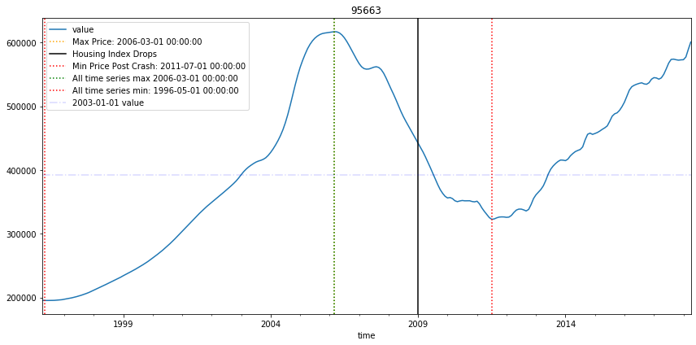


```python
ts_95663.head()
```


<div>
<style scoped>
    .dataframe tbody tr th:only-of-type {
        vertical-align: middle;
    }

    .dataframe tbody tr th {
        vertical-align: top;
    }

    .dataframe thead th {
        text-align: right;
    }
</style>
<table border="1" class="dataframe">
  <thead>
    <tr style="text-align: right;">
      <th></th>
      <th>Metro</th>
      <th>MetroState</th>
      <th>CountyName</th>
      <th>City</th>
      <th>Zip</th>
      <th>SizeRank</th>
      <th>value</th>
    </tr>
    <tr>
      <th>time</th>
      <th></th>
      <th></th>
      <th></th>
      <th></th>
      <th></th>
      <th></th>
      <th></th>
    </tr>
  </thead>
  <tbody>
    <tr>
      <td>1996-04-01</td>
      <td>Sacramento</td>
      <td>Sacramento CA</td>
      <td>Placer</td>
      <td>Penryn</td>
      <td>95663</td>
      <td>12491</td>
      <td>195400.0</td>
    </tr>
    <tr>
      <td>1996-05-01</td>
      <td>Sacramento</td>
      <td>Sacramento CA</td>
      <td>Placer</td>
      <td>Penryn</td>
      <td>95663</td>
      <td>12491</td>
      <td>195300.0</td>
    </tr>
    <tr>
      <td>1996-06-01</td>
      <td>Sacramento</td>
      <td>Sacramento CA</td>
      <td>Placer</td>
      <td>Penryn</td>
      <td>95663</td>
      <td>12491</td>
      <td>195300.0</td>
    </tr>
    <tr>
      <td>1996-07-01</td>
      <td>Sacramento</td>
      <td>Sacramento CA</td>
      <td>Placer</td>
      <td>Penryn</td>
      <td>95663</td>
      <td>12491</td>
      <td>195300.0</td>
    </tr>
    <tr>
      <td>1996-08-01</td>
      <td>Sacramento</td>
      <td>Sacramento CA</td>
      <td>Placer</td>
      <td>Penryn</td>
      <td>95663</td>
      <td>12491</td>
      <td>195400.0</td>
    </tr>
  </tbody>
</table>
</div>


#### Boxplot of zip code


```python
ts_95663.boxplot(column = 'value')
plt.title('95663');
```


### Plot ACF and PACF for ts dataframe


```python
# plot_acf_pacf(ts, figsize=(10,6), lags=15)  # note that ts must only contain values and time as index

plot_acf_pacf(ts_95663_values, figsize=(10,6), lags=15)
```


### Plot seasonal decomposition for ts dataframe


```python
# plot_seasonal_decomp(ts)

plot_seasonal_decomp(ts_95663_values)

# Seasonality does not appear to be a significant factor in this zip code.
```


    (<Figure size 1296x432 with 1 Axes>,
     <matplotlib.axes._subplots.AxesSubplot at 0x1cbf8272e8>)


## ARIMA model parameters and optimization

### Generate list of (p,d,q) and (p,d,q,m) values


```python
p_values = [0, 1, 2, 4, 6, 8]
d_values = range(0, 3)
q_values = range(0, 3)
warnings.filterwarnings("ignore")
```

### Run ARIMA model on ts dataframe with list of p,d,q values 


```python
# eval_arima_models(ts, p_values, d_values, q_values)  # don't run this until you have some time, since it take time
# note that ts must only contain values and time as index

# eval_arima_models(ts_95663_values, p_values, d_values, q_values)  # don't run this until you have some time, since it takes time

```

### Generate model fit summary


```python
# model_fit = arima_zipcode(ts, order = None)   # change order = tuple to correspond to the best MSE produced by previous function

# Best ARIMA(6, 1, 1) MSE=4616814.652

model_fit_95663 = arima_zipcode(ts_95663_values, order = (6, 1, 1))

```

                                 ARIMA Model Results                              
    ==============================================================================
    Dep. Variable:                    D.y   No. Observations:                  264
    Model:                 ARIMA(6, 1, 1)   Log Likelihood               -2259.231
    Method:                       css-mle   S.D. of innovations           1250.189
    Date:                Tue, 10 Mar 2020   AIC                           4536.461
    Time:                        22:45:55   BIC                           4568.645
    Sample:                             1   HQIC                          4549.393
                                                                                  
    ==============================================================================
                     coef    std err          z      P>|z|      [0.025      0.975]
    ------------------------------------------------------------------------------
    const       1535.2274   1631.034      0.941      0.347   -1661.541    4731.996
    ar.L1.D.y      1.0556      0.095     11.060      0.000       0.869       1.243
    ar.L2.D.y     -0.2835      0.148     -1.915      0.057      -0.574       0.007
    ar.L3.D.y     -0.1497      0.117     -1.281      0.201      -0.379       0.079
    ar.L4.D.y      0.4930      0.090      5.466      0.000       0.316       0.670
    ar.L5.D.y     -0.4885      0.089     -5.495      0.000      -0.663      -0.314
    ar.L6.D.y      0.3005      0.064      4.696      0.000       0.175       0.426
    ma.L1.D.y      0.6481      0.084      7.736      0.000       0.484       0.812
                                        Roots                                    
    =============================================================================
                      Real          Imaginary           Modulus         Frequency
    -----------------------------------------------------------------------------
    AR.1           -1.1310           -0.0000j            1.1310           -0.5000
    AR.2           -0.1004           -1.2731j            1.2771           -0.2625
    AR.3           -0.1004           +1.2731j            1.2771            0.2625
    AR.4            1.0494           -0.0000j            1.0494           -0.0000
    AR.5            0.9541           -0.8994j            1.3112           -0.1203
    AR.6            0.9541           +0.8994j            1.3112            0.1203
    MA.1           -1.5430           +0.0000j            1.5430            0.5000
    -----------------------------------------------------------------------------


## ARIMA modeling results:  predictions and visualization

### Produce forecasts from ARIMA model fit


```python
actual_forecast_95663, std_error_95663, forecast_confint_95663 = forecast(model_fit_95663)

```


```python
actual_forecast_95663, std_error_95663, forecast_confint_95663
```


    (array([605988.242167  , 608811.02055993, 612621.38391769, 616164.56350552,
            619187.1188419 , 623147.82257389, 628141.40601381, 632682.30194886,
            636482.63909043, 640111.54483644, 643731.72973429, 647056.29378989,
            650263.31131551, 653572.60295866, 656924.37641323, 660116.59843115,
            663196.88639898, 666216.91698445, 669164.62642536, 672001.14905821,
            674785.35045957, 677533.70589997, 680235.85125874, 682869.62048371]),
     array([ 1250.18933566,  3603.90284082,  6387.7235785 ,  9100.58992495,
            11804.25650029, 14502.2851819 , 17161.54876918, 19796.21632205,
            22521.17046366, 25357.32797404, 28273.87679741, 31230.77647125,
            34226.32789499, 37238.86285823, 40256.78691238, 43275.13690554,
            46303.61976434, 49337.60199451, 52374.15955601, 55407.85121063,
            58438.18091914, 61459.32302095, 64469.40828943, 67465.98609582]),
     array([[603537.91609525, 608438.56823876],
            [601747.50078814, 615874.54033172],
            [600101.67576063, 625141.09207475],
            [598327.73501454, 634001.39199649],
            [596051.20123707, 642323.03644674],
            [594723.86592383, 651571.77922395],
            [594505.38850729, 661777.42352033],
            [593882.43092748, 671482.17297024],
            [592341.95609197, 680623.32208889],
            [590412.09526316, 689810.99440973],
            [588315.94950805, 699147.50996053],
            [585845.09669703, 708267.49088276],
            [583180.94131827, 717345.68131276],
            [580585.7729313 , 726559.43298601],
            [578022.52393167, 735826.22889479],
            [575298.88867026, 744934.30819205],
            [572443.45930705, 753950.31349092],
            [569516.99399163, 762916.83997726],
            [566513.15997502, 771816.09287569],
            [563403.75622462, 780598.54189179],
            [560248.62053601, 789322.08038313],
            [557075.6462647 , 797991.76553524],
            [553878.13290686, 806593.56961063],
            [550638.71755442, 815100.523413  ]]))


### Create dataframe to hold forecast results


```python
# df_forecast = forecast_df(col = 'time', daterange = pd.date_range(start='2018-05-01', end='2020-04-01', freq='MS'), 
#                 actual_forecast=actual_forecast, forecast_confint = forecast_confint)

df_forecast_95663 = forecast_df(actual_forecast_95663, forecast_confint_95663, col = 'time', daterange = pd.date_range(start='2018-05-01', end='2020-04-01', freq='MS'))

```

### Create new dataframe concatenating historic values and forecast results


```python
# df_new = concat_values_forecast(ts, df_forecast)

df_new_95663 = concat_values_forecast(ts_95663_values, df_forecast_95663)
```


```python
df_new_95663
```


<div>
<style scoped>
    .dataframe tbody tr th:only-of-type {
        vertical-align: middle;
    }

    .dataframe tbody tr th {
        vertical-align: top;
    }

    .dataframe thead th {
        text-align: right;
    }
</style>
<table border="1" class="dataframe">
  <thead>
    <tr style="text-align: right;">
      <th></th>
      <th>value</th>
      <th>forecast</th>
      <th>forecast_lower</th>
      <th>forecast_upper</th>
    </tr>
    <tr>
      <th>time</th>
      <th></th>
      <th></th>
      <th></th>
      <th></th>
    </tr>
  </thead>
  <tbody>
    <tr>
      <td>1996-04-01</td>
      <td>195400.0</td>
      <td>NaN</td>
      <td>NaN</td>
      <td>NaN</td>
    </tr>
    <tr>
      <td>1996-05-01</td>
      <td>195300.0</td>
      <td>NaN</td>
      <td>NaN</td>
      <td>NaN</td>
    </tr>
    <tr>
      <td>1996-06-01</td>
      <td>195300.0</td>
      <td>NaN</td>
      <td>NaN</td>
      <td>NaN</td>
    </tr>
    <tr>
      <td>1996-07-01</td>
      <td>195300.0</td>
      <td>NaN</td>
      <td>NaN</td>
      <td>NaN</td>
    </tr>
    <tr>
      <td>1996-08-01</td>
      <td>195400.0</td>
      <td>NaN</td>
      <td>NaN</td>
      <td>NaN</td>
    </tr>
    <tr>
      <td>1996-09-01</td>
      <td>195500.0</td>
      <td>NaN</td>
      <td>NaN</td>
      <td>NaN</td>
    </tr>
    <tr>
      <td>1996-10-01</td>
      <td>195800.0</td>
      <td>NaN</td>
      <td>NaN</td>
      <td>NaN</td>
    </tr>
    <tr>
      <td>1996-11-01</td>
      <td>196000.0</td>
      <td>NaN</td>
      <td>NaN</td>
      <td>NaN</td>
    </tr>
    <tr>
      <td>1996-12-01</td>
      <td>196500.0</td>
      <td>NaN</td>
      <td>NaN</td>
      <td>NaN</td>
    </tr>
    <tr>
      <td>1997-01-01</td>
      <td>197200.0</td>
      <td>NaN</td>
      <td>NaN</td>
      <td>NaN</td>
    </tr>
    <tr>
      <td>1997-02-01</td>
      <td>198000.0</td>
      <td>NaN</td>
      <td>NaN</td>
      <td>NaN</td>
    </tr>
    <tr>
      <td>1997-03-01</td>
      <td>198600.0</td>
      <td>NaN</td>
      <td>NaN</td>
      <td>NaN</td>
    </tr>
    <tr>
      <td>1997-04-01</td>
      <td>199400.0</td>
      <td>NaN</td>
      <td>NaN</td>
      <td>NaN</td>
    </tr>
    <tr>
      <td>1997-05-01</td>
      <td>200300.0</td>
      <td>NaN</td>
      <td>NaN</td>
      <td>NaN</td>
    </tr>
    <tr>
      <td>1997-06-01</td>
      <td>201300.0</td>
      <td>NaN</td>
      <td>NaN</td>
      <td>NaN</td>
    </tr>
    <tr>
      <td>1997-07-01</td>
      <td>202400.0</td>
      <td>NaN</td>
      <td>NaN</td>
      <td>NaN</td>
    </tr>
    <tr>
      <td>1997-08-01</td>
      <td>203600.0</td>
      <td>NaN</td>
      <td>NaN</td>
      <td>NaN</td>
    </tr>
    <tr>
      <td>1997-09-01</td>
      <td>204900.0</td>
      <td>NaN</td>
      <td>NaN</td>
      <td>NaN</td>
    </tr>
    <tr>
      <td>1997-10-01</td>
      <td>206300.0</td>
      <td>NaN</td>
      <td>NaN</td>
      <td>NaN</td>
    </tr>
    <tr>
      <td>1997-11-01</td>
      <td>207800.0</td>
      <td>NaN</td>
      <td>NaN</td>
      <td>NaN</td>
    </tr>
    <tr>
      <td>1997-12-01</td>
      <td>209600.0</td>
      <td>NaN</td>
      <td>NaN</td>
      <td>NaN</td>
    </tr>
    <tr>
      <td>1998-01-01</td>
      <td>211400.0</td>
      <td>NaN</td>
      <td>NaN</td>
      <td>NaN</td>
    </tr>
    <tr>
      <td>1998-02-01</td>
      <td>213300.0</td>
      <td>NaN</td>
      <td>NaN</td>
      <td>NaN</td>
    </tr>
    <tr>
      <td>1998-03-01</td>
      <td>215000.0</td>
      <td>NaN</td>
      <td>NaN</td>
      <td>NaN</td>
    </tr>
    <tr>
      <td>1998-04-01</td>
      <td>216800.0</td>
      <td>NaN</td>
      <td>NaN</td>
      <td>NaN</td>
    </tr>
    <tr>
      <td>1998-05-01</td>
      <td>218600.0</td>
      <td>NaN</td>
      <td>NaN</td>
      <td>NaN</td>
    </tr>
    <tr>
      <td>1998-06-01</td>
      <td>220500.0</td>
      <td>NaN</td>
      <td>NaN</td>
      <td>NaN</td>
    </tr>
    <tr>
      <td>1998-07-01</td>
      <td>222400.0</td>
      <td>NaN</td>
      <td>NaN</td>
      <td>NaN</td>
    </tr>
    <tr>
      <td>1998-08-01</td>
      <td>224300.0</td>
      <td>NaN</td>
      <td>NaN</td>
      <td>NaN</td>
    </tr>
    <tr>
      <td>1998-09-01</td>
      <td>226100.0</td>
      <td>NaN</td>
      <td>NaN</td>
      <td>NaN</td>
    </tr>
    <tr>
      <td>1998-10-01</td>
      <td>228000.0</td>
      <td>NaN</td>
      <td>NaN</td>
      <td>NaN</td>
    </tr>
    <tr>
      <td>1998-11-01</td>
      <td>229900.0</td>
      <td>NaN</td>
      <td>NaN</td>
      <td>NaN</td>
    </tr>
    <tr>
      <td>1998-12-01</td>
      <td>231900.0</td>
      <td>NaN</td>
      <td>NaN</td>
      <td>NaN</td>
    </tr>
    <tr>
      <td>1999-01-01</td>
      <td>234100.0</td>
      <td>NaN</td>
      <td>NaN</td>
      <td>NaN</td>
    </tr>
    <tr>
      <td>1999-02-01</td>
      <td>236100.0</td>
      <td>NaN</td>
      <td>NaN</td>
      <td>NaN</td>
    </tr>
    <tr>
      <td>1999-03-01</td>
      <td>238100.0</td>
      <td>NaN</td>
      <td>NaN</td>
      <td>NaN</td>
    </tr>
    <tr>
      <td>1999-04-01</td>
      <td>240200.0</td>
      <td>NaN</td>
      <td>NaN</td>
      <td>NaN</td>
    </tr>
    <tr>
      <td>1999-05-01</td>
      <td>242300.0</td>
      <td>NaN</td>
      <td>NaN</td>
      <td>NaN</td>
    </tr>
    <tr>
      <td>1999-06-01</td>
      <td>244400.0</td>
      <td>NaN</td>
      <td>NaN</td>
      <td>NaN</td>
    </tr>
    <tr>
      <td>1999-07-01</td>
      <td>246700.0</td>
      <td>NaN</td>
      <td>NaN</td>
      <td>NaN</td>
    </tr>
    <tr>
      <td>1999-08-01</td>
      <td>249000.0</td>
      <td>NaN</td>
      <td>NaN</td>
      <td>NaN</td>
    </tr>
    <tr>
      <td>1999-09-01</td>
      <td>251300.0</td>
      <td>NaN</td>
      <td>NaN</td>
      <td>NaN</td>
    </tr>
    <tr>
      <td>1999-10-01</td>
      <td>253800.0</td>
      <td>NaN</td>
      <td>NaN</td>
      <td>NaN</td>
    </tr>
    <tr>
      <td>1999-11-01</td>
      <td>256300.0</td>
      <td>NaN</td>
      <td>NaN</td>
      <td>NaN</td>
    </tr>
    <tr>
      <td>1999-12-01</td>
      <td>259100.0</td>
      <td>NaN</td>
      <td>NaN</td>
      <td>NaN</td>
    </tr>
    <tr>
      <td>2000-01-01</td>
      <td>262000.0</td>
      <td>NaN</td>
      <td>NaN</td>
      <td>NaN</td>
    </tr>
    <tr>
      <td>2000-02-01</td>
      <td>264900.0</td>
      <td>NaN</td>
      <td>NaN</td>
      <td>NaN</td>
    </tr>
    <tr>
      <td>2000-03-01</td>
      <td>267800.0</td>
      <td>NaN</td>
      <td>NaN</td>
      <td>NaN</td>
    </tr>
    <tr>
      <td>2000-04-01</td>
      <td>270900.0</td>
      <td>NaN</td>
      <td>NaN</td>
      <td>NaN</td>
    </tr>
    <tr>
      <td>2000-05-01</td>
      <td>274000.0</td>
      <td>NaN</td>
      <td>NaN</td>
      <td>NaN</td>
    </tr>
    <tr>
      <td>2000-06-01</td>
      <td>277400.0</td>
      <td>NaN</td>
      <td>NaN</td>
      <td>NaN</td>
    </tr>
    <tr>
      <td>2000-07-01</td>
      <td>280800.0</td>
      <td>NaN</td>
      <td>NaN</td>
      <td>NaN</td>
    </tr>
    <tr>
      <td>2000-08-01</td>
      <td>284300.0</td>
      <td>NaN</td>
      <td>NaN</td>
      <td>NaN</td>
    </tr>
    <tr>
      <td>2000-09-01</td>
      <td>288000.0</td>
      <td>NaN</td>
      <td>NaN</td>
      <td>NaN</td>
    </tr>
    <tr>
      <td>2000-10-01</td>
      <td>291800.0</td>
      <td>NaN</td>
      <td>NaN</td>
      <td>NaN</td>
    </tr>
    <tr>
      <td>2000-11-01</td>
      <td>295700.0</td>
      <td>NaN</td>
      <td>NaN</td>
      <td>NaN</td>
    </tr>
    <tr>
      <td>2000-12-01</td>
      <td>299800.0</td>
      <td>NaN</td>
      <td>NaN</td>
      <td>NaN</td>
    </tr>
    <tr>
      <td>2001-01-01</td>
      <td>303800.0</td>
      <td>NaN</td>
      <td>NaN</td>
      <td>NaN</td>
    </tr>
    <tr>
      <td>2001-02-01</td>
      <td>307800.0</td>
      <td>NaN</td>
      <td>NaN</td>
      <td>NaN</td>
    </tr>
    <tr>
      <td>2001-03-01</td>
      <td>311800.0</td>
      <td>NaN</td>
      <td>NaN</td>
      <td>NaN</td>
    </tr>
    <tr>
      <td>2001-04-01</td>
      <td>315900.0</td>
      <td>NaN</td>
      <td>NaN</td>
      <td>NaN</td>
    </tr>
    <tr>
      <td>2001-05-01</td>
      <td>319900.0</td>
      <td>NaN</td>
      <td>NaN</td>
      <td>NaN</td>
    </tr>
    <tr>
      <td>2001-06-01</td>
      <td>324000.0</td>
      <td>NaN</td>
      <td>NaN</td>
      <td>NaN</td>
    </tr>
    <tr>
      <td>2001-07-01</td>
      <td>328000.0</td>
      <td>NaN</td>
      <td>NaN</td>
      <td>NaN</td>
    </tr>
    <tr>
      <td>2001-08-01</td>
      <td>331800.0</td>
      <td>NaN</td>
      <td>NaN</td>
      <td>NaN</td>
    </tr>
    <tr>
      <td>2001-09-01</td>
      <td>335500.0</td>
      <td>NaN</td>
      <td>NaN</td>
      <td>NaN</td>
    </tr>
    <tr>
      <td>2001-10-01</td>
      <td>339100.0</td>
      <td>NaN</td>
      <td>NaN</td>
      <td>NaN</td>
    </tr>
    <tr>
      <td>2001-11-01</td>
      <td>342700.0</td>
      <td>NaN</td>
      <td>NaN</td>
      <td>NaN</td>
    </tr>
    <tr>
      <td>2001-12-01</td>
      <td>346000.0</td>
      <td>NaN</td>
      <td>NaN</td>
      <td>NaN</td>
    </tr>
    <tr>
      <td>2002-01-01</td>
      <td>349200.0</td>
      <td>NaN</td>
      <td>NaN</td>
      <td>NaN</td>
    </tr>
    <tr>
      <td>2002-02-01</td>
      <td>352400.0</td>
      <td>NaN</td>
      <td>NaN</td>
      <td>NaN</td>
    </tr>
    <tr>
      <td>2002-03-01</td>
      <td>355500.0</td>
      <td>NaN</td>
      <td>NaN</td>
      <td>NaN</td>
    </tr>
    <tr>
      <td>2002-04-01</td>
      <td>358700.0</td>
      <td>NaN</td>
      <td>NaN</td>
      <td>NaN</td>
    </tr>
    <tr>
      <td>2002-05-01</td>
      <td>362000.0</td>
      <td>NaN</td>
      <td>NaN</td>
      <td>NaN</td>
    </tr>
    <tr>
      <td>2002-06-01</td>
      <td>365300.0</td>
      <td>NaN</td>
      <td>NaN</td>
      <td>NaN</td>
    </tr>
    <tr>
      <td>2002-07-01</td>
      <td>368600.0</td>
      <td>NaN</td>
      <td>NaN</td>
      <td>NaN</td>
    </tr>
    <tr>
      <td>2002-08-01</td>
      <td>372000.0</td>
      <td>NaN</td>
      <td>NaN</td>
      <td>NaN</td>
    </tr>
    <tr>
      <td>2002-09-01</td>
      <td>375400.0</td>
      <td>NaN</td>
      <td>NaN</td>
      <td>NaN</td>
    </tr>
    <tr>
      <td>2002-10-01</td>
      <td>379000.0</td>
      <td>NaN</td>
      <td>NaN</td>
      <td>NaN</td>
    </tr>
    <tr>
      <td>2002-11-01</td>
      <td>382900.0</td>
      <td>NaN</td>
      <td>NaN</td>
      <td>NaN</td>
    </tr>
    <tr>
      <td>2002-12-01</td>
      <td>387500.0</td>
      <td>NaN</td>
      <td>NaN</td>
      <td>NaN</td>
    </tr>
    <tr>
      <td>2003-01-01</td>
      <td>392500.0</td>
      <td>NaN</td>
      <td>NaN</td>
      <td>NaN</td>
    </tr>
    <tr>
      <td>2003-02-01</td>
      <td>397200.0</td>
      <td>NaN</td>
      <td>NaN</td>
      <td>NaN</td>
    </tr>
    <tr>
      <td>2003-03-01</td>
      <td>401200.0</td>
      <td>NaN</td>
      <td>NaN</td>
      <td>NaN</td>
    </tr>
    <tr>
      <td>2003-04-01</td>
      <td>404600.0</td>
      <td>NaN</td>
      <td>NaN</td>
      <td>NaN</td>
    </tr>
    <tr>
      <td>2003-05-01</td>
      <td>407400.0</td>
      <td>NaN</td>
      <td>NaN</td>
      <td>NaN</td>
    </tr>
    <tr>
      <td>2003-06-01</td>
      <td>410000.0</td>
      <td>NaN</td>
      <td>NaN</td>
      <td>NaN</td>
    </tr>
    <tr>
      <td>2003-07-01</td>
      <td>412300.0</td>
      <td>NaN</td>
      <td>NaN</td>
      <td>NaN</td>
    </tr>
    <tr>
      <td>2003-08-01</td>
      <td>413900.0</td>
      <td>NaN</td>
      <td>NaN</td>
      <td>NaN</td>
    </tr>
    <tr>
      <td>2003-09-01</td>
      <td>415100.0</td>
      <td>NaN</td>
      <td>NaN</td>
      <td>NaN</td>
    </tr>
    <tr>
      <td>2003-10-01</td>
      <td>416700.0</td>
      <td>NaN</td>
      <td>NaN</td>
      <td>NaN</td>
    </tr>
    <tr>
      <td>2003-11-01</td>
      <td>419100.0</td>
      <td>NaN</td>
      <td>NaN</td>
      <td>NaN</td>
    </tr>
    <tr>
      <td>2003-12-01</td>
      <td>422800.0</td>
      <td>NaN</td>
      <td>NaN</td>
      <td>NaN</td>
    </tr>
    <tr>
      <td>2004-01-01</td>
      <td>427500.0</td>
      <td>NaN</td>
      <td>NaN</td>
      <td>NaN</td>
    </tr>
    <tr>
      <td>2004-02-01</td>
      <td>433000.0</td>
      <td>NaN</td>
      <td>NaN</td>
      <td>NaN</td>
    </tr>
    <tr>
      <td>2004-03-01</td>
      <td>439200.0</td>
      <td>NaN</td>
      <td>NaN</td>
      <td>NaN</td>
    </tr>
    <tr>
      <td>2004-04-01</td>
      <td>446100.0</td>
      <td>NaN</td>
      <td>NaN</td>
      <td>NaN</td>
    </tr>
    <tr>
      <td>2004-05-01</td>
      <td>453900.0</td>
      <td>NaN</td>
      <td>NaN</td>
      <td>NaN</td>
    </tr>
    <tr>
      <td>2004-06-01</td>
      <td>463100.0</td>
      <td>NaN</td>
      <td>NaN</td>
      <td>NaN</td>
    </tr>
    <tr>
      <td>2004-07-01</td>
      <td>474200.0</td>
      <td>NaN</td>
      <td>NaN</td>
      <td>NaN</td>
    </tr>
    <tr>
      <td>2004-08-01</td>
      <td>487200.0</td>
      <td>NaN</td>
      <td>NaN</td>
      <td>NaN</td>
    </tr>
    <tr>
      <td>2004-09-01</td>
      <td>502000.0</td>
      <td>NaN</td>
      <td>NaN</td>
      <td>NaN</td>
    </tr>
    <tr>
      <td>2004-10-01</td>
      <td>517800.0</td>
      <td>NaN</td>
      <td>NaN</td>
      <td>NaN</td>
    </tr>
    <tr>
      <td>2004-11-01</td>
      <td>533400.0</td>
      <td>NaN</td>
      <td>NaN</td>
      <td>NaN</td>
    </tr>
    <tr>
      <td>2004-12-01</td>
      <td>548000.0</td>
      <td>NaN</td>
      <td>NaN</td>
      <td>NaN</td>
    </tr>
    <tr>
      <td>2005-01-01</td>
      <td>560900.0</td>
      <td>NaN</td>
      <td>NaN</td>
      <td>NaN</td>
    </tr>
    <tr>
      <td>2005-02-01</td>
      <td>571700.0</td>
      <td>NaN</td>
      <td>NaN</td>
      <td>NaN</td>
    </tr>
    <tr>
      <td>2005-03-01</td>
      <td>581300.0</td>
      <td>NaN</td>
      <td>NaN</td>
      <td>NaN</td>
    </tr>
    <tr>
      <td>2005-04-01</td>
      <td>590000.0</td>
      <td>NaN</td>
      <td>NaN</td>
      <td>NaN</td>
    </tr>
    <tr>
      <td>2005-05-01</td>
      <td>596900.0</td>
      <td>NaN</td>
      <td>NaN</td>
      <td>NaN</td>
    </tr>
    <tr>
      <td>2005-06-01</td>
      <td>602400.0</td>
      <td>NaN</td>
      <td>NaN</td>
      <td>NaN</td>
    </tr>
    <tr>
      <td>2005-07-01</td>
      <td>606700.0</td>
      <td>NaN</td>
      <td>NaN</td>
      <td>NaN</td>
    </tr>
    <tr>
      <td>2005-08-01</td>
      <td>609900.0</td>
      <td>NaN</td>
      <td>NaN</td>
      <td>NaN</td>
    </tr>
    <tr>
      <td>2005-09-01</td>
      <td>612300.0</td>
      <td>NaN</td>
      <td>NaN</td>
      <td>NaN</td>
    </tr>
    <tr>
      <td>2005-10-01</td>
      <td>613900.0</td>
      <td>NaN</td>
      <td>NaN</td>
      <td>NaN</td>
    </tr>
    <tr>
      <td>2005-11-01</td>
      <td>614700.0</td>
      <td>NaN</td>
      <td>NaN</td>
      <td>NaN</td>
    </tr>
    <tr>
      <td>2005-12-01</td>
      <td>615300.0</td>
      <td>NaN</td>
      <td>NaN</td>
      <td>NaN</td>
    </tr>
    <tr>
      <td>2006-01-01</td>
      <td>615900.0</td>
      <td>NaN</td>
      <td>NaN</td>
      <td>NaN</td>
    </tr>
    <tr>
      <td>2006-02-01</td>
      <td>616400.0</td>
      <td>NaN</td>
      <td>NaN</td>
      <td>NaN</td>
    </tr>
    <tr>
      <td>2006-03-01</td>
      <td>616900.0</td>
      <td>NaN</td>
      <td>NaN</td>
      <td>NaN</td>
    </tr>
    <tr>
      <td>2006-04-01</td>
      <td>616600.0</td>
      <td>NaN</td>
      <td>NaN</td>
      <td>NaN</td>
    </tr>
    <tr>
      <td>2006-05-01</td>
      <td>614900.0</td>
      <td>NaN</td>
      <td>NaN</td>
      <td>NaN</td>
    </tr>
    <tr>
      <td>2006-06-01</td>
      <td>611800.0</td>
      <td>NaN</td>
      <td>NaN</td>
      <td>NaN</td>
    </tr>
    <tr>
      <td>2006-07-01</td>
      <td>607300.0</td>
      <td>NaN</td>
      <td>NaN</td>
      <td>NaN</td>
    </tr>
    <tr>
      <td>2006-08-01</td>
      <td>601500.0</td>
      <td>NaN</td>
      <td>NaN</td>
      <td>NaN</td>
    </tr>
    <tr>
      <td>2006-09-01</td>
      <td>594800.0</td>
      <td>NaN</td>
      <td>NaN</td>
      <td>NaN</td>
    </tr>
    <tr>
      <td>2006-10-01</td>
      <td>587700.0</td>
      <td>NaN</td>
      <td>NaN</td>
      <td>NaN</td>
    </tr>
    <tr>
      <td>2006-11-01</td>
      <td>580500.0</td>
      <td>NaN</td>
      <td>NaN</td>
      <td>NaN</td>
    </tr>
    <tr>
      <td>2006-12-01</td>
      <td>573400.0</td>
      <td>NaN</td>
      <td>NaN</td>
      <td>NaN</td>
    </tr>
    <tr>
      <td>2007-01-01</td>
      <td>566900.0</td>
      <td>NaN</td>
      <td>NaN</td>
      <td>NaN</td>
    </tr>
    <tr>
      <td>2007-02-01</td>
      <td>561900.0</td>
      <td>NaN</td>
      <td>NaN</td>
      <td>NaN</td>
    </tr>
    <tr>
      <td>2007-03-01</td>
      <td>559000.0</td>
      <td>NaN</td>
      <td>NaN</td>
      <td>NaN</td>
    </tr>
    <tr>
      <td>2007-04-01</td>
      <td>558100.0</td>
      <td>NaN</td>
      <td>NaN</td>
      <td>NaN</td>
    </tr>
    <tr>
      <td>2007-05-01</td>
      <td>558400.0</td>
      <td>NaN</td>
      <td>NaN</td>
      <td>NaN</td>
    </tr>
    <tr>
      <td>2007-06-01</td>
      <td>559700.0</td>
      <td>NaN</td>
      <td>NaN</td>
      <td>NaN</td>
    </tr>
    <tr>
      <td>2007-07-01</td>
      <td>561200.0</td>
      <td>NaN</td>
      <td>NaN</td>
      <td>NaN</td>
    </tr>
    <tr>
      <td>2007-08-01</td>
      <td>561900.0</td>
      <td>NaN</td>
      <td>NaN</td>
      <td>NaN</td>
    </tr>
    <tr>
      <td>2007-09-01</td>
      <td>560800.0</td>
      <td>NaN</td>
      <td>NaN</td>
      <td>NaN</td>
    </tr>
    <tr>
      <td>2007-10-01</td>
      <td>557400.0</td>
      <td>NaN</td>
      <td>NaN</td>
      <td>NaN</td>
    </tr>
    <tr>
      <td>2007-11-01</td>
      <td>551700.0</td>
      <td>NaN</td>
      <td>NaN</td>
      <td>NaN</td>
    </tr>
    <tr>
      <td>2007-12-01</td>
      <td>544100.0</td>
      <td>NaN</td>
      <td>NaN</td>
      <td>NaN</td>
    </tr>
    <tr>
      <td>2008-01-01</td>
      <td>535500.0</td>
      <td>NaN</td>
      <td>NaN</td>
      <td>NaN</td>
    </tr>
    <tr>
      <td>2008-02-01</td>
      <td>527000.0</td>
      <td>NaN</td>
      <td>NaN</td>
      <td>NaN</td>
    </tr>
    <tr>
      <td>2008-03-01</td>
      <td>518900.0</td>
      <td>NaN</td>
      <td>NaN</td>
      <td>NaN</td>
    </tr>
    <tr>
      <td>2008-04-01</td>
      <td>510200.0</td>
      <td>NaN</td>
      <td>NaN</td>
      <td>NaN</td>
    </tr>
    <tr>
      <td>2008-05-01</td>
      <td>501000.0</td>
      <td>NaN</td>
      <td>NaN</td>
      <td>NaN</td>
    </tr>
    <tr>
      <td>2008-06-01</td>
      <td>492000.0</td>
      <td>NaN</td>
      <td>NaN</td>
      <td>NaN</td>
    </tr>
    <tr>
      <td>2008-07-01</td>
      <td>483800.0</td>
      <td>NaN</td>
      <td>NaN</td>
      <td>NaN</td>
    </tr>
    <tr>
      <td>2008-08-01</td>
      <td>476500.0</td>
      <td>NaN</td>
      <td>NaN</td>
      <td>NaN</td>
    </tr>
    <tr>
      <td>2008-09-01</td>
      <td>469600.0</td>
      <td>NaN</td>
      <td>NaN</td>
      <td>NaN</td>
    </tr>
    <tr>
      <td>2008-10-01</td>
      <td>462700.0</td>
      <td>NaN</td>
      <td>NaN</td>
      <td>NaN</td>
    </tr>
    <tr>
      <td>2008-11-01</td>
      <td>456000.0</td>
      <td>NaN</td>
      <td>NaN</td>
      <td>NaN</td>
    </tr>
    <tr>
      <td>2008-12-01</td>
      <td>449100.0</td>
      <td>NaN</td>
      <td>NaN</td>
      <td>NaN</td>
    </tr>
    <tr>
      <td>2009-01-01</td>
      <td>442100.0</td>
      <td>NaN</td>
      <td>NaN</td>
      <td>NaN</td>
    </tr>
    <tr>
      <td>2009-02-01</td>
      <td>435300.0</td>
      <td>NaN</td>
      <td>NaN</td>
      <td>NaN</td>
    </tr>
    <tr>
      <td>2009-03-01</td>
      <td>428300.0</td>
      <td>NaN</td>
      <td>NaN</td>
      <td>NaN</td>
    </tr>
    <tr>
      <td>2009-04-01</td>
      <td>420500.0</td>
      <td>NaN</td>
      <td>NaN</td>
      <td>NaN</td>
    </tr>
    <tr>
      <td>2009-05-01</td>
      <td>412200.0</td>
      <td>NaN</td>
      <td>NaN</td>
      <td>NaN</td>
    </tr>
    <tr>
      <td>2009-06-01</td>
      <td>403600.0</td>
      <td>NaN</td>
      <td>NaN</td>
      <td>NaN</td>
    </tr>
    <tr>
      <td>2009-07-01</td>
      <td>394700.0</td>
      <td>NaN</td>
      <td>NaN</td>
      <td>NaN</td>
    </tr>
    <tr>
      <td>2009-08-01</td>
      <td>385700.0</td>
      <td>NaN</td>
      <td>NaN</td>
      <td>NaN</td>
    </tr>
    <tr>
      <td>2009-09-01</td>
      <td>377100.0</td>
      <td>NaN</td>
      <td>NaN</td>
      <td>NaN</td>
    </tr>
    <tr>
      <td>2009-10-01</td>
      <td>369300.0</td>
      <td>NaN</td>
      <td>NaN</td>
      <td>NaN</td>
    </tr>
    <tr>
      <td>2009-11-01</td>
      <td>363400.0</td>
      <td>NaN</td>
      <td>NaN</td>
      <td>NaN</td>
    </tr>
    <tr>
      <td>2009-12-01</td>
      <td>358700.0</td>
      <td>NaN</td>
      <td>NaN</td>
      <td>NaN</td>
    </tr>
    <tr>
      <td>2010-01-01</td>
      <td>356100.0</td>
      <td>NaN</td>
      <td>NaN</td>
      <td>NaN</td>
    </tr>
    <tr>
      <td>2010-02-01</td>
      <td>356800.0</td>
      <td>NaN</td>
      <td>NaN</td>
      <td>NaN</td>
    </tr>
    <tr>
      <td>2010-03-01</td>
      <td>355100.0</td>
      <td>NaN</td>
      <td>NaN</td>
      <td>NaN</td>
    </tr>
    <tr>
      <td>2010-04-01</td>
      <td>351700.0</td>
      <td>NaN</td>
      <td>NaN</td>
      <td>NaN</td>
    </tr>
    <tr>
      <td>2010-05-01</td>
      <td>350300.0</td>
      <td>NaN</td>
      <td>NaN</td>
      <td>NaN</td>
    </tr>
    <tr>
      <td>2010-06-01</td>
      <td>351400.0</td>
      <td>NaN</td>
      <td>NaN</td>
      <td>NaN</td>
    </tr>
    <tr>
      <td>2010-07-01</td>
      <td>352100.0</td>
      <td>NaN</td>
      <td>NaN</td>
      <td>NaN</td>
    </tr>
    <tr>
      <td>2010-08-01</td>
      <td>351600.0</td>
      <td>NaN</td>
      <td>NaN</td>
      <td>NaN</td>
    </tr>
    <tr>
      <td>2010-09-01</td>
      <td>351700.0</td>
      <td>NaN</td>
      <td>NaN</td>
      <td>NaN</td>
    </tr>
    <tr>
      <td>2010-10-01</td>
      <td>351700.0</td>
      <td>NaN</td>
      <td>NaN</td>
      <td>NaN</td>
    </tr>
    <tr>
      <td>2010-11-01</td>
      <td>350500.0</td>
      <td>NaN</td>
      <td>NaN</td>
      <td>NaN</td>
    </tr>
    <tr>
      <td>2010-12-01</td>
      <td>350000.0</td>
      <td>NaN</td>
      <td>NaN</td>
      <td>NaN</td>
    </tr>
    <tr>
      <td>2011-01-01</td>
      <td>351000.0</td>
      <td>NaN</td>
      <td>NaN</td>
      <td>NaN</td>
    </tr>
    <tr>
      <td>2011-02-01</td>
      <td>346800.0</td>
      <td>NaN</td>
      <td>NaN</td>
      <td>NaN</td>
    </tr>
    <tr>
      <td>2011-03-01</td>
      <td>340300.0</td>
      <td>NaN</td>
      <td>NaN</td>
      <td>NaN</td>
    </tr>
    <tr>
      <td>2011-04-01</td>
      <td>334900.0</td>
      <td>NaN</td>
      <td>NaN</td>
      <td>NaN</td>
    </tr>
    <tr>
      <td>2011-05-01</td>
      <td>330100.0</td>
      <td>NaN</td>
      <td>NaN</td>
      <td>NaN</td>
    </tr>
    <tr>
      <td>2011-06-01</td>
      <td>325300.0</td>
      <td>NaN</td>
      <td>NaN</td>
      <td>NaN</td>
    </tr>
    <tr>
      <td>2011-07-01</td>
      <td>322600.0</td>
      <td>NaN</td>
      <td>NaN</td>
      <td>NaN</td>
    </tr>
    <tr>
      <td>2011-08-01</td>
      <td>323200.0</td>
      <td>NaN</td>
      <td>NaN</td>
      <td>NaN</td>
    </tr>
    <tr>
      <td>2011-09-01</td>
      <td>324900.0</td>
      <td>NaN</td>
      <td>NaN</td>
      <td>NaN</td>
    </tr>
    <tr>
      <td>2011-10-01</td>
      <td>326100.0</td>
      <td>NaN</td>
      <td>NaN</td>
      <td>NaN</td>
    </tr>
    <tr>
      <td>2011-11-01</td>
      <td>326400.0</td>
      <td>NaN</td>
      <td>NaN</td>
      <td>NaN</td>
    </tr>
    <tr>
      <td>2011-12-01</td>
      <td>326300.0</td>
      <td>NaN</td>
      <td>NaN</td>
      <td>NaN</td>
    </tr>
    <tr>
      <td>2012-01-01</td>
      <td>325700.0</td>
      <td>NaN</td>
      <td>NaN</td>
      <td>NaN</td>
    </tr>
    <tr>
      <td>2012-02-01</td>
      <td>326100.0</td>
      <td>NaN</td>
      <td>NaN</td>
      <td>NaN</td>
    </tr>
    <tr>
      <td>2012-03-01</td>
      <td>328700.0</td>
      <td>NaN</td>
      <td>NaN</td>
      <td>NaN</td>
    </tr>
    <tr>
      <td>2012-04-01</td>
      <td>333400.0</td>
      <td>NaN</td>
      <td>NaN</td>
      <td>NaN</td>
    </tr>
    <tr>
      <td>2012-05-01</td>
      <td>337100.0</td>
      <td>NaN</td>
      <td>NaN</td>
      <td>NaN</td>
    </tr>
    <tr>
      <td>2012-06-01</td>
      <td>338600.0</td>
      <td>NaN</td>
      <td>NaN</td>
      <td>NaN</td>
    </tr>
    <tr>
      <td>2012-07-01</td>
      <td>338600.0</td>
      <td>NaN</td>
      <td>NaN</td>
      <td>NaN</td>
    </tr>
    <tr>
      <td>2012-08-01</td>
      <td>337400.0</td>
      <td>NaN</td>
      <td>NaN</td>
      <td>NaN</td>
    </tr>
    <tr>
      <td>2012-09-01</td>
      <td>335700.0</td>
      <td>NaN</td>
      <td>NaN</td>
      <td>NaN</td>
    </tr>
    <tr>
      <td>2012-10-01</td>
      <td>338100.0</td>
      <td>NaN</td>
      <td>NaN</td>
      <td>NaN</td>
    </tr>
    <tr>
      <td>2012-11-01</td>
      <td>345800.0</td>
      <td>NaN</td>
      <td>NaN</td>
      <td>NaN</td>
    </tr>
    <tr>
      <td>2012-12-01</td>
      <td>355200.0</td>
      <td>NaN</td>
      <td>NaN</td>
      <td>NaN</td>
    </tr>
    <tr>
      <td>2013-01-01</td>
      <td>361100.0</td>
      <td>NaN</td>
      <td>NaN</td>
      <td>NaN</td>
    </tr>
    <tr>
      <td>2013-02-01</td>
      <td>365400.0</td>
      <td>NaN</td>
      <td>NaN</td>
      <td>NaN</td>
    </tr>
    <tr>
      <td>2013-03-01</td>
      <td>369500.0</td>
      <td>NaN</td>
      <td>NaN</td>
      <td>NaN</td>
    </tr>
    <tr>
      <td>2013-04-01</td>
      <td>375200.0</td>
      <td>NaN</td>
      <td>NaN</td>
      <td>NaN</td>
    </tr>
    <tr>
      <td>2013-05-01</td>
      <td>383800.0</td>
      <td>NaN</td>
      <td>NaN</td>
      <td>NaN</td>
    </tr>
    <tr>
      <td>2013-06-01</td>
      <td>393700.0</td>
      <td>NaN</td>
      <td>NaN</td>
      <td>NaN</td>
    </tr>
    <tr>
      <td>2013-07-01</td>
      <td>401300.0</td>
      <td>NaN</td>
      <td>NaN</td>
      <td>NaN</td>
    </tr>
    <tr>
      <td>2013-08-01</td>
      <td>406300.0</td>
      <td>NaN</td>
      <td>NaN</td>
      <td>NaN</td>
    </tr>
    <tr>
      <td>2013-09-01</td>
      <td>410200.0</td>
      <td>NaN</td>
      <td>NaN</td>
      <td>NaN</td>
    </tr>
    <tr>
      <td>2013-10-01</td>
      <td>413400.0</td>
      <td>NaN</td>
      <td>NaN</td>
      <td>NaN</td>
    </tr>
    <tr>
      <td>2013-11-01</td>
      <td>415600.0</td>
      <td>NaN</td>
      <td>NaN</td>
      <td>NaN</td>
    </tr>
    <tr>
      <td>2013-12-01</td>
      <td>415400.0</td>
      <td>NaN</td>
      <td>NaN</td>
      <td>NaN</td>
    </tr>
    <tr>
      <td>2014-01-01</td>
      <td>414600.0</td>
      <td>NaN</td>
      <td>NaN</td>
      <td>NaN</td>
    </tr>
    <tr>
      <td>2014-02-01</td>
      <td>417100.0</td>
      <td>NaN</td>
      <td>NaN</td>
      <td>NaN</td>
    </tr>
    <tr>
      <td>2014-03-01</td>
      <td>422200.0</td>
      <td>NaN</td>
      <td>NaN</td>
      <td>NaN</td>
    </tr>
    <tr>
      <td>2014-04-01</td>
      <td>425800.0</td>
      <td>NaN</td>
      <td>NaN</td>
      <td>NaN</td>
    </tr>
    <tr>
      <td>2014-05-01</td>
      <td>428800.0</td>
      <td>NaN</td>
      <td>NaN</td>
      <td>NaN</td>
    </tr>
    <tr>
      <td>2014-06-01</td>
      <td>430600.0</td>
      <td>NaN</td>
      <td>NaN</td>
      <td>NaN</td>
    </tr>
    <tr>
      <td>2014-07-01</td>
      <td>432100.0</td>
      <td>NaN</td>
      <td>NaN</td>
      <td>NaN</td>
    </tr>
    <tr>
      <td>2014-08-01</td>
      <td>436200.0</td>
      <td>NaN</td>
      <td>NaN</td>
      <td>NaN</td>
    </tr>
    <tr>
      <td>2014-09-01</td>
      <td>447200.0</td>
      <td>NaN</td>
      <td>NaN</td>
      <td>NaN</td>
    </tr>
    <tr>
      <td>2014-10-01</td>
      <td>455900.0</td>
      <td>NaN</td>
      <td>NaN</td>
      <td>NaN</td>
    </tr>
    <tr>
      <td>2014-11-01</td>
      <td>457800.0</td>
      <td>NaN</td>
      <td>NaN</td>
      <td>NaN</td>
    </tr>
    <tr>
      <td>2014-12-01</td>
      <td>455800.0</td>
      <td>NaN</td>
      <td>NaN</td>
      <td>NaN</td>
    </tr>
    <tr>
      <td>2015-01-01</td>
      <td>457200.0</td>
      <td>NaN</td>
      <td>NaN</td>
      <td>NaN</td>
    </tr>
    <tr>
      <td>2015-02-01</td>
      <td>458800.0</td>
      <td>NaN</td>
      <td>NaN</td>
      <td>NaN</td>
    </tr>
    <tr>
      <td>2015-03-01</td>
      <td>461100.0</td>
      <td>NaN</td>
      <td>NaN</td>
      <td>NaN</td>
    </tr>
    <tr>
      <td>2015-04-01</td>
      <td>463800.0</td>
      <td>NaN</td>
      <td>NaN</td>
      <td>NaN</td>
    </tr>
    <tr>
      <td>2015-05-01</td>
      <td>466100.0</td>
      <td>NaN</td>
      <td>NaN</td>
      <td>NaN</td>
    </tr>
    <tr>
      <td>2015-06-01</td>
      <td>469100.0</td>
      <td>NaN</td>
      <td>NaN</td>
      <td>NaN</td>
    </tr>
    <tr>
      <td>2015-07-01</td>
      <td>476300.0</td>
      <td>NaN</td>
      <td>NaN</td>
      <td>NaN</td>
    </tr>
    <tr>
      <td>2015-08-01</td>
      <td>484300.0</td>
      <td>NaN</td>
      <td>NaN</td>
      <td>NaN</td>
    </tr>
    <tr>
      <td>2015-09-01</td>
      <td>488000.0</td>
      <td>NaN</td>
      <td>NaN</td>
      <td>NaN</td>
    </tr>
    <tr>
      <td>2015-10-01</td>
      <td>489600.0</td>
      <td>NaN</td>
      <td>NaN</td>
      <td>NaN</td>
    </tr>
    <tr>
      <td>2015-11-01</td>
      <td>493500.0</td>
      <td>NaN</td>
      <td>NaN</td>
      <td>NaN</td>
    </tr>
    <tr>
      <td>2015-12-01</td>
      <td>499300.0</td>
      <td>NaN</td>
      <td>NaN</td>
      <td>NaN</td>
    </tr>
    <tr>
      <td>2016-01-01</td>
      <td>506400.0</td>
      <td>NaN</td>
      <td>NaN</td>
      <td>NaN</td>
    </tr>
    <tr>
      <td>2016-02-01</td>
      <td>515900.0</td>
      <td>NaN</td>
      <td>NaN</td>
      <td>NaN</td>
    </tr>
    <tr>
      <td>2016-03-01</td>
      <td>525300.0</td>
      <td>NaN</td>
      <td>NaN</td>
      <td>NaN</td>
    </tr>
    <tr>
      <td>2016-04-01</td>
      <td>530600.0</td>
      <td>NaN</td>
      <td>NaN</td>
      <td>NaN</td>
    </tr>
    <tr>
      <td>2016-05-01</td>
      <td>532900.0</td>
      <td>NaN</td>
      <td>NaN</td>
      <td>NaN</td>
    </tr>
    <tr>
      <td>2016-06-01</td>
      <td>534500.0</td>
      <td>NaN</td>
      <td>NaN</td>
      <td>NaN</td>
    </tr>
    <tr>
      <td>2016-07-01</td>
      <td>535800.0</td>
      <td>NaN</td>
      <td>NaN</td>
      <td>NaN</td>
    </tr>
    <tr>
      <td>2016-08-01</td>
      <td>536700.0</td>
      <td>NaN</td>
      <td>NaN</td>
      <td>NaN</td>
    </tr>
    <tr>
      <td>2016-09-01</td>
      <td>535000.0</td>
      <td>NaN</td>
      <td>NaN</td>
      <td>NaN</td>
    </tr>
    <tr>
      <td>2016-10-01</td>
      <td>534400.0</td>
      <td>NaN</td>
      <td>NaN</td>
      <td>NaN</td>
    </tr>
    <tr>
      <td>2016-11-01</td>
      <td>536800.0</td>
      <td>NaN</td>
      <td>NaN</td>
      <td>NaN</td>
    </tr>
    <tr>
      <td>2016-12-01</td>
      <td>542300.0</td>
      <td>NaN</td>
      <td>NaN</td>
      <td>NaN</td>
    </tr>
    <tr>
      <td>2017-01-01</td>
      <td>544800.0</td>
      <td>NaN</td>
      <td>NaN</td>
      <td>NaN</td>
    </tr>
    <tr>
      <td>2017-02-01</td>
      <td>544300.0</td>
      <td>NaN</td>
      <td>NaN</td>
      <td>NaN</td>
    </tr>
    <tr>
      <td>2017-03-01</td>
      <td>542400.0</td>
      <td>NaN</td>
      <td>NaN</td>
      <td>NaN</td>
    </tr>
    <tr>
      <td>2017-04-01</td>
      <td>544400.0</td>
      <td>NaN</td>
      <td>NaN</td>
      <td>NaN</td>
    </tr>
    <tr>
      <td>2017-05-01</td>
      <td>550000.0</td>
      <td>NaN</td>
      <td>NaN</td>
      <td>NaN</td>
    </tr>
    <tr>
      <td>2017-06-01</td>
      <td>558500.0</td>
      <td>NaN</td>
      <td>NaN</td>
      <td>NaN</td>
    </tr>
    <tr>
      <td>2017-07-01</td>
      <td>567600.0</td>
      <td>NaN</td>
      <td>NaN</td>
      <td>NaN</td>
    </tr>
    <tr>
      <td>2017-08-01</td>
      <td>573400.0</td>
      <td>NaN</td>
      <td>NaN</td>
      <td>NaN</td>
    </tr>
    <tr>
      <td>2017-09-01</td>
      <td>573800.0</td>
      <td>NaN</td>
      <td>NaN</td>
      <td>NaN</td>
    </tr>
    <tr>
      <td>2017-10-01</td>
      <td>572900.0</td>
      <td>NaN</td>
      <td>NaN</td>
      <td>NaN</td>
    </tr>
    <tr>
      <td>2017-11-01</td>
      <td>572200.0</td>
      <td>NaN</td>
      <td>NaN</td>
      <td>NaN</td>
    </tr>
    <tr>
      <td>2017-12-01</td>
      <td>572700.0</td>
      <td>NaN</td>
      <td>NaN</td>
      <td>NaN</td>
    </tr>
    <tr>
      <td>2018-01-01</td>
      <td>572900.0</td>
      <td>NaN</td>
      <td>NaN</td>
      <td>NaN</td>
    </tr>
    <tr>
      <td>2018-02-01</td>
      <td>577200.0</td>
      <td>NaN</td>
      <td>NaN</td>
      <td>NaN</td>
    </tr>
    <tr>
      <td>2018-03-01</td>
      <td>589300.0</td>
      <td>NaN</td>
      <td>NaN</td>
      <td>NaN</td>
    </tr>
    <tr>
      <td>2018-04-01</td>
      <td>600700.0</td>
      <td>NaN</td>
      <td>NaN</td>
      <td>NaN</td>
    </tr>
    <tr>
      <td>2018-05-01</td>
      <td>NaN</td>
      <td>605988.242167</td>
      <td>603537.916095</td>
      <td>608438.568239</td>
    </tr>
    <tr>
      <td>2018-06-01</td>
      <td>NaN</td>
      <td>608811.020560</td>
      <td>601747.500788</td>
      <td>615874.540332</td>
    </tr>
    <tr>
      <td>2018-07-01</td>
      <td>NaN</td>
      <td>612621.383918</td>
      <td>600101.675761</td>
      <td>625141.092075</td>
    </tr>
    <tr>
      <td>2018-08-01</td>
      <td>NaN</td>
      <td>616164.563506</td>
      <td>598327.735015</td>
      <td>634001.391996</td>
    </tr>
    <tr>
      <td>2018-09-01</td>
      <td>NaN</td>
      <td>619187.118842</td>
      <td>596051.201237</td>
      <td>642323.036447</td>
    </tr>
    <tr>
      <td>2018-10-01</td>
      <td>NaN</td>
      <td>623147.822574</td>
      <td>594723.865924</td>
      <td>651571.779224</td>
    </tr>
    <tr>
      <td>2018-11-01</td>
      <td>NaN</td>
      <td>628141.406014</td>
      <td>594505.388507</td>
      <td>661777.423520</td>
    </tr>
    <tr>
      <td>2018-12-01</td>
      <td>NaN</td>
      <td>632682.301949</td>
      <td>593882.430927</td>
      <td>671482.172970</td>
    </tr>
    <tr>
      <td>2019-01-01</td>
      <td>NaN</td>
      <td>636482.639090</td>
      <td>592341.956092</td>
      <td>680623.322089</td>
    </tr>
    <tr>
      <td>2019-02-01</td>
      <td>NaN</td>
      <td>640111.544836</td>
      <td>590412.095263</td>
      <td>689810.994410</td>
    </tr>
    <tr>
      <td>2019-03-01</td>
      <td>NaN</td>
      <td>643731.729734</td>
      <td>588315.949508</td>
      <td>699147.509961</td>
    </tr>
    <tr>
      <td>2019-04-01</td>
      <td>NaN</td>
      <td>647056.293790</td>
      <td>585845.096697</td>
      <td>708267.490883</td>
    </tr>
    <tr>
      <td>2019-05-01</td>
      <td>NaN</td>
      <td>650263.311316</td>
      <td>583180.941318</td>
      <td>717345.681313</td>
    </tr>
    <tr>
      <td>2019-06-01</td>
      <td>NaN</td>
      <td>653572.602959</td>
      <td>580585.772931</td>
      <td>726559.432986</td>
    </tr>
    <tr>
      <td>2019-07-01</td>
      <td>NaN</td>
      <td>656924.376413</td>
      <td>578022.523932</td>
      <td>735826.228895</td>
    </tr>
    <tr>
      <td>2019-08-01</td>
      <td>NaN</td>
      <td>660116.598431</td>
      <td>575298.888670</td>
      <td>744934.308192</td>
    </tr>
    <tr>
      <td>2019-09-01</td>
      <td>NaN</td>
      <td>663196.886399</td>
      <td>572443.459307</td>
      <td>753950.313491</td>
    </tr>
    <tr>
      <td>2019-10-01</td>
      <td>NaN</td>
      <td>666216.916984</td>
      <td>569516.993992</td>
      <td>762916.839977</td>
    </tr>
    <tr>
      <td>2019-11-01</td>
      <td>NaN</td>
      <td>669164.626425</td>
      <td>566513.159975</td>
      <td>771816.092876</td>
    </tr>
    <tr>
      <td>2019-12-01</td>
      <td>NaN</td>
      <td>672001.149058</td>
      <td>563403.756225</td>
      <td>780598.541892</td>
    </tr>
    <tr>
      <td>2020-01-01</td>
      <td>NaN</td>
      <td>674785.350460</td>
      <td>560248.620536</td>
      <td>789322.080383</td>
    </tr>
    <tr>
      <td>2020-02-01</td>
      <td>NaN</td>
      <td>677533.705900</td>
      <td>557075.646265</td>
      <td>797991.765535</td>
    </tr>
    <tr>
      <td>2020-03-01</td>
      <td>NaN</td>
      <td>680235.851259</td>
      <td>553878.132907</td>
      <td>806593.569611</td>
    </tr>
    <tr>
      <td>2020-04-01</td>
      <td>NaN</td>
      <td>682869.620484</td>
      <td>550638.717554</td>
      <td>815100.523413</td>
    </tr>
  </tbody>
</table>
</div>


### Calculate predicted, lower bound, and upper bound forecasted prices


```python
forecasted_price_95663, forecasted_lower_95663, forecasted_upper_95663 = forecast_values(df_new_95663)
```


```python
forecasted_price_95663, forecasted_lower_95663, forecasted_upper_95663  # predicted, best-case, and worst-case prices in 2020

```


    (682869.6204837124, 550638.71755442, 815100.5234130048)


```python
last_value_95663 = df_new_95663['value'].loc['2018-04-01']
```


```python
last_value_95663
```


    600700.0


### Plot forecast with confidence intervals


```python
# plot_forecast(df = df_new, figsize=(12,8), geog=None)

plot_forecast(df_new_95663, figsize=(12,8), geog='95663 (Penryn)')
```


### Print summary of predicted, worst-case, and best-case scenarios


```python
penryn_95663_pred, penryn_95663_low, penryn_95663_high = pred_best_worst(pred=forecasted_price_95663, low=forecasted_lower_95663, 
                                                                         high=forecasted_upper_95663, last=last_value_95663, date='April 1, 2020')
penryn_95663_pred, penryn_95663_low, penryn_95663_high
```

    By the model prediction, I would expect to see a 13.679% change in price by April 1, 2020.
    At the lower bound of the confidence interval, I would expect to see a -8.334% change in price by April 1, 2020.
    At the upper bound of the confidence interval, I would expect to see a 35.692% change in price by April 1, 2020.


    (13.679, -8.334, 35.692)


## Zip code 95663 (Penryn):  Excellent investment opportunity

By the model prediction, I would expect to see a 13.679% change in price by April 1, 2020.
At the lower bound of the confidence interval, I would expect to see a -8.334% change in price by April 1, 2020.
At the upper bound of the confidence interval, I would expect to see a 35.692% change in price by April 1, 2020.

# SacMetro:  95623 (El Dorado) -- Good investment opportunity


```python
geog_area = '95623'
```


```python
ts_95623 = df_sac.loc[df_sac['Zip'] == geog_area]  # ts for all of the following functions should have only one zipcode
ts_95623.head()

```


<div>
<style scoped>
    .dataframe tbody tr th:only-of-type {
        vertical-align: middle;
    }

    .dataframe tbody tr th {
        vertical-align: top;
    }

    .dataframe thead th {
        text-align: right;
    }
</style>
<table border="1" class="dataframe">
  <thead>
    <tr style="text-align: right;">
      <th></th>
      <th>Metro</th>
      <th>MetroState</th>
      <th>CountyName</th>
      <th>City</th>
      <th>Zip</th>
      <th>SizeRank</th>
      <th>value</th>
    </tr>
    <tr>
      <th>time</th>
      <th></th>
      <th></th>
      <th></th>
      <th></th>
      <th></th>
      <th></th>
      <th></th>
    </tr>
  </thead>
  <tbody>
    <tr>
      <td>1996-04-01</td>
      <td>Sacramento</td>
      <td>Sacramento CA</td>
      <td>El Dorado</td>
      <td>El Dorado</td>
      <td>95623</td>
      <td>10503</td>
      <td>165300.0</td>
    </tr>
    <tr>
      <td>1996-05-01</td>
      <td>Sacramento</td>
      <td>Sacramento CA</td>
      <td>El Dorado</td>
      <td>El Dorado</td>
      <td>95623</td>
      <td>10503</td>
      <td>164900.0</td>
    </tr>
    <tr>
      <td>1996-06-01</td>
      <td>Sacramento</td>
      <td>Sacramento CA</td>
      <td>El Dorado</td>
      <td>El Dorado</td>
      <td>95623</td>
      <td>10503</td>
      <td>164400.0</td>
    </tr>
    <tr>
      <td>1996-07-01</td>
      <td>Sacramento</td>
      <td>Sacramento CA</td>
      <td>El Dorado</td>
      <td>El Dorado</td>
      <td>95623</td>
      <td>10503</td>
      <td>164000.0</td>
    </tr>
    <tr>
      <td>1996-08-01</td>
      <td>Sacramento</td>
      <td>Sacramento CA</td>
      <td>El Dorado</td>
      <td>El Dorado</td>
      <td>95623</td>
      <td>10503</td>
      <td>163700.0</td>
    </tr>
  </tbody>
</table>
</div>


```python
ts_95623.tail()
```


<div>
<style scoped>
    .dataframe tbody tr th:only-of-type {
        vertical-align: middle;
    }

    .dataframe tbody tr th {
        vertical-align: top;
    }

    .dataframe thead th {
        text-align: right;
    }
</style>
<table border="1" class="dataframe">
  <thead>
    <tr style="text-align: right;">
      <th></th>
      <th>Metro</th>
      <th>MetroState</th>
      <th>CountyName</th>
      <th>City</th>
      <th>Zip</th>
      <th>SizeRank</th>
      <th>value</th>
    </tr>
    <tr>
      <th>time</th>
      <th></th>
      <th></th>
      <th></th>
      <th></th>
      <th></th>
      <th></th>
      <th></th>
    </tr>
  </thead>
  <tbody>
    <tr>
      <td>2017-12-01</td>
      <td>Sacramento</td>
      <td>Sacramento CA</td>
      <td>El Dorado</td>
      <td>El Dorado</td>
      <td>95623</td>
      <td>10503</td>
      <td>436800.0</td>
    </tr>
    <tr>
      <td>2018-01-01</td>
      <td>Sacramento</td>
      <td>Sacramento CA</td>
      <td>El Dorado</td>
      <td>El Dorado</td>
      <td>95623</td>
      <td>10503</td>
      <td>442200.0</td>
    </tr>
    <tr>
      <td>2018-02-01</td>
      <td>Sacramento</td>
      <td>Sacramento CA</td>
      <td>El Dorado</td>
      <td>El Dorado</td>
      <td>95623</td>
      <td>10503</td>
      <td>447700.0</td>
    </tr>
    <tr>
      <td>2018-03-01</td>
      <td>Sacramento</td>
      <td>Sacramento CA</td>
      <td>El Dorado</td>
      <td>El Dorado</td>
      <td>95623</td>
      <td>10503</td>
      <td>452300.0</td>
    </tr>
    <tr>
      <td>2018-04-01</td>
      <td>Sacramento</td>
      <td>Sacramento CA</td>
      <td>El Dorado</td>
      <td>El Dorado</td>
      <td>95623</td>
      <td>10503</td>
      <td>455700.0</td>
    </tr>
  </tbody>
</table>
</div>


```python
# ts = ts.value

ts_95623_values = ts_95623.value
```


```python
# ts.head()

ts_95623_values.head()
```


    time
    1996-04-01    165300.0
    1996-05-01    164900.0
    1996-06-01    164400.0
    1996-07-01    164000.0
    1996-08-01    163700.0
    Name: value, dtype: float64


```python
ts_95623_values.tail()
```


    time
    2017-12-01    436800.0
    2018-01-01    442200.0
    2018-02-01    447700.0
    2018-03-01    452300.0
    2018-04-01    455700.0
    Name: value, dtype: float64


### Visualizations

#### plot_ts:  Plot zip code(s) of interest over time, with market highs and lows


```python
# fig, ax = plot_ts(df_melt, zipcodes=['95616', '92008', '90035', '90025', '60625', '57701'])  # enter desired zip code(s)

fig, ax = plot_ts_zips(df_melt, zipcodes=['95623'], figsize=(12,6))  # enter desired zip code(s)
```


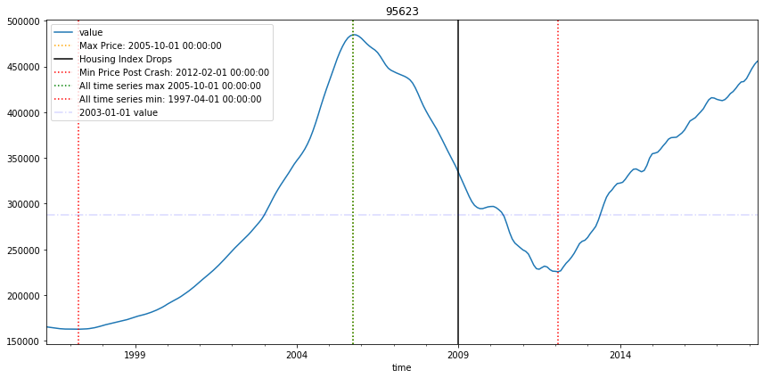


```python
ts_95623
```

#### Boxplot of zip code


```python
ts_95623.boxplot(column = 'value')
plt.title('95623');

```

### Plot ACF and PACF for ts dataframe


```python
# plot_acf_pacf(ts, figsize=(10,6), lags=15)  # note that ts must only contain values and time as index

plot_acf_pacf(ts_95623_values, figsize=(10,6), lags=15)
```

### Plot seasonal decomposition for ts dataframe


```python
# plot_seasonal_decomp(ts)

plot_seasonal_decomp(ts_95623_values)

# Seasonality does not appear to be a significant factor in this zip code.
```

## ARIMA model parameters and optimization

### Generate list of (p,d,q) and (p,d,q,m) values

### Run ARIMA model on ts dataframe with list of p,d,q values 


```python
p_values = [0, 1, 2, 4, 6, 8]
d_values = range(0, 3)
q_values = range(0, 3)
warnings.filterwarnings("ignore")
```


```python
# eval_arima_models(ts, p_values, d_values, q_values)  # don't run this until you have some time, since it take time
# note that ts must only contain values and time as index

# eval_arima_models(ts_95623_values, p_values, d_values, q_values)  # don't run this until you have some time, since it takes time

```

### Generate model fit summary


```python
# model_fit = arima_zipcode(ts, order = None)   # change order = tuple to correspond to the best MSE produced by previous function

# Best ARIMA(6, 1, 2) MSE=2032900.464

model_fit_95623 = arima_zipcode(ts_95623_values, order = (6,1,2))

```

                                 ARIMA Model Results                              
    ==============================================================================
    Dep. Variable:                    D.y   No. Observations:                  264
    Model:                 ARIMA(6, 1, 2)   Log Likelihood               -2137.809
    Method:                       css-mle   S.D. of innovations            785.964
    Date:                Tue, 10 Mar 2020   AIC                           4295.619
    Time:                        22:48:07   BIC                           4331.378
    Sample:                             1   HQIC                          4309.988
                                                                                  
    ==============================================================================
                     coef    std err          z      P>|z|      [0.025      0.975]
    ------------------------------------------------------------------------------
    const       1100.0000   1234.743      0.891      0.374   -1320.052    3520.052
    ar.L1.D.y      0.3530      0.073      4.804      0.000       0.209       0.497
    ar.L2.D.y      0.3069      0.078      3.931      0.000       0.154       0.460
    ar.L3.D.y      0.0378      0.078      0.484      0.629      -0.115       0.191
    ar.L4.D.y      0.0813      0.079      1.022      0.308      -0.075       0.237
    ar.L5.D.y     -0.0678      0.083     -0.822      0.412      -0.230       0.094
    ar.L6.D.y      0.1636      0.070      2.351      0.019       0.027       0.300
    ma.L1.D.y      1.5432      0.044     35.031      0.000       1.457       1.630
    ma.L2.D.y      0.8584      0.050     17.159      0.000       0.760       0.956
                                        Roots                                    
    =============================================================================
                      Real          Imaginary           Modulus         Frequency
    -----------------------------------------------------------------------------
    AR.1            1.0567           -0.0000j            1.0567           -0.0000
    AR.2           -1.2513           -0.0000j            1.2513           -0.5000
    AR.3           -0.6322           -1.2802j            1.4278           -0.3230
    AR.4           -0.6322           +1.2802j            1.4278            0.3230
    AR.5            0.9368           -1.1792j            1.5060           -0.1431
    AR.6            0.9368           +1.1792j            1.5060            0.1431
    MA.1           -0.8989           -0.5974j            1.0794           -0.4066
    MA.2           -0.8989           +0.5974j            1.0794            0.4066
    -----------------------------------------------------------------------------


## ARIMA modeling results:  predictions and visualization

### Produce forecasts from ARIMA model fit


```python
actual_forecast_95623, std_error_95623, forecast_confint_95623 = forecast(model_fit_95623)

```


```python
actual_forecast_95623, std_error_95623, forecast_confint_95623
```


    (array([456756.02888816, 457654.02736622, 459445.40556369, 461395.0064333 ,
            463412.40775467, 465485.89198931, 467305.86097438, 468982.5316643 ,
            470673.83638782, 472342.59029414, 473989.15143166, 475636.234293  ,
            477245.27850066, 478813.95339955, 480358.84309074, 481879.36903426,
            483375.71386639, 484854.53212876, 486313.40521529, 487751.97572817,
            489172.39322229, 490575.64912651, 491962.12167025, 493333.55332487]),
     array([  785.96392963,  2408.17801785,  4429.97694366,  6469.13252574,
             8575.04716936, 10687.73649131, 12835.13058727, 15048.51210912,
            17339.8523838 , 19677.19927726, 22055.74752781, 24457.90013174,
            26876.91710716, 29306.78959251, 31746.67535043, 34190.23949698,
            36635.32522144, 39077.54458685, 41514.3520261 , 43942.69360995,
            46361.0518104 , 48767.19055004, 51159.84116383, 53537.43960251]),
     array([[455215.56789294, 458296.48988337],
            [452934.08518287, 462373.96954957],
            [450762.81030178, 468128.00082561],
            [448715.73967164, 474074.27319496],
            [446605.62413699, 480219.19137236],
            [444538.31339009, 486433.47058854],
            [442149.46728646, 492462.2546623 ],
            [439487.98990952, 498477.07341909],
            [436688.35021832, 504659.32255731],
            [433775.9883941 , 510909.19219419],
            [430760.68062505, 517217.62223827],
            [427699.63089732, 523572.83768868],
            [424567.48895516, 529923.06804615],
            [421373.70129573, 536254.20550337],
            [418136.50277501, 542581.18340646],
            [414867.73099737, 548891.00707114],
            [411571.79587044, 555179.63186233],
            [408263.95213426, 561445.11212325],
            [404946.77040262, 567680.04002797],
            [401625.87886899, 573878.07258735],
            [398306.40138852, 580038.38505607],
            [394993.71202124, 586157.58623179],
            [391690.67553435, 592233.56780616],
            [388402.09987947, 598265.00677027]]))


### Create dataframe to hold forecast results


```python
# df_forecast = forecast_df(col = 'time', daterange = pd.date_range(start='2018-05-01', end='2020-04-01', freq='MS'), 
#                 actual_forecast=actual_forecast, forecast_confint = forecast_confint)

df_forecast_95623 = forecast_df(actual_forecast_95623, forecast_confint_95623, col = 'time', daterange = pd.date_range(start='2018-05-01', end='2020-04-01', freq='MS'))
```

### Create new dataframe concatenating historic values and forecast results


```python
# df_new = concat_values_forecast(ts, df_forecast)

df_new_95623 = concat_values_forecast(ts_95623_values, df_forecast_95623)
```


```python
df_new_95623
```


<div>
<style scoped>
    .dataframe tbody tr th:only-of-type {
        vertical-align: middle;
    }

    .dataframe tbody tr th {
        vertical-align: top;
    }

    .dataframe thead th {
        text-align: right;
    }
</style>
<table border="1" class="dataframe">
  <thead>
    <tr style="text-align: right;">
      <th></th>
      <th>value</th>
      <th>forecast</th>
      <th>forecast_lower</th>
      <th>forecast_upper</th>
    </tr>
    <tr>
      <th>time</th>
      <th></th>
      <th></th>
      <th></th>
      <th></th>
    </tr>
  </thead>
  <tbody>
    <tr>
      <td>1996-04-01</td>
      <td>165300.0</td>
      <td>NaN</td>
      <td>NaN</td>
      <td>NaN</td>
    </tr>
    <tr>
      <td>1996-05-01</td>
      <td>164900.0</td>
      <td>NaN</td>
      <td>NaN</td>
      <td>NaN</td>
    </tr>
    <tr>
      <td>1996-06-01</td>
      <td>164400.0</td>
      <td>NaN</td>
      <td>NaN</td>
      <td>NaN</td>
    </tr>
    <tr>
      <td>1996-07-01</td>
      <td>164000.0</td>
      <td>NaN</td>
      <td>NaN</td>
      <td>NaN</td>
    </tr>
    <tr>
      <td>1996-08-01</td>
      <td>163700.0</td>
      <td>NaN</td>
      <td>NaN</td>
      <td>NaN</td>
    </tr>
    <tr>
      <td>1996-09-01</td>
      <td>163300.0</td>
      <td>NaN</td>
      <td>NaN</td>
      <td>NaN</td>
    </tr>
    <tr>
      <td>1996-10-01</td>
      <td>163100.0</td>
      <td>NaN</td>
      <td>NaN</td>
      <td>NaN</td>
    </tr>
    <tr>
      <td>1996-11-01</td>
      <td>162900.0</td>
      <td>NaN</td>
      <td>NaN</td>
      <td>NaN</td>
    </tr>
    <tr>
      <td>1996-12-01</td>
      <td>162900.0</td>
      <td>NaN</td>
      <td>NaN</td>
      <td>NaN</td>
    </tr>
    <tr>
      <td>1997-01-01</td>
      <td>162900.0</td>
      <td>NaN</td>
      <td>NaN</td>
      <td>NaN</td>
    </tr>
    <tr>
      <td>1997-02-01</td>
      <td>162900.0</td>
      <td>NaN</td>
      <td>NaN</td>
      <td>NaN</td>
    </tr>
    <tr>
      <td>1997-03-01</td>
      <td>162800.0</td>
      <td>NaN</td>
      <td>NaN</td>
      <td>NaN</td>
    </tr>
    <tr>
      <td>1997-04-01</td>
      <td>162700.0</td>
      <td>NaN</td>
      <td>NaN</td>
      <td>NaN</td>
    </tr>
    <tr>
      <td>1997-05-01</td>
      <td>162800.0</td>
      <td>NaN</td>
      <td>NaN</td>
      <td>NaN</td>
    </tr>
    <tr>
      <td>1997-06-01</td>
      <td>162900.0</td>
      <td>NaN</td>
      <td>NaN</td>
      <td>NaN</td>
    </tr>
    <tr>
      <td>1997-07-01</td>
      <td>163100.0</td>
      <td>NaN</td>
      <td>NaN</td>
      <td>NaN</td>
    </tr>
    <tr>
      <td>1997-08-01</td>
      <td>163400.0</td>
      <td>NaN</td>
      <td>NaN</td>
      <td>NaN</td>
    </tr>
    <tr>
      <td>1997-09-01</td>
      <td>163900.0</td>
      <td>NaN</td>
      <td>NaN</td>
      <td>NaN</td>
    </tr>
    <tr>
      <td>1997-10-01</td>
      <td>164400.0</td>
      <td>NaN</td>
      <td>NaN</td>
      <td>NaN</td>
    </tr>
    <tr>
      <td>1997-11-01</td>
      <td>165100.0</td>
      <td>NaN</td>
      <td>NaN</td>
      <td>NaN</td>
    </tr>
    <tr>
      <td>1997-12-01</td>
      <td>165900.0</td>
      <td>NaN</td>
      <td>NaN</td>
      <td>NaN</td>
    </tr>
    <tr>
      <td>1998-01-01</td>
      <td>166800.0</td>
      <td>NaN</td>
      <td>NaN</td>
      <td>NaN</td>
    </tr>
    <tr>
      <td>1998-02-01</td>
      <td>167600.0</td>
      <td>NaN</td>
      <td>NaN</td>
      <td>NaN</td>
    </tr>
    <tr>
      <td>1998-03-01</td>
      <td>168300.0</td>
      <td>NaN</td>
      <td>NaN</td>
      <td>NaN</td>
    </tr>
    <tr>
      <td>1998-04-01</td>
      <td>169000.0</td>
      <td>NaN</td>
      <td>NaN</td>
      <td>NaN</td>
    </tr>
    <tr>
      <td>1998-05-01</td>
      <td>169600.0</td>
      <td>NaN</td>
      <td>NaN</td>
      <td>NaN</td>
    </tr>
    <tr>
      <td>1998-06-01</td>
      <td>170300.0</td>
      <td>NaN</td>
      <td>NaN</td>
      <td>NaN</td>
    </tr>
    <tr>
      <td>1998-07-01</td>
      <td>171000.0</td>
      <td>NaN</td>
      <td>NaN</td>
      <td>NaN</td>
    </tr>
    <tr>
      <td>1998-08-01</td>
      <td>171700.0</td>
      <td>NaN</td>
      <td>NaN</td>
      <td>NaN</td>
    </tr>
    <tr>
      <td>1998-09-01</td>
      <td>172400.0</td>
      <td>NaN</td>
      <td>NaN</td>
      <td>NaN</td>
    </tr>
    <tr>
      <td>1998-10-01</td>
      <td>173200.0</td>
      <td>NaN</td>
      <td>NaN</td>
      <td>NaN</td>
    </tr>
    <tr>
      <td>1998-11-01</td>
      <td>174100.0</td>
      <td>NaN</td>
      <td>NaN</td>
      <td>NaN</td>
    </tr>
    <tr>
      <td>1998-12-01</td>
      <td>175100.0</td>
      <td>NaN</td>
      <td>NaN</td>
      <td>NaN</td>
    </tr>
    <tr>
      <td>1999-01-01</td>
      <td>176100.0</td>
      <td>NaN</td>
      <td>NaN</td>
      <td>NaN</td>
    </tr>
    <tr>
      <td>1999-02-01</td>
      <td>177000.0</td>
      <td>NaN</td>
      <td>NaN</td>
      <td>NaN</td>
    </tr>
    <tr>
      <td>1999-03-01</td>
      <td>177700.0</td>
      <td>NaN</td>
      <td>NaN</td>
      <td>NaN</td>
    </tr>
    <tr>
      <td>1999-04-01</td>
      <td>178500.0</td>
      <td>NaN</td>
      <td>NaN</td>
      <td>NaN</td>
    </tr>
    <tr>
      <td>1999-05-01</td>
      <td>179300.0</td>
      <td>NaN</td>
      <td>NaN</td>
      <td>NaN</td>
    </tr>
    <tr>
      <td>1999-06-01</td>
      <td>180300.0</td>
      <td>NaN</td>
      <td>NaN</td>
      <td>NaN</td>
    </tr>
    <tr>
      <td>1999-07-01</td>
      <td>181300.0</td>
      <td>NaN</td>
      <td>NaN</td>
      <td>NaN</td>
    </tr>
    <tr>
      <td>1999-08-01</td>
      <td>182500.0</td>
      <td>NaN</td>
      <td>NaN</td>
      <td>NaN</td>
    </tr>
    <tr>
      <td>1999-09-01</td>
      <td>183700.0</td>
      <td>NaN</td>
      <td>NaN</td>
      <td>NaN</td>
    </tr>
    <tr>
      <td>1999-10-01</td>
      <td>185100.0</td>
      <td>NaN</td>
      <td>NaN</td>
      <td>NaN</td>
    </tr>
    <tr>
      <td>1999-11-01</td>
      <td>186600.0</td>
      <td>NaN</td>
      <td>NaN</td>
      <td>NaN</td>
    </tr>
    <tr>
      <td>1999-12-01</td>
      <td>188300.0</td>
      <td>NaN</td>
      <td>NaN</td>
      <td>NaN</td>
    </tr>
    <tr>
      <td>2000-01-01</td>
      <td>190200.0</td>
      <td>NaN</td>
      <td>NaN</td>
      <td>NaN</td>
    </tr>
    <tr>
      <td>2000-02-01</td>
      <td>191900.0</td>
      <td>NaN</td>
      <td>NaN</td>
      <td>NaN</td>
    </tr>
    <tr>
      <td>2000-03-01</td>
      <td>193500.0</td>
      <td>NaN</td>
      <td>NaN</td>
      <td>NaN</td>
    </tr>
    <tr>
      <td>2000-04-01</td>
      <td>195100.0</td>
      <td>NaN</td>
      <td>NaN</td>
      <td>NaN</td>
    </tr>
    <tr>
      <td>2000-05-01</td>
      <td>196700.0</td>
      <td>NaN</td>
      <td>NaN</td>
      <td>NaN</td>
    </tr>
    <tr>
      <td>2000-06-01</td>
      <td>198500.0</td>
      <td>NaN</td>
      <td>NaN</td>
      <td>NaN</td>
    </tr>
    <tr>
      <td>2000-07-01</td>
      <td>200500.0</td>
      <td>NaN</td>
      <td>NaN</td>
      <td>NaN</td>
    </tr>
    <tr>
      <td>2000-08-01</td>
      <td>202600.0</td>
      <td>NaN</td>
      <td>NaN</td>
      <td>NaN</td>
    </tr>
    <tr>
      <td>2000-09-01</td>
      <td>204700.0</td>
      <td>NaN</td>
      <td>NaN</td>
      <td>NaN</td>
    </tr>
    <tr>
      <td>2000-10-01</td>
      <td>207000.0</td>
      <td>NaN</td>
      <td>NaN</td>
      <td>NaN</td>
    </tr>
    <tr>
      <td>2000-11-01</td>
      <td>209400.0</td>
      <td>NaN</td>
      <td>NaN</td>
      <td>NaN</td>
    </tr>
    <tr>
      <td>2000-12-01</td>
      <td>212000.0</td>
      <td>NaN</td>
      <td>NaN</td>
      <td>NaN</td>
    </tr>
    <tr>
      <td>2001-01-01</td>
      <td>214600.0</td>
      <td>NaN</td>
      <td>NaN</td>
      <td>NaN</td>
    </tr>
    <tr>
      <td>2001-02-01</td>
      <td>217100.0</td>
      <td>NaN</td>
      <td>NaN</td>
      <td>NaN</td>
    </tr>
    <tr>
      <td>2001-03-01</td>
      <td>219500.0</td>
      <td>NaN</td>
      <td>NaN</td>
      <td>NaN</td>
    </tr>
    <tr>
      <td>2001-04-01</td>
      <td>222000.0</td>
      <td>NaN</td>
      <td>NaN</td>
      <td>NaN</td>
    </tr>
    <tr>
      <td>2001-05-01</td>
      <td>224500.0</td>
      <td>NaN</td>
      <td>NaN</td>
      <td>NaN</td>
    </tr>
    <tr>
      <td>2001-06-01</td>
      <td>227100.0</td>
      <td>NaN</td>
      <td>NaN</td>
      <td>NaN</td>
    </tr>
    <tr>
      <td>2001-07-01</td>
      <td>229900.0</td>
      <td>NaN</td>
      <td>NaN</td>
      <td>NaN</td>
    </tr>
    <tr>
      <td>2001-08-01</td>
      <td>232700.0</td>
      <td>NaN</td>
      <td>NaN</td>
      <td>NaN</td>
    </tr>
    <tr>
      <td>2001-09-01</td>
      <td>235700.0</td>
      <td>NaN</td>
      <td>NaN</td>
      <td>NaN</td>
    </tr>
    <tr>
      <td>2001-10-01</td>
      <td>238800.0</td>
      <td>NaN</td>
      <td>NaN</td>
      <td>NaN</td>
    </tr>
    <tr>
      <td>2001-11-01</td>
      <td>242000.0</td>
      <td>NaN</td>
      <td>NaN</td>
      <td>NaN</td>
    </tr>
    <tr>
      <td>2001-12-01</td>
      <td>245300.0</td>
      <td>NaN</td>
      <td>NaN</td>
      <td>NaN</td>
    </tr>
    <tr>
      <td>2002-01-01</td>
      <td>248500.0</td>
      <td>NaN</td>
      <td>NaN</td>
      <td>NaN</td>
    </tr>
    <tr>
      <td>2002-02-01</td>
      <td>251500.0</td>
      <td>NaN</td>
      <td>NaN</td>
      <td>NaN</td>
    </tr>
    <tr>
      <td>2002-03-01</td>
      <td>254400.0</td>
      <td>NaN</td>
      <td>NaN</td>
      <td>NaN</td>
    </tr>
    <tr>
      <td>2002-04-01</td>
      <td>257200.0</td>
      <td>NaN</td>
      <td>NaN</td>
      <td>NaN</td>
    </tr>
    <tr>
      <td>2002-05-01</td>
      <td>260100.0</td>
      <td>NaN</td>
      <td>NaN</td>
      <td>NaN</td>
    </tr>
    <tr>
      <td>2002-06-01</td>
      <td>263000.0</td>
      <td>NaN</td>
      <td>NaN</td>
      <td>NaN</td>
    </tr>
    <tr>
      <td>2002-07-01</td>
      <td>266000.0</td>
      <td>NaN</td>
      <td>NaN</td>
      <td>NaN</td>
    </tr>
    <tr>
      <td>2002-08-01</td>
      <td>269200.0</td>
      <td>NaN</td>
      <td>NaN</td>
      <td>NaN</td>
    </tr>
    <tr>
      <td>2002-09-01</td>
      <td>272600.0</td>
      <td>NaN</td>
      <td>NaN</td>
      <td>NaN</td>
    </tr>
    <tr>
      <td>2002-10-01</td>
      <td>276100.0</td>
      <td>NaN</td>
      <td>NaN</td>
      <td>NaN</td>
    </tr>
    <tr>
      <td>2002-11-01</td>
      <td>279500.0</td>
      <td>NaN</td>
      <td>NaN</td>
      <td>NaN</td>
    </tr>
    <tr>
      <td>2002-12-01</td>
      <td>283200.0</td>
      <td>NaN</td>
      <td>NaN</td>
      <td>NaN</td>
    </tr>
    <tr>
      <td>2003-01-01</td>
      <td>287900.0</td>
      <td>NaN</td>
      <td>NaN</td>
      <td>NaN</td>
    </tr>
    <tr>
      <td>2003-02-01</td>
      <td>293400.0</td>
      <td>NaN</td>
      <td>NaN</td>
      <td>NaN</td>
    </tr>
    <tr>
      <td>2003-03-01</td>
      <td>299100.0</td>
      <td>NaN</td>
      <td>NaN</td>
      <td>NaN</td>
    </tr>
    <tr>
      <td>2003-04-01</td>
      <td>304900.0</td>
      <td>NaN</td>
      <td>NaN</td>
      <td>NaN</td>
    </tr>
    <tr>
      <td>2003-05-01</td>
      <td>310400.0</td>
      <td>NaN</td>
      <td>NaN</td>
      <td>NaN</td>
    </tr>
    <tr>
      <td>2003-06-01</td>
      <td>315500.0</td>
      <td>NaN</td>
      <td>NaN</td>
      <td>NaN</td>
    </tr>
    <tr>
      <td>2003-07-01</td>
      <td>320300.0</td>
      <td>NaN</td>
      <td>NaN</td>
      <td>NaN</td>
    </tr>
    <tr>
      <td>2003-08-01</td>
      <td>324700.0</td>
      <td>NaN</td>
      <td>NaN</td>
      <td>NaN</td>
    </tr>
    <tr>
      <td>2003-09-01</td>
      <td>329100.0</td>
      <td>NaN</td>
      <td>NaN</td>
      <td>NaN</td>
    </tr>
    <tr>
      <td>2003-10-01</td>
      <td>333600.0</td>
      <td>NaN</td>
      <td>NaN</td>
      <td>NaN</td>
    </tr>
    <tr>
      <td>2003-11-01</td>
      <td>338300.0</td>
      <td>NaN</td>
      <td>NaN</td>
      <td>NaN</td>
    </tr>
    <tr>
      <td>2003-12-01</td>
      <td>343000.0</td>
      <td>NaN</td>
      <td>NaN</td>
      <td>NaN</td>
    </tr>
    <tr>
      <td>2004-01-01</td>
      <td>347100.0</td>
      <td>NaN</td>
      <td>NaN</td>
      <td>NaN</td>
    </tr>
    <tr>
      <td>2004-02-01</td>
      <td>350900.0</td>
      <td>NaN</td>
      <td>NaN</td>
      <td>NaN</td>
    </tr>
    <tr>
      <td>2004-03-01</td>
      <td>355100.0</td>
      <td>NaN</td>
      <td>NaN</td>
      <td>NaN</td>
    </tr>
    <tr>
      <td>2004-04-01</td>
      <td>359800.0</td>
      <td>NaN</td>
      <td>NaN</td>
      <td>NaN</td>
    </tr>
    <tr>
      <td>2004-05-01</td>
      <td>365400.0</td>
      <td>NaN</td>
      <td>NaN</td>
      <td>NaN</td>
    </tr>
    <tr>
      <td>2004-06-01</td>
      <td>371900.0</td>
      <td>NaN</td>
      <td>NaN</td>
      <td>NaN</td>
    </tr>
    <tr>
      <td>2004-07-01</td>
      <td>379600.0</td>
      <td>NaN</td>
      <td>NaN</td>
      <td>NaN</td>
    </tr>
    <tr>
      <td>2004-08-01</td>
      <td>388200.0</td>
      <td>NaN</td>
      <td>NaN</td>
      <td>NaN</td>
    </tr>
    <tr>
      <td>2004-09-01</td>
      <td>397500.0</td>
      <td>NaN</td>
      <td>NaN</td>
      <td>NaN</td>
    </tr>
    <tr>
      <td>2004-10-01</td>
      <td>407200.0</td>
      <td>NaN</td>
      <td>NaN</td>
      <td>NaN</td>
    </tr>
    <tr>
      <td>2004-11-01</td>
      <td>416400.0</td>
      <td>NaN</td>
      <td>NaN</td>
      <td>NaN</td>
    </tr>
    <tr>
      <td>2004-12-01</td>
      <td>425200.0</td>
      <td>NaN</td>
      <td>NaN</td>
      <td>NaN</td>
    </tr>
    <tr>
      <td>2005-01-01</td>
      <td>433400.0</td>
      <td>NaN</td>
      <td>NaN</td>
      <td>NaN</td>
    </tr>
    <tr>
      <td>2005-02-01</td>
      <td>441600.0</td>
      <td>NaN</td>
      <td>NaN</td>
      <td>NaN</td>
    </tr>
    <tr>
      <td>2005-03-01</td>
      <td>450100.0</td>
      <td>NaN</td>
      <td>NaN</td>
      <td>NaN</td>
    </tr>
    <tr>
      <td>2005-04-01</td>
      <td>458500.0</td>
      <td>NaN</td>
      <td>NaN</td>
      <td>NaN</td>
    </tr>
    <tr>
      <td>2005-05-01</td>
      <td>465800.0</td>
      <td>NaN</td>
      <td>NaN</td>
      <td>NaN</td>
    </tr>
    <tr>
      <td>2005-06-01</td>
      <td>472100.0</td>
      <td>NaN</td>
      <td>NaN</td>
      <td>NaN</td>
    </tr>
    <tr>
      <td>2005-07-01</td>
      <td>477400.0</td>
      <td>NaN</td>
      <td>NaN</td>
      <td>NaN</td>
    </tr>
    <tr>
      <td>2005-08-01</td>
      <td>481400.0</td>
      <td>NaN</td>
      <td>NaN</td>
      <td>NaN</td>
    </tr>
    <tr>
      <td>2005-09-01</td>
      <td>483800.0</td>
      <td>NaN</td>
      <td>NaN</td>
      <td>NaN</td>
    </tr>
    <tr>
      <td>2005-10-01</td>
      <td>484800.0</td>
      <td>NaN</td>
      <td>NaN</td>
      <td>NaN</td>
    </tr>
    <tr>
      <td>2005-11-01</td>
      <td>484600.0</td>
      <td>NaN</td>
      <td>NaN</td>
      <td>NaN</td>
    </tr>
    <tr>
      <td>2005-12-01</td>
      <td>483200.0</td>
      <td>NaN</td>
      <td>NaN</td>
      <td>NaN</td>
    </tr>
    <tr>
      <td>2006-01-01</td>
      <td>480900.0</td>
      <td>NaN</td>
      <td>NaN</td>
      <td>NaN</td>
    </tr>
    <tr>
      <td>2006-02-01</td>
      <td>477900.0</td>
      <td>NaN</td>
      <td>NaN</td>
      <td>NaN</td>
    </tr>
    <tr>
      <td>2006-03-01</td>
      <td>474900.0</td>
      <td>NaN</td>
      <td>NaN</td>
      <td>NaN</td>
    </tr>
    <tr>
      <td>2006-04-01</td>
      <td>472300.0</td>
      <td>NaN</td>
      <td>NaN</td>
      <td>NaN</td>
    </tr>
    <tr>
      <td>2006-05-01</td>
      <td>470100.0</td>
      <td>NaN</td>
      <td>NaN</td>
      <td>NaN</td>
    </tr>
    <tr>
      <td>2006-06-01</td>
      <td>468100.0</td>
      <td>NaN</td>
      <td>NaN</td>
      <td>NaN</td>
    </tr>
    <tr>
      <td>2006-07-01</td>
      <td>465300.0</td>
      <td>NaN</td>
      <td>NaN</td>
      <td>NaN</td>
    </tr>
    <tr>
      <td>2006-08-01</td>
      <td>461200.0</td>
      <td>NaN</td>
      <td>NaN</td>
      <td>NaN</td>
    </tr>
    <tr>
      <td>2006-09-01</td>
      <td>456400.0</td>
      <td>NaN</td>
      <td>NaN</td>
      <td>NaN</td>
    </tr>
    <tr>
      <td>2006-10-01</td>
      <td>451800.0</td>
      <td>NaN</td>
      <td>NaN</td>
      <td>NaN</td>
    </tr>
    <tr>
      <td>2006-11-01</td>
      <td>448100.0</td>
      <td>NaN</td>
      <td>NaN</td>
      <td>NaN</td>
    </tr>
    <tr>
      <td>2006-12-01</td>
      <td>445900.0</td>
      <td>NaN</td>
      <td>NaN</td>
      <td>NaN</td>
    </tr>
    <tr>
      <td>2007-01-01</td>
      <td>444400.0</td>
      <td>NaN</td>
      <td>NaN</td>
      <td>NaN</td>
    </tr>
    <tr>
      <td>2007-02-01</td>
      <td>443000.0</td>
      <td>NaN</td>
      <td>NaN</td>
      <td>NaN</td>
    </tr>
    <tr>
      <td>2007-03-01</td>
      <td>441800.0</td>
      <td>NaN</td>
      <td>NaN</td>
      <td>NaN</td>
    </tr>
    <tr>
      <td>2007-04-01</td>
      <td>440600.0</td>
      <td>NaN</td>
      <td>NaN</td>
      <td>NaN</td>
    </tr>
    <tr>
      <td>2007-05-01</td>
      <td>439300.0</td>
      <td>NaN</td>
      <td>NaN</td>
      <td>NaN</td>
    </tr>
    <tr>
      <td>2007-06-01</td>
      <td>437700.0</td>
      <td>NaN</td>
      <td>NaN</td>
      <td>NaN</td>
    </tr>
    <tr>
      <td>2007-07-01</td>
      <td>435500.0</td>
      <td>NaN</td>
      <td>NaN</td>
      <td>NaN</td>
    </tr>
    <tr>
      <td>2007-08-01</td>
      <td>432000.0</td>
      <td>NaN</td>
      <td>NaN</td>
      <td>NaN</td>
    </tr>
    <tr>
      <td>2007-09-01</td>
      <td>426800.0</td>
      <td>NaN</td>
      <td>NaN</td>
      <td>NaN</td>
    </tr>
    <tr>
      <td>2007-10-01</td>
      <td>420500.0</td>
      <td>NaN</td>
      <td>NaN</td>
      <td>NaN</td>
    </tr>
    <tr>
      <td>2007-11-01</td>
      <td>413600.0</td>
      <td>NaN</td>
      <td>NaN</td>
      <td>NaN</td>
    </tr>
    <tr>
      <td>2007-12-01</td>
      <td>407100.0</td>
      <td>NaN</td>
      <td>NaN</td>
      <td>NaN</td>
    </tr>
    <tr>
      <td>2008-01-01</td>
      <td>401400.0</td>
      <td>NaN</td>
      <td>NaN</td>
      <td>NaN</td>
    </tr>
    <tr>
      <td>2008-02-01</td>
      <td>396100.0</td>
      <td>NaN</td>
      <td>NaN</td>
      <td>NaN</td>
    </tr>
    <tr>
      <td>2008-03-01</td>
      <td>391200.0</td>
      <td>NaN</td>
      <td>NaN</td>
      <td>NaN</td>
    </tr>
    <tr>
      <td>2008-04-01</td>
      <td>386400.0</td>
      <td>NaN</td>
      <td>NaN</td>
      <td>NaN</td>
    </tr>
    <tr>
      <td>2008-05-01</td>
      <td>381300.0</td>
      <td>NaN</td>
      <td>NaN</td>
      <td>NaN</td>
    </tr>
    <tr>
      <td>2008-06-01</td>
      <td>375700.0</td>
      <td>NaN</td>
      <td>NaN</td>
      <td>NaN</td>
    </tr>
    <tr>
      <td>2008-07-01</td>
      <td>369900.0</td>
      <td>NaN</td>
      <td>NaN</td>
      <td>NaN</td>
    </tr>
    <tr>
      <td>2008-08-01</td>
      <td>363900.0</td>
      <td>NaN</td>
      <td>NaN</td>
      <td>NaN</td>
    </tr>
    <tr>
      <td>2008-09-01</td>
      <td>358000.0</td>
      <td>NaN</td>
      <td>NaN</td>
      <td>NaN</td>
    </tr>
    <tr>
      <td>2008-10-01</td>
      <td>352300.0</td>
      <td>NaN</td>
      <td>NaN</td>
      <td>NaN</td>
    </tr>
    <tr>
      <td>2008-11-01</td>
      <td>346800.0</td>
      <td>NaN</td>
      <td>NaN</td>
      <td>NaN</td>
    </tr>
    <tr>
      <td>2008-12-01</td>
      <td>340900.0</td>
      <td>NaN</td>
      <td>NaN</td>
      <td>NaN</td>
    </tr>
    <tr>
      <td>2009-01-01</td>
      <td>334400.0</td>
      <td>NaN</td>
      <td>NaN</td>
      <td>NaN</td>
    </tr>
    <tr>
      <td>2009-02-01</td>
      <td>327800.0</td>
      <td>NaN</td>
      <td>NaN</td>
      <td>NaN</td>
    </tr>
    <tr>
      <td>2009-03-01</td>
      <td>321200.0</td>
      <td>NaN</td>
      <td>NaN</td>
      <td>NaN</td>
    </tr>
    <tr>
      <td>2009-04-01</td>
      <td>314500.0</td>
      <td>NaN</td>
      <td>NaN</td>
      <td>NaN</td>
    </tr>
    <tr>
      <td>2009-05-01</td>
      <td>308000.0</td>
      <td>NaN</td>
      <td>NaN</td>
      <td>NaN</td>
    </tr>
    <tr>
      <td>2009-06-01</td>
      <td>302300.0</td>
      <td>NaN</td>
      <td>NaN</td>
      <td>NaN</td>
    </tr>
    <tr>
      <td>2009-07-01</td>
      <td>298200.0</td>
      <td>NaN</td>
      <td>NaN</td>
      <td>NaN</td>
    </tr>
    <tr>
      <td>2009-08-01</td>
      <td>295800.0</td>
      <td>NaN</td>
      <td>NaN</td>
      <td>NaN</td>
    </tr>
    <tr>
      <td>2009-09-01</td>
      <td>294600.0</td>
      <td>NaN</td>
      <td>NaN</td>
      <td>NaN</td>
    </tr>
    <tr>
      <td>2009-10-01</td>
      <td>294600.0</td>
      <td>NaN</td>
      <td>NaN</td>
      <td>NaN</td>
    </tr>
    <tr>
      <td>2009-11-01</td>
      <td>295500.0</td>
      <td>NaN</td>
      <td>NaN</td>
      <td>NaN</td>
    </tr>
    <tr>
      <td>2009-12-01</td>
      <td>296500.0</td>
      <td>NaN</td>
      <td>NaN</td>
      <td>NaN</td>
    </tr>
    <tr>
      <td>2010-01-01</td>
      <td>296900.0</td>
      <td>NaN</td>
      <td>NaN</td>
      <td>NaN</td>
    </tr>
    <tr>
      <td>2010-02-01</td>
      <td>297000.0</td>
      <td>NaN</td>
      <td>NaN</td>
      <td>NaN</td>
    </tr>
    <tr>
      <td>2010-03-01</td>
      <td>295700.0</td>
      <td>NaN</td>
      <td>NaN</td>
      <td>NaN</td>
    </tr>
    <tr>
      <td>2010-04-01</td>
      <td>293500.0</td>
      <td>NaN</td>
      <td>NaN</td>
      <td>NaN</td>
    </tr>
    <tr>
      <td>2010-05-01</td>
      <td>290800.0</td>
      <td>NaN</td>
      <td>NaN</td>
      <td>NaN</td>
    </tr>
    <tr>
      <td>2010-06-01</td>
      <td>286000.0</td>
      <td>NaN</td>
      <td>NaN</td>
      <td>NaN</td>
    </tr>
    <tr>
      <td>2010-07-01</td>
      <td>277800.0</td>
      <td>NaN</td>
      <td>NaN</td>
      <td>NaN</td>
    </tr>
    <tr>
      <td>2010-08-01</td>
      <td>268700.0</td>
      <td>NaN</td>
      <td>NaN</td>
      <td>NaN</td>
    </tr>
    <tr>
      <td>2010-09-01</td>
      <td>261400.0</td>
      <td>NaN</td>
      <td>NaN</td>
      <td>NaN</td>
    </tr>
    <tr>
      <td>2010-10-01</td>
      <td>256900.0</td>
      <td>NaN</td>
      <td>NaN</td>
      <td>NaN</td>
    </tr>
    <tr>
      <td>2010-11-01</td>
      <td>254300.0</td>
      <td>NaN</td>
      <td>NaN</td>
      <td>NaN</td>
    </tr>
    <tr>
      <td>2010-12-01</td>
      <td>251800.0</td>
      <td>NaN</td>
      <td>NaN</td>
      <td>NaN</td>
    </tr>
    <tr>
      <td>2011-01-01</td>
      <td>249400.0</td>
      <td>NaN</td>
      <td>NaN</td>
      <td>NaN</td>
    </tr>
    <tr>
      <td>2011-02-01</td>
      <td>247900.0</td>
      <td>NaN</td>
      <td>NaN</td>
      <td>NaN</td>
    </tr>
    <tr>
      <td>2011-03-01</td>
      <td>245000.0</td>
      <td>NaN</td>
      <td>NaN</td>
      <td>NaN</td>
    </tr>
    <tr>
      <td>2011-04-01</td>
      <td>239100.0</td>
      <td>NaN</td>
      <td>NaN</td>
      <td>NaN</td>
    </tr>
    <tr>
      <td>2011-05-01</td>
      <td>232800.0</td>
      <td>NaN</td>
      <td>NaN</td>
      <td>NaN</td>
    </tr>
    <tr>
      <td>2011-06-01</td>
      <td>228900.0</td>
      <td>NaN</td>
      <td>NaN</td>
      <td>NaN</td>
    </tr>
    <tr>
      <td>2011-07-01</td>
      <td>228300.0</td>
      <td>NaN</td>
      <td>NaN</td>
      <td>NaN</td>
    </tr>
    <tr>
      <td>2011-08-01</td>
      <td>230100.0</td>
      <td>NaN</td>
      <td>NaN</td>
      <td>NaN</td>
    </tr>
    <tr>
      <td>2011-09-01</td>
      <td>231700.0</td>
      <td>NaN</td>
      <td>NaN</td>
      <td>NaN</td>
    </tr>
    <tr>
      <td>2011-10-01</td>
      <td>230700.0</td>
      <td>NaN</td>
      <td>NaN</td>
      <td>NaN</td>
    </tr>
    <tr>
      <td>2011-11-01</td>
      <td>227900.0</td>
      <td>NaN</td>
      <td>NaN</td>
      <td>NaN</td>
    </tr>
    <tr>
      <td>2011-12-01</td>
      <td>226200.0</td>
      <td>NaN</td>
      <td>NaN</td>
      <td>NaN</td>
    </tr>
    <tr>
      <td>2012-01-01</td>
      <td>226000.0</td>
      <td>NaN</td>
      <td>NaN</td>
      <td>NaN</td>
    </tr>
    <tr>
      <td>2012-02-01</td>
      <td>225500.0</td>
      <td>NaN</td>
      <td>NaN</td>
      <td>NaN</td>
    </tr>
    <tr>
      <td>2012-03-01</td>
      <td>226600.0</td>
      <td>NaN</td>
      <td>NaN</td>
      <td>NaN</td>
    </tr>
    <tr>
      <td>2012-04-01</td>
      <td>230900.0</td>
      <td>NaN</td>
      <td>NaN</td>
      <td>NaN</td>
    </tr>
    <tr>
      <td>2012-05-01</td>
      <td>234800.0</td>
      <td>NaN</td>
      <td>NaN</td>
      <td>NaN</td>
    </tr>
    <tr>
      <td>2012-06-01</td>
      <td>237800.0</td>
      <td>NaN</td>
      <td>NaN</td>
      <td>NaN</td>
    </tr>
    <tr>
      <td>2012-07-01</td>
      <td>241400.0</td>
      <td>NaN</td>
      <td>NaN</td>
      <td>NaN</td>
    </tr>
    <tr>
      <td>2012-08-01</td>
      <td>245700.0</td>
      <td>NaN</td>
      <td>NaN</td>
      <td>NaN</td>
    </tr>
    <tr>
      <td>2012-09-01</td>
      <td>251000.0</td>
      <td>NaN</td>
      <td>NaN</td>
      <td>NaN</td>
    </tr>
    <tr>
      <td>2012-10-01</td>
      <td>256400.0</td>
      <td>NaN</td>
      <td>NaN</td>
      <td>NaN</td>
    </tr>
    <tr>
      <td>2012-11-01</td>
      <td>258900.0</td>
      <td>NaN</td>
      <td>NaN</td>
      <td>NaN</td>
    </tr>
    <tr>
      <td>2012-12-01</td>
      <td>260000.0</td>
      <td>NaN</td>
      <td>NaN</td>
      <td>NaN</td>
    </tr>
    <tr>
      <td>2013-01-01</td>
      <td>263000.0</td>
      <td>NaN</td>
      <td>NaN</td>
      <td>NaN</td>
    </tr>
    <tr>
      <td>2013-02-01</td>
      <td>267400.0</td>
      <td>NaN</td>
      <td>NaN</td>
      <td>NaN</td>
    </tr>
    <tr>
      <td>2013-03-01</td>
      <td>271100.0</td>
      <td>NaN</td>
      <td>NaN</td>
      <td>NaN</td>
    </tr>
    <tr>
      <td>2013-04-01</td>
      <td>275100.0</td>
      <td>NaN</td>
      <td>NaN</td>
      <td>NaN</td>
    </tr>
    <tr>
      <td>2013-05-01</td>
      <td>282100.0</td>
      <td>NaN</td>
      <td>NaN</td>
      <td>NaN</td>
    </tr>
    <tr>
      <td>2013-06-01</td>
      <td>290700.0</td>
      <td>NaN</td>
      <td>NaN</td>
      <td>NaN</td>
    </tr>
    <tr>
      <td>2013-07-01</td>
      <td>299400.0</td>
      <td>NaN</td>
      <td>NaN</td>
      <td>NaN</td>
    </tr>
    <tr>
      <td>2013-08-01</td>
      <td>307100.0</td>
      <td>NaN</td>
      <td>NaN</td>
      <td>NaN</td>
    </tr>
    <tr>
      <td>2013-09-01</td>
      <td>311900.0</td>
      <td>NaN</td>
      <td>NaN</td>
      <td>NaN</td>
    </tr>
    <tr>
      <td>2013-10-01</td>
      <td>314900.0</td>
      <td>NaN</td>
      <td>NaN</td>
      <td>NaN</td>
    </tr>
    <tr>
      <td>2013-11-01</td>
      <td>318900.0</td>
      <td>NaN</td>
      <td>NaN</td>
      <td>NaN</td>
    </tr>
    <tr>
      <td>2013-12-01</td>
      <td>322000.0</td>
      <td>NaN</td>
      <td>NaN</td>
      <td>NaN</td>
    </tr>
    <tr>
      <td>2014-01-01</td>
      <td>322500.0</td>
      <td>NaN</td>
      <td>NaN</td>
      <td>NaN</td>
    </tr>
    <tr>
      <td>2014-02-01</td>
      <td>323400.0</td>
      <td>NaN</td>
      <td>NaN</td>
      <td>NaN</td>
    </tr>
    <tr>
      <td>2014-03-01</td>
      <td>326700.0</td>
      <td>NaN</td>
      <td>NaN</td>
      <td>NaN</td>
    </tr>
    <tr>
      <td>2014-04-01</td>
      <td>330900.0</td>
      <td>NaN</td>
      <td>NaN</td>
      <td>NaN</td>
    </tr>
    <tr>
      <td>2014-05-01</td>
      <td>334700.0</td>
      <td>NaN</td>
      <td>NaN</td>
      <td>NaN</td>
    </tr>
    <tr>
      <td>2014-06-01</td>
      <td>337600.0</td>
      <td>NaN</td>
      <td>NaN</td>
      <td>NaN</td>
    </tr>
    <tr>
      <td>2014-07-01</td>
      <td>338000.0</td>
      <td>NaN</td>
      <td>NaN</td>
      <td>NaN</td>
    </tr>
    <tr>
      <td>2014-08-01</td>
      <td>336400.0</td>
      <td>NaN</td>
      <td>NaN</td>
      <td>NaN</td>
    </tr>
    <tr>
      <td>2014-09-01</td>
      <td>334900.0</td>
      <td>NaN</td>
      <td>NaN</td>
      <td>NaN</td>
    </tr>
    <tr>
      <td>2014-10-01</td>
      <td>336300.0</td>
      <td>NaN</td>
      <td>NaN</td>
      <td>NaN</td>
    </tr>
    <tr>
      <td>2014-11-01</td>
      <td>341800.0</td>
      <td>NaN</td>
      <td>NaN</td>
      <td>NaN</td>
    </tr>
    <tr>
      <td>2014-12-01</td>
      <td>349800.0</td>
      <td>NaN</td>
      <td>NaN</td>
      <td>NaN</td>
    </tr>
    <tr>
      <td>2015-01-01</td>
      <td>354600.0</td>
      <td>NaN</td>
      <td>NaN</td>
      <td>NaN</td>
    </tr>
    <tr>
      <td>2015-02-01</td>
      <td>355300.0</td>
      <td>NaN</td>
      <td>NaN</td>
      <td>NaN</td>
    </tr>
    <tr>
      <td>2015-03-01</td>
      <td>356300.0</td>
      <td>NaN</td>
      <td>NaN</td>
      <td>NaN</td>
    </tr>
    <tr>
      <td>2015-04-01</td>
      <td>359400.0</td>
      <td>NaN</td>
      <td>NaN</td>
      <td>NaN</td>
    </tr>
    <tr>
      <td>2015-05-01</td>
      <td>363200.0</td>
      <td>NaN</td>
      <td>NaN</td>
      <td>NaN</td>
    </tr>
    <tr>
      <td>2015-06-01</td>
      <td>366500.0</td>
      <td>NaN</td>
      <td>NaN</td>
      <td>NaN</td>
    </tr>
    <tr>
      <td>2015-07-01</td>
      <td>370500.0</td>
      <td>NaN</td>
      <td>NaN</td>
      <td>NaN</td>
    </tr>
    <tr>
      <td>2015-08-01</td>
      <td>372200.0</td>
      <td>NaN</td>
      <td>NaN</td>
      <td>NaN</td>
    </tr>
    <tr>
      <td>2015-09-01</td>
      <td>372500.0</td>
      <td>NaN</td>
      <td>NaN</td>
      <td>NaN</td>
    </tr>
    <tr>
      <td>2015-10-01</td>
      <td>372700.0</td>
      <td>NaN</td>
      <td>NaN</td>
      <td>NaN</td>
    </tr>
    <tr>
      <td>2015-11-01</td>
      <td>375000.0</td>
      <td>NaN</td>
      <td>NaN</td>
      <td>NaN</td>
    </tr>
    <tr>
      <td>2015-12-01</td>
      <td>377300.0</td>
      <td>NaN</td>
      <td>NaN</td>
      <td>NaN</td>
    </tr>
    <tr>
      <td>2016-01-01</td>
      <td>380600.0</td>
      <td>NaN</td>
      <td>NaN</td>
      <td>NaN</td>
    </tr>
    <tr>
      <td>2016-02-01</td>
      <td>385400.0</td>
      <td>NaN</td>
      <td>NaN</td>
      <td>NaN</td>
    </tr>
    <tr>
      <td>2016-03-01</td>
      <td>390400.0</td>
      <td>NaN</td>
      <td>NaN</td>
      <td>NaN</td>
    </tr>
    <tr>
      <td>2016-04-01</td>
      <td>392200.0</td>
      <td>NaN</td>
      <td>NaN</td>
      <td>NaN</td>
    </tr>
    <tr>
      <td>2016-05-01</td>
      <td>394100.0</td>
      <td>NaN</td>
      <td>NaN</td>
      <td>NaN</td>
    </tr>
    <tr>
      <td>2016-06-01</td>
      <td>397400.0</td>
      <td>NaN</td>
      <td>NaN</td>
      <td>NaN</td>
    </tr>
    <tr>
      <td>2016-07-01</td>
      <td>400500.0</td>
      <td>NaN</td>
      <td>NaN</td>
      <td>NaN</td>
    </tr>
    <tr>
      <td>2016-08-01</td>
      <td>403900.0</td>
      <td>NaN</td>
      <td>NaN</td>
      <td>NaN</td>
    </tr>
    <tr>
      <td>2016-09-01</td>
      <td>409100.0</td>
      <td>NaN</td>
      <td>NaN</td>
      <td>NaN</td>
    </tr>
    <tr>
      <td>2016-10-01</td>
      <td>413700.0</td>
      <td>NaN</td>
      <td>NaN</td>
      <td>NaN</td>
    </tr>
    <tr>
      <td>2016-11-01</td>
      <td>415900.0</td>
      <td>NaN</td>
      <td>NaN</td>
      <td>NaN</td>
    </tr>
    <tr>
      <td>2016-12-01</td>
      <td>415500.0</td>
      <td>NaN</td>
      <td>NaN</td>
      <td>NaN</td>
    </tr>
    <tr>
      <td>2017-01-01</td>
      <td>414100.0</td>
      <td>NaN</td>
      <td>NaN</td>
      <td>NaN</td>
    </tr>
    <tr>
      <td>2017-02-01</td>
      <td>413300.0</td>
      <td>NaN</td>
      <td>NaN</td>
      <td>NaN</td>
    </tr>
    <tr>
      <td>2017-03-01</td>
      <td>412700.0</td>
      <td>NaN</td>
      <td>NaN</td>
      <td>NaN</td>
    </tr>
    <tr>
      <td>2017-04-01</td>
      <td>413900.0</td>
      <td>NaN</td>
      <td>NaN</td>
      <td>NaN</td>
    </tr>
    <tr>
      <td>2017-05-01</td>
      <td>416700.0</td>
      <td>NaN</td>
      <td>NaN</td>
      <td>NaN</td>
    </tr>
    <tr>
      <td>2017-06-01</td>
      <td>420400.0</td>
      <td>NaN</td>
      <td>NaN</td>
      <td>NaN</td>
    </tr>
    <tr>
      <td>2017-07-01</td>
      <td>422600.0</td>
      <td>NaN</td>
      <td>NaN</td>
      <td>NaN</td>
    </tr>
    <tr>
      <td>2017-08-01</td>
      <td>426000.0</td>
      <td>NaN</td>
      <td>NaN</td>
      <td>NaN</td>
    </tr>
    <tr>
      <td>2017-09-01</td>
      <td>430000.0</td>
      <td>NaN</td>
      <td>NaN</td>
      <td>NaN</td>
    </tr>
    <tr>
      <td>2017-10-01</td>
      <td>433100.0</td>
      <td>NaN</td>
      <td>NaN</td>
      <td>NaN</td>
    </tr>
    <tr>
      <td>2017-11-01</td>
      <td>433600.0</td>
      <td>NaN</td>
      <td>NaN</td>
      <td>NaN</td>
    </tr>
    <tr>
      <td>2017-12-01</td>
      <td>436800.0</td>
      <td>NaN</td>
      <td>NaN</td>
      <td>NaN</td>
    </tr>
    <tr>
      <td>2018-01-01</td>
      <td>442200.0</td>
      <td>NaN</td>
      <td>NaN</td>
      <td>NaN</td>
    </tr>
    <tr>
      <td>2018-02-01</td>
      <td>447700.0</td>
      <td>NaN</td>
      <td>NaN</td>
      <td>NaN</td>
    </tr>
    <tr>
      <td>2018-03-01</td>
      <td>452300.0</td>
      <td>NaN</td>
      <td>NaN</td>
      <td>NaN</td>
    </tr>
    <tr>
      <td>2018-04-01</td>
      <td>455700.0</td>
      <td>NaN</td>
      <td>NaN</td>
      <td>NaN</td>
    </tr>
    <tr>
      <td>2018-05-01</td>
      <td>NaN</td>
      <td>456756.028888</td>
      <td>455215.567893</td>
      <td>458296.489883</td>
    </tr>
    <tr>
      <td>2018-06-01</td>
      <td>NaN</td>
      <td>457654.027366</td>
      <td>452934.085183</td>
      <td>462373.969550</td>
    </tr>
    <tr>
      <td>2018-07-01</td>
      <td>NaN</td>
      <td>459445.405564</td>
      <td>450762.810302</td>
      <td>468128.000826</td>
    </tr>
    <tr>
      <td>2018-08-01</td>
      <td>NaN</td>
      <td>461395.006433</td>
      <td>448715.739672</td>
      <td>474074.273195</td>
    </tr>
    <tr>
      <td>2018-09-01</td>
      <td>NaN</td>
      <td>463412.407755</td>
      <td>446605.624137</td>
      <td>480219.191372</td>
    </tr>
    <tr>
      <td>2018-10-01</td>
      <td>NaN</td>
      <td>465485.891989</td>
      <td>444538.313390</td>
      <td>486433.470589</td>
    </tr>
    <tr>
      <td>2018-11-01</td>
      <td>NaN</td>
      <td>467305.860974</td>
      <td>442149.467286</td>
      <td>492462.254662</td>
    </tr>
    <tr>
      <td>2018-12-01</td>
      <td>NaN</td>
      <td>468982.531664</td>
      <td>439487.989910</td>
      <td>498477.073419</td>
    </tr>
    <tr>
      <td>2019-01-01</td>
      <td>NaN</td>
      <td>470673.836388</td>
      <td>436688.350218</td>
      <td>504659.322557</td>
    </tr>
    <tr>
      <td>2019-02-01</td>
      <td>NaN</td>
      <td>472342.590294</td>
      <td>433775.988394</td>
      <td>510909.192194</td>
    </tr>
    <tr>
      <td>2019-03-01</td>
      <td>NaN</td>
      <td>473989.151432</td>
      <td>430760.680625</td>
      <td>517217.622238</td>
    </tr>
    <tr>
      <td>2019-04-01</td>
      <td>NaN</td>
      <td>475636.234293</td>
      <td>427699.630897</td>
      <td>523572.837689</td>
    </tr>
    <tr>
      <td>2019-05-01</td>
      <td>NaN</td>
      <td>477245.278501</td>
      <td>424567.488955</td>
      <td>529923.068046</td>
    </tr>
    <tr>
      <td>2019-06-01</td>
      <td>NaN</td>
      <td>478813.953400</td>
      <td>421373.701296</td>
      <td>536254.205503</td>
    </tr>
    <tr>
      <td>2019-07-01</td>
      <td>NaN</td>
      <td>480358.843091</td>
      <td>418136.502775</td>
      <td>542581.183406</td>
    </tr>
    <tr>
      <td>2019-08-01</td>
      <td>NaN</td>
      <td>481879.369034</td>
      <td>414867.730997</td>
      <td>548891.007071</td>
    </tr>
    <tr>
      <td>2019-09-01</td>
      <td>NaN</td>
      <td>483375.713866</td>
      <td>411571.795870</td>
      <td>555179.631862</td>
    </tr>
    <tr>
      <td>2019-10-01</td>
      <td>NaN</td>
      <td>484854.532129</td>
      <td>408263.952134</td>
      <td>561445.112123</td>
    </tr>
    <tr>
      <td>2019-11-01</td>
      <td>NaN</td>
      <td>486313.405215</td>
      <td>404946.770403</td>
      <td>567680.040028</td>
    </tr>
    <tr>
      <td>2019-12-01</td>
      <td>NaN</td>
      <td>487751.975728</td>
      <td>401625.878869</td>
      <td>573878.072587</td>
    </tr>
    <tr>
      <td>2020-01-01</td>
      <td>NaN</td>
      <td>489172.393222</td>
      <td>398306.401389</td>
      <td>580038.385056</td>
    </tr>
    <tr>
      <td>2020-02-01</td>
      <td>NaN</td>
      <td>490575.649127</td>
      <td>394993.712021</td>
      <td>586157.586232</td>
    </tr>
    <tr>
      <td>2020-03-01</td>
      <td>NaN</td>
      <td>491962.121670</td>
      <td>391690.675534</td>
      <td>592233.567806</td>
    </tr>
    <tr>
      <td>2020-04-01</td>
      <td>NaN</td>
      <td>493333.553325</td>
      <td>388402.099879</td>
      <td>598265.006770</td>
    </tr>
  </tbody>
</table>
</div>


### Calculate predicted, lower bound, and upper bound forecasted prices


```python
forecasted_price_95623, forecasted_lower_95623, forecasted_upper_95623 = forecast_values(df_new_95623)
```


```python
forecasted_price_95623, forecasted_lower_95623, forecasted_upper_95623  # predicted, best-case, and worst-case prices in 2020

```


    (493333.55332487123, 388402.0998794694, 598265.0067702731)


```python
last_value_95623 = df_new_95623['value'].loc['2018-04-01']
```


```python
last_value_95623
```


    455700.0


### Plot forecast with confidence intervals


```python
# plot_forecast(df = df_new, figsize=(12,8), geog=None)

plot_forecast(df_new_95623, figsize=(12,8), geog='95623 (El Dorado)')
```


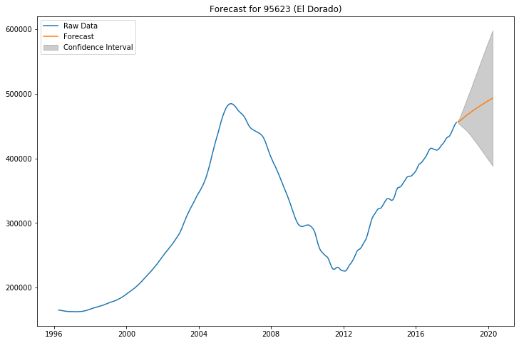


### Print summary of predicted, worst-case, and best-case scenarios


```python
eldorado_95623_pred, eldorado_95623_low, eldorado_95623_high = pred_best_worst(pred=forecasted_price_95623, low=forecasted_lower_95623, 
                                                                               high=forecasted_upper_95623, last=last_value_95623, date='April 1, 2020')
eldorado_95623_pred, eldorado_95623_low, eldorado_95623_high 
```

    By the model prediction, I would expect to see a 8.258% change in price by April 1, 2020.
    At the lower bound of the confidence interval, I would expect to see a -14.768% change in price by April 1, 2020.
    At the upper bound of the confidence interval, I would expect to see a 31.285% change in price by April 1, 2020.


    (8.258, -14.768, 31.285)


## Zip code 95623 (El Dorado):   Good investment opportunity

By the model prediction, I would expect to see a 8.258% change in price by April 1, 2020.
At the lower bound of the confidence interval, I would expect to see a -14.768% change in price by April 1, 2020.
At the upper bound of the confidence interval, I would expect to see a 31.285% change in price by April 1, 2020.

# SacMetro:  95747 (Roseville) -- Potential investment opportunity with more upside than downside potential


```python
geog_area = '95747'
```


```python
ts_95747 = df_sac.loc[df_sac['Zip'] == geog_area]  # ts for all of the following functions should have only one zipcode
ts_95747.head()

```


<div>
<style scoped>
    .dataframe tbody tr th:only-of-type {
        vertical-align: middle;
    }

    .dataframe tbody tr th {
        vertical-align: top;
    }

    .dataframe thead th {
        text-align: right;
    }
</style>
<table border="1" class="dataframe">
  <thead>
    <tr style="text-align: right;">
      <th></th>
      <th>Metro</th>
      <th>MetroState</th>
      <th>CountyName</th>
      <th>City</th>
      <th>Zip</th>
      <th>SizeRank</th>
      <th>value</th>
    </tr>
    <tr>
      <th>time</th>
      <th></th>
      <th></th>
      <th></th>
      <th></th>
      <th></th>
      <th></th>
      <th></th>
    </tr>
  </thead>
  <tbody>
    <tr>
      <td>1996-04-01</td>
      <td>Sacramento</td>
      <td>Sacramento CA</td>
      <td>Placer</td>
      <td>Roseville</td>
      <td>95747</td>
      <td>243</td>
      <td>192700.0</td>
    </tr>
    <tr>
      <td>1996-05-01</td>
      <td>Sacramento</td>
      <td>Sacramento CA</td>
      <td>Placer</td>
      <td>Roseville</td>
      <td>95747</td>
      <td>243</td>
      <td>193700.0</td>
    </tr>
    <tr>
      <td>1996-06-01</td>
      <td>Sacramento</td>
      <td>Sacramento CA</td>
      <td>Placer</td>
      <td>Roseville</td>
      <td>95747</td>
      <td>243</td>
      <td>195000.0</td>
    </tr>
    <tr>
      <td>1996-07-01</td>
      <td>Sacramento</td>
      <td>Sacramento CA</td>
      <td>Placer</td>
      <td>Roseville</td>
      <td>95747</td>
      <td>243</td>
      <td>196500.0</td>
    </tr>
    <tr>
      <td>1996-08-01</td>
      <td>Sacramento</td>
      <td>Sacramento CA</td>
      <td>Placer</td>
      <td>Roseville</td>
      <td>95747</td>
      <td>243</td>
      <td>198100.0</td>
    </tr>
  </tbody>
</table>
</div>


```python
ts_95747.tail()
```


<div>
<style scoped>
    .dataframe tbody tr th:only-of-type {
        vertical-align: middle;
    }

    .dataframe tbody tr th {
        vertical-align: top;
    }

    .dataframe thead th {
        text-align: right;
    }
</style>
<table border="1" class="dataframe">
  <thead>
    <tr style="text-align: right;">
      <th></th>
      <th>Metro</th>
      <th>MetroState</th>
      <th>CountyName</th>
      <th>City</th>
      <th>Zip</th>
      <th>SizeRank</th>
      <th>value</th>
    </tr>
    <tr>
      <th>time</th>
      <th></th>
      <th></th>
      <th></th>
      <th></th>
      <th></th>
      <th></th>
      <th></th>
    </tr>
  </thead>
  <tbody>
    <tr>
      <td>2017-12-01</td>
      <td>Sacramento</td>
      <td>Sacramento CA</td>
      <td>Placer</td>
      <td>Roseville</td>
      <td>95747</td>
      <td>243</td>
      <td>467200.0</td>
    </tr>
    <tr>
      <td>2018-01-01</td>
      <td>Sacramento</td>
      <td>Sacramento CA</td>
      <td>Placer</td>
      <td>Roseville</td>
      <td>95747</td>
      <td>243</td>
      <td>468100.0</td>
    </tr>
    <tr>
      <td>2018-02-01</td>
      <td>Sacramento</td>
      <td>Sacramento CA</td>
      <td>Placer</td>
      <td>Roseville</td>
      <td>95747</td>
      <td>243</td>
      <td>472400.0</td>
    </tr>
    <tr>
      <td>2018-03-01</td>
      <td>Sacramento</td>
      <td>Sacramento CA</td>
      <td>Placer</td>
      <td>Roseville</td>
      <td>95747</td>
      <td>243</td>
      <td>479300.0</td>
    </tr>
    <tr>
      <td>2018-04-01</td>
      <td>Sacramento</td>
      <td>Sacramento CA</td>
      <td>Placer</td>
      <td>Roseville</td>
      <td>95747</td>
      <td>243</td>
      <td>483800.0</td>
    </tr>
  </tbody>
</table>
</div>


```python
# ts = ts.value

ts_95747_values = ts_95747.value
```


```python
# ts.head()

ts_95747_values.head()
```


    time
    1996-04-01    192700.0
    1996-05-01    193700.0
    1996-06-01    195000.0
    1996-07-01    196500.0
    1996-08-01    198100.0
    Name: value, dtype: float64


```python
ts_95747_values.tail()
```


    time
    2017-12-01    467200.0
    2018-01-01    468100.0
    2018-02-01    472400.0
    2018-03-01    479300.0
    2018-04-01    483800.0
    Name: value, dtype: float64


### Visualizations

#### plot_ts:  Plot zip code(s) of interest over time, with market highs and lows


```python
# fig, ax = plot_ts(df_melt, zipcodes=['95616', '92008', '90035', '90025', '60625', '57701'])  # enter desired zip code(s)

fig, ax = plot_ts_zips(df_melt, zipcodes=['95747'], figsize=(12,6))  # enter desired zip code(s)
```


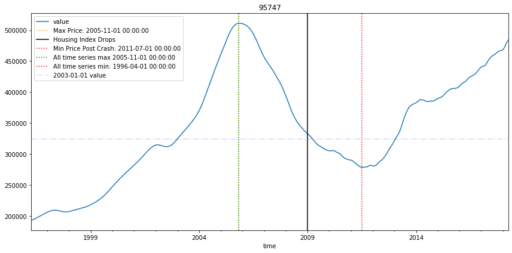


#### Boxplot of zip code


```python
ts_95747.boxplot(column = 'value')
plt.title('95747');

```


### Plot ACF and PACF for ts dataframe


```python
# plot_acf_pacf(ts, figsize=(10,6), lags=15)  # note that ts must only contain values and time as index

plot_acf_pacf(ts_95747_values, figsize=(10,6), lags=15)
```


### Plot seasonal decomposition for ts dataframe


```python
# plot_seasonal_decomp(ts)

plot_seasonal_decomp(ts_95747_values)

# Seasonality does not appear to be a significant factor in this zip code.
```


    (<Figure size 1296x432 with 1 Axes>,
     <matplotlib.axes._subplots.AxesSubplot at 0x1cc33fabe0>)


## ARIMA model parameters and optimization

### Generate list of (p,d,q) and (p,d,q,m) values


```python
p_values = [0, 1, 2, 4, 6, 8]
d_values = range(0, 3)
q_values = range(0, 3)
warnings.filterwarnings("ignore")
```

### Run ARIMA model on ts dataframe with list of p,d,q values 


```python
# eval_arima_models(ts, p_values, d_values, q_values)  # don't run this until you have some time, since it take time
# note that ts must only contain values and time as index

# eval_arima_models(ts_95747_values, p_values, d_values, q_values)  # don't run this until you have some time, since it takes time

```

### Generate model fit summary


```python
# model_fit = arima_zipcode(ts, order = None)   # change order = tuple to correspond to the best MSE produced by previous function

# Best ARIMA(4, 1, 2) MSE=956941.458

model_fit_95747 = arima_zipcode(ts_95747_values, order = (4,1,2))

```

                                 ARIMA Model Results                              
    ==============================================================================
    Dep. Variable:                    D.y   No. Observations:                  264
    Model:                 ARIMA(4, 1, 2)   Log Likelihood               -2072.554
    Method:                       css-mle   S.D. of innovations            613.648
    Date:                Tue, 10 Mar 2020   AIC                           4161.108
    Time:                        22:51:56   BIC                           4189.715
    Sample:                             1   HQIC                          4172.603
                                                                                  
    ==============================================================================
                     coef    std err          z      P>|z|      [0.025      0.975]
    ------------------------------------------------------------------------------
    const        694.9195    282.164      2.463      0.014     141.889    1247.950
    ar.L1.D.y      2.1792      0.097     22.416      0.000       1.989       2.370
    ar.L2.D.y     -1.6973      0.243     -6.983      0.000      -2.174      -1.221
    ar.L3.D.y      0.8149      0.221      3.683      0.000       0.381       1.249
    ar.L4.D.y     -0.2991      0.078     -3.853      0.000      -0.451      -0.147
    ma.L1.D.y     -0.5055      0.084     -6.043      0.000      -0.669      -0.342
    ma.L2.D.y     -0.4945      0.083     -5.959      0.000      -0.657      -0.332
                                        Roots                                    
    =============================================================================
                      Real          Imaginary           Modulus         Frequency
    -----------------------------------------------------------------------------
    AR.1            1.0159           -0.0439j            1.0168           -0.0069
    AR.2            1.0159           +0.0439j            1.0168            0.0069
    AR.3            0.3463           -1.7645j            1.7982           -0.2192
    AR.4            0.3463           +1.7645j            1.7982            0.2192
    MA.1            1.0000           +0.0000j            1.0000            0.0000
    MA.2           -2.0224           +0.0000j            2.0224            0.5000
    -----------------------------------------------------------------------------


## ARIMA modeling results:  predictions and visualization

### Produce forecasts from ARIMA model fit


```python
actual_forecast_95747, std_error_95747, forecast_confint_95747 = forecast(model_fit_95747)

```


```python
actual_forecast_95747, std_error_95747, forecast_confint_95747
```


    (array([485788.47886707, 487803.60041371, 490424.69855712, 492992.38635013,
            495188.0536989 , 497149.48859031, 499007.14402694, 500749.03027275,
            502335.17597917, 503763.91613752, 505050.67765103, 506202.91953545,
            507221.3109836 , 508107.71909395, 508866.54088292, 509502.50370563,
            510019.76771395, 510422.39959308, 510714.73755415, 510901.30915968,
            510986.68723202, 510975.47105242, 510872.31382675, 510681.92161165]),
     array([  613.64755285,  1751.72078376,  3080.50316699,  4468.75538562,
             5936.11460667,  7506.43677654,  9166.18164681, 10890.71047349,
            12664.09523346, 14477.07219438, 16320.97433968, 18186.61800165,
            20065.5087245 , 21950.27503764, 23834.32238968, 25711.5537101 ,
            27576.34040156, 29423.54199697, 31248.475334  , 33046.86654622,
            34814.81947508, 36548.79690556, 38245.60327413, 39902.36672457]),
     array([[484585.75176428, 486991.20596986],
            [484370.29076657, 491236.91006085],
            [484387.02329556, 496462.37381867],
            [484233.7867386 , 501750.98596166],
            [483553.48286171, 506822.62453608],
            [482437.14285606, 511861.83432455],
            [481041.75812345, 516972.52993043],
            [479403.62997865, 522094.43056685],
            [477514.0054248 , 527156.34653354],
            [475389.37603495, 532138.45624009],
            [473062.15575265, 537039.1995494 ],
            [470557.80325162, 541848.03581928],
            [467893.63655211, 546548.9854151 ],
            [465085.97056942, 551129.46761848],
            [462152.12740323, 555580.95436261],
            [459108.78444726, 559896.222964  ],
            [455971.13370149, 564068.40172642],
            [452753.31698142, 568091.48220473],
            [449468.85132772, 571960.62378058],
            [446130.64092718, 575671.97739218],
            [442750.8949326 , 579222.47953144],
            [439341.14543925, 582609.79666558],
            [435912.30884245, 585832.31881106],
            [432474.71993358, 588889.12328971]]))


### Create dataframe to hold forecast results


```python
# df_forecast = forecast_df(col = 'time', daterange = pd.date_range(start='2018-05-01', end='2020-04-01', freq='MS'), 
#                 actual_forecast=actual_forecast, forecast_confint = forecast_confint)

df_forecast_95747 = forecast_df(actual_forecast_95747, forecast_confint_95747, col = 'time', daterange = pd.date_range(start='2018-05-01', end='2020-04-01', freq='MS'))

```

### Create new dataframe concatenating historic values and forecast results


```python
# df_new = concat_values_forecast(ts, df_forecast)

df_new_95747 = concat_values_forecast(ts_95747_values, df_forecast_95747)
```


```python
df_new_95747
```


<div>
<style scoped>
    .dataframe tbody tr th:only-of-type {
        vertical-align: middle;
    }

    .dataframe tbody tr th {
        vertical-align: top;
    }

    .dataframe thead th {
        text-align: right;
    }
</style>
<table border="1" class="dataframe">
  <thead>
    <tr style="text-align: right;">
      <th></th>
      <th>value</th>
      <th>forecast</th>
      <th>forecast_lower</th>
      <th>forecast_upper</th>
    </tr>
    <tr>
      <th>time</th>
      <th></th>
      <th></th>
      <th></th>
      <th></th>
    </tr>
  </thead>
  <tbody>
    <tr>
      <td>1996-04-01</td>
      <td>192700.0</td>
      <td>NaN</td>
      <td>NaN</td>
      <td>NaN</td>
    </tr>
    <tr>
      <td>1996-05-01</td>
      <td>193700.0</td>
      <td>NaN</td>
      <td>NaN</td>
      <td>NaN</td>
    </tr>
    <tr>
      <td>1996-06-01</td>
      <td>195000.0</td>
      <td>NaN</td>
      <td>NaN</td>
      <td>NaN</td>
    </tr>
    <tr>
      <td>1996-07-01</td>
      <td>196500.0</td>
      <td>NaN</td>
      <td>NaN</td>
      <td>NaN</td>
    </tr>
    <tr>
      <td>1996-08-01</td>
      <td>198100.0</td>
      <td>NaN</td>
      <td>NaN</td>
      <td>NaN</td>
    </tr>
    <tr>
      <td>1996-09-01</td>
      <td>199700.0</td>
      <td>NaN</td>
      <td>NaN</td>
      <td>NaN</td>
    </tr>
    <tr>
      <td>1996-10-01</td>
      <td>201300.0</td>
      <td>NaN</td>
      <td>NaN</td>
      <td>NaN</td>
    </tr>
    <tr>
      <td>1996-11-01</td>
      <td>202800.0</td>
      <td>NaN</td>
      <td>NaN</td>
      <td>NaN</td>
    </tr>
    <tr>
      <td>1996-12-01</td>
      <td>204400.0</td>
      <td>NaN</td>
      <td>NaN</td>
      <td>NaN</td>
    </tr>
    <tr>
      <td>1997-01-01</td>
      <td>205900.0</td>
      <td>NaN</td>
      <td>NaN</td>
      <td>NaN</td>
    </tr>
    <tr>
      <td>1997-02-01</td>
      <td>207200.0</td>
      <td>NaN</td>
      <td>NaN</td>
      <td>NaN</td>
    </tr>
    <tr>
      <td>1997-03-01</td>
      <td>208200.0</td>
      <td>NaN</td>
      <td>NaN</td>
      <td>NaN</td>
    </tr>
    <tr>
      <td>1997-04-01</td>
      <td>208800.0</td>
      <td>NaN</td>
      <td>NaN</td>
      <td>NaN</td>
    </tr>
    <tr>
      <td>1997-05-01</td>
      <td>209000.0</td>
      <td>NaN</td>
      <td>NaN</td>
      <td>NaN</td>
    </tr>
    <tr>
      <td>1997-06-01</td>
      <td>208900.0</td>
      <td>NaN</td>
      <td>NaN</td>
      <td>NaN</td>
    </tr>
    <tr>
      <td>1997-07-01</td>
      <td>208500.0</td>
      <td>NaN</td>
      <td>NaN</td>
      <td>NaN</td>
    </tr>
    <tr>
      <td>1997-08-01</td>
      <td>207800.0</td>
      <td>NaN</td>
      <td>NaN</td>
      <td>NaN</td>
    </tr>
    <tr>
      <td>1997-09-01</td>
      <td>207000.0</td>
      <td>NaN</td>
      <td>NaN</td>
      <td>NaN</td>
    </tr>
    <tr>
      <td>1997-10-01</td>
      <td>206500.0</td>
      <td>NaN</td>
      <td>NaN</td>
      <td>NaN</td>
    </tr>
    <tr>
      <td>1997-11-01</td>
      <td>206200.0</td>
      <td>NaN</td>
      <td>NaN</td>
      <td>NaN</td>
    </tr>
    <tr>
      <td>1997-12-01</td>
      <td>206400.0</td>
      <td>NaN</td>
      <td>NaN</td>
      <td>NaN</td>
    </tr>
    <tr>
      <td>1998-01-01</td>
      <td>207000.0</td>
      <td>NaN</td>
      <td>NaN</td>
      <td>NaN</td>
    </tr>
    <tr>
      <td>1998-02-01</td>
      <td>207700.0</td>
      <td>NaN</td>
      <td>NaN</td>
      <td>NaN</td>
    </tr>
    <tr>
      <td>1998-03-01</td>
      <td>208500.0</td>
      <td>NaN</td>
      <td>NaN</td>
      <td>NaN</td>
    </tr>
    <tr>
      <td>1998-04-01</td>
      <td>209300.0</td>
      <td>NaN</td>
      <td>NaN</td>
      <td>NaN</td>
    </tr>
    <tr>
      <td>1998-05-01</td>
      <td>210100.0</td>
      <td>NaN</td>
      <td>NaN</td>
      <td>NaN</td>
    </tr>
    <tr>
      <td>1998-06-01</td>
      <td>210800.0</td>
      <td>NaN</td>
      <td>NaN</td>
      <td>NaN</td>
    </tr>
    <tr>
      <td>1998-07-01</td>
      <td>211600.0</td>
      <td>NaN</td>
      <td>NaN</td>
      <td>NaN</td>
    </tr>
    <tr>
      <td>1998-08-01</td>
      <td>212400.0</td>
      <td>NaN</td>
      <td>NaN</td>
      <td>NaN</td>
    </tr>
    <tr>
      <td>1998-09-01</td>
      <td>213300.0</td>
      <td>NaN</td>
      <td>NaN</td>
      <td>NaN</td>
    </tr>
    <tr>
      <td>1998-10-01</td>
      <td>214200.0</td>
      <td>NaN</td>
      <td>NaN</td>
      <td>NaN</td>
    </tr>
    <tr>
      <td>1998-11-01</td>
      <td>215300.0</td>
      <td>NaN</td>
      <td>NaN</td>
      <td>NaN</td>
    </tr>
    <tr>
      <td>1998-12-01</td>
      <td>216600.0</td>
      <td>NaN</td>
      <td>NaN</td>
      <td>NaN</td>
    </tr>
    <tr>
      <td>1999-01-01</td>
      <td>218000.0</td>
      <td>NaN</td>
      <td>NaN</td>
      <td>NaN</td>
    </tr>
    <tr>
      <td>1999-02-01</td>
      <td>219500.0</td>
      <td>NaN</td>
      <td>NaN</td>
      <td>NaN</td>
    </tr>
    <tr>
      <td>1999-03-01</td>
      <td>221100.0</td>
      <td>NaN</td>
      <td>NaN</td>
      <td>NaN</td>
    </tr>
    <tr>
      <td>1999-04-01</td>
      <td>222800.0</td>
      <td>NaN</td>
      <td>NaN</td>
      <td>NaN</td>
    </tr>
    <tr>
      <td>1999-05-01</td>
      <td>224700.0</td>
      <td>NaN</td>
      <td>NaN</td>
      <td>NaN</td>
    </tr>
    <tr>
      <td>1999-06-01</td>
      <td>226800.0</td>
      <td>NaN</td>
      <td>NaN</td>
      <td>NaN</td>
    </tr>
    <tr>
      <td>1999-07-01</td>
      <td>229100.0</td>
      <td>NaN</td>
      <td>NaN</td>
      <td>NaN</td>
    </tr>
    <tr>
      <td>1999-08-01</td>
      <td>231600.0</td>
      <td>NaN</td>
      <td>NaN</td>
      <td>NaN</td>
    </tr>
    <tr>
      <td>1999-09-01</td>
      <td>234300.0</td>
      <td>NaN</td>
      <td>NaN</td>
      <td>NaN</td>
    </tr>
    <tr>
      <td>1999-10-01</td>
      <td>237300.0</td>
      <td>NaN</td>
      <td>NaN</td>
      <td>NaN</td>
    </tr>
    <tr>
      <td>1999-11-01</td>
      <td>240400.0</td>
      <td>NaN</td>
      <td>NaN</td>
      <td>NaN</td>
    </tr>
    <tr>
      <td>1999-12-01</td>
      <td>243700.0</td>
      <td>NaN</td>
      <td>NaN</td>
      <td>NaN</td>
    </tr>
    <tr>
      <td>2000-01-01</td>
      <td>247200.0</td>
      <td>NaN</td>
      <td>NaN</td>
      <td>NaN</td>
    </tr>
    <tr>
      <td>2000-02-01</td>
      <td>250500.0</td>
      <td>NaN</td>
      <td>NaN</td>
      <td>NaN</td>
    </tr>
    <tr>
      <td>2000-03-01</td>
      <td>253700.0</td>
      <td>NaN</td>
      <td>NaN</td>
      <td>NaN</td>
    </tr>
    <tr>
      <td>2000-04-01</td>
      <td>256800.0</td>
      <td>NaN</td>
      <td>NaN</td>
      <td>NaN</td>
    </tr>
    <tr>
      <td>2000-05-01</td>
      <td>259800.0</td>
      <td>NaN</td>
      <td>NaN</td>
      <td>NaN</td>
    </tr>
    <tr>
      <td>2000-06-01</td>
      <td>262700.0</td>
      <td>NaN</td>
      <td>NaN</td>
      <td>NaN</td>
    </tr>
    <tr>
      <td>2000-07-01</td>
      <td>265600.0</td>
      <td>NaN</td>
      <td>NaN</td>
      <td>NaN</td>
    </tr>
    <tr>
      <td>2000-08-01</td>
      <td>268400.0</td>
      <td>NaN</td>
      <td>NaN</td>
      <td>NaN</td>
    </tr>
    <tr>
      <td>2000-09-01</td>
      <td>271100.0</td>
      <td>NaN</td>
      <td>NaN</td>
      <td>NaN</td>
    </tr>
    <tr>
      <td>2000-10-01</td>
      <td>273800.0</td>
      <td>NaN</td>
      <td>NaN</td>
      <td>NaN</td>
    </tr>
    <tr>
      <td>2000-11-01</td>
      <td>276500.0</td>
      <td>NaN</td>
      <td>NaN</td>
      <td>NaN</td>
    </tr>
    <tr>
      <td>2000-12-01</td>
      <td>279200.0</td>
      <td>NaN</td>
      <td>NaN</td>
      <td>NaN</td>
    </tr>
    <tr>
      <td>2001-01-01</td>
      <td>281900.0</td>
      <td>NaN</td>
      <td>NaN</td>
      <td>NaN</td>
    </tr>
    <tr>
      <td>2001-02-01</td>
      <td>284600.0</td>
      <td>NaN</td>
      <td>NaN</td>
      <td>NaN</td>
    </tr>
    <tr>
      <td>2001-03-01</td>
      <td>287400.0</td>
      <td>NaN</td>
      <td>NaN</td>
      <td>NaN</td>
    </tr>
    <tr>
      <td>2001-04-01</td>
      <td>290400.0</td>
      <td>NaN</td>
      <td>NaN</td>
      <td>NaN</td>
    </tr>
    <tr>
      <td>2001-05-01</td>
      <td>293500.0</td>
      <td>NaN</td>
      <td>NaN</td>
      <td>NaN</td>
    </tr>
    <tr>
      <td>2001-06-01</td>
      <td>296700.0</td>
      <td>NaN</td>
      <td>NaN</td>
      <td>NaN</td>
    </tr>
    <tr>
      <td>2001-07-01</td>
      <td>300100.0</td>
      <td>NaN</td>
      <td>NaN</td>
      <td>NaN</td>
    </tr>
    <tr>
      <td>2001-08-01</td>
      <td>303400.0</td>
      <td>NaN</td>
      <td>NaN</td>
      <td>NaN</td>
    </tr>
    <tr>
      <td>2001-09-01</td>
      <td>306400.0</td>
      <td>NaN</td>
      <td>NaN</td>
      <td>NaN</td>
    </tr>
    <tr>
      <td>2001-10-01</td>
      <td>309200.0</td>
      <td>NaN</td>
      <td>NaN</td>
      <td>NaN</td>
    </tr>
    <tr>
      <td>2001-11-01</td>
      <td>311500.0</td>
      <td>NaN</td>
      <td>NaN</td>
      <td>NaN</td>
    </tr>
    <tr>
      <td>2001-12-01</td>
      <td>313300.0</td>
      <td>NaN</td>
      <td>NaN</td>
      <td>NaN</td>
    </tr>
    <tr>
      <td>2002-01-01</td>
      <td>314400.0</td>
      <td>NaN</td>
      <td>NaN</td>
      <td>NaN</td>
    </tr>
    <tr>
      <td>2002-02-01</td>
      <td>314700.0</td>
      <td>NaN</td>
      <td>NaN</td>
      <td>NaN</td>
    </tr>
    <tr>
      <td>2002-03-01</td>
      <td>314400.0</td>
      <td>NaN</td>
      <td>NaN</td>
      <td>NaN</td>
    </tr>
    <tr>
      <td>2002-04-01</td>
      <td>313500.0</td>
      <td>NaN</td>
      <td>NaN</td>
      <td>NaN</td>
    </tr>
    <tr>
      <td>2002-05-01</td>
      <td>312600.0</td>
      <td>NaN</td>
      <td>NaN</td>
      <td>NaN</td>
    </tr>
    <tr>
      <td>2002-06-01</td>
      <td>312000.0</td>
      <td>NaN</td>
      <td>NaN</td>
      <td>NaN</td>
    </tr>
    <tr>
      <td>2002-07-01</td>
      <td>311700.0</td>
      <td>NaN</td>
      <td>NaN</td>
      <td>NaN</td>
    </tr>
    <tr>
      <td>2002-08-01</td>
      <td>312100.0</td>
      <td>NaN</td>
      <td>NaN</td>
      <td>NaN</td>
    </tr>
    <tr>
      <td>2002-09-01</td>
      <td>313300.0</td>
      <td>NaN</td>
      <td>NaN</td>
      <td>NaN</td>
    </tr>
    <tr>
      <td>2002-10-01</td>
      <td>315100.0</td>
      <td>NaN</td>
      <td>NaN</td>
      <td>NaN</td>
    </tr>
    <tr>
      <td>2002-11-01</td>
      <td>317700.0</td>
      <td>NaN</td>
      <td>NaN</td>
      <td>NaN</td>
    </tr>
    <tr>
      <td>2002-12-01</td>
      <td>320900.0</td>
      <td>NaN</td>
      <td>NaN</td>
      <td>NaN</td>
    </tr>
    <tr>
      <td>2003-01-01</td>
      <td>324400.0</td>
      <td>NaN</td>
      <td>NaN</td>
      <td>NaN</td>
    </tr>
    <tr>
      <td>2003-02-01</td>
      <td>327900.0</td>
      <td>NaN</td>
      <td>NaN</td>
      <td>NaN</td>
    </tr>
    <tr>
      <td>2003-03-01</td>
      <td>331400.0</td>
      <td>NaN</td>
      <td>NaN</td>
      <td>NaN</td>
    </tr>
    <tr>
      <td>2003-04-01</td>
      <td>334700.0</td>
      <td>NaN</td>
      <td>NaN</td>
      <td>NaN</td>
    </tr>
    <tr>
      <td>2003-05-01</td>
      <td>338000.0</td>
      <td>NaN</td>
      <td>NaN</td>
      <td>NaN</td>
    </tr>
    <tr>
      <td>2003-06-01</td>
      <td>341300.0</td>
      <td>NaN</td>
      <td>NaN</td>
      <td>NaN</td>
    </tr>
    <tr>
      <td>2003-07-01</td>
      <td>344700.0</td>
      <td>NaN</td>
      <td>NaN</td>
      <td>NaN</td>
    </tr>
    <tr>
      <td>2003-08-01</td>
      <td>348200.0</td>
      <td>NaN</td>
      <td>NaN</td>
      <td>NaN</td>
    </tr>
    <tr>
      <td>2003-09-01</td>
      <td>352000.0</td>
      <td>NaN</td>
      <td>NaN</td>
      <td>NaN</td>
    </tr>
    <tr>
      <td>2003-10-01</td>
      <td>355900.0</td>
      <td>NaN</td>
      <td>NaN</td>
      <td>NaN</td>
    </tr>
    <tr>
      <td>2003-11-01</td>
      <td>360100.0</td>
      <td>NaN</td>
      <td>NaN</td>
      <td>NaN</td>
    </tr>
    <tr>
      <td>2003-12-01</td>
      <td>364700.0</td>
      <td>NaN</td>
      <td>NaN</td>
      <td>NaN</td>
    </tr>
    <tr>
      <td>2004-01-01</td>
      <td>369900.0</td>
      <td>NaN</td>
      <td>NaN</td>
      <td>NaN</td>
    </tr>
    <tr>
      <td>2004-02-01</td>
      <td>376000.0</td>
      <td>NaN</td>
      <td>NaN</td>
      <td>NaN</td>
    </tr>
    <tr>
      <td>2004-03-01</td>
      <td>383100.0</td>
      <td>NaN</td>
      <td>NaN</td>
      <td>NaN</td>
    </tr>
    <tr>
      <td>2004-04-01</td>
      <td>390900.0</td>
      <td>NaN</td>
      <td>NaN</td>
      <td>NaN</td>
    </tr>
    <tr>
      <td>2004-05-01</td>
      <td>398900.0</td>
      <td>NaN</td>
      <td>NaN</td>
      <td>NaN</td>
    </tr>
    <tr>
      <td>2004-06-01</td>
      <td>406900.0</td>
      <td>NaN</td>
      <td>NaN</td>
      <td>NaN</td>
    </tr>
    <tr>
      <td>2004-07-01</td>
      <td>415100.0</td>
      <td>NaN</td>
      <td>NaN</td>
      <td>NaN</td>
    </tr>
    <tr>
      <td>2004-08-01</td>
      <td>423000.0</td>
      <td>NaN</td>
      <td>NaN</td>
      <td>NaN</td>
    </tr>
    <tr>
      <td>2004-09-01</td>
      <td>430800.0</td>
      <td>NaN</td>
      <td>NaN</td>
      <td>NaN</td>
    </tr>
    <tr>
      <td>2004-10-01</td>
      <td>438600.0</td>
      <td>NaN</td>
      <td>NaN</td>
      <td>NaN</td>
    </tr>
    <tr>
      <td>2004-11-01</td>
      <td>446200.0</td>
      <td>NaN</td>
      <td>NaN</td>
      <td>NaN</td>
    </tr>
    <tr>
      <td>2004-12-01</td>
      <td>453900.0</td>
      <td>NaN</td>
      <td>NaN</td>
      <td>NaN</td>
    </tr>
    <tr>
      <td>2005-01-01</td>
      <td>461300.0</td>
      <td>NaN</td>
      <td>NaN</td>
      <td>NaN</td>
    </tr>
    <tr>
      <td>2005-02-01</td>
      <td>468300.0</td>
      <td>NaN</td>
      <td>NaN</td>
      <td>NaN</td>
    </tr>
    <tr>
      <td>2005-03-01</td>
      <td>475400.0</td>
      <td>NaN</td>
      <td>NaN</td>
      <td>NaN</td>
    </tr>
    <tr>
      <td>2005-04-01</td>
      <td>482800.0</td>
      <td>NaN</td>
      <td>NaN</td>
      <td>NaN</td>
    </tr>
    <tr>
      <td>2005-05-01</td>
      <td>490000.0</td>
      <td>NaN</td>
      <td>NaN</td>
      <td>NaN</td>
    </tr>
    <tr>
      <td>2005-06-01</td>
      <td>496600.0</td>
      <td>NaN</td>
      <td>NaN</td>
      <td>NaN</td>
    </tr>
    <tr>
      <td>2005-07-01</td>
      <td>502000.0</td>
      <td>NaN</td>
      <td>NaN</td>
      <td>NaN</td>
    </tr>
    <tr>
      <td>2005-08-01</td>
      <td>506100.0</td>
      <td>NaN</td>
      <td>NaN</td>
      <td>NaN</td>
    </tr>
    <tr>
      <td>2005-09-01</td>
      <td>509000.0</td>
      <td>NaN</td>
      <td>NaN</td>
      <td>NaN</td>
    </tr>
    <tr>
      <td>2005-10-01</td>
      <td>510700.0</td>
      <td>NaN</td>
      <td>NaN</td>
      <td>NaN</td>
    </tr>
    <tr>
      <td>2005-11-01</td>
      <td>511300.0</td>
      <td>NaN</td>
      <td>NaN</td>
      <td>NaN</td>
    </tr>
    <tr>
      <td>2005-12-01</td>
      <td>511100.0</td>
      <td>NaN</td>
      <td>NaN</td>
      <td>NaN</td>
    </tr>
    <tr>
      <td>2006-01-01</td>
      <td>510600.0</td>
      <td>NaN</td>
      <td>NaN</td>
      <td>NaN</td>
    </tr>
    <tr>
      <td>2006-02-01</td>
      <td>509500.0</td>
      <td>NaN</td>
      <td>NaN</td>
      <td>NaN</td>
    </tr>
    <tr>
      <td>2006-03-01</td>
      <td>507800.0</td>
      <td>NaN</td>
      <td>NaN</td>
      <td>NaN</td>
    </tr>
    <tr>
      <td>2006-04-01</td>
      <td>505600.0</td>
      <td>NaN</td>
      <td>NaN</td>
      <td>NaN</td>
    </tr>
    <tr>
      <td>2006-05-01</td>
      <td>502700.0</td>
      <td>NaN</td>
      <td>NaN</td>
      <td>NaN</td>
    </tr>
    <tr>
      <td>2006-06-01</td>
      <td>498900.0</td>
      <td>NaN</td>
      <td>NaN</td>
      <td>NaN</td>
    </tr>
    <tr>
      <td>2006-07-01</td>
      <td>494000.0</td>
      <td>NaN</td>
      <td>NaN</td>
      <td>NaN</td>
    </tr>
    <tr>
      <td>2006-08-01</td>
      <td>488100.0</td>
      <td>NaN</td>
      <td>NaN</td>
      <td>NaN</td>
    </tr>
    <tr>
      <td>2006-09-01</td>
      <td>481800.0</td>
      <td>NaN</td>
      <td>NaN</td>
      <td>NaN</td>
    </tr>
    <tr>
      <td>2006-10-01</td>
      <td>475100.0</td>
      <td>NaN</td>
      <td>NaN</td>
      <td>NaN</td>
    </tr>
    <tr>
      <td>2006-11-01</td>
      <td>468400.0</td>
      <td>NaN</td>
      <td>NaN</td>
      <td>NaN</td>
    </tr>
    <tr>
      <td>2006-12-01</td>
      <td>461900.0</td>
      <td>NaN</td>
      <td>NaN</td>
      <td>NaN</td>
    </tr>
    <tr>
      <td>2007-01-01</td>
      <td>456300.0</td>
      <td>NaN</td>
      <td>NaN</td>
      <td>NaN</td>
    </tr>
    <tr>
      <td>2007-02-01</td>
      <td>451500.0</td>
      <td>NaN</td>
      <td>NaN</td>
      <td>NaN</td>
    </tr>
    <tr>
      <td>2007-03-01</td>
      <td>447100.0</td>
      <td>NaN</td>
      <td>NaN</td>
      <td>NaN</td>
    </tr>
    <tr>
      <td>2007-04-01</td>
      <td>442700.0</td>
      <td>NaN</td>
      <td>NaN</td>
      <td>NaN</td>
    </tr>
    <tr>
      <td>2007-05-01</td>
      <td>438600.0</td>
      <td>NaN</td>
      <td>NaN</td>
      <td>NaN</td>
    </tr>
    <tr>
      <td>2007-06-01</td>
      <td>434000.0</td>
      <td>NaN</td>
      <td>NaN</td>
      <td>NaN</td>
    </tr>
    <tr>
      <td>2007-07-01</td>
      <td>429100.0</td>
      <td>NaN</td>
      <td>NaN</td>
      <td>NaN</td>
    </tr>
    <tr>
      <td>2007-08-01</td>
      <td>424000.0</td>
      <td>NaN</td>
      <td>NaN</td>
      <td>NaN</td>
    </tr>
    <tr>
      <td>2007-09-01</td>
      <td>419100.0</td>
      <td>NaN</td>
      <td>NaN</td>
      <td>NaN</td>
    </tr>
    <tr>
      <td>2007-10-01</td>
      <td>413800.0</td>
      <td>NaN</td>
      <td>NaN</td>
      <td>NaN</td>
    </tr>
    <tr>
      <td>2007-11-01</td>
      <td>407900.0</td>
      <td>NaN</td>
      <td>NaN</td>
      <td>NaN</td>
    </tr>
    <tr>
      <td>2007-12-01</td>
      <td>400900.0</td>
      <td>NaN</td>
      <td>NaN</td>
      <td>NaN</td>
    </tr>
    <tr>
      <td>2008-01-01</td>
      <td>393600.0</td>
      <td>NaN</td>
      <td>NaN</td>
      <td>NaN</td>
    </tr>
    <tr>
      <td>2008-02-01</td>
      <td>386000.0</td>
      <td>NaN</td>
      <td>NaN</td>
      <td>NaN</td>
    </tr>
    <tr>
      <td>2008-03-01</td>
      <td>378000.0</td>
      <td>NaN</td>
      <td>NaN</td>
      <td>NaN</td>
    </tr>
    <tr>
      <td>2008-04-01</td>
      <td>370300.0</td>
      <td>NaN</td>
      <td>NaN</td>
      <td>NaN</td>
    </tr>
    <tr>
      <td>2008-05-01</td>
      <td>363700.0</td>
      <td>NaN</td>
      <td>NaN</td>
      <td>NaN</td>
    </tr>
    <tr>
      <td>2008-06-01</td>
      <td>357900.0</td>
      <td>NaN</td>
      <td>NaN</td>
      <td>NaN</td>
    </tr>
    <tr>
      <td>2008-07-01</td>
      <td>352900.0</td>
      <td>NaN</td>
      <td>NaN</td>
      <td>NaN</td>
    </tr>
    <tr>
      <td>2008-08-01</td>
      <td>348600.0</td>
      <td>NaN</td>
      <td>NaN</td>
      <td>NaN</td>
    </tr>
    <tr>
      <td>2008-09-01</td>
      <td>345000.0</td>
      <td>NaN</td>
      <td>NaN</td>
      <td>NaN</td>
    </tr>
    <tr>
      <td>2008-10-01</td>
      <td>341600.0</td>
      <td>NaN</td>
      <td>NaN</td>
      <td>NaN</td>
    </tr>
    <tr>
      <td>2008-11-01</td>
      <td>338400.0</td>
      <td>NaN</td>
      <td>NaN</td>
      <td>NaN</td>
    </tr>
    <tr>
      <td>2008-12-01</td>
      <td>335400.0</td>
      <td>NaN</td>
      <td>NaN</td>
      <td>NaN</td>
    </tr>
    <tr>
      <td>2009-01-01</td>
      <td>332700.0</td>
      <td>NaN</td>
      <td>NaN</td>
      <td>NaN</td>
    </tr>
    <tr>
      <td>2009-02-01</td>
      <td>330100.0</td>
      <td>NaN</td>
      <td>NaN</td>
      <td>NaN</td>
    </tr>
    <tr>
      <td>2009-03-01</td>
      <td>327000.0</td>
      <td>NaN</td>
      <td>NaN</td>
      <td>NaN</td>
    </tr>
    <tr>
      <td>2009-04-01</td>
      <td>323400.0</td>
      <td>NaN</td>
      <td>NaN</td>
      <td>NaN</td>
    </tr>
    <tr>
      <td>2009-05-01</td>
      <td>319700.0</td>
      <td>NaN</td>
      <td>NaN</td>
      <td>NaN</td>
    </tr>
    <tr>
      <td>2009-06-01</td>
      <td>316300.0</td>
      <td>NaN</td>
      <td>NaN</td>
      <td>NaN</td>
    </tr>
    <tr>
      <td>2009-07-01</td>
      <td>314100.0</td>
      <td>NaN</td>
      <td>NaN</td>
      <td>NaN</td>
    </tr>
    <tr>
      <td>2009-08-01</td>
      <td>312400.0</td>
      <td>NaN</td>
      <td>NaN</td>
      <td>NaN</td>
    </tr>
    <tr>
      <td>2009-09-01</td>
      <td>310400.0</td>
      <td>NaN</td>
      <td>NaN</td>
      <td>NaN</td>
    </tr>
    <tr>
      <td>2009-10-01</td>
      <td>308500.0</td>
      <td>NaN</td>
      <td>NaN</td>
      <td>NaN</td>
    </tr>
    <tr>
      <td>2009-11-01</td>
      <td>306900.0</td>
      <td>NaN</td>
      <td>NaN</td>
      <td>NaN</td>
    </tr>
    <tr>
      <td>2009-12-01</td>
      <td>306000.0</td>
      <td>NaN</td>
      <td>NaN</td>
      <td>NaN</td>
    </tr>
    <tr>
      <td>2010-01-01</td>
      <td>305100.0</td>
      <td>NaN</td>
      <td>NaN</td>
      <td>NaN</td>
    </tr>
    <tr>
      <td>2010-02-01</td>
      <td>305200.0</td>
      <td>NaN</td>
      <td>NaN</td>
      <td>NaN</td>
    </tr>
    <tr>
      <td>2010-03-01</td>
      <td>305400.0</td>
      <td>NaN</td>
      <td>NaN</td>
      <td>NaN</td>
    </tr>
    <tr>
      <td>2010-04-01</td>
      <td>304800.0</td>
      <td>NaN</td>
      <td>NaN</td>
      <td>NaN</td>
    </tr>
    <tr>
      <td>2010-05-01</td>
      <td>303000.0</td>
      <td>NaN</td>
      <td>NaN</td>
      <td>NaN</td>
    </tr>
    <tr>
      <td>2010-06-01</td>
      <td>301800.0</td>
      <td>NaN</td>
      <td>NaN</td>
      <td>NaN</td>
    </tr>
    <tr>
      <td>2010-07-01</td>
      <td>300100.0</td>
      <td>NaN</td>
      <td>NaN</td>
      <td>NaN</td>
    </tr>
    <tr>
      <td>2010-08-01</td>
      <td>297000.0</td>
      <td>NaN</td>
      <td>NaN</td>
      <td>NaN</td>
    </tr>
    <tr>
      <td>2010-09-01</td>
      <td>294100.0</td>
      <td>NaN</td>
      <td>NaN</td>
      <td>NaN</td>
    </tr>
    <tr>
      <td>2010-10-01</td>
      <td>292600.0</td>
      <td>NaN</td>
      <td>NaN</td>
      <td>NaN</td>
    </tr>
    <tr>
      <td>2010-11-01</td>
      <td>291400.0</td>
      <td>NaN</td>
      <td>NaN</td>
      <td>NaN</td>
    </tr>
    <tr>
      <td>2010-12-01</td>
      <td>290500.0</td>
      <td>NaN</td>
      <td>NaN</td>
      <td>NaN</td>
    </tr>
    <tr>
      <td>2011-01-01</td>
      <td>290100.0</td>
      <td>NaN</td>
      <td>NaN</td>
      <td>NaN</td>
    </tr>
    <tr>
      <td>2011-02-01</td>
      <td>288600.0</td>
      <td>NaN</td>
      <td>NaN</td>
      <td>NaN</td>
    </tr>
    <tr>
      <td>2011-03-01</td>
      <td>286300.0</td>
      <td>NaN</td>
      <td>NaN</td>
      <td>NaN</td>
    </tr>
    <tr>
      <td>2011-04-01</td>
      <td>283800.0</td>
      <td>NaN</td>
      <td>NaN</td>
      <td>NaN</td>
    </tr>
    <tr>
      <td>2011-05-01</td>
      <td>281400.0</td>
      <td>NaN</td>
      <td>NaN</td>
      <td>NaN</td>
    </tr>
    <tr>
      <td>2011-06-01</td>
      <td>279500.0</td>
      <td>NaN</td>
      <td>NaN</td>
      <td>NaN</td>
    </tr>
    <tr>
      <td>2011-07-01</td>
      <td>278300.0</td>
      <td>NaN</td>
      <td>NaN</td>
      <td>NaN</td>
    </tr>
    <tr>
      <td>2011-08-01</td>
      <td>278600.0</td>
      <td>NaN</td>
      <td>NaN</td>
      <td>NaN</td>
    </tr>
    <tr>
      <td>2011-09-01</td>
      <td>278800.0</td>
      <td>NaN</td>
      <td>NaN</td>
      <td>NaN</td>
    </tr>
    <tr>
      <td>2011-10-01</td>
      <td>279300.0</td>
      <td>NaN</td>
      <td>NaN</td>
      <td>NaN</td>
    </tr>
    <tr>
      <td>2011-11-01</td>
      <td>280800.0</td>
      <td>NaN</td>
      <td>NaN</td>
      <td>NaN</td>
    </tr>
    <tr>
      <td>2011-12-01</td>
      <td>281800.0</td>
      <td>NaN</td>
      <td>NaN</td>
      <td>NaN</td>
    </tr>
    <tr>
      <td>2012-01-01</td>
      <td>280900.0</td>
      <td>NaN</td>
      <td>NaN</td>
      <td>NaN</td>
    </tr>
    <tr>
      <td>2012-02-01</td>
      <td>280500.0</td>
      <td>NaN</td>
      <td>NaN</td>
      <td>NaN</td>
    </tr>
    <tr>
      <td>2012-03-01</td>
      <td>282000.0</td>
      <td>NaN</td>
      <td>NaN</td>
      <td>NaN</td>
    </tr>
    <tr>
      <td>2012-04-01</td>
      <td>285200.0</td>
      <td>NaN</td>
      <td>NaN</td>
      <td>NaN</td>
    </tr>
    <tr>
      <td>2012-05-01</td>
      <td>288000.0</td>
      <td>NaN</td>
      <td>NaN</td>
      <td>NaN</td>
    </tr>
    <tr>
      <td>2012-06-01</td>
      <td>290100.0</td>
      <td>NaN</td>
      <td>NaN</td>
      <td>NaN</td>
    </tr>
    <tr>
      <td>2012-07-01</td>
      <td>293200.0</td>
      <td>NaN</td>
      <td>NaN</td>
      <td>NaN</td>
    </tr>
    <tr>
      <td>2012-08-01</td>
      <td>297000.0</td>
      <td>NaN</td>
      <td>NaN</td>
      <td>NaN</td>
    </tr>
    <tr>
      <td>2012-09-01</td>
      <td>301600.0</td>
      <td>NaN</td>
      <td>NaN</td>
      <td>NaN</td>
    </tr>
    <tr>
      <td>2012-10-01</td>
      <td>306900.0</td>
      <td>NaN</td>
      <td>NaN</td>
      <td>NaN</td>
    </tr>
    <tr>
      <td>2012-11-01</td>
      <td>311300.0</td>
      <td>NaN</td>
      <td>NaN</td>
      <td>NaN</td>
    </tr>
    <tr>
      <td>2012-12-01</td>
      <td>315800.0</td>
      <td>NaN</td>
      <td>NaN</td>
      <td>NaN</td>
    </tr>
    <tr>
      <td>2013-01-01</td>
      <td>321200.0</td>
      <td>NaN</td>
      <td>NaN</td>
      <td>NaN</td>
    </tr>
    <tr>
      <td>2013-02-01</td>
      <td>326300.0</td>
      <td>NaN</td>
      <td>NaN</td>
      <td>NaN</td>
    </tr>
    <tr>
      <td>2013-03-01</td>
      <td>331100.0</td>
      <td>NaN</td>
      <td>NaN</td>
      <td>NaN</td>
    </tr>
    <tr>
      <td>2013-04-01</td>
      <td>336800.0</td>
      <td>NaN</td>
      <td>NaN</td>
      <td>NaN</td>
    </tr>
    <tr>
      <td>2013-05-01</td>
      <td>344900.0</td>
      <td>NaN</td>
      <td>NaN</td>
      <td>NaN</td>
    </tr>
    <tr>
      <td>2013-06-01</td>
      <td>354300.0</td>
      <td>NaN</td>
      <td>NaN</td>
      <td>NaN</td>
    </tr>
    <tr>
      <td>2013-07-01</td>
      <td>362400.0</td>
      <td>NaN</td>
      <td>NaN</td>
      <td>NaN</td>
    </tr>
    <tr>
      <td>2013-08-01</td>
      <td>369200.0</td>
      <td>NaN</td>
      <td>NaN</td>
      <td>NaN</td>
    </tr>
    <tr>
      <td>2013-09-01</td>
      <td>375000.0</td>
      <td>NaN</td>
      <td>NaN</td>
      <td>NaN</td>
    </tr>
    <tr>
      <td>2013-10-01</td>
      <td>378000.0</td>
      <td>NaN</td>
      <td>NaN</td>
      <td>NaN</td>
    </tr>
    <tr>
      <td>2013-11-01</td>
      <td>379900.0</td>
      <td>NaN</td>
      <td>NaN</td>
      <td>NaN</td>
    </tr>
    <tr>
      <td>2013-12-01</td>
      <td>381400.0</td>
      <td>NaN</td>
      <td>NaN</td>
      <td>NaN</td>
    </tr>
    <tr>
      <td>2014-01-01</td>
      <td>382600.0</td>
      <td>NaN</td>
      <td>NaN</td>
      <td>NaN</td>
    </tr>
    <tr>
      <td>2014-02-01</td>
      <td>384900.0</td>
      <td>NaN</td>
      <td>NaN</td>
      <td>NaN</td>
    </tr>
    <tr>
      <td>2014-03-01</td>
      <td>387400.0</td>
      <td>NaN</td>
      <td>NaN</td>
      <td>NaN</td>
    </tr>
    <tr>
      <td>2014-04-01</td>
      <td>387800.0</td>
      <td>NaN</td>
      <td>NaN</td>
      <td>NaN</td>
    </tr>
    <tr>
      <td>2014-05-01</td>
      <td>387200.0</td>
      <td>NaN</td>
      <td>NaN</td>
      <td>NaN</td>
    </tr>
    <tr>
      <td>2014-06-01</td>
      <td>386000.0</td>
      <td>NaN</td>
      <td>NaN</td>
      <td>NaN</td>
    </tr>
    <tr>
      <td>2014-07-01</td>
      <td>384700.0</td>
      <td>NaN</td>
      <td>NaN</td>
      <td>NaN</td>
    </tr>
    <tr>
      <td>2014-08-01</td>
      <td>384700.0</td>
      <td>NaN</td>
      <td>NaN</td>
      <td>NaN</td>
    </tr>
    <tr>
      <td>2014-09-01</td>
      <td>385500.0</td>
      <td>NaN</td>
      <td>NaN</td>
      <td>NaN</td>
    </tr>
    <tr>
      <td>2014-10-01</td>
      <td>385300.0</td>
      <td>NaN</td>
      <td>NaN</td>
      <td>NaN</td>
    </tr>
    <tr>
      <td>2014-11-01</td>
      <td>385800.0</td>
      <td>NaN</td>
      <td>NaN</td>
      <td>NaN</td>
    </tr>
    <tr>
      <td>2014-12-01</td>
      <td>387700.0</td>
      <td>NaN</td>
      <td>NaN</td>
      <td>NaN</td>
    </tr>
    <tr>
      <td>2015-01-01</td>
      <td>389700.0</td>
      <td>NaN</td>
      <td>NaN</td>
      <td>NaN</td>
    </tr>
    <tr>
      <td>2015-02-01</td>
      <td>390700.0</td>
      <td>NaN</td>
      <td>NaN</td>
      <td>NaN</td>
    </tr>
    <tr>
      <td>2015-03-01</td>
      <td>391800.0</td>
      <td>NaN</td>
      <td>NaN</td>
      <td>NaN</td>
    </tr>
    <tr>
      <td>2015-04-01</td>
      <td>394000.0</td>
      <td>NaN</td>
      <td>NaN</td>
      <td>NaN</td>
    </tr>
    <tr>
      <td>2015-05-01</td>
      <td>397500.0</td>
      <td>NaN</td>
      <td>NaN</td>
      <td>NaN</td>
    </tr>
    <tr>
      <td>2015-06-01</td>
      <td>400300.0</td>
      <td>NaN</td>
      <td>NaN</td>
      <td>NaN</td>
    </tr>
    <tr>
      <td>2015-07-01</td>
      <td>402600.0</td>
      <td>NaN</td>
      <td>NaN</td>
      <td>NaN</td>
    </tr>
    <tr>
      <td>2015-08-01</td>
      <td>404700.0</td>
      <td>NaN</td>
      <td>NaN</td>
      <td>NaN</td>
    </tr>
    <tr>
      <td>2015-09-01</td>
      <td>405500.0</td>
      <td>NaN</td>
      <td>NaN</td>
      <td>NaN</td>
    </tr>
    <tr>
      <td>2015-10-01</td>
      <td>405900.0</td>
      <td>NaN</td>
      <td>NaN</td>
      <td>NaN</td>
    </tr>
    <tr>
      <td>2015-11-01</td>
      <td>406300.0</td>
      <td>NaN</td>
      <td>NaN</td>
      <td>NaN</td>
    </tr>
    <tr>
      <td>2015-12-01</td>
      <td>407100.0</td>
      <td>NaN</td>
      <td>NaN</td>
      <td>NaN</td>
    </tr>
    <tr>
      <td>2016-01-01</td>
      <td>409300.0</td>
      <td>NaN</td>
      <td>NaN</td>
      <td>NaN</td>
    </tr>
    <tr>
      <td>2016-02-01</td>
      <td>412700.0</td>
      <td>NaN</td>
      <td>NaN</td>
      <td>NaN</td>
    </tr>
    <tr>
      <td>2016-03-01</td>
      <td>414800.0</td>
      <td>NaN</td>
      <td>NaN</td>
      <td>NaN</td>
    </tr>
    <tr>
      <td>2016-04-01</td>
      <td>416400.0</td>
      <td>NaN</td>
      <td>NaN</td>
      <td>NaN</td>
    </tr>
    <tr>
      <td>2016-05-01</td>
      <td>419200.0</td>
      <td>NaN</td>
      <td>NaN</td>
      <td>NaN</td>
    </tr>
    <tr>
      <td>2016-06-01</td>
      <td>422400.0</td>
      <td>NaN</td>
      <td>NaN</td>
      <td>NaN</td>
    </tr>
    <tr>
      <td>2016-07-01</td>
      <td>424600.0</td>
      <td>NaN</td>
      <td>NaN</td>
      <td>NaN</td>
    </tr>
    <tr>
      <td>2016-08-01</td>
      <td>426300.0</td>
      <td>NaN</td>
      <td>NaN</td>
      <td>NaN</td>
    </tr>
    <tr>
      <td>2016-09-01</td>
      <td>427700.0</td>
      <td>NaN</td>
      <td>NaN</td>
      <td>NaN</td>
    </tr>
    <tr>
      <td>2016-10-01</td>
      <td>430000.0</td>
      <td>NaN</td>
      <td>NaN</td>
      <td>NaN</td>
    </tr>
    <tr>
      <td>2016-11-01</td>
      <td>433400.0</td>
      <td>NaN</td>
      <td>NaN</td>
      <td>NaN</td>
    </tr>
    <tr>
      <td>2016-12-01</td>
      <td>437300.0</td>
      <td>NaN</td>
      <td>NaN</td>
      <td>NaN</td>
    </tr>
    <tr>
      <td>2017-01-01</td>
      <td>440500.0</td>
      <td>NaN</td>
      <td>NaN</td>
      <td>NaN</td>
    </tr>
    <tr>
      <td>2017-02-01</td>
      <td>441700.0</td>
      <td>NaN</td>
      <td>NaN</td>
      <td>NaN</td>
    </tr>
    <tr>
      <td>2017-03-01</td>
      <td>442600.0</td>
      <td>NaN</td>
      <td>NaN</td>
      <td>NaN</td>
    </tr>
    <tr>
      <td>2017-04-01</td>
      <td>446200.0</td>
      <td>NaN</td>
      <td>NaN</td>
      <td>NaN</td>
    </tr>
    <tr>
      <td>2017-05-01</td>
      <td>451400.0</td>
      <td>NaN</td>
      <td>NaN</td>
      <td>NaN</td>
    </tr>
    <tr>
      <td>2017-06-01</td>
      <td>455200.0</td>
      <td>NaN</td>
      <td>NaN</td>
      <td>NaN</td>
    </tr>
    <tr>
      <td>2017-07-01</td>
      <td>458100.0</td>
      <td>NaN</td>
      <td>NaN</td>
      <td>NaN</td>
    </tr>
    <tr>
      <td>2017-08-01</td>
      <td>460000.0</td>
      <td>NaN</td>
      <td>NaN</td>
      <td>NaN</td>
    </tr>
    <tr>
      <td>2017-09-01</td>
      <td>461900.0</td>
      <td>NaN</td>
      <td>NaN</td>
      <td>NaN</td>
    </tr>
    <tr>
      <td>2017-10-01</td>
      <td>464400.0</td>
      <td>NaN</td>
      <td>NaN</td>
      <td>NaN</td>
    </tr>
    <tr>
      <td>2017-11-01</td>
      <td>466400.0</td>
      <td>NaN</td>
      <td>NaN</td>
      <td>NaN</td>
    </tr>
    <tr>
      <td>2017-12-01</td>
      <td>467200.0</td>
      <td>NaN</td>
      <td>NaN</td>
      <td>NaN</td>
    </tr>
    <tr>
      <td>2018-01-01</td>
      <td>468100.0</td>
      <td>NaN</td>
      <td>NaN</td>
      <td>NaN</td>
    </tr>
    <tr>
      <td>2018-02-01</td>
      <td>472400.0</td>
      <td>NaN</td>
      <td>NaN</td>
      <td>NaN</td>
    </tr>
    <tr>
      <td>2018-03-01</td>
      <td>479300.0</td>
      <td>NaN</td>
      <td>NaN</td>
      <td>NaN</td>
    </tr>
    <tr>
      <td>2018-04-01</td>
      <td>483800.0</td>
      <td>NaN</td>
      <td>NaN</td>
      <td>NaN</td>
    </tr>
    <tr>
      <td>2018-05-01</td>
      <td>NaN</td>
      <td>485788.478867</td>
      <td>484585.751764</td>
      <td>486991.205970</td>
    </tr>
    <tr>
      <td>2018-06-01</td>
      <td>NaN</td>
      <td>487803.600414</td>
      <td>484370.290767</td>
      <td>491236.910061</td>
    </tr>
    <tr>
      <td>2018-07-01</td>
      <td>NaN</td>
      <td>490424.698557</td>
      <td>484387.023296</td>
      <td>496462.373819</td>
    </tr>
    <tr>
      <td>2018-08-01</td>
      <td>NaN</td>
      <td>492992.386350</td>
      <td>484233.786739</td>
      <td>501750.985962</td>
    </tr>
    <tr>
      <td>2018-09-01</td>
      <td>NaN</td>
      <td>495188.053699</td>
      <td>483553.482862</td>
      <td>506822.624536</td>
    </tr>
    <tr>
      <td>2018-10-01</td>
      <td>NaN</td>
      <td>497149.488590</td>
      <td>482437.142856</td>
      <td>511861.834325</td>
    </tr>
    <tr>
      <td>2018-11-01</td>
      <td>NaN</td>
      <td>499007.144027</td>
      <td>481041.758123</td>
      <td>516972.529930</td>
    </tr>
    <tr>
      <td>2018-12-01</td>
      <td>NaN</td>
      <td>500749.030273</td>
      <td>479403.629979</td>
      <td>522094.430567</td>
    </tr>
    <tr>
      <td>2019-01-01</td>
      <td>NaN</td>
      <td>502335.175979</td>
      <td>477514.005425</td>
      <td>527156.346534</td>
    </tr>
    <tr>
      <td>2019-02-01</td>
      <td>NaN</td>
      <td>503763.916138</td>
      <td>475389.376035</td>
      <td>532138.456240</td>
    </tr>
    <tr>
      <td>2019-03-01</td>
      <td>NaN</td>
      <td>505050.677651</td>
      <td>473062.155753</td>
      <td>537039.199549</td>
    </tr>
    <tr>
      <td>2019-04-01</td>
      <td>NaN</td>
      <td>506202.919535</td>
      <td>470557.803252</td>
      <td>541848.035819</td>
    </tr>
    <tr>
      <td>2019-05-01</td>
      <td>NaN</td>
      <td>507221.310984</td>
      <td>467893.636552</td>
      <td>546548.985415</td>
    </tr>
    <tr>
      <td>2019-06-01</td>
      <td>NaN</td>
      <td>508107.719094</td>
      <td>465085.970569</td>
      <td>551129.467618</td>
    </tr>
    <tr>
      <td>2019-07-01</td>
      <td>NaN</td>
      <td>508866.540883</td>
      <td>462152.127403</td>
      <td>555580.954363</td>
    </tr>
    <tr>
      <td>2019-08-01</td>
      <td>NaN</td>
      <td>509502.503706</td>
      <td>459108.784447</td>
      <td>559896.222964</td>
    </tr>
    <tr>
      <td>2019-09-01</td>
      <td>NaN</td>
      <td>510019.767714</td>
      <td>455971.133701</td>
      <td>564068.401726</td>
    </tr>
    <tr>
      <td>2019-10-01</td>
      <td>NaN</td>
      <td>510422.399593</td>
      <td>452753.316981</td>
      <td>568091.482205</td>
    </tr>
    <tr>
      <td>2019-11-01</td>
      <td>NaN</td>
      <td>510714.737554</td>
      <td>449468.851328</td>
      <td>571960.623781</td>
    </tr>
    <tr>
      <td>2019-12-01</td>
      <td>NaN</td>
      <td>510901.309160</td>
      <td>446130.640927</td>
      <td>575671.977392</td>
    </tr>
    <tr>
      <td>2020-01-01</td>
      <td>NaN</td>
      <td>510986.687232</td>
      <td>442750.894933</td>
      <td>579222.479531</td>
    </tr>
    <tr>
      <td>2020-02-01</td>
      <td>NaN</td>
      <td>510975.471052</td>
      <td>439341.145439</td>
      <td>582609.796666</td>
    </tr>
    <tr>
      <td>2020-03-01</td>
      <td>NaN</td>
      <td>510872.313827</td>
      <td>435912.308842</td>
      <td>585832.318811</td>
    </tr>
    <tr>
      <td>2020-04-01</td>
      <td>NaN</td>
      <td>510681.921612</td>
      <td>432474.719934</td>
      <td>588889.123290</td>
    </tr>
  </tbody>
</table>
</div>


### Calculate predicted, lower bound, and upper bound forecasted prices


```python
forecasted_price_95747, forecasted_lower_95747, forecasted_upper_95747 = forecast_values(df_new_95747)
```


```python
forecasted_price_95747, forecasted_lower_95747, forecasted_upper_95747  # predicted, best-case, and worst-case prices in 2020

```


    (510681.9216116455, 432474.71993358084, 588889.1232897101)


```python
last_value_95747 = df_new_95747['value'].loc['2018-04-01']
```


```python
last_value_95747
```


    483800.0


### Plot forecast with confidence intervals


```python
# plot_forecast(df = df_new, figsize=(12,8), geog=None)

plot_forecast(df_new_95747, figsize=(12,8), geog='95747 (Roseville)')
```


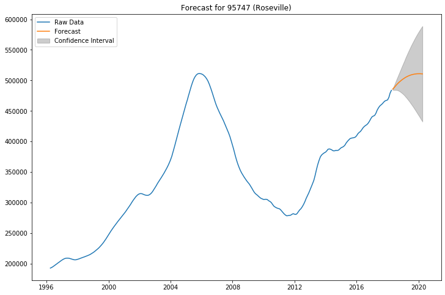


### Print summary of predicted, worst-case, and best-case scenarios


```python
roseville_95747_pred, roseville_95747_low, roseville_95747_high = pred_best_worst(pred=forecasted_price_95747, low=forecasted_lower_95747, 
                                                                                  high=forecasted_upper_95747, last=last_value_95747, date='April 1, 2020')
roseville_95747_pred, roseville_95747_low, roseville_95747_high 
```

    By the model prediction, I would expect to see a 5.556% change in price by April 1, 2020.
    At the lower bound of the confidence interval, I would expect to see a -10.609% change in price by April 1, 2020.
    At the upper bound of the confidence interval, I would expect to see a 21.722% change in price by April 1, 2020.


    (5.556, -10.609, 21.722)


## Zip code 95747 (Roseville):  Potential opportunity, with mediocre predicted returns but more upside than downside

By the model prediction, I would expect to see a 5.556% change in price by April 1, 2020.
At the lower bound of the confidence interval, I would expect to see a -10.609% change in price by April 1, 2020.
At the upper bound of the confidence interval, I would expect to see a 21.722% change in price by April 1, 2020.

# SacMetro:  95765 (Rocklin) -- Solid investment opportunity with minimal downside risk


```python
geog_area = '95765'
```


```python
ts_95765 = df_sac.loc[df_sac['Zip'] == geog_area]  # ts for all of the following functions should have only one zipcode
ts_95765.head()

```


<div>
<style scoped>
    .dataframe tbody tr th:only-of-type {
        vertical-align: middle;
    }

    .dataframe tbody tr th {
        vertical-align: top;
    }

    .dataframe thead th {
        text-align: right;
    }
</style>
<table border="1" class="dataframe">
  <thead>
    <tr style="text-align: right;">
      <th></th>
      <th>Metro</th>
      <th>MetroState</th>
      <th>CountyName</th>
      <th>City</th>
      <th>Zip</th>
      <th>SizeRank</th>
      <th>value</th>
    </tr>
    <tr>
      <th>time</th>
      <th></th>
      <th></th>
      <th></th>
      <th></th>
      <th></th>
      <th></th>
      <th></th>
    </tr>
  </thead>
  <tbody>
    <tr>
      <td>1996-04-01</td>
      <td>Sacramento</td>
      <td>Sacramento CA</td>
      <td>Placer</td>
      <td>Rocklin</td>
      <td>95765</td>
      <td>2550</td>
      <td>192600.0</td>
    </tr>
    <tr>
      <td>1996-05-01</td>
      <td>Sacramento</td>
      <td>Sacramento CA</td>
      <td>Placer</td>
      <td>Rocklin</td>
      <td>95765</td>
      <td>2550</td>
      <td>192300.0</td>
    </tr>
    <tr>
      <td>1996-06-01</td>
      <td>Sacramento</td>
      <td>Sacramento CA</td>
      <td>Placer</td>
      <td>Rocklin</td>
      <td>95765</td>
      <td>2550</td>
      <td>191900.0</td>
    </tr>
    <tr>
      <td>1996-07-01</td>
      <td>Sacramento</td>
      <td>Sacramento CA</td>
      <td>Placer</td>
      <td>Rocklin</td>
      <td>95765</td>
      <td>2550</td>
      <td>191400.0</td>
    </tr>
    <tr>
      <td>1996-08-01</td>
      <td>Sacramento</td>
      <td>Sacramento CA</td>
      <td>Placer</td>
      <td>Rocklin</td>
      <td>95765</td>
      <td>2550</td>
      <td>190900.0</td>
    </tr>
  </tbody>
</table>
</div>


```python
ts_95765.tail()
```


<div>
<style scoped>
    .dataframe tbody tr th:only-of-type {
        vertical-align: middle;
    }

    .dataframe tbody tr th {
        vertical-align: top;
    }

    .dataframe thead th {
        text-align: right;
    }
</style>
<table border="1" class="dataframe">
  <thead>
    <tr style="text-align: right;">
      <th></th>
      <th>Metro</th>
      <th>MetroState</th>
      <th>CountyName</th>
      <th>City</th>
      <th>Zip</th>
      <th>SizeRank</th>
      <th>value</th>
    </tr>
    <tr>
      <th>time</th>
      <th></th>
      <th></th>
      <th></th>
      <th></th>
      <th></th>
      <th></th>
      <th></th>
    </tr>
  </thead>
  <tbody>
    <tr>
      <td>2017-12-01</td>
      <td>Sacramento</td>
      <td>Sacramento CA</td>
      <td>Placer</td>
      <td>Rocklin</td>
      <td>95765</td>
      <td>2550</td>
      <td>493200.0</td>
    </tr>
    <tr>
      <td>2018-01-01</td>
      <td>Sacramento</td>
      <td>Sacramento CA</td>
      <td>Placer</td>
      <td>Rocklin</td>
      <td>95765</td>
      <td>2550</td>
      <td>494000.0</td>
    </tr>
    <tr>
      <td>2018-02-01</td>
      <td>Sacramento</td>
      <td>Sacramento CA</td>
      <td>Placer</td>
      <td>Rocklin</td>
      <td>95765</td>
      <td>2550</td>
      <td>497600.0</td>
    </tr>
    <tr>
      <td>2018-03-01</td>
      <td>Sacramento</td>
      <td>Sacramento CA</td>
      <td>Placer</td>
      <td>Rocklin</td>
      <td>95765</td>
      <td>2550</td>
      <td>504000.0</td>
    </tr>
    <tr>
      <td>2018-04-01</td>
      <td>Sacramento</td>
      <td>Sacramento CA</td>
      <td>Placer</td>
      <td>Rocklin</td>
      <td>95765</td>
      <td>2550</td>
      <td>509200.0</td>
    </tr>
  </tbody>
</table>
</div>


```python
# ts = ts.value

ts_95765_values = ts_95765.value
```


```python
ts_95765_values.head()
```


    time
    1996-04-01    192600.0
    1996-05-01    192300.0
    1996-06-01    191900.0
    1996-07-01    191400.0
    1996-08-01    190900.0
    Name: value, dtype: float64


```python
ts_95765_values.tail()
```


    time
    2017-12-01    493200.0
    2018-01-01    494000.0
    2018-02-01    497600.0
    2018-03-01    504000.0
    2018-04-01    509200.0
    Name: value, dtype: float64


### Visualizations

#### plot_ts:  Plot zip code(s) of interest over time, with market highs and lows


```python
# fig, ax = plot_ts(df_melt, zipcodes=['95616', '92008', '90035', '90025', '60625', '57701'])  # enter desired zip code(s)

fig, ax = plot_ts_zips(df_melt, zipcodes=['95765'], figsize=(12,6))  # enter desired zip code(s)
```


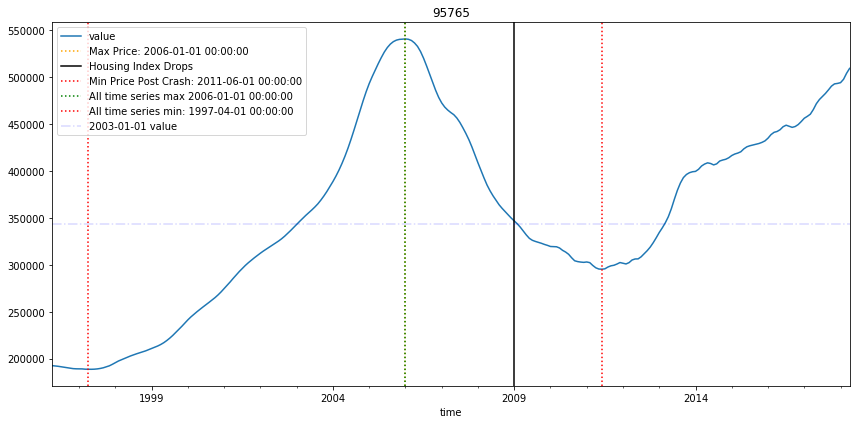


```python
ts_95765.head(3)
```


<div>
<style scoped>
    .dataframe tbody tr th:only-of-type {
        vertical-align: middle;
    }

    .dataframe tbody tr th {
        vertical-align: top;
    }

    .dataframe thead th {
        text-align: right;
    }
</style>
<table border="1" class="dataframe">
  <thead>
    <tr style="text-align: right;">
      <th></th>
      <th>Metro</th>
      <th>MetroState</th>
      <th>CountyName</th>
      <th>City</th>
      <th>Zip</th>
      <th>SizeRank</th>
      <th>value</th>
    </tr>
    <tr>
      <th>time</th>
      <th></th>
      <th></th>
      <th></th>
      <th></th>
      <th></th>
      <th></th>
      <th></th>
    </tr>
  </thead>
  <tbody>
    <tr>
      <td>1996-04-01</td>
      <td>Sacramento</td>
      <td>Sacramento CA</td>
      <td>Placer</td>
      <td>Rocklin</td>
      <td>95765</td>
      <td>2550</td>
      <td>192600.0</td>
    </tr>
    <tr>
      <td>1996-05-01</td>
      <td>Sacramento</td>
      <td>Sacramento CA</td>
      <td>Placer</td>
      <td>Rocklin</td>
      <td>95765</td>
      <td>2550</td>
      <td>192300.0</td>
    </tr>
    <tr>
      <td>1996-06-01</td>
      <td>Sacramento</td>
      <td>Sacramento CA</td>
      <td>Placer</td>
      <td>Rocklin</td>
      <td>95765</td>
      <td>2550</td>
      <td>191900.0</td>
    </tr>
  </tbody>
</table>
</div>


#### Boxplot of zip code


```python
ts_95765.boxplot(column = 'value')
plt.title('95765');

```


### Plot ACF and PACF for ts dataframe


```python
# plot_acf_pacf(ts, figsize=(10,6), lags=15)  # note that ts must only contain values and time as index

plot_acf_pacf(ts_95765_values, figsize=(10,6), lags=15)
```


### Plot seasonal decomposition for ts dataframe


```python
# plot_seasonal_decomp(ts)

plot_seasonal_decomp(ts_95765_values)

# Seasonality does not appear to be a significant factor in this zip code.
```


    (<Figure size 1296x432 with 1 Axes>,
     <matplotlib.axes._subplots.AxesSubplot at 0x1aab74b4a8>)


## ARIMA model parameters and optimization

### Generate list of (p,d,q) and (p,d,q,m) values


```python
p_values = [0, 1, 2, 4, 6, 8]
d_values = range(0, 3)
q_values = range(0, 3)
warnings.filterwarnings("ignore")
```

### Run ARIMA model on ts dataframe with list of p,d,q values 


```python
# eval_arima_models(ts, p_values, d_values, q_values)  # don't run this until you have some time, since it take time
# note that ts must only contain values and time as index

# eval_arima_models(ts_95765_values, p_values, d_values, q_values)  # don't run this until you have some time, since it takes time

```

### Generate model fit summary


```python
# model_fit = arima_zipcode(ts, order = None)   # change order = tuple to correspond to the best MSE produced by previous function

# Best ARIMA(4, 1, 2) MSE=958549.703

model_fit_95765 = arima_zipcode(ts_95765_values, order = (4,1,2))

```

                                 ARIMA Model Results                              
    ==============================================================================
    Dep. Variable:                    D.y   No. Observations:                  264
    Model:                 ARIMA(4, 1, 2)   Log Likelihood               -2097.489
    Method:                       css-mle   S.D. of innovations            676.112
    Date:                Tue, 10 Mar 2020   AIC                           4210.978
    Time:                        22:54:45   BIC                           4239.586
    Sample:                             1   HQIC                          4222.474
                                                                                  
    ==============================================================================
                     coef    std err          z      P>|z|      [0.025      0.975]
    ------------------------------------------------------------------------------
    const       1199.2430   1403.669      0.854      0.394   -1551.898    3950.384
    ar.L1.D.y      0.3081      0.082      3.752      0.000       0.147       0.469
    ar.L2.D.y      0.3689      0.111      3.327      0.001       0.152       0.586
    ar.L3.D.y      0.0756      0.136      0.556      0.579      -0.191       0.342
    ar.L4.D.y      0.1578      0.096      1.650      0.100      -0.030       0.345
    ma.L1.D.y      1.5100      0.057     26.702      0.000       1.399       1.621
    ma.L2.D.y      0.7564      0.064     11.886      0.000       0.632       0.881
                                        Roots                                    
    =============================================================================
                      Real          Imaginary           Modulus         Frequency
    -----------------------------------------------------------------------------
    AR.1            1.0454           -0.0000j            1.0454           -0.0000
    AR.2           -1.5353           -0.0000j            1.5353           -0.5000
    AR.3            0.0056           -1.9868j            1.9868           -0.2496
    AR.4            0.0056           +1.9868j            1.9868            0.2496
    MA.1           -0.9982           -0.5707j            1.1498           -0.4173
    MA.2           -0.9982           +0.5707j            1.1498            0.4173
    -----------------------------------------------------------------------------


## ARIMA modeling results:  predictions and visualization

### Produce forecasts from ARIMA model fit


```python
actual_forecast_95765, std_error_95765, forecast_confint_95765 = forecast(model_fit_95765)

```


```python
actual_forecast_95765, std_error_95765, forecast_confint_95765
```


    (array([512007.82209569, 514645.9423443 , 518005.14663979, 521153.68306293,
            524112.88391448, 526963.75925139, 529809.3173371 , 532565.71533697,
            535254.60988239, 537872.31842107, 540435.61722701, 542936.71906849,
            545382.55320667, 547773.06866239, 550112.8652202 , 552402.63574923,
            554645.38034614, 556842.61849099, 558996.70338891, 561109.25664141,
            563182.2342693 , 565217.25476067, 567216.03227637, 569180.09574197]),
     array([  676.11247351,  2021.74479184,  3654.93249615,  5345.27397848,
             7173.46267951,  9132.53968065, 11203.62140683, 13355.65358137,
            15580.9229946 , 17867.28867012, 20206.12772527, 22587.75780721,
            25005.57664935, 27453.0000226 , 29924.68830679, 32415.60413411,
            34921.52695317, 37438.58855048, 39963.43046522, 42493.01297454,
            45024.66217975, 47555.97353492, 50084.81469356, 52609.27478067]),
     array([[510682.6659981 , 513332.97819327],
            [510683.39536637, 518608.48932223],
            [510841.61058142, 525168.68269817],
            [510677.13857761, 531630.22754825],
            [510053.1554182 , 538172.61241075],
            [509064.31038994, 544863.20811285],
            [507850.6228833 , 551768.0117909 ],
            [506389.11532749, 558742.31534645],
            [504716.56196709, 565792.65779769],
            [502853.07612626, 572891.56071588],
            [500832.33461847, 580038.89983555],
            [498665.52727485, 587207.91086213],
            [496372.52356129, 594392.58285204],
            [493966.17735052, 601579.95997425],
            [491461.5538903 , 608764.17655011],
            [488869.21910927, 615936.05238919],
            [486200.44523279, 623090.31545949],
            [483464.33330004, 630220.90368194],
            [480669.8189784 , 637323.58779942],
            [477824.48161672, 644394.03166609],
            [474935.51798091, 651428.95055768],
            [472009.25938249, 658425.25013885],
            [469051.59930464, 665380.46524811],
            [466067.8119191 , 672292.37956485]]))


### Create dataframe to hold forecast results


```python
# df_forecast = forecast_df(col = 'time', daterange = pd.date_range(start='2018-05-01', end='2020-04-01', freq='MS'), 
#                 actual_forecast=actual_forecast, forecast_confint = forecast_confint)

df_forecast_95765 = forecast_df(actual_forecast_95765, forecast_confint_95765, col = 'time', 
                                daterange = pd.date_range(start='2018-05-01', end='2020-04-01', freq='MS'))
```

### Create new dataframe concatenating historic values and forecast results


```python
# df_new = concat_values_forecast(ts, df_forecast)

df_new_95765 = concat_values_forecast(ts_95765_values, df_forecast_95765)
```


```python
df_new_95765
```


<div>
<style scoped>
    .dataframe tbody tr th:only-of-type {
        vertical-align: middle;
    }

    .dataframe tbody tr th {
        vertical-align: top;
    }

    .dataframe thead th {
        text-align: right;
    }
</style>
<table border="1" class="dataframe">
  <thead>
    <tr style="text-align: right;">
      <th></th>
      <th>value</th>
      <th>forecast</th>
      <th>forecast_lower</th>
      <th>forecast_upper</th>
    </tr>
    <tr>
      <th>time</th>
      <th></th>
      <th></th>
      <th></th>
      <th></th>
    </tr>
  </thead>
  <tbody>
    <tr>
      <td>1996-04-01</td>
      <td>192600.0</td>
      <td>NaN</td>
      <td>NaN</td>
      <td>NaN</td>
    </tr>
    <tr>
      <td>1996-05-01</td>
      <td>192300.0</td>
      <td>NaN</td>
      <td>NaN</td>
      <td>NaN</td>
    </tr>
    <tr>
      <td>1996-06-01</td>
      <td>191900.0</td>
      <td>NaN</td>
      <td>NaN</td>
      <td>NaN</td>
    </tr>
    <tr>
      <td>1996-07-01</td>
      <td>191400.0</td>
      <td>NaN</td>
      <td>NaN</td>
      <td>NaN</td>
    </tr>
    <tr>
      <td>1996-08-01</td>
      <td>190900.0</td>
      <td>NaN</td>
      <td>NaN</td>
      <td>NaN</td>
    </tr>
    <tr>
      <td>1996-09-01</td>
      <td>190400.0</td>
      <td>NaN</td>
      <td>NaN</td>
      <td>NaN</td>
    </tr>
    <tr>
      <td>1996-10-01</td>
      <td>189900.0</td>
      <td>NaN</td>
      <td>NaN</td>
      <td>NaN</td>
    </tr>
    <tr>
      <td>1996-11-01</td>
      <td>189400.0</td>
      <td>NaN</td>
      <td>NaN</td>
      <td>NaN</td>
    </tr>
    <tr>
      <td>1996-12-01</td>
      <td>189200.0</td>
      <td>NaN</td>
      <td>NaN</td>
      <td>NaN</td>
    </tr>
    <tr>
      <td>1997-01-01</td>
      <td>189200.0</td>
      <td>NaN</td>
      <td>NaN</td>
      <td>NaN</td>
    </tr>
    <tr>
      <td>1997-02-01</td>
      <td>189100.0</td>
      <td>NaN</td>
      <td>NaN</td>
      <td>NaN</td>
    </tr>
    <tr>
      <td>1997-03-01</td>
      <td>188800.0</td>
      <td>NaN</td>
      <td>NaN</td>
      <td>NaN</td>
    </tr>
    <tr>
      <td>1997-04-01</td>
      <td>188700.0</td>
      <td>NaN</td>
      <td>NaN</td>
      <td>NaN</td>
    </tr>
    <tr>
      <td>1997-05-01</td>
      <td>188700.0</td>
      <td>NaN</td>
      <td>NaN</td>
      <td>NaN</td>
    </tr>
    <tr>
      <td>1997-06-01</td>
      <td>188800.0</td>
      <td>NaN</td>
      <td>NaN</td>
      <td>NaN</td>
    </tr>
    <tr>
      <td>1997-07-01</td>
      <td>189100.0</td>
      <td>NaN</td>
      <td>NaN</td>
      <td>NaN</td>
    </tr>
    <tr>
      <td>1997-08-01</td>
      <td>189600.0</td>
      <td>NaN</td>
      <td>NaN</td>
      <td>NaN</td>
    </tr>
    <tr>
      <td>1997-09-01</td>
      <td>190300.0</td>
      <td>NaN</td>
      <td>NaN</td>
      <td>NaN</td>
    </tr>
    <tr>
      <td>1997-10-01</td>
      <td>191300.0</td>
      <td>NaN</td>
      <td>NaN</td>
      <td>NaN</td>
    </tr>
    <tr>
      <td>1997-11-01</td>
      <td>192400.0</td>
      <td>NaN</td>
      <td>NaN</td>
      <td>NaN</td>
    </tr>
    <tr>
      <td>1997-12-01</td>
      <td>194000.0</td>
      <td>NaN</td>
      <td>NaN</td>
      <td>NaN</td>
    </tr>
    <tr>
      <td>1998-01-01</td>
      <td>195800.0</td>
      <td>NaN</td>
      <td>NaN</td>
      <td>NaN</td>
    </tr>
    <tr>
      <td>1998-02-01</td>
      <td>197500.0</td>
      <td>NaN</td>
      <td>NaN</td>
      <td>NaN</td>
    </tr>
    <tr>
      <td>1998-03-01</td>
      <td>198800.0</td>
      <td>NaN</td>
      <td>NaN</td>
      <td>NaN</td>
    </tr>
    <tr>
      <td>1998-04-01</td>
      <td>200200.0</td>
      <td>NaN</td>
      <td>NaN</td>
      <td>NaN</td>
    </tr>
    <tr>
      <td>1998-05-01</td>
      <td>201600.0</td>
      <td>NaN</td>
      <td>NaN</td>
      <td>NaN</td>
    </tr>
    <tr>
      <td>1998-06-01</td>
      <td>202900.0</td>
      <td>NaN</td>
      <td>NaN</td>
      <td>NaN</td>
    </tr>
    <tr>
      <td>1998-07-01</td>
      <td>204100.0</td>
      <td>NaN</td>
      <td>NaN</td>
      <td>NaN</td>
    </tr>
    <tr>
      <td>1998-08-01</td>
      <td>205200.0</td>
      <td>NaN</td>
      <td>NaN</td>
      <td>NaN</td>
    </tr>
    <tr>
      <td>1998-09-01</td>
      <td>206200.0</td>
      <td>NaN</td>
      <td>NaN</td>
      <td>NaN</td>
    </tr>
    <tr>
      <td>1998-10-01</td>
      <td>207300.0</td>
      <td>NaN</td>
      <td>NaN</td>
      <td>NaN</td>
    </tr>
    <tr>
      <td>1998-11-01</td>
      <td>208300.0</td>
      <td>NaN</td>
      <td>NaN</td>
      <td>NaN</td>
    </tr>
    <tr>
      <td>1998-12-01</td>
      <td>209600.0</td>
      <td>NaN</td>
      <td>NaN</td>
      <td>NaN</td>
    </tr>
    <tr>
      <td>1999-01-01</td>
      <td>210900.0</td>
      <td>NaN</td>
      <td>NaN</td>
      <td>NaN</td>
    </tr>
    <tr>
      <td>1999-02-01</td>
      <td>212300.0</td>
      <td>NaN</td>
      <td>NaN</td>
      <td>NaN</td>
    </tr>
    <tr>
      <td>1999-03-01</td>
      <td>213500.0</td>
      <td>NaN</td>
      <td>NaN</td>
      <td>NaN</td>
    </tr>
    <tr>
      <td>1999-04-01</td>
      <td>215100.0</td>
      <td>NaN</td>
      <td>NaN</td>
      <td>NaN</td>
    </tr>
    <tr>
      <td>1999-05-01</td>
      <td>217000.0</td>
      <td>NaN</td>
      <td>NaN</td>
      <td>NaN</td>
    </tr>
    <tr>
      <td>1999-06-01</td>
      <td>219300.0</td>
      <td>NaN</td>
      <td>NaN</td>
      <td>NaN</td>
    </tr>
    <tr>
      <td>1999-07-01</td>
      <td>221900.0</td>
      <td>NaN</td>
      <td>NaN</td>
      <td>NaN</td>
    </tr>
    <tr>
      <td>1999-08-01</td>
      <td>224800.0</td>
      <td>NaN</td>
      <td>NaN</td>
      <td>NaN</td>
    </tr>
    <tr>
      <td>1999-09-01</td>
      <td>228000.0</td>
      <td>NaN</td>
      <td>NaN</td>
      <td>NaN</td>
    </tr>
    <tr>
      <td>1999-10-01</td>
      <td>231200.0</td>
      <td>NaN</td>
      <td>NaN</td>
      <td>NaN</td>
    </tr>
    <tr>
      <td>1999-11-01</td>
      <td>234500.0</td>
      <td>NaN</td>
      <td>NaN</td>
      <td>NaN</td>
    </tr>
    <tr>
      <td>1999-12-01</td>
      <td>238000.0</td>
      <td>NaN</td>
      <td>NaN</td>
      <td>NaN</td>
    </tr>
    <tr>
      <td>2000-01-01</td>
      <td>241400.0</td>
      <td>NaN</td>
      <td>NaN</td>
      <td>NaN</td>
    </tr>
    <tr>
      <td>2000-02-01</td>
      <td>244500.0</td>
      <td>NaN</td>
      <td>NaN</td>
      <td>NaN</td>
    </tr>
    <tr>
      <td>2000-03-01</td>
      <td>247300.0</td>
      <td>NaN</td>
      <td>NaN</td>
      <td>NaN</td>
    </tr>
    <tr>
      <td>2000-04-01</td>
      <td>250000.0</td>
      <td>NaN</td>
      <td>NaN</td>
      <td>NaN</td>
    </tr>
    <tr>
      <td>2000-05-01</td>
      <td>252600.0</td>
      <td>NaN</td>
      <td>NaN</td>
      <td>NaN</td>
    </tr>
    <tr>
      <td>2000-06-01</td>
      <td>255100.0</td>
      <td>NaN</td>
      <td>NaN</td>
      <td>NaN</td>
    </tr>
    <tr>
      <td>2000-07-01</td>
      <td>257500.0</td>
      <td>NaN</td>
      <td>NaN</td>
      <td>NaN</td>
    </tr>
    <tr>
      <td>2000-08-01</td>
      <td>260000.0</td>
      <td>NaN</td>
      <td>NaN</td>
      <td>NaN</td>
    </tr>
    <tr>
      <td>2000-09-01</td>
      <td>262500.0</td>
      <td>NaN</td>
      <td>NaN</td>
      <td>NaN</td>
    </tr>
    <tr>
      <td>2000-10-01</td>
      <td>265100.0</td>
      <td>NaN</td>
      <td>NaN</td>
      <td>NaN</td>
    </tr>
    <tr>
      <td>2000-11-01</td>
      <td>268000.0</td>
      <td>NaN</td>
      <td>NaN</td>
      <td>NaN</td>
    </tr>
    <tr>
      <td>2000-12-01</td>
      <td>271200.0</td>
      <td>NaN</td>
      <td>NaN</td>
      <td>NaN</td>
    </tr>
    <tr>
      <td>2001-01-01</td>
      <td>274700.0</td>
      <td>NaN</td>
      <td>NaN</td>
      <td>NaN</td>
    </tr>
    <tr>
      <td>2001-02-01</td>
      <td>278200.0</td>
      <td>NaN</td>
      <td>NaN</td>
      <td>NaN</td>
    </tr>
    <tr>
      <td>2001-03-01</td>
      <td>281800.0</td>
      <td>NaN</td>
      <td>NaN</td>
      <td>NaN</td>
    </tr>
    <tr>
      <td>2001-04-01</td>
      <td>285600.0</td>
      <td>NaN</td>
      <td>NaN</td>
      <td>NaN</td>
    </tr>
    <tr>
      <td>2001-05-01</td>
      <td>289200.0</td>
      <td>NaN</td>
      <td>NaN</td>
      <td>NaN</td>
    </tr>
    <tr>
      <td>2001-06-01</td>
      <td>292800.0</td>
      <td>NaN</td>
      <td>NaN</td>
      <td>NaN</td>
    </tr>
    <tr>
      <td>2001-07-01</td>
      <td>296100.0</td>
      <td>NaN</td>
      <td>NaN</td>
      <td>NaN</td>
    </tr>
    <tr>
      <td>2001-08-01</td>
      <td>299300.0</td>
      <td>NaN</td>
      <td>NaN</td>
      <td>NaN</td>
    </tr>
    <tr>
      <td>2001-09-01</td>
      <td>302200.0</td>
      <td>NaN</td>
      <td>NaN</td>
      <td>NaN</td>
    </tr>
    <tr>
      <td>2001-10-01</td>
      <td>304900.0</td>
      <td>NaN</td>
      <td>NaN</td>
      <td>NaN</td>
    </tr>
    <tr>
      <td>2001-11-01</td>
      <td>307500.0</td>
      <td>NaN</td>
      <td>NaN</td>
      <td>NaN</td>
    </tr>
    <tr>
      <td>2001-12-01</td>
      <td>310000.0</td>
      <td>NaN</td>
      <td>NaN</td>
      <td>NaN</td>
    </tr>
    <tr>
      <td>2002-01-01</td>
      <td>312400.0</td>
      <td>NaN</td>
      <td>NaN</td>
      <td>NaN</td>
    </tr>
    <tr>
      <td>2002-02-01</td>
      <td>314700.0</td>
      <td>NaN</td>
      <td>NaN</td>
      <td>NaN</td>
    </tr>
    <tr>
      <td>2002-03-01</td>
      <td>316800.0</td>
      <td>NaN</td>
      <td>NaN</td>
      <td>NaN</td>
    </tr>
    <tr>
      <td>2002-04-01</td>
      <td>318900.0</td>
      <td>NaN</td>
      <td>NaN</td>
      <td>NaN</td>
    </tr>
    <tr>
      <td>2002-05-01</td>
      <td>320900.0</td>
      <td>NaN</td>
      <td>NaN</td>
      <td>NaN</td>
    </tr>
    <tr>
      <td>2002-06-01</td>
      <td>323000.0</td>
      <td>NaN</td>
      <td>NaN</td>
      <td>NaN</td>
    </tr>
    <tr>
      <td>2002-07-01</td>
      <td>325300.0</td>
      <td>NaN</td>
      <td>NaN</td>
      <td>NaN</td>
    </tr>
    <tr>
      <td>2002-08-01</td>
      <td>327700.0</td>
      <td>NaN</td>
      <td>NaN</td>
      <td>NaN</td>
    </tr>
    <tr>
      <td>2002-09-01</td>
      <td>330400.0</td>
      <td>NaN</td>
      <td>NaN</td>
      <td>NaN</td>
    </tr>
    <tr>
      <td>2002-10-01</td>
      <td>333400.0</td>
      <td>NaN</td>
      <td>NaN</td>
      <td>NaN</td>
    </tr>
    <tr>
      <td>2002-11-01</td>
      <td>336500.0</td>
      <td>NaN</td>
      <td>NaN</td>
      <td>NaN</td>
    </tr>
    <tr>
      <td>2002-12-01</td>
      <td>339800.0</td>
      <td>NaN</td>
      <td>NaN</td>
      <td>NaN</td>
    </tr>
    <tr>
      <td>2003-01-01</td>
      <td>343000.0</td>
      <td>NaN</td>
      <td>NaN</td>
      <td>NaN</td>
    </tr>
    <tr>
      <td>2003-02-01</td>
      <td>346300.0</td>
      <td>NaN</td>
      <td>NaN</td>
      <td>NaN</td>
    </tr>
    <tr>
      <td>2003-03-01</td>
      <td>349500.0</td>
      <td>NaN</td>
      <td>NaN</td>
      <td>NaN</td>
    </tr>
    <tr>
      <td>2003-04-01</td>
      <td>352600.0</td>
      <td>NaN</td>
      <td>NaN</td>
      <td>NaN</td>
    </tr>
    <tr>
      <td>2003-05-01</td>
      <td>355500.0</td>
      <td>NaN</td>
      <td>NaN</td>
      <td>NaN</td>
    </tr>
    <tr>
      <td>2003-06-01</td>
      <td>358400.0</td>
      <td>NaN</td>
      <td>NaN</td>
      <td>NaN</td>
    </tr>
    <tr>
      <td>2003-07-01</td>
      <td>361500.0</td>
      <td>NaN</td>
      <td>NaN</td>
      <td>NaN</td>
    </tr>
    <tr>
      <td>2003-08-01</td>
      <td>364900.0</td>
      <td>NaN</td>
      <td>NaN</td>
      <td>NaN</td>
    </tr>
    <tr>
      <td>2003-09-01</td>
      <td>368900.0</td>
      <td>NaN</td>
      <td>NaN</td>
      <td>NaN</td>
    </tr>
    <tr>
      <td>2003-10-01</td>
      <td>373300.0</td>
      <td>NaN</td>
      <td>NaN</td>
      <td>NaN</td>
    </tr>
    <tr>
      <td>2003-11-01</td>
      <td>378100.0</td>
      <td>NaN</td>
      <td>NaN</td>
      <td>NaN</td>
    </tr>
    <tr>
      <td>2003-12-01</td>
      <td>383300.0</td>
      <td>NaN</td>
      <td>NaN</td>
      <td>NaN</td>
    </tr>
    <tr>
      <td>2004-01-01</td>
      <td>388700.0</td>
      <td>NaN</td>
      <td>NaN</td>
      <td>NaN</td>
    </tr>
    <tr>
      <td>2004-02-01</td>
      <td>394500.0</td>
      <td>NaN</td>
      <td>NaN</td>
      <td>NaN</td>
    </tr>
    <tr>
      <td>2004-03-01</td>
      <td>400900.0</td>
      <td>NaN</td>
      <td>NaN</td>
      <td>NaN</td>
    </tr>
    <tr>
      <td>2004-04-01</td>
      <td>408000.0</td>
      <td>NaN</td>
      <td>NaN</td>
      <td>NaN</td>
    </tr>
    <tr>
      <td>2004-05-01</td>
      <td>415800.0</td>
      <td>NaN</td>
      <td>NaN</td>
      <td>NaN</td>
    </tr>
    <tr>
      <td>2004-06-01</td>
      <td>424400.0</td>
      <td>NaN</td>
      <td>NaN</td>
      <td>NaN</td>
    </tr>
    <tr>
      <td>2004-07-01</td>
      <td>433800.0</td>
      <td>NaN</td>
      <td>NaN</td>
      <td>NaN</td>
    </tr>
    <tr>
      <td>2004-08-01</td>
      <td>443800.0</td>
      <td>NaN</td>
      <td>NaN</td>
      <td>NaN</td>
    </tr>
    <tr>
      <td>2004-09-01</td>
      <td>454200.0</td>
      <td>NaN</td>
      <td>NaN</td>
      <td>NaN</td>
    </tr>
    <tr>
      <td>2004-10-01</td>
      <td>464600.0</td>
      <td>NaN</td>
      <td>NaN</td>
      <td>NaN</td>
    </tr>
    <tr>
      <td>2004-11-01</td>
      <td>474800.0</td>
      <td>NaN</td>
      <td>NaN</td>
      <td>NaN</td>
    </tr>
    <tr>
      <td>2004-12-01</td>
      <td>484400.0</td>
      <td>NaN</td>
      <td>NaN</td>
      <td>NaN</td>
    </tr>
    <tr>
      <td>2005-01-01</td>
      <td>493000.0</td>
      <td>NaN</td>
      <td>NaN</td>
      <td>NaN</td>
    </tr>
    <tr>
      <td>2005-02-01</td>
      <td>500500.0</td>
      <td>NaN</td>
      <td>NaN</td>
      <td>NaN</td>
    </tr>
    <tr>
      <td>2005-03-01</td>
      <td>507400.0</td>
      <td>NaN</td>
      <td>NaN</td>
      <td>NaN</td>
    </tr>
    <tr>
      <td>2005-04-01</td>
      <td>514300.0</td>
      <td>NaN</td>
      <td>NaN</td>
      <td>NaN</td>
    </tr>
    <tr>
      <td>2005-05-01</td>
      <td>520700.0</td>
      <td>NaN</td>
      <td>NaN</td>
      <td>NaN</td>
    </tr>
    <tr>
      <td>2005-06-01</td>
      <td>526600.0</td>
      <td>NaN</td>
      <td>NaN</td>
      <td>NaN</td>
    </tr>
    <tr>
      <td>2005-07-01</td>
      <td>531400.0</td>
      <td>NaN</td>
      <td>NaN</td>
      <td>NaN</td>
    </tr>
    <tr>
      <td>2005-08-01</td>
      <td>535100.0</td>
      <td>NaN</td>
      <td>NaN</td>
      <td>NaN</td>
    </tr>
    <tr>
      <td>2005-09-01</td>
      <td>537700.0</td>
      <td>NaN</td>
      <td>NaN</td>
      <td>NaN</td>
    </tr>
    <tr>
      <td>2005-10-01</td>
      <td>539300.0</td>
      <td>NaN</td>
      <td>NaN</td>
      <td>NaN</td>
    </tr>
    <tr>
      <td>2005-11-01</td>
      <td>540100.0</td>
      <td>NaN</td>
      <td>NaN</td>
      <td>NaN</td>
    </tr>
    <tr>
      <td>2005-12-01</td>
      <td>540400.0</td>
      <td>NaN</td>
      <td>NaN</td>
      <td>NaN</td>
    </tr>
    <tr>
      <td>2006-01-01</td>
      <td>540600.0</td>
      <td>NaN</td>
      <td>NaN</td>
      <td>NaN</td>
    </tr>
    <tr>
      <td>2006-02-01</td>
      <td>540200.0</td>
      <td>NaN</td>
      <td>NaN</td>
      <td>NaN</td>
    </tr>
    <tr>
      <td>2006-03-01</td>
      <td>538900.0</td>
      <td>NaN</td>
      <td>NaN</td>
      <td>NaN</td>
    </tr>
    <tr>
      <td>2006-04-01</td>
      <td>536300.0</td>
      <td>NaN</td>
      <td>NaN</td>
      <td>NaN</td>
    </tr>
    <tr>
      <td>2006-05-01</td>
      <td>532600.0</td>
      <td>NaN</td>
      <td>NaN</td>
      <td>NaN</td>
    </tr>
    <tr>
      <td>2006-06-01</td>
      <td>527100.0</td>
      <td>NaN</td>
      <td>NaN</td>
      <td>NaN</td>
    </tr>
    <tr>
      <td>2006-07-01</td>
      <td>520000.0</td>
      <td>NaN</td>
      <td>NaN</td>
      <td>NaN</td>
    </tr>
    <tr>
      <td>2006-08-01</td>
      <td>511800.0</td>
      <td>NaN</td>
      <td>NaN</td>
      <td>NaN</td>
    </tr>
    <tr>
      <td>2006-09-01</td>
      <td>503100.0</td>
      <td>NaN</td>
      <td>NaN</td>
      <td>NaN</td>
    </tr>
    <tr>
      <td>2006-10-01</td>
      <td>494300.0</td>
      <td>NaN</td>
      <td>NaN</td>
      <td>NaN</td>
    </tr>
    <tr>
      <td>2006-11-01</td>
      <td>485800.0</td>
      <td>NaN</td>
      <td>NaN</td>
      <td>NaN</td>
    </tr>
    <tr>
      <td>2006-12-01</td>
      <td>478300.0</td>
      <td>NaN</td>
      <td>NaN</td>
      <td>NaN</td>
    </tr>
    <tr>
      <td>2007-01-01</td>
      <td>472400.0</td>
      <td>NaN</td>
      <td>NaN</td>
      <td>NaN</td>
    </tr>
    <tr>
      <td>2007-02-01</td>
      <td>468000.0</td>
      <td>NaN</td>
      <td>NaN</td>
      <td>NaN</td>
    </tr>
    <tr>
      <td>2007-03-01</td>
      <td>464800.0</td>
      <td>NaN</td>
      <td>NaN</td>
      <td>NaN</td>
    </tr>
    <tr>
      <td>2007-04-01</td>
      <td>462200.0</td>
      <td>NaN</td>
      <td>NaN</td>
      <td>NaN</td>
    </tr>
    <tr>
      <td>2007-05-01</td>
      <td>459900.0</td>
      <td>NaN</td>
      <td>NaN</td>
      <td>NaN</td>
    </tr>
    <tr>
      <td>2007-06-01</td>
      <td>456400.0</td>
      <td>NaN</td>
      <td>NaN</td>
      <td>NaN</td>
    </tr>
    <tr>
      <td>2007-07-01</td>
      <td>451700.0</td>
      <td>NaN</td>
      <td>NaN</td>
      <td>NaN</td>
    </tr>
    <tr>
      <td>2007-08-01</td>
      <td>446000.0</td>
      <td>NaN</td>
      <td>NaN</td>
      <td>NaN</td>
    </tr>
    <tr>
      <td>2007-09-01</td>
      <td>439900.0</td>
      <td>NaN</td>
      <td>NaN</td>
      <td>NaN</td>
    </tr>
    <tr>
      <td>2007-10-01</td>
      <td>433200.0</td>
      <td>NaN</td>
      <td>NaN</td>
      <td>NaN</td>
    </tr>
    <tr>
      <td>2007-11-01</td>
      <td>425500.0</td>
      <td>NaN</td>
      <td>NaN</td>
      <td>NaN</td>
    </tr>
    <tr>
      <td>2007-12-01</td>
      <td>416900.0</td>
      <td>NaN</td>
      <td>NaN</td>
      <td>NaN</td>
    </tr>
    <tr>
      <td>2008-01-01</td>
      <td>408600.0</td>
      <td>NaN</td>
      <td>NaN</td>
      <td>NaN</td>
    </tr>
    <tr>
      <td>2008-02-01</td>
      <td>400500.0</td>
      <td>NaN</td>
      <td>NaN</td>
      <td>NaN</td>
    </tr>
    <tr>
      <td>2008-03-01</td>
      <td>392500.0</td>
      <td>NaN</td>
      <td>NaN</td>
      <td>NaN</td>
    </tr>
    <tr>
      <td>2008-04-01</td>
      <td>385000.0</td>
      <td>NaN</td>
      <td>NaN</td>
      <td>NaN</td>
    </tr>
    <tr>
      <td>2008-05-01</td>
      <td>378800.0</td>
      <td>NaN</td>
      <td>NaN</td>
      <td>NaN</td>
    </tr>
    <tr>
      <td>2008-06-01</td>
      <td>373400.0</td>
      <td>NaN</td>
      <td>NaN</td>
      <td>NaN</td>
    </tr>
    <tr>
      <td>2008-07-01</td>
      <td>368600.0</td>
      <td>NaN</td>
      <td>NaN</td>
      <td>NaN</td>
    </tr>
    <tr>
      <td>2008-08-01</td>
      <td>363900.0</td>
      <td>NaN</td>
      <td>NaN</td>
      <td>NaN</td>
    </tr>
    <tr>
      <td>2008-09-01</td>
      <td>360100.0</td>
      <td>NaN</td>
      <td>NaN</td>
      <td>NaN</td>
    </tr>
    <tr>
      <td>2008-10-01</td>
      <td>356600.0</td>
      <td>NaN</td>
      <td>NaN</td>
      <td>NaN</td>
    </tr>
    <tr>
      <td>2008-11-01</td>
      <td>353200.0</td>
      <td>NaN</td>
      <td>NaN</td>
      <td>NaN</td>
    </tr>
    <tr>
      <td>2008-12-01</td>
      <td>349800.0</td>
      <td>NaN</td>
      <td>NaN</td>
      <td>NaN</td>
    </tr>
    <tr>
      <td>2009-01-01</td>
      <td>346800.0</td>
      <td>NaN</td>
      <td>NaN</td>
      <td>NaN</td>
    </tr>
    <tr>
      <td>2009-02-01</td>
      <td>343700.0</td>
      <td>NaN</td>
      <td>NaN</td>
      <td>NaN</td>
    </tr>
    <tr>
      <td>2009-03-01</td>
      <td>340100.0</td>
      <td>NaN</td>
      <td>NaN</td>
      <td>NaN</td>
    </tr>
    <tr>
      <td>2009-04-01</td>
      <td>335900.0</td>
      <td>NaN</td>
      <td>NaN</td>
      <td>NaN</td>
    </tr>
    <tr>
      <td>2009-05-01</td>
      <td>331800.0</td>
      <td>NaN</td>
      <td>NaN</td>
      <td>NaN</td>
    </tr>
    <tr>
      <td>2009-06-01</td>
      <td>328200.0</td>
      <td>NaN</td>
      <td>NaN</td>
      <td>NaN</td>
    </tr>
    <tr>
      <td>2009-07-01</td>
      <td>326100.0</td>
      <td>NaN</td>
      <td>NaN</td>
      <td>NaN</td>
    </tr>
    <tr>
      <td>2009-08-01</td>
      <td>324900.0</td>
      <td>NaN</td>
      <td>NaN</td>
      <td>NaN</td>
    </tr>
    <tr>
      <td>2009-09-01</td>
      <td>323900.0</td>
      <td>NaN</td>
      <td>NaN</td>
      <td>NaN</td>
    </tr>
    <tr>
      <td>2009-10-01</td>
      <td>322900.0</td>
      <td>NaN</td>
      <td>NaN</td>
      <td>NaN</td>
    </tr>
    <tr>
      <td>2009-11-01</td>
      <td>321700.0</td>
      <td>NaN</td>
      <td>NaN</td>
      <td>NaN</td>
    </tr>
    <tr>
      <td>2009-12-01</td>
      <td>320700.0</td>
      <td>NaN</td>
      <td>NaN</td>
      <td>NaN</td>
    </tr>
    <tr>
      <td>2010-01-01</td>
      <td>319500.0</td>
      <td>NaN</td>
      <td>NaN</td>
      <td>NaN</td>
    </tr>
    <tr>
      <td>2010-02-01</td>
      <td>319300.0</td>
      <td>NaN</td>
      <td>NaN</td>
      <td>NaN</td>
    </tr>
    <tr>
      <td>2010-03-01</td>
      <td>319200.0</td>
      <td>NaN</td>
      <td>NaN</td>
      <td>NaN</td>
    </tr>
    <tr>
      <td>2010-04-01</td>
      <td>317900.0</td>
      <td>NaN</td>
      <td>NaN</td>
      <td>NaN</td>
    </tr>
    <tr>
      <td>2010-05-01</td>
      <td>315400.0</td>
      <td>NaN</td>
      <td>NaN</td>
      <td>NaN</td>
    </tr>
    <tr>
      <td>2010-06-01</td>
      <td>313600.0</td>
      <td>NaN</td>
      <td>NaN</td>
      <td>NaN</td>
    </tr>
    <tr>
      <td>2010-07-01</td>
      <td>311200.0</td>
      <td>NaN</td>
      <td>NaN</td>
      <td>NaN</td>
    </tr>
    <tr>
      <td>2010-08-01</td>
      <td>307500.0</td>
      <td>NaN</td>
      <td>NaN</td>
      <td>NaN</td>
    </tr>
    <tr>
      <td>2010-09-01</td>
      <td>304300.0</td>
      <td>NaN</td>
      <td>NaN</td>
      <td>NaN</td>
    </tr>
    <tr>
      <td>2010-10-01</td>
      <td>303400.0</td>
      <td>NaN</td>
      <td>NaN</td>
      <td>NaN</td>
    </tr>
    <tr>
      <td>2010-11-01</td>
      <td>302900.0</td>
      <td>NaN</td>
      <td>NaN</td>
      <td>NaN</td>
    </tr>
    <tr>
      <td>2010-12-01</td>
      <td>302600.0</td>
      <td>NaN</td>
      <td>NaN</td>
      <td>NaN</td>
    </tr>
    <tr>
      <td>2011-01-01</td>
      <td>303000.0</td>
      <td>NaN</td>
      <td>NaN</td>
      <td>NaN</td>
    </tr>
    <tr>
      <td>2011-02-01</td>
      <td>302300.0</td>
      <td>NaN</td>
      <td>NaN</td>
      <td>NaN</td>
    </tr>
    <tr>
      <td>2011-03-01</td>
      <td>299300.0</td>
      <td>NaN</td>
      <td>NaN</td>
      <td>NaN</td>
    </tr>
    <tr>
      <td>2011-04-01</td>
      <td>296800.0</td>
      <td>NaN</td>
      <td>NaN</td>
      <td>NaN</td>
    </tr>
    <tr>
      <td>2011-05-01</td>
      <td>295500.0</td>
      <td>NaN</td>
      <td>NaN</td>
      <td>NaN</td>
    </tr>
    <tr>
      <td>2011-06-01</td>
      <td>295300.0</td>
      <td>NaN</td>
      <td>NaN</td>
      <td>NaN</td>
    </tr>
    <tr>
      <td>2011-07-01</td>
      <td>295700.0</td>
      <td>NaN</td>
      <td>NaN</td>
      <td>NaN</td>
    </tr>
    <tr>
      <td>2011-08-01</td>
      <td>297600.0</td>
      <td>NaN</td>
      <td>NaN</td>
      <td>NaN</td>
    </tr>
    <tr>
      <td>2011-09-01</td>
      <td>298900.0</td>
      <td>NaN</td>
      <td>NaN</td>
      <td>NaN</td>
    </tr>
    <tr>
      <td>2011-10-01</td>
      <td>299500.0</td>
      <td>NaN</td>
      <td>NaN</td>
      <td>NaN</td>
    </tr>
    <tr>
      <td>2011-11-01</td>
      <td>300800.0</td>
      <td>NaN</td>
      <td>NaN</td>
      <td>NaN</td>
    </tr>
    <tr>
      <td>2011-12-01</td>
      <td>302400.0</td>
      <td>NaN</td>
      <td>NaN</td>
      <td>NaN</td>
    </tr>
    <tr>
      <td>2012-01-01</td>
      <td>301700.0</td>
      <td>NaN</td>
      <td>NaN</td>
      <td>NaN</td>
    </tr>
    <tr>
      <td>2012-02-01</td>
      <td>300900.0</td>
      <td>NaN</td>
      <td>NaN</td>
      <td>NaN</td>
    </tr>
    <tr>
      <td>2012-03-01</td>
      <td>302300.0</td>
      <td>NaN</td>
      <td>NaN</td>
      <td>NaN</td>
    </tr>
    <tr>
      <td>2012-04-01</td>
      <td>305100.0</td>
      <td>NaN</td>
      <td>NaN</td>
      <td>NaN</td>
    </tr>
    <tr>
      <td>2012-05-01</td>
      <td>306200.0</td>
      <td>NaN</td>
      <td>NaN</td>
      <td>NaN</td>
    </tr>
    <tr>
      <td>2012-06-01</td>
      <td>306300.0</td>
      <td>NaN</td>
      <td>NaN</td>
      <td>NaN</td>
    </tr>
    <tr>
      <td>2012-07-01</td>
      <td>308500.0</td>
      <td>NaN</td>
      <td>NaN</td>
      <td>NaN</td>
    </tr>
    <tr>
      <td>2012-08-01</td>
      <td>311700.0</td>
      <td>NaN</td>
      <td>NaN</td>
      <td>NaN</td>
    </tr>
    <tr>
      <td>2012-09-01</td>
      <td>315000.0</td>
      <td>NaN</td>
      <td>NaN</td>
      <td>NaN</td>
    </tr>
    <tr>
      <td>2012-10-01</td>
      <td>318800.0</td>
      <td>NaN</td>
      <td>NaN</td>
      <td>NaN</td>
    </tr>
    <tr>
      <td>2012-11-01</td>
      <td>323500.0</td>
      <td>NaN</td>
      <td>NaN</td>
      <td>NaN</td>
    </tr>
    <tr>
      <td>2012-12-01</td>
      <td>328800.0</td>
      <td>NaN</td>
      <td>NaN</td>
      <td>NaN</td>
    </tr>
    <tr>
      <td>2013-01-01</td>
      <td>334400.0</td>
      <td>NaN</td>
      <td>NaN</td>
      <td>NaN</td>
    </tr>
    <tr>
      <td>2013-02-01</td>
      <td>339300.0</td>
      <td>NaN</td>
      <td>NaN</td>
      <td>NaN</td>
    </tr>
    <tr>
      <td>2013-03-01</td>
      <td>344700.0</td>
      <td>NaN</td>
      <td>NaN</td>
      <td>NaN</td>
    </tr>
    <tr>
      <td>2013-04-01</td>
      <td>351200.0</td>
      <td>NaN</td>
      <td>NaN</td>
      <td>NaN</td>
    </tr>
    <tr>
      <td>2013-05-01</td>
      <td>359700.0</td>
      <td>NaN</td>
      <td>NaN</td>
      <td>NaN</td>
    </tr>
    <tr>
      <td>2013-06-01</td>
      <td>369800.0</td>
      <td>NaN</td>
      <td>NaN</td>
      <td>NaN</td>
    </tr>
    <tr>
      <td>2013-07-01</td>
      <td>379300.0</td>
      <td>NaN</td>
      <td>NaN</td>
      <td>NaN</td>
    </tr>
    <tr>
      <td>2013-08-01</td>
      <td>387100.0</td>
      <td>NaN</td>
      <td>NaN</td>
      <td>NaN</td>
    </tr>
    <tr>
      <td>2013-09-01</td>
      <td>392900.0</td>
      <td>NaN</td>
      <td>NaN</td>
      <td>NaN</td>
    </tr>
    <tr>
      <td>2013-10-01</td>
      <td>396200.0</td>
      <td>NaN</td>
      <td>NaN</td>
      <td>NaN</td>
    </tr>
    <tr>
      <td>2013-11-01</td>
      <td>398100.0</td>
      <td>NaN</td>
      <td>NaN</td>
      <td>NaN</td>
    </tr>
    <tr>
      <td>2013-12-01</td>
      <td>399100.0</td>
      <td>NaN</td>
      <td>NaN</td>
      <td>NaN</td>
    </tr>
    <tr>
      <td>2014-01-01</td>
      <td>399500.0</td>
      <td>NaN</td>
      <td>NaN</td>
      <td>NaN</td>
    </tr>
    <tr>
      <td>2014-02-01</td>
      <td>401700.0</td>
      <td>NaN</td>
      <td>NaN</td>
      <td>NaN</td>
    </tr>
    <tr>
      <td>2014-03-01</td>
      <td>405200.0</td>
      <td>NaN</td>
      <td>NaN</td>
      <td>NaN</td>
    </tr>
    <tr>
      <td>2014-04-01</td>
      <td>407300.0</td>
      <td>NaN</td>
      <td>NaN</td>
      <td>NaN</td>
    </tr>
    <tr>
      <td>2014-05-01</td>
      <td>408600.0</td>
      <td>NaN</td>
      <td>NaN</td>
      <td>NaN</td>
    </tr>
    <tr>
      <td>2014-06-01</td>
      <td>407900.0</td>
      <td>NaN</td>
      <td>NaN</td>
      <td>NaN</td>
    </tr>
    <tr>
      <td>2014-07-01</td>
      <td>406400.0</td>
      <td>NaN</td>
      <td>NaN</td>
      <td>NaN</td>
    </tr>
    <tr>
      <td>2014-08-01</td>
      <td>407500.0</td>
      <td>NaN</td>
      <td>NaN</td>
      <td>NaN</td>
    </tr>
    <tr>
      <td>2014-09-01</td>
      <td>410500.0</td>
      <td>NaN</td>
      <td>NaN</td>
      <td>NaN</td>
    </tr>
    <tr>
      <td>2014-10-01</td>
      <td>411600.0</td>
      <td>NaN</td>
      <td>NaN</td>
      <td>NaN</td>
    </tr>
    <tr>
      <td>2014-11-01</td>
      <td>412400.0</td>
      <td>NaN</td>
      <td>NaN</td>
      <td>NaN</td>
    </tr>
    <tr>
      <td>2014-12-01</td>
      <td>414000.0</td>
      <td>NaN</td>
      <td>NaN</td>
      <td>NaN</td>
    </tr>
    <tr>
      <td>2015-01-01</td>
      <td>416400.0</td>
      <td>NaN</td>
      <td>NaN</td>
      <td>NaN</td>
    </tr>
    <tr>
      <td>2015-02-01</td>
      <td>418000.0</td>
      <td>NaN</td>
      <td>NaN</td>
      <td>NaN</td>
    </tr>
    <tr>
      <td>2015-03-01</td>
      <td>419000.0</td>
      <td>NaN</td>
      <td>NaN</td>
      <td>NaN</td>
    </tr>
    <tr>
      <td>2015-04-01</td>
      <td>420400.0</td>
      <td>NaN</td>
      <td>NaN</td>
      <td>NaN</td>
    </tr>
    <tr>
      <td>2015-05-01</td>
      <td>423500.0</td>
      <td>NaN</td>
      <td>NaN</td>
      <td>NaN</td>
    </tr>
    <tr>
      <td>2015-06-01</td>
      <td>425700.0</td>
      <td>NaN</td>
      <td>NaN</td>
      <td>NaN</td>
    </tr>
    <tr>
      <td>2015-07-01</td>
      <td>426800.0</td>
      <td>NaN</td>
      <td>NaN</td>
      <td>NaN</td>
    </tr>
    <tr>
      <td>2015-08-01</td>
      <td>427600.0</td>
      <td>NaN</td>
      <td>NaN</td>
      <td>NaN</td>
    </tr>
    <tr>
      <td>2015-09-01</td>
      <td>428400.0</td>
      <td>NaN</td>
      <td>NaN</td>
      <td>NaN</td>
    </tr>
    <tr>
      <td>2015-10-01</td>
      <td>429200.0</td>
      <td>NaN</td>
      <td>NaN</td>
      <td>NaN</td>
    </tr>
    <tr>
      <td>2015-11-01</td>
      <td>430400.0</td>
      <td>NaN</td>
      <td>NaN</td>
      <td>NaN</td>
    </tr>
    <tr>
      <td>2015-12-01</td>
      <td>432000.0</td>
      <td>NaN</td>
      <td>NaN</td>
      <td>NaN</td>
    </tr>
    <tr>
      <td>2016-01-01</td>
      <td>434900.0</td>
      <td>NaN</td>
      <td>NaN</td>
      <td>NaN</td>
    </tr>
    <tr>
      <td>2016-02-01</td>
      <td>438700.0</td>
      <td>NaN</td>
      <td>NaN</td>
      <td>NaN</td>
    </tr>
    <tr>
      <td>2016-03-01</td>
      <td>441100.0</td>
      <td>NaN</td>
      <td>NaN</td>
      <td>NaN</td>
    </tr>
    <tr>
      <td>2016-04-01</td>
      <td>442000.0</td>
      <td>NaN</td>
      <td>NaN</td>
      <td>NaN</td>
    </tr>
    <tr>
      <td>2016-05-01</td>
      <td>443900.0</td>
      <td>NaN</td>
      <td>NaN</td>
      <td>NaN</td>
    </tr>
    <tr>
      <td>2016-06-01</td>
      <td>447100.0</td>
      <td>NaN</td>
      <td>NaN</td>
      <td>NaN</td>
    </tr>
    <tr>
      <td>2016-07-01</td>
      <td>448700.0</td>
      <td>NaN</td>
      <td>NaN</td>
      <td>NaN</td>
    </tr>
    <tr>
      <td>2016-08-01</td>
      <td>447500.0</td>
      <td>NaN</td>
      <td>NaN</td>
      <td>NaN</td>
    </tr>
    <tr>
      <td>2016-09-01</td>
      <td>446400.0</td>
      <td>NaN</td>
      <td>NaN</td>
      <td>NaN</td>
    </tr>
    <tr>
      <td>2016-10-01</td>
      <td>447300.0</td>
      <td>NaN</td>
      <td>NaN</td>
      <td>NaN</td>
    </tr>
    <tr>
      <td>2016-11-01</td>
      <td>449400.0</td>
      <td>NaN</td>
      <td>NaN</td>
      <td>NaN</td>
    </tr>
    <tr>
      <td>2016-12-01</td>
      <td>452600.0</td>
      <td>NaN</td>
      <td>NaN</td>
      <td>NaN</td>
    </tr>
    <tr>
      <td>2017-01-01</td>
      <td>456100.0</td>
      <td>NaN</td>
      <td>NaN</td>
      <td>NaN</td>
    </tr>
    <tr>
      <td>2017-02-01</td>
      <td>458100.0</td>
      <td>NaN</td>
      <td>NaN</td>
      <td>NaN</td>
    </tr>
    <tr>
      <td>2017-03-01</td>
      <td>460400.0</td>
      <td>NaN</td>
      <td>NaN</td>
      <td>NaN</td>
    </tr>
    <tr>
      <td>2017-04-01</td>
      <td>465400.0</td>
      <td>NaN</td>
      <td>NaN</td>
      <td>NaN</td>
    </tr>
    <tr>
      <td>2017-05-01</td>
      <td>471600.0</td>
      <td>NaN</td>
      <td>NaN</td>
      <td>NaN</td>
    </tr>
    <tr>
      <td>2017-06-01</td>
      <td>476000.0</td>
      <td>NaN</td>
      <td>NaN</td>
      <td>NaN</td>
    </tr>
    <tr>
      <td>2017-07-01</td>
      <td>479300.0</td>
      <td>NaN</td>
      <td>NaN</td>
      <td>NaN</td>
    </tr>
    <tr>
      <td>2017-08-01</td>
      <td>482500.0</td>
      <td>NaN</td>
      <td>NaN</td>
      <td>NaN</td>
    </tr>
    <tr>
      <td>2017-09-01</td>
      <td>486300.0</td>
      <td>NaN</td>
      <td>NaN</td>
      <td>NaN</td>
    </tr>
    <tr>
      <td>2017-10-01</td>
      <td>490300.0</td>
      <td>NaN</td>
      <td>NaN</td>
      <td>NaN</td>
    </tr>
    <tr>
      <td>2017-11-01</td>
      <td>492700.0</td>
      <td>NaN</td>
      <td>NaN</td>
      <td>NaN</td>
    </tr>
    <tr>
      <td>2017-12-01</td>
      <td>493200.0</td>
      <td>NaN</td>
      <td>NaN</td>
      <td>NaN</td>
    </tr>
    <tr>
      <td>2018-01-01</td>
      <td>494000.0</td>
      <td>NaN</td>
      <td>NaN</td>
      <td>NaN</td>
    </tr>
    <tr>
      <td>2018-02-01</td>
      <td>497600.0</td>
      <td>NaN</td>
      <td>NaN</td>
      <td>NaN</td>
    </tr>
    <tr>
      <td>2018-03-01</td>
      <td>504000.0</td>
      <td>NaN</td>
      <td>NaN</td>
      <td>NaN</td>
    </tr>
    <tr>
      <td>2018-04-01</td>
      <td>509200.0</td>
      <td>NaN</td>
      <td>NaN</td>
      <td>NaN</td>
    </tr>
    <tr>
      <td>2018-05-01</td>
      <td>NaN</td>
      <td>512007.822096</td>
      <td>510682.665998</td>
      <td>513332.978193</td>
    </tr>
    <tr>
      <td>2018-06-01</td>
      <td>NaN</td>
      <td>514645.942344</td>
      <td>510683.395366</td>
      <td>518608.489322</td>
    </tr>
    <tr>
      <td>2018-07-01</td>
      <td>NaN</td>
      <td>518005.146640</td>
      <td>510841.610581</td>
      <td>525168.682698</td>
    </tr>
    <tr>
      <td>2018-08-01</td>
      <td>NaN</td>
      <td>521153.683063</td>
      <td>510677.138578</td>
      <td>531630.227548</td>
    </tr>
    <tr>
      <td>2018-09-01</td>
      <td>NaN</td>
      <td>524112.883914</td>
      <td>510053.155418</td>
      <td>538172.612411</td>
    </tr>
    <tr>
      <td>2018-10-01</td>
      <td>NaN</td>
      <td>526963.759251</td>
      <td>509064.310390</td>
      <td>544863.208113</td>
    </tr>
    <tr>
      <td>2018-11-01</td>
      <td>NaN</td>
      <td>529809.317337</td>
      <td>507850.622883</td>
      <td>551768.011791</td>
    </tr>
    <tr>
      <td>2018-12-01</td>
      <td>NaN</td>
      <td>532565.715337</td>
      <td>506389.115327</td>
      <td>558742.315346</td>
    </tr>
    <tr>
      <td>2019-01-01</td>
      <td>NaN</td>
      <td>535254.609882</td>
      <td>504716.561967</td>
      <td>565792.657798</td>
    </tr>
    <tr>
      <td>2019-02-01</td>
      <td>NaN</td>
      <td>537872.318421</td>
      <td>502853.076126</td>
      <td>572891.560716</td>
    </tr>
    <tr>
      <td>2019-03-01</td>
      <td>NaN</td>
      <td>540435.617227</td>
      <td>500832.334618</td>
      <td>580038.899836</td>
    </tr>
    <tr>
      <td>2019-04-01</td>
      <td>NaN</td>
      <td>542936.719068</td>
      <td>498665.527275</td>
      <td>587207.910862</td>
    </tr>
    <tr>
      <td>2019-05-01</td>
      <td>NaN</td>
      <td>545382.553207</td>
      <td>496372.523561</td>
      <td>594392.582852</td>
    </tr>
    <tr>
      <td>2019-06-01</td>
      <td>NaN</td>
      <td>547773.068662</td>
      <td>493966.177351</td>
      <td>601579.959974</td>
    </tr>
    <tr>
      <td>2019-07-01</td>
      <td>NaN</td>
      <td>550112.865220</td>
      <td>491461.553890</td>
      <td>608764.176550</td>
    </tr>
    <tr>
      <td>2019-08-01</td>
      <td>NaN</td>
      <td>552402.635749</td>
      <td>488869.219109</td>
      <td>615936.052389</td>
    </tr>
    <tr>
      <td>2019-09-01</td>
      <td>NaN</td>
      <td>554645.380346</td>
      <td>486200.445233</td>
      <td>623090.315459</td>
    </tr>
    <tr>
      <td>2019-10-01</td>
      <td>NaN</td>
      <td>556842.618491</td>
      <td>483464.333300</td>
      <td>630220.903682</td>
    </tr>
    <tr>
      <td>2019-11-01</td>
      <td>NaN</td>
      <td>558996.703389</td>
      <td>480669.818978</td>
      <td>637323.587799</td>
    </tr>
    <tr>
      <td>2019-12-01</td>
      <td>NaN</td>
      <td>561109.256641</td>
      <td>477824.481617</td>
      <td>644394.031666</td>
    </tr>
    <tr>
      <td>2020-01-01</td>
      <td>NaN</td>
      <td>563182.234269</td>
      <td>474935.517981</td>
      <td>651428.950558</td>
    </tr>
    <tr>
      <td>2020-02-01</td>
      <td>NaN</td>
      <td>565217.254761</td>
      <td>472009.259382</td>
      <td>658425.250139</td>
    </tr>
    <tr>
      <td>2020-03-01</td>
      <td>NaN</td>
      <td>567216.032276</td>
      <td>469051.599305</td>
      <td>665380.465248</td>
    </tr>
    <tr>
      <td>2020-04-01</td>
      <td>NaN</td>
      <td>569180.095742</td>
      <td>466067.811919</td>
      <td>672292.379565</td>
    </tr>
  </tbody>
</table>
</div>


### Calculate predicted, lower bound, and upper bound forecasted prices


```python
forecasted_price_95765, forecasted_lower_95765, forecasted_upper_95765 = forecast_values(df_new_95765)
```


```python
forecasted_price_95765, forecasted_lower_95765, forecasted_upper_95765  # predicted, best-case, and worst-case prices in 2020
```


    (569180.0957419735, 466067.81191909756, 672292.3795648494)


```python
last_value_95765 = df_new_95765['value'].loc['2018-04-01']
```


```python
last_value_95765
```


    509200.0


### Plot forecast with confidence intervals


```python
# plot_forecast(df = df_new, figsize=(12,8), geog=None)

plot_forecast(df_new_95765, figsize=(12,8), geog='95765 (Rocklin)')
```


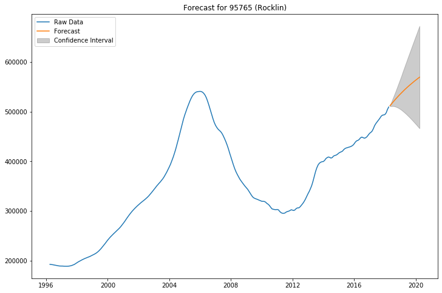


### Print summary of predicted, worst-case, and best-case scenarios


```python
rocklin_95765_pred, rocklin_95765_low, rocklin_95765_high = pred_best_worst(pred=forecasted_price_95765, low=forecasted_lower_95765, 
                                                                            high=forecasted_upper_95765, last=last_value_95765, date='April 1, 2020')
rocklin_95765_pred, rocklin_95765_low, rocklin_95765_high 
```

    By the model prediction, I would expect to see a 11.779% change in price by April 1, 2020.
    At the lower bound of the confidence interval, I would expect to see a -8.471% change in price by April 1, 2020.
    At the upper bound of the confidence interval, I would expect to see a 32.029% change in price by April 1, 2020.


    (11.779, -8.471, 32.029)


## Zip code 95765 (Rocklin):  Solid investment opportunity with minimal downside

By the model prediction, I would expect to see a 11.779% change in price by April 1, 2020.
At the lower bound of the confidence interval, I would expect to see a -8.471% change in price by April 1, 2020.
At the upper bound of the confidence interval, I would expect to see a 32.029% change in price by April 1, 2020.


# SacMetro:  95602 (Auburn) -- Strong investment opportunity with minimal downside


```python
geog_area = '95602'
```


```python
ts_95602 = df_sac.loc[df_sac['Zip'] == geog_area]  # ts for all of the following functions should have only one zipcode
ts_95602.head()

```


<div>
<style scoped>
    .dataframe tbody tr th:only-of-type {
        vertical-align: middle;
    }

    .dataframe tbody tr th {
        vertical-align: top;
    }

    .dataframe thead th {
        text-align: right;
    }
</style>
<table border="1" class="dataframe">
  <thead>
    <tr style="text-align: right;">
      <th></th>
      <th>Metro</th>
      <th>MetroState</th>
      <th>CountyName</th>
      <th>City</th>
      <th>Zip</th>
      <th>SizeRank</th>
      <th>value</th>
    </tr>
    <tr>
      <th>time</th>
      <th></th>
      <th></th>
      <th></th>
      <th></th>
      <th></th>
      <th></th>
      <th></th>
    </tr>
  </thead>
  <tbody>
    <tr>
      <td>1996-04-01</td>
      <td>Sacramento</td>
      <td>Sacramento CA</td>
      <td>Placer</td>
      <td>Auburn</td>
      <td>95602</td>
      <td>6185</td>
      <td>184300.0</td>
    </tr>
    <tr>
      <td>1996-05-01</td>
      <td>Sacramento</td>
      <td>Sacramento CA</td>
      <td>Placer</td>
      <td>Auburn</td>
      <td>95602</td>
      <td>6185</td>
      <td>184000.0</td>
    </tr>
    <tr>
      <td>1996-06-01</td>
      <td>Sacramento</td>
      <td>Sacramento CA</td>
      <td>Placer</td>
      <td>Auburn</td>
      <td>95602</td>
      <td>6185</td>
      <td>183700.0</td>
    </tr>
    <tr>
      <td>1996-07-01</td>
      <td>Sacramento</td>
      <td>Sacramento CA</td>
      <td>Placer</td>
      <td>Auburn</td>
      <td>95602</td>
      <td>6185</td>
      <td>183500.0</td>
    </tr>
    <tr>
      <td>1996-08-01</td>
      <td>Sacramento</td>
      <td>Sacramento CA</td>
      <td>Placer</td>
      <td>Auburn</td>
      <td>95602</td>
      <td>6185</td>
      <td>183300.0</td>
    </tr>
  </tbody>
</table>
</div>


```python
ts_95602.tail()
```


<div>
<style scoped>
    .dataframe tbody tr th:only-of-type {
        vertical-align: middle;
    }

    .dataframe tbody tr th {
        vertical-align: top;
    }

    .dataframe thead th {
        text-align: right;
    }
</style>
<table border="1" class="dataframe">
  <thead>
    <tr style="text-align: right;">
      <th></th>
      <th>Metro</th>
      <th>MetroState</th>
      <th>CountyName</th>
      <th>City</th>
      <th>Zip</th>
      <th>SizeRank</th>
      <th>value</th>
    </tr>
    <tr>
      <th>time</th>
      <th></th>
      <th></th>
      <th></th>
      <th></th>
      <th></th>
      <th></th>
      <th></th>
    </tr>
  </thead>
  <tbody>
    <tr>
      <td>2017-12-01</td>
      <td>Sacramento</td>
      <td>Sacramento CA</td>
      <td>Placer</td>
      <td>Auburn</td>
      <td>95602</td>
      <td>6185</td>
      <td>470800.0</td>
    </tr>
    <tr>
      <td>2018-01-01</td>
      <td>Sacramento</td>
      <td>Sacramento CA</td>
      <td>Placer</td>
      <td>Auburn</td>
      <td>95602</td>
      <td>6185</td>
      <td>474100.0</td>
    </tr>
    <tr>
      <td>2018-02-01</td>
      <td>Sacramento</td>
      <td>Sacramento CA</td>
      <td>Placer</td>
      <td>Auburn</td>
      <td>95602</td>
      <td>6185</td>
      <td>478600.0</td>
    </tr>
    <tr>
      <td>2018-03-01</td>
      <td>Sacramento</td>
      <td>Sacramento CA</td>
      <td>Placer</td>
      <td>Auburn</td>
      <td>95602</td>
      <td>6185</td>
      <td>484300.0</td>
    </tr>
    <tr>
      <td>2018-04-01</td>
      <td>Sacramento</td>
      <td>Sacramento CA</td>
      <td>Placer</td>
      <td>Auburn</td>
      <td>95602</td>
      <td>6185</td>
      <td>488700.0</td>
    </tr>
  </tbody>
</table>
</div>


```python
# ts = ts.value

ts_95602_values = ts_95602.value
```


```python
# ts.head()

ts_95602_values.head()
```


    time
    1996-04-01    184300.0
    1996-05-01    184000.0
    1996-06-01    183700.0
    1996-07-01    183500.0
    1996-08-01    183300.0
    Name: value, dtype: float64


```python
ts_95602_values.tail()
```


    time
    2017-12-01    470800.0
    2018-01-01    474100.0
    2018-02-01    478600.0
    2018-03-01    484300.0
    2018-04-01    488700.0
    Name: value, dtype: float64


### Visualizations

#### plot_ts:  Plot zip code(s) of interest over time, with market highs and lows


```python
# fig, ax = plot_ts(df_melt, zipcodes=['95616', '92008', '90035', '90025', '60625', '57701'])  # enter desired zip code(s)

fig, ax = plot_ts_zips(df_melt, zipcodes=['95602'], figsize=(12,6))  # enter desired zip code(s)
```


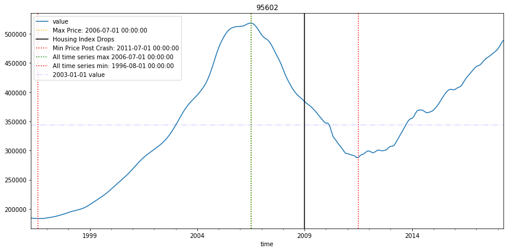


```python
ts_95602.head(3)
```


<div>
<style scoped>
    .dataframe tbody tr th:only-of-type {
        vertical-align: middle;
    }

    .dataframe tbody tr th {
        vertical-align: top;
    }

    .dataframe thead th {
        text-align: right;
    }
</style>
<table border="1" class="dataframe">
  <thead>
    <tr style="text-align: right;">
      <th></th>
      <th>Metro</th>
      <th>MetroState</th>
      <th>CountyName</th>
      <th>City</th>
      <th>Zip</th>
      <th>SizeRank</th>
      <th>value</th>
    </tr>
    <tr>
      <th>time</th>
      <th></th>
      <th></th>
      <th></th>
      <th></th>
      <th></th>
      <th></th>
      <th></th>
    </tr>
  </thead>
  <tbody>
    <tr>
      <td>1996-04-01</td>
      <td>Sacramento</td>
      <td>Sacramento CA</td>
      <td>Placer</td>
      <td>Auburn</td>
      <td>95602</td>
      <td>6185</td>
      <td>184300.0</td>
    </tr>
    <tr>
      <td>1996-05-01</td>
      <td>Sacramento</td>
      <td>Sacramento CA</td>
      <td>Placer</td>
      <td>Auburn</td>
      <td>95602</td>
      <td>6185</td>
      <td>184000.0</td>
    </tr>
    <tr>
      <td>1996-06-01</td>
      <td>Sacramento</td>
      <td>Sacramento CA</td>
      <td>Placer</td>
      <td>Auburn</td>
      <td>95602</td>
      <td>6185</td>
      <td>183700.0</td>
    </tr>
  </tbody>
</table>
</div>


#### Boxplot of zip code


```python
ts_95602.boxplot(column = 'value')
plt.title('95602');

```


### Plot ACF and PACF for ts dataframe


```python
# plot_acf_pacf(ts, figsize=(10,6), lags=15)  # note that ts must only contain values and time as index

plot_acf_pacf(ts_95602_values, figsize=(10,6), lags=15)
```


### Plot seasonal decomposition for ts dataframe


```python
# plot_seasonal_decomp(ts)

plot_seasonal_decomp(ts_95602_values)

# Seasonality does not appear to be a significant factor in this zip code.
```


    (<Figure size 1296x432 with 1 Axes>,
     <matplotlib.axes._subplots.AxesSubplot at 0x1aab6f58d0>)


## ARIMA model parameters and optimization

### Generate list of (p,d,q) and (p,d,q,m) values


```python
p_values = [0, 1, 2, 4, 6, 8]
d_values = range(0, 3)
q_values = range(0, 3)
warnings.filterwarnings("ignore")
```

### Run ARIMA model on ts dataframe with list of p,d,q values 


```python
# eval_arima_models(ts, p_values, d_values, q_values)  # don't run this until you have some time, since it take time
# note that ts must only contain values and time as index

# eval_arima_models(ts_95602_values, p_values, d_values, q_values)  # don't run this until you have some time, since it takes time

```

### Generate model fit summary


```python
# model_fit = arima_zipcode(ts, order = None)   # change order = tuple to correspond to the best MSE produced by previous function

# Best ARIMA(4, 0, 2) MSE=584168.034

model_fit_95602 = arima_zipcode(ts_95602_values, order = (4,1,2))

```

                                 ARIMA Model Results                              
    ==============================================================================
    Dep. Variable:                    D.y   No. Observations:                  264
    Model:                 ARIMA(4, 1, 2)   Log Likelihood               -2141.289
    Method:                       css-mle   S.D. of innovations            797.991
    Date:                Tue, 10 Mar 2020   AIC                           4298.578
    Time:                        22:57:10   BIC                           4327.185
    Sample:                             1   HQIC                          4310.073
                                                                                  
    ==============================================================================
                     coef    std err          z      P>|z|      [0.025      0.975]
    ------------------------------------------------------------------------------
    const       1197.1905   1154.299      1.037      0.301   -1065.195    3459.576
    ar.L1.D.y      0.1396      0.076      1.835      0.068      -0.010       0.289
    ar.L2.D.y      0.2666      0.076      3.491      0.001       0.117       0.416
    ar.L3.D.y      0.2535      0.071      3.574      0.000       0.114       0.393
    ar.L4.D.y      0.2049      0.067      3.042      0.003       0.073       0.337
    ma.L1.D.y      1.5483      0.053     29.026      0.000       1.444       1.653
    ma.L2.D.y      0.8382      0.050     16.742      0.000       0.740       0.936
                                        Roots                                    
    =============================================================================
                      Real          Imaginary           Modulus         Frequency
    -----------------------------------------------------------------------------
    AR.1            1.0568           -0.0000j            1.0568           -0.0000
    AR.2           -1.7002           -0.0000j            1.7002           -0.5000
    AR.3           -0.2968           -1.6210j            1.6480           -0.2788
    AR.4           -0.2968           +1.6210j            1.6480            0.2788
    MA.1           -0.9236           -0.5831j            1.0923           -0.4104
    MA.2           -0.9236           +0.5831j            1.0923            0.4104
    -----------------------------------------------------------------------------


## ARIMA modeling results:  predictions and visualization

### Produce forecasts from ARIMA model fit


```python
actual_forecast_95602, std_error_95602, forecast_confint_95602 = forecast(model_fit_95602)

```


```python
actual_forecast_95602, std_error_95602, forecast_confint_95602
```


    (array([491440.29052556, 494314.53287759, 497891.96474734, 500916.07789598,
            503744.26189492, 506603.28735082, 509418.22510595, 512072.16357087,
            514659.54110644, 517189.84726598, 519644.59202188, 522023.70491649,
            524344.00663971, 526605.08350708, 528807.55526963, 530955.64779549,
            533053.45856594, 535102.75848479, 537106.08548381, 539066.17073443,
            540985.36077654, 542865.71761363, 544709.36717265, 546518.31053564]),
     array([  797.9913192 ,  2288.52884549,  3945.93125293,  5565.74166521,
             7359.16813669,  9293.38164709, 11302.09543762, 13367.54618994,
            15496.48467147, 17671.37370136, 19879.36253193, 22114.34055499,
            24370.89163778, 26642.05815934, 28922.80813553, 31209.13806025,
            33497.32162811, 35783.98722584, 38066.3707441 , 40342.06407742,
            42608.9399555 , 44865.15990349, 47109.15266799, 49339.55696724]),
     array([[489876.25627995, 493004.32477117],
            [489829.09876285, 498799.96699234],
            [490158.08160612, 505625.84788856],
            [490007.42468491, 511824.73110706],
            [489320.55739084, 518167.966399  ],
            [488388.59402794, 524817.9806737 ],
            [487266.52509838, 531569.92511352],
            [485872.25447691, 538272.07266484],
            [484286.98926338, 545032.09294951],
            [482554.59125397, 551825.10327799],
            [480681.75742368, 558607.42662008],
            [478680.39388686, 565367.01594611],
            [476577.93675854, 572110.07652088],
            [474387.60904074, 578822.55797341],
            [472119.89299223, 585495.21754704],
            [469786.86120887, 592124.43438211],
            [467399.91459629, 598707.00253558],
            [464967.4322989 , 605238.08467068],
            [462497.36980324, 611714.80116439],
            [459997.17808067, 618135.16338819],
            [457473.37304433, 624497.34850875],
            [454931.62004217, 630799.8151851 ],
            [452377.12460119, 637041.60974412],
            [449814.55586668, 643222.06520459]]))


### Create dataframe to hold forecast results


```python
# df_forecast = forecast_df(col = 'time', daterange = pd.date_range(start='2018-05-01', end='2020-04-01', freq='MS'), 
#                 actual_forecast=actual_forecast, forecast_confint = forecast_confint)

df_forecast_95602 = forecast_df(actual_forecast_95602, forecast_confint_95602, col = 'time', 
                                daterange = pd.date_range(start='2018-05-01', end='2020-04-01', freq='MS'))
```

### Create new dataframe concatenating historic values and forecast results


```python
# df_new = concat_values_forecast(ts, df_forecast)

df_new_95602 = concat_values_forecast(ts_95602_values, df_forecast_95602)
```


```python
df_new_95602
```


<div>
<style scoped>
    .dataframe tbody tr th:only-of-type {
        vertical-align: middle;
    }

    .dataframe tbody tr th {
        vertical-align: top;
    }

    .dataframe thead th {
        text-align: right;
    }
</style>
<table border="1" class="dataframe">
  <thead>
    <tr style="text-align: right;">
      <th></th>
      <th>value</th>
      <th>forecast</th>
      <th>forecast_lower</th>
      <th>forecast_upper</th>
    </tr>
    <tr>
      <th>time</th>
      <th></th>
      <th></th>
      <th></th>
      <th></th>
    </tr>
  </thead>
  <tbody>
    <tr>
      <td>1996-04-01</td>
      <td>184300.0</td>
      <td>NaN</td>
      <td>NaN</td>
      <td>NaN</td>
    </tr>
    <tr>
      <td>1996-05-01</td>
      <td>184000.0</td>
      <td>NaN</td>
      <td>NaN</td>
      <td>NaN</td>
    </tr>
    <tr>
      <td>1996-06-01</td>
      <td>183700.0</td>
      <td>NaN</td>
      <td>NaN</td>
      <td>NaN</td>
    </tr>
    <tr>
      <td>1996-07-01</td>
      <td>183500.0</td>
      <td>NaN</td>
      <td>NaN</td>
      <td>NaN</td>
    </tr>
    <tr>
      <td>1996-08-01</td>
      <td>183300.0</td>
      <td>NaN</td>
      <td>NaN</td>
      <td>NaN</td>
    </tr>
    <tr>
      <td>1996-09-01</td>
      <td>183300.0</td>
      <td>NaN</td>
      <td>NaN</td>
      <td>NaN</td>
    </tr>
    <tr>
      <td>1996-10-01</td>
      <td>183400.0</td>
      <td>NaN</td>
      <td>NaN</td>
      <td>NaN</td>
    </tr>
    <tr>
      <td>1996-11-01</td>
      <td>183500.0</td>
      <td>NaN</td>
      <td>NaN</td>
      <td>NaN</td>
    </tr>
    <tr>
      <td>1996-12-01</td>
      <td>183900.0</td>
      <td>NaN</td>
      <td>NaN</td>
      <td>NaN</td>
    </tr>
    <tr>
      <td>1997-01-01</td>
      <td>184400.0</td>
      <td>NaN</td>
      <td>NaN</td>
      <td>NaN</td>
    </tr>
    <tr>
      <td>1997-02-01</td>
      <td>185000.0</td>
      <td>NaN</td>
      <td>NaN</td>
      <td>NaN</td>
    </tr>
    <tr>
      <td>1997-03-01</td>
      <td>185400.0</td>
      <td>NaN</td>
      <td>NaN</td>
      <td>NaN</td>
    </tr>
    <tr>
      <td>1997-04-01</td>
      <td>185900.0</td>
      <td>NaN</td>
      <td>NaN</td>
      <td>NaN</td>
    </tr>
    <tr>
      <td>1997-05-01</td>
      <td>186500.0</td>
      <td>NaN</td>
      <td>NaN</td>
      <td>NaN</td>
    </tr>
    <tr>
      <td>1997-06-01</td>
      <td>187200.0</td>
      <td>NaN</td>
      <td>NaN</td>
      <td>NaN</td>
    </tr>
    <tr>
      <td>1997-07-01</td>
      <td>188000.0</td>
      <td>NaN</td>
      <td>NaN</td>
      <td>NaN</td>
    </tr>
    <tr>
      <td>1997-08-01</td>
      <td>188800.0</td>
      <td>NaN</td>
      <td>NaN</td>
      <td>NaN</td>
    </tr>
    <tr>
      <td>1997-09-01</td>
      <td>189700.0</td>
      <td>NaN</td>
      <td>NaN</td>
      <td>NaN</td>
    </tr>
    <tr>
      <td>1997-10-01</td>
      <td>190600.0</td>
      <td>NaN</td>
      <td>NaN</td>
      <td>NaN</td>
    </tr>
    <tr>
      <td>1997-11-01</td>
      <td>191600.0</td>
      <td>NaN</td>
      <td>NaN</td>
      <td>NaN</td>
    </tr>
    <tr>
      <td>1997-12-01</td>
      <td>192700.0</td>
      <td>NaN</td>
      <td>NaN</td>
      <td>NaN</td>
    </tr>
    <tr>
      <td>1998-01-01</td>
      <td>193800.0</td>
      <td>NaN</td>
      <td>NaN</td>
      <td>NaN</td>
    </tr>
    <tr>
      <td>1998-02-01</td>
      <td>194800.0</td>
      <td>NaN</td>
      <td>NaN</td>
      <td>NaN</td>
    </tr>
    <tr>
      <td>1998-03-01</td>
      <td>195600.0</td>
      <td>NaN</td>
      <td>NaN</td>
      <td>NaN</td>
    </tr>
    <tr>
      <td>1998-04-01</td>
      <td>196400.0</td>
      <td>NaN</td>
      <td>NaN</td>
      <td>NaN</td>
    </tr>
    <tr>
      <td>1998-05-01</td>
      <td>197200.0</td>
      <td>NaN</td>
      <td>NaN</td>
      <td>NaN</td>
    </tr>
    <tr>
      <td>1998-06-01</td>
      <td>198000.0</td>
      <td>NaN</td>
      <td>NaN</td>
      <td>NaN</td>
    </tr>
    <tr>
      <td>1998-07-01</td>
      <td>198800.0</td>
      <td>NaN</td>
      <td>NaN</td>
      <td>NaN</td>
    </tr>
    <tr>
      <td>1998-08-01</td>
      <td>199700.0</td>
      <td>NaN</td>
      <td>NaN</td>
      <td>NaN</td>
    </tr>
    <tr>
      <td>1998-09-01</td>
      <td>200800.0</td>
      <td>NaN</td>
      <td>NaN</td>
      <td>NaN</td>
    </tr>
    <tr>
      <td>1998-10-01</td>
      <td>202100.0</td>
      <td>NaN</td>
      <td>NaN</td>
      <td>NaN</td>
    </tr>
    <tr>
      <td>1998-11-01</td>
      <td>203600.0</td>
      <td>NaN</td>
      <td>NaN</td>
      <td>NaN</td>
    </tr>
    <tr>
      <td>1998-12-01</td>
      <td>205400.0</td>
      <td>NaN</td>
      <td>NaN</td>
      <td>NaN</td>
    </tr>
    <tr>
      <td>1999-01-01</td>
      <td>207300.0</td>
      <td>NaN</td>
      <td>NaN</td>
      <td>NaN</td>
    </tr>
    <tr>
      <td>1999-02-01</td>
      <td>209300.0</td>
      <td>NaN</td>
      <td>NaN</td>
      <td>NaN</td>
    </tr>
    <tr>
      <td>1999-03-01</td>
      <td>211200.0</td>
      <td>NaN</td>
      <td>NaN</td>
      <td>NaN</td>
    </tr>
    <tr>
      <td>1999-04-01</td>
      <td>213200.0</td>
      <td>NaN</td>
      <td>NaN</td>
      <td>NaN</td>
    </tr>
    <tr>
      <td>1999-05-01</td>
      <td>215300.0</td>
      <td>NaN</td>
      <td>NaN</td>
      <td>NaN</td>
    </tr>
    <tr>
      <td>1999-06-01</td>
      <td>217400.0</td>
      <td>NaN</td>
      <td>NaN</td>
      <td>NaN</td>
    </tr>
    <tr>
      <td>1999-07-01</td>
      <td>219500.0</td>
      <td>NaN</td>
      <td>NaN</td>
      <td>NaN</td>
    </tr>
    <tr>
      <td>1999-08-01</td>
      <td>221600.0</td>
      <td>NaN</td>
      <td>NaN</td>
      <td>NaN</td>
    </tr>
    <tr>
      <td>1999-09-01</td>
      <td>223800.0</td>
      <td>NaN</td>
      <td>NaN</td>
      <td>NaN</td>
    </tr>
    <tr>
      <td>1999-10-01</td>
      <td>226100.0</td>
      <td>NaN</td>
      <td>NaN</td>
      <td>NaN</td>
    </tr>
    <tr>
      <td>1999-11-01</td>
      <td>228600.0</td>
      <td>NaN</td>
      <td>NaN</td>
      <td>NaN</td>
    </tr>
    <tr>
      <td>1999-12-01</td>
      <td>231200.0</td>
      <td>NaN</td>
      <td>NaN</td>
      <td>NaN</td>
    </tr>
    <tr>
      <td>2000-01-01</td>
      <td>234000.0</td>
      <td>NaN</td>
      <td>NaN</td>
      <td>NaN</td>
    </tr>
    <tr>
      <td>2000-02-01</td>
      <td>236900.0</td>
      <td>NaN</td>
      <td>NaN</td>
      <td>NaN</td>
    </tr>
    <tr>
      <td>2000-03-01</td>
      <td>239600.0</td>
      <td>NaN</td>
      <td>NaN</td>
      <td>NaN</td>
    </tr>
    <tr>
      <td>2000-04-01</td>
      <td>242300.0</td>
      <td>NaN</td>
      <td>NaN</td>
      <td>NaN</td>
    </tr>
    <tr>
      <td>2000-05-01</td>
      <td>245000.0</td>
      <td>NaN</td>
      <td>NaN</td>
      <td>NaN</td>
    </tr>
    <tr>
      <td>2000-06-01</td>
      <td>247800.0</td>
      <td>NaN</td>
      <td>NaN</td>
      <td>NaN</td>
    </tr>
    <tr>
      <td>2000-07-01</td>
      <td>250500.0</td>
      <td>NaN</td>
      <td>NaN</td>
      <td>NaN</td>
    </tr>
    <tr>
      <td>2000-08-01</td>
      <td>253200.0</td>
      <td>NaN</td>
      <td>NaN</td>
      <td>NaN</td>
    </tr>
    <tr>
      <td>2000-09-01</td>
      <td>256000.0</td>
      <td>NaN</td>
      <td>NaN</td>
      <td>NaN</td>
    </tr>
    <tr>
      <td>2000-10-01</td>
      <td>258800.0</td>
      <td>NaN</td>
      <td>NaN</td>
      <td>NaN</td>
    </tr>
    <tr>
      <td>2000-11-01</td>
      <td>261900.0</td>
      <td>NaN</td>
      <td>NaN</td>
      <td>NaN</td>
    </tr>
    <tr>
      <td>2000-12-01</td>
      <td>265200.0</td>
      <td>NaN</td>
      <td>NaN</td>
      <td>NaN</td>
    </tr>
    <tr>
      <td>2001-01-01</td>
      <td>268600.0</td>
      <td>NaN</td>
      <td>NaN</td>
      <td>NaN</td>
    </tr>
    <tr>
      <td>2001-02-01</td>
      <td>272000.0</td>
      <td>NaN</td>
      <td>NaN</td>
      <td>NaN</td>
    </tr>
    <tr>
      <td>2001-03-01</td>
      <td>275300.0</td>
      <td>NaN</td>
      <td>NaN</td>
      <td>NaN</td>
    </tr>
    <tr>
      <td>2001-04-01</td>
      <td>278700.0</td>
      <td>NaN</td>
      <td>NaN</td>
      <td>NaN</td>
    </tr>
    <tr>
      <td>2001-05-01</td>
      <td>281900.0</td>
      <td>NaN</td>
      <td>NaN</td>
      <td>NaN</td>
    </tr>
    <tr>
      <td>2001-06-01</td>
      <td>285000.0</td>
      <td>NaN</td>
      <td>NaN</td>
      <td>NaN</td>
    </tr>
    <tr>
      <td>2001-07-01</td>
      <td>287900.0</td>
      <td>NaN</td>
      <td>NaN</td>
      <td>NaN</td>
    </tr>
    <tr>
      <td>2001-08-01</td>
      <td>290500.0</td>
      <td>NaN</td>
      <td>NaN</td>
      <td>NaN</td>
    </tr>
    <tr>
      <td>2001-09-01</td>
      <td>293000.0</td>
      <td>NaN</td>
      <td>NaN</td>
      <td>NaN</td>
    </tr>
    <tr>
      <td>2001-10-01</td>
      <td>295300.0</td>
      <td>NaN</td>
      <td>NaN</td>
      <td>NaN</td>
    </tr>
    <tr>
      <td>2001-11-01</td>
      <td>297500.0</td>
      <td>NaN</td>
      <td>NaN</td>
      <td>NaN</td>
    </tr>
    <tr>
      <td>2001-12-01</td>
      <td>299800.0</td>
      <td>NaN</td>
      <td>NaN</td>
      <td>NaN</td>
    </tr>
    <tr>
      <td>2002-01-01</td>
      <td>302000.0</td>
      <td>NaN</td>
      <td>NaN</td>
      <td>NaN</td>
    </tr>
    <tr>
      <td>2002-02-01</td>
      <td>304300.0</td>
      <td>NaN</td>
      <td>NaN</td>
      <td>NaN</td>
    </tr>
    <tr>
      <td>2002-03-01</td>
      <td>306600.0</td>
      <td>NaN</td>
      <td>NaN</td>
      <td>NaN</td>
    </tr>
    <tr>
      <td>2002-04-01</td>
      <td>309000.0</td>
      <td>NaN</td>
      <td>NaN</td>
      <td>NaN</td>
    </tr>
    <tr>
      <td>2002-05-01</td>
      <td>311500.0</td>
      <td>NaN</td>
      <td>NaN</td>
      <td>NaN</td>
    </tr>
    <tr>
      <td>2002-06-01</td>
      <td>314400.0</td>
      <td>NaN</td>
      <td>NaN</td>
      <td>NaN</td>
    </tr>
    <tr>
      <td>2002-07-01</td>
      <td>317600.0</td>
      <td>NaN</td>
      <td>NaN</td>
      <td>NaN</td>
    </tr>
    <tr>
      <td>2002-08-01</td>
      <td>321000.0</td>
      <td>NaN</td>
      <td>NaN</td>
      <td>NaN</td>
    </tr>
    <tr>
      <td>2002-09-01</td>
      <td>324700.0</td>
      <td>NaN</td>
      <td>NaN</td>
      <td>NaN</td>
    </tr>
    <tr>
      <td>2002-10-01</td>
      <td>328800.0</td>
      <td>NaN</td>
      <td>NaN</td>
      <td>NaN</td>
    </tr>
    <tr>
      <td>2002-11-01</td>
      <td>333500.0</td>
      <td>NaN</td>
      <td>NaN</td>
      <td>NaN</td>
    </tr>
    <tr>
      <td>2002-12-01</td>
      <td>338600.0</td>
      <td>NaN</td>
      <td>NaN</td>
      <td>NaN</td>
    </tr>
    <tr>
      <td>2003-01-01</td>
      <td>343800.0</td>
      <td>NaN</td>
      <td>NaN</td>
      <td>NaN</td>
    </tr>
    <tr>
      <td>2003-02-01</td>
      <td>348900.0</td>
      <td>NaN</td>
      <td>NaN</td>
      <td>NaN</td>
    </tr>
    <tr>
      <td>2003-03-01</td>
      <td>354300.0</td>
      <td>NaN</td>
      <td>NaN</td>
      <td>NaN</td>
    </tr>
    <tr>
      <td>2003-04-01</td>
      <td>359800.0</td>
      <td>NaN</td>
      <td>NaN</td>
      <td>NaN</td>
    </tr>
    <tr>
      <td>2003-05-01</td>
      <td>365100.0</td>
      <td>NaN</td>
      <td>NaN</td>
      <td>NaN</td>
    </tr>
    <tr>
      <td>2003-06-01</td>
      <td>370000.0</td>
      <td>NaN</td>
      <td>NaN</td>
      <td>NaN</td>
    </tr>
    <tr>
      <td>2003-07-01</td>
      <td>374400.0</td>
      <td>NaN</td>
      <td>NaN</td>
      <td>NaN</td>
    </tr>
    <tr>
      <td>2003-08-01</td>
      <td>378400.0</td>
      <td>NaN</td>
      <td>NaN</td>
      <td>NaN</td>
    </tr>
    <tr>
      <td>2003-09-01</td>
      <td>382000.0</td>
      <td>NaN</td>
      <td>NaN</td>
      <td>NaN</td>
    </tr>
    <tr>
      <td>2003-10-01</td>
      <td>385400.0</td>
      <td>NaN</td>
      <td>NaN</td>
      <td>NaN</td>
    </tr>
    <tr>
      <td>2003-11-01</td>
      <td>388500.0</td>
      <td>NaN</td>
      <td>NaN</td>
      <td>NaN</td>
    </tr>
    <tr>
      <td>2003-12-01</td>
      <td>391500.0</td>
      <td>NaN</td>
      <td>NaN</td>
      <td>NaN</td>
    </tr>
    <tr>
      <td>2004-01-01</td>
      <td>394800.0</td>
      <td>NaN</td>
      <td>NaN</td>
      <td>NaN</td>
    </tr>
    <tr>
      <td>2004-02-01</td>
      <td>398500.0</td>
      <td>NaN</td>
      <td>NaN</td>
      <td>NaN</td>
    </tr>
    <tr>
      <td>2004-03-01</td>
      <td>402400.0</td>
      <td>NaN</td>
      <td>NaN</td>
      <td>NaN</td>
    </tr>
    <tr>
      <td>2004-04-01</td>
      <td>406500.0</td>
      <td>NaN</td>
      <td>NaN</td>
      <td>NaN</td>
    </tr>
    <tr>
      <td>2004-05-01</td>
      <td>411000.0</td>
      <td>NaN</td>
      <td>NaN</td>
      <td>NaN</td>
    </tr>
    <tr>
      <td>2004-06-01</td>
      <td>416300.0</td>
      <td>NaN</td>
      <td>NaN</td>
      <td>NaN</td>
    </tr>
    <tr>
      <td>2004-07-01</td>
      <td>422800.0</td>
      <td>NaN</td>
      <td>NaN</td>
      <td>NaN</td>
    </tr>
    <tr>
      <td>2004-08-01</td>
      <td>430400.0</td>
      <td>NaN</td>
      <td>NaN</td>
      <td>NaN</td>
    </tr>
    <tr>
      <td>2004-09-01</td>
      <td>439100.0</td>
      <td>NaN</td>
      <td>NaN</td>
      <td>NaN</td>
    </tr>
    <tr>
      <td>2004-10-01</td>
      <td>448700.0</td>
      <td>NaN</td>
      <td>NaN</td>
      <td>NaN</td>
    </tr>
    <tr>
      <td>2004-11-01</td>
      <td>458300.0</td>
      <td>NaN</td>
      <td>NaN</td>
      <td>NaN</td>
    </tr>
    <tr>
      <td>2004-12-01</td>
      <td>467700.0</td>
      <td>NaN</td>
      <td>NaN</td>
      <td>NaN</td>
    </tr>
    <tr>
      <td>2005-01-01</td>
      <td>476200.0</td>
      <td>NaN</td>
      <td>NaN</td>
      <td>NaN</td>
    </tr>
    <tr>
      <td>2005-02-01</td>
      <td>483400.0</td>
      <td>NaN</td>
      <td>NaN</td>
      <td>NaN</td>
    </tr>
    <tr>
      <td>2005-03-01</td>
      <td>489700.0</td>
      <td>NaN</td>
      <td>NaN</td>
      <td>NaN</td>
    </tr>
    <tr>
      <td>2005-04-01</td>
      <td>495500.0</td>
      <td>NaN</td>
      <td>NaN</td>
      <td>NaN</td>
    </tr>
    <tr>
      <td>2005-05-01</td>
      <td>500300.0</td>
      <td>NaN</td>
      <td>NaN</td>
      <td>NaN</td>
    </tr>
    <tr>
      <td>2005-06-01</td>
      <td>504300.0</td>
      <td>NaN</td>
      <td>NaN</td>
      <td>NaN</td>
    </tr>
    <tr>
      <td>2005-07-01</td>
      <td>507500.0</td>
      <td>NaN</td>
      <td>NaN</td>
      <td>NaN</td>
    </tr>
    <tr>
      <td>2005-08-01</td>
      <td>509600.0</td>
      <td>NaN</td>
      <td>NaN</td>
      <td>NaN</td>
    </tr>
    <tr>
      <td>2005-09-01</td>
      <td>510900.0</td>
      <td>NaN</td>
      <td>NaN</td>
      <td>NaN</td>
    </tr>
    <tr>
      <td>2005-10-01</td>
      <td>511800.0</td>
      <td>NaN</td>
      <td>NaN</td>
      <td>NaN</td>
    </tr>
    <tr>
      <td>2005-11-01</td>
      <td>512300.0</td>
      <td>NaN</td>
      <td>NaN</td>
      <td>NaN</td>
    </tr>
    <tr>
      <td>2005-12-01</td>
      <td>512600.0</td>
      <td>NaN</td>
      <td>NaN</td>
      <td>NaN</td>
    </tr>
    <tr>
      <td>2006-01-01</td>
      <td>512800.0</td>
      <td>NaN</td>
      <td>NaN</td>
      <td>NaN</td>
    </tr>
    <tr>
      <td>2006-02-01</td>
      <td>513000.0</td>
      <td>NaN</td>
      <td>NaN</td>
      <td>NaN</td>
    </tr>
    <tr>
      <td>2006-03-01</td>
      <td>513700.0</td>
      <td>NaN</td>
      <td>NaN</td>
      <td>NaN</td>
    </tr>
    <tr>
      <td>2006-04-01</td>
      <td>515200.0</td>
      <td>NaN</td>
      <td>NaN</td>
      <td>NaN</td>
    </tr>
    <tr>
      <td>2006-05-01</td>
      <td>516900.0</td>
      <td>NaN</td>
      <td>NaN</td>
      <td>NaN</td>
    </tr>
    <tr>
      <td>2006-06-01</td>
      <td>518100.0</td>
      <td>NaN</td>
      <td>NaN</td>
      <td>NaN</td>
    </tr>
    <tr>
      <td>2006-07-01</td>
      <td>518500.0</td>
      <td>NaN</td>
      <td>NaN</td>
      <td>NaN</td>
    </tr>
    <tr>
      <td>2006-08-01</td>
      <td>517700.0</td>
      <td>NaN</td>
      <td>NaN</td>
      <td>NaN</td>
    </tr>
    <tr>
      <td>2006-09-01</td>
      <td>515500.0</td>
      <td>NaN</td>
      <td>NaN</td>
      <td>NaN</td>
    </tr>
    <tr>
      <td>2006-10-01</td>
      <td>512100.0</td>
      <td>NaN</td>
      <td>NaN</td>
      <td>NaN</td>
    </tr>
    <tr>
      <td>2006-11-01</td>
      <td>507800.0</td>
      <td>NaN</td>
      <td>NaN</td>
      <td>NaN</td>
    </tr>
    <tr>
      <td>2006-12-01</td>
      <td>502900.0</td>
      <td>NaN</td>
      <td>NaN</td>
      <td>NaN</td>
    </tr>
    <tr>
      <td>2007-01-01</td>
      <td>498300.0</td>
      <td>NaN</td>
      <td>NaN</td>
      <td>NaN</td>
    </tr>
    <tr>
      <td>2007-02-01</td>
      <td>494600.0</td>
      <td>NaN</td>
      <td>NaN</td>
      <td>NaN</td>
    </tr>
    <tr>
      <td>2007-03-01</td>
      <td>492300.0</td>
      <td>NaN</td>
      <td>NaN</td>
      <td>NaN</td>
    </tr>
    <tr>
      <td>2007-04-01</td>
      <td>490400.0</td>
      <td>NaN</td>
      <td>NaN</td>
      <td>NaN</td>
    </tr>
    <tr>
      <td>2007-05-01</td>
      <td>487600.0</td>
      <td>NaN</td>
      <td>NaN</td>
      <td>NaN</td>
    </tr>
    <tr>
      <td>2007-06-01</td>
      <td>483300.0</td>
      <td>NaN</td>
      <td>NaN</td>
      <td>NaN</td>
    </tr>
    <tr>
      <td>2007-07-01</td>
      <td>478000.0</td>
      <td>NaN</td>
      <td>NaN</td>
      <td>NaN</td>
    </tr>
    <tr>
      <td>2007-08-01</td>
      <td>471800.0</td>
      <td>NaN</td>
      <td>NaN</td>
      <td>NaN</td>
    </tr>
    <tr>
      <td>2007-09-01</td>
      <td>465800.0</td>
      <td>NaN</td>
      <td>NaN</td>
      <td>NaN</td>
    </tr>
    <tr>
      <td>2007-10-01</td>
      <td>460000.0</td>
      <td>NaN</td>
      <td>NaN</td>
      <td>NaN</td>
    </tr>
    <tr>
      <td>2007-11-01</td>
      <td>454000.0</td>
      <td>NaN</td>
      <td>NaN</td>
      <td>NaN</td>
    </tr>
    <tr>
      <td>2007-12-01</td>
      <td>447300.0</td>
      <td>NaN</td>
      <td>NaN</td>
      <td>NaN</td>
    </tr>
    <tr>
      <td>2008-01-01</td>
      <td>439600.0</td>
      <td>NaN</td>
      <td>NaN</td>
      <td>NaN</td>
    </tr>
    <tr>
      <td>2008-02-01</td>
      <td>431600.0</td>
      <td>NaN</td>
      <td>NaN</td>
      <td>NaN</td>
    </tr>
    <tr>
      <td>2008-03-01</td>
      <td>424600.0</td>
      <td>NaN</td>
      <td>NaN</td>
      <td>NaN</td>
    </tr>
    <tr>
      <td>2008-04-01</td>
      <td>418500.0</td>
      <td>NaN</td>
      <td>NaN</td>
      <td>NaN</td>
    </tr>
    <tr>
      <td>2008-05-01</td>
      <td>412900.0</td>
      <td>NaN</td>
      <td>NaN</td>
      <td>NaN</td>
    </tr>
    <tr>
      <td>2008-06-01</td>
      <td>407500.0</td>
      <td>NaN</td>
      <td>NaN</td>
      <td>NaN</td>
    </tr>
    <tr>
      <td>2008-07-01</td>
      <td>402800.0</td>
      <td>NaN</td>
      <td>NaN</td>
      <td>NaN</td>
    </tr>
    <tr>
      <td>2008-08-01</td>
      <td>398700.0</td>
      <td>NaN</td>
      <td>NaN</td>
      <td>NaN</td>
    </tr>
    <tr>
      <td>2008-09-01</td>
      <td>395300.0</td>
      <td>NaN</td>
      <td>NaN</td>
      <td>NaN</td>
    </tr>
    <tr>
      <td>2008-10-01</td>
      <td>392500.0</td>
      <td>NaN</td>
      <td>NaN</td>
      <td>NaN</td>
    </tr>
    <tr>
      <td>2008-11-01</td>
      <td>389900.0</td>
      <td>NaN</td>
      <td>NaN</td>
      <td>NaN</td>
    </tr>
    <tr>
      <td>2008-12-01</td>
      <td>387100.0</td>
      <td>NaN</td>
      <td>NaN</td>
      <td>NaN</td>
    </tr>
    <tr>
      <td>2009-01-01</td>
      <td>384100.0</td>
      <td>NaN</td>
      <td>NaN</td>
      <td>NaN</td>
    </tr>
    <tr>
      <td>2009-02-01</td>
      <td>381200.0</td>
      <td>NaN</td>
      <td>NaN</td>
      <td>NaN</td>
    </tr>
    <tr>
      <td>2009-03-01</td>
      <td>378900.0</td>
      <td>NaN</td>
      <td>NaN</td>
      <td>NaN</td>
    </tr>
    <tr>
      <td>2009-04-01</td>
      <td>376700.0</td>
      <td>NaN</td>
      <td>NaN</td>
      <td>NaN</td>
    </tr>
    <tr>
      <td>2009-05-01</td>
      <td>373900.0</td>
      <td>NaN</td>
      <td>NaN</td>
      <td>NaN</td>
    </tr>
    <tr>
      <td>2009-06-01</td>
      <td>370700.0</td>
      <td>NaN</td>
      <td>NaN</td>
      <td>NaN</td>
    </tr>
    <tr>
      <td>2009-07-01</td>
      <td>367500.0</td>
      <td>NaN</td>
      <td>NaN</td>
      <td>NaN</td>
    </tr>
    <tr>
      <td>2009-08-01</td>
      <td>363900.0</td>
      <td>NaN</td>
      <td>NaN</td>
      <td>NaN</td>
    </tr>
    <tr>
      <td>2009-09-01</td>
      <td>359900.0</td>
      <td>NaN</td>
      <td>NaN</td>
      <td>NaN</td>
    </tr>
    <tr>
      <td>2009-10-01</td>
      <td>356200.0</td>
      <td>NaN</td>
      <td>NaN</td>
      <td>NaN</td>
    </tr>
    <tr>
      <td>2009-11-01</td>
      <td>352500.0</td>
      <td>NaN</td>
      <td>NaN</td>
      <td>NaN</td>
    </tr>
    <tr>
      <td>2009-12-01</td>
      <td>349000.0</td>
      <td>NaN</td>
      <td>NaN</td>
      <td>NaN</td>
    </tr>
    <tr>
      <td>2010-01-01</td>
      <td>346700.0</td>
      <td>NaN</td>
      <td>NaN</td>
      <td>NaN</td>
    </tr>
    <tr>
      <td>2010-02-01</td>
      <td>347100.0</td>
      <td>NaN</td>
      <td>NaN</td>
      <td>NaN</td>
    </tr>
    <tr>
      <td>2010-03-01</td>
      <td>342800.0</td>
      <td>NaN</td>
      <td>NaN</td>
      <td>NaN</td>
    </tr>
    <tr>
      <td>2010-04-01</td>
      <td>332400.0</td>
      <td>NaN</td>
      <td>NaN</td>
      <td>NaN</td>
    </tr>
    <tr>
      <td>2010-05-01</td>
      <td>323400.0</td>
      <td>NaN</td>
      <td>NaN</td>
      <td>NaN</td>
    </tr>
    <tr>
      <td>2010-06-01</td>
      <td>319400.0</td>
      <td>NaN</td>
      <td>NaN</td>
      <td>NaN</td>
    </tr>
    <tr>
      <td>2010-07-01</td>
      <td>315500.0</td>
      <td>NaN</td>
      <td>NaN</td>
      <td>NaN</td>
    </tr>
    <tr>
      <td>2010-08-01</td>
      <td>310900.0</td>
      <td>NaN</td>
      <td>NaN</td>
      <td>NaN</td>
    </tr>
    <tr>
      <td>2010-09-01</td>
      <td>307300.0</td>
      <td>NaN</td>
      <td>NaN</td>
      <td>NaN</td>
    </tr>
    <tr>
      <td>2010-10-01</td>
      <td>303300.0</td>
      <td>NaN</td>
      <td>NaN</td>
      <td>NaN</td>
    </tr>
    <tr>
      <td>2010-11-01</td>
      <td>298600.0</td>
      <td>NaN</td>
      <td>NaN</td>
      <td>NaN</td>
    </tr>
    <tr>
      <td>2010-12-01</td>
      <td>295000.0</td>
      <td>NaN</td>
      <td>NaN</td>
      <td>NaN</td>
    </tr>
    <tr>
      <td>2011-01-01</td>
      <td>294700.0</td>
      <td>NaN</td>
      <td>NaN</td>
      <td>NaN</td>
    </tr>
    <tr>
      <td>2011-02-01</td>
      <td>293700.0</td>
      <td>NaN</td>
      <td>NaN</td>
      <td>NaN</td>
    </tr>
    <tr>
      <td>2011-03-01</td>
      <td>292500.0</td>
      <td>NaN</td>
      <td>NaN</td>
      <td>NaN</td>
    </tr>
    <tr>
      <td>2011-04-01</td>
      <td>291700.0</td>
      <td>NaN</td>
      <td>NaN</td>
      <td>NaN</td>
    </tr>
    <tr>
      <td>2011-05-01</td>
      <td>290900.0</td>
      <td>NaN</td>
      <td>NaN</td>
      <td>NaN</td>
    </tr>
    <tr>
      <td>2011-06-01</td>
      <td>287900.0</td>
      <td>NaN</td>
      <td>NaN</td>
      <td>NaN</td>
    </tr>
    <tr>
      <td>2011-07-01</td>
      <td>287800.0</td>
      <td>NaN</td>
      <td>NaN</td>
      <td>NaN</td>
    </tr>
    <tr>
      <td>2011-08-01</td>
      <td>291200.0</td>
      <td>NaN</td>
      <td>NaN</td>
      <td>NaN</td>
    </tr>
    <tr>
      <td>2011-09-01</td>
      <td>293100.0</td>
      <td>NaN</td>
      <td>NaN</td>
      <td>NaN</td>
    </tr>
    <tr>
      <td>2011-10-01</td>
      <td>293900.0</td>
      <td>NaN</td>
      <td>NaN</td>
      <td>NaN</td>
    </tr>
    <tr>
      <td>2011-11-01</td>
      <td>296600.0</td>
      <td>NaN</td>
      <td>NaN</td>
      <td>NaN</td>
    </tr>
    <tr>
      <td>2011-12-01</td>
      <td>299000.0</td>
      <td>NaN</td>
      <td>NaN</td>
      <td>NaN</td>
    </tr>
    <tr>
      <td>2012-01-01</td>
      <td>299200.0</td>
      <td>NaN</td>
      <td>NaN</td>
      <td>NaN</td>
    </tr>
    <tr>
      <td>2012-02-01</td>
      <td>297900.0</td>
      <td>NaN</td>
      <td>NaN</td>
      <td>NaN</td>
    </tr>
    <tr>
      <td>2012-03-01</td>
      <td>296100.0</td>
      <td>NaN</td>
      <td>NaN</td>
      <td>NaN</td>
    </tr>
    <tr>
      <td>2012-04-01</td>
      <td>297000.0</td>
      <td>NaN</td>
      <td>NaN</td>
      <td>NaN</td>
    </tr>
    <tr>
      <td>2012-05-01</td>
      <td>299000.0</td>
      <td>NaN</td>
      <td>NaN</td>
      <td>NaN</td>
    </tr>
    <tr>
      <td>2012-06-01</td>
      <td>300800.0</td>
      <td>NaN</td>
      <td>NaN</td>
      <td>NaN</td>
    </tr>
    <tr>
      <td>2012-07-01</td>
      <td>300500.0</td>
      <td>NaN</td>
      <td>NaN</td>
      <td>NaN</td>
    </tr>
    <tr>
      <td>2012-08-01</td>
      <td>299600.0</td>
      <td>NaN</td>
      <td>NaN</td>
      <td>NaN</td>
    </tr>
    <tr>
      <td>2012-09-01</td>
      <td>299700.0</td>
      <td>NaN</td>
      <td>NaN</td>
      <td>NaN</td>
    </tr>
    <tr>
      <td>2012-10-01</td>
      <td>300500.0</td>
      <td>NaN</td>
      <td>NaN</td>
      <td>NaN</td>
    </tr>
    <tr>
      <td>2012-11-01</td>
      <td>301700.0</td>
      <td>NaN</td>
      <td>NaN</td>
      <td>NaN</td>
    </tr>
    <tr>
      <td>2012-12-01</td>
      <td>305100.0</td>
      <td>NaN</td>
      <td>NaN</td>
      <td>NaN</td>
    </tr>
    <tr>
      <td>2013-01-01</td>
      <td>307300.0</td>
      <td>NaN</td>
      <td>NaN</td>
      <td>NaN</td>
    </tr>
    <tr>
      <td>2013-02-01</td>
      <td>307100.0</td>
      <td>NaN</td>
      <td>NaN</td>
      <td>NaN</td>
    </tr>
    <tr>
      <td>2013-03-01</td>
      <td>308800.0</td>
      <td>NaN</td>
      <td>NaN</td>
      <td>NaN</td>
    </tr>
    <tr>
      <td>2013-04-01</td>
      <td>313500.0</td>
      <td>NaN</td>
      <td>NaN</td>
      <td>NaN</td>
    </tr>
    <tr>
      <td>2013-05-01</td>
      <td>318900.0</td>
      <td>NaN</td>
      <td>NaN</td>
      <td>NaN</td>
    </tr>
    <tr>
      <td>2013-06-01</td>
      <td>324300.0</td>
      <td>NaN</td>
      <td>NaN</td>
      <td>NaN</td>
    </tr>
    <tr>
      <td>2013-07-01</td>
      <td>329500.0</td>
      <td>NaN</td>
      <td>NaN</td>
      <td>NaN</td>
    </tr>
    <tr>
      <td>2013-08-01</td>
      <td>334900.0</td>
      <td>NaN</td>
      <td>NaN</td>
      <td>NaN</td>
    </tr>
    <tr>
      <td>2013-09-01</td>
      <td>340500.0</td>
      <td>NaN</td>
      <td>NaN</td>
      <td>NaN</td>
    </tr>
    <tr>
      <td>2013-10-01</td>
      <td>346200.0</td>
      <td>NaN</td>
      <td>NaN</td>
      <td>NaN</td>
    </tr>
    <tr>
      <td>2013-11-01</td>
      <td>351200.0</td>
      <td>NaN</td>
      <td>NaN</td>
      <td>NaN</td>
    </tr>
    <tr>
      <td>2013-12-01</td>
      <td>354200.0</td>
      <td>NaN</td>
      <td>NaN</td>
      <td>NaN</td>
    </tr>
    <tr>
      <td>2014-01-01</td>
      <td>355000.0</td>
      <td>NaN</td>
      <td>NaN</td>
      <td>NaN</td>
    </tr>
    <tr>
      <td>2014-02-01</td>
      <td>357900.0</td>
      <td>NaN</td>
      <td>NaN</td>
      <td>NaN</td>
    </tr>
    <tr>
      <td>2014-03-01</td>
      <td>364000.0</td>
      <td>NaN</td>
      <td>NaN</td>
      <td>NaN</td>
    </tr>
    <tr>
      <td>2014-04-01</td>
      <td>368300.0</td>
      <td>NaN</td>
      <td>NaN</td>
      <td>NaN</td>
    </tr>
    <tr>
      <td>2014-05-01</td>
      <td>369400.0</td>
      <td>NaN</td>
      <td>NaN</td>
      <td>NaN</td>
    </tr>
    <tr>
      <td>2014-06-01</td>
      <td>369500.0</td>
      <td>NaN</td>
      <td>NaN</td>
      <td>NaN</td>
    </tr>
    <tr>
      <td>2014-07-01</td>
      <td>369000.0</td>
      <td>NaN</td>
      <td>NaN</td>
      <td>NaN</td>
    </tr>
    <tr>
      <td>2014-08-01</td>
      <td>366900.0</td>
      <td>NaN</td>
      <td>NaN</td>
      <td>NaN</td>
    </tr>
    <tr>
      <td>2014-09-01</td>
      <td>365000.0</td>
      <td>NaN</td>
      <td>NaN</td>
      <td>NaN</td>
    </tr>
    <tr>
      <td>2014-10-01</td>
      <td>365000.0</td>
      <td>NaN</td>
      <td>NaN</td>
      <td>NaN</td>
    </tr>
    <tr>
      <td>2014-11-01</td>
      <td>366100.0</td>
      <td>NaN</td>
      <td>NaN</td>
      <td>NaN</td>
    </tr>
    <tr>
      <td>2014-12-01</td>
      <td>367100.0</td>
      <td>NaN</td>
      <td>NaN</td>
      <td>NaN</td>
    </tr>
    <tr>
      <td>2015-01-01</td>
      <td>369100.0</td>
      <td>NaN</td>
      <td>NaN</td>
      <td>NaN</td>
    </tr>
    <tr>
      <td>2015-02-01</td>
      <td>372600.0</td>
      <td>NaN</td>
      <td>NaN</td>
      <td>NaN</td>
    </tr>
    <tr>
      <td>2015-03-01</td>
      <td>376000.0</td>
      <td>NaN</td>
      <td>NaN</td>
      <td>NaN</td>
    </tr>
    <tr>
      <td>2015-04-01</td>
      <td>380300.0</td>
      <td>NaN</td>
      <td>NaN</td>
      <td>NaN</td>
    </tr>
    <tr>
      <td>2015-05-01</td>
      <td>385300.0</td>
      <td>NaN</td>
      <td>NaN</td>
      <td>NaN</td>
    </tr>
    <tr>
      <td>2015-06-01</td>
      <td>390300.0</td>
      <td>NaN</td>
      <td>NaN</td>
      <td>NaN</td>
    </tr>
    <tr>
      <td>2015-07-01</td>
      <td>395000.0</td>
      <td>NaN</td>
      <td>NaN</td>
      <td>NaN</td>
    </tr>
    <tr>
      <td>2015-08-01</td>
      <td>399300.0</td>
      <td>NaN</td>
      <td>NaN</td>
      <td>NaN</td>
    </tr>
    <tr>
      <td>2015-09-01</td>
      <td>402600.0</td>
      <td>NaN</td>
      <td>NaN</td>
      <td>NaN</td>
    </tr>
    <tr>
      <td>2015-10-01</td>
      <td>404600.0</td>
      <td>NaN</td>
      <td>NaN</td>
      <td>NaN</td>
    </tr>
    <tr>
      <td>2015-11-01</td>
      <td>404900.0</td>
      <td>NaN</td>
      <td>NaN</td>
      <td>NaN</td>
    </tr>
    <tr>
      <td>2015-12-01</td>
      <td>404100.0</td>
      <td>NaN</td>
      <td>NaN</td>
      <td>NaN</td>
    </tr>
    <tr>
      <td>2016-01-01</td>
      <td>404600.0</td>
      <td>NaN</td>
      <td>NaN</td>
      <td>NaN</td>
    </tr>
    <tr>
      <td>2016-02-01</td>
      <td>406700.0</td>
      <td>NaN</td>
      <td>NaN</td>
      <td>NaN</td>
    </tr>
    <tr>
      <td>2016-03-01</td>
      <td>408200.0</td>
      <td>NaN</td>
      <td>NaN</td>
      <td>NaN</td>
    </tr>
    <tr>
      <td>2016-04-01</td>
      <td>409500.0</td>
      <td>NaN</td>
      <td>NaN</td>
      <td>NaN</td>
    </tr>
    <tr>
      <td>2016-05-01</td>
      <td>412800.0</td>
      <td>NaN</td>
      <td>NaN</td>
      <td>NaN</td>
    </tr>
    <tr>
      <td>2016-06-01</td>
      <td>418000.0</td>
      <td>NaN</td>
      <td>NaN</td>
      <td>NaN</td>
    </tr>
    <tr>
      <td>2016-07-01</td>
      <td>422800.0</td>
      <td>NaN</td>
      <td>NaN</td>
      <td>NaN</td>
    </tr>
    <tr>
      <td>2016-08-01</td>
      <td>426900.0</td>
      <td>NaN</td>
      <td>NaN</td>
      <td>NaN</td>
    </tr>
    <tr>
      <td>2016-09-01</td>
      <td>430400.0</td>
      <td>NaN</td>
      <td>NaN</td>
      <td>NaN</td>
    </tr>
    <tr>
      <td>2016-10-01</td>
      <td>433900.0</td>
      <td>NaN</td>
      <td>NaN</td>
      <td>NaN</td>
    </tr>
    <tr>
      <td>2016-11-01</td>
      <td>437500.0</td>
      <td>NaN</td>
      <td>NaN</td>
      <td>NaN</td>
    </tr>
    <tr>
      <td>2016-12-01</td>
      <td>441100.0</td>
      <td>NaN</td>
      <td>NaN</td>
      <td>NaN</td>
    </tr>
    <tr>
      <td>2017-01-01</td>
      <td>444100.0</td>
      <td>NaN</td>
      <td>NaN</td>
      <td>NaN</td>
    </tr>
    <tr>
      <td>2017-02-01</td>
      <td>445300.0</td>
      <td>NaN</td>
      <td>NaN</td>
      <td>NaN</td>
    </tr>
    <tr>
      <td>2017-03-01</td>
      <td>446600.0</td>
      <td>NaN</td>
      <td>NaN</td>
      <td>NaN</td>
    </tr>
    <tr>
      <td>2017-04-01</td>
      <td>449700.0</td>
      <td>NaN</td>
      <td>NaN</td>
      <td>NaN</td>
    </tr>
    <tr>
      <td>2017-05-01</td>
      <td>453500.0</td>
      <td>NaN</td>
      <td>NaN</td>
      <td>NaN</td>
    </tr>
    <tr>
      <td>2017-06-01</td>
      <td>456500.0</td>
      <td>NaN</td>
      <td>NaN</td>
      <td>NaN</td>
    </tr>
    <tr>
      <td>2017-07-01</td>
      <td>459000.0</td>
      <td>NaN</td>
      <td>NaN</td>
      <td>NaN</td>
    </tr>
    <tr>
      <td>2017-08-01</td>
      <td>461000.0</td>
      <td>NaN</td>
      <td>NaN</td>
      <td>NaN</td>
    </tr>
    <tr>
      <td>2017-09-01</td>
      <td>463300.0</td>
      <td>NaN</td>
      <td>NaN</td>
      <td>NaN</td>
    </tr>
    <tr>
      <td>2017-10-01</td>
      <td>466000.0</td>
      <td>NaN</td>
      <td>NaN</td>
      <td>NaN</td>
    </tr>
    <tr>
      <td>2017-11-01</td>
      <td>468400.0</td>
      <td>NaN</td>
      <td>NaN</td>
      <td>NaN</td>
    </tr>
    <tr>
      <td>2017-12-01</td>
      <td>470800.0</td>
      <td>NaN</td>
      <td>NaN</td>
      <td>NaN</td>
    </tr>
    <tr>
      <td>2018-01-01</td>
      <td>474100.0</td>
      <td>NaN</td>
      <td>NaN</td>
      <td>NaN</td>
    </tr>
    <tr>
      <td>2018-02-01</td>
      <td>478600.0</td>
      <td>NaN</td>
      <td>NaN</td>
      <td>NaN</td>
    </tr>
    <tr>
      <td>2018-03-01</td>
      <td>484300.0</td>
      <td>NaN</td>
      <td>NaN</td>
      <td>NaN</td>
    </tr>
    <tr>
      <td>2018-04-01</td>
      <td>488700.0</td>
      <td>NaN</td>
      <td>NaN</td>
      <td>NaN</td>
    </tr>
    <tr>
      <td>2018-05-01</td>
      <td>NaN</td>
      <td>491440.290526</td>
      <td>489876.256280</td>
      <td>493004.324771</td>
    </tr>
    <tr>
      <td>2018-06-01</td>
      <td>NaN</td>
      <td>494314.532878</td>
      <td>489829.098763</td>
      <td>498799.966992</td>
    </tr>
    <tr>
      <td>2018-07-01</td>
      <td>NaN</td>
      <td>497891.964747</td>
      <td>490158.081606</td>
      <td>505625.847889</td>
    </tr>
    <tr>
      <td>2018-08-01</td>
      <td>NaN</td>
      <td>500916.077896</td>
      <td>490007.424685</td>
      <td>511824.731107</td>
    </tr>
    <tr>
      <td>2018-09-01</td>
      <td>NaN</td>
      <td>503744.261895</td>
      <td>489320.557391</td>
      <td>518167.966399</td>
    </tr>
    <tr>
      <td>2018-10-01</td>
      <td>NaN</td>
      <td>506603.287351</td>
      <td>488388.594028</td>
      <td>524817.980674</td>
    </tr>
    <tr>
      <td>2018-11-01</td>
      <td>NaN</td>
      <td>509418.225106</td>
      <td>487266.525098</td>
      <td>531569.925114</td>
    </tr>
    <tr>
      <td>2018-12-01</td>
      <td>NaN</td>
      <td>512072.163571</td>
      <td>485872.254477</td>
      <td>538272.072665</td>
    </tr>
    <tr>
      <td>2019-01-01</td>
      <td>NaN</td>
      <td>514659.541106</td>
      <td>484286.989263</td>
      <td>545032.092950</td>
    </tr>
    <tr>
      <td>2019-02-01</td>
      <td>NaN</td>
      <td>517189.847266</td>
      <td>482554.591254</td>
      <td>551825.103278</td>
    </tr>
    <tr>
      <td>2019-03-01</td>
      <td>NaN</td>
      <td>519644.592022</td>
      <td>480681.757424</td>
      <td>558607.426620</td>
    </tr>
    <tr>
      <td>2019-04-01</td>
      <td>NaN</td>
      <td>522023.704916</td>
      <td>478680.393887</td>
      <td>565367.015946</td>
    </tr>
    <tr>
      <td>2019-05-01</td>
      <td>NaN</td>
      <td>524344.006640</td>
      <td>476577.936759</td>
      <td>572110.076521</td>
    </tr>
    <tr>
      <td>2019-06-01</td>
      <td>NaN</td>
      <td>526605.083507</td>
      <td>474387.609041</td>
      <td>578822.557973</td>
    </tr>
    <tr>
      <td>2019-07-01</td>
      <td>NaN</td>
      <td>528807.555270</td>
      <td>472119.892992</td>
      <td>585495.217547</td>
    </tr>
    <tr>
      <td>2019-08-01</td>
      <td>NaN</td>
      <td>530955.647795</td>
      <td>469786.861209</td>
      <td>592124.434382</td>
    </tr>
    <tr>
      <td>2019-09-01</td>
      <td>NaN</td>
      <td>533053.458566</td>
      <td>467399.914596</td>
      <td>598707.002536</td>
    </tr>
    <tr>
      <td>2019-10-01</td>
      <td>NaN</td>
      <td>535102.758485</td>
      <td>464967.432299</td>
      <td>605238.084671</td>
    </tr>
    <tr>
      <td>2019-11-01</td>
      <td>NaN</td>
      <td>537106.085484</td>
      <td>462497.369803</td>
      <td>611714.801164</td>
    </tr>
    <tr>
      <td>2019-12-01</td>
      <td>NaN</td>
      <td>539066.170734</td>
      <td>459997.178081</td>
      <td>618135.163388</td>
    </tr>
    <tr>
      <td>2020-01-01</td>
      <td>NaN</td>
      <td>540985.360777</td>
      <td>457473.373044</td>
      <td>624497.348509</td>
    </tr>
    <tr>
      <td>2020-02-01</td>
      <td>NaN</td>
      <td>542865.717614</td>
      <td>454931.620042</td>
      <td>630799.815185</td>
    </tr>
    <tr>
      <td>2020-03-01</td>
      <td>NaN</td>
      <td>544709.367173</td>
      <td>452377.124601</td>
      <td>637041.609744</td>
    </tr>
    <tr>
      <td>2020-04-01</td>
      <td>NaN</td>
      <td>546518.310536</td>
      <td>449814.555867</td>
      <td>643222.065205</td>
    </tr>
  </tbody>
</table>
</div>


### Calculate predicted, lower bound, and upper bound forecasted prices


```python
forecasted_price_95602, forecasted_lower_95602, forecasted_upper_95602 = forecast_values(df_new_95602)
```


```python
forecasted_price_95602, forecasted_lower_95602, forecasted_upper_95602  # predicted, best-case, and worst-case prices in 2020

```


    (546518.3105356371, 449814.5558666845, 643222.0652045896)


```python
last_value_95602 = df_new_95602['value'].loc['2018-04-01']
```


```python
last_value_95602
```


    488700.0


### Plot forecast with confidence intervals


```python
# plot_forecast(df = df_new, figsize=(12,8), geog=None)

plot_forecast(df_new_95602, figsize=(12,8), geog='95602 (Auburn)')
```


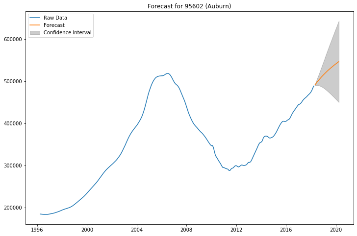


### Print summary of predicted, worst-case, and best-case scenarios


```python
auburn_95602_pred, auburn_95602_low, auburn_95602_high = pred_best_worst(pred=forecasted_price_95602, low=forecasted_lower_95602, 
                                                                         high=forecasted_upper_95602, last=last_value_95602, date='April 1, 2020')
auburn_95602_pred, auburn_95602_low, auburn_95602_high 
```

    By the model prediction, I would expect to see a 11.831% change in price by April 1, 2020.
    At the lower bound of the confidence interval, I would expect to see a -7.957% change in price by April 1, 2020.
    At the upper bound of the confidence interval, I would expect to see a 31.619% change in price by April 1, 2020.


    (11.831, -7.957, 31.619)


## Zip code 95602 (Auburn):  Strong investment opportunity with minimal downside

By the model prediction, I would expect to see a 11.831% change in price by April 1, 2020.
At the lower bound of the confidence interval, I would expect to see a -7.957% change in price by April 1, 2020.
At the upper bound of the confidence interval, I would expect to see a 31.619% change in price by April 1, 2020.

# Dataframe summarizing findings


```python
zipcodes = ['95616', '95619', '95864', '95831', '96142', '95811', '95818', '95630', '96140', '95672', '95636', 
            '95709','95746', '95614', '95663', '95623', '95747', '95765', '95602']
len(zipcodes)
```


    19


```python
last_value_2018 = [last_value_95616, last_value_95619, last_value_95864, last_value_95831, last_value_96142, last_value_95811,
                  last_value_95818, last_value_95630, last_value_96140, last_value_95672, last_value_95636, last_value_95709,
                  last_value_95746, last_value_95614, last_value_95663, last_value_95623, last_value_95747, last_value_95765, last_value_95602]
```


```python
len(last_value_2018)
# last_value_2018
```


    19


```python
cities = ['Davis', 'Diamond Springs', 'Arden-Arcade', 'Sacramento', 'Tahoma', 'Sacramento', 'Sacramento', 'Folsom', 
          'Carnelian Bay', 'Rescue', 'Somerset', 'Camino', 'Granite Bay', 'Cool', 'Penryn', 'El Dorado', 
         'Roseville', 'Rocklin', 'Auburn']
len(cities)
```


    19


```python
population = [45500, 4359, 92186, 42952, 1037, 7630, 21825, 74111, 1170, 4592, 1000, 4354, 22482, 3882, 2468, 3986,
             72437, 41810, 18290]
len(population)
```


    19


```python
county = ['Yolo', 'El Dorado', 'Sacramento', 'Sacramento', 'El Dorado', 'Sacramento', 'Sacramento', 'Sacramento', 
          'Placer', 'El Dorado', 'El Dorado', 'El Dorado', 'Placer', 'El Dorado', 'Placer', 'El Dorado', 
          'Placer', 'Placer', 'Placer']
print(len(county))
```

    19


```python
invest_rec = ['no','maybe', 'no', 'no', 'maybe', 'no', 'no', 'no', 'maybe', 'yes', 'maybe', 'no', 'yes', 
              'no', 'yes', 'maybe', 'maybe', 'yes', 'yes']
len(invest_rec)
```


    19


```python
pred_value_pct_change = [davis_95616_pred, diamond_springs_95619_pred, arden_95864_pred, sac_pocket_95831_pred, tahoma_96142_pred, 
              sac_95811_pred, sac_95818_pred, folsom_95630_pred, cb_96140_pred, rescue_95672_pred, 
              somerset_95636_pred, camino_95709_pred, gb_95746_pred, cool_95614_pred, penryn_95663_pred, 
             eldorado_95623_pred, roseville_95747_pred, rocklin_95765_pred, auburn_95602_pred]
```


```python
len(pred_value_pct_change)
```


    19


```python
worst_case_pct_change = [davis_95616_lower, diamond_springs_95619_low, arden_95864_low, sac_pocket_95831_low, tahoma_96142_low, 
              sac_95811_low, sac_95818_low, folsom_95630_low, cb_96140_low, rescue_95672_low, 
              somerset_95636_low, camino_95709_low, gb_95746_low, cool_95614_low, penryn_95663_low, eldorado_95623_low, 
             roseville_95747_low, rocklin_95765_low, auburn_95602_low]
```


```python
len(worst_case_pct_change)
```


    19


```python
best_case_pct_change = [davis_95616_upper, diamond_springs_95619_high, arden_95864_high, sac_pocket_95831_high, tahoma_96142_high, 
             sac_95811_high, sac_95818_high, folsom_95630_high, cb_96140_high, rescue_95672_high, 
             somerset_95636_high, camino_95709_high, gb_95746_high, cool_95614_high, penryn_95663_high, eldorado_95623_high, 
            roseville_95747_high, rocklin_95765_high, auburn_95602_high]
```


```python
len(best_case_pct_change)
```


    19


```python
df_findings = pd.DataFrame({'ZIP code': zipcodes, '2018 value': last_value_2018, 'City': cities, 'Pop': population, 'County': county, 
                            'Invest?': invest_rec, 'Predicted':pred_value_pct_change, 'Worst Case':worst_case_pct_change, 
                            'Best Case':best_case_pct_change})
```


```python
df_findings
```


<div>
<style scoped>
    .dataframe tbody tr th:only-of-type {
        vertical-align: middle;
    }

    .dataframe tbody tr th {
        vertical-align: top;
    }

    .dataframe thead th {
        text-align: right;
    }
</style>
<table border="1" class="dataframe">
  <thead>
    <tr style="text-align: right;">
      <th></th>
      <th>ZIP code</th>
      <th>2018 value</th>
      <th>City</th>
      <th>Pop</th>
      <th>County</th>
      <th>Invest?</th>
      <th>Predicted</th>
      <th>Worst Case</th>
      <th>Best Case</th>
    </tr>
  </thead>
  <tbody>
    <tr>
      <td>0</td>
      <td>95616</td>
      <td>692300.0</td>
      <td>Davis</td>
      <td>45500</td>
      <td>Yolo</td>
      <td>no</td>
      <td>1.756</td>
      <td>-14.007</td>
      <td>17.518</td>
    </tr>
    <tr>
      <td>1</td>
      <td>95619</td>
      <td>321100.0</td>
      <td>Diamond Springs</td>
      <td>4359</td>
      <td>El Dorado</td>
      <td>maybe</td>
      <td>10.799</td>
      <td>-14.266</td>
      <td>35.863</td>
    </tr>
    <tr>
      <td>2</td>
      <td>95864</td>
      <td>552700.0</td>
      <td>Arden-Arcade</td>
      <td>92186</td>
      <td>Sacramento</td>
      <td>no</td>
      <td>-4.669</td>
      <td>-26.572</td>
      <td>17.233</td>
    </tr>
    <tr>
      <td>3</td>
      <td>95831</td>
      <td>449300.0</td>
      <td>Sacramento</td>
      <td>42952</td>
      <td>Sacramento</td>
      <td>no</td>
      <td>-13.413</td>
      <td>-32.770</td>
      <td>5.945</td>
    </tr>
    <tr>
      <td>4</td>
      <td>96142</td>
      <td>523600.0</td>
      <td>Tahoma</td>
      <td>1037</td>
      <td>El Dorado</td>
      <td>maybe</td>
      <td>9.791</td>
      <td>-15.663</td>
      <td>35.246</td>
    </tr>
    <tr>
      <td>5</td>
      <td>95811</td>
      <td>567500.0</td>
      <td>Sacramento</td>
      <td>7630</td>
      <td>Sacramento</td>
      <td>no</td>
      <td>2.254</td>
      <td>-17.073</td>
      <td>21.582</td>
    </tr>
    <tr>
      <td>6</td>
      <td>95818</td>
      <td>563900.0</td>
      <td>Sacramento</td>
      <td>21825</td>
      <td>Sacramento</td>
      <td>no</td>
      <td>-0.978</td>
      <td>-25.772</td>
      <td>23.816</td>
    </tr>
    <tr>
      <td>7</td>
      <td>95630</td>
      <td>542900.0</td>
      <td>Folsom</td>
      <td>74111</td>
      <td>Sacramento</td>
      <td>no</td>
      <td>0.538</td>
      <td>-21.171</td>
      <td>22.247</td>
    </tr>
    <tr>
      <td>8</td>
      <td>96140</td>
      <td>644600.0</td>
      <td>Carnelian Bay</td>
      <td>1170</td>
      <td>Placer</td>
      <td>maybe</td>
      <td>19.421</td>
      <td>-19.639</td>
      <td>58.480</td>
    </tr>
    <tr>
      <td>9</td>
      <td>95672</td>
      <td>579300.0</td>
      <td>Rescue</td>
      <td>4592</td>
      <td>El Dorado</td>
      <td>yes</td>
      <td>32.296</td>
      <td>-2.975</td>
      <td>67.567</td>
    </tr>
    <tr>
      <td>10</td>
      <td>95636</td>
      <td>241200.0</td>
      <td>Somerset</td>
      <td>1000</td>
      <td>El Dorado</td>
      <td>maybe</td>
      <td>11.207</td>
      <td>-38.231</td>
      <td>60.646</td>
    </tr>
    <tr>
      <td>11</td>
      <td>95709</td>
      <td>386000.0</td>
      <td>Camino</td>
      <td>4354</td>
      <td>El Dorado</td>
      <td>no</td>
      <td>-0.349</td>
      <td>-21.147</td>
      <td>20.448</td>
    </tr>
    <tr>
      <td>12</td>
      <td>95746</td>
      <td>778500.0</td>
      <td>Granite Bay</td>
      <td>22482</td>
      <td>Placer</td>
      <td>yes</td>
      <td>7.906</td>
      <td>-9.561</td>
      <td>25.374</td>
    </tr>
    <tr>
      <td>13</td>
      <td>95614</td>
      <td>423300.0</td>
      <td>Cool</td>
      <td>3882</td>
      <td>El Dorado</td>
      <td>no</td>
      <td>2.466</td>
      <td>-18.714</td>
      <td>23.646</td>
    </tr>
    <tr>
      <td>14</td>
      <td>95663</td>
      <td>600700.0</td>
      <td>Penryn</td>
      <td>2468</td>
      <td>Placer</td>
      <td>yes</td>
      <td>13.679</td>
      <td>-8.334</td>
      <td>35.692</td>
    </tr>
    <tr>
      <td>15</td>
      <td>95623</td>
      <td>455700.0</td>
      <td>El Dorado</td>
      <td>3986</td>
      <td>El Dorado</td>
      <td>maybe</td>
      <td>8.258</td>
      <td>-14.768</td>
      <td>31.285</td>
    </tr>
    <tr>
      <td>16</td>
      <td>95747</td>
      <td>483800.0</td>
      <td>Roseville</td>
      <td>72437</td>
      <td>Placer</td>
      <td>maybe</td>
      <td>5.556</td>
      <td>-10.609</td>
      <td>21.722</td>
    </tr>
    <tr>
      <td>17</td>
      <td>95765</td>
      <td>509200.0</td>
      <td>Rocklin</td>
      <td>41810</td>
      <td>Placer</td>
      <td>yes</td>
      <td>11.779</td>
      <td>-8.471</td>
      <td>32.029</td>
    </tr>
    <tr>
      <td>18</td>
      <td>95602</td>
      <td>488700.0</td>
      <td>Auburn</td>
      <td>18290</td>
      <td>Placer</td>
      <td>yes</td>
      <td>11.831</td>
      <td>-7.957</td>
      <td>31.619</td>
    </tr>
  </tbody>
</table>
</div>


```python
df_findings.set_index('ZIP code', inplace=True)
```


```python
df_findings.sort_values(by='Predicted', ascending=False, inplace=True)
```


```python
df_findings
```


<div>
<style scoped>
    .dataframe tbody tr th:only-of-type {
        vertical-align: middle;
    }

    .dataframe tbody tr th {
        vertical-align: top;
    }

    .dataframe thead th {
        text-align: right;
    }
</style>
<table border="1" class="dataframe">
  <thead>
    <tr style="text-align: right;">
      <th></th>
      <th>2018 value</th>
      <th>City</th>
      <th>Pop</th>
      <th>County</th>
      <th>Invest?</th>
      <th>Predicted</th>
      <th>Worst Case</th>
      <th>Best Case</th>
    </tr>
    <tr>
      <th>ZIP code</th>
      <th></th>
      <th></th>
      <th></th>
      <th></th>
      <th></th>
      <th></th>
      <th></th>
      <th></th>
    </tr>
  </thead>
  <tbody>
    <tr>
      <td>95672</td>
      <td>579300.0</td>
      <td>Rescue</td>
      <td>4592</td>
      <td>El Dorado</td>
      <td>yes</td>
      <td>32.296</td>
      <td>-2.975</td>
      <td>67.567</td>
    </tr>
    <tr>
      <td>96140</td>
      <td>644600.0</td>
      <td>Carnelian Bay</td>
      <td>1170</td>
      <td>Placer</td>
      <td>maybe</td>
      <td>19.421</td>
      <td>-19.639</td>
      <td>58.480</td>
    </tr>
    <tr>
      <td>95663</td>
      <td>600700.0</td>
      <td>Penryn</td>
      <td>2468</td>
      <td>Placer</td>
      <td>yes</td>
      <td>13.679</td>
      <td>-8.334</td>
      <td>35.692</td>
    </tr>
    <tr>
      <td>95602</td>
      <td>488700.0</td>
      <td>Auburn</td>
      <td>18290</td>
      <td>Placer</td>
      <td>yes</td>
      <td>11.831</td>
      <td>-7.957</td>
      <td>31.619</td>
    </tr>
    <tr>
      <td>95765</td>
      <td>509200.0</td>
      <td>Rocklin</td>
      <td>41810</td>
      <td>Placer</td>
      <td>yes</td>
      <td>11.779</td>
      <td>-8.471</td>
      <td>32.029</td>
    </tr>
    <tr>
      <td>95636</td>
      <td>241200.0</td>
      <td>Somerset</td>
      <td>1000</td>
      <td>El Dorado</td>
      <td>maybe</td>
      <td>11.207</td>
      <td>-38.231</td>
      <td>60.646</td>
    </tr>
    <tr>
      <td>95619</td>
      <td>321100.0</td>
      <td>Diamond Springs</td>
      <td>4359</td>
      <td>El Dorado</td>
      <td>maybe</td>
      <td>10.799</td>
      <td>-14.266</td>
      <td>35.863</td>
    </tr>
    <tr>
      <td>96142</td>
      <td>523600.0</td>
      <td>Tahoma</td>
      <td>1037</td>
      <td>El Dorado</td>
      <td>maybe</td>
      <td>9.791</td>
      <td>-15.663</td>
      <td>35.246</td>
    </tr>
    <tr>
      <td>95623</td>
      <td>455700.0</td>
      <td>El Dorado</td>
      <td>3986</td>
      <td>El Dorado</td>
      <td>maybe</td>
      <td>8.258</td>
      <td>-14.768</td>
      <td>31.285</td>
    </tr>
    <tr>
      <td>95746</td>
      <td>778500.0</td>
      <td>Granite Bay</td>
      <td>22482</td>
      <td>Placer</td>
      <td>yes</td>
      <td>7.906</td>
      <td>-9.561</td>
      <td>25.374</td>
    </tr>
    <tr>
      <td>95747</td>
      <td>483800.0</td>
      <td>Roseville</td>
      <td>72437</td>
      <td>Placer</td>
      <td>maybe</td>
      <td>5.556</td>
      <td>-10.609</td>
      <td>21.722</td>
    </tr>
    <tr>
      <td>95614</td>
      <td>423300.0</td>
      <td>Cool</td>
      <td>3882</td>
      <td>El Dorado</td>
      <td>no</td>
      <td>2.466</td>
      <td>-18.714</td>
      <td>23.646</td>
    </tr>
    <tr>
      <td>95811</td>
      <td>567500.0</td>
      <td>Sacramento</td>
      <td>7630</td>
      <td>Sacramento</td>
      <td>no</td>
      <td>2.254</td>
      <td>-17.073</td>
      <td>21.582</td>
    </tr>
    <tr>
      <td>95616</td>
      <td>692300.0</td>
      <td>Davis</td>
      <td>45500</td>
      <td>Yolo</td>
      <td>no</td>
      <td>1.756</td>
      <td>-14.007</td>
      <td>17.518</td>
    </tr>
    <tr>
      <td>95630</td>
      <td>542900.0</td>
      <td>Folsom</td>
      <td>74111</td>
      <td>Sacramento</td>
      <td>no</td>
      <td>0.538</td>
      <td>-21.171</td>
      <td>22.247</td>
    </tr>
    <tr>
      <td>95709</td>
      <td>386000.0</td>
      <td>Camino</td>
      <td>4354</td>
      <td>El Dorado</td>
      <td>no</td>
      <td>-0.349</td>
      <td>-21.147</td>
      <td>20.448</td>
    </tr>
    <tr>
      <td>95818</td>
      <td>563900.0</td>
      <td>Sacramento</td>
      <td>21825</td>
      <td>Sacramento</td>
      <td>no</td>
      <td>-0.978</td>
      <td>-25.772</td>
      <td>23.816</td>
    </tr>
    <tr>
      <td>95864</td>
      <td>552700.0</td>
      <td>Arden-Arcade</td>
      <td>92186</td>
      <td>Sacramento</td>
      <td>no</td>
      <td>-4.669</td>
      <td>-26.572</td>
      <td>17.233</td>
    </tr>
    <tr>
      <td>95831</td>
      <td>449300.0</td>
      <td>Sacramento</td>
      <td>42952</td>
      <td>Sacramento</td>
      <td>no</td>
      <td>-13.413</td>
      <td>-32.770</td>
      <td>5.945</td>
    </tr>
  </tbody>
</table>
</div>


# Recommended ZIP Codes

*First,* I sorted ZIP codes based on __predicted return__.  This is how the summary table is sorted.  

*Second,* I considered the potential __worst-case valuation scenario__.  
- There are a few ZIP codes that have relatively good predicted valuations over the two-year time horizon, but also have substantial potential downside.  Examples include Carnelian Bay, Somerset, Diamond Springs, Tahoma, El Dorado, and Roseville.  
- Because of the significant possible downsides of these ZIP codes, I put them in the 'maybe' column.  I subsequently removed them after the considerations below.

*Third,* I reviewed the potential __best-case valuation scenario,__ just to see how much potential upside the ZIP code could yield.  
- Since time series predictions are so uncertain--as illustrated by the large differences between the upper bound and lower bound values--I don't put much weight on the upper end of potential yields.  
- Predicted values as well as downside risk are more important, but looking at the best-case scenario can suggest whether a higher return is more likely.  

*Finally,* I looked at the __population__ in each ZIP code, as well as the __geographic location__ of the ZIP code.  Doing this caused me to modify my initial assessment (and prompted me to analyze more ZIP codes).  
- Several of the "maybe"s on the chart are for very small towns clustered around Lake Tahoe.  I would recommend against selecting more than one of these ZIP codes for the top 5.  
   - For one thing, the towns are very small, so the pool of potential investment opportunities in each is small. 
   - For another thing, many of the homes in these towns are vacation homes, so a significant economic downturn could cause a significant drop in prices.  
   - Third, the region's economy is based almost entirely on tourism (especially skiing in the winter and water sports in the summer).  Economic downturns could depress housing values in the near term, while larger trends such as climate change may have a significant long-term effect (e.g., less natural snowpack in the winter). 


___With all of these factors in mind, here are the top 5 ZIP codes for this investment opportunity:___

1.  *Rescue, CA (95672).*  While the population is fairly small, average home values are high.  Home values for the ZIP code in 4/1/2020 are forecasted to be ___32% higher___ than they are now.  Furthermore, the downside is very limited (~3%) and the upside is potentially large (68%).

2.  *Penryn, CA (95663).*  The population here is small, but average home values are even higher than Rescue.  While Rescue is in El Dorado County, Penryn is in Placer County, offering a bit of geographic diversity.  Penryn's home values are predicted to rise ___almost 14% higher___ by 4/1/2020.  Downside is limited (8.3% at the lower bound) and upside is potentially substantial (over 35%).  

3.  *Auburn, CA (95602).* Auburn's population is significantly larger than the first two, offering additional investment opportunities and stablity within one ZIP code.  Its location in the foothills of the Sierra Nevada is desireable for many homebuyers, as evidenced by the average home value.  Home values are predicted to ___increase 11.8%___ over 24 months, with minimal downside (-8% at the lower bound) and substantial potential upside (31.6%).

4.  *Rocklin, CA (95765).*  This ZIP code's population (almost 42,000) is larger than Auburn, Rescue, and Penryn put together, and so offers a wider range of opportunities, both expensive and affordable.  The model predicts an ___11.8% increase___ in home values, with a potential lower-bound downside of -8.5% and a large potential upside at 32%.  

5.  *Granite Bay, CA (95746).*  This ZIP code represents an affluent community on the west-northwest side of Folsom Lake.  Home values in this very desireable location are expected to ___increase 7.9%___, with a potential downside of -9.6% and significant possible upside of 25.4%


#### Sacramento metro area county map

<center>

#### El Dorado County

<center>

#### Placer County

<center>

#### Rescue, CA (95672) ZIP code map (El Dorado County)

<center>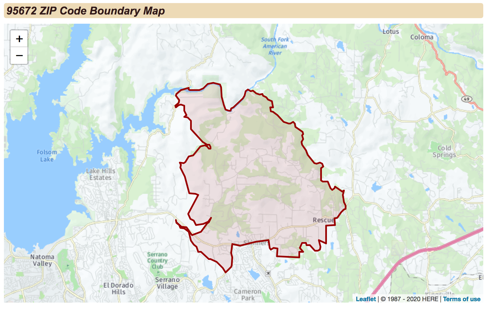

#### Penryn, CA (95663) ZIP code map (Placer County)

<center>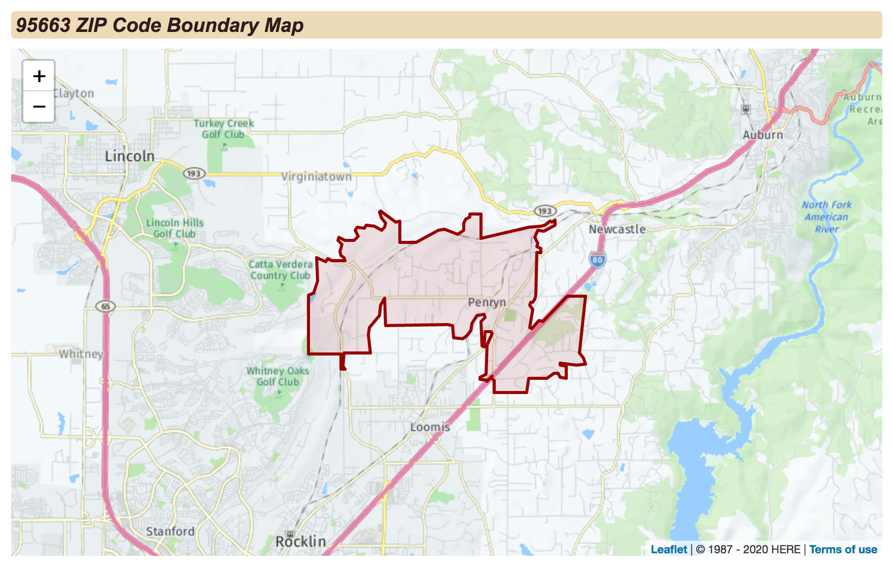

#### Auburn, CA (95602) ZIP code map (Placer County)

<center>

#### Rocklin, CA (95765) ZIP code map (Placer County)

<center>

#### Granite Bay, CA (95746) ZIP code map (Placer County)

<center>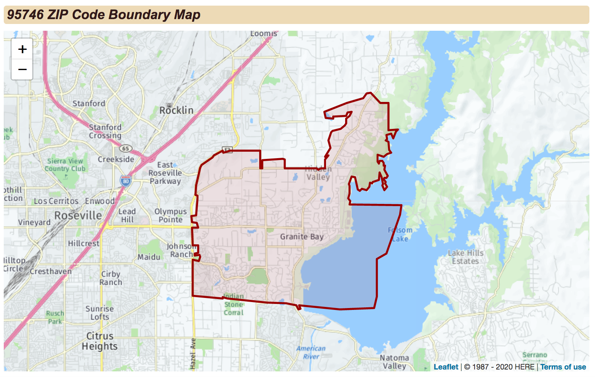


```python

```
