# Mod 4 Project - Gina Durante

## Overview

The Module 4 Project in the Flatiron School Data Science Version 2 Curriculum is meant to provide students with experience in working with time series data--in this case, monthly housing values from 04/01/1996 to 03/01/2018 for over 14,000 ZIP Codes in the U.S.  Skill sets required to complete this project include dataframe manipulation, data cleaning, data visualization, and time series analysis, and other areas (e.g., using github, Jupyter notebooks for data science projects, and writing and posting a blog).  

## Project topic

The project asks the student to identify the 5 "best" ZIP codes for investment, as defined by the student, and develop support for these recommendations to a hypothetical client (e.g., a real estate investment trust).  The student must develop a methodology for evaluating ZIP codes as potential investment targets and support these findings through a technical Jupyter notebook, a non-technical PowerPoint presentation, and a blog post.  

## My focus:  Sacramento metro area

Because the investment group is located in Sacramento, and because the Sacramento area has experience steady group over the last few decades (fueled in part by skyrocketing costs in the SF Bay Area, prompting some businesses to launch or relocate to the Sacramento region), I focused most of my efforts on the Sacramento metro area.  Because I have lived here for a number of years, I have some knowledge of the region, which has provided some helpful insights informing the analysis.

### Sacramento metro area (counties)

<center>

### Sacramento metro area (cities)

<center>

## Methodology, in brief

### Visualization of values by city and/or ZIP code, as well as of predictions of model

I developed iterative functions to visualize values by city within a metro area and across zip codes within cities in a metro area, using lists and dictionaries to iterate through the geographic areas of interest.  Using this approach, I identified 19 ZIP codes in the Sacramento region of possible interest.  Time series analysis of these 19 ZIP codes suggested 11 finalist ZIP codes to explore further.  From those, I selected 5 that I thought provided good (potentially great) returns, while limiting downside risk.  

### Consideration of predicted values, worst- and best-case scenarios, and other factors in the selection process

While the predicted returns over the forecast time horizon were of primary concern, I also took into account the worst-case scenario returns, the best-case scenario returns, the population in the ZIP code, the geographic location of the ZIP code, and personal knowledge of the area to inform my decision-making process.  More information is provided in the "Decision-making process" section of the "Recommended ZIP codes" section at the end of this notebook.


### County representation in finalist and top 5 selected ZIP codes

One of those ZIP codes was in El Dorado County, and the other four were in Placer County.  While there may be promising ZIP codes in both Sacramento and Yolo Counties, Sacramento City ZIP codes that I analyzed were not as competitive as those of Placer County.  I only analyzed one ZIP code in Yolo County (95616 in Davis), though others looked similar in terms of their pattern and trends.  It would probably be worthwhile to analyze one of the two ZIP codes in West Sacramento, as West Sac is an area that has been on the upswing for several years.  


## Possible future directions

Beyond analysis of at least one more ZIP code in the Sacramento area, I've identified several other possible future directions for this work:
- While time limitations prevented a broader evaluation of investment opportunities across the country, the functions I developed allow visualizations of broader swaths of the data (e.g., values by metro area, values by city within a metro area, values by zip codes and cities within a metro area).  
  - Creating visualizations at various geographic levels was very useful for identifying patterns that could signify promising investment opportunities.  
  - From this effort, I identified some geographic areas, such as the Dallas-Fort Worth and the Pittsburg metro areas, that could be worthwhile to explore in future efforts.  
- It could be interesting and potentially valuable to do some backtesting on the model to see how well it predicts the last 24 months for which we have data (May 2016 through April 2018).
- Analyzing shorter time frames (e.g., 2013-2018)
- Scaling investment by population size 
- Construct a basket of investments (e.g., $10M, weighted by ZIP population?)

## A few words on the notebook that follows...

The notebook below is what I used for performing my analyses and arriving at results.  Thus, it is technical and includes all code.  It will most likely be revised over time, so individuals interested in this work should check back periodically.  At the very end of this notebook is a table (small dataframe) that summarizes my analyses.  

# Step 1: Load the Data/Filtering for Chosen Zipcodes


```python
import numpy as np
import pandas as pd
import matplotlib 
import matplotlib.pyplot as plt
import matplotlib as mpl
%matplotlib inline
import seaborn as sn

from statsmodels.tsa.seasonal import seasonal_decompose
from statsmodels.graphics.tsaplots import plot_acf, plot_pacf
from pandas.plotting import autocorrelation_plot, lag_plot

import warnings
from statsmodels.tsa.arima_model import ARIMA
import statsmodels.api as sm
from sklearn.metrics import mean_squared_error

from collections import defaultdict
from collections import OrderedDict
```


```python
pd.set_option("display.max_rows", 300)
```


```python
pd.get_option("display.max_rows")
```


    300


```python
df = pd.read_csv('zillow_data.csv')
```


```python
df.head()
```


<div>
<style scoped>
    .dataframe tbody tr th:only-of-type {
        vertical-align: middle;
    }

    .dataframe tbody tr th {
        vertical-align: top;
    }

    .dataframe thead th {
        text-align: right;
    }
</style>
<table border="1" class="dataframe">
  <thead>
    <tr style="text-align: right;">
      <th></th>
      <th>RegionID</th>
      <th>RegionName</th>
      <th>City</th>
      <th>State</th>
      <th>Metro</th>
      <th>CountyName</th>
      <th>SizeRank</th>
      <th>1996-04</th>
      <th>1996-05</th>
      <th>1996-06</th>
      <th>...</th>
      <th>2017-07</th>
      <th>2017-08</th>
      <th>2017-09</th>
      <th>2017-10</th>
      <th>2017-11</th>
      <th>2017-12</th>
      <th>2018-01</th>
      <th>2018-02</th>
      <th>2018-03</th>
      <th>2018-04</th>
    </tr>
  </thead>
  <tbody>
    <tr>
      <td>0</td>
      <td>84654</td>
      <td>60657</td>
      <td>Chicago</td>
      <td>IL</td>
      <td>Chicago</td>
      <td>Cook</td>
      <td>1</td>
      <td>334200.0</td>
      <td>335400.0</td>
      <td>336500.0</td>
      <td>...</td>
      <td>1005500</td>
      <td>1007500</td>
      <td>1007800</td>
      <td>1009600</td>
      <td>1013300</td>
      <td>1018700</td>
      <td>1024400</td>
      <td>1030700</td>
      <td>1033800</td>
      <td>1030600</td>
    </tr>
    <tr>
      <td>1</td>
      <td>90668</td>
      <td>75070</td>
      <td>McKinney</td>
      <td>TX</td>
      <td>Dallas-Fort Worth</td>
      <td>Collin</td>
      <td>2</td>
      <td>235700.0</td>
      <td>236900.0</td>
      <td>236700.0</td>
      <td>...</td>
      <td>308000</td>
      <td>310000</td>
      <td>312500</td>
      <td>314100</td>
      <td>315000</td>
      <td>316600</td>
      <td>318100</td>
      <td>319600</td>
      <td>321100</td>
      <td>321800</td>
    </tr>
    <tr>
      <td>2</td>
      <td>91982</td>
      <td>77494</td>
      <td>Katy</td>
      <td>TX</td>
      <td>Houston</td>
      <td>Harris</td>
      <td>3</td>
      <td>210400.0</td>
      <td>212200.0</td>
      <td>212200.0</td>
      <td>...</td>
      <td>321000</td>
      <td>320600</td>
      <td>320200</td>
      <td>320400</td>
      <td>320800</td>
      <td>321200</td>
      <td>321200</td>
      <td>323000</td>
      <td>326900</td>
      <td>329900</td>
    </tr>
    <tr>
      <td>3</td>
      <td>84616</td>
      <td>60614</td>
      <td>Chicago</td>
      <td>IL</td>
      <td>Chicago</td>
      <td>Cook</td>
      <td>4</td>
      <td>498100.0</td>
      <td>500900.0</td>
      <td>503100.0</td>
      <td>...</td>
      <td>1289800</td>
      <td>1287700</td>
      <td>1287400</td>
      <td>1291500</td>
      <td>1296600</td>
      <td>1299000</td>
      <td>1302700</td>
      <td>1306400</td>
      <td>1308500</td>
      <td>1307000</td>
    </tr>
    <tr>
      <td>4</td>
      <td>93144</td>
      <td>79936</td>
      <td>El Paso</td>
      <td>TX</td>
      <td>El Paso</td>
      <td>El Paso</td>
      <td>5</td>
      <td>77300.0</td>
      <td>77300.0</td>
      <td>77300.0</td>
      <td>...</td>
      <td>119100</td>
      <td>119400</td>
      <td>120000</td>
      <td>120300</td>
      <td>120300</td>
      <td>120300</td>
      <td>120300</td>
      <td>120500</td>
      <td>121000</td>
      <td>121500</td>
    </tr>
  </tbody>
</table>
<p>5 rows × 272 columns</p>
</div>


# Step 2: Data Preprocessing

## Convert time data type to datetime format


```python
def get_datetimes(df):
    return pd.to_datetime(df.columns.values[7:], format='%Y-%m', errors = 'raise')
```


```python
get_datetimes(df)
```


    DatetimeIndex(['1996-04-01', '1996-05-01', '1996-06-01', '1996-07-01',
                   '1996-08-01', '1996-09-01', '1996-10-01', '1996-11-01',
                   '1996-12-01', '1997-01-01',
                   ...
                   '2017-07-01', '2017-08-01', '2017-09-01', '2017-10-01',
                   '2017-11-01', '2017-12-01', '2018-01-01', '2018-02-01',
                   '2018-03-01', '2018-04-01'],
                  dtype='datetime64[ns]', length=265, freq=None)


## Fix problem with ZIP codes beginning with '0'

I have surmised that RegionName is the ZIP code for each entry.  RegionName values with only 4 digits represent ZIP codes that actually begin with '0'.  So that I can work with ZIP codes in the data set, I will need to add that zero onto every 4-digit RegionName value.  Once that's completed, I'll rename this column "ZipCode".  


```python
df.head()
```


<div>
<style scoped>
    .dataframe tbody tr th:only-of-type {
        vertical-align: middle;
    }

    .dataframe tbody tr th {
        vertical-align: top;
    }

    .dataframe thead th {
        text-align: right;
    }
</style>
<table border="1" class="dataframe">
  <thead>
    <tr style="text-align: right;">
      <th></th>
      <th>RegionID</th>
      <th>RegionName</th>
      <th>City</th>
      <th>State</th>
      <th>Metro</th>
      <th>CountyName</th>
      <th>SizeRank</th>
      <th>1996-04</th>
      <th>1996-05</th>
      <th>1996-06</th>
      <th>...</th>
      <th>2017-07</th>
      <th>2017-08</th>
      <th>2017-09</th>
      <th>2017-10</th>
      <th>2017-11</th>
      <th>2017-12</th>
      <th>2018-01</th>
      <th>2018-02</th>
      <th>2018-03</th>
      <th>2018-04</th>
    </tr>
  </thead>
  <tbody>
    <tr>
      <td>0</td>
      <td>84654</td>
      <td>60657</td>
      <td>Chicago</td>
      <td>IL</td>
      <td>Chicago</td>
      <td>Cook</td>
      <td>1</td>
      <td>334200.0</td>
      <td>335400.0</td>
      <td>336500.0</td>
      <td>...</td>
      <td>1005500</td>
      <td>1007500</td>
      <td>1007800</td>
      <td>1009600</td>
      <td>1013300</td>
      <td>1018700</td>
      <td>1024400</td>
      <td>1030700</td>
      <td>1033800</td>
      <td>1030600</td>
    </tr>
    <tr>
      <td>1</td>
      <td>90668</td>
      <td>75070</td>
      <td>McKinney</td>
      <td>TX</td>
      <td>Dallas-Fort Worth</td>
      <td>Collin</td>
      <td>2</td>
      <td>235700.0</td>
      <td>236900.0</td>
      <td>236700.0</td>
      <td>...</td>
      <td>308000</td>
      <td>310000</td>
      <td>312500</td>
      <td>314100</td>
      <td>315000</td>
      <td>316600</td>
      <td>318100</td>
      <td>319600</td>
      <td>321100</td>
      <td>321800</td>
    </tr>
    <tr>
      <td>2</td>
      <td>91982</td>
      <td>77494</td>
      <td>Katy</td>
      <td>TX</td>
      <td>Houston</td>
      <td>Harris</td>
      <td>3</td>
      <td>210400.0</td>
      <td>212200.0</td>
      <td>212200.0</td>
      <td>...</td>
      <td>321000</td>
      <td>320600</td>
      <td>320200</td>
      <td>320400</td>
      <td>320800</td>
      <td>321200</td>
      <td>321200</td>
      <td>323000</td>
      <td>326900</td>
      <td>329900</td>
    </tr>
    <tr>
      <td>3</td>
      <td>84616</td>
      <td>60614</td>
      <td>Chicago</td>
      <td>IL</td>
      <td>Chicago</td>
      <td>Cook</td>
      <td>4</td>
      <td>498100.0</td>
      <td>500900.0</td>
      <td>503100.0</td>
      <td>...</td>
      <td>1289800</td>
      <td>1287700</td>
      <td>1287400</td>
      <td>1291500</td>
      <td>1296600</td>
      <td>1299000</td>
      <td>1302700</td>
      <td>1306400</td>
      <td>1308500</td>
      <td>1307000</td>
    </tr>
    <tr>
      <td>4</td>
      <td>93144</td>
      <td>79936</td>
      <td>El Paso</td>
      <td>TX</td>
      <td>El Paso</td>
      <td>El Paso</td>
      <td>5</td>
      <td>77300.0</td>
      <td>77300.0</td>
      <td>77300.0</td>
      <td>...</td>
      <td>119100</td>
      <td>119400</td>
      <td>120000</td>
      <td>120300</td>
      <td>120300</td>
      <td>120300</td>
      <td>120300</td>
      <td>120500</td>
      <td>121000</td>
      <td>121500</td>
    </tr>
  </tbody>
</table>
<p>5 rows × 272 columns</p>
</div>


```python
df.sort_values(by="RegionName").head()
```


<div>
<style scoped>
    .dataframe tbody tr th:only-of-type {
        vertical-align: middle;
    }

    .dataframe tbody tr th {
        vertical-align: top;
    }

    .dataframe thead th {
        text-align: right;
    }
</style>
<table border="1" class="dataframe">
  <thead>
    <tr style="text-align: right;">
      <th></th>
      <th>RegionID</th>
      <th>RegionName</th>
      <th>City</th>
      <th>State</th>
      <th>Metro</th>
      <th>CountyName</th>
      <th>SizeRank</th>
      <th>1996-04</th>
      <th>1996-05</th>
      <th>1996-06</th>
      <th>...</th>
      <th>2017-07</th>
      <th>2017-08</th>
      <th>2017-09</th>
      <th>2017-10</th>
      <th>2017-11</th>
      <th>2017-12</th>
      <th>2018-01</th>
      <th>2018-02</th>
      <th>2018-03</th>
      <th>2018-04</th>
    </tr>
  </thead>
  <tbody>
    <tr>
      <td>5850</td>
      <td>58196</td>
      <td>1001</td>
      <td>Agawam</td>
      <td>MA</td>
      <td>Springfield</td>
      <td>Hampden</td>
      <td>5851</td>
      <td>113100.0</td>
      <td>112800.0</td>
      <td>112600.0</td>
      <td>...</td>
      <td>213900</td>
      <td>215700</td>
      <td>218200</td>
      <td>220100</td>
      <td>221100</td>
      <td>221700</td>
      <td>221700</td>
      <td>221700</td>
      <td>222700</td>
      <td>223600</td>
    </tr>
    <tr>
      <td>4199</td>
      <td>58197</td>
      <td>1002</td>
      <td>Amherst</td>
      <td>MA</td>
      <td>Springfield</td>
      <td>Hampshire</td>
      <td>4200</td>
      <td>161000.0</td>
      <td>160100.0</td>
      <td>159300.0</td>
      <td>...</td>
      <td>333700</td>
      <td>334800</td>
      <td>336700</td>
      <td>338900</td>
      <td>340400</td>
      <td>342000</td>
      <td>344500</td>
      <td>347400</td>
      <td>350600</td>
      <td>353300</td>
    </tr>
    <tr>
      <td>11213</td>
      <td>58200</td>
      <td>1005</td>
      <td>Barre</td>
      <td>MA</td>
      <td>Worcester</td>
      <td>Worcester</td>
      <td>11214</td>
      <td>103100.0</td>
      <td>103400.0</td>
      <td>103600.0</td>
      <td>...</td>
      <td>205600</td>
      <td>206800</td>
      <td>208800</td>
      <td>210400</td>
      <td>211300</td>
      <td>213300</td>
      <td>215600</td>
      <td>217900</td>
      <td>219500</td>
      <td>220700</td>
    </tr>
    <tr>
      <td>6850</td>
      <td>58201</td>
      <td>1007</td>
      <td>Belchertown</td>
      <td>MA</td>
      <td>Springfield</td>
      <td>Hampshire</td>
      <td>6851</td>
      <td>133400.0</td>
      <td>132700.0</td>
      <td>132000.0</td>
      <td>...</td>
      <td>266100</td>
      <td>266300</td>
      <td>267000</td>
      <td>267500</td>
      <td>268000</td>
      <td>268100</td>
      <td>268100</td>
      <td>268800</td>
      <td>270000</td>
      <td>270600</td>
    </tr>
    <tr>
      <td>14547</td>
      <td>58202</td>
      <td>1008</td>
      <td>Blandford</td>
      <td>MA</td>
      <td>Springfield</td>
      <td>Hampden</td>
      <td>14548</td>
      <td>117500.0</td>
      <td>117300.0</td>
      <td>117100.0</td>
      <td>...</td>
      <td>202400</td>
      <td>202900</td>
      <td>205900</td>
      <td>208500</td>
      <td>207500</td>
      <td>205400</td>
      <td>204500</td>
      <td>206800</td>
      <td>210900</td>
      <td>214200</td>
    </tr>
  </tbody>
</table>
<p>5 rows × 272 columns</p>
</div>


```python
df['RegionName'] = df.RegionName.astype(str)
df['RegionName'].dtype

```


    dtype('O')


```python
df.rename(columns={'RegionName': 'Zip'}, inplace=True)
df.columns
df.head()
```


<div>
<style scoped>
    .dataframe tbody tr th:only-of-type {
        vertical-align: middle;
    }

    .dataframe tbody tr th {
        vertical-align: top;
    }

    .dataframe thead th {
        text-align: right;
    }
</style>
<table border="1" class="dataframe">
  <thead>
    <tr style="text-align: right;">
      <th></th>
      <th>RegionID</th>
      <th>Zip</th>
      <th>City</th>
      <th>State</th>
      <th>Metro</th>
      <th>CountyName</th>
      <th>SizeRank</th>
      <th>1996-04</th>
      <th>1996-05</th>
      <th>1996-06</th>
      <th>...</th>
      <th>2017-07</th>
      <th>2017-08</th>
      <th>2017-09</th>
      <th>2017-10</th>
      <th>2017-11</th>
      <th>2017-12</th>
      <th>2018-01</th>
      <th>2018-02</th>
      <th>2018-03</th>
      <th>2018-04</th>
    </tr>
  </thead>
  <tbody>
    <tr>
      <td>0</td>
      <td>84654</td>
      <td>60657</td>
      <td>Chicago</td>
      <td>IL</td>
      <td>Chicago</td>
      <td>Cook</td>
      <td>1</td>
      <td>334200.0</td>
      <td>335400.0</td>
      <td>336500.0</td>
      <td>...</td>
      <td>1005500</td>
      <td>1007500</td>
      <td>1007800</td>
      <td>1009600</td>
      <td>1013300</td>
      <td>1018700</td>
      <td>1024400</td>
      <td>1030700</td>
      <td>1033800</td>
      <td>1030600</td>
    </tr>
    <tr>
      <td>1</td>
      <td>90668</td>
      <td>75070</td>
      <td>McKinney</td>
      <td>TX</td>
      <td>Dallas-Fort Worth</td>
      <td>Collin</td>
      <td>2</td>
      <td>235700.0</td>
      <td>236900.0</td>
      <td>236700.0</td>
      <td>...</td>
      <td>308000</td>
      <td>310000</td>
      <td>312500</td>
      <td>314100</td>
      <td>315000</td>
      <td>316600</td>
      <td>318100</td>
      <td>319600</td>
      <td>321100</td>
      <td>321800</td>
    </tr>
    <tr>
      <td>2</td>
      <td>91982</td>
      <td>77494</td>
      <td>Katy</td>
      <td>TX</td>
      <td>Houston</td>
      <td>Harris</td>
      <td>3</td>
      <td>210400.0</td>
      <td>212200.0</td>
      <td>212200.0</td>
      <td>...</td>
      <td>321000</td>
      <td>320600</td>
      <td>320200</td>
      <td>320400</td>
      <td>320800</td>
      <td>321200</td>
      <td>321200</td>
      <td>323000</td>
      <td>326900</td>
      <td>329900</td>
    </tr>
    <tr>
      <td>3</td>
      <td>84616</td>
      <td>60614</td>
      <td>Chicago</td>
      <td>IL</td>
      <td>Chicago</td>
      <td>Cook</td>
      <td>4</td>
      <td>498100.0</td>
      <td>500900.0</td>
      <td>503100.0</td>
      <td>...</td>
      <td>1289800</td>
      <td>1287700</td>
      <td>1287400</td>
      <td>1291500</td>
      <td>1296600</td>
      <td>1299000</td>
      <td>1302700</td>
      <td>1306400</td>
      <td>1308500</td>
      <td>1307000</td>
    </tr>
    <tr>
      <td>4</td>
      <td>93144</td>
      <td>79936</td>
      <td>El Paso</td>
      <td>TX</td>
      <td>El Paso</td>
      <td>El Paso</td>
      <td>5</td>
      <td>77300.0</td>
      <td>77300.0</td>
      <td>77300.0</td>
      <td>...</td>
      <td>119100</td>
      <td>119400</td>
      <td>120000</td>
      <td>120300</td>
      <td>120300</td>
      <td>120300</td>
      <td>120300</td>
      <td>120500</td>
      <td>121000</td>
      <td>121500</td>
    </tr>
  </tbody>
</table>
<p>5 rows × 272 columns</p>
</div>


```python
zips = []

for i in df['Zip']:
    if len(i) < 5:
        i = '0' + i
        zips.append(i)
    else:
        zips.append(i)

zips
df['Zip'] = pd.Series(zips)
df.sort_values(by='Zip').head()
# df.head()
```


<div>
<style scoped>
    .dataframe tbody tr th:only-of-type {
        vertical-align: middle;
    }

    .dataframe tbody tr th {
        vertical-align: top;
    }

    .dataframe thead th {
        text-align: right;
    }
</style>
<table border="1" class="dataframe">
  <thead>
    <tr style="text-align: right;">
      <th></th>
      <th>RegionID</th>
      <th>Zip</th>
      <th>City</th>
      <th>State</th>
      <th>Metro</th>
      <th>CountyName</th>
      <th>SizeRank</th>
      <th>1996-04</th>
      <th>1996-05</th>
      <th>1996-06</th>
      <th>...</th>
      <th>2017-07</th>
      <th>2017-08</th>
      <th>2017-09</th>
      <th>2017-10</th>
      <th>2017-11</th>
      <th>2017-12</th>
      <th>2018-01</th>
      <th>2018-02</th>
      <th>2018-03</th>
      <th>2018-04</th>
    </tr>
  </thead>
  <tbody>
    <tr>
      <td>5850</td>
      <td>58196</td>
      <td>01001</td>
      <td>Agawam</td>
      <td>MA</td>
      <td>Springfield</td>
      <td>Hampden</td>
      <td>5851</td>
      <td>113100.0</td>
      <td>112800.0</td>
      <td>112600.0</td>
      <td>...</td>
      <td>213900</td>
      <td>215700</td>
      <td>218200</td>
      <td>220100</td>
      <td>221100</td>
      <td>221700</td>
      <td>221700</td>
      <td>221700</td>
      <td>222700</td>
      <td>223600</td>
    </tr>
    <tr>
      <td>4199</td>
      <td>58197</td>
      <td>01002</td>
      <td>Amherst</td>
      <td>MA</td>
      <td>Springfield</td>
      <td>Hampshire</td>
      <td>4200</td>
      <td>161000.0</td>
      <td>160100.0</td>
      <td>159300.0</td>
      <td>...</td>
      <td>333700</td>
      <td>334800</td>
      <td>336700</td>
      <td>338900</td>
      <td>340400</td>
      <td>342000</td>
      <td>344500</td>
      <td>347400</td>
      <td>350600</td>
      <td>353300</td>
    </tr>
    <tr>
      <td>11213</td>
      <td>58200</td>
      <td>01005</td>
      <td>Barre</td>
      <td>MA</td>
      <td>Worcester</td>
      <td>Worcester</td>
      <td>11214</td>
      <td>103100.0</td>
      <td>103400.0</td>
      <td>103600.0</td>
      <td>...</td>
      <td>205600</td>
      <td>206800</td>
      <td>208800</td>
      <td>210400</td>
      <td>211300</td>
      <td>213300</td>
      <td>215600</td>
      <td>217900</td>
      <td>219500</td>
      <td>220700</td>
    </tr>
    <tr>
      <td>6850</td>
      <td>58201</td>
      <td>01007</td>
      <td>Belchertown</td>
      <td>MA</td>
      <td>Springfield</td>
      <td>Hampshire</td>
      <td>6851</td>
      <td>133400.0</td>
      <td>132700.0</td>
      <td>132000.0</td>
      <td>...</td>
      <td>266100</td>
      <td>266300</td>
      <td>267000</td>
      <td>267500</td>
      <td>268000</td>
      <td>268100</td>
      <td>268100</td>
      <td>268800</td>
      <td>270000</td>
      <td>270600</td>
    </tr>
    <tr>
      <td>14547</td>
      <td>58202</td>
      <td>01008</td>
      <td>Blandford</td>
      <td>MA</td>
      <td>Springfield</td>
      <td>Hampden</td>
      <td>14548</td>
      <td>117500.0</td>
      <td>117300.0</td>
      <td>117100.0</td>
      <td>...</td>
      <td>202400</td>
      <td>202900</td>
      <td>205900</td>
      <td>208500</td>
      <td>207500</td>
      <td>205400</td>
      <td>204500</td>
      <td>206800</td>
      <td>210900</td>
      <td>214200</td>
    </tr>
  </tbody>
</table>
<p>5 rows × 272 columns</p>
</div>


## Creating dataframes by various groupings and geographies

### Creating US dataframe (df_melt) using melt function


```python
def melt_data(df):
    melted = pd.melt(df, id_vars=['RegionID', 'Zip', 'City', 'State', 'Metro', 'CountyName', 'SizeRank'], var_name='time')
    melted['time'] = pd.to_datetime(melted['time'], infer_datetime_format=False)
    melted = melted.dropna(subset=['value'])
    return melted   
```


```python
df_melt = melt_data(df)

```


```python
df_melt.head()
```


<div>
<style scoped>
    .dataframe tbody tr th:only-of-type {
        vertical-align: middle;
    }

    .dataframe tbody tr th {
        vertical-align: top;
    }

    .dataframe thead th {
        text-align: right;
    }
</style>
<table border="1" class="dataframe">
  <thead>
    <tr style="text-align: right;">
      <th></th>
      <th>RegionID</th>
      <th>Zip</th>
      <th>City</th>
      <th>State</th>
      <th>Metro</th>
      <th>CountyName</th>
      <th>SizeRank</th>
      <th>time</th>
      <th>value</th>
    </tr>
  </thead>
  <tbody>
    <tr>
      <td>0</td>
      <td>84654</td>
      <td>60657</td>
      <td>Chicago</td>
      <td>IL</td>
      <td>Chicago</td>
      <td>Cook</td>
      <td>1</td>
      <td>1996-04-01</td>
      <td>334200.0</td>
    </tr>
    <tr>
      <td>1</td>
      <td>90668</td>
      <td>75070</td>
      <td>McKinney</td>
      <td>TX</td>
      <td>Dallas-Fort Worth</td>
      <td>Collin</td>
      <td>2</td>
      <td>1996-04-01</td>
      <td>235700.0</td>
    </tr>
    <tr>
      <td>2</td>
      <td>91982</td>
      <td>77494</td>
      <td>Katy</td>
      <td>TX</td>
      <td>Houston</td>
      <td>Harris</td>
      <td>3</td>
      <td>1996-04-01</td>
      <td>210400.0</td>
    </tr>
    <tr>
      <td>3</td>
      <td>84616</td>
      <td>60614</td>
      <td>Chicago</td>
      <td>IL</td>
      <td>Chicago</td>
      <td>Cook</td>
      <td>4</td>
      <td>1996-04-01</td>
      <td>498100.0</td>
    </tr>
    <tr>
      <td>4</td>
      <td>93144</td>
      <td>79936</td>
      <td>El Paso</td>
      <td>TX</td>
      <td>El Paso</td>
      <td>El Paso</td>
      <td>5</td>
      <td>1996-04-01</td>
      <td>77300.0</td>
    </tr>
  </tbody>
</table>
</div>


```python
df_melt.info()
```

    <class 'pandas.core.frame.DataFrame'>
    Int64Index: 3744704 entries, 0 to 3901594
    Data columns (total 9 columns):
    RegionID      int64
    Zip           object
    City          object
    State         object
    Metro         object
    CountyName    object
    SizeRank      int64
    time          datetime64[ns]
    value         float64
    dtypes: datetime64[ns](1), float64(1), int64(2), object(5)
    memory usage: 285.7+ MB


```python
df_melt.set_index('time')
```


<div>
<style scoped>
    .dataframe tbody tr th:only-of-type {
        vertical-align: middle;
    }

    .dataframe tbody tr th {
        vertical-align: top;
    }

    .dataframe thead th {
        text-align: right;
    }
</style>
<table border="1" class="dataframe">
  <thead>
    <tr style="text-align: right;">
      <th></th>
      <th>RegionID</th>
      <th>Zip</th>
      <th>City</th>
      <th>State</th>
      <th>Metro</th>
      <th>CountyName</th>
      <th>SizeRank</th>
      <th>value</th>
    </tr>
    <tr>
      <th>time</th>
      <th></th>
      <th></th>
      <th></th>
      <th></th>
      <th></th>
      <th></th>
      <th></th>
      <th></th>
    </tr>
  </thead>
  <tbody>
    <tr>
      <td>1996-04-01</td>
      <td>84654</td>
      <td>60657</td>
      <td>Chicago</td>
      <td>IL</td>
      <td>Chicago</td>
      <td>Cook</td>
      <td>1</td>
      <td>334200.0</td>
    </tr>
    <tr>
      <td>1996-04-01</td>
      <td>90668</td>
      <td>75070</td>
      <td>McKinney</td>
      <td>TX</td>
      <td>Dallas-Fort Worth</td>
      <td>Collin</td>
      <td>2</td>
      <td>235700.0</td>
    </tr>
    <tr>
      <td>1996-04-01</td>
      <td>91982</td>
      <td>77494</td>
      <td>Katy</td>
      <td>TX</td>
      <td>Houston</td>
      <td>Harris</td>
      <td>3</td>
      <td>210400.0</td>
    </tr>
    <tr>
      <td>1996-04-01</td>
      <td>84616</td>
      <td>60614</td>
      <td>Chicago</td>
      <td>IL</td>
      <td>Chicago</td>
      <td>Cook</td>
      <td>4</td>
      <td>498100.0</td>
    </tr>
    <tr>
      <td>1996-04-01</td>
      <td>93144</td>
      <td>79936</td>
      <td>El Paso</td>
      <td>TX</td>
      <td>El Paso</td>
      <td>El Paso</td>
      <td>5</td>
      <td>77300.0</td>
    </tr>
    <tr>
      <td>...</td>
      <td>...</td>
      <td>...</td>
      <td>...</td>
      <td>...</td>
      <td>...</td>
      <td>...</td>
      <td>...</td>
      <td>...</td>
    </tr>
    <tr>
      <td>2018-04-01</td>
      <td>58333</td>
      <td>01338</td>
      <td>Ashfield</td>
      <td>MA</td>
      <td>Greenfield Town</td>
      <td>Franklin</td>
      <td>14719</td>
      <td>209300.0</td>
    </tr>
    <tr>
      <td>2018-04-01</td>
      <td>59107</td>
      <td>03293</td>
      <td>Woodstock</td>
      <td>NH</td>
      <td>Claremont</td>
      <td>Grafton</td>
      <td>14720</td>
      <td>225800.0</td>
    </tr>
    <tr>
      <td>2018-04-01</td>
      <td>75672</td>
      <td>40404</td>
      <td>Berea</td>
      <td>KY</td>
      <td>Richmond</td>
      <td>Madison</td>
      <td>14721</td>
      <td>133400.0</td>
    </tr>
    <tr>
      <td>2018-04-01</td>
      <td>93733</td>
      <td>81225</td>
      <td>Mount Crested Butte</td>
      <td>CO</td>
      <td>NaN</td>
      <td>Gunnison</td>
      <td>14722</td>
      <td>664400.0</td>
    </tr>
    <tr>
      <td>2018-04-01</td>
      <td>95851</td>
      <td>89155</td>
      <td>Mesquite</td>
      <td>NV</td>
      <td>Las Vegas</td>
      <td>Clark</td>
      <td>14723</td>
      <td>357200.0</td>
    </tr>
  </tbody>
</table>
<p>3744704 rows × 8 columns</p>
</div>


```python
## Dropping RegionID:

df_melt.drop('RegionID', axis=1, inplace=True)
```


```python
df_melt.head()
```


<div>
<style scoped>
    .dataframe tbody tr th:only-of-type {
        vertical-align: middle;
    }

    .dataframe tbody tr th {
        vertical-align: top;
    }

    .dataframe thead th {
        text-align: right;
    }
</style>
<table border="1" class="dataframe">
  <thead>
    <tr style="text-align: right;">
      <th></th>
      <th>Zip</th>
      <th>City</th>
      <th>State</th>
      <th>Metro</th>
      <th>CountyName</th>
      <th>SizeRank</th>
      <th>time</th>
      <th>value</th>
    </tr>
  </thead>
  <tbody>
    <tr>
      <td>0</td>
      <td>60657</td>
      <td>Chicago</td>
      <td>IL</td>
      <td>Chicago</td>
      <td>Cook</td>
      <td>1</td>
      <td>1996-04-01</td>
      <td>334200.0</td>
    </tr>
    <tr>
      <td>1</td>
      <td>75070</td>
      <td>McKinney</td>
      <td>TX</td>
      <td>Dallas-Fort Worth</td>
      <td>Collin</td>
      <td>2</td>
      <td>1996-04-01</td>
      <td>235700.0</td>
    </tr>
    <tr>
      <td>2</td>
      <td>77494</td>
      <td>Katy</td>
      <td>TX</td>
      <td>Houston</td>
      <td>Harris</td>
      <td>3</td>
      <td>1996-04-01</td>
      <td>210400.0</td>
    </tr>
    <tr>
      <td>3</td>
      <td>60614</td>
      <td>Chicago</td>
      <td>IL</td>
      <td>Chicago</td>
      <td>Cook</td>
      <td>4</td>
      <td>1996-04-01</td>
      <td>498100.0</td>
    </tr>
    <tr>
      <td>4</td>
      <td>79936</td>
      <td>El Paso</td>
      <td>TX</td>
      <td>El Paso</td>
      <td>El Paso</td>
      <td>5</td>
      <td>1996-04-01</td>
      <td>77300.0</td>
    </tr>
  </tbody>
</table>
</div>


Dataframe is sorted by SizeRank by default.


```python
df_melt.isna().sum()
```


    Zip                0
    City               0
    State              0
    Metro         236023
    CountyName         0
    SizeRank           0
    time               0
    value              0
    dtype: int64


```python
df_melt['Metro'].fillna('Missing', inplace=True)
df_melt.isna().sum()
```


    Zip           0
    City          0
    State         0
    Metro         0
    CountyName    0
    SizeRank      0
    time          0
    value         0
    dtype: int64


```python
# Sorting by zip code, then time

df_melt.sort_values(by=['Zip', 'time'])
```


<div>
<style scoped>
    .dataframe tbody tr th:only-of-type {
        vertical-align: middle;
    }

    .dataframe tbody tr th {
        vertical-align: top;
    }

    .dataframe thead th {
        text-align: right;
    }
</style>
<table border="1" class="dataframe">
  <thead>
    <tr style="text-align: right;">
      <th></th>
      <th>Zip</th>
      <th>City</th>
      <th>State</th>
      <th>Metro</th>
      <th>CountyName</th>
      <th>SizeRank</th>
      <th>time</th>
      <th>value</th>
    </tr>
  </thead>
  <tbody>
    <tr>
      <td>5850</td>
      <td>01001</td>
      <td>Agawam</td>
      <td>MA</td>
      <td>Springfield</td>
      <td>Hampden</td>
      <td>5851</td>
      <td>1996-04-01</td>
      <td>113100.0</td>
    </tr>
    <tr>
      <td>20573</td>
      <td>01001</td>
      <td>Agawam</td>
      <td>MA</td>
      <td>Springfield</td>
      <td>Hampden</td>
      <td>5851</td>
      <td>1996-05-01</td>
      <td>112800.0</td>
    </tr>
    <tr>
      <td>35296</td>
      <td>01001</td>
      <td>Agawam</td>
      <td>MA</td>
      <td>Springfield</td>
      <td>Hampden</td>
      <td>5851</td>
      <td>1996-06-01</td>
      <td>112600.0</td>
    </tr>
    <tr>
      <td>50019</td>
      <td>01001</td>
      <td>Agawam</td>
      <td>MA</td>
      <td>Springfield</td>
      <td>Hampden</td>
      <td>5851</td>
      <td>1996-07-01</td>
      <td>112300.0</td>
    </tr>
    <tr>
      <td>64742</td>
      <td>01001</td>
      <td>Agawam</td>
      <td>MA</td>
      <td>Springfield</td>
      <td>Hampden</td>
      <td>5851</td>
      <td>1996-08-01</td>
      <td>112100.0</td>
    </tr>
    <tr>
      <td>...</td>
      <td>...</td>
      <td>...</td>
      <td>...</td>
      <td>...</td>
      <td>...</td>
      <td>...</td>
      <td>...</td>
      <td>...</td>
    </tr>
    <tr>
      <td>3835273</td>
      <td>99901</td>
      <td>Ketchikan</td>
      <td>AK</td>
      <td>Ketchikan</td>
      <td>Ketchikan Gateway</td>
      <td>7294</td>
      <td>2017-12-01</td>
      <td>291900.0</td>
    </tr>
    <tr>
      <td>3849996</td>
      <td>99901</td>
      <td>Ketchikan</td>
      <td>AK</td>
      <td>Ketchikan</td>
      <td>Ketchikan Gateway</td>
      <td>7294</td>
      <td>2018-01-01</td>
      <td>294200.0</td>
    </tr>
    <tr>
      <td>3864719</td>
      <td>99901</td>
      <td>Ketchikan</td>
      <td>AK</td>
      <td>Ketchikan</td>
      <td>Ketchikan Gateway</td>
      <td>7294</td>
      <td>2018-02-01</td>
      <td>297500.0</td>
    </tr>
    <tr>
      <td>3879442</td>
      <td>99901</td>
      <td>Ketchikan</td>
      <td>AK</td>
      <td>Ketchikan</td>
      <td>Ketchikan Gateway</td>
      <td>7294</td>
      <td>2018-03-01</td>
      <td>302100.0</td>
    </tr>
    <tr>
      <td>3894165</td>
      <td>99901</td>
      <td>Ketchikan</td>
      <td>AK</td>
      <td>Ketchikan</td>
      <td>Ketchikan Gateway</td>
      <td>7294</td>
      <td>2018-04-01</td>
      <td>305100.0</td>
    </tr>
  </tbody>
</table>
<p>3744704 rows × 8 columns</p>
</div>


Note that a few zip codes are missing; these rows were eliminated when Zip codes with NaN values in the 'value' column were dropped.


```python
df_melt.nunique()
```


    Zip           14723
    City           7554
    State            51
    Metro           702
    CountyName     1212
    SizeRank      14723
    time            265
    value         24372
    dtype: int64


### Creating new column, MetroState, to address duplicate metro names in different states (e.g., Aberdeen in multiple states)

Wanted to make sure that the values from totally unrelated metro areas in different states weren't inadvertently merged together.


```python
df_melt['MetroState'] = df_melt['Metro'] + ' ' + df_melt['State']
```


```python
df_melt.head()
```


<div>
<style scoped>
    .dataframe tbody tr th:only-of-type {
        vertical-align: middle;
    }

    .dataframe tbody tr th {
        vertical-align: top;
    }

    .dataframe thead th {
        text-align: right;
    }
</style>
<table border="1" class="dataframe">
  <thead>
    <tr style="text-align: right;">
      <th></th>
      <th>Zip</th>
      <th>City</th>
      <th>State</th>
      <th>Metro</th>
      <th>CountyName</th>
      <th>SizeRank</th>
      <th>time</th>
      <th>value</th>
      <th>MetroState</th>
    </tr>
  </thead>
  <tbody>
    <tr>
      <td>0</td>
      <td>60657</td>
      <td>Chicago</td>
      <td>IL</td>
      <td>Chicago</td>
      <td>Cook</td>
      <td>1</td>
      <td>1996-04-01</td>
      <td>334200.0</td>
      <td>Chicago IL</td>
    </tr>
    <tr>
      <td>1</td>
      <td>75070</td>
      <td>McKinney</td>
      <td>TX</td>
      <td>Dallas-Fort Worth</td>
      <td>Collin</td>
      <td>2</td>
      <td>1996-04-01</td>
      <td>235700.0</td>
      <td>Dallas-Fort Worth TX</td>
    </tr>
    <tr>
      <td>2</td>
      <td>77494</td>
      <td>Katy</td>
      <td>TX</td>
      <td>Houston</td>
      <td>Harris</td>
      <td>3</td>
      <td>1996-04-01</td>
      <td>210400.0</td>
      <td>Houston TX</td>
    </tr>
    <tr>
      <td>3</td>
      <td>60614</td>
      <td>Chicago</td>
      <td>IL</td>
      <td>Chicago</td>
      <td>Cook</td>
      <td>4</td>
      <td>1996-04-01</td>
      <td>498100.0</td>
      <td>Chicago IL</td>
    </tr>
    <tr>
      <td>4</td>
      <td>79936</td>
      <td>El Paso</td>
      <td>TX</td>
      <td>El Paso</td>
      <td>El Paso</td>
      <td>5</td>
      <td>1996-04-01</td>
      <td>77300.0</td>
      <td>El Paso TX</td>
    </tr>
  </tbody>
</table>
</div>


### Creating df_metro (US metro df) with monthly values by Zip


```python
df_melt.set_index('time', inplace=True)
```


```python
df_melt.head()
```


<div>
<style scoped>
    .dataframe tbody tr th:only-of-type {
        vertical-align: middle;
    }

    .dataframe tbody tr th {
        vertical-align: top;
    }

    .dataframe thead th {
        text-align: right;
    }
</style>
<table border="1" class="dataframe">
  <thead>
    <tr style="text-align: right;">
      <th></th>
      <th>Zip</th>
      <th>City</th>
      <th>State</th>
      <th>Metro</th>
      <th>CountyName</th>
      <th>SizeRank</th>
      <th>value</th>
      <th>MetroState</th>
    </tr>
    <tr>
      <th>time</th>
      <th></th>
      <th></th>
      <th></th>
      <th></th>
      <th></th>
      <th></th>
      <th></th>
      <th></th>
    </tr>
  </thead>
  <tbody>
    <tr>
      <td>1996-04-01</td>
      <td>60657</td>
      <td>Chicago</td>
      <td>IL</td>
      <td>Chicago</td>
      <td>Cook</td>
      <td>1</td>
      <td>334200.0</td>
      <td>Chicago IL</td>
    </tr>
    <tr>
      <td>1996-04-01</td>
      <td>75070</td>
      <td>McKinney</td>
      <td>TX</td>
      <td>Dallas-Fort Worth</td>
      <td>Collin</td>
      <td>2</td>
      <td>235700.0</td>
      <td>Dallas-Fort Worth TX</td>
    </tr>
    <tr>
      <td>1996-04-01</td>
      <td>77494</td>
      <td>Katy</td>
      <td>TX</td>
      <td>Houston</td>
      <td>Harris</td>
      <td>3</td>
      <td>210400.0</td>
      <td>Houston TX</td>
    </tr>
    <tr>
      <td>1996-04-01</td>
      <td>60614</td>
      <td>Chicago</td>
      <td>IL</td>
      <td>Chicago</td>
      <td>Cook</td>
      <td>4</td>
      <td>498100.0</td>
      <td>Chicago IL</td>
    </tr>
    <tr>
      <td>1996-04-01</td>
      <td>79936</td>
      <td>El Paso</td>
      <td>TX</td>
      <td>El Paso</td>
      <td>El Paso</td>
      <td>5</td>
      <td>77300.0</td>
      <td>El Paso TX</td>
    </tr>
  </tbody>
</table>
</div>


Note:  the dataframe is sorted by zipcode SizeRank by default.  


```python
df_metro = df_melt.groupby(['Metro', 'MetroState', 'CountyName', 'City', 'Zip', 'time']).mean().reset_index()

```


```python
df_metro.head(10)
```


<div>
<style scoped>
    .dataframe tbody tr th:only-of-type {
        vertical-align: middle;
    }

    .dataframe tbody tr th {
        vertical-align: top;
    }

    .dataframe thead th {
        text-align: right;
    }
</style>
<table border="1" class="dataframe">
  <thead>
    <tr style="text-align: right;">
      <th></th>
      <th>Metro</th>
      <th>MetroState</th>
      <th>CountyName</th>
      <th>City</th>
      <th>Zip</th>
      <th>time</th>
      <th>SizeRank</th>
      <th>value</th>
    </tr>
  </thead>
  <tbody>
    <tr>
      <td>0</td>
      <td>Aberdeen</td>
      <td>Aberdeen WA</td>
      <td>Grays Harbor</td>
      <td>Aberdeen</td>
      <td>98520</td>
      <td>1996-04-01</td>
      <td>5029</td>
      <td>86600.0</td>
    </tr>
    <tr>
      <td>1</td>
      <td>Aberdeen</td>
      <td>Aberdeen WA</td>
      <td>Grays Harbor</td>
      <td>Aberdeen</td>
      <td>98520</td>
      <td>1996-05-01</td>
      <td>5029</td>
      <td>86300.0</td>
    </tr>
    <tr>
      <td>2</td>
      <td>Aberdeen</td>
      <td>Aberdeen WA</td>
      <td>Grays Harbor</td>
      <td>Aberdeen</td>
      <td>98520</td>
      <td>1996-06-01</td>
      <td>5029</td>
      <td>86100.0</td>
    </tr>
    <tr>
      <td>3</td>
      <td>Aberdeen</td>
      <td>Aberdeen WA</td>
      <td>Grays Harbor</td>
      <td>Aberdeen</td>
      <td>98520</td>
      <td>1996-07-01</td>
      <td>5029</td>
      <td>85900.0</td>
    </tr>
    <tr>
      <td>4</td>
      <td>Aberdeen</td>
      <td>Aberdeen WA</td>
      <td>Grays Harbor</td>
      <td>Aberdeen</td>
      <td>98520</td>
      <td>1996-08-01</td>
      <td>5029</td>
      <td>85700.0</td>
    </tr>
    <tr>
      <td>5</td>
      <td>Aberdeen</td>
      <td>Aberdeen WA</td>
      <td>Grays Harbor</td>
      <td>Aberdeen</td>
      <td>98520</td>
      <td>1996-09-01</td>
      <td>5029</td>
      <td>85600.0</td>
    </tr>
    <tr>
      <td>6</td>
      <td>Aberdeen</td>
      <td>Aberdeen WA</td>
      <td>Grays Harbor</td>
      <td>Aberdeen</td>
      <td>98520</td>
      <td>1996-10-01</td>
      <td>5029</td>
      <td>85600.0</td>
    </tr>
    <tr>
      <td>7</td>
      <td>Aberdeen</td>
      <td>Aberdeen WA</td>
      <td>Grays Harbor</td>
      <td>Aberdeen</td>
      <td>98520</td>
      <td>1996-11-01</td>
      <td>5029</td>
      <td>85700.0</td>
    </tr>
    <tr>
      <td>8</td>
      <td>Aberdeen</td>
      <td>Aberdeen WA</td>
      <td>Grays Harbor</td>
      <td>Aberdeen</td>
      <td>98520</td>
      <td>1996-12-01</td>
      <td>5029</td>
      <td>85800.0</td>
    </tr>
    <tr>
      <td>9</td>
      <td>Aberdeen</td>
      <td>Aberdeen WA</td>
      <td>Grays Harbor</td>
      <td>Aberdeen</td>
      <td>98520</td>
      <td>1997-01-01</td>
      <td>5029</td>
      <td>85900.0</td>
    </tr>
  </tbody>
</table>
</div>


```python
df_metro.info()
```

    <class 'pandas.core.frame.DataFrame'>
    RangeIndex: 3744704 entries, 0 to 3744703
    Data columns (total 8 columns):
    Metro         object
    MetroState    object
    CountyName    object
    City          object
    Zip           object
    time          datetime64[ns]
    SizeRank      int64
    value         float64
    dtypes: datetime64[ns](1), float64(1), int64(1), object(5)
    memory usage: 228.6+ MB


```python
df_metro.set_index('time', inplace=True)
```


```python
df_metro.head()
```


<div>
<style scoped>
    .dataframe tbody tr th:only-of-type {
        vertical-align: middle;
    }

    .dataframe tbody tr th {
        vertical-align: top;
    }

    .dataframe thead th {
        text-align: right;
    }
</style>
<table border="1" class="dataframe">
  <thead>
    <tr style="text-align: right;">
      <th></th>
      <th>Metro</th>
      <th>MetroState</th>
      <th>CountyName</th>
      <th>City</th>
      <th>Zip</th>
      <th>SizeRank</th>
      <th>value</th>
    </tr>
    <tr>
      <th>time</th>
      <th></th>
      <th></th>
      <th></th>
      <th></th>
      <th></th>
      <th></th>
      <th></th>
    </tr>
  </thead>
  <tbody>
    <tr>
      <td>1996-04-01</td>
      <td>Aberdeen</td>
      <td>Aberdeen WA</td>
      <td>Grays Harbor</td>
      <td>Aberdeen</td>
      <td>98520</td>
      <td>5029</td>
      <td>86600.0</td>
    </tr>
    <tr>
      <td>1996-05-01</td>
      <td>Aberdeen</td>
      <td>Aberdeen WA</td>
      <td>Grays Harbor</td>
      <td>Aberdeen</td>
      <td>98520</td>
      <td>5029</td>
      <td>86300.0</td>
    </tr>
    <tr>
      <td>1996-06-01</td>
      <td>Aberdeen</td>
      <td>Aberdeen WA</td>
      <td>Grays Harbor</td>
      <td>Aberdeen</td>
      <td>98520</td>
      <td>5029</td>
      <td>86100.0</td>
    </tr>
    <tr>
      <td>1996-07-01</td>
      <td>Aberdeen</td>
      <td>Aberdeen WA</td>
      <td>Grays Harbor</td>
      <td>Aberdeen</td>
      <td>98520</td>
      <td>5029</td>
      <td>85900.0</td>
    </tr>
    <tr>
      <td>1996-08-01</td>
      <td>Aberdeen</td>
      <td>Aberdeen WA</td>
      <td>Grays Harbor</td>
      <td>Aberdeen</td>
      <td>98520</td>
      <td>5029</td>
      <td>85700.0</td>
    </tr>
  </tbody>
</table>
</div>


```python
df_metro.nunique()
```


    Metro           702
    MetroState      865
    CountyName     1212
    City           7554
    Zip           14723
    SizeRank      14723
    value         24372
    dtype: int64


### Creating df_metro_cities (US Metros df with *City* mean values)


```python
df_metro_cities = df_metro.groupby(['MetroState', 'CountyName', 'City', 'time']).mean().reset_index()
```


```python
df_metro_cities.head(10)
```


<div>
<style scoped>
    .dataframe tbody tr th:only-of-type {
        vertical-align: middle;
    }

    .dataframe tbody tr th {
        vertical-align: top;
    }

    .dataframe thead th {
        text-align: right;
    }
</style>
<table border="1" class="dataframe">
  <thead>
    <tr style="text-align: right;">
      <th></th>
      <th>MetroState</th>
      <th>CountyName</th>
      <th>City</th>
      <th>time</th>
      <th>SizeRank</th>
      <th>value</th>
    </tr>
  </thead>
  <tbody>
    <tr>
      <td>0</td>
      <td>Aberdeen WA</td>
      <td>Grays Harbor</td>
      <td>Aberdeen</td>
      <td>1996-04-01</td>
      <td>5029.0</td>
      <td>86600.0</td>
    </tr>
    <tr>
      <td>1</td>
      <td>Aberdeen WA</td>
      <td>Grays Harbor</td>
      <td>Aberdeen</td>
      <td>1996-05-01</td>
      <td>5029.0</td>
      <td>86300.0</td>
    </tr>
    <tr>
      <td>2</td>
      <td>Aberdeen WA</td>
      <td>Grays Harbor</td>
      <td>Aberdeen</td>
      <td>1996-06-01</td>
      <td>5029.0</td>
      <td>86100.0</td>
    </tr>
    <tr>
      <td>3</td>
      <td>Aberdeen WA</td>
      <td>Grays Harbor</td>
      <td>Aberdeen</td>
      <td>1996-07-01</td>
      <td>5029.0</td>
      <td>85900.0</td>
    </tr>
    <tr>
      <td>4</td>
      <td>Aberdeen WA</td>
      <td>Grays Harbor</td>
      <td>Aberdeen</td>
      <td>1996-08-01</td>
      <td>5029.0</td>
      <td>85700.0</td>
    </tr>
    <tr>
      <td>5</td>
      <td>Aberdeen WA</td>
      <td>Grays Harbor</td>
      <td>Aberdeen</td>
      <td>1996-09-01</td>
      <td>5029.0</td>
      <td>85600.0</td>
    </tr>
    <tr>
      <td>6</td>
      <td>Aberdeen WA</td>
      <td>Grays Harbor</td>
      <td>Aberdeen</td>
      <td>1996-10-01</td>
      <td>5029.0</td>
      <td>85600.0</td>
    </tr>
    <tr>
      <td>7</td>
      <td>Aberdeen WA</td>
      <td>Grays Harbor</td>
      <td>Aberdeen</td>
      <td>1996-11-01</td>
      <td>5029.0</td>
      <td>85700.0</td>
    </tr>
    <tr>
      <td>8</td>
      <td>Aberdeen WA</td>
      <td>Grays Harbor</td>
      <td>Aberdeen</td>
      <td>1996-12-01</td>
      <td>5029.0</td>
      <td>85800.0</td>
    </tr>
    <tr>
      <td>9</td>
      <td>Aberdeen WA</td>
      <td>Grays Harbor</td>
      <td>Aberdeen</td>
      <td>1997-01-01</td>
      <td>5029.0</td>
      <td>85900.0</td>
    </tr>
  </tbody>
</table>
</div>


```python
df_metro_cities.set_index('time', inplace=True)
```


```python
df_metro_cities.drop('SizeRank', axis=1, inplace=True)
```


```python
df_metro_cities.head()
```


<div>
<style scoped>
    .dataframe tbody tr th:only-of-type {
        vertical-align: middle;
    }

    .dataframe tbody tr th {
        vertical-align: top;
    }

    .dataframe thead th {
        text-align: right;
    }
</style>
<table border="1" class="dataframe">
  <thead>
    <tr style="text-align: right;">
      <th></th>
      <th>MetroState</th>
      <th>CountyName</th>
      <th>City</th>
      <th>value</th>
    </tr>
    <tr>
      <th>time</th>
      <th></th>
      <th></th>
      <th></th>
      <th></th>
    </tr>
  </thead>
  <tbody>
    <tr>
      <td>1996-04-01</td>
      <td>Aberdeen WA</td>
      <td>Grays Harbor</td>
      <td>Aberdeen</td>
      <td>86600.0</td>
    </tr>
    <tr>
      <td>1996-05-01</td>
      <td>Aberdeen WA</td>
      <td>Grays Harbor</td>
      <td>Aberdeen</td>
      <td>86300.0</td>
    </tr>
    <tr>
      <td>1996-06-01</td>
      <td>Aberdeen WA</td>
      <td>Grays Harbor</td>
      <td>Aberdeen</td>
      <td>86100.0</td>
    </tr>
    <tr>
      <td>1996-07-01</td>
      <td>Aberdeen WA</td>
      <td>Grays Harbor</td>
      <td>Aberdeen</td>
      <td>85900.0</td>
    </tr>
    <tr>
      <td>1996-08-01</td>
      <td>Aberdeen WA</td>
      <td>Grays Harbor</td>
      <td>Aberdeen</td>
      <td>85700.0</td>
    </tr>
  </tbody>
</table>
</div>


```python
df_metro_cities.nunique()
```


    MetroState      865
    CountyName     1212
    City           7554
    value         83532
    dtype: int64


### df_geog:  Function for creating a sub-dataframe of a particular geographic unit (e.g., MetroState area, City, CountyName)


```python
def df_geog(df, col, geog):
    
    '''Creates subset dataframe containing just the geographic unit 
    (e.g., 'MetroState' == 'Sacramento CA', 'City' == 'Davis', etc.) of interest.  
    It is necessary to set df equal to a dataframe with the appropriate geographic grouping: 
    e.g., to plot values by city in a metro aree, df = df_metro_cities, col = 'MetroState',
    geog = 'Sacramento CA' (or metro area of interest). 
    '''
    df_metro_cities_geog = df.loc[df[col] == geog]
    return df_metro_cities_geog

```

### df_sac:  Sac Metro dataframe, values by Zip code


```python
# df_sac = df_melt.loc[df_melt.Metro == 'Sacramento']  # use if function throws an error

df_sac = df_geog(df=df_metro, col = 'MetroState', geog = 'Sacramento CA')
```


```python
df_sac
```


<div>
<style scoped>
    .dataframe tbody tr th:only-of-type {
        vertical-align: middle;
    }

    .dataframe tbody tr th {
        vertical-align: top;
    }

    .dataframe thead th {
        text-align: right;
    }
</style>
<table border="1" class="dataframe">
  <thead>
    <tr style="text-align: right;">
      <th></th>
      <th>Metro</th>
      <th>MetroState</th>
      <th>CountyName</th>
      <th>City</th>
      <th>Zip</th>
      <th>SizeRank</th>
      <th>value</th>
    </tr>
    <tr>
      <th>time</th>
      <th></th>
      <th></th>
      <th></th>
      <th></th>
      <th></th>
      <th></th>
      <th></th>
    </tr>
  </thead>
  <tbody>
    <tr>
      <td>1996-04-01</td>
      <td>Sacramento</td>
      <td>Sacramento CA</td>
      <td>El Dorado</td>
      <td>Camino</td>
      <td>95709</td>
      <td>10422</td>
      <td>141500.0</td>
    </tr>
    <tr>
      <td>1996-05-01</td>
      <td>Sacramento</td>
      <td>Sacramento CA</td>
      <td>El Dorado</td>
      <td>Camino</td>
      <td>95709</td>
      <td>10422</td>
      <td>141500.0</td>
    </tr>
    <tr>
      <td>1996-06-01</td>
      <td>Sacramento</td>
      <td>Sacramento CA</td>
      <td>El Dorado</td>
      <td>Camino</td>
      <td>95709</td>
      <td>10422</td>
      <td>141500.0</td>
    </tr>
    <tr>
      <td>1996-07-01</td>
      <td>Sacramento</td>
      <td>Sacramento CA</td>
      <td>El Dorado</td>
      <td>Camino</td>
      <td>95709</td>
      <td>10422</td>
      <td>141500.0</td>
    </tr>
    <tr>
      <td>1996-08-01</td>
      <td>Sacramento</td>
      <td>Sacramento CA</td>
      <td>El Dorado</td>
      <td>Camino</td>
      <td>95709</td>
      <td>10422</td>
      <td>141600.0</td>
    </tr>
    <tr>
      <td>...</td>
      <td>...</td>
      <td>...</td>
      <td>...</td>
      <td>...</td>
      <td>...</td>
      <td>...</td>
      <td>...</td>
    </tr>
    <tr>
      <td>2017-12-01</td>
      <td>Sacramento</td>
      <td>Sacramento CA</td>
      <td>Yolo</td>
      <td>Woodland</td>
      <td>95776</td>
      <td>5094</td>
      <td>391100.0</td>
    </tr>
    <tr>
      <td>2018-01-01</td>
      <td>Sacramento</td>
      <td>Sacramento CA</td>
      <td>Yolo</td>
      <td>Woodland</td>
      <td>95776</td>
      <td>5094</td>
      <td>397800.0</td>
    </tr>
    <tr>
      <td>2018-02-01</td>
      <td>Sacramento</td>
      <td>Sacramento CA</td>
      <td>Yolo</td>
      <td>Woodland</td>
      <td>95776</td>
      <td>5094</td>
      <td>401000.0</td>
    </tr>
    <tr>
      <td>2018-03-01</td>
      <td>Sacramento</td>
      <td>Sacramento CA</td>
      <td>Yolo</td>
      <td>Woodland</td>
      <td>95776</td>
      <td>5094</td>
      <td>401800.0</td>
    </tr>
    <tr>
      <td>2018-04-01</td>
      <td>Sacramento</td>
      <td>Sacramento CA</td>
      <td>Yolo</td>
      <td>Woodland</td>
      <td>95776</td>
      <td>5094</td>
      <td>401700.0</td>
    </tr>
  </tbody>
</table>
<p>23960 rows × 7 columns</p>
</div>


```python
df_sac.drop('SizeRank', axis=1, inplace=True)
```

    /opt/anaconda3/envs/learn-env/lib/python3.6/site-packages/pandas/core/frame.py:4102: SettingWithCopyWarning: 
    A value is trying to be set on a copy of a slice from a DataFrame
    
    See the caveats in the documentation: http://pandas.pydata.org/pandas-docs/stable/user_guide/indexing.html#returning-a-view-versus-a-copy
      errors=errors,


```python
df_sac
```


<div>
<style scoped>
    .dataframe tbody tr th:only-of-type {
        vertical-align: middle;
    }

    .dataframe tbody tr th {
        vertical-align: top;
    }

    .dataframe thead th {
        text-align: right;
    }
</style>
<table border="1" class="dataframe">
  <thead>
    <tr style="text-align: right;">
      <th></th>
      <th>Metro</th>
      <th>MetroState</th>
      <th>CountyName</th>
      <th>City</th>
      <th>Zip</th>
      <th>value</th>
    </tr>
    <tr>
      <th>time</th>
      <th></th>
      <th></th>
      <th></th>
      <th></th>
      <th></th>
      <th></th>
    </tr>
  </thead>
  <tbody>
    <tr>
      <td>1996-04-01</td>
      <td>Sacramento</td>
      <td>Sacramento CA</td>
      <td>El Dorado</td>
      <td>Camino</td>
      <td>95709</td>
      <td>141500.0</td>
    </tr>
    <tr>
      <td>1996-05-01</td>
      <td>Sacramento</td>
      <td>Sacramento CA</td>
      <td>El Dorado</td>
      <td>Camino</td>
      <td>95709</td>
      <td>141500.0</td>
    </tr>
    <tr>
      <td>1996-06-01</td>
      <td>Sacramento</td>
      <td>Sacramento CA</td>
      <td>El Dorado</td>
      <td>Camino</td>
      <td>95709</td>
      <td>141500.0</td>
    </tr>
    <tr>
      <td>1996-07-01</td>
      <td>Sacramento</td>
      <td>Sacramento CA</td>
      <td>El Dorado</td>
      <td>Camino</td>
      <td>95709</td>
      <td>141500.0</td>
    </tr>
    <tr>
      <td>1996-08-01</td>
      <td>Sacramento</td>
      <td>Sacramento CA</td>
      <td>El Dorado</td>
      <td>Camino</td>
      <td>95709</td>
      <td>141600.0</td>
    </tr>
    <tr>
      <td>...</td>
      <td>...</td>
      <td>...</td>
      <td>...</td>
      <td>...</td>
      <td>...</td>
      <td>...</td>
    </tr>
    <tr>
      <td>2017-12-01</td>
      <td>Sacramento</td>
      <td>Sacramento CA</td>
      <td>Yolo</td>
      <td>Woodland</td>
      <td>95776</td>
      <td>391100.0</td>
    </tr>
    <tr>
      <td>2018-01-01</td>
      <td>Sacramento</td>
      <td>Sacramento CA</td>
      <td>Yolo</td>
      <td>Woodland</td>
      <td>95776</td>
      <td>397800.0</td>
    </tr>
    <tr>
      <td>2018-02-01</td>
      <td>Sacramento</td>
      <td>Sacramento CA</td>
      <td>Yolo</td>
      <td>Woodland</td>
      <td>95776</td>
      <td>401000.0</td>
    </tr>
    <tr>
      <td>2018-03-01</td>
      <td>Sacramento</td>
      <td>Sacramento CA</td>
      <td>Yolo</td>
      <td>Woodland</td>
      <td>95776</td>
      <td>401800.0</td>
    </tr>
    <tr>
      <td>2018-04-01</td>
      <td>Sacramento</td>
      <td>Sacramento CA</td>
      <td>Yolo</td>
      <td>Woodland</td>
      <td>95776</td>
      <td>401700.0</td>
    </tr>
  </tbody>
</table>
<p>23960 rows × 6 columns</p>
</div>


### df_sac_cities:  Sacramento, CA metro area values by city


```python
df_sac_cities = df_geog(df=df_metro_cities, col = 'MetroState', geog = 'Sacramento CA')
```


```python
df_sac_cities.head()
```


<div>
<style scoped>
    .dataframe tbody tr th:only-of-type {
        vertical-align: middle;
    }

    .dataframe tbody tr th {
        vertical-align: top;
    }

    .dataframe thead th {
        text-align: right;
    }
</style>
<table border="1" class="dataframe">
  <thead>
    <tr style="text-align: right;">
      <th></th>
      <th>MetroState</th>
      <th>CountyName</th>
      <th>City</th>
      <th>value</th>
    </tr>
    <tr>
      <th>time</th>
      <th></th>
      <th></th>
      <th></th>
      <th></th>
    </tr>
  </thead>
  <tbody>
    <tr>
      <td>1996-04-01</td>
      <td>Sacramento CA</td>
      <td>El Dorado</td>
      <td>Camino</td>
      <td>141500.0</td>
    </tr>
    <tr>
      <td>1996-05-01</td>
      <td>Sacramento CA</td>
      <td>El Dorado</td>
      <td>Camino</td>
      <td>141500.0</td>
    </tr>
    <tr>
      <td>1996-06-01</td>
      <td>Sacramento CA</td>
      <td>El Dorado</td>
      <td>Camino</td>
      <td>141500.0</td>
    </tr>
    <tr>
      <td>1996-07-01</td>
      <td>Sacramento CA</td>
      <td>El Dorado</td>
      <td>Camino</td>
      <td>141500.0</td>
    </tr>
    <tr>
      <td>1996-08-01</td>
      <td>Sacramento CA</td>
      <td>El Dorado</td>
      <td>Camino</td>
      <td>141600.0</td>
    </tr>
  </tbody>
</table>
</div>


### df_sac_cities:  Sacramento, CA metro area values by city


```python
df_sac_cities = df_geog(df=df_metro_cities, col = 'MetroState', geog = 'Sacramento CA')
```


```python
df_sac_cities.head()
```


<div>
<style scoped>
    .dataframe tbody tr th:only-of-type {
        vertical-align: middle;
    }

    .dataframe tbody tr th {
        vertical-align: top;
    }

    .dataframe thead th {
        text-align: right;
    }
</style>
<table border="1" class="dataframe">
  <thead>
    <tr style="text-align: right;">
      <th></th>
      <th>MetroState</th>
      <th>CountyName</th>
      <th>City</th>
      <th>value</th>
    </tr>
    <tr>
      <th>time</th>
      <th></th>
      <th></th>
      <th></th>
      <th></th>
    </tr>
  </thead>
  <tbody>
    <tr>
      <td>1996-04-01</td>
      <td>Sacramento CA</td>
      <td>El Dorado</td>
      <td>Camino</td>
      <td>141500.0</td>
    </tr>
    <tr>
      <td>1996-05-01</td>
      <td>Sacramento CA</td>
      <td>El Dorado</td>
      <td>Camino</td>
      <td>141500.0</td>
    </tr>
    <tr>
      <td>1996-06-01</td>
      <td>Sacramento CA</td>
      <td>El Dorado</td>
      <td>Camino</td>
      <td>141500.0</td>
    </tr>
    <tr>
      <td>1996-07-01</td>
      <td>Sacramento CA</td>
      <td>El Dorado</td>
      <td>Camino</td>
      <td>141500.0</td>
    </tr>
    <tr>
      <td>1996-08-01</td>
      <td>Sacramento CA</td>
      <td>El Dorado</td>
      <td>Camino</td>
      <td>141600.0</td>
    </tr>
  </tbody>
</table>
</div>


## Creating dictionaries -- Sac Metro region

### Function to print first n number of items in a dictionary


```python
# function to print first n number of items in a dictionary

def print_first_n(dictionary, n):
    return {k: dictionary[k] for k in list(dictionary)[:n]}
```

### Creating sac_metro_cities list from df_sac


```python
sac_metro_cities = list(set(df_sac.City))
sac_metro_cities[:5]
```


    ['Loomis', 'Davis', 'Lincoln', 'Meadow Vista', 'Florin']


```python
sac_metro_cities.sort()
sac_metro_cities[:5]

```


    ['Applegate', 'Arden-Arcade', 'Auburn', 'Camino', 'Carmichael']


### Creating sac_metro_zips list from zips in Sac Metro area


```python
sac_metro_zips = list(set(df_sac.Zip))
sac_metro_zips[:5]
```


    ['96143', '95827', '95630', '95693', '95677']


### Creating dict_zips_cities dictionary to graph zips by city


```python
df_sac_one_val = df_sac.groupby(['CountyName', 'City', 'Zip']).mean().reset_index()
```


```python
df_sac_one_val.sort_values(by=['Zip']).head()

#### Seeking to create the dictionary showing just the unique zip code instance rather than repeating it for each row of data) 
```


<div>
<style scoped>
    .dataframe tbody tr th:only-of-type {
        vertical-align: middle;
    }

    .dataframe tbody tr th {
        vertical-align: top;
    }

    .dataframe thead th {
        text-align: right;
    }
</style>
<table border="1" class="dataframe">
  <thead>
    <tr style="text-align: right;">
      <th></th>
      <th>CountyName</th>
      <th>City</th>
      <th>Zip</th>
      <th>value</th>
    </tr>
  </thead>
  <tbody>
    <tr>
      <td>17</td>
      <td>Placer</td>
      <td>Auburn</td>
      <td>95602</td>
      <td>348386.415094</td>
    </tr>
    <tr>
      <td>18</td>
      <td>Placer</td>
      <td>Auburn</td>
      <td>95603</td>
      <td>311752.830189</td>
    </tr>
    <tr>
      <td>87</td>
      <td>Yolo</td>
      <td>West Sacramento</td>
      <td>95605</td>
      <td>160125.283019</td>
    </tr>
    <tr>
      <td>41</td>
      <td>Sacramento</td>
      <td>Carmichael</td>
      <td>95608</td>
      <td>286006.415094</td>
    </tr>
    <tr>
      <td>42</td>
      <td>Sacramento</td>
      <td>Citrus Heights</td>
      <td>95610</td>
      <td>235864.150943</td>
    </tr>
  </tbody>
</table>
</div>


```python
from collections import defaultdict

dict_sac_zips_cities = defaultdict(list)

for idx,row in df_sac_one_val.iterrows():
    dict_sac_zips_cities[row['City']].append(row['Zip'])
    
print(dict_sac_zips_cities)
```

    defaultdict(<class 'list'>, {'Camino': ['95709'], 'Cool': ['95614'], 'Diamond Springs': ['95619'], 'El Dorado': ['95623'], 'El Dorado Hills': ['95762'], 'Garden Valley': ['95633'], 'Georgetown': ['95634'], 'Pilot Hill': ['95664'], 'Placerville': ['95667'], 'Pollock Pines': ['95726'], 'Rescue': ['95672'], 'Shingle Springs': ['95682'], 'Somerset': ['95636', '95684'], 'South Lake Tahoe': ['96150'], 'Tahoma': ['96142'], 'Applegate': ['95703'], 'Auburn': ['95602', '95603'], 'Carnelian Bay': ['96140'], 'Colfax': ['95713'], 'Foresthill': ['95631'], 'Granite Bay': ['95746'], 'Homewood': ['96141'], 'Kings Beach': ['96143'], 'Lincoln': ['95648'], 'Loomis': ['95650'], 'Meadow Vista': ['95722'], 'Newcastle': ['95658'], 'Penryn': ['95663'], 'Rocklin': ['95677', '95765'], 'Roseville': ['95661', '95678', '95747'], 'Tahoe City': ['96145', '96146'], 'Tahoe Vista': ['96148'], 'Arden-Arcade': ['95821', '95825', '95864'], 'Carmichael': ['95608'], 'Citrus Heights': ['95610', '95621'], 'Elk Grove': ['95624', '95757', '95758'], 'Elverta': ['95626'], 'Fair Oaks': ['95628'], 'Florin': ['95828'], 'Folsom': ['95630'], 'Galt': ['95632'], 'Herald': ['95638'], 'Mather Air Force Base': ['95655'], 'Orangevale': ['95662'], 'Rancho Cordova': ['95670', '95742', '95827'], 'Rio Linda': ['95673'], 'Rosemont': ['95826'], 'Sacramento': ['95660', '95811', '95815', '95816', '95817', '95818', '95819', '95820', '95822', '95823', '95824', '95829', '95831', '95832', '95833', '95834', '95835', '95838', '95841', '95842', '95843'], 'Sloughhouse': ['95683'], 'Walnut Grove': ['95690'], 'Wilton': ['95693'], 'Davis': ['95616', '95618'], 'Esparto': ['95627'], 'West Sacramento': ['95605', '95691'], 'Winters': ['95694'], 'Woodland': ['95695', '95776']})


```python
from collections import OrderedDict

# Create Ordered dictionary of cities and zip codes

ordict_sac_zips_cities = OrderedDict(sorted(dict_sac_zips_cities.items()))
                                     
type(ordict_sac_zips_cities)

```


    collections.OrderedDict


```python
print_first_n(ordict_sac_zips_cities, n=10)
```


    {'Applegate': ['95703'],
     'Arden-Arcade': ['95821', '95825', '95864'],
     'Auburn': ['95602', '95603'],
     'Camino': ['95709'],
     'Carmichael': ['95608'],
     'Carnelian Bay': ['96140'],
     'Citrus Heights': ['95610', '95621'],
     'Colfax': ['95713'],
     'Cool': ['95614'],
     'Davis': ['95616', '95618']}


```python
dict_sac_zips_cities = dict(sorted(ordict_sac_zips_cities.items()))
print_first_n(dict_sac_zips_cities, n=10)
```


    {'Applegate': ['95703'],
     'Arden-Arcade': ['95821', '95825', '95864'],
     'Auburn': ['95602', '95603'],
     'Camino': ['95709'],
     'Carmichael': ['95608'],
     'Carnelian Bay': ['96140'],
     'Citrus Heights': ['95610', '95621'],
     'Colfax': ['95713'],
     'Cool': ['95614'],
     'Davis': ['95616', '95618']}


### Function to return slice of an ordered dictionary (for use in plotting)


```python
def return_slice(dictionary, m, n):
    sub_dict = {k: dictionary[k] for k in list(dictionary)[m:n]}
    return sub_dict
```


```python
dict_0_6 = return_slice(dict_sac_zips_cities, 0, 6)
dict_0_6
```


    {'Applegate': ['95703'],
     'Arden-Arcade': ['95821', '95825', '95864'],
     'Auburn': ['95602', '95603'],
     'Camino': ['95709'],
     'Carmichael': ['95608'],
     'Carnelian Bay': ['96140']}


```python
dict_6_12 = return_slice(dict_sac_zips_cities, 6, 12)
dict_6_12
```


    {'Citrus Heights': ['95610', '95621'],
     'Colfax': ['95713'],
     'Cool': ['95614'],
     'Davis': ['95616', '95618'],
     'Diamond Springs': ['95619'],
     'El Dorado': ['95623']}


```python
dict_12_18 = return_slice(dict_sac_zips_cities, 12, 18)
dict_12_18
```


    {'El Dorado Hills': ['95762'],
     'Elk Grove': ['95624', '95757', '95758'],
     'Elverta': ['95626'],
     'Esparto': ['95627'],
     'Fair Oaks': ['95628'],
     'Florin': ['95828']}


```python
dict_18_24 = return_slice(dict_sac_zips_cities, 18, 24)
dict_18_24
```


    {'Folsom': ['95630'],
     'Foresthill': ['95631'],
     'Galt': ['95632'],
     'Garden Valley': ['95633'],
     'Georgetown': ['95634'],
     'Granite Bay': ['95746']}


```python
dict_24_30 = return_slice(dict_sac_zips_cities, 24, 30)
dict_24_30
```


    {'Herald': ['95638'],
     'Homewood': ['96141'],
     'Kings Beach': ['96143'],
     'Lincoln': ['95648'],
     'Loomis': ['95650'],
     'Mather Air Force Base': ['95655']}


```python
dict_30_36 = return_slice(dict_sac_zips_cities, 30, 36)
dict_30_36
```


    {'Meadow Vista': ['95722'],
     'Newcastle': ['95658'],
     'Orangevale': ['95662'],
     'Penryn': ['95663'],
     'Pilot Hill': ['95664'],
     'Placerville': ['95667']}


```python
dict_36_42 = return_slice(dict_sac_zips_cities, 36, 42)
dict_36_42
```


    {'Pollock Pines': ['95726'],
     'Rancho Cordova': ['95670', '95742', '95827'],
     'Rescue': ['95672'],
     'Rio Linda': ['95673'],
     'Rocklin': ['95677', '95765'],
     'Rosemont': ['95826']}


```python
dict_42_48 = return_slice(dict_sac_zips_cities, 42, 48)
dict_42_48
```


    {'Roseville': ['95661', '95678', '95747'],
     'Sacramento': ['95660',
      '95811',
      '95815',
      '95816',
      '95817',
      '95818',
      '95819',
      '95820',
      '95822',
      '95823',
      '95824',
      '95829',
      '95831',
      '95832',
      '95833',
      '95834',
      '95835',
      '95838',
      '95841',
      '95842',
      '95843'],
     'Shingle Springs': ['95682'],
     'Sloughhouse': ['95683'],
     'Somerset': ['95636', '95684'],
     'South Lake Tahoe': ['96150']}


```python
dict_48_54 = return_slice(dict_sac_zips_cities, 48, 54)
dict_48_54
```


    {'Tahoe City': ['96145', '96146'],
     'Tahoe Vista': ['96148'],
     'Tahoma': ['96142'],
     'Walnut Grove': ['95690'],
     'West Sacramento': ['95605', '95691'],
     'Wilton': ['95693']}


```python
dict_54_56 = return_slice(dict_sac_zips_cities, 54, 56)
dict_54_56
```


    {'Winters': ['95694'], 'Woodland': ['95695', '95776']}


# Step 3: EDA/Visualizations

## Plotting functions

### Plotting function:  plot_single_geog function (plots a single geographic unit)


```python
# Be sure to use df with appropriate value grouping (e.g., metro, city, zip)

def plot_single_geog(df, geog_area, col1, col2, figsize=(12, 6), fontsize1=12, fontsize2=16):
    
    ''' Plots housing values for individual geographic unit, e.g., MetroState, City, County.  
    Be sure to use the appropriate dataframe for the selected grouping (df_metro_cities for 
    cities in a metro area, for example).  Specify nrows, ncols, and figsize to match size of list.
    '''
    
    ts = df[col1].loc[df[col2] == geog_area]
    ax = ts.plot(figsize=figsize, fontsize=fontsize1, label = 'Raw Price')
    plt.title(geog_area, fontsize=fontsize2)
    plt.xlabel('')

    max_ = ts.loc['2004':'2010'].idxmax()  
    crash = '01-2009'
    min_ = ts.loc[crash:].idxmin()
    val_2003 = ts.loc['2003-01-01']

    ax.axvline(max_, label='Max price during bubble', color = 'green', ls=':')
    ax.axvline(crash, label = 'Housing Index Drops', color='red', ls=':')
    ax.axvline(min_, label=f'Min price post-crash {min_}', color = 'black', ls=':')
    ax.axhline(val_2003, label='Value on 2003-01-01', color = 'blue', ls='-.', alpha=0.15)

    ax.legend(loc='upper left', fontsize=fontsize1)


```

### Plotting function:   plot_ts_cities (plot values by city)


```python
# Adapted from James Irving's study group:
    
def plot_ts_cities(df, cities, col='value', figsize = (18, 100), fontsize1=14, fontsize2=20, nrows=30, ncols=2, 
                   legend=True, set_ylim = False, ylim = 1400000):
    
    '''Plots housing values by city within a metro area.  Need to use dataframe 
    with values by CITY for just that METRO (specify .loc in arguments that 
    column 'MetroState' == METRO). Need LIST of CITIES within that METRO area.  
    Specify nrows, ncols, and figsize to match size of dataset.
    '''
    
    fig = plt.figure(figsize=figsize)
    
    for i, city in enumerate(cities, start=1):
        ax = fig.add_subplot(nrows, ncols, i)
        
        ts = df[col].loc[df['City'] == city]
        ts = ts.rename('Average home values')
        ts.plot(fontsize=fontsize1, ax=ax)
        plt.title(city, fontsize=fontsize2)
        plt.xlabel('')

        try:
            max_ = ts.loc['2004':'2011'].idxmax() 
        except:
            continue
            
        crash = '01-2009'
        min_ = ts.loc[crash:].idxmin()
        try:
            val_2003 = ts.loc['2003-01-01']
        except:
            continue

        ax.axvline(max_, label=f'Max price during \nbubble', color = 'orange', ls=':')
        ax.axvline(crash, label = 'US median house \nprice bottom (crash)', color='black', ls=':')
        ax.axvline(min_, label=f'Min price post-crash', color = 'red', ls=':')
       
        try:
            ax.axhline(val_2003, label='Value on 2003-01-01', color = 'blue', ls='-.', alpha=0.15)
        except:
            continue
            
        if set_ylim:
            ax.set_ylim(ylim)
        if legend:
            ax.legend(loc="upper left", fontsize=fontsize1)
            
        fig.tight_layout()
    
    return fig, ax

```

### Plotting function:  plot_ts_zips (plots individual zip codes in a list provided to the function)


```python
# Adapted from James Irving's study group:
    
def plot_ts_zips(df, zipcodes, col='value', figsize = (12, 6), fontsize1=14, fontsize2=18, nrows=2, ncols=2, 
                 legend=True, set_ylim = False, ylim = 800000):
        
    ''' Plots multiple zip codes in a single axes/figure.  For each zip code, marks dates of:
    1) maximum value reached during the housing bubble; 2) minimum value after the crash;
    3) absolute minimum across entire time horizon (e.g., 1996 if you go back that far);
    4) absolute minimum across entire time horizon (may or may not be the height of the bubble);
    5) date when the national housing index (Case-Schiller) dropped.  
    ''' 

    fig = plt.figure(figsize=figsize)
    
    for i, zc in enumerate(zipcodes, start=1):
        ax = fig.add_subplot(nrows, ncols, i)
        
        ts = df[col].loc[df['Zip'] == zc]
        ts = ts.rename(zc)
        ts.plot(ax=ax, fontsize=fontsize1)
        plt.title(zc, fontsize=fontsize2)
        plt.xlabel('')
        
        try: 
            max_ = ts.loc['2004':'2011'].idxmax()  
        except:
            continue

        crash = '01-2009'
        min_ = ts.loc[crash:].idxmin()
        val_2003 = ts.loc['2003-01-01']

        ax.axvline(max_, label=f'Max price during bubble', color = 'orange', ls=':')
        ax.axvline(crash, label = 'US median home price, \npost-bubble low', color='black', ls=':')
        ax.axvline(min_, label=f'ZIP code min price, \npost-crash', color = 'red', ls=':')
        ax.axhline(val_2003, label='Value on \n01/01/2003', color = 'blue', ls='-.', alpha=0.15)
        if set_ylim:
            ax.set_ylim(ylim)
        if legend:
            ax.legend(loc='upper left', fontsize=fontsize1)
    
        fig.tight_layout()
    
    return fig, ax

```

### Plotting function:  plot_ts_zips_by_city (plot of each city with values by zip codes in a metro area)


```python
# Function below adapted from James Irving's study group:
    
def plot_ts_zips_by_city(df, dict_zips_cities, col='value', figsize = (18, 120), fontsize1=14, fontsize2=18, 
                         nrows=30, ncols=2, legend=True, set_ylim = False, ylim = 1400000):
        
    '''Plots values for zip codes by city within a metro area.  Need to use dataframe 
    with values by ZIP code and CITY for just that METRO (or specify .loc in arguments that 
    column 'MetroState' == METRO). Need DICTIONARY of ZIPS by CITY within that METRO area.  
    Specify nrows, ncols, and figsize to match size of dataset.
    '''

    fig = plt.figure(figsize=figsize)
    
    for i, key in enumerate(sorted(dict_zips_cities.keys()), start=1):
        ax = fig.add_subplot(nrows, ncols, i)

        for val in dict_zips_cities[key]:
            ts = df[col].loc[df['Zip'] == val]
            ts = ts.rename(val)
            ts.plot(ax=ax, fontsize=fontsize1)   
            plt.title(key, fontsize=fontsize2)
            plt.xlabel('')
            
            try: 
                max_ = ts.loc['2004':'2011'].idxmax()  
            except:
                continue

            crash = '01-2009'
            min_ = ts.loc[crash:].idxmin()
            
#             val_2003 = ts.loc['2003-01-01']

#             ax.axvline(max_, label=f'Max price during bubble for {val}', color = 'orange', ls=':')               
#             ax.axvline(min_, label=f'Min Price Post Crash for {val}', color = 'red', ls=':')
#             ax.axvline(crash, color='black')            # if label is desired, insert the following:  label = 'Case-Schiller index declines'
#             ax.axvline('2003-01-01', color = 'blue', ls='-.', alpha=0.15)   # for label, insert the following:  label='2003-01-01'
#             ax.axhline(ts.loc['2003-01-01'], label='2003-01-01 value for {val}', ls='-.', alpha = 0.15)  # can't get this to work on multiple zip plots 
    
            if set_ylim:
                ax.set_ylim(ylim)
            if legend:
                ax.legend(loc="upper left", fontsize=fontsize1)
        
        peak = '01-2007'
        crash = '01-2009'
        ax.axvline(crash, label = 'US median home price, \npost-bubble low', color='red', ls=':')   
        ax.axvline(peak, label = 'US median home price \npeak during bubble', color='black', ls=':')
        ax.axvline('2003-01-01', label = 'Beginning of bubble', color = 'blue', ls='-.', alpha=0.25)
        
        if legend:
            ax.legend(loc='upper left', fontsize=fontsize1)

        fig.tight_layout()
    
    return fig, ax

```

### Plotting function:  single_zip_boxplot (boxplots of a single ZIP code)


```python
def single_zip_boxplot(df, geog_area, col1 = 'value', col2 = 'Zip', figsize=(8, 4)):
    
    '''Plots boxplots of each zipcode within a city.  Need to use dataframe with values by ZIP 
    for just that CITY (or specify .loc in arguments that column 'City' == CITY in question).
    Need LIST of ZIP codes for that particular CITY.  Need to specify nrows, ncols, and figsize.
    '''
    
    fig = plt.figure(figsize=figsize)
    ts = df.loc[df[col2] == geog_area]
    ts.boxplot(column = col1)
    plt.title(f'{geog_area}')
    
```

### Plotting function:  city_zips_boxplot (boxplots of zip codes in a city)


```python
def city_zips_boxplot(df, city_zips, nrows, ncols, figsize=(18, 30)):
    
    '''Plots boxplots of each zipcode within a city.  Need to use dataframe with values by ZIP 
    for just that CITY (or specify .loc in arguments that column 'City' == CITY in question).
    Need LIST of ZIP codes for that particular CITY.  Need to specify nrows, ncols, and figsize.
    '''
    
    fig = plt.figure(figsize=figsize)
    
    for i, zc in enumerate(city_zips, start=1):
        ax = fig.add_subplot(nrows, ncols, i)
        ts = df.loc[df['Zip'] == zc]
        ts.boxplot(column = 'value', ax = ax)
        ax.set_title(f'{zc}')
        fig.tight_layout()

```

### Plotting function:  metro_zips_boxplot (boxplots by zip in metro area)


```python
def metro_zips_boxplot(df, metro_zips, nrows, ncols, figsize=(18, 100)):
    
    '''Plots boxplots of each zipcode within a city.  Need to use dataframe with values by ZIP 
    for just that METRO area (or specify .loc in arguments that column 'MetroState' == METRO).
    Need a LIST of ZIP codes within that METRO area.  Need to specify nrows, ncols, and figsize.
    '''
    
    fig = plt.figure(figsize=figsize)
    
    for i, zc in enumerate(metro_zips, start=1):
        ax = fig.add_subplot(nrows, ncols, i)
        ts = df.loc[df['Zip'] == zc]
        ts.boxplot(column = 'value', ax = ax)
        ax.set_title(f'{zc}')
        fig.tight_layout()

```

### Plotting function:  metro_cities_boxplot (boxplots by city in metro area)


```python
def metro_cities_boxplot(df, metro_cities, nrows, ncols, figsize=(18, 30)):
    
    '''Plots boxplots of each city within a metro area.  Need to use dataframe with values 
    by CITY for just that METRO (or specify .loc in arguments that column 'MetroState' == METRO.
    Need LIST of CITIES within a particular metro area.  Need to specify nrows, ncols, and figsize.
    '''
    
    fig = plt.figure(figsize=figsize)
    
    for i, city in enumerate(metro_cities, start=1):
        ax = fig.add_subplot(nrows, ncols, i)
        ts = df.loc[df['City'] == city]
        ts.boxplot(column = 'value', ax = ax)
        ax.set_title(f'{city}')
        fig.tight_layout()

```

### Plotting function:  metro_cities_zips_boxplot (boxplots by city and zip code in metro area)


```python
def metro_cities_zips_boxplot(df, dict_metro_cities_zips, nrows, ncols, figsize=(18, 40)):
    
    '''Plots boxplots of all zip codes in each city within a metro area.  Need to use dataframe 
    with values by ZIP code and CITY for just that METRO (or specify .loc in arguments that 
    column 'MetroState' == METRO). Need DICTIONARY of ZIPS by CITY within that METRO area.  
    Need to specify nrows, ncols, and figsize.
    '''
    
    fig = plt.figure(figsize=figsize)
    
    for i, (city, zc) in enumerate(dict_metro_cities_zips.copy().items(), start=1):
        ax = fig.add_subplot(nrows, ncols, i)
        ax.set_title(f'{city}')
        for i, zc in enumerate(dict_metro_cities_zips.copy()[city], start=1):
            ts = df.loc[df['Zip'] == zc]
            ts.boxplot(column = 'value', ax = ax)
            ax.set_title(f'{city}')
            fig.tight_layout()

```

### Plotting function: violin plot for zip codes in a city or metro area


```python
# got figure size  modification example from https://exceptionshub.com/how-do-i-change-the-figure-size-for-a-seaborn-plot.html

# fig, ax = plt.subplots()
# fig.set_size_inches(16, 6)
# sns.violinplot(x="Zip", y="value", data=df_44, scale="count", inner="stick", ax=ax)

def violin_plt(x, y, data, scale="width", inner="quartile", set_size_inches=(16, 6)):
    
    '''Plots zip codes within a city on one violin plot.  Set defaults to x='Zip', y='value', 
    data=df_sac_city, scale="width", inner="quartile", set_size_inches=(16, 6), ax=ax)
    '''
    
    import seaborn as sns
    fig, ax = plt.subplots()
    fig.set_size_inches
    sns.violinplot(x, y, data, scale, inner, ax)
    
    
```

### Creating ACF and PACF plots


```python
from statsmodels.tsa.seasonal import seasonal_decompose
from statsmodels.graphics.tsaplots import plot_acf, plot_pacf
from pandas.plotting import autocorrelation_plot, lag_plot
```


```python
# Adapted from James Irving's study group discussion

def plot_acf_pacf(ts, figsize=(10,6), lags=15):
    
    ''' Plots both ACF and PACF for given times series (ts).  Time series needs to be a Series 
    (not DataFrame) of values.  Can modify figsize and number of lags if desired.'''

    fig, ax = plt.subplots(nrows=2, figsize=figsize)
    plot_acf(ts, ax=ax[0], lags=lags)
    plot_pacf(ts, ax=ax[1], lags=lags)
    plt.tight_layout()
    
    for a in ax:
        a.xaxis.set_major_locator(mpl.ticker.MaxNLocator(min_n_ticks=lags, integer=True))
        a.xaxis.grid()
#         a.xaxis_date()
    
```

### Seasonal Decomposition


```python
# from James Irving's study group
# plot seasonal decomposition

def plot_seasonal_decomp(ts):
    decomp = seasonal_decompose(ts)
    ts_seasonal = decomp.seasonal

    ax = ts_seasonal.plot()
    fig = ax.get_figure()
    fig.set_size_inches(18,6)

    min_ = ts_seasonal.idxmin()
    max_ = ts_seasonal.idxmax()
    max_2 = ts_seasonal.loc[min_:].idxmax()
    min_2 = ts_seasonal.loc[max_2:].idxmin()


    ax.axvline(min_, label=min_, c='orange')
    ax.axvline(max_, c='orange', ls=':')
    ax.axvline(min_2, c='orange')
    ax.axvline(max_2, c='orange', ls=':')

    period = min_2 - min_ 
    ax.set_title(f'Season Length = {period}')
    
    return fig, ax

```

## Plotting Sacramento values by zip code, grouped by city or within a city

### Plotting values by city


```python
plot_ts_cities(df_sac_cities, sac_metro_cities, col='value', figsize=(18, 150));

```


```python
plot_ts_cities(df_sac_cities, sac_metro_cities[:6], nrows = 3, ncols = 2, figsize=(18,14), col='value', legend=True);
```


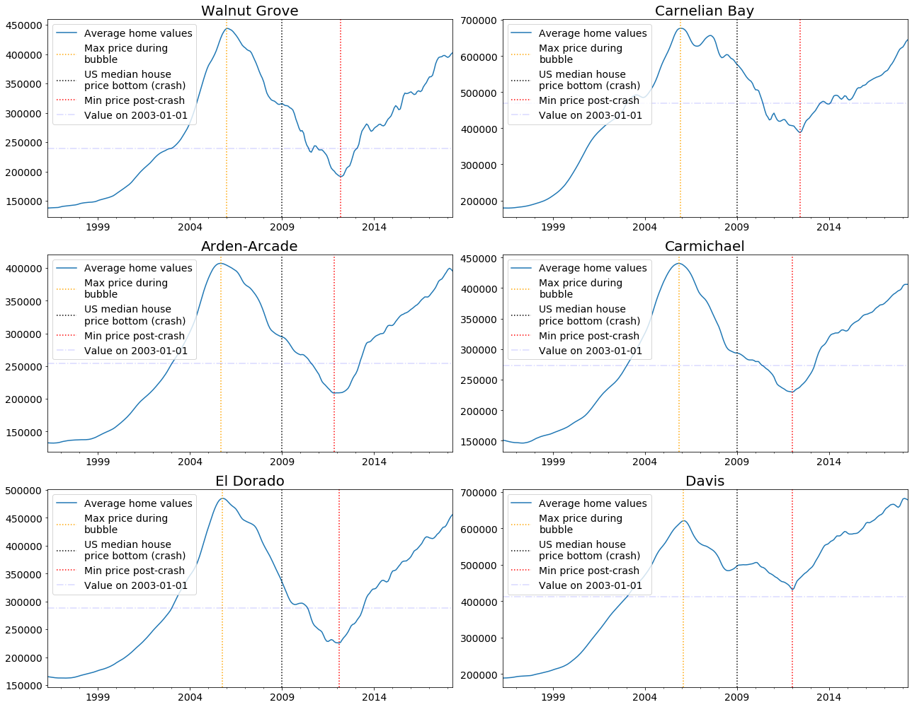


```python
plot_ts_cities(df_sac_cities, sac_metro_cities[6:12], nrows = 3, ncols = 2, figsize=(18,14), col='value', legend=True);
```


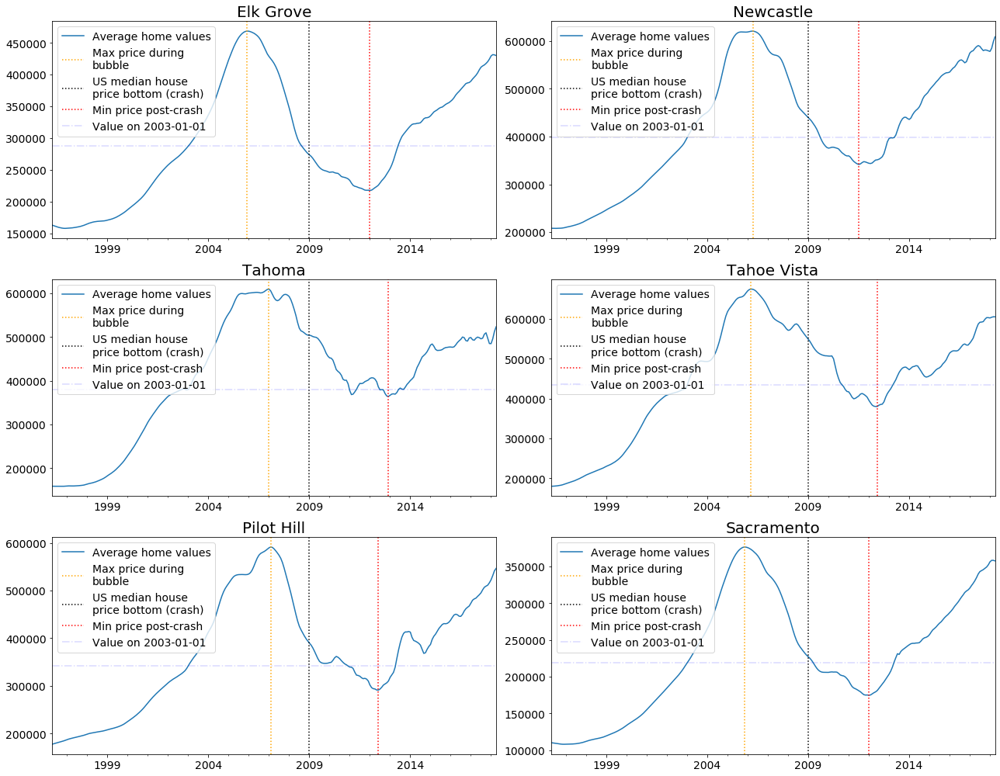


```python
plot_ts_cities(df_sac_cities, sac_metro_cities[12:18], nrows = 3, ncols = 2, figsize=(18,14), col='value', legend=True);

```


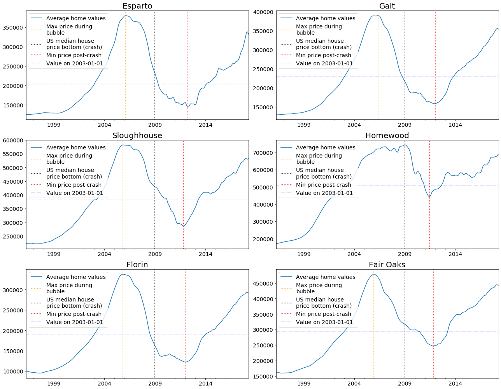


```python
plot_ts_cities(df_sac_cities, sac_metro_cities[18:24], nrows = 3, ncols = 2, figsize=(16,14), col='value', legend=True)
```


    (<Figure size 1152x1008 with 6 Axes>,
     <matplotlib.axes._subplots.AxesSubplot at 0x1c28fb6f98>)


```python
plot_ts_cities(df_sac_cities, sac_metro_cities[24:30], nrows = 3, ncols = 2, figsize=(16,14), col='value', legend=True)
```


    (<Figure size 1152x1008 with 6 Axes>,
     <matplotlib.axes._subplots.AxesSubplot at 0x1c1fe6fd68>)


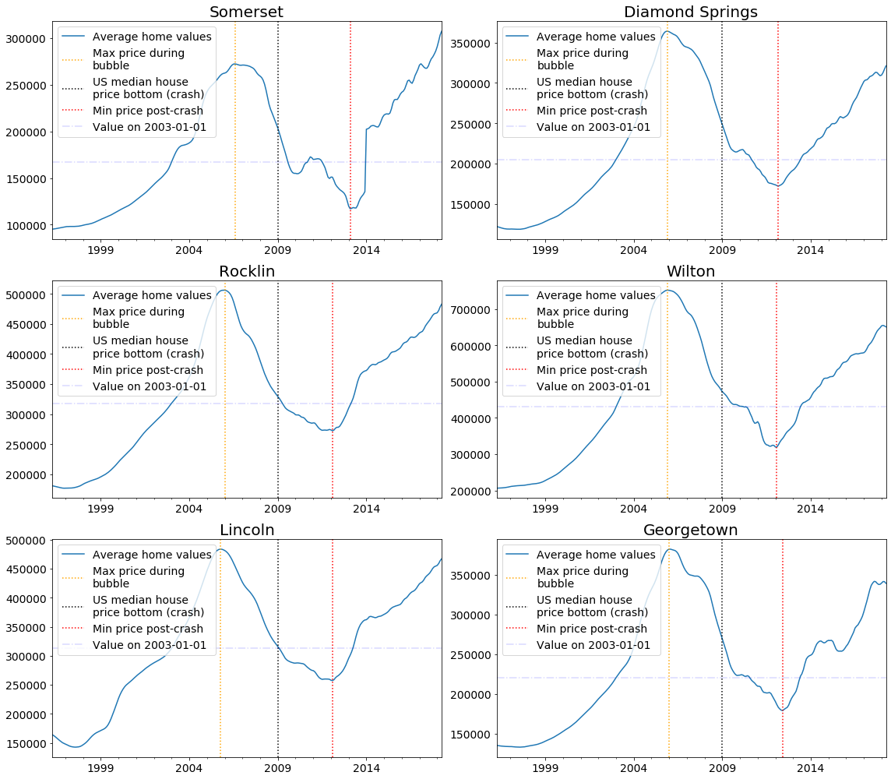


```python
plot_ts_cities(df_sac_cities, sac_metro_cities[30:36], nrows = 3, ncols = 2, figsize=(16,14), col='value', legend=True)
```


    (<Figure size 1152x1008 with 6 Axes>,
     <matplotlib.axes._subplots.AxesSubplot at 0x1c4d142940>)


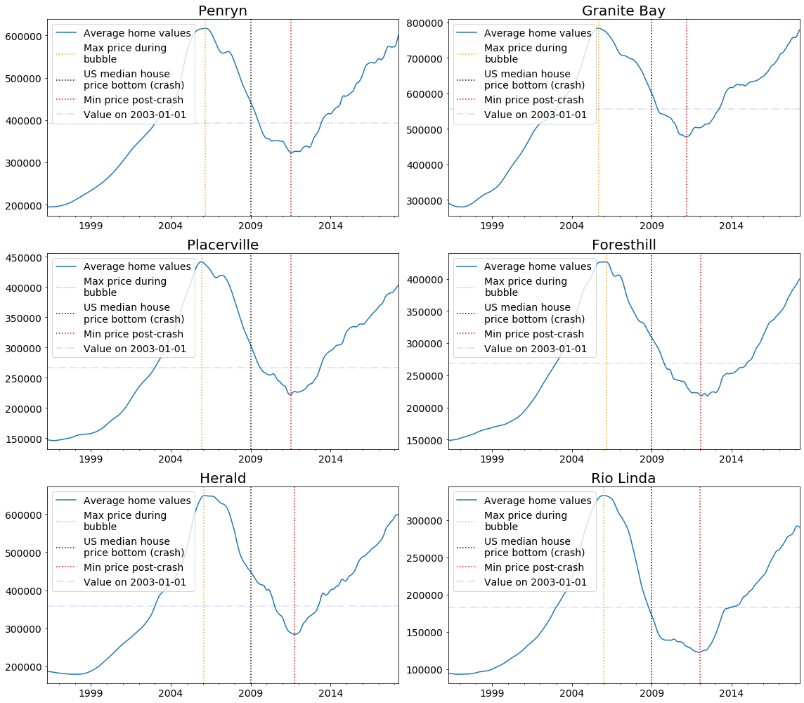


```python
plot_ts_cities(df_sac_cities, sac_metro_cities[36:42], nrows = 3, ncols = 2, figsize=(16,14), col='value', legend=True)
```


    (<Figure size 1152x1008 with 6 Axes>,
     <matplotlib.axes._subplots.AxesSubplot at 0x1c1f2a2438>)


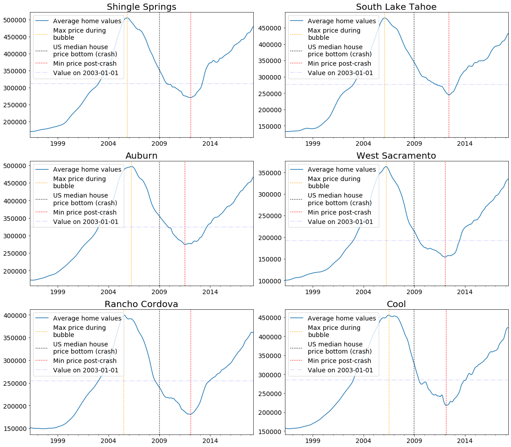


```python
plot_ts_cities(df_sac_cities, sac_metro_cities[42:48], nrows = 3, ncols = 2, figsize=(16,14), col='value', legend=True)
```


    (<Figure size 1152x1008 with 6 Axes>,
     <matplotlib.axes._subplots.AxesSubplot at 0x1cad7f0dd8>)


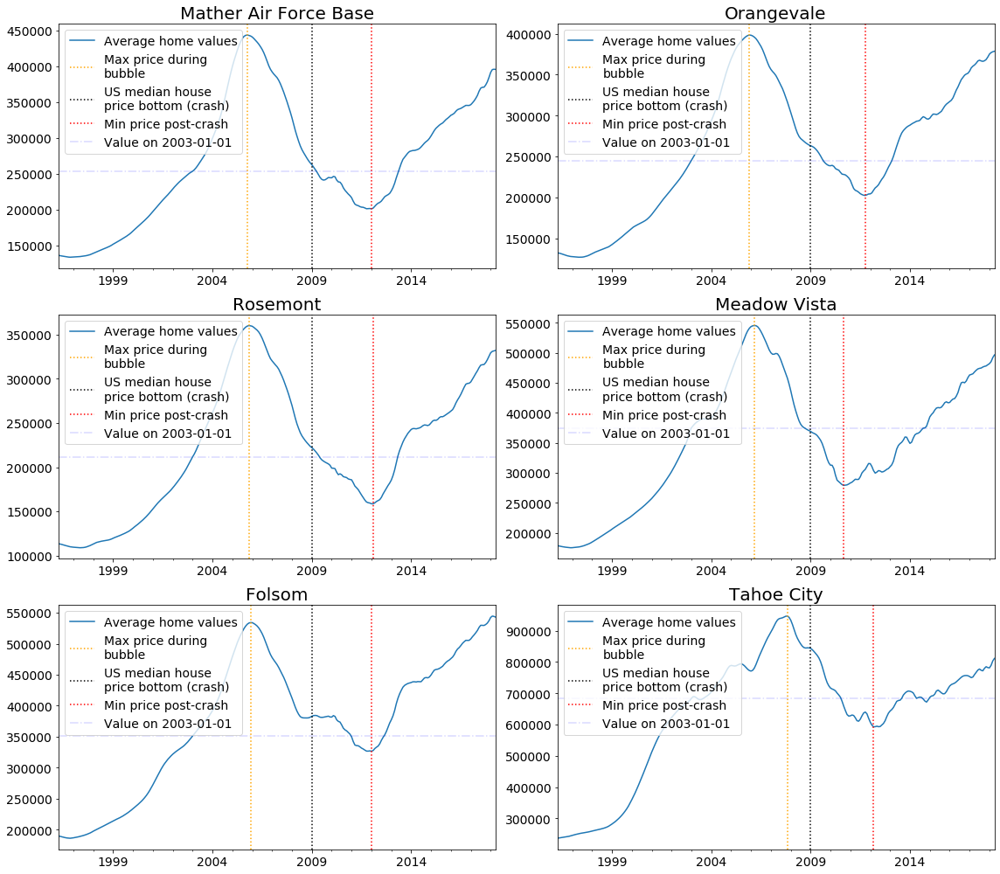


```python
plot_ts_cities(df_sac_cities, sac_metro_cities[48:54], nrows = 3, ncols = 2, figsize=(16,14), col='value', legend=True)
```


    (<Figure size 1152x1008 with 6 Axes>,
     <matplotlib.axes._subplots.AxesSubplot at 0x1c674c9e48>)


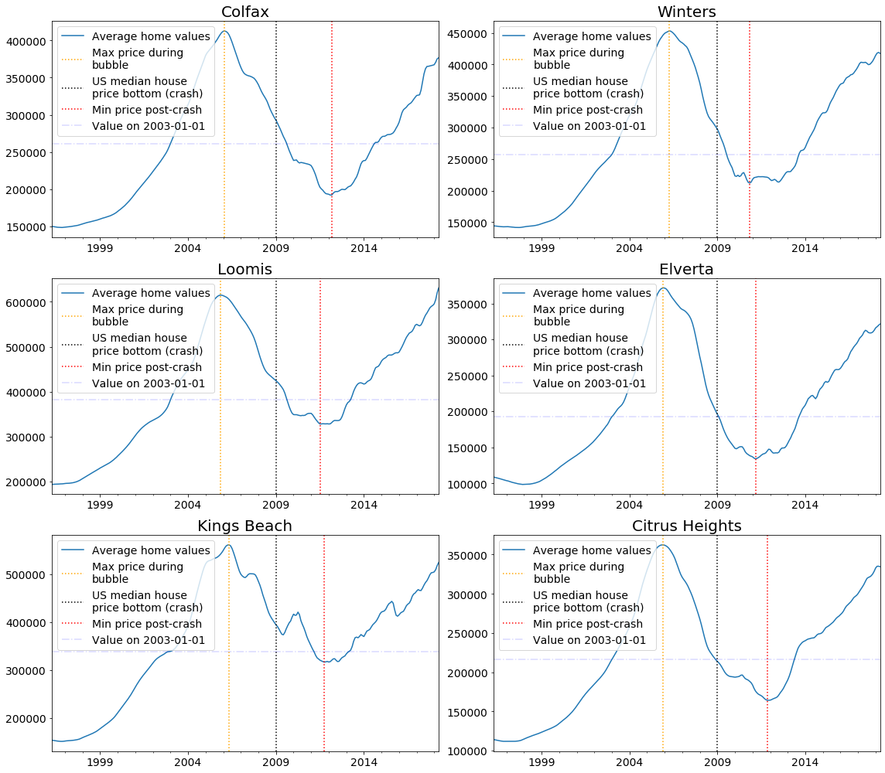


```python
plot_ts_cities(df_sac_cities, sac_metro_cities[54:56], nrows = 3, ncols = 2, figsize=(16,14), col='value', legend=True)
```


    (<Figure size 1152x1008 with 2 Axes>,
     <matplotlib.axes._subplots.AxesSubplot at 0x1c1f597518>)


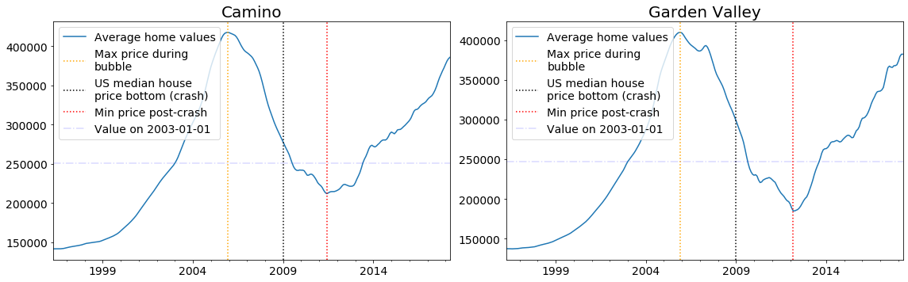


### Plots of zip codes within City of Sacramento


```python
df_sacto_city_zips = df_sac.loc[df_sac['City'] == 'Sacramento']
df_sacto_city_zips.head()
```


<div>
<style scoped>
    .dataframe tbody tr th:only-of-type {
        vertical-align: middle;
    }

    .dataframe tbody tr th {
        vertical-align: top;
    }

    .dataframe thead th {
        text-align: right;
    }
</style>
<table border="1" class="dataframe">
  <thead>
    <tr style="text-align: right;">
      <th></th>
      <th>Metro</th>
      <th>MetroState</th>
      <th>CountyName</th>
      <th>City</th>
      <th>Zip</th>
      <th>value</th>
    </tr>
    <tr>
      <th>time</th>
      <th></th>
      <th></th>
      <th></th>
      <th></th>
      <th></th>
      <th></th>
    </tr>
  </thead>
  <tbody>
    <tr>
      <td>1996-04-01</td>
      <td>Sacramento</td>
      <td>Sacramento CA</td>
      <td>Sacramento</td>
      <td>Sacramento</td>
      <td>95660</td>
      <td>73200.0</td>
    </tr>
    <tr>
      <td>1996-05-01</td>
      <td>Sacramento</td>
      <td>Sacramento CA</td>
      <td>Sacramento</td>
      <td>Sacramento</td>
      <td>95660</td>
      <td>72500.0</td>
    </tr>
    <tr>
      <td>1996-06-01</td>
      <td>Sacramento</td>
      <td>Sacramento CA</td>
      <td>Sacramento</td>
      <td>Sacramento</td>
      <td>95660</td>
      <td>71900.0</td>
    </tr>
    <tr>
      <td>1996-07-01</td>
      <td>Sacramento</td>
      <td>Sacramento CA</td>
      <td>Sacramento</td>
      <td>Sacramento</td>
      <td>95660</td>
      <td>71300.0</td>
    </tr>
    <tr>
      <td>1996-08-01</td>
      <td>Sacramento</td>
      <td>Sacramento CA</td>
      <td>Sacramento</td>
      <td>Sacramento</td>
      <td>95660</td>
      <td>70700.0</td>
    </tr>
  </tbody>
</table>
</div>


```python
df_sacto_city_zips['Zip'].value_counts()
```


    95811    265
    95833    265
    95818    265
    95822    265
    95823    265
    95819    265
    95824    265
    95841    265
    95835    265
    95832    265
    95831    265
    95660    265
    95829    265
    95816    265
    95817    265
    95843    265
    95834    265
    95838    265
    95820    265
    95842    265
    95815     58
    Name: Zip, dtype: int64


```python
sacto_zips = list(set(df_sacto_city_zips['Zip']))
len(sacto_zips)
```


    21


```python
ts = df_sacto_city_zips['value'].loc[df_sacto_city_zips['Zip'] == '95823']
ts.head()
```


    time
    1996-04-01    91500.0
    1996-05-01    90800.0
    1996-06-01    90000.0
    1996-07-01    89200.0
    1996-08-01    88400.0
    Name: value, dtype: float64


```python
fig, ax = plot_ts_zips(df_sac, sacto_zips, nrows=11, ncols=2, figsize=(18, 50), legend=True);

```


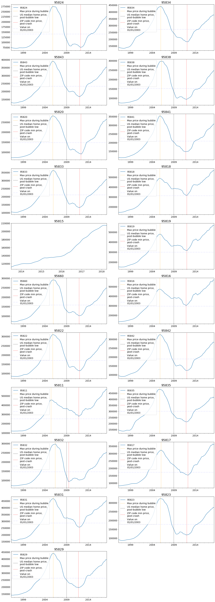


### Plotting cities and zip codes within Sacramento Metro area 


```python
fig, ax = plot_ts_zips_by_city(df_sac, dict_sac_zips_cities, figsize=(18, 120), nrows=30, ncols=2, legend=False);

```


```python
fig, ax = plot_ts_zips_by_city(df_sac, dict_0_6, figsize=(18, 14), nrows=3, ncols=2, legend=True);
```


```python
fig, ax = plot_ts_zips_by_city(df_sac, dict_6_12, figsize=(18, 14), nrows=3, ncols=2, legend=True);
```


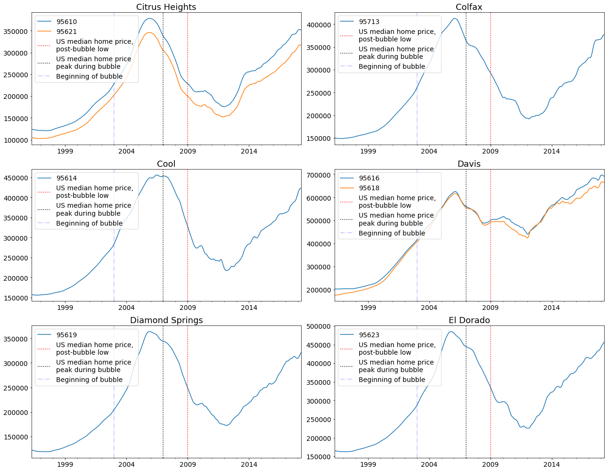


```python
fig, ax = plot_ts_zips_by_city(df_sac, dict_12_18, figsize=(18, 14), nrows=3, ncols=2, legend=True);
```


```python
fig, ax = plot_ts_zips_by_city(df_sac, dict_18_24, figsize=(18, 14), nrows=3, ncols=2, legend=True);
```


```python
fig, ax = plot_ts_zips_by_city(df_sac, dict_24_30, figsize=(18, 14), nrows=3, ncols=2, legend=True);
```


```python
fig, ax = plot_ts_zips_by_city(df_sac, dict_30_36, figsize=(18, 14), nrows=3, ncols=2, legend=True);
```


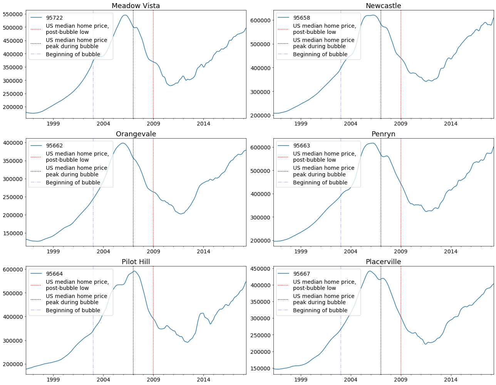


```python
fig, ax = plot_ts_zips_by_city(df_sac, dict_36_42, figsize=(18, 14), nrows=3, ncols=2, legend=True);
```


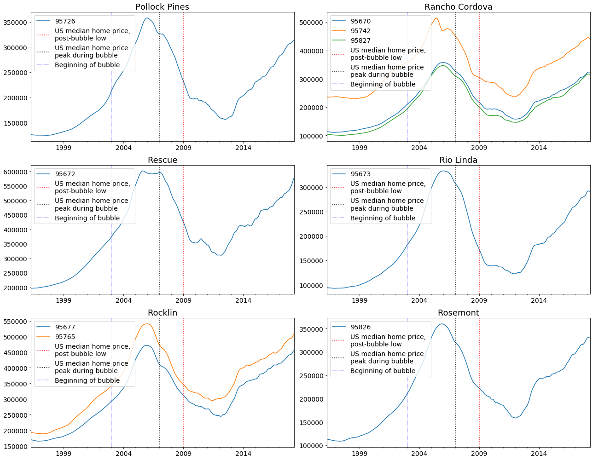


```python
fig, ax = plot_ts_zips_by_city(df_sac, dict_42_48, figsize=(16, 13), nrows=3, ncols=2, legend=False);
```


```python
fig, ax = plot_ts_zips_by_city(df_sac, dict_48_54, figsize=(16, 13), nrows=3, ncols=2, legend=True);
```


```python
fig, ax = plot_ts_zips_by_city(df_sac, dict_54_56, figsize=(16, 13), nrows=3, ncols=2, legend=True);
```


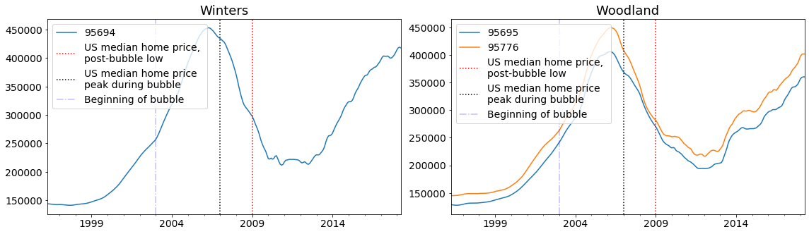


### Plotting boxplots for each city in Sacto Metro region


```python
metro_cities_boxplot(df_sac, sac_metro_cities, nrows=10, ncols=6, figsize=(18, 40))

```


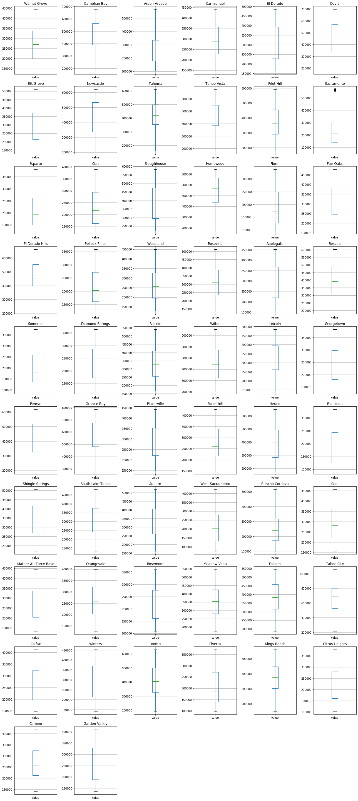


### Plotting boxplots for each zip in Sacramento metro region


```python
metro_zips_boxplot(df_sac, sac_metro_zips, nrows = 12, ncols=8, figsize=(18, 60))

```


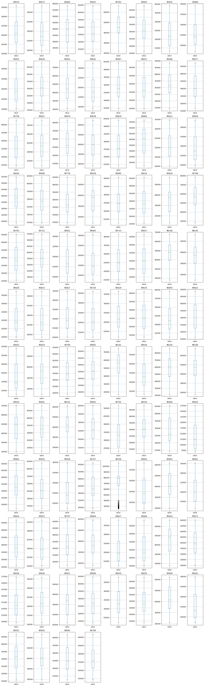


```python
metro_cities_zips_boxplot(df_sac, dict_sac_zips_cities, nrows=14, ncols=6, figsize=(18, 50))

```


```python
df_sac_city = df_sac.loc[df_sac['City'] == 'Sacramento']

df_sac_city.head()
```


<div>
<style scoped>
    .dataframe tbody tr th:only-of-type {
        vertical-align: middle;
    }

    .dataframe tbody tr th {
        vertical-align: top;
    }

    .dataframe thead th {
        text-align: right;
    }
</style>
<table border="1" class="dataframe">
  <thead>
    <tr style="text-align: right;">
      <th></th>
      <th>Metro</th>
      <th>MetroState</th>
      <th>CountyName</th>
      <th>City</th>
      <th>Zip</th>
      <th>value</th>
    </tr>
    <tr>
      <th>time</th>
      <th></th>
      <th></th>
      <th></th>
      <th></th>
      <th></th>
      <th></th>
    </tr>
  </thead>
  <tbody>
    <tr>
      <td>1996-04-01</td>
      <td>Sacramento</td>
      <td>Sacramento CA</td>
      <td>Sacramento</td>
      <td>Sacramento</td>
      <td>95660</td>
      <td>73200.0</td>
    </tr>
    <tr>
      <td>1996-05-01</td>
      <td>Sacramento</td>
      <td>Sacramento CA</td>
      <td>Sacramento</td>
      <td>Sacramento</td>
      <td>95660</td>
      <td>72500.0</td>
    </tr>
    <tr>
      <td>1996-06-01</td>
      <td>Sacramento</td>
      <td>Sacramento CA</td>
      <td>Sacramento</td>
      <td>Sacramento</td>
      <td>95660</td>
      <td>71900.0</td>
    </tr>
    <tr>
      <td>1996-07-01</td>
      <td>Sacramento</td>
      <td>Sacramento CA</td>
      <td>Sacramento</td>
      <td>Sacramento</td>
      <td>95660</td>
      <td>71300.0</td>
    </tr>
    <tr>
      <td>1996-08-01</td>
      <td>Sacramento</td>
      <td>Sacramento CA</td>
      <td>Sacramento</td>
      <td>Sacramento</td>
      <td>95660</td>
      <td>70700.0</td>
    </tr>
  </tbody>
</table>
</div>


```python
sacto_zips = list(set(df_sac_city['Zip']))
len(sacto_zips)

```


    21


```python
df_sac_city.boxplot(by='Zip', column = 'value', figsize=(16, 6))

```


    <matplotlib.axes._subplots.AxesSubplot at 0x1c1f8cb4a8>


### Violin plot for Sacramento city zip codes


```python
import seaborn as sns

```


```python
# got figure size  modification example from https://exceptionshub.com/how-do-i-change-the-figure-size-for-a-seaborn-plot.html

# fig, ax = plt.subplots()
# fig.set_size_inches(16, 6)
# sns.violinplot(x="Zip", y="value", data=df_44, scale="count", inner="stick", ax=ax)

def violin_plt(x, y, data, scale="width", inner="quartile", set_size_inches=(16, 6)):
    
    '''Plots zip codes within a city on one violin plot.  Set defaults to x='Zip', y='value', 
    data=df_sac_city, scale="width", inner="quartile", set_size_inches=(16, 6), ax=ax)
    '''
    
    import seaborn as sns
    fig, ax = plt.subplots()
    fig.set_size_inches
    sns.violinplot(x, y, data, scale, inner, ax)
    
    
```


```python
# got figure size  modification example from https://exceptionshub.com/how-do-i-change-the-figure-size-for-a-seaborn-plot.html

# fig, ax = plt.subplots()
# fig.set_size_inches(16, 6)
# sns.violinplot(x="Zip", y="value", data=df_44, scale="count", inner="stick", ax=ax)

import seaborn as sns

fig, ax = plt.subplots()
fig.set_size_inches(16, 6)
sns.violinplot(x="Zip", y="value", data=df_sac_city, scale="width", inner="quartile", ax=ax)
```


    <matplotlib.axes._subplots.AxesSubplot at 0x1c673a7a58>


```python
df_sac_city_1996_1999 = df_sac_city.loc['1996-04-01':'1999-12-01']
df_sac_city_1996_1999.tail()
```


<div>
<style scoped>
    .dataframe tbody tr th:only-of-type {
        vertical-align: middle;
    }

    .dataframe tbody tr th {
        vertical-align: top;
    }

    .dataframe thead th {
        text-align: right;
    }
</style>
<table border="1" class="dataframe">
  <thead>
    <tr style="text-align: right;">
      <th></th>
      <th>Metro</th>
      <th>MetroState</th>
      <th>CountyName</th>
      <th>City</th>
      <th>Zip</th>
      <th>value</th>
    </tr>
    <tr>
      <th>time</th>
      <th></th>
      <th></th>
      <th></th>
      <th></th>
      <th></th>
      <th></th>
    </tr>
  </thead>
  <tbody>
    <tr>
      <td>1999-08-01</td>
      <td>Sacramento</td>
      <td>Sacramento CA</td>
      <td>Sacramento</td>
      <td>Sacramento</td>
      <td>95843</td>
      <td>146400.0</td>
    </tr>
    <tr>
      <td>1999-09-01</td>
      <td>Sacramento</td>
      <td>Sacramento CA</td>
      <td>Sacramento</td>
      <td>Sacramento</td>
      <td>95843</td>
      <td>147600.0</td>
    </tr>
    <tr>
      <td>1999-10-01</td>
      <td>Sacramento</td>
      <td>Sacramento CA</td>
      <td>Sacramento</td>
      <td>Sacramento</td>
      <td>95843</td>
      <td>149000.0</td>
    </tr>
    <tr>
      <td>1999-11-01</td>
      <td>Sacramento</td>
      <td>Sacramento CA</td>
      <td>Sacramento</td>
      <td>Sacramento</td>
      <td>95843</td>
      <td>150300.0</td>
    </tr>
    <tr>
      <td>1999-12-01</td>
      <td>Sacramento</td>
      <td>Sacramento CA</td>
      <td>Sacramento</td>
      <td>Sacramento</td>
      <td>95843</td>
      <td>151800.0</td>
    </tr>
  </tbody>
</table>
</div>


```python
fig, ax = plt.subplots()
fig.set_size_inches(16, 6)
sns.violinplot(x="Zip", y="value", data=df_sac_city_1996_1999, scale="width", inner="quartile", ax=ax)
```


    <matplotlib.axes._subplots.AxesSubplot at 0x1c8b814b70>


```python
df_sac_city_2000_2003 = df_sac_city.loc['2000-01-01':'2003-12-01']
df_sac_city_2000_2003.head()
```


<div>
<style scoped>
    .dataframe tbody tr th:only-of-type {
        vertical-align: middle;
    }

    .dataframe tbody tr th {
        vertical-align: top;
    }

    .dataframe thead th {
        text-align: right;
    }
</style>
<table border="1" class="dataframe">
  <thead>
    <tr style="text-align: right;">
      <th></th>
      <th>Metro</th>
      <th>MetroState</th>
      <th>CountyName</th>
      <th>City</th>
      <th>Zip</th>
      <th>value</th>
    </tr>
    <tr>
      <th>time</th>
      <th></th>
      <th></th>
      <th></th>
      <th></th>
      <th></th>
      <th></th>
    </tr>
  </thead>
  <tbody>
    <tr>
      <td>2000-01-01</td>
      <td>Sacramento</td>
      <td>Sacramento CA</td>
      <td>Sacramento</td>
      <td>Sacramento</td>
      <td>95660</td>
      <td>89100.0</td>
    </tr>
    <tr>
      <td>2000-02-01</td>
      <td>Sacramento</td>
      <td>Sacramento CA</td>
      <td>Sacramento</td>
      <td>Sacramento</td>
      <td>95660</td>
      <td>90100.0</td>
    </tr>
    <tr>
      <td>2000-03-01</td>
      <td>Sacramento</td>
      <td>Sacramento CA</td>
      <td>Sacramento</td>
      <td>Sacramento</td>
      <td>95660</td>
      <td>91200.0</td>
    </tr>
    <tr>
      <td>2000-04-01</td>
      <td>Sacramento</td>
      <td>Sacramento CA</td>
      <td>Sacramento</td>
      <td>Sacramento</td>
      <td>95660</td>
      <td>92200.0</td>
    </tr>
    <tr>
      <td>2000-05-01</td>
      <td>Sacramento</td>
      <td>Sacramento CA</td>
      <td>Sacramento</td>
      <td>Sacramento</td>
      <td>95660</td>
      <td>93300.0</td>
    </tr>
  </tbody>
</table>
</div>


```python
fig, ax = plt.subplots()
fig.set_size_inches(16, 6)
sns.violinplot(x="Zip", y="value", data=df_sac_city_2000_2003, scale="width", inner="quartile", ax=ax)
```


    <matplotlib.axes._subplots.AxesSubplot at 0x1c1e8cd2b0>


```python
df_sac_city_2004_2006 = df_sac_city.loc['2004-01-01':'2006-12-01']
df_sac_city_2004_2006.head()
```


<div>
<style scoped>
    .dataframe tbody tr th:only-of-type {
        vertical-align: middle;
    }

    .dataframe tbody tr th {
        vertical-align: top;
    }

    .dataframe thead th {
        text-align: right;
    }
</style>
<table border="1" class="dataframe">
  <thead>
    <tr style="text-align: right;">
      <th></th>
      <th>Metro</th>
      <th>MetroState</th>
      <th>CountyName</th>
      <th>City</th>
      <th>Zip</th>
      <th>value</th>
    </tr>
    <tr>
      <th>time</th>
      <th></th>
      <th></th>
      <th></th>
      <th></th>
      <th></th>
      <th></th>
    </tr>
  </thead>
  <tbody>
    <tr>
      <td>2004-01-01</td>
      <td>Sacramento</td>
      <td>Sacramento CA</td>
      <td>Sacramento</td>
      <td>Sacramento</td>
      <td>95660</td>
      <td>191900.0</td>
    </tr>
    <tr>
      <td>2004-02-01</td>
      <td>Sacramento</td>
      <td>Sacramento CA</td>
      <td>Sacramento</td>
      <td>Sacramento</td>
      <td>95660</td>
      <td>195700.0</td>
    </tr>
    <tr>
      <td>2004-03-01</td>
      <td>Sacramento</td>
      <td>Sacramento CA</td>
      <td>Sacramento</td>
      <td>Sacramento</td>
      <td>95660</td>
      <td>200200.0</td>
    </tr>
    <tr>
      <td>2004-04-01</td>
      <td>Sacramento</td>
      <td>Sacramento CA</td>
      <td>Sacramento</td>
      <td>Sacramento</td>
      <td>95660</td>
      <td>205300.0</td>
    </tr>
    <tr>
      <td>2004-05-01</td>
      <td>Sacramento</td>
      <td>Sacramento CA</td>
      <td>Sacramento</td>
      <td>Sacramento</td>
      <td>95660</td>
      <td>211100.0</td>
    </tr>
  </tbody>
</table>
</div>


```python
fig, ax = plt.subplots()
fig.set_size_inches(16, 6)
sns.violinplot(x="Zip", y="value", data=df_sac_city_2004_2006, scale="width", inner="quartile", ax=ax)
```


    <matplotlib.axes._subplots.AxesSubplot at 0x1c8b7eef60>


```python
df_sac_city_2007_2012 = df_sac_city.loc['2007-01-01':'2012-12-01']
df_sac_city_2007_2012.head()
```


<div>
<style scoped>
    .dataframe tbody tr th:only-of-type {
        vertical-align: middle;
    }

    .dataframe tbody tr th {
        vertical-align: top;
    }

    .dataframe thead th {
        text-align: right;
    }
</style>
<table border="1" class="dataframe">
  <thead>
    <tr style="text-align: right;">
      <th></th>
      <th>Metro</th>
      <th>MetroState</th>
      <th>CountyName</th>
      <th>City</th>
      <th>Zip</th>
      <th>value</th>
    </tr>
    <tr>
      <th>time</th>
      <th></th>
      <th></th>
      <th></th>
      <th></th>
      <th></th>
      <th></th>
    </tr>
  </thead>
  <tbody>
    <tr>
      <td>2007-01-01</td>
      <td>Sacramento</td>
      <td>Sacramento CA</td>
      <td>Sacramento</td>
      <td>Sacramento</td>
      <td>95660</td>
      <td>264800.0</td>
    </tr>
    <tr>
      <td>2007-02-01</td>
      <td>Sacramento</td>
      <td>Sacramento CA</td>
      <td>Sacramento</td>
      <td>Sacramento</td>
      <td>95660</td>
      <td>263000.0</td>
    </tr>
    <tr>
      <td>2007-03-01</td>
      <td>Sacramento</td>
      <td>Sacramento CA</td>
      <td>Sacramento</td>
      <td>Sacramento</td>
      <td>95660</td>
      <td>261000.0</td>
    </tr>
    <tr>
      <td>2007-04-01</td>
      <td>Sacramento</td>
      <td>Sacramento CA</td>
      <td>Sacramento</td>
      <td>Sacramento</td>
      <td>95660</td>
      <td>258400.0</td>
    </tr>
    <tr>
      <td>2007-05-01</td>
      <td>Sacramento</td>
      <td>Sacramento CA</td>
      <td>Sacramento</td>
      <td>Sacramento</td>
      <td>95660</td>
      <td>254800.0</td>
    </tr>
  </tbody>
</table>
</div>


```python
fig, ax = plt.subplots()
fig.set_size_inches(16, 6)
sns.violinplot(x="Zip", y="value", data=df_sac_city_2007_2012, scale="width", inner="quartile", ax=ax)
```


    <matplotlib.axes._subplots.AxesSubplot at 0x1c1f716f28>


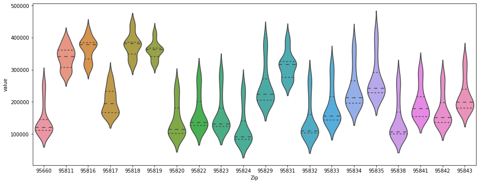


```python
df_sac_city_2013_2018 = df_sac_city.loc['2013-01-01':'2018']
df_sac_city_2013_2018.tail()
```


<div>
<style scoped>
    .dataframe tbody tr th:only-of-type {
        vertical-align: middle;
    }

    .dataframe tbody tr th {
        vertical-align: top;
    }

    .dataframe thead th {
        text-align: right;
    }
</style>
<table border="1" class="dataframe">
  <thead>
    <tr style="text-align: right;">
      <th></th>
      <th>Metro</th>
      <th>MetroState</th>
      <th>CountyName</th>
      <th>City</th>
      <th>Zip</th>
      <th>value</th>
    </tr>
    <tr>
      <th>time</th>
      <th></th>
      <th></th>
      <th></th>
      <th></th>
      <th></th>
      <th></th>
    </tr>
  </thead>
  <tbody>
    <tr>
      <td>2017-12-01</td>
      <td>Sacramento</td>
      <td>Sacramento CA</td>
      <td>Sacramento</td>
      <td>Sacramento</td>
      <td>95843</td>
      <td>345600.0</td>
    </tr>
    <tr>
      <td>2018-01-01</td>
      <td>Sacramento</td>
      <td>Sacramento CA</td>
      <td>Sacramento</td>
      <td>Sacramento</td>
      <td>95843</td>
      <td>350100.0</td>
    </tr>
    <tr>
      <td>2018-02-01</td>
      <td>Sacramento</td>
      <td>Sacramento CA</td>
      <td>Sacramento</td>
      <td>Sacramento</td>
      <td>95843</td>
      <td>352500.0</td>
    </tr>
    <tr>
      <td>2018-03-01</td>
      <td>Sacramento</td>
      <td>Sacramento CA</td>
      <td>Sacramento</td>
      <td>Sacramento</td>
      <td>95843</td>
      <td>352400.0</td>
    </tr>
    <tr>
      <td>2018-04-01</td>
      <td>Sacramento</td>
      <td>Sacramento CA</td>
      <td>Sacramento</td>
      <td>Sacramento</td>
      <td>95843</td>
      <td>351400.0</td>
    </tr>
  </tbody>
</table>
</div>


```python
fig, ax = plt.subplots()
fig.set_size_inches(16, 6)
sns.violinplot(x="Zip", y="value", data=df_sac_city_2013_2018, scale="width", inner="quartile", ax=ax)
```


    <matplotlib.axes._subplots.AxesSubplot at 0x1c1e32c048>


# Step 4:  ARIMA Modeling

## Setting up functions for running ARIMA models


```python
import warnings
from statsmodels.tsa.arima_model import ARIMA
import statsmodels.api as sm
from sklearn.metrics import mean_squared_error

```

## Parameter fine-tuning function

### Creating p, d, q, and m values for running ARIMA model


```python
# evaluate parameters
p_values = [0, 1, 2, 4, 6, 8, 10]
d_values = range(0, 3)
q_values = range(0, 3)
warnings.filterwarnings("ignore")

```


```python
# add each order tuple and mse to lists to create a table of the results

# order_tuples = []
# mse_results = []

# evaluate an ARIMA model for a given order (p,d,q)
def evaluate_arima_model(X, arima_order):
    # prepare training dataset
    train_size = int(len(X) * 0.66)
    train, test = X[0:train_size], X[train_size:]
    history = [x for x in train]
    # make predictions
    predictions = list()
    for t in range(len(test)):
        model = ARIMA(history, order=arima_order)
        model_fit = model.fit(disp=0)
        yhat = model_fit.forecast()[0]
        predictions.append(yhat)
        history.append(test[t])
    # calculate out of sample error
    error = mean_squared_error(test, predictions)
    return error

def eval_params_and_lists(dataset, p_values, d_values, q_values):
    order_tuples = []
    mse_results = []
    dataset = dataset.astype('float32')
    best_score, best_cfg = float("inf"), None
    for p in p_values:
        for d in d_values:
            for q in q_values:
                order = (p,d,q)
                try:
                    mse = evaluate_arima_model(dataset, order)
                    order_tuples.append(order)
                    mse_results.append(mse)
                    if mse < best_score:
                        best_score, best_cfg = mse, order
                    print('ARIMA%s MSE=%.3f' % (order,mse))
                except:
                    continue
    print('Best ARIMA%s MSE=%.3f' % (best_cfg, best_score))
    return order_tuples, mse_results, best_cfg, best_score   # adding to Jeff's function; output will be taken into forecast function that follows


```

# Step 5: Functions for Interpreting Results

## Elements of ARIMA model fit, forecast, and summary


### Create ARIMA model show summary results table


```python
# Define function

def arima_zipcode(ts, order):
    ts_value = ts.value
    model = ARIMA(ts_value, order)
    model_fit = model.fit(disp=0)
    print(model_fit.summary())
    return model_fit

# model_fit = arima_zipcode(ts_values, order = order)
```

### Create forecast model


```python
# Define function

def forecast(model_fit, months=24, confint=2):
    forecast = model_fit.forecast(months)
    actual_forecast = forecast[0]
    std_error = forecast[1]
    forecast_confint = forecast[confint]
    return actual_forecast, std_error, forecast_confint   

# actual_forecast, std_error, forecast_confint = forecast(model_fit)
```

### Create dataframe to hold these values and join to existing dataframe


```python
# Define function

def forecast_df(actual_forecast, forecast_confint, std_error, col = 'time', 
                daterange = pd.date_range(start='2018-05-01', end='2020-04-01', freq='MS')):
    df_forecast = pd.DataFrame({col: daterange})
    df_forecast['forecast'] = actual_forecast
    df_forecast['forecast_lower'] = forecast_confint[:, 0]
    df_forecast['forecast_upper'] = forecast_confint[:, 1]
    df_forecast['standard error'] = std_error
    df_forecast.set_index('time', inplace=True)
    return df_forecast

```

### Create df_new with historical and forecasted values


```python
def concat_values_forecast(ts, df_forecast):
    df_new = pd.concat([ts, df_forecast])
    df_new = df_new.rename(columns = {0: 'value'})
    return df_new
```

### Plot forecast results


```python
def plot_forecast(df_new, geog_area, figsize=(12,8)):
    fig = plt.figure(figsize=figsize)
    plt.plot(df_new['value'], label='Raw Data')
    plt.plot(df_new['forecast'], label='Forecast')
    plt.fill_between(df_new.index, df_new['forecast_lower'], df_new['forecast_upper'], color='k', alpha = 0.2, 
                 label='Confidence Interval')
    plt.legend(loc = 'upper left')
    plt.title(f'Forecast for {geog_area}')

```

### Figure out percent change in home values


```python
def forecast_values(df_new, date = '2020-04-01'):
    forecasted_price = df_new.loc[date, 'forecast']
    forecasted_lower = df_new.loc[date, 'forecast_lower']
    forecasted_upper = df_new.loc[date, 'forecast_upper']    
    return forecasted_price, forecasted_lower, forecasted_upper

```

### Compute and print predicted, best, and worst case scenarios


```python
def pred_best_worst(pred, low, high, last):
    
    '''Prints out predicted, best-case, and worst-case scencarios from forecast'''
    
    pred_pct_change = (((pred - last) / last) * 100)
    print(f'By the model prediction, I would expect to see a {round(pred_pct_change, 3)}% change in price by April 1, 2020.')
    print(type(pred_pct_change))
    lower_pct_change = (((low - last) / last) * 100)
    print(f'At the lower bound of the confidence interval, I would expect to see a {round(lower_pct_change, 3)}% change in price by April 1, 2020.')
    print(type(lower_pct_change))
    upper_pct_change = (((high - last) / last) * 100)
    print(f'At the upper bound of the confidence interval, I would expect to see a {round(upper_pct_change, 3)}% change in price by April 1, 2020.')
    print(type(upper_pct_change))
    return round(pred_pct_change, 3), round(lower_pct_change, 3), round(upper_pct_change, 3)
        
```

## Function to perform ARIMA modeling and display forecast results


```python
# original function  -- unfortunately, this one throws an error when I set run_pdq=True

p_values = [0, 1, 2, 4, 6, 8, 10]
d_values = range(0, 3)
q_values = range(0, 3)

def arima_forecast(ts, geog_area, city, county, p_values, d_values, q_values, best_pdq, confint=2, run_pdq = False):     # months = 24 by default
    
    '''This function attempts to combine the steps of the ARIMA process, starting with parameter fine tuning and
    going all the way through the steps following (ARIMA model fit, forecast, computing percentage changes 
    for each of the forecast values, plotting of historical values and projected values, and printing out 
    the forecasted results.  
    It also appends the lists set up to capture each model's output for a summary dataframe table.
    (Unforunately, this function throws an error if run_pdq is set = True.)'''

    
    # evaluate parameters
    print(f'For {geog_area} ({city}):')
    p_values = [0, 1, 2, 4, 6, 8, 10]
    d_values = range(0, 3)
    q_values = range(0, 3)
    warnings.filterwarnings("ignore")
    
    if run_pdq:
        best_cfg, best_score = eval_arima_models(ts, p_values, d_values, q_values)     # returns order (variable best_cfg)
        order = best_cfg
    else:
        order = best_pdq
        
    print(f'Best ARIMA order = {order}')
    model_fit = arima_zipcode(ts, order)                                # returns model_fit
    actual_forecast, forecast_confint, std_error = forecast(model_fit)  # returns actual_forecast, forecast_confint, std_error
    df_forecast = forecast_df(actual_forecast, std_error, forecast_confint, col = 'time',     # returns df_forecast with future predictions
                              daterange = pd.date_range(start='2018-05-01', end='2020-04-01', freq='MS'))
    df_new = concat_values_forecast(ts, df_forecast)                    # concatenates historical and forecasted values into df_new
    plot_forecast(df_new, geog_area)                            # plots forecast with the label of geog_area
    forecasted_price, forecasted_lower, forecasted_upper = forecast_values(df_new, date = '2020-04-01')   # returns forecasted_price, forecasted_lower, forecasted_upper
    pred = forecasted_price
    low = forecasted_lower
    high = forecasted_upper
    last = df_new['value'].loc['2018-04-01']
    pred_pct_change = (((pred - last) / last) * 100)
    lower_pct_change = (((low - last) / last) * 100)
    upper_pct_change = (((high - last) / last) * 100)
       
    geog_areas.append(geog_area)
    cities.append(city)
    counties.append(county)
    orders.append(order)
    predicted_prices.append(round(forecasted_price, 2))
    lower_bound_prices.append(round(forecasted_lower, 2))
    upper_bound_prices.append(round(forecasted_upper, 2))
    last_values.append(last)
    pred_pct_changes.append(round(pred_pct_change, 2))
    lower_pct_changes.append(round(lower_pct_change, 2))
    upper_pct_changes.append(round(upper_pct_change, 2))
    
    print(f'By the model prediction, I would expect to see a {round(pred_pct_change, 3)}% change in price by April 1, 2020.')
    print(f'At the lower bound of the confidence interval, I would expect to see a {round(lower_pct_change, 3)}% change in price by April 1, 2020.')
    print(f'At the upper bound of the confidence interval, I would expect to see a {round(upper_pct_change, 3)}% change in price by April 1, 2020.')

    return geog_areas, cities, counties, orders, predicted_prices, lower_bound_prices, upper_bound_prices, last_values, pred_pct_changes, lower_pct_changes, upper_pct_changes

```

### ARIMA forecast function -- don't run parameter optimization


```python
def arima_forecast_enter_pdq(ts, geog_area, city, county, best_cfg, confint=2):     # months = 24 by default
    
    '''This function combines the steps of the ARIMA process, starting with ARIMA model fit, forecast 
    (predicted values, upper-bound values,and lower-bound values, determined by confidence intervals), 
    percentage changes for each of the forecast values over time, final values at the end of the 
    forecast period, plotting of historical values and projected values, and a printout of the forecasted 
    results.  It also appends the lists set up to capture each model's output for a summary dataframe table.'''
    
    # evaluate parameters
    print(f'For {geog_area} ({city}):')

    warnings.filterwarnings("ignore")
    order = best_cfg
    print(f'Best ARIMA order = {order}')
    model_fit = arima_zipcode(ts, order)                                # returns model_fit
    actual_forecast, forecast_confint, std_error = forecast(model_fit)  # returns actual_forecast, forecast_confint, std_error
    df_forecast = forecast_df(actual_forecast, std_error, forecast_confint, col = 'time',     # returns df_forecast with future predictions
                              daterange = pd.date_range(start='2018-05-01', end='2020-04-01', freq='MS'))
    df_new = concat_values_forecast(ts, df_forecast)                    # concatenates historical and forecasted values into df_new
    plot_forecast(df_new, geog_area)                            # plots forecast with the label of geog_area
    forecasted_price, forecasted_lower, forecasted_upper = forecast_values(df_new, date = '2020-04-01')   # returns forecasted_price, forecasted_lower, forecasted_upper
    pred = forecasted_price
    low = forecasted_lower
    high = forecasted_upper
    last = df_new['value'].loc['2018-04-01']
    pred_pct_change = (((pred - last) / last) * 100)
    lower_pct_change = (((low - last) / last) * 100)
    upper_pct_change = (((high - last) / last) * 100)
       
    geog_areas.append(geog_area)
    cities.append(city)
    counties.append(county)
    orders.append(order)
    predicted_prices.append(round(forecasted_price, 2))
    lower_bound_prices.append(round(forecasted_lower, 2))
    upper_bound_prices.append(round(forecasted_upper, 2))
    last_values.append(last)
    pred_pct_changes.append(round(pred_pct_change, 2))
    lower_pct_changes.append(round(lower_pct_change, 2))
    upper_pct_changes.append(round(upper_pct_change, 2))
    
    print(f'By the model prediction, I would expect to see a {round(pred_pct_change, 3)}% change in price by April 1, 2020.')
    print(f'At the lower bound of the confidence interval, I would expect to see a {round(lower_pct_change, 3)}% change in price by April 1, 2020.')
    print(f'At the upper bound of the confidence interval, I would expect to see a {round(upper_pct_change, 3)}% change in price by April 1, 2020.')

    return geog_areas, cities, counties, orders, predicted_prices, lower_bound_prices, upper_bound_prices, last_values, pred_pct_changes, lower_pct_changes, upper_pct_changes

```

### ARIMA forecast function -- don't append lists, don't run parameter optimization


```python
# this is meant to check the report output without appending the lists that will create summary df

def arima_forecast_enter_pdq_no_listappend(ts, geog_area, city, county, best_cfg, confint=2):     # months = 24 by default
    
    '''This function combines the steps of the ARIMA process, starting with ARIMA model fit, forecast 
    (predicted values, upper-bound values,and lower-bound values, determined by confidence intervals), 
    percentage changes for each of the forecast values over time, final values at the end of the 
    forecast period, plotting of historical values and projected values, and a printout of the forecasted 
    results.  
    It does NOT append the lists set up to capture each model's output for a summary dataframe table.  It 
    provides a way to produce ARIMA model output again to check on the model when troubleshooting without
    appending results to the existing lists.'''

    
    # evaluate parameters
    print(f'For {geog_area} ({city}):')

    warnings.filterwarnings("ignore")
    order = best_cfg
    print(f'Best ARIMA order = {order}')
    model_fit = arima_zipcode(ts, order)                                # returns model_fit
    actual_forecast, forecast_confint, std_error = forecast(model_fit)  # returns actual_forecast, forecast_confint, std_error
    df_forecast = forecast_df(actual_forecast, std_error, forecast_confint, col = 'time',     # returns df_forecast with future predictions
                              daterange = pd.date_range(start='2018-05-01', end='2020-04-01', freq='MS'))
    df_new = concat_values_forecast(ts, df_forecast)                    # concatenates historical and forecasted values into df_new
    plot_forecast(df_new, geog_area)                            # plots forecast with the label of geog_area
    forecasted_price, forecasted_lower, forecasted_upper = forecast_values(df_new, date = '2020-04-01')   # returns forecasted_price, forecasted_lower, forecasted_upper
    pred = forecasted_price
    low = forecasted_lower
    high = forecasted_upper
    last = df_new['value'].loc['2018-04-01']
    pred_pct_change = (((pred - last) / last) * 100)
    lower_pct_change = (((low - last) / last) * 100)
    upper_pct_change = (((high - last) / last) * 100)
       
#     geog_areas.append(geog_area)
#     cities.append(city)
#     counties.append(county)
#     orders.append(order)
#     predicted_prices.append(round(forecasted_price, 2))
#     lower_bound_prices.append(round(forecasted_lower, 2))
#     upper_bound_prices.append(round(forecasted_upper, 2))
#     last_values.append(last)
#     pred_pct_changes.append(round(pred_pct_change, 2))
#     lower_pct_changes.append(round(lower_pct_change, 2))
#     upper_pct_changes.append(round(upper_pct_change, 2))
    
    print(f'By the model prediction, I would expect to see a {round(pred_pct_change, 3)}% change in price by April 1, 2020.')
    print(f'At the lower bound of the confidence interval, I would expect to see a {round(lower_pct_change, 3)}% change in price by April 1, 2020.')
    print(f'At the upper bound of the confidence interval, I would expect to see a {round(upper_pct_change, 3)}% change in price by April 1, 2020.')

#     return geog_areas, cities, counties, orders, predicted_prices, lower_bound_prices, upper_bound_prices, last_values, pred_pct_changes, lower_pct_changes, upper_pct_changes

```

### Function to create empty lists for storing results


```python
#  Create empty lists to hold results (called by next function)

geog_areas = []
cities = []
counties = []
orders = []
predicted_prices = []
lower_bound_prices = [] 
upper_bound_prices = []
last_values = []
pred_pct_changes = []
lower_pct_changes = []
upper_pct_changes = []

```


```python
def create_empty_lists():
    geog_areas = []
    cities = []
    counties = []
    orders = []
    predicted_prices = []
    lower_bound_prices = [] 
    upper_bound_prices = []
    last_values = []
    pred_pct_changes = []
    lower_pct_changes = []
    upper_pct_changes = []
    return geog_areas, cities, counties, orders, predicted_prices, lower_bound_prices, upper_bound_prices, last_values, pred_pct_changes, lower_pct_changes, upper_pct_changes


create_empty_lists()                # only run this command if you want to empty all lists

# geog_areas, cities, orders, predicted_prices, lower_bound_prices, upper_bound_prices, last_values, pred_pct_changes, lower_pct_changes, upper_pct_changes = create_empty_lists()
# geog_areas, cities, orders, predicted_prices, lower_bound_prices, upper_bound_prices, last_values, pred_pct_changes, lower_pct_changes, upper_pct_changes
```


    ([], [], [], [], [], [], [], [], [], [], [])


### Function to print results lists


```python
#  prints all results lists as they currently stand

def print_results_lists():
    return geog_areas, cities, counties, orders, predicted_prices, lower_bound_prices, upper_bound_prices, last_values, pred_pct_changes, lower_pct_changes, upper_pct_changes
```


```python
print_results_lists()
```


    ([], [], [], [], [], [], [], [], [], [], [])


### Function to pop last item off of each list (to remove last item if an analysis was done in error)


```python
def pop_results_lists():
    geog_areas.pop()
    cities.pop()
    counties.pop()
    orders.pop()
    predicted_prices.pop()
    lower_bound_prices.pop() 
    upper_bound_prices.pop()
    last_values.pop()
    pred_pct_changes.pop()
    lower_pct_changes.pop()
    upper_pct_changes.pop()
    return geog_areas, cities, counties, orders, predicted_prices, lower_bound_prices, upper_bound_prices, last_values, pred_pct_changes, lower_pct_changes, upper_pct_changes

```


```python
# pop_results_lists()
```

### Function to print length of each list (to make sure they're all the same length)


```python
def print_lengths():
    print('geog_areas: ', len(geog_areas))
    print('cities: ', len(cities))
    print('counties', len(counties))
    print('orders: ', len(orders))
    print('predicted_prices: ', len(predicted_prices))
    print('lower_bound_prices: ', len(lower_bound_prices))
    print('upper_bound_prices: ', len(upper_bound_prices))
    print('last_values: ', len(last_values))
    print('pred_pct_changes: ', len(pred_pct_changes))
    print('lower_pct_changes: ', len(lower_pct_changes))
    print('upper_pct_changes: ', len(upper_pct_changes))
    
```


```python
print_lengths()
```

    geog_areas:  0
    cities:  0
    counties 0
    orders:  0
    predicted_prices:  0
    lower_bound_prices:  0
    upper_bound_prices:  0
    last_values:  0
    pred_pct_changes:  0
    lower_pct_changes:  0
    upper_pct_changes:  0


# Analysis by ZIP code

## SacMetro: 95616 (Davis) 

### Set up dataframe


```python
geog_area = '95616'
```


```python
city = 'Davis'
```


```python
county = 'Yolo'
```


```python
ts = df_sac.loc[df_sac['Zip'] == geog_area]
```


```python
ts = ts.resample('MS').asfreq()
```


```python
ts.head()
```


<div>
<style scoped>
    .dataframe tbody tr th:only-of-type {
        vertical-align: middle;
    }

    .dataframe tbody tr th {
        vertical-align: top;
    }

    .dataframe thead th {
        text-align: right;
    }
</style>
<table border="1" class="dataframe">
  <thead>
    <tr style="text-align: right;">
      <th></th>
      <th>Metro</th>
      <th>MetroState</th>
      <th>CountyName</th>
      <th>City</th>
      <th>Zip</th>
      <th>value</th>
    </tr>
    <tr>
      <th>time</th>
      <th></th>
      <th></th>
      <th></th>
      <th></th>
      <th></th>
      <th></th>
    </tr>
  </thead>
  <tbody>
    <tr>
      <td>1996-04-01</td>
      <td>Sacramento</td>
      <td>Sacramento CA</td>
      <td>Yolo</td>
      <td>Davis</td>
      <td>95616</td>
      <td>202500.0</td>
    </tr>
    <tr>
      <td>1996-05-01</td>
      <td>Sacramento</td>
      <td>Sacramento CA</td>
      <td>Yolo</td>
      <td>Davis</td>
      <td>95616</td>
      <td>202500.0</td>
    </tr>
    <tr>
      <td>1996-06-01</td>
      <td>Sacramento</td>
      <td>Sacramento CA</td>
      <td>Yolo</td>
      <td>Davis</td>
      <td>95616</td>
      <td>202500.0</td>
    </tr>
    <tr>
      <td>1996-07-01</td>
      <td>Sacramento</td>
      <td>Sacramento CA</td>
      <td>Yolo</td>
      <td>Davis</td>
      <td>95616</td>
      <td>202500.0</td>
    </tr>
    <tr>
      <td>1996-08-01</td>
      <td>Sacramento</td>
      <td>Sacramento CA</td>
      <td>Yolo</td>
      <td>Davis</td>
      <td>95616</td>
      <td>202500.0</td>
    </tr>
  </tbody>
</table>
</div>


### Visualizations


```python
plot_single_geog(df_melt, geog_area, 'value', 'Zip', figsize=(12, 6), fontsize1=12, fontsize2=16)
```


```python
ts.boxplot(column = 'value')
plt.title(geog_area);

```


```python
plot_acf_pacf(ts.value)
```


```python
plot_seasonal_decomp(ts.value);

# Note that seasonality isn't much of a factor here; maximum difference of about $700 over the course of a year
```


### ARIMA parameters tuning


```python
p_values = [0, 1, 2, 4, 6, 8, 10]
d_values = range(0, 3)
q_values = range(0, 3)

```


```python
# order_tuples_95616, mse_results_95616, best_cfg_95616, best_score_95616 = eval_params_and_lists(ts.value, p_values, d_values, q_values)

# Best ARIMA(2, 1, 2) MSE=3480557.249
```

    ARIMA(0, 0, 0) MSE=24974935922.079
    ARIMA(0, 0, 1) MSE=6346342368.554
    ARIMA(0, 1, 0) MSE=15920047.965
    ARIMA(0, 1, 1) MSE=6483236.024
    ARIMA(0, 2, 0) MSE=6375114.694
    ARIMA(0, 2, 1) MSE=4649116.158
    ARIMA(1, 0, 0) MSE=20371207.793
    ARIMA(1, 1, 0) MSE=6061836.297
    ARIMA(1, 1, 2) MSE=3885885.770
    ARIMA(1, 2, 0) MSE=6014568.045
    ARIMA(1, 2, 1) MSE=4789542.085
    ARIMA(2, 0, 2) MSE=4111595.754
    ARIMA(2, 1, 0) MSE=5376611.069
    ARIMA(2, 1, 2) MSE=3480557.249
    ARIMA(2, 2, 0) MSE=4311056.260
    ARIMA(2, 2, 1) MSE=4189394.454
    ARIMA(2, 2, 2) MSE=3885602.828
    ARIMA(4, 0, 0) MSE=4185449.912
    ARIMA(4, 0, 1) MSE=4038986.300
    ARIMA(4, 0, 2) MSE=3652092.607
    ARIMA(4, 1, 1) MSE=4029169.225
    ARIMA(4, 2, 0) MSE=4194708.540
    ARIMA(6, 0, 0) MSE=4068209.601
    ARIMA(6, 0, 1) MSE=4200967.993
    ARIMA(6, 1, 1) MSE=3960499.070
    ARIMA(6, 2, 0) MSE=4232436.004
    ARIMA(8, 0, 0) MSE=4141438.548
    ARIMA(8, 2, 0) MSE=4289153.696
    ARIMA(10, 0, 0) MSE=4221146.484
    Best ARIMA(2, 1, 2) MSE=3480557.249


Best ARIMA(2, 1, 2) MSE=3480557.249


```python
# order_tuples_95616, mse_results_95616, best_cfg_95616, best_score_95616   # Best ARIMA(2, 1, 2) MSE=3480557.249
```


```python
# best_cfg = best_cfg_95616
best_cfg = (2,1,2)
```

Best ARIMA for Davis is (2,1,2), with MSE=3480557.249


```python
# results_table_95616 = pd.DataFrame({'Order':order_tuples_95616, 'MSEs':mse_results_95616})
# results_table_95616
```


<div>
<style scoped>
    .dataframe tbody tr th:only-of-type {
        vertical-align: middle;
    }

    .dataframe tbody tr th {
        vertical-align: top;
    }

    .dataframe thead th {
        text-align: right;
    }
</style>
<table border="1" class="dataframe">
  <thead>
    <tr style="text-align: right;">
      <th></th>
      <th>Order</th>
      <th>MSEs</th>
    </tr>
  </thead>
  <tbody>
    <tr>
      <td>0</td>
      <td>(0, 0, 0)</td>
      <td>2.497494e+10</td>
    </tr>
    <tr>
      <td>1</td>
      <td>(0, 0, 1)</td>
      <td>6.346342e+09</td>
    </tr>
    <tr>
      <td>2</td>
      <td>(0, 1, 0)</td>
      <td>1.592005e+07</td>
    </tr>
    <tr>
      <td>3</td>
      <td>(0, 1, 1)</td>
      <td>6.483236e+06</td>
    </tr>
    <tr>
      <td>4</td>
      <td>(0, 2, 0)</td>
      <td>6.375115e+06</td>
    </tr>
    <tr>
      <td>5</td>
      <td>(0, 2, 1)</td>
      <td>4.649116e+06</td>
    </tr>
    <tr>
      <td>6</td>
      <td>(1, 0, 0)</td>
      <td>2.037121e+07</td>
    </tr>
    <tr>
      <td>7</td>
      <td>(1, 1, 0)</td>
      <td>6.061836e+06</td>
    </tr>
    <tr>
      <td>8</td>
      <td>(1, 1, 2)</td>
      <td>3.885886e+06</td>
    </tr>
    <tr>
      <td>9</td>
      <td>(1, 2, 0)</td>
      <td>6.014568e+06</td>
    </tr>
    <tr>
      <td>10</td>
      <td>(1, 2, 1)</td>
      <td>4.789542e+06</td>
    </tr>
    <tr>
      <td>11</td>
      <td>(2, 0, 2)</td>
      <td>4.111596e+06</td>
    </tr>
    <tr>
      <td>12</td>
      <td>(2, 1, 0)</td>
      <td>5.376611e+06</td>
    </tr>
    <tr>
      <td>13</td>
      <td>(2, 1, 2)</td>
      <td>3.480557e+06</td>
    </tr>
    <tr>
      <td>14</td>
      <td>(2, 2, 0)</td>
      <td>4.311056e+06</td>
    </tr>
    <tr>
      <td>15</td>
      <td>(2, 2, 1)</td>
      <td>4.189394e+06</td>
    </tr>
    <tr>
      <td>16</td>
      <td>(2, 2, 2)</td>
      <td>3.885603e+06</td>
    </tr>
    <tr>
      <td>17</td>
      <td>(4, 0, 0)</td>
      <td>4.185450e+06</td>
    </tr>
    <tr>
      <td>18</td>
      <td>(4, 0, 1)</td>
      <td>4.038986e+06</td>
    </tr>
    <tr>
      <td>19</td>
      <td>(4, 0, 2)</td>
      <td>3.652093e+06</td>
    </tr>
    <tr>
      <td>20</td>
      <td>(4, 1, 1)</td>
      <td>4.029169e+06</td>
    </tr>
    <tr>
      <td>21</td>
      <td>(4, 2, 0)</td>
      <td>4.194709e+06</td>
    </tr>
    <tr>
      <td>22</td>
      <td>(6, 0, 0)</td>
      <td>4.068210e+06</td>
    </tr>
    <tr>
      <td>23</td>
      <td>(6, 0, 1)</td>
      <td>4.200968e+06</td>
    </tr>
    <tr>
      <td>24</td>
      <td>(6, 1, 1)</td>
      <td>3.960499e+06</td>
    </tr>
    <tr>
      <td>25</td>
      <td>(6, 2, 0)</td>
      <td>4.232436e+06</td>
    </tr>
    <tr>
      <td>26</td>
      <td>(8, 0, 0)</td>
      <td>4.141439e+06</td>
    </tr>
    <tr>
      <td>27</td>
      <td>(8, 2, 0)</td>
      <td>4.289154e+06</td>
    </tr>
    <tr>
      <td>28</td>
      <td>(10, 0, 0)</td>
      <td>4.221146e+06</td>
    </tr>
  </tbody>
</table>
</div>


```python
# pop_results_lists()
```


    ([], [], [], [], [], [], [], [], [], [], [])


### ARIMA modeling and forecasting results


```python
arima_forecast(ts, geog_area, city, county, p_values, d_values, q_values, best_cfg, confint=2, run_pdq = False)
```

    For 95616 (Davis):
    Best ARIMA order = (2, 1, 2)
                                 ARIMA Model Results                              
    ==============================================================================
    Dep. Variable:                D.value   No. Observations:                  264
    Model:                 ARIMA(2, 1, 2)   Log Likelihood               -2235.766
    Method:                       css-mle   S.D. of innovations           1139.451
    Date:                Tue, 17 Mar 2020   AIC                           4483.533
    Time:                        15:15:59   BIC                           4504.989
    Sample:                    05-01-1996   HQIC                          4492.155
                             - 04-01-2018                                         
    =================================================================================
                        coef    std err          z      P>|z|      [0.025      0.975]
    ---------------------------------------------------------------------------------
    const          1754.3863    715.123      2.453      0.015     352.771    3156.002
    ar.L1.D.value     0.2768      0.068      4.059      0.000       0.143       0.411
    ar.L2.D.value     0.3793      0.066      5.783      0.000       0.251       0.508
    ma.L1.D.value     1.6283      0.042     39.157      0.000       1.547       1.710
    ma.L2.D.value     0.9295      0.041     22.913      0.000       0.850       1.009
                                        Roots                                    
    =============================================================================
                      Real          Imaginary           Modulus         Frequency
    -----------------------------------------------------------------------------
    AR.1            1.2993           +0.0000j            1.2993            0.0000
    AR.2           -2.0291           +0.0000j            2.0291            0.5000
    MA.1           -0.8759           -0.5555j            1.0372           -0.4100
    MA.2           -0.8759           +0.5555j            1.0372            0.4100
    -----------------------------------------------------------------------------
    By the model prediction, I would expect to see a 3.692% change in price by April 1, 2020.
    At the lower bound of the confidence interval, I would expect to see a -10.505% change in price by April 1, 2020.
    At the upper bound of the confidence interval, I would expect to see a 17.89% change in price by April 1, 2020.


    (['95616'],
     ['Davis'],
     ['Yolo'],
     [(2, 1, 2)],
     [717863.06],
     [619575.34],
     [816150.79],
     [692300.0],
     [3.69],
     [-10.5],
     [17.89])


```python
# arima_forecast_enter_pdq(ts, geog_area, city, county, (2,1,2), confint=2)   # this function will append lists
```

### Function to re-run report without appending lists


```python
# ts_95616 = df_sac.loc[df_sac['Zip'] == '95616']
# ts_95616 = ts.resample('MS').asfreq()
# ts_95616.head()
```


```python
# this function will not append lists

# arima_forecast_enter_pdq_no_listappend(ts, '95616', 'Davis', 'Yolo', (2,1,2), confint=2)  
```

### Recommendation--Zip code 95616:   mediocre investment opportunity

By the model prediction, I would expect to see a 3.697% change in price by April 1, 2020.
At the lower bound of the confidence interval, I would expect to see a -10.5% change in price by April 1, 2020.
At the upper bound of the confidence interval, I would expect to see a 17.894% change in price by April 1, 2020.


```python
# print_results_lists()
```


```python
# pop_results_lists()
```


```python
print_results_lists()
```


    (['95616'],
     ['Davis'],
     ['Yolo'],
     [(2, 1, 2)],
     [717863.06],
     [619575.34],
     [816150.79],
     [692300.0],
     [3.69],
     [-10.5],
     [17.89])


## SacMetro: 95619 (Diamond Springs) -- Good potential investment candidate

### Set up dataframe


```python
geog_area = '95619'
```


```python
city = 'Diamond Springs'
```


```python
county = 'El Dorado'
```


```python
ts = df_sac.loc[df_sac['Zip'] == geog_area]
```


```python
ts = ts.resample('MS').asfreq()
```


```python
ts.head()
```


<div>
<style scoped>
    .dataframe tbody tr th:only-of-type {
        vertical-align: middle;
    }

    .dataframe tbody tr th {
        vertical-align: top;
    }

    .dataframe thead th {
        text-align: right;
    }
</style>
<table border="1" class="dataframe">
  <thead>
    <tr style="text-align: right;">
      <th></th>
      <th>Metro</th>
      <th>MetroState</th>
      <th>CountyName</th>
      <th>City</th>
      <th>Zip</th>
      <th>value</th>
    </tr>
    <tr>
      <th>time</th>
      <th></th>
      <th></th>
      <th></th>
      <th></th>
      <th></th>
      <th></th>
    </tr>
  </thead>
  <tbody>
    <tr>
      <td>1996-04-01</td>
      <td>Sacramento</td>
      <td>Sacramento CA</td>
      <td>El Dorado</td>
      <td>Diamond Springs</td>
      <td>95619</td>
      <td>122400.0</td>
    </tr>
    <tr>
      <td>1996-05-01</td>
      <td>Sacramento</td>
      <td>Sacramento CA</td>
      <td>El Dorado</td>
      <td>Diamond Springs</td>
      <td>95619</td>
      <td>121800.0</td>
    </tr>
    <tr>
      <td>1996-06-01</td>
      <td>Sacramento</td>
      <td>Sacramento CA</td>
      <td>El Dorado</td>
      <td>Diamond Springs</td>
      <td>95619</td>
      <td>121200.0</td>
    </tr>
    <tr>
      <td>1996-07-01</td>
      <td>Sacramento</td>
      <td>Sacramento CA</td>
      <td>El Dorado</td>
      <td>Diamond Springs</td>
      <td>95619</td>
      <td>120700.0</td>
    </tr>
    <tr>
      <td>1996-08-01</td>
      <td>Sacramento</td>
      <td>Sacramento CA</td>
      <td>El Dorado</td>
      <td>Diamond Springs</td>
      <td>95619</td>
      <td>120200.0</td>
    </tr>
  </tbody>
</table>
</div>


### Visualizations


```python
plot_single_geog(df_melt, geog_area, 'value', 'Zip', figsize=(12, 6), fontsize1=12, fontsize2=16)
```


```python
ts.boxplot(column = 'value')
plt.title(geog_area);

```


```python
plot_acf_pacf(ts.value)
```


```python
plot_seasonal_decomp(ts.value);

# Note that seasonality isn't much of a factor here; maximum difference of about $700 over the course of a year
```


### ARIMA parameters tuning


```python
p_values = [0, 1, 2, 4, 6, 8, 10]
d_values = range(0, 3)
q_values = range(0, 3)

```


```python
# order_tuples_95619, mse_results_95619, best_cfg_95619, best_score_95619 = eval_params_and_lists(ts.value, p_values, d_values, q_values)

# Best ARIMA (2,1,2)
```


```python
# best_cfg = best_cfg_95619
best_cfg = (2,1,2)
best_cfg
```


    (2, 1, 2)


Best ARIMA for Diamond Springs is (2,1,2), with MSE=8448179

Best ARIMA(2, 1, 2) MSE=1084744.932 (from older notebook)


```python
# results_table_95619 = pd.DataFrame({'Order':order_tuples_95619, 'MSEs':mse_results_95619})
# results_table_95619
```


<div>
<style scoped>
    .dataframe tbody tr th:only-of-type {
        vertical-align: middle;
    }

    .dataframe tbody tr th {
        vertical-align: top;
    }

    .dataframe thead th {
        text-align: right;
    }
</style>
<table border="1" class="dataframe">
  <thead>
    <tr style="text-align: right;">
      <th></th>
      <th>Order</th>
      <th>MSEs</th>
    </tr>
  </thead>
  <tbody>
    <tr>
      <td>0</td>
      <td>(0, 0, 0)</td>
      <td>2.451339e+09</td>
    </tr>
    <tr>
      <td>1</td>
      <td>(0, 1, 0)</td>
      <td>4.707454e+06</td>
    </tr>
    <tr>
      <td>2</td>
      <td>(0, 1, 1)</td>
      <td>2.047383e+06</td>
    </tr>
    <tr>
      <td>3</td>
      <td>(0, 2, 0)</td>
      <td>1.270172e+06</td>
    </tr>
    <tr>
      <td>4</td>
      <td>(0, 2, 1)</td>
      <td>1.042872e+06</td>
    </tr>
    <tr>
      <td>5</td>
      <td>(0, 2, 2)</td>
      <td>1.117410e+06</td>
    </tr>
    <tr>
      <td>6</td>
      <td>(1, 1, 0)</td>
      <td>1.238922e+06</td>
    </tr>
    <tr>
      <td>7</td>
      <td>(1, 1, 1)</td>
      <td>9.972858e+05</td>
    </tr>
    <tr>
      <td>8</td>
      <td>(1, 1, 2)</td>
      <td>1.086944e+06</td>
    </tr>
    <tr>
      <td>9</td>
      <td>(1, 2, 0)</td>
      <td>1.251712e+06</td>
    </tr>
    <tr>
      <td>10</td>
      <td>(1, 2, 1)</td>
      <td>1.061962e+06</td>
    </tr>
    <tr>
      <td>11</td>
      <td>(1, 2, 2)</td>
      <td>9.365619e+05</td>
    </tr>
    <tr>
      <td>12</td>
      <td>(2, 0, 1)</td>
      <td>1.002968e+06</td>
    </tr>
    <tr>
      <td>13</td>
      <td>(2, 0, 2)</td>
      <td>1.086207e+06</td>
    </tr>
    <tr>
      <td>14</td>
      <td>(2, 1, 0)</td>
      <td>1.196571e+06</td>
    </tr>
    <tr>
      <td>15</td>
      <td>(2, 1, 1)</td>
      <td>1.017868e+06</td>
    </tr>
    <tr>
      <td>16</td>
      <td>(2, 1, 2)</td>
      <td>8.448179e+05</td>
    </tr>
    <tr>
      <td>17</td>
      <td>(2, 2, 0)</td>
      <td>9.671012e+05</td>
    </tr>
    <tr>
      <td>18</td>
      <td>(2, 2, 1)</td>
      <td>9.400944e+05</td>
    </tr>
    <tr>
      <td>19</td>
      <td>(4, 0, 1)</td>
      <td>9.173707e+05</td>
    </tr>
    <tr>
      <td>20</td>
      <td>(4, 1, 1)</td>
      <td>9.262342e+05</td>
    </tr>
    <tr>
      <td>21</td>
      <td>(4, 2, 0)</td>
      <td>9.567719e+05</td>
    </tr>
    <tr>
      <td>22</td>
      <td>(4, 2, 1)</td>
      <td>9.566564e+05</td>
    </tr>
    <tr>
      <td>23</td>
      <td>(6, 0, 1)</td>
      <td>9.312695e+05</td>
    </tr>
    <tr>
      <td>24</td>
      <td>(6, 2, 0)</td>
      <td>9.070541e+05</td>
    </tr>
    <tr>
      <td>25</td>
      <td>(8, 2, 0)</td>
      <td>8.915050e+05</td>
    </tr>
    <tr>
      <td>26</td>
      <td>(8, 2, 1)</td>
      <td>9.322164e+05</td>
    </tr>
    <tr>
      <td>27</td>
      <td>(10, 1, 1)</td>
      <td>8.930330e+05</td>
    </tr>
  </tbody>
</table>
</div>


```python
# print_results_lists()
```

### ARIMA modeling and forecasting results


```python
arima_forecast(ts, geog_area, city, county, p_values, d_values, q_values, best_cfg, confint=2, run_pdq = False)
```

    For 95619 (Diamond Springs):
    Best ARIMA order = (2, 1, 2)
                                 ARIMA Model Results                              
    ==============================================================================
    Dep. Variable:                D.value   No. Observations:                  264
    Model:                 ARIMA(2, 1, 2)   Log Likelihood               -2074.470
    Method:                       css-mle   S.D. of innovations            619.869
    Date:                Tue, 17 Mar 2020   AIC                           4160.940
    Time:                        15:16:46   BIC                           4182.396
    Sample:                    05-01-1996   HQIC                          4169.562
                             - 04-01-2018                                         
    =================================================================================
                        coef    std err          z      P>|z|      [0.025      0.975]
    ---------------------------------------------------------------------------------
    const           752.6516    701.632      1.073      0.284    -622.522    2127.825
    ar.L1.D.value     0.2992      0.066      4.505      0.000       0.169       0.429
    ar.L2.D.value     0.5239      0.066      7.935      0.000       0.394       0.653
    ma.L1.D.value     1.5296      0.043     35.246      0.000       1.445       1.615
    ma.L2.D.value     0.8276      0.044     18.947      0.000       0.742       0.913
                                        Roots                                    
    =============================================================================
                      Real          Imaginary           Modulus         Frequency
    -----------------------------------------------------------------------------
    AR.1            1.1252           +0.0000j            1.1252            0.0000
    AR.2           -1.6963           +0.0000j            1.6963            0.5000
    MA.1           -0.9242           -0.5952j            1.0993           -0.4089
    MA.2           -0.9242           +0.5952j            1.0993            0.4089
    -----------------------------------------------------------------------------
    By the model prediction, I would expect to see a 10.799% change in price by April 1, 2020.
    At the lower bound of the confidence interval, I would expect to see a -14.266% change in price by April 1, 2020.
    At the upper bound of the confidence interval, I would expect to see a 35.863% change in price by April 1, 2020.


    (['95616', '95619'],
     ['Davis', 'Diamond Springs'],
     ['Yolo', 'El Dorado'],
     [(2, 1, 2), (2, 1, 2)],
     [717863.06, 355774.45],
     [619575.34, 275292.09],
     [816150.79, 436256.81],
     [692300.0, 321100.0],
     [3.69, 10.8],
     [-10.5, -14.27],
     [17.89, 35.86])


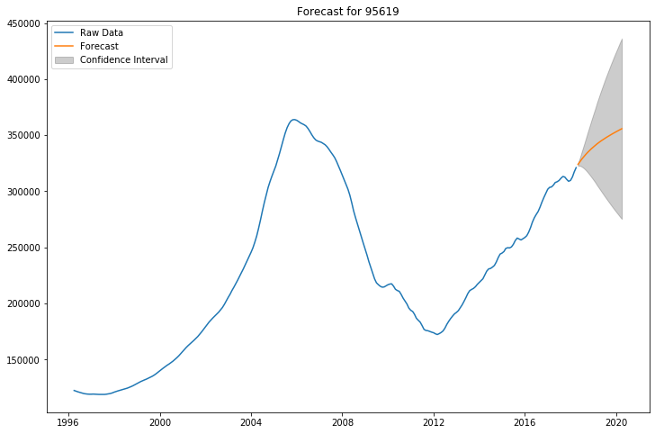


```python
# arima_forecast_enter_pdq(ts, geog_area, city, county, best_cfg, confint=2)
```

(355774.39767052844, 275292.17866495845, 436256.61667609843) (from older notebook)

### Recommendation--Zip code 95619:  potential investment candidate

By the model prediction, I would expect to see a 10.799% change in price by April 1, 2020.
At the lower bound of the confidence interval, I would expect to see a -14.266% change in price by April 1, 2020.
At the upper bound of the confidence interval, I would expect to see a 35.863% change in price by April 1, 2020.


## SacMetro: 95864 (Arden-Arcade) -- Don't invest

### Set up dataframe


```python
geog_area = '95864'
```


```python
city = 'Arden-Arcade'
```


```python
county = 'Sacramento'
```


```python
ts = df_sac.loc[df_sac['Zip'] == geog_area]
```


```python
ts
```


<div>
<style scoped>
    .dataframe tbody tr th:only-of-type {
        vertical-align: middle;
    }

    .dataframe tbody tr th {
        vertical-align: top;
    }

    .dataframe thead th {
        text-align: right;
    }
</style>
<table border="1" class="dataframe">
  <thead>
    <tr style="text-align: right;">
      <th></th>
      <th>Metro</th>
      <th>MetroState</th>
      <th>CountyName</th>
      <th>City</th>
      <th>Zip</th>
      <th>value</th>
    </tr>
    <tr>
      <th>time</th>
      <th></th>
      <th></th>
      <th></th>
      <th></th>
      <th></th>
      <th></th>
    </tr>
  </thead>
  <tbody>
    <tr>
      <td>1996-04-01</td>
      <td>Sacramento</td>
      <td>Sacramento CA</td>
      <td>Sacramento</td>
      <td>Arden-Arcade</td>
      <td>95864</td>
      <td>171200.0</td>
    </tr>
    <tr>
      <td>1996-05-01</td>
      <td>Sacramento</td>
      <td>Sacramento CA</td>
      <td>Sacramento</td>
      <td>Arden-Arcade</td>
      <td>95864</td>
      <td>171200.0</td>
    </tr>
    <tr>
      <td>1996-06-01</td>
      <td>Sacramento</td>
      <td>Sacramento CA</td>
      <td>Sacramento</td>
      <td>Arden-Arcade</td>
      <td>95864</td>
      <td>171300.0</td>
    </tr>
    <tr>
      <td>1996-07-01</td>
      <td>Sacramento</td>
      <td>Sacramento CA</td>
      <td>Sacramento</td>
      <td>Arden-Arcade</td>
      <td>95864</td>
      <td>171500.0</td>
    </tr>
    <tr>
      <td>1996-08-01</td>
      <td>Sacramento</td>
      <td>Sacramento CA</td>
      <td>Sacramento</td>
      <td>Arden-Arcade</td>
      <td>95864</td>
      <td>171800.0</td>
    </tr>
    <tr>
      <td>...</td>
      <td>...</td>
      <td>...</td>
      <td>...</td>
      <td>...</td>
      <td>...</td>
      <td>...</td>
    </tr>
    <tr>
      <td>2017-12-01</td>
      <td>Sacramento</td>
      <td>Sacramento CA</td>
      <td>Sacramento</td>
      <td>Arden-Arcade</td>
      <td>95864</td>
      <td>557500.0</td>
    </tr>
    <tr>
      <td>2018-01-01</td>
      <td>Sacramento</td>
      <td>Sacramento CA</td>
      <td>Sacramento</td>
      <td>Arden-Arcade</td>
      <td>95864</td>
      <td>563300.0</td>
    </tr>
    <tr>
      <td>2018-02-01</td>
      <td>Sacramento</td>
      <td>Sacramento CA</td>
      <td>Sacramento</td>
      <td>Arden-Arcade</td>
      <td>95864</td>
      <td>566100.0</td>
    </tr>
    <tr>
      <td>2018-03-01</td>
      <td>Sacramento</td>
      <td>Sacramento CA</td>
      <td>Sacramento</td>
      <td>Arden-Arcade</td>
      <td>95864</td>
      <td>560800.0</td>
    </tr>
    <tr>
      <td>2018-04-01</td>
      <td>Sacramento</td>
      <td>Sacramento CA</td>
      <td>Sacramento</td>
      <td>Arden-Arcade</td>
      <td>95864</td>
      <td>552700.0</td>
    </tr>
  </tbody>
</table>
<p>265 rows × 6 columns</p>
</div>


### Visualizations


```python
plot_single_geog(df_sac, geog_area, 'value', 'Zip', figsize=(12, 6), fontsize1=12, fontsize2=16)
```


```python
ts.boxplot(column = 'value')
plt.title(geog_area);

```


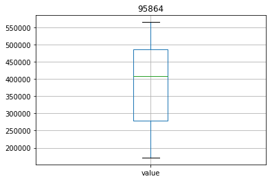


```python
# ts = ts.value

ts_values = ts.value
```


```python
ts_values.head()
```


    time
    1996-04-01    171200.0
    1996-05-01    171200.0
    1996-06-01    171300.0
    1996-07-01    171500.0
    1996-08-01    171800.0
    Name: value, dtype: float64


```python
plot_acf_pacf(ts_values, figsize=(10,6), lags=15)
```


```python
plot_seasonal_decomp(ts_values);
```


### ARIMA parameters tuning


```python
p_values = [0, 1, 2, 4, 6, 8, 10]
d_values = range(0, 3)
q_values = range(0, 3)

```


```python
# order_tuples_95864, mse_results_95864, best_cfg_95864, best_score_95864 = eval_params_and_lists(ts.value, p_values, d_values, q_values)

# Best ARIMA(8, 0, 2) MSE=3682509.198
```

    ARIMA(0, 0, 0) MSE=11465800862.953
    ARIMA(0, 0, 1) MSE=2940822880.688
    ARIMA(0, 1, 0) MSE=23929461.770
    ARIMA(0, 1, 1) MSE=7433799.883
    ARIMA(0, 2, 0) MSE=6012004.342
    ARIMA(0, 2, 1) MSE=4074923.236
    ARIMA(1, 0, 0) MSE=26883874.445
    ARIMA(1, 1, 0) MSE=5831736.800
    ARIMA(1, 1, 2) MSE=3805003.221
    ARIMA(1, 2, 0) MSE=5453394.048
    ARIMA(1, 2, 1) MSE=4203568.617
    ARIMA(2, 0, 2) MSE=3910864.086
    ARIMA(2, 1, 0) MSE=5031320.814
    ARIMA(2, 1, 1) MSE=7577219432856.334
    ARIMA(2, 2, 0) MSE=4083171.553
    ARIMA(2, 2, 1) MSE=3819864.843
    ARIMA(4, 0, 1) MSE=3684873.196
    ARIMA(4, 1, 1) MSE=3726339.204
    ARIMA(4, 2, 0) MSE=3887039.455
    ARIMA(6, 1, 1) MSE=3883878.069
    ARIMA(6, 2, 0) MSE=4030537.232
    ARIMA(8, 0, 1) MSE=3874618.305
    ARIMA(8, 0, 2) MSE=3682509.198
    ARIMA(8, 1, 1) MSE=3860939.933
    ARIMA(8, 2, 0) MSE=3963264.846
    ARIMA(8, 2, 1) MSE=3927913.545
    Best ARIMA(8, 0, 2) MSE=3682509.198


```python
# best_cfg = best_cfg_95864
best_cfg = (8,0,2)
best_cfg
```


    (8, 0, 2)


Best ARIMA(8, 0, 2) MSE=3682509.198

Best ARIMA(4, 1, 1) MSE=1137443.820 (from older notebook)

(526892.1030714705, 405836.1840000962, 647948.0221428449) (forecasted 4/1/2020 results from older notebook)


```python
# results_table_95864 = pd.DataFrame({'Order':order_tuples_95864, 'MSEs':mse_results_95864})  # Best ARIMA(8, 0, 2) MSE=3682509.198
# results_table_95864
```


<div>
<style scoped>
    .dataframe tbody tr th:only-of-type {
        vertical-align: middle;
    }

    .dataframe tbody tr th {
        vertical-align: top;
    }

    .dataframe thead th {
        text-align: right;
    }
</style>
<table border="1" class="dataframe">
  <thead>
    <tr style="text-align: right;">
      <th></th>
      <th>Order</th>
      <th>MSEs</th>
    </tr>
  </thead>
  <tbody>
    <tr>
      <td>0</td>
      <td>(0, 0, 0)</td>
      <td>1.146580e+10</td>
    </tr>
    <tr>
      <td>1</td>
      <td>(0, 0, 1)</td>
      <td>2.940823e+09</td>
    </tr>
    <tr>
      <td>2</td>
      <td>(0, 1, 0)</td>
      <td>2.392946e+07</td>
    </tr>
    <tr>
      <td>3</td>
      <td>(0, 1, 1)</td>
      <td>7.433800e+06</td>
    </tr>
    <tr>
      <td>4</td>
      <td>(0, 2, 0)</td>
      <td>6.012004e+06</td>
    </tr>
    <tr>
      <td>5</td>
      <td>(0, 2, 1)</td>
      <td>4.074923e+06</td>
    </tr>
    <tr>
      <td>6</td>
      <td>(1, 0, 0)</td>
      <td>2.688387e+07</td>
    </tr>
    <tr>
      <td>7</td>
      <td>(1, 1, 0)</td>
      <td>5.831737e+06</td>
    </tr>
    <tr>
      <td>8</td>
      <td>(1, 1, 2)</td>
      <td>3.805003e+06</td>
    </tr>
    <tr>
      <td>9</td>
      <td>(1, 2, 0)</td>
      <td>5.453394e+06</td>
    </tr>
    <tr>
      <td>10</td>
      <td>(1, 2, 1)</td>
      <td>4.203569e+06</td>
    </tr>
    <tr>
      <td>11</td>
      <td>(2, 0, 2)</td>
      <td>3.910864e+06</td>
    </tr>
    <tr>
      <td>12</td>
      <td>(2, 1, 0)</td>
      <td>5.031321e+06</td>
    </tr>
    <tr>
      <td>13</td>
      <td>(2, 1, 1)</td>
      <td>7.577219e+12</td>
    </tr>
    <tr>
      <td>14</td>
      <td>(2, 2, 0)</td>
      <td>4.083172e+06</td>
    </tr>
    <tr>
      <td>15</td>
      <td>(2, 2, 1)</td>
      <td>3.819865e+06</td>
    </tr>
    <tr>
      <td>16</td>
      <td>(4, 0, 1)</td>
      <td>3.684873e+06</td>
    </tr>
    <tr>
      <td>17</td>
      <td>(4, 1, 1)</td>
      <td>3.726339e+06</td>
    </tr>
    <tr>
      <td>18</td>
      <td>(4, 2, 0)</td>
      <td>3.887039e+06</td>
    </tr>
    <tr>
      <td>19</td>
      <td>(6, 1, 1)</td>
      <td>3.883878e+06</td>
    </tr>
    <tr>
      <td>20</td>
      <td>(6, 2, 0)</td>
      <td>4.030537e+06</td>
    </tr>
    <tr>
      <td>21</td>
      <td>(8, 0, 1)</td>
      <td>3.874618e+06</td>
    </tr>
    <tr>
      <td>22</td>
      <td>(8, 0, 2)</td>
      <td>3.682509e+06</td>
    </tr>
    <tr>
      <td>23</td>
      <td>(8, 1, 1)</td>
      <td>3.860940e+06</td>
    </tr>
    <tr>
      <td>24</td>
      <td>(8, 2, 0)</td>
      <td>3.963265e+06</td>
    </tr>
    <tr>
      <td>25</td>
      <td>(8, 2, 1)</td>
      <td>3.927914e+06</td>
    </tr>
  </tbody>
</table>
</div>


### ARIMA modeling and forecasting results


```python
# print_results_lists()   # make sure that the lists are correct to this point
```


```python
# pop_results_lists()
```


```python
# model_95864 = ARIMA(ts.value, best_cfg)
# model_fit_95864 = model_95864.fit(disp=0)
```


```python
# model_fit_95864.summary()
```


<table class="simpletable">
<caption>ARMA Model Results</caption>
<tr>
  <th>Dep. Variable:</th>       <td>value</td>      <th>  No. Observations:  </th>    <td>265</td>   
</tr>
<tr>
  <th>Model:</th>            <td>ARMA(8, 2)</td>    <th>  Log Likelihood     </th> <td>-2246.409</td>
</tr>
<tr>
  <th>Method:</th>             <td>css-mle</td>     <th>  S.D. of innovations</th> <td>1094.652</td> 
</tr>
<tr>
  <th>Date:</th>          <td>Tue, 17 Mar 2020</td> <th>  AIC                </th> <td>4516.817</td> 
</tr>
<tr>
  <th>Time:</th>              <td>12:10:50</td>     <th>  BIC                </th> <td>4559.774</td> 
</tr>
<tr>
  <th>Sample:</th>           <td>04-01-1996</td>    <th>  HQIC               </th> <td>4534.076</td> 
</tr>
<tr>
  <th></th>                 <td>- 04-01-2018</td>   <th>                     </th>     <td> </td>    
</tr>
</table>
<table class="simpletable">
<tr>
       <td></td>          <th>coef</th>     <th>std err</th>      <th>z</th>      <th>P>|z|</th>  <th>[0.025</th>    <th>0.975]</th>  
</tr>
<tr>
  <th>const</th>       <td> 3.746e+05</td> <td> 5.71e+04</td> <td>    6.560</td> <td> 0.000</td> <td> 2.63e+05</td> <td> 4.87e+05</td>
</tr>
<tr>
  <th>ar.L1.value</th> <td>    1.9615</td> <td>    0.000</td> <td> 1.62e+04</td> <td> 0.000</td> <td>    1.961</td> <td>    1.962</td>
</tr>
<tr>
  <th>ar.L2.value</th> <td>   -1.9469</td> <td>    0.000</td> <td>-1.46e+04</td> <td> 0.000</td> <td>   -1.947</td> <td>   -1.947</td>
</tr>
<tr>
  <th>ar.L3.value</th> <td>    2.3012</td> <td> 9.16e-05</td> <td> 2.51e+04</td> <td> 0.000</td> <td>    2.301</td> <td>    2.301</td>
</tr>
<tr>
  <th>ar.L4.value</th> <td>   -2.1101</td> <td> 5.64e-06</td> <td>-3.74e+05</td> <td> 0.000</td> <td>   -2.110</td> <td>   -2.110</td>
</tr>
<tr>
  <th>ar.L5.value</th> <td>    1.2780</td> <td>    0.000</td> <td> 5620.043</td> <td> 0.000</td> <td>    1.278</td> <td>    1.278</td>
</tr>
<tr>
  <th>ar.L6.value</th> <td>   -0.5131</td> <td>    0.000</td> <td>-1191.350</td> <td> 0.000</td> <td>   -0.514</td> <td>   -0.512</td>
</tr>
<tr>
  <th>ar.L7.value</th> <td>   -0.0870</td> <td>    0.000</td> <td> -226.552</td> <td> 0.000</td> <td>   -0.088</td> <td>   -0.086</td>
</tr>
<tr>
  <th>ar.L8.value</th> <td>    0.1136</td> <td>    0.002</td> <td>   64.189</td> <td> 0.000</td> <td>    0.110</td> <td>    0.117</td>
</tr>
<tr>
  <th>ma.L1.value</th> <td>    0.8272</td> <td>    0.037</td> <td>   22.637</td> <td> 0.000</td> <td>    0.756</td> <td>    0.899</td>
</tr>
<tr>
  <th>ma.L2.value</th> <td>    0.8843</td> <td>    0.029</td> <td>   30.736</td> <td> 0.000</td> <td>    0.828</td> <td>    0.941</td>
</tr>
</table>
<table class="simpletable">
<caption>Roots</caption>
<tr>
    <td></td>   <th>            Real</th>  <th>         Imaginary</th> <th>         Modulus</th>  <th>        Frequency</th>
</tr>
<tr>
  <th>AR.1</th> <td>          -0.3748</td> <td>          -0.9271j</td> <td>           1.0000</td> <td>          -0.3111</td>
</tr>
<tr>
  <th>AR.2</th> <td>          -0.3748</td> <td>          +0.9271j</td> <td>           1.0000</td> <td>           0.3111</td>
</tr>
<tr>
  <th>AR.3</th> <td>           0.4265</td> <td>          -1.2267j</td> <td>           1.2988</td> <td>          -0.1967</td>
</tr>
<tr>
  <th>AR.4</th> <td>           0.4265</td> <td>          +1.2267j</td> <td>           1.2988</td> <td>           0.1967</td>
</tr>
<tr>
  <th>AR.5</th> <td>           1.0252</td> <td>          -0.0000j</td> <td>           1.0252</td> <td>          -0.0000</td>
</tr>
<tr>
  <th>AR.6</th> <td>           1.0857</td> <td>          -0.0000j</td> <td>           1.0857</td> <td>          -0.0000</td>
</tr>
<tr>
  <th>AR.7</th> <td>           1.5590</td> <td>          -0.0000j</td> <td>           1.5590</td> <td>          -0.0000</td>
</tr>
<tr>
  <th>AR.8</th> <td>          -3.0072</td> <td>          -0.0000j</td> <td>           3.0072</td> <td>          -0.5000</td>
</tr>
<tr>
  <th>MA.1</th> <td>          -0.4677</td> <td>          -0.9550j</td> <td>           1.0634</td> <td>          -0.3225</td>
</tr>
<tr>
  <th>MA.2</th> <td>          -0.4677</td> <td>          +0.9550j</td> <td>           1.0634</td> <td>           0.3225</td>
</tr>
</table>


```python
# model_fit_95864 = arima_zipcode(ts, best_cfg)
```


```python
# actual_forecast, std_error, forecast_confint = forecast(model_fit_95864, months=24, confint=2)
```


```python
# df_forecast = forecast_df(actual_forecast, forecast_confint, std_error, col = 'time', 
#                 daterange = pd.date_range(start='2018-05-01', end='2020-04-01', freq='MS'))
```


```python
# df_new = concat_values_forecast(ts, df_forecast)
# df_new[100:300]
```


<div>
<style scoped>
    .dataframe tbody tr th:only-of-type {
        vertical-align: middle;
    }

    .dataframe tbody tr th {
        vertical-align: top;
    }

    .dataframe thead th {
        text-align: right;
    }
</style>
<table border="1" class="dataframe">
  <thead>
    <tr style="text-align: right;">
      <th></th>
      <th>City</th>
      <th>CountyName</th>
      <th>Metro</th>
      <th>MetroState</th>
      <th>Zip</th>
      <th>forecast</th>
      <th>forecast_lower</th>
      <th>forecast_upper</th>
      <th>standard error</th>
      <th>value</th>
    </tr>
    <tr>
      <th>time</th>
      <th></th>
      <th></th>
      <th></th>
      <th></th>
      <th></th>
      <th></th>
      <th></th>
      <th></th>
      <th></th>
      <th></th>
    </tr>
  </thead>
  <tbody>
    <tr>
      <td>2004-08-01</td>
      <td>Arden-Arcade</td>
      <td>Sacramento</td>
      <td>Sacramento</td>
      <td>Sacramento CA</td>
      <td>95864</td>
      <td>NaN</td>
      <td>NaN</td>
      <td>NaN</td>
      <td>NaN</td>
      <td>456300.0</td>
    </tr>
    <tr>
      <td>2004-09-01</td>
      <td>Arden-Arcade</td>
      <td>Sacramento</td>
      <td>Sacramento</td>
      <td>Sacramento CA</td>
      <td>95864</td>
      <td>NaN</td>
      <td>NaN</td>
      <td>NaN</td>
      <td>NaN</td>
      <td>468600.0</td>
    </tr>
    <tr>
      <td>2004-10-01</td>
      <td>Arden-Arcade</td>
      <td>Sacramento</td>
      <td>Sacramento</td>
      <td>Sacramento CA</td>
      <td>95864</td>
      <td>NaN</td>
      <td>NaN</td>
      <td>NaN</td>
      <td>NaN</td>
      <td>480400.0</td>
    </tr>
    <tr>
      <td>2004-11-01</td>
      <td>Arden-Arcade</td>
      <td>Sacramento</td>
      <td>Sacramento</td>
      <td>Sacramento CA</td>
      <td>95864</td>
      <td>NaN</td>
      <td>NaN</td>
      <td>NaN</td>
      <td>NaN</td>
      <td>490900.0</td>
    </tr>
    <tr>
      <td>2004-12-01</td>
      <td>Arden-Arcade</td>
      <td>Sacramento</td>
      <td>Sacramento</td>
      <td>Sacramento CA</td>
      <td>95864</td>
      <td>NaN</td>
      <td>NaN</td>
      <td>NaN</td>
      <td>NaN</td>
      <td>499700.0</td>
    </tr>
    <tr>
      <td>2005-01-01</td>
      <td>Arden-Arcade</td>
      <td>Sacramento</td>
      <td>Sacramento</td>
      <td>Sacramento CA</td>
      <td>95864</td>
      <td>NaN</td>
      <td>NaN</td>
      <td>NaN</td>
      <td>NaN</td>
      <td>507100.0</td>
    </tr>
    <tr>
      <td>2005-02-01</td>
      <td>Arden-Arcade</td>
      <td>Sacramento</td>
      <td>Sacramento</td>
      <td>Sacramento CA</td>
      <td>95864</td>
      <td>NaN</td>
      <td>NaN</td>
      <td>NaN</td>
      <td>NaN</td>
      <td>512700.0</td>
    </tr>
    <tr>
      <td>2005-03-01</td>
      <td>Arden-Arcade</td>
      <td>Sacramento</td>
      <td>Sacramento</td>
      <td>Sacramento CA</td>
      <td>95864</td>
      <td>NaN</td>
      <td>NaN</td>
      <td>NaN</td>
      <td>NaN</td>
      <td>517100.0</td>
    </tr>
    <tr>
      <td>2005-04-01</td>
      <td>Arden-Arcade</td>
      <td>Sacramento</td>
      <td>Sacramento</td>
      <td>Sacramento CA</td>
      <td>95864</td>
      <td>NaN</td>
      <td>NaN</td>
      <td>NaN</td>
      <td>NaN</td>
      <td>520200.0</td>
    </tr>
    <tr>
      <td>2005-05-01</td>
      <td>Arden-Arcade</td>
      <td>Sacramento</td>
      <td>Sacramento</td>
      <td>Sacramento CA</td>
      <td>95864</td>
      <td>NaN</td>
      <td>NaN</td>
      <td>NaN</td>
      <td>NaN</td>
      <td>521800.0</td>
    </tr>
    <tr>
      <td>2005-06-01</td>
      <td>Arden-Arcade</td>
      <td>Sacramento</td>
      <td>Sacramento</td>
      <td>Sacramento CA</td>
      <td>95864</td>
      <td>NaN</td>
      <td>NaN</td>
      <td>NaN</td>
      <td>NaN</td>
      <td>522200.0</td>
    </tr>
    <tr>
      <td>2005-07-01</td>
      <td>Arden-Arcade</td>
      <td>Sacramento</td>
      <td>Sacramento</td>
      <td>Sacramento CA</td>
      <td>95864</td>
      <td>NaN</td>
      <td>NaN</td>
      <td>NaN</td>
      <td>NaN</td>
      <td>521600.0</td>
    </tr>
    <tr>
      <td>2005-08-01</td>
      <td>Arden-Arcade</td>
      <td>Sacramento</td>
      <td>Sacramento</td>
      <td>Sacramento CA</td>
      <td>95864</td>
      <td>NaN</td>
      <td>NaN</td>
      <td>NaN</td>
      <td>NaN</td>
      <td>520200.0</td>
    </tr>
    <tr>
      <td>2005-09-01</td>
      <td>Arden-Arcade</td>
      <td>Sacramento</td>
      <td>Sacramento</td>
      <td>Sacramento CA</td>
      <td>95864</td>
      <td>NaN</td>
      <td>NaN</td>
      <td>NaN</td>
      <td>NaN</td>
      <td>518100.0</td>
    </tr>
    <tr>
      <td>2005-10-01</td>
      <td>Arden-Arcade</td>
      <td>Sacramento</td>
      <td>Sacramento</td>
      <td>Sacramento CA</td>
      <td>95864</td>
      <td>NaN</td>
      <td>NaN</td>
      <td>NaN</td>
      <td>NaN</td>
      <td>515600.0</td>
    </tr>
    <tr>
      <td>2005-11-01</td>
      <td>Arden-Arcade</td>
      <td>Sacramento</td>
      <td>Sacramento</td>
      <td>Sacramento CA</td>
      <td>95864</td>
      <td>NaN</td>
      <td>NaN</td>
      <td>NaN</td>
      <td>NaN</td>
      <td>513100.0</td>
    </tr>
    <tr>
      <td>2005-12-01</td>
      <td>Arden-Arcade</td>
      <td>Sacramento</td>
      <td>Sacramento</td>
      <td>Sacramento CA</td>
      <td>95864</td>
      <td>NaN</td>
      <td>NaN</td>
      <td>NaN</td>
      <td>NaN</td>
      <td>511100.0</td>
    </tr>
    <tr>
      <td>2006-01-01</td>
      <td>Arden-Arcade</td>
      <td>Sacramento</td>
      <td>Sacramento</td>
      <td>Sacramento CA</td>
      <td>95864</td>
      <td>NaN</td>
      <td>NaN</td>
      <td>NaN</td>
      <td>NaN</td>
      <td>510300.0</td>
    </tr>
    <tr>
      <td>2006-02-01</td>
      <td>Arden-Arcade</td>
      <td>Sacramento</td>
      <td>Sacramento</td>
      <td>Sacramento CA</td>
      <td>95864</td>
      <td>NaN</td>
      <td>NaN</td>
      <td>NaN</td>
      <td>NaN</td>
      <td>510400.0</td>
    </tr>
    <tr>
      <td>2006-03-01</td>
      <td>Arden-Arcade</td>
      <td>Sacramento</td>
      <td>Sacramento</td>
      <td>Sacramento CA</td>
      <td>95864</td>
      <td>NaN</td>
      <td>NaN</td>
      <td>NaN</td>
      <td>NaN</td>
      <td>511100.0</td>
    </tr>
    <tr>
      <td>2006-04-01</td>
      <td>Arden-Arcade</td>
      <td>Sacramento</td>
      <td>Sacramento</td>
      <td>Sacramento CA</td>
      <td>95864</td>
      <td>NaN</td>
      <td>NaN</td>
      <td>NaN</td>
      <td>NaN</td>
      <td>511900.0</td>
    </tr>
    <tr>
      <td>2006-05-01</td>
      <td>Arden-Arcade</td>
      <td>Sacramento</td>
      <td>Sacramento</td>
      <td>Sacramento CA</td>
      <td>95864</td>
      <td>NaN</td>
      <td>NaN</td>
      <td>NaN</td>
      <td>NaN</td>
      <td>512900.0</td>
    </tr>
    <tr>
      <td>2006-06-01</td>
      <td>Arden-Arcade</td>
      <td>Sacramento</td>
      <td>Sacramento</td>
      <td>Sacramento CA</td>
      <td>95864</td>
      <td>NaN</td>
      <td>NaN</td>
      <td>NaN</td>
      <td>NaN</td>
      <td>514000.0</td>
    </tr>
    <tr>
      <td>2006-07-01</td>
      <td>Arden-Arcade</td>
      <td>Sacramento</td>
      <td>Sacramento</td>
      <td>Sacramento CA</td>
      <td>95864</td>
      <td>NaN</td>
      <td>NaN</td>
      <td>NaN</td>
      <td>NaN</td>
      <td>514800.0</td>
    </tr>
    <tr>
      <td>2006-08-01</td>
      <td>Arden-Arcade</td>
      <td>Sacramento</td>
      <td>Sacramento</td>
      <td>Sacramento CA</td>
      <td>95864</td>
      <td>NaN</td>
      <td>NaN</td>
      <td>NaN</td>
      <td>NaN</td>
      <td>514300.0</td>
    </tr>
    <tr>
      <td>2006-09-01</td>
      <td>Arden-Arcade</td>
      <td>Sacramento</td>
      <td>Sacramento</td>
      <td>Sacramento CA</td>
      <td>95864</td>
      <td>NaN</td>
      <td>NaN</td>
      <td>NaN</td>
      <td>NaN</td>
      <td>512200.0</td>
    </tr>
    <tr>
      <td>2006-10-01</td>
      <td>Arden-Arcade</td>
      <td>Sacramento</td>
      <td>Sacramento</td>
      <td>Sacramento CA</td>
      <td>95864</td>
      <td>NaN</td>
      <td>NaN</td>
      <td>NaN</td>
      <td>NaN</td>
      <td>508700.0</td>
    </tr>
    <tr>
      <td>2006-11-01</td>
      <td>Arden-Arcade</td>
      <td>Sacramento</td>
      <td>Sacramento</td>
      <td>Sacramento CA</td>
      <td>95864</td>
      <td>NaN</td>
      <td>NaN</td>
      <td>NaN</td>
      <td>NaN</td>
      <td>504400.0</td>
    </tr>
    <tr>
      <td>2006-12-01</td>
      <td>Arden-Arcade</td>
      <td>Sacramento</td>
      <td>Sacramento</td>
      <td>Sacramento CA</td>
      <td>95864</td>
      <td>NaN</td>
      <td>NaN</td>
      <td>NaN</td>
      <td>NaN</td>
      <td>500600.0</td>
    </tr>
    <tr>
      <td>2007-01-01</td>
      <td>Arden-Arcade</td>
      <td>Sacramento</td>
      <td>Sacramento</td>
      <td>Sacramento CA</td>
      <td>95864</td>
      <td>NaN</td>
      <td>NaN</td>
      <td>NaN</td>
      <td>NaN</td>
      <td>498600.0</td>
    </tr>
    <tr>
      <td>2007-02-01</td>
      <td>Arden-Arcade</td>
      <td>Sacramento</td>
      <td>Sacramento</td>
      <td>Sacramento CA</td>
      <td>95864</td>
      <td>NaN</td>
      <td>NaN</td>
      <td>NaN</td>
      <td>NaN</td>
      <td>498000.0</td>
    </tr>
    <tr>
      <td>2007-03-01</td>
      <td>Arden-Arcade</td>
      <td>Sacramento</td>
      <td>Sacramento</td>
      <td>Sacramento CA</td>
      <td>95864</td>
      <td>NaN</td>
      <td>NaN</td>
      <td>NaN</td>
      <td>NaN</td>
      <td>498100.0</td>
    </tr>
    <tr>
      <td>2007-04-01</td>
      <td>Arden-Arcade</td>
      <td>Sacramento</td>
      <td>Sacramento</td>
      <td>Sacramento CA</td>
      <td>95864</td>
      <td>NaN</td>
      <td>NaN</td>
      <td>NaN</td>
      <td>NaN</td>
      <td>498200.0</td>
    </tr>
    <tr>
      <td>2007-05-01</td>
      <td>Arden-Arcade</td>
      <td>Sacramento</td>
      <td>Sacramento</td>
      <td>Sacramento CA</td>
      <td>95864</td>
      <td>NaN</td>
      <td>NaN</td>
      <td>NaN</td>
      <td>NaN</td>
      <td>497500.0</td>
    </tr>
    <tr>
      <td>2007-06-01</td>
      <td>Arden-Arcade</td>
      <td>Sacramento</td>
      <td>Sacramento</td>
      <td>Sacramento CA</td>
      <td>95864</td>
      <td>NaN</td>
      <td>NaN</td>
      <td>NaN</td>
      <td>NaN</td>
      <td>496000.0</td>
    </tr>
    <tr>
      <td>2007-07-01</td>
      <td>Arden-Arcade</td>
      <td>Sacramento</td>
      <td>Sacramento</td>
      <td>Sacramento CA</td>
      <td>95864</td>
      <td>NaN</td>
      <td>NaN</td>
      <td>NaN</td>
      <td>NaN</td>
      <td>494100.0</td>
    </tr>
    <tr>
      <td>2007-08-01</td>
      <td>Arden-Arcade</td>
      <td>Sacramento</td>
      <td>Sacramento</td>
      <td>Sacramento CA</td>
      <td>95864</td>
      <td>NaN</td>
      <td>NaN</td>
      <td>NaN</td>
      <td>NaN</td>
      <td>491700.0</td>
    </tr>
    <tr>
      <td>2007-09-01</td>
      <td>Arden-Arcade</td>
      <td>Sacramento</td>
      <td>Sacramento</td>
      <td>Sacramento CA</td>
      <td>95864</td>
      <td>NaN</td>
      <td>NaN</td>
      <td>NaN</td>
      <td>NaN</td>
      <td>488700.0</td>
    </tr>
    <tr>
      <td>2007-10-01</td>
      <td>Arden-Arcade</td>
      <td>Sacramento</td>
      <td>Sacramento</td>
      <td>Sacramento CA</td>
      <td>95864</td>
      <td>NaN</td>
      <td>NaN</td>
      <td>NaN</td>
      <td>NaN</td>
      <td>485100.0</td>
    </tr>
    <tr>
      <td>2007-11-01</td>
      <td>Arden-Arcade</td>
      <td>Sacramento</td>
      <td>Sacramento</td>
      <td>Sacramento CA</td>
      <td>95864</td>
      <td>NaN</td>
      <td>NaN</td>
      <td>NaN</td>
      <td>NaN</td>
      <td>480000.0</td>
    </tr>
    <tr>
      <td>2007-12-01</td>
      <td>Arden-Arcade</td>
      <td>Sacramento</td>
      <td>Sacramento</td>
      <td>Sacramento CA</td>
      <td>95864</td>
      <td>NaN</td>
      <td>NaN</td>
      <td>NaN</td>
      <td>NaN</td>
      <td>473200.0</td>
    </tr>
    <tr>
      <td>2008-01-01</td>
      <td>Arden-Arcade</td>
      <td>Sacramento</td>
      <td>Sacramento</td>
      <td>Sacramento CA</td>
      <td>95864</td>
      <td>NaN</td>
      <td>NaN</td>
      <td>NaN</td>
      <td>NaN</td>
      <td>465800.0</td>
    </tr>
    <tr>
      <td>2008-02-01</td>
      <td>Arden-Arcade</td>
      <td>Sacramento</td>
      <td>Sacramento</td>
      <td>Sacramento CA</td>
      <td>95864</td>
      <td>NaN</td>
      <td>NaN</td>
      <td>NaN</td>
      <td>NaN</td>
      <td>458200.0</td>
    </tr>
    <tr>
      <td>2008-03-01</td>
      <td>Arden-Arcade</td>
      <td>Sacramento</td>
      <td>Sacramento</td>
      <td>Sacramento CA</td>
      <td>95864</td>
      <td>NaN</td>
      <td>NaN</td>
      <td>NaN</td>
      <td>NaN</td>
      <td>450800.0</td>
    </tr>
    <tr>
      <td>2008-04-01</td>
      <td>Arden-Arcade</td>
      <td>Sacramento</td>
      <td>Sacramento</td>
      <td>Sacramento CA</td>
      <td>95864</td>
      <td>NaN</td>
      <td>NaN</td>
      <td>NaN</td>
      <td>NaN</td>
      <td>445000.0</td>
    </tr>
    <tr>
      <td>2008-05-01</td>
      <td>Arden-Arcade</td>
      <td>Sacramento</td>
      <td>Sacramento</td>
      <td>Sacramento CA</td>
      <td>95864</td>
      <td>NaN</td>
      <td>NaN</td>
      <td>NaN</td>
      <td>NaN</td>
      <td>441800.0</td>
    </tr>
    <tr>
      <td>2008-06-01</td>
      <td>Arden-Arcade</td>
      <td>Sacramento</td>
      <td>Sacramento</td>
      <td>Sacramento CA</td>
      <td>95864</td>
      <td>NaN</td>
      <td>NaN</td>
      <td>NaN</td>
      <td>NaN</td>
      <td>441000.0</td>
    </tr>
    <tr>
      <td>2008-07-01</td>
      <td>Arden-Arcade</td>
      <td>Sacramento</td>
      <td>Sacramento</td>
      <td>Sacramento CA</td>
      <td>95864</td>
      <td>NaN</td>
      <td>NaN</td>
      <td>NaN</td>
      <td>NaN</td>
      <td>440800.0</td>
    </tr>
    <tr>
      <td>2008-08-01</td>
      <td>Arden-Arcade</td>
      <td>Sacramento</td>
      <td>Sacramento</td>
      <td>Sacramento CA</td>
      <td>95864</td>
      <td>NaN</td>
      <td>NaN</td>
      <td>NaN</td>
      <td>NaN</td>
      <td>439600.0</td>
    </tr>
    <tr>
      <td>2008-09-01</td>
      <td>Arden-Arcade</td>
      <td>Sacramento</td>
      <td>Sacramento</td>
      <td>Sacramento CA</td>
      <td>95864</td>
      <td>NaN</td>
      <td>NaN</td>
      <td>NaN</td>
      <td>NaN</td>
      <td>438500.0</td>
    </tr>
    <tr>
      <td>2008-10-01</td>
      <td>Arden-Arcade</td>
      <td>Sacramento</td>
      <td>Sacramento</td>
      <td>Sacramento CA</td>
      <td>95864</td>
      <td>NaN</td>
      <td>NaN</td>
      <td>NaN</td>
      <td>NaN</td>
      <td>438700.0</td>
    </tr>
    <tr>
      <td>2008-11-01</td>
      <td>Arden-Arcade</td>
      <td>Sacramento</td>
      <td>Sacramento</td>
      <td>Sacramento CA</td>
      <td>95864</td>
      <td>NaN</td>
      <td>NaN</td>
      <td>NaN</td>
      <td>NaN</td>
      <td>438900.0</td>
    </tr>
    <tr>
      <td>2008-12-01</td>
      <td>Arden-Arcade</td>
      <td>Sacramento</td>
      <td>Sacramento</td>
      <td>Sacramento CA</td>
      <td>95864</td>
      <td>NaN</td>
      <td>NaN</td>
      <td>NaN</td>
      <td>NaN</td>
      <td>439100.0</td>
    </tr>
    <tr>
      <td>2009-01-01</td>
      <td>Arden-Arcade</td>
      <td>Sacramento</td>
      <td>Sacramento</td>
      <td>Sacramento CA</td>
      <td>95864</td>
      <td>NaN</td>
      <td>NaN</td>
      <td>NaN</td>
      <td>NaN</td>
      <td>439900.0</td>
    </tr>
    <tr>
      <td>2009-02-01</td>
      <td>Arden-Arcade</td>
      <td>Sacramento</td>
      <td>Sacramento</td>
      <td>Sacramento CA</td>
      <td>95864</td>
      <td>NaN</td>
      <td>NaN</td>
      <td>NaN</td>
      <td>NaN</td>
      <td>440600.0</td>
    </tr>
    <tr>
      <td>2009-03-01</td>
      <td>Arden-Arcade</td>
      <td>Sacramento</td>
      <td>Sacramento</td>
      <td>Sacramento CA</td>
      <td>95864</td>
      <td>NaN</td>
      <td>NaN</td>
      <td>NaN</td>
      <td>NaN</td>
      <td>439700.0</td>
    </tr>
    <tr>
      <td>2009-04-01</td>
      <td>Arden-Arcade</td>
      <td>Sacramento</td>
      <td>Sacramento</td>
      <td>Sacramento CA</td>
      <td>95864</td>
      <td>NaN</td>
      <td>NaN</td>
      <td>NaN</td>
      <td>NaN</td>
      <td>437100.0</td>
    </tr>
    <tr>
      <td>2009-05-01</td>
      <td>Arden-Arcade</td>
      <td>Sacramento</td>
      <td>Sacramento</td>
      <td>Sacramento CA</td>
      <td>95864</td>
      <td>NaN</td>
      <td>NaN</td>
      <td>NaN</td>
      <td>NaN</td>
      <td>433800.0</td>
    </tr>
    <tr>
      <td>2009-06-01</td>
      <td>Arden-Arcade</td>
      <td>Sacramento</td>
      <td>Sacramento</td>
      <td>Sacramento CA</td>
      <td>95864</td>
      <td>NaN</td>
      <td>NaN</td>
      <td>NaN</td>
      <td>NaN</td>
      <td>429600.0</td>
    </tr>
    <tr>
      <td>2009-07-01</td>
      <td>Arden-Arcade</td>
      <td>Sacramento</td>
      <td>Sacramento</td>
      <td>Sacramento CA</td>
      <td>95864</td>
      <td>NaN</td>
      <td>NaN</td>
      <td>NaN</td>
      <td>NaN</td>
      <td>424000.0</td>
    </tr>
    <tr>
      <td>2009-08-01</td>
      <td>Arden-Arcade</td>
      <td>Sacramento</td>
      <td>Sacramento</td>
      <td>Sacramento CA</td>
      <td>95864</td>
      <td>NaN</td>
      <td>NaN</td>
      <td>NaN</td>
      <td>NaN</td>
      <td>418000.0</td>
    </tr>
    <tr>
      <td>2009-09-01</td>
      <td>Arden-Arcade</td>
      <td>Sacramento</td>
      <td>Sacramento</td>
      <td>Sacramento CA</td>
      <td>95864</td>
      <td>NaN</td>
      <td>NaN</td>
      <td>NaN</td>
      <td>NaN</td>
      <td>413500.0</td>
    </tr>
    <tr>
      <td>2009-10-01</td>
      <td>Arden-Arcade</td>
      <td>Sacramento</td>
      <td>Sacramento</td>
      <td>Sacramento CA</td>
      <td>95864</td>
      <td>NaN</td>
      <td>NaN</td>
      <td>NaN</td>
      <td>NaN</td>
      <td>411100.0</td>
    </tr>
    <tr>
      <td>2009-11-01</td>
      <td>Arden-Arcade</td>
      <td>Sacramento</td>
      <td>Sacramento</td>
      <td>Sacramento CA</td>
      <td>95864</td>
      <td>NaN</td>
      <td>NaN</td>
      <td>NaN</td>
      <td>NaN</td>
      <td>409900.0</td>
    </tr>
    <tr>
      <td>2009-12-01</td>
      <td>Arden-Arcade</td>
      <td>Sacramento</td>
      <td>Sacramento</td>
      <td>Sacramento CA</td>
      <td>95864</td>
      <td>NaN</td>
      <td>NaN</td>
      <td>NaN</td>
      <td>NaN</td>
      <td>409800.0</td>
    </tr>
    <tr>
      <td>2010-01-01</td>
      <td>Arden-Arcade</td>
      <td>Sacramento</td>
      <td>Sacramento</td>
      <td>Sacramento CA</td>
      <td>95864</td>
      <td>NaN</td>
      <td>NaN</td>
      <td>NaN</td>
      <td>NaN</td>
      <td>409000.0</td>
    </tr>
    <tr>
      <td>2010-02-01</td>
      <td>Arden-Arcade</td>
      <td>Sacramento</td>
      <td>Sacramento</td>
      <td>Sacramento CA</td>
      <td>95864</td>
      <td>NaN</td>
      <td>NaN</td>
      <td>NaN</td>
      <td>NaN</td>
      <td>409300.0</td>
    </tr>
    <tr>
      <td>2010-03-01</td>
      <td>Arden-Arcade</td>
      <td>Sacramento</td>
      <td>Sacramento</td>
      <td>Sacramento CA</td>
      <td>95864</td>
      <td>NaN</td>
      <td>NaN</td>
      <td>NaN</td>
      <td>NaN</td>
      <td>409800.0</td>
    </tr>
    <tr>
      <td>2010-04-01</td>
      <td>Arden-Arcade</td>
      <td>Sacramento</td>
      <td>Sacramento</td>
      <td>Sacramento CA</td>
      <td>95864</td>
      <td>NaN</td>
      <td>NaN</td>
      <td>NaN</td>
      <td>NaN</td>
      <td>408100.0</td>
    </tr>
    <tr>
      <td>2010-05-01</td>
      <td>Arden-Arcade</td>
      <td>Sacramento</td>
      <td>Sacramento</td>
      <td>Sacramento CA</td>
      <td>95864</td>
      <td>NaN</td>
      <td>NaN</td>
      <td>NaN</td>
      <td>NaN</td>
      <td>403800.0</td>
    </tr>
    <tr>
      <td>2010-06-01</td>
      <td>Arden-Arcade</td>
      <td>Sacramento</td>
      <td>Sacramento</td>
      <td>Sacramento CA</td>
      <td>95864</td>
      <td>NaN</td>
      <td>NaN</td>
      <td>NaN</td>
      <td>NaN</td>
      <td>397900.0</td>
    </tr>
    <tr>
      <td>2010-07-01</td>
      <td>Arden-Arcade</td>
      <td>Sacramento</td>
      <td>Sacramento</td>
      <td>Sacramento CA</td>
      <td>95864</td>
      <td>NaN</td>
      <td>NaN</td>
      <td>NaN</td>
      <td>NaN</td>
      <td>394200.0</td>
    </tr>
    <tr>
      <td>2010-08-01</td>
      <td>Arden-Arcade</td>
      <td>Sacramento</td>
      <td>Sacramento</td>
      <td>Sacramento CA</td>
      <td>95864</td>
      <td>NaN</td>
      <td>NaN</td>
      <td>NaN</td>
      <td>NaN</td>
      <td>392300.0</td>
    </tr>
    <tr>
      <td>2010-09-01</td>
      <td>Arden-Arcade</td>
      <td>Sacramento</td>
      <td>Sacramento</td>
      <td>Sacramento CA</td>
      <td>95864</td>
      <td>NaN</td>
      <td>NaN</td>
      <td>NaN</td>
      <td>NaN</td>
      <td>388600.0</td>
    </tr>
    <tr>
      <td>2010-10-01</td>
      <td>Arden-Arcade</td>
      <td>Sacramento</td>
      <td>Sacramento</td>
      <td>Sacramento CA</td>
      <td>95864</td>
      <td>NaN</td>
      <td>NaN</td>
      <td>NaN</td>
      <td>NaN</td>
      <td>380600.0</td>
    </tr>
    <tr>
      <td>2010-11-01</td>
      <td>Arden-Arcade</td>
      <td>Sacramento</td>
      <td>Sacramento</td>
      <td>Sacramento CA</td>
      <td>95864</td>
      <td>NaN</td>
      <td>NaN</td>
      <td>NaN</td>
      <td>NaN</td>
      <td>373200.0</td>
    </tr>
    <tr>
      <td>2010-12-01</td>
      <td>Arden-Arcade</td>
      <td>Sacramento</td>
      <td>Sacramento</td>
      <td>Sacramento CA</td>
      <td>95864</td>
      <td>NaN</td>
      <td>NaN</td>
      <td>NaN</td>
      <td>NaN</td>
      <td>367000.0</td>
    </tr>
    <tr>
      <td>2011-01-01</td>
      <td>Arden-Arcade</td>
      <td>Sacramento</td>
      <td>Sacramento</td>
      <td>Sacramento CA</td>
      <td>95864</td>
      <td>NaN</td>
      <td>NaN</td>
      <td>NaN</td>
      <td>NaN</td>
      <td>360700.0</td>
    </tr>
    <tr>
      <td>2011-02-01</td>
      <td>Arden-Arcade</td>
      <td>Sacramento</td>
      <td>Sacramento</td>
      <td>Sacramento CA</td>
      <td>95864</td>
      <td>NaN</td>
      <td>NaN</td>
      <td>NaN</td>
      <td>NaN</td>
      <td>350900.0</td>
    </tr>
    <tr>
      <td>2011-03-01</td>
      <td>Arden-Arcade</td>
      <td>Sacramento</td>
      <td>Sacramento</td>
      <td>Sacramento CA</td>
      <td>95864</td>
      <td>NaN</td>
      <td>NaN</td>
      <td>NaN</td>
      <td>NaN</td>
      <td>341200.0</td>
    </tr>
    <tr>
      <td>2011-04-01</td>
      <td>Arden-Arcade</td>
      <td>Sacramento</td>
      <td>Sacramento</td>
      <td>Sacramento CA</td>
      <td>95864</td>
      <td>NaN</td>
      <td>NaN</td>
      <td>NaN</td>
      <td>NaN</td>
      <td>335500.0</td>
    </tr>
    <tr>
      <td>2011-05-01</td>
      <td>Arden-Arcade</td>
      <td>Sacramento</td>
      <td>Sacramento</td>
      <td>Sacramento CA</td>
      <td>95864</td>
      <td>NaN</td>
      <td>NaN</td>
      <td>NaN</td>
      <td>NaN</td>
      <td>331700.0</td>
    </tr>
    <tr>
      <td>2011-06-01</td>
      <td>Arden-Arcade</td>
      <td>Sacramento</td>
      <td>Sacramento</td>
      <td>Sacramento CA</td>
      <td>95864</td>
      <td>NaN</td>
      <td>NaN</td>
      <td>NaN</td>
      <td>NaN</td>
      <td>328200.0</td>
    </tr>
    <tr>
      <td>2011-07-01</td>
      <td>Arden-Arcade</td>
      <td>Sacramento</td>
      <td>Sacramento</td>
      <td>Sacramento CA</td>
      <td>95864</td>
      <td>NaN</td>
      <td>NaN</td>
      <td>NaN</td>
      <td>NaN</td>
      <td>324400.0</td>
    </tr>
    <tr>
      <td>2011-08-01</td>
      <td>Arden-Arcade</td>
      <td>Sacramento</td>
      <td>Sacramento</td>
      <td>Sacramento CA</td>
      <td>95864</td>
      <td>NaN</td>
      <td>NaN</td>
      <td>NaN</td>
      <td>NaN</td>
      <td>320500.0</td>
    </tr>
    <tr>
      <td>2011-09-01</td>
      <td>Arden-Arcade</td>
      <td>Sacramento</td>
      <td>Sacramento</td>
      <td>Sacramento CA</td>
      <td>95864</td>
      <td>NaN</td>
      <td>NaN</td>
      <td>NaN</td>
      <td>NaN</td>
      <td>316200.0</td>
    </tr>
    <tr>
      <td>2011-10-01</td>
      <td>Arden-Arcade</td>
      <td>Sacramento</td>
      <td>Sacramento</td>
      <td>Sacramento CA</td>
      <td>95864</td>
      <td>NaN</td>
      <td>NaN</td>
      <td>NaN</td>
      <td>NaN</td>
      <td>314000.0</td>
    </tr>
    <tr>
      <td>2011-11-01</td>
      <td>Arden-Arcade</td>
      <td>Sacramento</td>
      <td>Sacramento</td>
      <td>Sacramento CA</td>
      <td>95864</td>
      <td>NaN</td>
      <td>NaN</td>
      <td>NaN</td>
      <td>NaN</td>
      <td>314000.0</td>
    </tr>
    <tr>
      <td>2011-12-01</td>
      <td>Arden-Arcade</td>
      <td>Sacramento</td>
      <td>Sacramento</td>
      <td>Sacramento CA</td>
      <td>95864</td>
      <td>NaN</td>
      <td>NaN</td>
      <td>NaN</td>
      <td>NaN</td>
      <td>315200.0</td>
    </tr>
    <tr>
      <td>2012-01-01</td>
      <td>Arden-Arcade</td>
      <td>Sacramento</td>
      <td>Sacramento</td>
      <td>Sacramento CA</td>
      <td>95864</td>
      <td>NaN</td>
      <td>NaN</td>
      <td>NaN</td>
      <td>NaN</td>
      <td>316100.0</td>
    </tr>
    <tr>
      <td>2012-02-01</td>
      <td>Arden-Arcade</td>
      <td>Sacramento</td>
      <td>Sacramento</td>
      <td>Sacramento CA</td>
      <td>95864</td>
      <td>NaN</td>
      <td>NaN</td>
      <td>NaN</td>
      <td>NaN</td>
      <td>316100.0</td>
    </tr>
    <tr>
      <td>2012-03-01</td>
      <td>Arden-Arcade</td>
      <td>Sacramento</td>
      <td>Sacramento</td>
      <td>Sacramento CA</td>
      <td>95864</td>
      <td>NaN</td>
      <td>NaN</td>
      <td>NaN</td>
      <td>NaN</td>
      <td>315100.0</td>
    </tr>
    <tr>
      <td>2012-04-01</td>
      <td>Arden-Arcade</td>
      <td>Sacramento</td>
      <td>Sacramento</td>
      <td>Sacramento CA</td>
      <td>95864</td>
      <td>NaN</td>
      <td>NaN</td>
      <td>NaN</td>
      <td>NaN</td>
      <td>313600.0</td>
    </tr>
    <tr>
      <td>2012-05-01</td>
      <td>Arden-Arcade</td>
      <td>Sacramento</td>
      <td>Sacramento</td>
      <td>Sacramento CA</td>
      <td>95864</td>
      <td>NaN</td>
      <td>NaN</td>
      <td>NaN</td>
      <td>NaN</td>
      <td>315100.0</td>
    </tr>
    <tr>
      <td>2012-06-01</td>
      <td>Arden-Arcade</td>
      <td>Sacramento</td>
      <td>Sacramento</td>
      <td>Sacramento CA</td>
      <td>95864</td>
      <td>NaN</td>
      <td>NaN</td>
      <td>NaN</td>
      <td>NaN</td>
      <td>317500.0</td>
    </tr>
    <tr>
      <td>2012-07-01</td>
      <td>Arden-Arcade</td>
      <td>Sacramento</td>
      <td>Sacramento</td>
      <td>Sacramento CA</td>
      <td>95864</td>
      <td>NaN</td>
      <td>NaN</td>
      <td>NaN</td>
      <td>NaN</td>
      <td>319600.0</td>
    </tr>
    <tr>
      <td>2012-08-01</td>
      <td>Arden-Arcade</td>
      <td>Sacramento</td>
      <td>Sacramento</td>
      <td>Sacramento CA</td>
      <td>95864</td>
      <td>NaN</td>
      <td>NaN</td>
      <td>NaN</td>
      <td>NaN</td>
      <td>322300.0</td>
    </tr>
    <tr>
      <td>2012-09-01</td>
      <td>Arden-Arcade</td>
      <td>Sacramento</td>
      <td>Sacramento</td>
      <td>Sacramento CA</td>
      <td>95864</td>
      <td>NaN</td>
      <td>NaN</td>
      <td>NaN</td>
      <td>NaN</td>
      <td>328500.0</td>
    </tr>
    <tr>
      <td>2012-10-01</td>
      <td>Arden-Arcade</td>
      <td>Sacramento</td>
      <td>Sacramento</td>
      <td>Sacramento CA</td>
      <td>95864</td>
      <td>NaN</td>
      <td>NaN</td>
      <td>NaN</td>
      <td>NaN</td>
      <td>337700.0</td>
    </tr>
    <tr>
      <td>2012-11-01</td>
      <td>Arden-Arcade</td>
      <td>Sacramento</td>
      <td>Sacramento</td>
      <td>Sacramento CA</td>
      <td>95864</td>
      <td>NaN</td>
      <td>NaN</td>
      <td>NaN</td>
      <td>NaN</td>
      <td>347300.0</td>
    </tr>
    <tr>
      <td>2012-12-01</td>
      <td>Arden-Arcade</td>
      <td>Sacramento</td>
      <td>Sacramento</td>
      <td>Sacramento CA</td>
      <td>95864</td>
      <td>NaN</td>
      <td>NaN</td>
      <td>NaN</td>
      <td>NaN</td>
      <td>355200.0</td>
    </tr>
    <tr>
      <td>2013-01-01</td>
      <td>Arden-Arcade</td>
      <td>Sacramento</td>
      <td>Sacramento</td>
      <td>Sacramento CA</td>
      <td>95864</td>
      <td>NaN</td>
      <td>NaN</td>
      <td>NaN</td>
      <td>NaN</td>
      <td>361200.0</td>
    </tr>
    <tr>
      <td>2013-02-01</td>
      <td>Arden-Arcade</td>
      <td>Sacramento</td>
      <td>Sacramento</td>
      <td>Sacramento CA</td>
      <td>95864</td>
      <td>NaN</td>
      <td>NaN</td>
      <td>NaN</td>
      <td>NaN</td>
      <td>370300.0</td>
    </tr>
    <tr>
      <td>2013-03-01</td>
      <td>Arden-Arcade</td>
      <td>Sacramento</td>
      <td>Sacramento</td>
      <td>Sacramento CA</td>
      <td>95864</td>
      <td>NaN</td>
      <td>NaN</td>
      <td>NaN</td>
      <td>NaN</td>
      <td>384200.0</td>
    </tr>
    <tr>
      <td>2013-04-01</td>
      <td>Arden-Arcade</td>
      <td>Sacramento</td>
      <td>Sacramento</td>
      <td>Sacramento CA</td>
      <td>95864</td>
      <td>NaN</td>
      <td>NaN</td>
      <td>NaN</td>
      <td>NaN</td>
      <td>398200.0</td>
    </tr>
    <tr>
      <td>2013-05-01</td>
      <td>Arden-Arcade</td>
      <td>Sacramento</td>
      <td>Sacramento</td>
      <td>Sacramento CA</td>
      <td>95864</td>
      <td>NaN</td>
      <td>NaN</td>
      <td>NaN</td>
      <td>NaN</td>
      <td>408300.0</td>
    </tr>
    <tr>
      <td>2013-06-01</td>
      <td>Arden-Arcade</td>
      <td>Sacramento</td>
      <td>Sacramento</td>
      <td>Sacramento CA</td>
      <td>95864</td>
      <td>NaN</td>
      <td>NaN</td>
      <td>NaN</td>
      <td>NaN</td>
      <td>418300.0</td>
    </tr>
    <tr>
      <td>2013-07-01</td>
      <td>Arden-Arcade</td>
      <td>Sacramento</td>
      <td>Sacramento</td>
      <td>Sacramento CA</td>
      <td>95864</td>
      <td>NaN</td>
      <td>NaN</td>
      <td>NaN</td>
      <td>NaN</td>
      <td>427200.0</td>
    </tr>
    <tr>
      <td>2013-08-01</td>
      <td>Arden-Arcade</td>
      <td>Sacramento</td>
      <td>Sacramento</td>
      <td>Sacramento CA</td>
      <td>95864</td>
      <td>NaN</td>
      <td>NaN</td>
      <td>NaN</td>
      <td>NaN</td>
      <td>433000.0</td>
    </tr>
    <tr>
      <td>2013-09-01</td>
      <td>Arden-Arcade</td>
      <td>Sacramento</td>
      <td>Sacramento</td>
      <td>Sacramento CA</td>
      <td>95864</td>
      <td>NaN</td>
      <td>NaN</td>
      <td>NaN</td>
      <td>NaN</td>
      <td>434700.0</td>
    </tr>
    <tr>
      <td>2013-10-01</td>
      <td>Arden-Arcade</td>
      <td>Sacramento</td>
      <td>Sacramento</td>
      <td>Sacramento CA</td>
      <td>95864</td>
      <td>NaN</td>
      <td>NaN</td>
      <td>NaN</td>
      <td>NaN</td>
      <td>433800.0</td>
    </tr>
    <tr>
      <td>2013-11-01</td>
      <td>Arden-Arcade</td>
      <td>Sacramento</td>
      <td>Sacramento</td>
      <td>Sacramento CA</td>
      <td>95864</td>
      <td>NaN</td>
      <td>NaN</td>
      <td>NaN</td>
      <td>NaN</td>
      <td>432900.0</td>
    </tr>
    <tr>
      <td>2013-12-01</td>
      <td>Arden-Arcade</td>
      <td>Sacramento</td>
      <td>Sacramento</td>
      <td>Sacramento CA</td>
      <td>95864</td>
      <td>NaN</td>
      <td>NaN</td>
      <td>NaN</td>
      <td>NaN</td>
      <td>433900.0</td>
    </tr>
    <tr>
      <td>2014-01-01</td>
      <td>Arden-Arcade</td>
      <td>Sacramento</td>
      <td>Sacramento</td>
      <td>Sacramento CA</td>
      <td>95864</td>
      <td>NaN</td>
      <td>NaN</td>
      <td>NaN</td>
      <td>NaN</td>
      <td>436600.0</td>
    </tr>
    <tr>
      <td>2014-02-01</td>
      <td>Arden-Arcade</td>
      <td>Sacramento</td>
      <td>Sacramento</td>
      <td>Sacramento CA</td>
      <td>95864</td>
      <td>NaN</td>
      <td>NaN</td>
      <td>NaN</td>
      <td>NaN</td>
      <td>438600.0</td>
    </tr>
    <tr>
      <td>2014-03-01</td>
      <td>Arden-Arcade</td>
      <td>Sacramento</td>
      <td>Sacramento</td>
      <td>Sacramento CA</td>
      <td>95864</td>
      <td>NaN</td>
      <td>NaN</td>
      <td>NaN</td>
      <td>NaN</td>
      <td>438500.0</td>
    </tr>
    <tr>
      <td>2014-04-01</td>
      <td>Arden-Arcade</td>
      <td>Sacramento</td>
      <td>Sacramento</td>
      <td>Sacramento CA</td>
      <td>95864</td>
      <td>NaN</td>
      <td>NaN</td>
      <td>NaN</td>
      <td>NaN</td>
      <td>438900.0</td>
    </tr>
    <tr>
      <td>2014-05-01</td>
      <td>Arden-Arcade</td>
      <td>Sacramento</td>
      <td>Sacramento</td>
      <td>Sacramento CA</td>
      <td>95864</td>
      <td>NaN</td>
      <td>NaN</td>
      <td>NaN</td>
      <td>NaN</td>
      <td>440100.0</td>
    </tr>
    <tr>
      <td>2014-06-01</td>
      <td>Arden-Arcade</td>
      <td>Sacramento</td>
      <td>Sacramento</td>
      <td>Sacramento CA</td>
      <td>95864</td>
      <td>NaN</td>
      <td>NaN</td>
      <td>NaN</td>
      <td>NaN</td>
      <td>439100.0</td>
    </tr>
    <tr>
      <td>2014-07-01</td>
      <td>Arden-Arcade</td>
      <td>Sacramento</td>
      <td>Sacramento</td>
      <td>Sacramento CA</td>
      <td>95864</td>
      <td>NaN</td>
      <td>NaN</td>
      <td>NaN</td>
      <td>NaN</td>
      <td>438800.0</td>
    </tr>
    <tr>
      <td>2014-08-01</td>
      <td>Arden-Arcade</td>
      <td>Sacramento</td>
      <td>Sacramento</td>
      <td>Sacramento CA</td>
      <td>95864</td>
      <td>NaN</td>
      <td>NaN</td>
      <td>NaN</td>
      <td>NaN</td>
      <td>443400.0</td>
    </tr>
    <tr>
      <td>2014-09-01</td>
      <td>Arden-Arcade</td>
      <td>Sacramento</td>
      <td>Sacramento</td>
      <td>Sacramento CA</td>
      <td>95864</td>
      <td>NaN</td>
      <td>NaN</td>
      <td>NaN</td>
      <td>NaN</td>
      <td>451200.0</td>
    </tr>
    <tr>
      <td>2014-10-01</td>
      <td>Arden-Arcade</td>
      <td>Sacramento</td>
      <td>Sacramento</td>
      <td>Sacramento CA</td>
      <td>95864</td>
      <td>NaN</td>
      <td>NaN</td>
      <td>NaN</td>
      <td>NaN</td>
      <td>457000.0</td>
    </tr>
    <tr>
      <td>2014-11-01</td>
      <td>Arden-Arcade</td>
      <td>Sacramento</td>
      <td>Sacramento</td>
      <td>Sacramento CA</td>
      <td>95864</td>
      <td>NaN</td>
      <td>NaN</td>
      <td>NaN</td>
      <td>NaN</td>
      <td>457500.0</td>
    </tr>
    <tr>
      <td>2014-12-01</td>
      <td>Arden-Arcade</td>
      <td>Sacramento</td>
      <td>Sacramento</td>
      <td>Sacramento CA</td>
      <td>95864</td>
      <td>NaN</td>
      <td>NaN</td>
      <td>NaN</td>
      <td>NaN</td>
      <td>455000.0</td>
    </tr>
    <tr>
      <td>2015-01-01</td>
      <td>Arden-Arcade</td>
      <td>Sacramento</td>
      <td>Sacramento</td>
      <td>Sacramento CA</td>
      <td>95864</td>
      <td>NaN</td>
      <td>NaN</td>
      <td>NaN</td>
      <td>NaN</td>
      <td>454100.0</td>
    </tr>
    <tr>
      <td>2015-02-01</td>
      <td>Arden-Arcade</td>
      <td>Sacramento</td>
      <td>Sacramento</td>
      <td>Sacramento CA</td>
      <td>95864</td>
      <td>NaN</td>
      <td>NaN</td>
      <td>NaN</td>
      <td>NaN</td>
      <td>457900.0</td>
    </tr>
    <tr>
      <td>2015-03-01</td>
      <td>Arden-Arcade</td>
      <td>Sacramento</td>
      <td>Sacramento</td>
      <td>Sacramento CA</td>
      <td>95864</td>
      <td>NaN</td>
      <td>NaN</td>
      <td>NaN</td>
      <td>NaN</td>
      <td>464800.0</td>
    </tr>
    <tr>
      <td>2015-04-01</td>
      <td>Arden-Arcade</td>
      <td>Sacramento</td>
      <td>Sacramento</td>
      <td>Sacramento CA</td>
      <td>95864</td>
      <td>NaN</td>
      <td>NaN</td>
      <td>NaN</td>
      <td>NaN</td>
      <td>471500.0</td>
    </tr>
    <tr>
      <td>2015-05-01</td>
      <td>Arden-Arcade</td>
      <td>Sacramento</td>
      <td>Sacramento</td>
      <td>Sacramento CA</td>
      <td>95864</td>
      <td>NaN</td>
      <td>NaN</td>
      <td>NaN</td>
      <td>NaN</td>
      <td>477000.0</td>
    </tr>
    <tr>
      <td>2015-06-01</td>
      <td>Arden-Arcade</td>
      <td>Sacramento</td>
      <td>Sacramento</td>
      <td>Sacramento CA</td>
      <td>95864</td>
      <td>NaN</td>
      <td>NaN</td>
      <td>NaN</td>
      <td>NaN</td>
      <td>480900.0</td>
    </tr>
    <tr>
      <td>2015-07-01</td>
      <td>Arden-Arcade</td>
      <td>Sacramento</td>
      <td>Sacramento</td>
      <td>Sacramento CA</td>
      <td>95864</td>
      <td>NaN</td>
      <td>NaN</td>
      <td>NaN</td>
      <td>NaN</td>
      <td>483400.0</td>
    </tr>
    <tr>
      <td>2015-08-01</td>
      <td>Arden-Arcade</td>
      <td>Sacramento</td>
      <td>Sacramento</td>
      <td>Sacramento CA</td>
      <td>95864</td>
      <td>NaN</td>
      <td>NaN</td>
      <td>NaN</td>
      <td>NaN</td>
      <td>485200.0</td>
    </tr>
    <tr>
      <td>2015-09-01</td>
      <td>Arden-Arcade</td>
      <td>Sacramento</td>
      <td>Sacramento</td>
      <td>Sacramento CA</td>
      <td>95864</td>
      <td>NaN</td>
      <td>NaN</td>
      <td>NaN</td>
      <td>NaN</td>
      <td>487000.0</td>
    </tr>
    <tr>
      <td>2015-10-01</td>
      <td>Arden-Arcade</td>
      <td>Sacramento</td>
      <td>Sacramento</td>
      <td>Sacramento CA</td>
      <td>95864</td>
      <td>NaN</td>
      <td>NaN</td>
      <td>NaN</td>
      <td>NaN</td>
      <td>487000.0</td>
    </tr>
    <tr>
      <td>2015-11-01</td>
      <td>Arden-Arcade</td>
      <td>Sacramento</td>
      <td>Sacramento</td>
      <td>Sacramento CA</td>
      <td>95864</td>
      <td>NaN</td>
      <td>NaN</td>
      <td>NaN</td>
      <td>NaN</td>
      <td>488500.0</td>
    </tr>
    <tr>
      <td>2015-12-01</td>
      <td>Arden-Arcade</td>
      <td>Sacramento</td>
      <td>Sacramento</td>
      <td>Sacramento CA</td>
      <td>95864</td>
      <td>NaN</td>
      <td>NaN</td>
      <td>NaN</td>
      <td>NaN</td>
      <td>489800.0</td>
    </tr>
    <tr>
      <td>2016-01-01</td>
      <td>Arden-Arcade</td>
      <td>Sacramento</td>
      <td>Sacramento</td>
      <td>Sacramento CA</td>
      <td>95864</td>
      <td>NaN</td>
      <td>NaN</td>
      <td>NaN</td>
      <td>NaN</td>
      <td>488800.0</td>
    </tr>
    <tr>
      <td>2016-02-01</td>
      <td>Arden-Arcade</td>
      <td>Sacramento</td>
      <td>Sacramento</td>
      <td>Sacramento CA</td>
      <td>95864</td>
      <td>NaN</td>
      <td>NaN</td>
      <td>NaN</td>
      <td>NaN</td>
      <td>488000.0</td>
    </tr>
    <tr>
      <td>2016-03-01</td>
      <td>Arden-Arcade</td>
      <td>Sacramento</td>
      <td>Sacramento</td>
      <td>Sacramento CA</td>
      <td>95864</td>
      <td>NaN</td>
      <td>NaN</td>
      <td>NaN</td>
      <td>NaN</td>
      <td>489700.0</td>
    </tr>
    <tr>
      <td>2016-04-01</td>
      <td>Arden-Arcade</td>
      <td>Sacramento</td>
      <td>Sacramento</td>
      <td>Sacramento CA</td>
      <td>95864</td>
      <td>NaN</td>
      <td>NaN</td>
      <td>NaN</td>
      <td>NaN</td>
      <td>491400.0</td>
    </tr>
    <tr>
      <td>2016-05-01</td>
      <td>Arden-Arcade</td>
      <td>Sacramento</td>
      <td>Sacramento</td>
      <td>Sacramento CA</td>
      <td>95864</td>
      <td>NaN</td>
      <td>NaN</td>
      <td>NaN</td>
      <td>NaN</td>
      <td>491500.0</td>
    </tr>
    <tr>
      <td>2016-06-01</td>
      <td>Arden-Arcade</td>
      <td>Sacramento</td>
      <td>Sacramento</td>
      <td>Sacramento CA</td>
      <td>95864</td>
      <td>NaN</td>
      <td>NaN</td>
      <td>NaN</td>
      <td>NaN</td>
      <td>493000.0</td>
    </tr>
    <tr>
      <td>2016-07-01</td>
      <td>Arden-Arcade</td>
      <td>Sacramento</td>
      <td>Sacramento</td>
      <td>Sacramento CA</td>
      <td>95864</td>
      <td>NaN</td>
      <td>NaN</td>
      <td>NaN</td>
      <td>NaN</td>
      <td>495800.0</td>
    </tr>
    <tr>
      <td>2016-08-01</td>
      <td>Arden-Arcade</td>
      <td>Sacramento</td>
      <td>Sacramento</td>
      <td>Sacramento CA</td>
      <td>95864</td>
      <td>NaN</td>
      <td>NaN</td>
      <td>NaN</td>
      <td>NaN</td>
      <td>498700.0</td>
    </tr>
    <tr>
      <td>2016-09-01</td>
      <td>Arden-Arcade</td>
      <td>Sacramento</td>
      <td>Sacramento</td>
      <td>Sacramento CA</td>
      <td>95864</td>
      <td>NaN</td>
      <td>NaN</td>
      <td>NaN</td>
      <td>NaN</td>
      <td>500600.0</td>
    </tr>
    <tr>
      <td>2016-10-01</td>
      <td>Arden-Arcade</td>
      <td>Sacramento</td>
      <td>Sacramento</td>
      <td>Sacramento CA</td>
      <td>95864</td>
      <td>NaN</td>
      <td>NaN</td>
      <td>NaN</td>
      <td>NaN</td>
      <td>502300.0</td>
    </tr>
    <tr>
      <td>2016-11-01</td>
      <td>Arden-Arcade</td>
      <td>Sacramento</td>
      <td>Sacramento</td>
      <td>Sacramento CA</td>
      <td>95864</td>
      <td>NaN</td>
      <td>NaN</td>
      <td>NaN</td>
      <td>NaN</td>
      <td>500800.0</td>
    </tr>
    <tr>
      <td>2016-12-01</td>
      <td>Arden-Arcade</td>
      <td>Sacramento</td>
      <td>Sacramento</td>
      <td>Sacramento CA</td>
      <td>95864</td>
      <td>NaN</td>
      <td>NaN</td>
      <td>NaN</td>
      <td>NaN</td>
      <td>500000.0</td>
    </tr>
    <tr>
      <td>2017-01-01</td>
      <td>Arden-Arcade</td>
      <td>Sacramento</td>
      <td>Sacramento</td>
      <td>Sacramento CA</td>
      <td>95864</td>
      <td>NaN</td>
      <td>NaN</td>
      <td>NaN</td>
      <td>NaN</td>
      <td>503100.0</td>
    </tr>
    <tr>
      <td>2017-02-01</td>
      <td>Arden-Arcade</td>
      <td>Sacramento</td>
      <td>Sacramento</td>
      <td>Sacramento CA</td>
      <td>95864</td>
      <td>NaN</td>
      <td>NaN</td>
      <td>NaN</td>
      <td>NaN</td>
      <td>507500.0</td>
    </tr>
    <tr>
      <td>2017-03-01</td>
      <td>Arden-Arcade</td>
      <td>Sacramento</td>
      <td>Sacramento</td>
      <td>Sacramento CA</td>
      <td>95864</td>
      <td>NaN</td>
      <td>NaN</td>
      <td>NaN</td>
      <td>NaN</td>
      <td>510800.0</td>
    </tr>
    <tr>
      <td>2017-04-01</td>
      <td>Arden-Arcade</td>
      <td>Sacramento</td>
      <td>Sacramento</td>
      <td>Sacramento CA</td>
      <td>95864</td>
      <td>NaN</td>
      <td>NaN</td>
      <td>NaN</td>
      <td>NaN</td>
      <td>514400.0</td>
    </tr>
    <tr>
      <td>2017-05-01</td>
      <td>Arden-Arcade</td>
      <td>Sacramento</td>
      <td>Sacramento</td>
      <td>Sacramento CA</td>
      <td>95864</td>
      <td>NaN</td>
      <td>NaN</td>
      <td>NaN</td>
      <td>NaN</td>
      <td>518500.0</td>
    </tr>
    <tr>
      <td>2017-06-01</td>
      <td>Arden-Arcade</td>
      <td>Sacramento</td>
      <td>Sacramento</td>
      <td>Sacramento CA</td>
      <td>95864</td>
      <td>NaN</td>
      <td>NaN</td>
      <td>NaN</td>
      <td>NaN</td>
      <td>525700.0</td>
    </tr>
    <tr>
      <td>2017-07-01</td>
      <td>Arden-Arcade</td>
      <td>Sacramento</td>
      <td>Sacramento</td>
      <td>Sacramento CA</td>
      <td>95864</td>
      <td>NaN</td>
      <td>NaN</td>
      <td>NaN</td>
      <td>NaN</td>
      <td>534300.0</td>
    </tr>
    <tr>
      <td>2017-08-01</td>
      <td>Arden-Arcade</td>
      <td>Sacramento</td>
      <td>Sacramento</td>
      <td>Sacramento CA</td>
      <td>95864</td>
      <td>NaN</td>
      <td>NaN</td>
      <td>NaN</td>
      <td>NaN</td>
      <td>537300.0</td>
    </tr>
    <tr>
      <td>2017-09-01</td>
      <td>Arden-Arcade</td>
      <td>Sacramento</td>
      <td>Sacramento</td>
      <td>Sacramento CA</td>
      <td>95864</td>
      <td>NaN</td>
      <td>NaN</td>
      <td>NaN</td>
      <td>NaN</td>
      <td>537800.0</td>
    </tr>
    <tr>
      <td>2017-10-01</td>
      <td>Arden-Arcade</td>
      <td>Sacramento</td>
      <td>Sacramento</td>
      <td>Sacramento CA</td>
      <td>95864</td>
      <td>NaN</td>
      <td>NaN</td>
      <td>NaN</td>
      <td>NaN</td>
      <td>543600.0</td>
    </tr>
    <tr>
      <td>2017-11-01</td>
      <td>Arden-Arcade</td>
      <td>Sacramento</td>
      <td>Sacramento</td>
      <td>Sacramento CA</td>
      <td>95864</td>
      <td>NaN</td>
      <td>NaN</td>
      <td>NaN</td>
      <td>NaN</td>
      <td>551800.0</td>
    </tr>
    <tr>
      <td>2017-12-01</td>
      <td>Arden-Arcade</td>
      <td>Sacramento</td>
      <td>Sacramento</td>
      <td>Sacramento CA</td>
      <td>95864</td>
      <td>NaN</td>
      <td>NaN</td>
      <td>NaN</td>
      <td>NaN</td>
      <td>557500.0</td>
    </tr>
    <tr>
      <td>2018-01-01</td>
      <td>Arden-Arcade</td>
      <td>Sacramento</td>
      <td>Sacramento</td>
      <td>Sacramento CA</td>
      <td>95864</td>
      <td>NaN</td>
      <td>NaN</td>
      <td>NaN</td>
      <td>NaN</td>
      <td>563300.0</td>
    </tr>
    <tr>
      <td>2018-02-01</td>
      <td>Arden-Arcade</td>
      <td>Sacramento</td>
      <td>Sacramento</td>
      <td>Sacramento CA</td>
      <td>95864</td>
      <td>NaN</td>
      <td>NaN</td>
      <td>NaN</td>
      <td>NaN</td>
      <td>566100.0</td>
    </tr>
    <tr>
      <td>2018-03-01</td>
      <td>Arden-Arcade</td>
      <td>Sacramento</td>
      <td>Sacramento</td>
      <td>Sacramento CA</td>
      <td>95864</td>
      <td>NaN</td>
      <td>NaN</td>
      <td>NaN</td>
      <td>NaN</td>
      <td>560800.0</td>
    </tr>
    <tr>
      <td>2018-04-01</td>
      <td>Arden-Arcade</td>
      <td>Sacramento</td>
      <td>Sacramento</td>
      <td>Sacramento CA</td>
      <td>95864</td>
      <td>NaN</td>
      <td>NaN</td>
      <td>NaN</td>
      <td>NaN</td>
      <td>552700.0</td>
    </tr>
    <tr>
      <td>2018-05-01</td>
      <td>NaN</td>
      <td>NaN</td>
      <td>NaN</td>
      <td>NaN</td>
      <td>NaN</td>
      <td>547392.617595</td>
      <td>545247.138430</td>
      <td>549538.096761</td>
      <td>1094.652342</td>
      <td>NaN</td>
    </tr>
    <tr>
      <td>2018-06-01</td>
      <td>NaN</td>
      <td>NaN</td>
      <td>NaN</td>
      <td>NaN</td>
      <td>NaN</td>
      <td>541495.742902</td>
      <td>535139.524317</td>
      <td>547851.961487</td>
      <td>3243.028257</td>
      <td>NaN</td>
    </tr>
    <tr>
      <td>2018-07-01</td>
      <td>NaN</td>
      <td>NaN</td>
      <td>NaN</td>
      <td>NaN</td>
      <td>NaN</td>
      <td>534636.927708</td>
      <td>523242.814247</td>
      <td>546031.041169</td>
      <td>5813.430018</td>
      <td>NaN</td>
    </tr>
    <tr>
      <td>2018-08-01</td>
      <td>NaN</td>
      <td>NaN</td>
      <td>NaN</td>
      <td>NaN</td>
      <td>NaN</td>
      <td>529474.756202</td>
      <td>513044.410444</td>
      <td>545905.101960</td>
      <td>8382.983508</td>
      <td>NaN</td>
    </tr>
    <tr>
      <td>2018-09-01</td>
      <td>NaN</td>
      <td>NaN</td>
      <td>NaN</td>
      <td>NaN</td>
      <td>NaN</td>
      <td>523114.502120</td>
      <td>501495.524716</td>
      <td>544733.479523</td>
      <td>11030.293196</td>
      <td>NaN</td>
    </tr>
    <tr>
      <td>2018-10-01</td>
      <td>NaN</td>
      <td>NaN</td>
      <td>NaN</td>
      <td>NaN</td>
      <td>NaN</td>
      <td>515500.920925</td>
      <td>488369.803615</td>
      <td>542632.038235</td>
      <td>13842.661153</td>
      <td>NaN</td>
    </tr>
    <tr>
      <td>2018-11-01</td>
      <td>NaN</td>
      <td>NaN</td>
      <td>NaN</td>
      <td>NaN</td>
      <td>NaN</td>
      <td>510832.702414</td>
      <td>477919.942386</td>
      <td>543745.462443</td>
      <td>16792.533071</td>
      <td>NaN</td>
    </tr>
    <tr>
      <td>2018-12-01</td>
      <td>NaN</td>
      <td>NaN</td>
      <td>NaN</td>
      <td>NaN</td>
      <td>NaN</td>
      <td>506556.844171</td>
      <td>467613.591239</td>
      <td>545500.097104</td>
      <td>19869.371703</td>
      <td>NaN</td>
    </tr>
    <tr>
      <td>2019-01-01</td>
      <td>NaN</td>
      <td>NaN</td>
      <td>NaN</td>
      <td>NaN</td>
      <td>NaN</td>
      <td>499990.618872</td>
      <td>454948.795406</td>
      <td>545032.442338</td>
      <td>22980.944457</td>
      <td>NaN</td>
    </tr>
    <tr>
      <td>2019-02-01</td>
      <td>NaN</td>
      <td>NaN</td>
      <td>NaN</td>
      <td>NaN</td>
      <td>NaN</td>
      <td>495205.534795</td>
      <td>444219.748846</td>
      <td>546191.320743</td>
      <td>26013.634103</td>
      <td>NaN</td>
    </tr>
    <tr>
      <td>2019-03-01</td>
      <td>NaN</td>
      <td>NaN</td>
      <td>NaN</td>
      <td>NaN</td>
      <td>NaN</td>
      <td>491817.326692</td>
      <td>434955.309748</td>
      <td>548679.343635</td>
      <td>29011.766233</td>
      <td>NaN</td>
    </tr>
    <tr>
      <td>2019-04-01</td>
      <td>NaN</td>
      <td>NaN</td>
      <td>NaN</td>
      <td>NaN</td>
      <td>NaN</td>
      <td>486307.093380</td>
      <td>423554.401503</td>
      <td>549059.785257</td>
      <td>32017.267854</td>
      <td>NaN</td>
    </tr>
    <tr>
      <td>2019-05-01</td>
      <td>NaN</td>
      <td>NaN</td>
      <td>NaN</td>
      <td>NaN</td>
      <td>NaN</td>
      <td>481809.655045</td>
      <td>413298.501798</td>
      <td>550320.808292</td>
      <td>34955.312336</td>
      <td>NaN</td>
    </tr>
    <tr>
      <td>2019-06-01</td>
      <td>NaN</td>
      <td>NaN</td>
      <td>NaN</td>
      <td>NaN</td>
      <td>NaN</td>
      <td>479359.283870</td>
      <td>405251.901397</td>
      <td>553466.666344</td>
      <td>37810.583795</td>
      <td>NaN</td>
    </tr>
    <tr>
      <td>2019-07-01</td>
      <td>NaN</td>
      <td>NaN</td>
      <td>NaN</td>
      <td>NaN</td>
      <td>NaN</td>
      <td>474873.652523</td>
      <td>395265.131407</td>
      <td>554482.173640</td>
      <td>40617.338759</td>
      <td>NaN</td>
    </tr>
    <tr>
      <td>2019-08-01</td>
      <td>NaN</td>
      <td>NaN</td>
      <td>NaN</td>
      <td>NaN</td>
      <td>NaN</td>
      <td>470333.869440</td>
      <td>385399.128301</td>
      <td>555268.610579</td>
      <td>43334.847890</td>
      <td>NaN</td>
    </tr>
    <tr>
      <td>2019-09-01</td>
      <td>NaN</td>
      <td>NaN</td>
      <td>NaN</td>
      <td>NaN</td>
      <td>NaN</td>
      <td>468380.105526</td>
      <td>378318.844530</td>
      <td>558441.366522</td>
      <td>45950.467308</td>
      <td>NaN</td>
    </tr>
    <tr>
      <td>2019-10-01</td>
      <td>NaN</td>
      <td>NaN</td>
      <td>NaN</td>
      <td>NaN</td>
      <td>NaN</td>
      <td>465065.186263</td>
      <td>369992.030444</td>
      <td>560138.342083</td>
      <td>48507.603491</td>
      <td>NaN</td>
    </tr>
    <tr>
      <td>2019-11-01</td>
      <td>NaN</td>
      <td>NaN</td>
      <td>NaN</td>
      <td>NaN</td>
      <td>NaN</td>
      <td>460655.391804</td>
      <td>360733.214703</td>
      <td>560577.568905</td>
      <td>50981.639402</td>
      <td>NaN</td>
    </tr>
    <tr>
      <td>2019-12-01</td>
      <td>NaN</td>
      <td>NaN</td>
      <td>NaN</td>
      <td>NaN</td>
      <td>NaN</td>
      <td>458832.659758</td>
      <td>354282.659200</td>
      <td>563382.660317</td>
      <td>53342.817206</td>
      <td>NaN</td>
    </tr>
    <tr>
      <td>2020-01-01</td>
      <td>NaN</td>
      <td>NaN</td>
      <td>NaN</td>
      <td>NaN</td>
      <td>NaN</td>
      <td>456539.096440</td>
      <td>347505.081676</td>
      <td>565573.111203</td>
      <td>55630.621595</td>
      <td>NaN</td>
    </tr>
    <tr>
      <td>2020-02-01</td>
      <td>NaN</td>
      <td>NaN</td>
      <td>NaN</td>
      <td>NaN</td>
      <td>NaN</td>
      <td>452380.208389</td>
      <td>339006.444798</td>
      <td>565753.971979</td>
      <td>57844.819846</td>
      <td>NaN</td>
    </tr>
    <tr>
      <td>2020-03-01</td>
      <td>NaN</td>
      <td>NaN</td>
      <td>NaN</td>
      <td>NaN</td>
      <td>NaN</td>
      <td>450449.836721</td>
      <td>332945.457280</td>
      <td>567954.216162</td>
      <td>59952.315638</td>
      <td>NaN</td>
    </tr>
    <tr>
      <td>2020-04-01</td>
      <td>NaN</td>
      <td>NaN</td>
      <td>NaN</td>
      <td>NaN</td>
      <td>NaN</td>
      <td>449047.921701</td>
      <td>327568.683209</td>
      <td>570527.160192</td>
      <td>61980.342215</td>
      <td>NaN</td>
    </tr>
  </tbody>
</table>
</div>


```python
# forecasted_price, forecasted_lower, forecasted_upper = forecast_values(df_new, date = '2020-04-01')
# forecasted_price, forecasted_lower, forecasted_upper
```


    (449047.92170062504, 327568.6832091063, 570527.1601921438)


```python
# last = df_new['value'].loc['2018-04-01']
# last
```


    552700.0


```python
# pred = forecasted_price
# low = forecasted_lower
# high = forecasted_upper
```


```python
pred_pct_change, lower_pct_change, upper_pct_change = pred_best_worst(pred, low, high, last)

```

    By the model prediction, I would expect to see a -18.754% change in price by April 1, 2020.
    <class 'numpy.float64'>
    At the lower bound of the confidence interval, I would expect to see a -40.733% change in price by April 1, 2020.
    <class 'numpy.float64'>
    At the upper bound of the confidence interval, I would expect to see a 3.225% change in price by April 1, 2020.
    <class 'numpy.float64'>


```python
print_results_lists()
```


    (['95616', '95619'],
     ['Davis', 'Diamond Springs'],
     ['Yolo', 'El Dorado'],
     [(2, 1, 2), (2, 1, 2)],
     [717863.06, 355774.45],
     [619575.34, 275292.09],
     [816150.79, 436256.81],
     [692300.0, 321100.0],
     [3.69, 10.8],
     [-10.5, -14.27],
     [17.89, 35.86])


```python
# pop_results_lists()
```


```python
arima_forecast(ts, geog_area, city, county, p_values, d_values, q_values, best_cfg, confint=2, run_pdq = False)
```

    For 95864 (Arden-Arcade):
    Best ARIMA order = (8, 0, 2)
                                  ARMA Model Results                              
    ==============================================================================
    Dep. Variable:                  value   No. Observations:                  265
    Model:                     ARMA(8, 2)   Log Likelihood               -2246.409
    Method:                       css-mle   S.D. of innovations           1094.652
    Date:                Tue, 17 Mar 2020   AIC                           4516.817
    Time:                        15:17:15   BIC                           4559.774
    Sample:                    04-01-1996   HQIC                          4534.076
                             - 04-01-2018                                         
    ===============================================================================
                      coef    std err          z      P>|z|      [0.025      0.975]
    -------------------------------------------------------------------------------
    const        3.746e+05   5.71e+04      6.560      0.000    2.63e+05    4.87e+05
    ar.L1.value     1.9615      0.000   1.62e+04      0.000       1.961       1.962
    ar.L2.value    -1.9469      0.000  -1.46e+04      0.000      -1.947      -1.947
    ar.L3.value     2.3012   9.16e-05   2.51e+04      0.000       2.301       2.301
    ar.L4.value    -2.1101   5.64e-06  -3.74e+05      0.000      -2.110      -2.110
    ar.L5.value     1.2780      0.000   5620.043      0.000       1.278       1.278
    ar.L6.value    -0.5131      0.000  -1191.350      0.000      -0.514      -0.512
    ar.L7.value    -0.0870      0.000   -226.552      0.000      -0.088      -0.086
    ar.L8.value     0.1136      0.002     64.189      0.000       0.110       0.117
    ma.L1.value     0.8272      0.037     22.637      0.000       0.756       0.899
    ma.L2.value     0.8843      0.029     30.736      0.000       0.828       0.941
                                        Roots                                    
    =============================================================================
                      Real          Imaginary           Modulus         Frequency
    -----------------------------------------------------------------------------
    AR.1           -0.3748           -0.9271j            1.0000           -0.3111
    AR.2           -0.3748           +0.9271j            1.0000            0.3111
    AR.3            0.4265           -1.2267j            1.2988           -0.1967
    AR.4            0.4265           +1.2267j            1.2988            0.1967
    AR.5            1.0252           -0.0000j            1.0252           -0.0000
    AR.6            1.0857           -0.0000j            1.0857           -0.0000
    AR.7            1.5590           -0.0000j            1.5590           -0.0000
    AR.8           -3.0072           -0.0000j            3.0072           -0.5000
    MA.1           -0.4677           -0.9550j            1.0634           -0.3225
    MA.2           -0.4677           +0.9550j            1.0634            0.3225
    -----------------------------------------------------------------------------
    By the model prediction, I would expect to see a -18.754% change in price by April 1, 2020.
    At the lower bound of the confidence interval, I would expect to see a -40.733% change in price by April 1, 2020.
    At the upper bound of the confidence interval, I would expect to see a 3.225% change in price by April 1, 2020.


    (['95616', '95619', '95864'],
     ['Davis', 'Diamond Springs', 'Arden-Arcade'],
     ['Yolo', 'El Dorado', 'Sacramento'],
     [(2, 1, 2), (2, 1, 2), (8, 0, 2)],
     [717863.06, 355774.45, 449047.92],
     [619575.34, 275292.09, 327568.68],
     [816150.79, 436256.81, 570527.16],
     [692300.0, 321100.0, 552700.0],
     [3.69, 10.8, -18.75],
     [-10.5, -14.27, -40.73],
     [17.89, 35.86, 3.23])


forecasted values from old notebook:  (526892.1030714705, 405836.1840000962, 647948.0221428449)


forecasted values from this notebook:  (449047.92170062504, 327568.6832091063, 570527.1601921438)


```python
# arima_forecast_enter_pdq_no_listappend(ts, geog_area, city, county, best_cfg, confint=2)
```

### Recommendation for ZIP code 95864:  Don't invest

By the model prediction, I would expect to see a -18.754% change in price by April 1, 2020.
At the lower bound of the confidence interval, I would expect to see a -40.733% change in price by April 1, 2020.
At the upper bound of the confidence interval, I would expect to see a 3.225% change in price by April 1, 2020.


```python
print_results_lists()
```


    (['95616', '95619', '95864'],
     ['Davis', 'Diamond Springs', 'Arden-Arcade'],
     ['Yolo', 'El Dorado', 'Sacramento'],
     [(2, 1, 2), (2, 1, 2), (8, 0, 2)],
     [717863.06, 355774.45, 449047.92],
     [619575.34, 275292.09, 327568.68],
     [816150.79, 436256.81, 570527.16],
     [692300.0, 321100.0, 552700.0],
     [3.69, 10.8, -18.75],
     [-10.5, -14.27, -40.73],
     [17.89, 35.86, 3.23])


```python
# pop_results_lists()     # use in case there is a problem with the results of the model function previously run
```

## SacMetro:  95831 (Sacramento_Pocket) -- Don't invest; lots of downside risk

### Set up dataframe


```python
geog_area = '95831'
```


```python
city = 'Sacramento_Pocket'
```


```python
county = 'Sacramento'
```


```python
ts = df_sac.loc[df_sac['Zip'] == geog_area]
```


```python
ts.head()
```


<div>
<style scoped>
    .dataframe tbody tr th:only-of-type {
        vertical-align: middle;
    }

    .dataframe tbody tr th {
        vertical-align: top;
    }

    .dataframe thead th {
        text-align: right;
    }
</style>
<table border="1" class="dataframe">
  <thead>
    <tr style="text-align: right;">
      <th></th>
      <th>Metro</th>
      <th>MetroState</th>
      <th>CountyName</th>
      <th>City</th>
      <th>Zip</th>
      <th>value</th>
    </tr>
    <tr>
      <th>time</th>
      <th></th>
      <th></th>
      <th></th>
      <th></th>
      <th></th>
      <th></th>
    </tr>
  </thead>
  <tbody>
    <tr>
      <td>1996-04-01</td>
      <td>Sacramento</td>
      <td>Sacramento CA</td>
      <td>Sacramento</td>
      <td>Sacramento</td>
      <td>95831</td>
      <td>162600.0</td>
    </tr>
    <tr>
      <td>1996-05-01</td>
      <td>Sacramento</td>
      <td>Sacramento CA</td>
      <td>Sacramento</td>
      <td>Sacramento</td>
      <td>95831</td>
      <td>162000.0</td>
    </tr>
    <tr>
      <td>1996-06-01</td>
      <td>Sacramento</td>
      <td>Sacramento CA</td>
      <td>Sacramento</td>
      <td>Sacramento</td>
      <td>95831</td>
      <td>161200.0</td>
    </tr>
    <tr>
      <td>1996-07-01</td>
      <td>Sacramento</td>
      <td>Sacramento CA</td>
      <td>Sacramento</td>
      <td>Sacramento</td>
      <td>95831</td>
      <td>160400.0</td>
    </tr>
    <tr>
      <td>1996-08-01</td>
      <td>Sacramento</td>
      <td>Sacramento CA</td>
      <td>Sacramento</td>
      <td>Sacramento</td>
      <td>95831</td>
      <td>159500.0</td>
    </tr>
  </tbody>
</table>
</div>


```python
ts = ts.resample('MS').asfreq()
```


```python
ts.head()
```


<div>
<style scoped>
    .dataframe tbody tr th:only-of-type {
        vertical-align: middle;
    }

    .dataframe tbody tr th {
        vertical-align: top;
    }

    .dataframe thead th {
        text-align: right;
    }
</style>
<table border="1" class="dataframe">
  <thead>
    <tr style="text-align: right;">
      <th></th>
      <th>Metro</th>
      <th>MetroState</th>
      <th>CountyName</th>
      <th>City</th>
      <th>Zip</th>
      <th>value</th>
    </tr>
    <tr>
      <th>time</th>
      <th></th>
      <th></th>
      <th></th>
      <th></th>
      <th></th>
      <th></th>
    </tr>
  </thead>
  <tbody>
    <tr>
      <td>1996-04-01</td>
      <td>Sacramento</td>
      <td>Sacramento CA</td>
      <td>Sacramento</td>
      <td>Sacramento</td>
      <td>95831</td>
      <td>162600.0</td>
    </tr>
    <tr>
      <td>1996-05-01</td>
      <td>Sacramento</td>
      <td>Sacramento CA</td>
      <td>Sacramento</td>
      <td>Sacramento</td>
      <td>95831</td>
      <td>162000.0</td>
    </tr>
    <tr>
      <td>1996-06-01</td>
      <td>Sacramento</td>
      <td>Sacramento CA</td>
      <td>Sacramento</td>
      <td>Sacramento</td>
      <td>95831</td>
      <td>161200.0</td>
    </tr>
    <tr>
      <td>1996-07-01</td>
      <td>Sacramento</td>
      <td>Sacramento CA</td>
      <td>Sacramento</td>
      <td>Sacramento</td>
      <td>95831</td>
      <td>160400.0</td>
    </tr>
    <tr>
      <td>1996-08-01</td>
      <td>Sacramento</td>
      <td>Sacramento CA</td>
      <td>Sacramento</td>
      <td>Sacramento</td>
      <td>95831</td>
      <td>159500.0</td>
    </tr>
  </tbody>
</table>
</div>


### Visualizations


```python
plot_single_geog(df_melt, geog_area, 'value', 'Zip', figsize=(12, 6), fontsize1=12, fontsize2=16)
```


```python
ts.boxplot(column = 'value')
plt.title(geog_area);

```


```python
plot_acf_pacf(ts.value)
```


```python
plot_seasonal_decomp(ts.value);

# Note that seasonality isn't much of a factor here; maximum difference of about $700 over the course of a year
```


### ARIMA parameters tuning


```python
p_values = [0, 1, 2, 4, 6, 8, 10]
d_values = range(0, 3)
q_values = range(0, 3)
```


```python
# order_tuples_95831, mse_results_95831, best_cfg_95831, best_score_95831 = eval_params_and_lists(ts.value, p_values, d_values, q_values)

```


```python
# best_cfg = best_cfg_95831
```


```python
best_cfg = (6,0,2)
best_cfg
```


    (6, 0, 2)


Best ARIMA(6, 0, 2) MSE=955633.913 (from old notebook)


```python
# results_table_95831 = pd.DataFrame({'Order':order_tuples_95831, 'MSEs':mse_results_95831})
# results_table_95831
```

### ARIMA modeling and forecasting results


```python
print_results_lists()   # make sure that the lists are correct to this point
```


    (['95616', '95619', '95864'],
     ['Davis', 'Diamond Springs', 'Arden-Arcade'],
     ['Yolo', 'El Dorado', 'Sacramento'],
     [(2, 1, 2), (2, 1, 2), (8, 0, 2)],
     [717863.06, 355774.45, 449047.92],
     [619575.34, 275292.09, 327568.68],
     [816150.79, 436256.81, 570527.16],
     [692300.0, 321100.0, 552700.0],
     [3.69, 10.8, -18.75],
     [-10.5, -14.27, -40.73],
     [17.89, 35.86, 3.23])


```python
# pop_results_lists() 
```


```python
arima_forecast(ts, geog_area, city, county, p_values, d_values, q_values, best_cfg, confint=2, run_pdq = False)
```

    For 95831 (Sacramento_Pocket):
    Best ARIMA order = (6, 0, 2)
                                  ARMA Model Results                              
    ==============================================================================
    Dep. Variable:                  value   No. Observations:                  265
    Model:                     ARMA(6, 2)   Log Likelihood               -2114.424
    Method:                       css-mle   S.D. of innovations            686.786
    Date:                Tue, 17 Mar 2020   AIC                           4248.848
    Time:                        15:17:50   BIC                           4284.645
    Sample:                    04-01-1996   HQIC                          4263.231
                             - 04-01-2018                                         
    ===============================================================================
                      coef    std err          z      P>|z|      [0.025      0.975]
    -------------------------------------------------------------------------------
    const        3.083e+05   3.82e+04      8.075      0.000    2.33e+05    3.83e+05
    ar.L1.value     1.0755      0.115      9.348      0.000       0.850       1.301
    ar.L2.value     0.2634      0.192      1.374      0.171      -0.112       0.639
    ar.L3.value     0.0526      0.141      0.374      0.709      -0.223       0.328
    ar.L4.value    -0.2218      0.117     -1.898      0.059      -0.451       0.007
    ar.L5.value    -0.2441      0.124     -1.961      0.051      -0.488      -0.000
    ar.L6.value     0.0711      0.084      0.851      0.396      -0.093       0.235
    ma.L1.value     1.4661      0.094     15.555      0.000       1.281       1.651
    ma.L2.value     0.7887      0.078     10.114      0.000       0.636       0.941
                                        Roots                                    
    =============================================================================
                      Real          Imaginary           Modulus         Frequency
    -----------------------------------------------------------------------------
    AR.1           -1.5955           -0.0000j            1.5955           -0.5000
    AR.2           -0.5323           -1.3465j            1.4479           -0.3099
    AR.3           -0.5323           +1.3465j            1.4479            0.3099
    AR.4            1.0173           -0.0333j            1.0179           -0.0052
    AR.5            1.0173           +0.0333j            1.0179            0.0052
    AR.6            4.0609           -0.0000j            4.0609           -0.0000
    MA.1           -0.9295           -0.6356j            1.1260           -0.4045
    MA.2           -0.9295           +0.6356j            1.1260            0.4045
    -----------------------------------------------------------------------------
    By the model prediction, I would expect to see a -13.271% change in price by April 1, 2020.
    At the lower bound of the confidence interval, I would expect to see a -32.736% change in price by April 1, 2020.
    At the upper bound of the confidence interval, I would expect to see a 6.195% change in price by April 1, 2020.


    (['95616', '95619', '95864', '95831'],
     ['Davis', 'Diamond Springs', 'Arden-Arcade', 'Sacramento_Pocket'],
     ['Yolo', 'El Dorado', 'Sacramento', 'Sacramento'],
     [(2, 1, 2), (2, 1, 2), (8, 0, 2), (6, 0, 2)],
     [717863.06, 355774.45, 449047.92, 389675.07],
     [619575.34, 275292.09, 327568.68, 302216.31],
     [816150.79, 436256.81, 570527.16, 477133.84],
     [692300.0, 321100.0, 552700.0, 449300.0],
     [3.69, 10.8, -18.75, -13.27],
     [-10.5, -14.27, -40.73, -32.74],
     [17.89, 35.86, 3.23, 6.19])


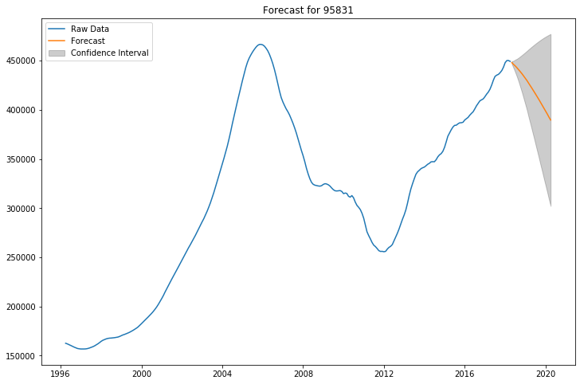


```python
# arima_forecast_enter_pdq(ts, geog_area, city, county, best_cfg, confint=2)
```


```python
# arima_forecast(ts, geog_area, city, county, p_values, d_values, q_values, best_cfg, confint=2, run_pdq = False)
```

### Zip code 95831:  don't invest; lots of downside risk

By the model prediction, I would expect to see a -13.413% change in price by April 1, 2020.
At the lower bound of the confidence interval, I would expect to see a -32.77% change in price by April 1, 2020.
At the upper bound of the confidence interval, I would expect to see a 5.945% change in price by April 1, 2020.


```python
print_results_lists()
```


    (['95616', '95619', '95864', '95831'],
     ['Davis', 'Diamond Springs', 'Arden-Arcade', 'Sacramento_Pocket'],
     ['Yolo', 'El Dorado', 'Sacramento', 'Sacramento'],
     [(2, 1, 2), (2, 1, 2), (8, 0, 2), (6, 0, 2)],
     [717863.06, 355774.45, 449047.92, 389675.07],
     [619575.34, 275292.09, 327568.68, 302216.31],
     [816150.79, 436256.81, 570527.16, 477133.84],
     [692300.0, 321100.0, 552700.0, 449300.0],
     [3.69, 10.8, -18.75, -13.27],
     [-10.5, -14.27, -40.73, -32.74],
     [17.89, 35.86, 3.23, 6.19])


```python
# pop_results_lists()     # use in case there is a problem with the results of the model function previously run
```

## SacMetro:  96142 (Tahoma) -- NOTE:  throws error at model fit stage

### Set up dataframe


```python
geog_area = '96142'
```


```python
city = 'Tahoma'
```


```python
county = 'El Dorado'
```


```python
ts = df_sac.loc[df_sac['Zip'] == geog_area]
```


```python
ts.head()
```


<div>
<style scoped>
    .dataframe tbody tr th:only-of-type {
        vertical-align: middle;
    }

    .dataframe tbody tr th {
        vertical-align: top;
    }

    .dataframe thead th {
        text-align: right;
    }
</style>
<table border="1" class="dataframe">
  <thead>
    <tr style="text-align: right;">
      <th></th>
      <th>Metro</th>
      <th>MetroState</th>
      <th>CountyName</th>
      <th>City</th>
      <th>Zip</th>
      <th>value</th>
    </tr>
    <tr>
      <th>time</th>
      <th></th>
      <th></th>
      <th></th>
      <th></th>
      <th></th>
      <th></th>
    </tr>
  </thead>
  <tbody>
    <tr>
      <td>1996-04-01</td>
      <td>Sacramento</td>
      <td>Sacramento CA</td>
      <td>El Dorado</td>
      <td>Tahoma</td>
      <td>96142</td>
      <td>159000.0</td>
    </tr>
    <tr>
      <td>1996-05-01</td>
      <td>Sacramento</td>
      <td>Sacramento CA</td>
      <td>El Dorado</td>
      <td>Tahoma</td>
      <td>96142</td>
      <td>158900.0</td>
    </tr>
    <tr>
      <td>1996-06-01</td>
      <td>Sacramento</td>
      <td>Sacramento CA</td>
      <td>El Dorado</td>
      <td>Tahoma</td>
      <td>96142</td>
      <td>158900.0</td>
    </tr>
    <tr>
      <td>1996-07-01</td>
      <td>Sacramento</td>
      <td>Sacramento CA</td>
      <td>El Dorado</td>
      <td>Tahoma</td>
      <td>96142</td>
      <td>158900.0</td>
    </tr>
    <tr>
      <td>1996-08-01</td>
      <td>Sacramento</td>
      <td>Sacramento CA</td>
      <td>El Dorado</td>
      <td>Tahoma</td>
      <td>96142</td>
      <td>158900.0</td>
    </tr>
  </tbody>
</table>
</div>


```python
ts = ts.resample('MS').asfreq()
```


```python
ts.head()
```


<div>
<style scoped>
    .dataframe tbody tr th:only-of-type {
        vertical-align: middle;
    }

    .dataframe tbody tr th {
        vertical-align: top;
    }

    .dataframe thead th {
        text-align: right;
    }
</style>
<table border="1" class="dataframe">
  <thead>
    <tr style="text-align: right;">
      <th></th>
      <th>Metro</th>
      <th>MetroState</th>
      <th>CountyName</th>
      <th>City</th>
      <th>Zip</th>
      <th>value</th>
    </tr>
    <tr>
      <th>time</th>
      <th></th>
      <th></th>
      <th></th>
      <th></th>
      <th></th>
      <th></th>
    </tr>
  </thead>
  <tbody>
    <tr>
      <td>1996-04-01</td>
      <td>Sacramento</td>
      <td>Sacramento CA</td>
      <td>El Dorado</td>
      <td>Tahoma</td>
      <td>96142</td>
      <td>159000.0</td>
    </tr>
    <tr>
      <td>1996-05-01</td>
      <td>Sacramento</td>
      <td>Sacramento CA</td>
      <td>El Dorado</td>
      <td>Tahoma</td>
      <td>96142</td>
      <td>158900.0</td>
    </tr>
    <tr>
      <td>1996-06-01</td>
      <td>Sacramento</td>
      <td>Sacramento CA</td>
      <td>El Dorado</td>
      <td>Tahoma</td>
      <td>96142</td>
      <td>158900.0</td>
    </tr>
    <tr>
      <td>1996-07-01</td>
      <td>Sacramento</td>
      <td>Sacramento CA</td>
      <td>El Dorado</td>
      <td>Tahoma</td>
      <td>96142</td>
      <td>158900.0</td>
    </tr>
    <tr>
      <td>1996-08-01</td>
      <td>Sacramento</td>
      <td>Sacramento CA</td>
      <td>El Dorado</td>
      <td>Tahoma</td>
      <td>96142</td>
      <td>158900.0</td>
    </tr>
  </tbody>
</table>
</div>


### Visualizations


```python
plot_single_geog(df_melt, geog_area, 'value', 'Zip', figsize=(12, 6), fontsize1=12, fontsize2=16)
```


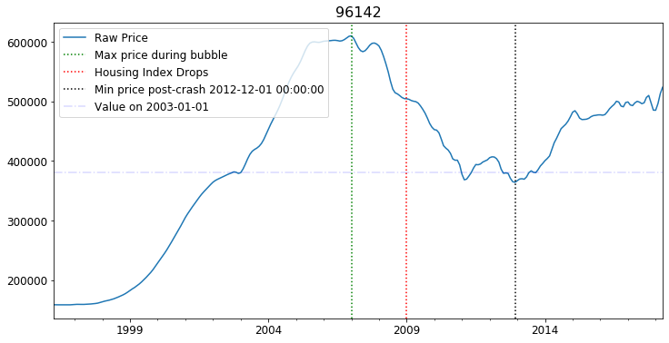


```python
ts.boxplot(column = 'value')
plt.title(geog_area);

```


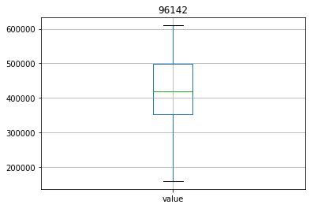


```python
plot_acf_pacf(ts.value)
```


```python
plot_seasonal_decomp(ts.value);

# Note that seasonality isn't much of a factor here; maximum difference of about $700 over the course of a year
```


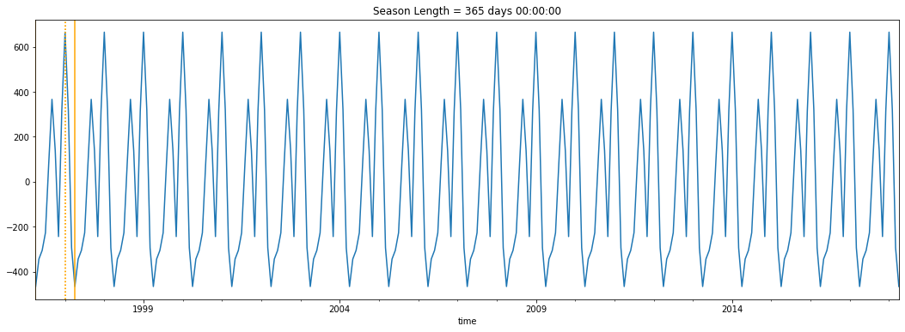


### ARIMA parameters tuning


```python
import warnings
from statsmodels.tsa.arima_model import ARIMA
import statsmodels.api as sm
from sklearn.metrics import mean_squared_error
```


```python
p_values = [0, 1, 2, 4, 6, 8, 10]
d_values = range(0, 3)
q_values = range(0, 3)

```


```python
# order_tuples_96142, mse_results_96142, best_cfg_96142, best_score_96142 = eval_params_and_lists(ts.value, p_values, d_values, q_values)

```

From old notebook: Best ARIMA(6, 1, 2) MSE=10423029.066


```python
# best_cfg = best_cfg_96142
```


```python
best_cfg = (6, 1, 2)
```


```python
# results_table_96142 = pd.DataFrame({'Order':order_tuples_96142, 'MSEs':mse_results_96142})
# results_table_96142
```

### ARIMA modeling and forecasting results


```python
# print_results_lists()   # make sure that the lists are correct to this point
```


```python
# pop_results_lists()
```


```python
arima_forecast_enter_pdq(ts, geog_area, city, county, best_cfg, confint=1)
```

    For 96142 (Tahoma):
    Best ARIMA order = (6, 1, 2)


    ---------------------------------------------------------------------------

    LinAlgError                               Traceback (most recent call last)

    <ipython-input-144-4c547e0e6747> in <module>
    ----> 1 arima_forecast_enter_pdq(ts, geog_area, city, county, best_cfg, confint=1)
    

    <ipython-input-76-5b7edb1bd9d6> in arima_forecast_enter_pdq(ts, geog_area, city, county, best_cfg, confint)
          7     order = best_cfg
          8     print(f'Best ARIMA order = {order}')
    ----> 9     model_fit = arima_zipcode(ts, order)                                # returns model_fit
         10     actual_forecast, forecast_confint, std_error = forecast(model_fit)  # returns actual_forecast, forecast_confint, std_error
         11     df_forecast = forecast_df(actual_forecast, std_error, forecast_confint, col = 'time',     # returns df_forecast with future predictions


    <ipython-input-68-e33d4446a6ef> in arima_zipcode(ts, order)
          5     model = ARIMA(ts_value, order)
          6     model_fit = model.fit(disp=0)
    ----> 7     print(model_fit.summary())
          8     return model_fit
          9 


    /opt/anaconda3/envs/learn-env/lib/python3.6/site-packages/statsmodels/tsa/arima_model.py in summary(self, alpha)
       1640             mastubs = ["MA.%d" % i for i in range(1, k_ma + 1)]
       1641             stubs = arstubs + mastubs
    -> 1642             roots = np.r_[self.arroots, self.maroots]
       1643             freq = np.r_[self.arfreq, self.mafreq]
       1644         elif k_ma:


    /opt/anaconda3/envs/learn-env/lib/python3.6/site-packages/statsmodels/tools/decorators.py in __get__(self, obj, type)
         91         _cachedval = _cache.get(name, None)
         92         if _cachedval is None:
    ---> 93             _cachedval = self.fget(obj)
         94             _cache[name] = _cachedval
         95 


    /opt/anaconda3/envs/learn-env/lib/python3.6/site-packages/statsmodels/tsa/arima_model.py in maroots(self)
       1394     @cache_readonly
       1395     def maroots(self):
    -> 1396         return np.roots(np.r_[1, self.maparams])**-1
       1397 
       1398     @cache_readonly


    /opt/anaconda3/envs/learn-env/lib/python3.6/site-packages/numpy/lib/polynomial.py in roots(p)
        243         A = diag(NX.ones((N-2,), p.dtype), -1)
        244         A[0,:] = -p[1:] / p[0]
    --> 245         roots = eigvals(A)
        246     else:
        247         roots = NX.array([])


    /opt/anaconda3/envs/learn-env/lib/python3.6/site-packages/numpy/linalg/linalg.py in eigvals(a)
       1056     _assertRankAtLeast2(a)
       1057     _assertNdSquareness(a)
    -> 1058     _assertFinite(a)
       1059     t, result_t = _commonType(a)
       1060 


    /opt/anaconda3/envs/learn-env/lib/python3.6/site-packages/numpy/linalg/linalg.py in _assertFinite(*arrays)
        216     for a in arrays:
        217         if not (isfinite(a).all()):
    --> 218             raise LinAlgError("Array must not contain infs or NaNs")
        219 
        220 def _isEmpty2d(arr):


    LinAlgError: Array must not contain infs or NaNs


```python
arima_zipcode(ts, best_cfg)
```


    ---------------------------------------------------------------------------

    LinAlgError                               Traceback (most recent call last)

    <ipython-input-137-eda10d95faac> in <module>
    ----> 1 arima_zipcode(ts, best_cfg)
    

    <ipython-input-68-e33d4446a6ef> in arima_zipcode(ts, order)
          5     model = ARIMA(ts_value, order)
          6     model_fit = model.fit(disp=0)
    ----> 7     print(model_fit.summary())
          8     return model_fit
          9 


    /opt/anaconda3/envs/learn-env/lib/python3.6/site-packages/statsmodels/tsa/arima_model.py in summary(self, alpha)
       1640             mastubs = ["MA.%d" % i for i in range(1, k_ma + 1)]
       1641             stubs = arstubs + mastubs
    -> 1642             roots = np.r_[self.arroots, self.maroots]
       1643             freq = np.r_[self.arfreq, self.mafreq]
       1644         elif k_ma:


    /opt/anaconda3/envs/learn-env/lib/python3.6/site-packages/statsmodels/tools/decorators.py in __get__(self, obj, type)
         91         _cachedval = _cache.get(name, None)
         92         if _cachedval is None:
    ---> 93             _cachedval = self.fget(obj)
         94             _cache[name] = _cachedval
         95 


    /opt/anaconda3/envs/learn-env/lib/python3.6/site-packages/statsmodels/tsa/arima_model.py in maroots(self)
       1394     @cache_readonly
       1395     def maroots(self):
    -> 1396         return np.roots(np.r_[1, self.maparams])**-1
       1397 
       1398     @cache_readonly


    /opt/anaconda3/envs/learn-env/lib/python3.6/site-packages/numpy/lib/polynomial.py in roots(p)
        243         A = diag(NX.ones((N-2,), p.dtype), -1)
        244         A[0,:] = -p[1:] / p[0]
    --> 245         roots = eigvals(A)
        246     else:
        247         roots = NX.array([])


    /opt/anaconda3/envs/learn-env/lib/python3.6/site-packages/numpy/linalg/linalg.py in eigvals(a)
       1056     _assertRankAtLeast2(a)
       1057     _assertNdSquareness(a)
    -> 1058     _assertFinite(a)
       1059     t, result_t = _commonType(a)
       1060 


    /opt/anaconda3/envs/learn-env/lib/python3.6/site-packages/numpy/linalg/linalg.py in _assertFinite(*arrays)
        216     for a in arrays:
        217         if not (isfinite(a).all()):
    --> 218             raise LinAlgError("Array must not contain infs or NaNs")
        219 
        220 def _isEmpty2d(arr):


    LinAlgError: Array must not contain infs or NaNs


```python
model = ARIMA(ts.value, best_cfg)
model_fit = model.fit(disp=0)
model_fit.summary()
```


    ---------------------------------------------------------------------------

    LinAlgError                               Traceback (most recent call last)

    <ipython-input-149-521e5a1d84a5> in <module>
          1 model = ARIMA(ts.value, best_cfg)
          2 model_fit = model.fit(disp=0)
    ----> 3 model_fit.summary()
    

    /opt/anaconda3/envs/learn-env/lib/python3.6/site-packages/statsmodels/tsa/arima_model.py in summary(self, alpha)
       1640             mastubs = ["MA.%d" % i for i in range(1, k_ma + 1)]
       1641             stubs = arstubs + mastubs
    -> 1642             roots = np.r_[self.arroots, self.maroots]
       1643             freq = np.r_[self.arfreq, self.mafreq]
       1644         elif k_ma:


    /opt/anaconda3/envs/learn-env/lib/python3.6/site-packages/statsmodels/tools/decorators.py in __get__(self, obj, type)
         91         _cachedval = _cache.get(name, None)
         92         if _cachedval is None:
    ---> 93             _cachedval = self.fget(obj)
         94             _cache[name] = _cachedval
         95 


    /opt/anaconda3/envs/learn-env/lib/python3.6/site-packages/statsmodels/tsa/arima_model.py in maroots(self)
       1394     @cache_readonly
       1395     def maroots(self):
    -> 1396         return np.roots(np.r_[1, self.maparams])**-1
       1397 
       1398     @cache_readonly


    /opt/anaconda3/envs/learn-env/lib/python3.6/site-packages/numpy/lib/polynomial.py in roots(p)
        243         A = diag(NX.ones((N-2,), p.dtype), -1)
        244         A[0,:] = -p[1:] / p[0]
    --> 245         roots = eigvals(A)
        246     else:
        247         roots = NX.array([])


    /opt/anaconda3/envs/learn-env/lib/python3.6/site-packages/numpy/linalg/linalg.py in eigvals(a)
       1056     _assertRankAtLeast2(a)
       1057     _assertNdSquareness(a)
    -> 1058     _assertFinite(a)
       1059     t, result_t = _commonType(a)
       1060 


    /opt/anaconda3/envs/learn-env/lib/python3.6/site-packages/numpy/linalg/linalg.py in _assertFinite(*arrays)
        216     for a in arrays:
        217         if not (isfinite(a).all()):
    --> 218             raise LinAlgError("Array must not contain infs or NaNs")
        219 
        220 def _isEmpty2d(arr):


    LinAlgError: Array must not contain infs or NaNs


```python
ts.info()
```

    <class 'pandas.core.frame.DataFrame'>
    DatetimeIndex: 265 entries, 1996-04-01 to 2018-04-01
    Freq: MS
    Data columns (total 6 columns):
    Metro         265 non-null object
    MetroState    265 non-null object
    CountyName    265 non-null object
    City          265 non-null object
    Zip           265 non-null object
    value         265 non-null float64
    dtypes: float64(1), object(5)
    memory usage: 14.5+ KB


```python
for x in ts.value:
    print(type(x))
```

    <class 'float'>
    <class 'float'>
    <class 'float'>
    <class 'float'>
    <class 'float'>
    <class 'float'>
    <class 'float'>
    <class 'float'>
    <class 'float'>
    <class 'float'>
    <class 'float'>
    <class 'float'>
    <class 'float'>
    <class 'float'>
    <class 'float'>
    <class 'float'>
    <class 'float'>
    <class 'float'>
    <class 'float'>
    <class 'float'>
    <class 'float'>
    <class 'float'>
    <class 'float'>
    <class 'float'>
    <class 'float'>
    <class 'float'>
    <class 'float'>
    <class 'float'>
    <class 'float'>
    <class 'float'>
    <class 'float'>
    <class 'float'>
    <class 'float'>
    <class 'float'>
    <class 'float'>
    <class 'float'>
    <class 'float'>
    <class 'float'>
    <class 'float'>
    <class 'float'>
    <class 'float'>
    <class 'float'>
    <class 'float'>
    <class 'float'>
    <class 'float'>
    <class 'float'>
    <class 'float'>
    <class 'float'>
    <class 'float'>
    <class 'float'>
    <class 'float'>
    <class 'float'>
    <class 'float'>
    <class 'float'>
    <class 'float'>
    <class 'float'>
    <class 'float'>
    <class 'float'>
    <class 'float'>
    <class 'float'>
    <class 'float'>
    <class 'float'>
    <class 'float'>
    <class 'float'>
    <class 'float'>
    <class 'float'>
    <class 'float'>
    <class 'float'>
    <class 'float'>
    <class 'float'>
    <class 'float'>
    <class 'float'>
    <class 'float'>
    <class 'float'>
    <class 'float'>
    <class 'float'>
    <class 'float'>
    <class 'float'>
    <class 'float'>
    <class 'float'>
    <class 'float'>
    <class 'float'>
    <class 'float'>
    <class 'float'>
    <class 'float'>
    <class 'float'>
    <class 'float'>
    <class 'float'>
    <class 'float'>
    <class 'float'>
    <class 'float'>
    <class 'float'>
    <class 'float'>
    <class 'float'>
    <class 'float'>
    <class 'float'>
    <class 'float'>
    <class 'float'>
    <class 'float'>
    <class 'float'>
    <class 'float'>
    <class 'float'>
    <class 'float'>
    <class 'float'>
    <class 'float'>
    <class 'float'>
    <class 'float'>
    <class 'float'>
    <class 'float'>
    <class 'float'>
    <class 'float'>
    <class 'float'>
    <class 'float'>
    <class 'float'>
    <class 'float'>
    <class 'float'>
    <class 'float'>
    <class 'float'>
    <class 'float'>
    <class 'float'>
    <class 'float'>
    <class 'float'>
    <class 'float'>
    <class 'float'>
    <class 'float'>
    <class 'float'>
    <class 'float'>
    <class 'float'>
    <class 'float'>
    <class 'float'>
    <class 'float'>
    <class 'float'>
    <class 'float'>
    <class 'float'>
    <class 'float'>
    <class 'float'>
    <class 'float'>
    <class 'float'>
    <class 'float'>
    <class 'float'>
    <class 'float'>
    <class 'float'>
    <class 'float'>
    <class 'float'>
    <class 'float'>
    <class 'float'>
    <class 'float'>
    <class 'float'>
    <class 'float'>
    <class 'float'>
    <class 'float'>
    <class 'float'>
    <class 'float'>
    <class 'float'>
    <class 'float'>
    <class 'float'>
    <class 'float'>
    <class 'float'>
    <class 'float'>
    <class 'float'>
    <class 'float'>
    <class 'float'>
    <class 'float'>
    <class 'float'>
    <class 'float'>
    <class 'float'>
    <class 'float'>
    <class 'float'>
    <class 'float'>
    <class 'float'>
    <class 'float'>
    <class 'float'>
    <class 'float'>
    <class 'float'>
    <class 'float'>
    <class 'float'>
    <class 'float'>
    <class 'float'>
    <class 'float'>
    <class 'float'>
    <class 'float'>
    <class 'float'>
    <class 'float'>
    <class 'float'>
    <class 'float'>
    <class 'float'>
    <class 'float'>
    <class 'float'>
    <class 'float'>
    <class 'float'>
    <class 'float'>
    <class 'float'>
    <class 'float'>
    <class 'float'>
    <class 'float'>
    <class 'float'>
    <class 'float'>
    <class 'float'>
    <class 'float'>
    <class 'float'>
    <class 'float'>
    <class 'float'>
    <class 'float'>
    <class 'float'>
    <class 'float'>
    <class 'float'>
    <class 'float'>
    <class 'float'>
    <class 'float'>
    <class 'float'>
    <class 'float'>
    <class 'float'>
    <class 'float'>
    <class 'float'>
    <class 'float'>
    <class 'float'>
    <class 'float'>
    <class 'float'>
    <class 'float'>
    <class 'float'>
    <class 'float'>
    <class 'float'>
    <class 'float'>
    <class 'float'>
    <class 'float'>
    <class 'float'>
    <class 'float'>
    <class 'float'>
    <class 'float'>
    <class 'float'>
    <class 'float'>
    <class 'float'>
    <class 'float'>
    <class 'float'>
    <class 'float'>
    <class 'float'>
    <class 'float'>
    <class 'float'>
    <class 'float'>
    <class 'float'>
    <class 'float'>
    <class 'float'>
    <class 'float'>
    <class 'float'>
    <class 'float'>
    <class 'float'>
    <class 'float'>
    <class 'float'>
    <class 'float'>
    <class 'float'>
    <class 'float'>
    <class 'float'>
    <class 'float'>
    <class 'float'>
    <class 'float'>
    <class 'float'>
    <class 'float'>
    <class 'float'>
    <class 'float'>
    <class 'float'>
    <class 'float'>
    <class 'float'>
    <class 'float'>
    <class 'float'>
    <class 'float'>


```python
# print_results_list()
```


```python
# pop_results_lists()     # use in case there is a problem with the results of the model function previously run
```

### Zip code 96142:  Potentially solid gains, with possibly large upside or downside

By the model prediction, I would expect to see a 9.791% change in price by April 1, 2020.
At the lower bound of the confidence interval, I would expect to see a -15.663% change in price by April 1, 2020.
At the upper bound of the confidence interval, I would expect to see a 35.246% change in price by April 1, 2020.


```python

```

## SacMetro:  95811 (Sacramento_DosRios) -- Mediocre predicted returns

### Set up dataframe


```python
geog_area = '95811'
```


```python
city = 'Sacramento_DosRios'
```


```python
county = 'Sacramento'
```


```python
ts = df_sac.loc[df_sac['Zip'] == geog_area]
```


```python
ts.head()
```


<div>
<style scoped>
    .dataframe tbody tr th:only-of-type {
        vertical-align: middle;
    }

    .dataframe tbody tr th {
        vertical-align: top;
    }

    .dataframe thead th {
        text-align: right;
    }
</style>
<table border="1" class="dataframe">
  <thead>
    <tr style="text-align: right;">
      <th></th>
      <th>Metro</th>
      <th>MetroState</th>
      <th>CountyName</th>
      <th>City</th>
      <th>Zip</th>
      <th>value</th>
    </tr>
    <tr>
      <th>time</th>
      <th></th>
      <th></th>
      <th></th>
      <th></th>
      <th></th>
      <th></th>
    </tr>
  </thead>
  <tbody>
    <tr>
      <td>1996-04-01</td>
      <td>Sacramento</td>
      <td>Sacramento CA</td>
      <td>Sacramento</td>
      <td>Sacramento</td>
      <td>95811</td>
      <td>119400.0</td>
    </tr>
    <tr>
      <td>1996-05-01</td>
      <td>Sacramento</td>
      <td>Sacramento CA</td>
      <td>Sacramento</td>
      <td>Sacramento</td>
      <td>95811</td>
      <td>119200.0</td>
    </tr>
    <tr>
      <td>1996-06-01</td>
      <td>Sacramento</td>
      <td>Sacramento CA</td>
      <td>Sacramento</td>
      <td>Sacramento</td>
      <td>95811</td>
      <td>119000.0</td>
    </tr>
    <tr>
      <td>1996-07-01</td>
      <td>Sacramento</td>
      <td>Sacramento CA</td>
      <td>Sacramento</td>
      <td>Sacramento</td>
      <td>95811</td>
      <td>118700.0</td>
    </tr>
    <tr>
      <td>1996-08-01</td>
      <td>Sacramento</td>
      <td>Sacramento CA</td>
      <td>Sacramento</td>
      <td>Sacramento</td>
      <td>95811</td>
      <td>118500.0</td>
    </tr>
  </tbody>
</table>
</div>


```python
ts = ts.resample('MS').asfreq()
```


```python
ts.head()
```


<div>
<style scoped>
    .dataframe tbody tr th:only-of-type {
        vertical-align: middle;
    }

    .dataframe tbody tr th {
        vertical-align: top;
    }

    .dataframe thead th {
        text-align: right;
    }
</style>
<table border="1" class="dataframe">
  <thead>
    <tr style="text-align: right;">
      <th></th>
      <th>Metro</th>
      <th>MetroState</th>
      <th>CountyName</th>
      <th>City</th>
      <th>Zip</th>
      <th>value</th>
    </tr>
    <tr>
      <th>time</th>
      <th></th>
      <th></th>
      <th></th>
      <th></th>
      <th></th>
      <th></th>
    </tr>
  </thead>
  <tbody>
    <tr>
      <td>1996-04-01</td>
      <td>Sacramento</td>
      <td>Sacramento CA</td>
      <td>Sacramento</td>
      <td>Sacramento</td>
      <td>95811</td>
      <td>119400.0</td>
    </tr>
    <tr>
      <td>1996-05-01</td>
      <td>Sacramento</td>
      <td>Sacramento CA</td>
      <td>Sacramento</td>
      <td>Sacramento</td>
      <td>95811</td>
      <td>119200.0</td>
    </tr>
    <tr>
      <td>1996-06-01</td>
      <td>Sacramento</td>
      <td>Sacramento CA</td>
      <td>Sacramento</td>
      <td>Sacramento</td>
      <td>95811</td>
      <td>119000.0</td>
    </tr>
    <tr>
      <td>1996-07-01</td>
      <td>Sacramento</td>
      <td>Sacramento CA</td>
      <td>Sacramento</td>
      <td>Sacramento</td>
      <td>95811</td>
      <td>118700.0</td>
    </tr>
    <tr>
      <td>1996-08-01</td>
      <td>Sacramento</td>
      <td>Sacramento CA</td>
      <td>Sacramento</td>
      <td>Sacramento</td>
      <td>95811</td>
      <td>118500.0</td>
    </tr>
  </tbody>
</table>
</div>


### Visualizations


```python
plot_single_geog(df_melt, geog_area, 'value', 'Zip', figsize=(12, 6), fontsize1=12, fontsize2=16)
```


```python
ts.boxplot(column = 'value')
plt.title(geog_area);

```


```python
plot_acf_pacf(ts.value)
```


```python
plot_seasonal_decomp(ts.value);

# Note that seasonality isn't much of a factor here; maximum difference of about $700 over the course of a year
```


### ARIMA parameters tuning


```python
p_values = [0, 1, 2, 4, 6, 8, 10]
d_values = range(0, 3)
q_values = range(0, 3)

```


```python
# order_tuples_95811, mse_results_95811, best_cfg_95811, best_score_95811 = eval_params_and_lists(ts.value, p_values, d_values, q_values)

# Best ARIMA(10, 1, 0) MSE=3792581.619
```


```python
best_cfg = (10,1,0)
```


```python
best_cfg
```


    (10, 1, 0)


```python
# results_table_95811 = pd.DataFrame({'Order':order_tuples_95811, 'MSEs':mse_results_95811})
# results_table_95811
```

### ARIMA modeling and forecasting results


```python
print_results_lists()   # make sure that the lists are correct to this point
```


    (['95616',
      '95619',
      '95864',
      '95831',
      '95811',
      '95818',
      '95630',
      '96140',
      '95672',
      '95636',
      '95709',
      '95746',
      '95614',
      '95663',
      '95623',
      '95747',
      '95765',
      '95602',
      '96150',
      '95650'],
     ['Davis',
      'Diamond Springs',
      'Arden-Arcade',
      'Sacramento_Pocket',
      'Sacramento_DosRios',
      'Sacramento_LandPark',
      'Folsom',
      'Carnelian Bay',
      'Rescue',
      'Somerset',
      'Camino',
      'Granite Bay',
      'Cool',
      'Penryn',
      'El Dorado',
      'Roseville',
      'Rocklin',
      'Auburn',
      'South Lake Tahoe',
      'Loomis'],
     ['Yolo',
      'El Dorado',
      'Sacramento',
      'Sacramento',
      'Sacramento',
      'Sacramento',
      'Sacramento',
      'Placer',
      'El Dorado',
      'El Dorado',
      'El Dorado',
      'Placer',
      'El Dorado',
      'Placer',
      'El Dorado',
      'Placer',
      'Placer',
      'Placer',
      'El Dorado',
      'Placer'],
     [(2, 1, 2),
      (2, 1, 2),
      (8, 0, 2),
      (6, 0, 2),
      (10, 1, 0),
      (6, 2, 2),
      (2, 2, 0),
      (4, 2, 1),
      (8, 2, 0),
      (8, 2, 1),
      (8, 0, 2),
      (6, 1, 2),
      (8, 0, 2),
      (6, 1, 1),
      (6, 1, 2),
      (4, 1, 2),
      (4, 1, 2),
      (4, 0, 2),
      (2, 1, 2),
      (8, 1, 2)],
     [717863.06,
      355774.45,
      449047.92,
      389675.07,
      570598.7,
      558380.08,
      545821.37,
      769785.39,
      766372.9,
      268239.06,
      385671.99,
      840052.01,
      434312.48,
      682869.53,
      493333.57,
      510638.14,
      569180.09,
      501842.15,
      469181.53,
      711493.45],
     [619575.34,
      275292.09,
      327568.68,
      302216.31,
      459606.77,
      418566.82,
      427964.65,
      518008.87,
      562046.69,
      148993.04,
      305444.97,
      704070.95,
      345086.19,
      550638.69,
      388402.06,
      432420.37,
      466067.8,
      399959.64,
      368777.33,
      579266.67],
     [816150.79,
      436256.81,
      570527.16,
      477133.84,
      681590.63,
      698193.34,
      663678.09,
      1021561.92,
      970699.1,
      387485.09,
      465899.01,
      976033.07,
      523538.76,
      815100.37,
      598265.08,
      588855.91,
      672292.39,
      603724.66,
      569585.73,
      843720.24],
     [692300.0,
      321100.0,
      552700.0,
      449300.0,
      567500.0,
      563900.0,
      542900.0,
      644600.0,
      579300.0,
      241200.0,
      386000.0,
      778500.0,
      423300.0,
      600700.0,
      455700.0,
      483800.0,
      509200.0,
      488700.0,
      432500.0,
      631000.0],
     [3.69,
      10.8,
      -18.75,
      -13.27,
      0.55,
      -0.98,
      0.54,
      19.42,
      32.29,
      11.21,
      -0.08,
      7.91,
      2.6,
      13.68,
      8.26,
      5.55,
      11.78,
      2.69,
      8.48,
      12.76],
     [-10.5,
      -14.27,
      -40.73,
      -32.74,
      -19.01,
      -25.77,
      -21.17,
      -19.64,
      -2.98,
      -38.23,
      -20.87,
      -9.56,
      -18.48,
      -8.33,
      -14.77,
      -10.62,
      -8.47,
      -18.16,
      -14.73,
      -8.2],
     [17.89,
      35.86,
      3.23,
      6.19,
      20.1,
      23.82,
      22.25,
      58.48,
      67.56,
      60.65,
      20.7,
      25.37,
      23.68,
      35.69,
      31.28,
      21.71,
      32.03,
      23.54,
      31.7,
      33.71])


```python
arima_forecast(ts, geog_area, city, county, p_values, d_values, q_values, best_cfg, confint=2, run_pdq = False)
```

    For 95811 (Sacramento_DosRios):
    Best ARIMA order = (10, 1, 0)
                                 ARIMA Model Results                              
    ==============================================================================
    Dep. Variable:                D.value   No. Observations:                  264
    Model:                ARIMA(10, 1, 0)   Log Likelihood               -2251.853
    Method:                       css-mle   S.D. of innovations           1214.967
    Date:                Tue, 17 Mar 2020   AIC                           4527.706
    Time:                        15:40:27   BIC                           4570.618
    Sample:                    05-01-1996   HQIC                          4544.949
                             - 04-01-2018                                         
    ==================================================================================
                         coef    std err          z      P>|z|      [0.025      0.975]
    ----------------------------------------------------------------------------------
    const           1537.8361    878.462      1.751      0.081    -183.919    3259.591
    ar.L1.D.value      1.4319      0.061     23.473      0.000       1.312       1.552
    ar.L2.D.value     -1.0526      0.108     -9.778      0.000      -1.264      -0.842
    ar.L3.D.value      0.6721      0.126      5.325      0.000       0.425       0.919
    ar.L4.D.value     -0.0169      0.134     -0.127      0.899      -0.279       0.246
    ar.L5.D.value     -0.4846      0.129     -3.746      0.000      -0.738      -0.231
    ar.L6.D.value      0.6851      0.130      5.263      0.000       0.430       0.940
    ar.L7.D.value     -0.2980      0.137     -2.178      0.030      -0.566      -0.030
    ar.L8.D.value      0.0532      0.130      0.409      0.683      -0.202       0.308
    ar.L9.D.value      0.1197      0.111      1.081      0.281      -0.097       0.337
    ar.L10.D.value    -0.1935      0.062     -3.117      0.002      -0.315      -0.072
                                        Roots                                     
    ==============================================================================
                       Real          Imaginary           Modulus         Frequency
    ------------------------------------------------------------------------------
    AR.1             1.0768           -0.1098j            1.0824           -0.0162
    AR.2             1.0768           +0.1098j            1.0824            0.0162
    AR.3             0.7566           -0.7808j            1.0873           -0.1275
    AR.4             0.7566           +0.7808j            1.0873            0.1275
    AR.5             0.1741           -1.2313j            1.2435           -0.2276
    AR.6             0.1741           +1.2313j            1.2435            0.2276
    AR.7            -0.3115           -1.0586j            1.1035           -0.2955
    AR.8            -0.3115           +1.0586j            1.1035            0.2955
    AR.9            -1.3868           -0.2410j            1.4076           -0.4726
    AR.10           -1.3868           +0.2410j            1.4076            0.4726
    ------------------------------------------------------------------------------
    By the model prediction, I would expect to see a 0.546% change in price by April 1, 2020.
    At the lower bound of the confidence interval, I would expect to see a -19.012% change in price by April 1, 2020.
    At the upper bound of the confidence interval, I would expect to see a 20.104% change in price by April 1, 2020.


    (['95616',
      '95619',
      '95864',
      '95831',
      '95811',
      '95818',
      '95630',
      '96140',
      '95672',
      '95636',
      '95709',
      '95746',
      '95614',
      '95663',
      '95623',
      '95747',
      '95765',
      '95602',
      '96150',
      '95650',
      '95811'],
     ['Davis',
      'Diamond Springs',
      'Arden-Arcade',
      'Sacramento_Pocket',
      'Sacramento_DosRios',
      'Sacramento_LandPark',
      'Folsom',
      'Carnelian Bay',
      'Rescue',
      'Somerset',
      'Camino',
      'Granite Bay',
      'Cool',
      'Penryn',
      'El Dorado',
      'Roseville',
      'Rocklin',
      'Auburn',
      'South Lake Tahoe',
      'Loomis',
      'Sacramento_DosRios'],
     ['Yolo',
      'El Dorado',
      'Sacramento',
      'Sacramento',
      'Sacramento',
      'Sacramento',
      'Sacramento',
      'Placer',
      'El Dorado',
      'El Dorado',
      'El Dorado',
      'Placer',
      'El Dorado',
      'Placer',
      'El Dorado',
      'Placer',
      'Placer',
      'Placer',
      'El Dorado',
      'Placer',
      'Sacramento'],
     [(2, 1, 2),
      (2, 1, 2),
      (8, 0, 2),
      (6, 0, 2),
      (10, 1, 0),
      (6, 2, 2),
      (2, 2, 0),
      (4, 2, 1),
      (8, 2, 0),
      (8, 2, 1),
      (8, 0, 2),
      (6, 1, 2),
      (8, 0, 2),
      (6, 1, 1),
      (6, 1, 2),
      (4, 1, 2),
      (4, 1, 2),
      (4, 0, 2),
      (2, 1, 2),
      (8, 1, 2),
      (10, 1, 0)],
     [717863.06,
      355774.45,
      449047.92,
      389675.07,
      570598.7,
      558380.08,
      545821.37,
      769785.39,
      766372.9,
      268239.06,
      385671.99,
      840052.01,
      434312.48,
      682869.53,
      493333.57,
      510638.14,
      569180.09,
      501842.15,
      469181.53,
      711493.45,
      570598.7],
     [619575.34,
      275292.09,
      327568.68,
      302216.31,
      459606.77,
      418566.82,
      427964.65,
      518008.87,
      562046.69,
      148993.04,
      305444.97,
      704070.95,
      345086.19,
      550638.69,
      388402.06,
      432420.37,
      466067.8,
      399959.64,
      368777.33,
      579266.67,
      459606.77],
     [816150.79,
      436256.81,
      570527.16,
      477133.84,
      681590.63,
      698193.34,
      663678.09,
      1021561.92,
      970699.1,
      387485.09,
      465899.01,
      976033.07,
      523538.76,
      815100.37,
      598265.08,
      588855.91,
      672292.39,
      603724.66,
      569585.73,
      843720.24,
      681590.63],
     [692300.0,
      321100.0,
      552700.0,
      449300.0,
      567500.0,
      563900.0,
      542900.0,
      644600.0,
      579300.0,
      241200.0,
      386000.0,
      778500.0,
      423300.0,
      600700.0,
      455700.0,
      483800.0,
      509200.0,
      488700.0,
      432500.0,
      631000.0,
      567500.0],
     [3.69,
      10.8,
      -18.75,
      -13.27,
      0.55,
      -0.98,
      0.54,
      19.42,
      32.29,
      11.21,
      -0.08,
      7.91,
      2.6,
      13.68,
      8.26,
      5.55,
      11.78,
      2.69,
      8.48,
      12.76,
      0.55],
     [-10.5,
      -14.27,
      -40.73,
      -32.74,
      -19.01,
      -25.77,
      -21.17,
      -19.64,
      -2.98,
      -38.23,
      -20.87,
      -9.56,
      -18.48,
      -8.33,
      -14.77,
      -10.62,
      -8.47,
      -18.16,
      -14.73,
      -8.2,
      -19.01],
     [17.89,
      35.86,
      3.23,
      6.19,
      20.1,
      23.82,
      22.25,
      58.48,
      67.56,
      60.65,
      20.7,
      25.37,
      23.68,
      35.69,
      31.28,
      21.71,
      32.03,
      23.54,
      31.7,
      33.71,
      20.1])


### Zip code 95811:  Don't invest--mediocre predicted returns with significant potential downside (but also significant potential upside)

By the model prediction, I would expect to see a 0.599% change in price by April 1, 2020.
At the lower bound of the confidence interval, I would expect to see a -18.954% change in price by April 1, 2020.
At the upper bound of the confidence interval, I would expect to see a 20.152% change in price by April 1, 2020.

## SacMetro:  95818 (Sacramento_LandPark) -- Do not invest

### Set up dataframe


```python
geog_area = '95818'
```


```python
city = 'Sacramento_LandPark'
```


```python
county = 'Sacramento'
```


```python
ts = df_sac.loc[df_sac['Zip'] == geog_area]
```


```python
ts.head()
```


<div>
<style scoped>
    .dataframe tbody tr th:only-of-type {
        vertical-align: middle;
    }

    .dataframe tbody tr th {
        vertical-align: top;
    }

    .dataframe thead th {
        text-align: right;
    }
</style>
<table border="1" class="dataframe">
  <thead>
    <tr style="text-align: right;">
      <th></th>
      <th>Metro</th>
      <th>MetroState</th>
      <th>CountyName</th>
      <th>City</th>
      <th>Zip</th>
      <th>value</th>
    </tr>
    <tr>
      <th>time</th>
      <th></th>
      <th></th>
      <th></th>
      <th></th>
      <th></th>
      <th></th>
    </tr>
  </thead>
  <tbody>
    <tr>
      <td>1996-04-01</td>
      <td>Sacramento</td>
      <td>Sacramento CA</td>
      <td>Sacramento</td>
      <td>Sacramento</td>
      <td>95818</td>
      <td>144000.0</td>
    </tr>
    <tr>
      <td>1996-05-01</td>
      <td>Sacramento</td>
      <td>Sacramento CA</td>
      <td>Sacramento</td>
      <td>Sacramento</td>
      <td>95818</td>
      <td>144300.0</td>
    </tr>
    <tr>
      <td>1996-06-01</td>
      <td>Sacramento</td>
      <td>Sacramento CA</td>
      <td>Sacramento</td>
      <td>Sacramento</td>
      <td>95818</td>
      <td>144500.0</td>
    </tr>
    <tr>
      <td>1996-07-01</td>
      <td>Sacramento</td>
      <td>Sacramento CA</td>
      <td>Sacramento</td>
      <td>Sacramento</td>
      <td>95818</td>
      <td>144500.0</td>
    </tr>
    <tr>
      <td>1996-08-01</td>
      <td>Sacramento</td>
      <td>Sacramento CA</td>
      <td>Sacramento</td>
      <td>Sacramento</td>
      <td>95818</td>
      <td>144600.0</td>
    </tr>
  </tbody>
</table>
</div>


```python
ts = ts.resample('MS').asfreq()
```


```python
ts.head()
```


<div>
<style scoped>
    .dataframe tbody tr th:only-of-type {
        vertical-align: middle;
    }

    .dataframe tbody tr th {
        vertical-align: top;
    }

    .dataframe thead th {
        text-align: right;
    }
</style>
<table border="1" class="dataframe">
  <thead>
    <tr style="text-align: right;">
      <th></th>
      <th>Metro</th>
      <th>MetroState</th>
      <th>CountyName</th>
      <th>City</th>
      <th>Zip</th>
      <th>value</th>
    </tr>
    <tr>
      <th>time</th>
      <th></th>
      <th></th>
      <th></th>
      <th></th>
      <th></th>
      <th></th>
    </tr>
  </thead>
  <tbody>
    <tr>
      <td>1996-04-01</td>
      <td>Sacramento</td>
      <td>Sacramento CA</td>
      <td>Sacramento</td>
      <td>Sacramento</td>
      <td>95818</td>
      <td>144000.0</td>
    </tr>
    <tr>
      <td>1996-05-01</td>
      <td>Sacramento</td>
      <td>Sacramento CA</td>
      <td>Sacramento</td>
      <td>Sacramento</td>
      <td>95818</td>
      <td>144300.0</td>
    </tr>
    <tr>
      <td>1996-06-01</td>
      <td>Sacramento</td>
      <td>Sacramento CA</td>
      <td>Sacramento</td>
      <td>Sacramento</td>
      <td>95818</td>
      <td>144500.0</td>
    </tr>
    <tr>
      <td>1996-07-01</td>
      <td>Sacramento</td>
      <td>Sacramento CA</td>
      <td>Sacramento</td>
      <td>Sacramento</td>
      <td>95818</td>
      <td>144500.0</td>
    </tr>
    <tr>
      <td>1996-08-01</td>
      <td>Sacramento</td>
      <td>Sacramento CA</td>
      <td>Sacramento</td>
      <td>Sacramento</td>
      <td>95818</td>
      <td>144600.0</td>
    </tr>
  </tbody>
</table>
</div>


### Visualizations


```python
plot_single_geog(df_melt, geog_area, 'value', 'Zip', figsize=(12, 6), fontsize1=12, fontsize2=16)
```


```python
ts.boxplot(column = 'value')
plt.title(geog_area);

```


```python
plot_acf_pacf(ts.value)
```


```python
plot_seasonal_decomp(ts.value);

# Note that seasonality isn't much of a factor here; maximum difference of about $700 over the course of a year
```


### ARIMA parameters tuning


```python
p_values = [0, 1, 2, 4, 6, 8, 10]
d_values = range(0, 3)
q_values = range(0, 3)

```


```python
# order_tuples_95818, mse_results_95818, best_cfg_95818, best_score_95818 = eval_params_and_lists(ts.value, p_values, d_values, q_values)

```

From older notebook:  Best ARIMA(6, 2, 2) MSE=2089095.204


```python
best_cfg = (6,2,2)
```


```python
best_cfg
```


    (6, 2, 2)


```python
# results_table_95818 = pd.DataFrame({'Order':order_tuples_95818, 'MSEs':mse_results_95818})
# results_table_95818
```

### ARIMA modeling and forecasting results


```python
print_results_lists()   # make sure that the lists are correct to this point
```


    (['95616', '95619', '95864', '95831', '95811'],
     ['Davis',
      'Diamond Springs',
      'Arden-Arcade',
      'Sacramento_Pocket',
      'Sacramento_DosRios'],
     ['Yolo', 'El Dorado', 'Sacramento', 'Sacramento', 'Sacramento'],
     [(2, 1, 2), (2, 1, 2), (8, 0, 2), (6, 0, 2), (10, 1, 0)],
     [717863.06, 355774.45, 449047.92, 389675.07, 570598.7],
     [619575.34, 275292.09, 327568.68, 302216.31, 459606.77],
     [816150.79, 436256.81, 570527.16, 477133.84, 681590.63],
     [692300.0, 321100.0, 552700.0, 449300.0, 567500.0],
     [3.69, 10.8, -18.75, -13.27, 0.55],
     [-10.5, -14.27, -40.73, -32.74, -19.01],
     [17.89, 35.86, 3.23, 6.19, 20.1])


```python
arima_forecast(ts, geog_area, city, county, p_values, d_values, q_values, best_cfg, confint=2, run_pdq = False)
```

    For 95818 (Sacramento_LandPark):
    Best ARIMA order = (6, 2, 2)
                                 ARIMA Model Results                              
    ==============================================================================
    Dep. Variable:               D2.value   No. Observations:                  263
    Model:                 ARIMA(6, 2, 2)   Log Likelihood               -2135.127
    Method:                       css-mle   S.D. of innovations            798.928
    Date:                Tue, 17 Mar 2020   AIC                           4290.255
    Time:                        15:19:29   BIC                           4325.976
    Sample:                    06-01-1996   HQIC                          4304.611
                             - 04-01-2018                                         
    ==================================================================================
                         coef    std err          z      P>|z|      [0.025      0.975]
    ----------------------------------------------------------------------------------
    const             -1.7335     60.934     -0.028      0.977    -121.161     117.694
    ar.L1.D2.value    -1.0734      0.060    -17.791      0.000      -1.192      -0.955
    ar.L2.D2.value    -0.3557      0.089     -4.008      0.000      -0.530      -0.182
    ar.L3.D2.value    -0.1159      0.093     -1.242      0.215      -0.299       0.067
    ar.L4.D2.value    -0.1125      0.094     -1.201      0.231      -0.296       0.071
    ar.L5.D2.value    -0.1450      0.091     -1.591      0.113      -0.324       0.034
    ar.L6.D2.value    -0.2338      0.063     -3.687      0.000      -0.358      -0.110
    ma.L1.D2.value     1.7464        nan        nan        nan         nan         nan
    ma.L2.D2.value     1.0000        nan        nan        nan         nan         nan
                                        Roots                                    
    =============================================================================
                      Real          Imaginary           Modulus         Frequency
    -----------------------------------------------------------------------------
    AR.1           -1.0215           -0.3865j            1.0922           -0.4424
    AR.2           -1.0215           +0.3865j            1.0922            0.4424
    AR.3           -0.3703           -1.2730j            1.3258           -0.2950
    AR.4           -0.3703           +1.2730j            1.3258            0.2950
    AR.5            1.0817           -0.9326j            1.4282           -0.1132
    AR.6            1.0817           +0.9326j            1.4282            0.1132
    MA.1           -0.8732           -0.4873j            1.0000           -0.4190
    MA.2           -0.8732           +0.4873j            1.0000            0.4190
    -----------------------------------------------------------------------------
    By the model prediction, I would expect to see a -0.979% change in price by April 1, 2020.
    At the lower bound of the confidence interval, I would expect to see a -25.773% change in price by April 1, 2020.
    At the upper bound of the confidence interval, I would expect to see a 23.815% change in price by April 1, 2020.


    (['95616', '95619', '95864', '95831', '95811', '95818'],
     ['Davis',
      'Diamond Springs',
      'Arden-Arcade',
      'Sacramento_Pocket',
      'Sacramento_DosRios',
      'Sacramento_LandPark'],
     ['Yolo', 'El Dorado', 'Sacramento', 'Sacramento', 'Sacramento', 'Sacramento'],
     [(2, 1, 2), (2, 1, 2), (8, 0, 2), (6, 0, 2), (10, 1, 0), (6, 2, 2)],
     [717863.06, 355774.45, 449047.92, 389675.07, 570598.7, 558380.08],
     [619575.34, 275292.09, 327568.68, 302216.31, 459606.77, 418566.82],
     [816150.79, 436256.81, 570527.16, 477133.84, 681590.63, 698193.34],
     [692300.0, 321100.0, 552700.0, 449300.0, 567500.0, 563900.0],
     [3.69, 10.8, -18.75, -13.27, 0.55, -0.98],
     [-10.5, -14.27, -40.73, -32.74, -19.01, -25.77],
     [17.89, 35.86, 3.23, 6.19, 20.1, 23.82])


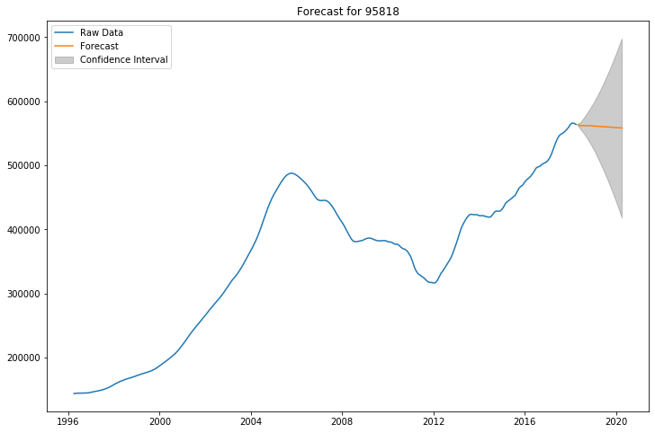


### Zip code 95818:  Do not invest--negative predicted return

By the model prediction, I would expect to see a -0.978% change in price by April 1, 2020
At the lower bound of the confidence interval, I would expect to see a -25.772% change in price by April 1, 2020
At the upper bound of the confidence interval, I would expect to see a 23.816% change in price by April 1, 2020


## SacMetro:  95630 (Folsom)--Mediocre predicted returns 

### Set up dataframe


```python
geog_area = '95630'
```


```python
city = 'Folsom'
```


```python
county = 'Sacramento'
```


```python
ts = df_sac.loc[df_sac['Zip'] == geog_area]
```


```python
ts.head()
```


<div>
<style scoped>
    .dataframe tbody tr th:only-of-type {
        vertical-align: middle;
    }

    .dataframe tbody tr th {
        vertical-align: top;
    }

    .dataframe thead th {
        text-align: right;
    }
</style>
<table border="1" class="dataframe">
  <thead>
    <tr style="text-align: right;">
      <th></th>
      <th>Metro</th>
      <th>MetroState</th>
      <th>CountyName</th>
      <th>City</th>
      <th>Zip</th>
      <th>value</th>
    </tr>
    <tr>
      <th>time</th>
      <th></th>
      <th></th>
      <th></th>
      <th></th>
      <th></th>
      <th></th>
    </tr>
  </thead>
  <tbody>
    <tr>
      <td>1996-04-01</td>
      <td>Sacramento</td>
      <td>Sacramento CA</td>
      <td>Sacramento</td>
      <td>Folsom</td>
      <td>95630</td>
      <td>190000.0</td>
    </tr>
    <tr>
      <td>1996-05-01</td>
      <td>Sacramento</td>
      <td>Sacramento CA</td>
      <td>Sacramento</td>
      <td>Folsom</td>
      <td>95630</td>
      <td>189300.0</td>
    </tr>
    <tr>
      <td>1996-06-01</td>
      <td>Sacramento</td>
      <td>Sacramento CA</td>
      <td>Sacramento</td>
      <td>Folsom</td>
      <td>95630</td>
      <td>188500.0</td>
    </tr>
    <tr>
      <td>1996-07-01</td>
      <td>Sacramento</td>
      <td>Sacramento CA</td>
      <td>Sacramento</td>
      <td>Folsom</td>
      <td>95630</td>
      <td>187800.0</td>
    </tr>
    <tr>
      <td>1996-08-01</td>
      <td>Sacramento</td>
      <td>Sacramento CA</td>
      <td>Sacramento</td>
      <td>Folsom</td>
      <td>95630</td>
      <td>187300.0</td>
    </tr>
  </tbody>
</table>
</div>


```python
ts = ts.resample('MS').asfreq()
```


```python
ts.head()
```


<div>
<style scoped>
    .dataframe tbody tr th:only-of-type {
        vertical-align: middle;
    }

    .dataframe tbody tr th {
        vertical-align: top;
    }

    .dataframe thead th {
        text-align: right;
    }
</style>
<table border="1" class="dataframe">
  <thead>
    <tr style="text-align: right;">
      <th></th>
      <th>Metro</th>
      <th>MetroState</th>
      <th>CountyName</th>
      <th>City</th>
      <th>Zip</th>
      <th>value</th>
    </tr>
    <tr>
      <th>time</th>
      <th></th>
      <th></th>
      <th></th>
      <th></th>
      <th></th>
      <th></th>
    </tr>
  </thead>
  <tbody>
    <tr>
      <td>1996-04-01</td>
      <td>Sacramento</td>
      <td>Sacramento CA</td>
      <td>Sacramento</td>
      <td>Folsom</td>
      <td>95630</td>
      <td>190000.0</td>
    </tr>
    <tr>
      <td>1996-05-01</td>
      <td>Sacramento</td>
      <td>Sacramento CA</td>
      <td>Sacramento</td>
      <td>Folsom</td>
      <td>95630</td>
      <td>189300.0</td>
    </tr>
    <tr>
      <td>1996-06-01</td>
      <td>Sacramento</td>
      <td>Sacramento CA</td>
      <td>Sacramento</td>
      <td>Folsom</td>
      <td>95630</td>
      <td>188500.0</td>
    </tr>
    <tr>
      <td>1996-07-01</td>
      <td>Sacramento</td>
      <td>Sacramento CA</td>
      <td>Sacramento</td>
      <td>Folsom</td>
      <td>95630</td>
      <td>187800.0</td>
    </tr>
    <tr>
      <td>1996-08-01</td>
      <td>Sacramento</td>
      <td>Sacramento CA</td>
      <td>Sacramento</td>
      <td>Folsom</td>
      <td>95630</td>
      <td>187300.0</td>
    </tr>
  </tbody>
</table>
</div>


### Visualizations


```python
plot_single_geog(df_melt, geog_area, 'value', 'Zip', figsize=(12, 6), fontsize1=12, fontsize2=16)
```


```python
ts.boxplot(column = 'value')
plt.title(geog_area);

```


```python
plot_acf_pacf(ts.value)
```


```python
plot_seasonal_decomp(ts.value);

# Note that seasonality isn't much of a factor here; maximum difference of about $700 over the course of a year
```


### ARIMA parameters tuning


```python
p_values = [0, 1, 2, 4, 6, 8, 10]
d_values = range(0, 3)
q_values = range(0, 3)

```


```python
# order_tuples_95630, mse_results_95630, best_cfg_95630, best_score_95630 = eval_params_and_lists(ts.value, p_values, d_values, q_values)

```

From old notebook:  Best ARIMA(2, 2, 0) MSE=1373937.757


```python
best_cfg = (2,2,0)
```


```python
best_cfg
```


    (2, 2, 0)


```python
# results_table_95630 = pd.DataFrame({'Order':order_tuples_95630, 'MSEs':mse_results_95630})
# results_table_95630
```

### ARIMA modeling and forecasting results


```python
print_results_lists()   # make sure that the lists are correct to this point
```


    (['95616', '95619', '95864', '95831', '95811', '95818'],
     ['Davis',
      'Diamond Springs',
      'Arden-Arcade',
      'Sacramento_Pocket',
      'Sacramento_DosRios',
      'Sacramento_LandPark'],
     ['Yolo', 'El Dorado', 'Sacramento', 'Sacramento', 'Sacramento', 'Sacramento'],
     [(2, 1, 2), (2, 1, 2), (8, 0, 2), (6, 0, 2), (10, 1, 0), (6, 2, 2)],
     [717863.06, 355774.45, 449047.92, 389675.07, 570598.7, 558380.08],
     [619575.34, 275292.09, 327568.68, 302216.31, 459606.77, 418566.82],
     [816150.79, 436256.81, 570527.16, 477133.84, 681590.63, 698193.34],
     [692300.0, 321100.0, 552700.0, 449300.0, 567500.0, 563900.0],
     [3.69, 10.8, -18.75, -13.27, 0.55, -0.98],
     [-10.5, -14.27, -40.73, -32.74, -19.01, -25.77],
     [17.89, 35.86, 3.23, 6.19, 20.1, 23.82])


```python
arima_forecast(ts, geog_area, city, county, p_values, d_values, q_values, best_cfg, confint=2, run_pdq = False)
```

    For 95630 (Folsom):
    Best ARIMA order = (2, 2, 0)
                                 ARIMA Model Results                              
    ==============================================================================
    Dep. Variable:               D2.value   No. Observations:                  263
    Model:                 ARIMA(2, 2, 0)   Log Likelihood               -2168.670
    Method:                       css-mle   S.D. of innovations            921.281
    Date:                Tue, 17 Mar 2020   AIC                           4345.340
    Time:                        15:19:59   BIC                           4359.628
    Sample:                    06-01-1996   HQIC                          4351.082
                             - 04-01-2018                                         
    ==================================================================================
                         coef    std err          z      P>|z|      [0.025      0.975]
    ----------------------------------------------------------------------------------
    const              2.8324     51.365      0.055      0.956     -97.841     103.506
    ar.L1.D2.value     0.3846      0.054      7.165      0.000       0.279       0.490
    ar.L2.D2.value    -0.4929      0.054     -9.124      0.000      -0.599      -0.387
                                        Roots                                    
    =============================================================================
                      Real          Imaginary           Modulus         Frequency
    -----------------------------------------------------------------------------
    AR.1            0.3901           -1.3700j            1.4244           -0.2058
    AR.2            0.3901           +1.3700j            1.4244            0.2058
    -----------------------------------------------------------------------------
    By the model prediction, I would expect to see a 0.538% change in price by April 1, 2020.
    At the lower bound of the confidence interval, I would expect to see a -21.171% change in price by April 1, 2020.
    At the upper bound of the confidence interval, I would expect to see a 22.247% change in price by April 1, 2020.


    (['95616', '95619', '95864', '95831', '95811', '95818', '95630'],
     ['Davis',
      'Diamond Springs',
      'Arden-Arcade',
      'Sacramento_Pocket',
      'Sacramento_DosRios',
      'Sacramento_LandPark',
      'Folsom'],
     ['Yolo',
      'El Dorado',
      'Sacramento',
      'Sacramento',
      'Sacramento',
      'Sacramento',
      'Sacramento'],
     [(2, 1, 2),
      (2, 1, 2),
      (8, 0, 2),
      (6, 0, 2),
      (10, 1, 0),
      (6, 2, 2),
      (2, 2, 0)],
     [717863.06, 355774.45, 449047.92, 389675.07, 570598.7, 558380.08, 545821.37],
     [619575.34, 275292.09, 327568.68, 302216.31, 459606.77, 418566.82, 427964.65],
     [816150.79, 436256.81, 570527.16, 477133.84, 681590.63, 698193.34, 663678.09],
     [692300.0, 321100.0, 552700.0, 449300.0, 567500.0, 563900.0, 542900.0],
     [3.69, 10.8, -18.75, -13.27, 0.55, -0.98, 0.54],
     [-10.5, -14.27, -40.73, -32.74, -19.01, -25.77, -21.17],
     [17.89, 35.86, 3.23, 6.19, 20.1, 23.82, 22.25])


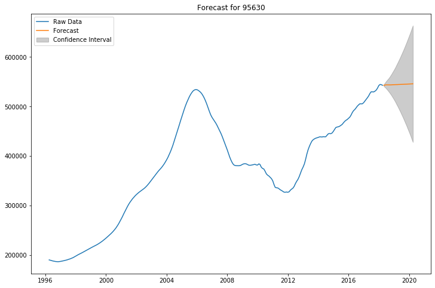


### Zip code 95630:  Mediocre earning potential, significant downside risk (but equally possible upside risk)

By the model prediction, I would expect to see a 0.538% change in price by April 1, 2020.
At the lower bound of the confidence interval, I would expect to see a -21.171% change in price by April 1, 2020. 
At the upper bound of the confidence interval, I would expect to see a 22.247% change in price by April 1, 2020. 


```python
# print_results_lists()
```

## SacMetro:  96140 (Carnelian Bay) -- Definite investment opportunity¶

### Set up dataframe


```python
geog_area = '96140'
```


```python
city = 'Carnelian Bay'
```


```python
county = 'Placer'
```


```python
ts = df_sac.loc[df_sac['Zip'] == geog_area]
```


```python
ts.head()
```


<div>
<style scoped>
    .dataframe tbody tr th:only-of-type {
        vertical-align: middle;
    }

    .dataframe tbody tr th {
        vertical-align: top;
    }

    .dataframe thead th {
        text-align: right;
    }
</style>
<table border="1" class="dataframe">
  <thead>
    <tr style="text-align: right;">
      <th></th>
      <th>Metro</th>
      <th>MetroState</th>
      <th>CountyName</th>
      <th>City</th>
      <th>Zip</th>
      <th>value</th>
    </tr>
    <tr>
      <th>time</th>
      <th></th>
      <th></th>
      <th></th>
      <th></th>
      <th></th>
      <th></th>
    </tr>
  </thead>
  <tbody>
    <tr>
      <td>1996-04-01</td>
      <td>Sacramento</td>
      <td>Sacramento CA</td>
      <td>Placer</td>
      <td>Carnelian Bay</td>
      <td>96140</td>
      <td>179100.0</td>
    </tr>
    <tr>
      <td>1996-05-01</td>
      <td>Sacramento</td>
      <td>Sacramento CA</td>
      <td>Placer</td>
      <td>Carnelian Bay</td>
      <td>96140</td>
      <td>179000.0</td>
    </tr>
    <tr>
      <td>1996-06-01</td>
      <td>Sacramento</td>
      <td>Sacramento CA</td>
      <td>Placer</td>
      <td>Carnelian Bay</td>
      <td>96140</td>
      <td>179000.0</td>
    </tr>
    <tr>
      <td>1996-07-01</td>
      <td>Sacramento</td>
      <td>Sacramento CA</td>
      <td>Placer</td>
      <td>Carnelian Bay</td>
      <td>96140</td>
      <td>178900.0</td>
    </tr>
    <tr>
      <td>1996-08-01</td>
      <td>Sacramento</td>
      <td>Sacramento CA</td>
      <td>Placer</td>
      <td>Carnelian Bay</td>
      <td>96140</td>
      <td>178900.0</td>
    </tr>
  </tbody>
</table>
</div>


```python
ts = ts.resample('MS').asfreq()
```


```python
ts.head()
```


<div>
<style scoped>
    .dataframe tbody tr th:only-of-type {
        vertical-align: middle;
    }

    .dataframe tbody tr th {
        vertical-align: top;
    }

    .dataframe thead th {
        text-align: right;
    }
</style>
<table border="1" class="dataframe">
  <thead>
    <tr style="text-align: right;">
      <th></th>
      <th>Metro</th>
      <th>MetroState</th>
      <th>CountyName</th>
      <th>City</th>
      <th>Zip</th>
      <th>value</th>
    </tr>
    <tr>
      <th>time</th>
      <th></th>
      <th></th>
      <th></th>
      <th></th>
      <th></th>
      <th></th>
    </tr>
  </thead>
  <tbody>
    <tr>
      <td>1996-04-01</td>
      <td>Sacramento</td>
      <td>Sacramento CA</td>
      <td>Placer</td>
      <td>Carnelian Bay</td>
      <td>96140</td>
      <td>179100.0</td>
    </tr>
    <tr>
      <td>1996-05-01</td>
      <td>Sacramento</td>
      <td>Sacramento CA</td>
      <td>Placer</td>
      <td>Carnelian Bay</td>
      <td>96140</td>
      <td>179000.0</td>
    </tr>
    <tr>
      <td>1996-06-01</td>
      <td>Sacramento</td>
      <td>Sacramento CA</td>
      <td>Placer</td>
      <td>Carnelian Bay</td>
      <td>96140</td>
      <td>179000.0</td>
    </tr>
    <tr>
      <td>1996-07-01</td>
      <td>Sacramento</td>
      <td>Sacramento CA</td>
      <td>Placer</td>
      <td>Carnelian Bay</td>
      <td>96140</td>
      <td>178900.0</td>
    </tr>
    <tr>
      <td>1996-08-01</td>
      <td>Sacramento</td>
      <td>Sacramento CA</td>
      <td>Placer</td>
      <td>Carnelian Bay</td>
      <td>96140</td>
      <td>178900.0</td>
    </tr>
  </tbody>
</table>
</div>


### Visualizations


```python
plot_single_geog(df_melt, geog_area, 'value', 'Zip', figsize=(12, 6), fontsize1=12, fontsize2=16)
```


```python
ts.boxplot(column = 'value')
plt.title(geog_area);

```


```python
plot_acf_pacf(ts.value)
```


```python
plot_seasonal_decomp(ts.value);

# Note that seasonality isn't much of a factor here; maximum difference of about $700 over the course of a year
```


### ARIMA parameters tuning


```python
p_values = [0, 1, 2, 4, 6, 8, 10]
d_values = range(0, 3)
q_values = range(0, 3)

```


```python
# order_tuples_96140, mse_results_96140, best_cfg_96140, best_score_96140 = eval_params_and_lists(ts.value, p_values, d_values, q_values)

```

From previous analyses:  Best ARIMA(4, 2, 1) MSE=3386317.647


```python
# best_cfg = best_cfg_96140
best_cfg = (4,2,1)
best_cfg
```


    (4, 2, 1)


```python
# results_table_96140 = pd.DataFrame({'Order':order_tuples_96140, 'MSEs':mse_results_96140})
# results_table_96140
```

### ARIMA modeling and forecasting results


```python
print_results_lists()   # make sure that the lists are correct to this point; 
                        # use pop_results_lists() to remove last item
```


    (['95616', '95619', '95864', '95831', '95811', '95818', '95630'],
     ['Davis',
      'Diamond Springs',
      'Arden-Arcade',
      'Sacramento_Pocket',
      'Sacramento_DosRios',
      'Sacramento_LandPark',
      'Folsom'],
     ['Yolo',
      'El Dorado',
      'Sacramento',
      'Sacramento',
      'Sacramento',
      'Sacramento',
      'Sacramento'],
     [(2, 1, 2),
      (2, 1, 2),
      (8, 0, 2),
      (6, 0, 2),
      (10, 1, 0),
      (6, 2, 2),
      (2, 2, 0)],
     [717863.06, 355774.45, 449047.92, 389675.07, 570598.7, 558380.08, 545821.37],
     [619575.34, 275292.09, 327568.68, 302216.31, 459606.77, 418566.82, 427964.65],
     [816150.79, 436256.81, 570527.16, 477133.84, 681590.63, 698193.34, 663678.09],
     [692300.0, 321100.0, 552700.0, 449300.0, 567500.0, 563900.0, 542900.0],
     [3.69, 10.8, -18.75, -13.27, 0.55, -0.98, 0.54],
     [-10.5, -14.27, -40.73, -32.74, -19.01, -25.77, -21.17],
     [17.89, 35.86, 3.23, 6.19, 20.1, 23.82, 22.25])


```python
arima_forecast(ts, geog_area, city, county, p_values, d_values, q_values, best_cfg, confint=2, run_pdq = False)
```

    For 96140 (Carnelian Bay):
    Best ARIMA order = (4, 2, 1)
                                 ARIMA Model Results                              
    ==============================================================================
    Dep. Variable:               D2.value   No. Observations:                  263
    Model:                 ARIMA(4, 2, 1)   Log Likelihood               -2375.535
    Method:                       css-mle   S.D. of innovations           2021.246
    Date:                Tue, 17 Mar 2020   AIC                           4765.071
    Time:                        15:21:04   BIC                           4790.076
    Sample:                    06-01-1996   HQIC                          4775.120
                             - 04-01-2018                                         
    ==================================================================================
                         coef    std err          z      P>|z|      [0.025      0.975]
    ----------------------------------------------------------------------------------
    const             20.1520    104.724      0.192      0.848    -185.103     225.407
    ar.L1.D2.value     0.9100      0.152      5.981      0.000       0.612       1.208
    ar.L2.D2.value    -0.8496      0.108     -7.888      0.000      -1.061      -0.638
    ar.L3.D2.value     0.4501      0.101      4.453      0.000       0.252       0.648
    ar.L4.D2.value    -0.3308      0.058     -5.685      0.000      -0.445      -0.217
    ma.L1.D2.value    -0.3144      0.158     -1.992      0.047      -0.624      -0.005
                                        Roots                                    
    =============================================================================
                      Real          Imaginary           Modulus         Frequency
    -----------------------------------------------------------------------------
    AR.1            0.9289           -0.8507j            1.2596           -0.1180
    AR.2            0.9289           +0.8507j            1.2596            0.1180
    AR.3           -0.2486           -1.3577j            1.3803           -0.2788
    AR.4           -0.2486           +1.3577j            1.3803            0.2788
    MA.1            3.1803           +0.0000j            3.1803            0.0000
    -----------------------------------------------------------------------------
    By the model prediction, I would expect to see a 19.421% change in price by April 1, 2020.
    At the lower bound of the confidence interval, I would expect to see a -19.639% change in price by April 1, 2020.
    At the upper bound of the confidence interval, I would expect to see a 58.48% change in price by April 1, 2020.


    (['95616', '95619', '95864', '95831', '95811', '95818', '95630', '96140'],
     ['Davis',
      'Diamond Springs',
      'Arden-Arcade',
      'Sacramento_Pocket',
      'Sacramento_DosRios',
      'Sacramento_LandPark',
      'Folsom',
      'Carnelian Bay'],
     ['Yolo',
      'El Dorado',
      'Sacramento',
      'Sacramento',
      'Sacramento',
      'Sacramento',
      'Sacramento',
      'Placer'],
     [(2, 1, 2),
      (2, 1, 2),
      (8, 0, 2),
      (6, 0, 2),
      (10, 1, 0),
      (6, 2, 2),
      (2, 2, 0),
      (4, 2, 1)],
     [717863.06,
      355774.45,
      449047.92,
      389675.07,
      570598.7,
      558380.08,
      545821.37,
      769785.39],
     [619575.34,
      275292.09,
      327568.68,
      302216.31,
      459606.77,
      418566.82,
      427964.65,
      518008.87],
     [816150.79,
      436256.81,
      570527.16,
      477133.84,
      681590.63,
      698193.34,
      663678.09,
      1021561.92],
     [692300.0,
      321100.0,
      552700.0,
      449300.0,
      567500.0,
      563900.0,
      542900.0,
      644600.0],
     [3.69, 10.8, -18.75, -13.27, 0.55, -0.98, 0.54, 19.42],
     [-10.5, -14.27, -40.73, -32.74, -19.01, -25.77, -21.17, -19.64],
     [17.89, 35.86, 3.23, 6.19, 20.1, 23.82, 22.25, 58.48])


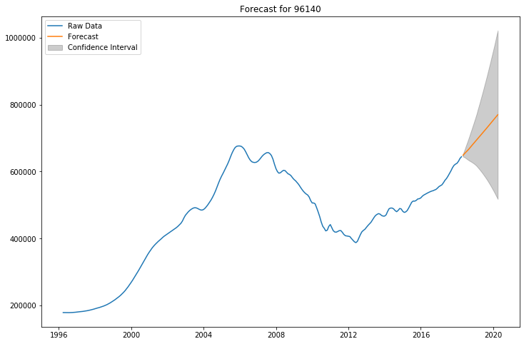


### Zip code 96140 (Carnelian Bay):  Definite investment opportunity with potentially large upside returns

By the model prediction, I would expect to see a 19.421% change in price by April 1, 2020
At the lower bound of the confidence interval, I would expect to see a -19.639% change in price by April 1, 2020
At the upper bound of the confidence interval, I would expect to see a 58.48% change in price by April 1, 2020


## SacMetro:  95672 (Rescue) -- Solid investment opportunity 

### Set up dataframe


```python
geog_area = '95672'
```


```python
city = 'Rescue'
```


```python
county = 'El Dorado'
```


```python
ts = df_sac.loc[df_sac['Zip'] == geog_area]
```


```python
ts.head()
```


<div>
<style scoped>
    .dataframe tbody tr th:only-of-type {
        vertical-align: middle;
    }

    .dataframe tbody tr th {
        vertical-align: top;
    }

    .dataframe thead th {
        text-align: right;
    }
</style>
<table border="1" class="dataframe">
  <thead>
    <tr style="text-align: right;">
      <th></th>
      <th>Metro</th>
      <th>MetroState</th>
      <th>CountyName</th>
      <th>City</th>
      <th>Zip</th>
      <th>value</th>
    </tr>
    <tr>
      <th>time</th>
      <th></th>
      <th></th>
      <th></th>
      <th></th>
      <th></th>
      <th></th>
    </tr>
  </thead>
  <tbody>
    <tr>
      <td>1996-04-01</td>
      <td>Sacramento</td>
      <td>Sacramento CA</td>
      <td>El Dorado</td>
      <td>Rescue</td>
      <td>95672</td>
      <td>196500.0</td>
    </tr>
    <tr>
      <td>1996-05-01</td>
      <td>Sacramento</td>
      <td>Sacramento CA</td>
      <td>El Dorado</td>
      <td>Rescue</td>
      <td>95672</td>
      <td>196600.0</td>
    </tr>
    <tr>
      <td>1996-06-01</td>
      <td>Sacramento</td>
      <td>Sacramento CA</td>
      <td>El Dorado</td>
      <td>Rescue</td>
      <td>95672</td>
      <td>196700.0</td>
    </tr>
    <tr>
      <td>1996-07-01</td>
      <td>Sacramento</td>
      <td>Sacramento CA</td>
      <td>El Dorado</td>
      <td>Rescue</td>
      <td>95672</td>
      <td>196900.0</td>
    </tr>
    <tr>
      <td>1996-08-01</td>
      <td>Sacramento</td>
      <td>Sacramento CA</td>
      <td>El Dorado</td>
      <td>Rescue</td>
      <td>95672</td>
      <td>197000.0</td>
    </tr>
  </tbody>
</table>
</div>


```python
ts = ts.resample('MS').asfreq()
```


```python
ts.head()
```


<div>
<style scoped>
    .dataframe tbody tr th:only-of-type {
        vertical-align: middle;
    }

    .dataframe tbody tr th {
        vertical-align: top;
    }

    .dataframe thead th {
        text-align: right;
    }
</style>
<table border="1" class="dataframe">
  <thead>
    <tr style="text-align: right;">
      <th></th>
      <th>Metro</th>
      <th>MetroState</th>
      <th>CountyName</th>
      <th>City</th>
      <th>Zip</th>
      <th>value</th>
    </tr>
    <tr>
      <th>time</th>
      <th></th>
      <th></th>
      <th></th>
      <th></th>
      <th></th>
      <th></th>
    </tr>
  </thead>
  <tbody>
    <tr>
      <td>1996-04-01</td>
      <td>Sacramento</td>
      <td>Sacramento CA</td>
      <td>El Dorado</td>
      <td>Rescue</td>
      <td>95672</td>
      <td>196500.0</td>
    </tr>
    <tr>
      <td>1996-05-01</td>
      <td>Sacramento</td>
      <td>Sacramento CA</td>
      <td>El Dorado</td>
      <td>Rescue</td>
      <td>95672</td>
      <td>196600.0</td>
    </tr>
    <tr>
      <td>1996-06-01</td>
      <td>Sacramento</td>
      <td>Sacramento CA</td>
      <td>El Dorado</td>
      <td>Rescue</td>
      <td>95672</td>
      <td>196700.0</td>
    </tr>
    <tr>
      <td>1996-07-01</td>
      <td>Sacramento</td>
      <td>Sacramento CA</td>
      <td>El Dorado</td>
      <td>Rescue</td>
      <td>95672</td>
      <td>196900.0</td>
    </tr>
    <tr>
      <td>1996-08-01</td>
      <td>Sacramento</td>
      <td>Sacramento CA</td>
      <td>El Dorado</td>
      <td>Rescue</td>
      <td>95672</td>
      <td>197000.0</td>
    </tr>
  </tbody>
</table>
</div>


### Visualizations


```python
plot_single_geog(df_melt, geog_area, 'value', 'Zip', figsize=(12, 6), fontsize1=12, fontsize2=16)
```


```python
ts.boxplot(column = 'value')
plt.title(geog_area);

```


```python
plot_acf_pacf(ts.value)
```


```python
plot_seasonal_decomp(ts.value);

# Note that seasonality isn't much of a factor here; maximum difference of about $700 over the course of a year
```


### ARIMA parameters tuning


```python
p_values = [0, 1, 2, 4, 6, 8, 10]
d_values = range(0, 3)
q_values = range(0, 3)

```


```python
# order_tuples_95672, mse_results_95672, best_cfg_95672, best_score_95672 = eval_params_and_lists(ts.value, p_values, d_values, q_values)

```

From previous analysis:  Best ARIMA(8, 2, 0) MSE=3175806.269


```python
# best_cfg = best_cfg_95672
best_cfg = (8,2,0)
best_cfg
```


    (8, 2, 0)


```python
# results_table_95672 = pd.DataFrame({'Order':order_tuples_95672, 'MSEs':mse_results_95672})
# results_table_95672
```

### ARIMA modeling and forecasting results


```python
print_results_lists()   # make sure that the lists are correct to this point; 
                        # use pop_results_lists() to remove last item
```


    (['95616', '95619', '95864', '95831', '95811', '95818', '95630', '96140'],
     ['Davis',
      'Diamond Springs',
      'Arden-Arcade',
      'Sacramento_Pocket',
      'Sacramento_DosRios',
      'Sacramento_LandPark',
      'Folsom',
      'Carnelian Bay'],
     ['Yolo',
      'El Dorado',
      'Sacramento',
      'Sacramento',
      'Sacramento',
      'Sacramento',
      'Sacramento',
      'Placer'],
     [(2, 1, 2),
      (2, 1, 2),
      (8, 0, 2),
      (6, 0, 2),
      (10, 1, 0),
      (6, 2, 2),
      (2, 2, 0),
      (4, 2, 1)],
     [717863.06,
      355774.45,
      449047.92,
      389675.07,
      570598.7,
      558380.08,
      545821.37,
      769785.39],
     [619575.34,
      275292.09,
      327568.68,
      302216.31,
      459606.77,
      418566.82,
      427964.65,
      518008.87],
     [816150.79,
      436256.81,
      570527.16,
      477133.84,
      681590.63,
      698193.34,
      663678.09,
      1021561.92],
     [692300.0,
      321100.0,
      552700.0,
      449300.0,
      567500.0,
      563900.0,
      542900.0,
      644600.0],
     [3.69, 10.8, -18.75, -13.27, 0.55, -0.98, 0.54, 19.42],
     [-10.5, -14.27, -40.73, -32.74, -19.01, -25.77, -21.17, -19.64],
     [17.89, 35.86, 3.23, 6.19, 20.1, 23.82, 22.25, 58.48])


```python
arima_forecast(ts, geog_area, city, county, p_values, d_values, q_values, best_cfg, confint=2, run_pdq = False)
```

    For 95672 (Rescue):
    Best ARIMA order = (8, 2, 0)
                                 ARIMA Model Results                              
    ==============================================================================
    Dep. Variable:               D2.value   No. Observations:                  263
    Model:                 ARIMA(8, 2, 0)   Log Likelihood               -2196.091
    Method:                       css-mle   S.D. of innovations           1017.706
    Date:                Tue, 17 Mar 2020   AIC                           4412.182
    Time:                        15:22:18   BIC                           4447.903
    Sample:                    06-01-1996   HQIC                          4426.537
                             - 04-01-2018                                         
    ==================================================================================
                         coef    std err          z      P>|z|      [0.025      0.975]
    ----------------------------------------------------------------------------------
    const             28.0877    101.416      0.277      0.782    -170.684     226.859
    ar.L1.D2.value     0.8942      0.059     15.057      0.000       0.778       1.011
    ar.L2.D2.value    -0.9619      0.076    -12.703      0.000      -1.110      -0.813
    ar.L3.D2.value     0.3622      0.085      4.255      0.000       0.195       0.529
    ar.L4.D2.value     0.0977      0.081      1.203      0.230      -0.061       0.257
    ar.L5.D2.value    -0.5539      0.085     -6.518      0.000      -0.721      -0.387
    ar.L6.D2.value     0.7211      0.090      7.982      0.000       0.544       0.898
    ar.L7.D2.value    -0.5241      0.080     -6.582      0.000      -0.680      -0.368
    ar.L8.D2.value     0.3499      0.061      5.696      0.000       0.230       0.470
                                        Roots                                    
    =============================================================================
                      Real          Imaginary           Modulus         Frequency
    -----------------------------------------------------------------------------
    AR.1           -1.0744           -0.0000j            1.0744           -0.5000
    AR.2           -0.3584           -1.0556j            1.1148           -0.3021
    AR.3           -0.3584           +1.0556j            1.1148            0.3021
    AR.4            1.2158           -0.0000j            1.2158           -0.0000
    AR.5            0.7966           -0.8164j            1.1407           -0.1270
    AR.6            0.7966           +0.8164j            1.1407            0.1270
    AR.7            0.2399           -1.1381j            1.1631           -0.2169
    AR.8            0.2399           +1.1381j            1.1631            0.2169
    -----------------------------------------------------------------------------
    By the model prediction, I would expect to see a 32.293% change in price by April 1, 2020.
    At the lower bound of the confidence interval, I would expect to see a -2.978% change in price by April 1, 2020.
    At the upper bound of the confidence interval, I would expect to see a 67.564% change in price by April 1, 2020.


    (['95616',
      '95619',
      '95864',
      '95831',
      '95811',
      '95818',
      '95630',
      '96140',
      '95672'],
     ['Davis',
      'Diamond Springs',
      'Arden-Arcade',
      'Sacramento_Pocket',
      'Sacramento_DosRios',
      'Sacramento_LandPark',
      'Folsom',
      'Carnelian Bay',
      'Rescue'],
     ['Yolo',
      'El Dorado',
      'Sacramento',
      'Sacramento',
      'Sacramento',
      'Sacramento',
      'Sacramento',
      'Placer',
      'El Dorado'],
     [(2, 1, 2),
      (2, 1, 2),
      (8, 0, 2),
      (6, 0, 2),
      (10, 1, 0),
      (6, 2, 2),
      (2, 2, 0),
      (4, 2, 1),
      (8, 2, 0)],
     [717863.06,
      355774.45,
      449047.92,
      389675.07,
      570598.7,
      558380.08,
      545821.37,
      769785.39,
      766372.9],
     [619575.34,
      275292.09,
      327568.68,
      302216.31,
      459606.77,
      418566.82,
      427964.65,
      518008.87,
      562046.69],
     [816150.79,
      436256.81,
      570527.16,
      477133.84,
      681590.63,
      698193.34,
      663678.09,
      1021561.92,
      970699.1],
     [692300.0,
      321100.0,
      552700.0,
      449300.0,
      567500.0,
      563900.0,
      542900.0,
      644600.0,
      579300.0],
     [3.69, 10.8, -18.75, -13.27, 0.55, -0.98, 0.54, 19.42, 32.29],
     [-10.5, -14.27, -40.73, -32.74, -19.01, -25.77, -21.17, -19.64, -2.98],
     [17.89, 35.86, 3.23, 6.19, 20.1, 23.82, 22.25, 58.48, 67.56])


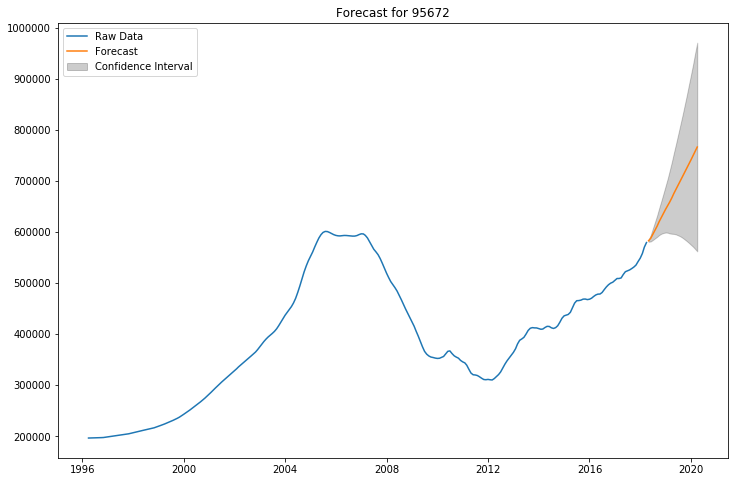


### Zip code 95672 (Rescue):  Good investment opportunity

By the model prediction, I would expect to see a 32.296% change in price by April 1, 2020
At the lower bound of the confidence interval, I would expect to see a -2.975% change in price by April 1, 2020
At the upper bound of the confidence interval, I would expect to see a 67.567% change in price by April 1, 2020


## SacMetro:  95636 (Somerset) -- Potential investment opportunity

### Set up dataframe


```python
geog_area = '95636'
```


```python
city = 'Somerset'
```


```python
county = 'El Dorado'
```


```python
ts = df_sac.loc[df_sac['Zip'] == geog_area]
```


```python
ts.head()
```


<div>
<style scoped>
    .dataframe tbody tr th:only-of-type {
        vertical-align: middle;
    }

    .dataframe tbody tr th {
        vertical-align: top;
    }

    .dataframe thead th {
        text-align: right;
    }
</style>
<table border="1" class="dataframe">
  <thead>
    <tr style="text-align: right;">
      <th></th>
      <th>Metro</th>
      <th>MetroState</th>
      <th>CountyName</th>
      <th>City</th>
      <th>Zip</th>
      <th>value</th>
    </tr>
    <tr>
      <th>time</th>
      <th></th>
      <th></th>
      <th></th>
      <th></th>
      <th></th>
      <th></th>
    </tr>
  </thead>
  <tbody>
    <tr>
      <td>1996-04-01</td>
      <td>Sacramento</td>
      <td>Sacramento CA</td>
      <td>El Dorado</td>
      <td>Somerset</td>
      <td>95636</td>
      <td>95100.0</td>
    </tr>
    <tr>
      <td>1996-05-01</td>
      <td>Sacramento</td>
      <td>Sacramento CA</td>
      <td>El Dorado</td>
      <td>Somerset</td>
      <td>95636</td>
      <td>95400.0</td>
    </tr>
    <tr>
      <td>1996-06-01</td>
      <td>Sacramento</td>
      <td>Sacramento CA</td>
      <td>El Dorado</td>
      <td>Somerset</td>
      <td>95636</td>
      <td>95600.0</td>
    </tr>
    <tr>
      <td>1996-07-01</td>
      <td>Sacramento</td>
      <td>Sacramento CA</td>
      <td>El Dorado</td>
      <td>Somerset</td>
      <td>95636</td>
      <td>95900.0</td>
    </tr>
    <tr>
      <td>1996-08-01</td>
      <td>Sacramento</td>
      <td>Sacramento CA</td>
      <td>El Dorado</td>
      <td>Somerset</td>
      <td>95636</td>
      <td>96200.0</td>
    </tr>
  </tbody>
</table>
</div>


```python
ts = ts.resample('MS').asfreq()
```


```python
ts.head()
```


<div>
<style scoped>
    .dataframe tbody tr th:only-of-type {
        vertical-align: middle;
    }

    .dataframe tbody tr th {
        vertical-align: top;
    }

    .dataframe thead th {
        text-align: right;
    }
</style>
<table border="1" class="dataframe">
  <thead>
    <tr style="text-align: right;">
      <th></th>
      <th>Metro</th>
      <th>MetroState</th>
      <th>CountyName</th>
      <th>City</th>
      <th>Zip</th>
      <th>value</th>
    </tr>
    <tr>
      <th>time</th>
      <th></th>
      <th></th>
      <th></th>
      <th></th>
      <th></th>
      <th></th>
    </tr>
  </thead>
  <tbody>
    <tr>
      <td>1996-04-01</td>
      <td>Sacramento</td>
      <td>Sacramento CA</td>
      <td>El Dorado</td>
      <td>Somerset</td>
      <td>95636</td>
      <td>95100.0</td>
    </tr>
    <tr>
      <td>1996-05-01</td>
      <td>Sacramento</td>
      <td>Sacramento CA</td>
      <td>El Dorado</td>
      <td>Somerset</td>
      <td>95636</td>
      <td>95400.0</td>
    </tr>
    <tr>
      <td>1996-06-01</td>
      <td>Sacramento</td>
      <td>Sacramento CA</td>
      <td>El Dorado</td>
      <td>Somerset</td>
      <td>95636</td>
      <td>95600.0</td>
    </tr>
    <tr>
      <td>1996-07-01</td>
      <td>Sacramento</td>
      <td>Sacramento CA</td>
      <td>El Dorado</td>
      <td>Somerset</td>
      <td>95636</td>
      <td>95900.0</td>
    </tr>
    <tr>
      <td>1996-08-01</td>
      <td>Sacramento</td>
      <td>Sacramento CA</td>
      <td>El Dorado</td>
      <td>Somerset</td>
      <td>95636</td>
      <td>96200.0</td>
    </tr>
  </tbody>
</table>
</div>


### Visualizations


```python
plot_single_geog(df_melt, geog_area, 'value', 'Zip', figsize=(12, 6), fontsize1=12, fontsize2=16)
```


```python
ts.boxplot(column = 'value')
plt.title(geog_area);

```


```python
plot_acf_pacf(ts.value)
```


```python
plot_seasonal_decomp(ts.value);

# Note that seasonality isn't much of a factor here; maximum difference of about $700 over the course of a year
```


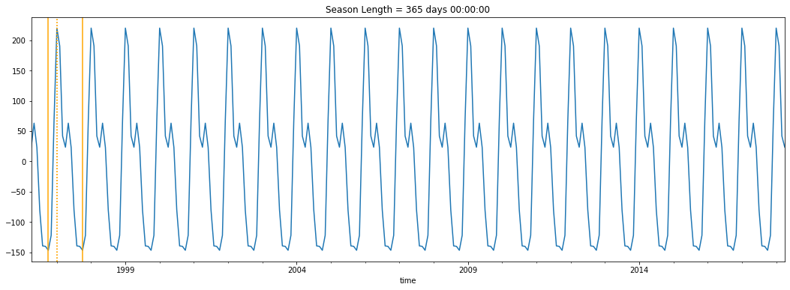


### ARIMA parameters tuning


```python
p_values = [0, 1, 2, 4, 6, 8, 10]
d_values = range(0, 3)
q_values = range(0, 3)

```


```python
# order_tuples_95636, mse_results_95636, best_cfg_95636, best_score_95636 = eval_params_and_lists(ts.value, p_values, d_values, q_values)

```

From previous analyses:  Best ARIMA(8, 2, 1) MSE=1389280.792


```python
# best_cfg = best_cfg_95636
best_cfg = (8,2,1)
best_cfg
```


    (8, 2, 1)


```python
# results_table_95636 = pd.DataFrame({'Order':order_tuples_95636, 'MSEs':mse_results_95636})
# results_table_95636
```

### ARIMA modeling and forecasting results


```python
print_results_lists()   # make sure that the lists are correct to this point; 
                        # use pop_results_lists() to remove last item
```


    (['95616',
      '95619',
      '95864',
      '95831',
      '95811',
      '95818',
      '95630',
      '96140',
      '95672'],
     ['Davis',
      'Diamond Springs',
      'Arden-Arcade',
      'Sacramento_Pocket',
      'Sacramento_DosRios',
      'Sacramento_LandPark',
      'Folsom',
      'Carnelian Bay',
      'Rescue'],
     ['Yolo',
      'El Dorado',
      'Sacramento',
      'Sacramento',
      'Sacramento',
      'Sacramento',
      'Sacramento',
      'Placer',
      'El Dorado'],
     [(2, 1, 2),
      (2, 1, 2),
      (8, 0, 2),
      (6, 0, 2),
      (10, 1, 0),
      (6, 2, 2),
      (2, 2, 0),
      (4, 2, 1),
      (8, 2, 0)],
     [717863.06,
      355774.45,
      449047.92,
      389675.07,
      570598.7,
      558380.08,
      545821.37,
      769785.39,
      766372.9],
     [619575.34,
      275292.09,
      327568.68,
      302216.31,
      459606.77,
      418566.82,
      427964.65,
      518008.87,
      562046.69],
     [816150.79,
      436256.81,
      570527.16,
      477133.84,
      681590.63,
      698193.34,
      663678.09,
      1021561.92,
      970699.1],
     [692300.0,
      321100.0,
      552700.0,
      449300.0,
      567500.0,
      563900.0,
      542900.0,
      644600.0,
      579300.0],
     [3.69, 10.8, -18.75, -13.27, 0.55, -0.98, 0.54, 19.42, 32.29],
     [-10.5, -14.27, -40.73, -32.74, -19.01, -25.77, -21.17, -19.64, -2.98],
     [17.89, 35.86, 3.23, 6.19, 20.1, 23.82, 22.25, 58.48, 67.56])


```python
arima_forecast(ts, geog_area, city, county, p_values, d_values, q_values, best_cfg, confint=2, run_pdq = False)
```

    For 95636 (Somerset):
    Best ARIMA order = (8, 2, 1)
                                 ARIMA Model Results                              
    ==============================================================================
    Dep. Variable:               D2.value   No. Observations:                  263
    Model:                 ARIMA(8, 2, 1)   Log Likelihood               -2096.633
    Method:                       css-mle   S.D. of innovations            697.343
    Date:                Tue, 17 Mar 2020   AIC                           4215.265
    Time:                        15:23:02   BIC                           4254.559
    Sample:                    06-01-1996   HQIC                          4231.057
                             - 04-01-2018                                         
    ==================================================================================
                         coef    std err          z      P>|z|      [0.025      0.975]
    ----------------------------------------------------------------------------------
    const              2.4022     54.241      0.044      0.965    -103.909     108.713
    ar.L1.D2.value     1.1070      0.131      8.455      0.000       0.850       1.364
    ar.L2.D2.value    -1.1745      0.134     -8.795      0.000      -1.436      -0.913
    ar.L3.D2.value     0.4903      0.149      3.285      0.001       0.198       0.783
    ar.L4.D2.value     0.0449      0.102      0.441      0.659      -0.155       0.244
    ar.L5.D2.value    -0.6121      0.100     -6.105      0.000      -0.809      -0.416
    ar.L6.D2.value     0.6956      0.118      5.903      0.000       0.465       0.927
    ar.L7.D2.value    -0.5329      0.091     -5.842      0.000      -0.712      -0.354
    ar.L8.D2.value     0.3138      0.062      5.036      0.000       0.192       0.436
    ma.L1.D2.value    -0.1573      0.129     -1.217      0.225      -0.411       0.096
                                        Roots                                    
    =============================================================================
                      Real          Imaginary           Modulus         Frequency
    -----------------------------------------------------------------------------
    AR.1           -1.1161           -0.0000j            1.1161           -0.5000
    AR.2            1.3071           -0.0000j            1.3071           -0.0000
    AR.3            0.8083           -0.7569j            1.1074           -0.1198
    AR.4            0.8083           +0.7569j            1.1074            0.1198
    AR.5           -0.3163           -1.1121j            1.1562           -0.2941
    AR.6           -0.3163           +1.1121j            1.1562            0.2941
    AR.7            0.2617           -1.1244j            1.1544           -0.2136
    AR.8            0.2617           +1.1244j            1.1544            0.2136
    MA.1            6.3576           +0.0000j            6.3576            0.0000
    -----------------------------------------------------------------------------
    By the model prediction, I would expect to see a 11.21% change in price by April 1, 2020.
    At the lower bound of the confidence interval, I would expect to see a -38.228% change in price by April 1, 2020.
    At the upper bound of the confidence interval, I would expect to see a 60.649% change in price by April 1, 2020.


    (['95616',
      '95619',
      '95864',
      '95831',
      '95811',
      '95818',
      '95630',
      '96140',
      '95672',
      '95636'],
     ['Davis',
      'Diamond Springs',
      'Arden-Arcade',
      'Sacramento_Pocket',
      'Sacramento_DosRios',
      'Sacramento_LandPark',
      'Folsom',
      'Carnelian Bay',
      'Rescue',
      'Somerset'],
     ['Yolo',
      'El Dorado',
      'Sacramento',
      'Sacramento',
      'Sacramento',
      'Sacramento',
      'Sacramento',
      'Placer',
      'El Dorado',
      'El Dorado'],
     [(2, 1, 2),
      (2, 1, 2),
      (8, 0, 2),
      (6, 0, 2),
      (10, 1, 0),
      (6, 2, 2),
      (2, 2, 0),
      (4, 2, 1),
      (8, 2, 0),
      (8, 2, 1)],
     [717863.06,
      355774.45,
      449047.92,
      389675.07,
      570598.7,
      558380.08,
      545821.37,
      769785.39,
      766372.9,
      268239.06],
     [619575.34,
      275292.09,
      327568.68,
      302216.31,
      459606.77,
      418566.82,
      427964.65,
      518008.87,
      562046.69,
      148993.04],
     [816150.79,
      436256.81,
      570527.16,
      477133.84,
      681590.63,
      698193.34,
      663678.09,
      1021561.92,
      970699.1,
      387485.09],
     [692300.0,
      321100.0,
      552700.0,
      449300.0,
      567500.0,
      563900.0,
      542900.0,
      644600.0,
      579300.0,
      241200.0],
     [3.69, 10.8, -18.75, -13.27, 0.55, -0.98, 0.54, 19.42, 32.29, 11.21],
     [-10.5,
      -14.27,
      -40.73,
      -32.74,
      -19.01,
      -25.77,
      -21.17,
      -19.64,
      -2.98,
      -38.23],
     [17.89, 35.86, 3.23, 6.19, 20.1, 23.82, 22.25, 58.48, 67.56, 60.65])


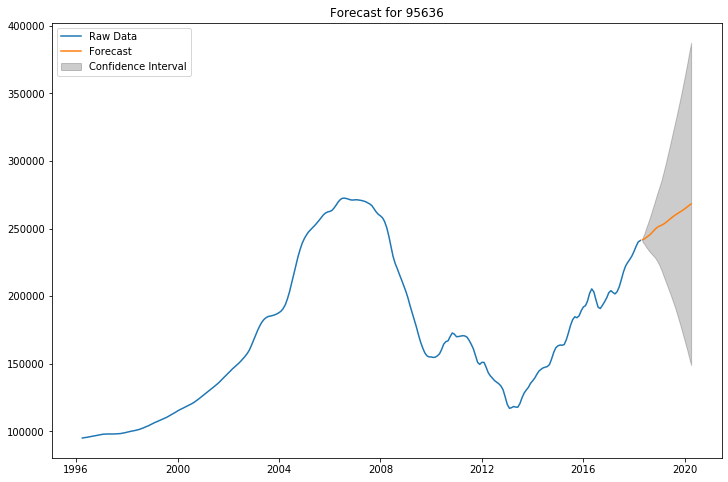


### Zip code 95636:  Good return predicted, but has very large potential downside (as well as large potential upside)

By the model prediction, I would expect to see a 11.207% change in price by April 1, 2020
At the lower bound of the confidence interval, I would expect to see a -38.231% change in price by April 1, 2020
At the upper bound of the confidence interval, I would expect to see a 60.646% change in price by April 1, 2020


```python
print_results_lists()
```


    (['95616',
      '95619',
      '95864',
      '95831',
      '95811',
      '95818',
      '95630',
      '96140',
      '95672',
      '95636'],
     ['Davis',
      'Diamond Springs',
      'Arden-Arcade',
      'Sacramento_Pocket',
      'Sacramento_DosRios',
      'Sacramento_LandPark',
      'Folsom',
      'Carnelian Bay',
      'Rescue',
      'Somerset'],
     ['Yolo',
      'El Dorado',
      'Sacramento',
      'Sacramento',
      'Sacramento',
      'Sacramento',
      'Sacramento',
      'Placer',
      'El Dorado',
      'El Dorado'],
     [(2, 1, 2),
      (2, 1, 2),
      (8, 0, 2),
      (6, 0, 2),
      (10, 1, 0),
      (6, 2, 2),
      (2, 2, 0),
      (4, 2, 1),
      (8, 2, 0),
      (8, 2, 1)],
     [717863.06,
      355774.45,
      449047.92,
      389675.07,
      570598.7,
      558380.08,
      545821.37,
      769785.39,
      766372.9,
      268239.06],
     [619575.34,
      275292.09,
      327568.68,
      302216.31,
      459606.77,
      418566.82,
      427964.65,
      518008.87,
      562046.69,
      148993.04],
     [816150.79,
      436256.81,
      570527.16,
      477133.84,
      681590.63,
      698193.34,
      663678.09,
      1021561.92,
      970699.1,
      387485.09],
     [692300.0,
      321100.0,
      552700.0,
      449300.0,
      567500.0,
      563900.0,
      542900.0,
      644600.0,
      579300.0,
      241200.0],
     [3.69, 10.8, -18.75, -13.27, 0.55, -0.98, 0.54, 19.42, 32.29, 11.21],
     [-10.5,
      -14.27,
      -40.73,
      -32.74,
      -19.01,
      -25.77,
      -21.17,
      -19.64,
      -2.98,
      -38.23],
     [17.89, 35.86, 3.23, 6.19, 20.1, 23.82, 22.25, 58.48, 67.56, 60.65])


## SacMetro:  95709 (Camino) -- Don't invest

### Set up dataframe


```python
geog_area = '95709'
```


```python
city = 'Camino'
```


```python
county = 'El Dorado'
```


```python
ts = df_sac.loc[df_sac['Zip'] == geog_area]
```


```python
ts.head()
```


<div>
<style scoped>
    .dataframe tbody tr th:only-of-type {
        vertical-align: middle;
    }

    .dataframe tbody tr th {
        vertical-align: top;
    }

    .dataframe thead th {
        text-align: right;
    }
</style>
<table border="1" class="dataframe">
  <thead>
    <tr style="text-align: right;">
      <th></th>
      <th>Metro</th>
      <th>MetroState</th>
      <th>CountyName</th>
      <th>City</th>
      <th>Zip</th>
      <th>value</th>
    </tr>
    <tr>
      <th>time</th>
      <th></th>
      <th></th>
      <th></th>
      <th></th>
      <th></th>
      <th></th>
    </tr>
  </thead>
  <tbody>
    <tr>
      <td>1996-04-01</td>
      <td>Sacramento</td>
      <td>Sacramento CA</td>
      <td>El Dorado</td>
      <td>Camino</td>
      <td>95709</td>
      <td>141500.0</td>
    </tr>
    <tr>
      <td>1996-05-01</td>
      <td>Sacramento</td>
      <td>Sacramento CA</td>
      <td>El Dorado</td>
      <td>Camino</td>
      <td>95709</td>
      <td>141500.0</td>
    </tr>
    <tr>
      <td>1996-06-01</td>
      <td>Sacramento</td>
      <td>Sacramento CA</td>
      <td>El Dorado</td>
      <td>Camino</td>
      <td>95709</td>
      <td>141500.0</td>
    </tr>
    <tr>
      <td>1996-07-01</td>
      <td>Sacramento</td>
      <td>Sacramento CA</td>
      <td>El Dorado</td>
      <td>Camino</td>
      <td>95709</td>
      <td>141500.0</td>
    </tr>
    <tr>
      <td>1996-08-01</td>
      <td>Sacramento</td>
      <td>Sacramento CA</td>
      <td>El Dorado</td>
      <td>Camino</td>
      <td>95709</td>
      <td>141600.0</td>
    </tr>
  </tbody>
</table>
</div>


```python
ts = ts.resample('MS').asfreq()
```


```python
ts.head()
```


<div>
<style scoped>
    .dataframe tbody tr th:only-of-type {
        vertical-align: middle;
    }

    .dataframe tbody tr th {
        vertical-align: top;
    }

    .dataframe thead th {
        text-align: right;
    }
</style>
<table border="1" class="dataframe">
  <thead>
    <tr style="text-align: right;">
      <th></th>
      <th>Metro</th>
      <th>MetroState</th>
      <th>CountyName</th>
      <th>City</th>
      <th>Zip</th>
      <th>value</th>
    </tr>
    <tr>
      <th>time</th>
      <th></th>
      <th></th>
      <th></th>
      <th></th>
      <th></th>
      <th></th>
    </tr>
  </thead>
  <tbody>
    <tr>
      <td>1996-04-01</td>
      <td>Sacramento</td>
      <td>Sacramento CA</td>
      <td>El Dorado</td>
      <td>Camino</td>
      <td>95709</td>
      <td>141500.0</td>
    </tr>
    <tr>
      <td>1996-05-01</td>
      <td>Sacramento</td>
      <td>Sacramento CA</td>
      <td>El Dorado</td>
      <td>Camino</td>
      <td>95709</td>
      <td>141500.0</td>
    </tr>
    <tr>
      <td>1996-06-01</td>
      <td>Sacramento</td>
      <td>Sacramento CA</td>
      <td>El Dorado</td>
      <td>Camino</td>
      <td>95709</td>
      <td>141500.0</td>
    </tr>
    <tr>
      <td>1996-07-01</td>
      <td>Sacramento</td>
      <td>Sacramento CA</td>
      <td>El Dorado</td>
      <td>Camino</td>
      <td>95709</td>
      <td>141500.0</td>
    </tr>
    <tr>
      <td>1996-08-01</td>
      <td>Sacramento</td>
      <td>Sacramento CA</td>
      <td>El Dorado</td>
      <td>Camino</td>
      <td>95709</td>
      <td>141600.0</td>
    </tr>
  </tbody>
</table>
</div>


### Visualizations


```python
plot_single_geog(df_melt, geog_area, 'value', 'Zip', figsize=(12, 6), fontsize1=12, fontsize2=16)
```


```python
ts.boxplot(column = 'value')
plt.title(geog_area);

```


```python
plot_acf_pacf(ts.value)
```


```python
plot_seasonal_decomp(ts.value);

# Note that seasonality isn't much of a factor here; maximum difference of about $700 over the course of a year
```


### ARIMA parameters tuning


```python
p_values = [0, 1, 2, 4, 6, 8, 10]
d_values = range(0, 3)
q_values = range(0, 3)

```


```python
# order_tuples_95709, mse_results_95709, best_cfg_95709, best_score_95709 = eval_params_and_lists(ts.value, p_values, d_values, q_values)

```

From previous analyses:  Best ARIMA(8, 0, 2) MSE=717546.010


```python
# best_cfg = best_cfg_95709
best_cfg = (8,0,2)
best_cfg
```


    (8, 0, 2)


```python
# results_table_95709 = pd.DataFrame({'Order':order_tuples_95709, 'MSEs':mse_results_95709})
# results_table_95709
```

### ARIMA modeling and forecasting results


```python
print_results_lists()   # make sure that the lists are correct to this point; 
                        # use pop_results_lists() to remove last item
```


    (['95616',
      '95619',
      '95864',
      '95831',
      '95811',
      '95818',
      '95630',
      '96140',
      '95672',
      '95636'],
     ['Davis',
      'Diamond Springs',
      'Arden-Arcade',
      'Sacramento_Pocket',
      'Sacramento_DosRios',
      'Sacramento_LandPark',
      'Folsom',
      'Carnelian Bay',
      'Rescue',
      'Somerset'],
     ['Yolo',
      'El Dorado',
      'Sacramento',
      'Sacramento',
      'Sacramento',
      'Sacramento',
      'Sacramento',
      'Placer',
      'El Dorado',
      'El Dorado'],
     [(2, 1, 2),
      (2, 1, 2),
      (8, 0, 2),
      (6, 0, 2),
      (10, 1, 0),
      (6, 2, 2),
      (2, 2, 0),
      (4, 2, 1),
      (8, 2, 0),
      (8, 2, 1)],
     [717863.06,
      355774.45,
      449047.92,
      389675.07,
      570598.7,
      558380.08,
      545821.37,
      769785.39,
      766372.9,
      268239.06],
     [619575.34,
      275292.09,
      327568.68,
      302216.31,
      459606.77,
      418566.82,
      427964.65,
      518008.87,
      562046.69,
      148993.04],
     [816150.79,
      436256.81,
      570527.16,
      477133.84,
      681590.63,
      698193.34,
      663678.09,
      1021561.92,
      970699.1,
      387485.09],
     [692300.0,
      321100.0,
      552700.0,
      449300.0,
      567500.0,
      563900.0,
      542900.0,
      644600.0,
      579300.0,
      241200.0],
     [3.69, 10.8, -18.75, -13.27, 0.55, -0.98, 0.54, 19.42, 32.29, 11.21],
     [-10.5,
      -14.27,
      -40.73,
      -32.74,
      -19.01,
      -25.77,
      -21.17,
      -19.64,
      -2.98,
      -38.23],
     [17.89, 35.86, 3.23, 6.19, 20.1, 23.82, 22.25, 58.48, 67.56, 60.65])


```python
arima_forecast(ts, geog_area, city, county, p_values, d_values, q_values, best_cfg, confint=2, run_pdq = False)
```

    For 95709 (Camino):
    Best ARIMA order = (8, 0, 2)
                                  ARMA Model Results                              
    ==============================================================================
    Dep. Variable:                  value   No. Observations:                  265
    Model:                     ARMA(8, 2)   Log Likelihood               -2059.931
    Method:                       css-mle   S.D. of innovations            558.064
    Date:                Tue, 17 Mar 2020   AIC                           4143.862
    Time:                        15:25:32   BIC                           4186.819
    Sample:                    04-01-1996   HQIC                          4161.121
                             - 04-01-2018                                         
    ===============================================================================
                      coef    std err          z      P>|z|      [0.025      0.975]
    -------------------------------------------------------------------------------
    const        2.634e+05   4.03e+04      6.534      0.000    1.84e+05    3.42e+05
    ar.L1.value     1.1583      2.590      0.447      0.655      -3.918       6.234
    ar.L2.value     0.4077      5.563      0.073      0.942     -10.496      11.312
    ar.L3.value    -0.6920      3.918     -0.177      0.860      -8.371       6.987
    ar.L4.value     0.2768      0.899      0.308      0.758      -1.484       2.038
    ar.L5.value     0.0822      1.595      0.052      0.959      -3.043       3.208
    ar.L6.value    -0.3606      3.740     -0.096      0.923      -7.692       6.971
    ar.L7.value     0.1787      3.394      0.053      0.958      -6.473       6.830
    ar.L8.value    -0.0538      1.193     -0.045      0.964      -2.393       2.285
    ma.L1.value     1.7007      2.509      0.678      0.498      -3.217       6.618
    ma.L2.value     0.8873      1.722      0.515      0.607      -2.487       4.262
                                        Roots                                    
    =============================================================================
                      Real          Imaginary           Modulus         Frequency
    -----------------------------------------------------------------------------
    AR.1           -1.1085           -0.4114j            1.1824           -0.4434
    AR.2           -1.1085           +0.4114j            1.1824            0.4434
    AR.3            1.0155           -0.0305j            1.0160           -0.0048
    AR.4            1.0155           +0.0305j            1.0160            0.0048
    AR.5            0.2748           -1.5154j            1.5401           -0.2215
    AR.6            0.2748           +1.5154j            1.5401            0.2215
    AR.7            1.4776           -1.8006j            2.3292           -0.1406
    AR.8            1.4776           +1.8006j            2.3292            0.1406
    MA.1           -0.9583           -0.4567j            1.0616           -0.4292
    MA.2           -0.9583           +0.4567j            1.0616            0.4292
    -----------------------------------------------------------------------------
    By the model prediction, I would expect to see a -0.085% change in price by April 1, 2020.
    At the lower bound of the confidence interval, I would expect to see a -20.869% change in price by April 1, 2020.
    At the upper bound of the confidence interval, I would expect to see a 20.699% change in price by April 1, 2020.


    (['95616',
      '95619',
      '95864',
      '95831',
      '95811',
      '95818',
      '95630',
      '96140',
      '95672',
      '95636',
      '95709'],
     ['Davis',
      'Diamond Springs',
      'Arden-Arcade',
      'Sacramento_Pocket',
      'Sacramento_DosRios',
      'Sacramento_LandPark',
      'Folsom',
      'Carnelian Bay',
      'Rescue',
      'Somerset',
      'Camino'],
     ['Yolo',
      'El Dorado',
      'Sacramento',
      'Sacramento',
      'Sacramento',
      'Sacramento',
      'Sacramento',
      'Placer',
      'El Dorado',
      'El Dorado',
      'El Dorado'],
     [(2, 1, 2),
      (2, 1, 2),
      (8, 0, 2),
      (6, 0, 2),
      (10, 1, 0),
      (6, 2, 2),
      (2, 2, 0),
      (4, 2, 1),
      (8, 2, 0),
      (8, 2, 1),
      (8, 0, 2)],
     [717863.06,
      355774.45,
      449047.92,
      389675.07,
      570598.7,
      558380.08,
      545821.37,
      769785.39,
      766372.9,
      268239.06,
      385671.99],
     [619575.34,
      275292.09,
      327568.68,
      302216.31,
      459606.77,
      418566.82,
      427964.65,
      518008.87,
      562046.69,
      148993.04,
      305444.97],
     [816150.79,
      436256.81,
      570527.16,
      477133.84,
      681590.63,
      698193.34,
      663678.09,
      1021561.92,
      970699.1,
      387485.09,
      465899.01],
     [692300.0,
      321100.0,
      552700.0,
      449300.0,
      567500.0,
      563900.0,
      542900.0,
      644600.0,
      579300.0,
      241200.0,
      386000.0],
     [3.69, 10.8, -18.75, -13.27, 0.55, -0.98, 0.54, 19.42, 32.29, 11.21, -0.08],
     [-10.5,
      -14.27,
      -40.73,
      -32.74,
      -19.01,
      -25.77,
      -21.17,
      -19.64,
      -2.98,
      -38.23,
      -20.87],
     [17.89, 35.86, 3.23, 6.19, 20.1, 23.82, 22.25, 58.48, 67.56, 60.65, 20.7])


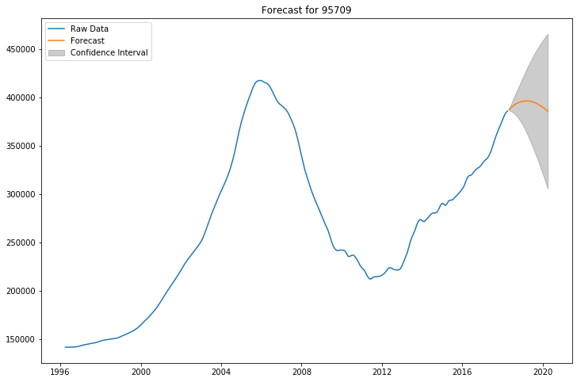


### Zip code 95709 (Camino):  Don't invest

By the model prediction, I would expect to see a -0.349% change in price by April 1, 2020
At the lower bound of the confidence interval, I would expect to see a -21.147% change in price by April 1, 2020
At the upper bound of the confidence interval, I would expect to see a 20.448% change in price by April 1, 2020


## SacMetro:  95746 (Granite Bay) -- Solid investment opportunity

### Set up dataframe


```python
geog_area = '95746'
```


```python
city = 'Granite Bay'
```


```python
county = 'Placer'
```


```python
ts = df_sac.loc[df_sac['Zip'] == geog_area]
```


```python
ts.head()
```


<div>
<style scoped>
    .dataframe tbody tr th:only-of-type {
        vertical-align: middle;
    }

    .dataframe tbody tr th {
        vertical-align: top;
    }

    .dataframe thead th {
        text-align: right;
    }
</style>
<table border="1" class="dataframe">
  <thead>
    <tr style="text-align: right;">
      <th></th>
      <th>Metro</th>
      <th>MetroState</th>
      <th>CountyName</th>
      <th>City</th>
      <th>Zip</th>
      <th>value</th>
    </tr>
    <tr>
      <th>time</th>
      <th></th>
      <th></th>
      <th></th>
      <th></th>
      <th></th>
      <th></th>
    </tr>
  </thead>
  <tbody>
    <tr>
      <td>1996-04-01</td>
      <td>Sacramento</td>
      <td>Sacramento CA</td>
      <td>Placer</td>
      <td>Granite Bay</td>
      <td>95746</td>
      <td>292000.0</td>
    </tr>
    <tr>
      <td>1996-05-01</td>
      <td>Sacramento</td>
      <td>Sacramento CA</td>
      <td>Placer</td>
      <td>Granite Bay</td>
      <td>95746</td>
      <td>289600.0</td>
    </tr>
    <tr>
      <td>1996-06-01</td>
      <td>Sacramento</td>
      <td>Sacramento CA</td>
      <td>Placer</td>
      <td>Granite Bay</td>
      <td>95746</td>
      <td>287300.0</td>
    </tr>
    <tr>
      <td>1996-07-01</td>
      <td>Sacramento</td>
      <td>Sacramento CA</td>
      <td>Placer</td>
      <td>Granite Bay</td>
      <td>95746</td>
      <td>285400.0</td>
    </tr>
    <tr>
      <td>1996-08-01</td>
      <td>Sacramento</td>
      <td>Sacramento CA</td>
      <td>Placer</td>
      <td>Granite Bay</td>
      <td>95746</td>
      <td>283900.0</td>
    </tr>
  </tbody>
</table>
</div>


```python
ts = ts.resample('MS').asfreq()
```


```python
ts.head()
```


<div>
<style scoped>
    .dataframe tbody tr th:only-of-type {
        vertical-align: middle;
    }

    .dataframe tbody tr th {
        vertical-align: top;
    }

    .dataframe thead th {
        text-align: right;
    }
</style>
<table border="1" class="dataframe">
  <thead>
    <tr style="text-align: right;">
      <th></th>
      <th>Metro</th>
      <th>MetroState</th>
      <th>CountyName</th>
      <th>City</th>
      <th>Zip</th>
      <th>value</th>
    </tr>
    <tr>
      <th>time</th>
      <th></th>
      <th></th>
      <th></th>
      <th></th>
      <th></th>
      <th></th>
    </tr>
  </thead>
  <tbody>
    <tr>
      <td>1996-04-01</td>
      <td>Sacramento</td>
      <td>Sacramento CA</td>
      <td>Placer</td>
      <td>Granite Bay</td>
      <td>95746</td>
      <td>292000.0</td>
    </tr>
    <tr>
      <td>1996-05-01</td>
      <td>Sacramento</td>
      <td>Sacramento CA</td>
      <td>Placer</td>
      <td>Granite Bay</td>
      <td>95746</td>
      <td>289600.0</td>
    </tr>
    <tr>
      <td>1996-06-01</td>
      <td>Sacramento</td>
      <td>Sacramento CA</td>
      <td>Placer</td>
      <td>Granite Bay</td>
      <td>95746</td>
      <td>287300.0</td>
    </tr>
    <tr>
      <td>1996-07-01</td>
      <td>Sacramento</td>
      <td>Sacramento CA</td>
      <td>Placer</td>
      <td>Granite Bay</td>
      <td>95746</td>
      <td>285400.0</td>
    </tr>
    <tr>
      <td>1996-08-01</td>
      <td>Sacramento</td>
      <td>Sacramento CA</td>
      <td>Placer</td>
      <td>Granite Bay</td>
      <td>95746</td>
      <td>283900.0</td>
    </tr>
  </tbody>
</table>
</div>


### Visualizations


```python
plot_single_geog(df_melt, geog_area, 'value', 'Zip', figsize=(12, 6), fontsize1=12, fontsize2=16)
```


```python
ts.boxplot(column = 'value')
plt.title(geog_area);

```


```python
plot_acf_pacf(ts.value)
```


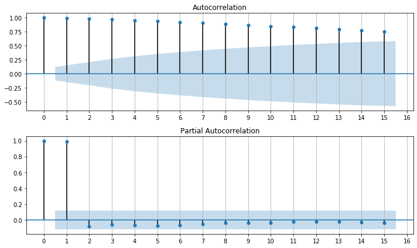


```python
plot_seasonal_decomp(ts.value);

# Note that seasonality isn't much of a factor here; maximum difference of about $700 over the course of a year
```


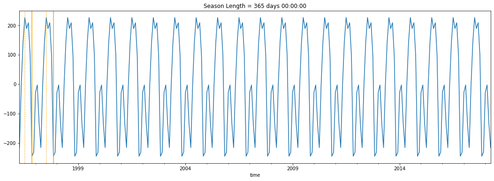


### ARIMA parameters tuning


```python
p_values = [0, 1, 2, 4, 6, 8, 10]
d_values = range(0, 3)
q_values = range(0, 3)

```


```python
# order_tuples_95746, mse_results_95746, best_cfg_95746, best_score_95746 = eval_params_and_lists(ts.value, p_values, d_values, q_values)

```

From previous analyses:  Best ARIMA(6, 1, 2) MSE=3329403.484


```python
best_cfg = (6, 1, 2)
best_cfg
```


    (6, 1, 2)


```python
# results_table_95746 = pd.DataFrame({'Order':order_tuples_95746, 'MSEs':mse_results_95746})
# results_table_95746
```

### ARIMA modeling and forecasting results


```python
print_results_lists()   # make sure that the lists are correct to this point; 
                        # use pop_results_lists() to remove last item
```


    (['95616',
      '95619',
      '95864',
      '95831',
      '95811',
      '95818',
      '95630',
      '96140',
      '95672',
      '95636',
      '95709'],
     ['Davis',
      'Diamond Springs',
      'Arden-Arcade',
      'Sacramento_Pocket',
      'Sacramento_DosRios',
      'Sacramento_LandPark',
      'Folsom',
      'Carnelian Bay',
      'Rescue',
      'Somerset',
      'Camino'],
     ['Yolo',
      'El Dorado',
      'Sacramento',
      'Sacramento',
      'Sacramento',
      'Sacramento',
      'Sacramento',
      'Placer',
      'El Dorado',
      'El Dorado',
      'El Dorado'],
     [(2, 1, 2),
      (2, 1, 2),
      (8, 0, 2),
      (6, 0, 2),
      (10, 1, 0),
      (6, 2, 2),
      (2, 2, 0),
      (4, 2, 1),
      (8, 2, 0),
      (8, 2, 1),
      (8, 0, 2)],
     [717863.06,
      355774.45,
      449047.92,
      389675.07,
      570598.7,
      558380.08,
      545821.37,
      769785.39,
      766372.9,
      268239.06,
      385671.99],
     [619575.34,
      275292.09,
      327568.68,
      302216.31,
      459606.77,
      418566.82,
      427964.65,
      518008.87,
      562046.69,
      148993.04,
      305444.97],
     [816150.79,
      436256.81,
      570527.16,
      477133.84,
      681590.63,
      698193.34,
      663678.09,
      1021561.92,
      970699.1,
      387485.09,
      465899.01],
     [692300.0,
      321100.0,
      552700.0,
      449300.0,
      567500.0,
      563900.0,
      542900.0,
      644600.0,
      579300.0,
      241200.0,
      386000.0],
     [3.69, 10.8, -18.75, -13.27, 0.55, -0.98, 0.54, 19.42, 32.29, 11.21, -0.08],
     [-10.5,
      -14.27,
      -40.73,
      -32.74,
      -19.01,
      -25.77,
      -21.17,
      -19.64,
      -2.98,
      -38.23,
      -20.87],
     [17.89, 35.86, 3.23, 6.19, 20.1, 23.82, 22.25, 58.48, 67.56, 60.65, 20.7])


```python
arima_forecast(ts, geog_area, city, county, p_values, d_values, q_values, best_cfg, confint=2, run_pdq = False)
```

    For 95746 (Granite Bay):
    Best ARIMA order = (6, 1, 2)
                                 ARIMA Model Results                              
    ==============================================================================
    Dep. Variable:                D.value   No. Observations:                  264
    Model:                 ARIMA(6, 1, 2)   Log Likelihood               -2240.772
    Method:                       css-mle   S.D. of innovations           1155.648
    Date:                Tue, 17 Mar 2020   AIC                           4501.543
    Time:                        15:26:45   BIC                           4537.303
    Sample:                    05-01-1996   HQIC                          4515.912
                             - 04-01-2018                                         
    =================================================================================
                        coef    std err          z      P>|z|      [0.025      0.975]
    ---------------------------------------------------------------------------------
    const          1842.7811   1706.790      1.080      0.281   -1502.466    5188.028
    ar.L1.D.value    -0.0528      0.066     -0.805      0.422      -0.181       0.076
    ar.L2.D.value     0.4918      0.067      7.387      0.000       0.361       0.622
    ar.L3.D.value     0.1700      0.075      2.267      0.024       0.023       0.317
    ar.L4.D.value     0.1136      0.075      1.517      0.130      -0.033       0.260
    ar.L5.D.value     0.0445      0.067      0.661      0.509      -0.087       0.176
    ar.L6.D.value     0.0892      0.068      1.307      0.193      -0.045       0.223
    ma.L1.D.value     1.7134      0.029     59.404      0.000       1.657       1.770
    ma.L2.D.value     0.9787      0.025     39.736      0.000       0.930       1.027
                                        Roots                                    
    =============================================================================
                      Real          Imaginary           Modulus         Frequency
    -----------------------------------------------------------------------------
    AR.1            1.0507           -0.0000j            1.0507           -0.0000
    AR.2           -1.2564           -0.0000j            1.2564           -0.5000
    AR.3           -0.9867           -1.3041j            1.6353           -0.3531
    AR.4           -0.9867           +1.3041j            1.6353            0.3531
    AR.5            0.8403           -1.5712j            1.7818           -0.1718
    AR.6            0.8403           +1.5712j            1.7818            0.1718
    MA.1           -0.8754           -0.5055j            1.0108           -0.4167
    MA.2           -0.8754           +0.5055j            1.0108            0.4167
    -----------------------------------------------------------------------------
    By the model prediction, I would expect to see a 7.906% change in price by April 1, 2020.
    At the lower bound of the confidence interval, I would expect to see a -9.561% change in price by April 1, 2020.
    At the upper bound of the confidence interval, I would expect to see a 25.374% change in price by April 1, 2020.


    (['95616',
      '95619',
      '95864',
      '95831',
      '95811',
      '95818',
      '95630',
      '96140',
      '95672',
      '95636',
      '95709',
      '95746'],
     ['Davis',
      'Diamond Springs',
      'Arden-Arcade',
      'Sacramento_Pocket',
      'Sacramento_DosRios',
      'Sacramento_LandPark',
      'Folsom',
      'Carnelian Bay',
      'Rescue',
      'Somerset',
      'Camino',
      'Granite Bay'],
     ['Yolo',
      'El Dorado',
      'Sacramento',
      'Sacramento',
      'Sacramento',
      'Sacramento',
      'Sacramento',
      'Placer',
      'El Dorado',
      'El Dorado',
      'El Dorado',
      'Placer'],
     [(2, 1, 2),
      (2, 1, 2),
      (8, 0, 2),
      (6, 0, 2),
      (10, 1, 0),
      (6, 2, 2),
      (2, 2, 0),
      (4, 2, 1),
      (8, 2, 0),
      (8, 2, 1),
      (8, 0, 2),
      (6, 1, 2)],
     [717863.06,
      355774.45,
      449047.92,
      389675.07,
      570598.7,
      558380.08,
      545821.37,
      769785.39,
      766372.9,
      268239.06,
      385671.99,
      840052.01],
     [619575.34,
      275292.09,
      327568.68,
      302216.31,
      459606.77,
      418566.82,
      427964.65,
      518008.87,
      562046.69,
      148993.04,
      305444.97,
      704070.95],
     [816150.79,
      436256.81,
      570527.16,
      477133.84,
      681590.63,
      698193.34,
      663678.09,
      1021561.92,
      970699.1,
      387485.09,
      465899.01,
      976033.07],
     [692300.0,
      321100.0,
      552700.0,
      449300.0,
      567500.0,
      563900.0,
      542900.0,
      644600.0,
      579300.0,
      241200.0,
      386000.0,
      778500.0],
     [3.69,
      10.8,
      -18.75,
      -13.27,
      0.55,
      -0.98,
      0.54,
      19.42,
      32.29,
      11.21,
      -0.08,
      7.91],
     [-10.5,
      -14.27,
      -40.73,
      -32.74,
      -19.01,
      -25.77,
      -21.17,
      -19.64,
      -2.98,
      -38.23,
      -20.87,
      -9.56],
     [17.89,
      35.86,
      3.23,
      6.19,
      20.1,
      23.82,
      22.25,
      58.48,
      67.56,
      60.65,
      20.7,
      25.37])


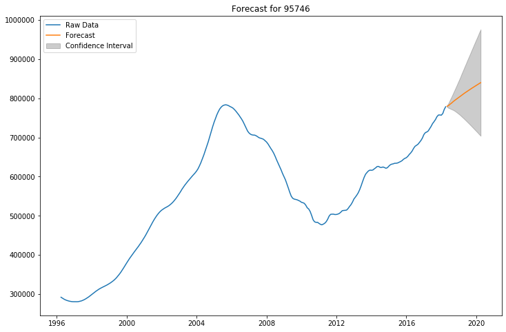


### Zip code 95746 (Granite Bay):  Solid investment opportunity

By the model prediction, I would expect to see a 7.906% change in price by April 1, 2020.
At the lower bound of the confidence interval, I would expect to see a -9.561% change in price by April 1, 2020.
At the upper bound of the confidence interval, I would expect to see a 25.374% change in price by April 1, 2020.

## SacMetro:  95614 (Cool) -- Not a great investment opportunity

### Set up dataframe


```python
geog_area = '95614'
```


```python
city = 'Cool'
```


```python
county = 'El Dorado'
```


```python
ts = df_sac.loc[df_sac['Zip'] == geog_area]
```


```python
ts.head()
```


<div>
<style scoped>
    .dataframe tbody tr th:only-of-type {
        vertical-align: middle;
    }

    .dataframe tbody tr th {
        vertical-align: top;
    }

    .dataframe thead th {
        text-align: right;
    }
</style>
<table border="1" class="dataframe">
  <thead>
    <tr style="text-align: right;">
      <th></th>
      <th>Metro</th>
      <th>MetroState</th>
      <th>CountyName</th>
      <th>City</th>
      <th>Zip</th>
      <th>value</th>
    </tr>
    <tr>
      <th>time</th>
      <th></th>
      <th></th>
      <th></th>
      <th></th>
      <th></th>
      <th></th>
    </tr>
  </thead>
  <tbody>
    <tr>
      <td>1996-04-01</td>
      <td>Sacramento</td>
      <td>Sacramento CA</td>
      <td>El Dorado</td>
      <td>Cool</td>
      <td>95614</td>
      <td>157500.0</td>
    </tr>
    <tr>
      <td>1996-05-01</td>
      <td>Sacramento</td>
      <td>Sacramento CA</td>
      <td>El Dorado</td>
      <td>Cool</td>
      <td>95614</td>
      <td>157200.0</td>
    </tr>
    <tr>
      <td>1996-06-01</td>
      <td>Sacramento</td>
      <td>Sacramento CA</td>
      <td>El Dorado</td>
      <td>Cool</td>
      <td>95614</td>
      <td>156900.0</td>
    </tr>
    <tr>
      <td>1996-07-01</td>
      <td>Sacramento</td>
      <td>Sacramento CA</td>
      <td>El Dorado</td>
      <td>Cool</td>
      <td>95614</td>
      <td>156700.0</td>
    </tr>
    <tr>
      <td>1996-08-01</td>
      <td>Sacramento</td>
      <td>Sacramento CA</td>
      <td>El Dorado</td>
      <td>Cool</td>
      <td>95614</td>
      <td>156400.0</td>
    </tr>
  </tbody>
</table>
</div>


```python
ts = ts.resample('MS').asfreq()
```


```python
ts.head()
```


<div>
<style scoped>
    .dataframe tbody tr th:only-of-type {
        vertical-align: middle;
    }

    .dataframe tbody tr th {
        vertical-align: top;
    }

    .dataframe thead th {
        text-align: right;
    }
</style>
<table border="1" class="dataframe">
  <thead>
    <tr style="text-align: right;">
      <th></th>
      <th>Metro</th>
      <th>MetroState</th>
      <th>CountyName</th>
      <th>City</th>
      <th>Zip</th>
      <th>value</th>
    </tr>
    <tr>
      <th>time</th>
      <th></th>
      <th></th>
      <th></th>
      <th></th>
      <th></th>
      <th></th>
    </tr>
  </thead>
  <tbody>
    <tr>
      <td>1996-04-01</td>
      <td>Sacramento</td>
      <td>Sacramento CA</td>
      <td>El Dorado</td>
      <td>Cool</td>
      <td>95614</td>
      <td>157500.0</td>
    </tr>
    <tr>
      <td>1996-05-01</td>
      <td>Sacramento</td>
      <td>Sacramento CA</td>
      <td>El Dorado</td>
      <td>Cool</td>
      <td>95614</td>
      <td>157200.0</td>
    </tr>
    <tr>
      <td>1996-06-01</td>
      <td>Sacramento</td>
      <td>Sacramento CA</td>
      <td>El Dorado</td>
      <td>Cool</td>
      <td>95614</td>
      <td>156900.0</td>
    </tr>
    <tr>
      <td>1996-07-01</td>
      <td>Sacramento</td>
      <td>Sacramento CA</td>
      <td>El Dorado</td>
      <td>Cool</td>
      <td>95614</td>
      <td>156700.0</td>
    </tr>
    <tr>
      <td>1996-08-01</td>
      <td>Sacramento</td>
      <td>Sacramento CA</td>
      <td>El Dorado</td>
      <td>Cool</td>
      <td>95614</td>
      <td>156400.0</td>
    </tr>
  </tbody>
</table>
</div>


### Visualizations


```python
plot_single_geog(df_melt, geog_area, 'value', 'Zip', figsize=(12, 6), fontsize1=12, fontsize2=16)
```


```python
ts.boxplot(column = 'value')
plt.title(geog_area);

```


```python
plot_acf_pacf(ts.value)
```


```python
plot_seasonal_decomp(ts.value);

# Note that seasonality isn't much of a factor here; maximum difference of about $700 over the course of a year
```


### ARIMA parameters tuning


```python
p_values = [0, 1, 2, 4, 6, 8, 10]
d_values = range(0, 3)
q_values = range(0, 3)

```


```python
# order_tuples_95614, mse_results_95614, best_cfg_95614, best_score_95614 = eval_params_and_lists(ts.value, p_values, d_values, q_values)

```

From previous analyses:   Best ARIMA(8, 0, 2) MSE=1365126.920


```python
# best_cfg = best_cfg_95614
best_cfg = (8,0,2)
best_cfg
```


    (8, 0, 2)


```python
# results_table_95614 = pd.DataFrame({'Order':order_tuples_95614, 'MSEs':mse_results_95614})
# results_table_95614
```

### ARIMA modeling and forecasting results


```python
print_results_lists()   # make sure that the lists are correct to this point; 
                        # use pop_results_lists() to remove last item
```


    (['95616',
      '95619',
      '95864',
      '95831',
      '95811',
      '95818',
      '95630',
      '96140',
      '95672',
      '95636',
      '95709',
      '95746'],
     ['Davis',
      'Diamond Springs',
      'Arden-Arcade',
      'Sacramento_Pocket',
      'Sacramento_DosRios',
      'Sacramento_LandPark',
      'Folsom',
      'Carnelian Bay',
      'Rescue',
      'Somerset',
      'Camino',
      'Granite Bay'],
     ['Yolo',
      'El Dorado',
      'Sacramento',
      'Sacramento',
      'Sacramento',
      'Sacramento',
      'Sacramento',
      'Placer',
      'El Dorado',
      'El Dorado',
      'El Dorado',
      'Placer'],
     [(2, 1, 2),
      (2, 1, 2),
      (8, 0, 2),
      (6, 0, 2),
      (10, 1, 0),
      (6, 2, 2),
      (2, 2, 0),
      (4, 2, 1),
      (8, 2, 0),
      (8, 2, 1),
      (8, 0, 2),
      (6, 1, 2)],
     [717863.06,
      355774.45,
      449047.92,
      389675.07,
      570598.7,
      558380.08,
      545821.37,
      769785.39,
      766372.9,
      268239.06,
      385671.99,
      840052.01],
     [619575.34,
      275292.09,
      327568.68,
      302216.31,
      459606.77,
      418566.82,
      427964.65,
      518008.87,
      562046.69,
      148993.04,
      305444.97,
      704070.95],
     [816150.79,
      436256.81,
      570527.16,
      477133.84,
      681590.63,
      698193.34,
      663678.09,
      1021561.92,
      970699.1,
      387485.09,
      465899.01,
      976033.07],
     [692300.0,
      321100.0,
      552700.0,
      449300.0,
      567500.0,
      563900.0,
      542900.0,
      644600.0,
      579300.0,
      241200.0,
      386000.0,
      778500.0],
     [3.69,
      10.8,
      -18.75,
      -13.27,
      0.55,
      -0.98,
      0.54,
      19.42,
      32.29,
      11.21,
      -0.08,
      7.91],
     [-10.5,
      -14.27,
      -40.73,
      -32.74,
      -19.01,
      -25.77,
      -21.17,
      -19.64,
      -2.98,
      -38.23,
      -20.87,
      -9.56],
     [17.89,
      35.86,
      3.23,
      6.19,
      20.1,
      23.82,
      22.25,
      58.48,
      67.56,
      60.65,
      20.7,
      25.37])


```python
arima_forecast(ts, geog_area, city, county, p_values, d_values, q_values, best_cfg, confint=2, run_pdq = False)
```

    For 95614 (Cool):
    Best ARIMA order = (8, 0, 2)
                                  ARMA Model Results                              
    ==============================================================================
    Dep. Variable:                  value   No. Observations:                  265
    Model:                     ARMA(8, 2)   Log Likelihood               -2177.130
    Method:                       css-mle   S.D. of innovations            868.043
    Date:                Tue, 17 Mar 2020   AIC                           4378.261
    Time:                        15:27:29   BIC                           4421.218
    Sample:                    04-01-1996   HQIC                          4395.520
                             - 04-01-2018                                         
    ===============================================================================
                      coef    std err          z      P>|z|      [0.025      0.975]
    -------------------------------------------------------------------------------
    const        2.931e+05   4.13e+04      7.093      0.000    2.12e+05    3.74e+05
    ar.L1.value     1.1705      0.151      7.773      0.000       0.875       1.466
    ar.L2.value     0.1488      0.314      0.473      0.636      -0.468       0.765
    ar.L3.value    -0.3388      0.274     -1.236      0.218      -0.876       0.198
    ar.L4.value     0.1717      0.159      1.080      0.281      -0.140       0.483
    ar.L5.value    -0.2608      0.112     -2.327      0.021      -0.480      -0.041
    ar.L6.value     0.1119      0.213      0.525      0.600      -0.306       0.530
    ar.L7.value     0.3568      0.264      1.350      0.178      -0.161       0.875
    ar.L8.value    -0.3644      0.131     -2.777      0.006      -0.622      -0.107
    ma.L1.value     1.6606      0.111     14.903      0.000       1.442       1.879
    ma.L2.value     0.8902      0.059     15.166      0.000       0.775       1.005
                                        Roots                                    
    =============================================================================
                      Real          Imaginary           Modulus         Frequency
    -----------------------------------------------------------------------------
    AR.1           -1.1064           -0.3913j            1.1736           -0.4459
    AR.2           -1.1064           +0.3913j            1.1736            0.4459
    AR.3           -0.2414           -1.1426j            1.1678           -0.2831
    AR.4           -0.2414           +1.1426j            1.1678            0.2831
    AR.5            0.8241           -0.8616j            1.1923           -0.1285
    AR.6            0.8241           +0.8616j            1.1923            0.1285
    AR.7            1.0133           -0.0314j            1.0138           -0.0049
    AR.8            1.0133           +0.0314j            1.0138            0.0049
    MA.1           -0.9327           -0.5034j            1.0599           -0.4212
    MA.2           -0.9327           +0.5034j            1.0599            0.4212
    -----------------------------------------------------------------------------
    By the model prediction, I would expect to see a 2.602% change in price by April 1, 2020.
    At the lower bound of the confidence interval, I would expect to see a -18.477% change in price by April 1, 2020.
    At the upper bound of the confidence interval, I would expect to see a 23.68% change in price by April 1, 2020.


    (['95616',
      '95619',
      '95864',
      '95831',
      '95811',
      '95818',
      '95630',
      '96140',
      '95672',
      '95636',
      '95709',
      '95746',
      '95614'],
     ['Davis',
      'Diamond Springs',
      'Arden-Arcade',
      'Sacramento_Pocket',
      'Sacramento_DosRios',
      'Sacramento_LandPark',
      'Folsom',
      'Carnelian Bay',
      'Rescue',
      'Somerset',
      'Camino',
      'Granite Bay',
      'Cool'],
     ['Yolo',
      'El Dorado',
      'Sacramento',
      'Sacramento',
      'Sacramento',
      'Sacramento',
      'Sacramento',
      'Placer',
      'El Dorado',
      'El Dorado',
      'El Dorado',
      'Placer',
      'El Dorado'],
     [(2, 1, 2),
      (2, 1, 2),
      (8, 0, 2),
      (6, 0, 2),
      (10, 1, 0),
      (6, 2, 2),
      (2, 2, 0),
      (4, 2, 1),
      (8, 2, 0),
      (8, 2, 1),
      (8, 0, 2),
      (6, 1, 2),
      (8, 0, 2)],
     [717863.06,
      355774.45,
      449047.92,
      389675.07,
      570598.7,
      558380.08,
      545821.37,
      769785.39,
      766372.9,
      268239.06,
      385671.99,
      840052.01,
      434312.48],
     [619575.34,
      275292.09,
      327568.68,
      302216.31,
      459606.77,
      418566.82,
      427964.65,
      518008.87,
      562046.69,
      148993.04,
      305444.97,
      704070.95,
      345086.19],
     [816150.79,
      436256.81,
      570527.16,
      477133.84,
      681590.63,
      698193.34,
      663678.09,
      1021561.92,
      970699.1,
      387485.09,
      465899.01,
      976033.07,
      523538.76],
     [692300.0,
      321100.0,
      552700.0,
      449300.0,
      567500.0,
      563900.0,
      542900.0,
      644600.0,
      579300.0,
      241200.0,
      386000.0,
      778500.0,
      423300.0],
     [3.69,
      10.8,
      -18.75,
      -13.27,
      0.55,
      -0.98,
      0.54,
      19.42,
      32.29,
      11.21,
      -0.08,
      7.91,
      2.6],
     [-10.5,
      -14.27,
      -40.73,
      -32.74,
      -19.01,
      -25.77,
      -21.17,
      -19.64,
      -2.98,
      -38.23,
      -20.87,
      -9.56,
      -18.48],
     [17.89,
      35.86,
      3.23,
      6.19,
      20.1,
      23.82,
      22.25,
      58.48,
      67.56,
      60.65,
      20.7,
      25.37,
      23.68])


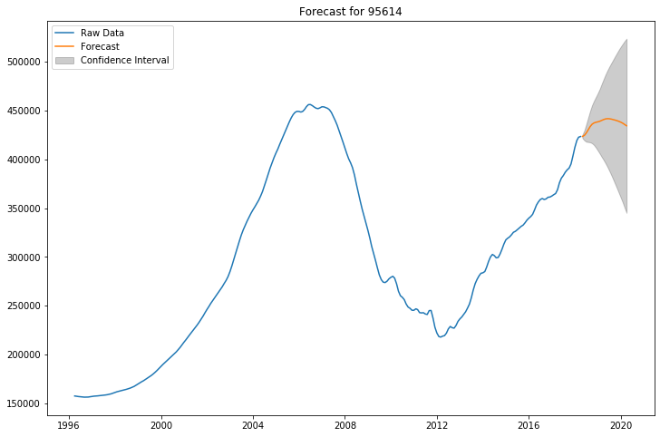


### Zip code 95614 (Cool):  Not a great investment opportunity

By the model prediction, I would expect to see a 2.466% change in price by April 1, 2020.
At the lower bound of the confidence interval, I would expect to see a -18.714% change in price by April 1, 2020.
At the upper bound of the confidence interval, I would expect to see a 23.646% change in price by April 1, 2020.


## SacMetro:  95663 (Penryn) -- Excellent investment opportunity

### Set up dataframe


```python
geog_area = '95663'
```


```python
city = 'Penryn'
```


```python
county = 'Placer'
```


```python
ts = df_sac.loc[df_sac['Zip'] == geog_area]
```


```python
ts.head()
```


<div>
<style scoped>
    .dataframe tbody tr th:only-of-type {
        vertical-align: middle;
    }

    .dataframe tbody tr th {
        vertical-align: top;
    }

    .dataframe thead th {
        text-align: right;
    }
</style>
<table border="1" class="dataframe">
  <thead>
    <tr style="text-align: right;">
      <th></th>
      <th>Metro</th>
      <th>MetroState</th>
      <th>CountyName</th>
      <th>City</th>
      <th>Zip</th>
      <th>value</th>
    </tr>
    <tr>
      <th>time</th>
      <th></th>
      <th></th>
      <th></th>
      <th></th>
      <th></th>
      <th></th>
    </tr>
  </thead>
  <tbody>
    <tr>
      <td>1996-04-01</td>
      <td>Sacramento</td>
      <td>Sacramento CA</td>
      <td>Placer</td>
      <td>Penryn</td>
      <td>95663</td>
      <td>195400.0</td>
    </tr>
    <tr>
      <td>1996-05-01</td>
      <td>Sacramento</td>
      <td>Sacramento CA</td>
      <td>Placer</td>
      <td>Penryn</td>
      <td>95663</td>
      <td>195300.0</td>
    </tr>
    <tr>
      <td>1996-06-01</td>
      <td>Sacramento</td>
      <td>Sacramento CA</td>
      <td>Placer</td>
      <td>Penryn</td>
      <td>95663</td>
      <td>195300.0</td>
    </tr>
    <tr>
      <td>1996-07-01</td>
      <td>Sacramento</td>
      <td>Sacramento CA</td>
      <td>Placer</td>
      <td>Penryn</td>
      <td>95663</td>
      <td>195300.0</td>
    </tr>
    <tr>
      <td>1996-08-01</td>
      <td>Sacramento</td>
      <td>Sacramento CA</td>
      <td>Placer</td>
      <td>Penryn</td>
      <td>95663</td>
      <td>195400.0</td>
    </tr>
  </tbody>
</table>
</div>


```python
ts = ts.resample('MS').asfreq()
```


```python
ts.head()
```


<div>
<style scoped>
    .dataframe tbody tr th:only-of-type {
        vertical-align: middle;
    }

    .dataframe tbody tr th {
        vertical-align: top;
    }

    .dataframe thead th {
        text-align: right;
    }
</style>
<table border="1" class="dataframe">
  <thead>
    <tr style="text-align: right;">
      <th></th>
      <th>Metro</th>
      <th>MetroState</th>
      <th>CountyName</th>
      <th>City</th>
      <th>Zip</th>
      <th>value</th>
    </tr>
    <tr>
      <th>time</th>
      <th></th>
      <th></th>
      <th></th>
      <th></th>
      <th></th>
      <th></th>
    </tr>
  </thead>
  <tbody>
    <tr>
      <td>1996-04-01</td>
      <td>Sacramento</td>
      <td>Sacramento CA</td>
      <td>Placer</td>
      <td>Penryn</td>
      <td>95663</td>
      <td>195400.0</td>
    </tr>
    <tr>
      <td>1996-05-01</td>
      <td>Sacramento</td>
      <td>Sacramento CA</td>
      <td>Placer</td>
      <td>Penryn</td>
      <td>95663</td>
      <td>195300.0</td>
    </tr>
    <tr>
      <td>1996-06-01</td>
      <td>Sacramento</td>
      <td>Sacramento CA</td>
      <td>Placer</td>
      <td>Penryn</td>
      <td>95663</td>
      <td>195300.0</td>
    </tr>
    <tr>
      <td>1996-07-01</td>
      <td>Sacramento</td>
      <td>Sacramento CA</td>
      <td>Placer</td>
      <td>Penryn</td>
      <td>95663</td>
      <td>195300.0</td>
    </tr>
    <tr>
      <td>1996-08-01</td>
      <td>Sacramento</td>
      <td>Sacramento CA</td>
      <td>Placer</td>
      <td>Penryn</td>
      <td>95663</td>
      <td>195400.0</td>
    </tr>
  </tbody>
</table>
</div>


### Visualizations


```python
plot_single_geog(df_melt, geog_area, 'value', 'Zip', figsize=(12, 6), fontsize1=12, fontsize2=16)
```


```python
ts.boxplot(column = 'value')
plt.title(geog_area);

```


```python
plot_acf_pacf(ts.value)
```


```python
plot_seasonal_decomp(ts.value);

# Note that seasonality isn't much of a factor here; maximum difference of about $700 over the course of a year
```


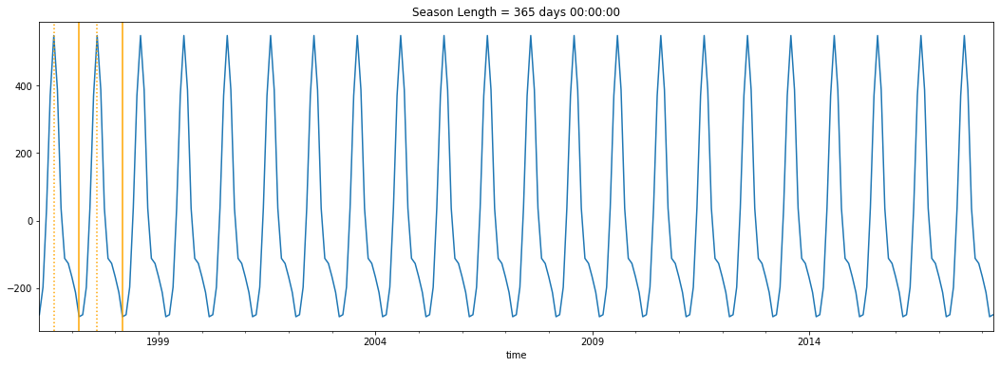


### ARIMA parameters tuning


```python
p_values = [0, 1, 2, 4, 6, 8, 10]
d_values = range(0, 3)
q_values = range(0, 3)

```


```python
# order_tuples_95663, mse_results_95663, best_cfg_95663, best_score_95663 = eval_params_and_lists(ts.value, p_values, d_values, q_values)

```

From previous analyses:  Best ARIMA(6, 1, 1) MSE=4616814.652


```python
best_cfg = (6,1,1)
best_cfg
```


    (6, 1, 1)


```python
# results_table_95663 = pd.DataFrame({'Order':order_tuples_95663, 'MSEs':mse_results_95663})
# results_table_95663
```

### ARIMA modeling and forecasting results


```python
print_results_lists()   # make sure that the lists are correct to this point; 
                        # use pop_results_lists() to remove last item
```


    (['95616',
      '95619',
      '95864',
      '95831',
      '95811',
      '95818',
      '95630',
      '96140',
      '95672',
      '95636',
      '95709',
      '95746',
      '95614'],
     ['Davis',
      'Diamond Springs',
      'Arden-Arcade',
      'Sacramento_Pocket',
      'Sacramento_DosRios',
      'Sacramento_LandPark',
      'Folsom',
      'Carnelian Bay',
      'Rescue',
      'Somerset',
      'Camino',
      'Granite Bay',
      'Cool'],
     ['Yolo',
      'El Dorado',
      'Sacramento',
      'Sacramento',
      'Sacramento',
      'Sacramento',
      'Sacramento',
      'Placer',
      'El Dorado',
      'El Dorado',
      'El Dorado',
      'Placer',
      'El Dorado'],
     [(2, 1, 2),
      (2, 1, 2),
      (8, 0, 2),
      (6, 0, 2),
      (10, 1, 0),
      (6, 2, 2),
      (2, 2, 0),
      (4, 2, 1),
      (8, 2, 0),
      (8, 2, 1),
      (8, 0, 2),
      (6, 1, 2),
      (8, 0, 2)],
     [717863.06,
      355774.45,
      449047.92,
      389675.07,
      570598.7,
      558380.08,
      545821.37,
      769785.39,
      766372.9,
      268239.06,
      385671.99,
      840052.01,
      434312.48],
     [619575.34,
      275292.09,
      327568.68,
      302216.31,
      459606.77,
      418566.82,
      427964.65,
      518008.87,
      562046.69,
      148993.04,
      305444.97,
      704070.95,
      345086.19],
     [816150.79,
      436256.81,
      570527.16,
      477133.84,
      681590.63,
      698193.34,
      663678.09,
      1021561.92,
      970699.1,
      387485.09,
      465899.01,
      976033.07,
      523538.76],
     [692300.0,
      321100.0,
      552700.0,
      449300.0,
      567500.0,
      563900.0,
      542900.0,
      644600.0,
      579300.0,
      241200.0,
      386000.0,
      778500.0,
      423300.0],
     [3.69,
      10.8,
      -18.75,
      -13.27,
      0.55,
      -0.98,
      0.54,
      19.42,
      32.29,
      11.21,
      -0.08,
      7.91,
      2.6],
     [-10.5,
      -14.27,
      -40.73,
      -32.74,
      -19.01,
      -25.77,
      -21.17,
      -19.64,
      -2.98,
      -38.23,
      -20.87,
      -9.56,
      -18.48],
     [17.89,
      35.86,
      3.23,
      6.19,
      20.1,
      23.82,
      22.25,
      58.48,
      67.56,
      60.65,
      20.7,
      25.37,
      23.68])


```python
arima_forecast(ts, geog_area, city, county, p_values, d_values, q_values, best_cfg, confint=2, run_pdq = False)
```

    For 95663 (Penryn):
    Best ARIMA order = (6, 1, 1)
                                 ARIMA Model Results                              
    ==============================================================================
    Dep. Variable:                D.value   No. Observations:                  264
    Model:                 ARIMA(6, 1, 1)   Log Likelihood               -2259.231
    Method:                       css-mle   S.D. of innovations           1250.189
    Date:                Tue, 17 Mar 2020   AIC                           4536.461
    Time:                        15:28:07   BIC                           4568.645
    Sample:                    05-01-1996   HQIC                          4549.393
                             - 04-01-2018                                         
    =================================================================================
                        coef    std err          z      P>|z|      [0.025      0.975]
    ---------------------------------------------------------------------------------
    const          1535.2274   1631.031      0.941      0.347   -1661.535    4731.990
    ar.L1.D.value     1.0556      0.095     11.060      0.000       0.869       1.243
    ar.L2.D.value    -0.2835      0.148     -1.915      0.057      -0.574       0.007
    ar.L3.D.value    -0.1497      0.117     -1.281      0.201      -0.379       0.079
    ar.L4.D.value     0.4930      0.090      5.466      0.000       0.316       0.670
    ar.L5.D.value    -0.4885      0.089     -5.495      0.000      -0.663      -0.314
    ar.L6.D.value     0.3005      0.064      4.696      0.000       0.175       0.426
    ma.L1.D.value     0.6481      0.084      7.736      0.000       0.484       0.812
                                        Roots                                    
    =============================================================================
                      Real          Imaginary           Modulus         Frequency
    -----------------------------------------------------------------------------
    AR.1           -1.1310           -0.0000j            1.1310           -0.5000
    AR.2           -0.1004           -1.2731j            1.2771           -0.2625
    AR.3           -0.1004           +1.2731j            1.2771            0.2625
    AR.4            1.0494           -0.0000j            1.0494           -0.0000
    AR.5            0.9541           -0.8994j            1.3112           -0.1203
    AR.6            0.9541           +0.8994j            1.3112            0.1203
    MA.1           -1.5430           +0.0000j            1.5430            0.5000
    -----------------------------------------------------------------------------
    By the model prediction, I would expect to see a 13.679% change in price by April 1, 2020.
    At the lower bound of the confidence interval, I would expect to see a -8.334% change in price by April 1, 2020.
    At the upper bound of the confidence interval, I would expect to see a 35.692% change in price by April 1, 2020.


    (['95616',
      '95619',
      '95864',
      '95831',
      '95811',
      '95818',
      '95630',
      '96140',
      '95672',
      '95636',
      '95709',
      '95746',
      '95614',
      '95663'],
     ['Davis',
      'Diamond Springs',
      'Arden-Arcade',
      'Sacramento_Pocket',
      'Sacramento_DosRios',
      'Sacramento_LandPark',
      'Folsom',
      'Carnelian Bay',
      'Rescue',
      'Somerset',
      'Camino',
      'Granite Bay',
      'Cool',
      'Penryn'],
     ['Yolo',
      'El Dorado',
      'Sacramento',
      'Sacramento',
      'Sacramento',
      'Sacramento',
      'Sacramento',
      'Placer',
      'El Dorado',
      'El Dorado',
      'El Dorado',
      'Placer',
      'El Dorado',
      'Placer'],
     [(2, 1, 2),
      (2, 1, 2),
      (8, 0, 2),
      (6, 0, 2),
      (10, 1, 0),
      (6, 2, 2),
      (2, 2, 0),
      (4, 2, 1),
      (8, 2, 0),
      (8, 2, 1),
      (8, 0, 2),
      (6, 1, 2),
      (8, 0, 2),
      (6, 1, 1)],
     [717863.06,
      355774.45,
      449047.92,
      389675.07,
      570598.7,
      558380.08,
      545821.37,
      769785.39,
      766372.9,
      268239.06,
      385671.99,
      840052.01,
      434312.48,
      682869.53],
     [619575.34,
      275292.09,
      327568.68,
      302216.31,
      459606.77,
      418566.82,
      427964.65,
      518008.87,
      562046.69,
      148993.04,
      305444.97,
      704070.95,
      345086.19,
      550638.69],
     [816150.79,
      436256.81,
      570527.16,
      477133.84,
      681590.63,
      698193.34,
      663678.09,
      1021561.92,
      970699.1,
      387485.09,
      465899.01,
      976033.07,
      523538.76,
      815100.37],
     [692300.0,
      321100.0,
      552700.0,
      449300.0,
      567500.0,
      563900.0,
      542900.0,
      644600.0,
      579300.0,
      241200.0,
      386000.0,
      778500.0,
      423300.0,
      600700.0],
     [3.69,
      10.8,
      -18.75,
      -13.27,
      0.55,
      -0.98,
      0.54,
      19.42,
      32.29,
      11.21,
      -0.08,
      7.91,
      2.6,
      13.68],
     [-10.5,
      -14.27,
      -40.73,
      -32.74,
      -19.01,
      -25.77,
      -21.17,
      -19.64,
      -2.98,
      -38.23,
      -20.87,
      -9.56,
      -18.48,
      -8.33],
     [17.89,
      35.86,
      3.23,
      6.19,
      20.1,
      23.82,
      22.25,
      58.48,
      67.56,
      60.65,
      20.7,
      25.37,
      23.68,
      35.69])


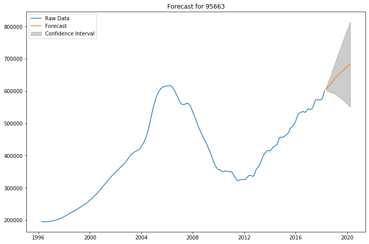


### Zip code 95663 (Penryn):  Excellent investment opportunity

By the model prediction, I would expect to see a 13.679% change in price by April 1, 2020.
At the lower bound of the confidence interval, I would expect to see a -8.334% change in price by April 1, 2020.
At the upper bound of the confidence interval, I would expect to see a 35.692% change in price by April 1, 2020.

## SacMetro:  95623 (El Dorado) -- Good investment opportunity

### Set up dataframe


```python
geog_area = '95623'
```


```python
city = 'El Dorado'
```


```python
county = 'El Dorado'
```


```python
ts = df_sac.loc[df_sac['Zip'] == geog_area]
```


```python
ts.head()
```


<div>
<style scoped>
    .dataframe tbody tr th:only-of-type {
        vertical-align: middle;
    }

    .dataframe tbody tr th {
        vertical-align: top;
    }

    .dataframe thead th {
        text-align: right;
    }
</style>
<table border="1" class="dataframe">
  <thead>
    <tr style="text-align: right;">
      <th></th>
      <th>Metro</th>
      <th>MetroState</th>
      <th>CountyName</th>
      <th>City</th>
      <th>Zip</th>
      <th>value</th>
    </tr>
    <tr>
      <th>time</th>
      <th></th>
      <th></th>
      <th></th>
      <th></th>
      <th></th>
      <th></th>
    </tr>
  </thead>
  <tbody>
    <tr>
      <td>1996-04-01</td>
      <td>Sacramento</td>
      <td>Sacramento CA</td>
      <td>El Dorado</td>
      <td>El Dorado</td>
      <td>95623</td>
      <td>165300.0</td>
    </tr>
    <tr>
      <td>1996-05-01</td>
      <td>Sacramento</td>
      <td>Sacramento CA</td>
      <td>El Dorado</td>
      <td>El Dorado</td>
      <td>95623</td>
      <td>164900.0</td>
    </tr>
    <tr>
      <td>1996-06-01</td>
      <td>Sacramento</td>
      <td>Sacramento CA</td>
      <td>El Dorado</td>
      <td>El Dorado</td>
      <td>95623</td>
      <td>164400.0</td>
    </tr>
    <tr>
      <td>1996-07-01</td>
      <td>Sacramento</td>
      <td>Sacramento CA</td>
      <td>El Dorado</td>
      <td>El Dorado</td>
      <td>95623</td>
      <td>164000.0</td>
    </tr>
    <tr>
      <td>1996-08-01</td>
      <td>Sacramento</td>
      <td>Sacramento CA</td>
      <td>El Dorado</td>
      <td>El Dorado</td>
      <td>95623</td>
      <td>163700.0</td>
    </tr>
  </tbody>
</table>
</div>


```python
ts = ts.resample('MS').asfreq()
```


```python
ts.head()
```


<div>
<style scoped>
    .dataframe tbody tr th:only-of-type {
        vertical-align: middle;
    }

    .dataframe tbody tr th {
        vertical-align: top;
    }

    .dataframe thead th {
        text-align: right;
    }
</style>
<table border="1" class="dataframe">
  <thead>
    <tr style="text-align: right;">
      <th></th>
      <th>Metro</th>
      <th>MetroState</th>
      <th>CountyName</th>
      <th>City</th>
      <th>Zip</th>
      <th>value</th>
    </tr>
    <tr>
      <th>time</th>
      <th></th>
      <th></th>
      <th></th>
      <th></th>
      <th></th>
      <th></th>
    </tr>
  </thead>
  <tbody>
    <tr>
      <td>1996-04-01</td>
      <td>Sacramento</td>
      <td>Sacramento CA</td>
      <td>El Dorado</td>
      <td>El Dorado</td>
      <td>95623</td>
      <td>165300.0</td>
    </tr>
    <tr>
      <td>1996-05-01</td>
      <td>Sacramento</td>
      <td>Sacramento CA</td>
      <td>El Dorado</td>
      <td>El Dorado</td>
      <td>95623</td>
      <td>164900.0</td>
    </tr>
    <tr>
      <td>1996-06-01</td>
      <td>Sacramento</td>
      <td>Sacramento CA</td>
      <td>El Dorado</td>
      <td>El Dorado</td>
      <td>95623</td>
      <td>164400.0</td>
    </tr>
    <tr>
      <td>1996-07-01</td>
      <td>Sacramento</td>
      <td>Sacramento CA</td>
      <td>El Dorado</td>
      <td>El Dorado</td>
      <td>95623</td>
      <td>164000.0</td>
    </tr>
    <tr>
      <td>1996-08-01</td>
      <td>Sacramento</td>
      <td>Sacramento CA</td>
      <td>El Dorado</td>
      <td>El Dorado</td>
      <td>95623</td>
      <td>163700.0</td>
    </tr>
  </tbody>
</table>
</div>


### Visualizations


```python
plot_single_geog(df_melt, geog_area, 'value', 'Zip', figsize=(12, 6), fontsize1=12, fontsize2=16)
```


```python
ts.boxplot(column = 'value')
plt.title(geog_area);

```


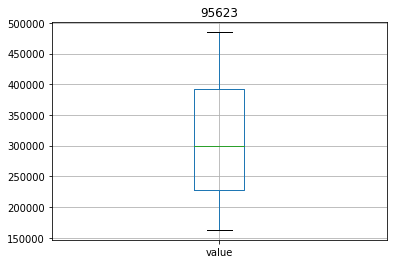


```python
plot_acf_pacf(ts.value)
```


```python
plot_seasonal_decomp(ts.value);

# Note that seasonality isn't much of a factor here; maximum difference of about $700 over the course of a year
```


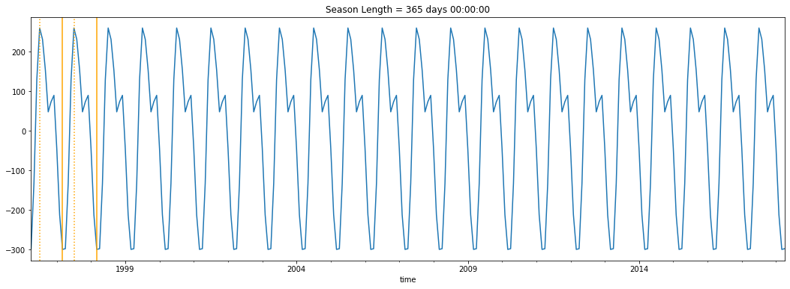


### ARIMA parameters tuning


```python
p_values = [0, 1, 2, 4, 6, 8, 10]
d_values = range(0, 3)
q_values = range(0, 3)

```


```python
# order_tuples_95623, mse_results_95623, best_cfg_95623, best_score_95623 = eval_params_and_lists(ts.value, p_values, d_values, q_values)

```

From previous analyses:  # Best ARIMA(6, 1, 2) MSE=2032900.464


```python
# best_cfg = best_cfg_95623
best_cfg = (6,1,2)
best_cfg
```


    (6, 1, 2)


```python
# results_table_95623 = pd.DataFrame({'Order':order_tuples_95623, 'MSEs':mse_results_95623})
# results_table_95623
```

### ARIMA modeling and forecasting results


```python
print_results_lists()   # make sure that the lists are correct to this point; 
                        # use pop_results_lists() to remove last item
```


    (['95616',
      '95619',
      '95864',
      '95831',
      '95811',
      '95818',
      '95630',
      '96140',
      '95672',
      '95636',
      '95709',
      '95746',
      '95614',
      '95663'],
     ['Davis',
      'Diamond Springs',
      'Arden-Arcade',
      'Sacramento_Pocket',
      'Sacramento_DosRios',
      'Sacramento_LandPark',
      'Folsom',
      'Carnelian Bay',
      'Rescue',
      'Somerset',
      'Camino',
      'Granite Bay',
      'Cool',
      'Penryn'],
     ['Yolo',
      'El Dorado',
      'Sacramento',
      'Sacramento',
      'Sacramento',
      'Sacramento',
      'Sacramento',
      'Placer',
      'El Dorado',
      'El Dorado',
      'El Dorado',
      'Placer',
      'El Dorado',
      'Placer'],
     [(2, 1, 2),
      (2, 1, 2),
      (8, 0, 2),
      (6, 0, 2),
      (10, 1, 0),
      (6, 2, 2),
      (2, 2, 0),
      (4, 2, 1),
      (8, 2, 0),
      (8, 2, 1),
      (8, 0, 2),
      (6, 1, 2),
      (8, 0, 2),
      (6, 1, 1)],
     [717863.06,
      355774.45,
      449047.92,
      389675.07,
      570598.7,
      558380.08,
      545821.37,
      769785.39,
      766372.9,
      268239.06,
      385671.99,
      840052.01,
      434312.48,
      682869.53],
     [619575.34,
      275292.09,
      327568.68,
      302216.31,
      459606.77,
      418566.82,
      427964.65,
      518008.87,
      562046.69,
      148993.04,
      305444.97,
      704070.95,
      345086.19,
      550638.69],
     [816150.79,
      436256.81,
      570527.16,
      477133.84,
      681590.63,
      698193.34,
      663678.09,
      1021561.92,
      970699.1,
      387485.09,
      465899.01,
      976033.07,
      523538.76,
      815100.37],
     [692300.0,
      321100.0,
      552700.0,
      449300.0,
      567500.0,
      563900.0,
      542900.0,
      644600.0,
      579300.0,
      241200.0,
      386000.0,
      778500.0,
      423300.0,
      600700.0],
     [3.69,
      10.8,
      -18.75,
      -13.27,
      0.55,
      -0.98,
      0.54,
      19.42,
      32.29,
      11.21,
      -0.08,
      7.91,
      2.6,
      13.68],
     [-10.5,
      -14.27,
      -40.73,
      -32.74,
      -19.01,
      -25.77,
      -21.17,
      -19.64,
      -2.98,
      -38.23,
      -20.87,
      -9.56,
      -18.48,
      -8.33],
     [17.89,
      35.86,
      3.23,
      6.19,
      20.1,
      23.82,
      22.25,
      58.48,
      67.56,
      60.65,
      20.7,
      25.37,
      23.68,
      35.69])


```python
arima_forecast(ts, geog_area, city, county, p_values, d_values, q_values, best_cfg, confint=2, run_pdq = False)
```

    For 95623 (El Dorado):
    Best ARIMA order = (6, 1, 2)
                                 ARIMA Model Results                              
    ==============================================================================
    Dep. Variable:                D.value   No. Observations:                  264
    Model:                 ARIMA(6, 1, 2)   Log Likelihood               -2137.809
    Method:                       css-mle   S.D. of innovations            785.964
    Date:                Tue, 17 Mar 2020   AIC                           4295.619
    Time:                        15:28:53   BIC                           4331.378
    Sample:                    05-01-1996   HQIC                          4309.988
                             - 04-01-2018                                         
    =================================================================================
                        coef    std err          z      P>|z|      [0.025      0.975]
    ---------------------------------------------------------------------------------
    const          1100.0000   1234.745      0.891      0.374   -1320.056    3520.056
    ar.L1.D.value     0.3530      0.073      4.804      0.000       0.209       0.497
    ar.L2.D.value     0.3069      0.078      3.931      0.000       0.154       0.460
    ar.L3.D.value     0.0378      0.078      0.484      0.629      -0.115       0.191
    ar.L4.D.value     0.0813      0.079      1.022      0.308      -0.075       0.237
    ar.L5.D.value    -0.0678      0.083     -0.822      0.412      -0.230       0.094
    ar.L6.D.value     0.1636      0.070      2.351      0.019       0.027       0.300
    ma.L1.D.value     1.5432      0.044     35.031      0.000       1.457       1.630
    ma.L2.D.value     0.8584      0.050     17.159      0.000       0.760       0.956
                                        Roots                                    
    =============================================================================
                      Real          Imaginary           Modulus         Frequency
    -----------------------------------------------------------------------------
    AR.1            1.0567           -0.0000j            1.0567           -0.0000
    AR.2           -1.2513           -0.0000j            1.2513           -0.5000
    AR.3           -0.6322           -1.2802j            1.4278           -0.3230
    AR.4           -0.6322           +1.2802j            1.4278            0.3230
    AR.5            0.9368           -1.1792j            1.5060           -0.1431
    AR.6            0.9368           +1.1792j            1.5060            0.1431
    MA.1           -0.8989           -0.5974j            1.0794           -0.4066
    MA.2           -0.8989           +0.5974j            1.0794            0.4066
    -----------------------------------------------------------------------------
    By the model prediction, I would expect to see a 8.258% change in price by April 1, 2020.
    At the lower bound of the confidence interval, I would expect to see a -14.768% change in price by April 1, 2020.
    At the upper bound of the confidence interval, I would expect to see a 31.285% change in price by April 1, 2020.


    (['95616',
      '95619',
      '95864',
      '95831',
      '95811',
      '95818',
      '95630',
      '96140',
      '95672',
      '95636',
      '95709',
      '95746',
      '95614',
      '95663',
      '95623'],
     ['Davis',
      'Diamond Springs',
      'Arden-Arcade',
      'Sacramento_Pocket',
      'Sacramento_DosRios',
      'Sacramento_LandPark',
      'Folsom',
      'Carnelian Bay',
      'Rescue',
      'Somerset',
      'Camino',
      'Granite Bay',
      'Cool',
      'Penryn',
      'El Dorado'],
     ['Yolo',
      'El Dorado',
      'Sacramento',
      'Sacramento',
      'Sacramento',
      'Sacramento',
      'Sacramento',
      'Placer',
      'El Dorado',
      'El Dorado',
      'El Dorado',
      'Placer',
      'El Dorado',
      'Placer',
      'El Dorado'],
     [(2, 1, 2),
      (2, 1, 2),
      (8, 0, 2),
      (6, 0, 2),
      (10, 1, 0),
      (6, 2, 2),
      (2, 2, 0),
      (4, 2, 1),
      (8, 2, 0),
      (8, 2, 1),
      (8, 0, 2),
      (6, 1, 2),
      (8, 0, 2),
      (6, 1, 1),
      (6, 1, 2)],
     [717863.06,
      355774.45,
      449047.92,
      389675.07,
      570598.7,
      558380.08,
      545821.37,
      769785.39,
      766372.9,
      268239.06,
      385671.99,
      840052.01,
      434312.48,
      682869.53,
      493333.57],
     [619575.34,
      275292.09,
      327568.68,
      302216.31,
      459606.77,
      418566.82,
      427964.65,
      518008.87,
      562046.69,
      148993.04,
      305444.97,
      704070.95,
      345086.19,
      550638.69,
      388402.06],
     [816150.79,
      436256.81,
      570527.16,
      477133.84,
      681590.63,
      698193.34,
      663678.09,
      1021561.92,
      970699.1,
      387485.09,
      465899.01,
      976033.07,
      523538.76,
      815100.37,
      598265.08],
     [692300.0,
      321100.0,
      552700.0,
      449300.0,
      567500.0,
      563900.0,
      542900.0,
      644600.0,
      579300.0,
      241200.0,
      386000.0,
      778500.0,
      423300.0,
      600700.0,
      455700.0],
     [3.69,
      10.8,
      -18.75,
      -13.27,
      0.55,
      -0.98,
      0.54,
      19.42,
      32.29,
      11.21,
      -0.08,
      7.91,
      2.6,
      13.68,
      8.26],
     [-10.5,
      -14.27,
      -40.73,
      -32.74,
      -19.01,
      -25.77,
      -21.17,
      -19.64,
      -2.98,
      -38.23,
      -20.87,
      -9.56,
      -18.48,
      -8.33,
      -14.77],
     [17.89,
      35.86,
      3.23,
      6.19,
      20.1,
      23.82,
      22.25,
      58.48,
      67.56,
      60.65,
      20.7,
      25.37,
      23.68,
      35.69,
      31.28])


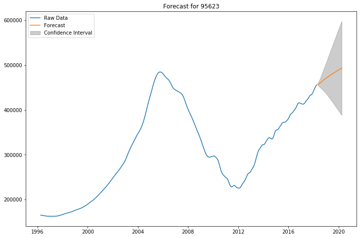


### Zip code 95623 (El Dorado):   Good investment opportunity

By the model prediction, I would expect to see a 8.258% change in price by April 1, 2020.
At the lower bound of the confidence interval, I would expect to see a -14.768% change in price by April 1, 2020.
At the upper bound of the confidence interval, I would expect to see a 31.285% change in price by April 1, 2020.

## SacMetro:  95747 (Roseville) -- Potential investment opportunity with more upside than downside potential

### Set up dataframe


```python
geog_area = '95747'
```


```python
city = 'Roseville'
```


```python
county = 'Placer'
```


```python
ts = df_sac.loc[df_sac['Zip'] == geog_area]
```


```python
ts.head()
```


<div>
<style scoped>
    .dataframe tbody tr th:only-of-type {
        vertical-align: middle;
    }

    .dataframe tbody tr th {
        vertical-align: top;
    }

    .dataframe thead th {
        text-align: right;
    }
</style>
<table border="1" class="dataframe">
  <thead>
    <tr style="text-align: right;">
      <th></th>
      <th>Metro</th>
      <th>MetroState</th>
      <th>CountyName</th>
      <th>City</th>
      <th>Zip</th>
      <th>value</th>
    </tr>
    <tr>
      <th>time</th>
      <th></th>
      <th></th>
      <th></th>
      <th></th>
      <th></th>
      <th></th>
    </tr>
  </thead>
  <tbody>
    <tr>
      <td>1996-04-01</td>
      <td>Sacramento</td>
      <td>Sacramento CA</td>
      <td>Placer</td>
      <td>Roseville</td>
      <td>95747</td>
      <td>192700.0</td>
    </tr>
    <tr>
      <td>1996-05-01</td>
      <td>Sacramento</td>
      <td>Sacramento CA</td>
      <td>Placer</td>
      <td>Roseville</td>
      <td>95747</td>
      <td>193700.0</td>
    </tr>
    <tr>
      <td>1996-06-01</td>
      <td>Sacramento</td>
      <td>Sacramento CA</td>
      <td>Placer</td>
      <td>Roseville</td>
      <td>95747</td>
      <td>195000.0</td>
    </tr>
    <tr>
      <td>1996-07-01</td>
      <td>Sacramento</td>
      <td>Sacramento CA</td>
      <td>Placer</td>
      <td>Roseville</td>
      <td>95747</td>
      <td>196500.0</td>
    </tr>
    <tr>
      <td>1996-08-01</td>
      <td>Sacramento</td>
      <td>Sacramento CA</td>
      <td>Placer</td>
      <td>Roseville</td>
      <td>95747</td>
      <td>198100.0</td>
    </tr>
  </tbody>
</table>
</div>


```python
ts = ts.resample('MS').asfreq()
```


```python
ts.head()
```


<div>
<style scoped>
    .dataframe tbody tr th:only-of-type {
        vertical-align: middle;
    }

    .dataframe tbody tr th {
        vertical-align: top;
    }

    .dataframe thead th {
        text-align: right;
    }
</style>
<table border="1" class="dataframe">
  <thead>
    <tr style="text-align: right;">
      <th></th>
      <th>Metro</th>
      <th>MetroState</th>
      <th>CountyName</th>
      <th>City</th>
      <th>Zip</th>
      <th>value</th>
    </tr>
    <tr>
      <th>time</th>
      <th></th>
      <th></th>
      <th></th>
      <th></th>
      <th></th>
      <th></th>
    </tr>
  </thead>
  <tbody>
    <tr>
      <td>1996-04-01</td>
      <td>Sacramento</td>
      <td>Sacramento CA</td>
      <td>Placer</td>
      <td>Roseville</td>
      <td>95747</td>
      <td>192700.0</td>
    </tr>
    <tr>
      <td>1996-05-01</td>
      <td>Sacramento</td>
      <td>Sacramento CA</td>
      <td>Placer</td>
      <td>Roseville</td>
      <td>95747</td>
      <td>193700.0</td>
    </tr>
    <tr>
      <td>1996-06-01</td>
      <td>Sacramento</td>
      <td>Sacramento CA</td>
      <td>Placer</td>
      <td>Roseville</td>
      <td>95747</td>
      <td>195000.0</td>
    </tr>
    <tr>
      <td>1996-07-01</td>
      <td>Sacramento</td>
      <td>Sacramento CA</td>
      <td>Placer</td>
      <td>Roseville</td>
      <td>95747</td>
      <td>196500.0</td>
    </tr>
    <tr>
      <td>1996-08-01</td>
      <td>Sacramento</td>
      <td>Sacramento CA</td>
      <td>Placer</td>
      <td>Roseville</td>
      <td>95747</td>
      <td>198100.0</td>
    </tr>
  </tbody>
</table>
</div>


### Visualizations


```python
plot_single_geog(df_melt, geog_area, 'value', 'Zip', figsize=(12, 6), fontsize1=12, fontsize2=16)
```


```python
ts.boxplot(column = 'value')
plt.title(geog_area);

```


```python
plot_acf_pacf(ts.value)
```


```python
plot_seasonal_decomp(ts.value);

# Note that seasonality isn't much of a factor here; maximum difference of about $700 over the course of a year
```


### ARIMA parameters tuning


```python
p_values = [0, 1, 2, 4, 6, 8, 10]
d_values = range(0, 3)
q_values = range(0, 3)

```


```python
# order_tuples_95747, mse_results_95747, best_cfg_95747, best_score_95747 = eval_params_and_lists(ts.value, p_values, d_values, q_values)

```

From previous analyses:  Need to validate--Best ARIMA(4, 1, 2) MSE=956941.458


```python
best_cfg = (4, 1, 2)
best_cfg
```


    (4, 1, 2)


```python
# results_table_95747 = pd.DataFrame({'Order':order_tuples_95747, 'MSEs':mse_results_95747})
# results_table_95747
```

### ARIMA modeling and forecasting results


```python
print_results_lists()   # make sure that the lists are correct to this point; 
                        # use pop_results_lists() to remove last item
```


```python
arima_forecast(ts, geog_area, city, county, p_values, d_values, q_values, best_cfg, confint=2, run_pdq = False)
```

    For 95747 (Roseville):
    Best ARIMA order = (4, 1, 2)
                                 ARIMA Model Results                              
    ==============================================================================
    Dep. Variable:                D.value   No. Observations:                  264
    Model:                 ARIMA(4, 1, 2)   Log Likelihood               -2072.555
    Method:                       css-mle   S.D. of innovations            613.651
    Date:                Tue, 17 Mar 2020   AIC                           4161.111
    Time:                        15:29:20   BIC                           4189.718
    Sample:                    05-01-1996   HQIC                          4172.606
                             - 04-01-2018                                         
    =================================================================================
                        coef    std err          z      P>|z|      [0.025      0.975]
    ---------------------------------------------------------------------------------
    const           694.2087    282.373      2.458      0.015     140.768    1247.649
    ar.L1.D.value     2.1793      0.097     22.411      0.000       1.989       2.370
    ar.L2.D.value    -1.6975      0.243     -6.982      0.000      -2.174      -1.221
    ar.L3.D.value     0.8149      0.221      3.682      0.000       0.381       1.249
    ar.L4.D.value    -0.2991      0.078     -3.852      0.000      -0.451      -0.147
    ma.L1.D.value    -0.5056      0.084     -6.042      0.000      -0.670      -0.342
    ma.L2.D.value    -0.4944      0.083     -5.958      0.000      -0.657      -0.332
                                        Roots                                    
    =============================================================================
                      Real          Imaginary           Modulus         Frequency
    -----------------------------------------------------------------------------
    AR.1            1.0159           -0.0439j            1.0168           -0.0069
    AR.2            1.0159           +0.0439j            1.0168            0.0069
    AR.3            0.3464           -1.7645j            1.7982           -0.2191
    AR.4            0.3464           +1.7645j            1.7982            0.2191
    MA.1            1.0000           +0.0000j            1.0000            0.0000
    MA.2           -2.0225           +0.0000j            2.0225            0.5000
    -----------------------------------------------------------------------------
    By the model prediction, I would expect to see a 5.547% change in price by April 1, 2020.
    At the lower bound of the confidence interval, I would expect to see a -10.62% change in price by April 1, 2020.
    At the upper bound of the confidence interval, I would expect to see a 21.715% change in price by April 1, 2020.


    (['95616',
      '95619',
      '95864',
      '95831',
      '95811',
      '95818',
      '95630',
      '96140',
      '95672',
      '95636',
      '95709',
      '95746',
      '95614',
      '95663',
      '95623',
      '95747'],
     ['Davis',
      'Diamond Springs',
      'Arden-Arcade',
      'Sacramento_Pocket',
      'Sacramento_DosRios',
      'Sacramento_LandPark',
      'Folsom',
      'Carnelian Bay',
      'Rescue',
      'Somerset',
      'Camino',
      'Granite Bay',
      'Cool',
      'Penryn',
      'El Dorado',
      'Roseville'],
     ['Yolo',
      'El Dorado',
      'Sacramento',
      'Sacramento',
      'Sacramento',
      'Sacramento',
      'Sacramento',
      'Placer',
      'El Dorado',
      'El Dorado',
      'El Dorado',
      'Placer',
      'El Dorado',
      'Placer',
      'El Dorado',
      'Placer'],
     [(2, 1, 2),
      (2, 1, 2),
      (8, 0, 2),
      (6, 0, 2),
      (10, 1, 0),
      (6, 2, 2),
      (2, 2, 0),
      (4, 2, 1),
      (8, 2, 0),
      (8, 2, 1),
      (8, 0, 2),
      (6, 1, 2),
      (8, 0, 2),
      (6, 1, 1),
      (6, 1, 2),
      (4, 1, 2)],
     [717863.06,
      355774.45,
      449047.92,
      389675.07,
      570598.7,
      558380.08,
      545821.37,
      769785.39,
      766372.9,
      268239.06,
      385671.99,
      840052.01,
      434312.48,
      682869.53,
      493333.57,
      510638.14],
     [619575.34,
      275292.09,
      327568.68,
      302216.31,
      459606.77,
      418566.82,
      427964.65,
      518008.87,
      562046.69,
      148993.04,
      305444.97,
      704070.95,
      345086.19,
      550638.69,
      388402.06,
      432420.37],
     [816150.79,
      436256.81,
      570527.16,
      477133.84,
      681590.63,
      698193.34,
      663678.09,
      1021561.92,
      970699.1,
      387485.09,
      465899.01,
      976033.07,
      523538.76,
      815100.37,
      598265.08,
      588855.91],
     [692300.0,
      321100.0,
      552700.0,
      449300.0,
      567500.0,
      563900.0,
      542900.0,
      644600.0,
      579300.0,
      241200.0,
      386000.0,
      778500.0,
      423300.0,
      600700.0,
      455700.0,
      483800.0],
     [3.69,
      10.8,
      -18.75,
      -13.27,
      0.55,
      -0.98,
      0.54,
      19.42,
      32.29,
      11.21,
      -0.08,
      7.91,
      2.6,
      13.68,
      8.26,
      5.55],
     [-10.5,
      -14.27,
      -40.73,
      -32.74,
      -19.01,
      -25.77,
      -21.17,
      -19.64,
      -2.98,
      -38.23,
      -20.87,
      -9.56,
      -18.48,
      -8.33,
      -14.77,
      -10.62],
     [17.89,
      35.86,
      3.23,
      6.19,
      20.1,
      23.82,
      22.25,
      58.48,
      67.56,
      60.65,
      20.7,
      25.37,
      23.68,
      35.69,
      31.28,
      21.71])


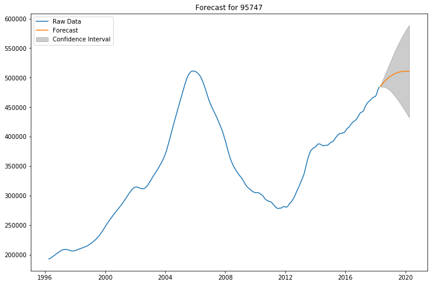


### Zip code 95747 (Roseville):  Potential opportunity, with mediocre predicted returns but more upside than downside

By the model prediction, I would expect to see a 5.556% change in price by April 1, 2020.
At the lower bound of the confidence interval, I would expect to see a -10.609% change in price by April 1, 2020.
At the upper bound of the confidence interval, I would expect to see a 21.722% change in price by April 1, 2020.

## SacMetro:  95765 (Rocklin) -- Solid investment opportunity with minimal downside risk

### Set up dataframe


```python
geog_area = '95765'
```


```python
city = 'Rocklin'
```


```python
county = 'Placer'
```


```python
ts = df_sac.loc[df_sac['Zip'] == geog_area]
```


```python
ts.head()
```


<div>
<style scoped>
    .dataframe tbody tr th:only-of-type {
        vertical-align: middle;
    }

    .dataframe tbody tr th {
        vertical-align: top;
    }

    .dataframe thead th {
        text-align: right;
    }
</style>
<table border="1" class="dataframe">
  <thead>
    <tr style="text-align: right;">
      <th></th>
      <th>Metro</th>
      <th>MetroState</th>
      <th>CountyName</th>
      <th>City</th>
      <th>Zip</th>
      <th>value</th>
    </tr>
    <tr>
      <th>time</th>
      <th></th>
      <th></th>
      <th></th>
      <th></th>
      <th></th>
      <th></th>
    </tr>
  </thead>
  <tbody>
    <tr>
      <td>1996-04-01</td>
      <td>Sacramento</td>
      <td>Sacramento CA</td>
      <td>Placer</td>
      <td>Rocklin</td>
      <td>95765</td>
      <td>192600.0</td>
    </tr>
    <tr>
      <td>1996-05-01</td>
      <td>Sacramento</td>
      <td>Sacramento CA</td>
      <td>Placer</td>
      <td>Rocklin</td>
      <td>95765</td>
      <td>192300.0</td>
    </tr>
    <tr>
      <td>1996-06-01</td>
      <td>Sacramento</td>
      <td>Sacramento CA</td>
      <td>Placer</td>
      <td>Rocklin</td>
      <td>95765</td>
      <td>191900.0</td>
    </tr>
    <tr>
      <td>1996-07-01</td>
      <td>Sacramento</td>
      <td>Sacramento CA</td>
      <td>Placer</td>
      <td>Rocklin</td>
      <td>95765</td>
      <td>191400.0</td>
    </tr>
    <tr>
      <td>1996-08-01</td>
      <td>Sacramento</td>
      <td>Sacramento CA</td>
      <td>Placer</td>
      <td>Rocklin</td>
      <td>95765</td>
      <td>190900.0</td>
    </tr>
  </tbody>
</table>
</div>


```python
ts = ts.resample('MS').asfreq()
```


```python
ts.head()
```


<div>
<style scoped>
    .dataframe tbody tr th:only-of-type {
        vertical-align: middle;
    }

    .dataframe tbody tr th {
        vertical-align: top;
    }

    .dataframe thead th {
        text-align: right;
    }
</style>
<table border="1" class="dataframe">
  <thead>
    <tr style="text-align: right;">
      <th></th>
      <th>Metro</th>
      <th>MetroState</th>
      <th>CountyName</th>
      <th>City</th>
      <th>Zip</th>
      <th>value</th>
    </tr>
    <tr>
      <th>time</th>
      <th></th>
      <th></th>
      <th></th>
      <th></th>
      <th></th>
      <th></th>
    </tr>
  </thead>
  <tbody>
    <tr>
      <td>1996-04-01</td>
      <td>Sacramento</td>
      <td>Sacramento CA</td>
      <td>Placer</td>
      <td>Rocklin</td>
      <td>95765</td>
      <td>192600.0</td>
    </tr>
    <tr>
      <td>1996-05-01</td>
      <td>Sacramento</td>
      <td>Sacramento CA</td>
      <td>Placer</td>
      <td>Rocklin</td>
      <td>95765</td>
      <td>192300.0</td>
    </tr>
    <tr>
      <td>1996-06-01</td>
      <td>Sacramento</td>
      <td>Sacramento CA</td>
      <td>Placer</td>
      <td>Rocklin</td>
      <td>95765</td>
      <td>191900.0</td>
    </tr>
    <tr>
      <td>1996-07-01</td>
      <td>Sacramento</td>
      <td>Sacramento CA</td>
      <td>Placer</td>
      <td>Rocklin</td>
      <td>95765</td>
      <td>191400.0</td>
    </tr>
    <tr>
      <td>1996-08-01</td>
      <td>Sacramento</td>
      <td>Sacramento CA</td>
      <td>Placer</td>
      <td>Rocklin</td>
      <td>95765</td>
      <td>190900.0</td>
    </tr>
  </tbody>
</table>
</div>


### Visualizations


```python
plot_single_geog(df_melt, geog_area, 'value', 'Zip', figsize=(12, 6), fontsize1=12, fontsize2=16)
```


```python
ts.boxplot(column = 'value')
plt.title(geog_area);

```


```python
plot_acf_pacf(ts.value)
```


```python
plot_seasonal_decomp(ts.value);

# Note that seasonality isn't much of a factor here; maximum difference of about $700 over the course of a year
```


### ARIMA parameters tuning


```python
p_values = [0, 1, 2, 4, 6, 8, 10]
d_values = range(0, 3)
q_values = range(0, 3)

```


```python
# order_tuples_95765, mse_results_95765, best_cfg_95765, best_score_95765 = eval_params_and_lists(ts.value, p_values, d_values, q_values)

```

From previous analyses: Need to validate--Best ARIMA(4, 1, 2) MSE=958549.703 (same as Roseville, so one of them is wrong)


```python
best_cfg = (4,1,2)
best_cfg
```


    (4, 1, 2)


```python
# results_table_95765 = pd.DataFrame({'Order':order_tuples_95765, 'MSEs':mse_results_95765})
# results_table_95765
```

### ARIMA modeling and forecasting results


```python
print_results_lists()   # make sure that the lists are correct to this point; 
                        # use pop_results_lists() to remove last item
```


    (['95616',
      '95619',
      '95864',
      '95831',
      '95811',
      '95818',
      '95630',
      '96140',
      '95672',
      '95636',
      '95709',
      '95746',
      '95614',
      '95663',
      '95623',
      '95747'],
     ['Davis',
      'Diamond Springs',
      'Arden-Arcade',
      'Sacramento_Pocket',
      'Sacramento_DosRios',
      'Sacramento_LandPark',
      'Folsom',
      'Carnelian Bay',
      'Rescue',
      'Somerset',
      'Camino',
      'Granite Bay',
      'Cool',
      'Penryn',
      'El Dorado',
      'Roseville'],
     ['Yolo',
      'El Dorado',
      'Sacramento',
      'Sacramento',
      'Sacramento',
      'Sacramento',
      'Sacramento',
      'Placer',
      'El Dorado',
      'El Dorado',
      'El Dorado',
      'Placer',
      'El Dorado',
      'Placer',
      'El Dorado',
      'Placer'],
     [(2, 1, 2),
      (2, 1, 2),
      (8, 0, 2),
      (6, 0, 2),
      (10, 1, 0),
      (6, 2, 2),
      (2, 2, 0),
      (4, 2, 1),
      (8, 2, 0),
      (8, 2, 1),
      (8, 0, 2),
      (6, 1, 2),
      (8, 0, 2),
      (6, 1, 1),
      (6, 1, 2),
      (4, 1, 2)],
     [717863.06,
      355774.45,
      449047.92,
      389675.07,
      570598.7,
      558380.08,
      545821.37,
      769785.39,
      766372.9,
      268239.06,
      385671.99,
      840052.01,
      434312.48,
      682869.53,
      493333.57,
      510638.14],
     [619575.34,
      275292.09,
      327568.68,
      302216.31,
      459606.77,
      418566.82,
      427964.65,
      518008.87,
      562046.69,
      148993.04,
      305444.97,
      704070.95,
      345086.19,
      550638.69,
      388402.06,
      432420.37],
     [816150.79,
      436256.81,
      570527.16,
      477133.84,
      681590.63,
      698193.34,
      663678.09,
      1021561.92,
      970699.1,
      387485.09,
      465899.01,
      976033.07,
      523538.76,
      815100.37,
      598265.08,
      588855.91],
     [692300.0,
      321100.0,
      552700.0,
      449300.0,
      567500.0,
      563900.0,
      542900.0,
      644600.0,
      579300.0,
      241200.0,
      386000.0,
      778500.0,
      423300.0,
      600700.0,
      455700.0,
      483800.0],
     [3.69,
      10.8,
      -18.75,
      -13.27,
      0.55,
      -0.98,
      0.54,
      19.42,
      32.29,
      11.21,
      -0.08,
      7.91,
      2.6,
      13.68,
      8.26,
      5.55],
     [-10.5,
      -14.27,
      -40.73,
      -32.74,
      -19.01,
      -25.77,
      -21.17,
      -19.64,
      -2.98,
      -38.23,
      -20.87,
      -9.56,
      -18.48,
      -8.33,
      -14.77,
      -10.62],
     [17.89,
      35.86,
      3.23,
      6.19,
      20.1,
      23.82,
      22.25,
      58.48,
      67.56,
      60.65,
      20.7,
      25.37,
      23.68,
      35.69,
      31.28,
      21.71])


```python
arima_forecast(ts, geog_area, city, county, p_values, d_values, q_values, best_cfg, confint=2, run_pdq = False)
```

    For 95765 (Rocklin):
    Best ARIMA order = (4, 1, 2)
                                 ARIMA Model Results                              
    ==============================================================================
    Dep. Variable:                D.value   No. Observations:                  264
    Model:                 ARIMA(4, 1, 2)   Log Likelihood               -2097.489
    Method:                       css-mle   S.D. of innovations            676.112
    Date:                Tue, 17 Mar 2020   AIC                           4210.978
    Time:                        15:30:09   BIC                           4239.586
    Sample:                    05-01-1996   HQIC                          4222.474
                             - 04-01-2018                                         
    =================================================================================
                        coef    std err          z      P>|z|      [0.025      0.975]
    ---------------------------------------------------------------------------------
    const          1199.2430   1403.669      0.854      0.394   -1551.898    3950.384
    ar.L1.D.value     0.3081      0.082      3.752      0.000       0.147       0.469
    ar.L2.D.value     0.3689      0.111      3.327      0.001       0.152       0.586
    ar.L3.D.value     0.0756      0.136      0.556      0.579      -0.191       0.342
    ar.L4.D.value     0.1578      0.096      1.650      0.100      -0.030       0.345
    ma.L1.D.value     1.5100      0.057     26.702      0.000       1.399       1.621
    ma.L2.D.value     0.7564      0.064     11.886      0.000       0.632       0.881
                                        Roots                                    
    =============================================================================
                      Real          Imaginary           Modulus         Frequency
    -----------------------------------------------------------------------------
    AR.1            1.0454           -0.0000j            1.0454           -0.0000
    AR.2           -1.5353           -0.0000j            1.5353           -0.5000
    AR.3            0.0056           -1.9868j            1.9868           -0.2496
    AR.4            0.0056           +1.9868j            1.9868            0.2496
    MA.1           -0.9982           -0.5707j            1.1498           -0.4173
    MA.2           -0.9982           +0.5707j            1.1498            0.4173
    -----------------------------------------------------------------------------
    By the model prediction, I would expect to see a 11.779% change in price by April 1, 2020.
    At the lower bound of the confidence interval, I would expect to see a -8.471% change in price by April 1, 2020.
    At the upper bound of the confidence interval, I would expect to see a 32.029% change in price by April 1, 2020.


    (['95616',
      '95619',
      '95864',
      '95831',
      '95811',
      '95818',
      '95630',
      '96140',
      '95672',
      '95636',
      '95709',
      '95746',
      '95614',
      '95663',
      '95623',
      '95747',
      '95765'],
     ['Davis',
      'Diamond Springs',
      'Arden-Arcade',
      'Sacramento_Pocket',
      'Sacramento_DosRios',
      'Sacramento_LandPark',
      'Folsom',
      'Carnelian Bay',
      'Rescue',
      'Somerset',
      'Camino',
      'Granite Bay',
      'Cool',
      'Penryn',
      'El Dorado',
      'Roseville',
      'Rocklin'],
     ['Yolo',
      'El Dorado',
      'Sacramento',
      'Sacramento',
      'Sacramento',
      'Sacramento',
      'Sacramento',
      'Placer',
      'El Dorado',
      'El Dorado',
      'El Dorado',
      'Placer',
      'El Dorado',
      'Placer',
      'El Dorado',
      'Placer',
      'Placer'],
     [(2, 1, 2),
      (2, 1, 2),
      (8, 0, 2),
      (6, 0, 2),
      (10, 1, 0),
      (6, 2, 2),
      (2, 2, 0),
      (4, 2, 1),
      (8, 2, 0),
      (8, 2, 1),
      (8, 0, 2),
      (6, 1, 2),
      (8, 0, 2),
      (6, 1, 1),
      (6, 1, 2),
      (4, 1, 2),
      (4, 1, 2)],
     [717863.06,
      355774.45,
      449047.92,
      389675.07,
      570598.7,
      558380.08,
      545821.37,
      769785.39,
      766372.9,
      268239.06,
      385671.99,
      840052.01,
      434312.48,
      682869.53,
      493333.57,
      510638.14,
      569180.09],
     [619575.34,
      275292.09,
      327568.68,
      302216.31,
      459606.77,
      418566.82,
      427964.65,
      518008.87,
      562046.69,
      148993.04,
      305444.97,
      704070.95,
      345086.19,
      550638.69,
      388402.06,
      432420.37,
      466067.8],
     [816150.79,
      436256.81,
      570527.16,
      477133.84,
      681590.63,
      698193.34,
      663678.09,
      1021561.92,
      970699.1,
      387485.09,
      465899.01,
      976033.07,
      523538.76,
      815100.37,
      598265.08,
      588855.91,
      672292.39],
     [692300.0,
      321100.0,
      552700.0,
      449300.0,
      567500.0,
      563900.0,
      542900.0,
      644600.0,
      579300.0,
      241200.0,
      386000.0,
      778500.0,
      423300.0,
      600700.0,
      455700.0,
      483800.0,
      509200.0],
     [3.69,
      10.8,
      -18.75,
      -13.27,
      0.55,
      -0.98,
      0.54,
      19.42,
      32.29,
      11.21,
      -0.08,
      7.91,
      2.6,
      13.68,
      8.26,
      5.55,
      11.78],
     [-10.5,
      -14.27,
      -40.73,
      -32.74,
      -19.01,
      -25.77,
      -21.17,
      -19.64,
      -2.98,
      -38.23,
      -20.87,
      -9.56,
      -18.48,
      -8.33,
      -14.77,
      -10.62,
      -8.47],
     [17.89,
      35.86,
      3.23,
      6.19,
      20.1,
      23.82,
      22.25,
      58.48,
      67.56,
      60.65,
      20.7,
      25.37,
      23.68,
      35.69,
      31.28,
      21.71,
      32.03])


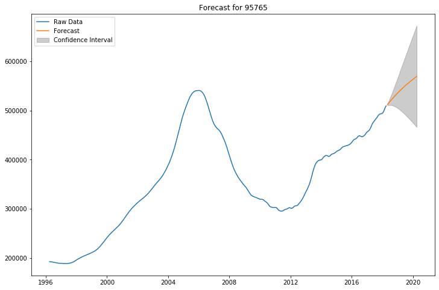


### Zip code 95765 (Rocklin):  Solid investment opportunity with minimal downside

By the model prediction, I would expect to see a 11.779% change in price by April 1, 2020.
At the lower bound of the confidence interval, I would expect to see a -8.471% change in price by April 1, 2020.
At the upper bound of the confidence interval, I would expect to see a 32.029% change in price by April 1, 2020.


## SacMetro:  95602 (Auburn) -- Strong investment opportunity with minimal downside

### Set up dataframe


```python
geog_area = '95602'
```


```python
city = 'Auburn'
```


```python
county = 'Placer'
```


```python
ts = df_sac.loc[df_sac['Zip'] == geog_area]
```


```python
ts.head()
```


<div>
<style scoped>
    .dataframe tbody tr th:only-of-type {
        vertical-align: middle;
    }

    .dataframe tbody tr th {
        vertical-align: top;
    }

    .dataframe thead th {
        text-align: right;
    }
</style>
<table border="1" class="dataframe">
  <thead>
    <tr style="text-align: right;">
      <th></th>
      <th>Metro</th>
      <th>MetroState</th>
      <th>CountyName</th>
      <th>City</th>
      <th>Zip</th>
      <th>value</th>
    </tr>
    <tr>
      <th>time</th>
      <th></th>
      <th></th>
      <th></th>
      <th></th>
      <th></th>
      <th></th>
    </tr>
  </thead>
  <tbody>
    <tr>
      <td>1996-04-01</td>
      <td>Sacramento</td>
      <td>Sacramento CA</td>
      <td>Placer</td>
      <td>Auburn</td>
      <td>95602</td>
      <td>184300.0</td>
    </tr>
    <tr>
      <td>1996-05-01</td>
      <td>Sacramento</td>
      <td>Sacramento CA</td>
      <td>Placer</td>
      <td>Auburn</td>
      <td>95602</td>
      <td>184000.0</td>
    </tr>
    <tr>
      <td>1996-06-01</td>
      <td>Sacramento</td>
      <td>Sacramento CA</td>
      <td>Placer</td>
      <td>Auburn</td>
      <td>95602</td>
      <td>183700.0</td>
    </tr>
    <tr>
      <td>1996-07-01</td>
      <td>Sacramento</td>
      <td>Sacramento CA</td>
      <td>Placer</td>
      <td>Auburn</td>
      <td>95602</td>
      <td>183500.0</td>
    </tr>
    <tr>
      <td>1996-08-01</td>
      <td>Sacramento</td>
      <td>Sacramento CA</td>
      <td>Placer</td>
      <td>Auburn</td>
      <td>95602</td>
      <td>183300.0</td>
    </tr>
  </tbody>
</table>
</div>


```python
ts = ts.resample('MS').asfreq()
```


```python
ts.head()
```


<div>
<style scoped>
    .dataframe tbody tr th:only-of-type {
        vertical-align: middle;
    }

    .dataframe tbody tr th {
        vertical-align: top;
    }

    .dataframe thead th {
        text-align: right;
    }
</style>
<table border="1" class="dataframe">
  <thead>
    <tr style="text-align: right;">
      <th></th>
      <th>Metro</th>
      <th>MetroState</th>
      <th>CountyName</th>
      <th>City</th>
      <th>Zip</th>
      <th>value</th>
    </tr>
    <tr>
      <th>time</th>
      <th></th>
      <th></th>
      <th></th>
      <th></th>
      <th></th>
      <th></th>
    </tr>
  </thead>
  <tbody>
    <tr>
      <td>1996-04-01</td>
      <td>Sacramento</td>
      <td>Sacramento CA</td>
      <td>Placer</td>
      <td>Auburn</td>
      <td>95602</td>
      <td>184300.0</td>
    </tr>
    <tr>
      <td>1996-05-01</td>
      <td>Sacramento</td>
      <td>Sacramento CA</td>
      <td>Placer</td>
      <td>Auburn</td>
      <td>95602</td>
      <td>184000.0</td>
    </tr>
    <tr>
      <td>1996-06-01</td>
      <td>Sacramento</td>
      <td>Sacramento CA</td>
      <td>Placer</td>
      <td>Auburn</td>
      <td>95602</td>
      <td>183700.0</td>
    </tr>
    <tr>
      <td>1996-07-01</td>
      <td>Sacramento</td>
      <td>Sacramento CA</td>
      <td>Placer</td>
      <td>Auburn</td>
      <td>95602</td>
      <td>183500.0</td>
    </tr>
    <tr>
      <td>1996-08-01</td>
      <td>Sacramento</td>
      <td>Sacramento CA</td>
      <td>Placer</td>
      <td>Auburn</td>
      <td>95602</td>
      <td>183300.0</td>
    </tr>
  </tbody>
</table>
</div>


### Visualizations


```python
plot_single_geog(df_melt, geog_area, 'value', 'Zip', figsize=(12, 6), fontsize1=12, fontsize2=16)
```


```python
ts.boxplot(column = 'value')
plt.title(geog_area);

```


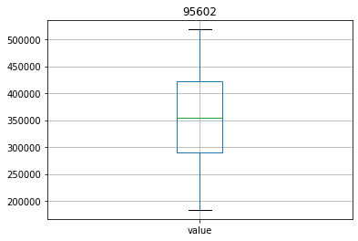


```python
plot_acf_pacf(ts.value)
```


```python
plot_seasonal_decomp(ts.value);

# Note that seasonality isn't much of a factor here; maximum difference of about $700 over the course of a year
```


### ARIMA parameters tuning


```python
p_values = [0, 1, 2, 4, 6, 8, 10]
d_values = range(0, 3)
q_values = range(0, 3)

```


```python
# order_tuples_95602, mse_results_95602, best_cfg_95602, best_score_95602 = eval_params_and_lists(ts.value, p_values, d_values, q_values)

```

From previous analyses:  Best ARIMA(4, 0, 2) MSE=584168.034


```python
# best_cfg = best_cfg_95602
best_cfg = (4,0,2)
best_cfg
```


    (4, 0, 2)


```python
# results_table_95602 = pd.DataFrame({'Order':order_tuples_95602, 'MSEs':mse_results_95602})
# results_table_95602
```

### ARIMA modeling and forecasting results


```python
print_results_lists()   # make sure that the lists are correct to this point; 
                        # use pop_results_lists() to remove last item
```


    (['95616',
      '95619',
      '95864',
      '95831',
      '95811',
      '95818',
      '95630',
      '96140',
      '95672',
      '95636',
      '95709',
      '95746',
      '95614',
      '95663',
      '95623',
      '95747',
      '95765'],
     ['Davis',
      'Diamond Springs',
      'Arden-Arcade',
      'Sacramento_Pocket',
      'Sacramento_DosRios',
      'Sacramento_LandPark',
      'Folsom',
      'Carnelian Bay',
      'Rescue',
      'Somerset',
      'Camino',
      'Granite Bay',
      'Cool',
      'Penryn',
      'El Dorado',
      'Roseville',
      'Rocklin'],
     ['Yolo',
      'El Dorado',
      'Sacramento',
      'Sacramento',
      'Sacramento',
      'Sacramento',
      'Sacramento',
      'Placer',
      'El Dorado',
      'El Dorado',
      'El Dorado',
      'Placer',
      'El Dorado',
      'Placer',
      'El Dorado',
      'Placer',
      'Placer'],
     [(2, 1, 2),
      (2, 1, 2),
      (8, 0, 2),
      (6, 0, 2),
      (10, 1, 0),
      (6, 2, 2),
      (2, 2, 0),
      (4, 2, 1),
      (8, 2, 0),
      (8, 2, 1),
      (8, 0, 2),
      (6, 1, 2),
      (8, 0, 2),
      (6, 1, 1),
      (6, 1, 2),
      (4, 1, 2),
      (4, 1, 2)],
     [717863.06,
      355774.45,
      449047.92,
      389675.07,
      570598.7,
      558380.08,
      545821.37,
      769785.39,
      766372.9,
      268239.06,
      385671.99,
      840052.01,
      434312.48,
      682869.53,
      493333.57,
      510638.14,
      569180.09],
     [619575.34,
      275292.09,
      327568.68,
      302216.31,
      459606.77,
      418566.82,
      427964.65,
      518008.87,
      562046.69,
      148993.04,
      305444.97,
      704070.95,
      345086.19,
      550638.69,
      388402.06,
      432420.37,
      466067.8],
     [816150.79,
      436256.81,
      570527.16,
      477133.84,
      681590.63,
      698193.34,
      663678.09,
      1021561.92,
      970699.1,
      387485.09,
      465899.01,
      976033.07,
      523538.76,
      815100.37,
      598265.08,
      588855.91,
      672292.39],
     [692300.0,
      321100.0,
      552700.0,
      449300.0,
      567500.0,
      563900.0,
      542900.0,
      644600.0,
      579300.0,
      241200.0,
      386000.0,
      778500.0,
      423300.0,
      600700.0,
      455700.0,
      483800.0,
      509200.0],
     [3.69,
      10.8,
      -18.75,
      -13.27,
      0.55,
      -0.98,
      0.54,
      19.42,
      32.29,
      11.21,
      -0.08,
      7.91,
      2.6,
      13.68,
      8.26,
      5.55,
      11.78],
     [-10.5,
      -14.27,
      -40.73,
      -32.74,
      -19.01,
      -25.77,
      -21.17,
      -19.64,
      -2.98,
      -38.23,
      -20.87,
      -9.56,
      -18.48,
      -8.33,
      -14.77,
      -10.62,
      -8.47],
     [17.89,
      35.86,
      3.23,
      6.19,
      20.1,
      23.82,
      22.25,
      58.48,
      67.56,
      60.65,
      20.7,
      25.37,
      23.68,
      35.69,
      31.28,
      21.71,
      32.03])


```python
arima_forecast(ts, geog_area, city, county, p_values, d_values, q_values, best_cfg, confint=2, run_pdq = False)
```

    For 95602 (Auburn):
    Best ARIMA order = (4, 0, 2)
                                  ARMA Model Results                              
    ==============================================================================
    Dep. Variable:                  value   No. Observations:                  265
    Model:                     ARMA(4, 2)   Log Likelihood               -2158.915
    Method:                       css-mle   S.D. of innovations            811.624
    Date:                Tue, 17 Mar 2020   AIC                           4333.830
    Time:                        15:31:44   BIC                           4362.468
    Sample:                    04-01-1996   HQIC                          4345.337
                             - 04-01-2018                                         
    ===============================================================================
                      coef    std err          z      P>|z|      [0.025      0.975]
    -------------------------------------------------------------------------------
    const        3.484e+05   7.93e+04      4.393      0.000    1.93e+05    5.04e+05
    ar.L1.value     1.2032        nan        nan        nan         nan         nan
    ar.L2.value     0.0974        nan        nan        nan         nan         nan
    ar.L3.value     0.0485        nan        nan        nan         nan         nan
    ar.L4.value    -0.3507      0.063     -5.563      0.000      -0.474      -0.227
    ma.L1.value     1.5434        nan        nan        nan         nan         nan
    ma.L2.value     0.8629        nan        nan        nan         nan         nan
                                        Roots                                    
    =============================================================================
                      Real          Imaginary           Modulus         Frequency
    -----------------------------------------------------------------------------
    AR.1            1.0149           -0.0000j            1.0149           -0.0000
    AR.2            1.0573           -0.0000j            1.0573           -0.0000
    AR.3           -0.9670           -1.3122j            1.6300           -0.3511
    AR.4           -0.9670           +1.3122j            1.6300            0.3511
    MA.1           -0.8943           -0.5992j            1.0765           -0.4060
    MA.2           -0.8943           +0.5992j            1.0765            0.4060
    -----------------------------------------------------------------------------
    By the model prediction, I would expect to see a 2.689% change in price by April 1, 2020.
    At the lower bound of the confidence interval, I would expect to see a -18.158% change in price by April 1, 2020.
    At the upper bound of the confidence interval, I would expect to see a 23.537% change in price by April 1, 2020.


    (['95616',
      '95619',
      '95864',
      '95831',
      '95811',
      '95818',
      '95630',
      '96140',
      '95672',
      '95636',
      '95709',
      '95746',
      '95614',
      '95663',
      '95623',
      '95747',
      '95765',
      '95602',
      '95602'],
     ['Davis',
      'Diamond Springs',
      'Arden-Arcade',
      'Sacramento_Pocket',
      'Sacramento_DosRios',
      'Sacramento_LandPark',
      'Folsom',
      'Carnelian Bay',
      'Rescue',
      'Somerset',
      'Camino',
      'Granite Bay',
      'Cool',
      'Penryn',
      'El Dorado',
      'Roseville',
      'Rocklin',
      'Auburn',
      'Auburn'],
     ['Yolo',
      'El Dorado',
      'Sacramento',
      'Sacramento',
      'Sacramento',
      'Sacramento',
      'Sacramento',
      'Placer',
      'El Dorado',
      'El Dorado',
      'El Dorado',
      'Placer',
      'El Dorado',
      'Placer',
      'El Dorado',
      'Placer',
      'Placer',
      'Placer',
      'Placer'],
     [(2, 1, 2),
      (2, 1, 2),
      (8, 0, 2),
      (6, 0, 2),
      (10, 1, 0),
      (6, 2, 2),
      (2, 2, 0),
      (4, 2, 1),
      (8, 2, 0),
      (8, 2, 1),
      (8, 0, 2),
      (6, 1, 2),
      (8, 0, 2),
      (6, 1, 1),
      (6, 1, 2),
      (4, 1, 2),
      (4, 1, 2),
      (4, 0, 2),
      (4, 0, 2)],
     [717863.06,
      355774.45,
      449047.92,
      389675.07,
      570598.7,
      558380.08,
      545821.37,
      769785.39,
      766372.9,
      268239.06,
      385671.99,
      840052.01,
      434312.48,
      682869.53,
      493333.57,
      510638.14,
      569180.09,
      501842.15,
      501842.15],
     [619575.34,
      275292.09,
      327568.68,
      302216.31,
      459606.77,
      418566.82,
      427964.65,
      518008.87,
      562046.69,
      148993.04,
      305444.97,
      704070.95,
      345086.19,
      550638.69,
      388402.06,
      432420.37,
      466067.8,
      399959.64,
      399959.64],
     [816150.79,
      436256.81,
      570527.16,
      477133.84,
      681590.63,
      698193.34,
      663678.09,
      1021561.92,
      970699.1,
      387485.09,
      465899.01,
      976033.07,
      523538.76,
      815100.37,
      598265.08,
      588855.91,
      672292.39,
      603724.66,
      603724.66],
     [692300.0,
      321100.0,
      552700.0,
      449300.0,
      567500.0,
      563900.0,
      542900.0,
      644600.0,
      579300.0,
      241200.0,
      386000.0,
      778500.0,
      423300.0,
      600700.0,
      455700.0,
      483800.0,
      509200.0,
      488700.0,
      488700.0],
     [3.69,
      10.8,
      -18.75,
      -13.27,
      0.55,
      -0.98,
      0.54,
      19.42,
      32.29,
      11.21,
      -0.08,
      7.91,
      2.6,
      13.68,
      8.26,
      5.55,
      11.78,
      2.69,
      2.69],
     [-10.5,
      -14.27,
      -40.73,
      -32.74,
      -19.01,
      -25.77,
      -21.17,
      -19.64,
      -2.98,
      -38.23,
      -20.87,
      -9.56,
      -18.48,
      -8.33,
      -14.77,
      -10.62,
      -8.47,
      -18.16,
      -18.16],
     [17.89,
      35.86,
      3.23,
      6.19,
      20.1,
      23.82,
      22.25,
      58.48,
      67.56,
      60.65,
      20.7,
      25.37,
      23.68,
      35.69,
      31.28,
      21.71,
      32.03,
      23.54,
      23.54])


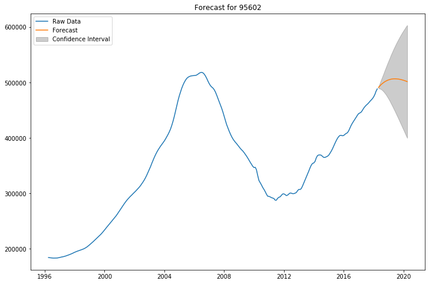


### Zip code 95602 (Auburn):  Strong investment opportunity with minimal downside

By the model prediction, I would expect to see a 11.831% change in price by April 1, 2020.
At the lower bound of the confidence interval, I would expect to see a -7.957% change in price by April 1, 2020.
At the upper bound of the confidence interval, I would expect to see a 31.619% change in price by April 1, 2020.

## SacMetro:  96150 (South Lake Tahoe) -- 

### Set up dataframe


```python
geog_area = '96150'
```


```python
city = 'South Lake Tahoe'
```


```python
county = 'El Dorado'
```


```python
ts = df_sac.loc[df_sac['Zip'] == geog_area]
```


```python
ts.head()
```


<div>
<style scoped>
    .dataframe tbody tr th:only-of-type {
        vertical-align: middle;
    }

    .dataframe tbody tr th {
        vertical-align: top;
    }

    .dataframe thead th {
        text-align: right;
    }
</style>
<table border="1" class="dataframe">
  <thead>
    <tr style="text-align: right;">
      <th></th>
      <th>Metro</th>
      <th>MetroState</th>
      <th>CountyName</th>
      <th>City</th>
      <th>Zip</th>
      <th>value</th>
    </tr>
    <tr>
      <th>time</th>
      <th></th>
      <th></th>
      <th></th>
      <th></th>
      <th></th>
      <th></th>
    </tr>
  </thead>
  <tbody>
    <tr>
      <td>1996-04-01</td>
      <td>Sacramento</td>
      <td>Sacramento CA</td>
      <td>El Dorado</td>
      <td>South Lake Tahoe</td>
      <td>96150</td>
      <td>132800.0</td>
    </tr>
    <tr>
      <td>1996-05-01</td>
      <td>Sacramento</td>
      <td>Sacramento CA</td>
      <td>El Dorado</td>
      <td>South Lake Tahoe</td>
      <td>96150</td>
      <td>132500.0</td>
    </tr>
    <tr>
      <td>1996-06-01</td>
      <td>Sacramento</td>
      <td>Sacramento CA</td>
      <td>El Dorado</td>
      <td>South Lake Tahoe</td>
      <td>96150</td>
      <td>132400.0</td>
    </tr>
    <tr>
      <td>1996-07-01</td>
      <td>Sacramento</td>
      <td>Sacramento CA</td>
      <td>El Dorado</td>
      <td>South Lake Tahoe</td>
      <td>96150</td>
      <td>132400.0</td>
    </tr>
    <tr>
      <td>1996-08-01</td>
      <td>Sacramento</td>
      <td>Sacramento CA</td>
      <td>El Dorado</td>
      <td>South Lake Tahoe</td>
      <td>96150</td>
      <td>132600.0</td>
    </tr>
  </tbody>
</table>
</div>


```python
ts = ts.resample('MS').asfreq()
```


```python
ts.head()
```


<div>
<style scoped>
    .dataframe tbody tr th:only-of-type {
        vertical-align: middle;
    }

    .dataframe tbody tr th {
        vertical-align: top;
    }

    .dataframe thead th {
        text-align: right;
    }
</style>
<table border="1" class="dataframe">
  <thead>
    <tr style="text-align: right;">
      <th></th>
      <th>Metro</th>
      <th>MetroState</th>
      <th>CountyName</th>
      <th>City</th>
      <th>Zip</th>
      <th>value</th>
    </tr>
    <tr>
      <th>time</th>
      <th></th>
      <th></th>
      <th></th>
      <th></th>
      <th></th>
      <th></th>
    </tr>
  </thead>
  <tbody>
    <tr>
      <td>1996-04-01</td>
      <td>Sacramento</td>
      <td>Sacramento CA</td>
      <td>El Dorado</td>
      <td>South Lake Tahoe</td>
      <td>96150</td>
      <td>132800.0</td>
    </tr>
    <tr>
      <td>1996-05-01</td>
      <td>Sacramento</td>
      <td>Sacramento CA</td>
      <td>El Dorado</td>
      <td>South Lake Tahoe</td>
      <td>96150</td>
      <td>132500.0</td>
    </tr>
    <tr>
      <td>1996-06-01</td>
      <td>Sacramento</td>
      <td>Sacramento CA</td>
      <td>El Dorado</td>
      <td>South Lake Tahoe</td>
      <td>96150</td>
      <td>132400.0</td>
    </tr>
    <tr>
      <td>1996-07-01</td>
      <td>Sacramento</td>
      <td>Sacramento CA</td>
      <td>El Dorado</td>
      <td>South Lake Tahoe</td>
      <td>96150</td>
      <td>132400.0</td>
    </tr>
    <tr>
      <td>1996-08-01</td>
      <td>Sacramento</td>
      <td>Sacramento CA</td>
      <td>El Dorado</td>
      <td>South Lake Tahoe</td>
      <td>96150</td>
      <td>132600.0</td>
    </tr>
  </tbody>
</table>
</div>


### Visualizations


```python
plot_single_geog(df_melt, geog_area, 'value', 'Zip', figsize=(12, 6), fontsize1=12, fontsize2=16)
```


```python
ts.boxplot(column = 'value')
plt.title(geog_area);

```


```python
plot_acf_pacf(ts.value)
```


```python
plot_seasonal_decomp(ts.value);

# Note that seasonality isn't much of a factor here; maximum difference of about $700 over the course of a year
```


### ARIMA parameters tuning


```python
p_values = [0, 1, 2, 4, 6, 8, 10]
d_values = range(0, 3)
q_values = range(0, 3)

```


```python
# order_tuples_96150, mse_results_96150, best_cfg_96150, best_score_96150 = eval_params_and_lists(ts.value, p_values, d_values, q_values)

```

From previous analyses:  Best ARIMA(2, 1, 2) MSE=700451.029


```python
best_cfg = (2,1,2)
best_cfg
```


    (2, 1, 2)


```python
# results_table_96150 = pd.DataFrame({'Order':order_tuples_96150, 'MSEs':mse_results_96150})
# results_table_96150
```

### ARIMA modeling and forecasting results


```python
print_results_lists()   # make sure that the lists are correct to this point; 
                        # use pop_results_lists() to remove last item
```


    (['95616',
      '95619',
      '95864',
      '95831',
      '95811',
      '95818',
      '95630',
      '96140',
      '95672',
      '95636',
      '95709',
      '95746',
      '95614',
      '95663',
      '95623',
      '95747',
      '95765',
      '95602',
      '95602'],
     ['Davis',
      'Diamond Springs',
      'Arden-Arcade',
      'Sacramento_Pocket',
      'Sacramento_DosRios',
      'Sacramento_LandPark',
      'Folsom',
      'Carnelian Bay',
      'Rescue',
      'Somerset',
      'Camino',
      'Granite Bay',
      'Cool',
      'Penryn',
      'El Dorado',
      'Roseville',
      'Rocklin',
      'Auburn',
      'Auburn'],
     ['Yolo',
      'El Dorado',
      'Sacramento',
      'Sacramento',
      'Sacramento',
      'Sacramento',
      'Sacramento',
      'Placer',
      'El Dorado',
      'El Dorado',
      'El Dorado',
      'Placer',
      'El Dorado',
      'Placer',
      'El Dorado',
      'Placer',
      'Placer',
      'Placer',
      'Placer'],
     [(2, 1, 2),
      (2, 1, 2),
      (8, 0, 2),
      (6, 0, 2),
      (10, 1, 0),
      (6, 2, 2),
      (2, 2, 0),
      (4, 2, 1),
      (8, 2, 0),
      (8, 2, 1),
      (8, 0, 2),
      (6, 1, 2),
      (8, 0, 2),
      (6, 1, 1),
      (6, 1, 2),
      (4, 1, 2),
      (4, 1, 2),
      (4, 0, 2),
      (4, 0, 2)],
     [717863.06,
      355774.45,
      449047.92,
      389675.07,
      570598.7,
      558380.08,
      545821.37,
      769785.39,
      766372.9,
      268239.06,
      385671.99,
      840052.01,
      434312.48,
      682869.53,
      493333.57,
      510638.14,
      569180.09,
      501842.15,
      501842.15],
     [619575.34,
      275292.09,
      327568.68,
      302216.31,
      459606.77,
      418566.82,
      427964.65,
      518008.87,
      562046.69,
      148993.04,
      305444.97,
      704070.95,
      345086.19,
      550638.69,
      388402.06,
      432420.37,
      466067.8,
      399959.64,
      399959.64],
     [816150.79,
      436256.81,
      570527.16,
      477133.84,
      681590.63,
      698193.34,
      663678.09,
      1021561.92,
      970699.1,
      387485.09,
      465899.01,
      976033.07,
      523538.76,
      815100.37,
      598265.08,
      588855.91,
      672292.39,
      603724.66,
      603724.66],
     [692300.0,
      321100.0,
      552700.0,
      449300.0,
      567500.0,
      563900.0,
      542900.0,
      644600.0,
      579300.0,
      241200.0,
      386000.0,
      778500.0,
      423300.0,
      600700.0,
      455700.0,
      483800.0,
      509200.0,
      488700.0,
      488700.0],
     [3.69,
      10.8,
      -18.75,
      -13.27,
      0.55,
      -0.98,
      0.54,
      19.42,
      32.29,
      11.21,
      -0.08,
      7.91,
      2.6,
      13.68,
      8.26,
      5.55,
      11.78,
      2.69,
      2.69],
     [-10.5,
      -14.27,
      -40.73,
      -32.74,
      -19.01,
      -25.77,
      -21.17,
      -19.64,
      -2.98,
      -38.23,
      -20.87,
      -9.56,
      -18.48,
      -8.33,
      -14.77,
      -10.62,
      -8.47,
      -18.16,
      -18.16],
     [17.89,
      35.86,
      3.23,
      6.19,
      20.1,
      23.82,
      22.25,
      58.48,
      67.56,
      60.65,
      20.7,
      25.37,
      23.68,
      35.69,
      31.28,
      21.71,
      32.03,
      23.54,
      23.54])


```python
pop_results_lists()
```


    (['95616',
      '95619',
      '95864',
      '95831',
      '95811',
      '95818',
      '95630',
      '96140',
      '95672',
      '95636',
      '95709',
      '95746',
      '95614',
      '95663',
      '95623',
      '95747',
      '95765',
      '95602'],
     ['Davis',
      'Diamond Springs',
      'Arden-Arcade',
      'Sacramento_Pocket',
      'Sacramento_DosRios',
      'Sacramento_LandPark',
      'Folsom',
      'Carnelian Bay',
      'Rescue',
      'Somerset',
      'Camino',
      'Granite Bay',
      'Cool',
      'Penryn',
      'El Dorado',
      'Roseville',
      'Rocklin',
      'Auburn'],
     ['Yolo',
      'El Dorado',
      'Sacramento',
      'Sacramento',
      'Sacramento',
      'Sacramento',
      'Sacramento',
      'Placer',
      'El Dorado',
      'El Dorado',
      'El Dorado',
      'Placer',
      'El Dorado',
      'Placer',
      'El Dorado',
      'Placer',
      'Placer',
      'Placer'],
     [(2, 1, 2),
      (2, 1, 2),
      (8, 0, 2),
      (6, 0, 2),
      (10, 1, 0),
      (6, 2, 2),
      (2, 2, 0),
      (4, 2, 1),
      (8, 2, 0),
      (8, 2, 1),
      (8, 0, 2),
      (6, 1, 2),
      (8, 0, 2),
      (6, 1, 1),
      (6, 1, 2),
      (4, 1, 2),
      (4, 1, 2),
      (4, 0, 2)],
     [717863.06,
      355774.45,
      449047.92,
      389675.07,
      570598.7,
      558380.08,
      545821.37,
      769785.39,
      766372.9,
      268239.06,
      385671.99,
      840052.01,
      434312.48,
      682869.53,
      493333.57,
      510638.14,
      569180.09,
      501842.15],
     [619575.34,
      275292.09,
      327568.68,
      302216.31,
      459606.77,
      418566.82,
      427964.65,
      518008.87,
      562046.69,
      148993.04,
      305444.97,
      704070.95,
      345086.19,
      550638.69,
      388402.06,
      432420.37,
      466067.8,
      399959.64],
     [816150.79,
      436256.81,
      570527.16,
      477133.84,
      681590.63,
      698193.34,
      663678.09,
      1021561.92,
      970699.1,
      387485.09,
      465899.01,
      976033.07,
      523538.76,
      815100.37,
      598265.08,
      588855.91,
      672292.39,
      603724.66],
     [692300.0,
      321100.0,
      552700.0,
      449300.0,
      567500.0,
      563900.0,
      542900.0,
      644600.0,
      579300.0,
      241200.0,
      386000.0,
      778500.0,
      423300.0,
      600700.0,
      455700.0,
      483800.0,
      509200.0,
      488700.0],
     [3.69,
      10.8,
      -18.75,
      -13.27,
      0.55,
      -0.98,
      0.54,
      19.42,
      32.29,
      11.21,
      -0.08,
      7.91,
      2.6,
      13.68,
      8.26,
      5.55,
      11.78,
      2.69],
     [-10.5,
      -14.27,
      -40.73,
      -32.74,
      -19.01,
      -25.77,
      -21.17,
      -19.64,
      -2.98,
      -38.23,
      -20.87,
      -9.56,
      -18.48,
      -8.33,
      -14.77,
      -10.62,
      -8.47,
      -18.16],
     [17.89,
      35.86,
      3.23,
      6.19,
      20.1,
      23.82,
      22.25,
      58.48,
      67.56,
      60.65,
      20.7,
      25.37,
      23.68,
      35.69,
      31.28,
      21.71,
      32.03,
      23.54])


```python
arima_forecast(ts, geog_area, city, county, p_values, d_values, q_values, best_cfg, confint=2, run_pdq = False)
```

    For 96150 (South Lake Tahoe):
    Best ARIMA order = (2, 1, 2)
                                 ARIMA Model Results                              
    ==============================================================================
    Dep. Variable:                D.value   No. Observations:                  264
    Model:                 ARIMA(2, 1, 2)   Log Likelihood               -2087.931
    Method:                       css-mle   S.D. of innovations            649.754
    Date:                Tue, 17 Mar 2020   AIC                           4187.862
    Time:                        15:32:46   BIC                           4209.318
    Sample:                    05-01-1996   HQIC                          4196.484
                             - 04-01-2018                                         
    =================================================================================
                        coef    std err          z      P>|z|      [0.025      0.975]
    ---------------------------------------------------------------------------------
    const          1087.9188    970.299      1.121      0.263    -813.832    2989.670
    ar.L1.D.value     0.2575      0.054      4.770      0.000       0.152       0.363
    ar.L2.D.value     0.6001      0.054     11.028      0.000       0.493       0.707
    ma.L1.D.value     1.6626      0.023     72.624      0.000       1.618       1.708
    ma.L2.D.value     0.9367      0.027     35.047      0.000       0.884       0.989
                                        Roots                                    
    =============================================================================
                      Real          Imaginary           Modulus         Frequency
    -----------------------------------------------------------------------------
    AR.1            1.0941           +0.0000j            1.0941            0.0000
    AR.2           -1.5232           +0.0000j            1.5232            0.5000
    MA.1           -0.8875           -0.5291j            1.0333           -0.4144
    MA.2           -0.8875           +0.5291j            1.0333            0.4144
    -----------------------------------------------------------------------------
    By the model prediction, I would expect to see a 8.481% change in price by April 1, 2020.
    At the lower bound of the confidence interval, I would expect to see a -14.734% change in price by April 1, 2020.
    At the upper bound of the confidence interval, I would expect to see a 31.696% change in price by April 1, 2020.


    (['95616',
      '95619',
      '95864',
      '95831',
      '95811',
      '95818',
      '95630',
      '96140',
      '95672',
      '95636',
      '95709',
      '95746',
      '95614',
      '95663',
      '95623',
      '95747',
      '95765',
      '95602',
      '96150'],
     ['Davis',
      'Diamond Springs',
      'Arden-Arcade',
      'Sacramento_Pocket',
      'Sacramento_DosRios',
      'Sacramento_LandPark',
      'Folsom',
      'Carnelian Bay',
      'Rescue',
      'Somerset',
      'Camino',
      'Granite Bay',
      'Cool',
      'Penryn',
      'El Dorado',
      'Roseville',
      'Rocklin',
      'Auburn',
      'South Lake Tahoe'],
     ['Yolo',
      'El Dorado',
      'Sacramento',
      'Sacramento',
      'Sacramento',
      'Sacramento',
      'Sacramento',
      'Placer',
      'El Dorado',
      'El Dorado',
      'El Dorado',
      'Placer',
      'El Dorado',
      'Placer',
      'El Dorado',
      'Placer',
      'Placer',
      'Placer',
      'El Dorado'],
     [(2, 1, 2),
      (2, 1, 2),
      (8, 0, 2),
      (6, 0, 2),
      (10, 1, 0),
      (6, 2, 2),
      (2, 2, 0),
      (4, 2, 1),
      (8, 2, 0),
      (8, 2, 1),
      (8, 0, 2),
      (6, 1, 2),
      (8, 0, 2),
      (6, 1, 1),
      (6, 1, 2),
      (4, 1, 2),
      (4, 1, 2),
      (4, 0, 2),
      (2, 1, 2)],
     [717863.06,
      355774.45,
      449047.92,
      389675.07,
      570598.7,
      558380.08,
      545821.37,
      769785.39,
      766372.9,
      268239.06,
      385671.99,
      840052.01,
      434312.48,
      682869.53,
      493333.57,
      510638.14,
      569180.09,
      501842.15,
      469181.53],
     [619575.34,
      275292.09,
      327568.68,
      302216.31,
      459606.77,
      418566.82,
      427964.65,
      518008.87,
      562046.69,
      148993.04,
      305444.97,
      704070.95,
      345086.19,
      550638.69,
      388402.06,
      432420.37,
      466067.8,
      399959.64,
      368777.33],
     [816150.79,
      436256.81,
      570527.16,
      477133.84,
      681590.63,
      698193.34,
      663678.09,
      1021561.92,
      970699.1,
      387485.09,
      465899.01,
      976033.07,
      523538.76,
      815100.37,
      598265.08,
      588855.91,
      672292.39,
      603724.66,
      569585.73],
     [692300.0,
      321100.0,
      552700.0,
      449300.0,
      567500.0,
      563900.0,
      542900.0,
      644600.0,
      579300.0,
      241200.0,
      386000.0,
      778500.0,
      423300.0,
      600700.0,
      455700.0,
      483800.0,
      509200.0,
      488700.0,
      432500.0],
     [3.69,
      10.8,
      -18.75,
      -13.27,
      0.55,
      -0.98,
      0.54,
      19.42,
      32.29,
      11.21,
      -0.08,
      7.91,
      2.6,
      13.68,
      8.26,
      5.55,
      11.78,
      2.69,
      8.48],
     [-10.5,
      -14.27,
      -40.73,
      -32.74,
      -19.01,
      -25.77,
      -21.17,
      -19.64,
      -2.98,
      -38.23,
      -20.87,
      -9.56,
      -18.48,
      -8.33,
      -14.77,
      -10.62,
      -8.47,
      -18.16,
      -14.73],
     [17.89,
      35.86,
      3.23,
      6.19,
      20.1,
      23.82,
      22.25,
      58.48,
      67.56,
      60.65,
      20.7,
      25.37,
      23.68,
      35.69,
      31.28,
      21.71,
      32.03,
      23.54,
      31.7])


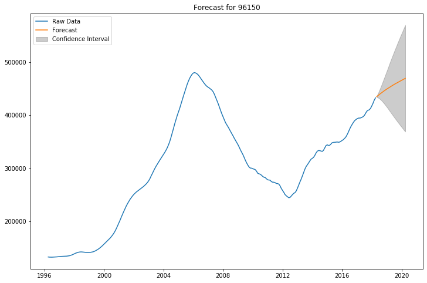


### Zip code  (South Lake Tahoe):  Good potential investment opportunity, with some downside but significant potential upside

By the model prediction, I would expect to see a 8.539% change in price by April 1, 2020.
At the lower bound of the confidence interval, I would expect to see a -14.673% change in price by April 1, 2020.
At the upper bound of the confidence interval, I would expect to see a 31.75% change.

## SacMetro:  95650 (Loomis) -- Excellent investment opportunity with limited downside and large potential upside

### Set up dataframe


```python
geog_area = '95650'
```


```python
city = 'Loomis'
```


```python
county = 'Placer'
```


```python
ts = df_sac.loc[df_sac['Zip'] == geog_area]
```


```python
ts.head()
```


<div>
<style scoped>
    .dataframe tbody tr th:only-of-type {
        vertical-align: middle;
    }

    .dataframe tbody tr th {
        vertical-align: top;
    }

    .dataframe thead th {
        text-align: right;
    }
</style>
<table border="1" class="dataframe">
  <thead>
    <tr style="text-align: right;">
      <th></th>
      <th>Metro</th>
      <th>MetroState</th>
      <th>CountyName</th>
      <th>City</th>
      <th>Zip</th>
      <th>value</th>
    </tr>
    <tr>
      <th>time</th>
      <th></th>
      <th></th>
      <th></th>
      <th></th>
      <th></th>
      <th></th>
    </tr>
  </thead>
  <tbody>
    <tr>
      <td>1996-04-01</td>
      <td>Sacramento</td>
      <td>Sacramento CA</td>
      <td>Placer</td>
      <td>Loomis</td>
      <td>95650</td>
      <td>192900.0</td>
    </tr>
    <tr>
      <td>1996-05-01</td>
      <td>Sacramento</td>
      <td>Sacramento CA</td>
      <td>Placer</td>
      <td>Loomis</td>
      <td>95650</td>
      <td>193200.0</td>
    </tr>
    <tr>
      <td>1996-06-01</td>
      <td>Sacramento</td>
      <td>Sacramento CA</td>
      <td>Placer</td>
      <td>Loomis</td>
      <td>95650</td>
      <td>193400.0</td>
    </tr>
    <tr>
      <td>1996-07-01</td>
      <td>Sacramento</td>
      <td>Sacramento CA</td>
      <td>Placer</td>
      <td>Loomis</td>
      <td>95650</td>
      <td>193500.0</td>
    </tr>
    <tr>
      <td>1996-08-01</td>
      <td>Sacramento</td>
      <td>Sacramento CA</td>
      <td>Placer</td>
      <td>Loomis</td>
      <td>95650</td>
      <td>193700.0</td>
    </tr>
  </tbody>
</table>
</div>


```python
ts = ts.resample('MS').asfreq()
```


```python
ts.head()
```


<div>
<style scoped>
    .dataframe tbody tr th:only-of-type {
        vertical-align: middle;
    }

    .dataframe tbody tr th {
        vertical-align: top;
    }

    .dataframe thead th {
        text-align: right;
    }
</style>
<table border="1" class="dataframe">
  <thead>
    <tr style="text-align: right;">
      <th></th>
      <th>Metro</th>
      <th>MetroState</th>
      <th>CountyName</th>
      <th>City</th>
      <th>Zip</th>
      <th>value</th>
    </tr>
    <tr>
      <th>time</th>
      <th></th>
      <th></th>
      <th></th>
      <th></th>
      <th></th>
      <th></th>
    </tr>
  </thead>
  <tbody>
    <tr>
      <td>1996-04-01</td>
      <td>Sacramento</td>
      <td>Sacramento CA</td>
      <td>Placer</td>
      <td>Loomis</td>
      <td>95650</td>
      <td>192900.0</td>
    </tr>
    <tr>
      <td>1996-05-01</td>
      <td>Sacramento</td>
      <td>Sacramento CA</td>
      <td>Placer</td>
      <td>Loomis</td>
      <td>95650</td>
      <td>193200.0</td>
    </tr>
    <tr>
      <td>1996-06-01</td>
      <td>Sacramento</td>
      <td>Sacramento CA</td>
      <td>Placer</td>
      <td>Loomis</td>
      <td>95650</td>
      <td>193400.0</td>
    </tr>
    <tr>
      <td>1996-07-01</td>
      <td>Sacramento</td>
      <td>Sacramento CA</td>
      <td>Placer</td>
      <td>Loomis</td>
      <td>95650</td>
      <td>193500.0</td>
    </tr>
    <tr>
      <td>1996-08-01</td>
      <td>Sacramento</td>
      <td>Sacramento CA</td>
      <td>Placer</td>
      <td>Loomis</td>
      <td>95650</td>
      <td>193700.0</td>
    </tr>
  </tbody>
</table>
</div>


### Visualizations


```python
plot_single_geog(df_melt, geog_area, 'value', 'Zip', figsize=(12, 6), fontsize1=12, fontsize2=16)
```


```python
ts.boxplot(column = 'value')
plt.title(geog_area);

```


```python
plot_acf_pacf(ts.value)
```


```python
plot_seasonal_decomp(ts.value);

# Note that seasonality isn't much of a factor here; maximum difference of about $700 over the course of a year
```


### ARIMA parameters tuning


```python
p_values = [0, 1, 2, 4, 6, 8, 10]
d_values = range(0, 3)
q_values = range(0, 3)

```


```python
# order_tuples_95650, mse_results_95650, best_cfg_95650, best_score_95650 = eval_params_and_lists(ts.value, p_values, d_values, q_values)

```

From previous analyses:  Best ARIMA(8, 1, 2) MSE=3366956.253


```python
best_cfg = (8,1,2)
best_cfg
```


    (8, 1, 2)


```python
# results_table_95650 = pd.DataFrame({'Order':order_tuples_95650, 'MSEs':mse_results_95650})
# results_table_95650
```

### ARIMA modeling and forecasting results


```python
print_results_lists()   # make sure that the lists are correct to this point; 
                        # use pop_results_lists() to remove last item
```


    (['95616',
      '95619',
      '95864',
      '95831',
      '95811',
      '95818',
      '95630',
      '96140',
      '95672',
      '95636',
      '95709',
      '95746',
      '95614',
      '95663',
      '95623',
      '95747',
      '95765',
      '95602',
      '96150'],
     ['Davis',
      'Diamond Springs',
      'Arden-Arcade',
      'Sacramento_Pocket',
      'Sacramento_DosRios',
      'Sacramento_LandPark',
      'Folsom',
      'Carnelian Bay',
      'Rescue',
      'Somerset',
      'Camino',
      'Granite Bay',
      'Cool',
      'Penryn',
      'El Dorado',
      'Roseville',
      'Rocklin',
      'Auburn',
      'South Lake Tahoe'],
     ['Yolo',
      'El Dorado',
      'Sacramento',
      'Sacramento',
      'Sacramento',
      'Sacramento',
      'Sacramento',
      'Placer',
      'El Dorado',
      'El Dorado',
      'El Dorado',
      'Placer',
      'El Dorado',
      'Placer',
      'El Dorado',
      'Placer',
      'Placer',
      'Placer',
      'El Dorado'],
     [(2, 1, 2),
      (2, 1, 2),
      (8, 0, 2),
      (6, 0, 2),
      (10, 1, 0),
      (6, 2, 2),
      (2, 2, 0),
      (4, 2, 1),
      (8, 2, 0),
      (8, 2, 1),
      (8, 0, 2),
      (6, 1, 2),
      (8, 0, 2),
      (6, 1, 1),
      (6, 1, 2),
      (4, 1, 2),
      (4, 1, 2),
      (4, 0, 2),
      (2, 1, 2)],
     [717863.06,
      355774.45,
      449047.92,
      389675.07,
      570598.7,
      558380.08,
      545821.37,
      769785.39,
      766372.9,
      268239.06,
      385671.99,
      840052.01,
      434312.48,
      682869.53,
      493333.57,
      510638.14,
      569180.09,
      501842.15,
      469181.53],
     [619575.34,
      275292.09,
      327568.68,
      302216.31,
      459606.77,
      418566.82,
      427964.65,
      518008.87,
      562046.69,
      148993.04,
      305444.97,
      704070.95,
      345086.19,
      550638.69,
      388402.06,
      432420.37,
      466067.8,
      399959.64,
      368777.33],
     [816150.79,
      436256.81,
      570527.16,
      477133.84,
      681590.63,
      698193.34,
      663678.09,
      1021561.92,
      970699.1,
      387485.09,
      465899.01,
      976033.07,
      523538.76,
      815100.37,
      598265.08,
      588855.91,
      672292.39,
      603724.66,
      569585.73],
     [692300.0,
      321100.0,
      552700.0,
      449300.0,
      567500.0,
      563900.0,
      542900.0,
      644600.0,
      579300.0,
      241200.0,
      386000.0,
      778500.0,
      423300.0,
      600700.0,
      455700.0,
      483800.0,
      509200.0,
      488700.0,
      432500.0],
     [3.69,
      10.8,
      -18.75,
      -13.27,
      0.55,
      -0.98,
      0.54,
      19.42,
      32.29,
      11.21,
      -0.08,
      7.91,
      2.6,
      13.68,
      8.26,
      5.55,
      11.78,
      2.69,
      8.48],
     [-10.5,
      -14.27,
      -40.73,
      -32.74,
      -19.01,
      -25.77,
      -21.17,
      -19.64,
      -2.98,
      -38.23,
      -20.87,
      -9.56,
      -18.48,
      -8.33,
      -14.77,
      -10.62,
      -8.47,
      -18.16,
      -14.73],
     [17.89,
      35.86,
      3.23,
      6.19,
      20.1,
      23.82,
      22.25,
      58.48,
      67.56,
      60.65,
      20.7,
      25.37,
      23.68,
      35.69,
      31.28,
      21.71,
      32.03,
      23.54,
      31.7])


```python
arima_forecast(ts, geog_area, city, county, p_values, d_values, q_values, best_cfg, confint=2, run_pdq = False)
```

    For 95650 (Loomis):
    Best ARIMA order = (8, 1, 2)
                                 ARIMA Model Results                              
    ==============================================================================
    Dep. Variable:                D.value   No. Observations:                  264
    Model:                 ARIMA(8, 1, 2)   Log Likelihood               -2201.328
    Method:                       css-mle   S.D. of innovations           1000.078
    Date:                Tue, 17 Mar 2020   AIC                           4426.656
    Time:                        15:33:43   BIC                           4469.568
    Sample:                    05-01-1996   HQIC                          4443.899
                             - 04-01-2018                                         
    =================================================================================
                        coef    std err          z      P>|z|      [0.025      0.975]
    ---------------------------------------------------------------------------------
    const          1659.4699   1494.999      1.110      0.268   -1270.675    4589.615
    ar.L1.D.value     0.4151      0.082      5.034      0.000       0.253       0.577
    ar.L2.D.value     0.2131      0.092      2.324      0.021       0.033       0.393
    ar.L3.D.value     0.0527      0.089      0.593      0.554      -0.122       0.227
    ar.L4.D.value    -0.0162      0.090     -0.180      0.857      -0.192       0.160
    ar.L5.D.value     0.2095      0.087      2.406      0.017       0.039       0.380
    ar.L6.D.value     0.1286      0.079      1.620      0.106      -0.027       0.284
    ar.L7.D.value    -0.2608      0.082     -3.176      0.002      -0.422      -0.100
    ar.L8.D.value     0.1280      0.076      1.685      0.093      -0.021       0.277
    ma.L1.D.value     1.4930      0.057     26.416      0.000       1.382       1.604
    ma.L2.D.value     0.8517      0.056     15.310      0.000       0.743       0.961
                                        Roots                                    
    =============================================================================
                      Real          Imaginary           Modulus         Frequency
    -----------------------------------------------------------------------------
    AR.1           -1.1963           -0.0000j            1.1963           -0.5000
    AR.2           -0.7509           -0.8647j            1.1452           -0.3638
    AR.3           -0.7509           +0.8647j            1.1452            0.3638
    AR.4            0.3775           -1.1896j            1.2480           -0.2011
    AR.5            0.3775           +1.1896j            1.2480            0.2011
    AR.6            1.0617           -0.0000j            1.0617           -0.0000
    AR.7            1.4595           -0.9387j            1.7353           -0.0910
    AR.8            1.4595           +0.9387j            1.7353            0.0910
    MA.1           -0.8765           -0.6371j            1.0836           -0.4000
    MA.2           -0.8765           +0.6371j            1.0836            0.4000
    -----------------------------------------------------------------------------
    By the model prediction, I would expect to see a 12.756% change in price by April 1, 2020.
    At the lower bound of the confidence interval, I would expect to see a -8.199% change in price by April 1, 2020.
    At the upper bound of the confidence interval, I would expect to see a 33.712% change in price by April 1, 2020.


    (['95616',
      '95619',
      '95864',
      '95831',
      '95811',
      '95818',
      '95630',
      '96140',
      '95672',
      '95636',
      '95709',
      '95746',
      '95614',
      '95663',
      '95623',
      '95747',
      '95765',
      '95602',
      '96150',
      '95650'],
     ['Davis',
      'Diamond Springs',
      'Arden-Arcade',
      'Sacramento_Pocket',
      'Sacramento_DosRios',
      'Sacramento_LandPark',
      'Folsom',
      'Carnelian Bay',
      'Rescue',
      'Somerset',
      'Camino',
      'Granite Bay',
      'Cool',
      'Penryn',
      'El Dorado',
      'Roseville',
      'Rocklin',
      'Auburn',
      'South Lake Tahoe',
      'Loomis'],
     ['Yolo',
      'El Dorado',
      'Sacramento',
      'Sacramento',
      'Sacramento',
      'Sacramento',
      'Sacramento',
      'Placer',
      'El Dorado',
      'El Dorado',
      'El Dorado',
      'Placer',
      'El Dorado',
      'Placer',
      'El Dorado',
      'Placer',
      'Placer',
      'Placer',
      'El Dorado',
      'Placer'],
     [(2, 1, 2),
      (2, 1, 2),
      (8, 0, 2),
      (6, 0, 2),
      (10, 1, 0),
      (6, 2, 2),
      (2, 2, 0),
      (4, 2, 1),
      (8, 2, 0),
      (8, 2, 1),
      (8, 0, 2),
      (6, 1, 2),
      (8, 0, 2),
      (6, 1, 1),
      (6, 1, 2),
      (4, 1, 2),
      (4, 1, 2),
      (4, 0, 2),
      (2, 1, 2),
      (8, 1, 2)],
     [717863.06,
      355774.45,
      449047.92,
      389675.07,
      570598.7,
      558380.08,
      545821.37,
      769785.39,
      766372.9,
      268239.06,
      385671.99,
      840052.01,
      434312.48,
      682869.53,
      493333.57,
      510638.14,
      569180.09,
      501842.15,
      469181.53,
      711493.45],
     [619575.34,
      275292.09,
      327568.68,
      302216.31,
      459606.77,
      418566.82,
      427964.65,
      518008.87,
      562046.69,
      148993.04,
      305444.97,
      704070.95,
      345086.19,
      550638.69,
      388402.06,
      432420.37,
      466067.8,
      399959.64,
      368777.33,
      579266.67],
     [816150.79,
      436256.81,
      570527.16,
      477133.84,
      681590.63,
      698193.34,
      663678.09,
      1021561.92,
      970699.1,
      387485.09,
      465899.01,
      976033.07,
      523538.76,
      815100.37,
      598265.08,
      588855.91,
      672292.39,
      603724.66,
      569585.73,
      843720.24],
     [692300.0,
      321100.0,
      552700.0,
      449300.0,
      567500.0,
      563900.0,
      542900.0,
      644600.0,
      579300.0,
      241200.0,
      386000.0,
      778500.0,
      423300.0,
      600700.0,
      455700.0,
      483800.0,
      509200.0,
      488700.0,
      432500.0,
      631000.0],
     [3.69,
      10.8,
      -18.75,
      -13.27,
      0.55,
      -0.98,
      0.54,
      19.42,
      32.29,
      11.21,
      -0.08,
      7.91,
      2.6,
      13.68,
      8.26,
      5.55,
      11.78,
      2.69,
      8.48,
      12.76],
     [-10.5,
      -14.27,
      -40.73,
      -32.74,
      -19.01,
      -25.77,
      -21.17,
      -19.64,
      -2.98,
      -38.23,
      -20.87,
      -9.56,
      -18.48,
      -8.33,
      -14.77,
      -10.62,
      -8.47,
      -18.16,
      -14.73,
      -8.2],
     [17.89,
      35.86,
      3.23,
      6.19,
      20.1,
      23.82,
      22.25,
      58.48,
      67.56,
      60.65,
      20.7,
      25.37,
      23.68,
      35.69,
      31.28,
      21.71,
      32.03,
      23.54,
      31.7,
      33.71])


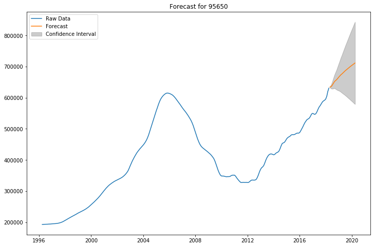


### Zip code 95650 (Loomis):  Excellent investment opportunity with limited downside and large potential upside

By the model prediction, I would expect to see a 12.756% change in price by April 1, 2020.
At the lower bound of the confidence interval, I would expect to see a -8.199% change in price by April 1, 2020.
At the upper bound of the confidence interval, I would expect to see a 33.712% change in price by April 1, 2020.


# Summary of findings

## Create summary dataframe


```python
print_lengths()
```

    geog_areas:  20
    cities:  20
    counties 20
    orders:  20
    predicted_prices:  20
    lower_bound_prices:  20
    upper_bound_prices:  20
    last_values:  20
    pred_pct_changes:  20
    lower_pct_changes:  20
    upper_pct_changes:  20


```python

print_results_lists()
```


    (['95616',
      '95619',
      '95864',
      '95831',
      '95811',
      '95818',
      '95630',
      '96140',
      '95672',
      '95636',
      '95709',
      '95746',
      '95614',
      '95663',
      '95623',
      '95747',
      '95765',
      '95602',
      '96150',
      '95650'],
     ['Davis',
      'Diamond Springs',
      'Arden-Arcade',
      'Sacramento_Pocket',
      'Sacramento_DosRios',
      'Sacramento_LandPark',
      'Folsom',
      'Carnelian Bay',
      'Rescue',
      'Somerset',
      'Camino',
      'Granite Bay',
      'Cool',
      'Penryn',
      'El Dorado',
      'Roseville',
      'Rocklin',
      'Auburn',
      'South Lake Tahoe',
      'Loomis'],
     ['Yolo',
      'El Dorado',
      'Sacramento',
      'Sacramento',
      'Sacramento',
      'Sacramento',
      'Sacramento',
      'Placer',
      'El Dorado',
      'El Dorado',
      'El Dorado',
      'Placer',
      'El Dorado',
      'Placer',
      'El Dorado',
      'Placer',
      'Placer',
      'Placer',
      'El Dorado',
      'Placer'],
     [(2, 1, 2),
      (2, 1, 2),
      (8, 0, 2),
      (6, 0, 2),
      (10, 1, 0),
      (6, 2, 2),
      (2, 2, 0),
      (4, 2, 1),
      (8, 2, 0),
      (8, 2, 1),
      (8, 0, 2),
      (6, 1, 2),
      (8, 0, 2),
      (6, 1, 1),
      (6, 1, 2),
      (4, 1, 2),
      (4, 1, 2),
      (4, 0, 2),
      (2, 1, 2),
      (8, 1, 2)],
     [717863.06,
      355774.45,
      449047.92,
      389675.07,
      570598.7,
      558380.08,
      545821.37,
      769785.39,
      766372.9,
      268239.06,
      385671.99,
      840052.01,
      434312.48,
      682869.53,
      493333.57,
      510638.14,
      569180.09,
      501842.15,
      469181.53,
      711493.45],
     [619575.34,
      275292.09,
      327568.68,
      302216.31,
      459606.77,
      418566.82,
      427964.65,
      518008.87,
      562046.69,
      148993.04,
      305444.97,
      704070.95,
      345086.19,
      550638.69,
      388402.06,
      432420.37,
      466067.8,
      399959.64,
      368777.33,
      579266.67],
     [816150.79,
      436256.81,
      570527.16,
      477133.84,
      681590.63,
      698193.34,
      663678.09,
      1021561.92,
      970699.1,
      387485.09,
      465899.01,
      976033.07,
      523538.76,
      815100.37,
      598265.08,
      588855.91,
      672292.39,
      603724.66,
      569585.73,
      843720.24],
     [692300.0,
      321100.0,
      552700.0,
      449300.0,
      567500.0,
      563900.0,
      542900.0,
      644600.0,
      579300.0,
      241200.0,
      386000.0,
      778500.0,
      423300.0,
      600700.0,
      455700.0,
      483800.0,
      509200.0,
      488700.0,
      432500.0,
      631000.0],
     [3.69,
      10.8,
      -18.75,
      -13.27,
      0.55,
      -0.98,
      0.54,
      19.42,
      32.29,
      11.21,
      -0.08,
      7.91,
      2.6,
      13.68,
      8.26,
      5.55,
      11.78,
      2.69,
      8.48,
      12.76],
     [-10.5,
      -14.27,
      -40.73,
      -32.74,
      -19.01,
      -25.77,
      -21.17,
      -19.64,
      -2.98,
      -38.23,
      -20.87,
      -9.56,
      -18.48,
      -8.33,
      -14.77,
      -10.62,
      -8.47,
      -18.16,
      -14.73,
      -8.2],
     [17.89,
      35.86,
      3.23,
      6.19,
      20.1,
      23.82,
      22.25,
      58.48,
      67.56,
      60.65,
      20.7,
      25.37,
      23.68,
      35.69,
      31.28,
      21.71,
      32.03,
      23.54,
      31.7,
      33.71])


```python
population = [45500, 4359, 92186, 42952, 1037, 7630, 21825, 74111, 1170, 4592, 1000, 4354, 22482, 3882, 2468, 3986,
             72437, 41810, 18290, 30000, 12600]
len(population)
```


```python
invest_rec = ['mediocre','good', 'poor', 'poor', 'good', 'mediocre', 'poor', 'mediocre', 'excellent', 
              'excellent', 'good', 'poor', 'good', 'mediocre', 'excellent', 'good', 'mediocre', 'excellent', 
              'excellent', 'good', 'excellent']
len(invest_rec)
```


```python
df_findings = pd.DataFrame({'ZIP code': geog_areas, '2018 value': last_values, 'City': cities, 
                            'Pop': population, 'County': counties, 'Investment rating': invest_rec, 
                            'Predicted % Change': pred_pct_changes, 'Worst Case % Change': lower_pct_changes,
                            'Best Case % Change': upper_pct_changes, 'Predicted':predicted_prices, 
                            'Worst Case':lower_bound_prices, 'Best Case':upper_bound_prices})

```


```python
df_findings
```


```python
df_findings = df_findings.set_index('ZIP code')
```


```python
df_findings
```


```python
df_findings.sort_values('Predicted % Change', ascending = False, inplace=True)
```


```python
df_findings
```

## Visualizations

### Visualization of semi-finalist ZIP codes


```python
fig, ax = plot_ts_zips(df_sac, geog_areas, nrows=11, ncols=2, figsize=(18, 50), legend=True)

```

### Visualization of semi-finalist ZIP codes, labeled with ZIP *AND* city


#### Create function to automate plotting of semifinalist ZIP codes with city and ZIP labels


```python
def zip_semifinalists(df, dict_zip_city, col = 'value', nrows=11, ncols=2, figsize=(18, 40), legend=True):

    fig = plt.figure(figsize=figsize)

    for i, key in enumerate(dict_zip_city.keys(), start=1):
        ax = fig.add_subplot(nrows, ncols, i)   
        ts = df[col].loc[df['Zip'] == dict_zip_city[key]]
        ts = ts.rename(dict_zip_city[key])
        try: 
            max_ = ts.loc['2004':'2011'].idxmax()  
        except:
            continue

        crash = '01-2009'
        min_ = ts.loc[crash:].idxmin()
        val_2003 = ts.loc['2003-01-01']
        ts.plot(ax=ax, fontsize=12)   
        plt.title(f'{key} ({dict_zip_city[key]})', fontsize=16)
        plt.xlabel('')

        ax.axvline(max_, label = 'Maximum value during bubble', color = 'orange', ls=':')               
        ax.axvline(crash, label = 'Housing market declines', color='black')                         
        ax.axvline(min_, label = 'Minimum value after crash', color = 'red', ls=':')
        ax.axhline(val_2003, label='Value on 2003-01-01', color = 'blue', ls='-.', alpha=0.15)

        if legend:
            ax.legend(loc='upper left', prop={'size': 10})

        fig.tight_layout()
        
    return fig, ax

```

#### Create dictionary of each ZIP code and the city to which it belongs


```python
dict_semifinal_city_zip = dict(zip(cities, geog_areas))
```


```python
dict_semifinal_city_zip
```


```python
dict_semifinal_city_zip = dict(sorted(dict_semifinal_city_zip.items()))
```


```python
dict_semifinal_city_zip
```


```python
len(dict_semifinal_city_zip)
```

#### Run function to generate plots for all ZIP codes


```python
zip_semifinalists(df_sac, dict_semifinal_city_zip, col = 'value', nrows=11, ncols=2, figsize=(18, 40), legend=True);
```

### Create 6 ZIP plots at one time (PowerPoint-friendlier format)

#### Need to first create subset dictionaries to plot over


```python
def return_slice(dictionary, m, n):
    sub_dict = {k: dictionary[k] for k in list(dictionary)[m:n]}
    return sub_dict

```


```python
dict_semi_0_6 = return_slice(dict_semifinal_city_zip, 0, 6)
dict_semi_0_6
```


```python
dict_semi_6_12 = return_slice(dict_semifinal_city_zip, 6, 12)
dict_semi_6_12
```


```python
dict_semi_12_18 = return_slice(dict_semifinal_city_zip, 12, 18)
dict_semi_12_18
```


```python
dict_semi_18_21 = return_slice(dict_semifinal_city_zip, 18, 21)
dict_semi_18_21
```

#### Run function on subset dictionaries


```python
zip_semifinalists(df_sac, dict_semi_0_6, col = 'value', nrows=3, ncols=2, figsize=(16, 12), legend=True);
```


```python
zip_semifinalists(df_sac, dict_semi_6_12, col = 'value', nrows=3, ncols=2, figsize=(16, 12), legend=True);
```


```python
zip_semifinalists(df_sac, dict_semi_12_18, col = 'value', nrows=3, ncols=2, figsize=(16, 12), legend=True);
```


```python
zip_semifinalists(df_sac, dict_semi_18_21, col = 'value', nrows=3, ncols=2, figsize=(16, 12), legend=True);
```

## Recommended ZIP Codes

### Decision-making process

*First,* I sorted ZIP codes based on __predicted return__.  This is how the summary table is sorted.  

*Second,* I considered the potential __worst-case valuation scenario__.  
- There are a few ZIP codes that have relatively good predicted valuations over the two-year time horizon, but also have substantial potential downside.  Examples include Carnelian Bay, Somerset, Diamond Springs, Tahoma, El Dorado, and Roseville.  
- Because of the significant possible downsides of these ZIP codes, I put them in the 'maybe' column.  I subsequently removed them after the considerations below.

*Third,* I reviewed the potential __best-case valuation scenario,__ just to see how much potential upside the ZIP code could yield.  
- Since time series predictions are so uncertain--as illustrated by the large differences between the upper bound and lower bound values--I don't put much weight on the upper end of potential yields.  
- Predicted values as well as downside risk are more important, but looking at the best-case scenario can suggest whether a higher return is more likely.  

*Finally,* I looked at the __population__ in each ZIP code, as well as the __geographic location__ of the ZIP code.  Doing this caused me to modify my initial assessment (and prompted me to analyze more ZIP codes).  
- Several of the "maybe"s on the chart are for very small towns clustered around Lake Tahoe.  I would recommend against selecting more than one of these ZIP codes for the top 5.  
   - For one thing, the towns are very small, so the pool of potential investment opportunities in each is small. 
   - For another thing, many of the homes in these towns are vacation homes, so a significant economic downturn could cause a significant drop in prices.  
   - Third, the region's economy is based almost entirely on tourism (especially skiing in the winter and water sports in the summer).  Economic downturns could depress housing values in the near term, while larger trends such as climate change may have a significant long-term effect (e.g., less natural snowpack in the winter). 


### Top 5 ZIP codes the Sacramento Metro region:

1.  *Rescue, CA (95672).*  While the population is fairly small, average home values are high.  Home values for the ZIP code in 4/1/2020 are forecasted to be ___32% higher___ than they are now.  Furthermore, the downside is very limited (~3%) and the upside is potentially large (68%).

2.  *Penryn, CA (95663).*  The population here is small, but average home values are even higher than Rescue.  While Rescue is in El Dorado County, Penryn is in Placer County, offering a bit of geographic diversity.  Penryn's home values are predicted to rise ___almost 14% higher___ by 4/1/2020.  Downside is limited (8.3% at the lower bound) and upside is potentially substantial (over 35%).  

3.  *Auburn, CA (95602).* Auburn's population is significantly larger than the first two, offering additional investment opportunities and stablity within one ZIP code.  Its location in the foothills of the Sierra Nevada is desireable for many homebuyers, as evidenced by the average home value.  Home values are predicted to ___increase 11.8%___ over 24 months, with minimal downside (-8% at the lower bound) and substantial potential upside (31.6%).

4.  *Rocklin, CA (95765).*  This ZIP code's population (almost 42,000) is larger than Auburn, Rescue, and Penryn put together, and so offers a wider range of opportunities, both expensive and affordable.  The model predicts an ___11.8% increase___ in home values, with a potential lower-bound downside of -8.5% and a large potential upside at 32%.  

5.  *Granite Bay, CA (95746).*  This ZIP code represents an affluent community on the west-northwest side of Folsom Lake.  Home values in this very desireable location are expected to ___increase 7.9%___, with a potential downside of -9.6% and significant possible upside of 25.4%


### Maps

#### Sacramento metro area county map

<center>

#### El Dorado County

<center>

#### Placer County

<center>

#### Rescue, CA (95672) ZIP code map (El Dorado County)  (https://california.hometownlocator.com/)

<center>

#### Penryn, CA (95663) ZIP code map (Placer County) (https://california.hometownlocator.com/)

<center>

#### Auburn, CA (95602) ZIP code map (Placer County) (https://california.hometownlocator.com/)

<center>

#### Rocklin, CA (95765) ZIP code map (Placer County) (https://california.hometownlocator.com/)

<center>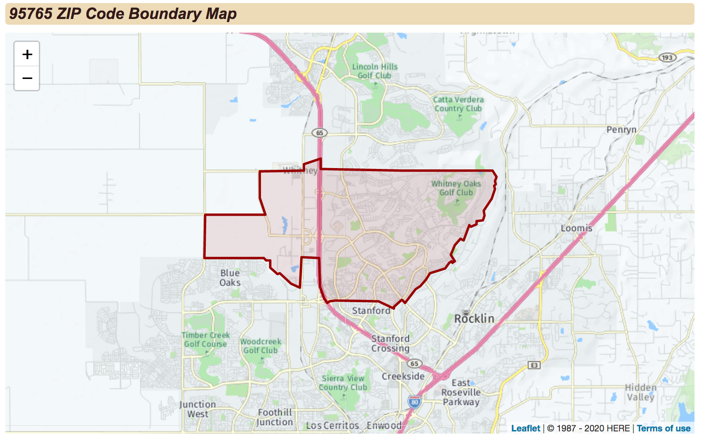

#### Granite Bay, CA (95746) ZIP code map (Placer County) (https://california.hometownlocator.com/)

<center>

# Ancillary functions

## Search metro area by str.contains


```python
# df_metro_values[df_metro_values['MetroState'].str.contains('New York', regex=False)]

```

## Creating df_metro_values (US Metros df with *Metro* mean values)


```python
df_metro_values = df_melt.groupby(['MetroState', 'State', 'time']).mean().reset_index()
```


```python
df_metro_values.head()
```


```python
df_metro_values = df_metro_values.set_index('time')
```


```python
df_metro_values.drop('SizeRank', axis=1, inplace=True)
```


```python
df_metro_values.head()
```


```python
df_metro_values.MetroState.value_counts().head()
```


```python
df_metro_values.nunique()
```


```python
df_metro_values.info()
```

## df_geog:  Function for creating a dataframe based on particular geographic unit (e.g., MetroState area, City, CountyName)


```python
def df_geog(df, col, geog):
    
    '''Creates subset dataframe containing just the geographic unit 
    (e.g., 'MetroState' == 'Sacramento CA', 'City' == 'Davis', etc.) of interest.  
    It is necessary to set df equal to a dataframe with the appropriate geographic grouping: 
    e.g., to plot values by city in a metro aree, df = df_metro_cities, col = 'MetroState',
    geog = 'Sacramento CA' (or metro area of interest). 
    '''
    df_metro_cities_geog = df.loc[df[col] == geog]
    return df_metro_cities_geog

```

## Plotting functions

### Plotting function:  plot_single_geog function (plots a single geographic unit)


```python
# Be sure to use df with appropriate value grouping (e.g., metro, city, zip)

def plot_single_geog(df, col = 'value', col2 = 'MetroState', metunit = 'Sacramento CA', figsize=(12, 6), fontsize1=12, fontsize2=16):
    
    ''' Plots housing values for individual geographic unit, e.g., MetroState, City, County.  
    Be sure to use the appropriate dataframe for the selected grouping (df_metro_cities for 
    cities in a metro area, for example).  Specify nrows, ncols, and figsize to match size of list.
    '''
    
    ts = df[col].loc[df[col2] == metunit]
    ax = ts.plot(figsize=figsize, title = metunit, fontsize=fontsize2, label = 'Raw Price')
    plt.xlabel('')

    max_ = ts.loc['2004':'2010'].idxmax()  
    crash = '01-2009'
    min_ = ts.loc[crash:].idxmin()
    val_2003 = ts.loc['2003-01-01']

    ax.axvline(max_, label='Max price during bubble', color = 'green', ls=':')
    ax.axvline(crash, label = 'Housing Index Drops', color='red', ls=':')
    ax.axvline(min_, label=f'Min price post-crash {min_}', color = 'black', ls=':')
    ax.axhline(val_2003, label='Value on 2003-01-01', color = 'blue', ls='-.', alpha=0.15)

    ax.legend(loc='upper left', fontsize=fontsize1)


```

### Plotting function:  Combining line plot, boxplot, ACF, PACF, and seasonal decomposition


```python
# doesn't work in current form

def plotting_eda(df, geog_area, col1='value', col2 = 'Zip', figsize_plot = (12, 6), fontsize1=14, 
                 fontsize2=18, figsize_box=(8, 4), figsize_acf = (10, 6), legend=True, 
                 set_ylim = False, ylim = 800000, lags=15):
    
    from statsmodels.tsa.seasonal import seasonal_decompose
    from statsmodels.graphics.tsaplots import plot_acf, plot_pacf
    from pandas.plotting import autocorrelation_plot, lag_plot
    
#     ts = df[col1].loc[df[col2] == geog_area]
    single_zip_boxplot(df, geog_area, figsize=figsize_box)    
    plot_single_geog(df, geog_area, col1, col2, figsize=figsize_plot)
    plot_acf_pacf(ts, figsize_acf, lags)
    plot_seasonal_decomp(ts)
    
```


```python

```

## ARIMA modeling and forecasting results


```python
p_values = [0, 1, 2, 4, 8, 10]
d_values = range(0, 3)
q_values = range(0, 3)

# geog_areas = []
# cities = []
# orders = []
# predicted_prices = []
# lower_bound_prices = [] 
# upper_bound_prices = []
# last_values = []
# pred_pct_changes = []
# lower_pct_changes = []
# upper_pct_changes = []


def arima_forecast(ts, city, geog_area, p_values, d_values, q_values, best_pdq, confint=2, run_pdq = False):     # months = 24 by default
    geog_areas.append(geog_area)
    cities.append(city)
    
    # evaluate parameters
    print(f'For {geog_area} ({city}):')
    p_values = [0, 1, 2, 4, 8, 10]
    d_values = range(0, 3)
    q_values = range(0, 3)
    warnings.filterwarnings("ignore")
    
    if run_pdq:
        best_cfg, best_score = eval_arima_models(ts, p_values, d_values, q_values)     # returns order (variable best_cfg)
        order = best_cfg
    else:
        order = best_pdq
        
    print(f'Best ARIMA order = {order}')
    model_fit = arima_zipcode(ts, order)                                # returns model_fit
    actual_forecast, forecast_confint, std_error = forecast(model_fit)  # returns actual_forecast, forecast_confint, std_error
    df_forecast = forecast_df(actual_forecast, std_error, forecast_confint, col = 'time',     # returns df_forecast with future predictions
                              daterange = pd.date_range(start='2018-05-01', end='2020-04-01', freq='MS'))
    df_new = concat_values_forecast(ts, df_forecast)                    # concatenates historical and forecasted values into df_new
    plot_forecast(df_new, geog_area)                            # plots forecast with the label of geog_area
    forecasted_price, forecasted_lower, forecasted_upper = forecast_values(df_new, date = '2020-04-01')   # returns forecasted_price, forecasted_lower, forecasted_upper
    pred = forecasted_price
    low = forecasted_lower
    high = forecasted_upper
    last = df_new['value'].loc['2018-04-01']
    pred_pct_change = (((pred - last) / last) * 100)
    print(f'By the model prediction, I would expect to see a {round(pred_pct_change, 3)}% change in price by April 1, 2020.')
    lower_pct_change = (((low - last) / last) * 100)
    print(f'At the lower bound of the confidence interval, I would expect to see a {round(lower_pct_change, 3)}% change in price by April 1, 2020.')
    upper_pct_change = (((high - last) / last) * 100)
    print(f'At the upper bound of the confidence interval, I would expect to see a {round(upper_pct_change, 3)}% change in price by April 1, 2020.')
#     print(round(pred_pct_change, 3), round(lower_pct_change, 3), round(upper_pct_change, 3))
#     pred_pct_change, lower_pct_change, upper_pct_change = pred_best_worst(pred, low, high, last)
#                                                                 # returns predicted, worst-case (2 conf. intervals below),     
#                                                                 # and best-case (2 conf. intervals above) values
    orders.append(order)
    predicted_prices.append(forecasted_price)
    lower_bound_prices.append(forecasted_lower)
    upper_bound_prices.append(forecasted_upper)
    last_values.append(last)
    pred_pct_changes.append(pred_pct_change)
    lower_pct_changes.append(lower_pct_change)
    upper_pct_changes.append(upper_pct_change)
    return geog_areas, cities, orders, predicted_prices, lower_bound_prices, upper_bound_prices, last_values, pred_pct_changes, lower_pct_changes, upper_pct_changes
#     return geog_areas, cities, orders, predicted_prices, lower_bound_prices, upper_bound_prices, last_values, pred_pct_changes, lower_pct_changes, upper_pct_changes
           # returns the following as lists:  geog_areas, cities, orders, predicted_prices, lower_bound_prices, 
           # upper_bound_prices, last_values, pred_pct_changes, lower_pct_changes, upper_pct_changes

```

## Parameter fine-tuning function


```python
# def arima_predict_error(X, arima_order):
#     train_size = int(len(X) * .85)
#     train, test = X[0:train_size], X[train_size:]
#     predictions = list()
#     history = [x for x in train]
#     for t in range(len(test)):
#         model = ARIMA(history, order=arima_order)
#         model_fit = model.fit(disp=0)
#         y_hat = model_fit.forecast()[0]
#         predictions.append(y_hat)
#         history.append(test[t])
#     error = mean_squared_error(test, predictions)
#     return error

# def eval_arima_models(dataset, p_values, d_values, q_values):
#     dataset_value = dataset['value']
#     dataset_value = dataset_value.astype('float32')
# #     best_score, best_cfg = float("inf"), None
#     for p in p_values:
#         for d in d_values:
#             for q in q_values:
#                 order = (p,d,q)
#                 try:
#                     mse = arima_predict_error(dataset_value, order)
#                     if mse < best_score:
#                         best_score, best_cfg = mse, order
#                     print('ARIMA%s MSE=%.3f' % (order,mse))
#                 except:
#                     continue
#     print('Best ARIMA%s MSE=%.3f' % (best_cfg, best_score))
#     return best_cfg, best_score

```


```python
# def arima_predict_error(X, arima_order):
#     train_size = int(len(X) * .85)
#     train, test = X[0:train_size], X[train_size:]
#     predictions = list()
#     history = [x for x in train]
#     for t in range(len(test)):
#         model = ARIMA(history, order=arima_order)
#         model_fit = model.fit(disp=0)
#         y_hat = model_fit.forecast()[0]
#         predictions.append(y_hat)
#         history.append(test[t])
#     error = mean_squared_error(test, predictions)
#     return error


```


```python
# def eval_arima_models(ts, p_values, d_values, q_values):
#     ts_value = ts['value']
#     ts_value = ts_value.astype('float32')
# #     best_score, best_cfg = float("inf"), None
#     for p in p_values:
#         for d in d_values:
#             for q in q_values:
#                 order = (p,d,q)
#                 try:
#                     mse = arima_predict_error(ts_value, order)
#                     if mse < best_score:
#                         best_score, best_cfg = mse, order
#                     print('ARIMA%s MSE=%.3f' % (order,mse))
#                 except:
#                     continue
#     print('Best ARIMA%s MSE=%.3f' % (best_cfg, best_score))
#     return best_cfg, best_score

```


```python
# Original function from Jeff's Mod4 project starter notebook 


# import warnings
# from statsmodels.tsa.arima_model import ARIMA
# from sklearn.metrics import mean_squared_error

# # evaluate an ARIMA model for a given order (p,d,q)
# def evaluate_arima_model(X, arima_order):
#     # prepare training dataset
#     train_size = int(len(X) * 0.66)
#     train, test = X[0:train_size], X[train_size:]
#     history = [x for x in train]
#     # make predictions
#     predictions = list()
#     for t in range(len(test)):
#         model = ARIMA(history, order=arima_order)
#         model_fit = model.fit(disp=0)
#         yhat = model_fit.forecast()[0]
#         predictions.append(yhat)
#         history.append(test[t])
#     # calculate out of sample error
#     error = mean_squared_error(test, predictions)
#     return error

# # evaluate combinations of p, d and q values for an ARIMA model
# def evaluate_models(dataset, p_values, d_values, q_values):
#     dataset = dataset.astype('float32')
#     best_score, best_cfg = float("inf"), None
#     for p in p_values:
#         for d in d_values:
#             for q in q_values:
#                 order = (p,d,q)
#                 try:
#                     mse = evaluate_arima_model(dataset, order)
#                     if mse < best_score:
#                         best_score, best_cfg = mse, order
#                     print('ARIMA%s MSE=%.3f' % (order,mse))
#                 except:
#                     continue
#     print('Best ARIMA%s MSE=%.3f' % (best_cfg, best_score))
#     return best_cfg, best_score   # adding to Jeff's function; output will be taken into forecast function that follows


# # evaluate parameters
# p_values = [0, 1, 2, 4, 6, 8, 10]
# d_values = range(0, 3)
# q_values = range(0, 3)
# warnings.filterwarnings("ignore")
# # evaluate_models(df_kc_melt.values, p_values, d_values, q_values)
```

### ARIMA model fit


```python
model_fit = arima_zipcode(ts, order = order)
```

### ARIMA forecast function -- run parameter optimization


```python
# def arima_predict_error(X, arima_order):
#     train_size = int(len(X) * .85)
#     train, test = X[0:train_size], X[train_size:]
#     predictions = list()
#     history = [x for x in train]
#     for t in range(len(test)):
#         model = ARIMA(history, order = arima_order)
#         model_fit = model.fit(disp=0)
#         y_hat = model_fit.forecast()[0]
#         predictions.append(y_hat)
#         history.append(test[t])
#     error = mean_squared_error(test, predictions)
#     return error

# def eval_arima_models(ts, p_values, d_values, q_values):
#     ts_value = ts['value']
#     ts_value = ts_value.astype('float32')
#     best_score, best_cfg = float("inf"), None
#     for p in p_values:
#         for d in d_values:
#             for q in q_values:
#                 order = (p,d,q)
#                 try:
#                     mse = arima_predict_error(ts_value, order)
#                     if mse < best_score:
#                         best_score, best_cfg = mse, order
#                     print('ARIMA%s MSE=%.3f' % (order,mse))
#                 except:
#                     continue
#     print('Best ARIMA%s MSE=%.3f' % (best_cfg, best_score))
#     return best_cfg, best_score


p_values = [0, 1, 2, 4, 6, 8, 10]
d_values = range(0, 3)
q_values = range(0, 3)

def arima_forecast_run_pdq(ts, geog_area, city, county, p_values, d_values, q_values, confint=2):     # months = 24 by default
    
    # evaluate parameters
    print(f'For {geog_area} ({city}):')
    p_values = [0, 1, 2, 4, 6, 8, 10]
    d_values = range(0, 3)
    q_values = range(0, 3)
    warnings.filterwarnings("ignore")
    
    eval_arima_models(ts, p_values, d_values, q_values)     # returns order (variable best_cfg)
    order = best_cfg
    
    print(f'Best ARIMA order = {order}')
    model_fit = arima_zipcode(ts, order)                                # returns model_fit
    actual_forecast, forecast_confint, std_error = forecast(model_fit)  # returns actual_forecast, forecast_confint, std_error
    df_forecast = forecast_df(actual_forecast, std_error, forecast_confint, col = 'time',     # returns df_forecast with future predictions
                              daterange = pd.date_range(start='2018-05-01', end='2020-04-01', freq='MS'))
    df_new = concat_values_forecast(ts, df_forecast)                    # concatenates historical and forecasted values into df_new
    plot_forecast(df_new, geog_area)                            # plots forecast with the label of geog_area
    forecasted_price, forecasted_lower, forecasted_upper = forecast_values(df_new, date = '2020-04-01')   # returns forecasted_price, forecasted_lower, forecasted_upper
    pred = forecasted_price
    low = forecasted_lower
    high = forecasted_upper
    last = df_new['value'].loc['2018-04-01']
    pred_pct_change = (((pred - last) / last) * 100)
    lower_pct_change = (((low - last) / last) * 100)
    upper_pct_change = (((high - last) / last) * 100)
       
    geog_areas.append(geog_area)
    cities.append(city)
    counties.append(county)
    orders.append(order)
    predicted_prices.append(round(forecasted_price, 2))
    lower_bound_prices.append(round(forecasted_lower, 2))
    upper_bound_prices.append(round(forecasted_upper, 2))
    last_values.append(last)
    pred_pct_changes.append(round(pred_pct_change, 2))
    lower_pct_changes.append(round(lower_pct_change, 2))
    upper_pct_changes.append(round(upper_pct_change, 2))
    
    print(f'By the model prediction, I would expect to see a {round(pred_pct_change, 3)}% change in price by April 1, 2020.')
    print(f'At the lower bound of the confidence interval, I would expect to see a {round(lower_pct_change, 3)}% change in price by April 1, 2020.')
    print(f'At the upper bound of the confidence interval, I would expect to see a {round(upper_pct_change, 3)}% change in price by April 1, 2020.')

    return geog_areas, cities, counties, orders, predicted_prices, lower_bound_prices, upper_bound_prices, last_values, pred_pct_changes, lower_pct_changes, upper_pct_changes

```


```python
# original function

p_values = [0, 1, 2, 4, 6, 8, 10]
d_values = range(0, 3)
q_values = range(0, 3)

def arima_forecast(ts, geog_area, city, county, p_values, d_values, q_values, best_pdq, confint=2, run_pdq = False):     # months = 24 by default
    
    # evaluate parameters
    print(f'For {geog_area} ({city}):')
    p_values = [0, 1, 2, 4, 6, 8, 10]
    d_values = range(0, 3)
    q_values = range(0, 3)
    warnings.filterwarnings("ignore")
    
    if run_pdq:
        best_cfg, best_score = eval_arima_models(ts, p_values, d_values, q_values)     # returns order (variable best_cfg)
        order = best_cfg
    else:
        order = best_pdq
        
    print(f'Best ARIMA order = {order}')
    model_fit = arima_zipcode(ts, order)                                # returns model_fit
    actual_forecast, forecast_confint, std_error = forecast(model_fit)  # returns actual_forecast, forecast_confint, std_error
    df_forecast = forecast_df(actual_forecast, std_error, forecast_confint, col = 'time',     # returns df_forecast with future predictions
                              daterange = pd.date_range(start='2018-05-01', end='2020-04-01', freq='MS'))
    df_new = concat_values_forecast(ts, df_forecast)                    # concatenates historical and forecasted values into df_new
    plot_forecast(df_new, geog_area)                            # plots forecast with the label of geog_area
    forecasted_price, forecasted_lower, forecasted_upper = forecast_values(df_new, date = '2020-04-01')   # returns forecasted_price, forecasted_lower, forecasted_upper
    pred = forecasted_price
    low = forecasted_lower
    high = forecasted_upper
    last = df_new['value'].loc['2018-04-01']
    pred_pct_change = (((pred - last) / last) * 100)
    lower_pct_change = (((low - last) / last) * 100)
    upper_pct_change = (((high - last) / last) * 100)
       
    geog_areas.append(geog_area)
    cities.append(city)
    counties.append(county)
    orders.append(order)
    predicted_prices.append(round(forecasted_price, 2))
    lower_bound_prices.append(round(forecasted_lower, 2))
    upper_bound_prices.append(round(forecasted_upper, 2))
    last_values.append(last)
    pred_pct_changes.append(round(pred_pct_change, 2))
    lower_pct_changes.append(round(lower_pct_change, 2))
    upper_pct_changes.append(round(upper_pct_change, 2))
    
    print(f'By the model prediction, I would expect to see a {round(pred_pct_change, 3)}% change in price by April 1, 2020.')
    print(f'At the lower bound of the confidence interval, I would expect to see a {round(lower_pct_change, 3)}% change in price by April 1, 2020.')
    print(f'At the upper bound of the confidence interval, I would expect to see a {round(upper_pct_change, 3)}% change in price by April 1, 2020.')

    return geog_areas, cities, counties, orders, predicted_prices, lower_bound_prices, upper_bound_prices, last_values, pred_pct_changes, lower_pct_changes, upper_pct_changes

```

### Create forecast model


```python
# actual_forecast, std_error, forecast_confint  
```

### Create dataframe to hold these values and join to existing dataframe


```python
# df_forecast = forecast_df(actual_forecast, forecast_confint, std_error)
```

### Create df_new with historical and forecasted values


```python
def concat_values_forecast(ts, df_forecast):
    df_new = pd.concat([ts, df_forecast])
    df_new = df_new.rename(columns = {0: 'value'})
    return df_new
```


```python
# df_new = concat_values_forecast(ts, df_forecast)
```


```python
# df_new.head()
```

### Plot forecast results


```python
# Define function

def plot_forecast(df, figsize=(12,8), geog_area='95616'):
    fig = plt.figure(figsize=figsize)
    plt.plot(df['value'], label='Raw Data')
    plt.plot(df['forecast'], label='Forecast')
    plt.fill_between(df.index, df['forecast_lower'], df['forecast_upper'], color='k', alpha = 0.2, 
                 label='Confidence Interval')
    plt.legend(loc = 'upper left')
    plt.title(f'Forecast for {geog_area}')

```


```python
# plot_forecast(df_new)
```

### Figure out percent change in home values


```python
# Define functions

def forecast_values(df=df, date = '2020-04-01'):
    forecasted_price = df.loc[date, 'forecast']
    forecasted_lower = df.loc[date, 'forecast_lower']
    forecasted_upper = df.loc[date, 'forecast_upper']    
    return forecasted_price, forecasted_lower, forecasted_upper

```


```python
# forecasted_price, forecasted_lower, forecasted_upper = forecast_values(df_new)
```


```python
# forecasted_price, forecasted_lower, forecasted_upper
```


```python
def last_value(df, date = '2018-04-01'):
    last_value = df.loc[date, 'value']
    return last_value

```


```python
# last_value = last_value(df_new)
```


```python
# last_value
```

### Compute and print predicted, best, and worst case scenarios


```python
def pred_best_worst(pred, low, high, last, date='April 1, 2020'):
    
    '''Prints out predicted, best-case, and worst-case scencarios from forecast'''
    
    pred_pct_change = (((pred - last) / last) * 100)
    print(f'By the model prediction, I would expect to see a {round(pred_pct_change, 3)}% change in price by April 1, 2020.')
    lower_pct_change = ((low - last) / last) * 100
    print(f'At the lower bound of the confidence interval, I would expect to see a {round(lower_pct_change, 3)}% change in price by April 1, 2020.')
    upper_pct_change = ((high - last) / last) * 100
    print(f'At the upper bound of the confidence interval, I would expect to see a {round(upper_pct_change, 3)}% change in price by April 1, 2020.')
    return round(pred_pct_change, 3), round(lower_pct_change, 3), round(upper_pct_change, 3)
        
```


```python
# pred, lower, upper = pred_best_worst(pred=forecasted_price, low=forecasted_lower, high=forecasted_upper, last=last_value, date='April 1, 2020')

```

### Lists and construction of dataframe (old)


```python
zipcodes = ['95616', '95619', '95864', '95831', '96142', '95811', '95818', '95630', '96140', '95672', '95636', 
            '95709','95746', '95614', '95663', '95623', '95747', '95765', '95602', '96150' , '95650']
len(zipcodes)
```


```python
last_value_2018 = [last_value_95616, last_value_95619, last_value_95864, last_value_95831, last_value_96142, last_value_95811,
                  last_value_95818, last_value_95630, last_value_96140, last_value_95672, last_value_95636, last_value_95709,
                  last_value_95746, last_value_95614, last_value_95663, last_value_95623, last_value_95747, last_value_95765, 
                   last_value_95602, last_value_96150, last_value_95650]
```


```python
len(last_value_2018)
# last_value_2018
```


```python
cities = ['Davis', 'Diamond Springs', 'Arden-Arcade', 'Sacramento_Pocket', 'Tahoma', 'Sacramento_DosRios', 'Sacramento_LandPark', 'Folsom', 
          'Carnelian Bay', 'Rescue', 'Somerset', 'Camino', 'Granite Bay', 'Cool', 'Penryn', 'El Dorado', 
         'Roseville', 'Rocklin', 'Auburn', 'South Lake Tahoe', 'Loomis']
len(cities)
cities
```


```python
county = ['Yolo', 'El Dorado', 'Sacramento', 'Sacramento', 'El Dorado', 'Sacramento', 'Sacramento', 'Sacramento', 
          'Placer', 'El Dorado', 'El Dorado', 'El Dorado', 'Placer', 'El Dorado', 'Placer', 'El Dorado', 
          'Placer', 'Placer', 'Placer', 'El Dorado', 'Placer']
print(len(county))
```


```python
pred_value_pct_change = [davis_95616_pred, diamond_springs_95619_pred, arden_95864_pred, sac_pocket_95831_pred, tahoma_96142_pred, 
              sac_95811_pred, sac_95818_pred, folsom_95630_pred, cb_96140_pred, rescue_95672_pred, 
              somerset_95636_pred, camino_95709_pred, gb_95746_pred, cool_95614_pred, penryn_95663_pred, 
             eldorado_95623_pred, roseville_95747_pred, rocklin_95765_pred, auburn_95602_pred, slt_96150_pred, loomis_95650_pred]

```


```python
len(pred_value_pct_change)
```


```python
worst_case_pct_change = [davis_95616_lower, diamond_springs_95619_low, arden_95864_low, sac_pocket_95831_low, tahoma_96142_low, 
              sac_95811_low, sac_95818_low, folsom_95630_low, cb_96140_low, rescue_95672_low, 
              somerset_95636_low, camino_95709_low, gb_95746_low, cool_95614_low, penryn_95663_low, eldorado_95623_low, 
             roseville_95747_low, rocklin_95765_low, auburn_95602_low, slt_96150_low, loomis_95650_low]
```


```python
len(worst_case_pct_change)
```


```python
best_case_pct_change = [davis_95616_upper, diamond_springs_95619_high, arden_95864_high, sac_pocket_95831_high, tahoma_96142_high, 
             sac_95811_high, sac_95818_high, folsom_95630_high, cb_96140_high, rescue_95672_high, 
             somerset_95636_high, camino_95709_high, gb_95746_high, cool_95614_high, penryn_95663_high, eldorado_95623_high, 
            roseville_95747_high, rocklin_95765_high, auburn_95602_high, slt_96150_high, loomis_95650_high]
```


```python
len(best_case_pct_change)
```


```python
df_findings = pd.DataFrame({'ZIP code': zipcodes, '2018 value': last_value_2018, 'City': cities, 'Pop': population, 'County': county, 
                            'Investment rating': invest_rec, 'Predicted':pred_value_pct_change, 'Worst Case':worst_case_pct_change, 
                            'Best Case':best_case_pct_change})
```


```python
df_findings
```


```python
df_findings.set_index('ZIP code', inplace=True)
```


```python

```

# Notebook spacer

# Notebook spacer

# Notebook spacer
